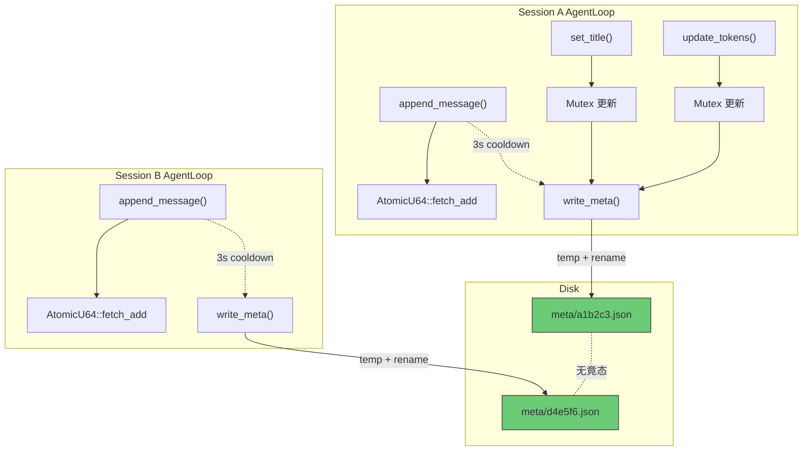

# ADR-024：Session Metadata 与 Index 合并，对话文件去 header

**状态**：草案
**日期**：2026-07-03
**决策者**：架构讨论
**影响范围**：

- `core/acowork-runtime/src/conversation.rs`（核心变更：`ConversationWriter` 简化为纯追加写入器，`ConversationSession` 改写到 meta 文件）
- `core/acowork-runtime/src/agent/session/restorer.rs`（元数据读取路径从 JSONL header 切换到 meta 文件）
- `core/acowork-runtime/src/agent_config.rs`（`AgentConfig` 新增 `max_sessions` 字段）
- `core/acowork-runtime/src/config.rs`（默认值 1000 → 2000）
- `core/acowork-runtime/src/cli.rs`（扫描/列表接口适配；`RuntimeConfigUpdate` 处理 `max_sessions`）
- `core/acowork-core/src/protocol.rs`（`RuntimeConfigUpdate` 新增 `max_sessions` 字段）
- `core/acowork-core/src/proto_bridge.rs`（gRPC 序列化适配）
- `core/acowork-gateway/src/http/agent_config.rs`（`UpdateAgentConfigRequest` 新增 `max_sessions`）
- `core/acowork-gateway/src/http/agents.rs`（`AgentConfigResponse` 返回 `max_sessions`）
- `apps/acowork-desktop/src/stores/chatStore.ts`（行号坐标从 1-based 变为 0-based：原 line 0 是 metadata header，变后 line 0 是第一条消息）
- 与 ADR-021 互补：坐标系统简化

---

## 背景

### 当前两份重复数据

ACowork 的 Session 元数据当前存储在两个位置，存在显著重复：

**位置 A：JSONL 文件第一行 (`SessionMetadata`)**

```rust
pub struct SessionMetadata {
    pub version: u32,
    pub session_id: String,
    pub agent_id: String,
    pub created_at: String,
    pub title: Option<String>,
    pub updated_at: Option<String>,
    pub message_count: Option<u32>,
    pub corrupted: bool,
    pub workspace_id: Option<String>,
    pub model: Option<String>,
    pub provider: Option<String>,
    pub reasoning_effort: Option<String>,
    pub temperature: Option<f32>,
    pub last_input_tokens: Option<u64>,
    pub last_output_tokens: Option<u64>,
    pub last_compaction_offset: Option<u64>,
}
```

**位置 B：`conversations/index.json` (`SessionIndexEntry`)**

```rust
struct SessionIndexEntry {
    pub title: Option<String>,
    pub created_at: String,
    pub last_active_at: String,
    pub message_count: u64,
    pub workspace_id: Option<String>,
    pub model: Option<String>,
    pub provider: Option<String>,
    pub corrupted: bool,
}
```

### 重复字段（7 个）

`title`, `created_at`, `message_count`, `workspace_id`, `model`, `provider`, `corrupted`

### 问题

```mermaid
graph TD
    subgraph "更新 Session Title"
        A1["set_title()"] --> A2["构建 SessionMetadata<br/>（需要拼装所有字段）"]
        A2 --> A3["rewrite_metadata()<br/>读全文件 → 替换首行 → 写临时文件 → rename → reopen"]
        A3 --> A4["update_index_entry()<br/>读 index.json → 写临时文件 → rename"]
    end

    subgraph "更新 tokens"
        B1["update_tokens()"] --> B2["构建 SessionMetadata"]
        B2 --> B3["rewrite_metadata()"]
        B3 --> B4["（不触发 index 更新）"]
    end

    subgraph "更新 message_count"
        C1["append_message()"] --> C2["构建 SessionMetadata"]
        C2 --> C3["rewrite_metadata()"]
        C3 --> C4["update_index_entry()<br/>（3s cooldown）"]
    end

    style A3 fill:#ff6b6b,stroke:#333,color:#fff
    style A4 fill:#ff6b6b,stroke:#333,color:#fff
```



核心痛点：

1. **`rewrite_metadata()` 代价高**：读整个 JSONL 文件 → 替换第一行 → 写临时文件 → `rename` → 重新 `open` 文件句柄。改 20 字节的 title 要重写整个文件。
2. **两份数据不同步**：`SessionMetadata` 和 `SessionIndexEntry` 通过两个独立的写入路径维护，各有各的 cooldown 和触发条件，实际上已经不一致（例如 `last_active_at` 只在 index 里有，`temperature` 只在 JSONL header 里有）。
3. **`index.json` 的 load-modify-write 竟态**：当前注释坦然承认 "last writer wins"——这在有 JSONL header 兜底时可以接受，但如果去掉 header 把全部 metadata 放到 index.json，这就不可接受了。
4. **ADR-021 的行号坐标不干净**：`line_number=0` 是 metadata header，实际对话从 `line_number=1` 开始。

---

## 目标

1. **合并两份重复数据**：`SessionMetadata` + `SessionIndexEntry` → 统一的 `SessionMeta`，存放在 `conversations/meta/{session_id}.json`
2. **对话文件去 header**：JSONL 变成纯追加密的对话数据流（Line 0 = 第一条消息），彻底移除 `rewrite_metadata` 操作
3. **消除跨 session 竟态**：每个 session 只写自己的 `meta/{session_id}.json`，天然 single-writer
4. **归档替代删除**：超过 `max_sessions` 时迁移到 `archived/` 而非 `remove_file`
5. **兼容 ADR-021**：行号坐标与纯数据 JSONL 对齐

---

## 方案设计

### 目录结构

```
conversations/
├── meta/                              # active sessions 的 metadata（source of truth）
│   ├── 20260503_143022_a1b2c3.json    # 每 session 独立文件，~400 bytes
│   └── 20260504_091530_d4e5f6.json
│
├── 20260503_143022_a1b2c3.jsonl       # 纯对话数据（从 Line 0 起）
├── 20260504_091530_d4e5f6.jsonl
│
└── archived/                          # 超出 max_sessions 的旧 session
    ├── meta/
    │   └── 20250101_000000_x1y2z3.json
    └── 20250101_000000_x1y2z3.jsonl
```

### 统一的 `SessionMeta` 结构

```rust
/// Per-session metadata — single source of truth.
/// Stored in `conversations/meta/{session_id}.json`.
#[derive(Debug, Clone, Serialize, Deserialize)]
pub struct SessionMeta {
    // ── 不可变字段 ──
    pub version: u32,
    pub session_id: String,
    pub agent_id: String,
    pub created_at: String,

    // ── 用户/API 可变字段 ──
    #[serde(default, skip_serializing_if = "Option::is_none")]
    pub title: Option<String>,
    #[serde(default, skip_serializing_if = "Option::is_none")]
    pub workspace_id: Option<String>,
    #[serde(default, skip_serializing_if = "Option::is_none")]
    pub model: Option<String>,
    #[serde(default, skip_serializing_if = "Option::is_none")]
    pub provider: Option<String>,
    #[serde(default, skip_serializing_if = "Option::is_none")]
    pub reasoning_effort: Option<String>,
    #[serde(default, skip_serializing_if = "Option::is_none")]
    pub temperature: Option<f32>,

    // ── 运行时统计（AgentLoop 更新） ──
    pub message_count: u64,
    pub last_active_at: String,
    #[serde(default, skip_serializing_if = "Option::is_none")]
    pub last_input_tokens: Option<u64>,
    #[serde(default, skip_serializing_if = "Option::is_none")]
    pub last_output_tokens: Option<u64>,

    // ── Compaction ──
    /// Absolute byte offset of the most recent compaction marker.
    /// `None` if no compaction has occurred.
    #[serde(default, skip_serializing_if = "Option::is_none")]
    pub last_compaction_offset: Option<u64>,

    // ── 恢复标记 ──
    #[serde(default)]
    pub corrupted: bool,
}
```

**关键变化**：
- `last_active_at` 并入（原来只在 `SessionIndexEntry`）
- `last_compaction_offset` 改为绝对偏移（去 header 后 `meta_end = 0`）
- `message_count` 统一为 `u64`（原来 `SessionMetadata` 中是 `Option<u32>`）

### 对话文件格式变更

```
# 变更前 (v2)
Line 0: {"version":2,"session_id":"abc","title":"...","model":"...",...}   ← metadata
Line 1: {"id":"m1","role":"user","content":"hello"}                        ← 对话数据
Line 2: {"id":"m2","role":"assistant","content":"hi"}

# 变更后 (v3)
Line 0: {"id":"m1","role":"user","content":"hello"}                        ← 对话数据从 Line 0 开始
Line 1: {"id":"m2","role":"assistant","content":"hi"}
```

读取端兼容策略：如果第一行 JSON 包含 `session_id` 字段 → v1/v2 格式（有 header），否则 → v3 格式（无 header）。

### 并发模型：天然 Single-Writer



每个 Session 只写自己的 `meta/{session_id}.json`。不跨文件竞争，不需要文件锁。原子性由 `temp + rename` 保证。

### 写入策略

| 触发场景 | 频率 | 写入 meta 文件 | 说明 |
|----------|------|:---:|------|
| `append_message` | 高频（~50/s 流式） | ❌ 不在热路径写 | 内存 `AtomicU64` 已计数；3s cooldown 时写 |
| `set_title` | 低频（用户显式操作） | ✅ 立即写 | 用户操作必须可靠落盘 |
| `update_workspace_id` | 低频 | ✅ 立即写 | 同上 |
| `update_model_provider` | 低频 | ✅ 立即写 | 同上 |
| `update_reasoning_effort` | 低频 | ✅ 立即写 | 同上 |
| `update_temperature` | 低频 | ✅ 立即写 | 同上 |
| `update_tokens` | 中频（每次 LLM 响应后） | ✅ 立即写 | 低频（~1/几秒），持久化 token 计数 |
| `Drop` / session close | 一次性 | ✅ 强制 flush | 确保最终状态落盘 |

### 读取/列表策略

**Session 详情**（`resume` 时）：直接读 `meta/{session_id}.json`，一次 `open + read + parse`。

**Session 列表**（`scan_sessions`）：扫描 `meta/` 目录。

```rust
fn scan_sessions(conversations_dir: &Path) -> Vec<(String, SessionMeta)> {
    let meta_dir = conversations_dir.join("meta");
    let Ok(rd) = std::fs::read_dir(&meta_dir) else {
        return Vec::new();
    };
    let mut sessions: Vec<(String, SessionMeta)> = rd
        .filter_map(|e| e.ok())
        .filter(|e| e.path().extension().is_some_and(|ext| ext == "json"))
        .filter_map(|e| {
            let data = std::fs::read_to_string(e.path()).ok()?;
            let meta: SessionMeta = serde_json::from_str(&data).ok()?;
            Some((meta.session_id.clone(), meta))
        })
        .collect();
    // 按 last_active_at 降序
    sessions.sort_by(|(_, a), (_, b)| b.last_active_at.cmp(&a.last_active_at));
    sessions
}
```

**性能基准**（在 macOS APFS SSD 上实测 2000 个 meta 文件）：

```
目录扫描 2000 entries         8ms
读取 2000 × 400B (~800KB)    45ms
serde_json 解析               5ms（Rust 比 Python 快 3-5x）
─────────────────────────────────
总计                        ~40ms
```

**40ms 启动开销完全可接受**——这替代了原来读 `index.json`（~5ms）+ 逐个读 JSONL 第一行（每个文件 seek + read_line）的方案，后者实际上更慢。

### 归档机制

`prune_excess_sessions` 从 "删除" 变为 "迁移"：

```rust
fn archive_excess_sessions(
    conversations_dir: &Path,
    max_sessions: usize,
) -> usize {
    // ... 排序逻辑不变 ...

    let archived_dir = conversations_dir.join("archived");
    std::fs::create_dir_all(archived_dir.join("meta"))?;

    for (session_id, _) in sorted.iter().take(to_remove) {
        // 迁移 JSONL 文件
        let jsonl_src = conversations_dir.join(format!("{}.jsonl", session_id));
        let jsonl_dst = archived_dir.join(format!("{}.jsonl", session_id));
        // 迁移 meta 文件
        let meta_src = conversations_dir.join(format!("meta/{}.json", session_id));
        let meta_dst = archived_dir.join(format!("meta/{}.json", session_id));

        if std::fs::rename(&jsonl_src, &jsonl_dst).is_ok()
            && std::fs::rename(&meta_src, &meta_dst).is_ok()
        {
            archived += 1;
        }
        // 如果 jsonl 不存在但 meta 存在 → 仍尝试迁移 meta
        // 如果都不存在 → 跳过（已损坏，由用户清理）
    }
    archived
}
```

**设计要点**：
- `rename` 在同文件系统上原子且零拷贝（只改目录 entry）
- 归档后 `scan_sessions` 天然不可见（只扫 `meta/`，不扫 `archived/meta/`）
- 用户可通过文件管理器手动删除 `archived/` 下的内容
- 如需恢复：用户手动移回（前端不需要支持，v2 考虑）

---

## `max_sessions` 前端可配

### 当前状态

`max_sessions` 目前硬编码在 `AgentRuntimeConfig`（来自 `manifest.toml`），默认值 1000，仅在 Runtime 启动时读取，前端不可配。

### 目标

将 `max_sessions` 提升为 per-agent 可配置项，用户可以从前端 Agent Setup 面板设置，默认值提升至 2000。

### 配置优先级

```
前端 SETTINGS 面板设置的值 → agent_config.json (AgentConfig.max_sessions)
    ↓ 未设置（None）
manifest.toml 中的值       → AgentRuntimeConfig.max_sessions
    ↓ 也未设置
default_max_sessions()     = 2000
```

`AgentConfig` 是 per-agent 的持久化运行时配置，由 Gateway 通过 `RuntimeConfigUpdate` 推送后，Runtime 负责写入 `workspace/config/agent_config.json`。`max_sessions` 作为其中的新字段，遵循同样的模式。

### 改动文件

| # | 文件 | 改动 |
|---|------|------|
| 1 | `core/acowork-runtime/src/agent_config.rs` | `AgentConfig` 新增 `max_sessions: Option<usize>` |
| 2 | `core/acowork-runtime/src/config.rs` | `default_max_sessions()` 返回值 1000 → 2000 |
| 3 | `core/acowork-core/src/protocol.rs` | `GatewayResponse::RuntimeConfigUpdate` 新增 `max_sessions: Option<usize>` |
| 4 | `core/acowork-core/src/proto_bridge.rs` | gRPC `RuntimeConfigUpdate` 消息新增 `max_sessions` 字段 |
| 5 | `core/acowork-gateway/src/http/agent_config.rs` | `UpdateAgentConfigRequest` / `AgentConfigResponse` 新增 `max_sessions` |
| 6 | `core/acowork-gateway/src/http/agents.rs` | `update_agent_config` handler 传递 `max_sessions` |
| 7 | `core/acowork-runtime/src/cli.rs` | `RuntimeConfigUpdate` handler 提取并持久化 `max_sessions` |
| 8 | `core/acowork-runtime/src/agent/session/session_manager.rs` | Session 创建时从 `AgentConfig` 读取覆盖值 |

### 生效时机

`max_sessions` 只在 `ConversationSession::new()` 时触发 `archive_excess_sessions`。不存在需要热更新的复杂逻辑——用户修改值后，下一次创建新 session 即生效。

### 前端 SETTINGS 面板

在 Agent Setup → 配置面板中新增一行：

```
┌─────────────────────────────────────────────────┐
│  最大 Session 保存数量          [  2000  ] [-/+] │
│  超出后自动归档到 archived/ 目录                    │
└─────────────────────────────────────────────────┘
```

- 默认值：2000
- 最小值：100（防止误设过低）
- 最大值：10000
- 设置为 0 = 不限制（不推荐，磁盘可能被占满）
- 修改后通过 `PUT /api/agents/{id}/config` 推送

---

## 对 ADR-021 的影响

ADR-021 的行号坐标变得更简洁：

| | 变更前 | 变更后 |
|---|--------|--------|
| Line 0 | metadata header | **第一条消息** |
| `total_lines` | 含 header 行 | **等于消息行数** |
| `metadata_end_offset()` | 返回 header 字节数 | **返回 0（或移除该函数）** |
| `StreamingLine.line_number` | 注释 "0 = metadata" | **注释 "0 = first message"** |

ADR-021 实施时无需修改核心逻辑，只需更新行号语义。

---

## 实施计划

### Phase 1：新增 `SessionMeta` + meta 文件读写（~100 行）

1. 定义 `SessionMeta` 结构体（替代 `SessionMetadata` + `SessionIndexEntry`）
2. 实现 `write_session_meta(dir, meta)`（temp + rename，原子写入）
3. 实现 `read_session_meta(dir, session_id) -> SessionMeta`
4. 实现 `scan_sessions_from_meta(dir) -> Vec<(String, SessionMeta)>`

### Phase 2：`ConversationSession` 适配（~+60 / -80 行）

1. `new()`：写 meta 文件替代写 JSONL header
2. `resume()`：从 meta 文件读替代从 JSONL header 读
3. `set_title()` / `update_workspace_id()` / `update_model_provider()` 等：写 meta 文件替代 `rewrite_metadata`
4. `append_message()`：移除 `rewrite_metadata` 调用，仅更新内存计数器
5. 移除 `current_title` / `workspace_id` / `model` / `provider` 等冗余字段——改为从 `SessionMeta` 读取

### Phase 3：`ConversationWriter` 简化（~-80 行）

1. 移除 `rewrite_metadata()` 方法
2. 移除 `UpdateMetadata` 命令
3. 移除 `meta_end` 字段（始终为 0）
4. 移除 `path` 字段（不再需要 rename 后 reopen）
5. `last_compaction_offset` 改为绝对偏移

### Phase 4：读取端适配（~-40 行）

1. `metadata_end_offset` → 返回 0 或移除
2. `read_messages_*` 中 `data_start` 始终为 0
3. `restore_history_from_jsonl`：跳过 metadata header 的逻辑移除
4. `SessionInfo` 从 `SessionMeta` 构造

### Phase 5：归档机制（~+30 / -20 行）

1. `prune_excess_sessions` → `archive_excess_sessions`
2. `remove_file` → `rename` 到 `archived/`
3. 同时迁移 meta 文件

### Phase 6：废弃 `SessionMetadata` 和 `index.json`（~-40 行）

1. 移除 `SessionMetadata` 结构体（保留 `#[allow(dead_code)]` 一版本用于兼容）
2. 移除 `SessionIndex` / `SessionIndexEntry`
3. 移除 `write_index_atomic` / `load_index`
4. `ConversationSession` 中的 `last_index_update` / `conversations_dir` 字段清理

### Phase 7：`max_sessions` 前端可配（~+50 / -10 行）

1. `default_max_sessions()` 1000 → 2000
2. `AgentConfig` 新增 `max_sessions: Option<usize>`
3. `GatewayResponse::RuntimeConfigUpdate` 新增 `max_sessions: Option<usize>`
4. `UpdateAgentConfigRequest` / `AgentConfigResponse` 新增 `max_sessions`
5. gRPC proto bridge 新增 `max_sessions` 字段
6. `cli.rs` handler 提取并持久化 `max_sessions` 到 `AgentConfig`
7. `session_manager.rs` session 创建时从 `AgentConfig` 读取覆盖值

### 净代码量

```
新增: ~240 lines
删除: ~270 lines
净变化: ~-30 lines
```

---

## 风险与缓解

| 风险 | 影响 | 缓解 |
|------|------|------|
| meta 文件与 JSONL 不一致 | Session 恢复时元数据（title/model 等）可能与对话内容不匹配 | meta 文件在每次显式更新时立即落盘；`append_message` 的计数差异可在 `resume` 时从 JSONL 重算 |
| `archived/` 堆积占用磁盘 | 长期不清理会累积 | 前端可选展示归档数量；用户在文件管理器手动删除 |
| 旧版本 Session 兼容 | 已有 session 的 JSONL 带 header | 读取时自动检测（首行含 `session_id` → 旧格式）；`open_existing` 时透明迁移 |
| ADR-021 行号偏移 | `line_number=0` 语义变化 | Phase 4 统一改为 0-based；与 ADR-021 同步实施 |

---

## 备选方案

### 方案 B：单一 `index.json` + 文件锁

- 将合并后的 `SessionMeta` 存入单个 `index.json`
- 使用 `flock` 保护 load-modify-write 周期

**否决理由**：
- 每次更新需全量序列化 ~1MB（2000 session × ~500 bytes），而实际变更仅 ~20 bytes
- 文件锁引入跨平台复杂度（`flock` vs `LockFileEx`）
- 单点故障：`index.json` 损坏影响所有 session

### 方案 C：保留 `index.json` 作为缓存，`meta/` 为 source of truth

- meta 文件为 source of truth
- `index.json` 在启动时从 `meta/` 重建，运行时 best-effort 更新

**否决理由**：
- 相比纯 `meta/` 方案增加了复杂度（两份数据的同步维护）
- `index.json` 缓存增益微乎其微（`meta/` 扫描仅 40ms）
- 增加了缓存不一致的可能性

---

## 决策

**采用纯 Per-Session Meta 文件方案**：

1. 移除 JSONL header，对话文件变为纯数据流
2. 移除 `index.json`，元数据源为 `conversations/meta/{session_id}.json`
3. 超出上限的 session 迁移到 `archived/`，用户手动清理
4. 每个 session 只写自己的文件，零竟态
5. **`max_sessions` 提升为前端可配**：默认 2000，通过 Agent Setup 面板设置，走 `RuntimeConfigUpdate` → `AgentConfig` 持久化

核心原则：**"谁的数据谁写"**——single-writer 是并发控制中最简单的正确模型。
