# ADR-026：上下文窗口解析链（per-agent context window cap）

**状态**：提案  
**日期**：2026-07-05  
**决策者**：大鱼  
**影响范围**：

- `core/acowork-core/src/manifest.rs`（`LlmConfig` 新增 `context_window` 字段）
- `core/acowork-runtime/src/config.rs`（新增 `DEFAULT_CONTEXT_WINDOW` 常量）
- `core/acowork-runtime/src/agent_config.rs`（`AgentConfig` 新增 `context_window` 字段 + first-start seed 逻辑）
- `core/acowork-runtime/src/agent/agent_core.rs`（新增 `context_window_override` + `manifest_context_window` 字段；`context_trim_budget` 改造）
- `core/acowork-runtime/src/cli.rs`（manifest → AgentCore 的 seeding 逻辑）
- `core/acowork-runtime/src/agent/session/session_manager.rs`（session 创建时传播 context_window）
- `core/acowork-gateway/src/http/agent_config.rs`（`AgentConfigResponse` 新增 `context_window` / `context_window_source` / `manifest_context_window`）
- `apps/acowork-desktop/src/lib/types.ts`（前端类型适配）
- `apps/acowork-desktop/src/stores/chatStore.ts`（状态字段 + 注释）
- Agent Setup 面板（context window 输入组件）

---

## 背景

### 当前状态

ACowork 的上下文窗口预算由 `AgentCore::context_trim_budget()` 计算，逻辑如下：

```rust
pub fn context_trim_budget(&self, model_name: &str) -> u64 {
    self.get_model_capabilities(model_name)
        .map(|caps| caps.effective_input_budget(max_output_limit))
        .unwrap_or_else(|| self.config.history_max_tokens)  // fallback: 128K
}
```

**问题**：

1. **用户无法限制上下文窗口大小**：当前上下文预算完全由模型能力决定（`ModelCapabilitiesInfo.context_window`），用户无法说"即使用 claude-3.5-sonnet（200K），我也只想用到 128K"。这在成本敏感场景（希望减少 token 消耗）或调试场景（希望复现小窗口行为）中非常重要。

2. **无包作者预设**：manifest.toml 中没有 `context_window` 字段。包作者无法为某个 agent 推荐合适的上下文窗口上限。

3. **无上下文窗口来源溯源**：类似于 ADR-025 的温度溯源需求，用户看不到当前生效的上下文窗口上限来自哪里（用户设置 / 包作者预设 / 系统默认 vs 模型上限）。

4. **`history_max_tokens` 是全局系统配置**：128K 的硬编码 fallback 对所有 agent 一视同仁，无法按 agent 粒度调整。

### 设计目标

参考 ADR-025 的温度解析链模式，为上下文窗口大小引入 **per-agent 三层 fallback 链**，并在实际使用时与模型自身上下文窗口取最小值。

---

## 设计

### 上下文窗口解析链（3 层）

```text
Layer 1 (最高优先级)  agent_config.json.context_window      用户 Agent 级设置
    ↓ 如果 None 或 0
Layer 2               manifest.llm.context_window            包作者默认
    ↓ 如果 None 或 0
Layer 3 (最终 fallback)  DEFAULT_CONTEXT_WINDOW = 200_000    系统硬编码（200K tokens）
```

- **值域**：`0` – `1_000_000` tokens（0 = 无限制，由模型自身决定上限）
- **单位**：tokens，与 `ModelCapabilitiesInfo.context_window` 一致
- **默认值**：`200_000`（200K tokens），覆盖主流模型的上下文窗口（GPT-4o 128K、Claude Sonnet 200K、DeepSeek-V3 128K）

### 实际生效逻辑：与模型能力取 min

解析链产出 `resolved_cap`（用户意图的上限）后，与模型的 `context_window` 取最小值：

```python
# 伪代码
resolved_cap = agent_config.context_window or manifest.llm.context_window or DEFAULT_CONTEXT_WINDOW
if resolved_cap == 0:
    resolved_cap = u64::MAX  # 无限制
model_budget = caps.effective_input_budget(max_output_limit)
effective_budget = min(resolved_cap, model_budget)
```

**示例**：

| 用户设置 | manifest | 模型 context_window | effective_budget |
|----------|----------|---------------------|------------------|
| None | None | 128K | 200K → min(200K, 128K - reserve) ≈ 96K |
| None | 64K | 128K | 64K → min(64K, 128K - reserve) ≈ 64K - reserve |
| 300K | - | 128K | 300K → min(300K, 128K - reserve) ≈ 128K - reserve |
| 100K | 200K | 1M | 100K → min(100K, 1M - reserve) ≈ 100K - reserve |
| 0 | 0 | 128K | 无限制 → min(∞, 128K - reserve) ≈ 128K - reserve |

### 数据流全景

```mermaid
flowchart TD
    subgraph "启动"
        A["加载 manifest.toml"] --> B["读取 [llm].context_window"]
        B --> C["seed AgentCore.manifest_context_window"]
        C --> D{"首次启动？"}
        D -->|是| E["seed agent_config.json.context_window = manifest.llm.context_window"]
        D -->|否| F["加载已有 agent_config.json.context_window"]
    end

    subgraph "Session 创建"
        G["session_manager::create_or_resume()"]
        G --> H{"agent_config.json\n.context_window ?"}
        H -->|Some & >0| I1["Layer 1: 用户设置"]
        H -->|None 或 0| J{"core.manifest_context_window\n(manifest [llm])"}
        J -->|Some & >0| I2["Layer 2: manifest 值"]
        J -->|None 或 0| I3["Layer 3: DEFAULT_CONTEXT_WINDOW (200K)"]
        I1 & I2 & I3 --> K["resolved_cap"]
        K --> L["min(resolved_cap, model.context_window)"]
        L --> M["session.history.set_max_tokens(budget)"]
    end

    subgraph "每次 LLM 调用"
        N["context_trim_budget(model_name)"]
        N --> O{"resolved_cap == 0 ?"}
        O -->|是| P["model.effective_input_budget\n（无用户限制）"]
        O -->|否| Q["min(resolved_cap, model.effective_input_budget)\n（用户上限生效）"]
        P & Q --> R["返回 budget → 用于 history trim / compaction"]
    end

    subgraph "前端展示"
        S["Agent Setup 面板"] --> T["输入框 placeholder:\n'留空则使用包默认值 {manifest_context_window}'"]
        S --> U["来源提示:\n'当前生效：{source} (上限 {effective})'"]
    end
```



### `AgentCore` 新字段

```rust
/// Per-agent context window cap (from agent_config.json, set via Agent Setup panel).
/// Layer 1 in the resolution chain. 0 means "no limit".
pub(crate) context_window_override: Option<u64>,

/// Context window cap from manifest.toml [llm].context_window (Layer 2).
/// Seeded at agent startup in cli.rs; independent of context_window_override
/// so the resolution chain is self-contained in AgentCore.
pub(crate) manifest_context_window: Option<u64>,
```

**设计理由**（与 `temperature_override` / `manifest_temperature` 对齐）：
- **封装**：上下文窗口解析逻辑完全由 `AgentCore` 持有
- **可测试**：可以在不加载 manifest 的情况下构造 `AgentCore` 并测试解析链
- **一致性**：与 temperature 字段的使用模式完全一致

### `context_trim_budget` 改造

改造前：

```rust
// agent_core.rs:452-464
pub fn context_trim_budget(&self, model_name: &str) -> u64 {
    let max_output_limit = self.max_output_tokens_limit_for_model(model_name);
    self.get_model_capabilities(model_name)
        .map(|caps| caps.effective_input_budget(max_output_limit))
        .unwrap_or_else(|| self.config.history_max_tokens)
}
```

改造后：

```rust
/// Resolve the effective context window budget for history trimming.
///
/// Resolution chain for the user-configured cap:
///   1. agent_config.json.context_window (Layer 1)
///   2. manifest.llm.context_window (Layer 2)
///   3. DEFAULT_CONTEXT_WINDOW (Layer 3, 200K)
///
/// The resolved cap is then clamped to the model's actual context window:
///   effective = min(resolved_cap, model.effective_input_budget)
///
/// When resolved_cap == 0, no cap is applied (use model's full capacity).
pub fn context_trim_budget(&self, model_name: &str) -> u64 {
    let max_output_limit = self.max_output_tokens_limit_for_model(model_name);
    let resolved_cap = self
        .context_window_override
        .or(self.manifest_context_window)
        .unwrap_or(DEFAULT_CONTEXT_WINDOW);

    self.get_model_capabilities(model_name)
        .map(|caps| {
            let model_budget = caps.effective_input_budget(max_output_limit);
            if resolved_cap == 0 {
                // No user-imposed cap — use model's full capacity
                model_budget
            } else {
                std::cmp::min(resolved_cap, model_budget)
            }
        })
        .unwrap_or_else(|| {
            // No model capabilities — fall back to the resolved cap directly
            if resolved_cap == 0 {
                self.config.history_max_tokens
            } else {
                std::cmp::min(resolved_cap, self.config.history_max_tokens)
            }
        })
}
```

### `Manifest` `[llm]` 新字段

```toml
[llm]
# Per-agent context window size limit in tokens.
# 0 means "no limit" (use model's full context window).
# Resolution chain at runtime:
#   agent_config.json → this manifest value → DEFAULT_CONTEXT_WINDOW (200K)
# When absent (None), falls through to the next level.
context_window = 200000  # optional
```

```rust
// manifest.rs — LlmConfig
/// Per-agent context window size limit in tokens.
/// 0 means "no limit" (use model's full context window).
/// Resolution chain: agent_config.json → this value → DEFAULT_CONTEXT_WINDOW (200K).
/// When `None`, falls through to the next level.
#[serde(default, skip_serializing_if = "Option::is_none")]
pub context_window: Option<u64>,
```

### `AgentConfig` 新字段

```rust
// agent_config.rs — AgentConfig
/// Per-agent context window size limit in tokens.
///
/// Resolution chain at runtime (Layer 1 = highest priority):
/// 1. **this field** — user's agent-level setting (set via Agent Setup panel)
/// 2. `manifest.llm.context_window` — package author default
/// 3. `DEFAULT_CONTEXT_WINDOW` — hardcoded final fallback (200K)
///
/// `None` means "I don't have an opinion" — fall through to the next level.
/// `Some(0)` means "no limit" — use model's full context window.
/// The user can clear this value in the UI to revert to the manifest default.
#[serde(default, skip_serializing_if = "Option::is_none")]
pub context_window: Option<u64>,
```

### 上下文窗口来源追踪：`AgentConfigResponse`

在 Gateway `AgentConfigResponse` 中新增：

```rust
/// Effective context window cap (tokens). Resolved from the per-agent chain:
///   agent_config.json → manifest.llm.context_window → DEFAULT_CONTEXT_WINDOW (200K)
/// When 0, no cap is applied (model's full context window is used).
pub context_window: Option<u64>,

/// Source of the effective context window value:
/// - "config"    — from agent_config.json (user's Agent Setup panel setting)
/// - "manifest"  — from manifest.toml [llm].context_window (package author default)
/// - "default"   — from DEFAULT_CONTEXT_WINDOW (hardcoded 200K)
pub context_window_source: Option<String>,

/// The manifest-level context window cap — for frontend placeholder display
/// e.g. "留空则使用包默认值 200K"
pub manifest_context_window: Option<u64>,
```

判定逻辑：
```python
if config.context_window is not None:
    source = "config"
elif manifest_context_window is not None:
    source = "manifest"
else:
    source = "default"
```

### 常量定义

```rust
// acowork-runtime/src/config.rs
/// Default context window cap for per-agent resolution chain.
/// 200K tokens covers the majority of current flagship models
/// (GPT-4o 128K, Claude Sonnet 200K, DeepSeek-V3 128K).
/// **Keep aligned** with `acowork_gateway::http::agent_config::DEFAULT_CONTEXT_WINDOW`.
pub const DEFAULT_CONTEXT_WINDOW: u64 = 200_000;
```

---

## 实施计划

### Phase 1：Manifest + Config 数据结构

| # | 文件 | 变更 | 风险 |
|---|------|------|------|
| 1.1 | `acowork-core/src/manifest.rs` | `LlmConfig` 新增 `context_window: Option<u64>` | 低 — 纯新增可选字段 |
| 1.2 | `acowork-runtime/src/config.rs` | 新增 `DEFAULT_CONTEXT_WINDOW: u64 = 200_000` 常量 | 低 |
| 1.3 | `acowork-runtime/src/agent_config.rs` | `AgentConfig` 新增 `context_window: Option<u64>` | 低 |

### Phase 2：AgentCore 结构改造

| # | 文件 | 变更 | 风险 |
|---|------|------|------|
| 2.1 | `agent_core.rs` | 新增 `context_window_override: Option<u64>` + `manifest_context_window: Option<u64>` 字段；`new_with_observer` 中 seed `manifest_context_window`；`clone_shallow` 传播新字段 | 低 — 参考 temperature 模式 |
| 2.2 | `cli.rs` | seed `core.manifest_context_window = manifest.llm.context_window` | 低 |
| 2.3 | `agent_core.rs` | 改造 `context_trim_budget()` 加入解析链 + min 逻辑 | 中 — 核心行为变更 |

### Phase 3：Session 传播 + 注入点适配

| # | 文件 | 变更 |
|---|------|------|
| 3.1 | `session_manager.rs:626` | session 创建时调用改造后的 `context_trim_budget`（无需修改调用点，因为改造发生在方法内部） |
| 3.2 | `loop_context.rs` | 所有 5 个 `context_trim_budget` 调用点无需修改（改造在方法内部）；注释更新说明解析链 |
| 3.3 | `agent_config.rs` | first-start seed: `seeded.context_window = manifest.llm.context_window`（类比 temperature seed） |

### Phase 4：Gateway + 前端适配

| # | 文件 | 变更 |
|---|------|------|
| 4.1 | `acowork-gateway/src/http/agent_config.rs` | `AgentConfigResponse` 新增 `context_window` / `context_window_source` / `manifest_context_window` |
| 4.2 | `acowork-gateway/src/http/agents.rs` | 填充三个新字段（类似 `temperature_source` / `manifest_temperature`） |
| 4.3 | `apps/acowork-desktop/src/lib/types.ts` | `AgentConfigResponse` 新增字段 |
| 4.4 | `apps/acowork-desktop/src/stores/chatStore.ts` | 新增 context window 状态字段 + 注释 |
| 4.5 | Agent Setup 面板 | 新增 context window 输入组件（number input，单位 tokens）+ placeholder + 来源显示 |

### Phase 5：构建验证

```bash
cd core && cargo build && cargo clippy --all-targets -- -D warnings && cargo test
cd apps/acowork-desktop && npx tsc --noEmit
```

---

## 替代方案

### 方案 A：仅用 manifest 字段，不加 agent_config.json 层

直接在 manifest.toml 中设 `context_window`，不改 `agent_config.json` 和 UI。

**优点**：改动最小  
**缺点**：用户无法在 Agent Setup 面板中调整，包作者需要提前预判所有使用场景。**否决**。

### 方案 B：在 `context_trim_budget` 外层单独包装

不在 `AgentCore` 中存储字段，而是在 `context_trim_budget` 调用方（`loop_context.rs` 的 5 个点 + `session_manager.rs` 的 1 个点）各做一次 min 操作。

**优点**：不改 `AgentCore` 结构  
**缺点**：6 个调用点各自重复解析逻辑，容易遗漏或不一致；解析链逻辑分散，不利于单元测试。**否决**。

### 方案 C（选定）：AgentCore 字段存储 + `context_trim_budget` 内部改造

在 `AgentCore` 中存储 `context_window_override` 和 `manifest_context_window`，在 `context_trim_budget` 方法内部完成解析链 + min 操作。

**优点**：
- 所有 6 个调用点自动受益，无需逐点修改
- 解析链逻辑集中在 `AgentCore` 中，可测试
- 与 ADR-025 temperature 的 `AgentCore` 字段模式一致

---

## 取消的功能：per-session context window override

与 ADR-025 保持一致，当前提案**不包含** per-session 上下文窗口 override。所有 session 共享同一个 agent 级别的 context window cap。

如需在未来增加此功能（用户在会话中临时调整上下文窗口上限），建议作为独立功能提案，包含：
1. `SessionState` 新增 `context_window` 字段
2. 前端会话工具栏新增 context window 滑块
3. `context_trim_budget` 优先读取 session 级设置
4. 解析链扩展为 4 层：per-session → agent_config.json → manifest → default

当前提案不包含此功能。

---

## 风险与缓解

| 风险 | 概率 | 影响 | 缓解措施 |
|------|------|------|----------|
| 默认 200K 对某些小模型（如 32K）无意义 | 中 | 低 | min 操作自动截断到模型能力，不会出错 |
| 用户误设 0（以为是最小值）导致无限制 | 低 | 中 | UI 上明确标注 "0 = 无限制（由模型决定）" |
| 与 `history_max_tokens` 语义重复 | 低 | 低 | `history_max_tokens` 保留作为无模型能力时的最终 fallback；per-agent `context_window` 是用户意图的上限，两者互补 |
| `context_trim_budget` 变复杂 | 低 | 低 | 逻辑增量小（+~10 行），保持早期返回模式 |
