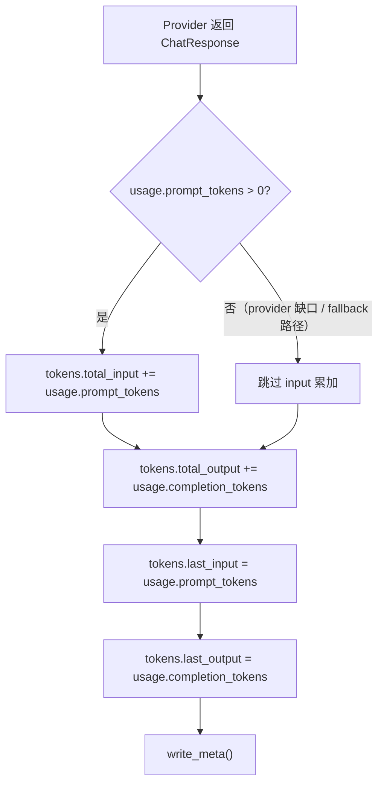

# ADR-027：Conversation Meta 累计 Token 消耗统计

**状态**：草案
**日期**：2026-07-07
**决策者**：大鱼
**影响范围**：

- `core/acowork-runtime/src/conversation.rs`（核心变更：`SessionMeta` 结构体、`ConversationSession` 累计方法、`build_meta`/`resume` 路径）
- `core/acowork-runtime/src/agent/loop_context.rs`（主 AgentLoop 调用点）
- `core/acowork-runtime/src/episode_distill.rs`（`compact_with_llm` / `compact_session_title_with_llm` 签名变更）
- `core/acowork-runtime/src/agent/loop_.rs`（title 生成调用方）
- `core/acowork-runtime/src/agent/history.rs`（compaction 调用方）
- `core/acowork-runtime/src/agent/loop_session.rs`（session-end distillation 调用方）
- `core/acowork-runtime/src/agent/session_state.rs`（可选：`SessionStateSnapshot` 扩展）
- `core/acowork-runtime/src/agent/session/session_task.rs`（初始 ContextUsage 使用新字段）

---

## 背景

### 现状

`SessionMeta` 当前只保留**单次 LLM 调用的快照**：

```json
{
  "last_input_tokens": 47456,
  "last_output_tokens": 505
}
```

这些字段由 `ConversationSession::update_last_tokens()` 在每次 LLM 响应后写入文件。其中 `input_tokens` 在 `prompt_tokens_reliable=false`（Provider 返回 `prompt_tokens=0`）时会回退到本地 **char-based 估算值**，违反了用户"不要用估计值统计"的要求。

现有字段 `last_input_tokens` / `last_output_tokens` 只记录**最后一次** LLM 调用的用量，用户无法知道一个会话累计消耗了多少 token。

### 用户需求

1. 在 meta JSON 中记录整个 session 交互过程中的**累计** token 总数
2. 输入和输出分开统计（`total_input` / `total_output`）
3. 只使用 LLM API 返回的真实值，**不用估计值**
4. 纳入所有 session 内 LLM 调用（主交互 + compaction + title 生成 + episode distill）
5. 不再兼容旧文件格式，项目仍处于开发期

---

## 目标

1. **累计而非快照**：新增 `tokens.total_input` / `tokens.total_output`，对比现有 `last_input_tokens` / `last_output_tokens`（仅快照）
2. **100% 真实值**：input 仅当 Provider 返回 `usage.prompt_tokens > 0` 时才累加，不引入本地估算
3. **全覆盖**：主 AgentLoop + compaction + title 生成 + session-end distillation 的 token 全部计入
4. **统一字段**：嵌套 `tokens` 对象，将原有的 `last_input_tokens`/`last_output_tokens` 迁移为 `tokens.last_input`/`tokens.last_output`

---

## 方案设计

### 数据模型

```rust
/// Per-session LLM token usage statistics.
///
/// ADR-027: All values derived from LLM API ground truth (`UsageInfo` from
/// `ChatResponse.usage`).  Provider estimates are NEVER accumulated; iterations
/// where the Provider returns `prompt_tokens = 0` (or no usage) are skipped
/// for `total_input` to preserve accuracy.
///
/// `last_input` / `last_output` always record the most recent call's raw
/// values (including zero) — they serve the same purpose as the legacy
/// `last_input_tokens` / `last_output_tokens` fields they replace.
#[derive(Debug, Clone, Default, Serialize, Deserialize, PartialEq, Eq)]
#[serde(default)]
pub struct SessionTokens {
    /// Snapshot of the most recent single-call prompt/input tokens.
    pub last_input: u64,
    /// Snapshot of the most recent single-call completion/output tokens.
    pub last_output: u64,
    /// Cumulative input tokens across all session LLM calls.
    /// Only accumulates when `usage.prompt_tokens > 0`.
    pub total_input: u64,
    /// Cumulative output tokens across all session LLM calls.
    pub total_output: u64,
}
```

### `SessionMeta` 变更

```rust
#[derive(Debug, Clone, Serialize, Deserialize)]
pub struct SessionMeta {
    // ── 不变字段 ──
    pub version: u32,
    pub session_id: String,
    pub agent_id: String,
    pub created_at: String,

    // ── 用户/API 可变字段 ── (不变)
    pub title: Option<String>,
    pub workspace_id: Option<String>,
    pub model: Option<String>,
    pub provider: Option<String>,
    pub reasoning_effort: Option<String>,
    pub temperature: Option<f32>,

    // ── 运行时统计 ──
    pub message_count: u64,
    pub last_active_at: String,

    //  ── 移除 ──
    //  pub last_input_tokens: Option<u64>,
    //  pub last_output_tokens: Option<u64>,

    // ── 新增：嵌套 token 统计 (ADR-027) ──
    /// LLM token usage statistics. `None` = no LLM call has been recorded yet.
    #[serde(default, skip_serializing_if = "Option::is_none")]
    pub tokens: Option<SessionTokens>,

    // ── Compaction ──
    pub last_compaction_offset: Option<u64>,

    // ── 恢复标记 ──
    pub corrupted: bool,
}
```

#### JSON 示例

```json
{
  "version": 2,
  "session_id": "20260706_092158_6005e7",
  "agent_id": "com.acowork.senior-engineer",
  "created_at": "2026-07-06T01:21:58.465Z",
  "title": "一些话题",
  "model": "gpt-4o",
  "provider": "openai",
  "message_count": 118,
  "last_active_at": "2026-07-06T01:55:25.114Z",
  "tokens": {
    "last_input": 47456,
    "last_output": 505,
    "total_input": 2384901,
    "total_output": 128340
  },
  "last_compaction_offset": 4096,
  "corrupted": false
}
```

### `ConversationSession` 变更

```rust
// ConversationSession 内部新字段
tokens: std::sync::Mutex<Option<SessionTokens>>,
```

新方法替代 `update_last_tokens`：

```rust
impl ConversationSession {
    /// Record LLM usage from a Provider response and accumulate into totals.
    ///
    /// ## Accuracy guarantee
    ///
    /// - `total_input` only accumulates when `usage.prompt_tokens > 0` —
    ///   Providers that return 0 (or omit usage entirely) are skipped
    ///   to avoid polluting the cumulative counter with local estimates.
    /// - `total_output` always accumulates (completion tokens are always
    ///   real and never fall back to estimation).
    /// - `last_input` / `last_output` are always recorded from the raw
    ///   Provider values (even zero) for the snapshot use case.
    pub fn accumulate_llm_usage(&self, usage: &UsageInfo) {
        let prompt = usage.prompt_tokens;
        let completion = usage.completion_tokens;

        if let Ok(mut guard) = self.tokens.lock() {
            let t = guard.get_or_insert(SessionTokens::default());
            t.last_input = prompt;
            t.last_output = completion;
            if prompt > 0 {
                t.total_input = t.total_input.saturating_add(prompt);
            }
            t.total_output = t.total_output.saturating_add(completion);
        }
        self.write_meta();
    }
}
```

### 累加点

下表列出所有需要插入 `accumulate_llm_usage` 的调用点：

| # | 调用点 | 文件 | 当前状态 | 改动 |
|---|--------|------|----------|------|
| 1 | 主 AgentLoop 每次 LLM 响应结束 | `loop_context.rs:689` | 已经调 `update_last_tokens(ctx_usage.*)` | 改为调 `accumulate_llm_usage(usage)`（取用原始 `usage`，非 `ctx_usage`） |
| 2 | Compaction 调用后 | `episode_distill.rs:compact_with_llm` | 返回 `Result<String>`，丢弃 `response.usage` | 改为返回 `Result<(String, UsageInfo)>`；调用方取 usage 后累加 |
| 3 | Title 生成调用后 | `episode_distill.rs:compact_session_title_with_llm` | 同上 | 同上 |
| 4 | Session-end distillation | `episode_distill.rs:distill_on_session_end` | 调用 `compact_with_llm` 但丢弃 usage | 拿到 `UsageInfo` 后，调 `accumulate_llm_usage` |

#### 关键改动：`compact_with_llm` / `compact_session_title_with_llm` 签名变更

```rust
// 变更前
pub(crate) async fn compact_with_llm(
    prompt: &str, provider: &dyn Provider, model_name: &str,
    max_tokens: u32, identity_context: Option<&str>, system_prompt: &str,
) -> Result<String>;

// 变更后：返回 usage
pub(crate) async fn compact_with_llm(
    prompt: &str, provider: &dyn Provider, model_name: &str,
    max_tokens: u32, identity_context: Option<&str>, system_prompt: &str,
) -> Result<(String, UsageInfo)>;

// 同理：
pub async fn compact_session_title_with_llm(
    prompt: &str, provider: &dyn Provider, model_name: &str, max_tokens: u32,
) -> Result<(String, UsageInfo)>;
```

**调用方适配示例**（loop_.rs 中 title 生成）：

```rust
// 变更前
tokio::spawn(async move {
    match compact_session_title_with_llm(&prompt, provider.as_ref(), &model, max).await {
        Ok(title) => { /* ... 设置 title ... */ }
        Err(e) => tracing::warn!(...)
    }
});

// 变更后
tokio::spawn(async move {
    match compact_session_title_with_llm(&prompt, provider.as_ref(), &model, max).await {
        Ok((title, usage)) => {
            // 原有的 title 设置逻辑
            // ...
            // 累计 token
            if let Some(ref conv) = conversation {
                conv.accumulate_llm_usage(&usage);
            }
        }
        Err(e) => tracing::warn!(...)
    }
});
```

### 准确性约束



### 已知缺口处理

| Provider 场景 | usage.prompt_tokens | 处理方式 |
|--------------|-------------------|---------|
| OpenAI 正常流式（`stream_options.include_usage=true`） | > 0 | ✅ 正常累加 |
| OpenAI fallback 1（剥离 `stream_options`） | 无 usage 返回 | ⏭ 跳过 input；output 无值也跳过 (output 随 input 一同缺失) |
| OpenAI fallback 2/3（进一步退化） | 无 usage 返回 | 同上 |
| Anthropic 正常（`message_start` + `message_delta`） | > 0 | ✅ 正常累加 |
| Ollama 正常流式 | 可能为 0（`prompt_eval_count` 缺失） | ⏭ 跳过 input；output 如有 `eval_count` 则累加 output |
| 本地 Provider / 模拟数据 | 可能为 0 | ⏭ 跳过 |

**核心原则**：宁可 miss 也不估计。缺失的 usage 不会导致错误——下次正常 LLM 调用会继续累加。

### resume 路径

```rust
// conversation.rs:449 — resume 时从 meta JSON 读取 tokens
tokens: std::sync::Mutex::new(meta.tokens),
```

后续 `accumulate_llm_usage` 调用在已有基数上做 `saturating_add`。

### 并发安全

与现有 `last_tokens` 字段一致：使用 `std::sync::Mutex<Option<SessionTokens>>` 保护。
因为 `ConversationSession` 是 `Send + Sync`（在 async 上下文通过 `Arc` 共享），唯一的写入者是 `accumulate_llm_usage`（每次 LLM 响应的末尾调用），不会出现高并发争抢。

`write_meta()` 中的 `temp + rename` 保证原子写入。

### 前端展示（Phase 2，ADR 记录）

当前前端通过 `ChunkEvent::ContextUsage` 接收单次 token 快照，显示在 ResultPanel 和 ContextUsageIcon 中。
累计值可通过以下方式暴露给前端：

**选项 A：扩展 `SessionStateSnapshot`（推荐）**
```rust
pub struct SessionStateSnapshot {
    // ... existing fields ...
    pub tokens_total_input: Option<u64>,
    pub tokens_total_output: Option<u64>,
}
```

`emit_session_state()` 中从 `conversation.tokens()` 读取并写入 snapshot 槽位，前端通过 HTTP pull API 或 `session_state_changed` 事件获取。

**选项 B：前端从 `list_sessions` 响应读取**
`scan_sessions_from_meta()` 已返回完整的 `SessionMeta`，包含 `tokens` 字段。前端可在列表页展示。

**选项 C：新增 `ChunkEvent::TokenUsage` 变体**
每次 `accumulate_llm_usage` 调用后推送累计值到前端。

---

## 实施计划

### Phase 1：数据模型 + 核心接口（~+80 / -20 行）

1. 定义 `SessionTokens` 结构体（`conversation.rs`）
2. `SessionMeta` 移除 `last_input_tokens` / `last_output_tokens`，新增 `tokens: Option<SessionTokens>`
3. `ConversationSession` 新增 `tokens` 字段 + `accumulate_llm_usage()` 方法
4. 移除 `last_tokens` 字段和 `update_last_tokens()` 方法
5. 更新 `build_meta()` 使用 `tokens` 字段
6. 更新 `resume()` 从 `meta.tokens` 读取
7. 更新 `last_tokens()` getter → `tokens()` 返回 `Option<SessionTokens>`

### Phase 2：主 AgentLoop 调用点（~+5 / -10 行）

1. `loop_context.rs:689` — 从 `ctx_usage.*` + `usage.*` 改为调 `accumulate_llm_usage(&usage)`（API 原始值）

### Phase 3：Compaction / Title / Distill 调用点（~+30 / -5 行）

1. `episode_distill.rs:compact_with_llm` — 返回值改为 `(String, UsageInfo)`，调用方适配
2. `episode_distill.rs:compact_session_title_with_llm` — 同上
3. `episode_distill.rs:distill_on_session_end` — 拿到 `UsageInfo` 后调 `accumulate_llm_usage`
4. `loop_.rs`（title 生成） — 适配新签名并累加
5. `history.rs`（compaction） — 适配新签名并累加

### Phase 4：测试（~+50 行）

1. 新增 `accumulate_llm_usage` 单元测试（reliable / unreliable / missing usage）
2. 新增 `SessionMeta` 序列化/反序列化测试（新旧兼容——虽然有新字段 Option None）
3. 验证 compaction 调用点签名的编译通过

### Phase 5（可选）：前端展示

1. `SessionStateSnapshot` 新增 `tokens_total_input` / `tokens_total_output`
2. `emit_session_state()` 中填充
3. 前端 `ResultsPanel` 展示累计值

---

## 风险与缓解

| 风险 | 影响 | 缓解 |
|------|------|------|
| Provider 反复返回 `prompt_tokens=0` → input 总为零 | 用户看到 input 累计为 0 但实际有对话 | 用户看到的 input 累计缺失，但 output 正常；属 Provider 侧问题，不应由统计系统掩盖 |
| compaction LLM 调用失败（超时/报错） | token 丢一次 | 不影响后续累加；失败不写 usage，下次正常调用补上 |
| `compact_with_llm` 签名改动扩散 | 多个调用方需更新 | 只涉及 `history.rs:compact_via_llm` / `loop_.rs:title` / `episode_distill`；IDE 可以捕获所有编译错误 |
| write_meta 在高频 LLM 循环中写盘 I/O | 理论性能影响 | LLM 调用秒级频度，write_meta 写 400B，耗时可忽略；写入频率远低于 `append_message` 热路径 |

---

## 备选方案对比

### 方案 A：嵌套 `tokens` 对象（**采纳**）

```json
{ "tokens": { "last_input": 47456, "last_output": 505, "total_input": 2384901, "total_output": 128340 } }
```

**优点**：
- 语义层次清晰：`tokens` 是一个完整的"token 统计"概念
- 未来可扩展：`tokens.cache_read` / `tokens.reasoning_tokens` / `tokens.last_active_at` 等
- 不与扁平字段名混淆

**缺点**：
- JSON 多一层嵌套

### 方案 B：扁平字段

```json
{ "last_input_tokens": 47456, "last_output_tokens": 505, "total_input_tokens": 2384901, "total_output_tokens": 128340 }
```

**否决理由**：
- `last_input_tokens` 与 `total_input_tokens` 命名相似，容易混淆
- 未来扩展 cache/reasoning 字段时要么加更多扁平名（`total_cache_read_tokens`）要么改名破坏兼容
- 与 `last_input_tokens` 平铺在同一层级，语义不聚合

---

## 决策

1. **采用嵌套 `tokens: Option<SessionTokens>` 结构**
2. **移除顶层 `last_input_tokens` / `last_output_tokens` 字段**
3. **只累加真实值**：`usage.prompt_tokens > 0` 时累加 input，output 永远累加
4. **涵盖所有 session 内 LLM 调用**：主循环 + compaction + title + distill
5. **`compact_with_llm` / `compact_session_title_with_llm` 签名改为返回 `(String, UsageInfo)`**
6. **项目不保留向后兼容性**：旧 meta JSON 文件中的 `last_input_tokens` / `last_output_tokens` 字段在新版本读取时将被忽略（`#[serde(default)]` 行为）

