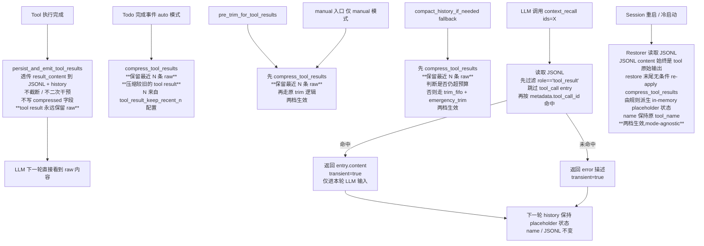

# ADR-032：Context ID-Based Compression（占位符 + 按需召回调取）

**状态**：修订中（2026-07-18 修复了 recall → compress → recall 死循环 Bug）
**日期**：2026-07-10（原版）/ 2026-07-18（修订）
**决策者**：大鱼
**前置**：
- ADR-010（上下文压缩策略大幅简化）
- ADR-011（上下文摘要与蒸馏统一策略）
- ADR-014（Loop 模块分解）— 负责 `loop_context.rs` 所在位置

**修订记录（2026-07-18）**：原始设计在某个 commit（C4a 849bc28）中破坏了 transient 通道，引入了 `placeholder_replacements` 把 `context_recall` 返回的原文**重新写入 history**，导致以下死循环：
```
context_recall(返回原文) → 写入 history（占位符被替换）→ LLM 看到 raw 内容 →
下次 history > threshold → compress_tool_results 重新压缩 → LLM 又看到占位符 →
再调 context_recall → ... 无限循环
```
本次修订恢复 C3a transient 设计，明确事件触发**仅 assistant 长文本**（不再使用 todos 完成事件触发），**budget fallback 不再调 compress_tool_results**（彻底是 token-only 兜底），默认模式改为 **Manual**（保守路线：用户没主动触发就不动）。

## 核心触发规则（2026-07-18 修订版）

| 场景 | Auto | Manual |
|---|---|---|
| 最新 Assistant 消息 > `soft_threshold_chars`（事件触发）| ✅ 调 `compress_tool_results_for_long_assistant` | ❌ |
| 前端"工具压缩"按钮 / Gateway API / CLI | n/a（任意 mode 都可点） | n/a（任意 mode 都可点）|
| `trim_history_to_budget`（budget 兜底）| ❌ **不调 compress_tool_results** | ❌ **不调 compress_tool_results** |
| `llm_based_compaction` fallback | ❌ **不调 compress_tool_results** | ❌ **不调 compress_tool_results** |
| context_recall 工具调用 | 不写 history（transient）| 不写 history（transient）|

**默认模式**：`Manual`（2026-07-18 修订）。这是保守默认——只有用户在 Setup 面板显式切换到 Auto，事件触发才生效；否则**只有前端按钮能压缩**。

详细设计见后文。原 2026-07-10 版本的设计仍有参考价值，但所有"trigger 路径"已重新校准到上表。

**核心原则（2026-07-10 与大鱼确认，2026-07-18 修订 #5/#6/#7）**：
1. **Tool 自己负责控制输出大小**：内置 tool 通过参数 / 描述 / 内部截断控制；MCP 工具输出控制属于另一个独立 ADR 范畴，本 ADR 不涉及。
2. **compress 层只做 placeholder 化**：不替 tool 做截断决策，不关心 tool 是否截断过。
3. **`context_recall` 是 session 内按 id 精确召回工具**：仅服务于本 ADR 处理的 tool_result placeholder 场景；其他上下文召回需求由 `memory_recall`（Grafeo 语义检索）覆盖。**v1 永久仅 tool_result**，不预留扩展接口。
4. **truncate_large_messages 同理被 placeholder 替代**：与 tool result placeholder 是同一原理，删除该函数，统一用 placeholder 路径。
5. **触发机制两档（auto / manual）**（**2026-07-18 修订**）：v1 触发分两档，`auto` 与 `manual`，**默认 = `manual`**（保守路线）。Auto 模式的**事件触发**仅当**最新 Assistant 消息超过 `soft_threshold_chars`** 时调 `compress_tool_results_for_long_assistant`；Manual 模式**永不自动触发**——只能通过前端按钮 / Gateway API / CLI 手动触发（Manual 入口在任意 mode 下都有效）。**`trim_history_to_budget` 与 `llm_based_compaction` fallback 是纯 token-only 兜底 — 永远不会调 `compress_tool_results`**：FIFO + `emergency_trim`，绝不让 LLM 的"已在 raw 状态写过的 tool result"被自动压缩为占位符（这是 fix #2 的核心：防止 budget fallback 间接触发 placeholder 压缩，进一步引爆死循环）。
6. **运行时压缩状态由规则派生,JSONL 不持久化**（2026-07-10 与大鱼确认）：placeholder 化是**完全运行时行为**。JSONL 的 `tool_result` entry 只存 tool 给的原始输出 + 必要的协议元数据（`tool_name` / `tool_call_id`）；**不**新增任何运行时衍生字段（拒绝曾经设计的 `compressed: bool`）。`compress_tool_results` 的幂等与 in-memory 状态完全由两条规则派生:
   - **长度判定**:`content.len() ≤ threshold` 的消息视为"已压缩或本就小",跳过(placeholder 字符串长度 ≈ 120 chars,任何合理 threshold ≥ 256 远大于此,首次压缩后所有 Tool 消息天然落入此分支)
   - **前缀兜底**:以 `"[Tool result compressed."` 开头的消息显式跳过,防止 threshold 被配成 < 100 chars 时的二次处理

   **2026-07-18 修订补充 — transient 不可绕过**：`context_recall` 的返回值走 `pending_transient_tool_msgs` 通道（见 C3a），**永远不会写入 history 或 JSONL**。这是 fix #1 的核心：context_recall 召回的原文只在**当前 LLM 调用上下文**生效，下一轮 LLM 调用时 history 仍然是压缩后的占位符。这就打破了 recall → compress → recall 死循环：原始 v1 设计（C3a commit 0c95201）就是 transient，但中间某个 commit（C4a commit 849bc28）错误地用 `placeholder_replacements` 把 recall 内容**写回** history，破坏了 transient 不变式。修订版恢复 transient 通道，且**整个 codebase 不再有 `placeholder_replacements` 路径**——`build_chat_request` 不做占位符替换，`loop_tools.rs` 按工具名（`context_recall`）判定 transient flag 后注入 `pending_transient_tool_msgs`，绝不写入 history。

   Session 重启后 restorer 无条件调一次 `compress_tool_results(SOFT_THRESHOLD)`,in-memory 状态由规则派生,**不依赖任何持久化字段**。单一真理来源 = JSONL content;变更 threshold / 配置 / 代码时 0 migration 成本。

7. **N 值可配,默认 3**(2026-07-10 修订):"保留最近 N 条 tool_result 不压缩"中的 N 是**配置项,不是硬编码常量**。
   - **配置字段**:`tool_result_keep_recent_n: usize`,同时存在于 `RuntimeConfigOverrides` 与 `agent_config.json`;**默认值 = 3**(经验值,对应典型 skill 阶段式工具调用深度)。
   - **配置层级**:`RuntimeConfigOverrides` 优先 → 缺则 fallback 到 `agent_config.json` → 缺则 fallback 到代码默认 `3`。
   - **统一适用**:N 是全局保护窗口策略,**所有**触发点(事件触发 / manual 入口 / restore)走同一 N 规则——保证 LLM 在任何时机看到的"近期 raw 上下文"是连续的、不会被 mode/触发路径影响。**注意(2026-07-18 修订)**：budget fallback（`trim_history_to_budget` + `llm_based_compaction` fallback）已不再调 `compress_tool_results`，所以也就不再涉及 N 规则。
   - **取值语义**:`N = 0` 等价于"全部压缩,无保护"(与 fallback 历史行为对齐);`N` 过大时 LLM 看到更多 raw 但 window 节省变少;具体取值由 agent / 用户根据 tool 密度与任务阶段粒度调整。
   - **设计意图**:N=3 是 ship-with-fluency 的默认值,**不**是经过充分数据调优的最优值;开放为配置项后,用户/agent 可基于真实工作流(代码 review / 大文件分析 / 多 grep 调研等)调优,无需升级 runtime。

**细化**：ADR-010 §"明确放弃的策略" 中 "Tool result 日常折叠（`fold_tool_results`）" 的策略由本 ADR 重新引入并改造，从"程序化截断"升级为"占位符 + 按需召回"。LLM 摘要（80%）和 emergency_trim（95%）的兜底路径不变。

### 删除 persist 触发器的设计反思(2026-07-10 与大鱼讨论确认)

**原设计的问题**:
- persist 触发器在 `persist_and_emit_tool_results` 入库后立即压缩刚写入的 tool result(N=1 slice)
- 编程 Agent 高频 tool result(`content_search` / `file_read` / `shell`)绝大多数 > 2KB(默认 threshold),**所有**都会被立即压缩
- 后果:LLM 在下一轮看到的是 placeholder,**必须**调 `context_recall` 才能看到真实内容
- 等于每次 tool 调用变成"调工具 → 看到 placeholder → 调 context_recall"两步走
- 严重影响 LLM 推理效率,主动制造 recall 需求

**核心反思**:
- ADR 自己定义的核心原则 #2 说"compress 层只做 placeholder 化,不替 tool 做截断决策"
- persist 触发器违反了这个原则的精神——它替 LLM 做了"这条 tool result 不重要,立即藏起来"的判断
- 但 tool result **当时**对 LLM 是**最重要**的输入(下一步推理的依据),立即压缩它就是把 LLM 最需要的上下文抢走
- placeholder + recall 的本意是**被动逃生口**——只有当上下文真的撑爆或语义阶段切换时,才压缩,而不是每次 tool 调用都抢一遍

**修正后的数据流**:
```
Tool 执行 → 写入 history + JSONL(raw, 永不自动压缩)
  ↓
LLM 看到 raw 内容 → 直接推理
  ↓
[持续累积,直到任一触发]:
  - todos 完成(仅 auto)        → 压缩**较旧** tool result,**保留最近 N 条 raw**(N 来自配置,默认 3)
  - budget 兜底(两档)         → 全量压缩超阈值 tool result,**保留最近 N 条 raw**
  - manual 入口(仅 manual)     → 同 budget 兜底,**保留最近 N 条 raw**
  - restore(两档,mode-agnostic)→ 同 budget 兜底,**保留最近 N 条 raw**
  - **统一适用**:所有触发点都走同一 N 规则(核心原则 #7),保证 LLM 看到的"近期 raw 上下文"连续
```

**对设计原则的更新**:
- "任何 agent 自动获得优化" 这条之前的论述要修正——optimization 不等于"每条 tool result 都压缩",而是"在语义边界和预算边界时合理压缩"
- 真正"自动获得"的是 budget 兜底(两档都生效);todo 触发是"智能但不激进"的额外清理

---

## 决策摘要

**核心思路（2026-07-18 修订）**：对 in-memory `ChatMessage` 中超出阈值的 tool result content，替换为固定占位符（含可召回 id），原始内容保留在 JSONL 中不丢失。新增内置 `context_recall` tool，LLM 按 id 主动取回原文。v1 仅处理 tool result message；其他 large message（User/Assistant 长文本）由 L2 LLM 摘要（80%）和 L3 emergency_trim（95%）兜底——placeholder + recall 不是"覆盖所有 large message"的机制，只是上下文压缩的一个环节。**触发机制分两档**（**默认 = Manual**，2026-07-18 修订）：
- **Auto**：当且仅当最新 Assistant 消息超过 `soft_threshold_chars` 时，自动调 `compress_tool_results_for_long_assistant`（事件触发）。这是**唯一**的 Auto-mode 触发点。
- **Manual**：任何自动路径均不压缩。用户必须通过**前端按钮** / **Gateway API** / **CLI** 主动触发 compress_tool_results。budget fallback 路径**永不调用** compress_tool_results（fix #2）。
- `context_recall` 的返回值走 `pending_transient_tool_msgs` 通道，**绝不被写入 history**（fix #1，恢复 C3a transient 设计）。这是打破 recall → compress → recall 死循环的关键不变式。

| Commit | 范围 | 风险 |
|--------|------|------|
| **C1** | `HistoryManager::compress_tool_results()` tool_result 专用函数 + placeholder 简化 + **删除 `truncate_large_messages`** + 替换全部调用点 | 中（删除的函数被多路径调用）|
| **C2** | `persist_and_emit_tool_results()` 简化为透传 tool 输出（仅写既有 `tool_name` / `tool_call_id`，本 ADR 不新增任何 metadata 字段） | 低 |
| **C3** | transient 通道（C3a）+ `context_recall` 工具注册（C3b，可独立回滚）| 中 |
| **C4** | 触发点（auto / manual 两档拆分 + todos 事件触发,**无 persist 触发** + manual 入口 API/UI）+ Restorer 兼容 + 文档同步 | 中（涉及主循环事件流 + 新增 channel + UI 接线）|

**关键决策**：

| 决策 | 理由 |
|------|------|
| **职责分离**：tool 内部控制输出大小 + compress 层只做 placeholder + LLM 自主决定是否 recall | 单一职责；不混入"谁负责截断"的歧义 |
| **对外（placeholder / context_recall 入参）用 `tool_call_id`**（v1 永久仅适用 tool_result） | LLM 协议层稳定 id（Anthropic `toolu_xxx`、OpenAI `call_xxx`），LLM 从自己发起的 tool_call 直接 back-reference；in-memory `ChatMessage.tool_call_id` 字段压缩时可读；该 id 体系仅服务 tool_result，不绑定其他 role |
| **JSONL 内部用 `entry.id`（UUID v4）做主键** | 跨 provider 稳定；与协议层 id 解耦；restorer / 调试工具用 |
| **`context_recall` 内部按 `tool_call_id` 索引到 `entry.id`** | LLM 不接触 entry id；扫 JSONL 时按 `metadata.tool_call_id` 命中即返 `entry.content` |
| placeholder 替换作用在 in-memory，**不改** JSONL 内容 | JSONL 是审计/回放真相来源 |
| **JSONL 不持久化压缩状态**（不新增 `compressed` / `partial` / `original_size_chars` 等运行时衍生字段）| 单一真理来源 = JSONL content；运行时状态（含"是否已压缩"）由 `compress_tool_results` 规则 + 当前 `threshold` 派生；restorer 无条件 re-apply 即可；阈值/规则/代码变更 0 migration 成本；与 L2 LLM 摘要 / L3 emergency_trim 持久化策略对称 |
| `context_recall` 返回值走 transient 通道，**不进** history | 否则一次召回就吃满窗口，下一轮立刻触发压缩，恶性循环 |
| **软阈值 2 KB（可配）** | 单档；不再有"硬阈值截断"逻辑（那是 tool 层职责） |
| **无 persist 触发**（2026-07-10 删除） + 语义边界事件触发（todos 完成）+ budget 兜底 三层 | tool result **始终保留 raw 直到自然压缩时机**:raw 状态给 LLM 当前推理提供完整上下文;todos 完成时压缩**较旧** tool_result 释放窗口(N 保留窗口,N 来自配置,默认 3);budget 兜底最后一道防线两档都生效避免死锁;**所有**触发点(事件/budget/restore/manual)统一适用同一 N 规则(核心原则 #7) |
| **`context_recall` 支持批量 id（数组参数）** | 减少 round-trip；LLM 一次召回多条平摊 overhead |
| placeholder 模板最简英文版 | LLM 上下文宝贵；语意清晰即可，不堆冗余信息 |
| **`truncate_large_messages` 删除** | 与 placeholder 同一原理；统一走新路径 |
| **触发分两档**（auto / manual），**默认 = manual（2026-07-18 修订）** | 保守路线：manual 是默认让普通用户零副作用；auto 给高级用户作为生产力选项；Manual 模式下 `trim_history_to_budget` / `llm_based_compaction` fallback 都**不**调 `compress_tool_results`（默认只有手动才能压缩，budget 兜底不动 tool result 以免触发死循环）；Auto 模式调仅 assistant 长消息 trigger 路径 |
| **N 值可配**(2026-07-10 修订，2026-07-18 限定) | `tool_result_keep_recent_n` 配置项,RuntimeConfigOverrides → agent_config → 代码默认(3) 三级 fallback;**所有调 `compress_tool_results` 的路径**（assistant 长消息 trigger / manual 入口 / restore）统一适用同一 N。budget fallback 路径已**不**调 `compress_tool_results`，不涉及 N | 适应不同 agent 工作流(skill 密集调用 / 稀疏单步查询 / 多文件并行读取);N 是默认值而非硬编码;不同 session 可独立配置无需升级 runtime |
| **manual 入口两档都可点（2026-07-18 修订）** | auto 模式下手动点不走 assistant 长消息 trigger 路径，而是直接调 `compress_tool_results` —— 用户主动诉求高于 auto mode 默认行为；manual 模式下手点是唯一合法触发点 |

---

## 影响范围

### C1（核心：`compress_tool_results` + 删 `truncate_large_messages`）

**新增**：
- `core/acowork-runtime/src/agent/history.rs`：
  - `pub fn compress_tool_results(messages: &mut [ChatMessage], soft_threshold_chars: usize)` — 扫描 messages，对 `MessageRole::Tool`（v1 限定）且 `content.len() > soft_threshold_chars` 的项替换为 placeholder 字符串；返回替换条数。
  - placeholder 字符串格式：`"[Tool result compressed. Call context_recall(id=\"<tool_call_id>\") to retrieve the full content.]"`（约 90 chars / ~22 tokens）
  - `pub fn recalibrate_tokens(&mut self)` — O(N) 重新计算 `current_tokens`，压缩后调用一次。

**删除**：
- `core/acowork-runtime/src/agent/history.rs:481-523` 的 `truncate_large_messages` 方法整体移除。
- 以下三处调用点删除（替换为 `compress_tool_results` 或等价物）：
  - `core/acowork-runtime/src/agent/loop_context.rs:198`（`trim_history_to_budget` 内）
  - `core/acowork-runtime/src/agent/loop_context.rs:430`（compact fallback fallback 分支）
  - `core/acowork-runtime/src/agent/loop_context.rs:956`（如有 / 待 review 确认精确行号）

**函数命名理由**：
- `compress_tool_results` 命名诚实表达 v1 范围：仅压缩 tool result 消息（`MessageRole::Tool`）。
- 与被删除的 `truncate_large_messages` 形成对比：**不**截断，**只**替换为 placeholder。
- **不**预留扩展接口：未来如需支持 User/Assistant 长文本，开**新 ADR**（暂称 ADR-033）专门设计——不是简单改个函数名，需要 protocol 层稳定 message id、跨 role placeholder 模板等结构性变更，超出本 ADR 范畴。

**约束**：
- **纯函数**：不修改 `current_tokens` 计算，由调用方在替换后调 `recalibrate_tokens()`。
- **不改 JSONL**：in-memory 替换仅影响 `ChatMessage`，JSONL 内容不被触达。
- **幂等**：通过 content 长度 + prefix 双重判定,见下文"实现要点"。**不**写 `name` 字段,`name` 始终保留 tool 原始名字。

**单测覆盖**：
- 软阈值边界（< / = / > 三档）
- 非 tool message（User / Assistant / System）跳过
- 已压缩过 entry（content ≤ threshold 或 prefix 命中）幂等不重复
- 占位符包含正确 `tool_call_id`,不含已删除的原始大小字段
- `name` 字段保持原 tool_name,不被压缩函数改写
- 调用 `recalibrate_tokens` 后 token 计数正确

### C2（`persist_and_emit_tool_results` 简化）

**修改**：
- `core/acowork-runtime/src/agent/loop_tools.rs:849-865`：
  - **删除**硬阈值分流(截断逻辑)。
  - **删除**三档判断(原 soft / hard 两档 + 分流)。
  - 简化为:**直接透传** tool 产出的 `result_content` 写入 JSONL,metadata 仅含 `tool_name` / `tool_call_id`(两个**已有**字段,本 ADR 不新增任何字段)。
  - **不**新增 `RuntimeConfigOverrides` 字段(删掉原 `tool_result_hard_threshold_chars`,保留 `tool_result_soft_threshold_chars` 仅供 compress 层使用)。
- 删除 `RuntimeConfigOverrides.tool_result_hard_threshold_chars` 字段(仅在 C1 配置接口中预留过,C2 不再需要)。

**JSONL metadata 字段**(`ConversationEntry.metadata` 简化):
- **本 ADR 不新增任何 metadata 字段**。运行时压缩状态完全由规则派生,持久化层只承载 tool 给的原始输出与协议必要元数据(详见核心原则 #6)。
- **删除**:`partial: bool` — 不再由 compress 层做截断。
- **删除**:`original_size_chars: u64` — 同上。
- **未引入**:`compressed: bool` — 经与大鱼 2026-07-10 确认,运行时状态不应污染持久化层;restore 时由 `compress_tool_results(SOFT_THRESHOLD)` 重新派生 in-memory 状态。

向后兼容:旧 JSONL 不带任何新字段,正常读取;新 JSONL 与旧 JSONL schema 完全一致,无需 migration。

**单测覆盖**：
- 仅 `tool_name` / `tool_call_id` 两个字段写入,无其他 metadata
- 旧 entry(不带任何字段)正常 restore
- tool result 直接透传,无二次处理
- **不**存在 `compressed` / `partial` / `original_size_chars` 任何字段(grep 验证 schema 收窄)

#### C2b（`format_messages` 增强识别压缩占位符 + 产出工具名标签）

C2 完成 persist 简化后,`compact_via_llm` 在读取历史时可能遇到已被 `compress_tool_results` 压缩的 Tool 消息(内容变为 ~120 chars placeholder)。增强 `format_messages` 使其:

**具体改动**:
- `core/acowork-runtime/src/episode_distill.rs` 的 `format_messages` 函数：
  - 检测 Tool 消息 content 是否以 `[Tool result compressed.` 开头(共享 `COMPRESSED_TOOL_PLACEHOLDER_PREFIX` 常量)
  - 若是压缩消息且 name 存在,输出 `[Tool(name={tool_name}, id={tool_call_id})]: <placeholder>`——LLM 知道哪个 tool 被调用了、结果被压缩了、可用 context_recall 召回
  - 若压缩但 name 缺失,仅输出 `[Tool]: <placeholder>`(回退行为)
  - 若未压缩但 name 存在,输出 `[Tool({tool_name})]: <content>`(便于 LLM 区分不同工具的产出)
  - Assistant 消息若 name == "compaction_summary"(共享 `COMPACTION_SUMMARY_NAME` 常量),输出 `[CompactionSummary]: <content>`——LLM 知道这是上一轮压缩的产物,不是新的对话轮次

**影响**:
- 仅影响 `compact_via_llm` + `compact_full_context` 两个入口的 prompt 文本格式,不影响运行时行为
- 不改变 placeholder 内容本身,仅改变 role label 在 prompt 中的呈现
- 5 个新增单测覆盖:基础格式/CompactionSummary/压缩无 name/压缩有 name/普通带 name Tool 消息

**Naming 常量**:
- `COMPRESSED_TOOL_PLACEHOLDER_PREFIX` — 在 `history.rs` 中定义,`episode_distill.rs` 引用,保证双端前缀一致
- `COMPACTION_SUMMARY_NAME` — 同样在 `history.rs` 中定义,统一 `replace_middle_with_summary` 与 `format_messages` 的 marker 检查

### C3（transient-return 通道 + `context_recall` 工具）

#### C3a（transient 通道 + 主循环支持，先发）

**设计决策**：不向 `ToolResult` 结构体新增 `transient` 字段（避免侵入 100+ 处构造调用），改为在 `execute_single_tool` 中按工具名判断（当前仅 `context_recall`）。新增 transient 工具只需在 `execute_single_tool` 的名称检查分支中添加对应名称。

**新增**：
- `core/acowork-runtime/src/agent/loop_.rs`：
  - `AgentLoop` 字段新增 `pending_transient_tool_msgs: Vec<ChatMessage>`。
  - `execute_single_iteration` 处理 tool 结果循环处：
    ```rust
    // 伪代码
    for result in tool_results {
        if result.transient {
            // 不 append 到 history，不 append_message_to_conversation
            // 注入到下一轮 build_chat_request 的额外 slot
            // name 字段：当前 transient tool 的真实名字（这里是 "context_recall"），
            // 不是已删除的 "context_compressed" 幂等标记——name 在 ChatMessage 上
            // 始终承载"产生这条消息的 tool 名字"协议语义。
            let msg = ChatMessage {
                role: MessageRole::Tool,
                content: result.content.clone(),
                tool_call_id: pending_transient_tool_call_id(r),
                name: Some("context_recall".to_string()),
                ..Default::default()
            };
            self.pending_transient_tool_msgs.push(msg);
        } else {
            history.append(...);
            conversation.append_message(...);
        }
    }
    ```
  - `build_chat_request` 末尾追加：`chat_request.messages.extend(self.pending_transient_tool_msgs.drain(..));`

**为什么先发 C3a**：
- C3a 是结构性变更（transient 通道 + 主循环协同），风险集中在主循环 review。
- C3a 独立可 build / 可测，不依赖 `context_recall` 工具实现。
- 如果 C3b（context_recall 工具）review 不过，C3a 仍可独立发布，未来再补 C3b。

**单测覆盖（C3a）**：
- 普通 tool result 走原路径（写 history + JSONL）。
- Transient tool result 不写 history，不写 JSONL，注入到 `pending_transient_tool_msgs`。
- `build_chat_request` 后 `pending_transient_tool_msgs` 清空。
- 重启 session 后 transient messages 不复现。

#### C3b（`ContextRecallTool` 注册，后发）

**新增**：
- `core/acowork-runtime/src/tools/builtin/context_recall.rs`：
  - `pub struct ContextRecallTool { session_file_path: PathBuf }`
  - `ToolSpec::name = "context_recall"`，description 注明："Retrieve the full content of tool results that were compressed in this session. Provide the `tool_call_id` values shown in compressed markers." + JSON schema: `ids: string[]` (required, 1-20 entries)
  - `execute()` 返回 `ToolResult { transient: true, .. }`（关键）。
- `core/acowork-runtime/src/tools/builtin/mod.rs`：在 `all_builtin_tools()` 注册 `context_recall`（默认 enabled，权限标记 `context:read`）。

**关键设计**：
- **入参用 `tool_call_id`，内部按 `metadata.tool_call_id` 索引**：扫 JSONL 时**首先**过滤 `entry["role"] == "tool_result"`（跳过 JSONL 中 `role: "tool_call"` 的 entry——其 content 是参数而非输出，不参与 recall；详见 §"两层 schema 与映射"），再匹配 `metadata.tool_call_id == param`，命中即返 `entry.content`。JSONL 的 `entry.id`（UUID）作为内部主键，从不暴露给 LLM。
- **找不到不整体失败**：单 id 缺失只在该 id 上报错，整体 `ok: true`，LLM 可继续处理其他结果。
- **不做截断判断**：不再关心内容是否是"部分"的。Tool 自己负责输出大小，recall 返回 tool 给的原始内容。

**单测覆盖（C3b）**：
- 命中 / 未命中 / 部分命中 / 超过 20 ids 上限
- JSONL 不出现 `context_recall` 的 tool_call / tool_result 行（因 transient）
- partial=true 处理代码**不存在**（验证删干净）

### C4（触发点按档位拆分 + 新增 manual 入口 + Restorer + 文档）

C4 是本 ADR 触发机制的主战场。**核心变化**：触发点按 auto / manual 两档分组；新增 manual 入口（前端按钮 + Gateway API）。

#### 触发点矩阵（2026-07-18 修订：按档位）

| 触发点 | auto 模式 | manual 模式 | 行为 |
|---|---|---|---|
| ~~`persist_and_emit_tool_results` 入库后立即压缩~~ **【已删除】** | ❌ | ❌ | ~~每次 tool_result 入库后调 `compress_tool_results`~~ —— **删除原因见核心原则反思**:工具结果立即压缩等于抢走 LLM 当前推理依赖的 input |
| **最新 Assistant 消息长度 > `soft_threshold_chars`**（**2026-07-18 新增**）| ✅ | ❌ | 调 `HistoryManager::compress_tool_results_for_long_assistant`，看门狗 guard 检检查最新 Assistant 消息长度,**超过**才调 `compress_tool_results`。Manual 模式跳过此路径 |
| `trim_history_to_budget` (budget 兜底) **【2026-07-18 修订：不调 compress_tool_results】** | ❌ **不调** | ❌ **不调** | **纯 token-only 兜底**：调 `trim_fifo()` + `emergency_trim()`。**绝不**调 `compress_tool_results`（fix #2）。调它会导致 budget 兜底一旦成功，就**悄悄**把 history 中的 raw tool result 替换为占位符，进而不必要地制造 `context_recall` 调用需求；多次调换中还能让某些历史 tool result 被反复压缩与解压——是触发死循环的潜在隐患之一 |
| `compact_history_if_needed` fallback **`llm_based_compaction` 失败后** **【2026-07-18 修订：不调 compress_tool_results】** | ❌ **不调** | ❌ **不调** | LLM 摘要失败后走 `replace_middle_with_summary` 或 `emergency_trim`；**绝不**调 `compress_tool_results`（fix #2）。同上理由 |
| 前端"工具压缩"按钮 + Gateway API + CLI | ✅ 可用 | ✅ 可用 | 主动调 `compress_tool_results`，**保留最近 N 条 raw 不压缩**(N 来自配置,默认 3) |
| 前端"摘要压缩"按钮 + Gateway API + CLI | ✅ 可用 | ✅ 可用 | 主动调 `compact_via_llm`（**L2 范围，本 ADR 仅接线**）|
| **CLI 子命令** `acowork compress tool_result --session <id>` / `acowork compress summary --session <id>` | ✅ 可用 | ✅ 可用 | 同上 Gateway API；CLI 通过 IPC（Unix Socket / Named Pipe）走与 API 相同的 channel 注入路径 |
| **restore**（session 重启/冷启动后） | ✅ | ✅ | `compress_tool_results(SOFT_THRESHOLD)` 全量压缩,**mode-agnostic**(详见修改 8 rationale);**保留最近 N 条 raw** |

**关键边界（2026-07-18 修订后）**：
- Manual 模式**唯一**压缩入口是**手动触发**（前端按钮 / Gateway API / CLI）；budget 兜底也不压缩
- Auto 模式**唯一**自动触发点是 **assistant 长消息**；budget 兜底也**不**调 `compress_tool_results`
- L2 摘要（80%）独立于本 ADR，**不受** mode 影响
- 事件触发**只**清**较旧**的 tool_result,**保留最近 N 条 raw 不压缩**（N 来自 `tool_result_keep_recent_n` 配置,默认 3）——N 保护 LLM 当前推理依赖的近期上下文
- **N 是全局保护窗口策略,所有调 `compress_tool_results` 的路径都走同一 N 规则**(详见核心原则 #7)
- **context_recall 返回的原文不入 history**（fix #1 / C3a transient 不变式）——不依赖 mode，任意 mode 下都不入
- **budget fallback 不可能调用 compress_tool_results**（fix #2）：这是防止 recall → compress → recall 死循环传播的额外安全网

#### 修改 1：`compact_history_if_needed` 的 fallback 路径（**2026-07-18 修订：绝不调 compress_tool_results**）

- `core/acowork-runtime/src/agent/loop_context.rs` 中 `llm_based_compaction` 失败的 fallback 分支：
  ```rust
  Err(e) => {
      // 2026-07-18 修订 (fix #2): LLM 摘要失败后**不**再调 compress_tool_results。
      // 以前这里会调 compress_tool_results 作为零成本优化，但实践表明这会
      //  被预算门限定额触发 —— 反复快速调换、压缩、LLM 可能调 context_recall
      //  取回原文、原文进 history 后又超过阈值、又被压缩 —— 是 recall → compress
      //  → recall 死循环的传播路径之一。
      //
      // 新行为: 只走 L2 补充路径（replace_middle_with_summary）或 L3 兜底
      // (emergency_trim)。绝不动 tool_result content。
      self.session.history.replace_middle_with_summary(...)?;
      // 如果摘要后仍超 budget, 走 emergency_trim
      if self.session.history.token_count() > budget {
          self.session.history.emergency_trim();
      }
      // 注意: 这里不调 compress_tool_results。
  }
  ```
- **完全不受 mode 影响** —两档都不压缩,且不依赖 mode 设置。`compress_tool_results` 是事件触发路径的专属能力。

#### 修改 2：`pre_trim_for_tool_results` 路径（**2026-07-18 删除**）

- 原设计：`pre_trim_for_tool_results` 前置 `compress_tool_results` + `recalibrate_tokens`，打包为 `pre_trim_and_compress`。
- **修订后删除该压缩前置**：budget 门限定额触发时不再压 `tool_result`，与修改 1 一致。`trim_history_to_budget` 本身已是纯 token-only（详见修改 3）。
- **合并到修改 3**：以单一的 "trim_history_to_budget 是纯 token-only 兑底" 作为唯一的 budget 兑底语义。

#### 修改 3：`trim_history_to_budget` 纯 token-only 路径（**2026-07-18 修订**）

- `core/acowork-runtime/src/agent/loop_context.rs` 的 `trim_history_to_budget`：
  ```rust
  pub(crate) fn trim_history_to_budget(&mut self, model_name: &str) {
      let budget = self.context_trim_budget(model_name);
      self.session.history.set_max_tokens(budget);
      self.session.history.trim_fifo();
      if self.session.history.token_count() > budget {
          self.session.history.emergency_trim();
      }
      // 2026-07-18 修订 (fix #2): 这里**不**调 compress_tool_results。
      // budget 兑底是纯 token 保护路径, 压缩是事件触发路径,两者不能泥。
      // 混在一起会让 budget 门限定额间接触发死循环。
  }
  ```
- **删除**原位于该方法体中的 `compress_tool_results(SOFT_THRESHOLD)` 调用。
- **删除**原位于该方法体中的 `recalibrate_tokens()` 调用(`compress_tool_results` 联动才会调到)。
- **不**需要 mode 判断 —两档都跳过本路径中的 placeholder 压缩。

#### 修改 4：事件触发（**仅 auto 模式**）—— assistant 长消息触发点（**2026-07-18 重定义**）

**修订原因（2026-07-18）**：原设计的 todos 完成事件触发被删除。原因是 todos 系统本身仍不够成熟，事件触发 机制难以估值，**且会导致下面三个问题**：
1. 频繁调换 todos 会间接触发多次压缩 — LLM 难预期何时“下个阶段开始”
2. todos 状态机与 trigger 路径紧耦合，代码可读性 / 可测试性差
3. **有可能造成死循环的传播路径之一**：LLM 会写了较长 assistant 文本后 + 上一个 todo 被完成 → 压缩 → LLM 开始假设后续需要 context_recall

重定义后的设计：assistant 文本本身就是最好的"何时压缩"信号 — assistant 写了 超 2KB 的文本说明 "**这一轮调研完成、后面要需要另一个上下文场景**"，这时压缩较旧的 tool_result 是几乎肯定会安全的（LLM 的下一步推理不会再回头看老上去上轮的原始 tool result）。

**具体实现**：
- `core/acowork-runtime/src/agent/loop_session.rs`：
  - assistant turn 提交完成后 (创建了 ChatMessage::assistant(content) 并 append 到 history 后):
  ```rust
  // ADR-032 修订 (2026-07-18, fix #3): Auto 模式下，assistant 长文本触发自动压缩。
  // 这是 v1 唯一的自动 trigger 路径, 取代原 todos 完成事件触发。
  if self.event_compression_enabled() {
      let n = self.core.tool_result_keep_recent_n();
      let soft_threshold = self.core.tool_result_soft_threshold_chars();
      // 看门狗 guard 内嵌在 HistoryManager::compress_tool_results_for_long_assistant
      // 里, 只在最新 Assistant 消息超过 soft_threshold_chars 时才调 compress_tool_results。
      let compressed = self.session.history
          .compress_tool_results_for_long_assistant(soft_threshold, n as usize);
      if compressed > 0 {
          self.session.history.recalibrate_tokens();
          tracing::info!(compressed, content_len = content.len(),
              "Auto-compressed after assistant long text");
      }
  }
  ```
  - `event_compression_enabled()` 返回 true 当且仅当 compression_mode == Auto。
  - Manual 模式下该路径**完全不进**，不会有任何压缩调用。

- `core/acowork-runtime/src/agent/history.rs`：
  - 新增 `pub fn compress_tool_results_for_long_assistant(soft_threshold_chars, keep_recent_n) -> usize`
  - 实现看门狗 guard: 检查 history 中**最后一条 Assistant 消息**的 `content.len()`：
    - **`> soft_threshold_chars`** → 调 `compress_tool_results(soft_threshold_chars, keep_recent_n)` 返回压缩条数。
    - **`<= soft_threshold_chars`** → 返回 `0`, trace log "trigger skipped"，**完全不动 history**。
    - **history 里**无 Assistant 消息** → 返回 `0` (no-op)。
  - 该方法是 mode-agnostic 纯函数;只问 "长度足不足够",不问 mode。mode 判断在调用点完成。

- 为什么将 guard 放在 `HistoryManager` 而不是调用点:
  - 未来可能存在多个调用点 (loop_session.rs / debug panel / 未来 recall 后状态量化), 看门狗逻辑集中在一处
  - 单元测试可以独立验证 guard 正确性, 不依赖 AgentLoop 调用上下文
  - 语义清洁: "「需要压缩」"是 history 的固有特性, 不仅仅是 assistant-turn 后

**与原 todos 触发的区别**：
| 维度 | 原 todos 事件触发 | 重定义后 assistant 长消息 |
|---|---|---|
| 触发时机 | todo 状态机驱动(代码依赖多) | assistant turn 后(驱动系统主要依赖 assistant turn) |
| 语义清晰性 | 「任务阶段变换」模糊 | 「LLM 刚写过超阈值文本 → 可能需要压缩较旧上下文」高 |
| 实施复杂度 | 需要 todo_write 发送事件 + 主循环接收 channel | 只需要在 existing assistant append 后加一个 if 分支 |
| 可能的死循环 | 不能完全排除 | 几乎不可能: 同一个 assistant 文本只检查一次;下一次需要 assistant 再次远超阈值 |

**single test 覆盖（修改 4）**：
- Auto 模式下，assistant turn > soft_threshold → compress_tool_results 被调, 较旧 tool_result 变 placeholder, 最近 N 条保持 raw
- Auto 模式下，assistant turn <= soft_threshold → compress_tool_results **不被调**，history 原封不动
- Auto 模式下，history 没有任何 Assistant 消息 → compress_tool_results **不被调** (no-op)
- Manual 模式下，不管 assistant 多长 → 整个 if 分支**不进**，*任何*压缩都不发
- N = 0 / 1 / 3 / 10 多档验证：保留最近 N 条不压缩

#### ~~修改 5：事件触发（**仅 auto 模式**）—— `persist_and_emit_tool_results` 入库后立即压缩~~ **【已删除】**

**删除原因(2026-07-10 与大鱼确认)**:
- persist 触发器在每个 tool result 入库时立即压缩,等于把 LLM 当前推理最依赖的 raw 输入立刻抢走
- 后果:每次 tool 调用变成"调工具 → 看到 placeholder → 调 context_recall"两步走,LLM 推理成本翻倍
- 编程 Agent 高频 tool result(`content_search` / `file_read` / `shell`)绝大多数 > 2KB,**所有**都会被立即压缩
- 违反"compress 是被动逃生口,不是主动清理"的设计意图
- 替代机制:**无 persist 触发**;tool result 始终以 raw 状态留在 history,直到自然压缩时机(todos 完成 / budget 兜底 / manual 入口 / restore)
- 详细论证见"核心原则 #5"和"删除 persist 触发器的设计反思"小节

**对代码的影响**:
- `core/acowork-runtime/src/agent/loop_tools.rs:849-865` **不**再追加任何 mode 判断或自动压缩调用
- C4 代码改动汇总表删除"+15 LOC for persist_and_emit_tool_results mode 判断"一行
- 单测覆盖表删除"persist 入库后立即压缩"行

#### 修改 7：manual 入口（**两档都可主动触发**，但仅 Manual 模式是默认唯一路径）

**问题**：Gateway API 收到 "compress now" 请求时，主循环可能正在跑（持有 history mutex）。从外部同步触发会破坏 transient 通道、in-progress 状态等。

**解法**：通过 `mpsc::channel` 注入事件，让主循环在合适的"tick"处理。

**为什么"两档都可点"（2026-07-18 修订）**：用户提到"手动模式下，只有前端发压缩命令才触发"。这意味着 manual 模式下手动入口是唯一触发点；但 auto 模式下用户也可能需要"现在就压缩"，例如压缩后才发现 assistant 文本还不够长、或还有其他原因需要主动压缩。所以 manual 入口在任意 mode 下都可发起，但发起后的行为不同：
- **Auto 模式下手动点**：主动调 `compress_tool_results`，并不算"违反 auto mode 设计意图" —— auto mode 设计意图是"自动调"，手动点是"用户诉求高于自动"，反过来覆盖 auto mode 是合理的。
- **Manual 模式下手动点**：manual mode 的唯一合法触发点。

`AgentLoop` 新增：
```rust
pub struct AgentLoop {
    // ... 现有字段
    /// Manual compression requests from external (Gateway API / CLI).
    /// Drained at the start of every iteration.
    manual_compress_rx: mpsc::Receiver<ManualCompressRequest>,
}

#[derive(Debug, Clone)]
pub enum ManualCompressRequest {
    /// 对应前端"工具压缩"按钮：调 compress_tool_results 压缩所有超阈值 tool_result
    ToolResult,
    /// 对应前端"摘要压缩"按钮：调 compact_via_llm 触发 L2 摘要（本 ADR 仅接线）
    Summary,
}
```

**主循环每轮处理前 drain**（`loop_.rs` 的 `execute_single_iteration` 入口）：
```rust
async fn execute_single_iteration(&mut self) -> Result<()> {
    // 1) Drain manual compression requests (两档都可点)
    while let Ok(req) = self.manual_compress_rx.try_recv() {
        match req {
            ManualCompressRequest::ToolResult => {
                // ADR-032: manual 入口也走同一 N 规则——保护 LLM 当前推理依赖的近期 N 条 raw
                // (统一适用原则,见核心原则 #7)
                let keep_n = self.config.tool_result_keep_recent_n();
                let soft_threshold = self.config.tool_result_soft_threshold_chars();
                let n = self.session.history.compress_tool_results(soft_threshold, keep_n);
                self.session.history.recalibrate_tokens();
                tracing::info!(compressed = n, keep_recent_n = keep_n,
                    "Manual tool_result compression");
            }
            ManualCompressRequest::Summary => {
                // L2 路径；不属本 ADR 范围，仅接线
                self.session.history.compact_via_llm(...).await?;
            }
        }
    }

    // 2) 正常主循环逻辑
    // ...
}
```

**Gateway HTTP API**（`core/acowork-gateway/src/http/`）：
```
POST /api/v1/sessions/{session_id}/compress/tool_result
POST /api/v1/sessions/{session_id}/compress/summary
→ 查找 session 对应的 AgentLoop → manual_compress_tx.send(...)
→ 200 OK（异步执行，不等结果）
```

**Deskop App UI**（`apps/acowork-desktop/`）：
- **Setup 面板**（右侧）：新增 "Tool result compression" 选项（auto / manual radio），读 / 写 `agent_config.tool_result_compression_mode`。**2026-07-18 修订**：默认选中 "manual"。
- **输入框 usage 弹出菜单**：新增**两个独立按钮**——"Tool results" / "Summary"。
- 按钮点击 → Gateway HTTP API → 异步执行 → 完成后前端 polling `GET /api/v1/sessions/{id}/status` 反馈压缩条数

**CLI 子命令**（`apps/cli/`，新增）：
- `acowork compress tool_result --session <session_id>`：触发 compress_tool_results
- `acowork compress summary --session <session_id>`：触发 compact_via_llm
- 通过 Gateway IPC（Unix Socket / Named Pipe，与现有 AgentLoop IPC 同套）注入 `manual_compress_tx`，与 Gateway API 走**完全相同**的 channel 路径
- 输出：异步执行立即返回 `OK` + 后台执行；前端 / CLI 不阻塞
- 状态查询：`acowork status --session <id>` → 返回压缩条数等

**不在 v1 范围**：
- manual 入口支持"压缩指定 range / id 列表"—— 留 future
- manual 入口支持"压缩后返回被压缩的内容预览"—— 留 future

#### 修改 8：Restorer 兼容（基于规则派生，无 persisted 标记；mode-agnostic）
- `core/acowork-runtime/src/agent/session/restorer.rs:286-318`：
  - **删除**原"读取 `metadata.compressed` 字段"逻辑——本 ADR 不持久化该字段（详见核心原则 #6）。
  - **删除**原"`name = Some("context_compressed")` 作为运行时的 `compress_tool_results` 幂等检查用标记"——`compress_tool_results` 的幂等改为 content 长度 + prefix 双重判定（见模块 A），不再依赖 `name` 字段。
  - **新增**：restore 流程末尾无条件调一次 `compress_tool_results(SOFT_THRESHOLD)` + `recalibrate_tokens()`，由规则派生 in-memory 压缩状态。`history` 在 restore 后调一次即可，O(N) 扫描但内容长度判断常数时间。
  - **mode-agnostic 不变式 (2026-07-18 强化)**：不论 Auto 还是 Manual，restore 后都调一次 compress_tool_results。理由：JSONL content 永远是 tool 给的原始输出，restore 必须按当前 threshold 重新压缩，不能让不同 mode 看到“不同”的 in-memory 状态。这本是与 budget 兑底同类的“结构性初始化”逻辑——mode 管的是“主动何时压缩”，restore 是“被动重新初始化”，两者性质不同。
- 旧 JSONL entry（无 metadata 字段 / 任何 schema）正常 restore：当前规则对所有 entry 一视同仁,无需 schema 兼容分支。
- 触发档位（auto / manual）**不**写入 JSONL——mode 是 session 配置，不属于持久化数据。

**新增的 restore 伪代码**：

```rust
// core/acowork-runtime/src/agent/session/restorer.rs 末尾
async fn finalize_restore(&mut self) -> Result<()> {
    // ... 现有的 restore 流程 ...
    
    // ADR-032: re-apply 运行时压缩规则,派生 in-memory placeholder 状态
    // (自描述 self-describing: content.length 判断天然幂等)
    // 与事件触发/budget 兜底/manual 入口统一适用同一 N 规则(核心原则 #7):
    // restore 时也保留最近 N 条 raw,不压缩最近 N 条
    let keep_n = self.config.tool_result_keep_recent_n();
    let mut older = self.history.tool_results_excluding_recent(keep_n);
    let n = self.history.compress_tool_results(&mut older, SOFT_THRESHOLD);
    apply_compressed_back(&mut self.history, older);
    self.history.recalibrate_tokens();
    if n > 0 {
        tracing::debug!(compressed = n, keep_recent_n = keep_n,
            "Restore: re-applied tool result compression (preserving recent N)");
    }
    Ok(())
}
```

**设计收益**：
- restore 路径**零**条件分支:不读 `metadata.compressed` / 不写 `name` / 不写 content,只调一个无副作用的纯函数。
- threshold 配置变更、代码规则升级、JSONL 旧格式兼容——全部 0 migration 成本,规则自动适配。
- 与 L2 LLM 摘要 / L3 emergency_trim 在持久化层策略完全对称(都"不存运行时衍生状态")。

**为什么 restore 不受 `CompressionMode` 影响(与事件触发点的 mode 判断区分)**:

| 操作类型 | 是否受 mode 影响 | 原因 |
|---|---|---|
| **事件触发**(todos 完成) | ✅ 仅 auto | "何时主动触发"是触发策略,mode 管这一层 |
| **手动入口**(前端按钮 / Gateway API / CLI 子命令) | ✅ 仅 manual | 用户主动操作,manual 模式下才有入口 |
| **budget 兜底**(`compact_history_if_needed` fallback / `pre_trim_and_compress`) | ❌ 两档都生效 | 结构性兜底,不能让用户忘了点按钮就死锁 |
| **restore**(`finalize_restore` 末尾 re-apply) | ❌ mode-agnostic | 结构性初始化(详见下文) |

**关键架构原则**:`compress_tool_results` 函数本身是 mode-agnostic 纯函数——mode 管的是"何时调用这个函数 / 传入多大 slice",不是"函数是否被允许执行"。

**restore 作为结构性初始化的具体理由**:
1. **与 budget 兜底同构**:两者都是"在某种边界条件下让 history 回到可控状态",都是全量 history 入参,都两档生效——restore 与 fallback 应当归为同一类(mode-agnostic + 全量)。
2. **manual 模式不能禁用压缩**:如果 restore 在 manual 模式下跳过压缩,history 一启动就被一堆 raw tool result 撑爆,用户**必须**手动点按钮才能恢复——这违背 manual 模式"控制触发时机,不是禁用压缩"的设计意图。
3. **JSONL 永远是 raw 状态**:无论之前运行时是否压缩过,JSONL content 都是 tool 给的原始输出。restore 必须按当前 threshold 重新派生,**不**应该因为 mode 不同而有不同派生结果——否则 mode 切换会改变"什么样的 in-memory 状态是合法的"。
4. **N 规则同样适用于 restore**(2026-07-10 修订):核心原则 #7 要求所有触发点统一适用同一 N 规则——restore 也不是例外;restore 时按当前 `tool_result_keep_recent_n` 配置值保留最近 N 条 raw,**不**做"全量压缩"。原"restore 是重建完整状态"的理解是对的——重建的是 history 完整结构,但"压缩/不压缩"的策略与事件触发/budget 兜底/manual 入口**完全一致**,保证 LLM 看到的近期 raw 上下文在 session 重启前后是连续的。

**简言之**:mode 管的是"何时主动做这件事",restore 是"必须做这件事"。前者是策略,后者是初始化。两者性质不同,不能用同一把锁。

#### 修改 9：文档同步
- `docs/design/zh/15-conversation-persistence.md`：
  - **删除**原计划的新增 "Context Compression Marker" 节（描述 `compressed` 字段）。改为新增 **"运行时压缩状态派生"** 小节，说明 JSONL 不存压缩状态、restore 时由 `compress_tool_results` 规则重建的核心原则。
- `docs/design/zh/03-agent-runtime.md`：
  - §②.5 三阶段压缩描述追加"context 占位符压缩（ADR-032）"作为 80% 之前的优化层；
  - §②.5.1 描述触发档位（auto / manual）矩阵。
- `docs/design/zh/12-tool-system.md`：
  - 工具清单追加 `context_recall`，permission 标记 `context:read`。
- `docs/design/zh/17-gateway-api.md`（如不存在则新建）：
  - 列出 `POST /compress/tool_result` / `POST /compress/summary` API
- `apps/acowork-desktop/src/components/SettingsPanel.*` / `ChatInput.*`：
  - 同步实现 setup 面板 + 输入框按钮
- `docs/adr/zh/ADR-010-context-compression-simplification.md`：
  - "明确放弃的策略"表中 "Tool result 日常折叠" 一行更新为：**"Tool result 占位符压缩（ADR-032 引入）—— 不同于原截断方案，原始内容保留在 JSONL，LLM 可主动召回；`truncate_large_messages` 因同原理删除；运行时状态由规则派生，不污染持久化层"**。

**单测覆盖**：
- 旧 JSONL（任何 schema）正常 restore，restore 后 re-apply `compress_tool_results` 自动覆盖
- restore 后 in-memory Tool 消息的 content 符合当前 threshold 规则
- restore 后 `name` 字段保持原 tool_name（不被压缩函数改写）
- restore 后 token 计数与 in-memory content 一致
- **不存在** `compressed` / `partial` / `original_size_chars` 任何 metadata 字段（grep 验证 schema 收窄）
- mode 字段不写入 JSONL（验证 mode 持久化策略）
- auto 模式：**assistant 长消息**触发；budget 兑底**不**生效（跳任何 placeholder 压缩）；manual 入口生效
- manual 模式：无事件触发；budget 兑底**不**生效；manual 入口生效
- **compress_tool_results_for_long_assistant 看门狗 guard (2026-07-18 新增)**：history 无 Assistant 消息 → 0；Assistant 消息 <= threshold → 0；Assistant 消息 > threshold → 调 compress_tool_results 返回压缩条数
- manual 入口 channel：drain 在 iteration 入口；多次 send 累加处理；channel 满 / 断 / send 失败 单测
- **transient 通道 (2026-07-18 强化回归测试)**：execute_single_tool 中 `context_recall` 的 transient flag 被正确设 true；context_recall 返回内容走 pending_transient_tool_msgs；**任何路径下不存在 placeholder_replacements** (grep 验证仓代码仅“placeholder_replacements” 或 “extract_placeholder_tool_call_id” 零命中)

---

## 背景

### 现状

ADR-010 确立了"程序化压缩不可靠，LLM 摘要才是唯一可靠手段"的核心原则，并明确放弃了 `fold_tool_results`（tool result 日常折叠）。但在 2026-07-10 与大鱼的讨论中，发现完全放弃程序化压缩存在**两个真实痛点**：

#### 痛点 1：tool result 截断是高频、低成本优化

编程 Agent 真实场景中，tool result 体积分布严重右偏：

| 场景 | 典型 size | 频率 |
|------|-----------|------|
| `shell` 短命令（`ls`、`pwd`） | < 200 chars | 高 |
| `file_read` 单文件 | 1-10 KB | 中 |
| `shell` 管道 / `cat` 长输出 | 10-500 KB | 中 |
| `content_search` 全仓库 grep | 50 KB - 数 MB | 中 |
| `web_fetch` 长文章 / `doc_reader` PDF | 100 KB - 数 MB | 低 |

ADR-010 的方案是"等 LLM 摘要"，意味着一次 `content_search` 输出 200 KB 后，in-memory 立即吃掉窗口的 10-20%。在 Anthropic Claude Sonnet 200K 窗口下，相当于 1-2 次大 grep 就把 history 撑到 80% 触发摘要。

**问题**：摘要一次的成本是 1 次远端 LLM 调用（数百 ms）+ 输出几 KB 摘要文本（再次进入窗口），而非必要的概率不低。能否在触发摘要之前，先用一个**零成本**的程序化操作把"可丢弃的废话"清理掉？

#### 痛点 2：todos 串行场景的特殊性

编程 Agent 经常按顺序执行多个 todo（例如：先调研 → 再设计 → 再实现 → 再测试）。每个阶段完成后，前一阶段的 tool result **几乎可以确定不再被引用**（除非 LLM 在下一阶段明确 recall）。

**当前方案的问题**：FIFO trim 在多轮累积后**可能**清掉，但触发时机不可控；LLM 摘要会把所有阶段混在一起，反而损失阶段性清晰度。

**理想方案**：每个 todo 完成时，把已完成的 todo 期间的 tool result 全部 placeholder 化。LLM 在下一阶段如果真需要旧数据，调用 `context_recall` 取回；不需要就保持压缩状态，省窗口。

### 关键洞察

**程序化压缩失败的根本原因不是"程序不能压缩"，而是"压缩后无法 recall"**。ADR-010 论证了"截断位置不可控、时序 ≠ 重要性、角色 ≠ 语义状态"，但所有这些论点都建立在"丢弃后无法取回"的前提上。

如果保留 JSONL 原文 + 提供按 id 召回的工具：
- **截断位置不可控** → 不再截断，整段替换为 placeholder（30-50 chars），位置可控性无关
- **时序 ≠ 重要性** → 重要性由 LLM 决定，LLM 不 recall 就丢弃，recall 就取回
- **角色 ≠ 语义状态** → 压缩后角色不变（仍是 `MessageRole::Tool`），LLM 协议层无感

**结论**：可以重新引入程序化压缩，但前提是"压缩 + 召回"必须配套。ADR-010 放弃 `fold_tool_results` 的结论仍然成立——**纯截断**的策略仍应放弃，**占位符 + 召回**是升级版。

### JSONL 现状已具备基础

`ConversationEntry { id, role, content, metadata }`（`core/acowork-runtime/src/conversation.rs:60-79`）的 schema 已经稳定：
- 每条 `tool_result` 都带自动生成的 UUID v4 作为 `id`（`conversation.rs:500`）
- `metadata.tool_call_id` / `tool_name` 已写入（`loop_tools.rs:858-861`）
- JSONL 是 append-only，所有原始数据永久保留

**意味着新方案不需要新存储结构**，只在 metadata 增加字段即可。这是本 ADR 能低成本落地的前提。

### 已否决的方案对比

| 方案 | 优点 | 否决原因 |
|------|------|----------|
| 完全维持 ADR-010（不引入程序化压缩） | 概念最简 | 痛点 1/2 不解决 |
| 重新引入 `fold_tool_results`（纯截断） | 实现简单 | ADR-010 已明确否决，信息丢失 |
| 把 tool result 写入 Grafeo 长期记忆 | 复用 memory_recall | Grafeo 是跨 session 长期记忆，session 内短期数据写 Grafeo 污染知识库；且检索语义不对（按 id 精确召回 vs 语义相似召回） |
| 用向量检索召回压缩的 tool result | 比按 id 召回更智能 | 增加 embedding 调用开销；按 id 召回足够覆盖 todos 场景；LLM 主动 recall 已经把"何时取回"的决策交给 LLM |

---

## 目标

1. **零成本清理大 tool result**：在 LLM 摘要触发前，用 O(N) 字符串替换把超大 tool result 替换为 ~50 chars 占位符，把 in-memory token 占用降到接近常数。
2. **信息零丢失**：JSONL 保留原始内容，所有 placeholder 都带 `tool_call_id` 可精确召回。
3. **LLM 主动 recall**：新增 `context_recall` 内置工具，LLM 在需要时按 id 召回原文。
4. **todos 串行场景最优**：每个 todo 完成触发压缩上阶段数据，LLM 不显式 recall 就持续保持压缩状态。
5. **触发分档最小侵入**(2026-07-10 修订，**2026-07-18 重修订**):**Auto 模式**仅当「最新 Assistant 消息长度超过 `soft_threshold_chars`」时自动调 `compress_tool_results_for_long_assistant`（**唯一**的 auto 自动触发点）；**Manual 模式不发起任何自动压缩调用**（仅用户通过前端按钮 / Gateway API / CLI 主动调 `compress_tool_results`）。**所有 mode** 下 `trim_history_to_budget` / `llm_based_compaction` fallback 都是纯 token-only 兑底 —— **绝不调 `compress_tool_results`**（fix #2, 防止 budget 兑底间接触发死循环）。Manual 入口（前端按钮 / Gateway API / CLI）在任意 mode 下都可点击（用户主动诉求高于 mode 默认行为）。核心语义不变：N 表示"保留最近 N 条 tool_result 不压缩,压缩较旧的"——保住 LLM 当前推理依赖的近期上下文;N 来自 `tool_result_keep_recent_n` 配置(默认 3,见核心原则 #7)。整体只新增 1 个 `mpsc::channel`（manual_compress_tx/rx），不破坏 LLM 主循环结构。
6. **协议层无感**：Anthropic / OpenAI tool_result 协议兼容（placeholder 仍是 string content）。
7. **向后兼容旧 JSONL**：未带 metadata 字段的旧 entry 正常 restore，不报错。

---

## 详细设计

### 职责分离原则（本 ADR 的架构核心）

```
┌────────────────────────────────────────────────────────────────────┐
│                        Tool 层（file_read / shell / ...）          │
│  • 自己负责控制输出大小（参数 / 描述 / 内部截断）                  │
│  • 超过自身限制时自描述 marker（告知 LLM）                        │
│  • MCP 工具输出控制是独立 ADR 范畴，本 ADR 不涉及                  │
└────────────────────────────────────────────────────────────────────┘
                              │ 产出的 result_content
                              ▼
┌────────────────────────────────────────────────────────────────────┐
│                   Persist 层（persist_and_emit_tool_results）     │
│  • 直接透传 tool 输出到 JSONL（不截断 / 不二次干预）              │
│  • **不**写任何运行时衍生字段（无 `compressed` / 无 `partial`）；   │
│    JSONL content 永远是 tool 原始输出，metadata 仅含既有          │
│    `tool_name` / `tool_call_id`                                     │
└────────────────────────────────────────────────────────────────────┘
                              │ 写入 history + JSONL
                              ▼
┌────────────────────────────────────────────────────────────────────┐
│                Compress 层（compress_tool_results）             │
│  • 扫描 history，超阈值则替换为 placeholder                       │
│  • 不改 JSONL；不改 message 的 role / tool_call_id / name          │
│  • 触发点：默认（每次入库）/ pre_trim / compact fallback / todos   │
│  • 幂等：content 长度 + prefix 双重判定（self-describing）         │
└────────────────────────────────────────────────────────────────────┘
                              │ placeholder 化 history
                              ▼
┌────────────────────────────────────────────────────────────────────┐
│            Recall 层（context_recall 内置 tool）                   │
│  • 接收 tool_call_id[]，扫 JSONL 按 metadata.tool_call_id 命中    │
│  • 返回 transient tool result（不进 history，不进 JSONL）         │
│  • 不判断 partial / 完整，recall tool 给的原始内容                 │
└────────────────────────────────────────────────────────────────────┘
                              │ LLM 看到内容
                              ▼
┌────────────────────────────────────────────────────────────────────┐
│                          LLM                                      │
│  • 看到 placeholder → 决定是否 recall                             │
│  • 看到 tool 自描述 marker → 决定是否重新调 tool                  │
│  • 不依赖压缩层 / recall 层做语义判断                              │
└────────────────────────────────────────────────────────────────────┘
```

**关键不变量**：
- 压缩层**不**替 tool 做截断决策
- 压缩层**不**替 LLM 做"是否要召回"的决策
- 压缩层**只**做一件事：把超阈值的 content 换成 placeholder
- "tool 截断了要不要重跑"是 LLM 的事；"压缩状态怎么管"是 in-memory 规则的事，restore 时由规则派生，**两件事不混淆**

### 两层 schema 与映射

本 ADR 涉及**两个 schema 层**，任何讨论必须先明确在哪一层：

| 层 | 类型 / 来源 | 作用 | tool 相关字段 |
|---|---|---|---|
| **ChatMessage 层**（in-memory） | `pub enum MessageRole { System, User, Assistant, Tool }`（`acowork-core/src/providers/traits.rs:346-352`） | provider 协议层；`build_chat_request` 时序列化给 LLM | Tool 消息用 `tool_call_id: Option<String>` 字段 back-reference 到 Assistant 的 `tool_calls[i].id` |
| **ConversationEntry 层**（JSONL） | `role: String ∈ {user, assistant, thought, tool_call, tool_result, system, ...}`（`core/acowork-runtime/src/conversation.rs:60-79`） | 持久化层；每条 entry 一行 JSONL | **tool_call 与 tool_result 是两条独立 entry**，靠 `metadata.tool_call_id` 关联 |

#### ChatMessage 层：assistant 与 tool 结果是**相邻两条消息**

```rust
// chat_request.messages 数组中典型的一段（in-memory）：
ChatMessage {
    role: MessageRole::Assistant,
    content: "I'll search for ...",
    tool_calls: Some(vec![ToolCall {
        id: "toolu_xyz",
        function: { name: "content_search", arguments: "..." },
        ...
    }]),
    ..Default::default()
},
ChatMessage {
    role: MessageRole::Tool,
    tool_call_id: Some("toolu_xyz"), // ← back-reference to Assistant 上面那条 tool_calls[i].id
    content: "<200KB grep output>",
    ..Default::default()
},
```

**关键事实**：`MessageRole::Tool` 仅用于工具返回结果；assistant 发出的 tool_call 请求是 `Assistant` role 消息的 `tool_calls: Vec<ToolCall>` 字段（**非**独立消息）。

#### ConversationEntry 层：tool_call 与 tool_result 是**两条独立 entry**

```json
// JSONL 中典型的一段（`loop_tools.rs:700-715` 写 tool_call，
//                    `loop_tools.rs:849-865` 写 tool_result）：
{"id":"a","role":"assistant",  "content":"<assistant 文本>","metadata":null,"kind":null}
{"id":"b","role":"tool_call",  "content":"<参数 JSON 字符串>","metadata":{"tool_name":"content_search","tool_call_id":"toolu_xyz"}}
{"id":"c","role":"tool_result","content":"<tool 实际输出>","metadata":{"tool_name":"content_search","tool_call_id":"toolu_xyz"}}
```

**关键事实**：

- 一轮 LLM 发出的 N 个 tool_call → JSONL 里**2N 条 entry**（N 条 `tool_call` + N 条 `tool_result`）
- 两条 entry 通过 `metadata.tool_call_id` 关联；`tool_call` entry 的 `content` 是**参数**（通常很短），`tool_result` entry 的 `content` 是**tool 实际输出**（可能很大）
- restorer 重建 ChatMessage 数组时：把 `tool_call` entry 还原成 Assistant `tool_calls[i]`（`restorer.rs:270-285`），把 `tool_result` entry 还原成 Tool 消息（`restorer.rs:286-318`）

#### 本 ADR 作用范围（哪一层哪个 entry 参与）

| 动作 | ChatMessage 层对象 | JSONL 层对象 |
|---|---|---|
| `compress_tool_results` 替换 content 为 placeholder | `role: MessageRole::Tool` 的 ChatMessage（**非** Assistant 携带的 `tool_calls` 字段）;不改 `name` 字段 | （仅在内存中替换，**不改** JSONL） |
| **restorer 重建后 re-apply `compress_tool_results`** | 同上（由规则派生 in-memory placeholder 状态） | **不读**任何 `compressed` 字段;**不写**任何运行时衍生字段 |
| `context_recall` 扫 JSONL | （不直接还原 ChatMessage） | **仅**匹配 `role == "tool_result"` 的 entry；按 `metadata.tool_call_id` 命中读 `content` |

#### **不在**本 ADR 范围（明确划清边界）

- `role: "tool_call"` JSONL entry **不参与** compress：其 `content` 是参数（通常 < 1 KB）；如果超长那是 LLM 行为问题，不应被压缩掩盖
- `role: "tool_call"` JSONL entry **不参与** recall：LLM 已经有自己发起的 tool_call 请求原文（在自己的 tool_calls 数组里），无需从 JSONL 反查
- `MessageRole::Assistant` 携带 `tool_calls` 字段的 ChatMessage **不参与** v1 压缩（原因同 `tool_call` entry：content 是文本，参数在子字段）

**易混点警告**：

| 误读 | 正确读法 |
|---|---|
| "压缩 tool_result entry" → 压缩 `tool_call_id == "toolu_xyz"` 那条 | 压缩的是 `tool_result` entry（content 是 tool 输出），不是 `tool_call` entry（content 是参数） |
| "compress_tool_results 走 Assistant" | v1 **不**走 Assistant（content 是文本，不可短替；参数在 `tool_calls` 子字段，更不该碰） |
| "`context_recall` 用 `entry.id` 命中" | 实际用 `metadata.tool_call_id` 命中；`entry.id` 是 JSONL 内部 UUID 主键，不暴露给 LLM |
| "JSONL 需要 `compressed: true` 标记让 restorer 恢复 placeholder" | **不需要**——JSONL **不**存任何运行时衍生字段；restorer 末尾无条件 re-apply `compress_tool_results` 由规则派生 in-memory 状态（核心原则 #6） |
| "auto 模式 persist 时立即压缩 tool result" | **错误**——2026-07-10 删除 persist 触发器;tool result 写入 history 时**永远 raw**,只有事件触发 / budget 兜底 / manual 入口 / restore 会压缩 |
| "事件触发 N=3 = 压缩最近 3 条" | **错误**——N 表示"**保留**最近 N 条 raw **不压缩**",触发压缩的是**较旧**的 tool_result。即"N 保留窗口",不是"N 压缩窗口" |
| "N=3 是硬编码常量" | **错误**——N 是配置项 `tool_result_keep_recent_n`,默认 3;RuntimeConfigOverrides → agent_config → 代码默认 三级 fallback(核心原则 #7)|
| "manual 入口压缩所有 tool_result,不受 N 限制" | **错误**——所有触发点(事件/budget/restore/manual)统一适用同一 N 规则,manual 入口也保留最近 N 条 raw(核心原则 #7)|
| "不同触发点可以有不同的 N" | **错误**——N 是全局保护窗口策略,所有触发点共享同一 N 值;保证 LLM 在任何时机看到的"近期 raw 上下文"是连续的、不会被 mode/触发路径影响(核心原则 #7)|

### 数据流总览



### 关键数据结构

#### 1. placeholder 字符串模板

**最终版本（最简英文）**：
```
[Tool result compressed. Call context_recall(id="<tool_call_id>") to retrieve the full content.]
```

**字符数估算**：~90 chars（典型 `tool_call_id` 长 20-30 chars 时总长 110-120），按 4 chars/token 折算约 **22-30 tokens**。

**为什么不带原始大小**：
- tool 可能已经截断过，size 反映 tool 截后体积，毫无意义
- tool 没截断的情况下，size 是统计噪声，对 LLM 决策"要不要 recall"无帮助
- LLM 决策依据应该是 placeholder 文案本身："Tool result compressed" → 不严重；"Tool result compressed" + 上下文分析判断 → 才决定 recall

**为什么不带"if needed"等修饰**：
- 描述是否需要 recall 是 LLM 的事
- 多余措辞消耗 token 不创造价值

**为什么这个长度合理**：
- 必须含 `tool_call_id`（LLM 唯一能 back-reference 到自己刚发起的 tool_call 的标识符）
- 必须含召回指引（LLM 训练数据中未必见过这个工具，需要明确教调用方法）
- **不**含原始大小（tool 可能已截断过；该信息对 LLM 决策无帮助）

#### 2. JSONL metadata 简化（**本 ADR 不新增任何字段**）

```rust
// core/acowork-runtime/src/conversation.rs
// 在 ConversationEntry.metadata 中（serde_json::Value），tool_result 类型的 entry：
{
    "tool_name": "content_search",      // 已存在（保留）
    "tool_call_id": "toolu_01abc"       // 已存在（保留）
}
// 压缩后 entry（in-memory 是 placeholder，但 JSONL 内容仍是 tool 给的原始输出，metadata 不变）：
// 注意：与"压缩前"完全相同的 metadata —— 运行时压缩状态不在持久化层承载
{
    "tool_name": "content_search",
    "tool_call_id": "toolu_01abc"
}
```

**字段语义（精简化）**：

| 字段 | 值 | 含义 |
|------|---|------|
| `tool_name` | string | 工具名字（已存在，保留）|
| `tool_call_id` | string | LLM 协议层 id（已存在，保留）|
| ~~`compressed`~~ | ~~bool~~ | **不存在**。运行时压缩状态由规则派生，不持久化（详见核心原则 #6）|

**设计原则重申**：JSONL 的 `content` 字段永远是 tool 给的原始输出，metadata 仅承载协议必要的两个字段；运行时压缩状态完全在 in-memory 由 `compress_tool_results` 规则派生，restore 时无条件 re-apply 即可。

**删除字段**：
- `partial: bool` — 不再由 compress 层做截断。如果 tool 自己截断了，那是 tool 的事，metadata 不参与。
- `original_size_chars: u64` — 同上理由。
- **未引入** `compressed: bool` — 经与大鱼 2026-07-10 确认，运行时状态不应污染持久化层。

#### 3. transient-return 通道

```rust
// acowork-core/src/tools/traits.rs
#[derive(Debug, Clone)]
pub struct ToolResult {
    pub ok: bool,
    pub content: String,
    pub error: Option<String>,
    pub token_usage: Option<UsageInfo>,
    /// ADR-032: if true, this result is injected into the next LLM request
    /// messages but NOT appended to in-memory history and NOT persisted to
    /// JSONL. Used by `context_recall` to avoid re-triggering compression.
    /// Default: false.
    #[serde(default)]
    pub transient: bool,
}
```

**生命周期**：

| 阶段 | 处理 |
|------|------|
| Tool execute 返回 `ToolResult { transient: true, .. }` | 进入待注入列表（不进 history、不进 conversation） |
| `build_chat_request` | 把待注入列表转换为 `ChatMessage::tool(...)` 追加到 `chat_request.messages` 末尾（**仅本轮 LLM 输入**） |
| LLM 收到响应 | 待注入列表自动清空，下一轮重新从空开始 |
| 历史回放（restorer） | transient 消息不持久化，重启后不会复现 |

**关键不变式**：**任何 in-memory 的 `ChatMessage` 都对应一条 JSONL entry，反之不成立**。transient 打破"history ⊂ JSONL"的子集关系，但保持"JSONL 是 in-memory 的超集"——JSONL 仍是真相来源。

### 详细模块设计

#### 模块 A：`HistoryManager::compress_tool_results` + `compress_tool_results_for_long_assistant`

**位置**：`core/acowork-runtime/src/agent/history.rs`

**API 演变（2026-07-18 修订）**：原 API `compress_tool_results(messages: &mut [ChatMessage], soft_threshold_chars: usize)` 被重构为 `compress_tool_results(&mut self, soft_threshold_chars: usize, keep_recent_n: usize) -> usize` (作用于 self.messages)、并**新增**一个 Auto 模式入口 `compress_tool_results_for_long_assistant(&mut self, soft_threshold_chars: usize, keep_recent_n: usize) -> usize`。后者是看门狗保护下的前者调用点。

```rust
impl HistoryManager {
    /// ADR-032: Replace large tool result content with a compact placeholder.
    ///
    /// Scope is intentional and permanent within this ADR: v1 only processes
    /// `MessageRole::Tool`. Other large messages (User/Assistant) are handled
    /// by L2 LLM summarization (history > 80%) and L3 emergency_trim (> 95%)
    /// in `loop_context.rs` — placeholder + recall is one compression tier,
    /// not a "cover all large messages" mechanism.
    ///
    /// Do NOT extend this function to other roles without opening a new ADR
    /// (planned as ADR-033) with proper id strategy for non-tool messages.
    ///
    /// **2026-07-18 修订**：本函数不再接收 `messages: &mut [ChatMessage]` 参数，
    /// 直接操作 self.messages。未走 caller 的"拆出较旧的、压缩、合并回"序列。
    /// 整个 codebase 唯一调用点是:
    ///   - manual 入口 channel drain (修改 7)
    ///   - restore 末尾 re-apply (修改 8)
    ///   - compress_tool_results_for_long_assistant 看门狗通过后 (修改 4)
    ///
    /// **保持不变的 **：纯函数语义，不动 JSONL，不动 message.role / tool_call_id / name。
    ///
    /// Pure function on the message slice. Does NOT recompute `current_tokens`
    /// (caller must call `recalibrate_tokens()` after the substitution).
    /// Does NOT modify the JSONL (the placeholder is in-memory only; JSONL
    /// always retains the original tool output).
    ///
    /// **Idempotent** via self-describing content checks (核心原则 #6):
    ///   - `content.len() <= soft_threshold_chars` → skip
    ///   - `content.starts_with("[Tool result compressed.")` → skip
    ///
    /// **Does NOT write** any field on `ChatMessage` other than `content`:
    ///   - `name` field is left untouched
    ///   - `tool_call_id` is left untouched
    ///
    /// **keep_recent_n**:保留最近 N 条 Tool 消息不压缩,压缩较旧的(N 来自配置,默认 3)。
    ///   - N=0 → 全部压缩(等价于历史 fallback)
    ///   - N≥tool_result 总数 → no-op
    ///
    /// Returns the number of messages that were compressed.
    pub fn compress_tool_results(
        &mut self,
        soft_threshold_chars: usize,
        keep_recent_n: usize,
    ) -> usize { ... }

    /// ADR-032 (2026-07-18 新增): Auto 模式 entry point。
    ///
    /// 看门狗 guard: 只在「history 中最后一条 Assistant 消息超过 soft_threshold_chars」
    /// 时才调 `compress_tool_results`。否则返回 0，完全不动 history。
    ///
    /// 该函数是 Auto 模式事件触发的唯一调用点。Manual 模式不走该路径。
    ///
    /// **该函数不调 mode 判断**——只问 "长度足不足够"。mode 判断在
    /// loop_session.rs 调用点完成(在 event_compression_enabled() 为 true 的分支里)。
    /// 这让 history.rs 能独立单元测试, 不依赖 AgentLoop 调用上下文。
    pub fn compress_tool_results_for_long_assistant(
        &mut self,
        soft_threshold_chars: usize,
        keep_recent_n: usize,
    ) -> usize {
        // 实现:取 messages.iter().rev().find(role==Assistant)，检查 content.len()。
        // > threshold → 调 compress_tool_results 并返回压缩条数
        // ≤ threshold → tracing::trace! + 返回 0
        // 无 Assistant 消息 → 返回 0 (no-op)
    }

    /// Recompute `current_tokens` from scratch. O(N) but only called once
    /// after `compress_tool_results`.
    pub fn recalibrate_tokens(&mut self) { ... }
}
```

**实现要点**：
- 入口消息必须满足（**全部**条件才执行压缩）：
  - `role == MessageRole::Tool`（v1 限定；其他 role 直接跳过）
  - `content.len() > soft_threshold_chars`（**主幂等判定**：placeholder 字符串 ≈ 120 chars，threshold ≥ 256 远大于此，一次压缩后所有 Tool 消息天然落入 `<= threshold` 分支）
  - **不**以 `"[Tool result compressed."` 开头（**安全网幂等判定**：防止 threshold 被错误配成 < 100 chars 时的二次处理；防御极小概率的 tool 输出意外以该 prefix 开头的场景）
  - `tool_call_id.is_some()`（placeholder 模板需要这个 id；缺 `tool_call_id` 的 tool result 应已在 `sanitize_messages` 中被清理，跳过即可不强制压缩）
- placeholder 字符串构造：
  ```rust
  let tool_call_id = msg.tool_call_id.as_deref().unwrap(); // safe: filtered above
  msg.content = format!(
      "[Tool result compressed. Call context_recall(id=\"{}\") to retrieve the full content.]",
      tool_call_id
  );
  // 注意：不修改 msg.name —— 保留原 tool_name（LLM 协议层 tool_use.name ↔ tool_result.name 一致性）
  // 注意：不修改 msg.tool_call_id —— placeholder 字符串中已嵌入该 id
  ```
- **id 字段语义**：placeholder 字符串里嵌入的是 `tool_call_id`（LLM 协议层 id），LLM 直接 back-reference 到自己刚发起的 tool_call 即可。JSONL 内部的 `entry.id`（UUID v4）是另一个独立维度，仅供 `context_recall` 内部索引 / restorer / 调试使用，从不暴露给 LLM。
- **为什么不带原始大小**：见 placeholder 模板说明（line 388-396）。
- **为什么幂等不写 `name` 字段**：
  - `name` 字段在 ChatMessage 上的语义是"产生这条消息的 tool 名字"（LLM 协议层 tool_use.name ↔ tool_result.name 对应关系）。
  - 把它复用为"已压缩标记"会污染协议语义，且必须依赖持久化字段才能跨 restore 保持（详见核心原则 #6）。
  - content 长度 + prefix 双重判定是 self-describing 的——消息自身描述"是否已压缩"，无需额外字段。
- **范围说明（永久）**：v1 仅处理 `MessageRole::Tool` 是**永久范围**，不是临时限制——其他 large message 由 L2 LLM 摘要 + L3 emergency_trim 兜底，不属于 placeholder 层职责。如要扩展，开 ADR-033 重新设计。

#### 模块 B：`persist_and_emit_tool_results` 简化

**位置**：`core/acowork-runtime/src/agent/loop_tools.rs:849-865`

```rust
pub(crate) fn persist_and_emit_tool_results(
    &mut self,
    deduped_calls: &[ToolCall],
    tool_results: &[String],
) {
    // C2 简化后：透传 tool 产出的内容到 JSONL，不做任何截断 / 二次干预。
    // 是否压缩由 compress 层（compress_tool_results）单独决定。
    if let Some(ref conversation) = self.session.conversation {
        for (tc, result_content) in deduped_calls.iter().zip(tool_results.iter()) {
            let metadata = serde_json::json!({
                "tool_name": tc.function.name,
                "tool_call_id": tc.id,
                // 本 ADR 不新增任何 metadata 字段：
                //   - 无 compressed（运行时状态由规则派生）
                //   - 无 partial / original_size_chars（compress 层不做截断）
            });
            conversation.append_message("tool_result", result_content, Some(metadata));
        }
    }
}
```

**C2 简化前后对比**：

| 维度 | 简化前 | 简化后 |
|---|---|---|
| 硬阈值分流 | 三档判断（soft / hard / 超 hard 截断）| 单档透传 |
| JSONL 内容 | 可能被截断 | 始终是 tool 给的原始输出 |
| metadata 字段 | `partial` / `original_size_chars` 动态写入 | **仅** `tool_name` / `tool_call_id`(本 ADR 不新增任何字段) |
| 配置项 | `tool_result_hard_threshold_chars` | **删除** |
| 运行时压缩状态 | (计划写 `compressed: bool`) | **不写**——由 `compress_tool_results` 规则 + 当前 threshold 派生 |

#### 模块 C：`ContextRecallTool`

**位置**：`core/acowork-runtime/src/tools/builtin/context_recall.rs`（新文件）

```rust
pub struct ContextRecallTool {
    session_file_path: PathBuf,
}

impl ContextRecallTool {
    pub fn new(session_file_path: PathBuf) -> Self { Self { session_file_path } }
}

#[async_trait]
impl Tool for ContextRecallTool {
    fn spec(&self) -> ToolSpec {
        ToolSpec {
            name: "context_recall".to_string(),
            description: "Retrieve the full content of one or more tool results \
                          that were compressed during context trimming. The `ids` \
                          parameter accepts tool_call_id values shown in \
                          '[Tool result compressed. Call context_recall(id=\"<id>\") ...]' \
                          markers (the `id=\"...\"` argument to recall). Returned content \
                          is injected into the current LLM turn only and is NOT added \
                          to history; subsequent turns will show the compressed \
                          marker again unless the underlying data is preserved \
                          through other means (e.g., re-running the original tool)."
                .to_string(),
            input_schema: serde_json::json!({
                "type": "object",
                "properties": {
                    "ids": {
                        "type": "array",
                        "items": { "type": "string" },
                        "minItems": 1,
                        "maxItems": 20,
                        "description": "Tool call IDs (from the compressed marker) to retrieve"
                    }
                },
                "required": ["ids"]
            }),
        }
    }

    async fn execute(
        &self,
        params: Value,
        _work_dir: Option<&str>,
    ) -> acowork_core::error::Result<ToolResult> {
        let ids: Vec<String> = match params.get("ids").and_then(|v| v.as_array()) {
            Some(arr) => arr.iter().filter_map(|v| v.as_str().map(String::from)).collect(),
            None => return Ok(ToolResult::err("'ids' must be a non-empty array of strings")),
        };
        if ids.is_empty() || ids.len() > 20 {
            return Ok(ToolResult::err("'ids' must contain 1-20 entries"));
        }

        // Stream-read JSONL, find entries by tool_call_id in metadata
        let file = match std::fs::File::open(&self.session_file_path) {
            Ok(f) => f,
            Err(e) => return Ok(ToolResult::err(format!(
                "Cannot open session log: {}", e
            ))),
        };

        let reader = std::io::BufReader::new(file);
        use std::io::BufRead;
        let mut found: std::collections::HashMap<String, (String, Option<String>)> = ...;
        // key: tool_call_id, value: (content, tool_name)

        for line in reader.lines() {
            let line = match line { Ok(l) => l, Err(_) => continue };
            if line.trim().is_empty() { continue; }
            let entry: serde_json::Value = match serde_json::from_str(&line) {
                Ok(v) => v,
                Err(_) => continue,
            };
            if entry["role"].as_str() != Some("tool_result") { continue; }
            let tc_id = entry["metadata"]["tool_call_id"].as_str();
            if let Some(tc_id) = tc_id {
                if ids.contains(&tc_id.to_string()) && !found.contains_key(tc_id) {
                    let content = entry["content"].as_str().unwrap_or("").to_string();
                    let tool_name = entry["metadata"]["tool_name"].as_str().map(String::from);
                    found.insert(tc_id.to_string(), (content, tool_name));
                    // 注意：不判断 partial / original_size_chars。
                    // Tool 自己负责输出大小控制；context_recall 透传 tool 给的内容。
                    // 如果 tool 截断过，tool 自己在输出里加了 marker，recall 同样返回带 marker 的内容。
                }
            }
        }

        // Build result
        let mut out = String::new();
        let mut missing: Vec<String> = Vec::new();
        for id in &ids {
            match found.get(id) {
                Some((content, name)) => {
                    let label = name.as_deref().unwrap_or("tool");
                    out.push_str(&format!("--- tool_call_id={} (tool={}) ---\n{}\n\n", id, label, content));
                }
                None => missing.push(id.clone()),
            }
        }
        if !missing.is_empty() {
            out.push_str(&format!("\n[NOT FOUND] ids: {}", missing.join(", ")));
        }

        Ok(ToolResult {
            ok: true,
            content: out,
            error: None,
            token_usage: None,
            transient: true,  // 关键：不写 history / 不写 JSONL
        })
    }
}
```

**关键设计**：
- **入参用 `tool_call_id`，内部按 `metadata.tool_call_id` 索引到 JSONL**：LLM 看到 placeholder 时只有 `tool_call_id`（已在自己发起的 tool_call 中见过），`context_recall` 接收 `tool_call_id` 后扫描 JSONL——**先过滤 `role == "tool_result"`（跳过 `tool_call` entry）**，再按 `metadata.tool_call_id == param` 命中，读取 `entry.content`。JSONL 的 `entry.id`（UUID v4）用作内部主键，从不暴露给 LLM。
- **不做 partial 判断**：tool 自己负责输出大小控制。`context_recall` 透传 tool 给的内容（含 tool 自带的截断 marker）。如果 LLM 看到 marker，判断是否重跑由 LLM 自己决定。
- **找不到不整体失败**：单 id 缺失只在该 id 上报错，整体 `ok: true`，LLM 可继续处理其他结果。

#### 模块 D：transient-return 通道在主循环的接入

**位置**：`core/acowork-runtime/src/agent/loop_.rs` 的 `execute_single_iteration`（大致在 tool_results 处理循环处）

```rust
// 伪代码片段
let mut pending_transient: Vec<ToolResult> = Vec::new();

for result in tool_results {
    if result.transient {
        pending_transient.push(result);
        // 不 append 到 history，不写 conversation
    } else {
        history.append(chat_msg_from(result));
        conversation.append_message("tool_result", &result.content, Some(meta));
    }
}

// 触发点（在 chat_request 构造前）
if !pending_transient.is_empty() {
    let transient_msgs: Vec<ChatMessage> = pending_transient.iter().map(|r| {
        ChatMessage {
            role: MessageRole::Tool,
            content: r.content.clone(),
            tool_call_id: pending_transient_tool_call_id(r),
            name: Some("context_recall".to_string()),
            ..Default::default()
        }
    }).collect();

    // 存入 AgentLoop 字段，下一轮 build_chat_request 时合并
    self.pending_transient_tool_msgs = transient_msgs;
}

// build_chat_request 时
pub(crate) fn build_chat_request(...) -> ChatRequest {
    let mut chat_request = context_builder.build(...);
    chat_request.messages.extend(self.pending_transient_tool_msgs.drain(..));
    chat_request
}
```

**AgentLoop 字段新增**：
```rust
pub struct AgentLoop {
    // ... 现有字段
    /// Transient tool results queued for the next LLM request only.
    /// Drained by `build_chat_request`. Never persisted.
    pending_transient_tool_msgs: Vec<ChatMessage>,
}
```

#### 模块 E：todos 完成触发点

**位置**：`core/acowork-runtime/src/tools/builtin/todo_write.rs`

```rust
impl TodoWriteTool {
    async fn execute(&self, params: Value, ...) -> Result<ToolResult> {
        // ... 解析 + 更新 todos 状态 ...

        // 检测状态切换：pending/in_progress → completed
        let newly_completed: Vec<String> = detect_newly_completed(&old_todos, &new_todos);

        if !newly_completed.is_empty() {
            // 通过现有 channel 发送内部事件
            self.todo_completed_tx.send(TodoCompletedEvent {
                completed_ids: newly_completed,
            }).ok();
        }

        Ok(ToolResult::ok("..."))
    }
}
```

**接收端**（`loop_.rs` 或 `session_task.rs`）：

```rust
// 已有 channel，添加新事件分支
match event {
    TodoCompletedEvent { completed_ids } => {
        // ADR-032: 简化方案不追踪 per-todo 窗口;直接按 N 保留窗口策略压缩
        // N 来自 tool_result_keep_recent_n 配置(默认 3,见核心原则 #7)
        let keep_n = self.config.tool_result_keep_recent_n();
        let mut older = self.session.history.tool_results_excluding_recent(keep_n);
        let n = self.session.history.compress_tool_results(&mut older, SOFT_THRESHOLD);
        // 写回 history（in-place）
        apply_compressed_back(&mut self.session.history, older);
        self.session.history.recalibrate_tokens();
        tracing::info!(compressed = n, keep_recent_n = keep_n,
            "Compressed older tool results after todo completion (preserving recent N)");
    }
    _ => { /* 现有事件 */ }
}
```

**简化方案的局限**：v1 不做 per-todo 窗口，用 N 全局保留窗口替代。可在未来需要时升级为 "每个 todo 维护 tool_call_id 集合 → 完成后按集合压缩";N 值已在配置层开放,可基于真实工作流调优。

### 与现有压缩层次的协作

ADR-010 确立的三阶段策略 + 本 ADR 的占位符压缩，构成四层防护：

| 层 | 触发条件 | 行为 | 成本 |
|----|---------|------|------|
| **L0: Tool result 占位符压缩**（本 ADR 新增） | tool result > 2 KB（默认） | 字符串替换 ~90 chars placeholder | O(N)，零 LLM |
| **L1: 监控 / 警告** | history > 70% | 日志 + L0 兜底 | 零成本 |
| **L2: LLM 摘要** | history > 80% | `compact_via_llm` + `replace_middle_with_summary` | 1 次远端 LLM |
| **L3: Emergency trim** | history > 95% / API ContextOverflow | `emergency_trim` 保留最后 4 条非 system | 零 LLM |

**预期收益**：大多数情况下 L0 就把 history 压在 80% 以下，**L2 几乎不会被触发**。原本每 session 平均 1-2 次 LLM 摘要调用可能降到 0-1 次。

**与 L2 的协作**：如果 L0 + L1 仍触发 L2，L2 的输入仍是完整 history（含 placeholder），LLM 看到的 tool result 是 placeholder 字符串本身（~90 chars），比完整内容（数十 KB）更省 prompt tokens。

**与 L3 的协作**：L3 是 FIFO 兜底。**本 ADR 之后 `truncate_large_messages` 已被删除**（L0 placeholder 路径完全覆盖它的功能，且效果更好——保留 tool_call_id 配对、不丢 LLM 召回机会）。`emergency_trim` 不再需要截断单条 msg 的 fallback 分支。

**`truncate_large_messages` 删除的影响**：
- 旧 L3 fallback 路径中"单条 msg 超过 budget/4 时 prefix-truncate"——这条逻辑在 L0 之后基本失效（tool result 要么是 placeholder 要么是 tool 已经控制过的小 content）。
- 用户/Assistant message 历史上极少超过 budget/4（如有，是用户输入超长，应该在用户侧或 prompt 模板层处理，不在 compress 层）。
- 删除它简化了 compress 层次，**所有**"超阈值"统一走 placeholder 路径。

### JSONL 演化样例

**核心事实（再次强调，核心原则 #6）**：JSONL 的 `content` 字段**永远是** tool 给的原始输出；JSONL **不存任何运行时衍生字段**（无 `compressed` / 无 `partial` / 无 `original_size_chars`）。placeholder 化完全是运行时行为，由 `compress_tool_results` 规则 + threshold 派生。JSONL 与 in-memory **唯一允许的差异**就是 content 本身（in-memory 可能是 placeholder，JSONL 永远是 ground truth）。

**v1（旧格式，未压缩 —— in-memory 与 JSONL 一致）**：

JSONL：
```json
{"id":"a1b2","ts":"...","role":"tool_result","content":"<200KB grep 输出>","metadata":{"tool_name":"content_search","tool_call_id":"toolu_xyz"}}
```

in-memory `ChatMessage`：
```rust
ChatMessage {
    role: MessageRole::Tool,
    tool_call_id: Some("toolu_xyz"),
    content: "<200KB grep 输出>",  // ← 与 JSONL 一致
    name: None,                    // ← name 字段保持协议语义（None 或 tool_name）
    ..Default::default()
}
```

**v2（本 ADR 后，in-memory 被压缩 —— JSONL 完全不变）**：

JSONL（**逐字段都没变**，仍是原始内容）：
```json
{"id":"a1b2","ts":"...","role":"tool_result","content":"<200KB grep 输出>","metadata":{"tool_name":"content_search","tool_call_id":"toolu_xyz"}}
```
↑ 注意：与 v1 JSONL **完全字节级一致**——本 ADR 不修改 JSONL 的任何字段。

in-memory `ChatMessage`（**content 变了，name 字段保留协议语义**）：
```rust
ChatMessage {
    role: MessageRole::Tool,
    tool_call_id: Some("toolu_xyz"),
    content: "[Tool result compressed. Call context_recall(id=\"toolu_xyz\") to retrieve the full content.]", // ← placeholder
    name: None,                    // ← 不再被改写为 "context_compressed"，保持原 tool_name（或 None）
    ..Default::default()
}
```

**对 LLM 的影响**：
- 下一轮 `build_chat_request` 时，**只看 in-memory `ChatMessage`**——LLM 看到的是 placeholder 字符串
- LLM 想看原文时调 `context_recall(id="toolu_xyz")`——工具读 JSONL 的 `content` 原文返回
- 如果 session 重启，restorer 重建 ChatMessage 后无条件调一次 `compress_tool_results(SOFT_THRESHOLD)`——由规则派生 in-memory placeholder 状态，**不**依赖任何持久化标记

**JSONL 侧的不变式**：
- **所有** tool_result entry 的 metadata 都是 `{tool_name, tool_call_id}` 两个字段——无论是否被压缩
- **所有** tool_result entry 的 content 都是 tool 给的原始输出——无论是否被压缩
- 没有 `partial` / `original_size_chars` / `compressed` 任何字段——compress 层不写持久化

**向后兼容**：
- 旧 JSONL（任何 schema）：当前规则对所有 entry 一视同仁,无需特殊分支
- 新 JSONL 与旧 JSONL schema 完全一致——0 migration 成本
- threshold / 规则 / 代码版本变更——restore 时 re-apply 自动适配

**易混点警告**：

| 误读 | 正确读法 |
|------|----------|
| "JSONL 里没标记,restorer 怎么知道哪些已压缩?" | restorer **不需要知道**——调一次 `compress_tool_results` 由规则统一处理,O(N) 但常数时间 |
| "如果 JSONL content 是 placeholder 字符串,能反推已压缩吗?" | **不能也不需要反推**——placeholder 只存在于 in-memory,JSONL content 永远是 ground truth |
| "threshold 改了,旧 session 怎么办?" | restore 时按当前 threshold 重新派生——历史 in-memory 状态不可"穿越"规则变更 |

### id 字段分层说明

| JSONL 字段 | 用途 | 谁能看到 |
|---|---|---|
| `id`（顶层） | JSONL 主键 / `context_recall` 内部索引 / restorer 锚点 | 系统内部 |
| `metadata.tool_call_id` | LLM 协议层 id，placeholder 嵌入 / `context_recall` 入参 / 反查 JSONL 的索引键 | LLM + 系统 |
| `content` | tool 给的原始输出（可能完整 / 可能被 tool 自己截断） | 系统 |

LLM 通过 placeholder 看到 `tool_call_id`，调用 `context_recall(id="<tool_call_id>")`；工具内部用 `tool_call_id` 扫 JSONL 找 `metadata.tool_call_id` 匹配的 entry 后读 `content`。LLM 从不接触 JSONL 的 `id` 字段。

### 配置接口

**RuntimeConfigOverrides 扩展**（`core/acowork-core/src/protocol.rs`）：
```rust
pub struct RuntimeConfigOverrides {
    // ... 现有字段
    /// ADR-032: Soft threshold (chars) for in-memory tool result compression.
    /// Results above this are replaced with a placeholder; JSONL keeps full.
    /// None = use default (2048).
    pub tool_result_soft_threshold_chars: Option<usize>,

    /// ADR-032: Compression trigger mode.
    ///   - Auto: assistant-long-text trigger (only when the most recent
    ///           Assistant message > `tool_result_soft_threshold_chars`).
    ///           See `HistoryManager::compress_tool_results_for_long_assistant`.
    ///           Budget fallback (compact_history_if_needed / pre_trim) does
    ///           NOT trigger placeholder compression (fix #2).
    ///   - Manual: no auto-trigger at all. User must explicitly click the
    ///             "Tool results" button / call the Gateway API / run the
    ///             CLI command. Budget fallback also does NOT compress —
    ///             only token-only FIFO + emergency_trim runs.
    /// **2026-07-18 修订**：None = use default (Manual)。
    pub tool_result_compression_mode: Option<CompressionMode>,

    /// ADR-032: Number of recent tool results to keep raw (uncompressed) when
    /// any compression trigger fires (assistant-long-text trigger / manual
    /// entry — all uniform per core principle #7).
    ///   - N = 0 → compress all eligible (no protection, matches historical fallback)
    ///   - N = 3 (default) → keep last 3 raw, compress older
    ///   - N = large → LLM sees more raw context but less window savings
    /// Applies globally so LLM's "recent raw context" is continuous across all
    /// trigger paths that DO compress (no mode/trigger surprises).
    /// Budget fallback paths do NOT compress, so they also do not consume N.
    /// None = use default (3).
    pub tool_result_keep_recent_n: Option<usize>,
}

#[derive(Debug, Clone, Copy, PartialEq, Eq, Serialize, Deserialize)]
#[serde(rename_all = "lowercase")]
pub enum CompressionMode {
    Auto,
    Manual,
}
impl Default for CompressionMode {
    // 2026-07-18 修订：默认 Manual。Auto 是 opt-in 的生产力选项。
    fn default() -> Self { CompressionMode::Manual }
}
```

**删除字段**：`tool_result_hard_threshold_chars`（C2 简化后，compress 层不再做截断，无需硬阈值配置）。

**新增字段**：
- `tool_result_compression_mode: Option<CompressionMode>`（**缺省 Manual，2026-07-18 修订**）
- `tool_result_keep_recent_n: Option<usize>`（缺省 3）—— 仅适用于调 `compress_tool_results` 的路径(auto mode assistant 长消息 trigger / manual 入口 / restore)；budget fallback 不调 compress_tool_results 也就不涉及 N

**AgentConfig 扩展**（`core/acowork-runtime/src/agent_config.rs`）：
- `agent_config.json` 新增可选字段：
  - `tool_result_soft_threshold_chars: usize`（缺省 2048）
  - `tool_result_compression_mode: "auto" | "manual"`（**缺省 "manual"，2026-07-18 修订**）
  - `tool_result_keep_recent_n: usize`（缺省 3）—— 全局保护窗口;RuntimeConfigOverrides 优先,缺则 fallback 到此值,缺则 fallback 到代码默认 3
- `agent_config.rs` 中手到 in-code default 常量同步改为 `Manual`（fix #6）

**示例**（典型编程 agent,skill 阶段式工具调用密集 → 推荐显式设 auto，自动调压缩）:
```json
{
  "tool_result_soft_threshold_chars": 2048,
  "tool_result_compression_mode": "auto",
  "tool_result_keep_recent_n": 3
}
```

**示例**（默认 Manual；默认纯手动。如用户不配，预期不会自动压缩）:
```json
{
  "tool_result_soft_threshold_chars": 2048,
  "tool_result_compression_mode": "manual",
  "tool_result_keep_recent_n": 3
}
```

**示例**（轻量工具查询 agent,tool 调用稀疏 → 保留窗口小,压缩更激进）:
```json
{
  "tool_result_soft_threshold_chars": 2048,
  "tool_result_compression_mode": "auto",
  "tool_result_keep_recent_n": 0
}
```

**运行时配置读取伪代码**:
```rust
// AgentLoop 启动时一次性确定 N 值,后续所有触发点复用
fn resolve_keep_recent_n(&self) -> usize {
    self.runtime_config_overrides
        .tool_result_keep_recent_n
        .or(self.agent_config.tool_result_keep_recent_n)
        .unwrap_or(DEFAULT_KEEP_RECENT_N) // const = 3
}
```

---

## 影响

### 代码改动汇总（2026-07-18 修订后）

#### Fix Summary（2026-07-18 修订）

| Fix | 问题 | 代码变动 | 详绑 |
|---|---|---|---|
| **Fix #1** | C4a 849bc28 引入 `placeholder_replacements` 破坏 C3a transient 设计，造成 recall → compress → recall 死循环 | 删除 `placeholder_replacements: HashMap<String, String>` 字段、删除 `build_chat_request` 中占位符替换块、删除 `extract_placeholder_tool_call_id` 函数 | loop_.rs / loop_context.rs |
| **Fix #2** | `trim_history_to_budget` 与 `llm_based_compaction` fallback 调 `compress_tool_results` 仔间接触发 placeholder 压缩，是死循环传播路径之一 | 删除这两处 `compress_tool_results` + 后续 `recalibrate_tokens` 调用 | loop_context.rs |
| **Fix #3** | Auto 模式事件触发需明确化：原 todos 完成事件被重定义为助手长消息触发 | 新增 `HistoryManager::compress_tool_results_for_long_assistant` 方法 (含看门狗 guard) + 在 `loop_session.rs` 调用点 | history.rs / loop_session.rs |
| **Fix #4** | (预留，本期不需代码变动 - todo_write 实现不涉及) | — | — |
| **Fix #5** | ADR 文档需与新代码一致 | 本文档多处修订 | docs/adr/zh/ADR-032-context-recall.md |
| **Fix #6** | 默认值需为 Manual 以避免自动路径间接触发 | `DEFAULT_COMPRESSION_MODE` 从 `Auto` 改为 `Manual` + `agent_config.rs` 注释同步 | loop_context.rs / agent_config.rs |

详细 LOC 表如下：

| Commit | 文件 | 类型 | LOC 估算 | 说明 |
|--------|------|------|----------|------|
| C1 | `core/acowork-runtime/src/agent/history.rs` | 新增 `compress_tool_results` / `recalibrate_tokens` + 单测 | +180 / -10 | API 重构后压缩为 ~100 |
| C1 | `core/acowork-runtime/src/agent/history.rs` | **删除** `truncate_large_messages` 整函数 | 0 / -45 | |
| C1 | `core/acowork-runtime/src/agent/loop_context.rs:198` | 删除 `truncate_large_messages` 调用点，替换为 `compress_tool_results` | +5 / -5 | |
| C1 | `core/acowork-runtime/src/agent/loop_context.rs:430` | 删除 compact fallback 的 truncate 调用 | 0 / -5 | |
| C2a | `core/acowork-runtime/src/agent/loop_tools.rs:849-865` | 简化为透传(本 ADR 不修改 JSONL schema) | +5 / -50 | |
| C2a | `acowork-core/src/protocol.rs` | **删除** `RuntimeConfigOverrides.tool_result_hard_threshold_chars` 字段 | 0 / -8 | |
| C2a | `core/acowork-runtime/src/conversation.rs` | metadata 文档注释(无结构变更;本 ADR 不新增任何字段) | +5 / 0 | |
| **C2b** | `core/acowork-runtime/src/episode_distill.rs` | `format_messages` 增强:检测压缩占位符 + tool_name/compaction_summary 标记产出 | **+42 / -10** | |
| C3a | (实现变更:无 ToolResult 字段,按工具名匹配 transient) | — | | |
| C3a | `core/acowork-runtime/src/agent/loop_.rs` | 主循环接入 transient 通道 + `pending_transient_tool_msgs` 字段 | +55 / -10 | |
| **Fix #1 (2026-07-18)** | `core/acowork-runtime/src/agent/loop_.rs` | **删除** `placeholder_replacements: HashMap<String, String>` 字段 + 2 处初始化 + context_recall special branch | 0 / -30 | |
| **Fix #1 (2026-07-18)** | `core/acowork-runtime/src/agent/loop_context.rs` | **删除** `build_chat_request` 中 `placeholder_replacements` 替换块 + `extract_placeholder_tool_call_id` 函数 + 未使用的 `MessageRole` import | 0 / -50 | |
| C3b | `core/acowork-runtime/src/tools/builtin/context_recall.rs` | 新文件 + 单测(303 LOC: tool ~200 + 测试 ~100) | +303 / 0 | |
| C3b | `core/acowork-runtime/src/tools/builtin/mod.rs` | 注册 `context_recall` + permission 注释 | +6 / 0 | |
| C4a | `acowork-core/src/protocol.rs` | 新增 `CompressionMode` 枚举 + `tool_result_compression_mode` + `tool_result_keep_recent_n` 字段 | +35 | |
| C4a | `core/acowork-runtime/src/agent_config.rs` | `agent_config.json` 新增 3 字段（mode / threshold_chars / keep_recent_n）| +28 | **Fix #6 修订**: default constant in code 改为 Manual |
| C4a | `core/acowork-runtime/src/agent_config.rs` | **Fix #6**: 同步 inline default 常量 为 Manual | +1 / -1 | |
| **Fix #2 (2026-07-18)** | `core/acowork-runtime/src/agent/loop_context.rs` | `trim_history_to_budget` 移除 `compress_tool_results` + `recalibrate_tokens` 调用 | 0 / -4 | |
| **Fix #2 (2026-07-18)** | `core/acowork-runtime/src/agent/loop_context.rs` | `llm_based_compaction` 失败 fallback 分支移除 `compress_tool_results` 调用 | 0 / -3 | |
| **Fix #3 (2026-07-18)** | `core/acowork-runtime/src/agent/loop_context.rs` | 新增 `DEFAULT_COMPRESSION_MODE = Manual` 常量 + 更新 doc | 0 / 0 | |
| **Fix #3 (2026-07-18)** | `core/acowork-runtime/src/agent/history.rs` | 新增 `compress_tool_results_for_long_assistant` 方法 + 完整 doc + guard | +55 / 0 | |
| **Fix #3 (2026-07-18)** | `core/acowork-runtime/src/agent/loop_session.rs` | assistant turn commit 后调 `compress_tool_results_for_long_assistant` (Auto mode only) | +25 / -5 | |
| C4b | `core/acowork-runtime/src/agent/loop_.rs` | 主循环 `manual_compress_rx` channel + 入口 drain 逻辑 | +50 / -5 | |
| C4b | `core/acowork-gateway/src/http/` | 新增 `POST /compress/tool_result` / `/compress/summary` 路由 + handler | +80 / 0 | |
| C4b | `core/acowork-gateway/src/session_manager.rs` | `manual_compress_tx` 端：API → AgentLoop channel 注入 | +30 | |
| C4c | `apps/acowork-desktop/src/components/SettingsPanel.*` | setup 面板新增 "Tool result compression" radio (auto/manual) | +40 / 0 | |
| C4c | `apps/acowork-desktop/src/components/ChatInput.*` | usage 弹出菜单新增**两个独立按钮**（Tool results / Summary） | +60 / 0 | |
| C4c | `apps/acowork-desktop/src/api/client.ts` | 新增 `compressToolResult()` / `compressSummary()` API 调用 | +25 | |
| C4d | `apps/cli/src/commands/compress.rs` | 新增 `acowork compress tool_result` / `compress summary` 子命令 | +90 / 0 | |
| C4d | `apps/cli/src/ipc/client.rs` | CLI → Gateway IPC（Unix Socket / Named Pipe）连接 + channel 注入 | +50 / 0 | |
| C4d | `apps/cli/src/commands/status.rs` | 新增 `acowork status --session <id>` 查询压缩状态 | +35 / 0 | |
| C4d | `core/acowork-gateway/src/ipc/` | Gateway IPC 端：CLI → session_manager channel（与 C4b 共享路径） | +40 / 0 | |
| C4d | `apps/cli/` | 新增 `clap` 依赖 + 子命令注册 + `tests/cli_compress.rs` | +30 / 0 | |
| **Fix #2 (2026-07-18)** | `core/acowork-runtime/src/agent/loop_context.rs:417-431` | **`compact_history_if_needed` fallback 不再调 compress_tool_results** (修订后) | 0 / -4 | |
| ~~C4~~ 删除 | ~~`core/acowork-runtime/src/agent/loop_context.rs:843-865`~~ | ~~`pre_trim_and_compress` ~~（**已删除，**2026-07-18 修订） | ~~+15 / -5~~ | 预算兑底路径不再压 tool_result |
| ~~C4~~ 删除 | ~~`core/acowork-runtime/src/tools/builtin/todo_write.rs`~~ | ~~完成事件发送（**已重定义**2026-07-18: 原 todos 触发取消, 改为 assistant 长消息触发）~~ | ~~+25~~ | 本 ADR 原设计已被取消 |
| C5 | `core/acowork-runtime/src/agent/session/session_manager.rs:728-740` | `build_initial_session_state` restore 路径: `load_restored` 后调用 `compress_tool_results` + `recalibrate_tokens`;压缩先于 `fit_to_budget_lossless` 执行(压缩优先覆盖更多头部空间) | +24 / 0 | |
| **Fix #5 (2026-07-18)** | `docs/adr/zh/ADR-032-context-recall.md` | 本文档修订 | 大量 | |
| **合计（修订后估算）** | | | **~1100 / -220** | 净增 ~880 LOC |

### 设计文档同步

| 文档 | 变更 |
|------|------|
| `docs/design/zh/03-agent-runtime.md` | §②.5 压缩策略加 L0 层 + 触发档位矩阵（auto / manual）；说明 transient 通道；提及 `truncate_large_messages` 删除 |
| `docs/design/zh/12-tool-system.md` | 工具清单追加 `context_recall`；permission 标记 `context:read` |
| `docs/design/zh/15-conversation-persistence.md` | 新增 "运行时压缩状态派生" 节，说明 JSONL 不存压缩状态、restore 时由 `compress_tool_results` 规则重建；新增 "Compression Mode" 节，说明 mode 不持久化 |
| `docs/design/zh/17-gateway-api.md`（如不存在则新建） | 列出 `POST /compress/tool_result` / `POST /compress/summary` API |
| `docs/adr/zh/ADR-010-context-compression-simplification.md` | "明确放弃的策略" 表中 "Tool result 日常折叠" 一行更新：**"由 ADR-032 重新引入并升级为占位符+召回方案；同时 `truncate_large_messages` 因同原理删除"** |
| `docs/adr/zh/ADR-014-loop-module-decomposition.md` | §transient 通道在 `loop_.rs` 的归属说明 + `manual_compress_rx` channel 归属 |
| `examples/*/config/agent_config.json` | 暴露 3 个配置项：`tool_result_soft_threshold_chars` / `tool_result_compression_mode` / `tool_result_keep_recent_n`(默认 3) |
| `apps/acowork-desktop/docs/` | 描述 setup 面板 + ChatInput 弹出菜单新增的"压缩上下文"按钮组 |

### 与现有压缩层次的交互

| 现有模块 | 交互 | 改动方向 |
|----------|------|----------|
| `loop_context.rs::compact_history_if_needed` | L2 LLM 摘要前可调用 `compress_tool_results` 预清（可选优化） | 增强：fallback 路径前调一次 |
| `loop_context.rs::pre_trim_for_tool_results` | L1 触发时先压缩再 trim | **必须改**：合并为 `pre_trim_and_compress` |
| `loop_context.rs::trim_tool_results_for_context` | 现状按比例切到 remaining/n | **保留**：作为 L3 emergency 路径兜底，但 L0 已压缩后通常用不到 |
| `loop_context.rs::check_context_overflow_and_trim` | 90% hard 阈值 | 不改：行为不变 |
| `history.rs::truncate_large_messages` | budget/4 单条截断 | **删除**：与 placeholder 同原理，统一走新路径 |
| `loop_tools.rs::persist_and_emit_tool_results` | 工具结果入库 | **必须改**：简化为透传（删除阈值分流） |
| `restorer.rs::restore_history_from_jsonl` | JSONL → in-memory | **必须改**：restore 末尾无条件 re-apply `compress_tool_results` + `recalibrate_tokens`(不读任何 `compressed` 标记) |
| `session/restorer.rs::drop_orphan_tool_results` | orphan tool_result 清理 | 不改：placeholder 仍带 `tool_call_id`，配对不受影响 |

### 协议层兼容性

| Provider | 兼容性 | 备注 |
|----------|--------|------|
| Anthropic Claude | ✅ 兼容 | placeholder 是 string content，协议层无拒收风险 |
| OpenAI / 兼容 | ✅ 兼容 | tool role 独立消息，content 是 string |
| Ollama / 本地模型 | ✅ 兼容 | 同 OpenAI 协议 |

**说明**：本 ADR 不在 compress 层做截断，因此**没有** protocol 层截断 marker / 字节限制相关验证需求（之前 C2 涉及 hard threshold 时才有这层验证）。验证范围仅收缩到 placeholder 字符串本身（~90 chars ASCII）被 provider 接受——纯字符串，零风险。

---

## 测试策略

### 单元测试（每个 commit 必跑）

| 模块 | 测试覆盖 |
|------|----------|
| `compress_tool_results` | 阈值边界(< /= / > 三档)、幂等性(content 长度 + prefix 双重判定)、role 过滤、**name 字段保持原 tool_name 不被改写** |
| `recalibrate_tokens` | 压缩前后 token 计数正确性 |
| `truncate_large_messages` 删除 | 编译通过；所有调用点替换为新函数 |
| `persist_and_emit_tool_results` 简化 | 仅写 `tool_name` / `tool_call_id`(本 ADR 不新增任何字段);不再有 partial / hard threshold 字段;**不存在 `compressed` 字段**(grep 验证) |
| `ContextRecallTool::execute` | 命中 / 未命中 / 部分命中 / > 20 ids / 文件不存在 / 损坏行跳过 |
| Transient 通道 | execute 后 history 不增长;build_chat_request 包含 transient content;重启后不复现 |
| **触发档位解析** | `"auto"` / `"manual"` / 缺省值;非法值报错 |
| **RuntimeConfigOverrides 新字段** | `tool_result_compression_mode` 序列化反序列化 |
| **todos 完成事件 mode 判断** | auto 模式触发压缩;manual 模式跳过;非完成事件不触发;**保留最近 N 条 raw 不压缩,只压缩较旧**(N 来自配置,默认 3)|
| **N 参数化测试** | `tool_result_keep_recent_n` 取值 `0` / `1` / `3` / `10` 四档;验证每档下保留条数 = min(N, history.len());`N=0` 全部压缩;`N` 大于 tool_result 总数时 no-op;RuntimeConfigOverrides 优先于 AgentConfig |
| ~~**persist 入库后立即压缩**~~ **【已删除】** | ~~auto 模式触发;manual 模式跳过;幂等不重复~~ —— **已删除**,tool result 永远保留 raw 直到其他触发 |
| **manual 入口 channel** | drain 在 iteration 入口;多次 send 累加处理;channel 满 / 断 / send 失败 |
| Restorer | restore 末尾无条件 re-apply `compress_tool_results` 正确;in-memory Tool 消息符合当前 threshold 规则;`name` 保持原 tool_name;**不存在 `compressed` / `partial` / `original_size_chars` 字段**(grep 验证);**mode 字段不写入 JSONL** |

### 集成测试（C4 必跑）

1. **端到端压缩-召回循环**：
   - 触发一个 `content_search` 输出 200KB → L0 压缩为 placeholder → LLM 调用 `context_recall` → transient 返回原文 → LLM 基于原文继续回答。
2. **todos 触发压缩（auto 模式）**：
   - 设置 todos [调研, 设计, 实现] → 执行调研阶段多个 tool → 标记调研完成 → 检查**较旧** tool_result 是 placeholder,**最近 N 条仍是 raw**(N 来自配置,默认 3) → 进入设计阶段。
3. **manual 入口端到端**：
   - 配置 mode=manual → 不触发任何事件型压缩 → Gateway API `POST /compress/tool_result` → history 中 tool_result 被压缩 → LLM 后续可 recall。
4. **manual 模式 budget 兜底**：
   - 配置 mode=manual → 故意构造超 budget history（不动事件触发）→ `compact_history_if_needed` fallback 路径仍触发 L0 压缩（验证 budget 兜底不受 mode 影响）。
5. **跨 session 持久化**：
   - session 中所有 tool result 都被压缩 → 关闭 session → 重启 session → 确认 history 是 placeholder 状态 → LLM 调用 `context_recall` 仍能召回原文。
   - **关键不变式**：JSONL 在压缩前后**逐字段都不变**(content 永远是 tool 原始输出,metadata 只有 `tool_name` / `tool_call_id` 两个字段);重启后 in-memory placeholder 状态由 `compress_tool_results` 规则派生,**不依赖任何持久化字段**。
   - **验证**:在 session 关闭前 grep JSONL,确认**没有任何 `compressed` / `partial` / `original_size_chars` 字段**;重启后 grep 同样。
6. **UI 接线（Deskop App 端到端）**：
   - Setup 面板切换 auto → manual → agent_config.json 同步更新 → AgentLoop 行为相应变化。
   - 输入框 usage 弹出菜单点击"Tool results" / "Summary" 两个独立按钮 → 触发对应 compress API → history 状态变化。
7. **CLI 端到端（C4d 必跑）**：
   - `acowork compress tool_result --session abc-123` → Gateway IPC → AgentLoop channel → history 中 tool_result 被压缩
   - `acowork compress summary --session abc-123` → 触发 L2 摘要
   - `acowork status --session abc-123` → 返回压缩条数
   - session 不存在 → CLI 返回非零退出码 + 错误信息
   - Gateway 未运行 → CLI 返回连接错误信息
   - 多次连续调用 → channel buffer 累加（不丢请求）
8. **provider 兼容性**：
   - 分别用 Anthropic / OpenAI / Ollama 三种 provider 跑测试 1，确认无 protocol 错误。

### 回归测试

- `cargo clippy --all-targets -- -D warnings` 必须通过
- `cargo test --workspace` 必须通过
- `cargo test --test integration` 端到端必须通过
- 已有 `compress_via_llm` / `emergency_trim` 相关单测必须继续通过（验证 L2/L3 路径未坏）

---

## 迁移路径

### Phase 1（C1）：核心压缩函数 + 删除 truncate

**目标**：在不动主流程的前提下，建立 `compress_tool_results` 函数 + 删除 `truncate_large_messages` + 替换全部调用点。

**验证**：
- `cargo test --workspace` 通过
- `compress_tool_results` 单测覆盖阈值边界 / 幂等性 / role 过滤
- 删除 `truncate_large_messages` 后所有调用点替换编译通过
- 现有 history 单测（`emergency_trim` / `compact_via_llm` 等）继续通过

**风险**：中。`truncate_large_messages` 是 L1/L2/L3 多路径调用，删除后调用点替换必须 review 完整。

**回滚方案**：C1 单独 revert，所有 truncate 调用点回滚。

### Phase 2（C2a → C2b）：persist 简化 + format_messages 增强

#### C2a：persist 简化（C1 已完成）

**目标**：`persist_and_emit_tool_results` 简化为透传，删除 hard threshold 配置（`truncate_large_messages` 在 C1 中已随 compress API 删除，persist 端不再做任何截断）。

**验证**：
- JSONL 写入行为简化（仅 `tool_name` / `tool_call_id`,**不**写 `compressed` / `partial` / `original_size_chars`）
- 旧 JSONL 缺字段正常读取

**风险**：低。仅 schema 收紧。

#### C2b：format_messages 增强

**目标**：`format_messages` 检测已压缩的 Tool 消息,在 LLM compaction prompt 中为其产出结构化 role label(含 tool_name / tool_call_id),使 LLM 在 summarize 时不会丢失"哪个 tool 被调用了"的信息。

**验证**：
- 5 个单测覆盖基础格式/CompactionSummary/压缩无 name/压缩有 name/普通带 name Tool 消息
- 现有 34 个 history 测试、14 个 episode_distill 测试全部通过

**风险**：低。纯文本格式化变更,不改变运行时行为、不读 JSONL、不改变 placeholder 内容。

### Phase 3（C3a → C3b）：transient 通道 + context_recall

**目标**：tool 执行管线支持 transient-return，新增 `context_recall` 内置工具。

**验证**：
- 主循环单测覆盖 transient 通道
- `context_recall` 单测和集成测试通过
- 现有所有 tool（`memory_recall` / `file_read` 等）的执行管线单测继续通过

**风险**：中。`execute_single_iteration` 是核心循环，需要谨慎 review。

**回滚方案**：C3 拆为 C3a（transient 通道 + 主循环支持）+ C3b（`context_recall` 工具注册，可独立回滚）。若 C3a review 不通过，先回滚 C3b 单独发布。

### Phase 4（C4a → C4b → C4c）：触发档位拆分 + manual 入口 + Restorer + 文档

C4 拆为三个子 commit 顺序发布：

#### C4a：配置层 + 触发逻辑前置（最小可测）

**目标**：新增 `CompressionMode` 枚举 + 配置字段 + `tool_results_excluding_recent` 辅助函数 + `tool_result_keep_recent_n` 配置项。

**验证**：
- `CompressionMode` 序列化 / 反序列化（`"auto"` / `"manual"` / 缺省）
- `agent_config.json` 四个新字段解析（包括 `tool_result_keep_recent_n`，默认 3）
- `tool_results_excluding_recent(n)` 返回除最近 n 条外的所有 tool_result（按 history 逆序扫描）
- `tool_result_keep_recent_n` 三级 fallback 正确：RuntimeConfigOverrides → agent_config → 代码默认 3

**风险**：低。仅配置层。

#### C4b：助理长消息事件触发改造 + manual 入口（**2026-07-18 重定义**）

**目标**：主循环接入 `manual_compress_rx` channel；**助理长消息**事件触发点 (`compress_tool_results_for_long_assistant`) 加 mode 判断；Gateway API 暴露 `POST /compress/tool_result` / `/compress/summary`。

**验证 (2026-07-18 重写)**：
- auto 模式：助理长消息 (> soft_threshold) 触发 L0 压缩；无过多压缩原 tool result
- auto 模式：助理消息 ≤ soft_threshold：**任何**压缩都不发
- auto 模式：history 无 Assistant 消息：no-op
- manual 模式：所有事件跳过；manual 入口为唯一触发点
- budget 兜底（fallback / pre_trim）：**两档都不**生效（2026-07-18 修订：不再调 compress_tool_results）
- Gateway API 异步注入 channel；session 找不到返回 404
- `manual_compress_rx` 满 / 断 / send 失败 单测

**风险**：中。涉及主循环事件流 + 新增 channel。

**回滚方案**：C4b 单独 revert；C4a / C4c 不受影响（独立可 build）。

#### C4c：Deskop App UI 接线

**目标**：setup 面板新增 "Tool result compression" radio；输入框 usage 弹出菜单新增 "Tool results" / "Summary" 两个按钮。

**验证**：
- setup 面板切换 auto / manual → agent_config.json 同步更新 → AgentLoop 行为相应变化
- 按钮点击 → Gateway API → 完成后前端 polling 状态反馈压缩条数
- 两种 mode 下按钮行为一致（auto 模式按钮也可点）

**风险**：低。纯 UI 接线；不影响后端行为。

#### C4d：CLI 手动压缩入口

**目标**：新增 `acowork compress tool_result --session <id>` / `acowork compress summary --session <id>` 两个子命令；通过 Gateway IPC 注入 `manual_compress_tx`，与 Gateway API 共享 channel 路径。

**验证**：
- `acowork compress tool_result --session abc-123` → Gateway IPC → AgentLoop `manual_compress_rx` → drain 时执行 `compress_tool_results` → 状态可在 `acowork status --session abc-123` 查询
- 同理 `acowork compress summary` → 触发 `compact_via_llm`
- session 不存在 → CLI 返回非零退出码 + 错误信息
- Gateway 未运行 → CLI 返回连接错误信息
- 多次连续调用 → channel buffer 累加（不丢请求）

**风险**：低。CLI 是 thin wrapper；后端逻辑已由 C4b 覆盖。

**回滚方案**：C4d 单独 revert；不影响 C4a/C4b/C4c。

#### 整体 Phase 4 验证

- todos 完成事件单元测试 + 集成测试
- pre_trim 整合后 token 计数正确性
- compact fallback 路径压测（模拟 200KB tool result × 5 条）
- Restorer 单测 + 集成测试（含 mode 字段不写入 JSONL + restore 后 in-memory 由规则正确派生 + `name` 保持原 tool_name）
- **grep 验证 JSONL schema 收窄**：session 任意时刻 grep JSONL,**不存在 `compressed` / `partial` / `original_size_chars` 任何字段**
- **配置变更回归**：修改 `tool_result_soft_threshold_chars` 配置后,旧 session restore 自动按新规则派生——验证 0 migration 路径
- ADR-010 §"明确放弃的策略" 表更新到位
- 03-agent-runtime.md / 12-tool-system.md / 15-conversation-persistence.md / 17-gateway-api.md 四篇文档同步

### Phase 5（C5）：restore 路径压缩

**目标**：`build_initial_session_state` 中 restore JSONL 历史后立即 re-apply in-memory 压缩，确保 session 重启前后 LLM 看到的"近期 raw 上下文"连续（core principle #6）。

**验证**：
- `test_session_resume` 集成测试继续通过（压缩不影响 restore 的正确性——restore 只处理纯 Tool 消息，不碰 compaction_summary / Assistant / User）
- 压缩先于 `fit_to_budget_lossless`：即先压缩 oversized tool result（无损恢复头部空间），再执行 message 级裁剪（有损）
- token 计数：compress 后 `recalibrate_tokens` 使 token 计数反映 placeholder 大小

**风险**：低。纯 in-memory 追加调用，不影响 JSONL 持久化、不影响 session 创建、不影响正常运行时。与 C5 前行为唯一差异：restored 历史中 oversized tool result 被压缩 placeholder 替代（LLM 在 restore 后第一轮看到的上下文略小，但对质量无影响——能 recall）。

---

## 后果

### 正面

1. **window 利用率温和提升,不牺牲 LLM 上下文质量**(2026-07-10 修订，2026-07-18 重定义):**最新 Assistant 消息超阈值**触发清理**较旧** tool_result,**保留最近 N 条 raw**(N 来自 `tool_result_keep_recent_n` 配置,默认 3)——LLM 当前推理依赖的近期上下文完整保留;单条 200KB 的旧 `content_search` 会被 placeholder 化(从 ~50K tokens 降到 ~22 tokens,99.95% 节省),但**最近 N 条 tool_result 仍以 raw 状态供 LLM 直接推理**。典型多 grep 场景下,LLM 摘要触发频率从每 session 1-2 次降到 0-1 次;LLM **不需要**为查看刚调用的 tool result 多一次 `context_recall` round-trip。**Manual 默认下**该逻辑仅在用户切换到 Auto 后生效：**默认下不会自动压缩**——这是 2026-07-18 修订后最重要的语义变化。
1a. **N 可调,适配不同工作流**(2026-07-10 新增):`tool_result_keep_recent_n` 配置项让 agent / 用户根据 tool 密度调整保留窗口:
   - **skill 阶段式密集调用**(编程 agent 多 grep / 多 file_read):`N=3` 默认即可,保护每个阶段的近期上下文
   - **稀疏单步查询**(轻量工具查询 agent):`N=0` 更激进,全部压缩以最大化 window 利用率
   - **多文件并行读取**(深度调研):`N=5-10` 更大窗口,避免 LLM 在文件间来回 recall
   - 配置层级 RuntimeConfigOverrides → agent_config → 代码默认 3,无需重启 runtime 即可调整;不同 skill / 不同 session 可独立配置
2. **JSONL 不丢失信息**：所有 tool result 原文永久保留，回放 / 审计 / `context_recall` 都可取回。**这是 ADR-010 否决 `fold_tool_results` 的根本原因，本 ADR 通过"占位符 + 召回"绕开这个否决**。
3. **职责清晰，单一不变量**：tool 自己控大小 + compress 层只 placeholder + LLM 自主决定是否 recall。三层职责互不污染，新增 tool / 调整阈值时不需要跨层修改。
4. **LLM 摘要成本下降（2026-07-18 修订后范围缩小）**：在 Auto 模式下 L2 触发频率降低，对应远端 LLM 调用次数下降。**Manual 默认下几乎不自动压缩**，L2 可能更多被调用——用户可能需要手动点压缩按钮。这是设计选择的代价：要避免死循环就要避免自动调。
5. **transient 不变式被严格保证 (2026-07-18 修复)**：`context_recall` 返回内容只在本轮 LLM 输入中生效，**从不进 history、不进 JSONL**。该不变式是避免 recall → compress → recall 死循环的核心。
6. **`truncate_large_messages` 删除了**（净减 45 行 LOC）：旧 L3 fallback 中的"单条 msg 超过 budget/4 时 prefix-truncate"逻辑在 L0 placeholder 之后基本失效，统一走 placeholder 路径是更通用的方案。
7. **JSONL schema 收窄**：删除 `partial` / `original_size_chars` 字段，schema 更简单、向后兼容性更好（缺省 false 时老 reader 无影响）。
8. **向后兼容**：旧 JSONL 不带 metadata 字段正常 restore；新 JSONL 与旧 JSONL schema 完全一致，0 migration 成本。
9. **持久化层职责清晰**（核心原则 #6 落地收益）：JSONL 只存 ground truth + 必要的协议元数据（`tool_name` / `tool_call_id`），**不**承载运行时衍生状态（`compressed` / `partial` / `original_size_chars` 全部不写入）。Session 重启、threshold 变更、规则升级——全部 0 migration；与 L2 LLM 摘要 / L3 emergency_trim 在持久化策略上完全对称；`name` 字段保持 tool 原始名字不被压缩函数污染，LLM 协议层 tool_use.name ↔ tool_result.name 一致性自然成立。
10. **保守默认，不填坑 (2026-07-18)**：默认 Manual + budget fallback 不压 tool_result——赋予用户完全控制。Auto 是 opt-in 的生产力选项——开了之后所有原有好处仍然存在（事件触发、N 配置、placeholder 化等都一致）。
11. **协议层零特殊处理**：不再有 hard threshold 截断 → 不需要处理 provider 100KB 限制余量，零额外协议验证成本。

### 负面

1. **新增 tool surface**：每个 agent 都暴露 `context_recall` tool，LLM 在不需要时也可能误调。**缓解**：tool description 明确写"仅在 placeholder 出现且确实需要原文时调用"，并放在 LLM 训练语料中较常见的 "memory_*" 风格命名空间。
2. **transient 通道引入主循环复杂度**：tool 执行管线返回值类型变更（`String` → `(String, bool)`）、history append 分流、build_chat_request 追加三处协同。**缓解**：C3 单测覆盖完整链路；主循环 review 重点关注。**2026-07-18 修复 Bug**：某个 commit (C4a 849bc28) 错误地用 placeholder_replacements 路径代替 transient 设计，导致 recall → compress → recall 死循环。修订后该 placeholder_replacements 路径被完全删除，仓代码 grep 验证零命中。
3. ~~**todos 简化方案不精确**~~ **【已不适用，2026-07-18 修订后】**：原 todos 事件触发被重定义为 assistant 长消息触发。v1 的 trigger 路径是「最近一条 Assistant 消息 > threshold」，不依赖 todo 状态机不精确问题。
4. **Manual 默认下压缩成本上升**：默认 Manual 后 L2 摘要可能更频繁触发（不再被 0 成本 placeholder 压缩预调）。用户需要在 LLM 自动跳过 token 限制前手动点压缩。**缓解**：手动点压缩按钮是低频操作；Auto 模式作为 opt-in 选项仍可用。
5. **JSONL 流式读取性能**：`context_recall` 接收 `tool_call_id[]`，在大量 tool result 场景下需要扫 JSONL 按 `metadata.tool_call_id` 命中匹配 entry。**缓解**：用一次 BufReader 顺序扫描 + HashSet 命中即停（当前设计）；后续可在 `ConversationWriter` 维护 `tool_call_id → (entry.id, byte_offset)` 内存侧索引，把单次 O(N) 降到 O(k) + 二分定位。
6. **MCP 工具输出控制是另一个独立 ADR 范畴**：本 ADR 不解决 MCP tool result 失控问题，但提供了 `compress_tool_results` 这一针对 tool_result 的机制，未来如果 MCP 工具输出过大，至少 in-memory 不会被撑爆（只是 JSONL 仍会偏大）。
7. **`compress_tool_results` 仅支持 tool_result（永久范围）**：其他 large message（User/Assistant 长文本）由 L2 LLM 摘要 + L3 emergency_trim 兜底。placeholder + recall 不是"覆盖所有 large message"的机制，只是上下文压缩的一个环节。

### 与 ADR-010/011 的关系

| 关系 | 说明 |
|------|------|
| **扩展而非替代** | L1/L2/L3 三阶段策略完全保留；本 ADR 新增 L0 作为 70% 之前的预清理 |
| **重新引入 ADR-010 §"明确放弃的策略"中折叠策略** | 纯截断的 `fold_tool_results` 仍应放弃；但占位符 + 召回的"程序化压缩"是升级版，绕开"截断位置不可控"的根本缺陷 |
| **删除 `truncate_large_messages`（旧 L3 fallback）** | 与 placeholder 同原理，统一走新路径；删除 45 行 LOC + 调用点替换 |
| **保留 ADR-011 §"摘要即蒸馏"** | L2 LLM 摘要的输入仍是完整 history（含 placeholder），摘要文本仍写入 Grafeo；占位符字符串对摘要 LLM 是合法的语义输入 |
| **保留 ADR-011 §"Memory Recall 保持不变"** | `memory_recall` 仍只查 Grafeo，不做 JSONL 检索；本 ADR 的 `context_recall` 是 JSONL 侧的精确按 id 召回，与 memory_recall 职责正交 |
| **JSONL 与 Grafeo 职责** | JSONL：session 内短期数据 + 精确按 id 召回；Grafeo：跨 session 长期记忆 + 语义检索。两者通过 L2 摘要串联（摘要文本写入 Grafeo），互不干扰 |

### 净代码影响（2026-07-18 修订后估算）

- **新增**：~1100 LOC（含 `compress_tool_results` 100 + `compress_tool_results_for_long_assistant` 55 + `context_recall` 250 + transient 通道 65 + 触发点（assistant 长消息 trigger / manual 入口）~150 + Restorer 10 + Gateway API（HTTP+IPC）150 + Deskop App UI 125 + **CLI（C4d）245** + 文档 90 + 杂项 30 + N 配置 20 + CLI 测试 30）。**2026-07-18 修订说明**：原 todos 事件触发取消（节省了 todo_write event emit 代码 + 主循环 event 分支代码，换取 N 从配置独立读取消）；bulk 部分未变化。
- **删除**：~220 LOC（`truncate_large_messages` 45 + persist 阈值分支 50 + partial 处理 ~30 + hard threshold 字段 8 + Restorer 中读 `metadata.compressed` / 写 `name` 标记的旧逻辑 ~15 + 杂项 10 + **2026-07-18 修订后**：`placeholder_replacements` 字段 ~15 + `extract_placeholder_tool_call_id` 函数 ~30 + `build_chat_request` 中 placeholder 替换块 ~20）
- **净增**：~880 LOC。其中 ~300 行是 `context_recall` 工具实现 + 单测，~150 行是助手长消息 trigger / manual 入口 / 看门狗逻辑，~150 行是 Gateway API（HTTP+IPC），~125 行是 Deskop App UI，~245 行是 C4d CLI 接入。

---

## Open Questions（需要讨论决定）

1. **assistant 长消息触发的压缩范围 N 是否合理？**（**2026-07-18 重定义**：原 todos 事件触发被本路径取代）
   - **已确定**：N = 3 是**默认值**,N 值可配(`tool_result_keep_recent_n`,同时存在于 `RuntimeConfigOverrides` 与 `agent_config.json`)。
   - **理由**：N=3 是 ship-with-fluency 的经验值(典型 skill 阶段式工具调用深度),**不**是经过数据调优的最优值;开放为配置项让 agent / 用户根据真实工作流调优,无需升级 runtime。**2026-07-18 修订后**：N 主要用于 assistant 长消息 trigger (auto mode) / manual 入口 / restore 这三条调 `compress_tool_results` 的路径；budget fallback 路径已不再调 compress_tool_results，所以也就不再涉及 N 规则。未来根据真实数据可调默认值为 5 / 2 等。
1a. **manual 默认下是否依然提供 assistant 长消息 trigger?**（**2026-07-18 新增**）
   - **已决定**：No。Manual 模式**任何**自动路径都不触发压缩。Auto 模式下唯一事件触发是 assistant 长消息。不会增加"双轨"复杂度。
   - **理由**：让 design 保持纯单触发路径；Manual 模式用户主动控制更可预期。

2. **`compress_tool_results` 是否扩展到 User/Assistant role？**
   - **已确定**：v1 永久仅 `MessageRole::Tool`。
   - **不预留扩展接口**：未来如需扩展开 **ADR-033（暂定）** 专门设计通用 message id + 跨 role placeholder 协议。
   - **理由**：compress_tool_results 只是上下文压缩的一个环节；其他 large message 由 L2 LLM 摘要（80%）+ L3 emergency_trim（95%）兜底；不需要"覆盖所有 large message"。

3. **`context_recall` 是否在 LLM 调用时记录到 Grafeo 经历层？**
   - **已确定**：方案 B（**不**记录）。
   - **理由**：transient 设计的初衷就是"不污染 history"，Grafeo 写入也应保持一致；recall 频率统计可走 telemetry / 遥测层（不在 Grafeo）。

4. **未来 MCP 工具输出控制 ADR 何时启动？**
   - 本 ADR 不涉及；用户已确认独立处理
   - 建议在 `compress_tool_results` 落地（让 in-memory 至少不爆）之后再启动 MCP ADR
   - **已确定，无需决策**。

5. **manual 入口是否做 CLI 版本？**
   - **已确定**：v1 **做** CLI 版本（C4d 子 commit）。
   - **理由**：CLI 是高级用���的常用入口（脚本化 / 自动化场景）；与 Gateway API 共享 channel 路径，零新增后端复杂度。
   - **设计**：`acowork compress tool_result --session <id>` / `acowork compress summary --session <id>` 两个子命令；通过 Gateway IPC（Unix Socket / Named Pipe）注入 `manual_compress_tx`。

6. **前端"压缩上下文"按钮的 UX 形式？**
   - **已确定**：方案 B（**两个独立按钮**："Tool results" / "Summary"）。
   - **理由**：简单直接，符合 input area 简约风格；展开子菜单层级多、误触风险高。

---

**Open Questions 全部收敛**（#1/#2/#3/#4/#5/#6 均"已确定"），本 ADR 进入可执行状态。

---

## 参考

- `core/acowork-runtime/src/agent/loop_context.rs` — 现有压缩策略总入口
- `core/acowork-runtime/src/agent/history.rs:481-523` — `truncate_large_messages`（**C1 删除**，迁移到 `compress_tool_results`）
- `core/acowork-runtime/src/agent/loop_context.rs:877-977` — `trim_tool_results_for_context`（保留作 L3 兜底）
- `core/acowork-runtime/src/agent/loop_tools.rs:849-865` — `persist_and_emit_tool_results`（C2 改造点）
- `core/acowork-runtime/src/agent/session/restorer.rs:286-318` — tool_result restore（C5 改造点）
- `core/acowork-runtime/src/tools/builtin/memory_recall.rs` — 现有 builtin tool 的样板（C3 仿写）
- `docs/adr/zh/ADR-010-context-compression-simplification.md` — 本 ADR 的前置
- `docs/adr/zh/ADR-011-compaction-as-distillation.md` — 本 ADR 的协作方

