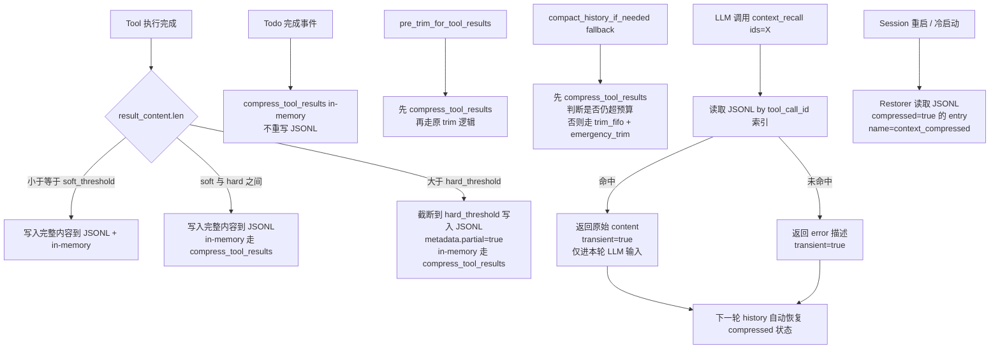

# ADR-032：Tool Result ID-Based Compression（占位符 + 按需召回调取）

**状态**：提议中
**日期**：2026-07-10
**决策者**：大鱼
**前置**：
- ADR-010（上下文压缩策略大幅简化）
- ADR-011（上下文摘要与蒸馏统一策略）
- ADR-014（Loop 模块分解）— 负责 `loop_context.rs` 所在位置

**细化**：ADR-010 §"明确放弃的策略" 中 "Tool result 日常折叠（`fold_tool_results`）" 的策略由本 ADR 重新引入并改造，从"程序化截断"升级为"占位符 + 按需召回"。LLM 摘要（80%）和 emergency_trim（95%）的兜底路径不变。

---

## 决策摘要

**核心思路**：对超出阈值的 tool result，在 in-memory `ChatMessage` 中替换为固定占位符（包含 entry id），原始内容保留在 JSONL 中不丢失。新增内置 `context_recall` tool，LLM 按 id 主动取回原文。

| Commit | 范围 | 风险 |
|--------|------|------|
| **C1** | `HistoryManager::compress_tool_results()` 纯函数 + 单测 | 低 |
| **C2** | `persist_and_emit_tool_results()` 软/硬阈值分流 + JSONL 元数据 | 中 |
| **C3** | `ContextRecallTool` 内置工具 + transient-return 通道 | 中（涉及 tool 执行管线） |
| **C4** | `compact_history_if_needed` fallback 路径前置 `compress_tool_results` + pre_trim / todos 完成触发点 | 低 |
| **C5** | Restorer 识别 `metadata.compressed=true` + 兼容读旧 JSONL | 低 |

**关键决策**（按对话时序）：

| 决策 | 理由 |
|------|------|
| 用 entry id 而非 `tool_call_id` 作为召回 key | entry id 在 JSONL 中是稳定的全局主键；`tool_call_id` 可能因 LLM 重试变化 |
| 占位符替换作用在 in-memory，**不在** JSONL | JSONL 是审计/回放真相来源，不允许内容丢失 |
| `context_recall` 返回值走 transient 通道，**不进** history | 否则一次召回就吃满窗口，下一轮立刻触发压缩，恶性循环 |
| 软阈值 2 KB / 硬阈值 64 KB（可配） | 64 字符太低，覆盖所有有意义 result；两档区分"窗口优化"和"防御性截断" |
| 默认压缩（每次 tool result 入库）+ 显式触发（todos 完成 / pre_trim / compact fallback）双轨 | 任何 agent 自动获得优化；todos 场景额外触发以彻底清理上阶段数据 |
| `context_recall` 支持批量 id（数组参数） | 减少 round-trip；LLM 一次召回多条平摊 overhead |
| placeholder 模板仅英文（v1） | 主线 LLM 多英文训练；i18n 后续单独 ADR |

---

## 影响范围

### C1（`HistoryManager::compress_tool_results`）

**新增**：
- `core/acowork-runtime/src/agent/history.rs`：
  - `pub fn compress_tool_results(messages: &mut [ChatMessage], soft_threshold_chars: usize)` — 扫描 messages，对 `MessageRole::Tool` 且 `content.len() > soft_threshold_chars` 的项替换为 placeholder 字符串；返回替换条数。
  - placeholder 字符串格式：`"[Tool result compressed. Original size: {N} chars. ID: {entry_id}. Call context_recall(id=\"{entry_id}\") to retrieve the full content if needed.]"`

**约束**：
- **纯函数**：不修改 `current_tokens` 计算，由调用方在替换后调一次 `recalibrate_tokens()` 或等价的 `set_max_tokens` + 重新计数路径。
- **不改 JSONL**：in-memory 替换后，写盘由调用方决定是否同步追加一条 `kind="compression_tool_result"` 标记（默认不写，C2 处理）。
- **不破坏 tool_call_id 配对**：placeholder 消息的 `tool_call_id` / `name` 字段保留。

**单测覆盖**：
- 软阈值边界（< / = / > 三档）
- 非 tool message（User / Assistant / System）跳过
- 已被压缩过的 entry（`metadata.compressed=true`）幂等不重复
- 占位符包含正确 entry id / 原始大小

### C2（`persist_and_emit_tool_results` 阈值分流）

**修改**：
- `core/acowork-runtime/src/agent/loop_tools.rs:849-865`：
  - 新增配置 `tool_result_soft_threshold_chars: usize`（默认 2048）+ `tool_result_hard_threshold_chars: usize`（默认 65536），从 `RuntimeConfigOverrides` / `AgentConfig` 解析。
  - 写入 JSONL 前判断：
    - `result.len() <= soft_threshold` → 写入完整内容 + in-memory 完整内容（现状）
    - `soft_threshold < result.len() <= hard_threshold` → 写入完整内容 + in-memory 走 `compress_tool_results` 替换为 placeholder（**C4 触发**；C2 仅改写盘逻辑）
    - `result.len() > hard_threshold` → **截断到 hard_threshold** + 追加 truncation marker（参照 `loop_context.rs:951` 的 `RESULT TRUNCATED` 风格），写入截断后内容 + `metadata.partial = true, metadata.original_size_chars = N`

**新增 JSONL metadata 字段**（`ConversationEntry.metadata`，向后兼容）：
- `compressed: bool` — 此 entry 在 in-memory 是否已被 placeholder 替换
- `original_size_chars: u64` — 截断前原始字符数（仅硬阈值触发时写入）
- `partial: bool` — JSONL 内内容是否已被硬阈值截断

**单测覆盖**：
- 三档分流正确性
- 截断 marker UTF-8 safe（参照 `loop_context.rs:938-946` 的 cut 逻辑）
- metadata 字段在低/中/高三档的写入与否

### C3（`ContextRecallTool` + transient-return 通道）

**新增**：
- `core/acowork-runtime/src/tools/builtin/context_recall.rs`：
  - `pub struct ContextRecallTool { session_file_path: PathBuf, model_for_counting: String }`
  - `ToolSpec::name = "context_recall"`，description 注明："Retrieve the full content of a tool result that was compressed during context trimming. Provide the `id` returned in the compressed marker." + JSON schema: `ids: string[]` (required, 1-20 entries)
  - `execute(params, _work_dir)`：解析 `ids` 数组 → 逐个读取 JSONL 找 `ConversationEntry { id, role: "tool_result" }` → 返回 `content` 拼接结果（保留 `tool_name` 前缀便于 LLM 识别）。失败 id 返回错误消息但不整体 fail。
- `core/acowork-runtime/src/tools/builtin/mod.rs`：在 `all_builtin_tools()` 注册 `context_recall`。

**transient-return 通道设计**（关键）：

| 通道 | 描述 | 实现位置 |
|------|------|----------|
| 普通 tool result | 走 `persist_and_emit_tool_results`，写 in-memory + JSONL | `loop_tools.rs:849` |
| Transient tool result | 仅注入**下一轮** LLM 请求的 `chat_request.messages`，**不写** in-memory history，**不写** JSONL | `loop_.rs` 或 `build_chat_request` 处 |

具体落地：
- `ToolResult` 结构体新增 `transient: bool` 字段（`acowork-core/src/tools/traits.rs`）。
- `execute_single_iteration` 处理 tool 结果循环时：
  ```rust
  // 伪代码
  for result in tool_results {
      if result.transient {
          // 不 append 到 history，不 append_message_to_conversation
          // 但要把 result.content 注入到下一轮 build_chat_request 的额外 slot
          pending_transient_results.push(result);
      } else {
          history.append(...);
          conversation.append_message(...);
      }
  }
  // build_chat_request 时
  let chat_req = context_builder.build(...);
  chat_req.messages.extend(transient_results.into_chat_tool_messages());
  ```
- `context_recall` 的 `execute()` 在 `ToolResult` 上设 `transient: true`。

**为什么需要 transient 而不是普通返回**：
- 普通返回会让一次 `context_recall` 调用把 64 KB 的内容塞进 history，触发下一轮 `pre_trim_for_tool_results` 再次压缩甚至 `compact_via_llm`，零收益。
- Transient 让 LLM 在"本轮看到原文"的同时，下一轮 history 自动恢复到 compressed 状态。

**单测覆盖**：
- `context_recall` 命中 / 未命中 / 部分命中 / 超过 20 id 上限
- Transient 通道：执行后 history 不增长、`build_chat_request` 包含 transient content、`chat_request.messages` 长度正确
- JSONL 不出现 `context_recall` 的 tool_call / tool_result 行

### C4（触发点整合）

**修改 1**：`compact_history_if_needed` fallback 路径前置
- `core/acowork-runtime/src/agent/loop_context.rs:417-431`：
  ```rust
  Err(e) => {
      // 1) 先尝试压缩所有 tool results（零成本，可能就够了）
      let compressed = self.session.history.compress_tool_results(SOFT_THRESHOLD);
      let new_tokens = self.session.history.token_count();

      // 2) 压缩后仍超 budget 才走 FIFO + emergency
      if new_tokens > budget {
          self.session.history.trim_fifo();
          if self.session.history.token_count() > budget {
              self.session.history.emergency_trim();
          }
      }
      // 3) 同步 truncate_large_messages 保留（防御性兜底）
      self.session.history.truncate_large_messages(budget / 4);
  }
  ```

**修改 2**：`pre_trim_for_tool_results` 前置
- `core/acowork-runtime/src/agent/loop_context.rs:843-865`：
  - 调用 `trim_history_to_budget` **之前**，先 `compress_tool_results`。两步合在一个新方法 `pre_trim_and_compress` 里，调用点替换。

**修改 3**：todos 完成触发点
- `core/acowork-runtime/src/tools/builtin/todo_write.rs`：
  - `TodoWriteTool::execute` 在检测到某个 todo 状态从 `in_progress` / `pending` 变为 `completed` 时，emit 一个内部事件（参考 `SessionMessage` 设计）。
  - Runtime 接收事件后调用 `compress_tool_results` 压缩**该 todo 开始之前**的所有 tool result。
- 简化方案（v1 推荐）：todos 触发只压缩**最近一次 todo 切换前**的所有 tool result，不做精细的"每个 todo 独立窗口"——后者要做 per-todo 元数据追踪，复杂度高收益小。

**单测覆盖**：
- 压缩 + FIFO 顺序：先压缩仍超预算才走 FIFO
- todos 触发压缩的范围正确（仅压缩切 todo 之前的）
- pre_trim_and_compress 后 token 计数与 in-memory 一致

### C5（Restorer 兼容 + 文档）

**修改**：
- `core/acowork-runtime/src/agent/session/restorer.rs:286-318`：
  - 解析 `tool_result` entry 时读取 `metadata.compressed` 字段；若为 `true`，在 `ChatMessage` 上设 `name = Some("context_compressed".to_string())` 作为标记（运行时 `compress_tool_results` 幂等检查用）。
  - **不**修改 content（保留 placeholder 字符串，因为 placeholder 内容已经自描述）。
- `docs/design/zh/15-conversation-persistence.md`：
  - 新增一节 "Tool Result 压缩标记"，描述 `compressed` / `partial` / `original_size_chars` 三个 metadata 字段。
- `docs/design/zh/03-agent-runtime.md`：
  - §②.5 三阶段压缩描述追加"tool result 占位符压缩（ADR-032）"作为 80% 之前的优化层。
- `docs/design/zh/12-tool-system.md`：
  - 工具清单追加 `context_recall`，permission 标记 `context:read`。
- `docs/adr/zh/ADR-010-context-compression-simplification.md`：
  - "明确放弃的策略"表中 "Tool result 日常折叠" 一行更新为：**"Tool result 占位符压缩（ADR-032 引入）—— 不同于原截断方案，原始内容保留在 JSONL，LLM 可主动召回"**。

**单测覆盖**：
- 旧 JSONL（无 metadata 字段）正常 restore，缺省 `compressed = false`
- 新 JSONL（带 compressed=true）restore 后 message 带正确 `name` 标记
- partial=true 的 entry restore 时 content 已含 truncation marker，不二次截断

---

## 背景

### 现状

ADR-010 确立了"程序化压缩不可靠，LLM 摘要才是唯一可靠手段"的核心原则，并明确放弃了 `fold_tool_results`（tool result 日常折叠）。但在 2026-07-10 与大鱼的讨论中，发现完全放弃程序化压缩存在**两个真实痛点**：

#### 痛点 1：tool result 截断是高频、低成本优化

编程 Agent 真实场景中，tool result 体积分布严重右偏：

| 场景 | 典型 size | 频率 |
|------|-----------|------|
| `shell` 短命令（`ls`、`pwd`） | < 200 chars | 高 |
| `file_read` 单文件 | 1-10 KB | 中 |
| `shell` 管道 / `cat` 长输出 | 10-500 KB | 中 |
| `content_search` 全仓库 grep | 50 KB - 数 MB | 中 |
| `web_fetch` 长文章 / `doc_reader` PDF | 100 KB - 数 MB | 低 |

ADR-010 的方案是"等 LLM 摘要"，意味着一次 `content_search` 输出 200 KB 后，in-memory 立即吃掉窗口的 10-20%。在 Anthropic Claude Sonnet 200K 窗口下，相当于 1-2 次大 grep 就把 history 撑到 80% 触发摘要。

**问题**：摘要一次的成本是 1 次远端 LLM 调用（数百 ms）+ 输出几 KB 摘要文本（再次进入窗口），而非必要的概率不低。能否在触发摘要之前，先用一个**零成本**的程序化操作把"可丢弃的废话"清理掉？

#### 痛点 2：todos 串行场景的特殊性

编程 Agent 经常按顺序执行多个 todo（例如：先调研 → 再设计 → 再实现 → 再测试）。每个阶段完成后，前一阶段的 tool result **几乎可以确定不再被引用**（除非 LLM 在下一阶段明确 recall）。

**当前方案的问题**：FIFO trim 在多轮累积后**可能**清掉，但触发时机不可控；LLM 摘要会把所有阶段混在一起，反而损失阶段性清晰度。

**理想方案**：每个 todo 完成时，把已完成的 todo 期间的 tool result 全部 placeholder 化。LLM 在下一阶段如果真需要旧数据，调用 `context_recall` 取回；不需要就保持压缩状态，省窗口。

### 关键洞察

**程序化压缩失败的根本原因不是"程序不能压缩"，而是"压缩后无法 recall"**。ADR-010 论证了"截断位置不可控、时序 ≠ 重要性、角色 ≠ 语义状态"，但所有这些论点都建立在"丢弃后无法取回"的前提上。

如果保留 JSONL 原文 + 提供按 id 召回的工具：
- **截断位置不可控** → 不再截断，整段替换为 placeholder（30-50 chars），位置可控性无关
- **时序 ≠ 重要性** → 重要性由 LLM 决定，LLM 不 recall 就丢弃，recall 就取回
- **角色 ≠ 语义状态** → 压缩后角色不变（仍是 `MessageRole::Tool`），LLM 协议层无感

**结论**：可以重新引入程序化压缩，但前提是"压缩 + 召回"必须配套。ADR-010 放弃 `fold_tool_results` 的结论仍然成立——**纯截断**的策略仍应放弃，**占位符 + 召回**是升级版。

### JSONL 现状已具备基础

`ConversationEntry { id, role, content, metadata }`（`core/acowork-runtime/src/conversation.rs:60-79`）的 schema 已经稳定：
- 每条 `tool_result` 都带自动生成的 UUID v4 作为 `id`（`conversation.rs:500`）
- `metadata.tool_call_id` / `tool_name` 已写入（`loop_tools.rs:858-861`）
- JSONL 是 append-only，所有原始数据永久保留

**意味着新方案不需要新存储结构**，只在 metadata 增加字段即可。这是本 ADR 能低成本落地的前提。

### 已否决的方案对比

| 方案 | 优点 | 否决原因 |
|------|------|----------|
| 完全维持 ADR-010（不引入程序化压缩） | 概念最简 | 痛点 1/2 不解决 |
| 重新引入 `fold_tool_results`（纯截断） | 实现简单 | ADR-010 已明确否决，信息丢失 |
| 把 tool result 写入 Grafeo 长期记忆 | 复用 memory_recall | Grafeo 是跨 session 长期记忆，session 内短期数据写 Grafeo 污染知识库；且检索语义不对（按 id 精确召回 vs 语义相似召回） |
| 用向量检索召回压缩的 tool result | 比按 id 召回更智能 | 增加 embedding 调用开销；按 id 召回足够覆盖 todos 场景；LLM 主动 recall 已经把"何时取回"的决策交给 LLM |

---

## 目标

1. **零成本清理大 tool result**：在 LLM 摘要触发前，用 O(N) 字符串替换把超大 tool result 替换为 ~50 chars 占位符，把 in-memory token 占用降到接近常数。
2. **信息零丢失**：JSONL 保留原始内容，所有 placeholder 都带 entry id 可精确召回。
3. **LLM 主动 recall**：新增 `context_recall` 内置工具，LLM 在需要时按 id 召回原文。
4. **todos 串行场景最优**：每个 todo 完成触发压缩上阶段数据，LLM 不显式 recall 就持续保持压缩状态。
5. **触发点最小侵入**：仅在 `persist_and_emit_tool_results`、`compact_history_if_needed` fallback、`pre_trim_for_tool_results`、todos 完成事件四个点接入，不改 LLM 主循环结构。
6. **协议层无感**：Anthropic / OpenAI tool_result 协议兼容（placeholder 仍是 string content）。
7. **向后兼容旧 JSONL**：未带 metadata 字段的旧 entry 正常 restore，不报错。

---

## 详细设计

### 数据流总览



### 关键数据结构

#### 1. placeholder 字符串模板

**英文版本（主线）**：
```
[Tool result compressed. Original size: {N} chars. ID: {entry_id}. Call context_recall(id="{entry_id}") to retrieve the full content if needed.]
```

**字符数估算**：~150 chars（含 entry id），按 4 chars/token 折算约 38 tokens。比当前 `min_per_result: 256` token（`loop_context.rs:912`）节省 **85%**。

**为什么这个长度合理**：
- 必须含 entry id（id 不带不可召回）
- 必须含原始大小（LLM 决策是否要 recall 的关键信号）
- 必须含召回指引（LLM 训练数据中未必见过这个工具，需要明确教调用方法）

#### 2. JSONL metadata 扩展

```rust
// core/acowork-runtime/src/conversation.rs
// 在 ConversationEntry.metadata 中（serde_json::Value），tool_result 类型的 entry 新增可选字段：
{
    "tool_name": "content_search",      // 已存在
    "tool_call_id": "toolu_01abc",      // 已存在
    "compressed": true,                 // 新增：in-memory 是否已 placeholder 化
    "original_size_chars": 47823,       // 新增：仅硬阈值截断时写入
    "partial": true                     // 新增：JSONL 内内容是否已被硬阈值截断
}
```

**字段语义**：

| 字段 | 值 | 含义 |
|------|---|------|
| `compressed` | `false` / 缺省 | in-memory 仍为完整内容（JSONL 是真相来源） |
| `compressed` | `true` | in-memory 已是 placeholder 字符串；JSONL 内仍是完整内容（除非 partial=true） |
| `partial` | `false` / 缺省 | JSONL 内是完整 tool result |
| `partial` | `true` | JSONL 内已被硬阈值截断（即便压缩后也不能完整召回，recall 必须告知 LLM） |
| `original_size_chars` | 数字 | 仅 `partial=true` 时有意义；LLM recall 时若看到 partial 能预知信息缺失 |

#### 3. transient-return 通道

```rust
// acowork-core/src/tools/traits.rs
#[derive(Debug, Clone)]
pub struct ToolResult {
    pub ok: bool,
    pub content: String,
    pub error: Option<String>,
    pub token_usage: Option<UsageInfo>,
    /// ADR-032: if true, this result is injected into the next LLM request
    /// messages but NOT appended to in-memory history and NOT persisted to
    /// JSONL. Used by `context_recall` to avoid re-triggering compression.
    /// Default: false.
    #[serde(default)]
    pub transient: bool,
}
```

**生命周期**：

| 阶段 | 处理 |
|------|------|
| Tool execute 返回 `ToolResult { transient: true, .. }` | 进入待注入列表（不进 history、不进 conversation） |
| `build_chat_request` | 把待注入列表转换为 `ChatMessage::tool(...)` 追加到 `chat_request.messages` 末尾（**仅本轮 LLM 输入**） |
| LLM 收到响应 | 待注入列表自动清空，下一轮重新从空开始 |
| 历史回放（restorer） | transient 消息不持久化，重启后不会复现 |

**关键不变式**：**任何 in-memory 的 `ChatMessage` 都对应一条 JSONL entry，反之不成立**。transient 打破"history ⊂ JSONL"的子集关系，但保持"JSONL 是 in-memory 的超集"——JSONL 仍是真相来源。

### 详细模块设计

#### 模块 A：`HistoryManager::compress_tool_results`

**位置**：`core/acowork-runtime/src/agent/history.rs`

```rust
impl HistoryManager {
    /// ADR-032: Replace tool result content with a compact placeholder for
    /// any tool result whose serialized length exceeds `soft_threshold_chars`.
    ///
    /// Pure function on the message slice. Does NOT recompute `current_tokens`
    /// (caller must call `recalibrate_tokens()` after the substitution).
    /// Does NOT modify the JSONL (the placeholder is in-memory only; JSONL
    /// always retains the full content).
    ///
    /// Idempotent: entries with `name == Some("context_compressed")` are
    /// skipped (they were already compressed in a previous round).
    ///
    /// Returns the number of messages that were compressed.
    pub fn compress_tool_results(
        &mut self,
        messages: &mut [ChatMessage],
        soft_threshold_chars: usize,
    ) -> usize { ... }

    /// Recompute `current_tokens` from scratch. O(N) but only called once
    /// after `compress_tool_results`.
    pub fn recalibrate_tokens(&mut self) { ... }
}
```

**实现要点**：
- 入口消息必须满足：
  - `role == MessageRole::Tool`
  - `name != Some("context_compressed")`（幂等保护）
  - `content.len() > soft_threshold_chars`
  - `tool_call_id.is_some()`（必须能反查 entry id；缺 `tool_call_id` 的 tool result 应已在 `sanitize_messages` 中被清理）
- placeholder 字符串构造：
  ```rust
  let original_size = msg.content.len();
  let entry_id = msg.tool_call_id.as_ref().unwrap(); // placeholder uses tool_call_id as id proxy
  msg.content = format!(
      "[Tool result compressed. Original size: {} chars. ID: {}. \
       Call context_recall(id=\"{}\") to retrieve the full content if needed.]",
      original_size, entry_id, entry_id
  );
  msg.name = Some("context_compressed".to_string());
  ```
- **重要**：这里用 `tool_call_id` 作为 placeholder 里的 "ID"，因为 `tool_call_id` 是 LLM 协议层的稳定标识符，LLM 已经认识这个 id；entry id（JSONL 的 UUID）LLM 不应直接接触，统一通过 `tool_call_id` 索引。`context_recall` 接收 `tool_call_id` 后内部映射到 JSONL entry id（通过 metadata.tool_call_id 索引）。

#### 模块 B：`persist_and_emit_tool_results` 阈值分流

**位置**：`core/acowork-runtime/src/agent/loop_tools.rs:849-865`

```rust
pub(crate) fn persist_and_emit_tool_results(
    &mut self,
    deduped_calls: &[ToolCall],
    tool_results: &[String],
) {
    let soft = self.core.tool_result_soft_threshold_chars;       // 默认 2048
    let hard = self.core.tool_result_hard_threshold_chars;       // 默认 65536

    if let Some(ref conversation) = self.session.conversation {
        for (tc, result_content) in deduped_calls.iter().zip(tool_results.iter()) {
            // 1) 硬阈值：截断到 hard_chars + marker
            let (jsonl_content, metadata) = if result_content.len() > hard {
                let mut cut = hard;
                while cut > 0 && !result_content.is_char_boundary(cut) {
                    cut -= 1;
                }
                let marker = format!(
                    "\n\n[RESULT TRUNCATED to fit persistence cap: original {} chars, \
                     persisted {} chars]",
                    result_content.len(), cut
                );
                let persisted = format!("{}{}", &result_content[..cut], marker);
                let mut m = serde_json::json!({
                    "tool_name": tc.function.name,
                    "tool_call_id": tc.id,
                    "partial": true,
                    "original_size_chars": result_content.len(),
                });
                // ... m 也可加 "compressed": true 如果 in-memory 走 placeholder
                (persisted, m)
            } else {
                let m = serde_json::json!({
                    "tool_name": tc.function.name,
                    "tool_call_id": tc.id,
                });
                (result_content.clone(), m)
            };

            // 2) JSONL 写入（软/硬都不改 JSONL 内容策略，JSONL 总存 "full or hard-truncated"）
            conversation.append_message("tool_result", &jsonl_content, Some(metadata));

            // 3) in-memory：根据 soft_threshold 决定是否立即 placeholder 化
            // C2 仅做 JSONL 侧的元数据，C4 引入触发点后才在 in-memory 侧 placeholder 化
            // 此处先留 hook：C4 接入 compress_tool_results 时改 messages
        }
    }
}
```

**为什么 C2 不立即在 in-memory 压缩**：
- C2 的目标是 JSONL schema 扩展，单测可独立验证。
- C4 引入的"todos 完成触发点"和"pre_trim 前置"才是压缩时机。C2 提前做会导致"每次 tool result 都压缩"，对短 result 不必要的 metadata 写入。

#### 模块 C：`ContextRecallTool`

**位置**：`core/acowork-runtime/src/tools/builtin/context_recall.rs`（新文件）

```rust
pub struct ContextRecallTool {
    session_file_path: PathBuf,
}

impl ContextRecallTool {
    pub fn new(session_file_path: PathBuf) -> Self { Self { session_file_path } }
}

#[async_trait]
impl Tool for ContextRecallTool {
    fn spec(&self) -> ToolSpec {
        ToolSpec {
            name: "context_recall".to_string(),
            description: "Retrieve the full content of one or more tool results \
                          that were compressed during context trimming. The `ids` \
                          parameter accepts tool_call_id values shown in \
                          '[Tool result compressed. ... ID: <id>. ...]' markers. \
                          Returned content is injected into the current LLM turn \
                          only and is NOT added to history; subsequent turns will \
                          show the compressed marker again unless the underlying \
                          data is preserved through other means (e.g., re-running \
                          the original tool)."
                .to_string(),
            input_schema: serde_json::json!({
                "type": "object",
                "properties": {
                    "ids": {
                        "type": "array",
                        "items": { "type": "string" },
                        "minItems": 1,
                        "maxItems": 20,
                        "description": "Tool call IDs (from the compressed marker) to retrieve"
                    }
                },
                "required": ["ids"]
            }),
        }
    }

    async fn execute(
        &self,
        params: Value,
        _work_dir: Option<&str>,
    ) -> acowork_core::error::Result<ToolResult> {
        let ids: Vec<String> = match params.get("ids").and_then(|v| v.as_array()) {
            Some(arr) => arr.iter().filter_map(|v| v.as_str().map(String::from)).collect(),
            None => return Ok(ToolResult::err("'ids' must be a non-empty array of strings")),
        };
        if ids.is_empty() || ids.len() > 20 {
            return Ok(ToolResult::err("'ids' must contain 1-20 entries"));
        }

        // Stream-read JSONL, find entries by tool_call_id in metadata
        let file = match std::fs::File::open(&self.session_file_path) {
            Ok(f) => f,
            Err(e) => return Ok(ToolResult::err(format!(
                "Cannot open session log: {}", e
            ))),
        };

        let reader = std::io::BufReader::new(file);
        use std::io::BufRead;
        let mut found: std::collections::HashMap<String, (String, Option<String>)> = ...;
        // key: tool_call_id, value: (content, tool_name)

        for line in reader.lines() {
            let line = match line { Ok(l) => l, Err(_) => continue };
            if line.trim().is_empty() { continue; }
            let entry: serde_json::Value = match serde_json::from_str(&line) {
                Ok(v) => v,
                Err(_) => continue,
            };
            if entry["role"].as_str() != Some("tool_result") { continue; }
            let tc_id = entry["metadata"]["tool_call_id"].as_str();
            if let Some(tc_id) = tc_id {
                if ids.contains(&tc_id.to_string()) && !found.contains_key(tc_id) {
                    let content = entry["content"].as_str().unwrap_or("").to_string();
                    let tool_name = entry["metadata"]["tool_name"].as_str().map(String::from);
                    let partial = entry["metadata"]["partial"].as_bool().unwrap_or(false);
                    let prefix = if partial { "[PARTIAL - original was truncated] " } else { "" };
                    found.insert(tc_id.to_string(), (
                        format!("{}{}", prefix, content),
                        tool_name,
                    ));
                }
            }
        }

        // Build result
        let mut out = String::new();
        let mut missing: Vec<String> = Vec::new();
        for id in &ids {
            match found.get(id) {
                Some((content, name)) => {
                    let label = name.as_deref().unwrap_or("tool");
                    out.push_str(&format!("--- tool_call_id={} (tool={}) ---\n{}\n\n", id, label, content));
                }
                None => missing.push(id.clone()),
            }
        }
        if !missing.is_empty() {
            out.push_str(&format!("\n[NOT FOUND] ids: {}", missing.join(", ")));
        }

        Ok(ToolResult {
            ok: true,
            content: out,
            error: None,
            token_usage: None,
            transient: true,  // 关键：不写 history / 不写 JSONL
        })
    }
}
```

**关键设计**：
- **按 `tool_call_id` 索引而非 entry id**：LLM 看到 placeholder 时只有 `tool_call_id`（更易识别，与 LLM 协议层对齐）。`context_recall` 内部用 `metadata.tool_call_id` 反查 JSONL。
- **partial=true 显式标记**：告知 LLM "召回的内容本身已经被截断，不是原文"，避免 LLM 误以为信息完整。
- **找不到不整体失败**：单 id 缺失只在该 id 上报错，整体 `ok: true`，LLM 可继续处理其他结果。

#### 模块 D：transient-return 通道在主循环的接入

**位置**：`core/acowork-runtime/src/agent/loop_.rs` 的 `execute_single_iteration`（大致在 tool_results 处理循环处）

```rust
// 伪代码片段
let mut pending_transient: Vec<ToolResult> = Vec::new();

for result in tool_results {
    if result.transient {
        pending_transient.push(result);
        // 不 append 到 history，不写 conversation
    } else {
        history.append(chat_msg_from(result));
        conversation.append_message("tool_result", &result.content, Some(meta));
    }
}

// 触发点（在 chat_request 构造前）
if !pending_transient.is_empty() {
    let transient_msgs: Vec<ChatMessage> = pending_transient.iter().map(|r| {
        ChatMessage {
            role: MessageRole::Tool,
            content: r.content.clone(),
            tool_call_id: pending_transient_tool_call_id(r),
            name: Some("context_recall".to_string()),
            ..Default::default()
        }
    }).collect();

    // 存入 AgentLoop 字段，下一轮 build_chat_request 时合并
    self.pending_transient_tool_msgs = transient_msgs;
}

// build_chat_request 时
pub(crate) fn build_chat_request(...) -> ChatRequest {
    let mut chat_request = context_builder.build(...);
    chat_request.messages.extend(self.pending_transient_tool_msgs.drain(..));
    chat_request
}
```

**AgentLoop 字段新增**：
```rust
pub struct AgentLoop {
    // ... 现有字段
    /// Transient tool results queued for the next LLM request only.
    /// Drained by `build_chat_request`. Never persisted.
    pending_transient_tool_msgs: Vec<ChatMessage>,
}
```

#### 模块 E：todos 完成触发点

**位置**：`core/acowork-runtime/src/tools/builtin/todo_write.rs`

```rust
impl TodoWriteTool {
    async fn execute(&self, params: Value, ...) -> Result<ToolResult> {
        // ... 解析 + 更新 todos 状态 ...

        // 检测状态切换：pending/in_progress → completed
        let newly_completed: Vec<String> = detect_newly_completed(&old_todos, &new_todos);

        if !newly_completed.is_empty() {
            // 通过现有 channel 发送内部事件
            self.todo_completed_tx.send(TodoCompletedEvent {
                completed_ids: newly_completed,
            }).ok();
        }

        Ok(ToolResult::ok("..."))
    }
}
```

**接收端**（`loop_.rs` 或 `session_task.rs`）：

```rust
// 已有 channel，添加新事件分支
match event {
    TodoCompletedEvent { completed_ids } => {
        // 简化方案：压缩最近 N=5 条 tool result（粗略对应"刚完成的 todo 期间"）
        // 不做 per-todo 精细窗口追踪，避免过度工程
        let to_compress = find_last_n_tool_results_before_last_user_msg(&self.session.history, 5);
        let mut slice: Vec<ChatMessage> = to_compress.into_iter().cloned().collect();
        let n = self.session.history.compress_tool_results(&mut slice, SOFT_THRESHOLD);
        // 写回 history（in-place）
        apply_compressed_back(&mut self.session.history, slice);
        self.session.history.recalibrate_tokens();
        tracing::info!(compressed = n, "Compressed tool results after todo completion");
    }
    _ => { /* 现有事件 */ }
}
```

**简化方案的局限**：v1 不做 per-todo 窗口，N=5 是经验值。可在未来需要时升级为 "每个 todo 维护 tool_call_id 集合 → 完成后按集合压缩"。

### 与现有压缩层次的协作

ADR-010 确立的三阶段策略 + 本 ADR 的占位符压缩，构成四层防护：

| 层 | 触发条件 | 行为 | 成本 |
|----|---------|------|------|
| **L0: Tool result 占位符压缩**（本 ADR 新增） | tool result > 2 KB（默认） | 字符串替换 ~50 chars placeholder | O(N)，零 LLM |
| **L1: 监控 / 警告** | history > 70% | 日志 + L0 兜底 | 零成本 |
| **L2: LLM 摘要** | history > 80% | `compact_via_llm` + `replace_middle_with_summary` | 1 次远端 LLM |
| **L3: Emergency trim** | history > 95% / API ContextOverflow | `emergency_trim` 保留最后 4 条非 system | 零 LLM |

**预期收益**：大多数情况下 L0 就把 history 压在 80% 以下，**L2 几乎不会被触发**。原本每 session 平均 1-2 次 LLM 摘要调用可能降到 0-1 次。

**与 L2 的协作**：如果 L0 + L1 仍触发 L2，L2 的输入仍是完整 history（含 placeholder），LLM 看到的 tool result 是 placeholder 字符串本身（~150 chars），比完整内容（数十 KB）更省 prompt tokens。

**与 L3 的协作**：L3 是 FIFO 兜底，**不再** truncate_large_messages 调用任何 tool result——因为 tool result 在 L0 已经是 placeholder 或完整小内容，不会再有 "单条 msg 占 budget/4" 的情况。

### JSONL 演化样例

**v1（旧格式）**：
```json
{"id":"a1b2","ts":"...","role":"tool_result","content":"<200KB grep 输出>","metadata":{"tool_name":"content_search","tool_call_id":"toolu_xyz"}}
```

**v2（本 ADR 后）**：
```json
{"id":"a1b2","ts":"...","role":"tool_result","content":"<200KB grep 输出>","metadata":{"tool_name":"content_search","tool_call_id":"toolu_xyz","compressed":true,"partial":true,"original_size_chars":204853}}
```

JSONL 侧的 `content` 仍是完整（或 hard-truncated）原文，**仅 metadata 多 3 个字段**。磁盘占用增加 < 100 bytes / 条。

### 协议兼容性验证

**Anthropic**（`providers/anthropic.rs:442-476`）：
- tool_result content 是 user message 内嵌的 tool_result content block，string content 兼容。
- placeholder 是合法 string，LLM 看到无报错。
- **风险**：极小，placeholder 是纯 ASCII。

**OpenAI**（`providers/openai.rs:328`）：
- tool_result 是独立 `role: "tool"` 消息，content 是 string。
- placeholder 兼容。
- **风险**：极小。

**需验证点**：
- 部分 provider 对 tool_result content 有最大长度限制（Anthropic 是 100KB 一条）。如果 placeholder 字符串超过限制会报错（不会，原 placeholder 仅 150 chars）。
- 如果 JSONL 内 hard-truncated content 超过 100KB（默认 hard 64KB 不会），需要更低的 hard 阈值。建议 hard 64KB + provider 100KB 余量，验证通过。

### 配置接口

**RuntimeConfigOverrides 扩展**（`core/acowork-core/src/protocol.rs`）：
```rust
pub struct RuntimeConfigOverrides {
    // ... 现有字段
    /// ADR-032: Soft threshold (chars) for in-memory tool result compression.
    /// Results above this are replaced with a placeholder; JSONL keeps full.
    /// None = use default (2048).
    pub tool_result_soft_threshold_chars: Option<usize>,
    /// ADR-032: Hard threshold (chars) for JSONL-side truncation.
    /// Results above this are truncated before write; metadata.partial=true.
    /// None = use default (65536).
    pub tool_result_hard_threshold_chars: Option<usize>,
}
```

**AgentConfig 扩展**（`core/acowork-runtime/src/agent_config.rs`）：
- `agent_config.json` 新增两个可选字段（缺省值与 `RuntimeConfigOverrides` 默认一致：`soft_threshold_chars=2048`, `hard_threshold_chars=65536`）。

---

## 影响

### 代码改动汇总

| Commit | 文件 | 类型 | LOC 估算 |
|--------|------|------|----------|
| C1 | `core/acowork-runtime/src/agent/history.rs` | 新增 `compress_tool_results` / `recalibrate_tokens` + 单测 | +180 / -10 |
| C1 | `core/acowork-runtime/src/agent/history.rs` | `is_compaction_marker` 旁加 `is_compressed_marker` | +5 |
| C2 | `core/acowork-runtime/src/agent/loop_tools.rs:849-865` | 阈值分流 + JSONL metadata | +60 / -10 |
| C2 | `core/acowork-runtime/src/conversation.rs` | metadata 字段文档（无结构变更） | +20 / 0 |
| C3 | `core/acowork-runtime/src/tools/builtin/context_recall.rs` | 新文件 + 单测 | +350 / 0 |
| C3 | `core/acowork-runtime/src/tools/builtin/mod.rs` | 注册 `context_recall` | +10 |
| C3 | `acowork-core/src/tools/traits.rs` | `ToolResult.transient: bool` 字段 | +10 |
| C3 | `core/acowork-runtime/src/agent/loop_.rs` | 主循环接入 transient 通道 | +50 / -10 |
| C3 | `core/acowork-runtime/src/agent/loop_.rs` | `AgentLoop` 字段新增 `pending_transient_tool_msgs` | +5 |
| C4 | `core/acowork-runtime/src/agent/loop_context.rs:417-431` | fallback 路径前置 compress | +20 / -10 |
| C4 | `core/acowork-runtime/src/agent/loop_context.rs:843-865` | pre_trim 整合 | +15 / -5 |
| C4 | `core/acowork-runtime/src/tools/builtin/todo_write.rs` | 完成事件发送 | +25 |
| C4 | `core/acowork-runtime/src/agent/loop_.rs` | 完成事件接收 + 简化压缩 | +40 |
| C5 | `core/acowork-runtime/src/agent/session/restorer.rs:286-318` | 识别 `compressed=true` | +15 / -5 |
| C5 | 多文档 | 见下表 | +50 / -5 |
| **合计** | | | **~855 / -55** |

### 设计文档同步

| 文档 | 变更 |
|------|------|
| `docs/design/zh/03-agent-runtime.md` | §②.5 压缩策略加 L0 层；说明 transient 通道 |
| `docs/design/zh/12-tool-system.md` | 工具清单追加 `context_recall`；permission 标记 `context:read` |
| `docs/design/zh/15-conversation-persistence.md` | 新增 "Tool Result 压缩标记" 节，描述 metadata 扩展 |
| `docs/adr/zh/ADR-010-context-compression-simplification.md` | "明确放弃的策略" 表中 "Tool result 日常折叠" 一行更新（标注由 ADR-032 重新引入并升级为占位符+召回方案） |
| `docs/adr/zh/ADR-014-loop-module-decomposition.md` | §transient 通道在 `loop_.rs` 的归属说明（如果适用） |
| `examples/*/config/agent_config.json` | 可选：暴露 `tool_result_*_threshold_chars` 配置示例 |

### 与现有压缩层次的交互

| 现有模块 | 交互 | 改动方向 |
|----------|------|----------|
| `loop_context.rs::compact_history_if_needed` | L2 LLM 摘要前可调用 `compress_tool_results` 预清（可选优化） | 增强：可选在 L2 之前先调一次 |
| `loop_context.rs::pre_trim_for_tool_results` | L1 触发时先压缩再 trim | **必须改**：避免 trim 掉已 placeholder 的 tool result（顺序敏感） |
| `loop_context.rs::trim_tool_results_for_context` | 现状按比例切到 remaining/n | **可保留**：作为 L3 emergency 路径兜底，但 L0 已压缩后通常用不到 |
| `loop_context.rs::check_context_overflow_and_trim` | 90% hard 阈值 | 不改：行为不变 |
| `history.rs::truncate_large_messages` | budget/4 单条截断 | **建议弱化**：L0 已压缩后此函数命中率显著下降；保留但不再作为主路径 |
| `loop_tools.rs::persist_and_emit_tool_results` | 工具结果入库 | **必须改**：新增阈值分流 |
| `restorer.rs::restore_history_from_jsonl` | JSONL → in-memory | **必须改**：识别 `compressed` 标记 |
| `session/restorer.rs::drop_orphan_tool_results` | orphan tool_result 清理 | 不改：placeholder 仍带 `tool_call_id`，配对不受影响 |

### 协议层兼容性

| Provider | 兼容性 | 验证方式 |
|----------|--------|----------|
| Anthropic Claude | ✅ 兼容 | tool_result content 是 user message 内嵌 block，string content 无 protocol 限制 |
| OpenAI / 兼容 | ✅ 兼容 | tool role 独立消息，content 是 string |
| Ollama / 本地模型 | ✅ 兼容 | 同 OpenAI 协议 |
| Custom HTTP provider | 待验证 | 需要在 `acowork-core/src/providers/` 目录下做集成测试 |

**验证要求**：C3 完成后，必须跑一遍 `core/tests/` 下的端到端测试，覆盖 Anthropic / OpenAI / Ollama 三种 provider，确保 placeholder content 不被 provider 拒绝。

---

## 测试策略

### 单元测试（每个 commit 必跑）

| 模块 | 测试覆盖 |
|------|----------|
| `compress_tool_results` | 阈值边界、幂等性、role 过滤、name 字段正确 |
| `recalibrate_tokens` | 压缩前后 token 计数正确性 |
| `persist_and_emit_tool_results` 三档分流 | 软/硬阈值各档 metadata 字段正确；UTF-8 safe 截断 |
| `ContextRecallTool::execute` | 命中 / 未命中 / 部分命中 / > 20 ids / 文件不存在 / 损坏行跳过 |
| Transient 通道 | execute 后 history 不增长；build_chat_request 包含 transient content；重启后不复现 |
| todos 完成事件 | 完成事件触发压缩范围正确；非完成事件不触发 |
| Restorer | 旧 JSONL 正常；新 JSONL `compressed=true` name 正确；`partial=true` 不二次截断 |

### 集成测试（C5 必跑）

1. **端到端压缩-召回循环**：
   - 触发一个 `content_search` 输出 200KB → L0 压缩为 placeholder → LLM 调用 `context_recall` → transient 返回原文 → LLM 基于原文继续回答。
2. **todos 触发压缩**：
   - 设置 todos [调研, 设计, 实现] → 执行调研阶段多个 tool → 标记调研完成 → 检查 in-memory 是 placeholder → 进入设计阶段。
3. **跨 session 持久化**：
   - session 中所有 tool result 都被压缩 → 关闭 session → 重启 session → 确认 history 是 placeholder 状态 → LLM 调用 `context_recall` 仍能召回原文。
4. **provider 兼容性**：
   - 分别用 Anthropic / OpenAI / Ollama 三种 provider 跑测试 1，确认无 protocol 错误。

### 回归测试

- `cargo clippy --all-targets -- -D warnings` 必须通过
- `cargo test --workspace` 必须通过
- `cargo test --test integration` 端到端必须通过
- 已有 `compress_via_llm` / `emergency_trim` 相关单测必须继续通过（验证 L2/L3 路径未坏）

---

## 迁移路径

### Phase 1（C1-C2）：基础设施

**目标**：在不动主流程的前提下，建立 `compress_tool_results` 函数和 JSONL metadata schema。

**验证**：
- `cargo test --workspace` 通过
- 新增单测全部通过
- 现有 JSONL 写入路径行为不变（metadata 新字段缺省 false，序列化输出兼容）

**风险**：低。仅新增函数和 schema 字段。

### Phase 2（C3）：transient 通道 + context_recall

**目标**：tool 执行管线支持 transient-return，新增 `context_recall` 内置工具。

**验证**：
- 主循环单测覆盖 transient 通道
- `context_recall` 单测和集成测试通过
- 现有所有 tool（`memory_recall` / `file_read` 等）的执行管线单测继续通过

**风险**：中。`execute_single_iteration` 是核心循环，需要谨慎 review。

**回滚方案**：C3 拆为 C3a（仅 `ToolResult.transient` 字段 + 主循环支持）+ C3b（`context_recall` 工具注册）。若 C3a review 不通过，先回滚 C3b 单独发布。

### Phase 3（C4）：触发点接入

**目标**：四个触发点接入 L0 压缩。

**验证**：
- todos 完成事件单元测试 + 集成测试
- pre_trim 整合后 token 计数正确性
- compact fallback 路径压测（模拟 200KB tool result × 5 条）

**风险**：低。每个触发点改动局部。

### Phase 4（C5）：Restorer + 文档

**目标**：冷启动路径兼容新旧 JSONL，文档完整。

**验证**：
- Restorer 单测 + 集成测试
- ADR-010 §"明确放弃的策略" 表更新到位
- 03-agent-runtime.md / 12-tool-system.md / 15-conversation-persistence.md 三篇文档同步

**风险**：低。

---

## 后果

### 正面

1. **window 利用率显著提升**：单条 200KB 的 `content_search` 在 in-memory 从 ~50K tokens 降到 ~38 tokens（99.9% 节省）。典型多 grep 场景下，LLM 摘要触发频率从每 session 1-2 次降到 0-1 次。
2. **JSONL 不丢失信息**：所有 tool result 原文永久保留，回放 / 审计 / `context_recall` 都可取回。**这是 ADR-010 否决 `fold_tool_results` 的根本原因，本 ADR 通过"占位符 + 召回"绕开这个否决**。
3. **LLM 摘要成本下降**：L2 触发频率降低，对应远端 LLM 调用次数下降，按每 session 1 次摘要节省 ~$0.02 估算，大规模部署有可观成本节省。
4. **todos 串行场景最优**：每个 todo 完成时主动清理上阶段数据，不需要等 FIFO 或 L2 触发。这是 LLM 主动行为驱动的（todo 完成），不是被动等窗口满。
5. **协议层无感**：Anthropic / OpenAI / Ollama 三大 provider 全部兼容，无需 provider 侧改动。
6. **向后兼容**：旧 JSONL 不带 metadata 字段正常 restore；旧 runtime 不升级也不影响 JSONL schema（仅多写 metadata，老 reader 忽略）。
7. **可观测性提升**：JSONL metadata 新增 `compressed` / `partial` / `original_size_chars` 三个字段，便于后续做 session 统计、压缩率分析、cost dashboard。

### 负面

1. **新增 tool surface**：每个 agent 都暴露 `context_recall` tool，LLM 在不需要时也可能误调。**缓解**：tool description 明确写"仅在 placeholder 出现且确实需要原文时调用"，并放在 LLM 训练语料中较常见的 "memory_*" 风格命名空间。
2. **transient 通道引入主循环复杂度**：`ToolResult.transient` 字段需要在 tool 执行管线、history append、conversation append、build_chat_request 四处协同。**缓解**：C3 单测覆盖完整链路；主循环 review 重点关注。
3. **JSONL 体积微增**：metadata 新增 3 个字段，每条 ~50-100 bytes，单 session 累积可忽略。
4. **todos 简化方案不精确**：v1 用 "最近 N=5 条 tool result" 替代 per-todo 窗口，可能误压或漏压。**缓解**：N 值可配 + 后续有真实数据后再升级为精细窗口。
5. **JSONL 流式读取性能**：`context_recall` 在大量 tool result 场景下需要扫整段 JSONL 找指定 id。**缓解**：先全文件扫一遍建立 `tool_call_id → (offset, line)` 索引（在 `ConversationWriter` 维护 memory-side 索引）；或者用一次 BufReader 顺序扫描 + HashSet 命中即停（当前设计）。

### 与 ADR-010/011 的关系

| 关系 | 说明 |
|------|------|
| **扩展而非替代** | L1/L2/L3 三阶段策略完全保留；本 ADR 新增 L0 作为 70% 之前的预清理 |
| **保留 ADR-010 §"明确放弃的策略"** | 纯截断的 `fold_tool_results` 仍应放弃，本 ADR 用占位符 + 召回代替 |
| **保留 ADR-011 §"摘要即蒸馏"** | L2 LLM 摘要的输入仍是完整 history（含 placeholder），摘要文本仍写入 Grafeo；占位符字符串对摘要 LLM 是合法的语义输入 |
| **保留 ADR-011 §"Memory Recall 保持不变"** | `memory_recall` 仍只查 Grafeo，不做 JSONL 检索；本 ADR 的 `context_recall` 是 JSONL 侧的精确按 id 召回，与 memory_recall 职责正交 |
| **JSONL 与 Grafeo 职责** | JSONL：session 内短期数据 + 精确按 id 召回；Grafeo：跨 session 长期记忆 + 语义检索。两者通过 L2 摘要串联（摘要文本写入 Grafeo），互不干扰 |

---

## Open Questions（需要讨论决定）

1. **C2 的 JSONL metadata 是否对所有 tool result 写入 `compressed: false`，还是仅当被压缩时写入 `true`？**
   - 方案 A：所有 tool_result 都写 `compressed: false` 显式字段（schema 更一致，restorer 总是读这个字段）
   - 方案 B：仅当压缩时才写 `compressed: true`（更紧凑，未压缩 entry 的 metadata 不变）
   - **倾向 B**：保持向后兼容性最大（现有 JSONL entry 已经是这种"缺省 = false"语义）。
   - **需要大鱼确认**。

2. **`context_recall` 是否需要在 partial=true 时拒绝返回？**
   - 方案 A：返回截断版本 + 标记 `partial=true`，让 LLM 决定是否需要重跑原 tool
   - 方案 B：直接报错，让 LLM 改用 `shell` / `content_search` 等原 tool 重跑
   - **倾向 A**：保留信息给 LLM，符合"信息零丢失"原则。
   - **需要大鱼确认**。

3. **todos 完成触发的压缩范围 N=5 是否合理？**
   - 太小（<3）：可能漏压，触发频率高
   - 太大（>20）：可能误压掉下一阶段仍需���的数据
   - **倾向 N=5**：经验值，后续看真实数据调整；可配。
   - **需要大鱼确认**。

4. **placeholder 字符串的语言是否需要 i18n？**
   - v1 仅英文模板（决策摘要已定）
   - i18n 后续单独 ADR（不在本 ADR 范围）
   - **已确定**，无需决策。

5. **`context_recall` 是否限制为仅本 agent 可调用？**
   - 当前设计：所有 agent 共享同一 JSONL 命名空间（按 session_id 隔离）
   - 跨 agent recall 不应该发生（每个 agent 有自己的 session）
   - **无需处理**：tool 自动绑定当前 agent 的 session_file_path，跨 agent 不可能。
   - **仅确认，无需决策**。

---

## 参考

- `core/acowork-runtime/src/agent/loop_context.rs` — 现有压缩策略总入口
- `core/acowork-runtime/src/agent/history.rs:481-523` — `truncate_large_messages`（参考截断 marker 风格）
- `core/acowork-runtime/src/agent/loop_context.rs:877-977` — `trim_tool_results_for_context`（参考 UTF-8 safe cut）
- `core/acowork-runtime/src/agent/loop_tools.rs:849-865` — `persist_and_emit_tool_results`（C2 改造点）
- `core/acowork-runtime/src/agent/session/restorer.rs:286-318` — tool_result restore（C5 改造点）
- `core/acowork-runtime/src/tools/builtin/memory_recall.rs` — 现有 builtin tool 的样板（C3 仿写）
- `docs/adr/zh/ADR-010-context-compression-simplification.md` — 本 ADR 的前置
- `docs/adr/zh/ADR-011-compaction-as-distillation.md` — 本 ADR 的协作方

