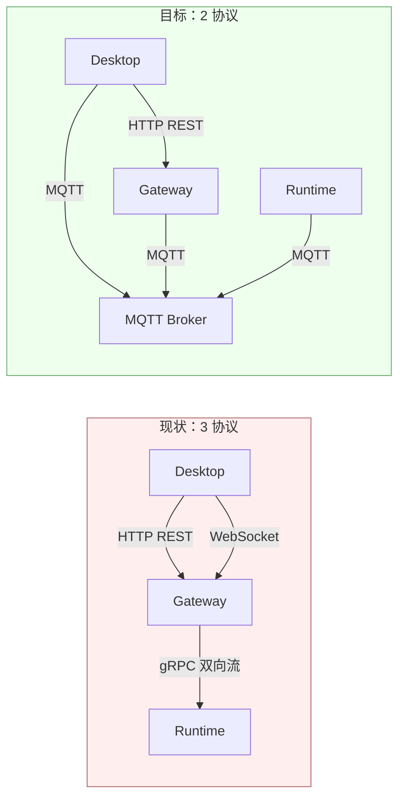
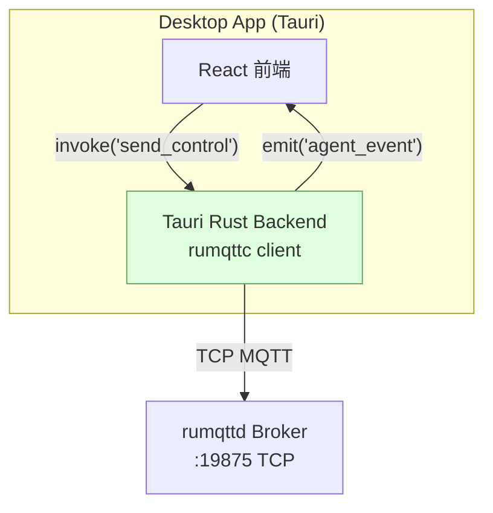
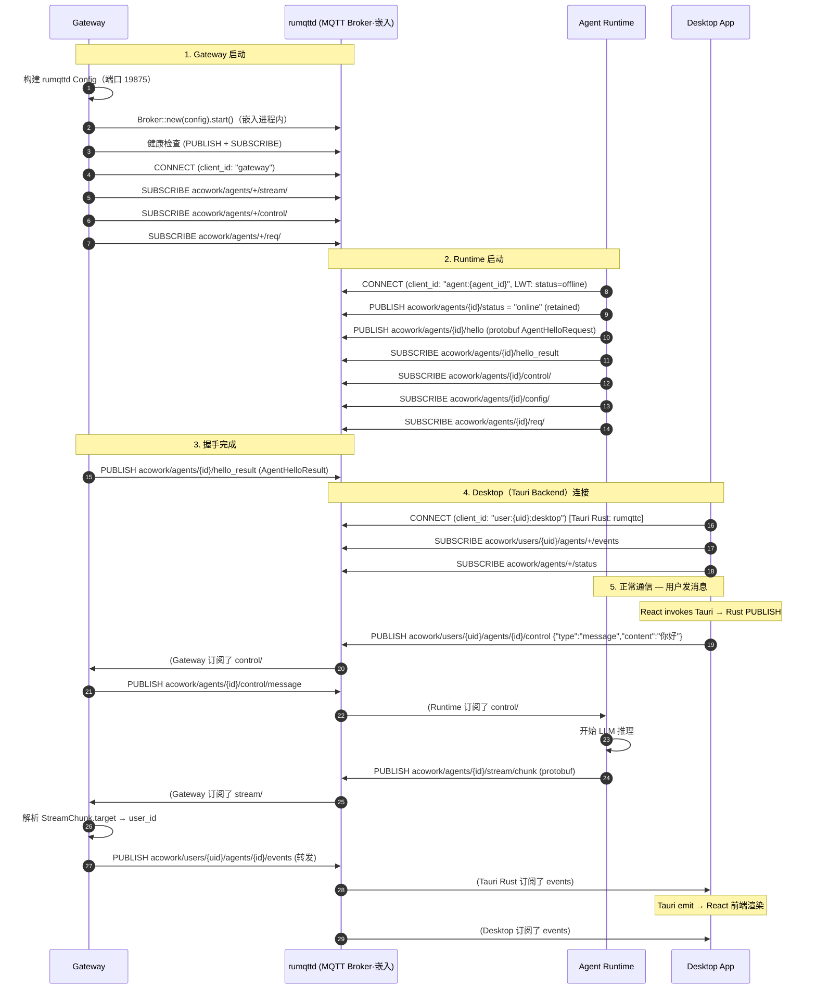
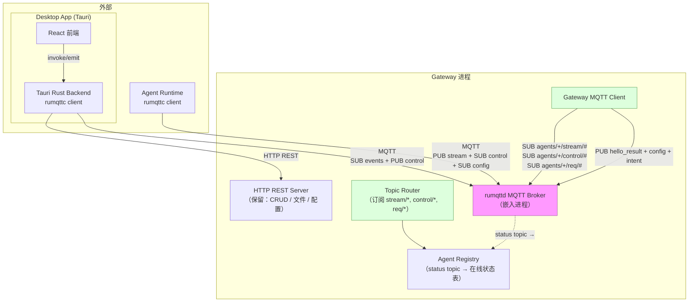
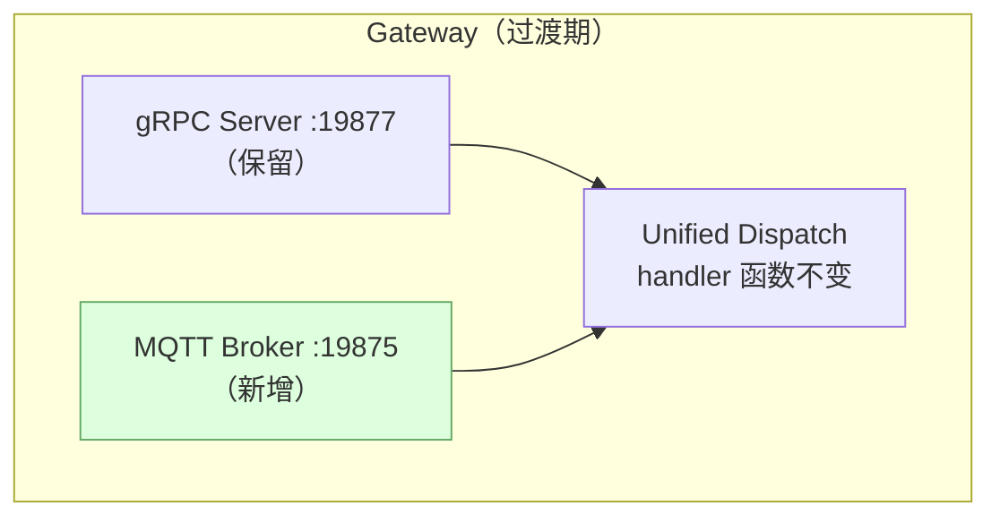

# ADR-033：引入 MQTT 替换 gRPC + WebSocket — Gateway 协议栈统一

**状态**：提案
**日期**：2026-07-11
**决策者**：大鱼
**前置**：
- ADR-031（废弃旧 IPC 通道残留 — 全面收敛到 gRPC）
- ADR-020（数据流分层）
- ADR-021（统一会话数据加载）

---

## 决策摘要

**用 MQTT 替换 gRPC（Gateway ↔ Runtime IPC）和 WebSocket（Desktop ↔ Gateway 流式事件），HTTP REST 保持不变。**



| 维度 | 现状 | 目标 |
|------|------|------|
| 协议数量 | 3（HTTP + WebSocket + gRPC） | 2（HTTP + MQTT） |
| Gateway 内部组件 | HTTP Server + WS Relay + gRPC Server + Session Manager + Bridge 事件总线 | HTTP Server + MQTT Broker + Topic Router |
| Agent 生命周期管理 | 手工 GrpcSession 注册/清理 | MQTT Will Message + Retained Message |
| 事件转发路径 | Runtime → gRPC → broadcast channel → WebSocket task → Desktop | Runtime → MQTT Broker → Desktop（直通，无需 Bridge） |
| 多用户扩展 | 需改造 HTTP 路由 + Bridge 过滤 | Topic 层级 `users/{uid}/...` 天然隔离 |
| 改动代码量 | — | ~5,900 行删除 + ~2,750 行新增 |

---

## 背景与动机

### 当前协议栈的问题

经过 ADR-031 收敛后，Gateway 有三套协议在跑：

| 协议 | 通道 | 职责 |
|------|------|------|
| HTTP REST（Axum） | Desktop ↔ Gateway | Agent CRUD、配置、文件上传、会话查询 |
| WebSocket（Axum ws） | Desktop ↔ Gateway | 聊天流式事件推送（chunk/tool_call/done 等 22 种事件） |
| gRPC（Tonic） | Gateway ↔ Runtime | 双向流 IPC：Intent 下发、StreamChunk 上报、资源同步、请求-响应 |

三个痛点：

**痛点 1：Bridge 事件总线是架构中最脆弱的环节**

```
Runtime ──gRPC StreamChunk──▶ Gateway ──broadcast::channel──▶ WebSocket task ──▶ Desktop
                                ↑
                          BridgeEvent 22 种类型
                    手动 from_action() 字符串匹配
```

Gateway 内部需要一个 `tokio::sync::broadcast` channel 把 gRPC 事件"翻译"成 WebSocket JSON 帧。每新增一个事件类型，要同步改三个地方（proto、BridgeEventType、WebSocket handler）。Broker 本身就是事件总线——无需手动维护这个翻译层。

**痛点 2：GrpcSession 手工生命周期管理不可靠**

当前 `GrpcSessionManager` 靠 gRPC stream `drop` 触发 `remove_session()`。如果 Runtime 进程被 `kill -9`，TCP 连接可能不会立即断开（取决于 OS 的 TCP keepalive 配置），导致 Gateway 长时间以为 Agent 仍在线。

MQTT 的 **Will Message** 是协议层级的保证——Broker 检测到 TCP 断开后自动发布 retained 遗嘱消息，不存在"幽灵在线"。

**痛点 3：多用户扩展需大量改造**

当前绑定 `127.0.0.1`，单机单用户。要支持多用户（多人同时连接同一 Gateway），需要：
- HTTP API 层加 user context 传递
- Bridge 事件加 user 过滤
- gRPC session 关联 user

MQTT 的 topic 层级 `users/{uid}/agents/{aid}/...` 天然提供多租户隔离，ACL 权限控制也是 MQTT Broker 的标配功能。

### 为什么是 MQTT

Agent 的生命周期天然契合 IoT 设备管理模型：

| IoT 概念 | Agent 映射 | MQTT 原语 |
|----------|-----------|----------|
| 设备上线 | Agent Runtime 启动并连接 | CONNECT + `agents/{id}/status` = `online`（retained） |
| 设备下线 | Agent Runtime 退出/崩溃 | Will Message 自动发布 `offline` |
| 心跳保活 | 30s 无消息即判定离线 | MQTT Keep Alive |
| 设备状态上报 | StreamChunk、UsageReport | PUBLISH 到对应 topic |
| 控制指令下发 | IntentReceived（chat_message/stop/model_switch） | PUBLISH 到 `agents/{id}/control` |
| 固件升级 | Provider 列表热更新、Config 变更 | PUBLISH 到 `agents/{id}/config/update` |

Gateway 的职责从"HTTP Server + WS Relay + gRPC Server + Session Manager + Bridge Bus"收敛为"**HTTP Server + MQTT Broker + Topic Router**"，架构更清晰。

---

## 方案对比

### 被否决的替代方案

#### 方案 A：WebSocket → SSE（Server-Sent Events）

只替换 WebSocket，保留 gRPC。协议从 3 降到 2.5（HTTP + SSE + gRPC）。

- ✅ 改动量最小（只改 Desktop 订阅端和 Gateway 推送端）
- ❌ 不解决 gRPC 的痛点（Session 管理、Bridge 事件总线）
- ❌ SSE 是单向推送，Desktop → Gateway 的控制指令仍需 HTTP POST → gRPC 转发，链路不变

#### 方案 B：gRPC-web 统一前后端

Desktop App 也走 gRPC-web，Gateway 只暴露 gRPC。

- ✅ 协议统一为 1（全是 gRPC）
- ❌ gRPC-web 需要 Envoy/gRPC Gateway 做 HTTP/1.1 → HTTP/2 转换
- ❌ 浏览器端 gRPC-web 生态不如 MQTT（无原生 stream cancel、无 Will Message）
- ❌ 仍然解决不了设备生命周期管理问题

### 选择 MQTT 的理由

| 维度 | 现状 | MQTT 方案 |
|------|------|----------|
| Bridge 事件总线 | 需要独立 broadcast channel + 22 种事件类型匹配 | **不需要** — Broker 即事件总线 |
| Agent 生命周期 | 手工管理 GrpcSession（注册/清理/超时） | **Will Message + Keep Alive 原生支持** |
| 多用户扩展 | 需改造 HTTP 路由 + Bridge 过滤 | **Topic 层级天然隔离 + ACL** |
| 协议数量 | 3 | **2**（HTTP + MQTT） |
| 请求-响应 | gRPC request_id + oneshot | **MQTT 5.0 Response Topic + Correlation Data** |
| 流式性能 | WebSocket 帧（~2-10B 头） | **MQTT PUBLISH（~4B 头+ topic）** — 实测通知节流 500ms，流量可忽略 |

---

## 详细设计

### 1. MQTT Topic 树

```
acowork/                                          # 根前缀
├── agents/{agent_id}/
│   ├── status                                    # [Retained] "online" | "offline"
│   ├── hello                                     # Runtime → Gateway: 握手（替代 AgentHello）
│   ├── hello_result                              # Gateway → Runtime: 握手响应（替代 AgentHelloResult）
│   ├── ready                                     # Runtime → Gateway: 就绪（替代 AgentReady）
│   ├── stream/
│   │   ├── chunk                                 # Runtime → Gateway: LLM chunk
│   │   ├── tool_call                             # Runtime → Gateway: 工具调用
│   │   ├── tool_result                           # Runtime → Gateway: 工具结果
│   │   ├── done                                  # Runtime → Gateway: 本轮完成
│   │   ├── error                                 # Runtime → Gateway: 错误
│   │   └── stopped                               # Runtime → Gateway: 已停止
│   ├── control/                                  # Gateway/Desktop → Runtime
│   │   ├── message                               # 发送聊天消息
│   │   ├── stop                                  # 中断生成
│   │   ├── model_switch                          # 切换模型
│   │   ├── reasoning_effort                      # 设置推理强度
│   │   └── compact_context                       # 触发上下文压缩
│   ├── config/
│   │   └── update                                # [Gateway→Runtime] 配置变更（替代 RuntimeConfigUpdate）
│   ├── provider/
│   │   └── update                                # [Gateway→Runtime] Provider 列表变更
│   ├── usage                                     # Runtime → Gateway: 用量上报
│   ├── req/                                      # 请求-响应（MQTT 5.0）
│   │   ├── memory/query                          # [Gateway→Runtime] Memory 查询
│   │   ├── memory/stats                          # [Gateway→Runtime] Memory 统计
│   │   ├── memory/consolidate                    # [Gateway→Runtime] Memory 整合触发
│   │   ├── memory/delete                         # [Gateway→Runtime] Memory 删除
│   │   ├── session/state                         # [Gateway→Runtime] 会话状态查询
│   │   ├── session/latest                        # [Gateway→Runtime] 最新会话查询
│   │   ├── config/query                          # [Gateway→Runtime] 配置快照查询
│   │   ├── capability/query                      # [Gateway→Runtime] 能力查询
│   │   ├── budget/query                          # [Gateway→Runtime] 预算查询
│   │   ├── key/release                           # [Gateway→Runtime] API Key 申请
│   │   └── rate/acquire                          # [Gateway→Runtime] 速率令牌申请
│   │   └── res/{correlation_id}                  # Runtime → Gateway: 请求响应（Response Topic）
│   ├── intent/
│   │   ├── send                                  # Runtime → Gateway: Intent 发送
│   │   └── received                              # Gateway → Runtime: Intent 接收
│   ├── cron/
│   │   ├── register                              # Runtime → Gateway: 注册定时任务
│   │   ├── unregister                            # Runtime → Gateway: 删除定时任务
│   │   └── list                                  # Runtime → Gateway: 列出定时任务
│   └── capability/
│       └── update                                # [Gateway→Runtime] 能力变更广播
│
├── users/{user_id}/
│   └── agents/{agent_id}/
│       ├── events                                # Gateway → Desktop: 所有业务事件
│       └── control                               # Desktop → Gateway/Runtime: 控制指令
│
└── sidecar/
    └── {kind}/                                    # lsp_relay | embed
        └── status                                # [Retained] Sidecar 端点变更（替代 SidecarEndpointUpdate）
```

**Topic 设计原则**：

1. **`agents/{id}/stream/*`**：Runtime 上报的流式事件。Gateway 订阅这些 topic，然后转发到 `users/{uid}/agents/{id}/events`。
2. **`agents/{id}/req/*` + `res/{cid}`**：MQTT 5.0 请求-响应模式。Gateway 发布请求时设置 Response Topic，Runtime 在 Response Topic 回复。
3. **`agents/{id}/status`**：Retained + Will Message，新订阅者立即可知 Agent 在线状态。
4. **`users/{uid}/agents/{id}/events`**：Desktop 订阅此 topic 接收该 Agent 的所有业务事件。Gateway 从 `stream/*` 监听到后原样转发，不再需要 Bridge 事件总线。
5. **`users/{uid}/agents/{id}/control`**：Desktop 发送控制指令到此 topic，Gateway 订阅后转发到 `agents/{id}/control/*`。

### 2. 消息格式

#### 2.1 Payload 编码

MQTT payload 为任意 binary，**继续使用 Protobuf 编码**以保持类型安全：

```rust
// 消息格式不变，传输层从 gRPC stream 换为 MQTT PUBLISH
use acowork_core::proto;

// Runtime 发送 StreamChunk
let msg = proto::ClientMessage {
    request_id: 0,  // 0 = 单向推送
    payload: Some(proto::client_message::Payload::StreamChunk(proto::StreamChunk {
        target: "users/bob".to_string(),
        action: "agent_chunk".to_string(),
        params_json: json!({"content": "你好", "message_id": "msg-001"}).to_string(),
    })),
};
mqtt_client.publish(
    "acowork/agents/com.example.agent/stream/chunk",
    msg.encode_to_vec(),  // protobuf 编码
    QoS::AtMostOnce,
);
```

**选择 Protobuf 而非 JSON** 的理由：
- 编译期类型检查（改 proto → 编译不过 → 立即发现不兼容）
- 向后兼容保证（field number 永不重用，新增字段不影响旧版）
- 二进制编码效率高于 JSON
- 复用现有的 `gateway_ipc.proto` 定义（仅去除 gRPC service 声明，message 定义全保留）

#### 2.2 事件透传

Gateway 收到 `agents/{id}/stream/chunk` 后，从 `StreamChunk.target` 字段解析出 `user_id`，然后转发到 `users/{uid}/agents/{id}/events`。Desktop 直接订阅 `users/{uid}/agents/{id}/events` 即可收到所有业务事件。

**Gateway 不再需要 `BridgeEventType` 枚举和 `from_action()` 字符串匹配**。事件类型由 topic 路径表达，payload 保持 protobuf。

### 3. Broker 选型

本项目的场景不是 IoT 系统，Agent 连接数通常 < 10，仅利用 MQTT 的消息中间件能力（pub/sub + retained + will message）。选型逻辑与 IoT 系统不同——**嵌入进程 > 运维成熟度**。

| 方案 | 描述 | 优劣 |
|------|------|------|
| **rumqttd**（推荐） | Rust 实现，可作为 library 嵌入 | ✅ 嵌入进程，单二进制部署 ✅ 纯 Rust，Cargo 一行依赖 ✅ 跨平台零成本（Windows/macOS/Linux） ✅ 配置即 Rust struct ⚠️ v0.x API 可能变动 ⚠️ 仅支持 MQTT 3.1.1 |
| mosquitto（备选） | C 实现，IoT 行业标准 | ✅ 极度成熟稳定 ✅ 完整 MQTT 5.0。❌ 外部进程依赖 ❌ Windows 分发困难 ❌ 需 spawn/健康检查/重启管理 ❌ 需维护配置模板 |
| EMQX | Erlang 实现 | ❌ 过度设计（~200MB 内存占用，Dashboard/ACL/集群全用不上） |

**推荐 rumqttd**。理由：

1. **连接数 < 10**：MQTT broker 的核心能力（TCP 连接管理、topic 匹配、QoS 确认、retained message）是协议规范决定的，不是实现复杂度决定的。rumqttd 在这些基础功能上已经足够可靠。

2. **不需要 MQTT 5.0**：ADR 中的请求-响应模式用 Response Topic + Correlation Data，这也可以用 MQTT 3.1.1 手动实现——在请求 payload 中约定 `response_topic` 字段，语义完全等价。MQTT 5.0 只是把约定写进协议头。

3. **单进程 > 外部进程**：Gateway 已经在管理 Runtime、Embed、LSP Relay 三个外部进程。再加 mosquitto 是第 4 个，每个都需要 spawn/健康检查/重启/平台适配。rumqttd 消除所有这些负担。

4. **跨平台一致性**：项目支持 Windows/macOS/Linux。mosquitto 在 Windows 上需要手动分发 `mosquitto.exe` + DLL 依赖；rumqttd 是 Rust crate，`Cargo.toml` 加一行即可。

```rust
// rumqttd: 嵌入进程，几行代码启动
use rumqttd::{Broker, Config};

let config = Config {
    port: 19875,
    bind: "127.0.0.1".into(),
    max_connections: 20,                  // agent + desktop < 20
    max_packet_size: 10 * 1024 * 1024,    // 10MB
    ..Config::default()
};
let broker = Broker::new(config);
tokio::spawn(async move { broker.start().await });
// Gateway 继续做自己的事，broker 在后台运行
```

```rust
// 备选：mosquitto 子进程管理（如果 rumqttd 遇到问题）
let mosquitto = std::process::Command::new("mosquitto")
    .arg("-c").arg(mosquitto_config_path)
    .arg("-p").arg("19875")
    .spawn()?;
// + 健康检查循环 + crash 重启 + Windows 平台适配...
```

**风险缓解**：实施前做 30 分钟 spike——在 Gateway 里 embed rumqttd，启动 Runtime MQTT client，验证 pub/sub + retained + will message 基本功能。如果遇到问题切 mosquitto，沉没成本极低。

### 3.1 客户端库选型

整个项目中 MQTT 只有三方需要连接 Broker：

| 端 | 运行环境 | 推荐库 | 理由 |
|----|---------|--------|------|
| **Gateway** | Rust + tokio | `rumqttc` | tokio 原生 async、纯 Rust、与 rumqttd 同生态 |
| **Agent Runtime** | Rust + tokio | `rumqttc` | 同上 |
| **Desktop App** | Tauri（Rust backend + React 前端） | 仅 Rust 端用 `rumqttc`，前端不需要 MQTT 库 | 见下方说明 |

**Desktop App 不应在前端直接连 MQTT Broker**。理由：

1. 浏览器 JS 不能连原生 TCP MQTT，必须走 WebSocket（rumqttd 的 WebSocket 支持待验证）
2. Tauri Rust backend 已经有完整系统权限，用 `rumqttc` 直连 TCP broker 更简单可靠
3. 安全：MQTT 连接在 Rust 层管理，前端通过 Tauri events 间接收发消息



- **前端 → MQTT**：用户操作（发消息、停止生成等）→ Tauri `invoke()` → Rust backend 通过 `rumqttc` PUBLISH
- **MQTT → 前端**：Rust backend `rumqttc` 收到消息 → Tauri `emit()` → React 前端渲染

**整个项目 MQTT 依赖仅两个 Rust crate**：`rumqttd`（broker）+ `rumqttc`（client），`Cargo.toml` 各一行，npm 零新增。

### 4. Broker 生命周期管理



**关键点**：
- **Will Message**：Runtime CONNECT 时设置 `LWT topic: acowork/agents/{id}/status, payload: "offline", retain: true`。Runtime 异常断开时（包括 kill -9），Broker 自动发布 retained 遗嘱消息。
- **Retained Message**：`status=online` 使用 retained flag，新订阅者（如 Desktop 刚连上）立即获知 Agent 当前状态。
- **Gateway 作为订阅者而非转发器**：Gateway 订阅 `stream/#` 和 `control/#` 只是监听（做权限校验、日志、转发到 Desktop topic），不阻塞通信路径。

### 5. 通信流程重映射

#### 5.1 gRPC 消息 → MQTT Topic 映射

| gRPC 消息 | 方向 | MQTT Topic | QoS |
|-----------|------|-----------|-----|
| `AgentHello` | RT→GW | `agents/{id}/hello` | 1 |
| `AgentHelloResult` | GW→RT | `agents/{id}/hello_result` | 1 |
| `AgentReady` | RT→GW | `agents/{id}/ready` | 0 |
| `IntentReceived` | GW→RT | `agents/{id}/intent/received` | 1 |
| `IntentSend` | RT→GW | `agents/{id}/intent/send` | 0 |
| `StreamChunk(action=chunk)` | RT→GW | `agents/{id}/stream/chunk` | 0 |
| `StreamChunk(action=tool_call)` | RT→GW | `agents/{id}/stream/tool_call` | 0 |
| `StreamChunk(action=tool_result)` | RT→GW | `agents/{id}/stream/tool_result` | 0 |
| `StreamChunk(action=done)` | RT→GW | `agents/{id}/stream/done` | 0 |
| `StreamChunk(action=error)` | RT→GW | `agents/{id}/stream/error` | 0 |
| `StreamChunk(action=agent_stopped)` | RT→GW | `agents/{id}/stream/stopped` | 0 |
| `UsageReport` | RT→GW | `agents/{id}/usage` | 0 |
| `ContextUsageReport` | RT→GW | `agents/{id}/usage/context` | 0 |
| `RuntimeConfigUpdate` | GW→RT | `agents/{id}/config/update` | 1 |
| `ProviderListUpdate` | GW→RT | `agents/{id}/provider/update` | 1 |
| `SearchConfigDelivery` | GW→RT | `agents/{id}/search/update` | 1 |
| `UserProfileUpdate` | GW→RT | `agents/{id}/user/update` | 1 |
| `SidecarEndpointUpdate` | GW→RT | `acowork/sidecar/{kind}/status` | 1 |
| `EnableDebugMode` | GW→RT | `agents/{id}/debug/enable` | 1 |
| `MemoryNodesQuery / Result` | GW↔RT | `agents/{id}/req/memory/query` + `res/{cid}` | 1 |
| `SessionStateQuery / Result` | GW↔RT | `agents/{id}/req/session/state` + `res/{cid}` | 1 |
| `ConfigSnapshot` (via QueryConfig) | GW↔RT | `agents/{id}/req/config/query` + `res/{cid}` | 1 |
| `CapabilityQuery / Overview` | RT↔GW | `agents/{id}/req/capability/query` + `res/{cid}` | 1 |
| `BudgetQuery / BudgetInfo` | RT↔GW | `agents/{id}/req/budget/query` + `res/{cid}` | 1 |
| `KeyRelease / KeyReleaseResult` | RT↔GW | `agents/{id}/req/key/release` + `res/{cid}` | 1 |
| `RateAcquire / RateToken` | RT↔GW | `agents/{id}/req/rate/acquire` + `res/{cid}` | 1 |
| `CronRegister / CronRegisterResult` | RT↔GW | `agents/{id}/cron/register` + `res/{cid}` | 1 |

**QoS 选择原则**：
- **QoS 0（至多一次）**：流式事件（chunk/tool_call/done/error/stopped）— 丢一帧无所谓，下一帧会覆盖
- **QoS 1（至少一次）**：握手、配置推送、请求-响应 — 消息丢失会导致状态不一致
- **QoS 2（恰好一次）**：不做（开销大，MQTT 5.0 的 Session Expiry 可替代）

#### 5.2 请求-响应模式（MQTT 5.0）

替代 gRPC 的 `request_id + oneshot` 模式：

```rust
// Gateway 查询 Memory
let correlation_id = Uuid::new_v4().to_string();
let response_topic = format!("acowork/agents/{agent_id}/req/res/{correlation_id}");

// 1. 先订阅响应 topic
mqtt_client.subscribe(&response_topic, QoS::AtLeastOnce);

// 2. 发布请求，指定 Response Topic
let request = proto::ServerMessage {
    request_id: 0,  // MQTT 下不需要 request_id，用 topic 区分
    payload: Some(proto::server_message::Payload::MemoryNodesQuery(...)),
};
mqtt_client.publish_with_properties(
    format!("acowork/agents/{agent_id}/req/memory/query"),
    request.encode_to_vec(),
    MqttPublishProperties {
        response_topic: Some(response_topic),
        correlation_data: Some(correlation_id.as_bytes().to_vec()),
        ..Default::default()
    },
    QoS::AtLeastOnce,
);

// 3. 等待响应（带超时）
let response = tokio::time::timeout(
    Duration::from_secs(30),
    rx_from_mqtt_subscription,
).await?;
```

**对比 gRPC 的 `register_pending_request(request_id)` + `fulfill_pending(request_id)`**：语义等价，但 MQTT 的 Response Topic 是**协议原生**的（MQTT 5.0 规范 §4.10），不需要在 Gateway 内存中维护 `HashMap<u64, oneshot::Sender>`。

#### 5.3 Desktop → Gateway 控制指令映射

| WebSocket type | MQTT Topic | 说明 |
|---------------|-----------|------|
| `message` | `users/{uid}/agents/{id}/control` {type:"message", content, session_id, ...} | 发送聊天消息 |
| `stop` | `users/{uid}/agents/{id}/control` {type:"stop"} | 中断生成 |
| `model_switch` | `users/{uid}/agents/{id}/control` {type:"model_switch", model, provider?} | 切换模型 |
| `reasoning_effort` | `users/{uid}/agents/{id}/control` {type:"reasoning_effort", effort} | 推理强度 |
| `compact_context` | `users/{uid}/agents/{id}/control` {type:"compact_context"} | 上下文压缩 |

#### 5.4 Gateway → Desktop 事件映射

| WebSocket type | MQTT Topic | 说明 |
|---------------|-----------|------|
| `connected` | MQTT CONNACK | MQTT 连接本身就是 connected 信号 |
| `ack` | `users/{uid}/agents/{id}/events` {type:"ack", ...} | 指令已接收 |
| `chunk` | `users/{uid}/agents/{id}/events` {type:"chunk", delta, message_id} | LLM 输出片段 |
| `tool_call` | `users/{uid}/agents/{id}/events` {type:"tool_call", ...} | 工具调用 |
| `tool_result` | `users/{uid}/agents/{id}/events` {type:"tool_result", ...} | 工具结果 |
| `done` | `users/{uid}/agents/{id}/events` {type:"done", ...} | 本轮完成 |
| `error` | `users/{uid}/agents/{id}/events` {type:"error", ...} | 错误 |
| `stopped` | `users/{uid}/agents/{id}/events` {type:"stopped", ...} | 已停止 |
| `*`（其余 17 种） | `users/{uid}/agents/{id}/events` {type:"...", ...} | 原样透传 |

**Gateway 不再需要 `BridgeEventType` 枚举**。事件类型由 JSON payload 的 `type` 字段表达（与现 WebSocket 协议一致），Gateway 只做透传。

### 6. Gateway 架构收敛



**Gateway 职责从 5 个组件收敛为 3 个**：

| 旧组件 | 新组件 | 变化 |
|--------|--------|------|
| HTTP REST Server | **保留** | 不变 |
| WebSocket Relay | — | **删除**。MQTT Broker 替代 |
| gRPC Server + GrpcSessionManager | Gateway MQTT Client + Topic Router | **重写**。Session 管理由 Broker 的 Will Message + Retained 替代 |
| Bridge 事件总线（broadcast channel） | — | **删除**。MQTT Broker 即事件总线 |
| GlobalResourcePusher（gRPC 热推送） | Gateway MQTT Client（PUBLISH） | **重写**。热推送 = PUBLISH 到对应 topic |

---

## 迁移策略

### 阶段 1：双通道并存（gRPC + MQTT 并行）

**目标**：新增 MQTT 通道，gRPC 继续运行。Gateway 同时监听两种通道。



- Gateway 启动后同时监听 gRPC 和 MQTT
- 业务逻辑 handler 函数（`handle_agent_hello`、`handle_intent_send` 等）**不变**
- `dispatch_grpc_request()` 和新增的 `dispatch_mqtt_message()` 共享同一套 handler
- Runtime 通过启动参数 `--mqtt-port=19875` 选择 MQTT 模式，默认保留 gRPC

### 阶段 2：Desktop App 迁移

- Tauri Rust backend 集成 `rumqttc`，订阅 `users/{uid}/agents/+/events`，通过 `emit()` 推送给 React 前端
- React 前端发送控制指令改为 `invoke('send_control', { topic, payload })`，由 Tauri Rust backend PUBLISH
- WebSocket 连接保留作为回退

### 阶段 3：Runtime 全面切换

- Runtime 默认走 MQTT（`--mqtt-port` 变为默认，gRPC 变为 `--grpc-port` opt-in）
- 所有新增 Runtime 实例走 MQTT

### 阶段 4：清理

- 删除 `grpc/server.rs`、`grpc/dispatch.rs`、`grpc/resource_pusher.rs`
- 删除 `http/chat.rs` 中 WebSocket 相关代码
- 删除 `BridgeEvent`、`BridgeEventType`
- 简化 `gateway_ipc.proto`（去除 gRPC service 声明）
- 删除 `runtime/grpc/client.rs`

---

## 影响范围

### 删除

| 文件/模块 | 行数 | 说明 |
|-----------|------|------|
| `core/acowork-gateway/src/grpc/server.rs` | 874 | gRPC server + GrpcSessionManager |
| `core/acowork-gateway/src/grpc/dispatch.rs` | 544 | gRPC 消息分发 |
| `core/acowork-gateway/src/grpc/resource_pusher.rs` | 475 | 资源变更热推送 |
| `core/acowork-gateway/src/grpc/mod.rs` | 14 | gRPC 模块入口 |
| `core/acowork-gateway/src/http/chat.rs`（WS 部分） | ~800 | WebSocket upgrade + 帧处理 |
| `core/acowork-gateway/src/http/routes.rs`（Bridge 事件） | ~200 | BridgeEvent + BridgeEventType |
| `core/acowork-runtime/src/grpc/client.rs` | 1,522 | Runtime gRPC 客户端 |
| `core/acowork-runtime/src/grpc/mod.rs` | — | gRPC 模块入口 |
| `core/acowork-core/proto/gateway_ipc.proto`（service 声明） | ~20 | 仅删除 service GatewayService，message 保留 |
| `core/acowork-core/src/proto_bridge.rs`（部分） | ~600 | Proto ↔ Domain 转换中的 gRPC 专用代码 |
| **合计** | **~5,900** | |

### 新增

| 文件/模块 | 预估行数 | 说明 |
|-----------|---------|------|
| `core/acowork-gateway/src/mqtt/broker.rs` | ~100 | rumqttd 嵌入配置与启动（端口、连接数、packet size） |
| `core/acowork-gateway/src/mqtt/client.rs` | ~600 | Gateway MQTT client（连接、订阅管理、消息收发） |
| `core/acowork-gateway/src/mqtt/router.rs` | ~400 | Topic Router（订阅匹配、事件转发、权限控制） |
| `core/acowork-gateway/src/mqtt/dispatch.rs` | ~400 | MQTT 消息 → handler 分发（替代 dispatch.rs） |
| `core/acowork-gateway/src/mqtt/agent_registry.rs` | ~200 | Agent Registry（status topic → 在线状态表） |
| `core/acowork-gateway/src/mqtt/mod.rs` | ~30 | 模块入口 |
| `core/acowork-runtime/src/mqtt/client.rs` | ~800 | Runtime MQTT client（连接、握手、消息收发、请求-响应） |
| `core/acowork-runtime/src/mqtt/mod.rs` | ~20 | 模块入口 |
| Desktop App（Tauri Rust backend） | ~200 | `rumqttc` 集成 + topic 订阅 + Tauri events 推送前端 |
| Gateway `Cargo.toml` 依赖 | ~3 | `rumqttd = "0.14"` + `rumqttc = "0.24"` |
| **合计** | **~2,750** | |

> **注意**：业务逻辑 handler 函数（Gateway `handlers/server.rs` 1,149 行 + Runtime 各 handler）**不需要改**，因为输入输出类型不变（仍是 `GatewayRequest` / `GatewayResponse` 或 proto message），只换传输层。

### 保留不动

| 模块 | 行数 | 说明 |
|------|------|------|
| HTTP REST API（全部 handler） | ~19,000 | CRUD、配置、文件管理保持不变 |
| `core/acowork-core/src/protocol.rs` | 1,610 | `GatewayRequest` / `GatewayResponse` 类型不变 |
| `core/acowork-core/proto/gateway_ipc.proto`（message 定义） | ~495 | 保留所有 message 定义 |
| Runtime Agent Loop 及业务逻辑 | ~20,000+ | 完全不动 |

---

## 风险与缓解

| 风险 | 严重度 | 缓解措施 |
|------|--------|---------|
| **rumqttd v0.x API 变动** | 低 | broker API surface 极小（配置→启动→后台运行），升级成本可控；且 mosquitto 为备选，可随时切换 |
| **rumqttd 不支持 MQTT 5.0** | **无** | 请求-响应模式用 MQTT 3.1.1 手动实现（请求 payload 中带 `response_topic` 字段），语义完全等价 |
| **rumqttd 生产案例少** | 低 | 连接数 < 10 的本地消息路由场景，broker 的"成熟度"边际收益极低。基础功能（TCP/topic 匹配/QoS/retained/will）是协议规范决定的
| **Protobuf 类型安全退化** | 低 | MQTT payload 继续用 Protobuf 编码，消息格式不变。仅传输层从 gRPC stream 换为 MQTT PUBLISH |
| **双通道并存期复杂度** | 低 | 阶段 1 最多持续 1-2 周，handler 函数共享保证逻辑一致性；快速收敛后删除 gRPC 通道 |
| **MQTT 客户端库选择** | 低 | Rust 端统一 `rumqttc`（tokio 原生 async、纯 Rust）。Desktop 走 Tauri backend 集成，前端不需要 MQTT 库 |
| **Gateway 成为单点** | 低 | 当前架构 Gateway 已是单点（Agent 子进程管理、本地文件系统访问）；MQTT 不改变这点 |
| **消息顺序保证** | 低 | MQTT 保证同一 topic 内消息有序（RFC 要求）。流式事件全部走 `stream/chunk` 单 topic，不跨 topic，顺序天然保证 |
| **安全问题（多用户隔离）** | 低 | rumqttd 支持内置 ACL。当前阶段 Desktop/Runtime 都走 localhost，无外部暴露；多用户阶段再加 ACL 规则 |

---

## 实施计划

| Commit | 范围 | 说明 | 预估 |
|--------|------|------|------|
| **C1** | Gateway: `mqtt/broker.rs` | rumqttd 嵌入配置与启动（端口、连接数、packet size） | ~100 行 |
| **C2** | Gateway: `mqtt/client.rs` + `mqtt/mod.rs` | Gateway MQTT client（连接/订阅） | ~630 行 |
| **C3** | Gateway: `mqtt/router.rs` + `mqtt/agent_registry.rs` | Topic Router + Agent Registry | ~600 行 |
| **C4** | Gateway: `mqtt/dispatch.rs` | MQTT 消息分发（复用现有 handler 函数） | ~400 行 |
| **C5** | Gateway: 集成 — 启动时同时启动 gRPC + MQTT | 双通道并存，handler 共享 | ~100 行 |
| **C6** | Runtime: `mqtt/client.rs` | Runtime MQTT client（连接/握手/pub-sub/请求-响应） | ~820 行 |
| **C7** | Runtime: 启动参数 `--mqtt-port` | 默认 gRPC，可选 MQTT | ~50 行 |
| **C8** | Desktop: Tauri Rust backend 集成 rumqttc | 订阅 events topic → Tauri emit 推前端；前端 invoke → Rust PUBLISH | ~200 行 |
| **C9** | 验证 + 测试：端到端 MQTT 通信 | 发送消息 → LLM 流式 → 事件接收 | — |
| **C10** | 清理：删除 gRPC server、dispatch、WebSocket Bridge | 阶段 4 清理 | ~5,900 行删除 |
| **合计** | | | ~2,750 行新增 + ~5,900 行删除 |

每个 commit 独立 buildable，可增量验证。

---

## 附录：与 ADR-031 的关系

ADR-031 将旧版自定义二进制帧 IPC 收敛到 gRPC。本 ADR 是 ADR-031 的延续——在 gRPC 已经成为唯一 IPC 通道后，进一步将传输层统一到 MQTT。

区别在于：
- **ADR-031** 做的是"模块级清理"（重命名、合并、删除残留）
- **本 ADR** 做的是"协议级替换"（传输层从 gRPC 切换到 MQTT）

但底层的消息协议（protobuf message 定义）和业务逻辑（handler 函数）在两个 ADR 中都保持不变。这保证了迁移的可控性。
