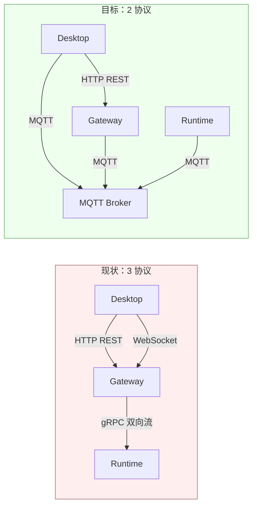

# ADR-033：引入 MQTT 替换 gRPC + WebSocket — Gateway 协议栈统一

**状态**：提案
**日期**：2026-07-11
**决策者**：大鱼
**前置**：
- ADR-031（废弃旧 IPC 通道残留 — 全面收敛到 gRPC）
- ADR-020（数据流分层）
- ADR-021（统一会话数据加载）

---

## 决策摘要

**用 MQTT 替换 gRPC（Gateway ↔ Runtime IPC）和 WebSocket（Desktop ↔ Gateway 流式事件），HTTP REST 保持不变。**



| 维度 | 现状 | 目标 |
|------|------|------|
| 协议数量 | 3（HTTP + WebSocket + gRPC） | 2（HTTP + MQTT） |
| Gateway 内部组件 | HTTP Server + WS Relay + gRPC Server + Session Manager + Bridge 事件总线 | HTTP Server + MQTT Broker + Global Resources Publisher + HTTP 反向代理（到 Runtime localhost HTTP） |
| Agent 生命周期管理 | 手工 GrpcSession 注册/清理 | MQTT Will Message + Retained Message |
| 事件转发路径 | Runtime → gRPC → broadcast channel → WebSocket task → Desktop | Runtime → MQTT Broker → Desktop（直通，无需 Bridge） |
| 多用户扩展 | 需改造 HTTP 路由 + Bridge 过滤 | rumqttd 内置 ACL 按 client_id 隔离，主题树不变 |
| 改动代码量 | — | ~5,900 行删除 + ~2,750 行新增 |

---

## 背景与动机

### 当前协议栈的问题

经过 ADR-031 收敛后，Gateway 有三套协议在跑：

| 协议 | 通道 | 职责 |
|------|------|------|
| HTTP REST（Axum） | Desktop ↔ Gateway | Agent CRUD、配置、文件上传、会话查询 |
| WebSocket（Axum ws） | Desktop ↔ Gateway | 聊天流式事件推送（chunk/tool_call/done 等 22 种事件） |
| gRPC（Tonic） | Gateway ↔ Runtime | 双向流 IPC：Intent 下发、StreamChunk 上报、资源同步、请求-响应 |

三个痛点：

**痛点 1：Bridge 事件总线是架构中最脆弱的环节**

```
Runtime ──gRPC StreamChunk──▶ Gateway ──broadcast::channel──▶ WebSocket task ──▶ Desktop
                                ↑
                          BridgeEvent 22 种类型
                    手动 from_action() 字符串匹配
```

Gateway 内部需要一个 `tokio::sync::broadcast` channel 把 gRPC 事件"翻译"成 WebSocket JSON 帧。每新增一个事件类型，要同步改三个地方（proto、BridgeEventType、WebSocket handler）。Broker 本身就是事件总线——无需手动维护这个翻译层。

**痛点 2：GrpcSession 手工生命周期管理不可靠**

当前 `GrpcSessionManager` 靠 gRPC stream `drop` 触发 `remove_session()`。如果 Runtime 进程被 `kill -9`，TCP 连接可能不会立即断开（取决于 OS 的 TCP keepalive 配置），导致 Gateway 长时间以为 Agent 仍在线。

MQTT 的 **Will Message** 是协议层级的保证——Broker 检测到 TCP 断开后自动发布 retained 遗嘱消息，不存在"幽灵在线"。

**痛点 3：多用户扩展需大量改造**

当前绑定 `127.0.0.1`，单机单用户。要支持多用户（多人同时连接同一 Gateway），需要：
- HTTP API 层加 user context 传递
- Bridge 事件加 user 过滤
- gRPC session 关联 user

MQTT 的 rumqttd 内置 ACL 按 `client_id` 限制每个客户端的 publish / subscribe 权限，主题树不按 user_id 分前缀（避免主题数量爆炸），多用户隔离完全由 ACL 集中管理。详见协议文档 [mqtt.md §10](../../zh/protocols/mqtt.md#10-多用户扩展基于-acl)。

### 为什么是 MQTT

Agent 的生命周期天然契合 IoT 设备管理模型：

| IoT 概念 | Agent 映射 | MQTT 原语 |
|----------|-----------|----------|
| 设备上线 | Agent Runtime 启动并连接 | CONNECT + `acowork/agents/{id}/status` = `online`（retained） |
| 设备下线 | Agent Runtime 退出/崩溃 | Will Message 自动发布 `offline` |
| 心跳保活 | 30s 无消息即判定离线 | MQTT Keep Alive |
| 设备状态上报 | StreamChunk、UsageReport | PUBLISH 到对应 topic |
| 控制指令下发 | IntentReceived（chat_message/stop/model_switch） | PUBLISH 到 `acowork/agents/{id}/sessions/control/{cmd}` |
| 固件升级 | Provider 列表热更新、Config 变更 | PUBLISH 到 `acowork/agents/{id}/config`（Retained） |

Gateway 的职责从“HTTP Server + WS Relay + gRPC Server + Session Manager + Bridge Bus”收敛为“**HTTP Server + MQTT Broker + Global Resources Publisher + HTTP 反向代理**”，架构更清晰。

**HTTP 反向代理**：Runtime 本地大数据（全量 message 列表、session 列表、memory graph）通过 Gateway HTTP 反向代理到 Runtime 的 localhost HTTP server 访问——Gateway 不直接读 Runtime 本地文件，只做 HTTP 转发。Agent config 等小数据通过 MQTT `agents/{id}/config` retained 同步，不需要 HTTP GET。详见协议文档 [mqtt.md §7.5](../../zh/protocols/mqtt.md#75-gateway-http-反向代理大数据查询)。

---

## 方案对比

### 被否决的替代方案

#### 方案 A：WebSocket → SSE（Server-Sent Events）

只替换 WebSocket，保留 gRPC。协议从 3 降到 2.5（HTTP + SSE + gRPC）。

- ✅ 改动量最小（只改 Desktop 订阅端和 Gateway 推送端）
- ❌ 不解决 gRPC 的痛点（Session 管理、Bridge 事件总线）
- ❌ SSE 是单向推送，Desktop → Gateway 的控制指令仍需 HTTP POST → gRPC 转发，链路不变

#### 方案 B：gRPC-web 统一前后端

Desktop App 也走 gRPC-web，Gateway 只暴露 gRPC。

- ✅ 协议统一为 1（全是 gRPC）
- ❌ gRPC-web 需要 Envoy/gRPC Gateway 做 HTTP/1.1 → HTTP/2 转换
- ❌ 浏览器端 gRPC-web 生态不如 MQTT（无原生 stream cancel、无 Will Message）
- ❌ 仍然解决不了设备生命周期管理问题

### 选择 MQTT 的理由

| 维度 | 现状 | MQTT 方案 |
|------|------|----------|
| Bridge 事件总线 | 需要独立 broadcast channel + 22 种事件类型匹配 | **不需要** — Broker 即事件总线 |
| Agent 生命周期 | 手工管理 GrpcSession（注册/清理/超时） | **Will Message + Keep Alive 原生支持** |
| 多用户扩展 | 需改造 HTTP 路由 + Bridge 过滤 | **Topic 层级天然隔离 + ACL** |
| 协议数量 | 3 | **2**（HTTP + MQTT） |
| 请求-响应 | gRPC request_id + oneshot | **MQTT 5.0 Response Topic + Correlation Data** |
| 流式性能 | WebSocket 帧（~2-10B 头） | **MQTT PUBLISH（~4B 头+ topic）** — 实测通知节流 500ms，流量可忽略 |

---

## 详细设计

> 协议的完整设计细节（Topic 树、消息格式、Broker 选型、客户端库、Broker 生命周期、gRPC→MQTT Topic 映射、请求-响应模式、Control 指令映射、Gateway 架构收敛等）已抽取到独立的协议使用参考文档：
>
> 👉 **[`docs/protocols/zh/mqtt.md`](../../zh/protocols/mqtt.md)**
>
> 本 ADR 仅保留决策动机、方案对比、影响范围、风险与缓解、实施计划。协议实现细节、Topic 树、消息格式、Broker 选型等以协议文档为准。


## 迁移策略

> 迁移分阶段计划（双通道并存 → Desktop 迁移 → Runtime 切换 → 清理）已抽取到协议文档：
>
> 👉 **[`docs/protocols/zh/mqtt.md` §14 迁移路径](../../zh/protocols/mqtt.md#14-迁移路径参考-adr-033)**
>
> 本 ADR 仅保留决策影响（影响范围、风险与缓解、实施计划）。

---

## 影响范围

### 删除

| 文件/模块 | 行数 | 说明 |
|-----------|------|------|
| `core/acowork-gateway/src/grpc/server.rs` | 874 | gRPC server + GrpcSessionManager |
| `core/acowork-gateway/src/grpc/dispatch.rs` | 544 | gRPC 消息分发 |
| `core/acowork-gateway/src/grpc/resource_pusher.rs` | 475 | 资源变更热推送 |
| `core/acowork-gateway/src/grpc/mod.rs` | 14 | gRPC 模块入口 |
| `core/acowork-gateway/src/http/chat.rs`（WS 部分） | ~800 | WebSocket upgrade + 帧处理 |
| `core/acowork-gateway/src/http/routes.rs`（Bridge 事件） | ~200 | BridgeEvent + BridgeEventType |
| `core/acowork-runtime/src/grpc/client.rs` | 1,522 | Runtime gRPC 客户端 |
| `core/acowork-runtime/src/grpc/mod.rs` | — | gRPC 模块入口 |
| `core/acowork-core/proto/gateway_ipc.proto`（service 声明） | ~20 | 仅删除 service GatewayService，message 保留 |
| `core/acowork-core/src/proto_bridge.rs`（部分） | ~600 | Proto ↔ Domain 转换中的 gRPC 专用代码 |
| **合计** | **~5,900** | |

### 新增

| 文件/模块 | 预估行数 | 说明 |
|-----------|---------|------|
| `core/acowork-gateway/src/mqtt/broker.rs` | ~100 | rumqttd 嵌入配置与启动（端口、连接数、packet size） |
| `core/acowork-gateway/src/mqtt/client.rs` | ~600 | Gateway MQTT client（连接、订阅管理、消息收发） |
| `core/acowork-gateway/src/mqtt/router.rs` | ~400 | Topic Router（订阅匹配、事件转发、权限控制） |
| `core/acowork-gateway/src/mqtt/dispatch.rs` | ~400 | MQTT 消息 → handler 分发（替代 dispatch.rs） |
| `core/acowork-gateway/src/mqtt/agent_registry.rs` | ~200 | Agent Registry（status topic → 在线状态表） |
| `core/acowork-gateway/src/mqtt/mod.rs` | ~30 | 模块入口 |
| `core/acowork-runtime/src/mqtt/client.rs` | ~800 | Runtime MQTT client（连接、握手、消息收发、请求-响应） |
| `core/acowork-runtime/src/mqtt/mod.rs` | ~20 | 模块入口 |
| `core/acowork-runtime/src/http/server.rs` | ~150 | Runtime localhost HTTP server（供 Gateway 反向代理大数据查询） |
| `core/acowork-gateway/src/http/proxy.rs` | ~200 | Gateway HTTP 反向代理（转发到 Runtime localhost HTTP） |
| Desktop App（Tauri Rust backend） | ~200 | `rumqttc` 集成 + topic 订阅 + Tauri events 推送前端 |
| Gateway `Cargo.toml` 依赖 | ~3 | `rumqttd = "0.14"` + `rumqttc = "0.24"` |
| **合计** | **~3,180** | |

> **注意**：业务逻辑 handler 函数（Gateway `handlers/server.rs` 1,149 行 + Runtime 各 handler）**不需要改**，因为输入输出类型不变（仍是 `GatewayRequest` / `GatewayResponse` 或 proto message），只换传输层。

### 保留不动

| 模块 | 行数 | 说明 |
|------|------|------|
| HTTP REST API（全部 handler） | ~19,000 | CRUD、配置、文件管理保持不变 |
| `core/acowork-core/src/protocol.rs` | 1,610 | `GatewayRequest` / `GatewayResponse` 类型不变 |
| `core/acowork-core/proto/gateway_ipc.proto`（message 定义） | ~495 | 保留所有 message 定义 |
| Runtime Agent Loop 及业务逻辑 | ~20,000+ | 完全不动 |

---

## 风险与缓解

| 风险 | 严重度 | 缓解措施 |
|------|--------|---------|
| **rumqttd v0.x API 变动** | 低 | broker API surface 极小（配置→启动→后台运行），升级成本可控；且 mosquitto 为备选，可随时切换 |
| **rumqttd 不支持 MQTT 5.0** | **无** | 请求-响应模式用 MQTT 3.1.1 手动实现（请求 payload 中带 `response_topic` 字段），语义完全等价 |
| **rumqttd 生产案例少** | 低 | 连接数 < 10 的本地消息路由场景，broker 的"成熟度"边际收益极低。基础功能（TCP/topic 匹配/QoS/retained/will）是协议规范决定的
| **Protobuf 类型安全退化** | 低 | MQTT payload 继续用 Protobuf 编码，消息格式不变。仅传输层从 gRPC stream 换为 MQTT PUBLISH |
| **双通道并存期复杂度** | 低 | 阶段 1 最多持续 1-2 周，handler 函数共享保证逻辑一致性；快速收敛后删除 gRPC 通道 |
| **MQTT 客户端库选择** | 低 | Rust 端统一 `rumqttc`（tokio 原生 async、纯 Rust）。Desktop 走 Tauri backend 集成，前端不需要 MQTT 库 |
| **Gateway 成为单点** | 低 | 当前架构 Gateway 已是单点（Agent 子进程管理、本地文件系统访问）；MQTT 不改变这点 |
| **消息顺序保证** | 低 | MQTT 保证同一 topic 内消息有序（RFC 要求）。流式事件全部走 `stream/chunk` 单 topic，不跨 topic，顺序天然保证 |
| **安全问题（多用户隔离）** | 低 | rumqttd 支持内置 ACL。当前阶段 Desktop/Runtime 都走 localhost，无外部暴露；多用户阶段再加 ACL 规则 |

---

## 实施计划

| Commit | 范围 | 说明 | 预估 |
|--------|------|------|------|
| **C1** | Gateway: `mqtt/broker.rs` | rumqttd 嵌入配置与启动（端口、连接数、packet size） | ~100 行 |
| **C2** | Gateway: `mqtt/client.rs` + `mqtt/mod.rs` | Gateway MQTT client（连接/订阅） | ~630 行 |
| **C3** | Gateway: `mqtt/router.rs` + `mqtt/agent_registry.rs` | Topic Router + Agent Registry | ~600 行 |
| **C4** | Gateway: `mqtt/dispatch.rs` | MQTT 消息分发（复用现有 handler 函数） | ~400 行 |
| **C5** | Gateway: 集成 — 启动时同时启动 gRPC + MQTT | 双通道并存，handler 共享 | ~100 行 |
| **C6** | Runtime: `mqtt/client.rs` | Runtime MQTT client（连接/握手/pub-sub/请求-响应） | ~820 行 |
| **C7** | Runtime: 启动参数 `--mqtt-port` + localhost HTTP server | 默认 gRPC，可选 MQTT；启动 localhost HTTP server 供 Gateway 反向代理 | ~200 行 |
| **C8** | Desktop: Tauri Rust backend 集成 rumqttc | 订阅 events topic → Tauri emit 推前端；前端 invoke → Rust PUBLISH | ~200 行 |
| **C9** | 验证 + 测试：端到端 MQTT 通信 | 发送消息 → LLM 流式 → 事件接收 | — |
| **C10** | 清理：删除 gRPC server、dispatch、WebSocket Bridge | 阶段 4 清理 | ~5,900 行删除 |
| **合计** | | | ~3,180 行新增 + ~5,900 行删除 |

每个 commit 独立 buildable，可增量验证。

---

## 附录：与 ADR-031 的关系

ADR-031 将旧版自定义二进制帧 IPC 收敛到 gRPC。本 ADR 是 ADR-031 的延续——在 gRPC 已经成为唯一 IPC 通道后，进一步将传输层统一到 MQTT。

区别在于：
- **ADR-031** 做的是"模块级清理"（重命名、合并、删除残留）
- **本 ADR** 做的是"协议级替换"（传输层从 gRPC 切换到 MQTT）

但底层的消息协议（protobuf message 定义）和业务逻辑（handler 函数）在两个 ADR 中都保持不变。这保证了迁移的可控性。
