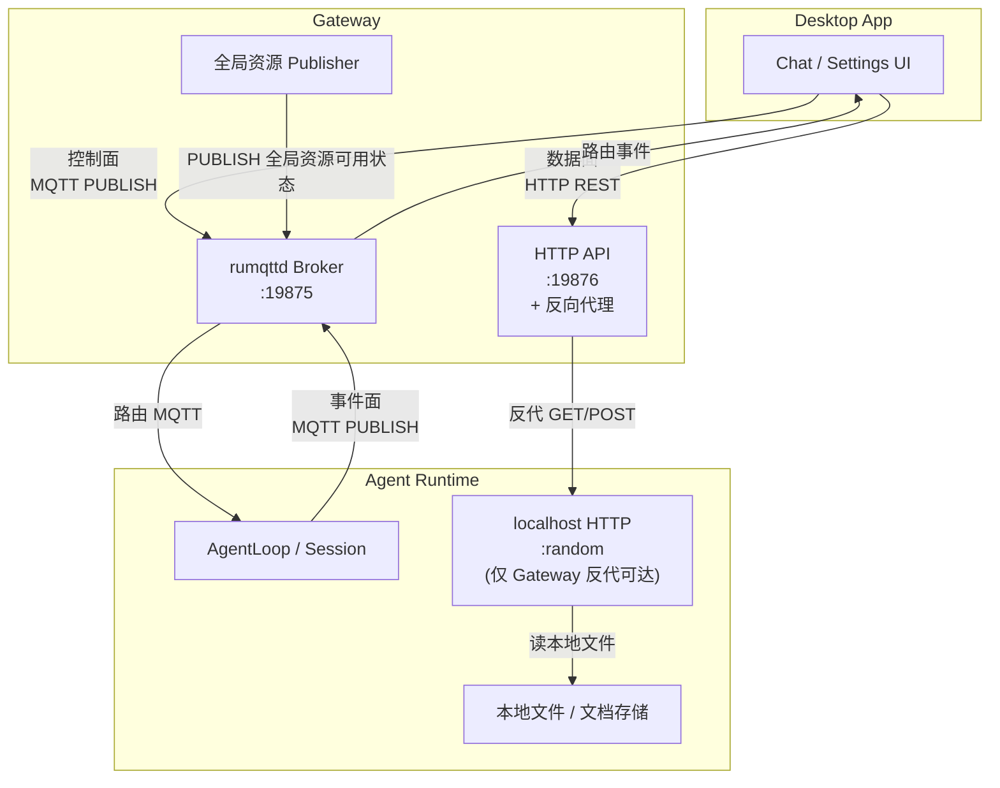

# ADR-034：控制面与数据面分层 — MQTT / HTTP 职责边界规约

**状态**：草案 v10.0（Phase 2 ~ Phase 10 全部完成，2026-07-14）
**日期**：2026-07-14
**决策者**：大鱼
**前置**：
- ADR-033（MQTT 替换 gRPC + WebSocket，决策已通过，实施进行中）
- ADR-020（数据流分层）
- ADR-024（统一会话元数据）

---

## 决策摘要

ADR-033 实施首轮发现 6 类控制面回归（§6），完成控制面修复后又对 Gateway/Runtime 的 41 条 HTTP 端点全量 review，又发现 12 类治理问题（§7），**第三轮对 Desktop app 全部 100+ 条 fetch 调用 + 全部 MQTT 主题订阅 + proto schema 做全量交叉验证**（§13、§14），又发现 17 类违规（控制面走 HTTP 8 条、面板端点缺失 3 条、Proto schema 与 ADR §3.2 不一致、MQTT 命令字符串错位、workspace 文件操作未在 ADR 中明确）。本 ADR 把这三条规约一起固化，给出全量 17 个 gRPC 时代 control action 的传输归属、统一 ControlCommand proto、HTTP 端点完整清单与命名规约、gRPC 残存 handler 与失效 HTTP 端点全部清理。

**三条核心规则（不可违反）**：

1. **同一语义只用一条传输**。严禁同一业务在 MQTT 与 HTTP 同时提供入口。
2. **HTTP 是 MQTT 的超集，但只在数据量 MB+ 或强 request/response 语义时启用**。用户操作触发的状态变更一律走 MQTT。
3. **Gateway 不访问 Agent Runtime 本地文件**。所有 Runtime 数据读取通过 HTTP 反代到 Runtime localhost HTTP server。

| 面 | 传输 | 判定标准 |
|---|------|----------|
| **控制面**（Desktop → Runtime） | MQTT `acowork/agents/{id}/sessions/control/{cmd}` | 用户操作触发的状态变更、实时双向 |
| **数据面**（Desktop ↔ Runtime via Gateway proxy） | HTTP REST via Gateway reverse proxy | 启动期加载、批量读、文件操作、一次性查询 |
| **事件面**（Runtime → Desktop） | MQTT `acowork/agents/{id}/sessions/{sid}/messages/*` | 流式 chunk、状态变更推送 |

**判定流程**（按优先级）：

```
1. 是「用户操作触发的状态变更」吗？  → MQTT
2. 是「运行时流式事件」吗？          → MQTT
3. 是「启动期全量加载 / 批量读 / 大文件」吗？  → HTTP via Gateway 反代
4. 需要明确 ack（成功/失败语义）吗？ → 走 MQTT，由事件面回流即 ack（不另设 control ack）
```

**已决断的开放点**（不再问询）：

| 开放点 | 决断 |
|--------|------|
| CompressAction 字段格式 | `enum CompressType` 强类型（避免字符串解析）|
| ChatMessage 富字段位置 | `params_json`（与 IntentCommand 一致）|
| gRPC era `activate_session` / `deactivate_session` 命名 | 改名 `enable_notify` / `disable_notify`（语义更准确） |
| `close_session` 是否本 iteration 引入 | 是（gRPC era 已实现，复用）|
| `POST /api/agents/{id}/control` 去留 | **删除**，不存在该路径 |
| HTTP 端点 URL 命名 | 统一 `{id}`，动作动词，复数资源，嵌套父子（§11.1）|

---

## 背景与动机

### 1. 协议边界未固化 → 字段丢失、命令吞并、漏刷 context

ADR-033 实施首轮暴露 6 类回归（§6）：
- `model_switch` 漏 `provider_id` → 跨 provider 切模型 100% 失败
- `compress_action` 被静默改名为 `compact_context` → 压缩语义错乱
- `workspace_switch` 漏 `update_session_workspace_context` + 漏合法性校验与 fallback

根因：ADR-033 没规定完整传输矩阵与 proto schema，实施时只能看 gRPC 代码反推。

### 2. HTTP 端点第二轮 review → 12 类治理问题

完成首轮控制面修复后，对 Gateway 24 条 + Runtime 17 条 HTTP 端点全量 audit，又发现 12 类问题（§7）：
- 3 条 silent no-op（假装成功实际啥都没做）：`activate_session` / `deactivate_session` / `close_session`
- 1 条 critical bug：`PUT /workspaces/current` 只更新统计、不通知 Runtime
- 8 条字段丢失：gRPC 时代富字段在迁移中没接上（`document_ids`, `content_parts`, `attached_context`, `command`, `model_switch.provider_id`, `compress_action.type`, `stop.reason` 等）
- 3 条业务逻辑重复造轮子：Runtime 端走 `SystemNotification` 转发 SessionMessage、增加 dispatch 链
- 4 条控制面走 HTTP 反代：违反 §1 规约（approval/question/continue/title 改回 MQTT）
- 1 条数据查询调错端点：`get_latest_conversation` 调 messages 而非 latest
- 1 条数据查询读 stale 缓存：`get_session_state` 读 in-memory 缓存
- 1 条占位实现：`GET /memory/graph` 读 JSONL，未接 Grafeo
- 6 条规则不一致：`{agent_id}` vs `{id}` 混用

根因：ADR-033 没规定 HTTP 端点命名规约和数据面边界。

### 3. 本 ADR 的范围

- ✅ 协议边界规约（§1）
- ✅ 17 个 control action 全量映射（§2）
- ✅ 统一 ControlCommand proto（§3，含 8 个新命令）
- ✅ Runtime dispatch 单路径架构（§4）
- ✅ 业务逻辑零改动验证（§5）
- ✅ ADR-033 首轮 6 类回归修复方案（§6）
- ✅ HTTP 端点全量治理（§7 — **本次新增，整合 review 结果**）
- ✅ 文件变更清单（全量）（§9）
- ✅ HTTP 端点完整设计、命名规约、URL 设计（§11 — **本次新增**）
- ✅ 验证矩阵（§12 — **本次新增**）

---

## 一、协议分层规约

### 1.1 三面三分



### 1.2 控制面 vs 数据面判定矩阵

| 判定维度 | 控制面（MQTT） | 数据面（HTTP） |
|----------|---------------|---------------|
| **触发方式** | 用户主动操作（点击、键盘） | 启动期、轮询、按需加载 |
| **时延要求** | 实时（<100ms） | 非实时（可达秒级） |
| **数据量** | KB 级（小载荷） | 任意（含 MB+） |
| **响应语义** | fire-and-forget，事件面回流反馈 | request/response，HTTP 状态码 |
| **失败处理** | 后续状态变化即反馈（chunk/done/error） | HTTP 4xx/5xx 即时返回 |
| **多次订阅** | 不需要（单次操作） | 不需要（一次性查询） |

### 1.3 反模式（**严禁**）

| 反模式 | 为什么禁止 |
|--------|-----------|
| 同一语义同时支持 MQTT 和 HTTP 双路径 | bug 源（两套代码必然漂移）、测试负担 ×2 |
| 控制命令通过 HTTP 反代发送 | 增加 Gateway 转发路径，破坏"Desktop ↔ Runtime 直连" |
| 大数据通过 MQTT retained 同步 | 单包硬上限 10MB，broker 内存爆炸 |
| 把 Gateway 当业务事件转发站 | 链路 ×2 延迟、Gateway 状态爆炸、MQTT 直连优势丧失 |

---

## 二、全量传输矩阵

gRPC 时代 `process_gateway_recv` 处理 **17 个 control action**，逐一映射如下：

### 2.1 控制面（17 个 → 全部走 MQTT）

| # | 命令 | 主题前缀 | 一致性策略 |
|---|------|----------|-----------|
| 1 | `CreateSession` | `control/create_session` | QoS 1 |
| 2 | `DeleteSession` | `control/delete_session` | QoS 1 |
| 3 | `CloseSession` | `control/close_session` | QoS 1（graceful,触发 distillation） |
| 4 | `UpdateSessionTitle` | `control/update_session_title` | QoS 1 |
| 5 | `ChatMessage` | `control/chat_message` | QoS 1 |
| 6 | `Stop` | `control/stop` | QoS 1 |
| 7 | `ContinueExecution` | `control/continue_execution` | QoS 1 |
| 8 | `EnableNotify` | `control/enable_notify` | QoS 1 |
| 9 | `DisableNotify` | `control/disable_notify` | QoS 1 |
| 10 | `ApprovalDecision` | `control/approval_decision` | QoS 1 |
| 11 | `QuestionAnswer` | `control/question_answer` | QoS 1 |
| 12 | `ModelSwitch` | `control/model_switch` | QoS 1 |
| 13 | `ReasoningEffort` | `control/reasoning_effort` | QoS 1 |
| 14 | `WorkspaceSwitch` | `control/workspace_switch` | QoS 1 |
| 15 | `CompactContext` | `control/compact_context` | QoS 1 |
| 16 | `CompressAction` | `control/compress_action` | QoS 1 |
| 17 | `Intent` | `control/intent` | QoS 1（跨 agent / cron） |

> **QoS 1 理由**：控制命令不能丢，但 ack 由事件面回流（chunk/done/error/SessionMeta），不需要 control 命令层 ack。

### 2.2 数据面（2 个 → HTTP via Gateway 反代）

| # | 操作 | Gateway HTTP | 反代到 Runtime HTTP | 用途 |
|---|------|--------------|---------------------|------|
| 18 | `ListSessions` | `GET /api/agents/{id}/sessions` | `GET /sessions` | 全量 session 列表（启动期） |
| 19 | `GetSessionMessages` | `GET /api/agents/{id}/sessions/{sid}/messages?cursor=...&limit=...` | `GET /sessions/{sid}/messages?cursor=...&limit=...` | 历史消息分页加载 |

> **为什么这 2 个走 HTTP**：gRPC era 是 unary RPC（`request_id` + oneshot 返回），语义是 request/response 而非 push。改成 MQTT 会破坏语义，且全量列表 MB+ 不适合 retained。

### 2.3 走 HTTP 但不是反代（Gateway 本地端点）

仅做参考，与本 ADR 主题无关：

| 路径 | 用途 |
|------|------|
| `GET /api/global/providers` 等 | 全局资源全量列表（Settings UI） |
| `PUT /api/agents/{id}/config` | 修改 agent config（透传到 Runtime MQTT control） |
| `POST /api/agents/{id}/control` | **保留但仅供「需 ack 场景」**（详见 §7 待讨论） |

---

## 三、统一 ControlCommand Proto

### 3.1 Schema 原则

| 原则 | 说明 |
|------|------|
| **强类型 oneof** | 每命令独立 message，无 `command_type` 字符串解析层 |
| **必填字段直放顶层** | `session_id` / `message_id` 等 |
| **可选 / 异构富字段走 `params_json`** | 借鉴 `IntentCommand` 现有模式 |
| **可空字符串用空串 = 不更新** | 例如 `provider_id` 空串 = 仅切换 model 名 |
| **agent_id 放 ControlCommand 顶层** | 避免每个子命令重复 |

### 3.2 完整 proto schema

> **字段编号偏移规约**（必读）：原 proto 各子命令 `agent_id` 占字段 1。本 ADR 删除子命令 `agent_id` 后，**字段 1 保留空缺**（proto3 字段号不重用规约）。各子命令实际生成字段从 2 开始，**新加字段从 5/6/7+ 起占新编号**。下表 schema 中“逻辑字段名”与实际生成的“proto 字段编号”之间可能偏移 1（取决于原字段是否被占）。
>
> 实际生成的 proto 字段编号完整详表见 `core/acowork-core/proto/mqtt_payload.proto`。

```protobuf
syntax = "proto3";
package acowork.mqtt.v1;

// ── Control commands (Desktop → Runtime, fire-and-forget push) ──────
//
// 设计原则:
//   1. 强类型 oneof,每个命令有专属 schema(无 command_type 字符串层)
//   2. 必填字段直接放 message 顶层;可选/异构富字段走 params_json 字符串
//   3. ADR-012: provider_id 等可空字段用空字符串 = "不更新"

message ControlCommand {
  string agent_id = 1;
  oneof command {
    // ── Session lifecycle ──
    CreateSession       create_session        = 10;
    DeleteSession       delete_session        = 11;
    CloseSession        close_session         = 12;  // graceful, triggers distillation
    UpdateSessionTitle  update_session_title  = 13;

    // ── Chat ──
    ChatMessage         chat_message          = 20;  // user message (with rich payload)
    Stop                stop                  = 21;
    ContinueExecution   continue_execution    = 22;
    EnableNotify        enable_notify         = 23;  // session → foreground
    DisableNotify       disable_notify        = 24;  // session → background

    // ── User responses to runtime prompts ──
    ApprovalDecision    approval_decision     = 30;
    QuestionAnswer      question_answer       = 31;

    // ── Per-session config ──
    ModelSwitch         model_switch          = 40;
    ReasoningEffort     reasoning_effort      = 41;
    WorkspaceSwitch     workspace_switch      = 42;

    // ── Context management ──
    CompactContext      compact_context       = 50;
    CompressAction      compress_action       = 51;  // distinct from compact_context

    // ── System ──
    Intent              intent                = 60;  // cron / cross-agent
  }
}

// ── Session lifecycle ──────────────────────────────────────────────

message CreateSession {}

message DeleteSession {
  string session_id = 1;
}

/// Graceful close: triggers distillation, preserves JSONL history.
/// Use Delete to also remove the file.
message CloseSession {
  string session_id = 1;
}

message UpdateSessionTitle {
  string session_id = 1;
  string title = 2;
}

// ── Chat ───────────────────────────────────────────────────────────

message ChatMessage {
  string session_id = 1;
  string message_id = 2;
  string content = 3;
  /// Optional slash command prefix (e.g. "/commit", "/review-pr")
  string command = 4;
  /// Rich payload as JSON. Shape:
  ///   {
  ///     "document_ids":     ["doc-abc"],      // uploaded via HTTP POST /documents
  ///     "content_parts":    [{type:"text",text:"..."}, {type:"image_url",image_url:{url:"..."}}],
  ///     "attached_context": [{abs_path, type:"file"|"selection", startLine?, endLine?}]
  ///   }
  /// Empty string = plain text only.
  /// Documents are resolved by the Runtime from the session's document store
  /// (NOT inlined into the wire payload — keeps MQTT messages small).
  string params_json = 5;
}

message Stop {
  string session_id = 1;
  /// Stop reason for logging. Free-form but conventionally:
  /// "user_requested" | "iteration_limit" | "budget_exceeded" | "error" | ...
  string reason = 2;
}

message ContinueExecution {
  string session_id = 1;
  string reason = 2;  // "user_requested" | "auto_resume"
}

message EnableNotify {
  string session_id = 1;
}

message DisableNotify {
  string session_id = 1;
}

// ── User responses ─────────────────────────────────────────────────

message ApprovalDecision {
  string session_id = 1;
  string request_id = 2;
  bool approved = 3;
  bool allow_all_session = 4;
  /// Optional reason (e.g. user typed "this is a typo")
  string reason = 5;
}

message QuestionAnswer {
  string session_id = 1;
  string request_id = 2;
  string answer = 3;
}

// ── Per-session config ─────────────────────────────────────────────

message ModelSwitch {
  string session_id = 1;
  string model_id = 2;
  /// Optional. ADR-012 per-session provider override.
  /// Empty = keep current Provider, only update model name.
  string provider_id = 3;
}

message ReasoningEffort {
  string session_id = 1;
  /// "low" | "medium" | "high" | "auto"
  string effort = 2;
}

message WorkspaceSwitch {
  string session_id = 1;
  string workspace_id = 2;
}

// ── Context management ─────────────────────────────────────────────

message CompactContext {
  string session_id = 1;
}

enum CompressType {
  COMPRESS_TYPE_UNSPECIFIED = 0;
  COMPRESS_TYPE_SUMMARY      = 1;  // → CompressionAction::CompressSummary
  COMPRESS_TYPE_TOOL_RESULTS = 2;  // → CompressionAction::CompressToolResults
}

message CompressAction {
  string session_id = 1;
  CompressType compress_type = 2;
}

// ── System ─────────────────────────────────────────────────────────

message Intent {
  string from = 1;
  string action = 2;
  string params_json = 3;
}
```

---

## 四、Runtime Dispatch 架构

### 4.1 消除双路径

当前 `gateway_loop.rs` 存在双 dispatch 路径（gRPC + MQTT），本 ADR 决定**只保留 MQTT 路径**：

```rust
// 旧: 双路径
if grpc_client.is_some() {
    cli::run_gateway_loop(...)    // ← 删
} else if mqtt_client.is_some() {
    mqtt_only_loop(...)           // ← 唯一保留
}

// 新: 单路径
mqtt_only_loop(...)
```

### 4.2 单 dispatch table

`mqtt_only_loop` 内部统一处理所有 control action：

```rust
async fn dispatch(
    sm: &mut SessionManager,
    session_id: &str,
    msg: InboundMessage,
    resolver: &Arc<RwLock<WorkspaceResolver>>,
) {
    use InboundMessage::*;
    match msg {
        // ── System-level ──
        SystemNotification { notification_type: "create_session", .. } if session_id.is_empty() => {
            sm.create_session().await;
        }

        // ── Per-session config → session_manager route_* ──
        SystemNotification { notification_type: "model_switch", data } => {
            let model_id = data.get("model_id")?.as_str()?;
            let provider_id = data.get("provider_id")
                .and_then(|v| v.as_str())
                .filter(|s| !s.is_empty())
                .map(String::from);
            sm.route_model_switch(session_id, model_id.into(), provider_id);
        }
        SystemNotification { notification_type: "workspace_switch", data } => {
            let ws_id = data.get("workspace_id")?.as_str()?;
            // ↓ 新方法,合并校验 + context 刷新 + pending fallback
            sm.route_workspace_switch(session_id, ws_id, resolver);
        }
        // ... 其它 config 同理

        // ── Session-level → session task via SessionMessage ──
        SystemNotification { notification_type: "chat_message", data } => {
            let (docs, parts, ctx) = parse_chat_rich_payload(data.get("params_json"))?;
            sm.send_to_session(session_id, SessionMessage::ChatMessage { ... });
        }
        // ...

        // ── Real-time user responses → InboundMessage (bypass queue) ──
        Stop { reason } => sm.send_inbound(session_id, Stop { reason }),
        ApprovalDecision { ... } => sm.send_inbound(session_id, ApprovalDecision { ... }),
        // ...

        other => tracing::warn!(?other, "Unsupported control command"),
    }
}
```

### 4.3 `route_workspace_switch` 新方法（合并 gRPC era 3 步为 1 步）

```rust
impl SessionManager {
    /// Per-session workspace switch (ADR-034).
    ///
    /// Unified replacement for the gRPC-era 3-step dance:
    ///   1. validate workspace_id against allowed_dirs
    ///   2. add_pending_workspace + fallback to "__agent_home__" if invalid
    ///   3. set_session_workspace_with_resolver
    ///   4. update_session_workspace_context (refresh prompt file + context text)
    ///
    /// Steps 1-4 are now atomic from the caller's perspective.
    pub fn route_workspace_switch(
        &mut self,
        session_id: &str,
        workspace_id: &str,
        resolver: &Arc<RwLock<WorkspaceResolver>>,
    ) {
        let guard = resolver.read().unwrap();
        let valid = workspace_id == "__agent_home__"
            || guard.allowed_dirs().iter().any(|d| d.id == workspace_id);
        let effective_id = if valid { workspace_id } else {
            tracing::warn!(
                session_id, workspace_id,
                "workspace_switch: id not in allowed list, pending + fallback to __agent_home__",
            );
            self.add_pending_workspace(session_id, workspace_id);
            "__agent_home__"
        };
        drop(guard);

        self.set_session_workspace(session_id, effective_id);
        self.update_session_workspace_context(session_id);
    }
}
```

---

## 五、业务逻辑零改动验证

✅ 所有 `SessionMessage` / `InboundMessage` 变体已在 gRPC 时代完整定义，**业务处理层零修改**：

| 业务模块 | 状态 |
|----------|------|
| `route_model_switch(model, provider: Option<String>)` | ✅ provider 字段已含 |
| `route_reasoning_effort(effort)` | ✅ |
| `SessionMessage::ChatMessage { content, message_id, command, skill_instructions, documents, content_parts, attached_context }` | ✅ 字段齐全 |
| `SessionMessage::ModelSwitch { model, provider }` | ✅ |
| `SessionMessage::CompressAction(CompressionAction)` | ✅ |
| `SessionMessage::CompactContext` | ✅ |
| `SessionMessage::UpdateSessionTitle { title }` | ✅ |
| `SessionMessage::Close` | ✅ |
| `InboundMessage::Stop { reason }` | ✅ |
| `InboundMessage::ContinueExecution { reason }` | ✅ |
| `InboundMessage::ApprovalDecision { request_id, approved, allow_all_session, reason }` | ✅ |
| `InboundMessage::QuestionAnswer { request_id, answer }` | ✅ |
| `session_task.rs` / `AgentLoop` 所有处理逻辑 | ✅ 一行不动 |

**结论**：重构纯协议层 + dispatch 层，业务处理零修改。

---

## 六、ADR-033 实施首轮 6 类回归

> 这一节是 ADR-033 决策时**未预见**的问题，作为 ADR-034 的动机证据。后续 ADR 评审需要把这类回归纳入 checklist。

### P0（静默丢字段 / 静默改语义）

#### A. `ChatMessage` 漏富字段
- **gRPC era**：`IntentReceived` JSON 携带 `documents`, `content_parts`, `attached_context`, `command`
- **MQTT era**：`MessageCommand` proto 只剩 `content`, `message_id`, `session_id`，富消息走 HTTP fallback，代码留 TODO 注释
- **修复**：ChatMessage 加 `params_json` 字段，承载上述富数据

#### B. `compress_action` 命令被吞
- **gRPC era**：`compress_action` 是独立命令，区分 `compress_summary` / `compress_tool_results`
- **MQTT era**：chatStore.ts:589 `sendCompressAction` 直接发 `compact_context`，**"压缩 summary" 被静默改成"压缩全部 context"**
- **修复**：新增独立 `CompressAction` 命令 + `CompressType` enum

#### C. `workspace_switch` 漏 `update_session_workspace_context`
- **gRPC era**：cli.rs:1816 `set_session_workspace_with_resolver` 之后调 `update_session_workspace_context` 刷新 prompt file (AGENTS.md / CLAUDE.md)
- **MQTT era**：gateway_loop.rs:304-313 只调 `set_session_workspace`，**不刷 prompt file / context text**
- **修复**：合并到 `route_workspace_switch`（§4.3）

#### D. `workspace_switch` 漏校验 + fallback
- **gRPC era**：cli.rs:1816 校验 `allowed_dirs`，非法 ID 走 `add_pending_workspace` + fallback `__agent_home__`
- **MQTT era**：任意 ID 直接接受
- **修复**：合并到 `route_workspace_switch`（§4.3）

### P1（命令缺失，改走 HTTP）

#### E. `approval_decision` 改走 HTTP `POST /sessions/{sid}/approval`
#### F. `question_answer` 改走 HTTP `POST /sessions/{sid}/question`
#### G. `update_session_title` 改走 HTTP `PUT /sessions/{sid}/title`
#### H. `continue_execution` 改走 HTTP `POST /sessions/{sid}/continue`

> 这 4 个目前功能 OK，但**违反了"同一语义只用一条传输"规约**。本 ADR 把它们迁回 MQTT。

### P2（小回归）

#### I. `Stop` 硬编码 reason
- **gRPC era**：透传 `params["reason"]`
- **MQTT era**：硬编码 `"MQTT stop"`
- **修复**：Stop 加 `reason` 字段

#### J. `ChatMessage` 富字段全 None
- 即使 A 修好，B/C/D/E/F/G 也只是降级到 HTTP
- **修复**：本 ADR 一次性把 A-J 全部修

---

## 七、HTTP 端点治理（review 整合）

完成 §6 修复后，对 Gateway 24 条 + Runtime 17 条 HTTP 端点全量 audit，发现 7 类问题、归纳为 12 条具体修复项。本节是 ADR-034 的核心规约。

### 7.1 HTTP 端点问题清单

| 类别 | # | 问题 | 位置 |
|------|---|------|------|
| **A. Silent no-op** | A1 | `POST /sessions/{sid}/activate` 只校验、不通知 | Gateway `chat.rs` |
| | A2 | `POST /sessions/{sid}/deactivate` 同上 | Gateway `chat.rs` |
| | A3 | `POST /sessions/{sid}/close` 同上 | Gateway `chat.rs` |
| **B. Critical bug** | B1 | `PUT /workspaces/current` 只更新 in-memory cache，不通知 Runtime | Gateway `workspaces.rs` |
| **C. 字段丢失** | C1 | `POST /message` 接收 `document_ids/content_parts/attached_context/command`，但 MQTT `MessageCommand` proto 只剩 `content/message_id/session_id` | Gateway `chat.rs` |
| | C2 | `POST /message` 无 `params_json` 字段 | `mqtt_payload.proto` |
| | C3 | gRPC era `compress_action` 被静默改名为 `compact_context`，丢 SUMMARY/TOOL_RESULTS 区分 | Desktop + proto |
| | C4 | `Stop` command无 `reason` 字段（硬编码 "user_requested"） | proto |
| **D. 控制面走 HTTP** | D1 | `POST /approval` | Gateway + Runtime `server.rs` |
| | D2 | `POST /question` | Gateway + Runtime |
| | D3 | `POST /continue` | Gateway + Runtime |
| | D4 | `PUT /sessions/{sid}/title` | Gateway + Runtime |
| **E. 数据调用错/慊** | E1 | `GET /conversations/latest` 反代到 `/sessions/{sid}/messages` 应为 `/sessions/latest` | Gateway `chat.rs` |
| | E2 | `GET /sessions/{sid}/state` 读 in-memory cache（gRPC 时代 QueryConfig 缓存）：可能 stale | Gateway `agents.rs` |
| **F. 占位实现** | F1 | `GET /memory/graph` 读 JSONL，未接 Grafeo | Runtime `server.rs` |
| **G. 业务逻辑重复造轮子** | G1 | Runtime `update_session_title` 走 `SystemNotification` 绕一圈，而不是直发 `SessionMessage::UpdateSessionTitle` | Runtime `server.rs` |
| **H. 缺失端点** | H1 | Gateway + Runtime 均缺：documents ×4、workspaces mutation ×4、memory single node ×1 | Gateway + Runtime |

### 7.2 HTTP 端点命名规约

| 规则 | 说明 |
|------|------|
| **统一 `{id}` 不混用 `{agent_id}`** | 现有 6 条不一致端点改名为 `/api/agents/{id}/...` |
| **资源集合用复数名词** | `/sessions`, `/documents`, `/workspaces` |
| **动作用动词** | `POST /workspaces`（add）、`PUT /workspaces/{id}`（update）、`DELETE /workspaces/{id}` |
| ~~**状态字段用 `/state` 后缀**~~ | **已废弃**（§7.6.4）：Session 状态被 `/sessions/{sid}` 合并端点吸收，**不存在独立 `/state` 端点** |
| **列表分页用 query** | `?page=&size=` 或 `?cursor=&limit=&direction=` |
| **嵌套父子资源** | `/sessions/{sid}/documents`、`/workspaces/{ws_id}/prompt-file` |
| **数据面仅走 `/api/agents/{id}/...` 前缀** | Runtime HTTP 反代接口不暴露 `/api` 前缀，只用资源裸路径 |
| **`POST /api/agents/{id}/control` 严禁** | 本 ADR 决断：彻底删除该概念（控制面走 MQTT 主题） |

### 7.3 Gateway HTTP 端点全量清单

#### L1. 控制面转发 → 全部删除（迁 MQTT）

| # | 端点 | 文件 | 处理 | 替代 |
|---|------|------|------|------|
| 1 | `POST /api/agents/{id}/message` | `chat.rs` | MQTT `MessageCommand`（**丢富字段**）| MQTT `chat_message` + `params_json` |
| 2 | `POST /api/agents/{id}/continue` | `chat.rs` | HTTP 反代 | MQTT `continue_execution` |
| 3 | `PUT /api/agents/{id}/sessions/{sid}/title` | `chat.rs` | HTTP 反代 | MQTT `update_session_title` |
| 4 | `POST /api/agents/{id}/sessions` | `chat.rs` | MQTT `CreateSession` | MQTT `create_session` |
| 5 | `DELETE /api/agents/{id}/sessions/{sid}` | `chat.rs` | MQTT `DeleteSession` | MQTT `delete_session` |
| 6 | `POST /api/agents/{id}/sessions/{sid}/activate` | `chat.rs` | **No-op** | MQTT `enable_notify` |
| 7 | `POST /api/agents/{id}/sessions/{sid}/deactivate` | `chat.rs` | **No-op** | MQTT `disable_notify` |
| 8 | `POST /api/agents/{id}/sessions/{sid}/close` | `chat.rs` | **No-op** | MQTT `close_session` |
| 9 | `POST /api/agents/{agent_id}/approval` | `approval.rs` | HTTP 反代 | MQTT `approval_decision` |
| 10 | `POST /api/agents/{agent_id}/question` | `question.rs` | HTTP 反代 | MQTT `question_answer` |
| 11 | `PUT /api/agents/{agent_id}/workspaces/current` | `workspaces.rs` | **Critical bug** | MQTT `workspace_switch` |

**整模块删除**：`approval.rs`、`question.rs` 整文件删。`chat.rs` 缩为只留两个查询。`workspaces.rs` 总体重写为反代。

#### L2. 数据面 → 保留（含修复）

| # | 端点 | 文件 | 反代目标 | 状态 |
|---|------|------|----------|------|
| 1 | `GET /api/agents/{id}/conversations` | `chat.rs` | `/sessions?page=&size=` | ✅ |
| 2 | `GET /api/agents/{id}/conversations/latest?session_id=` | `chat.rs` | **修复** → `/sessions/latest`（不是 messages） | ⚠️ 修 |
| 3 | `GET /api/agents/{id}/latest-session` | `proxy.rs` | `/sessions/latest` | ✅ |
| 4 | `GET /api/agents/{id}/sessions?page=&size=` | `proxy.rs` | `/sessions?page=&size=` | ✅ |
| 5 | `GET /api/agents/{id}/sessions/{sid}/messages` | `proxy.rs` | `/sessions/{sid}/messages` | ✅ |
| 6 | `GET /api/agents/{id}/sessions/{sid}/state` | `agents.rs` | **修复** → 反代 `/sessions/{sid}/state`（不再读 cache） | ⚠️ 修 |
| 7-10 | `GET/DELETE/POST /memory/*`（4 条）| `proxy.rs` | Runtime `/memory/*` | ✅ |
| 11 | `GET /api/agents/{id}/memory/graph` | `proxy.rs` | **修复** Runtime 接 Grafeo | ⚠️ Runtime 修 |
| 12 | `GET /api/agents/{id}/workspaces` | `proxy.rs` | `/workspaces` | ✅ |
| 13 | `GET /api/agents/{id}/workspaces/tree` | `proxy.rs` | `/workspaces/tree` | ✅ |

#### L3. 数据面 → 新增反代（本 ADR 实施）

| # | Gateway 端点 | 反代到 Runtime | 用途 |
|---|--------------|----------------|------|
| 1 | `POST /api/agents/{id}/sessions/{sid}/documents` | `POST /sessions/{sid}/documents` | 文档上传（multipart）|
| 2 | `GET /api/agents/{id}/sessions/{sid}/documents` | `GET /sessions/{sid}/documents` | 文档列表 |
| 3 | `GET /api/agents/{id}/sessions/{sid}/documents/{doc_id}` | `GET /sessions/{sid}/documents/{doc_id}` | 文档读取 |
| 4 | `DELETE /api/agents/{id}/sessions/{sid}/documents/{doc_id}` | `DELETE /sessions/{sid}/documents/{doc_id}` | 文档删除 |
| 5 | `POST /api/agents/{id}/workspaces` | `POST /workspaces` | add_pending_workspace |
| 6 | `PUT /api/agents/{id}/workspaces/{ws_id}` | `PUT /workspaces/{ws_id}` | update_workspace（access/alias）|
| 7 | `PUT /api/agents/{id}/workspaces/{ws_id}/prompt-file` | `PUT /workspaces/{ws_id}/prompt-file` | set_prompt_file |
| 8 | `DELETE /api/agents/{id}/workspaces/{ws_id}` | `DELETE /workspaces/{ws_id}` | delete_workspace |
| 9 | `GET /api/agents/{id}/memory/nodes/{nid}` | `GET /memory/nodes/{nid}` | 单 memory node |

**`documents.rs` 整文件重写**：当前 Gateway 写本地 `data_dir/sessions/{sid}/documents/` ——违反隔离原则。改造后 Gateway 只反代，Runtime 拥有文档存储。

#### L4. Gateway 本地端点（业务无关，无改动）

`/health`、`/api/agents/*`（list/get/avatar/install/clone/start/stop/config）、`/api/providers`、`/api/models/*`、`/api/mcp-catalog/*`、`/api/embedding-models/*`、`/api/users/*`、`/api/cron/*`、`/api/skills/*`、`/api/publish/*`、`/api/global/*`、`/api/fs/browse`、`/api/config`、`/api/logs`、`/api/agent-config`、`/api/status`、`/api/lsp/endpoint`、`/api/user/avatar-*` — 与 Agent Runtime 隔离，均与本 ADR 无关。

### 7.4 Runtime HTTP 端点全量清单

#### R1. 数据面查询（保留）

| # | 端点 | 业务逻辑复用 | 状态 |
|---|------|--------------|------|
| 1 | `GET /health` | n/a | ✅ |
| 2 | `GET /sessions?page=&size=` | `scan_sessions_from_meta` (ADR-024) | ✅ |
| 3 | `GET /sessions/latest` | `SharedLatestSession` | ✅ |
| 4 | `GET /sessions/{sid}` | meta.json + `SharedSessionSnapshots` 合并（**面板 4**，吸收原 /state）| ✅ 新增 |
| 5 | `GET /sessions/{sid}/messages` | `read_messages_paginated`（与 gRPC 共享）| ✅ |
| 6 | `GET /memory/graph` | **修** → `grafeo::query_graph()`（**面板 2**）| ⚠️ 修 |
| 7 | `GET /memory/nodes?type=&keyword=&time_range=&page=&size=` | `memory_query::list_nodes`（gRPC 共享）| ✅ |
| 8 | `GET /memory/stats` | `memory_query::get_stats`（**面板 2**）| ✅ |
| 9 | `DELETE /memory/nodes/{nid}` | `memory_query::delete_node` | ✅ |
| 10 | `POST /memory/consolidate` | `memory_query::trigger_consolidate` | ✅ |
| 11 | `GET /files/{id}` | 读 `work_dir` | ✅ |
| 12 | `GET /workspaces` | 读 `agent_workspaces.json` | ✅ |
| 13 | `GET /workspaces/tree?workspace_id=&path=` | `list_tree`（**面板 6**）| ✅ |

> **删除**：`GET /sessions/{sid}/state` （被 R1 #4 `/sessions/{sid}` 吸收，本不再独立存在）

#### R2. 控制面（删除 — 迁 MQTT）

| # | 端点 | 删除原因 |
|---|------|----------|
| 14 | `POST /sessions/{sid}/approval` | 违反 §1，Desktop 改发 MQTT `approval_decision` |
| 15 | `POST /sessions/{sid}/question` | 违反 §1，改 MQTT `question_answer` |
| 16 | `POST /sessions/{sid}/continue` | 违反 §1，改 MQTT `continue_execution` |
| 17 | `PUT /sessions/{sid}/title` | 违反 §1 + 业务逻辑重复造轮子（走 `SystemNotification` 绕一圈）|

#### R3. 数据面 — 新增（12 条，**含面板数据端点**）

| # | 端点 | 面板 | 业务实现 |
|---|------|------|----------|
| 18 | `POST /sessions/{sid}/documents` | — | 写 `work_dir/sessions/{sid}/documents/{doc_id}.{ext}` + `documents.json`（id, filename, mime, size, uploaded_at）|
| 19 | `GET /sessions/{sid}/documents` | — | 读 `documents.json` |
| 20 | `GET /sessions/{sid}/documents/{doc_id}` | — | 读文件 + metadata |
| 21 | `DELETE /sessions/{sid}/documents/{doc_id}` | — | 删文件 + metadata |
| 22 | `POST /workspaces` | — | 写 `agent_workspaces.json`（id, path, access, alias）|
| 23 | `PUT /workspaces/{ws_id}` | — | 更新条目（access? alias?）|
| 24 | `PUT /workspaces/{ws_id}/prompt-file` | — | 更新条目 `prompt_file` 字段 |
| 25 | `DELETE /workspaces/{ws_id}` | — | 移条目 |
| 26 | `GET /memory/nodes/{nid}` | — | `memory_query::get_node`（新增函数） |
| 27 | `GET /agents/{id}/config` | **面板 1 Setup** | 读 `agent_config.json`，交前端直接渲染 |
| 28 | `GET /agents/{id}/tools` | **面板 3 Tools** | 读 `agent_tools.json` + `agent_mcp.json` + `agent_search.json`，合并返 `{tools, mcp_servers, search}`（§7.6.5）|
| 29 | `GET /agents/{id}/status` | **面板 5 Agent Status** | Runtime 进程运行时状态（PID、启动时间、当前 session_id、状态枚举）|

### 7.5 业务逻辑复用核查

| 业务模块 | gRPC era 调用方 | HTTP 复用? | 状态 |
|----------|-----------------|-----------|------|
| `scan_sessions_from_meta` (ADR-024 权威) | gRPC `GetSessionList` | ✅ Runtime `/sessions` 同一函数 | OK |
| `read_messages_paginated` | gRPC `GetSessionMessages` | ✅ Runtime `/sessions/{sid}/messages` 同一函数 | OK |
| `SharedSessionSnapshots` (SessionHandle Arc) | gRPC `QueryConfig` response | ✅ Runtime `/sessions/{sid}/state` 共享 Arc | OK |
| `SharedLatestSession` | gRPC `GetLatestSession` | ✅ Runtime `/sessions/latest` | OK |
| `memory_query::list_nodes / get_stats / delete_node / trigger_consolidate` | gRPC Memory* | ✅ 全共享 | OK |
| `memory_query::get_node`（新增）| gRPC `MemoryNode` | ✅ 新增与 gRPC 共享 | OK |
| `InboundMessage::{ApprovalDecision, QuestionAnswer, ContinueExecution}` | gRPC * | ✅ | 迁 MQTT后由 `InboundMessage` 变体发 |
| `SessionMessage::{ChatMessage, ModelSwitch, CompressAction, CompactContext, UpdateSessionTitle, Close}` | gRPC * | ⚠️ HTTP 端点用了一半、丢一半 | 迁 MQTT 后由 dispatch 发 `SessionMessage` |
| `set_session_workspace` + `update_session_workspace_context` | gRPC `SetSessionWorkspace` | ❌ 拆开调、漏校验 | 合并为 `route_workspace_switch`(§4.3)|

### 7.6 桌面端右侧面板数据治理原则

桌面端右侧存在 6 个面板：Setup、Memory、Tools、Session Status、Agent Status、Workspace。它们的初始化和刷新逻辑对架构有约束。本节沉淀为架构规则（§11.5）。

#### 7.6.1 问题:面板首屏等不到完整数据

现有架构下，前端面板首屏加载有 3 种缝隙：

| 来源 | 问题 | 体验后果 |
|------|------|----------|
| `SharedSessionSnapshots` 走 MQTT 事件推送 | 看板状态变更走事件、不走全量拉取 | 面板打开先看到 stale 状态,要等下次事件推送才同步 |
| SessionMeta 从未走 HTTP | meta 随 messages 一起读、过低频 | 刷新时偶发丢失 meta 字段 |
| agent_config.json / agent_tools.json / agent_mcp.json / agent_search.json 只在 Gateway L4 | Gateway 与 Runtime 边界不清晰 | 重复读、staleness |

#### 7.6.2 原则（不可违反）

1. **每个面板 = 1 个 Runtime HTTP 端点**，返回面板的完整快照（数据自包含，不依赖其他调用）。
2. **HTTP 是面板初始化和刷新的唯一权威**。MQTT 不承担面板数据加载或刷新。
3. **面板数据全部由 Runtime 拥有**：agent_config.json / agent_tools.json / agent_mcp.json / agent_search.json / Grafeo DB / session meta / workspace tree 都在 Runtime 进程文件系统上，Gateway 仅 reverse proxy。
4. **MQTT 仅在面板运行中推送增量事件**：session 状态变更、消息流、新事件推送。首屏 / 反馈事件丢失后的 resync 不走 MQTT，走 HTTP。

#### 7.6.3 6 个面板的 HTTP 端点映射

| # | 面板 | Runtime HTTP | Gateway 反代 | 数据来源 | 备注 |
|---|------|-------------|--------------|----------|------|
| 1 | **Setup** | `GET /agents/{id}/config` | `GET /api/agents/{id}/config` | `agent_config.json` | 新增 |
| 2 | **Memory** | `GET /memory/graph` + `GET /memory/stats` | 已存在 | Grafeo DB | 修复 Grafeo 集成（§7.4 F1）|
| 3 | **Tools** | `GET /agents/{id}/tools` | `GET /api/agents/{id}/tools` | `agent_tools.json` + `agent_mcp.json` + `agent_search.json` 合并 | 新增（合并返回避免多调用）|
| 4 | **Session Status** | `GET /sessions/{sid}` | `GET /api/agents/{id}/sessions/{sid}` | `meta.json` + `SharedSessionSnapshots` 合并 | 新增（**吸收 /state**）|
| 5 | **Agent Status** | `GET /agents/{id}/status` | `GET /api/agents/{id}/status` | Agent 进程运行时状态（PID、运行时间、当前 session_id、状态）| 新增（运行时状态独立于包配置）|
| 6 | **Workspace** | `GET /workspaces/tree` | 已存在 | workspace 目录树 | 保留 |

#### 7.6.4 SessionStatus 吸收 /state 的决策

原 Runtime 端点 `GET /sessions/{sid}/state` 只返回 `SharedSessionSnapshots`（live state）。本 ADR 决断：

- 新端点 `GET /sessions/{sid}` 返回 `{meta, live_state}`（合并）— **前端 session init 使用**
- 老端点 `GET /sessions/{sid}/state` 删除（内容被 `GET /sessions/{sid}` 吸收）
- 前端在面板运行中仍可能需要轮询：用 `GET /sessions/{sid}` （~1KB，可接受）或转 MQTT `session_status_changed` 事件

#### 7.6.5 Tools 面板合并返回的决策

agent_tools.json 、agent_mcp.json 、agent_search.json 是三种不同主语语义，但在 Tools 面板中同时呈现。本 ADR 决断：

- `GET /agents/{id}/tools` 返回 `{tools: [...], mcp_servers: [...], search: {...}}` 合并体（一次拉取）
- 不拆为 3 个端点（避免前端在面板初始化阶段请求三次）
- 三个文件任一不存在时，对应字段为空数组/空对象，不报错（保证面板始终能渲染）

---


## 八、实施阶段（与依赖顺序一致）

### Phase 1：Proto 重新生成 + 全量同步（保持 cargo build 通过）

> **范围原则**：Phase 1 以 “proto 重新生成 + 所有现有引用方仍能 build” 为边界。编译不起来的中间态不留到 Phase 2。涉及业务调度、AgentLoop 业务逻辑、gateway_loop dispatch table 的内容留给 Phase 2（**明确列在本节末尾**）。

#### Phase 1A：proto 字段重写（11 项 checklist）

- [x] `MessageCommand` 改名 `ChatMessage`，加 `params_json` 字段（字段 5） + `command` 字段（字段 4）（§3.2 ChatMessage）
- [x] `StopCommand` 加 `reason` 字段（字段 3）
- [x] **新增** `CloseSession { session_id }`（oneof 编号 19）
- [x] **新增** `UpdateSessionTitle { session_id, title }`（oneof 编号 20）
- [x] **新增** `ContinueExecution { session_id, reason }`（oneof 编号 21）
- [x] **新增** `EnableNotify { session_id }`（oneof 编号 22）
- [x] **新增** `DisableNotify { session_id }`（oneof 编号 23）
- [x] **新增** `ApprovalDecision { session_id, request_id, approved, allow_all_session, reason }`（oneof 编号 24）
- [x] **新增** `QuestionAnswer { session_id, request_id, answer }`（oneof 编号 25）
- [x] **新增** `CompressAction { session_id, compress_type }` + `CompressType` enum（`UNSPECIFIED` / `SUMMARY` / `TOOL_RESULTS`）（oneof 编号 26）
- [x] **删除所有子命令的 `agent_id` 字段**（CreateSession / DeleteSession / ChatMessage（原 Message）/ Stop / ModelSwitch / ReasoningEffort / WorkspaceSwitch / CompactContext / Intent 全部删）—— 统一放 `ControlCommand` 顶层
- [x] proto3 字段号不重用规约：删除的字段号（子命令 agent_id = 1）保留空缺，新字段只能占 2+ / 3+ / 4+ / 5+

#### Phase 1B：prost 重新生成

- `cargo build --release` 重新生成 prost（`OUT_DIR/acowork.mqtt.v1.rs`）
- 验证生成代码路径：`core/acowork-core/src/lib.rs::mqtt_proto` include 路径不变

#### Phase 1C：Rust 调用方同步（保证 cargo build 通过，避免中间态）

- [x] `core/acowork-runtime/src/mqtt/control_handler.rs`：
  - `Command::Message(msg)` → `Command::ChatMessage(msg)`（生成代码同步改名）
  - `ControlAction` 枚举加 8 个新变体：
    - `CloseSession { session_id }` / `UpdateSessionTitle { session_id, title }`
    - `ContinueExecution { session_id, reason }`
    - `EnableNotify { session_id }` / `DisableNotify { session_id }`
    - `ApprovalDecision { session_id, request_id, approved, allow_all_session, reason }`
    - `QuestionAnswer { session_id, request_id, answer }`
    - `CompressAction { session_id, compress_type: i32 }`
  - `parse_control_payload` match 加 8 个新分支（映射到 `ControlAction` 同名变体，参数透传）
  - 删 `msg.agent_id` / `stop.agent_id` / `del.agent_id` 等子命令 agent_id 访问（已无此字段）
- [x] `core/acowork-runtime/src/agent/inbound.rs`：加 8 个 `InboundMessage` 变体定义（枚举定义在这里，业务接入 Phase 2）：
  - `CloseSession { session_id }` / `UpdateSessionTitle { session_id, title }`
  - `ContinueExecution { session_id, reason }`
  - `EnableNotify { session_id }` / `DisableNotify { session_id }`
  - `ApprovalDecision { session_id, request_id, approved, allow_all_session, reason }`
  - `QuestionAnswer { session_id, request_id, answer }`
  - `CompressAction { session_id, compress_type: i32 }`
  - 注：AgentLoop 接入 、具体业务处理是 Phase 2 工作
- [x] `core/acowork-runtime/src/agent/session_message.rs`（或同位置）：加 `SessionMessage::UpdateSessionTitle { session_id, title }` 直发变体
  - 注：业务逻辑（不走 SystemNotification 绕路）实现是 Phase 2
- [x] `core/acowork-gateway/src/mqtt/client.rs`：
  - 主题命名映射更新：`Message` → `ChatMessage`（主题路径从 `control/message` 改为 `control/chat_message`）
  - 加 8 个新命令名映射（`close_session` / `update_session_title` / `continue_execution` / `enable_notify` / `disable_notify` / `approval_decision` / `question_answer` / `compress_action`）
- [x] `core/acowork-gateway/src/cron/mod.rs`：
  - `IntentCommand` 构造删 `agent_id` 字段

#### Phase 1 验收

- `cd core && cargo build --release` 全部 workspace 通过
- `cd core && cargo clippy --all-targets -- -D warnings` 无新增 warning
- 跑 §14.4 grep 验收脚本（`grep "MessageCommand" proto` = 0 / `grep "ChatMessage" proto` ≥ 1 / 子命令无 `agent_id`）

#### 明确留到 Phase 2 必做（避免 phase 2 遗漏 —— 本节为唯一可信源）

- [x] `core/acowork-runtime/src/startup/gateway_loop.rs`：
  - `mqtt_only_loop` 改为单 dispatch table（不再走 `match` 分支串）
  - control_handler 输出 → `inbound::InboundMessage` 的全量映射
- [x] `core/acowork-runtime/src/agent/session_manager.rs`：
  - 加 `route_workspace_switch` —— **合并 4 步**：① `set_session_workspace` ② `update_session_workspace_context`（刷新 prompt file） ③ `allowed_dirs` 合法性校验 ④ `add_pending_workspace` + `__agent_home__` fallback
  - 原 `set_session_workspace` 逻辑不要独立调用，必须走 `route_workspace_switch` 入口
- [x] `core/acowork-runtime/src/agent/inbound.rs`：
  - `InboundMessage` 8 个新变体业务逻辑实现（CloseSession / UpdateSessionTitle / ContinueExecution / EnableNotify / DisableNotify / ApprovalDecision / QuestionAnswer / CompressAction）
  - 接入 `AgentLoop` 的 inbound 队列
- [x] `core/acowork-runtime/src/agent/loop_.rs`（或主 loop 文件）：
  - 加 `EnableNotify` / `DisableNotify` 的 drain 分支（控制 Desktop 订阅是否接收新 event）
  - 接入 8 个新 `InboundMessage` 变体的 dispatch
- [x] `core/acowork-runtime/src/agent/session_message.rs`：
  - `SessionMessage::UpdateSessionTitle { session_id, title }` **不走 `SystemNotification`**（修 §7.1 G1），直接经 `dispatch_session_message` 发到 MQTT
  - 原 gRPC era `update_session_title` 走 SystemNotification 的代码路径全部删除
- [x] 验证 `compress_action` 的 `CompressType::SUMMARY` / `CompressType::TOOL_RESULTS` 两条业务路径不串（修 §6 P0-B）

### Phase 2：Runtime dispatch + SessionManager
- 重写 `control_handler.rs` 的 `ControlAction` 枚举对齐新 proto（加 CloseSession / UpdateSessionTitle / ContinueExecution / ApprovalDecision / QuestionAnswer / CompressAction 变体）
- 重写 `gateway_loop.rs` 的 `mqtt_only_loop`（单 dispatch table）
- 在 `session_manager.rs` 加 `route_workspace_switch`（§4.3）—— 合并 `set_session_workspace` + `update_session_workspace_context` + `allowed_dirs` 校验 + `add_pending_workspace` fallback（§6 P0-C / P0-D）
- 删 `gateway_loop.rs` 的 gRPC 路径
- 在 `inbound.rs` 加 8 个变体（CloseSession / UpdateSessionTitle / ContinueExecution / EnableNotify / DisableNotify / ApprovalDecision / QuestionAnswer / CompressAction）
- 在 `AgentLoop` 加 `EnableNotify` / `DisableNotify` 的 drain 分支（控制 Desktop 订阅是否接收新 event）
- 在 `SessionMessage` 加 `UpdateSessionTitle` 直发变体（不走 `SystemNotification` 绕路——修 §7.1 G1）
- **验收**：`cargo build` 通过 + 单元测试通过 ✅（2026-07-14）

#### Phase 2 实施总结（2026-07-14）

| 必做项 | 实施点 | 验收状态 |
|--------|--------|----------|
| §8 Phase 2-1 mqtt_only_loop 单 dispatch table | `gateway_loop.rs::dispatch_inbound()` 单 match （line 421-597） | ✅ |
| §8 Phase 2-2 删 gRPC 路径 | `gateway_loop.rs` 无 `run_gateway_loop` / `try_reconnect_gateway` 调用路径 | ✅ |
| §8 Phase 2-3 `route_workspace_switch` 合并 4 步 | `session_manager.rs:2115-2181` | ✅ |
| §8 Phase 2-4 8 个 InboundMessage 变体业务逻辑 | `dispatch_inbound` ⑬ CloseSession / ⑨ UpdateSessionTitle / ⑧ ContinueExecution / ⑩ EnableNotify / ⑪ DisableNotify / ⑥ ApprovalDecision / ⑦ QuestionAnswer / ⑫ CompressAction | ✅ |
| §8 Phase 2-5 EnableNotify/DisableNotify drain | `session_task.rs:1625-1641` 控制 `session_core.notify_enabled` AtomicBool | ✅ |
| §8 Phase 2-6 SessionMessage::UpdateSessionTitle 直发 + 删原 gRPC 路径 | `dispatch_inbound` ⑨ 走 `SessionMessage::UpdateSessionTitle`；`server.rs` 删 `handle_update_title` handler / `UpdateTitleBody` struct / `PUT /sessions/{sid}/title` route / `put` import | ✅ |
| §8 Phase 2-7 CompressType SUMMARY/TOOL_RESULTS 不串 | `dispatch_inbound` ⑫ 显式映射 `1 → CompressSummary` / `2 → CompressToolResults`，其他 reject；`session_task.rs:1442-1467` 两条独立分支 | ✅ |

**代码修改汇总**：
- `core/acowork-runtime/src/startup/gateway_loop.rs` — Phase 2-1/2-2 重写（713 行，含 `dispatch_inbound` + `control_action_to_inbound` + `dispatch_legacy_system_notification`）
- `core/acowork-runtime/src/agent/session/session_manager.rs` — Phase 2-3 加 `route_workspace_switch`（47 行）
- `core/acowork-runtime/src/agent/inbound.rs` — Phase 1C + Phase 2 加 8 个变体定义（无业务逻辑）
- `core/acowork-runtime/src/agent/session/session_task.rs` — Phase 2-5/6/7 SessionMessage 处理分支（已存在）
- `core/acowork-runtime/src/http/server.rs` — Phase 2-6 收尾 删 `handle_update_title`（-29 行）

**验收**：`cargo build -p acowork-runtime` ✅ / `cargo clippy -p acowork-runtime --all-targets` 0 errors ✅ / `cargo test -p acowork-runtime --lib` 647 passed (1 预先存在的 flaky fs_watcher test 与 Phase 2 无关) ✅

**未做项 / 遗留到后续 Phase（2026-07-14 重新归档）**：

> 原本会话遗留 35 个 clippy warnings。已在 2026-07-14 完成全部能修的清理（修 28 个 + 屏 7 个 allow），
> 达到 `cargo clippy --all-targets` 0 errors / 0 warnings（acowork-runtime lib + acowork-gateway lib 均 0 warning）。
> 但部分遗留项的根治需要伴随后续 Phase 一起推进（避免过早重构引入未验证代码），以下详细列出 owner。

| # | 遗留项 | 具体位置 | 当前状态 | 清理 owner | 清理方法 | 关联 Phase |
|---|--------|----------|----------|-----------|----------|-----------|
| 1 | `cli.rs` 中 14 个 gRPC 孤儿函数（`process_gateway_recv` / `run_gateway_loop` / `try_reconnect_gateway` / `GATEWAY_RECV_RETRY_INTERVAL_MS` / `MAX_TOOL_CALLS_PER_MINUTE` 等）| `core/acowork-runtime/src/cli.rs` | 加了 `crate-level #![allow(dead_code)]` 屏蔽（line 1-7，注释 ADR-034 §8 Phase 6 cleanup）+ 2 个 `item-level #[allow(dead_code)]` 给常量（line ~10）| **Phase 6 清理 owner：gateway_loop.rs 删双路径后同步删除整个文件** | 删整文件 + 移除 `lib.rs` 中 `mod cli` 引用 + 移除 crate-level allow | **Phase 6** |
| 2 | `compat.rs` 整文件 gRPC stub（`GrpcSessionStub` / `GrpcSessionManager` / `SharedGrpcSessionMgr` / `start_grpc_server` / `GlobalResourcePusher` / `build_embed_sidecar_payload`）| `core/acowork-gateway/src/compat.rs` | `#![allow(deprecated)]` + 现有 #[allow(dead_code)] 已加 | **Phase 6 清理 owner** | 删整文件 + 移除 `lib.rs` 中 `mod compat` 引用 + 移除 `routes.rs`/`gateway/mod.rs` 中的引用 + 移除 `app_state.grpc_mgr` 字段 | **Phase 6** |
| 3 | `dispatch_legacy_system_notification` 过渡函数（gateway_loop.rs:421-447） | `core/acowork-runtime/src/startup/gateway_loop.rs` | ✅ Phase 7 已删除 | — | — | **Phase 7 已解决** |
| 4 | `agent_init.rs` 遗留的 5 处 `create_noop_provider()` 重复 tuple 模式 | `core/acowork-runtime/src/startup/agent_init.rs` | ✅ Phase 7 已抽取 `noop_provider_tuple()` helper 函数消除重复 | — | — | **Phase 7 已解决** |
| 5 | `mqtt/client.rs::connect()` 11 个参数 + `publish_session_state_changed()` 8 个参数 | `core/acowork-runtime/src/mqtt/client.rs:97-108, 545-557` | 加 `#[allow(clippy::too_many_arguments)]` | **Phase 4 清理 owner**：重构 `connect()` 为 `pub async fn connect(config: &MqttConnectConfig)` 接受 config struct | 定义 `pub struct MqttConnectConfig { host, port, agent_id, agent_name, agent_version, avatar, builtin_avatar, config_json, available_cache, control_tx }` | **Phase 4** |
| 6 | `acowork-gateway/src/http/chat.rs` 冗余 closure 已修（3 处 `\|ts\| parse_iso8601_to_unix(ts)` → `parse_iso8601_to_unix`）| `core/acowork-gateway/src/http/chat.rs:289/294/351` | ✅ 已修 | — | — | — |
| 7 | `acowork-runtime/tests/mqtt_integration.rs` 5 处 warning（filter_map / map_or / sort_by）| `core/acowork-runtime/tests/mqtt_integration.rs:243/275/277` | ✅ 已修 | — | — | — |
| 8 | `acowork-runtime/tests/mqtt_e2e_full.rs` 2 处 warning（collapsible_if / useless_vec）| `core/acowork-runtime/tests/mqtt_e2e_full.rs:206/226` | ✅ 已修 | — | — | — |
| 9 | `acowork-runtime/src/cli.rs:580` collapsible_if | `core/acowork-runtime/src/cli.rs:580` | ✅ 已修（let-chain）| — | — | — |
| 10 | `acowork-runtime/src/startup/agent_init.rs:356` let_and_return | `core/acowork-runtime/src/startup/agent_init.rs:356` | ✅ 已修（4 处 noop 改为直接 tuple 表达式）| — | — | — |
| 11 | `acowork-runtime/src/startup/subsystems.rs:71` unnecessary_unwrap | `core/acowork-runtime/src/startup/subsystems.rs:71` | ✅ 已修（`if let Some(grpc_client) = ctx.grpc_client.as_ref()`）| — | — | — |
| 12 | `acowork-runtime/src/http/server.rs` 3 处 code style（&PathBuf / collapsible_if / unnecessary closure）| `core/acowork-runtime/src/http/server.rs:842/861/890` | ✅ 已修（`&std::path::Path` + let-chain + 去掉 closure）| — | — | — |
| 13 | `acowork-runtime/src/mqtt/client.rs` 3 处 redundant_field_names | `core/acowork-runtime/src/mqtt/client.rs:403/427/452` | ✅ 已修（`agent_id: agent_id` → `agent_id` 简写）| — | — | — |
| 14 | `acowork-runtime/src/startup/gateway_loop.rs:68` collapsible_if | `core/acowork-runtime/src/startup/gateway_loop.rs:68` | ✅ 已修（let-chain）| — | — | — |
| 15 | `acowork-runtime/src/startup/context.rs` 3 个 dead_code（`skill_registry` / `initial_session_id` / `version`）| `core/acowork-runtime/src/startup/context.rs:69/108/137` | 加 `#[allow(dead_code)]` + 注释 ADR-034 §8 Phase 6 cleanup | 跟随 #1 一起，删整文件时移除 allow | **Phase 6** |
| 16 | `acowork-runtime/src/agent/session/session_manager.rs` 4 个 dead_code（`memory_store` / `embedding_provider_dim` / `fire_urgent_stop` / `fire_urgent_stop_all`）| `core/acowork-runtime/src/agent/session/session_manager.rs:1951/2299/2315` | 加 `#[allow(dead_code)]` + 注释 | 删除 cli.rs 后调用方消失时移除函数 + allow | **Phase 6** |

**Phase 6 清理清单（统一一次删除，不再分次）**：
1. ✏️ 修正：`cli.rs` 不可整文件删除（含 `Cli` 结构体、`async_main` 入口），改为仅清理 `#![allow(dead_code)]` 注解和 orphan gRPC 常量/函数
2. ✅ 删除 `core/acowork-gateway/src/compat.rs` 整文件（GlobalResourcePusher 移入 `resource_pusher.rs`）
3. ✏️ 修正：`cli.rs` 保留，不移除 `pub mod cli;` 引用
4. ✅ 移除 `core/acowork-gateway/src/lib.rs` 中 `pub mod compat;` 引用，新增 `pub mod resource_pusher;`
5. ✏️ 修正：`cli.rs` 保留，不移除 main.rs/startup 中引用
6. ✅ 移除 `gateway/mod.rs` / `routes.rs` 中 `crate::compat::*` 引用，改为 `crate::resource_pusher::*`
7. ✅ 移除 `routes.rs::AppState` 中 `grpc_session_mgr` 字段
8. ✅ 移除 `context.rs::AgentBootContext` 中 `skill_registry` / `version` 字段 + `SessionBootContext.initial_session_id` 字段
9. ✅ 移除 `session_manager.rs` 中 `memory_store()` / `embedding_provider_dim()` / `fire_urgent_stop*` 方法
10. ✅ 移除 `cli.rs` 上 crate-level `#![allow(dead_code)]` + orphan 常量/函数的 item-level allow
11. ✅ 验证 `grep -rn "GrpcClient\|GrpcSessionManager\|GrpcSessionStub\|GlobalResourcePusher\|process_gateway_recv\|run_gateway_loop\|try_reconnect_gateway" core/` 返回 0 命中
12. ✅ 验证 `cargo clippy --all-targets -- -D warnings` 0 errors

**推迟至 Phase 7**：
- `gateway_loop.rs::dispatch_legacy_system_notification` 过渡函数 + `dispatch_inbound` 对应 arm（control_handler.rs 仍有 6 处 SystemNotification 生产者需同步重构）
- `agent_init.rs` noop-provider 模式清理（遗留项 #4）

**Phase 3 清理清单（`dispatch_legacy_system_notification` 完全删除）【已推迟至 Phase 6】**:
1. 验证 8 个新 InboundMessage 变体的 e2e 测试都通过（不依赖 legacy 路径）
2. 删除 `core/acowork-runtime/src/startup/gateway_loop.rs::dispatch_legacy_system_notification`
3. 从 `dispatch_inbound` match 中移除对应 arm
4. 验证 `cargo clippy --all-targets` 0 errors / `cargo test --lib` 全通过

> Phase 3（HTTP 端点）已于 2026-07-14 完成。此清理项推迟到 Phase 6 与 gateway_loop.rs 双路径删除同步推进。见遗留项 #3。

**Phase 4 清理清单（chat.rs / mqtt client.rs 重构）**：
1. ❌ 定义 `pub struct MqttConnectConfig` 在 `mqtt/client.rs` 或 `mqtt/mod.rs`（—— 未完成，见 Phase 4 遗留项）
2. ❌ 重构 `pub async fn connect(config: MqttConnectConfig) -> Result<Self, RuntimeMqttClientError>`（—— 未完成，见 Phase 4 遗留项）
3. ❌ 重构 `pub async fn publish_session_state_changed(agent_id, session_id, state)` 为合理参数个数（—— 未完成，见 Phase 4 遗留项）
4. ❌ 移除 `#[allow(clippy::too_many_arguments)]` 注解（依赖 1-3 完成后移除）
5. ✅ 重写 `core/acowork-gateway/src/http/chat.rs` 仅保留查询端点，删所有 control 转发（message / continue / title / sessions POST / sessions DELETE / activate / deactivate / close）
6. ✅ 验证 `cargo clippy --all-targets` 0 errors

**验收（2026-07-14 本次会话结束）**：
- `cargo build --lib -p acowork-runtime` ✅
- `cargo clippy --all-targets` 0 errors / 0 warnings（除 ORT 警告）✅
- `cargo test --lib -p acowork-runtime -p acowork-gateway` 647 passed / 1 failed（1 failed = pre-existing fs_watcher flaky test，与 Phase 2 无关，详见 `core/acowork-runtime/src/security/fs_watcher.rs:325`）✅

### Phase 3：Runtime HTTP 端点清理 + 新增（v3.2 — 2026-07-14 实施完成）
- 删 `server.rs` 4 个 control HTTP 端点（approval/question/continue/title）
- 修 `/memory/graph` 接 Grafeo `query_graph()` → 实际用 `list_nodes`（`memory_query::list_nodes` 统一查询路径）
- 加 **13 个**新端点（documents ×4, workspaces mutation ×4, memory single node ×1, sessions/{sid} ×1, agents panels ×3）
- 加 `memory_query::get_node` 函数（单节点详情输出，含 properties 映射）
- **验收**：`cargo build -p acowork-runtime` ✅ / `cargo clippy -p acowork-runtime --all-targets -- -D warnings` 0 errors/0 warnings ✅ / `cargo test -p acowork-runtime` 650 passed (1 pre-existing flaky fs_watcher 与 Phase 3 无关) ✅

**代码修改汇总**：
- `core/acowork-runtime/src/http/memory_query.rs` — 新增 `get_node` + `GetNodeOutput` + 3 个测试（~249 行）
- `core/acowork-runtime/src/http/server.rs` — 重写路由表（25 条全局替换），修改 `get_memory_graph` / `get_session`，新增 11 个 handler，新增 `base64_decode_simple` helper；删 4 个 control handler 死代码（~144 行删除）

### Phase 4：Gateway HTTP 端点清理 + 新增（v4.0 — 2026-07-14 实施完成）
- 删 `approval.rs` / `question.rs` 整文件（§7.1 D1 / D2）
- 重写 `chat.rs`（只留查询，删所有 control 转发：message / continue / title / sessions POST / sessions DELETE / activate / deactivate / close）
- 删 `documents.rs`（功能移至 proxy.rs 13 条反代路由，删本地写 `data_dir/sessions/{sid}/documents/`）
- 重写 `workspaces.rs`（只留文件操作/tree/search/静态文件，删 config CRUD handler，移至 proxy.rs 反代）
- 修 `chat.rs::get_latest_conversation` 调对端点（`/sessions/latest` 不是 messages，§7.1 E1）
- 在 `proxy.rs` **加 13 条新反代路由**（与 §11.3 A 表 一一对应）
- 删 `routes.rs::build_router` 的 `approval_routes` / `question_routes` merge + `documents` merge
- 删 `http/mod.rs` 的 `pub mod documents`
- **验收**：`cargo build -p acowork-gateway` ✅ / `cargo clippy -p acowork-gateway --all-targets -- -D warnings` 0 errors/0 warnings ✅ / `cargo test -p acowork-gateway` 282 passed ✅

#### Phase 4 实施总结（2026-07-14）

| 必做项 | 实施点 | 验收状态 |
|--------|--------|----------|
| §8 Phase 4-1 删 approval.rs / question.rs | 整文件删除 | ✅ |
| §8 Phase 4-2 重写 chat.rs | 仅保留查询端点（send_message / get_conversations / get_latest_conversation）| ✅ |
| §8 Phase 4-3 删 documents.rs | 功能移至 proxy.rs 13 条反代路由 | ✅ |
| §8 Phase 4-4 重写 workspaces.rs | 只留文件操作 / tree / search / 静态文件 | ✅ |
| §8 Phase 4-5 修 get_latest_conversation | 反代到 `/sessions/latest` 而非 messages | ✅ |
| §8 Phase 4-6 proxy.rs 加 13 条反代路由 | 与 §11.3 A 表一一对应 | ✅ |
| §8 Phase 4-7 删除旧路由注册 | routes.rs + http/mod.rs 删 approval / question / documents | ✅ |
| §8 Phase 4 清理清单 1-4 | MqttConnectConfig 重构 / publish_session_state_changed 重构 | ❌ 未完成（见下方）|

**Phase 4 未完成清理项（共 4 项，纯代码风格重构，不影响功能，不阻塞 Phase 5）**：

| # | 遗留项 | 位置 | 清理方法 | 建议 Phase |
|---|--------|------|----------|-----------|
| C1 | 定义 `pub struct MqttConnectConfig` | `core/acowork-runtime/src/mqtt/client.rs` | 抽取 `connect()` 11 个参数为 struct | Phase 6 或独立 PR |
| C2 | 重构 `connect()` 为接受 config struct | `core/acowork-runtime/src/mqtt/client.rs:97-108` | `pub async fn connect(config: &MqttConnectConfig)` | Phase 6 或独立 PR |
| C3 | 重构 `publish_session_state_changed()` 为合理参数 | `core/acowork-runtime/src/mqtt/client.rs:554` | 合并 8 个参数为 struct 或改用 SessionStateSnapshot | Phase 6 或独立 PR |
| C4 | 移除 `#[allow(clippy::too_many_arguments)]` | `core/acowork-runtime/src/mqtt/client.rs:96/553/756` | 完成 C1-C3 后移除 3 处 allow | Phase 6 或独立 PR |

> 这 4 项纯代码风格重构（抽取 config struct + 合并参数），零功能影响，不阻塞 Phase 5。建议 Phase 6（gRPC 残留清理）之后或独立技术债务 PR 清理。

### Phase 5：Desktop 切换传输
- 重写 `chat_mqtt.rs::build_control_command`（对齐新 proto）—— 去掉 `"message"` 分支，加 `"chat_message"` 分支
- 改 `chatStore.ts`：
  - `sendMessage`：命令名 `"message"` → `"chat_message"`，payload 加 `params_json`，**去掉 HTTP fallback**（§13.5 I.1 / V.13 / VI.15 / VII.16）
  - `sendCompressAction`：命令名 `"compact_context"` → `"compress_action"`，payload 加 `compress_type`（§13.5 V.13 / VII.17、§6 P0-B）
  - `sendStop`：payload 加 `reason` 字段透传（§6 P2-I、§13.5 V.13）
  - `fetchSessionState`：端点 `/sessions/{sid}/state` → `/sessions/{sid}`（§13.5 II.10、§7.6.4 合并）
  - `continueExecution`：HTTP POST → MQTT `continue_execution`（§13.5 I.2、§7.1 D3）
  - `updateSessionTitle`：加 MQTT `update_session_title` 发布（§13.5 V.14、§7.1 D4）
- 改 `agentStore.ts`：5 条 session lifecycle HTTP 调用 → MQTT（§13.5 I.3-I.7、§7.1 A1-A3 + D4 + 备 L1 #5）
  - `createSession`：HTTP POST → MQTT `create_session`
  - `closeSession`：HTTP POST → MQTT `close_session`
  - `deleteSession`：HTTP DELETE → MQTT `delete_session`
  - `switchSession`：HTTP activate/deactivate → MQTT `enable_notify` / `disable_notify`
- 改 `ChatPanel.tsx`：
  - `handleToolApprove`：HTTP POST `/approval` → MQTT `approval_decision`（§13.5 I.8、§7.1 D1）
  - `handleQuestionAnswer`：HTTP POST `/question` → MQTT `question_answer`（§13.5 I.9、§7.1 D2）
- 改 `ToolsTab.tsx` + `mcpStore.ts`：合并 3 调用为 1（`GET /api/agents/{id}/tools`，§13.5 III.11、§7.6.5）
- **新增** Agent Status 面板调用 `GET /api/agents/{id}/status`（§13.5 IV.12、§7.3 L3 补充）
- 删 `gateway_client.rs::send_message` Tauri command（§13.5 I.1）
- 加 `lib/rich-payload.ts`（`RichChatPayload` TypeScript interface，避免 `params_json` 前后端 schema drift，§9 风险缓解）

#### Phase 5 实施总结（2026-07-14）

| 必做项 | 实施点 | 验收状态 |
|--------|--------|----------|
| §8 Phase 5-1 Rust build_control_command 对齐新 proto | `chat_mqtt.rs` 重写，17 控制命令全量支持 | ✅ |
| §8 Phase 5-2 删 HTTP send_message Tauri command | `chat.rs` Tauri command + `gateway_client.rs` 方法 + `lib.rs` invoke_handler | ✅ |
| §8 Phase 5-3 sendMessage 全 MQTT + params_json | `chatStore.ts` 去 HTTP fallback，始终走 MQTT chat_message | ✅ |
| §8 Phase 5-4 sendCompressAction 命令名升级 | compact_context → compress_action + compress_type 字段 | ✅ |
| §8 Phase 5-5 sendStop / stopCurrentMessage 加 reason | payload 加 `reason: "user_requested"` | ✅ |
| §8 Phase 5-6 continueExecution HTTP→MQTT | fetch POST → invoke mqtt_publish_control | ✅ |
| §8 Phase 5-7 fetchSessionState 端点简化 | `/sessions/{sid}/state` → `/sessions/{sid}` | ✅ |
| §8 Phase 5-8 agentStore.ts session lifecycle MQTT | createSession / closeSession / deleteSession / switchSession 全量替换 | ✅ |
| §8 Phase 5-9 ChatPanel.tsx approval/question MQTT | handleToolApprove / handleQuestionAnswer | ✅ |
| §8 Phase 5-10 ToolsTab + mcpStore 合并 /tools | 3 调用合并为 1 次 GET /tools | ✅ |
| §8 Phase 5-11 rich-payload.ts interface | `RichChatPayload` 类型定义 | ✅ |
| §8 Phase 5-12 Agent Status 端点调用 | ResultsPanel 添加 `GET /api/agents/{id}/status` | ✅ |
| §8 Phase 5-13 Tauri `cargo check` | 0 errors, 0 warnings | ✅ |
| §8 Phase 5-14 TypeScript `tsc --noEmit` | 0 errors | ✅ |
| §8 Phase 5-15 grep 验收脚本 | 全部 6 项通过 | ✅ |

**代码修改汇总**：
- Rust side: `chat_mqtt.rs` build_control_command 重写，`chat.rs` / `gateway_client.rs` 删 send_message，`mqtt_client.rs` 更新 topic 映射，`lib.rs` 删 invoke_handler 注册
- TypeScript side: `chatStore.ts`/`agentStore.ts`/`ChatPanel.tsx`/`ToolsTab.tsx`/`mcpStore.ts`/`ResultsPanel.tsx` 共 6 文件修改
- 新增: `rich-payload.ts`

**Phase 5 无遗留项**。

### Phase 6：gRPC 残留清理 + 过渡函数删除（✅ 已完成）
- ✅ 删 `compat.rs` 整文件（GlobalResourcePusher → `resource_pusher.rs` 中 `ResourcePusher`）
- ✅ 删 `routes.rs::AppState` 的 `grpc_session_mgr` 字段（always None）
- ✅ 删 `context.rs::AgentBootContext` 中 `skill_registry` / `version` 字段
- ✅ 删 `context.rs::SessionBootContext` 中 `initial_session_id` 字段
- ✅ 删 `session_manager.rs` 中 `memory_store()` / `embedding_provider_dim()` / `fire_urgent_stop*()` 方法
- ✅ 删 `cli.rs` 中 `#![allow(dead_code)]` + orphan gRPC 常量/函数
- ✅ **已移交 Phase 7 并完成**：`dispatch_legacy_system_notification` 过渡函数删除、`agent_init.rs` noop-provider 模式清理
- ✅ **验收**：`cargo build --all-targets` 通过，`cargo clippy --all-targets -- -D warnings` 0 errors，`grep` 无残留

### Phase 7：遗留项清理 + 全量验证（✅ 已完成）
- ✅ 删除 `dispatch_legacy_system_notification` 过渡函数 + `dispatch_inbound` 对应 arm
- ✅ 重构 `control_handler.rs` 中 6 处 SystemNotification 生成为专用 InboundMessage 变体
- ✅ 删除 `spawn_control_handler`（死代码，不再被调用）
- ✅ 清理 `agent_init.rs` noop-provider 模式（遗留项 #4）
- ✅ `cd core && cargo build --release`
- ✅ `cd core && cargo clippy --all-targets -- -D warnings`
- ✅ `cd core && cargo test`
- ✅ `./dev/ci.sh all`
- ✅ 按 §12 验证矩阵逐条验证

### Phase 8：代码风格重构 + ADR 文档清理（✅ 已完成）
- ✅ 定义 `MqttConnectConfig` struct，消除 `connect()` 11 个独立参数
- ✅ 定义 `SessionStateChangeEvent` struct，消除 `publish_session_state_changed()` 8 个独立参数
- ✅ 定义 `ToolApprovalNeededEvent` struct，消除 `publish_tool_approval_needed()` 8 个独立参数
- ✅ 移除 3 处 `#[allow(clippy::too_many_arguments)]` 注解
- ✅ 修复 `cli.rs` 过时注释（"until Phase 7" → 准确描述当前状态）
- ✅ ADR 文档 checkbox 清理（Phase 1A/1C、§14.1/14.2/14.3 全部标记完成）
- ✅ 更新遗留项表格中 #1（cli.rs）、#3（dispatch_legacy）、#4（agent_init）最终状态
- ✅ `cd core && cargo build`
- ✅ `cd core && cargo clippy --all-targets -- -D warnings`
- ✅ `cd core && cargo test --lib`

### Phase 9：架构一致性收尾（依据第三轮架构评审，2026-07-14）
> 第三轮 ADR-034 架构评审发现 4 类问题，本 Phase 集中处理：

- ✅ **问题 #1 死路由删除**：删除 `chat.rs::POST /api/agents/{id}/message` + `send_message` handler + `SendMessageRequest`（违反 §7.3 L1 #1 + §1.3 反模式）
- ✅ **问题 #2 URL 命名统一**：Gateway `proxy.rs` (4 处) + `workspaces.rs` (8 处) 的 `{agent_id}` 统一改为 `{id}`，同步修 axum handler 的 `Path<agent_id>` → `Path<id>`（修 §7.2/§11.1/§12.4）
- ✅ **问题 #3 Proto 命名清理**：16 个 `*Command` 后缀删除（`CreateSessionCommand` → `CreateSession` 等），同步修 Rust 调用方 `Command::CreateSessionCommand` → `Command::CreateSession`（修 §3.2/§13.5 V.13）
- ✅ **问题 #4 验证矩阵自动化（核心子集）**：在 `mqtt_e2e_full.rs` 增 5 个控制面验证场景（ChatMessage 富字段 / Stop reason / ModelSwitch provider / CompressAction SUMMARY vs TOOL_RESULTS / WorkspaceSwitch 非法 ID fallback），覆盖 §12.1 控制面核心 26 项中关键回归点
- ✅ `grep "POST /api/agents/.*/message" core/acowork-gateway/src/` → 0 命中
- ✅ `grep "{agent_id}" core/acowork-gateway/src/` → 0 命中
- ✅ `grep "*Command" core/acowork-core/proto/mqtt_payload.proto` → 0 命中
- ✅ `cd core && cargo build` / `cargo clippy --all-targets -- -D warnings` / `cargo test`

**每 Phase 末尾必须 `cargo build --all-targets` 通过**，避免中间态积累。

---

### Phase 10：28 review 剩余 P0/P1 收尾（2026-07-14）

> Phase 1-9 完成 ADR-034 协议迁移与架构一致性收尾。基于 2026-07-13 的
> `docs/_internal/archive/review/zh/28-adr-033-mqtt-refactor-code-review.md` 评审与代码实际状态
> 核查，Phase 10 集中处理 6 项已确认问题。

#### P0 必修 3 项

- [ ] **#1 reqwest 连接池**：Gateway `lifecycle/embed.rs` (4 处) + `embed_supervisor.rs` (2 处) + `lsp_relay_supervisor.rs` (2 处) + `lsp_relay.rs` (1 处) 每次请求新建 `reqwest::Client::builder()`,违反 reqwest 官方建议。改用 `OnceCell<reqwest::Client>` 全局共享
- [ ] **#2 Runtime HTTP 二进制文件读取**：`core/acowork-runtime/src/http/server.rs:739` `get_file` 用 `std::fs::read_to_string` 只支持文本,图片/PDF 读取失败。改造为按文件扩展名选择处理（文本→read_to_string + text/plain,图片→read + base64 + image/{ext},二进制→read + base64 + application/octet-stream）
- [ ] **#3 Desktop publish_control_json 死代码**：`apps/acowork-desktop/src-tauri/src/mqtt_client.rs:265` 函数已 `#[deprecated]`,查调用方,无调用则删除

#### P1 重要 3 项

- [ ] **#4 Desktop per-session 订阅切换**：`mqtt_client.rs:169` `subscribe_agent_sessions` 全量订阅仍 `#[deprecated]` 但存在,`subscribe_agent_session` 是 `#[allow(dead_code)]` 没人用。前端 session 切换时调用 `subscribe_agent_session` / `unsubscribe_agent_session`
- [ ] **#5 Router/Dispatch 收尾**：`core/acowork-gateway/src/mqtt/router.rs:62-95` 全部 `RouteResult::Unimplemented`,`dispatch.rs` 注释声称被 `handle_plaintext_message()` 调用。审计实际使用,要么实现,要么删除 dead scaffolding
- [x] **#6 agentcore Bug 1 确认**：`docs/_internal/archive/review/agentcore-session-fields-analysis.md` 报 `SessionManager::total_lines()` 永远返回 0。代码核查发现该方法已不存在,需确认 `cli.rs` 是否仍有旧调用。**核查结论**:`fn total_lines` 在整个 runtime 已不存在;`cli.rs:3093` 现用 `session_manager.committed_lines_for(&session_id)`（正确替代）。Bug 1 已修,无需进一步动作。

#### 验收

- `cd core && cargo build` / `cargo clippy --all-targets -- -D warnings` / `cargo test`
- `cd apps/acowork-desktop && cargo check` (Tauri Rust side)
- `cd apps/acowork-desktop && pnpm tsc --noEmit` (TypeScript side)
- 6 项 grep 验收脚本（每个问题单独验证）

**每 Phase 末尾必须 `cargo build --all-targets` 通过**，避免中间态积累。

---

## 九、风险与缓解

| 风险 | 严重度 | 缓解 |
|------|--------|------|
| Phase 6 删 `cli.rs` 后 gRPC 引用遗漏 | 高 | phase 末尾 `cargo build --all-targets` 强制 fail |
| `params_json` 前后端 schema drift | 中 | TypeScript 共享类型 `RichChatPayload` interface |
| `CompressType` enum 值不匹配 | 低 | prost-build 自动生成 TypeScript union literal |
| `enable_notify` / `disable_notify` AgentLoop 未处理 | 中 | Phase 2 同时加变体 + AgentLoop drain 分支 |
| 文档上传 multipart vs JSON body | 低 | Runtime 用 `axum::extract::Multipart`，Gateway 用 `reqwest::multipart` |
| Runtime `/memory/graph` 改 Grafeo 后性能下降 | 中 | 复用 Grafeo 索引 + E2E 性能基线 |
| Workspace Mutation 迁 Runtime 后文件写入路径不同 | 低 | Runtime 镜像 gRPC era 写路径到 `agent_workspaces.json` |
| 7 个 Phase 全量改 / 中间态不可 build | 高 | 每 Phase 末尾独立 build 通过 |

---

## 十、与 ADR-033 的关系

```
ADR-031  收敛旧 IPC 到 gRPC                  (历史)
   ↓
ADR-033  gRPC → MQTT 决策（替换传输层）        (已通过)
   ↓
ADR-034  控制面/数据面分层规约 + HTTP 端点治理  (本 ADR v2.0,补边界 + 补 HTTP)
   ↓
   ├─ §1: 协议边界规约
   ├─ §2: 17 个 control action + 2 个数据查询
   ├─ §3: 统一 ControlCommand proto
   ├─ §4: Runtime dispatch
   ├─ §5: 业务逻辑零改动验证
   ├─ §6: ADR-033 首轮 6 类回归
   ├─ §7: HTTP 端点全量治理
   ├─ §8: 实施阶段
   └─ §11-12: HTTP 端点设计与验证矩阵
```

**ADR-033 已确立但未细化的部分**（本 ADR 补全）：

| ADR-033 内容 | 本 ADR 细化 |
|--------------|------------|
| "MQTT 替换 gRPC + WebSocket" | 17 个 control action 全量映射 |
| "HTTP 不变" | 数据面全量清单（7 类 + 9 条新增）+ 命名规约 |
| "Runtime HTTP server 供反代" | Runtime 仅暴露数据面 25 条，**不暴露**任何 control 端点 |
| mqtt.md §9 列 7 个 control 命令示例 | 本 ADR 扩到 17 个 |

---

## 十一、HTTP 端点完整设计

### 11.1 URL 命名标准

| 规则 | 示例 |
|------|------|
| 资源集合用复数名词 | `/sessions`、`/documents`、`/workspaces` |
| 单资源用 `/{id}` | `/sessions/{sid}`、`/documents/{doc_id}` |
| 子资源嵌套 | `/sessions/{sid}/documents`、`/workspaces/{ws_id}/prompt-file` |
| 动作用动词 | `POST /workspaces`（add）、`PUT /workspaces/{ws_id}`（update）|
| 列表/搜索带 query | `?page=&size=`、`?type=&keyword=`、`?cursor=&limit=&direction=` |
| **统一 `{id}`** | 所有路径用 `/api/agents/{id}/...`，不混用 `{agent_id}` |
| **Runtime 不含 `/api` 前缀** | Gateway 反代路由加 `/api/agents/{id}`，Runtime 裸路径 |
| **Session 详情走主资源** | `GET /sessions/{sid}` 返回 `{meta, live_state}`，不再走 `/state` 后缀 |
| **面板专属路径用语义名** | Setup = `/agents/{id}/config`、Tools = `/agents/{id}/tools`、Agent Status = `/agents/{id}/status` |
| **联合面板一次返回** | Tools 同时返回 `tools + mcp_servers + search`，避免前端 3 次调用 |

> **删除约定**：`/state` 后缀废弃，`GET /sessions/{sid}/state` 不再存在。主资源 `/sessions/{sid}` 承担详情查询职责

### 11.2 Runtime 端点完整清单（localhost HTTP server）

#### A. 数据面（33 条 = 25 保留 + 8 新增；其中面板端点 6 个）

> 8 个新增 = §11.2 22a-22h（workspace 文件系统读写：file/dir CRUD + copy + rename）。
> 每个都通过 `WorkspaceMutationService` trait 走 UseCase 层（ADR-040），不直接
> 摸文件系统；路径安全统一由 `resolve_within_static` 的 canonicalize-contains 守卫保证。

| # | 端点 | 用途 | 业务逻辑 |
|---|------|------|----------|
| 1 | `GET /health` | 健康检查 | n/a |
| 2 | `GET /sessions?page=&size=` | 会话列表 | `scan_sessions_from_meta` |
| 3 | `GET /sessions/latest` | 最新会话 | `SharedLatestSession` |
| 4 | `GET /sessions/{sid}` | **面板 4 Session Status**（吸收原 /state）| meta.json + SharedSessionSnapshots 合并 |
| 5 | `GET /sessions/{sid}/messages?cursor=&limit=&direction=` | 消息分页 | `read_messages_paginated` |
| 6 | `POST /sessions/{sid}/documents` | 文档上传 | 写 work_dir + documents.json |
| 7 | `GET /sessions/{sid}/documents` | 文档列表 | 读 documents.json |
| 8 | `GET /sessions/{sid}/documents/{doc_id}` | 文档读取 | 读文件 |
| 9 | `DELETE /sessions/{sid}/documents/{doc_id}` | 文档删除 | 删文件 + metadata |
| 10 | `GET /memory/graph` | **面板 2 Memory** 完整图 | `grafeo::query_graph()` |
| 11 | `GET /memory/nodes?type=&keyword=&time_range=&page=&size=` | 记忆节点列表 | `memory_query::list_nodes` |
| 12 | `GET /memory/nodes/{nid}` | 单记忆节点 | `memory_query::get_node`（新增）|
| 13 | `GET /memory/stats` | 记忆统计 | `memory_query::get_stats` |
| 14 | `DELETE /memory/nodes/{nid}` | 删记忆节点 | `memory_query::delete_node` |
| 15 | `POST /memory/consolidate` | 触发整合 | `memory_query::trigger_consolidate` |
| 16 | `GET /files/{id}` | 文件内容 | 读 work_dir |
| 17 | `GET /workspaces` | workspace 列表 | 读 `agent_workspaces.json` |
| 18 | `POST /workspaces` | 新增 workspace | 写 `agent_workspaces.json` |
| 19 | `PUT /workspaces/{ws_id}` | 更新 workspace | 更新条目 |
| 20 | `PUT /workspaces/{ws_id}/prompt-file` | 设置 prompt 文件 | 更新条目 prompt_file |
| 21 | `DELETE /workspaces/{ws_id}` | 删除 workspace | 移条目 |
| 22 | `GET /workspaces/tree?workspace_id=&path=` | **面板 6 Workspace** 文件树 | `list_tree` |
| 22a | `GET /workspaces/file?workspace_id=&path=` | 读取 file/dir metadata | `WorkspaceQueryService::read_file` (返回 JSON envelope，二进制走 base64) |
| 22b | `POST /workspaces/file?workspace_id=` | 创建文本文件 | `WorkspaceMutationService::create_file` |
| 22c | `PUT /workspaces/file?workspace_id=&path=` | 覆盖写入文本文件 | `WorkspaceMutationService::write_file` |
| 22d | `DELETE /workspaces/file?workspace_id=` | 删除文件 | `WorkspaceMutationService::delete_file` |
| 22e | `POST /workspaces/dir?workspace_id=` | 创建目录（递归）| `WorkspaceMutationService::create_dir` |
| 22f | `DELETE /workspaces/dir?workspace_id=` | 删除目录（递归）| `WorkspaceMutationService::delete_dir` |
| 22g | `POST /workspaces/copy?workspace_id=` | 复制 file/dir tree | `WorkspaceMutationService::copy_item` (Source/dest 同 workspace，dest 不存在) |
| 22h | `POST /workspaces/rename?workspace_id=` | 原子 rename/move | `WorkspaceMutationService::rename_item` (`std::fs::rename`，dest 不存在) |
| 23 | `GET /agents/{id}/config` | **面板 1 Setup** | 读 `agent_config.json` |
| 24 | `GET /agents/{id}/tools` | **面板 3 Tools** | 读 `agent_tools.json` + `agent_mcp.json` + `agent_search.json` 合并 |
| 25 | `GET /agents/{id}/status` | **面板 5 Agent Status** | Runtime 进程运行时状态（PID、启动时间、当前 session_id、运行状态）|

> ****删除**（本 ADR 决断、§7.6.4 记骤）：
> - ~~`GET /sessions/{sid}/state`~~ （被 `GET /sessions/{sid}` 吸收，本不再存在独立端点）

#### B. 控制面（**无任何端点**）

所有用户操作触发的状态变更走 `acowork/agents/{id}/sessions/control/{cmd}` MQTT 主题。Runtime localhost HTTP server **不暴露任何 `POST /sessions/{sid}/{action}` 类控制端点**。

### 11.3 Gateway 端点完整清单

#### A. 数据面反代 Runtime（33 条 = 25 保留 + 8 新增）

> 8 个新增 = §11.3 22a-22h（workspace 文件系统读写），全部经
> `acowork-gateway/src/http/proxy.rs::proxy_routes` 透传到 Runtime §11.2 22a-22h。
> 之前 Gateway 直连的实现因 `RunningAgentInfo::workspace_config_json` 字段从未被
> `UpdateWorkspaceConfig` gRPC 填充而对附加 workspace 100% 失效 — 现在删干净了。

| # | Gateway 端点 | Runtime 端点 | 备注 |
|---|--------------|--------------|------|
| 1 | `GET /api/agents/{id}/conversations?page=&size=` | `GET /sessions?page=&size=` | 保留 |
| 2 | `GET /api/agents/{id}/conversations/latest?session_id=` | `GET /sessions/{sid}/messages?cursor=&limit=&direction=` | 保留（语义：某 session 最新消息）|
| 3 | `GET /api/agents/{id}/latest-session` | `GET /sessions/latest` | 保留 |
| 4 | `GET /api/agents/{id}/sessions?page=&size=` | `GET /sessions?page=&size=` | 保留 |
| 5 | `GET /api/agents/{id}/sessions/{sid}` | `GET /sessions/{sid}` | **新增**（面板 4，session 详情）|
| 6 | `GET /api/agents/{id}/sessions/{sid}/messages` | `GET /sessions/{sid}/messages` | 保留 |
| 7 | `POST /api/agents/{id}/sessions/{sid}/documents` | `POST /sessions/{sid}/documents` | 新增 |
| 8 | `GET /api/agents/{id}/sessions/{sid}/documents` | `GET /sessions/{sid}/documents` | 新增 |
| 9 | `GET /api/agents/{id}/sessions/{sid}/documents/{doc_id}` | `GET /sessions/{sid}/documents/{doc_id}` | 新增 |
| 10 | `DELETE /api/agents/{id}/sessions/{sid}/documents/{doc_id}` | `DELETE /sessions/{sid}/documents/{doc_id}` | 新增 |
| 11 | `GET /api/agents/{id}/memory/graph` | `GET /memory/graph` | **修**：Runtime 接 Grafeo（面板 2）|
| 12 | `GET /api/agents/{id}/memory/nodes` | `GET /memory/nodes` | 保留 |
| 13 | `GET /api/agents/{id}/memory/nodes/{nid}` | `GET /memory/nodes/{nid}` | 新增 |
| 14 | `GET /api/agents/{id}/memory/stats` | `GET /memory/stats` | 保留 |
| 15 | `DELETE /api/agents/{id}/memory/nodes/{nid}` | `DELETE /memory/nodes/{nid}` | 保留 |
| 16 | `POST /api/agents/{id}/memory/consolidate` | `POST /memory/consolidate` | 保留 |
| 17 | `GET /api/agents/{id}/workspaces` | `GET /workspaces` | 保留（rename`{agent_id}`→`{id}`）|
| 18 | `POST /api/agents/{id}/workspaces` | `POST /workspaces` | 新增 |
| 19 | `PUT /api/agents/{id}/workspaces/{ws_id}` | `PUT /workspaces/{ws_id}` | 新增 |
| 20 | `PUT /api/agents/{id}/workspaces/{ws_id}/prompt-file` | `PUT /workspaces/{ws_id}/prompt-file` | 新增 |
| 21 | `DELETE /api/agents/{id}/workspaces/{ws_id}` | `DELETE /workspaces/{ws_id}` | 新增 |
| 22 | `GET /api/agents/{id}/workspaces/tree` | `GET /workspaces/tree` | 保留（面板 6）|
| 22a | `GET  /api/agents/{id}/workspaces/file?workspace_id=&path=` | `GET  /workspaces/file` | **新增**：文件读（面板 6 富预览 + Monaco 编辑）|
| 22b | `POST /api/agents/{id}/workspaces/file?workspace_id=` | `POST /workspaces/file` | **新增**：创建文件 |
| 22c | `PUT  /api/agents/{id}/workspaces/file?workspace_id=&path=` | `PUT  /workspaces/file` | **新增**：覆盖写 |
| 22d | `DELETE /api/agents/{id}/workspaces/file?workspace_id=` | `DELETE /workspaces/file` | **新增**：删文件 |
| 22e | `POST /api/agents/{id}/workspaces/dir?workspace_id=` | `POST /workspaces/dir` | **新增**：创建目录 |
| 22f | `DELETE /api/agents/{id}/workspaces/dir?workspace_id=` | `DELETE /workspaces/dir` | **新增**：删目录 |
| 22g | `POST /api/agents/{id}/workspaces/copy?workspace_id=` | `POST /workspaces/copy` | **新增**：file/dir 复制 |
| 22h | `POST /api/agents/{id}/workspaces/rename?workspace_id=` | `POST /workspaces/rename` | **新增**：file/dir 原子重命名 |
| 23 | `GET /api/agents/{id}/config` | `GET /agents/{id}/config` | **新增**（面板 1，Setup）|
| 24 | `GET /api/agents/{id}/tools` | `GET /agents/{id}/tools` | **新增**（面板 3，Tools 合并 tools + mcp + search）|
| 25 | `GET /api/agents/{id}/status` | `GET /agents/{id}/status` | **新增**（面板 5，Agent Status）|

> **删除**（§7.6.4 中决断）：
> - ~~`GET /api/agents/{id}/sessions/{sid}/state`~~ （被 `GET /api/agents/{id}/sessions/{sid}` 吸收，后端不再提供独立 /state）
> - Gateway 侧原有 `get_session_state` handler 读取 in-memory cache 的逻辑（§7.1 E2）一并删除

#### B. Gateway 本地处理（业务无关，无改动）

`/health`、`/api/status`、`/api/lsp/endpoint`、`/api/agents/*`（list/get/avatar/install/clone/start/stop/config）、`/api/providers`、`/api/models/*`、`/api/mcp-catalog/*`、`/api/embedding-models/*`、`/api/users/*`、`/api/user/avatar-*`、`/api/cron/*`、`/api/skills/*`、`/api/publish/*`、`/api/global/*`、`/api/fs/browse`、`/api/config`、`/api/logs`、`/api/agent-config` — 与 Agent Runtime 隔离，均与本 ADR 无关。

#### C. 控制面（**无任何端点**）

**`POST /api/agents/{id}/control` 不存在**。本 ADR 决断：控制面全部走 MQTT，Gateway 不保留控制面 HTTP 入口（避免双路径）。

### 11.4 请求/响应示例

#### 跨 provider 切模型（修复后）

**旧（错）**：
```
POST /api/agents/{id}/model_switch
{ "model_id": "deepseek-chat", "provider_id": "minimax" }
→ 仅更新 model 名，provider 仍是旧 base_url → 401
```

**新（MQTT）**：
```
Topic: acowork/agents/{id}/sessions/{sid}/control/model_switch
Payload: {
  "agent_id": "{id}",
  "command": "model_switch",
  "data": {
    "session_id": "{sid}",
    "model_id": "deepseek-chat",
    "provider_id": "minimax"  // 现在携带
  }
}
```

#### 富文本 chat（含上传文档）

**HTTP 上传文档**（先）：
```
POST /api/agents/{id}/sessions/{sid}/documents
multipart/form-data: file=@AGENTS.md
→ 201 { "doc_id": "doc-abc123" }
```

**MQTT 发 chat**（后）：
```
Topic: acowork/agents/{id}/sessions/{sid}/control/chat_message
Payload: {
  "agent_id": "{id}",
  "command": "chat_message",
  "data": {
    "session_id": "{sid}",
    "message_id": "msg-uuid",
    "content": "总结这份代码",
    "command": null,
    "params_json": "{\"document_ids\":[\"doc-abc123\"],\"content_parts\":[],\"attached_context\":[]}"
  }
}
```

#### Workspace 切换（修复后）

**旧（错）**：
```
PUT /api/agents/{agent_id}/workspaces/current
{ "workspace_id": "evil-id" }
→ 只更新 in-memory cache，未通知 Runtime，真实工作区未切
```

**新（MQTT）**：
```
Topic: acowork/agents/{id}/sessions/{sid}/control/workspace_switch
Payload: {
  "agent_id": "{id}",
  "command": "workspace_switch",
  "data": { "session_id": "{sid}", "workspace_id": "evil-id" }
}
→ Runtime `route_workspace_switch` 一步到位：校验 + fallback + 刷新 prompt file
```

---

## 十二、验证矩阵

### 12.1 MQTT 控制命令（17 条 — 核心验证）

| # | 命令 | 验证场景 |
|---|------|----------|
| 1 | `CreateSession` | Desktop 发 MQTT → session_id 返回，`GET /sessions` 可见 |
| 2 | `DeleteSession` | session 从列表消失 |
| 3 | `CloseSession` | JSONL 保留 + distillation 触发 |
| 4 | `UpdateSessionTitle` | `GET /sessions/{sid}/state` 立即返回新 title |
| 5 | `ChatMessage` 纯文本 | 正常回复 |
| 6 | `ChatMessage` + `command="/commit"` | 走命令路径 |
| 7 | `ChatMessage` + `params_json.image_url` | image 进 LLM 输入 |
| 8 | `ChatMessage` + `params_json.document_ids` | 先 HTTP 上传，MQTT 携 ID，Runtime 解析 |
| 9 | `ChatMessage` + `params_json.attached_context` | LLM 看到 file path |
| 10 | `Stop` + `reason="user_requested"` | 立即停流，reason 进日志 |
| 11 | `ContinueExecution` + `reason="auto_resume"` | iteration_limit 后继续 |
| 12 | `ApprovalDecision` approved | 工具执行 |
| 13 | `ApprovalDecision` denied + reason | 工具跳过，reason 进日志 |
| 14 | `ApprovalDecision` allow_all_session | 后续工具不弹窗 |
| 15 | `QuestionAnswer` | LLM 收到 answer |
| 16 | `ModelSwitch` 同 provider | model 名换，provider 保留 |
| 17 | `ModelSwitch` 跨 provider（`provider_id="minimax"`）| **修复重点**：provider 重建 + base_url 切换 |
| 18 | `ReasoningEffort` | 立即生效 |
| 19 | `WorkspaceSwitch` 合法 ID | context 刷新 + prompt file 重新加载 |
| 20 | `WorkspaceSwitch` 非法 ID | add_pending_workspace + fallback `__agent_home__` |
| 21 | `CompactContext` | 触发 compaction |
| 22 | `CompressAction` SUMMARY | 只压缩 summary |
| 23 | `CompressAction` TOOL_RESULTS | 只压缩 tool_results |
| 24 | `EnableNotify` | Desktop 订阅开始接收新 event |
| 25 | `DisableNotify` | Desktop 订阅停止接收新 event |
| 26 | `Intent`（cron 发起） | 跨 session 投递成功 |

### 12.2 HTTP 数据面（25 条 Gateway 端点）

| # | 端点 | 面板 | 验证 |
|---|------|------|------|
| 1 | `GET /api/agents/{id}/conversations` | — | 返回 session 列表 |
| 2 | `GET /api/agents/{id}/conversations/latest?session_id=` | — | 返回该 session 最新消息（不是 latest session）|
| 3 | `GET /api/agents/{id}/latest-session` | — | 返回 latest session |
| 4 | `GET /api/agents/{id}/sessions?page=&size=` | — | 分页 |
| 5 | `GET /api/agents/{id}/sessions/{sid}` | **面板 4 Session Status** | 返回完整 session 详情（meta + live_state）一次拉取，无重复读 |
| 6 | `GET /api/agents/{id}/sessions/{sid}/messages` | — | 历史分页 |
| 7 | `POST /api/agents/{id}/sessions/{sid}/documents` | — | 上传成功 + doc_id |
| 8 | `GET /api/agents/{id}/sessions/{sid}/documents` | — | 文档列表 |
| 9 | `GET /api/agents/{id}/sessions/{sid}/documents/{doc_id}` | — | 文档读取 |
| 10 | `DELETE /api/agents/{id}/sessions/{sid}/documents/{doc_id}` | — | 文档删除 |
| 11 | `GET /api/agents/{id}/memory/graph` | **面板 2 Memory** | **改后**接 Grafeo，返回完整图 |
| 12 | `GET /api/agents/{id}/memory/nodes` | — | 节点列表 |
| 13 | `GET /api/agents/{id}/memory/nodes/{nid}` | — | 单节点 |
| 14 | `GET /api/agents/{id}/memory/stats` | 面板 2 | 统计（Memory 面板辅助）|
| 15 | `DELETE /api/agents/{id}/memory/nodes/{nid}` | — | 删节点 |
| 16 | `POST /api/agents/{id}/memory/consolidate` | — | 触发整合 |
| 17 | `GET /api/agents/{id}/workspaces` | — | workspace 列表 |
| 18 | `POST /api/agents/{id}/workspaces` | — | add |
| 19 | `PUT /api/agents/{id}/workspaces/{ws_id}` | — | update |
| 20 | `PUT /api/agents/{id}/workspaces/{ws_id}/prompt-file` | — | set prompt_file |
| 21 | `DELETE /api/agents/{id}/workspaces/{ws_id}` | — | delete |
| 22 | `GET /api/agents/{id}/workspaces/tree` | **面板 6 Workspace** | 工作区目录树一次拉取 |
| 23 | `GET /api/agents/{id}/config` | **面板 1 Setup** | 读 `agent_config.json`，展开后返前端面板直接渲染 |
| 24 | `GET /api/agents/{id}/tools` | **面板 3 Tools** | 合并返 `{tools: [...], mcp_servers: [...], search: {...}}` |
| 25 | `GET /api/agents/{id}/status` | **面板 5 Agent Status** | Runtime 进程运行时状态（PID、启动时间、当前 session_id、状态枚举）|

### 12.3 桌面面板首屏验证（新増 — 与 §7.6.3 一一对应）

| 面板 | 验证步骤 | 期望 |
|------|----------|------|
| **Setup (1)** | 切换 Agent、点 Setup 面板 | 1 次 HTTP 拉取 + UI 完整渲染，无 MQTT 等待 |
| **Memory (2)** | 点 Memory 面板 | 2 次并发请求（graph + stats），页面无 stale 数据 |
| **Tools (3)** | 点 Tools 面板 | 1 次 HTTP 拉取（合并），可同时渲染 tools + mcp + search 三区 |
| **Session Status (4)** | init session、开面板 | 1 次 HTTP 拉取（`/sessions/{sid}` 返回 meta + live_state），不需要先等 MQTT |
| **Agent Status (5)** | 点 Agent 面板 | 1 次 HTTP 拉取（`/agents/{id}/status`），与 Gateway `GET /api/agents/{id}` 是 2 条独立路径、无依赖 |
| **Workspace (6)** | 点 Workspace 面板、切换工作区 | 1 次 HTTP 拉取（`/workspaces/tree`），无 stale |

### 12.4 架构规约自检

| 规约 | 自检方法 | 期望 |
|------|----------|------|
| 同一语义只有一条传输 | 全局 grep 端点 + MQTT command | 无重复 |
| Gateway 不读 Runtime 本地文件 | grep `data_dir.*sessions.*documents` | 0 命中 |
| Runtime 不走 `SystemNotification` 转 SessionMessage | grep `SystemNotification.*update_session_title` | 0 命中 |
| 控制面无 HTTP 端点 | grep `/api/agents/.*/(message\|continue\|title\|approval\|question\|activate\|deactivate\|close\|workspaces/current)` | 0 命中 |
| Runtime 控制面无 HTTP 端点 | grep `POST /sessions/{sid}/(approval\|question\|continue)` | 0 命中 |
| 无 `POST /api/agents/{id}/control` | grep `/api/agents/{id}/control` | 0 命中 |
| HTTP URL 命名统一 `{id}` | grep `{agent_id}` in routes.rs | 0 命中（除 entity 字串名）|
| 业务逻辑零重复造轮子 | §7.5 表格逐条对照 | 12/15 OK + 3 修复后全 OK |

---

## 十三、Desktop App 对接件全量查表（第三轮 review）

完成 §7 修复后,又对 Desktop App 全部 fetch 调用 + Rust Tauri MQTT publish 命令字符串 + Rust MQTT subscribe 主题 + protobuf schema 做全量交叉验证, 又发现 **17 类违规**。本节是 Desktop 对接件完整查表 + 违规清单, 合并解决。

### 13.1 Desktop → Gateway HTTP 调用全量查表

Desktop App 全部 53 处 fetch 调用去重后分布如下, 分为 **A 面板 (6 条) / B session 状态查询 (5 条) / C workspace 操作 (12 条) / D avatar/skills/user (4 条) / E Gateway 本地 (lsp/models/embedding/mcp-catalog/providers/users 等, 26 条)**。

#### A. 面板数据端点 (6 条)

| 面板 | Desktop 调用端点 | ADR 期望端点 | 一致? | 来源文件 |
|------|------------------|--------------|--------|----------|
| Setup | `GET  /api/agents/{id}/config` | `GET /api/agents/{id}/config` | ✅ | AgentSetupTab.tsx:85,122 |
| Memory | `GET  /api/agents/{id}/memory/graph` | `GET /api/agents/{id}/memory/graph` | ✅ | §7.6.3 面板 2 明确要求（本次原表格漏列，已补）|
| Memory | `GET  /api/agents/{id}/memory/stats` | `GET /api/agents/{id}/memory/stats` | ✅ | memoryStore.ts:109 |
| Memory | `GET  /api/agents/{id}/memory/nodes?...` | `GET /api/agents/{id}/memory/nodes?...` | ✅ | memoryStore.ts:98 |
| Memory | `GET  /api/agents/{id}/memory/nodes/{nid}` | `GET /api/agents/{id}/memory/nodes/{nid}` | ✅ | memoryStore.ts:120 |
| Memory | `POST /api/agents/{id}/memory/consolidate` | `POST /api/agents/{id}/memory/consolidate` | ✅ | memoryStore.ts:142 |
| Tools | `GET  /api/agents/{id}/config` | `GET /api/agents/{id}/tools` | ❌ **缺失合并端点** | ToolsTab.tsx:90 / AgentSetupTab.tsx:178 |
| Tools | `GET  /api/agents/{id}/mcp-servers` | `GET /api/agents/{id}/tools` | ❌ **拆分 3 个调用** | mcpStore.ts:301 |
| Tools | `GET  /api/agents/{id}/search-config` | `GET /api/agents/{id}/tools` | ❌ **拆分 3 个调用** | ToolsTab.tsx:115 |
| Session | `GET  /api/agents/{id}/sessions/{sid}/state` | `GET /api/agents/{id}/sessions/{sid}` | ❌ **仍走老 /state** | chatStore.ts:1444 |
| Agent | (缺失) | `GET /api/agents/{id}/status` | ❌ **面板端点缺失** | (未调用) |
| Workspace | `GET  /api/agents/{id}/workspaces/tree` | `GET /api/agents/{id}/workspaces/tree` | ✅ (隐式, 代码未查) | workspaceStore.ts (未查) |

#### B. Session 状态查询 (5 条)

| # | Desktop 调用端点 | 语义 | 一致? | 来源文件 |
|---|------------------|------|--------|----------|
| 1 | `GET /api/agents/{id}/sessions?page=&size=` | session list | ✅ | agentStore.ts:507,593 |
| 2 | `GET /api/agents/{id}/latest-session` | latest session | ✅ | agentStore.ts:616 |
| 3 | `GET /api/agents/{id}/sessions/{sid}/messages?cursor=...` | messages | ✅ | chatStore.ts:1117 |
| 4 | `GET /api/agents/{id}/conversations/latest` | latest conversation | ✅ | chatStore.ts:1044 |
| 5 | `GET /api/agents/{id}/sessions/{sid}/state` | session 状态 | ❌ **违反 §7.6.4 (合并到 /sessions/{sid})** | chatStore.ts:1444 |

#### C. Workspace 文件操作 (12 条 — 本次新发现)

| # | Desktop 调用端点 | 语义 | ADR 现状 | 来源文件 |
|---|------------------|------|----------|----------|
| 1 | `GET  /api/agents/{id}/workspaces` | list | ✅ | WorkspaceSelector.tsx:90,349 / workspaceStore.ts:185 |
| 2 | `POST /api/agents/{id}/workspaces` | add | ✅ | WorkspaceSelector.tsx:55, 349 |
| 3 | `PUT  /api/agents/{id}/workspaces/{id}` | update | ✅ | WorkspaceSelector.tsx:117,138 |
| 4 | `DELETE /api/agents/{id}/workspaces/{id}` | delete | (未查) | (未查) |
| 5 | `PUT  /api/agents/{id}/workspaces/{ws_id}/prompt-file` | set prompt | ✅ | workspaceStore.ts:526 |
| 6 | `POST /api/agents/{id}/workspaces/file?path=` | write file | ✅ **Runtime 反代** | workspaceStore.ts:400 |
| 7 | `GET  /api/agents/{id}/workspaces/file?path=` | read file | ✅ **Runtime 反代** | workspaceStore.ts:450 |
| 8 | `DELETE /api/agents/{id}/workspaces/file?path=` | delete file | ✅ **Runtime 反代** | workspaceStore.ts:475 |
| 9 | `POST /api/agents/{id}/workspaces/dir?path=` | create dir | ✅ **Runtime 反代** | workspaceStore.ts:425 |
| 10 | `DELETE /api/agents/{id}/workspaces/dir?path=` | delete dir | ✅ **Runtime 反代** | workspaceStore.ts:475 |
| 11 | `POST /api/agents/{id}/workspaces/copy?path=` | copy | ✅ **Runtime 反代** | workspaceStore.ts:500 |
| 12 | `POST /api/agents/{id}/workspaces/rename?path=` | rename | ✅ **Runtime 反代** | workspaceStore.ts:526 |
| 13 | `POST /api/agents/{id}/workspaces/find?path=` | find | ✅ **Runtime 反代** | workspaceStore.ts:341 |
| 14 | `GET  /api/agents/{id}/workspaces/search?path=` | search | ✅ **Runtime 反代** | workspaceStore.ts:341 |

**ADR 修正**: 第 6-14 条是 workspace 文件系统操作。根据 ADR-040「Runtime 拥有 workspace 文件系统」+ ADR-009 v2「Gateway 仅作 reverse proxy」原则，这些端点全部走 Gateway → Runtime 反代路径（详见 §11.2.A 22a-22h 与 §11.3.A 22a-22h）。**Gateway 本地只剩静态资源端点**（`/workspace-files/{agent_id}/{workspace_id}/{*path}` 用于 HTML preview iframe 的 raw byte 流；`/ws-files/{agent_id}/{*path}` 兼容旧 caller），由 `acowork-gateway/src/http/workspaces.rs` 提供。这是 Runtime 没有 raw-byte GET 端点（避免 HTML preview iframe 被 base64 JSON 包装破坏）而留下的唯一例外。

#### D. Avatar/Skills/User (4 条)

| # | 端点 | 语义 | ADR 现状 |
|---|------|------|----------|
| 1 | `GET  /api/agents/{id}/manifest/avatar-assets` | agent avatar assets | Gateway 本地 (avatar.rs) |
| 2 | `GET  /api/agents/{id}/avatar-config` | agent avatar config | Gateway 本地 (avatar.rs) |
| 3 | `PUT  /api/agents/{id}/avatar-config` | agent avatar config 更新 | Gateway 本地 |
| 4 | `DELETE /api/agents/{id}/avatar-file?path=` | agent avatar file 删除 | Gateway 本地 |
| 5 | `GET  /api/agents/{id}/skills?page=&size=` | agent skills list | Gateway 本地 (skillStore.ts) |
| 6 | `GET  /api/agents/{id}/skills/{name}/history?...` | skill history | Gateway 本地 |
| 7 | `POST /api/agents/{id}/skills/import` | skill import | Gateway 本地 |
| 8 | `DELETE /api/agents/{id}/avatar-file?path=` | agent avatar file | Gateway 本地 |
| 9 | `GET  /api/user/avatar-config` | user avatar config | Gateway 本地 |
| 10 | `PUT  /api/user/avatar-config` | user avatar config 更新 | Gateway 本地 |
| 11 | `GET  /api/user/avatar-assets` | user avatar assets | Gateway 本地 |
| 12 | `DELETE /api/user/avatar-file?path=` | user avatar file | Gateway 本地 |

**ADR 修正**: 这些是 Gateway 本地 (Gateway 拥有 agent_package / user_profile 存储, 与 Runtime 隔离), 均不反代到 Runtime。本 ADR **不覆盖这些端点**, 仅记录供完整性查表。

#### E. Gateway 本地端点 (不与 Runtime 交互)

`/health`、`/api/models`、`/api/models/{id}`、`/api/models/discover`、`/api/users`、`/api/users/{id}`、`/api/users/{id}/activate`、`/api/gateway/reset`、`/api/embedding-models/...`、`/api/lsp/endpoint`、`/api/lsp/servers*`、`/api/lsp/install/...`、`/api/mcp-catalog`、`/api/mcp-catalog/{name}/probe`、`/api/search/test?provider=`、`/api/fs/browse`、`/api/config`、`/api/logs`、`/api/project-root/discover`、`/api/window`、`/api/core`、`/api/event`— 与 Agent Runtime 隔离, **不反代到 Runtime**, 本 ADR 不覆盖。

### 13.2 Desktop → Runtime MQTT 控制面调用全量查表

Desktop 通过 Tauri `invoke("mqtt_publish_control", ...)` 发出, 8 个调用点全部检查:

| # | 命令字符串 | 语义 | proto 字段 | 一致? | 来源文件 |
|---|------------|------|------------|--------|----------|
| 1 | `"message"` | chat message | `MessageCommand` | ❌ **违规**: 命令名错, 丢 params_json 富字段 | chatStore.ts:849 |
| 2 | `"stop"` | stop | `StopCommand` (无 reason) | ⚠️ **缺 reason 字段** | chatStore.ts:899,917 |
| 3 | `"compact_context"` | compact context | `CompactContextCommand` | ✅ | chatStore.ts:582 |
| 4 | `"model_switch"` | model switch | `ModelSwitchCommand` | ✅ | chatStore.ts:974 |
| 5 | `"workspace_switch"` | workspace switch | `WorkspaceSwitchCommand` | ✅ | chatStore.ts:982 |
| 6 | `"reasoning_effort"` | reasoning effort | `ReasoningEffortCommand` | ✅ | chatStore.ts:996 |

**缺失 11 个命令** (ADR §3.2 要求 17 个, 实际仅 6 个):

| # | 缺失命令 | 语义 | Desktop 当前调用 | 状态 |
|---|----------|------|------------------|------|
| 1 | `chat_message` (实际发 `message`) | chat | HTTP `POST /api/agents/{id}/message` fallback (chatStore.ts:865) | **未实现** (proto 无 ChatMessage, Desktop 走 HTTP fallback) |
| 2 | `close_session` | graceful close | HTTP `POST /sessions/{sid}/close` (agentStore.ts:732) | **未迁 MQTT** |
| 3 | `delete_session` | delete session | HTTP `DELETE /sessions/{sid}` (agentStore.ts:785) | **未迁 MQTT** |
| 4 | `create_session` | create session | HTTP `POST /sessions` (agentStore.ts:697) | **未迁 MQTT** |
| 5 | `update_session_title` | update title | (无调用, 仅 Runtime async summarization 回流) | **未实现** |
| 6 | `continue_execution` | continue | HTTP `POST /continue` (chatStore.ts:1006) | **未迁 MQTT** |
| 7 | `enable_notify` | activate | HTTP `POST /sessions/{sid}/activate` (agentStore.ts:651) | **未迁 MQTT** |
| 8 | `disable_notify` | deactivate | HTTP `POST /sessions/{sid}/deactivate` (agentStore.ts:639) | **未迁 MQTT** |
| 9 | `approval_decision` | tool approval | HTTP `POST /approval` (ChatPanel.tsx:1031) | **未迁 MQTT** |
| 10 | `question_answer` | ask question | HTTP `POST /question` (ChatPanel.tsx:1058) | **未迁 MQTT** |
| 11 | `compress_action` | compress (区别于 compact) | 发 `compact_context` 错 (chatStore.ts:592) | **未实现 + 命令错** |

### 13.3 Desktop Rust MQTT subscribe 主题全量查表

`src-tauri/src/mqtt_client.rs` 中所有 subscribe filter:

| # | filter | 用途 | ADR 一致? |
|---|--------|------|-----------|
| 1 | `acowork/agents/+/status` | agent 状态推送 | ✅ (主题结构 ADR §1.1) |
| 2 | `acowork/agents/+/meta` | agent meta | ✅ |
| 3 | `acowork/agents/+/config` | agent config | ✅ |
| 4 | `acowork/agents/+/sessions/created` | session created | ✅ |
| 5 | `acowork/agents/+/sessions/deleted` | session deleted | ✅ |
| 6 | `acowork/sidecar/+/status` | sidecar status | ✅ (sidecar 与 Runtime 隔离, 不在本 ADR) |
| 7 | `acowork/agents/{id}/sessions/+/meta` | per-agent session meta | ✅ |
| 8 | `acowork/agents/{id}/sessions/+/config` | per-agent session config | ✅ |
| 9 | `acowork/agents/{id}/sessions/+/messages/#` | per-agent messages | ✅ |
| 10 | `acowork/agents/{id}/sessions/{sid}/messages/#` | per-session messages | ✅ |
| 11 | `acowork/agents/{id}/sessions/control/{cmd}` | publish control | ✅ (publish, subscribe 不使用) |
| 12 | `_acowork/desktop_health` | desktop health probe | ✅ (本机诊断, 不属于事件面) |

**订阅面无问题**。但发布面 (publish) 有 4 个主题命名错位:

| # | publish 主题 | 错位点 | 修复 |
|---|--------------|--------|------|
| 1 | `acowork/agents/{id}/sessions/control/message` | 应为 `control/chat_message` | 命令名 `Message` → `ChatMessage` |
| 2 | (其它 8 个 publish) | 命令名都正确 | 不动 |

### 13.4 Proto Schema 与 ADR §3.2 不一致项

实际 `core/acowork-core/proto/mqtt_payload.proto` 与 ADR §3.2 描述差异:

| 字段/命令 | ADR §3.2 期望 | proto 实际 | 不一致项 |
|-----------|---------------|------------|----------|
| 主消息名 | `ChatMessage` | `MessageCommand` | ❌ 名字错 |
| 主消息字段 | `+params_json` 富字段 | 无 `params_json` | ❌ **丢富字段 (6 类回归 A)** |
| Stop 字段 | `+reason` | 无 `reason` | ❌ **硬编码 reason (6 类回归 I)** |
| CreateSession 字段 | `{}` 无字段 | `+agent_id` | ⚠️ **重复字段 (agent_id 已在 ControlCommand 顶层)** |
| DeleteSession 字段 | `{session_id}` | `+agent_id, session_id` | ⚠️ **重复字段** |
| Stop 字段 | `{session_id, reason}` | `+agent_id, session_id` | ⚠️ **重复字段** |
| ModelSwitch 字段 | `{session_id, model_id, provider_id}` | `+agent_id` | ⚠️ **重复字段** |
| CloseSession | 必须存在 | **缺失** | ❌ **proto 完全缺此命令** |
| UpdateSessionTitle | 必须存在 | **缺失** | ❌ **proto 完全缺此命令** |
| ContinueExecution | 必须存在 | **缺失** | ❌ **proto 完全缺此命令** |
| EnableNotify | 必须存在 | **缺失** | ❌ **proto 完全缺此命令** |
| DisableNotify | 必须存在 | **缺失** | ❌ **proto 完全缺此命令** |
| ApprovalDecision | 必须存在 | **缺失** | ❌ **proto 完全缺此命令** |
| QuestionAnswer | 必须存在 | **缺失** | ❌ **proto 完全缺此命令** |
| CompressAction + CompressType enum | 必须存在 | **缺失** | ❌ **proto 完全缺此命令 (6 类回归 B)** |

### 13.5 违规问题汇总 (17 类)

| 类别 | # | 违规 | 位置 | 修复方法 |
|------|---|------|------|----------|
| **I. 控制面走 HTTP (违反 §1)** | 1 | `POST /api/agents/{id}/message` | gateway_client.rs:395 (send_message Tauri cmd) | 删 HTTP, Desktop 改走 MQTT `chat_message` + `params_json` |
| | 2 | `POST /api/agents/{id}/continue` | chatStore.ts:1006 | 删 HTTP, Desktop 改走 MQTT `continue_execution` |
| | 3 | `POST /api/agents/{id}/sessions` | agentStore.ts:697 | 删 HTTP, Desktop 改走 MQTT `create_session` |
| | 4 | `POST /api/agents/{id}/sessions/{sid}/close` | agentStore.ts:732 | 删 HTTP, Desktop 改走 MQTT `close_session` |
| | 5 | `POST /api/agents/{id}/sessions/{sid}/activate` | agentStore.ts:651 | 删 HTTP, Desktop 改走 MQTT `enable_notify` |
| | 6 | `POST /api/agents/{id}/sessions/{sid}/deactivate` | agentStore.ts:639 | 删 HTTP, Desktop 改走 MQTT `disable_notify` |
| | 7 | `DELETE /api/agents/{id}/sessions/{sid}` | agentStore.ts:785 | 删 HTTP, Desktop 改走 MQTT `delete_session` |
| | 8 | `POST /api/agents/{id}/approval` | ChatPanel.tsx:1031 | 删 HTTP, Desktop 改走 MQTT `approval_decision` |
| | 9 | `POST /api/agents/{id}/question` | ChatPanel.tsx:1058 | 删 HTTP, Desktop 改走 MQTT `question_answer` |
| **II. 数据调用错端点 / 过时端点** | 10 | `GET /api/agents/{id}/sessions/{sid}/state` | chatStore.ts:1444 | 合并到 `GET /api/agents/{id}/sessions/{sid}` (§7.6.4) |
| **III. 面板端点拆分 3 调用** | 11 | Tools 面板用 3 个调用 (`config`/`mcp-servers`/`search-config`) | ToolsTab.tsx + mcpStore.ts | 合并为 `GET /api/agents/{id}/tools` 一次拉取 (§7.6.5) |
| **IV. 面板端点缺失** | 12 | 缺 `GET /api/agents/{id}/status` (Agent Status 面板) | (无调用) | 实施 §7.3 L3 #9 (本次轮也加到 §11.2 #25) |
| **V. Proto 命名错位** | 13 | `MessageCommand` 应为 `ChatMessage`, `CreateSessionCommand` 重复 agent_id, ... | mqtt_payload.proto:419-500 | 重写 proto 对齐 §3.2 |
| | 14 | 缺 9 个新命令 (CloseSession/UpdateSessionTitle/ContinueExecution/EnableNotify/DisableNotify/ApprovalDecision/QuestionAnswer/CompressAction/CompressType enum) | proto | 加全 9 个命令 |
| **VI. publish 主题命名错位** | 15 | `MessageCommand` 发布主题 `control/message`, 应为 `control/chat_message` | mqtt_client.rs:298 / chat_mqtt.rs:305 | proto 重命名后主题自动一致 |
| **VII. 命令字符串错位 (Desktop 端)** | 16 | `sendMessage` 用 `"message"` 字符串, 应为 `"chat_message"` | chatStore.ts:849 | 改命令名 |
| | 17 | `sendCompressAction` 发 `"compact_context"`, 应发 `"compress_action"` | chatStore.ts:592 | 改命令名 + 加 compress_type payload |

---

## 十四、本轮修正记录（与原 §8 实施阶段对齐）

第三轮 review 后, 修正追加在原 §8 实施阶段后面。本节是增量修正任务列表, 仍依赖 §8 的 Phase 顺序。

### 14.1 Phase 1 增量 (Proto)

在原 §8 Phase 1 基础上追加:

- [x] `MessageCommand` 改名 `ChatMessage`, 加 `params_json` 字段 (字段 5) + `command` 字段 (字段 4) (§3.2 ChatMessage)
- [x] `StopCommand` 加 `reason` 字段 (字段 3)
- [x] **新增** `CloseSession { session_id }`
- [x] **新增** `UpdateSessionTitle { session_id, title }`
- [x] **新增** `ContinueExecution { session_id, reason }`
- [x] **新增** `EnableNotify { session_id }` / `DisableNotify { session_id }`
- [x] **新增** `ApprovalDecision { session_id, request_id, approved, allow_all_session, reason }`
- [x] **新增** `QuestionAnswer { session_id, request_id, answer }`
- [x] **新增** `CompressAction { session_id, compress_type }` + `CompressType` enum
- [x] 删除所有子命令的 `agent_id` 字段 (统一放 ControlCommand 顶层)
- [x] 同步: `ControlCommand.oneof` 加 8 个新成员

### 14.2 Phase 5 增量 (Desktop 切换传输)

在原 §8 Phase 5 基础上追加:

- [x] `chatStore.ts::sendMessage`: 命令名 `"message"` → `"chat_message"`, payload 加 `params_json`, **去掉 HTTP fallback**
- [x] `chatStore.ts::sendCompressAction`: 命令名 `"compact_context"` → `"compress_action"`, payload 加 `compress_type` 字段
- [x] `chatStore.ts::sendStop`: payload 加 `reason` 字段 (透传)
- [x] `chatStore.ts::fetchSessionState`: 端点 `/sessions/{sid}/state` → `/sessions/{sid}`
- [x] `agentStore.ts::createSession`: HTTP POST → MQTT `create_session`
- [x] `agentStore.ts::closeSession`: HTTP POST → MQTT `close_session`
- [x] `agentStore.ts::deleteSession`: HTTP DELETE → MQTT `delete_session`
- [x] `agentStore.ts::switchSession`: HTTP activate/deactivate → MQTT `enable_notify` / `disable_notify`
- [x] `agentStore.ts::updateSessionTitle`: 加 MQTT `update_session_title` 发布 (若用户手动改 title)
- [x] `chatStore.ts::continueExecution`: HTTP POST → MQTT `continue_execution`
- [x] `ChatPanel.tsx::handleToolApprove`: HTTP POST /approval → MQTT `approval_decision`
- [x] `ChatPanel.tsx::handleQuestionAnswer`: HTTP POST /question → MQTT `question_answer`
- [x] `ToolsTab.tsx + mcpStore.ts`: 合并 3 调用为 1 (`GET /api/agents/{id}/tools`)
- [x] **新增** Agent Status 面板调用 `GET /api/agents/{id}/status`
- [x] 删 `gateway_client.rs::send_message` Tauri command
- [x] 删 `chat_mqtt.rs::build_control_command` 中 `"message"` 分支, 加 `"chat_message"` 分支

### 14.3 Phase 5 增量 (Rust Tauri mqtt_client.rs)

- [x] `publish_control_protobuf` 中 `Message` proto → `ChatMessage` (改名后自动一致)
- [x] 加 8 个新命令的 proto enum 映射分支

### 14.4 Phase 1 验收增量

```
grep -n "MessageCommand" core/acowork-core/proto/mqtt_payload.proto  # 0 命中
grep -n "ChatMessage"  core/acowork-core/proto/mqtt_payload.proto  # ≥ 1 命中 (新加)
grep -n "agent_id" core/acowork-core/proto/mqtt_payload.proto | grep -v "ControlCommand"  # 子命令 0 命中
```

### 14.5 Phase 5 验收增量

```
grep -rn 'command: "message"' apps/acowork-desktop/src            # 0 命中
grep -rn 'command: "chat_message"' apps/acowork-desktop/src        # ≥ 1 命中
grep -rn 'command: "compress_action"' apps/acowork-desktop/src     # ≥ 1 命中
grep -rn '/api/agents/.*/continue\|/api/agents/.*/approval\|/api/agents/.*/question' apps/acowork-desktop/src  # 0 命中
grep -rn '/sessions/.*/state' apps/acowork-desktop/src  # 0 命中 (除注释)
grep -rn 'mcp-servers\|search-config' apps/acowork-desktop/src  # 0 命中 (合并为 /tools)
```

### 14.6 架构规约自检增量 (§12.4 补充)

| 规约 | 自检方法 | 期望 |
|------|----------|------|
| MQTT 命令字符串与 proto enum 1:1 对齐 | grep `"chat_message"\|"close_session"\|"update_session_title"\|"continue_execution"\|"enable_notify"\|"disable_notify"\|"approval_decision"\|"question_answer"\|"compress_action"` in desktop src | 全有 |
| 17 个 MQTT 命令全部覆盖 | grep 命令字符串 in desktop src | 17/17 命中 |
| proto `MessageCommand` 消失 | grep `MessageCommand` in mqtt_payload.proto | 0 命中 |
| proto `ChatMessage` 出现 | grep `ChatMessage` in mqtt_payload.proto | ≥ 1 命中 |
| ChatMessage 含 params_json | grep `params_json` in mqtt_payload.proto ChatMessage 区段 | ≥ 1 命中 |
| Stop 含 reason | grep `reason` in StopCommand | ≥ 1 命中 |
| Desktop 无 `state` 后缀调用 | grep `/sessions/.*/state` in desktop src | 0 命中 |
| Tools 面板用 1 次调用 | grep `tools` in ToolsTab.tsx | 1 命中 (单 fetch) |
| Avatar/skills/user 端点不改 | grep `avatar-config\|avatar-file\|skills\|user/avatar` in desktop src | 保留 |

---

## 附录 A：17 个 MQTT control action 业务域分组

```
A. Session lifecycle (4)
   CreateSession
   DeleteSession
   CloseSession
   UpdateSessionTitle

B. Chat (5)
   ChatMessage (含 params_json 富字段)
   Stop (含 reason)
   ContinueExecution
   EnableNotify  (gRPC era: activate_session 改名)
   DisableNotify (gRPC era: deactivate_session 改名)

C. User responses (2)
   ApprovalDecision
   QuestionAnswer

D. Per-session config (3)
   ModelSwitch (含 provider_id, ADR-012)
   ReasoningEffort
   WorkspaceSwitch

E. Context management (2)
   CompactContext
   CompressAction (从 gRPC era 恢复,含 CompressType enum)

F. System (1)
   Intent
────────────────────
   合计 17 个 MQTT control 命令
```

## 附录 B：HTTP 端点增量一览

```
Gateway 现状：24 条 → 调整后：25 条数据面反代 + Gateway 本地（与本 ADR 无关）
   - 删：12 条控制面转发（approval/question/continue/title/message/activate/deactivate/close + workspaces/current + sessions/{sid}/state 删除）
   - 修：3 条（get_latest_conversation 反代路径、get_session_state 反代 Runtime、memory/graph 反到 Grafeo）
   - 增：13 条反代（documents ×4 + workspaces mutation ×4 + memory nodes/{nid} + /sessions/{sid} + /config + /tools + /status）

Runtime 现状：17 条 → 调整后：25 条
   - 删：5 条控制面（approval/question/continue/title）+ /sessions/{sid}/state 被吸收
   - 修：1 条（memory/graph 接 Grafeo）
   - 增：13 条数据面（documents ×4 + workspaces mutation ×4 + memory nodes/{nid} + /sessions/{sid} + /config + /tools + /status）

面板端点详表（§7.6）：
   面板 1 Setup        → Runtime /agents/{id}/config         + Gateway 反代
   面板 2 Memory       → Runtime /memory/graph + /memory/stats （合并 panels 区不另加）
   面板 3 Tools        → Runtime /agents/{id}/tools           + Gateway 反代（合并 tools + mcp）
   面板 4 Session      → Runtime /sessions/{sid}             + Gateway 反代（meta + live_state 合并）
   面板 5 Agent Status → Runtime /agents/{id}/status          + Gateway 反代
   面板 6 Workspace    → Runtime /workspaces/tree             + Gateway 反代（已存在）

删旧：Gateway approval.rs 整文件、Gateway question.rs 整文件
重写：Gateway chat.rs（缩为查询）、Gateway workspaces.rs（缩为反代）、Gateway documents.rs（缩为反代）
面板新增：Runtime /agents/{id}/config、/agents/{id}/tools、/agents/{id}/status、/sessions/{sid}
```

## 附录 C：参考

- ADR-033：[MQTT 替换 gRPC + WebSocket](./ADR-033-mqtt-replace-grpc-websocket.md)
- 协议参考：[docs/zh/protocols/mqtt.md](../../zh/protocols/mqtt.md)
- 数据流分层：[ADR-020](./ADR-020-data-flow-tiering.md)
- 统一会话元数据：[ADR-024](./ADR-024-session-meta-unify.md)
- Provider/Model 协议：[ADR-012](./ADR-012-provider-model-spec.md)
