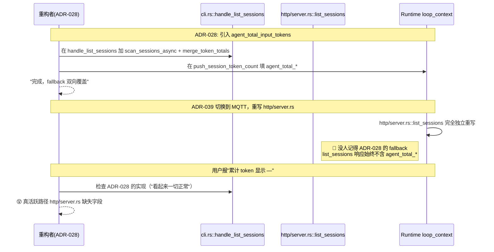
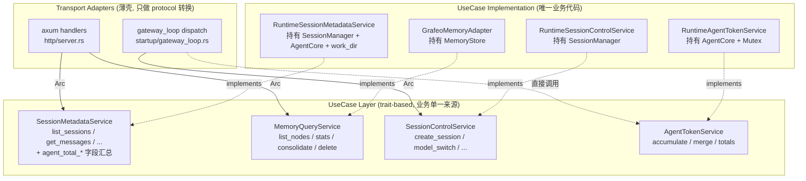

# ADR-040：Runtime Adapter 整合 — 引入 UseCase Trait 层与清理 gRPC 死代码

**状态**：草案（等待决策范围确认）
**日期**：2026-07-19
**决策者**：大鱼
**前置**：
- [ADR-016](./ADR-016-ipc-grpc-migration.md)（IPC gRPC 迁移）
- [ADR-031](./ADR-031-drop-legacy-ipc-consolidate-on-grpc.md)（drop legacy IPC 残留）
- [ADR-033](./ADR-033-mqtt-replace-grpc-websocket.md)（MQTT 替换 gRPC + WebSocket）
- [ADR-034](./ADR-034-mqtt-http-boundary.md)（MQTT/HTTP 边界）
- [ADR-039](./ADR-039-mqtt-client-lifecycle.md)（MQTT client 生命周期）

---

## 决策摘要

**两阶段解决"重复实现 / 重构遗漏"问题**：

| 阶段 | 范围 | 工作量 | 风险 |
|------|------|--------|------|
| **Phase 1 — 清理死代码 + 修当前 bug** | 修复 `http/server.rs::list_sessions` 漏 ADR-028 汇总 + 删除 `cli.rs::process_gateway_recv` 14 个 handler + 删除 `grpc/` 模块 | ~1 周 | 低 |
| **Phase 2 — UseCase trait 抽象层** | 在 `acowork-runtime/src/usecases/` 定义 4 个 trait（SessionMetadata / MemoryQuery / SessionControl / AgentToken），把现有散落方法收敛为唯一实现，改造 http/server.rs 和 gateway_loop dispatch | ~3 周 | 中 |

**关键决策**（已与大鱼确认）：

| 决策 | 理由 |
|------|------|
| UseCase trait 放在 **`acowork-runtime/src/usecases/`** | 不新建 crate；改动面小；acowork-runtime 本来就持有所有运行时上下文 |
| **Gateway 端不引入 UseCase** | Gateway 端有独立的 PackageManager / Provider / IntentRouter 业务，与 Runtime 的"agent 实例内部"职责不同；强制抽象反而割裂现有架构 |
| 不引入 `Arc<dyn Trait>` 容器嵌套 | Runtime state 已经持有具体类型的 Arc（SessionManager / AgentCore），直接在 use case impl 里持有具体类型，需要 trait 边界时再 `.clone() as Arc<dyn ...>` |
| Phase 1 先做（不阻塞当前 bug 修复），Phase 2 视情况启动 | Phase 1 是"立即止血"；Phase 2 是"长期免疫" |

**ADR 范围外**（明确不做）：
- Gateway 端 agent lifecycle / provider / cron 等业务不抽 UseCase
- Desktop 端不引入 UseCase 概念（前端天然单 adapter）
- 不引入 hex/clean architecture 等重型框架
- 不引入 CQRS / Event Sourcing

---

## 背景

### 1. 触发事件

桌面端"右侧 Agent Status 面板的累计输入/输出 Token 显示 '—'" bug 调查发现：

`http/server.rs::list_sessions` 响应中**完全没有** `agent_total_input_tokens` / `agent_total_output_tokens` 字段（ADR-028 实现不完整），导致 desktop 端 `agentTokenTotals` 永远是 `null`。

诡异之处：ADR-028 commit `6e98c17` 当时**明明在 `cli.rs::handle_list_sessions` 中实现了完整的 agent_total 汇总**——但这条路径是死代码，导致"实现看起来 OK，实际活跃路径漏了"。

### 2. 5 个 Adapter 层盘点

| # | Adapter | 路径 | 状态 | 功能归属 |
|---|---------|------|------|---------|
| 1 | **Gateway HTTP API** | `core/acowork-gateway/src/http/*.rs`（agents / chat / cron / memory_api 等） | ✅ 活跃 | Gateway 自身职责 |
| 2 | **Gateway HTTP Proxy** | `core/acowork-gateway/src/http/proxy.rs` | ✅ 活跃 | 干净的反向代理 |
| 3 | **Runtime HTTP server** | `core/acowork-runtime/src/http/server.rs` | ✅ 活跃 | 查询类（list_sessions / get_messages / memory_*） |
| 4 | **Runtime MQTT Control** | `core/acowork-runtime/src/mqtt/control_handler.rs` + `startup/gateway_loop.rs` | ✅ 活跃 | session 控制类（create / close / model_switch） |
| 5 | **gRPC Intent 路径** | `core/acowork-runtime/src/cli.rs::process_gateway_recv` | 💀 **死代码** | ADR-034 §8 Phase 2-2 移除，未清理 |

### 3. 死代码证据

#### 3.1 ADR-034 §8 Phase 2-2 已声明废弃

```rust
// core/acowork-runtime/src/startup/gateway_loop.rs:81-87
// ADR-034 §8 Phase 2-2: gRPC path removed. MQTT client is mandatory.
if ctx.mqtt_client.is_none() {
    return Err(crate::error::RuntimeError::Config(
        "Phase D entered without MQTT client (gRPC path removed per ADR-034 §8 Phase 2)"
            .into(),
    ));
}
```

#### 3.2 作者已标注

```rust
// core/acowork-runtime/src/cli.rs:939
#[allow(dead_code)]
async fn process_gateway_recv(
    ...
) -> LoopAction {
```

#### 3.3 Gateway 不再发 IntentReceived

```bash
$ grep -rn "GatewayResponse::IntentReceived" core/acowork-gateway/src/
# 0 results
```

Gateway 已切到 MQTT ControlCommand proto transport。Runtime 端的 `process_gateway_recv` 永远不会收到 IntentReceived 消息。

### 4. 死代码清单

`cli.rs::process_gateway_recv` 中的 14 个 handler + 函数本体，合计 ~1500 行：

| Handler / 实现 | 行号 | 替代实现 |
|---------------|------|---------|
| `handle_list_sessions` | cli:2759-2904 | http/server.rs::list_sessions |
| `handle_get_session_messages` | cli:2906+ | http/server.rs::get_messages |
| `handle_memory_nodes_query` | cli:2655 | http/server.rs::get_memory_nodes |
| `handle_memory_stats_query` | cli:2689 | http/server.rs::get_memory_stats |
| `handle_memory_delete_query` | cli:2713 | http/server.rs::delete_memory_node |
| `handle_memory_consolidate_query` | cli:2731 | http/server.rs::trigger_consolidate |
| inline `create_session` | cli:998 | mqtt/control_handler + gateway_loop dispatch |
| inline `close_session` / `delete_session` / `update_session_title` | cli | 同上 |
| inline `model_switch` / `reasoning_effort` | cli | 同上 |
| inline `interrupt` / `continue_execution` | cli | 同上 |
| inline `approval_decision` / `question_answer` | cli | 同上 |
| inline `compact_context` / `compress_action` | cli | 同上 |

加上 `acowork-runtime/src/grpc/client.rs`（~1450 行）、`acowork-runtime/src/grpc/mod.rs`、`tools/builtin/intent_send.rs` 的 grpc_client 引用、`acowork-gateway/src/grpc/server.rs` 整个目录（被 ADR-031 drop 时漏掉的另一面）。

**死代码总量估计 ~3000+ 行**（含 grpc 模块）。

### 5. 本次 bug 的传播链



**根因**：重构者看 cli.rs 中**看起来活着的** handle_list_sessions 以为 ADR-028 fallback 完整实现了。但 CLI 路径已死。**真正的活跃路径是 http/server.rs**，而它根本没继承 ADR-028。

### 6. 当前隐藏的反模式

即使没有死代码，**adapter 直接调用底层模块**本身就是反模式：

```rust
// http/server.rs:326-369 (list_sessions 当前实现)
async fn list_sessions(...) -> Result<Json<serde_json::Value>, StatusCode> {
    let scanned = scan_sessions_from_meta(&conversations_dir);  // 直接调 disk scan
    let page_sessions = scanned.into_iter().map(|(session_id, meta)| {
        serde_json::json!({  // 直接手挑字段（漏了 tokens、漏了 agent_total_*）
            "session_id": session_id,
            "title": meta.title,
            // ...
        })
    }).collect();
    Ok(Json(serde_json::json!({  // 直接构造响应（漏了 agent_total_input_tokens）
        "sessions": page_sessions,
    })))
}
```

```rust
// cli.rs:2759 (handle_list_sessions "假"实现)
async fn handle_list_sessions(...) -> Result<()> {
    let (sessions, total_count, agent_totals) = scan_sessions_async(...).await;
    session_manager.core().merge_token_totals((Some(agent_totals.0), Some(agent_totals.1)));
    let (agent_total_input_tokens, agent_total_output_tokens) =
        session_manager.core().agent_token_totals();
    // ... 然后拼响应
}
```

**同一业务能力，两处代码长得完全不一样** —— 一个手写 JSON 字段挑选，一个调用 `scan_sessions_async` 汇总。后续无论谁改任何一处，另一处都不会自动跟上。

### 7. 项目已有的 trait 抽象先例

- ✅ `acowork-memory/src/store.rs::MemoryStore` trait — Memory 领域已经有 trait 抽象
- ❌ Session / Agent / ConversationMeta — 全部是直接调实现

**说明项目认可 trait 抽象模式，但没推广到全领域。**

---

## 方案

### Phase 1：清理死代码 + 修当前 bug

#### 1.1 修复 http/server.rs::list_sessions ADR-028 遗漏

`core/acowork-runtime/src/http/server.rs:326-369` 改为复用 `scan_sessions_async` + `merge_token_totals`，响应顶层加 `agent_total_input_tokens` / `agent_total_output_tokens`：

```rust
async fn list_sessions(
    State(s): State<RuntimeHttpState>,
    Query(q): Query<ListSessionsQuery>,
) -> Response {
    let conversations = s.work_dir.join("conversations");
    let join = scan_sessions_async(conversations, q.page, q.size);
    let (sessions, total_count, (disk_in, disk_out)) = match join.await {
        Ok(v) => v,
        Err(e) => return (StatusCode::INTERNAL_SERVER_ERROR, e.to_string()).into_response(),
    };
    let core = s.agent_core.clone();
    core.merge_token_totals((Some(disk_in), Some(disk_out)));
    let (agent_total_input_tokens, agent_total_output_tokens) = core.agent_token_totals();

    let total_pages = if total_count == 0 { 0 } else { total_count.div_ceil(size) };
    Json(json!({
        "sessions": sessions,
        "total_count": total_count,
        "total_pages": total_pages,
        "page": q.page.unwrap_or(1),
        "size": q.size.unwrap_or(20),
        "agent_total_input_tokens": agent_total_input_tokens,
        "agent_total_output_tokens": agent_total_output_tokens,
    })).into_response()
}
```

#### 1.2 删除 cli.rs 死代码

- 删除 `process_gateway_recv` 函数（cli:940-~1500 行）
- 删除 14 个 handle_* 函数（cli:2655-2900+ 等）
- 移除 `cli.rs:600 / cli.rs:882` 两处 process_gateway_recv 调用
- 移除 `cli.rs:373` 中 `grpc_client.is_some()` 判断分支（MQTT 配置下永远走 mqtt）

#### 1.3 删除 Runtime grpc 模块

- 删除 `core/acowork-runtime/src/grpc/client.rs`（~1450 行）
- 删除 `core/acowork-runtime/src/grpc/mod.rs`
- `core/acowork-runtime/src/lib.rs` 中删除 `pub mod grpc;`
- `core/acowork-runtime/src/startup/context.rs` 删除 `grpc_client` 字段
- `core/acowork-runtime/src/startup/agent_init.rs` 删除 grpc_client 初始化（line 50-80）

#### 1.4 删除 Gateway 端 grpc server

- 删除 `core/acowork-gateway/src/grpc/` 整个目录（ADR-031 当时只 drop 了 ipc 侧，gateway grpc server 侧漏了）
- 清理 `core/acowork-gateway/src/lib.rs` 中引用

#### 1.5 清理 tools/builtin/intent_send.rs 中的 grpc_client 引用

`core/acowork-runtime/src/tools/builtin/intent_send.rs:14, 117` 注释中提到 grpc_client，需要改为当前实际使用的 mqtt_client 或 Gateway HTTP API。

#### 1.6 Phase 1 Commit 列表

| Commit | 范围 | LOC | 风险 |
|--------|------|-----|------|
| **P1-A** | `http/server.rs::list_sessions` 补 ADR-028 汇总 + 回归测试 | +30 / -10 | 低 |
| **P1-B** | `cli.rs` 删除 14 个 handle_* + `process_gateway_recv` 函数 | +0 / -1500 | 低 |
| **P1-C** | `cli.rs` 删除 process_gateway_recv 两处调用 + 简化 if/else 分支 | +10 / -30 | 低 |
| **P1-D** | 删除 `acowork-runtime/src/grpc/` 整个模块 + startup 清理 | +0 / -1500 | 低 |
| **P1-E** | 删除 `acowork-gateway/src/grpc/` 整个目录 | +0 / -800 | 中（需确认无外部依赖） |
| **P1-F** | `tools/builtin/intent_send.rs` 替换 grpc_client 注释 | +5 / -10 | 低 |
| **P1-G** | 全 workspace `cargo build / clippy / test` + Desktop 手动验证累计 token 显示 | 0 | 低 |

**Phase 1 总计**：~6 commits，删除 ~3850 行死代码 + 修复当前 bug。

### Phase 2：UseCase trait 抽象层

#### 2.1 目标架构



#### 2.2 Trait 定义

**位置**：`core/acowork-runtime/src/usecases/`

```rust
// usecases/session_metadata.rs
#[async_trait]
pub trait SessionMetadataService: Send + Sync {
    /// 列出 agent 的所有 session, 带分页 + agent 级累计 token (ADR-027 + ADR-028)
    async fn list_sessions(&self, page: u32, size: u32) -> Result<SessionsListResponse>;

    async fn get_latest_session(&self) -> Result<Option<SessionSummary>>;
    async fn get_session(&self, session_id: &str) -> Result<SessionDetail>;
    async fn get_messages(
        &self,
        session_id: &str,
        limit: Option<u32>,
    ) -> Result<MessagesResponse>;
}

// usecases/memory_query.rs
#[async_trait]
pub trait MemoryQueryService: Send + Sync {
    async fn list_nodes(&self, query: &MemoryNodeQuery) -> Result<Vec<MemoryNode>>;
    async fn get_stats(&self) -> Result<MemoryStats>;
    async fn consolidate(&self, force: bool, retention_days: u32) -> Result<ConsolidationReport>;
    async fn delete_node(&self, node_id: &str) -> Result<()>;
}

// usecases/session_control.rs
#[async_trait]
pub trait SessionControlService: Send + Sync {
    async fn create_session(&self, session_id: Option<String>) -> Result<String>;
    async fn close_session(&self, session_id: &str) -> Result<()>;
    async fn delete_session(&self, session_id: &str) -> Result<()>;
    async fn update_title(&self, session_id: &str, title: String) -> Result<()>;
    async fn model_switch(&self, session_id: &str, model: String, provider: String) -> Result<()>;
    async fn reasoning_effort(&self, session_id: &str, effort: ReasoningEffort) -> Result<()>;
    async fn compact_context(&self, session_id: &str) -> Result<()>;
}

// usecases/agent_token.rs
pub trait AgentTokenService: Send + Sync {
    fn accumulate_llm_usage(&self, usage: &Usage);
    fn merge_token_totals(&self, disk_totals: (u64, u64));
    fn agent_token_totals(&self) -> (u64, u64);
    fn session_token_totals(&self, session_id: &str) -> Option<(u64, u64)>;
}
```

#### 2.3 唯一实现

```rust
// usecases/session_metadata.rs (impl block)
pub struct RuntimeSessionMetadataService {
    work_dir: PathBuf,
    session_manager: Arc<SessionManager>,
    agent_token: Arc<dyn AgentTokenService>,
}

impl SessionMetadataService for RuntimeSessionMetadataService {
    async fn list_sessions(&self, page: u32, size: u32) -> Result<SessionsListResponse> {
        let conversations = self.work_dir.join("conversations");
        // 唯一一处调用 scan_sessions_async
        let join = scan_sessions_async(conversations, Some(page), Some(size));
        let (sessions, total_count, (disk_in, disk_out)) = join.await?;
        // 唯一一处 merge + 读取
        self.agent_token.merge_token_totals((disk_in, disk_out));
        let (agent_in, agent_out) = self.agent_token.agent_token_totals();

        Ok(SessionsListResponse {
            sessions,
            total_count,
            total_pages: total_count.div_ceil(size as usize),
            page,
            size,
            agent_total_input_tokens: agent_in,
            agent_total_output_tokens: agent_out,
        })
    }
    // ...
}
```

#### 2.4 Adapter 改造

```rust
// http/server.rs (改造后)
async fn list_sessions(
    State(s): State<RuntimeHttpState>,
    Query(q): Query<ListSessionsQuery>,
) -> Response {
    let svc: Arc<dyn SessionMetadataService> = s.session_metadata.clone();
    match svc.list_sessions(q.page.unwrap_or(1), q.size.unwrap_or(20)).await {
        Ok(r) => Json(r).into_response(),
        Err(e) => (StatusCode::INTERNAL_SERVER_ERROR, e.to_string()).into_response(),
    }
}
```

```rust
// startup/gateway_loop.rs (改造后 dispatch)
match action {
    ControlAction::CreateSession { session_id } => {
        let svc: Arc<dyn SessionControlService> = ctx.session_control.clone();
        Some((String::new(), InboundMessage::DirectCommand(
            svc.create_session(session_id).await.map(|sid| json!({"session_id": sid}))?
        )))
    }
    // ...
}
```

#### 2.5 RuntimeState 持有 Service 集合

```rust
// startup/context.rs
pub struct RuntimeBootContext {
    pub agent_core: Arc<AgentCore>,
    pub session_manager: Arc<SessionManager>,

    // UseCase services (单一入口)
    pub session_metadata: Arc<dyn SessionMetadataService>,
    pub memory_query: Arc<dyn MemoryQueryService>,
    pub session_control: Arc<dyn SessionControlService>,
    pub agent_token: Arc<dyn AgentTokenService>,
    // ...
}
```

#### 2.6 Phase 2 Commit 列表

| Commit | 范围 | LOC | 风险 |
|--------|------|-----|------|
| **P2-A** | 定义 4 个 UseCase trait + 响应 DTO（`usecases/mod.rs` + 子模块） | +300 | 低 |
| **P2-B** | 实现 `RuntimeSessionMetadataService`，含 ADR-028 完整汇总 | +200 | 中（核心改动） |
| **P2-C** | 实现 `GrafeoMemoryAdapter`（基于已有 `MemoryStore` trait） | +150 | 低 |
| **P2-D** | 实现 `RuntimeSessionControlService`（基于已有 `SessionManager` 方法） | +200 | 低 |
| **P2-E** | 实现 `RuntimeAgentTokenService`（基于 `AgentCore`） | +80 | 低 |
| **P2-F** | RuntimeBootContext 加 service 字段 + 初始化 | +100 | 低 |
| **P2-G** | 改造 http/server.rs 所有 handler 使用 trait | +200 / -400 | 中（25+ handler） |
| **P2-H** | 改造 gateway_loop.rs dispatch 使用 trait | +150 / -300 | 中 |
| **P2-I** | 移除现在 dead 的旧 helper 函数（scan_sessions_from_meta 直接调用点等） | +0 / -100 | 低 |
| **P2-J** | 全 workspace `cargo build / clippy / test` + 端到端验证 | 0 | 低 |

**Phase 2 总计**：~10 commits，~+1380 / -800 行。

### Phase 3（ADR-040 范围外，但规划中）

| 任务 | 内容 |
|------|------|
| Clippy 自定义 lint | 禁止 http/server.rs / startup/gateway_loop.rs 直接 `use crate::conversation::scan_sessions_*` 等底层函数 |
| 端到端 schema 测试 | 每个 UseCase trait 方法的响应 DTO 用 schema 锁定测试，字段缺失立即 panic |
| ADR review checklist | 新增 "UseCase 边界检查" 一节 |

---

## 实施计划

### Phase 1（本周）

```
Day 1-2: P1-A 修 bug（验证修复）
Day 3:   P1-B 删除 cli handle_*
Day 4:   P1-C 删除 process_gateway_recv + 调用点
Day 5:   P1-D 删除 Runtime grpc 模块
Day 6:   P1-E 删除 Gateway grpc server
Day 7:   P1-F/G 清理 + 全测验证
```

### Phase 2（视 Phase 1 反馈）

每个 commit 独立可 build + 测试通过再进入下一个；保留 ~1 周观察期。

---

## 风险评估

### Phase 1 风险

| 风险 | 缓解 |
|------|------|
| 删除 grpc 模块后漏改某处引用 | P1-D 前先 `grep -rn "crate::grpc\|GatewayGrpcClient" core/` 全量盘点 |
| Gateway grpc server 有外部依赖 | P1-E 前先 `grep -rn "gateway.*grpc\|GatewayGrpc" core/` 确认无引用 |
| Desktop 端 Tauri side 有 grpc 引用 | 检查 `apps/acowork-desktop/src-tauri/` 是否还引用（ADR-031 当时已经清过，但 desktop 端的 grpc 不在 ADR-031 范围） |
| Phase 1 后 cli.rs 还有未发现的死代码 | P1-B 后跑 `cargo build -p acowork-runtime` 验证无报错 |

### Phase 2 风险

| 风险 | 缓解 |
|------|------|
| trait 抽象粒度不当（太细或太粗） | 严格按"业务能力"切分（4 个 trait），不按"技术细节"切分 |
| `Arc<dyn Trait>` 装箱成本 | 仅在 adapter 边界装箱一次；impl 内部直接持有具体类型 |
| AgentTokenService 是否真的需要 trait | 它在 loop_context.rs 中被频繁调用（每次 LLM 完成），装箱成本高；考虑只在 adapter 边界提供 dyn 视图，impl 内部仍走 AgentCore |
| gateway_loop dispatch 重构影响活跃路径 | P2-H 保留旧 dispatch 代码标 `#[deprecated]`，观察 1 周无 regression 再删除 |
| 测试覆盖率不足 | P2-J 前必须新增 use case impl 单元测试 + adapter 集成测试 |

---

## 验证清单

### Phase 1 验证

- [ ] `cargo build -p acowork-runtime -p acowork-gateway --release` 0 warning 0 error
- [ ] `cargo clippy --all-targets -- -D warnings` 0 warning
- [ ] `cargo test -p acowork-runtime` 586 个测试全通过
- [ ] `cargo test -p acowork-gateway` 281 个测试全通过
- [ ] Desktop 端手动验证���启动 agent / 发消息 / 切 session / 看右侧 Agent Status 面板累计 token 数字显示（不是 "—"）
- [ ] `grep -rn "GatewayGrpcClient\|process_gateway_recv\|handle_list_sessions" core/` 返回 0 结果
- [ ] Desktop dev Tauri side 引用清空（`grep -rn "grpc\|gRPC" apps/acowork-desktop/src-tauri/` 仅剩余 MQTT 相关）

### Phase 2 验证

- [ ] 所有 4 个 UseCase trait 单元测试覆盖（正常路径 + 错误路径 + 并发路径）
- [ ] Adapter 端到端测试：每个 UseCase 至少一个 adapter 路径走通（http 端点返回符合 schema）
- [ ] 性能基线：装箱成本 < 5%（benchmark 验证）
- [ ] 新增 lint 在 http/server.rs / gateway_loop.rs 中标记 0 个直接底层调用

---

## 不（明确边界）

- **Gateway 端业务不抽 UseCase**（PackageManager / Provider / IntentRouter / cron 等）
- **Desktop 端不引入 UseCase 概念**（前端天然单 adapter）
- **不引入 hex/clean architecture 等重型框架**（过度抽象）
- **不引入 CQRS / Event Sourcing**（过度工程）
- **不拆分 crate**（UseCase trait 在 acowork-runtime 子模块下）
- **不改 proto 定义**（除非 Phase 2 改造发现真的需要）

---

## 后续清理（ADR-040 范围之外）

1. **Desktop Tauri 侧 grpc 引用清理**（如果 Phase 1 验证发现还残留）
2. **Gateway HTTP API 重复 token 字段**（chat.rs / agents.rs 等如果有 agent_total_* 残留）
3. **测试 fixture 适配**（integration tests 中可能有针对 cli handle_* 的测试用例，需要转为针对 use case trait 的 mock 测试）
4. **Phase 3 一致性约束**（clippy lint + schema 测试）

---

## 附录 A：完整死代码文件清单

| 文件 | 行数 | 状态 |
|------|------|------|
| `core/acowork-runtime/src/cli.rs` (process_gateway_recv + 14 handlers) | ~1500 | P1-B/C 删除 |
| `core/acowork-runtime/src/grpc/client.rs` | ~1450 | P1-D 删除 |
| `core/acowork-runtime/src/grpc/mod.rs` | ~10 | P1-D 删除 |
| `core/acowork-gateway/src/grpc/server.rs` | ~800 | P1-E 删除 |
| `core/acowork-gateway/src/grpc/dispatch.rs` | ~? | P1-E 删除 |
| `core/acowork-gateway/src/grpc/` 整个目录 | ~? | P1-E 删除 |
| `tools/builtin/intent_send.rs` 中 grpc_client 注释 | ~10 | P1-F 清理 |

**总计 ~3850 行死代码**（含 grpc 模块两个 crate）。

## 附录 B：UseCase trait 选型理由

| 选项 | 优点 | 缺点 | 决策 |
|------|------|------|------|
| 新建 crate `acowork-usecases` | 独立编译，可被 Gateway 复用 | 跨 crate 编译开销；trait 需要在独立 crate 定义 | ❌ |
| 放在 `acowork-runtime/src/usecases/` | 改动面小；与 Runtime state 自然耦合 | 不能被 Gateway 直接复用 | ✅（Gateway 不需要） |
| 集成到 `acowork-core` | "核心抽象"语义 | acowork-core 会被 Runtime 双向依赖；trait 方法签名需要用到 Runtime 类型 | ❌ |
| 不引入 trait，直接收敛到 impl 方法 | 最简单 | adapter 仍会直接调底层，无法强制约束 | ❌（治标不治本） |

## 附录 C：本次 bug 的最终修复点

`core/acowork-runtime/src/http/server.rs::list_sessions` 改造（也包含在 P1-A 中）：

```rust
// Before (P1-A 前)
async fn list_sessions(
    State(state): State<HttpState>,
    Query(query): Query<ListSessionsQuery>,
) -> Result<Json<serde_json::Value>, StatusCode> {
    let conversations_dir = state.work_dir.join("conversations");
    let scanned = scan_sessions_from_meta(&conversations_dir);  // ❌ 没汇总 agent_total
    // ...直接 json!({}) 拼响应, 漏 agent_total_input_tokens
}

// After (P1-A 后)
async fn list_sessions(
    State(state): State<HttpState>,
    Query(query): Query<ListSessionsQuery>,
) -> Result<Json<serde_json::Value>, StatusCode> {
    let conversations_dir = state.work_dir.join("conversations");
    let join = scan_sessions_async(conversations_dir, query.page, query.size);
    let (sessions, total_count, (disk_in, disk_out)) = join.await
        .map_err(|_| StatusCode::INTERNAL_SERVER_ERROR)?;
    let core = state.agent_core.clone();
    core.merge_token_totals((Some(disk_in), Some(disk_out)));
    let (agent_total_input_tokens, agent_total_output_tokens) = core.agent_token_totals();
    // ✅ 完整返回
    Ok(Json(serde_json::json!({
        "sessions": sessions,
        "total_count": total_count,
        // ...
        "agent_total_input_tokens": agent_total_input_tokens,
        "agent_total_output_tokens": agent_total_output_tokens,
    })))
}
```

Phase 2 之后，此处的 `merge_token_totals` + `agent_token_totals` 调用将进一步收敛到 `RuntimeSessionMetadataService::list_sessions` 中唯一实现，handler 仅作协议转换。

---

**版本历史**：
- v0.1 (2026-07-19): 初稿