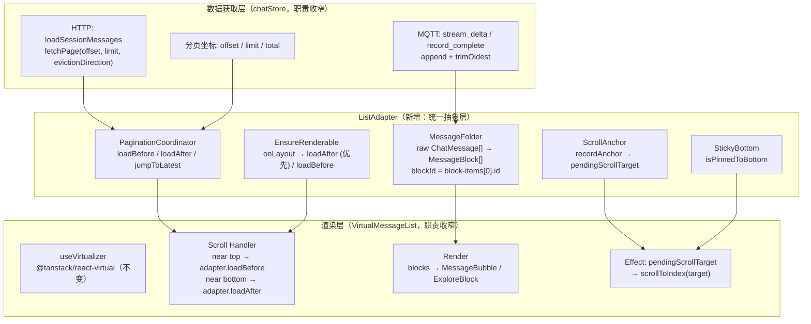
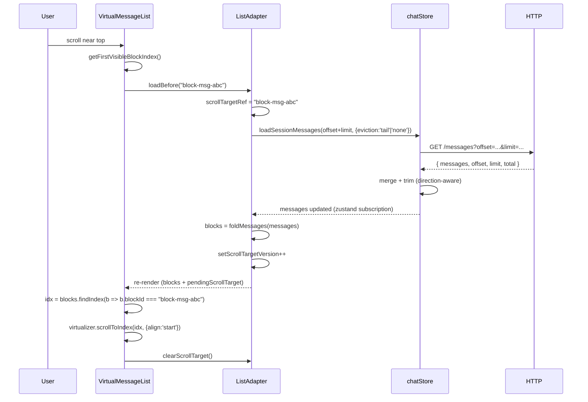
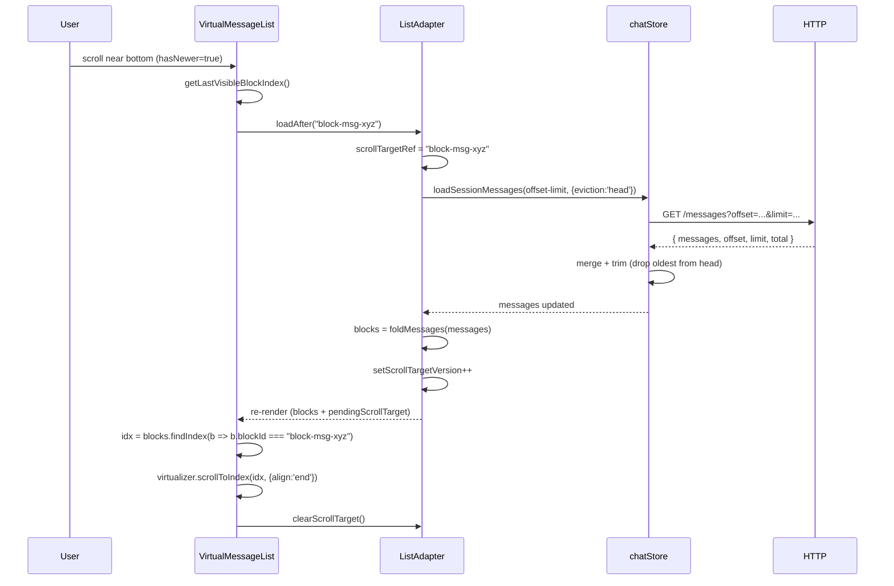
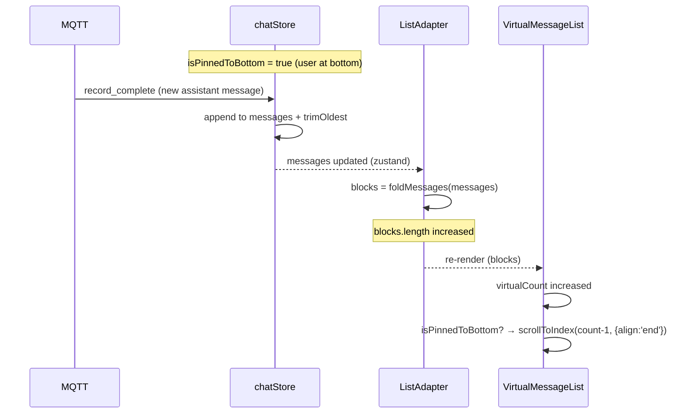

# ADR-041: Chat 列表 Adapter 抽象层 - 统一数据到渲染的桥梁

**状态**：草案
**日期**：2026-07-20
**决策者**：大鱼

**前置**：
- ADR-021（统一 Session 数据加载 - HTTP Pull + MQTT 通知）
- ADR-035（流式传输重构 - MQTT 数据直推 + per-session 行缓冲）
- ADR-038（Session 生命周期显式化模型）

---

## 1. 决策摘要

当前聊天消息列表的渲染架构缺乏统一抽象。数据加载、滚动锚定、缓存窗口管理、消息折叠四项职责散落在 `ChatPanel.tsx`、`VirtualMessageList.tsx`、`chatStore.ts` 三个文件中，通过 `scope` ref、`useMemo` 闭包、`useLayoutEffect` 状态转移等隐式机制耦合。这种散落导致了 4 个已确认的设计漏洞（详见 §2）。

本 ADR 引入 **ListAdapter** -- 一个位于 `chatStore`（数据获取层）与 `VirtualMessageList`（渲染层）之间的统一抽象层。ListAdapter 是 MessageBlock[] 的唯一生产者和管理者，吸收当前散落在三处的职责。

**五条核心设计**：

1. **稳定 blockId**：`blockId` 从 `"block-${i}"`（数组索引）改为 `"block-${items[0].id}"`（内容派生）。一次分配终身不变，prepend/append 不改变已有 block 的 ID。
2. **双向对称分页**：`loadBefore()` / `loadAfter()` 对称设计，替代当前只有上翻（`loadMoreOlderMessages`）+ 一次性跳转（`ensureLatestInCache`）的非对称模型。
3. **Adapter 内部滚动锚定**：锚定逻辑从 `scope.current.anchorToUserBlockId` + VML `useLayoutEffect` 收敛到 Adapter 内部，通过 `pendingScrollTarget` 输出给渲染层执行。
4. **方向感知缓存裁剪**：`chatStore.loadSessionMessages` 新增 `evictionDirection` 参数。加载更旧消息且正在流式输出时不裁剪（允许窗口临时膨胀）；其余场景按方向裁剪。
5. **VML 职责收窄**：VirtualMessageList 不再管理锚定、sticky-bottom、ensure-renderable，仅负责虚拟化渲染和向上/下翻页触发。

---

## 2. 背景与根因

### 2.1 当前架构

```
chatStore.ts
├── messages: ChatMessage[]          ← raw 数据存储
├── messageOffset/Limit/Total        ← 分页坐标
├── loadSessionMessages()            ← HTTP 拉取 + 合并 + 裁剪
├── loadMoreOlderMessages()          ← 仅上翻
├── ensureLatestInCache()            ← 一次性跳转到最新
└── MQTT 事件处理                     ← 流式追加 + trimOldest

ChatPanel.tsx
├── messageBlocks = useMemo(...)     ← 折叠 raw -> block, blockId = "block-${i}"
├── handleScroll()                   ← 仅检测 scrollTop < 50 触发上翻
├── scope.current.anchorToUserBlockId ← 锚定 blockId 传递
├── pinnedToBottomRef                ← sticky-bottom 状态
└── virtualCount = blocks.length + extras

VirtualMessageList.tsx
├── useVirtualizer(...)              ← tanstack-virtual 虚拟化
├── useLayoutEffect (load-older)     ← 监听 isLoadingMore, scrollToIndex 到锚点
├── useLayoutEffect (sticky-bottom)  ← 监听 virtualCount 增长, scrollToIndex(end)
├── useLayoutEffect (ensure-renderable) ← 监听 totalSize < clientHeight, 调 onNeedMore
└── VirtualMessageListHandle         ← getFirstVisibleBlockIndex 等命令式查询
```

### 2.2 四个设计漏洞

| # | 漏洞 | 根因层 | 影响 |
|---|------|--------|------|
| **P0-1** | blockId 基于数组索引（`"block-${i}"`），prepend 后所有 block 的 ID 全部改变 | ChatPanel `useMemo` | `findIndex(b => b.blockId === anchorId)` 找不到锚点，滚动位置错乱 |
| **P0-2** | 缓存窗口裁剪方向与流式追加冲突 | chatStore `loadSessionMessages` | 加载更旧消息时从尾部裁剪（drop newest），但流式输出正在追加到尾部，用户正在看的消息被驱逐 |
| **P1-3** | `handleScroll` 闭包捕获了过期的 `messageBlocks` | ChatPanel `useCallback` | 锚定记录了错误的 blockId（指向旧数组的索引） |
| **P1-4** | 无向下翻页机制 | ChatPanel `handleScroll` | 用户上翻后无法自然滚回最新消息；只能点击 scroll-to-bottom 按钮一次性跳转 |

### 2.3 架构根因

四个漏洞指向同一个架构问题：**缺少一个统一的数据到渲染的抽象层**。

- blockId 的分配（P0-1）和锚定逻辑（P1-3）本应是同一层的职责，但被拆散到 `useMemo` 和 `handleScroll` 两个不同上下文中。
- 缓存窗口裁剪（P0-2）本应根据当前滚动方向和流式状态决策，但裁剪逻辑在 `chatStore` 中，而方向信息在 `ChatPanel` 中，两者之间没有协调通道。
- 双向分页（P1-4）本应是对称设计，但当前只有上翻路径，下翻被 `ensureLatestInCache` 的"一次性跳转"替代，语义不同。

Android 的 RecyclerView + Adapter 模式正是解决这类问题的标准架构：Adapter 作为数据和渲染之间的唯一桥梁，统一管理 item 身份、数据加载、视图复用。本 ADR 将这一模式引入前端。

### 2.4 不替换虚拟化引擎

本 ADR **不替换** `@tanstack/react-virtual`。理由：

1. 四个漏洞全在数据加载和滚动锚定层，不在虚拟化引擎层。
2. 当前代码有大量 WKWebView/Tauri 特定 workaround（同步 `scrollTop` 赋值、`NotAllowedError` 捕获、双重 ResizeObserver 测量），替换引擎风险不可控。
3. `react-virtuoso` 和 `virtua` 等替代方案在 WKWebView 环境下未经验证。

ListAdapter 包裹 `@tanstack/react-virtual`，不替换它。

---

## 3. 架构总览



### 数据流

```
chatStore.messages (raw ChatMessage[])
    │
    ▼
ListAdapter
    ├── foldMessages() → MessageBlock[] (稳定 blockId)
    ├── 读取 offset/limit/total → hasOlder / hasNewer
    ├── loadBefore(anchorBlockId) → chatStore.loadSessionMessages(offset+limit, ..., eviction='tail'|'none')
    ├── loadAfter(anchorBlockId)  → chatStore.loadSessionMessages(offset-limit, ..., eviction='head')
    ├── onLayout(totalH, viewH)   → 未填满时: hasNewer优先loadAfter, 否则loadBefore
    ├── pendingScrollTarget       → 输出给 VML
    └── isPinnedToBottom          → 输出给 VML
    │
    ▼
VirtualMessageList
    ├── 读取 adapter.blocks → 渲染
    ├── scroll near top    → adapter.loadBefore(vml.getFirstVisibleBlockId())
    ├── scroll near bottom → adapter.loadAfter(vml.getLastVisibleBlockId())
    └── effect(pendingScrollTarget) → virtualizer.scrollToIndex(targetIdx)
```

---

## 4. 核心抽象

### 4.1 ListAdapter 接口

```typescript
/**
 * ListAdapter - chatStore 与 VirtualMessageList 之间的唯一桥梁。
 *
 * 职责：
 *  - 折叠 raw ChatMessage[] → MessageBlock[]（含稳定 blockId）
 *  - 协调双向分页（loadBefore / loadAfter）
 *  - 管理滚动锚定（prepend/append 后恢复位置）
 *  - 管理 sticky-bottom 状态
 *  - 协调 ensure-renderable（viewport 未填满时自动加载更旧）
 *
 * 不职责：
 *  - HTTP 请求 / MQTT 事件处理（留在 chatStore）
 *  - DOM 滚动操作（留在 VirtualMessageList）
 *  - 高度估算（留在 blockHeightEstimator）
 */
interface ChatListAdapter {
  // ── 数据输出 ──
  /** 折叠后的显示块数组。blockId 为内容派生，prepend/append 不变。 */
  readonly blocks: MessageBlock[];

  // ── 分页状态 ──
  /** 是否存在更旧的消息（offset + limit < total）。 */
  readonly hasOlder: boolean;
  /** 是否存在更新的消息（offset > 0）。 */
  readonly hasNewer: boolean;
  /** 当前 session 是否正在加载分页数据。per-session，非全局。 */
  readonly isLoading: boolean;

  // ── 分页动作 ──
  /**
   * 加载更旧消息（上翻）。调用方传入当前第一个可见 block 的 ID 作为锚点。
   * Adapter 内部记录锚点、调用 chatStore、加载完成后设置 pendingScrollTarget。
   * No-op if !hasOlder || isLoading。
   */
  loadBefore(anchorBlockId: string): Promise<void>;
  /**
   * 加载更新消息（下翻）。调用方传入当前最后一个可见 block 的 ID 作为锚点。
   * No-op if !hasNewer || isLoading。
   */
  loadAfter(anchorBlockId: string): Promise<void>;
  /** 一次性跳转到最新页（offset=0）。用于 scroll-to-bottom 按钮。 */
  jumpToLatest(): Promise<void>;

  // ── 滚动锚定 ──
  /**
   * 加载完成后非 null：渲染层应 scrollToIndex 到该 blockId 对应的索引。
   * 渲染层消费后调用 clearScrollTarget()。
   */
  readonly pendingScrollTarget: string | null;
  clearScrollTarget(): void;

  // ── Sticky bottom ──
  readonly isPinnedToBottom: boolean;
  setPinnedToBottom(value: boolean): void;

  // ── Viewport 填充 ──
  /**
   * 渲染层在每次 layout 后调用。Adapter 内部判断 totalHeight 是否填满
   * viewport。若未填满，按以下优先级触发加载：
   *
   *  1. hasNewer 为 true 时优先 loadAfter（恢复被裁剪的最新消息）。
   *     场景：用户曾上翻导致尾部被裁，切回时内容不足以填满 viewport。
   *     此时应优先恢复最新消息（用户大概率想看新内容），而非继续往顶部加旧消息。
   *
   *  2. hasOlder 为 true 时 loadBefore（初始加载填充）。
   *     场景：新 session 初始加载，offset=0, hasNewer=false，需要往顶部加旧消息直到 viewport 填满。
   *
   *  3. 两者均 false 时不操作（session 全部消息已在 cache 中但不足一屏）。
   *
   * 这修复了当前 ensureRenderable effect 的致命缺陷：它只检查 hasOlder、
   * 只调用 loadBefore，当用户上翻导致尾部裁剪后，viewport 不满但它继续
   * 往顶部加旧消息而非恢复尾部，导致用户"翻不到底就停了"。
   */
  onLayout(totalHeight: number, viewportHeight: number): void;
}
```

### 4.2 稳定 blockId

**当前**（ChatPanel `useMemo`）：

```typescript
const blockId = `block-${i}`;  // i = 循环索引，messages[] 中的位置
```

**改为**（`foldMessages` 纯函数）：

```typescript
// 非分组消息
const blockId = `block-${msg.id}`;

// explore_group（多消息折叠为一组）
const blockId = `block-${exploreBuffer[0].id}`;
```

`msg.id` 是后端分配的消息 ID（JSONL 行号或 UUID），prepend/append 不改变已有消息的 ID。

**效果**：

| 操作 | 旧 blockId | 新 blockId |
|------|-----------|-----------|
| prepend 50 条旧消息 | 所有 block 的 i 偏移 +50，blockId 全变 | 已有 block 的 blockId 不变 |
| append 1 条新消息 | 最后一个 block 之后的新 block 拿到下一个 i | 已有 block 的 blockId 不变 |
| 流式追加更新最后一条 | 最后一个 block 的 i 不变，blockId 不变 | blockId 不变 |

这是修复 P0-1 和 P1-3 的基础。`findIndex(b => b.blockId === anchorId)` 在 prepend 后仍能找到正确的 block。

### 4.3 双向对称分页

**当前**（非对称）：

```
上翻: loadMoreOlderMessages() → offset += limit
下翻: 无（ensureLatestInCache 是一次性跳转，不是分页）
```

**改为**（对称）：

```
上翻: loadBefore() → offset += limit, eviction = 'tail' | 'none'
下翻: loadAfter()  → offset -= limit (min 0), eviction = 'head'
跳转: jumpToLatest() → offset = 0, replace cache
```

分页状态推导：

```typescript
hasOlder = messageOffset + messageLimit < messageTotal && messageLimit > 0;
hasNewer = messageOffset > 0;
```

**触发时机**（VirtualMessageList 的 scroll handler）：

```typescript
// 伪代码 - VML 内部
const handleScroll = () => {
  const { scrollTop, scrollHeight, clientHeight } = container;
  const distFromTop = scrollTop;
  const distFromBottom = scrollHeight - scrollTop - clientHeight;

  if (distFromTop < 50 && adapter.hasOlder && !adapter.isLoading) {
    const firstBlockId = getFirstVisibleBlockId();
    adapter.loadBefore(firstBlockId);
  }

  if (distFromBottom < 50 && adapter.hasNewer && !adapter.isLoading) {
    const lastBlockId = getLastVisibleBlockId();
    adapter.loadAfter(lastBlockId);
  }

  adapter.setPinnedToBottom(distFromBottom <= 5);
};
```

VML 通过 `virtualizer.getVirtualItems()` 查询可见 block 的索引，再从 `adapter.blocks[idx].blockId` 获取稳定 ID。VML 直接读取 `adapter.blocks`（prop，始终最新），不存在闭包过期问题（修复 P1-3）。

### 4.4 滚动锚定

**当前**（散落在三处）：

```
1. ChatPanel.handleScroll: scope.current.anchorToUserBlockId = messageBlocks[firstVisibleIdx].blockId
2. ChatPanel.useMemo:      block.anchorToUser = (blockId === anchorToUserBlockId)
3. VML.useLayoutEffect:    监听 isLoadingMore false → findIndex(anchorToUser) → scrollToIndex
```

问题：步骤 1 的 `messageBlocks` 可能是过期闭包（P1-3）；步骤 2 的 `blockId` 是 index-based，prepend 后找不到（P0-1）。

**改为**（Adapter 内部统一管理）：

```
1. VML.scroll handler:  adapter.loadBefore(firstVisibleBlockId)  // 传入稳定 ID
2. Adapter.loadBefore:  scrollTargetRef.current = anchorBlockId  // 内部记录
                        await chatStore.loadSessionMessages(...)
3. Adapter:             setScrollTargetVersion(v => v + 1)       // 触发 re-render
4. VML.useLayoutEffect: idx = blocks.findIndex(b => b.blockId === adapter.pendingScrollTarget)
                        virtualizer.scrollToIndex(idx, { align: 'start' })
                        adapter.clearScrollTarget()
```

锚定逻辑完全在 Adapter 内部，VML 只负责消费 `pendingScrollTarget` 并执行 DOM 滚动。

**锚定方向**：

| 操作 | 锚点 | scrollToIndex align |
|------|------|-------------------|
| loadBefore（prepend 更旧） | 第一个可见 block | `'start'`（block 顶部对齐 viewport 顶部） |
| loadAfter（append 更新） | 最后一个可见 block | `'end'`（block 底部对齐 viewport 底部） |
| jumpToLatest | 特殊值 `'__bottom__'` | `scrollToIndex(count - 1, { align: 'end' })` |
| sticky-bottom append | N/A（自动跟随） | `scrollToIndex(count - 1, { align: 'end' })` |

### 4.5 方向感知缓存裁剪

**当前**（chatStore `loadSessionMessages`）：

```typescript
if (returnedOffset > prevOffset) {
  // 加载更旧 → prepend → 从尾部裁剪（drop newest）
  merged = [...older, ...ss.messages];
  nextMessages = merged.slice(0, MESSAGE_CACHE_WINDOW);  // ← 裁掉尾部
} else if (returnedOffset < prevOffset) {
  // 加载更新 → append → 从头部裁剪（drop oldest）
  merged = [...ss.messages, ...newer];
  nextMessages = merged.slice(-MESSAGE_CACHE_WINDOW);     // ← 裁掉头部
}
```

**问题**（P0-2）：加载更旧时从尾部裁剪，但流式输出正在向尾部追加消息。裁剪掉的是用户正在看的流式内容。

**改为**（`loadSessionMessages` 新增 `evictionDirection` 参数）：

```typescript
loadSessionMessages(
  agentId: string,
  sessionId: string,
  offset?: number,
  limit?: number,
  options?: { evictionDirection?: 'head' | 'tail' | 'none' },
)
```

裁剪策略：

| 场景 | evictionDirection | 行为 |
|------|------------------|------|
| loadBefore + **未流式** | `'tail'` | prepend 更旧，从尾部裁剪（drop newest）。用户在看旧消息，尾部安全裁剪。 |
| loadBefore + **正在流式** | `'none'` | prepend 更旧，**不裁剪**。窗口临时膨胀，等流式结束后自然收敛（下次 loadAfter 或 jumpToLatest 时裁剪）。 |
| loadAfter | `'head'` | append 更新，从头部裁剪（drop oldest）。用户在看新消息，头部安全裁剪。 |
| jumpToLatest | N/A（replace） | 直接替换为最新页，不需要裁剪。 |
| MQTT 流式追加 | N/A（chatStore 内部） | `trimOldest()` 从头部裁剪。不变。 |

`evictionDirection` 由 Adapter 根据当前操作类型和流式状态决定，传递给 chatStore。

---

## 5. 各层职责变更

### 5.1 chatStore

| 职责 | 变更 |
|------|------|
| HTTP 请求 (`fetch /messages`) | 不变 |
| MQTT 事件处理 | 不变 |
| raw messages 存储 | 不变 |
| 分页坐标 (offset/limit/total) | 不变 |
| `loadSessionMessages` 合并逻辑 | 不变 |
| `loadSessionMessages` 裁剪逻辑 | **改**：接受 `evictionDirection` 参数，按方向裁剪 |
| `loadMoreOlderMessages` | **删**：被 Adapter.loadBefore 替代 |
| `ensureLatestInCache` | **改**：降级为纯 HTTP 调用（offset=0），裁剪由 Adapter 控制 |
| `MESSAGE_CACHE_WINDOW` 常量 | 不变（仍用于裁剪上限） |
| `trimOldest`（MQTT 追加路径） | 不变 |
| `isLoadingMore` | 不变（per-session，Adapter 读取） |

chatStore 仍然是数据获取层，只是裁剪策略从"内部硬编码方向"改为"由调用方指定方向"。

### 5.2 ChatPanel

| 职责 | 变更 |
|------|------|
| `messageBlocks` useMemo（折叠 + blockId） | **删**：搬入 Adapter 的 `foldMessages` |
| `handleScroll`（分页触发 + sticky-bottom） | **删**：搬入 VML（VML 直接调用 adapter） |
| `scope.current.anchorToUserBlockId` | **删**：锚定在 Adapter 内部 |
| `pinnedToBottomRef` | **删**：在 Adapter 内部 |
| `virtualCount` 计算 | **改**：`adapter.blocks.length + extras`（extras 仍由 ChatPanel 计算） |
| `showCompactingItem` / `showReplyingItem` | 不变（session 状态派生） |
| 输入框 / 发送 / 工具栏 / Skills 面板 | 不变 |
| 创建 Adapter 并传给 VML | **新增** |

ChatPanel 从"什么都管"收窄为"创建 Adapter + 渲染 UI chrome（输入框、工具栏等）+ 传递渲染 props 给 VML"。

### 5.3 VirtualMessageList

| 职责 | 变更 |
|------|------|
| `useVirtualizer` 配置 | 不变 |
| `estimateSize` / `measureElement` | 不变 |
| `scrollToFn`（WKWebView workaround） | 不变 |
| ResizeObserver / `recordMeasuredHeight` | 不变 |
| load-older `useLayoutEffect` | **删**：被 `pendingScrollTarget` effect 替代 |
| sticky-bottom `useLayoutEffect` | **改**：读 `adapter.isPinnedToBottom` + `adapter.pendingScrollTarget` |
| ensure-renderable `useLayoutEffect` | **改**：调 `adapter.onLayout(totalSize, clientHeight)` |
| `VirtualMessageListHandle` | **简化**：保留 `getFirstVisibleBlockIndex` / `getLastVisibleBlockIndex` / `scrollToBottom`，删除 `isAnchorToLatestInView` |
| scroll handler | **新增**：检测 near-top / near-bottom，调 `adapter.loadBefore` / `adapter.loadAfter` |
| `scope` ref prop | **删** |
| `pinnedToBottomRef` prop | **删** |
| `hasOlder` / `onNeedMore` props | **删**（读 adapter） |
| `isLoadingMore` prop | **删**（读 adapter） |

VML 从"虚拟化 + 滚动管理 + 锚定 + ensure-renderable"收窄为"虚拟化 + 滚动事件检测 + 消费 adapter 指令"。

### 5.4 MessageBlock

```typescript
export interface MessageBlock {
  // ── 不变 ──
  type: ChatMessage["type"] | "explore_group";
  items: ChatMessage[];
  rawCount: number;
  anchorToLatest: boolean;
  hasFollowUpReply: boolean;

  // ── 变更 ──
  blockId: string;  // "block-${items[0].id}" (内容派生，非索引)

  // ── 删除 ──
  // anchorToUser: boolean;  // 锚定逻辑移入 Adapter，不再暴露在 block 上
}
```

`anchorToUser` 删除原因：它是 transient 状态（每次 load-older 周期设置一次），不属于 block 的数据属性。锚定现在由 Adapter 的 `pendingScrollTarget` 管理，不需要在 block 上标记。

---

## 6. Bug 修复矩阵

| Bug | 根因 | 修复机制 | 验证方法 |
|-----|------|---------|---------|
| **P0-1** blockId 基于索引 | `"block-${i}"` 随 prepend 偏移 | §4.2 稳定 blockId = `"block-${items[0].id}"` | prepend 50 条后，`findIndex(b => b.blockId === oldAnchor)` 仍找到正确 block |
| **P0-2** 裁剪方向冲突 | 加载更旧时无脑从尾部裁剪 | §4.5 `evictionDirection`：流式时 `'none'`，非流式时 `'tail'` | 流式输出中上翻加载，新消息不被驱逐；流式结束后窗口自然收敛 |
| **P1-3** 闭包过期 | `handleScroll` 捕获旧 `messageBlocks` | §4.3/4.4 VML 直接读 `adapter.blocks`（prop），调 `adapter.loadBefore(blockId)` | 上翻时锚点 blockId 始终对应当前 blocks 数组 |
| **P1-4** 无向下翻页 + "翻不到底就停了" | `handleScroll` 只检测 `scrollTop < 50`；`ensureRenderable` 只检查 `hasOlder` 只调 `loadBefore`，上翻后尾部被裁、viewport 不满但继续往顶部加旧消息而非恢复尾部 | §4.3 VML 检测 `distFromBottom < 50` -> `adapter.loadAfter(lastBlockId)`；§4.1 `onLayout` 未填满时 `hasNewer` 优先 `loadAfter` | 上翻后自然下滚，逐步加载更新消息直至到达最新；上翻导致 viewport 不满时自动 `loadAfter` 恢复尾部 |

---

## 7. 文件影响清单

### 新增文件

| 文件 | 职责 |
|------|------|
| `apps/acowork-desktop/src/components/chat/useChatListAdapter.ts` | ListAdapter hook：组装 blocks、分页、锚定、sticky-bottom、ensure-renderable |
| `apps/acowork-desktop/src/components/chat/messageFolder.ts` | 纯函数 `foldMessages(messages: ChatMessage[]): MessageBlock[]`：折叠逻辑 + 稳定 blockId 分配 |

### 修改文件

| 文件 | 改动概述 |
|------|---------|
| `apps/acowork-desktop/src/stores/chatStore.ts` | `loadSessionMessages` 新增 `evictionDirection` 参数；删除 `loadMoreOlderMessages`；`ensureLatestInCache` 降级为纯 HTTP |
| `apps/acowork-desktop/src/components/chat/ChatPanel.tsx` | 删除 `messageBlocks` useMemo / `handleScroll` 分页逻辑 / `scope` anchor / `pinnedToBottomRef`；创建 `useChatListAdapter` 并传给 VML |
| `apps/acowork-desktop/src/components/chat/VirtualMessageList.tsx` | 删除 load-older / sticky-bottom / ensure-renderable effects；新增 scroll handler 调用 adapter；新增 `pendingScrollTarget` effect |
| `apps/acowork-desktop/src/components/chat/ChatPanel.tsx`（MessageBlock 定义） | `blockId` 改为内容派生；删除 `anchorToUser` 字段 |
| `apps/acowork-desktop/src/components/chat/blockHeightEstimator.ts` | `recordMeasuredHeight` / `getMeasuredHeight` 的 key 从 index-based blockId 改为 content-based blockId（接口不变，key 语义变化） |
| `apps/acowork-desktop/src/components/chat/useSessionScope.ts` | 删除 `anchorToUserBlockId` 字段 |

### 不变文件

| 文件 | 理由 |
|------|------|
| `blockLayout.ts` | 布局常量，与 Adapter 无关 |
| `MessageBubble.tsx` | 渲染组件，只读 MessageBlock 数据 |
| `ExploreBlock.tsx` | 同上 |
| `useStreamingContent.ts` | 流式内容 hook，与列表管理无关 |

---

## 8. 实施计划

### C1: 提取 `messageFolder.ts` + 稳定 blockId

**范围**：将 ChatPanel 的 `messageBlocks` useMemo 折叠逻辑提取为纯函数 `foldMessages`，blockId 改为内容派生。

**改动**：
- 新建 `messageFolder.ts`，实现 `foldMessages(messages: ChatMessage[]): MessageBlock[]`
- ChatPanel 的 `useMemo` 改为调用 `foldMessages`
- `MessageBlock` 接口：`blockId` 改为内容派生；删除 `anchorToUser` 字段
- `blockHeightEstimator.ts`：measured-height cache key 自动跟随新 blockId（接口不变）
- `useSessionScope.ts`：删除 `anchorToUserBlockId`

**验证**：`tsc --noEmit` 零错误；手动验证 scroll-to-bottom、session 切换、流式追加正常。

**风险**：`recordMeasuredHeight` 的 cache key 从 index-based 变为 content-based。旧缓存 key（`"block-0"` 等）自然失效，新 key（`"block-msg-abc123"` 等）开始积累。首次加载时所有 block 高度走 estimator（fallback），measure 后缓存填充。行为等同于首次打开 session，无回归风险。

### C2: chatStore 方向感知裁剪

**范围**：`loadSessionMessages` 新增 `evictionDirection` 参数。

**改动**：
- `loadSessionMessages` 签名增加 `options?: { evictionDirection?: 'head' | 'tail' | 'none' }`
- older-load 分支：`evictionDirection === 'none'` 时不裁剪
- newer-load 分支：不变（已经是 `'head'`）
- 初始加载分支：不变（`trimOldest`）
- `loadMoreOlderMessages` 暂时保留，内部传 `evictionDirection: 'tail'`（兼容，C4 删除）

**验证**：现有 `loadMoreOlderMessages` 调用路径行为不变（仍传 `'tail'`）。

### C3: 实现 `useChatListAdapter`

**范围**：新建 Adapter hook，组装 blocks、分页、锚定、sticky-bottom、ensure-renderable。

**改动**：
- 新建 `useChatListAdapter.ts`
- 内部读取 chatStore 的 messages / offset / limit / total / isLoadingMore / sessionStatus
- `foldMessages` 产出 blocks
- 实现 `loadBefore` / `loadAfter` / `jumpToLatest`
- 实现 `pendingScrollTarget`（ref + version state）
- 实现 `isPinnedToBottom`（ref）
- 实现 `onLayout`（ensure-renderable 判断）
- 此 commit 不修改 ChatPanel / VML，Adapter 独立可测

**验证**：单元测试 `foldMessages`（稳定 ID、折叠规则）；Adapter 在隔离环境下的分页/锚定行为。

### C4: ChatPanel + VML 接入 Adapter

**范围**：ChatPanel 创建 Adapter 并传给 VML；VML 消费 Adapter 接口；删除散落逻辑。

**改动**：
- ChatPanel：`const adapter = useChatListAdapter(agentId, sessionId)`
- ChatPanel：删除 `messageBlocks` useMemo、`handleScroll` 分页逻辑、`scope.current.anchorToUserBlockId`、`pinnedToBottomRef`
- ChatPanel：`virtualCount = adapter.blocks.length + extraCount`
- VML：props 从 20+ 个收敛为 `adapter` + 渲染 props
- VML：新增 scroll handler（near-top → `adapter.loadBefore`，near-bottom → `adapter.loadAfter`）
- VML：新增 `pendingScrollTarget` effect（`scrollToIndex`）
- VML：sticky-bottom effect 改为读 `adapter.isPinnedToBottom`
- VML：ensure-renderable effect 改为调 `adapter.onLayout`
- VML：删除 `scope` / `pinnedToBottomRef` / `hasOlder` / `onNeedMore` / `isLoadingMore` props
- chatStore：删除 `loadMoreOlderMessages`（被 `adapter.loadBefore` 替代）

**验证**：
- `tsc --noEmit` 零错误
- 手动测试矩阵：
  - 初始加载 + scroll-to-bottom
  - 上翻加载更旧 + 锚定位置正确
  - 上翻后下翻加载更新 + 锚定位置正确
  - 流式输出中上翻（消息不被驱逐）
  - 流式输出中 sticky-bottom 跟随
  - session 切换 + 恢复
  - scroll-to-bottom 按钮跳转
  - ensure-renderable 自动填充 viewport

---

## 9. 时序图

### 9.1 上翻加载更旧（loadBefore）



### 9.2 下翻加载更新（loadAfter）



### 9.3 流式追加 + sticky-bottom



---

## 10. 风险与缓解

| 风险 | 影响 | 缓解 |
|------|------|------|
| blockId 从 index 变为 content-derived，`blockHeightEstimator` 的 module-level cache 失效 | 首次加载时所有 block 走 estimator fallback，scroll 位置可能偏差 | 无回归风险：等同于首次打开 session 的行为。measure 后缓存填充，后续 scroll 准确。 |
| `evictionDirection: 'none'` 时窗口膨胀，内存增长 | 流式输出中连续上翻可能导致 messages[] 超过 MESSAGE_CACHE_WINDOW | 流式结束后下一次 loadAfter / jumpToLatest 时裁剪恢复。极端情况（流式中上翻 5+ 页）可设硬上限（如 3×WINDOW），超限强制裁剪非流式端。 |
| VML scroll handler 频繁触发 loadBefore/loadAfter | 性能压力 | `isLoading` flag 防重入；scroll handler 用 `requestAnimationFrame` 节流（当前 ChatPanel 的 handleScroll 已无节流，不回归）。 |
| Adapter 内部 ref + version state 模式复杂度 | 可维护性 | `pendingScrollTarget` 是唯一需要 ref+state 双轨的值（ref 存值，state 触发 re-render）。其余状态（isPinnedToBottom）纯 ref 即可。 |
| chatStore `loadSessionMessages` 的 `evictionDirection` 默认值 | 向后兼容（其他调用方） | 默认值 `undefined` → 内部推导：`returnedOffset > prevOffset ? 'tail' : 'head'`，与当前行为完全一致。显式传参时覆盖默认推导。 |

---

## 11. 不在本 ADR 范围内

| 话题 | 说明 |
|------|------|
| MCP 工具输出体积控制 | 独立后续 ADR |
| 上下文压缩（compact_via_llm） | 与列表渲染无关，ADR-032 已覆盖 |
| 流式渲染优化（ReactMarkdown 增量解析） | 独立性能优化，与 Adapter 架构正交 |
| 多 session 并发渲染 | 当前已通过 per-session state + key={sessionId} 隔离，不需要 Adapter 层介入 |
| blockHeightEstimator 精度优化 | 常量和估计算法不变；blockId key 语义变化是唯一的连带改动 |
