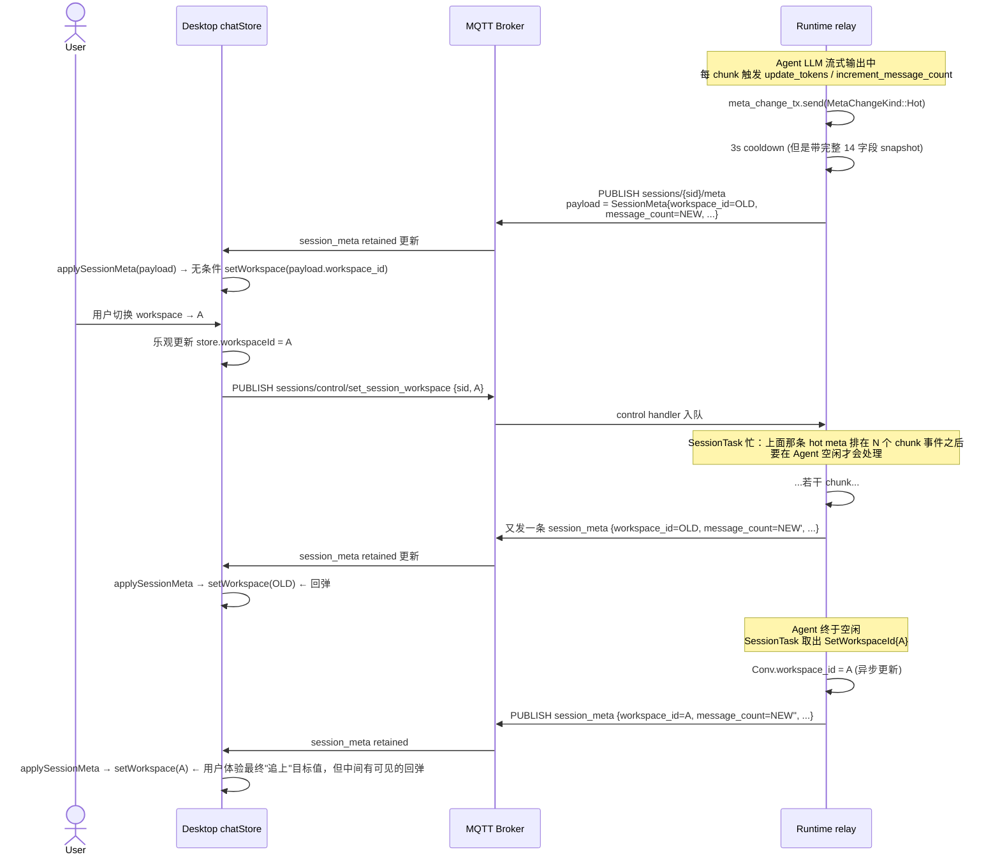

# ADR-043: Session 状态按 Config / State 双主题拆分

**状态**：草案
**日期**：2026-07-22
**决策者**：大鱼

**前置**：
- [ADR-033](./ADR-033-mqtt-replace-grpc-websocket.md)（MQTT 替换 gRPC + WebSocket）
- [ADR-034](./ADR-034-mqtt-http-boundary.md)（MQTT / HTTP 边界划分）
- [ADR-035](./ADR-035-mqtt-streaming-push-refactor.md)（MQTT streaming push 重构）
- [ADR-036](./ADR-036-mqtt-status-push.md)（MQTT status push）
- [ADR-038](./ADR-038-session-lifecycle-explicit-model.md)（session lifecycle 显式建模）
- [ADR-024](./ADR-024-merge-metadata-into-index.md)（merge metadata into index；§`session_meta_runtime_split` 提出的拆分预案）
- [ADR-027](./ADR-027-conversation-meta-token-usage.md)（conversation meta token usage）

---

## 1. 决策摘要

当前 session 维度的状态推送在协议层存在**概念错配**：把 backend 存储组织用的 `SessionMeta` 对象当成了前端业务模型，把低频用户配置字段（`workspace_id / provider / model / reasoning_effort / temperature / title`）和高频运行时遥测字段（`status / message_count / tokens / context_usage`）塞进同一份 Protobuf payload、同一道 retained 主题 `sessions/{sid}/meta`。结果是在 Agent 推理过程中切换 workspace_id 时，旧值的 runtime 更新反而把用户刚设置的新 config 字段"搭车"推回前端，前端 chatStore 整体覆盖，造成**回弹现象**。

本 ADR 把 session 维度的状态按**前端业务语义**重新切分为两条独立主题：

```
acowork/agents/{id}/sessions/{sid}/config   ← SessionConfig （用户驱动设置）
acowork/agents/{id}/sessions/{sid}/state    ← SessionState  （运行时遥测 + 活动状态）
```

**四条核心原则**：

1. **协议按前端业务语义建模，不按后端存储组织建模**。MQTT 主题是产品 API，而不是磁盘 schema 的镜像。`SessionMeta` 是 `conversations/meta/{sid}.json` 的内存投影，存在于 backend 内部，不属于协议 contract。
2. **`SessionConfig` 只承载用户驱动的配置字段**（`workspace_id / provider_id / model_id / reasoning_effort / temperature / title`），低频、retained、按写即发。
3. **`SessionState` 只承载运行时遥测与活动状态字段**（`status / message_count / input_tokens / output_tokens / total_input_tokens / total_output_tokens / context_usage / updated_at`），高频、retained，按字段变化即 PUBLISH 完整 snapshot（relay 端做 throttle）。
4. **取消 `SessionStateChangedPayload` 瞬时事件**。`status` / `context_usage` 也走 `SessionState` retained 主题，不再单独 QoS 0 增量事件——单 retained topic 已经天然具有"快照+增量"两种语义，事件模型冗余。

修好之后 `workspace_id` 切换 workspace 后被旧 meta 打回的现象**结构性消失**：`SessionState` 的 payload 不携带 `workspace_id`，运行时高频写不会带动 config 字段。

---

## 2. 根因分析

### 2.1 现象复现

用户场景：在 Agent 流式输出期间于 Desktop UI 切换当前 session 的 `workspace_id`。前端乐观更新本地 store 显示新 workspace，但 Agent Runtime 在毫秒级之内推一条 `session_meta` 回来——该 payload 内的 `workspace_id` 字段仍是旧值——前端 `chatStore.applySessionMeta` 整体覆盖本地状态，workspace 显示被弹回旧值。

附带的 `conversations/meta/20260722_094335_526753.json` 是这一时间段 backend 持久化的样本（lines 1-20）：

```json
{
  "version": 3,
  "session_id": "20260722_094335_526753",
  "agent_id": "com.acowork.senior-engineer",
  "created_at": "2026-07-22T01:43:35.367Z",
  "title": "附件是runtime日志，在agent推理过程中，切换工作区",
  "workspace_id": "__agent_home__",       // ← config 字段，被旧值打回
  "model": "MiniMax-M3",
  "provider": "minimax-cn-coding-plan",
  "reasoning_effort": "auto",
  "message_count": 163,                   // ← runtime 字段，每轮都更新
  "last_active_at": "2026-07-22T02:26:40.974Z",
  "tokens": { "last_input": 12683, "last_output": 1245, "total_input": 6712579, "total_output": 49820 },
  "corrupted": false
}
```

注意：同一份 JSON 内同时承载了 `workspace_id`（config）和 `message_count/tokens`（runtime），更新语义完全不同，却被当成一个对象处理。

### 2.2 现状盘点（事实，含路径）

| 层 | `sessions/{sid}/config` | `sessions/{sid}/meta` | `messages/state_changed`（瞬时事件） |
|---|---|---|---|
| Proto 定义 | ⚠️ stub `SessionConfig { config_json }`，从未发过 | ⚠️ `SessionMeta` 14 字段，把两类字段混在一起 | ⚠️ `SessionStateChangedPayload`，状态字段与 meta 主题重叠 |
| 协议文档 | ✅ `mqtt.md:259-263, 294, 951-952` 列出主题名 | ✅ `mqtt.md:260, 294, 717-748, 846` 列出主题与语义 | ✅ `mqtt.md:264-279` 列出 |
| Broker ACL | ✅ `acowork-gateway/src/mqtt/acl.rs` Runtime + Desktop 都允许 Sub/Pub | ✅ 同上 | ✅ 同上 |
| Runtime Publisher | ❌ 无 `publish_session_config` 实现 | ✅ `acowork-runtime/src/mqtt/client.rs:785` `MqttChunkPublisher::publish_session_meta` | ✅ 增量事件路径 |
| Bootstrap 时发 retained | ❌ | ✅ `acowork-runtime/src/startup/subsystems.rs:355-369` | ❌（瞬时事件必然不是 retained） |
| Frontend 订阅与覆盖 | ❓（可能订阅但从未收到事件） | ✅ `apps/acowork-desktop/src/stores/chatStore.ts:2960-2962` 的 `session_meta` case 整体 setState，包括 `workspace_id` | ✅ |

### 2.3 链路追踪



### 2.4 概念错配：协议沿用后端存储名 `meta`

`SessionMeta` 这个名字是 backend 自己定的——它是 `conversations/meta/{sid}.json` 文件的内存映射，给磁盘读写和 relay 内部用的 DTO。`meta` 这个词在 backend 内部指"远端看不出来源的辅助字段集合"，放到 MQTT 主题就是暴露给前端的公开 contract，但**前端根本不想要这个 contract**：

- 前端要的是"用户当前对 session 改了什么设置" → 是 `config` 语义
- 前端要的是"这个 session 当前有多忙、用掉了多少 token、上下文有多满" → 是 `state` / `status` 语义

用 `meta` 这个名字相当于把后端文件夹结构摆到产品协议里，frontend 不得不反序列化一份后端数据结构还得自己拆字段用。这种建模错配的直接代价就是"两个语义被绑成同一个对象、同一个 payload、同一个主题"，用 cold/hot 区分也只能缓解信号，不能治愈协议层的耦合。

### 2.5 概念错配：`SessionMeta` proto 内字段分类也不对

`core/acowork-core/proto/mqtt_payload.proto:336-353` 的 14 字段：

```
config 类（用户驱动，低频）       runtime 类（活动态/遥测，高频）
─────────────────────────       ───────────────────────────
title                = 3        message_count       = 5
provider_id          = 6        input_tokens        = 10
model_id             = 7        output_tokens       = 11
reasoning_effort     = 15       total_input_tokens  = 12
temperature          = 16       total_output_tokens = 13
workspace_id         = 17       updated_at          = 14
agent_id / session_id / version = 1,2,4
```

字段编号已经告诉我们 `SessionMeta` 在被加入新字段时没有重新审查语义分类——`title` (3) 是早期 meta 字段（属于"人类可读标识"），`provider_id` (6) 之后意识到这是 config 类字段也直接加进去，**proto 层就把这个错配固化下来了**。

### 2.6 先前尝试与失败

试图在 `ConversationSession` 内做 `MetaChangeKind::Cold / Hot` 区分（`core/acowork-runtime/src/conversation.rs`）—— hot 走 3s cooldown，cold 立即发——这是**信息速率**层面的缓解措施，无法治疗**信息内容**层面的耦合：

- 一次 cold PUBLISH 仍带 14 字段完整 snapshot，runtime 字段为 0 或上一帧值
- 一次 hot PUBLISH 仍带 14 字段完整 snapshot，config 字段为上一帧值
- 两者 race 时，cold 写新 config 后被某次 hot 写覆盖，仍然回弹

要在信息内容层治愈，必须在协议层拆对象。

---

## 3. 决策

### 3.1 Proto 改造（`core/acowork-core/proto/mqtt_payload.proto`）

#### 3.1.1 字段 32 / 33 重新分配

```proto
/// 用户驱动的 session 设置。Retained=true；payload 永远是最新完整 snapshot。
/// 字段语义：只有在前端用户主动改设置时才变化。
message SessionConfig {
  string agent_id         = 1;
  string session_id       = 2;
  string title            = 3;
  string provider_id      = 4;  // "" = no override
  string model_id         = 5;  // "" = no override
  string reasoning_effort = 6;  // "" = no override
  float  temperature      = 7;  // 0  = no override
  string workspace_id     = 8;
}

/// Session 运行时状态。Retained=true；payload 永远是最新完整 snapshot。
/// 字段语义：既不是用户驱动的设置，又是 session 运行时必须可观测的状态。
/// 字段变化时 PUBLISH 完整 snapshot（retained 覆盖）；relay 端做 throttle，
/// protocol 层不做 rate-limit。
message SessionState {
  string agent_id            = 1;
  string session_id          = 2;
  // 活动状态
  string status              = 3;   // "idle" | "running" | "error" | ...
  // 遥测
  uint64 message_count       = 4;
  uint64 input_tokens        = 5;
  uint64 output_tokens       = 6;
  uint64 total_input_tokens  = 7;
  uint64 total_output_tokens = 8;
  // 上下文用量（原来 SessionStateChangedPayload.payload.status_json）
  string context_usage_json  = 9;
  double ratio               = 10;
  // 时间戳（ISO 8601）
  string updated_at          = 11;
}

// SessionStateChangedPayload —— 删除。SessionState retained 已天然支持 status 字段，
// 无须瞬时事件重复表达状态变化。

message DataEnvelope {
  uint32 version = 2;            // bump: v1 → v2（消息集发生变化）
  oneof payload {
    ...
    SessionCreated   session_created   = 30;
    SessionDeleted   session_deleted   = 31;
    SessionConfig    session_config    = 32;  // 旧: SessionMeta（改名 + 削字段）
    SessionState     session_state     = 33;  // 旧: stub SessionConfig（让位）
    SessionMessage   session_message   = 34;
    SessionOpened    session_opened    = 35;
    SessionNotOpened session_not_opened = 36;
    ...
  }
}
```

`SessionMessage.event` 内的 `SessionStateChangedPayload session_state_changed = 25` 同步删除。

Envelope `version` 字段从当前值 bump 至 v2。`apps/desktop` 通过 envelope.version 校验做兼容性判断。

#### 3.1.2 字段语义规范的注释

把"config 字段"与"runtime 字段"的分类注释写进 proto 文件头上，作为后续扩展时的强制约束：

```proto
// SessionConfig vs SessionState 边界：
//   SessionConfig = 用户驱动（workspace_id / provider / model / reasoning / temperature / title）。
//   SessionState  = 运行时遥测 + 活动状态（status / message_count / tokens / context_usage）。
//   新增字段时若不属于这两类，请单独设计新 message，不得混进二者。
```

### 3.2 主题划分

| 主题 | payload | QoS | Retained | 触发时机 |
|---|---|---|---|---|
| `acowork/agents/{id}/sessions/{sid}/config` | `SessionConfig` | 1 | ✅ | config 字段任一变化 |
| `acowork/agents/{id}/sessions/{sid}/state`  | `SessionState`  | 1 | ✅ | state 字段任一变化 |

**删去的主题**：
- `acowork/agents/{id}/sessions/{sid}/meta` —— 旧混合主题，作废。

**删去的瞬时事件**：
- `SessionStateChangedPayload` —— `SessionState` retained 已经覆盖其语义。

### 3.3 文件改动清单

| 文件 | 改动 |
|---|---|
| `core/acowork-core/proto/mqtt_payload.proto` | 新增 `SessionConfig`（重写旧 stub）/ 新增 `SessionState` / 删 `SessionMeta` / 删 `SessionStateChangedPayload` / envelope bump v2 / 注释规范 |
| `core/acowork-core/src/mqtt_proto.rs` | `cargo build` 生成代码，前端 desktop 不需要此文件引用 |
| `core/acowork-core/src/types.rs` | 同步移除 `SessionStateChangedPayload` 等 Re-export |
| `core/acowork-runtime/src/conversation.rs` | `MetaChangeKind` 拆 `ConfigChangeKind` + `StateChangeKind`；mutator 按字段分类；Conv 移除"workspace_id 跟 SessionHandle 同步"的竞态讨论（被协议层吸收） |
| `core/acowork-runtime/src/mqtt/client.rs` | `MqttChunkPublisher::publish_session_meta` 重命名 `publish_session_config`；新增 `publish_session_state`；删 `publish_session_state_changed` 增量事件分支 |
| `core/acowork-runtime/src/startup/subsystems.rs` | `spawn_meta_change_relay` 拆 `spawn_config_change_relay` + `spawn_state_change_relay`；bootstrap 两个主题都发 retained |
| `core/acowork-runtime/src/agent/session/session_manager.rs` | `create_session_with_id_and_conversation` 与 OpenSession 路径：两个主题都发 retained |
| `core/acowork-runtime/src/agent/session/restorer.rs` | 启动恢复时两个主题都发 retained |
| `core/acowork-runtime/src/agent/session_core.rs` | 相关订阅/订阅自动重订阅逻辑同步 |
| `core/acowork-runtime/src/agent/loop_.rs` | 订阅启动时按新主题名 |
| `core/acowork-runtime/src/startup/agent_init.rs` | 订阅注册按新主题名 |
| `core/acowork-runtime/src/startup/gateway_loop.rs` | 同上 |
| `core/acowork-runtime/src/startup/context.rs` | 同上 |
| `core/acowork-runtime/src/agent/session/cold_value.rs`（如存在） | 重写 SessionState snapshot 构造 |
| `core/acowork-runtime/tests/conversation_session_tokens.rs` | payload schema 引用更新 |
| `core/acowork-runtime/tests/mqtt_e2e_full.rs` | 主题名 / payload 更新 |
| `core/acowork-gateway/src/mqtt/acl.rs` | 删 `…/sessions/+/meta` ACL 条目；增 `…/sessions/+/state` ACL 条目（Runtime + Desktop Sub/Pub） |
| `core/acowork-gateway/src/mqtt/mod.rs` | 同步 ACL 常量 |
| `core/acowork-gateway/src/http/chat.rs` | HTTP `GET /api/agents/{id}/sessions/{sid}/state` 同步返回 SessionConfig + SessionState 两份 JSON |
| `core/acowork-gateway/src/http/config_api.rs` | 同步 |
| ~~`core/acowork-gateway/src/http/global.rs`~~ | ~~同步~~（文件已于 gRPC 清理提交中删除，全局资源 CRUD 已迁移到 MQTT retained） |
| `core/acowork-gateway/src/mqtt/agent_registry.rs` | 同步 |
| `core/acowork-gateway/src/mqtt/dispatch.rs` | 同步 |
| `core/acowork-gateway/src/mqtt/global_resources_publisher.rs` | 同步 |
| `core/acowork-gateway/src/gateway/mod.rs` | 同步 |
| `apps/acowork-desktop/src/stores/chatStore.ts` | 拆 `configSlice` + `stateSlice`；订阅改两个主题；删 `session_meta` case；删 `messages/state_changed` case |
| `apps/acowork-desktop/src/services/mqtt/` | 订阅注册按新主题名 |
| `apps/acowork-desktop/src/hooks/useSessionStream.ts`（如存在） | 同步 |
| `apps/acowork-desktop/src/stores/workspaceStore.ts` | 移除"被回弹防御"代码——协议层已治 |
| `docs/zh/protocols/mqtt.md` | 同步主题树/语义/ACL/启动序列/订阅指南 |
| `docs/adr/en/ADR-043-session-config-state-split.md` | 英文版（与 ADR-009 平行，方便跨团队阅读） |
| `core/acowork-runtime/CHANGELOG.md` / `core/acowork-gateway/CHANGELOG.md` | 记录 envelope version bump v2 |

### 3.4 persistence 与协议解耦

`conversations/meta/{sid}.json` 保留为单文件 schema（path + schema 均不变），理由：

- `version: 3` schema 已支持本 ADR 要求的所有字段
- 文件 layout 跟 frontend / MQTT 都无关，是 backend storage 内部组织
- 拆文件会引入 v3 → v4 迁移路径，跟本次协议重构绑死、加大风险面

backend 内部把 `SessionConfig` / `SessionState` 当成"`SessionMeta` 的视图"互转即可，磁盘 schema 不动。

### 3.5 三步不复存在的"防御逻辑"

1. **`chatStore.applySessionMeta` 内的 `workspace_id` 覆盖分支**（`chatStore.ts:2960-2962`）：删。
2. **`ConversationSession::update_workspace_id` / `SessionHandle::workspace_id` 的双重存储竞态讨论**：注释收敛为"config 字段统一由 relay 重发新 snapshot"。
3. **`MetaChangeKind::Cold / Hot` 分类 + 3s cooldown 复杂度**：保留 throttle（继续对 high-frequency 的 state_change_tx 生效），但不再需要 cold/hot 二分（`config_change_tx` 与 `state_change_tx` 已经在信息内容层分开）。

---

## 4. 评估的备选方案

### 方案 A：保留 `SessionMeta` 协议，沿用现有 meta 主题，在前端 chatStore 加版本号/时间戳防御

- 前端 chatStore 记录"用户上次修改 workspace 的时间戳"，收到 `session_meta` 时若 payload 内 `workspace_id` 对应时间戳 < 用户本地记录，丢弃该字段
- 改动范围小
- **拒绝**：治标不治本。protocol 层的语义错配仍在，未来出现新 config 字段（如 `system_prompt_override`）还要再做一次防御。让前端去识别"哪些字段允许被打回"本身就是把后端存储协议泄漏到 frontend。

### 方案 B：保留 `SessionMeta` 协议，缩字段为 `runtime-only`，新增独立 `SessionConfig` 协议发布

- `SessionMeta` 只保留 `message_count/tokens/updated_at`，新增 `SessionConfig` 协议
- 主题 `…/sessions/{sid}/meta` 保留（仅 runtime），新增 `…/sessions/{sid}/config`
- 改动范围小
- **拒绝**：仅部分治本。`meta` 这个错配名仍在 frontend 协议暴露，新人 onboarding 仍然会困惑"为什么 Runtime 把 meta 当 runtime 用"。让 `meta` 这个 backend 内部命名继续当 contract，是这次重构的最佳时机要根除的耦合。

### 方案 C（采纳）：协议按 frontend 业务语义重命名 + 双主题

- `SessionConfig` 接管旧 stub 的命名与字段
- 新增 `SessionState`（不用旧名 `SessionRuntime` / `SessionStatus` / `SessionTelemetry`，因为 status 只是 state 的子字段之一）
- 旧 `SessionMeta` 删除
- 旧 `messages/state_changed` 瞬时事件删除
- 文档、acl、runtime、frontend 同步

### 方案 D：协议按 `session/{id}/current` + `events/` 模型重建

- 每条 session 一个 shared retained `current` snapshot（= 当前最新有效状态合并视图）
- 变化事件走 `events/{kind}` 系列
- 过于彻底，跨 ADR-033-036 既成事实之外另起炉灶；改动面与重构面远大于本 bug 修复应该承担的范围；不采纳。

---

## 5. 验证

### 5.1 单元 / 集成测试

- `core/acowork-runtime/tests/mqtt_e2e_full.rs`：订阅 `…/sessions/{sid}/config` 与 `…/sessions/{sid}/state` 两个主题，分别截获 publisher，验证：
  - `update_workspace_id` 触发的 PUBLISH payload 是 `SessionConfig`，`state` 字段为默认值
  - `increment_message_count` 触发的 PUBLISH payload 是 `SessionState`，无 `workspace_id` 字段
- 新增 `tests/session_config_state_race.rs`：模拟"Agent 推理中切换 workspace"：
  - spawn 1000 个 chunk 任务 → 调 `update_workspace_id` → 调 `increment_message_count`
  - 收集全部 PUBLISH history，验证：任何 `SessionState` payload 内**绝不**携带 `workspace_id`
- `core/acowork-runtime/tests/conversation_session_tokens.rs`：更新为 `SessionState` 断言
- desktop 端 vitest：chatStore 拆 slice 后，两个 slice 互不耦合测试

### 5.2 验收用例（手动 / e2e）

1. **回弹现象消失**：在 Desktop UI 上"新建一条 session → 等 agent 进入推理 → 在 UI 上切换 workspace"，观察：
   - workspaceStore 立刻显示新 workspace（A），**没有被打回旧值的过程**
   - agent 推理结束后最终值仍是 A
2. **断线恢复正确**：Desktop 断网后再连网，收到 retained snapshot，`configSlice` 与 `stateSlice` 都显示最后状态
3. **OpenSession 拉快照**：OpenSession 通过 MQTT 首次拉取时收到的是 `SessionConfig` + `SessionState` 两条完整 snapshot

### 5.3 envelope version 兼容策略

- Envelope `version = 2`（旧为 1）
- Desktop 启动时若读到的 envelope `version < 2` 拒绝订阅并提示用户升级 Runtime
- Runtime 启动时若观察到 client hint `protocol_version < 2` 降级到旧主题并在 warning 日志中标记

---

## 6. 范围外

- **`conversations/meta/{sid}.json` 文件 layout**：保持 v3 单文件 layout 与原 schema。本次只拆 MQTT 边界，不动 disk persistence。
- **HTTP `GET /api/agents/{id}/sessions/{sid}/state`**：本次只更新返回值结构（拆 config + state 两段），不动 endpoint path。
- **其它 session lifecycle 事件**（`session_created`、`session_deleted`、`session_opened`、`session_not_opened`）：不动。
- **`messages/state_changed` 之外的流式消息事件**（`chunk / tool_call / done / error / stopped / ask_question / todo_updated / reasoning_started / reasoning_ended / compacting_started / compacting_ended / context_usage / memory_updated / skill_executed`）：不动。
- **`session_list_update` / `session_renamed` 等 Frontend-only state**：桌面端独立维护，与本次协议重构无关。
- **跨 multi-tenant / 多用户**：遵循 ADR-042 + mqtt.md §3.4 已预留路径，不动。

---

## 7. 后续追踪项

| ID | 项目 | 优先级 |
|----|------|--------|
| TODO-1 | 新增 `apps/acowork-desktop/src/services/mqtt/types.ts` 同步生成 protobuf-ts 类型 | P1 |
| TODO-2 | `apps/acowork-desktop/src/stores/chatStore.ts` 拆 `configSlice + stateSlice` | P1 |
| TODO-3 | `apps/acowork-desktop/src/services/mqtt/` 订阅迁移 | P1 |
| TODO-4 | `docs/zh/protocols/mqtt.md` §3.2 §3.5 §5 §7.4 §10.2 同步 | P1 |
| TODO-5 | `core/acowork-gateway/src/mqtt/acl.rs` ACL sync | P1 |
| TODO-6 | `core/acowork-runtime/tests/session_config_state_race.rs` 新增 | P1 |
| TODO-7 | 删除 `chunk_event = SessionStateChangedPayload` 相关分支（chatStore、session_core、loop_ 等） | P2 |
| TODO-8 | 删除旧的 `meta` 主题调试 helper（`startup/context.rs`、`http/server.rs` 中如残留） | P2 |
| TODO-9 | `protocol_version` 在 version-mismatch 时的 hint 字段加进 `SubscribeReq`（如缺失） | P3 |
| TODO-10 | 后续考虑 `acowork-context-usage` 字段由 `SessionState.context_usage_json` 替换为 typed message `ContextUsage` | P3 |

---

## 8. 变更日志

- **v1 (2026-07-22, 草案)**：初稿。基于大鱼在 2026-07-22 的 session meta 回弹 bug 修复讨论，明确 config / state 双主题拆分。
