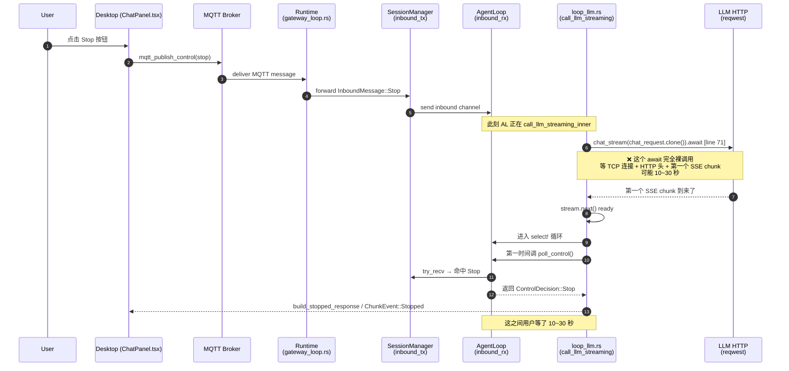
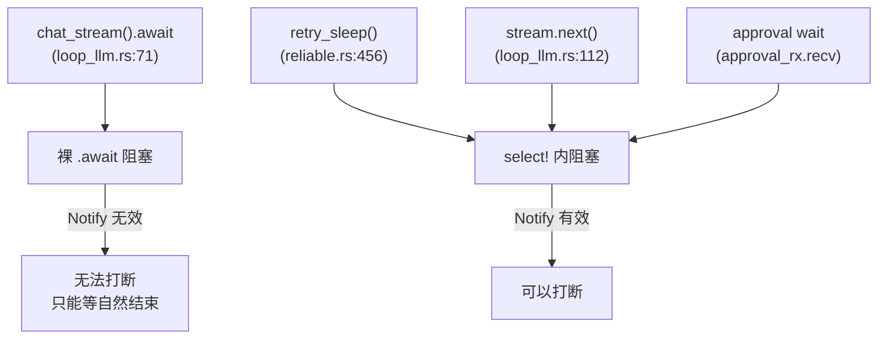

# ADR-044：Stop 信号链路分析与 Cancellation Token 统一化

**状态**：草案
**日期**：2026-07-29
**决策者**：大鱼

**前置**：
- ADR-014（AgentLoop 主循环模块拆分 — 从 God Object 到职责模块）
- ADR-020（端到端数据流分级 — 解决 LLM Streaming 阻塞文件 I/O 及其他控制通道）
- ADR-033（MQTT 替换 gRPC + WebSocket — Gateway 协议栈统一）
- ADR-034（MQTT / HTTP 职责边界 — 控制面与数据面分层）

**触发动因**：
用户在 Desktop 输入框推理过程中点击 Stop 按钮，UI 上"停止"图标迟迟无响应，要等到 LLM 请求自然结束（TTFT 可能 10~30 秒）才能停下。Root cause 调查 + 实现发现需要分两阶段：先了解现状与差距，再讨论 Cancellation Token 统一化方案。

---

## 1. 问题描述

### 1.1 用户可见症状

- 触发条件：用户在 Desktop 输入框发送消息、Agent 进入推理流式输出
- 操作：用户点击输入框旁的 Stop 按钮
- 期望：Agent 推理立即中止（≤500ms），UI 进入空闲可输入状态
- 实际：按钮的"停止"图标持续显示 10~30 秒，期间看似无响应，要等到 LLM 自然完成首个 chunk 才能停下来

### 1.2 产业链路（事实，含文件路径）

当前 Stop 信号从用户点击到达 Runtime 的完整链路（按调用顺序）：

```
[1] Desktop ChatPanel.tsx:947  sendStop(agentId)
        ↓ invoke("mqtt_publish_control", { command: "stop", payload: {session_id, reason: "user_requested"} })
[2] Tauri 后端 mqtt_publish_control → Gateway MQTT broker
        ↓ publish on acowork/agents/{id}/control/{sid}
[3] Runtime mqtt client → gateway_loop.rs:60  mqtt_dispatch_tx.send(...)
        ↓ parse_control_payload → ControlAction::StopGeneration { session_id, reason }
[4] startup/gateway_loop.rs:186-192  control_action_to_inbound → InboundMessage::Stop { reason }
        ↓ forward_to_session_inbound → session_manager.inbound_tx.send(...)
[5] session_task inbox → AgentLoop self.inbound_rx
        ↓
[6a] poll_control() (每次 checkpoint 调用，非阻塞 try_recv)
        ↓ 命中 InboundMessage::Stop → 返回 ControlDecision::Stop
[6b] urgent_stop: Arc<Notify> (notify_one() 立即唤醒 select 分支)
        注意：当前代码只在 debug 路径调用 fire_urgent_stop()，
              生产 MQTT 路径完全没触发这个 Notify（详见 §2.2）
```

最终 `ControlDecision::Stop` 在以下几个 checkpoint 之一生效：
- `loop_.rs:1047` / `1056`：`run()` 主循环选完一轮迭代结果后
- `loop_.rs:1280`：LLM 调用前（流式返回 **之后**）
- `loop_.rs:1338`：工具执行前
- `loop_llm.rs:111-432`：流处理 `tokio::select!` 中：
  - `loop_llm.rs:112` `stream.next()` 分支命中后立刻查 `poll_control()`
  - `loop_llm.rs:375` urgent_stop Notify 分支
  - `loop_llm.rs:400` 500ms sleep 兜底分支
- `loop_tools.rs:218 / 271`：工具执行 `tokio::select!` 中两处 Notify 分支（DevMode / Production 两个不同分支）
- `loop_tools.rs:235 / 284`：工具执行 500ms sleep 兜底
- `loop_approval.rs:199 / 259`：approval wait 中 Notify 分支

### 1.3 失败定位（事实）

经过对 `loop_llm.rs` 的逐行检查，问题集中在 **Step [6]** 与 [7] 之间的衔接缺失。下面是当前 LLM 调用栈的精确时序图：



**关键问题集中在 `loop_llm.rs:71`**：

```rust
let stream = self.core.provider.chat_stream(chat_request.clone()).await?;
```

这一行是**裸 await**，**没有 select! 包裹**。它在做两件事：
1. **建立 HTTP 连接**（TLS 握手 + reqwest send）
2. **等待响应头**
3. **等待第一个 SSE chunk**（即 TTFT — Time To First Token）

任何一个都可能阻塞 10~30 秒。在这段时间里：
- `inbound_rx` 里的 `Stop` 消息**已经存在**（链路 Step [5] 完成）
- 但 AgentLoop 在 `await` 上挂起，**没有 select! 兜底分支**去 `try_recv()`

所以"停止"信号要等：
- LLM 终于返回第一块数据 → stream.next() ready → 进入 `select!` 循环
- 这时才轮到 `poll_control()` 查到 `Stop`
- 才能让控制流走到 abort 分支

500ms sleep 兜底、urgent_stop Notify 等当前 select! 内的机制都救不了——因为根本**还没进 select!**。

### 1.4 影响范围

不仅是 LLM 调用。任何在 `await` 上挂起、没被 `tokio::select!` 包装的阻塞点都有相同问题：
- `provider.chat_stream().await`（network I/O）
- `reliable.rs:456` `retry_sleep().await`（重试等待，**短**等待走裸 sleep；**长**等待走 select! 但带自己的 skip_notify，与本次设计无关，是另一个 notify 路径）
- 任何 `tokio::time::sleep()` 单独调用
- 任何 IO `await`（文件读写、shell call）

但用户的具体工单只关心 LLM 路径。其他 checkpoint 影响相对小或可观测性差，先聚焦 LLM。

---

## 2. 现状盘点：当前"取消"机制的事实

### 2.1 三套并行机制共存（结构性问题）

当前 Runtime 同时维护了**三套并行的取消机制**，每套都试图表达"用户想让 Agent 停下来"这件事：

| 机制 | 载体 | 触发点 | 当前覆盖率 | 状态 |
|------|------|---------|-----------|------|
| **A. InboundMessage mpsc channel** | `self.inbound_rx: mpsc::Receiver<InboundMessage>` | MQTT Subscribe → `forward_to_session_inbound` → 入 channel | 全会话阶段（只在 `poll_control()` 被 try_recv 时检查，且仅在 checkpoint） | 生效 |
| **B. urgent_stop Notify** | `session_core.urgent_stop: Arc<Notify>` | 路径不全：debug server `fire_urgent_stop()` 调用；MQTT 路径**没有**调用 | 仅出现在 `loop_llm.rs:375`、`loop_tools.rs:218/271` 三个 select! 分支中 | 半生效（debug 用，生产路径不通） |
| **C. pending_interrupt Option<ControlDecision>** | AgentLoop 字段 | sub-modules 在各自 `select!` 命中 Notify 后写入 | 兜底——若 Notify 唤醒了子模块，但子模块已经把原始信号消化了，下一个 checkpoint 通过 `pending_interrupt` 找回 | 兜底生效 |
| **D. DebugController::state** | debug 控制器的 Mutex<DebugState> | debug server WebSocket | `poll_control()` 的 try_lock 路径 | 仅 debug |

四套机制都是为了同一件事——"现在该停了"。每增加一个 checkpoint 都要决定走哪一套，没有统一抽象。AgentLoop 自己有 `pending_interrupt` 字段（`loop_.rs:346`），debug 路径有 `control_notify: Arc<Notify>`（`debug/controller.rs:199`），SessionCore 有 `urgent_stop: Arc<Notify>`（`session_core.rs:80`）——三个 Notify 字段，三个用途，三个覆盖范围。

### 2.2 关键缺陷：MQTT 路径不触发 urgent_stop

`urgent_stop` 的设计意图是把"立即停止"信号最快地送到任何正在 `select!` 等的协程。但代码实际状态是：

- **只在 DebugController 中调用** `control_notify.notify_one()`（`debug/controller.rs:297`），只覆盖 DebugMode
- **MQTT StopGeneration 路径**（`gateway_loop.rs:186-192` `control_action_to_inbound`）只把 `InboundMessage::Stop` 通过 `forward_to_session_inbound` 写到 session inbox，**没有** `urgent_stop.notify_one()`

其结果是：
- 调试场景（DevMode）下 stop 响应 < 500ms（因为 control_notify 唤醒了 select! 分支）
- 生产场景（MQTT）下 stop 必须等 AgentLoop 自己 select! 循环醒来、`poll_control()` 通过 try_recv 检查到 Stop 消息——而这又依赖下一个流事件或者 500ms 兜底 tick

具体例子：
- LLM 在等第一个 chunk（裸 await）：stop 信号到达也救不了，至少要等 TTFT
- LLM 在流式接收（select! 循环活跃）：stop 信号到达后 ≤ stream.next() 的 latency 才被吸收——通常较快
- LLM 在 SSE 长 idle（stream 没数据 + select! 在 sleep 分支）：最坏要等 500ms sleep tick 触发 `poll_control()`

### 2.3 阻塞 I/O 不在 select! 里（无法通过 notify 救）

Notify 机制只能唤醒**已经在 select! 等**的 Future。对于裸 `.await` 没有 select! 包裹的阻塞（§1.3），Notify 完全无用——因为 receiver 协程根本没在 await notified()。



`chat_stream().await` 在 line 71 是裸的。

---

## 3. 设计目标

1. **首要是修 bug**：让用户在 LLM 推理 TTFT 阶段点 stop 也能立即响应（≤500ms）
2. **统一抽象**：把 A/B/C/D 四套机制收敛到一套 token 抽象上
3. **blocking-aware**：token 能与裸 `.await` 协作（至少对网络 I/O，把 HTTP 连接 abort 掉）
4. **可观察性**：每个 stop 信号都带 reason + source + 路径（"来自 MQTT"/"来自 Debug"），方便定位
5. **零回归**：保留所有现有语义（debugger.pause / debug stop / chat stop / Ctrl-C），不破坏现有合约

---

## 4. 方案：CancellationToken 统一抽象

### 4.1 概念

引入 `agent::cancellation::CancelHandle`，作为**当前请求级**取消信号的**单一真相源**。它是一个 `Arc<Inner>` 共享句柄（命名上用 `Handle` 而非 `Token` 是因为本项目里 `token` 一词已被 LLM 数据单位 `input_tokens`/`output_tokens`/`total_tokens` 占用，避免阅读时歧义；语义上等价于 `tokio_util::sync::CancellationToken`、.NET `CancellationToken`）。

- **发出方**：session_task 创建时构造一个**槽位** `Arc<parking_lot::Mutex<CancelHandle>>`，连同 Arc 句柄注册到 SessionManager（按 session_id 索引），便于外部（MQTT dispatcher / Debug server / test harness / CLI）通过 session_id 查找并 trigger。每次 `AgentLoop::run_inner` 入口调用 `begin_new_request()` 把槽里换成全新 Active 句柄——保证一次 request = 一代 handle
- **接收方**：每个可能阻塞的 future 调用 `session_core.cancel_handle().cancelled()`（future impl）或者 `select! { ... _ = handle.cancelled() => ... }`，**读取时**通过 `Arc::lock()` 拿到当前代的句柄

> **§4.5 重要修正**：早期版本（Phase 1-3）用 `CancelHandle`（原 `CancellationToken`）作为**会话级**句柄，一次 cancel 永久污染后续 request。`run_inner` 入口改为装入新句柄后，句柄升级为**请求级**信号源——与生产语义（Stop 只取消当前 request，不杀 session）对齐。详见 §4.5 节。

CancelHandle 内部状态：

```rust
pub struct CancelHandle {
    inner: Arc<CancelInner>,
}

struct CancelInner {
    state: AtomicU8,           // 0=Active, 1=Cancelled
    notify: Notify,            // 唤醒 select! 分支
    reason: Mutex<Option<CancellationReason>>, // 谁、为什么、何时取消
}

// 在 SessionCore 中：
pub(crate) struct SessionCore {
    /// §4.5: 当前 request 的句柄槽位
    current_cancel_handle: Arc<parking_lot::Mutex<CancelHandle>>,
    // ...
}

impl SessionCore {
    pub(crate) fn begin_new_request(&self) -> CancelHandle {
        let new_handle = CancelHandle::new();
        *self.current_cancel_handle.lock() = new_handle.clone();
        new_handle
    }

    pub(crate) fn cancel_handle(&self) -> CancelHandle {
        self.current_cancel_handle.lock().clone()
    }

    pub(crate) fn cancel_handle_arc(&self) -> Arc<parking_lot::Mutex<CancelHandle>> {
        self.current_cancel_handle.clone()
    }
}

pub enum CancellationReason {
    UserStop { source: StopSource, reason: String },
    Pause,                     // debug pause
    DebugStop,
    IterationLimit,
    BudgetExceeded,
    SessionClosed,
    Error(String),
}

pub enum StopSource {
    ChatPanel { agent_id: String, session_id: String },
    DebugServer,
    Cli,
    Test,
}
```

### 4.2 调用方形态

#### 长期阻塞（select! 内）—— 推荐用法

```rust
tokio::select! {
    biased;
    _ = token.cancelled() => {
        // 处理取消：flush 流、转换 status、return build_stopped_response(...)
    }
    event = stream.next() => { /* 正常路径 */ }
    _ = tokio::time::sleep(Duration::from_millis(500)) => { /* idle poll */ }
}
```

`token.cancelled()` 是一个 `Future<Output = ()>`，当且仅当 token state 从 Active 切到 Cancelled 时 resolve。**零开销（取消前 polling by tokio）**。

#### 短阻塞 / 套在裸 await 外

针对 `chat_stream().await` 这类无法直接 select! 包裹的 future（因为它返回的是 `Box<dyn Stream>`，连接 + 响应头阶段是 future 内部），引入 `token.wrap(async move { ... })` helper：

```rust
// loop_llm.rs:71 改造
let provider_stream = self.core.provider.chat_stream(chat_request.clone());
let stream = select_on_cancel(handle.clone(), provider_stream).await?
    .ok_or(RuntimeError::Cancelled)?;

tokio::pin!(stream);
// 然后进 select! 循环
```

#### trigger（外部信号源）

```rust
// MQTT dispatcher in gateway_loop.rs:
fn handle_stop(session_id: &str, reason: String) {
    if let Some(handle) = session_manager.cancel_handle(session_id) {
        handle.cancel(CancellationReason::UserStop {
            source: StopSource::ChatPanel { agent_id, session_id },
            reason,
        });
    }
}

// Debug server:
fn handle_pause(session_id: &str) {
    session_manager.cancel_handle(session_id)?
        .cancel(CancellationReason::Pause);
}
```

### 4.3 收编三套机制

| 旧机制 | 新归宿 |
|--------|--------|
| `urgent_stop: Arc<Notify>` (session_core.rs:80) | **删除** — CancellationToken 替代；session_core 不再持有 Notify |
| `pending_interrupt: Option<ControlDecision>` (loop_.rs:346) | **Phase 4 删除** - token 的 AtomicU8 持久状态天然解决信号吞没竞态，不需要 sub-module 兜底。Phase 2-3 保留，避免迁移期间信号丢失 |
| `ControlDecision::{Continue, Stop, Pause}` | **保留 enum 作为返回值**（Checkpoint API）。Stop 由 token 状态承载，Pause 由 DebugController 承载 |
| `DebugController::control_notify: Arc<Notify>` (debug/controller.rs:199) | **保留不动** - Pause 是 Debug 专属语义（可恢复），与 Stop（用户取消，不可逆）是不同抽象层。token 状态是二值不可逆的（Active->Cancelled），无法表达 Pause->Resume 循环。DebugController 继续独立管理 Pause/Resume |
| `poll_control() -> ControlDecision` | 保留方法签名。内部增加 token 状态检查（与 pending_interrupt / inbound_rx / DebugController 并存） |

### 4.4 `chat_stream` 取消语义（关键修复）

`provider.chat_stream().await` 返回的是 `Box<dyn Stream>`。这个 future 内部包含：
1. `reqwest.send().await`  - 建立 HTTP 连接（TLS 握手 + HTTP 请求发送 + 等待响应头）
2. `response.bytes_stream()` - 拿 SSE 流

关键洞察：**不需要拆分 Provider trait**。`select_on_cancel` 用 `tokio::select!` 竞争 cancel future 和原 future，当 cancel 胜出时，原 future 被 **drop**。对于 `chat_stream().await` 这个 future，drop 意味着内部挂起的 `reqwest.send().await` 一同被 drop，**HTTP 请求中止**。这正是我们想要的行为。

```rust
async fn select_on_cancel<T>(
    handle: CancelHandle,
    fut: impl Future<Output = Result<T, AcoworkError>>,
) -> Result<Option<T>, AcoworkError> {
    tokio::select! {
        biased;
        _ = handle.cancelled() => Ok(None),     // 取消 - fut 被 drop，HTTP 请求中止
        result = fut => result.map(Some),
    }
}
```

loop_llm.rs:71 改造：

```rust
// 不需要改 Provider trait，不需要拆分 chat_stream
let stream = select_on_cancel(
    handle.clone(),
    self.core.provider.chat_stream(chat_request.clone()),
).await?;

let stream = match stream {
    Some(s) => s,
    None => return Ok(build_cancelled_response(...)), // handle cancellation
};

let mut stream = Box::into_pin(stream);
// 然后进现有 select! 循环，加 handle.cancelled() 分支
```

**为什么不拆分 Provider trait**（原先考虑过的方案，已否决）：
- 原方案提出把 `chat_stream` 拆成 `chat_stream_request`（返回 `reqwest::Response`）+ `chat_stream_sse_to_events`，以便"直接 abort reqwest 连接"
- 但 `select_on_cancel` drop future 时已经中止了 HTTP 请求——两种方案的取消行为完全相同
- 拆分 trait 会把 `reqwest::Response` 引入 `acowork-core/src/providers/traits.rs`，**core 层被耦合到具体 HTTP 客户端**，违反分层原则
- 需要修改全部 5 个 Provider 实现（`openai.rs`、`anthropic.rs`、`ollama.rs`、`reliable.rs`、`router.rs`），其中 `reliable.rs` 的重试逻辑建立在 `chat_stream()` 整体调用上，拆分后重试边界需重新设计
- 收益为零：两种方案下"后台 reqwest task 残留"的 trade-off 完全相同

**好处**：
- TCP 连接阶段被 `select_on_cancel` 包裹，stop 信号能在 100ms 内打断
- 即使 reqwest task 还在 doomed 状态，Runtime 已经返回了 - UI 立刻进入 idle
- 后续 SSE 流的 select! 循环已经能正确响应 stop（既存的 500ms 兜底已经在这里；引入 handle.cancelled() 后<1ms 响应）
- **零侵入**：不修改 Provider trait，不影响任何现有 Provider 实现

**已知 trade-off**：被取消后，reqwest task 可能仍在后台跑直到 OS 关闭 socket。这是合理的——用户感知到 stop 生效即可，后台 task 自然超时清理。

**进一步优化**（可选、未来独立任务）：要求 Provider 把 reqwest::Client 包成带 abort handle 的 future，由 Runtime 持有 client handle，能真正 "abort" 在 await 上的 reqwest task。当前不做。

### 4.5 落地步骤（Phased Rollout）

> **本 ADR 只确定设计意图，不在文档内强制执行顺序。落地以 PR review 为准。**

**Phase 1：基础设施（无功能变更）**
1. 新增 `core/acowork-runtime/src/cancellation/` 模块
   - `token.rs` — `CancelHandle`、`CancellationReason`、`StopSource`
   - `reason.rs` — reason 序列化（log + telemetry）
   - `wrapper.rs` — `select_on_cancel`、`cancelled_or` 等 future helpers
   - `integration_tests.rs` — handle + select_on_cancel 行为单测（fast/cancel/race/re-entry）
2. `Cargo.toml` 加 dev-deps `tokio = { features = ["test-util"] }`，lib.rs pub mod cancellation

**Phase 2：把 session_core.urgent_stop 切换到 handle（仅做加法，不删旧机制）**
3. `session_core.rs`: 新增 `CancelHandle` 字段（与 `urgent_stop` 并存，不删除 urgent_stop）
4. `session_manager.rs`: 新增 `HashMap<session_id, CancelHandle>`（与 `urgent_stops` 并存）；新增 `cancel_handle(session_id) -> Option<CancelHandle>` 公共方法
5. `loop_inbound.rs`: `poll_control()` 内部增加对 handle 状态的检查（与 `pending_interrupt` / `inbound_rx` / `DebugController` 并存，优先级最低）
6. 编译通过 + 现有测试通过 = Phase 2 终点

> **注意**：Phase 2 不删除 `pending_interrupt`。`pending_interrupt` 的设计目的是解决 sub-module `select!` 消费 Notify 事件后的信号传递竞态。CancelHandle 的 AtomicU8 持久状态确实能解决此竞态，但前提是 handle 已在所有路径生效（Phase 3 才完成）。在 Phase 2 阶段删除 `pending_interrupt` 会导致 Stop 信号在 sub-module 消费后丢失。删除推迟到 Phase 4。

**Phase 3：消除功能 gap（修 bug）**
8. `startup/gateway_loop.rs` MQTT StopGeneration 路径：在 `forward_to_session_inbound` 之前调用 `session_manager.cancel_handle(sid)?.cancel(UserStop{...})`
9. `loop_llm.rs:71` 的 `chat_stream().await` 用 `select_on_cancel` 包裹（不拆分 Provider trait，见 §4.4）
10. `loop_tools.rs` / `loop_approval.rs` 的 Notify 分支改为 `handle.cancelled()`
11. E2E：用户在 TTFT 阶段点 stop，端到端 ≤ 1 秒进入 idle

**Phase 4：清理死代码（做减法）**
12. `loop_.rs:346` 删除 `pending_interrupt`（此时 handle 已在所有路径生效，AtomicU8 持久状态覆盖了原 `pending_interrupt` 的信号传递职责）
13. 删除 `session_core.urgent_stop`、`session_manager.urgent_stops`（handle 已完全替代）
14. `ControlDecision::Continue` 保留不动（作为 checkpoint API 的"无信号"返回值仍有用，删除需改为 `Option<ControlDecision>` 返回类型，涉及 ~10 处 match arm，收益不大）
15. `DebugController::control_notify` 保留不动（Pause 不走 handle，见 §4.3）

### 4.6 验证矩阵

- **L1 单元测试**（cancellation/ 模块）：
  - handle cancel 前后 cancelled() future 行为
  - select_on_cancel：cancel 先到 / fut 先到 / cancel 在 race 期间多发的丢弃
  - reason 字段多线程可见性
  - **L5 per-request 槽位测试**（ADR §4.5）：装新 handle 不污染上一代；通过 Arc 句柄读 Mutex 永远拿到当前代

- **L2 现有测试不破坏**（运行时回归）：`cargo test -p acowork-runtime` 全过

- **L3 e2e/手动**：
  | 场景 | 期望行为 |
  |------|----------|
  | LLM 流式期间点 stop（已经有 SSE chunk 在来） | ≤200ms idle |
  | LLM 在 TTFT 阶段点 stop（HTTP 连接未建立完） | ≤500ms idle（断点：reqwest 后台任务自然超时） |
  | LLM 流式 idle 期间点 stop（select! 在 sleep 分支） | ≤500ms idle |
  | LLM 流式期间 LLM 主动抛错（不点 stop） | 正常错误处理，不被 cancel 干扰 |
  | 工具执行期间点 stop | tool handle abort，中止当前 iteration |
  | approval 等待期间点 stop | 立即从 approval wait 醒来，按 stop 处理 |
  | 用户点 stop 后又被 stop（重试 stop） | 单次取消生效，无重复副作用 |
  | **用户在 stop 后发新消息（§4.5 回归场景）** | **正常响应**——`begin_new_request` 装入新 handle，旧 cancel 状态不污染后续 request |
  | 用户点 stop 但 LLM 当次已经返回了 chunk（race） | 当前 chunk 进入现有 chunk event 序列，下个 checkpoint 才退出 — 与当前行为一致 |

---

## 5. 决策待你确认

- **D1：是否进入 Phase 1（基础设施）？**
  - 进入 → 我开始 `cancellation/` 模块落代码，单测就位后再合并
  - 暂缓 → 本 ADR 草案保留，等出现更紧迫需求再做

- **D2：`select_on_cancel` 取消语义**：cancel 胜出时 drop 原 future（`chat_stream().await` 内部的 `reqwest.send().await` 被一同 drop，HTTP 请求中止），Runtime 立刻返回 `RuntimeError::Cancelled`。后台 reqwest task 可能短暂残留至 OS 关闭 socket，不影响用户感知
  - 推荐接受此语义。理由：(a) 不需要拆分 Provider trait，零侵入；(b) drop future 即中止 HTTP 请求，用户感知 stop 已生效；(c) reqwest task 残留几秒不影响用户感知

- **D3：是否一次性迁移完毕（Phase 1-4 合并 PR）还是分 PR 落地？**
  - 我倾向**分 3 个 PR**：PR1=Phase 1+2 基础设施（只引入不删旧）；PR2=Phase 3 接 MQTT 路径 + chat_stream select_on_cancel 修主 bug；PR3=Phase 4 清理 urgent_stop / pending_interrupt 等旧字段（control_notify 保留）
  - 每个 PR 后端测试 + 你手动 Desktop stop 验证

- **D4：是否同时给 DebugController 引入同一套 handle？**
  - 当前 debug 路径独立有自己的 Notify，控制信号语义略有差别（Pause vs Stop vs Step）
  - **推荐：不引入**。Pause 是 Debug 专属语义（可恢复），handle 是二值不可逆的（Active->Cancelled），无法表达 Pause->Resume 循环。DebugController 继续独立管理 Pause/Resume，handle 只管 Stop（用户取消）

---

## 6. 备选方案（不推荐）

### 6.1 保持现状，只在 chat_stream 包一层 select

最小修改 — 仅 wrap `chat_stream().await` 一行加 `select!` + urgent_stop。

**拒绝理由**：
- 没有解决结构性问题（4 套机制并存）
- urgent_stop Notify 在生产 MQTT 路径不打，wrap 这一行也救不了——要么同时改 dispatch 加 notify_one()，要么包成 select! 但 orphan branch 一直是 Continue → 仍然做不到 cancel 生效
- 保留所有遗留 Notify/pending_interrupt 字段，未来添加 checkpoint 仍要选择走哪条

### 6.2 引入 tokio_util 的 CancellationToken（外部依赖）

**接受度**：`tokio-util::sync::CancellationToken` 已存在并经过实战检验。

**拒绝理由**：
- 加一个 external crate dependency 不必要——其内部就 30 行
- 不能满足 reason 携带要求：tokio-util 只支持单 boolean state，没有 source/timestamp/reason 字段
- 自实现可序列化 reason，与现有 tracing/telemetry pipeline 对接零摩擦

### 6.3 走 futures CancellationToken / async-cancellation

- 同 6.2
- 另外：现有代码大量用 `tokio::select!`，自有 helper 风格统一

---

## 7. 风险与回退

### 7.1 风险

- **R1**：`select_on_cancel` 包裹 `chat_stream` 后，被取消时 reqwest task 还在后台跑，可能短暂占用 provider connection pool
  - 对策：未来独立任务中用 `tokio::time::timeout` 强 kill task（非本次范围）

- **R2**：`pending_interrupt` 在 Phase 4 删除后，需确认 token 的 AtomicU8 持久状态已覆盖所有原 `pending_interrupt` 使用场景（`loop_approval.rs:156/295`、`loop_llm.rs:131/382/418`）。token 状态持久（不同于 Notify 的 edge-trigger），一旦 cancel 则 `is_cancelled()` 永远返回 true，天然解决信号吞没竞态
  - 对策：Phase 4 上线前运行 `cargo test -p acowork-runtime --features debug --` 全部测试，重点看 loop_approval 和 loop_tools 中的 race test

- **R3**：DebugController 保留独立 control_notify，与 token 并存。需确保两条路径不冲突（如 debug pause 期间用户点 chat stop）
  - 对策：poll_control() 检查优先级保持不变（pending_interrupt > inbound_rx > DebugController > token），两条路径各管各的语义

### 7.2 回退

- Phase 1-2 引入可随时回退（仅新增模块）
- Phase 3 上线后遇到问题可 cherry-pick revert 该 commit；Phase 4 不上线就永远保留旧字段也无安全风险

---

## 8. 不在范围

- **Provider trait 的拆分**（`chat_stream` -> `chat_stream_request` + `chat_stream_sse_to_events`）- `select_on_cancel` drop future 时已中止 HTTP 请求，拆分 trait 无额外收益且耦合 core 层到 reqwest（见 §4.4）
- **Provider 层的 abort handle 暴露**（未来独立任务，非本次范围）
- **DebugController 的 Pause/Resume 迁移到 token** - Pause 是可恢复语义，token 是二值不可逆的，两者不兼容。DebugController 继续独立管理（见 §4.3）
- **retry_sleep 取消**（reliable.rs:456 是另一段路径，与本次工单无关；当下次碰到 LLM 重试中 stop 才处理）
- **InboundMessage::Stop 的删除** - 是 InboundMessage enum 成员之一，与 token 是两个不同的抽象层（前者是 message passing，后者是 control plane）。边界已经清楚，不需要合并
- **ControlDecision::Continue 的删除** - 保留作为 checkpoint API 的"无信号"返回值，删除需改为 `Option<ControlDecision>` 返回类型，收益不大（见 §4.5 Phase 4）
- **session_manager 整体结构改造** - 仅在 token 层面收敛；session_manager 的 session_id -> handle 映射机制不动

---

## 9. 参考

- [`core/acowork-runtime/src/agent/loop_.rs`](../../core/acowork-runtime/src/agent/loop_.rs) — ControlDecision enum, pending_interrupt, poll_control 调用方（1047/1056/1096/1113/1280/1285/1338/1343/1432/1436 行附近）
- [`core/acowork-runtime/src/agent/loop_inbound.rs:150-202`](../../core/acowork-runtime/src/agent/loop_inbound.rs) — poll_control / poll_stop 实现
- [`core/acowork-runtime/src/agent/loop_llm.rs:71`](../../core/acowork-runtime/src/agent/loop_llm.rs) — **裸 `chat_stream().await` 的根因行**
- [`core/acowork-runtime/src/agent/loop_llm.rs:111-432`](../../core/acowork-runtime/src/agent/loop_llm.rs) — select! 三分支（stream / notify / sleep）
- [`core/acowork-runtime/src/agent/loop_tools.rs:218,271`](../../core/acowork-runtime/src/agent/loop_tools.rs) — 工具执行的 urgent_stop select! 分支
- [`core/acowork-runtime/src/agent/loop_approval.rs:199,259`](../../core/acowork-runtime/src/agent/loop_approval.rs) — approval wait 的 ctrl_notify select! 分支
- [`core/acowork-runtime/src/agent/session_core.rs:80`](../../core/acowork-runtime/src/agent/session_core.rs) — `urgent_stop: Option<Arc<Notify>>` 字段
- [`core/acowork-runtime/src/agent/session/session_manager.rs:341-344,563-566`](../../core/acowork-runtime/src/agent/session/session_manager.rs) — `urgent_stops: HashMap<String, Arc<Notify>>`
- [`core/acowork-runtime/src/agent/session/session_task.rs:574-579`](../../core/acowork-runtime/src/agent/session/session_task.rs) — `urgent_stop_notify()` 暴露
- [`core/acowork-runtime/src/startup/gateway_loop.rs:186-192`](../../core/acowork-runtime/src/startup/gateway_loop.rs) — ControlAction::StopGeneration → InboundMessage::Stop（**生产路径不触发 urgent_stop notify**）
- [`core/acowork-runtime/src/mqtt/control_handler.rs:166-169`](../../core/acowork-runtime/src/mqtt/control_handler.rs) — proto Stop → ControlAction::StopGeneration 解析
- [`core/acowork-runtime/src/providers/openai.rs:882-937`](../../core/acowork-runtime/src/providers/openai.rs) — chat_stream 实现，含 send_with_compat → sse_to_stream
- [`core/acowork-runtime/src/providers/reliable.rs:414-479`](../../core/acowork-runtime/src/providers/reliable.rs) — ReliableProvider::chat_stream，含 retry_sleep
- [`core/acowork-runtime/src/debug/controller.rs:193-220`](../../core/acowork-runtime/src/debug/controller.rs) — DebugController.control_notify
- [`apps/acowork-desktop/src/stores/chatStore.ts:1300-1317`](../../apps/acowork-desktop/src/stores/chatStore.ts) — `sendStop` 走 mqtt_publish_control
- [`apps/acowork-desktop/src/components/chat/ChatPanel.tsx:944,947`](../../apps/acowork-desktop/src/components/chat/ChatPanel.tsx) — handleStop 三分支
