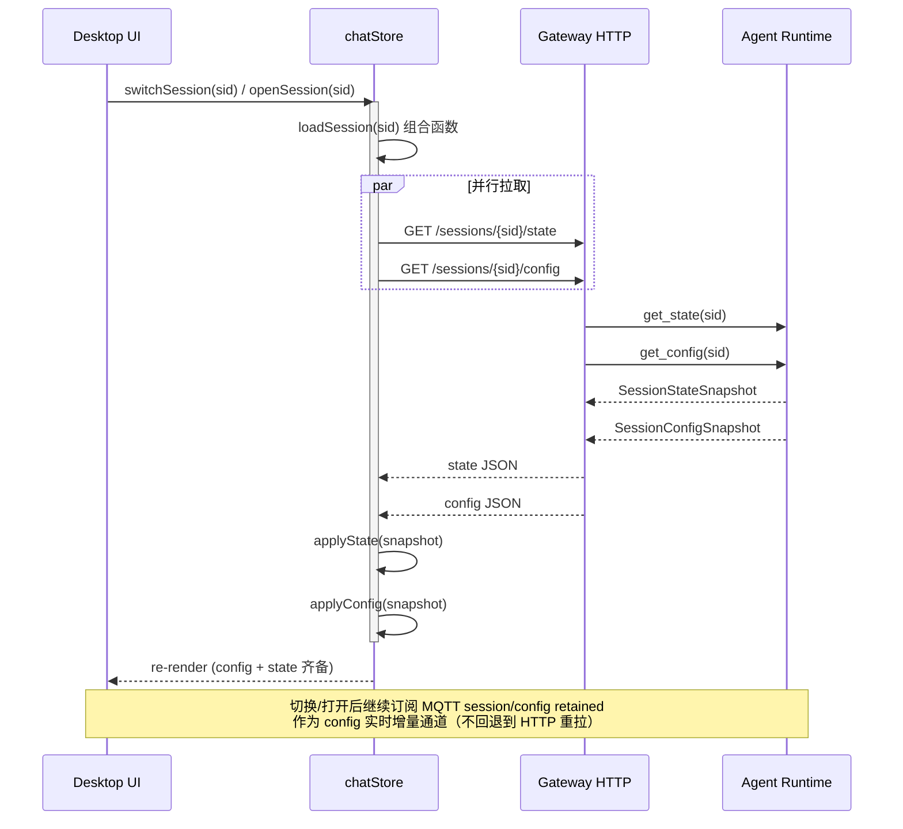

# ADR-047: Session Config 持久化与 LLM 推理流程解耦

**状态**：草案
**日期**：2026-07-24
**决策者**：大鱼

**前置**：
- [ADR-012](./ADR-012-per-session-model-isolation.md)（per-session model 隔离）
- [ADR-040](./ADR-040-runtime-adapter-use-case-layer.md)（Runtime UseCase Trait 层）
- [ADR-043](./ADR-043-session-config-state-split.md)（Session Config/State 双主题拆分）

---

## 1. 决策摘要

ADR-043 在 MQTT 推送侧完成了 `SessionConfig` / `SessionState` 双主题拆分，解决了**推送链路**的 config 回弹问题。但 **HTTP 拉取链路** 和 **config 持久化链路** 仍存在同一类 bug：

1. **HTTP 拉取回弹**：前端切换 session 再切回时，`fetchSessionState` 通过 HTTP `GET /sessions/{sid}` 拉取的 `meta.json` 仍携带旧 config 值，覆盖前端的乐观更新。
2. **Config 持久化被推理阻塞**：`ModelSwitch`、`ReasoningEffort` 等 config 命令作为 `SessionMessage` variant 进入 `SessionTask` 的串行消息队列，在 `agent_loop.run().await` 期间被阻塞，导致 `meta.json` 不更新、MQTT `config_change_tx` 不触发。

根因是 **config 持久化路径与 LLM 推理流程在类型层面耦合**：`SessionMessage` enum 混装了 config 命令和推理控制命令，全部经过同一个串行 channel、同一个 `match`、同一个被 `run().await` 阻塞的循环。

本 ADR 通过三层改造**消灭整个 bug class**：

| 层 | 改造 | 效果 |
|---|------|------|
| **数据层** | `ConversationSession` 通过 `Arc` 共享给 `SessionHandle`，新增 `apply_config(delta)` 单一写入入口 + 版本计数器 | config 写入不再经过推理队列 |
| **消息层** | 从 `SessionMessage` 中移除 config 命令 variant，SessionTask 改为轮询版本号 | 类型层面杜绝 config 命令进入推理队列 |
| **Usecase 层** | 激活 ADR-040 shelved 的 `SessionConfigService` trait，HTTP/MQTT/CLI 三适配器统一经过 | 单一入口，新增参数不改适配器和消息协议 |

**核心设计原则**：

- **Config 持久化（内存 + meta.json + MQTT 通知）是即时的**，不依赖任何外部流程。
- **LLM 侧生效（Provider rebuild、context_builder 更新）可以延迟到下一轮推理**，这是穿行推理的固有约束，延迟合理且可接受。
- **新增 config 参数只需修改参数定义（`SessionConfigDelta`）和处理函数（`ConversationSession::apply_config`）**，不需要触碰 `SessionMessage`、`gateway_loop` 路由、`SessionTask` handler。

---

## 2. 根因分析

### 2.1 SessionTask 主循环的串行阻塞

`session_task.rs:593` 的主循环结构：

```rust
loop {
    let msg = inbound_rx.recv().await;       // 等待下一条消息

    match msg {
        Some(SessionMessage::ChatMessage { .. }) => {
            agent_loop.run(...).await;        // ⬅ 推理期间整条循环阻塞
        }
        Some(SessionMessage::ModelSwitch { model, provider }) => {
            // ⬅ 只能等推理结束后才能执行
            agent_loop.session.set_model(model.clone());
            conv.update_model_provider(&model, provider.as_deref());
            //     ^^^^^^^^^^^^^^^^^^^^^^^^^^^^^^^^^^^^^^^^^^^^
            //     write_meta() + notify_config_change() 被阻塞
        }
        Some(SessionMessage::ReasoningEffort { effort }) => { ... }
        Some(SessionMessage::SetWorkspaceId { workspace_id }) => { ... }
        // ...
    }
}
```

当 `agent_loop.run().await` 执行时（可能持续数秒到数分钟），`inbound_rx` 中的 `ModelSwitch`、`ReasoningEffort` 等 config 消息无法被 dequeue。

### 2.2 ConversationSession 不可从外部访问

`ConversationSession`（拥有 `write_meta()` 和 `config_change_tx`）的归属链：

```
ConversationSession (model/provider/workspace_id/reasoning_effort/temperature + write_meta + config_change_tx)
  └─ SessionState.conversation: Option<ConversationSession>    // owned, 非 Arc
     └─ AgentLoop.session
        └─ SessionTask (tokio task)                            // 独占
```

`SessionManager` 只持有 `SessionHandle`，而 `SessionHandle` 没有 `ConversationSession` 的引用。config 持久化的唯一触发路径是经过 `inbound_tx` channel -> SessionTask 串行循环。

### 2.3 Config 命令与推理命令混装在 SessionMessage 中

`SessionMessage` enum 同时承载两类语义完全不同的命令：

| 类别 | Variant | 应该被推理阻塞？ |
|------|---------|:---:|
| 推理控制 | `ChatMessage`, `Stop`, `ContinueExecution`, `CompactContext` | ✅ 是 |
| Config 变更 | `ModelSwitch`, `ReasoningEffort`, `SetWorkspaceId`, `UpdateRuntimeConfig` | ❌ 否 |
| 环境注入 | `UpdateMcpTools`, `UpdateBuiltinTools`, `SetWorkDir`, `SetWorkspacePromptFile` | ❌ 否 |

没有类型层面的区分。开发者加新参数时自然仿照 `ModelSwitch` 添加新的 `SessionMessage` variant，然后踩同样的坑。

### 2.4 Usecase 层被 shelved

ADR-040 设计了 `SessionControlService` trait（含 `model_switch()`、`reasoning_effort()`、`workspace_switch()`），但因为 `SessionManager` 需要 `&mut self` 不兼容 `Arc<dyn ...>` 而 shelved。结果 MQTT 路径直接穿透到 `SessionManager` 内部方法，绕过 usecase 层。

### 2.5 现有部分解耦不彻底

`SessionHandle` 已通过 `Arc<RwLock<String>>` 共享 `workspace_id` 和 `current_work_dir`，`SessionManager::set_session_workspace` 可同步更新。但 meta.json 持久化仍通过 `SessionMessage::SetWorkspaceId` 排队到 SessionTask，所以 workspace 也有同样的回弹问题。

### 2.6 ConversationSession 的 config 方法已经是线程安全的

关键事实：`ConversationSession` 的所有 config 更新方法都是 `&self`（非 `&mut self`），内部用 `std::sync::Mutex` 保护：

```rust
pub fn update_model_provider(&self, model: &str, provider: Option<&str>) {
    if let Ok(mut m) = self.model.lock() { *m = Some(model.to_string()); }
    if let Ok(mut p) = self.provider.lock() { *p = provider.map(|s| s.to_string()); }
    self.write_meta();               // 同步文件 I/O
    self.notify_config_change();     // UnboundedSender::send，非阻塞
}
```

这些方法天然可以通过 `Arc<ConversationSession>` 从任意线程调用，不需要锁改造。

---

## 3. 方案设计

### 3.1 架构总览

```
外部接口层（Adapter）
  MQTT (gateway_loop.rs) ─┐
  HTTP (server.rs)        ├─→ SessionConfigService::apply_config(sid, delta)
  CLI (future)            ─┘         │
                                     ▼
Config 领域层                        │
  SessionConfigDelta ──→ ConversationSession::apply_config(&self, delta)
                           │  1. 更新内存 Mutex 字段
                           │  2. write_meta() → meta.json
                           │  3. notify_config_change() → MQTT config_change_tx
                           │  4. version.fetch_add(1)
                           ▼
推理层                               │
  SessionTask 主循环                │
    每轮推理前: poll version() ─────┘
    变化时: apply_llm_effects(snapshot)
      → Provider rebuild, context_builder, reasoning_effort reset
```

### 3.2 数据层改造

#### 3.2.1 ConversationSession 从 owned 改为 Arc 共享

```rust
// session_state.rs - 改动
pub(crate) conversation: Option<Arc<ConversationSession>>,  // was: Option<ConversationSession>

// session_handle.rs - 新增字段
pub struct SessionHandle {
    // ... existing fields ...
    pub(crate) conversation: Option<Arc<ConversationSession>>,
}
```

创建 session 时，`Arc::new(conv)` 同时放入 `SessionHandle` 和 `SessionState`。

`ConversationSession::Drop` 在所有 Arc 引用释放后触发。`SessionManager` 在关闭 session 时先显式调用清理方法清除 retained MQTT 消息，再移除 handle，确保 Drop 时机可控。

#### 3.2.2 SessionConfigDelta -- 参数定义

```rust
// session_config/delta.rs

/// Partial session config update. Each field is `None` (unchanged) or `Some(new_value)`.
///
/// Adding a new config parameter:
/// 1. Add field here
/// 2. Add handling in `ConversationSession::apply_config()`
/// 3. Add to `SessionConfig` proto + `build_session_config_snapshot()`
/// 4. (Optional) Add LLM-side effect in `llm_effects.rs`
#[derive(Debug, Clone, Default, Serialize, Deserialize)]
pub struct SessionConfigDelta {
    pub model: Option<String>,
    pub provider: Option<String>,
    pub workspace_id: Option<String>,
    pub reasoning_effort: Option<String>,
    pub temperature: Option<f32>,
    pub title: Option<String>,
}
```

#### 3.2.3 ConversationSession::apply_config -- 单一写入入口

```rust
// conversation.rs - 新增方法

impl ConversationSession {
    /// THE single entry point for ALL config changes.
    /// Synchronous: memory + meta.json + MQTT notification.
    /// Called from SessionConfigService, NOT from SessionTask.
    pub fn apply_config(&self, delta: &SessionConfigDelta) {
        let mut changed = false;
        if let Some(ref model) = delta.model {
            *self.model.lock().unwrap() = Some(model.clone());
            changed = true;
        }
        if let Some(ref provider) = delta.provider {
            *self.provider.lock().unwrap() = Some(provider.clone());
            changed = true;
        }
        if let Some(ref workspace_id) = delta.workspace_id {
            *self.workspace_id.lock().unwrap() = Some(workspace_id.clone());
            changed = true;
        }
        if let Some(ref effort) = delta.reasoning_effort {
            *self.reasoning_effort.lock().unwrap() = Some(effort.clone());
            changed = true;
        }
        if let Some(temp) = delta.temperature {
            *self.temperature.lock().unwrap() = Some(temp);
            changed = true;
        }
        if let Some(ref title) = delta.title {
            *self.current_title.lock().unwrap() = Some(title.clone());
            self.title_set.store(true, Ordering::Relaxed);
            changed = true;
        }

        if changed {
            self.write_meta();
            self.notify_config_change();
            self.config_version.fetch_add(1, Ordering::SeqCst);
        }
    }

    /// Monotonic version counter. SessionTask polls this at turn boundaries.
    pub fn config_version(&self) -> u64 {
        self.config_version.load(Ordering::Acquire)
    }
}
```

`ConversationSession` 新增字段 `config_version: AtomicU64`。

#### 3.2.4 SessionConfigSnapshot -- 读取当前配置

```rust
// session_config/delta.rs

/// Read-only snapshot of current session config.
/// Used by HTTP GET, MQTT retained, and LLM-side effect application.
#[derive(Debug, Clone, Serialize)]
pub struct SessionConfigSnapshot {
    pub model: Option<String>,
    pub provider: Option<String>,
    pub workspace_id: Option<String>,
    pub reasoning_effort: Option<String>,
    pub temperature: Option<f32>,
    pub title: Option<String>,
}
```

`ConversationSession` 新增 `config_snapshot(&self) -> SessionConfigSnapshot` 方法。

### 3.3 消息层改造

#### 3.3.1 从 SessionMessage 移除 config 命令 variant

```rust
// session_task.rs - 删除以下 variant：
//   ModelSwitch { model, provider }         ❌
//   ReasoningEffort { effort }              ❌
//   SetWorkspaceId { workspace_id }         ❌
//   UpdateRuntimeConfig(overrides)          ❌ (评估后决定，见 §3.3.3)
```

这些 variant 的持久化逻辑已被 `ConversationSession::apply_config()` 取代。

#### 3.3.2 SessionTask 版本轮询 + LLM 侧生效

```rust
// session_config/llm_effects.rs

/// Apply LLM-side effects of a config change.
/// Called by SessionTask at turn boundaries when config version has changed.
/// This is the ONLY place that handles LLM-side reactions to config changes.
pub fn apply_llm_effects(
    agent_loop: &mut AgentLoop,
    context_builder: &mut ContextBuilder,
    snapshot: &SessionConfigSnapshot,
) {
    // Model/Provider change → rebuild LLM Provider
    if let Some(ref model) = snapshot.model {
        agent_loop.session.set_model(model.clone());
        if let Some(ref provider_id) = snapshot.provider {
            if let Some(new_provider) = agent_loop.session_core.build_provider_for(
                provider_id, &agent_loop.core.config,
                &agent_loop.core.global_provider_list,
                &agent_loop.core.provider_key_vault,
                agent_loop.core.compat_cache.as_ref(),
            ) {
                agent_loop.update_provider(new_provider, model.clone(), Some(provider_id.clone()));
            }
        }
        context_builder.set_override_model(model.clone());

        // Model switch resets reasoning_effort to new model's default
        let caps = agent_loop.core.get_model_capabilities(model);
        let default_effort = resolve_default_effort(&caps);
        agent_loop.session.set_reasoning_effort(default_effort);
    }

    // ReasoningEffort change (without model switch)
    if snapshot.model.is_none() {
        if let Some(ref effort) = snapshot.reasoning_effort {
            let parsed = ReasoningEffort::from_str_loose(effort);
            agent_loop.session.set_reasoning_effort(parsed);
        }
    }
}
```

```rust
// session_task.rs - 主循环改造

let mut last_config_version = agent_loop
    .session.conversation()
    .map(|c| c.config_version())
    .unwrap_or(0);

loop {
    // ── 检查 config 是否在上一轮推理期间被修改 ──
    if let Some(conv) = agent_loop.session.conversation() {
        let current = conv.config_version();
        if current != last_config_version {
            let snapshot = conv.config_snapshot();
            session_config::llm_effects::apply_llm_effects(
                &mut agent_loop, &mut context_builder, &snapshot,
            );
            last_config_version = current;
        }
    }

    let msg = inbound_rx.recv().await;
    match msg {
        Some(SessionMessage::ChatMessage { .. }) => {
            agent_loop.run(...).await;
        }
        Some(SessionMessage::Stop { reason }) => { ... }
        Some(SessionMessage::ContinueExecution) => { ... }
        Some(SessionMessage::SetWorkDir { path }) => { ... }
        Some(SessionMessage::SetWorkspacePromptFile { content }) => { ... }
        // ModelSwitch / ReasoningEffort / SetWorkspaceId 已删除
        // ...
    }
}
```

**关键语义**：config 持久化即时完成（`apply_config` 同步执行），LLM 侧效果在下一轮推理前生效（version 轮询）。推理中的 config 变更不会打断当前推理，但 `meta.json` 和 MQTT 通知已经更新。

#### 3.3.3 UpdateRuntimeConfig 的处理

`UpdateRuntimeConfig(RuntimeConfigOverrides)` 携带 `temperature`、`max_output_tokens`、`max_iterations`、`context_window` 等。其中 `temperature` 是 config 字段（持久化到 meta.json），其余是 runtime override（不持久化到 meta.json，只影响 AgentLoop 运行参数）。

处理方式：
- `temperature` 部分通过 `SessionConfigDelta` 走 `apply_config()` 路径
- 其余部分仍保留为 `SessionMessage` variant，因为它们不是持久化 config，而是 runtime 行为调整

### 3.4 Usecase 层改造

#### 3.4.1 SessionConfigService trait

```rust
// usecases/session_config.rs

/// Usecase trait for session config mutations.
/// All external interfaces (HTTP, MQTT, CLI) go through this trait.
#[async_trait]
pub trait SessionConfigService: Send + Sync {
    /// Apply a config change. Persistence is immediate.
    /// LLM-side effects are deferred to the next inference turn.
    async fn apply_config(&self, session_id: &str, delta: SessionConfigDelta) -> Result<()>;

    /// Read current config (HTTP GET /sessions/{sid}/config).
    async fn get_config(&self, session_id: &str) -> Result<SessionConfigSnapshot>;
}
```

#### 3.4.2 RuntimeSessionConfigService impl

```rust
// usecases/session_config_impl.rs

pub struct RuntimeSessionConfigService {
    /// Shared session config stores (Arc<ConversationSession>), keyed by session_id.
    /// Interior mutability via RwLock - unblocks ADR-040's &mut self problem.
    sessions: Arc<RwLock<HashMap<String, Arc<ConversationSession>>>>,
    /// For workspace validation.
    resolver: Option<Arc<RwLock<WorkspaceResolver>>>,
}
```

`apply_config` 的 `&self` 路径：
1. `sessions.read()` -> 获取 `Arc<ConversationSession>`
2. `conv.apply_config(&delta)` -- `&self`，内部用 Mutex
3. workspace 验证通过 `resolver.read()` -- `&self`

不需要 `&mut self`，可以安全包装在 `Arc<dyn SessionConfigService>` 中。

#### 3.4.3 三适配器统一经过 usecase

```rust
// gateway_loop.rs (MQTT adapter)
InboundMessage::ModelSwitchAction { model_id, provider_id } => {
    let delta = SessionConfigDelta {
        model: Some(model_id),
        provider: provider_id,
        ..Default::default()
    };
    config_service.apply_config(&session_id, delta).await
}

// http/server.rs (HTTP adapter) - 新增
// GET  /sessions/{sid}/config  → config_service.get_config(sid)
// PUT  /sessions/{sid}/config  → config_service.apply_config(sid, body)
```

### 3.5 HTTP 响应拆分

#### 3.5.1 SessionDetail 拆分 config / state

```rust
// usecases/session_metadata.rs

pub struct SessionDetail {
    pub session_id: String,
    pub created_at: String,
    pub last_active_at: String,

    // Config 部分（来自 meta.json 的 config 字段）
    #[serde(skip_serializing_if = "Option::is_none")]
    pub config: Option<SessionConfigSnapshot>,

    // State 部分（来自 meta.json 的 state 字段 + 内存快照）
    #[serde(skip_serializing_if = "Option::is_none")]
    pub state: Option<SessionStateSnapshot>,
}
```

前端 `fetchSessionState` 只读取 `state` 部分。Config 通过 `GET /sessions/{sid}/config` 或 MQTT `session/config` retained 获取。

#### 3.5.2 前端拉取协议：切换/打开 session 必须同步拉取 config 和 state

HTTP `GET /sessions/{sid}` 拆分后只返回 state，前端需要单独调 `GET /sessions/{sid}/config` 拿 config。这意味着原来"一次 HTTP 调用拿全量 `SessionDetail`"的隐含约定被打破。**如果实现时不显式补上 `fetchSessionConfig`，UI 会进入 config 真空状态，并让 ADR-043 的修复退化成"只推不拉"，回弹 bug 复发。**

**强制规则**：凡是前端**冷加载一个 session** 的场景，必须**同时**调用两个 HTTP 接口：

| 场景 | 说明 | 必须的 HTTP 调用 |
|------|------|----------------|
| **切换 session** | 用户从 session A 切到 session B | `GET /sessions/{B}/state` + `GET /sessions/{B}/config` |
| **打开 session** | 从 session 列表点击、深度链接、刷新页面等 | `GET /sessions/{sid}/state` + `GET /sessions/{sid}/config` |
| **应用启动首次加载** | Desktop 启动后恢复上次的 session | `GET /sessions/{sid}/state` + `GET /sessions/{sid}/config` |

两个调用可以串行也可以并行；推荐封装 `Promise.all` 以最小化感知时延。

**为什么不能只调 `fetchSessionState`**：

1. **Config 信息完全丢失**：`model`、`provider`、`workspace_id`、`reasoning_effort`、`temperature`、`title` 不在 state 响应里。单独调 state 会让 UI 处于"空配置"状态——model 下拉空白、workspace 显示未绑定、reasoning effort 控件无值。
2. **违背 ADR-043 设计意图**：[ADR-043](./ADR-043-session-config-state-split.md) 把 config/state 拆成两条独立拉取路径是为了让 config 回弹有独立可控的来源。前端只拉 state 等于把 config 的拉取路径直接砍掉，等价于把 ADR-043 的修复退化成"只推不拉"。
3. **回弹 bug 复发**：仅拉 state 不拉 config，UI 上的 config 显示会停留在前一个 session 或初始值；切换回来时再次出现"配置空白/错配"，触发本 ADR 第 1 节列出的同一类 bug。

**为什么不靠 MQTT `session/config` retained 兜底**：

MQTT retained 消息确实提供 config 来源，但：
- MQTT 连接/重连期间 retained 消息可能未及时送达，存在窗口期
- 切换/打开 session 是高频操作，让用户感知到"config 还没到位"会破坏体验
- 必须把 HTTP 拉取作为**主路径**，MQTT retained 作为**实时增量通道**

**实现约定**：

- 前端 `chatStore.ts`（或等价 store）新增 `fetchSessionConfig(sid)` action，与 `fetchSessionState(sid)` 对称
- 切换/打开 session 的入口函数（`switchSession` / `openSession` / `restoreLastSession` 等）必须**成对调用**两个接口
- **推荐封装组合函数 `loadSession(sid)`**，内部 `Promise.all([fetchSessionState(sid), fetchSessionConfig(sid)])`，对调用方只暴露一个 promise，**用类型/封装把"同步拉取"做成不可绕过**——避免后续开发者手抖只调其中一个
- MQTT retained 通道在切换/打开后**继续订阅**，作为后续 config 变更的实时增量
- 不在"只触发一条推理"的场景（如发送消息、继续执行）调用 `fetchSessionConfig`——那条路径由 MQTT 实时通知兜底

**冷加载时序图**：



---

## 4. 实施计划

### Phase 1: 数据层解耦 -- 修复回弹 bug（核心）

**目标**：config 持久化不再被推理阻塞。

| 步骤 | 文件 | 改动 |
|------|------|------|
| 1.1 | `session_config/mod.rs` (新) | 模块声明 |
| 1.2 | `session_config/delta.rs` (新) | `SessionConfigDelta` + `SessionConfigSnapshot` |
| 1.3 | `session_config/llm_effects.rs` (新) | `apply_llm_effects()` 提取自 SessionTask |
| 1.4 | `conversation.rs` | `ConversationSession` 新增 `config_version: AtomicU64`；新增 `apply_config()` + `config_snapshot()` |
| 1.5 | `session_state.rs` | `conversation: Option<ConversationSession>` → `Option<Arc<ConversationSession>>` |
| 1.6 | `session_handle.rs` | 新增 `conversation: Option<Arc<ConversationSession>>` 字段 |
| 1.7 | `session_manager.rs` | `route_model_switch` / `route_reasoning_effort` / `set_session_workspace` 改为同步调用 `conv.apply_config()` |
| 1.8 | `session_task.rs` | 删除 `ModelSwitch` / `ReasoningEffort` / `SetWorkspaceId` handler；主循环新增 version 轮询 + `apply_llm_effects()` |
| 1.9 | `session_task.rs` | `SessionMessage` enum 删除 config variant |
| 1.10 | 测试 | 回归测试：推理中切换 model → meta.json 立即更新 |

**风险**：`ConversationSession` 从 owned 改为 `Arc` 涉及所有持有 `conversation` 的代码路径，需要逐一排查 `&mut self` → `&self` 的兼容性。

### Phase 2: Usecase 层 + HTTP 接口

**目标**：三个外部接口统一经过 usecase 层；HTTP 新增 config 专用端点。

| 步骤 | 文件 | 改动 |
|------|------|------|
| 2.1 | `usecases/session_config.rs` (新) | `SessionConfigService` trait |
| 2.2 | `usecases/session_config_impl.rs` (新) | `RuntimeSessionConfigService` impl |
| 2.3 | `usecases/mod.rs` | 注册新模块 |
| 2.4 | `gateway_loop.rs` | MQTT config 命令改为构造 `SessionConfigDelta` → `config_service.apply_config()` |
| 2.5 | `http/server.rs` | 新增 `GET/PUT /sessions/{sid}/config` 端点 |
| 2.6 | `startup/subsystems.rs` | 注入 `SessionConfigService` 到 HTTP server 和 gateway_loop |
| 2.7 | 测试 | usecase 层单元测试 + HTTP 端点集成测试 |

### Phase 3: HTTP 响应拆分 + 前端适配

**目标**：HTTP `GET /sessions/{sid}` 响应拆分 config/state；前端 `fetchSessionState` 只应用 state。

| 步骤 | 文件 | 改动 |
|------|------|------|
| 3.1 | `usecases/session_metadata.rs` | `SessionDetail` 拆分 `config` / `state` 字段 |
| 3.2 | `usecases/session_metadata_impl.rs` | 响应构建适配新结构 |
| 3.3 | `http/server.rs` | `get_session` handler 适配新结构 |
| 3.4 | `chatStore.ts` | `fetchSessionState` 移除 config 字段的应用逻辑；新增 `fetchSessionConfig(sid)` action 与之对称 |
| 3.5 | 前端 | **强制规则**：切换/打开/首启三个冷加载场景必须**同步调用** `fetchSessionState` + `fetchSessionConfig`，封装为 `loadSession(sid)` 组合函数（`Promise.all`），不可绕过（详见 §3.5.2） |
| 3.6 | 测试 | 前端 e2e：切换 session 再切回，model/workspace 不回弹；同时断言切换/打开路径必走 `fetchSessionState` + `fetchSessionConfig` 双调用 |

---

## 5. 影响分析

### 5.1 新增 config 参数的开发者体验

| 步骤 | 当前架构 | 新架构 |
|------|---------|--------|
| 1. 定义参数 | 加到 `ConversationSession` | 加到 `SessionConfigDelta` + `ConversationSession` |
| 2. 持久化 | 加 `update_xxx()` 方法 | 在 `apply_config()` 中加一行 |
| 3. MQTT 通知 | 在 `update_xxx()` 中调 `notify_config_change()` | 自动（`apply_config` 统一调用） |
| 4. 消息协议 | 加 `SessionMessage::XxxSwitch` variant | **不需要** |
| 5. 路由 | 在 `gateway_loop.rs` 加路由分支 | **不需要**（构造 delta 时加一个字段） |
| 6. SessionTask | 加 handler 分支 | **不需要** |
| 7. LLM 侧效果 | 在 handler 中加逻辑 | 在 `llm_effects.rs` 中加（可选） |

步骤 4-6 被彻底消除，是 bug class 消灭的关键。

### 5.2 性能影响

- `apply_config()` 中的 `write_meta()` 是同步文件 I/O，对于小 JSON 文件（< 1KB）耗时 < 1ms。config 变更是用户驱动的低频操作，可接受。
- version 轮询是 `AtomicU64::load`，无锁无阻塞，每轮推理前执行一次，开销可忽略。

### 5.3 兼容性

- `SessionMessage` 删除 variant 是 breaking change，但 `SessionMessage` 是内部 enum，不暴露到协议层。
- HTTP `GET /sessions/{sid}` 响应结构变化（Phase 3）需要前端同步适配：**切换/打开/首启三个冷加载场景必须同步调用** `fetchSessionState` 和 `fetchSessionConfig`（详见 §3.5.2，违反即回弹 bug 复发）。
- MQTT `session/config` retained 消息格式不变（`SessionConfig` proto 不变）。

### 5.4 `&mut self` 问题的解决

ADR-040 shelved `SessionControlService` 的原因是 `SessionManager` 需要 `&mut self`。本 ADR 的 `SessionConfigService` 不需要 `&mut self`：

- `ConversationSession::apply_config()` 是 `&self`（内部 Mutex）
- `RuntimeSessionConfigService` 通过 `Arc<RwLock<HashMap>>` 访问 session，只需 `&self`
- workspace 验证通过 `Arc<RwLock<WorkspaceResolver>>` 访问，只需 `&self`

---

## 6. 决策记录

| 决策 | 理由 |
|------|------|
| 不提取独立的 `SessionConfigStore` struct | `ConversationSession` 的 config 方法已经是 `&self` + `Mutex`，加 `apply_config()` 即可达到目的。提取新 struct 需要协调 `write_meta()` 中 config + state 字段的合并，增加复杂度但收益有限。 |
| 使用 version 轮询而非新 channel | SessionTask 只需在 turn boundary 检测 config 变化，`AtomicU64` 轮询无锁无阻塞，比新增 channel + `tokio::select!` 更简单。 |
| `UpdateRuntimeConfig` 不完全迁移 | 其中 `temperature` 是 config 字段走 `apply_config()`，但 `max_output_tokens` / `max_iterations` / `context_window` 是 runtime override 不持久化到 meta.json，保留为 `SessionMessage` variant。 |
| Phase 1 不含 usecase 层 | Phase 1 的核心目标是修复回弹 bug，`SessionManager` 直接调 `conv.apply_config()` 即可。Usecase 层是架构治理，可以在 Phase 2 不影响功能的前提下增量完成。 |

---

## 7. 验收标准

1. **回弹 bug 修复**：推理中切换 model → 切换 session → 切回 → model 不回弹
2. **meta.json 即时更新**：推理中切换 model → `meta.json` 立即反映新值（可通过 HTTP GET 验证）
3. **MQTT config 即时通知**：推理中切换 model → `session/config` retained 消息立即更新
4. **LLM 延迟生效**：推理中切换 model → 当前推理不受影响 → 下一轮推理使用新 model
5. **新增参数不改消息协议**：添加一个测试参数到 `SessionConfigDelta`，验证不需要修改 `SessionMessage` / `gateway_loop` / `SessionTask`
6. **前端拉取协议正确性（§3.5.2 强制规则）**：
   - 切换 session（`switchSession`）→ 同时调用 `fetchSessionState` + `fetchSessionConfig`
   - 打开 session（`openSession` / 深度链接 / 刷新）→ 同时调用 `fetchSessionState` + `fetchSessionConfig`
   - 应用启动首次加载（`restoreLastSession`）→ 同时调用 `fetchSessionState` + `fetchSessionConfig`
   - 组合函数 `loadSession(sid)` 通过封装强制约束同步拉取，调用方无法只取其一
   - 不允许出现"只 fetch state 不 fetch config"的回归 e2e（建议加入前端 Playwright/Cypress 回归用例，断言切换/打开路径的两个 HTTP 请求都被发出）
