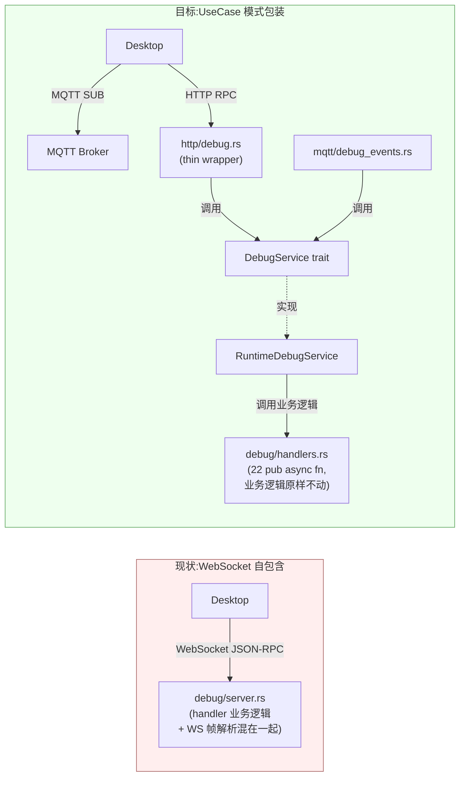

# ADR-048：Debug Protocol 从 WebSocket 迁至 MQTT events + HTTP RPC

**状态**：提案
**日期**：2026-07-15
**决策者**：大鱼
**前置**：
- ADR-031（旧 IPC 通道清理）
- ADR-033（MQTT 替换 gRPC + WebSocket —— IPC 主通道）
- ADR-034（MQTT / HTTP 职责边界）
- ADR-035（MQTT 流式传输重构）
- **ADR-040（Runtime adapter → UseCase service 模式 — late-bind slot）**

---

## 决策摘要

**Debug Protocol 从 JSON-RPC 2.0 over WebSocket 迁至 MQTT pub/sub（事件）+ HTTP REST（RPC）。与生产 IPC 完全对齐。**

现有 `core/acowork-runtime/src/debug/server.rs` 中的 **22 个 RPC handler 业务逻辑 0 改动**——只把它们从内部闭包提到 `debug/handlers.rs` 作为 `pub async fn`，再用 ADR-040 的 UseCase 模式包装成 `DebugService` trait。MQTT events / HTTP routes 都是 thin wrappers，调用 service。



| 维度 | 现状 | 目标 |
|------|------|------|
| Debug 业务逻辑位置 | `debug/server.rs` 内部闭包（1011 行混着 WS 帧解析） | `debug/handlers.rs` 独立 `pub async fn`（业务逻辑原样不动） |
| Debug 内部架构 | handler 直调 `DebugController` state（绕过 ADR-040） | **`DebugService` trait**（ADR-040 UseCase 模式） |
| Debug 外部接口 | 1（WebSocket） | 2（MQTT + HTTP） |
| Debug 多用户支持 | 单客户端硬编码 | 自动继承 ACL |
| 协议栈一致性 | ✗ 3 协议（HTTP + MQTT + WebSocket） | ✓ 2 协议（HTTP + MQTT） |
| 业务逻辑改动量 | — | **0 改动**（纯结构调整） |

---

## 背景与动机

### 现有 Debug 架构偏离 ADR-040

ADR-040 已经建立了完整的 UseCase service 模式（10 个 service trait + 实现 + late-bind slot）：

```text
external adapter (HTTP/MQTT/CLI)
    ↓ 调用
UseCase service trait  (例如 AgentToolsService)
    ↓ 实现
Runtime*Service struct (持有 work_dir / sessions 等内部状态)
    ↓ 调用
内部函数 / domain 模块
```

**Debug Protocol 是当前唯一绕过这层的外部接口**——`debug/server.rs` 是一个自包含模块：
- `handle_connection()` 直接 accept WebSocket
- 在闭包里直接操作 `DebugController`
- 没有任何 trait 抽象、任何 UseCase service

### 本 ADR 的关键洞察：业务逻辑 0 改动

`debug/server.rs` 现有的 22 个 handler 函数（`resume`/`pause`/`step`/`getState`/...）**业务逻辑本身是正确的、经过测试的**——问题只是它们被埋在 WebSocket 帧解析的回调里。

**正确的重构不是"重写"而是"提取"**：
1. 把 22 个 handler 的业务代码从闭包提到独立 `pub async fn`（放 `debug/handlers.rs`）
2. 用 ADR-040 UseCase 模式包装：`usecases/debug_service.rs` 定义 trait + `usecases/debug_service_impl.rs` 实现（实现里调 `handlers::*`）
3. HTTP routes (`http/debug.rs`) 和 MQTT events publisher (`mqtt/debug_events.rs`) 都是 thin wrappers
4. 删除 `debug/server.rs` 仅 WebSocket 部分，保留 `DebugEventSender`（events 走 mpsc → MQTT publisher）

**这样 Debug Protocol 切换到 MQTT+HTTP 几乎等同于"结构调整"，业务逻辑零回归风险。**

---

## 详细设计

### 1. 协议映射（对外契约）

| JSON-RPC 方法 | 通道 | 主题 / HTTP 端点 |
|--------------|------|----------------|
| `onStep`（事件） | **MQTT** | `acowork/agents/{agent_id}/debug/events/onStep` |
| `onBreakpoint`（事件） | **MQTT** | `acowork/agents/{agent_id}/debug/events/onBreakpoint` |
| `onRecordStep`（事件） | **MQTT** | `acowork/agents/{agent_id}/debug/events/onRecordStep` |
| `onStateChange`（事件） | **MQTT** | `acowork/agents/{agent_id}/debug/events/onStateChange` |
| `onContextBuilt`（事件） | **MQTT** | `acowork/agents/{agent_id}/debug/events/onContextBuilt` |
| `debugger.resume`（RPC） | **HTTP** | `POST /api/debug/resume` |
| `debugger.pause` | **HTTP** | `POST /api/debug/pause` |
| `debugger.step` | **HTTP** | `POST /api/debug/step` |
| `debugger.stop` | **HTTP** | `POST /api/debug/stop` |
| `debugger.restart` | **HTTP** | `POST /api/debug/restart` |
| `debugger.getState` | **HTTP** | `GET /api/debug/state` |
| `debugger.setBreakpoint` | **HTTP** | `POST /api/debug/breakpoints` |
| `debugger.removeBreakpoint` | **HTTP** | `DELETE /api/debug/breakpoints/{bp_id}` |
| `debugger.listBreakpoints` | **HTTP** | `GET /api/debug/breakpoints` |
| `debugger.getContextSnapshot` | **HTTP** | `GET /api/debug/context/{iteration}` |
| `debugger.getSection` | **HTTP** | `GET /api/debug/context/{iteration}/sections/{name}` |
| `debugger.rewind` | **HTTP** | `POST /api/debug/context/rewind` |
| `debugger.patchContext` | **HTTP** | `POST /api/debug/context/patch` |
| `debugger.reExecute` | **HTTP** | `POST /api/debug/context/re-execute` |
| `debugger.editMessage` | **HTTP** | `PATCH /api/debug/messages/{index}` |
| `debugger.rollback` | **HTTP** | `POST /api/debug/messages/rollback` |
| `debugger.reloadSkills` | **HTTP** | `POST /api/debug/skills/reload` |
| `debugger.switchProvider` | **HTTP** | `POST /api/debug/provider/switch` |
| `debugger.startRecording` | **HTTP** | `POST /api/debug/recording/start` |
| `debugger.stopRecording` | **HTTP** | `POST /api/debug/recording/stop` |
| `debugger.loadRecording` | **HTTP** | `POST /api/debug/recording/load` |
| `debugger.stopReplay` | **HTTP** | `POST /api/debug/recording/replay/stop` |

### 2. MQTT 事件主题设计

```
acowork/agents/{agent_id}/debug/events/{event_type}
```

| 子主题 | payload protobuf | 数据量 | QoS |
|--------|----------------|--------|-----|
| `onStep` | `DebugStepEvent { iteration, phase, input?, output?, usage? }` | ~200B-2KB | 0 |
| `onBreakpoint` | `DebugBreakpointEvent { breakpoint_id, iteration, phase }` | ~50B | 0 |
| `onRecordStep` | `DebugRecordStepEvent { step_index, phase, step_data? }` | ~100B-1KB | 0 |
| `onStateChange` | `DebugStateChangeEvent { old_phase, new_phase, iteration }` | ~30B | 0 |
| `onContextBuilt` | `DebugContextBuiltEvent { iteration, sections{...}, total_token_estimate }` | <500B | 0 |

**对齐 `docs/zh/protocols/mqtt.md` §3.5 设计原则**：
- ① **按数据源分类**：主题表达"agent {id} 的 debug 事件流"，不是"做什么动作"
- ② **Owner 单一**：Runtime 是 events 唯一发布者，Desktop 只订阅
- ③ **Retained = false**：事件是流，订阅断线重连后只从下一个事件开始
- ④ **QoS 0**：DevMode 是开发工具，允许丢 1~2 个事件可接受

### 3. HTTP RPC 设计

**Runtime localhost HTTP 新增路由**：挂载在已有 `acowork-runtime/src/http/server.rs` 下，路径前缀 `/api/debug/*`

**Gateway HTTP 反向代理**：在 `http/proxy.rs` 中新增 `/api/debug/*` 反代规则，复用现有 Runtime HTTP 注册表

**错误码映射**（JSON-RPC → HTTP）：

| 场景 | HTTP status | JSON-RPC error code |
|------|------------|-------------------|
| 成功 | 200 | — |
| 方法不存在 | 404 | -32601 |
| JSON-RPC 内部错误 | 422 | -32603 |
| Runtime 未运行 DevMode | 403 | -32000 |
| Runtime 宕机 | 502 | (Gateway 反代错误) |

**响应体格式**：
```json
// 成功
{ "ok": true, "data": { ... } }
// 失败
{ "ok": false, "error": { "code": -32601, "message": "Method not found" } }
```

### 4. 内部架构：UseCase 模式无损迁移（ADR-040 模式）

这是本 ADR 的核心。下面描述"如何不重写现有代码就完成迁移"。

#### 4.1 文件级结构调整（7 个文件）

| 类型 | 文件 | 角色 |
|------|------|------|
| **业务逻辑**（保留） | `core/acowork-runtime/src/debug/handlers.rs`（**新增**） | 22 个 `pub async fn handler_*(...)`：现有闭包里的业务代码原样提取到这里 |
| **业务逻辑**（保留） | `core/acowork-runtime/src/debug/controller.rs` | 现有 `DebugController` 状态机，不动 |
| **业务逻辑**（保留） | `core/acowork-runtime/src/debug/protocol.rs` | 现有 JSON-RPC 类型，**仅保留 DTO 部分**，删除 WS 帧相关辅助 |
| **事件通道**（保留+适配） | `core/acowork-runtime/src/debug/mod.rs` 中的 `DebugEventSender` | mpsc 发送端不变；接收端从 WebSocket 换成 MQTT publisher |
| **UseCase trait**（新增） | `core/acowork-runtime/src/usecases/debug_service.rs` | 定义 `DebugService` trait + 22 个 async 方法 + DTO |
| **UseCase 实现**（新增） | `core/acowork-runtime/src/usecases/debug_service_impl.rs` | `RuntimeDebugService` 实现 trait，每个方法内部调用 `handlers::*` |
| **外部接口**（新增） | `core/acowork-runtime/src/http/debug.rs` | 22 条 axum HTTP route，每个 handler 是一个 thin wrapper（`state.debug_service.lock().await...method().await`）|
| **外部接口**（新增） | `core/acowork-runtime/src/mqtt/debug_events.rs` | `DebugEventMqttPublisher`：消费 `event_rx` mpsc → PUBLISH 到 MQTT broker |
| **启动方式**（修改） | `core/acowork-runtime/src/startup/subsystems.rs` 中的 `enable_debug_mode` | 不再 listen TCP；改为注册 HTTP routes + 启动 events publisher |
| **late-bind slot**（新增） | `HttpState` + `AgentBootContext` + `startup/session_init.rs` Phase B | 仿 ADR-040：Phase A slot 是 `None`，Phase B 填充 `RuntimeDebugService::new(sessions)` |
| **删除**（仅 WS 部分） | `core/acowork-runtime/src/debug/server.rs` | **整个文件 ~900 行删除**，仅保留 `DebugEventSender`（mpsc 发送端部分）；`accept_async` / `WebSocket` / `TcpListener` 全部消失 |

#### 4.2 trait 定义骨架

```rust
// core/acowork-runtime/src/usecases/debug_service.rs

#[async_trait]
pub trait DebugService: Send + Sync {
    // ── 执行控制 (5) ─────────────────────────────
    async fn resume(&self, session_id: &str) -> Result<ResumeResponse, DebugError>;
    async fn pause(&self, session_id: &str) -> Result<(), DebugError>;
    async fn step(&self, session_id: &str, granularity: StepGranularity) -> Result<(), DebugError>;
    async fn stop(&self, session_id: &str) -> Result<(), DebugError>;
    async fn restart(&self, session_id: &str) -> Result<(), DebugError>;

    // ── 状态查询 (4) ─────────────────────────────
    async fn get_state(&self, session_id: &str) -> Result<DebugStateResponse, DebugError>;
    async fn list_breakpoints(&self, session_id: &str) -> Result<Vec<BreakpointInfo>, DebugError>;
    async fn get_context_snapshot(&self, session_id: &str, iteration: u32)
        -> Result<ContextSnapshot, DebugError>;
    async fn get_section(&self, session_id: &str, iteration: u32, section: &str)
        -> Result<SectionContent, DebugError>;

    // ── 断点管理 (2) ─────────────────────────────
    async fn set_breakpoint(&self, session_id: &str, condition: BreakpointCondition)
        -> Result<String, DebugError>;  // 返回 breakpoint_id
    async fn remove_breakpoint(&self, session_id: &str, bp_id: &str) -> Result<(), DebugError>;

    // ── 上下文编辑 (3) ───────────────────────────
    async fn rewind(&self, session_id: &str, to_iteration: u32)
        -> Result<RewindResponse, DebugError>;
    async fn patch_context(&self, session_id: &str, patches: ContextPatches)
        -> Result<(), DebugError>;
    async fn re_execute(&self, session_id: &str) -> Result<ReExecuteResponse, DebugError>;

    // ── 消息编辑 (2) ─────────────────────────────
    async fn edit_message(&self, session_id: &str, index: usize, content: MessageContent)
        -> Result<(), DebugError>;
    async fn rollback(&self, session_id: &str, target_index: usize) -> Result<(), DebugError>;

    // ── 运行时变更 (2) ───────────────────────────
    async fn reload_skills(&self, session_id: &str, skill_name: Option<String>)
        -> Result<(), DebugError>;
    async fn switch_provider(&self, session_id: &str, switch: ProviderSwitch)
        -> Result<(), DebugError>;

    // ── 录制回放 (4) ─────────────────────────────
    async fn start_recording(&self, session_id: &str, output_path: Option<String>)
        -> Result<(), DebugError>;
    async fn stop_recording(&self, session_id: &str, output_path: Option<String>)
        -> Result<(), DebugError>;
    async fn load_recording(&self, session_id: &str, path: &str, mode: ReplayMode)
        -> Result<(), DebugError>;
    async fn stop_replay(&self, session_id: &str) -> Result<(), DebugError>;
}
```

**整个 trait 只描述业务方法，不涉及任何 transport 细节**。

#### 4.3 handlers.rs 与实现的对接

```rust
// core/acowork-runtime/src/debug/handlers.rs（新增）
// 把现有 debug/server.rs 的 22 个 handler 函数从闭包里"原样提取"出来

use super::controller::DebugController;

/// Resume auto-execution. 业务逻辑原样从 debug/server.rs 提取。
pub async fn handle_resume(
    ctrl: &mut DebugController,
    notify: &Arc<Notify>,
) -> Result<ResumeResponse, DebugError> {
    // ... 完全复用现有代码 ...
}

/// Get full state. 业务逻辑原样从 debug/server.rs 提取。
pub async fn handle_get_state(
    ctrl: &mut DebugController,
) -> Result<DebugStateResponse, DebugError> {
    // ... 完全复用现有代码 ...
}

// ... 其余 20 个 ...
```

```rust
// core/acowork-runtime/src/usecases/debug_service_impl.rs（新增）

pub struct RuntimeDebugService {
    sessions: Arc<tokio::sync::RwLock<HashMap<String, Arc<Mutex<DebugController>>>>>,
}

#[async_trait]
impl DebugService for RuntimeDebugService {
    async fn resume(&self, session_id: &str) -> Result<ResumeResponse, DebugError> {
        let ctrl = self.get_controller(session_id).await?;
        let mut ctrl = ctrl.lock().await;
        debug_handlers::handle_resume(&mut ctrl, &ctrl.notify.resume).await
        // ↑ 业务逻辑 0 改动,只调用 handlers 函数
    }

    async fn get_state(&self, session_id: &str) -> Result<DebugStateResponse, DebugError> {
        let ctrl = self.get_controller(session_id).await?;
        let mut ctrl = ctrl.lock().await;
        debug_handlers::handle_get_state(&mut ctrl).await
    }

    // ... 其余 20 个,全部是同样的 "get ctrl → call handler" 模式
}
```

#### 4.4 HTTP routes — thin wrappers

```rust
// core/acowork-runtime/src/http/debug.rs（新增）

pub fn debug_routes() -> Router<HttpState> {
    Router::new()
        .route("/api/debug/resume",     post(resume))
        .route("/api/debug/pause",      post(pause))
        // ... 22 条
}

async fn resume(
    State(state): State<HttpState>,
    Json(req): Json<ResumeRequest>,
) -> Result<Json<DebugHttpResponse<ResumeResponse>>, DebugHttpError> {
    let svc = state.debug_service.lock().await
        .as_ref()
        .ok_or_else(|| DebugHttpError::unavailable("DevMode not enabled"))?;
    svc.resume(&req.session_id).await
        .map(DebugHttpResponse::ok)
        .map_err(DebugHttpError::from)
}
// ... 21 个完全同样的 thin wrapper
```

#### 4.5 MQTT events — 解耦的 mpsc 桥

**关键设计**：`DebugEventSender` (mpsc 发送端) 完全不动,接收端从 WebSocket 换成 MQTT publisher。

```rust
// core/acowork-runtime/src/mqtt/debug_events.rs（新增）

pub struct DebugEventMqttPublisher {
    agent_id: String,
    mqtt_client: Arc<MqttClient>,
    event_rx: mpsc::UnboundedReceiver<TaggedDebugEvent>,
}

impl DebugEventMqttPublisher {
    pub async fn run(mut self) {
        while let Some(tagged) = self.event_rx.recv().await {
            // DebugEvent → protobuf → PUBLISH 到 acowork/agents/{id}/debug/events/{type}
            self.publish_event(&tagged.session_id, tagged.event).await;
        }
    }
}
```

启动方式(`subsystems.rs`):
```rust
if config.dev_mode {
    let (event_tx, event_rx) = mpsc::unbounded_channel();  // 单事件总线
    // 1. event_tx 发给 SessionManager.for_new_debug_session() (现有逻辑不变)
    // 2. event_rx 给 DebugEventMqttPublisher
    let publisher = DebugEventMqttPublisher::new(ctx.agent_id.clone(), ctx.mqtt_client.clone(), event_rx);
    tokio::spawn(publisher.run());
}
```

**事件不属于 UseCase service** —— 它是 fire-and-forget 的 push 通道,放 service 里会让 service 知道 transport(mqtt publisher 需要 protobuf 序列化、topic 拼接等),违反解耦原则。

#### 4.6 late-bind slot（ADR-040 模式）

```rust
// HttpState 字段（http/server.rs）
pub struct HttpState {
    // ... 现有字段
    pub debug_service: Arc<tokio::sync::Mutex<Option<Arc<dyn DebugService>>>>,
}

// start() 末尾添加参数
pub async fn start(
    bind_addr: SocketAddr,
    work_dir: PathBuf,
    /* ... 现有参数 ... */
    debug_service_slot: Arc<tokio::sync::Mutex<Option<Arc<dyn DebugService>>>>,
) -> Self { /* ... */ }

// Phase A: AgentBootContext 创建空 slot
// Phase B: session_init.rs 里
let service = Arc::new(RuntimeDebugService::new(sessions.clone())) as Arc<dyn DebugService>;
*ctx.boot.debug_service_slot.lock().await = Some(service);
```

完全对齐 ADR-040 中 `workspace_mutation` / `memory_query` 模式。

### 5. 与现有 ADR 的关系

| ADR | 与本 ADR 的关系 |
|-----|---------------|
| ADR-031 | 把旧版 IPC 收敛到 gRPC；本 ADR 进一步把 Debug Protocol 收敛到 MQTT + HTTP |
| ADR-033 | 把生产 IPC 从 gRPC+WebSocket 收敛到 MQTT + HTTP |
| **ADR-040** | **确立 UseCase service + late-bind slot 模式；本 ADR 把 Debug Protocol 接入该模式** |
| ADR-034 | 定义 MQTT/HTTP 职责边界（事件 vs req/res）；本 ADR 完全遵循 |
| ADR-035 | MQTT 流式传输重构（数据直推） |

本 ADR 是 **ADR-033 的延伸（外部协议）+ ADR-040 的延伸（内部架构）**。

---

## 影响范围

### A. 新增（精确到文件 + 行数估计）

| 文件 | 估计 | 说明 |
|------|------|------|
| `core/acowork-runtime/src/debug/handlers.rs` | **+450** | 从 server.rs 提取 22 个 `pub async fn` 业务逻辑（几乎全部来自复制粘贴，0 改动） |
| `core/acowork-runtime/src/usecases/debug_service.rs` | **+180** | `DebugService` trait + DTO + `DebugError` |
| `core/acowork-runtime/src/usecases/debug_service_impl.rs` | **+220** | `RuntimeDebugService` 实现，每个方法 ~10 行 |
| `core/acowork-runtime/src/usecases/mod.rs` | **+3** | 注册 `debug_service` 和 `debug_service_impl` 模块 + re-export |
| `core/acowork-runtime/src/http/debug.rs` | **+200** | 22 条 axum 路由 + thin wrapper |
| `core/acowork-runtime/src/mqtt/debug_events.rs` | **+150** | `DebugEventMqttPublisher::run` |
| `core/acowork-core/proto/mqtt_payload.proto` | **+50** | 5 个 `Debug*Event` message |
| `core/acowork-runtime/src/startup/subsystems.rs` | **+20 / -30** | `enable_debug_mode` 改为"注册 routes + spawn publisher" |
| `core/acowork-runtime/src/http/server.rs` | **+30** | `HttpState.debug_service` 字段 + `start()` slot 参数 + `mount("/api/debug", debug::debug_routes())` |
| `core/acowork-runtime/src/startup/context.rs` | **+8** | `AgentBootContext.debug_service_slot` 字段 |
| `core/acowork-runtime/src/startup/session_init.rs` | **+25** | Phase B: `RuntimeDebugService::new(sessions)` 填充 slot |
| `core/acowork-runtime/src/startup/agent_init.rs` | **+15** | Phase A: 创建空 slot |
| `core/acowork-gateway/src/http/proxy.rs` | **+5** | `/api/debug/*` 反代规则 |
| `apps/acowork-desktop/src-tauri/src/commands/debug.rs`（重写） | **+200 / -250** | 从 WebSocket client 改为 HTTP + MQTT |
| **小计** | **+1556 / -280** | **净增 ~1276 行（含 trait/DTO/路由样板）** |

### B. 删除

| 文件 | 行数 | 说明 |
|------|------|------|
| `core/acowork-runtime/src/debug/server.rs` | **-1011** | 整个 WebSocket server 文件删除（accept_async、TcpListener、WS 帧解析）；仅 `DebugEventSender` 部分（~30 行）移到 `debug/mod.rs` 或保留薄壳文件 |
| `apps/acowork-desktop/src/stores/debugStore.ts` | -200 | WebSocket client 逻辑删除 |
| `apps/acowork-desktop/src/components/results/ResultsPanel.tsx`（Debug 部分） | -50 | Debug WebSocket 连接删除 |
| **小计** | **-1261** | |

**总体净行数**:+295(纯增)/ -1541(纯删)= **净减约 1246 行**（含 trait/DTO/proto 定义/路由样板）

虽然新增行数比旧方案多（因为多了 trait/DTO 样板），但**业务逻辑 0 改动**——所有原 `debug/server.rs` 的 handler 代码只是从闭包提取到了独立函数,逐字保留。

### C. 清理依赖

**Rust 依赖（4 处删除）**：

| 文件 | 删除 | 依赖 | 备注 |
|------|-----|------|------|
| `core/Cargo.toml` | L117 | `tokio-tungstenite = "0.29"` | workspace 依赖，Runtime/Gateway 都不用后无人引用 |
| `core/acowork-runtime/Cargo.toml` | L77-78 | `tokio-tungstenite.workspace = true` | 仅 debug server 用 |
| `core/acowork-runtime/Cargo.toml` | L100-101 | `tokio-tungstenite.workspace = true` | dev-dep，**代码 0 引用**（孤儿依赖） |
| `core/acowork-gateway/Cargo.toml` | L78 | `tokio-tungstenite.workspace = true` | dev-dep，**代码 0 引用**（已删见 D0） |

**保留依赖**：
- `core/Cargo.toml` L88 `axum = { ..., features = ["ws", ...] }` —— `ws` feature 保留（LSP Relay 仍用 `WebSocketUpgrade`）

**文档修正**：
- `docs/design/zh/14-desktop-app.md` §7.1 列出过时的 `tokio-tungstenite = "0.26"`，但 Desktop 实际 Cargo.toml **已不含此依赖**——仅需修文档

### D. 注释/文档同步（与旧 ADR-048 草稿相同，省略重复列出）

详见 ADR-040 已有的 ~25 处 Rust 注释同步 + 6 个 Markdown 文档同步清单（本 ADR 不重复，关键文件：`docs/design/zh/10-debug-protocol.md` §1§2§3§9、`docs/design/zh/06-communication.md` §0 表格、`docs/design/zh/14-desktop-app.md` §2.2§7.1、`docs/adr/zh/ADR-031` L384、AGENTS.md 协议分工行）。

---

## 风险与缓解

| 风险 | 严重度 | 缓解 |
|------|--------|------|
| **现有 handler 业务逻辑提取时丢细节** | 中 | 提取是"cut & paste",调用语义不变；新地址栏测试（22 个调用场景）覆盖旧 WebSocket 测试矩阵 |
| **Runtime localhost HTTP 与 debug router 端口冲突** | 低 | debug 路由挂在 `/api/debug/*` 路径前缀，与 chat 路由无冲突；复用 Runtime 现有 localhost HTTP server |
| **Desktop MQTT 订阅 chat + debug 两族，event callback 复杂度上升** | 低 | `on_message` 里按 topic 前缀分发（`agents/{id}/debug/events/#` vs `agents/{id}/sessions/{sid}/messages/#`），逻辑清晰 |
| **`getState` 返回 messages 完整列表可能数十 KB** | 低 | 复用 Gateway 现有反代路径（已为类似大小 payload 设计） |
| **事件流断线重连期间事件丢失（QoS 0）** | 中 | DevMode 是开发工具,断线丢失 1~2 个 onStep 可接受；未来需要严格不丢可改 QoS 1 |
| **late-bind slot 时序**：Phase A 注册 routes（service = None）vs Phase B 填充（service = Some）之间请求会失败 | 低 | 与 ADR-040 workspace_mutation 同样的解决方案：HTTP handler `service.lock().await.as_ref().ok_or(503)`,在 Phase B 之前所有 debug 请求返回 503 |
| **22 个 handler 中的 session_id 路径参数** | 低 | 现有 handler 都已经在内部从 `JsonRpcRequest.params` 取 session_id；迁移到 HTTP route 后，路径或 body 中显式传 `agent_id` + `session_id`，handler 内部统一从 `self.sessions[session_id]` 取 controller |

**对比原方案的额外收益**：因为 RPC 现在走 UseCase service，**多用户隔离在 HTTP/MQTT 路径天然成立**（`localhost-only` 网关 + ACL），无需额外认证层。

---

## 迁移策略

**项目仍在开发阶段，无任何兼容性约束**——Debug Protocol 唯一消费者是 Desktop App 的 DevMode 调试面板，**该面板只在开发者本地运行**，不存在跨版本兼容、协议握手、双通道并存需求。

**采用一次性切换（no transition period）**：
- **影响面小**：Debug Protocol 不在生产路径上
- **业务逻辑 0 改动**：通过 UseCase 包装模式，新增是结构调整而非重写
- **无客户端需要兼容**：Desktop 端由本仓库同一团队同步发版

**D0 预备 commit 不必等本 ADR 批准**：删除 Gateway 孤儿依赖 `tokio-tungstenite` 是纯收益、零影响。

---

## 实施计划（7 commits，每个独立 buildable）

| Commit | 范围 | 主要内容 | 估计 |
|--------|------|---------|------|
| **D0**（已合 ✅） | Gateway `Cargo.toml` | 删除孤儿依赖 `tokio-tungstenite` (dev-dep) | -1 行 |
| **D1** | Runtime: handler 提取 + UseCase trait | `debug/handlers.rs`（从 server.rs 提取 22 个 `pub async fn`，业务逻辑原样不动）+ `usecases/debug_service.rs`（trait 定义）+ `usecases/debug_service_impl.rs`（实现，调用 handlers）+ `usecases/mod.rs` 注册 | +850 行,**WebSocket server 保留运行** |
| **D2** | Runtime: HTTP routes + late-bind slot | `http/debug.rs`（22 条 axum route + thin wrapper）+ `http/server.rs` 增加 `debug_service` slot + `mount("/api/debug", ...)` + `startup/{context,agent_init,session_init}.rs` 三件套 slot 接线 | +300 行,**WebSocket server 保留运行** |
| **D3** | Runtime: MQTT events publisher + 启动切换 | `mqtt/debug_events.rs`（`DebugEventMqttPublisher`）+ proto 5 个 messages + `subsystems.rs` 的 `enable_debug_mode` 改为"注册 routes + spawn publisher"，**删除 TCP listener 启动** | +250 行,**WebSocket server 删除** |
| **D4** | Runtime: 删除 server.rs WebSocket 部分 + Cargo.toml | `debug/server.rs` 整个 WebSocket 文件删除（保留 `DebugEventSender` 部分，移到 `debug/mod.rs`）+ Runtime `Cargo.toml` 删除 2 处 `tokio-tungstenite` | -850 / -1 行 |
| **D5** | Gateway: HTTP 反代规则 | `http/proxy.rs` 新增 `/api/debug/*` 反代规则 | +5 行 |
| **D6** | Desktop: DebugClient 重写 | `commands/debug.rs` 重写为 HTTP + MQTT + 删除 `debugStore.ts` WebSocket 逻辑 + `ResultsPanel.tsx` Debug 部分删除 + 同步 stale 注释 | ~+200/-250 行 |
| **D7** | 文档 + 注释 + workspace 依赖清理 | `10-debug-protocol.md` §1§2§3§9 大改 + 其他 5 个文档同步 + ~25 处 Rust 注释同步 + `core/Cargo.toml` L117 删除 `tokio-tungstenite` workspace 依赖 | ~150 行文档 / -1 行 |

**关键节点**：
- D1 完成后：所有现有测试应通过（handlers 是从 server.rs 提取的，行为不变；新的 trait + impl 还没被任何 route 调用）
- D2 完成后：HTTP 路径首次可用，但 WebSocket 仍在跑（两个并行存在）
- D3 完成后：MQTT events 路径首次可用；D3 commit 内一并删除 WS server
- D4 完成后：Rust 端完成迁移
- D6 完成后：Desktop 完成迁移
- D7 完成后：文档与依赖清理收尾

每个 commit 独立可合、可回滚——D3 与 D4 在同一个原子操作内完成 WebSocket 删除,确保不留 "branch 半成品" 状态。

---

## 待你确认的关键决策点

1. **是否接受"现有 handler 业务逻辑 0 改动,通过 UseCase 包装"的迁移模式**（核心选择）
2. **D0 是否立即合入**（已 Cargo check 验证,纯收益）
3. **D1 是否同意按 7 commits 推进**(每个独立 buildable,可分批 review)

---

## 附录：参考

- ADR-031：[Drop legacy IPC, consolidate on gRPC](./ADR-031-drop-legacy-ipc-consolidate-on-grpc.md)
- ADR-033：[MQTT 替换 gRPC + WebSocket](./ADR-033-mqtt-replace-grpc-websocket.md)
- ADR-034：[MQTT / HTTP 职责边界](./ADR-034-mqtt-http-boundary.md)
- ADR-035：[流式传输重构](./ADR-035-mqtt-streaming-push-refactor.md)
- **ADR-040：[Runtime adapter → UseCase service 模式](./ADR-040-runtime-adapter-use-case-layer.md)** —— 本 ADR 沿用其 trait + late-bind slot + Phase A/B 接线模式
- 协议参考：[docs/zh/protocols/mqtt.md](../../zh/protocols/mqtt.md)
- Debug Protocol 设计：[docs/design/zh/10-debug-protocol.md](../../design/zh/10-debug-protocol.md)
- UseCase 模板：[core/acowork-runtime/src/usecases/agent_tools.rs](../../../core/acowork-runtime/src/usecases/agent_tools.rs) 和 [workspace_mutation.rs](../../../core/acowork-runtime/src/usecases/workspace_mutation.rs)