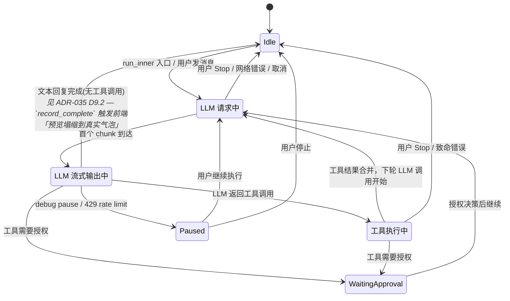
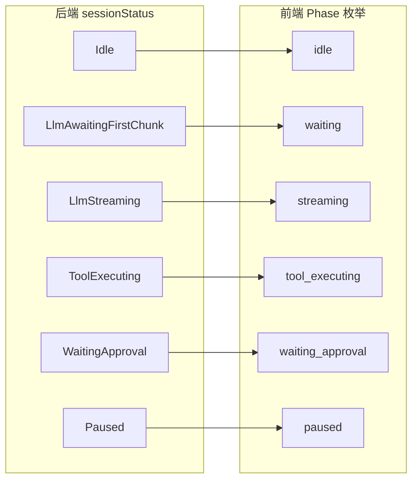
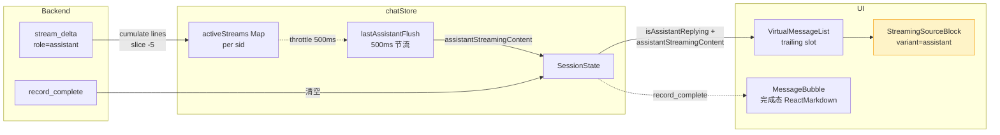

# ADR-049：Session 状态细化 — 从粗粒度 `Streaming` 到 6 变体业务状态机

**状态**：提案
**日期**：2026-07-15
**决策者**：大鱼
**前置**：
- ADR-014（Session 状态由 Runtime 持有，前端只读 — `SessionStateChanged` 事件）
- ADR-021（Session 数据加载统一 — HTTP Pull + 通知机制）
- ADR-035（MQTT 流式传输重构 — `activeStream` 缓冲 + `stream_delta` 推送），尤其 D9.2『StreamingSourceBlock `<pre>` DOM 复用模式』
- ADR-043（Session 配置与运行时状态拆分 — `SessionState` 协议结构）

**影响范围**：
- `core/acowork-runtime/src/agent/session_state.rs` — `SessionStatus` enum 定义
- `core/acowork-runtime/src/agent/` 6 个 loop 模块 — 状态迁移点
- `core/acowork-runtime/src/providers/reliable.rs` — 429 重试后恢复状态
- `core/acowork-core/src/protocol.rs` — `SessionStatusDto` 结构体
- `apps/acowork-desktop/src/lib/types.ts` — 前端 `SessionStatus` 类型 + `StreamLine`/`ActiveStream`
- `apps/acowork-desktop/src/stores/chatStore.ts` — 状态推导逻辑 + `assistantStreamingContent` 节流推送
- `apps/acowork-desktop/src/components/chat/ChatPanel.tsx` — 指示器渲染逻辑
- `apps/acowork-desktop/src/components/chat/SessionPanel.tsx` — Tab 栏状态
- `apps/acowork-desktop/src/components/chat/StreamingSourceBlock.tsx` — 通用流式预览组件（variant=thought|assistant）
- `apps/acowork-desktop/src/components/chat/ThinkBlock.tsx` — 简化为 StreamingSourceBlock 薄包装
- `apps/acowork-desktop/src/components/chat/VirtualMessageList.tsx` — Replying slot 渲染 StreamingSourceBlock
- `apps/acowork-desktop/src/components/chat/blockLayout.ts` — `REPLYING_INDICATOR_HEIGHT` 高度估算

---

## 决策摘要

**将 `SessionStatus::Streaming` 拆分为 3 个语义明确的子状态**，让前端能直接从后端状态机判断当前阶段，去掉前端"根据数据参数组合状态"的复杂推导逻辑。

### 变更概览

**后端**：4 变体 → 6 变体
```
Idle | Streaming | WaitingApproval | Paused
    ↓
Idle | LlmAwaitingFirstChunk | LlmStreaming | ToolExecuting | WaitingApproval | Paused
```

**前端**：删除 3 个合成布尔变量（`isAssistantReplying`、`isThinking`、`showInterStepProcessing`），`sending` 从 4 项组合推导简化为 `sessionStatus` 直接映射。

---

## 背景与动机

### 1. 当前 `Streaming` 是一个语义黑洞

`SessionStatus::Streaming` 自 ADR-014 以来承担了 LLM 请求生命周期中所有"非静默"阶段：

- **TTFT 阶段**（LLM HTTP 请求已发出，等待首个 token，可能耗时 10-30s）
- **流式输出阶段**（LLM 正在产出可见 token）
- **工具执行阶段**（LLM 返回了工具调用，工具正在执行）

这些阶段对用户而言感知完全不同——"等待回复"、"正在生成回复"、"正在执行工具"——但后端的 `SessionStatus` 无法区分它们。

### 2. 前端被迫用"组合推导"补救

因为后端状态信息不足，`ChatPanel.tsx` 中用 7 个布尔变量从 3 个独立数据源交叉推导当前状态：

| 推导变量 | 来源 | 逻辑 |
|---------|------|------|
| `sending` | `sessionStatus` | `status === "streaming" \|\| "waiting_approval" \|\| "paused"` |
| `isAssistantReplying` | `activeStreams` 行数 | 累积行数 > 3 才亮；< 3 不亮（阈值 `ASSISTANT_REPLYING_LINE_THRESHOLD`） |
| `isThinking` | `stream_delta` 的 `role` | 收到 `role === "thought"` 时边缘触发 |
| `showWorkingItemAfterUser` | `messages[]` 末尾扫描 | 遍历最后一条消息判断类型 |
| `showInterStepProcessing` | 4 项布尔组合 | `sending && !canShowWorkingItemAfterUser && !showReplyingItem && !showCompactingItem` |
| `showReplyingItem` | `isAssistantReplying` | 行数阈值 > 3 |
| `showWorkingItem` | 上面两项 OR | `showWorkingItemAfterUser \|\| showInterStepProcessing` |

这导致：
- **`isAssistantReplying` 延迟 3 行才亮**：因为判断条件是 `activeStreams.lineCount > 3`，用户看到"正在回复"指示器有 3 行的视觉延迟
- **`isThinking` 是边缘触发而非状态驱动**：从 `stream_delta` 事件的数据参数推断，而非状态机
- **`showInterStepProcessing` 是 4 项布尔运算**：脆弱且隐含时间窗口依赖
- **Tab 栏的 `isStreaming` 与 `ChatPanel` 的 `sending` 逻辑不一致**：Tab 栏只检查 `status === "streaming"`，ChatPanel 还包含 `waiting_approval` 和 `paused`，造成不同步

### 3. 传输层已经支持自由扩展

`mqtt_payload.proto:370-382` 的 `SessionState.status` 字段是 `string` 类型，实际传输的是 `SessionStatus` 的 JSON 序列化字符串（`serde_json::to_string`）。扩展现有 enum 变体**不需要修改 proto 定义**。

---

## 决策：6 变体业务状态机

### 新枚举定义

```rust
/// Lifecycle status of a session, managed by Runtime as the source of truth.
///
/// ADR-014: The Runtime owns session status; the frontend is read-only.
/// ADR-049: `Streaming` is split into three semantic sub-states so the
/// frontend can derive processing phase directly from session status
/// without composing from data parameters.
#[derive(Debug, Clone, PartialEq, Eq, serde::Serialize)]
#[serde(rename_all = "snake_case", tag = "status", content = "detail")]
pub enum SessionStatus {
    /// Session is idle — no LLM call in progress.
    #[default]
    Idle,

    /// LLM HTTP request has been sent; waiting for the first content chunk
    /// (TTFT phase — TCP/TLS/HTTP-headers/SSE-first-chunk, can take 10-30s).
    LlmAwaitingFirstChunk,

    /// LLM is actively streaming content. The first chunk has arrived.
    /// `message_id` matches the streaming message, if available.
    LlmStreaming {
        message_id: Option<String>,
    },

    /// Tool calls have been dispatched to the tool registry; waiting for
    /// their results. This covers both parallel tool execution and
    /// special tools (ask_user_question, todo_write).
    ToolExecuting,

    /// A tool requires user approval before execution.
    WaitingApproval {
        request_id: String,
    },

    /// Iteration limit reached, debug pause, or 429 retry wait —
    /// awaiting user decision.
    Paused {
        iteration: Option<u32>,
        max_iterations: Option<u32>,
        /// 429 retry wait info. `None` for non-retry pauses.
        #[serde(skip_serializing_if = "Option::is_none")]
        retry_info: Option<RetryPauseInfo>,
    },
}
```

### 状态机迁移图



### 状态迁移点全清单

| 文件 | 行(约) | 当前 | 改为 |
|------|--------|------|------|
| `loop_.rs` (run_inner 入口) | 653 | `Idle → Streaming` | `Idle → LlmAwaitingFirstChunk` |
| `loop_llm.rs` (首个 chunk 后) | ~99 | 无 transition | `LlmAwaitingFirstChunk → LlmStreaming` |
| `loop_tools.rs` (dispatch_and_merge 入口) | 977 | 无 transition | `LlmStreaming → ToolExecuting` |
| `loop_approval.rs` (授权后继续) | 432 | `WaitingApproval → Streaming` | `WaitingApproval → LlmAwaitingFirstChunk` |
| `loop_interaction.rs` (交互后继续) | 97 | `→ Streaming` | `→ LlmAwaitingFirstChunk` |
| `loop_.rs` (Paused→继续, 6 处) | 871/892/1019/1031/1140/1290/1294 | `Paused → Streaming` | `Paused → LlmAwaitingFirstChunk` |
| `loop_.rs` (中断→Idle, 5 处) | 882/901/932/1043/1152/1165/1174/1195/1201/1299 | `→ Idle` | `→ Idle` (不变) |
| `reliable.rs` (emit_streaming_resume) | 235 | `Streaming` | `LlmAwaitingFirstChunk` |
| `session_core.rs` (测试断言) | 1062-1095 | `matches!(Streaming)` | `matches!(LlmAwaitingFirstChunk)` |

### 协议 DTO 同步

`core/acowork-core/src/protocol.rs:1402-1414` 的 `SessionStatusDto` 必须与运行时 enum 保持 1:1 映射，因为 Gateway 在 HTTP 拉取 `GET /api/agents/{id}/sessions/{sid}/state` 时使用此结构体反序列化：

```rust
pub enum SessionStatusDto {
    Idle,
    LlmAwaitingFirstChunk,
    LlmStreaming { message_id: Option<String> },
    ToolExecuting,
    WaitingApproval { request_id: String },
    Paused { iteration: Option<u32>, max_iterations: Option<u32>, retry_info: Option<RetryPauseInfo> },
}
```

---

## 前端简化方案

### 核心原则

**前端不再从数据参数组合状态**。所有阶段信息由 `sessionStatus` 单一来源提供，`activeStream` 缓冲仅保留渲染维度的内容数据。

### Phase 映射



### 前端删除的变量

| 删除变量 | 替代方案 | 说明 |
|---------|---------|------|
| `isAssistantReplying` | **保留为安全阀状态**而非 UI 判据 | ADR-049 初版提议删除，但实际业务里需要它的行数 / messageId 状态来：(1) 防止 `record_complete` 丢失时 `activeStream` 无界增长（C2 安全阀）；(2) 探测 `stream_delta` 中 `messageId` 变化以重置 duration timer；(3) 驱动 `assistantStreamingStartTime` 的边缘触发字段推送 |
| `isThinking` | `phase === "streaming"` + `thinkingContent` 非空 | 状态信息由后端提供，`thinkingContent` 仅作为渲染数据保留 |
| `showInterStepProcessing` | `phase === "waiting" \|\| phase === "tool_executing"` | 直接由后端状态判断，无需组合布尔运算 |
| `showWorkingItemAfterUser` | `phase !== "idle" && lastMsgIsUser` | 简化判断，不再遍历消息列表扫描 |
| `showReplyingItem` | `phase === "streaming" && assistantStreamingContent !== ""` | 不再被 `isAssistantReplying` 行数阈值 3 阻塞；前置条件是『后端已进入 `LlmStreaming` 且首个 chunk 已积累』。这解决了原版的『用户看到"正在回复"指示器有 3 行视觉延迟』问题 |

### 前端保留的变量

| 保留变量 | 来源 | 说明 |
|---------|------|------|
| `thinkingContent` | `stream_delta` (role=thought) | 渲染数据，非状态信息 |
| `thinkingStartTime` | `stream_delta` (role=thought) | 渲染数据，非状态信息 |
| `assistantStreamingContent` | `stream_delta` (role=assistant) | 渲染数据，非状态信息；用于 trailing virtual item 的 live preview（见下一子节） |
| `assistantStreamingStartTime` | `stream_delta` 首个 chunk for new messageId | 渲染数据；与 `thinkingStartTime` 字段对称，仅供 `StreamingSourceBlock variant="assistant"` 的 duration timer 使用 |
| `CompactingStarted`/`CompactingEnded` | ChunkEvent | 独立事件，与本状态机正交 |

### 前端新类型定义

```typescript
// apps/acowork-desktop/src/lib/types.ts

/** ADR-049: Backend session lifecycle status — read-only, single source of truth. */
export type SessionStatus =
  | { status: "idle" }
  | { status: "llm_awaiting_first_chunk" }
  | { status: "llm_streaming"; detail?: { message_id: string | null } }
  | { status: "tool_executing" }
  | { status: "waiting_approval"; detail: { request_id: string } }
  | { status: "paused"; detail?: { iteration: number | null; max_iterations: number | null; retry_info?: { wait_ms: number; attempt: number; max_attempts: number; provider: string } } };

/** ADR-049: Frontend processing phase — derived directly from sessionStatus. */
export type ProcessingPhase =
  | "idle"              // 静默，不显示任何指示器
  | "waiting"           // LlmAwaitingFirstChunk → "正在等待 LLM 回复..."
  | "streaming"         // LlmStreaming → "正在生成回复..."
  | "tool_executing"    // ToolExecuting → "正在执行工具..."
  | "waiting_approval"  // WaitingApproval → "等待授权..."
  | "paused"            // Paused → "已暂停，点击继续"

/** Extract processing phase from session status. Single-source-of-truth mapping. */
export function getProcessingPhase(s: SessionStatus | undefined | null): ProcessingPhase {
  if (!s) return "idle";
  switch (s.status) {
    case "idle": return "idle";
    case "llm_awaiting_first_chunk": return "waiting";
    case "llm_streaming": return "streaming";
    case "tool_executing": return "tool_executing";
    case "waiting_approval": return "waiting_approval";
    case "paused": return "paused";
  }
}

/** Check if the session is actively processing (non-idle). Replaces isSessionActive. */
export function isProcessing(s: SessionStatus | undefined | null): boolean {
  return getProcessingPhase(s) !== "idle";
}
```

### Frontend assistant live preview（实施期补遗）

> **后置补遗（2026-07-29）**：ADR-049 初版在前端简化方案中把"assistant streaming" 仅描述为"指示器占位 slot 显示一个小圆点 + Replying 文本"。 实际实施中发现该指示器没有任何 live 内容，用户在 LLM 生成整篇回复期间只能看到静态标签，而 `record_complete` 触发 HTTP refresh 后整篇 `ReactMarkdown` 一次性渲染带来显著内存尖峰（详见 memory profile）。
>
> 同时 ADR-035 D9.2 已经定义 `StreamingSourceBlock` 用 `<pre>` 直接 `textContent` 复用模式作为 `role=thought` 的内存友好流式渲染。但 assistant 侧没有同等机制，导致两个流式数据源的处理路径不对称。
>
> **本次修订**：
> 1. `chatStore` 在 `stream_delta (role=assistant)` 中镜像 thought 的累积+节流模式，节流 500ms 推 `assistantStreamingContent` 到 Zustand
> 2. `VirtualMessageList` 的 trailing "replying slot" 改为渲染 `<StreamingSourceBlock variant="assistant">`，DOM 复用同 `thought` 分支
> 3. assistant 完成态仍走 `StreamMarkdown → ReactMarkdown` 渲染，**保留** markdown 格式（标题/列表/代码块/Mermaid）

#### 数据流图



#### 节流策略

与 `thinkingContent` 完全对称——`lastAssistantFlush: Map<sid, number>` + 500ms 节流，叠加 `isPinnedToBottom` 守卫（用户滚到上方时不推送，避免无谓的 Zustand 写入和重渲染）。

#### DOM 复用机制

`StreamingSourceBlock` 在挂载时创建一个 `<pre>` DOM 节点；mount-to-unmount 期间不销毁。`useEffect([content])` 内直接写 `preRef.current.textContent = 新内容`——React 不参与文本内容管理，没有 AST、没有元素树、没有 reconciliation。

#### 完成态切换

`record_complete` 触发：
1. `isAssistantReplying = false` → `showReplyingItem = false` → VirtualMessageList `virtualCount` 减 1 → 指示器 slot 消失
2. `assistantStreamingContent = ''` 清空（防止 session-id 重用时遗留）
3. HTTP refresh 拉回完整 content
4. 同一消息号（`messageId`）的消息气泡挂载，走 `StreamMarkdown → ReactMarkdown` 渲染

slot 的塌缩是无跳变（layout-stable），因为 slot 高度（`REPLYING_INDICATOR_HEIGHT = 178px`，5 行 × 1.5rem + header + padding）和真实气泡首屏高度在同一量级，ResizeObserver 立刻校正。

#### 与 ADR-035 D9.2 的对称性

| 维度 | thought | assistant |
|------|---------|-----------|
| 缓冲结构 | `activeStreams.lines (cap 5)` | 同上（新增 assistant 分支） |
| 节流 | 500ms / sid | 同上（独立 Map `lastAssistantFlush`） |
| Zustand 字段 | `thinkingContent` | `assistantStreamingContent` |
| 起始时间字段 | `thinkingStartTime` | `assistantStreamingStartTime` |
| 渲染组件 | `StreamingSourceBlock variant="thought"` | `StreamingSourceBlock variant="assistant"` |
| 内容上限 | 5 行 | 5 行 |
| 完成态清理路径 | `record_complete` → 清空 `thinkingContent` | `record_complete` → 清空 `assistantStreamingContent` |
| 完成态渲染 | ThinkBlock（同样 `<pre>`） | MessageBubble → StreamMarkdown → ReactMarkdown（保留 markdown） |

两个流走的代码路径完全对称（只差 label/icon）；区别仅在完成态——thought 完成态仍用 `<pre>`（无可视化格式需求），assistant 完成态用 ReactMarkdown（需要 markdown 渲染）。

### 渲染逻辑简化

**当前 `ChatPanel.tsx` 中的渲染逻辑**（简化后）：

```
phase = getProcessingPhase(sessionStatus)
working = phase !== "idle"
canShowWorkingItemAfterUser = working && lastMessageIsUser
showInterStepProcessing = working && !canShowWorkingItemAfterUser && !showReplyingItem && !showCompactingItem
showReplyingItem = phase === "streaming" && assistantStreamingContent !== ""
   // 不再用 isAssistantReplying 行数阈值 3，解决 "3 行视觉延迟" 问题
showWorkingItem = showWorkingItemAfterUser || showInterStepProcessing

tabIsActive = working
showInitialWaiting = phase === "waiting" && lastMessageIsUser
showInterStepWaiting = phase === "waiting" && !lastMessageIsUser
showToolExecuting = phase === "tool_executing"
showApproval = phase === "waiting_approval"
showPaused = phase === "paused"
```

### Tab 栏状态

当前 `SessionPanel.tsx:131-137` 的 `isStreaming` 判断：

```typescript
const isStreaming = sessionState?.sessionStatus?.status === "streaming"
  || sessionState?.sessionStatus?.status === "waiting_approval"
```

改为：

```typescript
const isActive = isProcessing(sessionState?.sessionStatus);
```

---

## 实施步骤

### Commit 1：后端 enum 定义 + 迁移点

**文件**：`session_state.rs`，`loop_.rs`，`loop_llm.rs`，`loop_tools.rs`，`loop_approval.rs`，`loop_interaction.rs`，`reliable.rs`，`session_core.rs`，`observer_impl.rs`

变更：
1. 替换 `SessionStatus` 的 `Streaming` 变体为 `LlmAwaitingFirstChunk | LlmStreaming | ToolExecuting`
2. 更新所有 8 处 `transition_status(Streaming)` 写入点
3. 新增 `loop_llm.rs` 中首个 chunk 到达后的 `LlmAwaitingFirstChunk → LlmStreaming` 迁移
4. 新增 `loop_tools.rs` 中 `dispatch_and_merge_tools` 入口的 `ToolExecuting` 迁移
5. 更新 `SessionStatus::is_active()` 方法
6. 更新 `session_core.rs` 中的测试断言

### Commit 2：协议 DTO 同步

**文件**：`core/acowork-core/src/protocol.rs`

变更：将 `SessionStatusDto` 与新的 enum 定义同步。

### Commit 3：前端类型 + store 简化

**文件**：`lib/types.ts`，`chatStore.ts`

变更：
1. 更新 `SessionStatus` TypeScript 类型
2. 添加 `ProcessingPhase` 类型和 `getProcessingPhase()` 函数
3. 删除 `isAssistantReplying` 状态推导（在 `stream_delta` handler 中）
4. `isThinking` 从 store 状态字段降级为局部派生变量
5. `session_state_changed` handler 不再需要 `isAssistantReplying = false` 清理

### Commit 4：前端渲染逻辑简化

**文件**：`ChatPanel.tsx`，`SessionPanel.tsx`，`VirtualMessageList.tsx`

变更：
1. `sending` 改为 `getProcessingPhase(sessionStatus) !== "idle"`
2. `showWorkingItemAfterUser` / `showInterStepProcessing` / `showReplyingItem` 逻辑简化
3. Tab 栏 `isStreaming` 改为 `isProcessing()`
4. 废除 `isAssistantReplying` 相关的行数阈值常量

### Commit 5：ADR 文档 + Frontend assistant live preview 实施

**文件**：`docs/adr/zh/ADR-049-session-status-substates.md`，`StreamingSourceBlock.tsx`（新增），`ThinkBlock.tsx`，`chatStore.ts`，`VirtualMessageList.tsx`，`ChatPanel.tsx`，`blockLayout.ts`

变更（2026-07-29 后置更新）：
1. 抽出通用 `StreamingSourceBlock` 组件（variant="thought"|"assistant"），`<pre>` DOM 复用模式作为默认渲染
2. `ThinkBlock` 简化为 `StreamingSourceBlock variant="thought"` 的薄包装
3. `chatStore` 新增 `assistantStreamingContent` + `assistantStreamingStartTime` 字段、`lastAssistantFlush` 节流 Map、`stream_delta (role=assistant)` 分支的 accumulator + 边缘触发 startTime 推送
4. `record_complete` 清空 `assistantStreamingContent` + `assistantStreamingStartTime`
5. VirtualMessageList 的 trailing replying slot 改为 `<StreamingSourceBlock variant="assistant">`，移除旧的「pulse-dot + Replying 文本」纯状态指示器
6. `REPLYING_INDICATOR_HEIGHT` 从 26 → 178（容纳 5 行 pre + header）
7. ADR-049 前置章节补充 ADR-035 D9.2 交叉引用；删除变量表修正（`isAssistantReplying` 保留为安全阀而非 UI 判据）；新增强调『Frontend assistant live preview』子节

---

## 不做事项

- **不动 compaction 状态**：`CompactingStarted/CompactingEnded` 是独立事件，与 session 状态机正交
- **不动 `Paused` 内部细节**：`iteration`/`max_iterations`/`retry_info` 已足够
- **不动 `WaitingApproval` 内部细节**：`request_id` 已足够
- **不动 MQTT wire schema**：`SessionState.status` 是 `string`，扩展无需修改 proto 定义
- **不动 `activeStream` 中 role=thought 的截断规则**（5 行限制）：thought 的 buffer 行为完全保留
- **新增 assistant 侧的 `lines (cap 5)`**：仅作为 live preview 用，与 thought 的代码路径完全对称（同样的 `slice(-5)`、同样的 500ms 节流、同样的 `useEffect → textContent` 写入），不引入额外的 trim/buffer 策略
- **不动 assistant 完成态渲染**：assistant 完成态仍走 `StreamMarkdown → ReactMarkdown`，保留标题/列表/代码块/Mermaid 等格式
- **不引入新的 i18n 文案**：新状态对应的中文文案在后续前端 PR 中添加

---

## 迁移风险

- **后端 emit 点遗漏**：通过 `grep -n 'SessionStatus::Streaming'` 锁定全清单，共 8 处写入点 + 2 处测试断言 + 2 处注释引用，无遗漏风险
- **前端 `processingPhase` 映射遗漏**：`getProcessingPhase()` 函数使用 `switch` 穷举（TypeScript 编译器检查），加新变体时编译器会提示未处理的 case

---

## 附录 A：前端当前状态推导全路径

### A.1 `ChatPanel.tsx` 中的 `sending` 推导

```
sessionStatus (来自 MQTT `session_state_changed` 事件)
  ↓
sending = sessionStatus.status === "streaming"
       || sessionStatus.status === "waiting_approval"
       || sessionStatus.status === "paused"
```

### A.2 `chatStore.ts` 中的 `isAssistantReplying` 与 `assistantStreamingContent` 推导（2026-07-29 修订）

```
stream_delta (MQTT `messages/stream_delta`)
  ↓
lines = data.lines[]
role = lines[0].role === 'assistant' ? 'assistant' : 'thought'
  ↓
if role === 'assistant':
  ├─ 边缘触发: new messageId → as.startTime = Date.now()
  ├─ 边缘触发: assistantStreamingStartTime 推到 Zustand
  ├─ as.lineCount += lines.length  (驱动 C2 安全阀 ASSISTANT_LINE_SAFETY_CAP, 不再驱动 UI 阈值)
  ├─ as.lines.push(...); if (as.lines.length > 5) slice(-5)  (live preview 上限)
  ├─ 边缘触发: shouldBeReplying = (lineCount > ASSISTANT_REPLYING_LINE_THRESHOLD)
  │              → 推到 Zustand (isAssistantReplying)
  └─ 节流 500ms + isPinnedToBottom 守卫:
       content = as.lines.map(l => l.content).join('\n')
       if (content !== cur.assistantStreamingContent):
         推到 Zustand (assistantStreamingContent)
         lastAssistantFlush.set(sid, now)
```

**注意**：行数阈值 `ASSISTANT_REPLYING_LINE_THRESHOLD` (3) 在本次修订后**仅保留**用于：(a) `isAssistantReplying` 边缘翻转的兼容触发（仍驱动 Tab 栏活跃状态 / 一些列外的逻辑）；(b) **`isAssistantReplying` 仍是安全的 DOM 提示灯**——它现在不再用作『`showReplyingItem` 是否亮』的判据（`showReplyingItem` 改为 `phase === "streaming" && assistantStreamingContent !== ""`），因此阈值的 UX 副作用被完全消除了：用户不再经历 3 行才能看到内容预览的视觉延迟。

`assistantStreamingContent` 是新增字段，**不是 `isAssistantReplying` 的派生量**——它直接来自 activeStream 的 `lines (cap 5)`，绕过行数阈值，front-end 可以从首个 chunk 起就显示 live preview。

### A.3 `chatStore.ts` 中的 `isThinking` 推导

```
stream_delta (MQTT)
  ↓
role = lines[0].role === 'assistant' ? 'assistant' : 'thought'
  ↓
if role === 'thought' && !thoughtState.isThinking:
  isThinking = true
  thinkingStartTime = Date.now()
```

### A.4 `ChatPanel.tsx` 中的 `showWorkingItemAfterUser` 推导

```
messages[] (来自 HTTP GET /messages)
  ↓
for (i = messages.length-1; i >= 0; i--):
  msg = messages[i]
  if msg.role === 'user':
    return true  // 最后一条是用户消息 → 正在等待回复
  if msg.role in ('assistant', 'thought', 'tool_call', 'tool_result', 'error'):
    return false  // 已有回复 → 不显示初始等待指示器
return false
```

### A.5 `ChatPanel.tsx` 中的 `showInterStepProcessing` 推导

```
sending = true
&& !canShowWorkingItemAfterUser  // 最后一条不是用户消息
&& !showReplyingItem             // 行数 < 3，还没亮"正在回复"
&& !showCompactingItem           // 不在 compaction 中
```

---

## 附录 B：ADR-014 状态机原文引用

ADR-014 中定义的 Session 状态原则：

1. **Runtime 是 session 状态的唯一写者**（Single Writer）
2. **前端是只读消费者**（Read-Only Consumer）
3. **每次状态变更都通过 `SessionStateChanged` 事件推送**（Event-Driven）
4. **前端不做乐观写**（No Optimistic Writes）

ADR-049 延续这四条原则，只改变"状态粒度"，不改变"状态权属"。