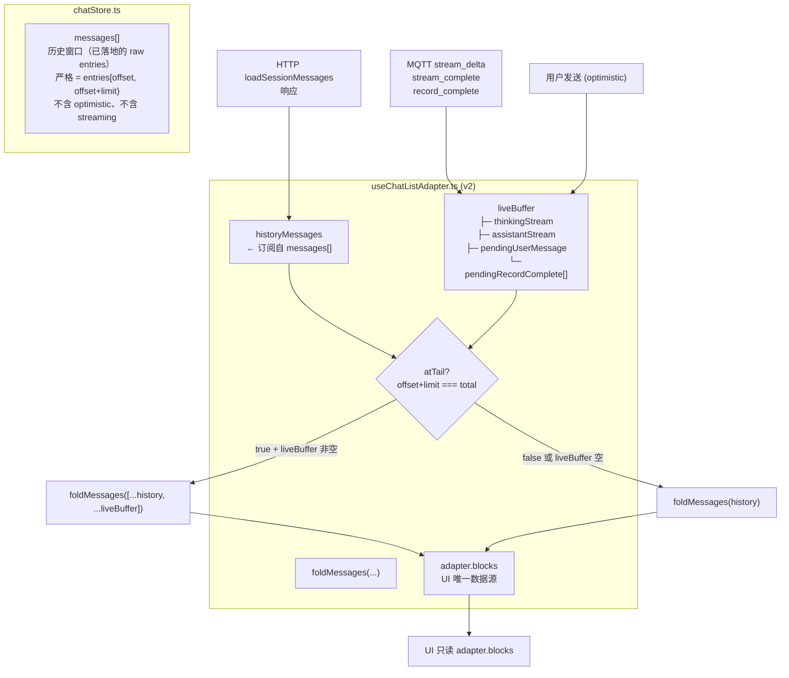
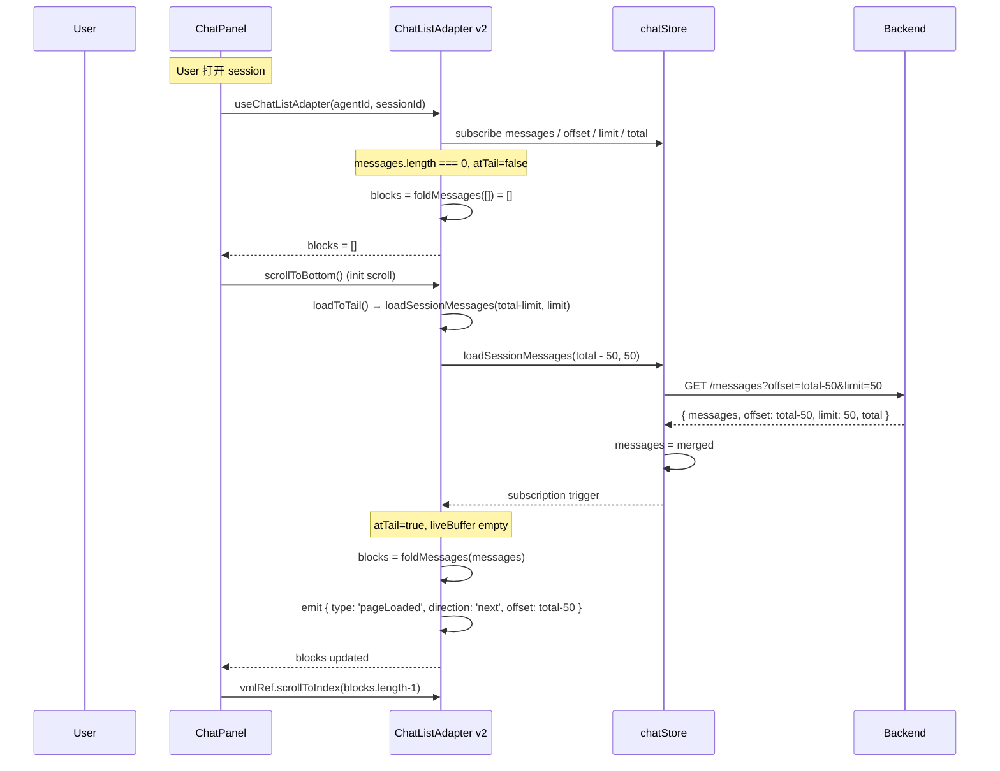
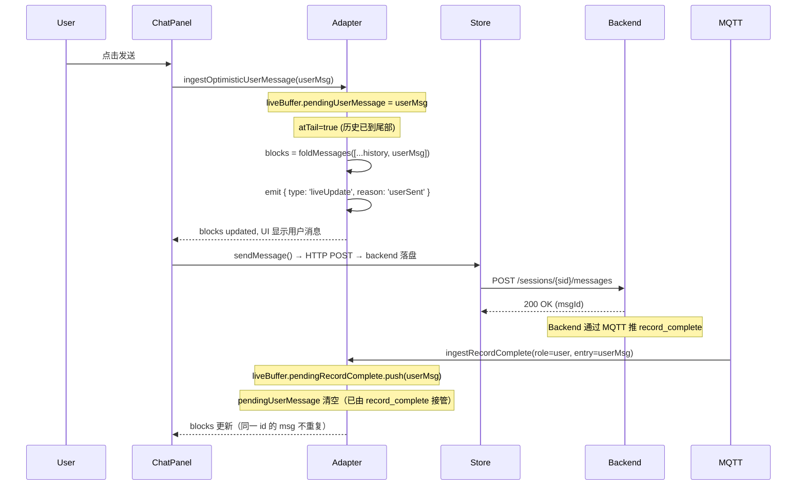
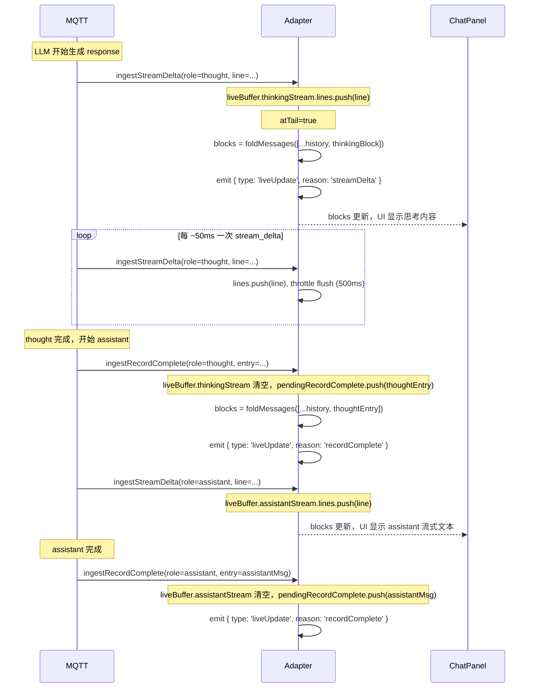
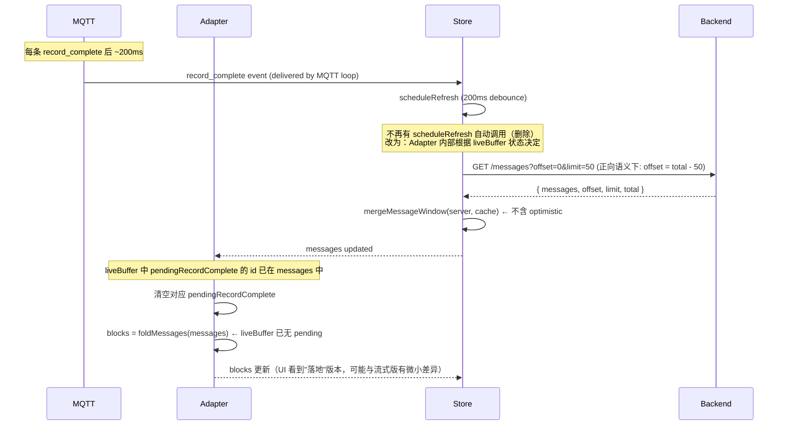
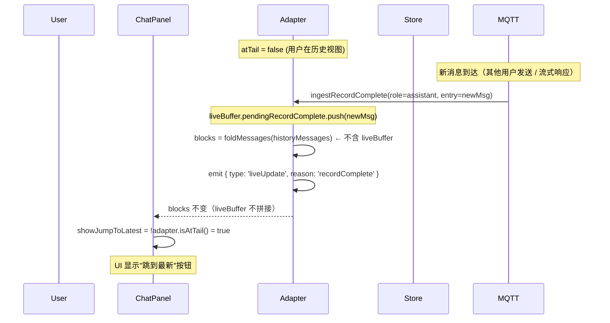
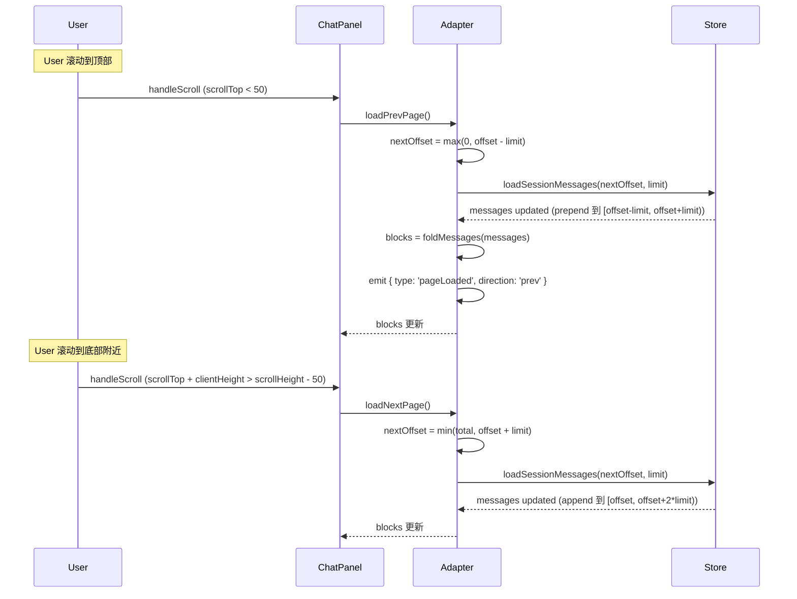
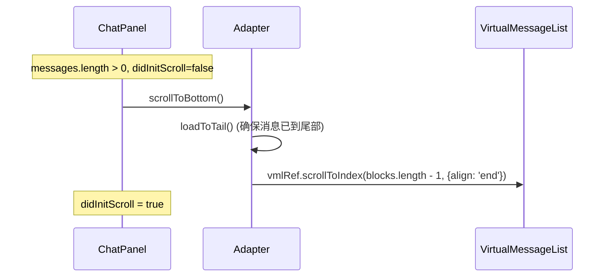

# ADR-050：Chat 列表数据驱动重构 — UI 与数据彻底解耦

**状态**：草案
**日期**：2026-08-01
**决策者**：大鱼
**前置**：
- [ADR-021](./ADR-021-unified-session-data-loading.md)（统一 Session 数据加载 - HTTP Pull + MQTT 通知）
- [ADR-035](./ADR-035-mqtt-streaming-push-refactor.md)（流式传输重构 - MQTT 数据直推 + per-session 行缓冲）
- [ADR-038](./ADR-038-session-lifecycle-explicit-model.md)（Session 生命周期显式化模型）
- [ADR-041](./ADR-041-chat-list-adapter.md)（Chat 列表 Adapter 抽象层）

---

## 1. 决策摘要

当前聊天消息列表架构（ADR-041 实现版）虽然已经把分页、锚定、sticky-bottom 收敛到 `useChatListAdapter` 内，但**仍残留两类根本性耦合**：

1. **后端分页语义反人类**：`offset=0` 表示"最新端"，`offset=N` 表示"从最新跳过 N 条"。前端 `messageOffset` 镜像这一语义，`hasOlder / hasNewer` 的判断方向、page 计算、scroll-to-bottom 的 offset=0 反直觉，与"页码从前往后"的常识相反。
2. **实时数据与历史数据混在同一管道**：流式 chunk、`optimisticEntries`、`assistantStreamingContent`、`thinkingContent`、`isAssistantReplying` 等"实时"信号和"已落地到磁盘"的历史数据共用 `messages[]` 数组 + 派生 flags + `StreamingSourceBlock`，UI 必须知道"哪条是流式"、"哪条是历史"、"哪些是临时 buffer"，并维护 `isPinnedToBottom` / `showScrollToTop` / `showScrollToBottom` / `virtualCount` 等十余个 UI-only 状态才能正确渲染。

本 ADR 引入 **数据驱动 ChatListAdapter v2**，把架构压缩到三件事：

```
加载数据 → 渲染 UI → 计算 UI → 加载数据
```

**五条核心设计**：

1. **正向索引（前后端统一）**：message offset 从 0 开始递增，`offset=0` 是第一条（最旧），`offset=total-1` 是最新一条；后端 `read_messages_paginated`、前端 `chatStore.messageOffset`、HTTP API `GetMessagesQuery.offset` 全部改为正向语义。
2. **实时 / 历史严格分离**：`chatStore.messages[]` 永远只表示已落地的历史窗口 `[offset, offset+limit)`；MQTT 实时事件（`stream_delta` / `record_complete` / 用户乐观发送）由 Adapter 内部 `liveBuffer` 吸收；**仅当** `messages[]` 已加载到尾部（`offset+limit === total`）时 Adapter 才把 `liveBuffer` 拼接到 `messageBlocks`（拼接后的实时 block 标记 `isLive: true`，供 VML 用 `StreamingSourceBlock` 渲染），否则 UI 永远只看到历史数据。
3. **scrollController 事件驱动化**：`useScrollController` 不再维护任何数据状态（移除 state machine、`pinnedToBottom`、prepend 检测、scrollHeight delta、scroll-arrow 显示）；它只做事件订阅 + UI 指令分发：订阅 Adapter 的 `liveUpdate` 事件、向 VML 发出 `scrollToTop / scrollToBottom / scrollToPosition` 命令。
4. **UI 原子化**：移除 UI 中所有与"底部/顶部状态机"相关的派生状态（`isPinnedToBottom`、`showScrollToTop/Bottom` 不再由 scroll-position 派生、`virtualCount` 不再算 extras），但**保留**：
   - `scrollToTop` / `scrollToBottom` 两个按钮（功能不删，只是可见性改为由 `adapter.isAtTail()` / `adapter.messageOffset > 0` 派生）
   - `StreamingSourceBlock`（实时数据的渲染特性不能丢：流式 block 作为 `adapter.blocks` 的子集输出，由 VML 用 `StreamingSourceBlock` 渲染；adapter 通过 liveUpdate 事件通知 controller 仅在 streaming block 处于视口时触发刷新）
   UI 只暴露 **5 个交互原语**：`scrollToTop` / `scrollToBottom` / `scrollToPosition(offset)` / `loadNextPage` / `loadPrevPage`，其中 `scrollToPosition` 使用**数据 block 索引**（不是像素）。
5. **Adapter 即数据契约**：Adapter 是 `messageBlocks` 的唯一生产者、实时数据的唯一吸收者、UI 交互的唯一入口；UI 只读 `adapter.blocks`、只调 `adapter.scrollToXxx / adapter.loadXxxPage`、只订阅 `adapter.subscribe(cb)` 事件；不知道"流式"、"optimistic"、"history" 的存在。

**预期收益**：

| 维度 | 收益 |
|------|------|
| 语义 | `offset=0` 是最旧，符合直觉；`hasOlder = offset > 0`，`hasNewer = offset+limit < total`，无方向反转 |
| 代码量 | `useScrollController.ts` 从 782 行收敛到 ~150 行；ChatPanel 删除 ~300 行 UI-only 状态计算；`StreamingSourceBlock.tsx`（198 行）**保留并简化**，仅负责按 `messageBlock.isLive` 派生的实时内容渲染 |
| Bug 面 | 移除 "scroll-up gets yanked back"、"翻不到底就停了"、"流式时上翻导致消息被驱逐"、"optimistic 消息重复" 这一整类由混管历史/实时引发的 bug |
| 可测性 | Adapter 是纯数据派生（`foldMessages(history + liveBuffer)` + 内部 ref 管理），单测可覆盖所有边界 |
| 可扩展性 | 未来加入"消息撤回"、"消息编辑"等场景只需在 Adapter 内扩展 `liveBuffer` 形状，UI 无感知 |

---

## 2. 背景与现状

### 2.1 ADR-041 后的真实架构

ADR-041 把分页、锚定、ensure-renderable 收敛到了 `useChatListAdapter`，但**遗留三类问题**：

```
┌────────────────────────────────────────────────────────────────────┐
│ ChatPanel (2458 行)                                                 │
│ ├─ 计算 virtualCount = messageBlocks.length + extras               │
│ │   ├─ showReplyingItem = isAssistantReplying                      │
│ │   ├─ showCompactingItem = isCompacting                           │
│ │   └─ showInterStepProcessing (派生自 sending + 消息最后一条类型)  │
│ ├─ 计算 messageBlocks = adapter.blocks                              │
│ ├─ useScrollController (782 行) — 状态机                            │
│ │   ├─ stateRef: "pinned-bottom" | "idle" | "loading-older" | ... │
│ │   ├─ prevScrollHeightRef / prevFirstMsgIdRef / prevVirtualCountRef│
│ │   ├─ didInitScrollRef / ensureRenderableCountRef / preLoadStateRef│
│ │   └─ showScrollToBottom / showScrollToTop（UI flags）→ 改为      │
│ │      由 adapter 派生（isAtTail / messageOffset > 0），不再依赖   │
│ │      DOM scroll position                                              │
│ └─ 传 20+ props 给 VML                                              │
│    ├─ isThinking / thinkingContent / thinkingStartTime              │
│    ├─ assistantStreamingContent / assistantStreamingStartTime      │
│    └─ virtualCount / showCompactingItem / showReplyingItem         │
└────────────────────────────────────────────────────────────────────┘
                              ↓
┌────────────────────────────────────────────────────────────────────┐
│ VirtualMessageList (696 行)                                          │
│ ├─ useVirtualizer (@tanstack/react-virtual)                         │
│ ├─ StreamingSourceBlock（198 行，保留）— 仅当 messageBlock.isLive    │
│ │   时渲染实时内容（流式预览 / 思考预览），由 controller 通过         │
│ │   onStreamingBlockUpdate 回调触发刷新                              │
│ └─ scroll handler / ResizeObserver / recordMeasuredHeight          │
└────────────────────────────────────────────────────────────────────┘
                              ↓
┌────────────────────────────────────────────────────────────────────┐
│ useChatListAdapter (256 行)                                          │
│ └─ blocks / hasOlder / hasNewer / isLoading                         │
│    / loadBefore / loadAfter / jumpToLatest / jumpToOldest           │
│    / messageOffset / messageLimit / messageTotal / jumpTarget       │
└────────────────────────────────────────────────────────────────────┘
                              ↓
┌────────────────────────────────────────────────────────────────────┐
│ chatStore.ts (3279 行)                                               │
│ ├─ messages[] = mergeMessageWindow(server, cache, optimistic)       │
│ ├─ optimisticEntries[] (用户未确认的乐观消息)                         │
│ ├─ isAssistantReplying / isThinking / thinkingContent               │
│ ├─ assistantStreamingContent / assistantStreamingStartTime          │
│ ├─ activeStreams Map (模块级流跟踪)                                   │
│ ├─ isPinnedToBottom (UI scroll-position 状态)                       │
│ └─ scheduleRefresh — record_complete 后延迟 200ms 自动 HTTP 刷新    │
└────────────────────────────────────────────────────────────────────┘
                              ↓
┌────────────────────────────────────────────────────────────────────┐
│ 后端 conversation.rs read_messages_paginated(path, offset, limit)   │
│ ├─ offset=0  → 最新 limit 条  (反人类：offset=0 表示"末尾")          │
│ ├─ offset=N  → 从最新跳过 N 条                                     │
│ └─ end_idx = total - offset; start_idx = end_idx - limit            │
└────────────────────────────────────────────────────────────────────┘
```

### 2.2 已确认的设计漏洞（ADR-041 未根治）

| # | 漏洞 | 根因 | 影响 |
|---|------|------|------|
| **P0-A** | 后端 offset 反向语义 | `read_messages_paginated` 中 `end_idx = total - offset` | 前端 `hasOlder = messageOffset + messageLimit < messageTotal`（正向），与"offset 越大越旧"混在一起，所有翻页计算方向都要反转一次 |
| **P0-B** | 实时数据进入 `messages[]` | `mergeMessageWindow(server, cache, optimistic)` 把用户未确认消息写入 `messages[]`；`stream_delta` 通过 activeStreams → record_complete → `loadSessionMessages(0, 50)` 重新拉取整窗口 | 流式时 `messages[]` 既包含磁盘上已落地的历史，又包含尚未确认的"未来"消息；前后端任何一方对消息顺序的假设都不一致 |
| **P0-C** | `isPinnedToBottom` 是 UI 状态却由 store 持有 | `chatStore.sessionStates[id].isPinnedToBottom` | UI scroll 位置被序列化到 store；store 的变更触发跨组件 re-render；scrollController 和 store 互相修改这个值形成循环依赖 |
| **P1-D** | UI 维护十余个"流式/底部"派生 flag | `virtualCount = blocks + showReplyingItem + showCompactingItem + showInterStepProcessing` | UI 必须知道"哪条是流式"、"哪些是占位"才能正确渲染；新增"流式 variant"必须改 virtualCount 计算 |
| **P1-E** | scrollController 维护数据状态 | state machine、prevScrollHeightRef、prevFirstMsgIdRef、ensureRenderableCountRef | scrollController 同时承担"scroll 位置追踪"+"数据加载触发"+"UI 按钮可见性"，任何一个职责的 bug 都会污染其他职责 |

### 2.3 架构根因

ADR-041 治标不治本：

- 把 `blockId` 稳定化、锚定收敛到 Adapter、eviction 方向化 → 解决了 4 个具体 bug
- 但**没有重新审视"历史数据"和"实时数据"是否应该共用同一条管道**——这是 P0-B / P0-C 的根源

Android 的 RecyclerView + Adapter 模式之所以强大，是因为 Adapter 严格区分"已提交的数据"（mItems）和"待提交的数据"（mPendingNotifications），View 永远只读 `mItems`，永远不知道有 `mPendingNotifications` 这回事。本 ADR 把这一原则引入前端：Adapter 严格区分 `historyMessages`（已落地的历史窗口）和 `liveBuffer`（MQTT 实时事件），`messageBlocks` 仅在 `offset+limit === total` 时合并两者。

### 2.4 不替换虚拟化引擎

与 ADR-041 一致，本 ADR **不替换** `@tanstack/react-virtual`。理由：

1. 漏洞全在数据加载和"历史/实时"分类层，不在虚拟化引擎层。
2. 当前代码有大量 WKWebView/Tauri 特定 workaround（同步 `scrollTop` 赋值、`NotAllowedError` 捕获、双重 ResizeObserver 测量），替换引擎风险不可控。
3. `react-virtuoso` / `virtua` 等替代方案在 WKWebView 环境下未经验证。

`useVirtualizer` 配置不变；Adapter 在此之上提供"加载数据 → messageBlocks → 渲染"的纯数据契约。

---

## 3. 核心设计：数据驱动的 ChatListAdapter v2

### 3.1 设计原则

| 原则 | 含义 | 对应措施 |
|------|------|---------|
| **单一数据源** | `adapter.blocks` 是 UI 唯一读取的数据；任何"实时 / 流式 / 历史"分类都由 Adapter 内部吸收 | UI 不接收 `isThinking` / `assistantStreamingContent` 等 props |
| **数据驱动** | 所有 UI 行为（滚动锚定、按钮可见性、是否跟随新消息）由"数据是什么"决定，不由"用户在哪儿"决定 | `adapter.scrollToPosition(offset)` 用数据 offset 而非像素 |
| **事件透明** | 实时数据更新 = Adapter 内部事件，UI 通过订阅接收；UI 不区分"这是 MQTT 还是 HTTP" | `adapter.subscribe(cb)` 返回 unsubscribe；cb 收到 `{type: 'liveUpdate' \| 'pageLoaded' \| ...}` |
| **原子操作** | UI 交互只有 5 个原语：`scrollToTop / scrollToBottom / scrollToPosition / loadNextPage / loadPrevPage`；其他都是它们的组合 | 移除 `jumpToLatest / jumpToOldest / loadBefore / loadAfter / ensureLatestInCache` 等概念名 |
| **历史窗口纯净化** | `chatStore.messages[]` 永远 = 已落地到磁盘的 raw entries（在 `[offset, offset+limit)` 范围内），不含任何"未来"消息 | `mergeMessageWindow` 移除 optimistic 合并路径；`optimisticEntries` 字段删除 |

---

### 3.2 设计 1：正向索引（前后端统一）

#### 3.2.1 语义定义

```
offset = 0          → 第一条（最旧）的消息
offset = N          → 跳过前 N 条，从第 N 条开始
offset = total - 1  → 最新一条

[start, end)        → 窗口 = entries[start, end)   (start ≥ 0, end ≤ total)
                      长度 = end - start
```

#### 3.2.2 后端改造点

**`core/acowork-runtime/src/conversation.rs::read_messages_paginated`**

```rust
// BEFORE (反人类)
let end_idx = total - offset;
let start_idx = end_idx.saturating_sub(limit as u64);
let messages = entries[start_idx as usize..end_idx as usize].to_vec();

// AFTER (正向)
let start_idx = offset.min(total);
let end_idx = (offset + limit as u64).min(total);
let messages = entries[start_idx as usize..end_idx as usize].to_vec();
```

**HTTP API（`http/server.rs::GetMessagesQuery`）**

```rust
// BEFORE: offset from the newest end
/// Offset from the newest end, in raw entries (one JSONL line each).
/// 0 = latest raw entries.
#[serde(default)]
offset: Option<u64>,

// AFTER: offset from the oldest end
/// Offset from the oldest end, in raw entries (one JSONL line each).
/// 0 = first (oldest) raw entry.  See PaginatedMessages for the contract.
#[serde(default)]
offset: Option<u64>,
```

**Gateway 反向代理**（`core/acowork-gateway/src/http/proxy.rs::proxy_get_messages`）— 不变（透传 `offset` / `limit`）。

#### 3.2.3 前端改造点

**`chatStore.sessionStates[id]` 分页坐标**

```typescript
// BEFORE (反人类, offset=0 表示"已加载到末尾")
messageOffset: number;   // 0 = latest end
messageLimit: number;
messageTotal: number;

// AFTER (正向)
messageOffset: number;   // 0 = oldest end
messageLimit: number;
messageTotal: number;
```

**`hasOlder` / `hasNewer` 派生（Adapter 内部）**

```typescript
// BEFORE (方向反转)
hasOlder = messageOffset + messageLimit < messageTotal && messageLimit > 0;
hasNewer = messageOffset > 0;

// AFTER (直觉化)
hasOlder = messageOffset > 0;                  // 还能往前翻（更旧）
hasNewer = messageOffset + messageLimit < messageTotal;  // 还能往后翻（更新）
```

**`loadNextPage` / `loadPrevPage` 计算（UI 原语）**

```typescript
// UI 调用 loadNextPage() → 加载下一页（向最新方向）
const nextOffset = messageOffset + messageLimit;

// UI 调用 loadPrevPage() → 加载上一页（向最旧方向）
const prevOffset = Math.max(0, messageOffset - messageLimit);
```

**`ensureLatestInCache` 重命名 + 语义对齐**

```typescript
// BEFORE: ensureLatestInCache → loadSessionMessages(0, 50)  (offset=0=最新，反直觉)
// AFTER:  jumpToTail() → loadSessionMessages(total - limit, limit)
//
// 保留函数名 ensureLatestInCache 兼容旧调用方，但内部改为正向语义。
```

#### 3.2.4 影响范围

| 文件 | 改动 |
|------|------|
| `core/acowork-runtime/src/conversation.rs` | `read_messages_paginated` 数学公式反转；行内注释更新 |
| `core/acowork-runtime/src/http/server.rs` | `GetMessagesQuery.offset` 文档注释更新；`PaginatedMessages.offset` 语义对齐 |
| `core/acowork-gateway/src/http/proxy.rs` | 不变（透传） |
| `apps/acowork-desktop/src/stores/chatStore.ts` | `mergeMessageWindow` 公式不变（已基于返回 offset 推导）；cursor 数学保留但语义改为正向 |
| `apps/acowork-desktop/src/components/chat/useChatListAdapter.ts` | `hasOlder` / `hasNewer` 公式反转；`loadBefore / loadAfter` 重命名为 `loadPrevPage / loadNextPage` |
| `apps/acowork-desktop/src/components/chat/useScrollController.ts` | 翻页触发逻辑（`getFirstVisibleBlockIndex() === 0` → `loadPrevPage`）适配新语义 |

**反向兼容**：HTTP API 的 `offset` 参数从"反向"变为"正向"是不兼容变更。考虑到 Desktop 是唯一调用方，不引入额外迁移成本；CI 集成测试统一在 C1 重写。

---

### 3.3 设计 2：实时 / 历史严格分离

#### 3.3.1 数据流图



#### 3.3.2 Adapter 内部状态机

```
                    ┌──────────────────┐
        初始加载    │  loadSession    │  ← 任意时点可触发
        ─────────→ │  Messages(offset)│
                    └────────┬─────────┘
                             │
                  messages 更新（订阅触发 re-render）
                             ↓
                    ┌──────────────────┐
                    │  historyMessages │ ← 纯历史窗口
                    │  liveBuffer      │ ← 实时累积（独立轨道）
                    └────────┬─────────┘
                             │
              atTail? ───────────────┐
                │                    │
              false                true
                ↓                    ↓
       blocks = foldMessages(  blocks = foldMessages(
         historyMessages          historyMessages ++ liveBuffer
       )                         )
                ↓                    ↓
                    ┌──────────────────┐
                    │   adapter.blocks  │ ← UI 唯一数据源
                    └──────────────────┘
```

#### 3.3.3 liveBuffer 的内容与生命周期

| liveBuffer 字段 | 来源 | 清理时机 |
|-----------------|------|---------|
| `thinkingStream` | MQTT `stream_delta` (role=thought) | MQTT `record_complete` (role=thought) → 清空该字段；或用户切 session |
| `assistantStream` | MQTT `stream_delta` (role=assistant) | MQTT `record_complete` (role=assistant) → 移入 `pendingRecordComplete`；或用户切 session |
| `pendingUserMessage` | 用户发送（chatStore `sendMessage` 立刻创建） | HTTP `loadSessionMessages` 响应包含同 id → 删除该字段 |
| `pendingRecordComplete[]` | MQTT `record_complete` (role=user/assistant/thought) | HTTP `loadSessionMessages` 响应包含同 id → 删除 |

#### 3.3.4 Adapter → UI 事件契约

```typescript
type AdapterEvent =
  | { type: 'liveUpdate'; reason: 'streamDelta' | 'recordComplete' | 'userSent' }
  // 触发时机: liveBuffer 内容变化（不一定是 atTail）
  // UI 响应: 不直接 re-render blocks（blocks 已通过 React subscription 自动更新）；
  //          仅用于通知"有新数据到达"，UI 可选择性展示"跳到最新"提示
  | { type: 'pageLoaded'; direction: 'prev' | 'next' }
  // 触发时机: loadPrevPage / loadNextPage HTTP 响应已合并
  | { type: 'flushAvailable'; pendingCount: number }
  // 触发时机: liveBuffer 累积 ≥ 1 条 pendingRecordComplete / pendingUserMessage，
  //          且 atTail 已为 true（说明历史窗口已触及最新）
  // UI 响应: 可触发"跳到最新"动作或自动 flush 到历史窗口
```

**关键不变量**：

- `liveBuffer` 是 Adapter 内部状态，对 UI 不可见；UI 只能通过事件知道"有新东西"。
- 当且仅当 `atTail` 时，UI 看到的 `blocks` 包含 liveBuffer；否则 UI 看到的 `blocks` 只有历史。
- UI 永远不需要判断"用户在底部 / 在顶部"——adapter 的 `blocks` 直接反映"我能看到什么"。

---

### 3.4 设计 3：scrollController 事件驱动化

#### 3.4.1 现状 vs 新设计

| 职责 | 现状 | 新设计 |
|------|------|--------|
| scroll position 追踪 | `stateRef: "pinned-bottom" \| "idle" \| ...` + `wasAtBottomRef` | **删除**：scrollController 不读 DOM 位置 |
| preload detection | `prevScrollHeightRef` + `prevFirstMsgIdRef` + `scrollHeight delta` | **删除**：scrollController 不检测 prepend |
| sticky-bottom auto-follow | `useLayoutEffect([virtualCount])` + `stateRef.current === "pinned-bottom"` 判断后 `scrollToBottom()` | **删除**：scrollController 不主动 follow |
| 按钮可见性 | `showScrollToBottom = distFromBottom > 120`、`showScrollToTop = scrollTop > clientHeight` | **改**：由 adapter 派生——`showJumpToLatest = !isAtTail() \|\| hasPendingFlush()`；`showJumpToOldest = messageOffset > 0 \|\| firstBlockInViewport`（两个按钮功能均保留） |
| 翻页触发 | `setInterval(150ms)` + `getFirstVisibleBlockIndex() === 0` → `loadBefore` | **保留**：但调 `loadPrevPage` / `loadNextPage` |
| init scroll | `useLayoutEffect([virtualCount])` 调 `vmlRef.scrollToBottom()` 或 `container.scrollTop = offset` | **改**：scrollController 调 `adapter.scrollToPosition(offset)`，由 Adapter 通过 `pendingScrollTarget` 协调 |
| jump-to-top / jump-to-bottom | `jumpToTop()` / `jumpToBottom()` 调 `adapter.jumpToOldest` / `adapter.jumpToLatest` | **改**：scrollController 调 `adapter.loadPrevPage` 到 `offset=0` 后 `scrollToTop()` / 调 `adapter.loadNextPage` 到 `offset+limit=total` 后 `scrollToBottom()` |

#### 3.4.2 新 scrollController 接口

```typescript
interface ScrollController {
  /** 当 adapter 事件触发时回调。UI 在此决定按钮可见性。 */
  onLiveUpdate?: (event: AdapterEvent) => void;
  /** 当 adapter 检测到 streaming block 在视口内时回调，VML 据此刷新
   *  StreamingSourceBlock 的实时内容。
   *
   *  - 不维护任何 state；每次回调都基于当前 DOM 实时查询
   *  - 若 streaming block 已离开视口，controller 不调用本回调
   *  - 不影响 scrollTop，浏览器自然行为即满足"用户滚到哪里显示哪里" */
  onStreamingBlockUpdate?: () => void;
  /** 用户点击 "跳到最新" 按钮时调用 */
  jumpToLatest: () => Promise<void>;
  /** 用户点击 "跳到最旧" 按钮时调用 */
  jumpToOldest: () => Promise<void>;
  /** 订阅 adapter 事件 */
  teardown: () => void;
}
```

**scrollController 内部**：

```typescript
// 只剩三段逻辑，全部为事件驱动 + 命令转发，不维护任何 ref / state：

// 1. 订阅 adapter.subscribe(event => ...)
//    - event.type === 'liveUpdate' 时：
//        a) 实时查询 streaming block 是否在视口（vmlRef.current?.isStreamingBlockInViewport()）
//           若在视口 → 调 onStreamingBlockUpdate?.() 让 VML 刷新 StreamingSourceBlock
//           若不在视口 → 跳过，避免离屏渲染浪费
//        b) 调 onLiveUpdate?.(event) 让 UI 派生按钮可见性
//    - event.type === 'pageLoaded' 时：调 onLiveUpdate?.(event)（按钮可见性可能需要更新）
//    - event.type === 'flushAvailable' 时：调 onLiveUpdate?.(event)

// 2. 实现 jumpToLatest / jumpToOldest：
//    jumpToLatest: await adapter.scrollToBottom()  (内部封装 loadToTail + vml.scrollToBottom)
//    jumpToOldest: await adapter.scrollToTop()    (内部封装 loadToHead + vml.scrollToTop)

// 3. 翻页触发：保留 setInterval(150ms) 检查 DOM scrollTop（仍是唯一允许读 DOM 的层）
//    - scrollTop < EDGE_THRESHOLD_PX → adapter.loadPrevPage()
//    - scrollTop + clientHeight > scrollHeight - EDGE_THRESHOLD_PX → adapter.loadNextPage()
//    不维护 isLoadingMore / prevCount 等 state，每次实时从 DOM 读 + adapter.isLoading 判定
```

预期代码量：**~150 行**（从 782 行压缩）。

**关键不变量**：

- controller **不维护** scroll position state（不存 wasAtBottomRef、不存 prevCount）
- controller **不维护** "是否应该滚动" 决策——`scrollToTop / scrollToBottom` 是命令，不是自动行为
- controller **不维护** streaming 内容 buffer——adapter.blocks 已经把 streaming block 视为普通 messageBlock
- controller **唯一职责**：事件分发（adapter → UI）+ 翻页触发（DOM 读 → adapter）+ 视口检测（DOM 读 → onStreamingBlockUpdate）

#### 3.4.3 两个按钮的可见性（"跳到最新" + "跳到最旧"）

**新设计**：按钮可见性**不由 scroll 位置**决定，而是由**Adapter 数据状态**决定：

```typescript
// ChatPanel.tsx 派生（极简）
const isAtTail = adapter.isAtTail();
const isAtHead = adapter.messageOffset === 0 && firstBlockInViewport; // 需 vmlRef 查询
const hasPending = adapter.hasPendingFlush();

// "跳到最新"按钮：用户不在最新位置 → 显示
const showJumpToLatest = !isAtTail || hasPending;

// "跳到最旧"按钮：用户不在最旧位置 → 显示
const showJumpToOldest = !isAtHead;

const handleJumpToLatest = () => scrollController.jumpToLatest();
const handleJumpToOldest = () => scrollController.jumpToOldest();
```

**逻辑**：

**"跳到最新"按钮（`ChevronsDown`）**：

- `!isAtTail()`：历史窗口还没加载到尾部 → 用户在历史视图 → 显示按钮（让他看到新消息）
- `isAtTail() && hasPendingFlush()`：历史窗口已到尾部，但 liveBuffer 有未 flush 的数据 → 显示按钮（让用户主动 flush 或直接 jump）
- 其他情况：用户已在最新 + liveBuffer 已 flush → 不显示按钮

**"跳到最旧"按钮（`ChevronsUp`）**：

- `messageOffset > 0`：历史窗口还没加载到最旧 → 用户不在最旧位置 → 显示按钮
- `messageOffset === 0 && firstBlockInViewport`：已经在最旧位置 → 不显示按钮
- 其他情况：用户已加载到最旧但还没滚到顶 → 显示按钮

**scrollController 不参与**：按钮可见性是 ChatPanel 的纯派生，scrollController 不再读 `distFromBottom` / `scrollTop`。

**关于"流式期间自动滚到底部"**：

- 用户明确要求"用户滚到哪里显示哪里"
- 浏览器默认行为即满足此需求：
  - 流式 block 在 `adapter.blocks` 末尾追加 → DOM 末尾追加 → scrollHeight 增加
  - 用户原本在底部 → scrollTop 不变 → scrollHeight 变大后用户仍在底部（自然跟随）
  - 用户原本在中间 → scrollTop 不变 → 用户位置不变（看到下方新增内容）
  - 用户原本在顶部 → scrollTop 不变 → 用户位置不变
- **无需任何 scroll 调整逻辑**；不强制自动滚到底部，也不阻止浏览器自然行为
- 用户接受"做不到（指 scrollHeight delta 抖动）可以先放弃"——即不做任何额外补偿

#### 3.4.4 UI 不再关心 scroll 位置的额外收益

| 移除的状态/逻辑 | 替代方案 |
|----------------|---------|
| `isPinnedToBottom` (chatStore 全局) | 删。`scheduleRefresh` 等所有依赖此状态的逻辑全部删除 |
| `state machine` (5 个状态) | 删。无替代——Adapter 自己协调 |
| `prevScrollHeightRef` / `prevFirstMsgIdRef` | 删。prepend 后 scrollTop 调整改由 Adapter 的 `pendingScrollTarget` 内部处理（传入 anchor msg id） |
| `ensureRenderableCountRef` + `MAX_ENSURE_RENDERABLE_PAGES` | 删。Viewport 填充由 `loadPrevPage / loadNextPage` 取代（v2 Adapter 仍保留 `onLayout`，但逻辑极简） |
| `showScrollToBottom / showScrollToTop` (UI flags) | **保留两个按钮**，但可见性改为由 `adapter.isAtTail()` / `adapter.messageOffset === 0` 派生（不再依赖 `distFromBottom` / `scrollTop`） |
| `getDistanceFromBottom()` helper | 删（仅在 sticky-bottom auto-follow 需要；现在不需要） |
| `PIN_THRESHOLD_PX / EDGE_THRESHOLD_PX` 常量 | 保留 `EDGE_THRESHOLD_PX` 用于翻页触发；`PIN_THRESHOLD_PX` 删（无 sticky-bottom 阈值） |
| `wasAtBottomRef` (防御性 check) | 删 |
| sticky-bottom auto-follow useLayoutEffect | 删。**用户滚到哪里显示哪里**，无自动 follow；浏览器自然行为已满足"在底部→继续在底部" |
| `getFirstVisibleBlockIndex / getLastVisibleBlockIndex` (VML handle) | 保留作为翻页触发与 streaming block 视口检测的内部查询接口；新增 `isStreamingBlockInViewport()` 用于 controller 检测 streaming block 是否需要刷新 |

---

### 3.5 设计 4：UI 原子化

#### 3.5.1 ChatPanel 的 props 计算收敛

```typescript
// BEFORE: ChatPanel 计算 virtualCount + 派生十余个 flag
const virtualCount = messageBlocks.length + extraItems; // extraItems = showReplyingItem + showCompactingItem
const showReplyingItem = isAssistantReplying;
const showCompactingItem = isCompacting;
const showInterStepProcessing = sending && !canShowWorkingItemAfterUser && !showReplyingItem && !showCompactingItem;
const showWorkingItem = showWorkingItemAfterUser || showInterStepProcessing;

// AFTER: ChatPanel 只读 adapter + 两个按钮可见性（不再有 virtualCount extras 派生）
const showJumpToLatest = !adapter.isAtTail() || adapter.hasPendingFlush();
const showJumpToOldest = !isAtHead;  // 派生自 adapter.messageOffset > 0 && firstBlockInViewport

// VML 渲染：直接遍历 adapter.blocks，isLive === true 的 block 用 StreamingSourceBlock 渲染
// virtualCount = adapter.totalBlocks（不再 + extras）
```

#### 3.5.2 VirtualMessageList props 收敛

```typescript
// BEFORE: 接收 20+ props，包括流式相关
interface VirtualMessageListProps {
  adapter: ChatListAdapter;
  messageBlocks: MessageBlock[];
  virtualCount: number;
  showCompactingItem: boolean;
  showReplyingItem: boolean;
  sending: boolean;
  pendingApproval: ...;
  currentSessionId: string | null;
  toolProgress?: ...;
  isThinking: boolean;                    // ← 保留（用于 StreamingSourceBlock 渲染思考状态）
  thinkingContent: string;                 // ← 保留（实时思考预览内容）
  thinkingStartTime: number | null;        // ← 保留（思考计时器）
  assistantStreamingContent: string;       // ← 保留（实时 assistant 流式预览内容）
  assistantStreamingStartTime: number | null; // ← 保留（流式计时器）
  // ... 其他 props 保留
}

// AFTER: 流式相关 props 仍保留，但语义变化
//  - 不再是"是否在流式"的 flag，而是"实时内容数据"
//  - 由 adapter 在 liveBuffer 中维护，通过 props 传给 StreamingSourceBlock
//  - adapter.blocks 仍包含 streaming block（isLive: true），VML 用 StreamingSourceBlock 渲染
interface VirtualMessageListProps {
  adapter: ChatListAdapter;
  // 流式相关 props 保留，供 StreamingSourceBlock 渲染
  // 但 ChatPanel 不再基于 sending/isThinking 派生 virtualCount
  isThinking: boolean;
  thinkingContent: string;
  thinkingStartTime: number | null;
  assistantStreamingContent: string;
  assistantStreamingStartTime: number | null;
  // 其他 UI chrome props 保留（pendingApproval / toolProgress / userDisplayName 等）
}
```

**关键变化**：

- `isThinking` / `assistantStreamingContent` 等不再用于 virtualCount 计算、不再用于 "working indicator" 派生
- 仅用于 `StreamingSourceBlock` 内部的实时内容渲染（trailing preview、计时器等）
- 渲染入口：VML 在 `adapter.blocks` 中遇到 `block.isLive === true` 的 block 时使用 `StreamingSourceBlock` 组件渲染
- controller 通过 `onStreamingBlockUpdate` 回调触发 streaming block 的刷新（仅在视口内）

#### 3.5.3 移除 / 保留组件

| 组件 / hook | 状态 | 原因 |
|------------|------|------|
| `StreamingSourceBlock.tsx`（198 行） | **保留并简化** | 实时数据的渲染特性不能丢：流式 block 作为 `adapter.blocks` 的子集输出（atTail 时），`block.isLive === true` 时 VML 用 StreamingSourceBlock 渲染。controller 通过 `onStreamingBlockUpdate` 回调触发 StreamingSourceBlock 刷新（仅在视口内）。StreamingSourceBlock 内部仍消费 `isThinking` / `assistantStreamingContent` / `thinkingContent` 等流式数据 props |
| `useStreamingContent.ts`（如果存在） | **保留** | 同上，StreamingSourceBlock 依赖的 hook |
| `WorkingIndicator` / `InterStepProcessing` 派生 | 简化 | 这些是"sending + 流式"组合的特殊 slot；改为：当 streaming block 在视口内且 `hasPendingFlush()`，StreamingSourceBlock 自身渲染提示 |
| `useSessionScope.ts` 中的 anchor 字段 | 删 | ADR-041 已删；本 ADR 进一步确认不需要 scope |
| `pinnedToBottomRef` | 删 | scrollController 不再读 scroll 位置 |
| `showCompactingItem` / `showReplyingItem` | 删 | 不再是 virtualCount 的计算因子；改为 session header 单独显示 |

#### 3.5.4 UI 交互原语最终定义

```typescript
// VirtualMessageList 暴露给 scrollController 的命令式 handle
interface VirtualMessageListHandle {
  scrollToTop(): void;                                  // 滚到第一个 MessageBlock
  scrollToBottom(): void;                               // 滚到最后一个 MessageBlock
  scrollToPosition(blockIndex: number): void;           // 滚到指定 block 索引（数据位置）
  getFirstVisibleBlockIndex(): number | null;            // 翻页触发与 scrollToOldest 按钮可见性查询
  getLastVisibleBlockIndex(): number | null;             // 翻页触发查询
  isStreamingBlockInViewport(): boolean;                 // controller 检测 streaming block 是否需要刷新
  refreshStreamingBlock(): void;                        // controller 触发 StreamingSourceBlock 刷新（仅在视口内时调）
}

// ChatListAdapter v2 暴露给 UI 的交互接口
interface ChatListAdapter {
  // 数据输出
  readonly blocks: MessageBlock[];
  readonly totalBlocks: number;
  readonly isAtTail: () => boolean;
  readonly hasPendingFlush: () => boolean;

  // 翻页（数据驱动）
  loadPrevPage(): Promise<void>;   // 加载更旧（offset -= limit），无 anchor
  loadNextPage(): Promise<void>;   // 加载更新（offset += limit），无 anchor

  // 跳转（数据驱动）
  scrollToTop(): Promise<void>;          // 等价 loadToHead() + vml.scrollToTop()
  scrollToBottom(): Promise<void>;       // 等价 loadToTail() + vml.scrollToBottom()
  scrollToPosition(blockIndex: number): Promise<void>;  // 滚到第 N 个 block（数据位置）

  // 事件订阅
  subscribe(cb: (event: AdapterEvent) => void): () => void;
}
```

**scrollToPosition 使用数据位置**：`scrollToPosition(0)` = 第一个 block；`scrollToPosition(blocks.length - 1)` = 最后一个 block；不再使用像素 / scrollTop。

**VML 渲染路径**：

```typescript
// VirtualMessageList.tsx 渲染逻辑（简化）
function VirtualMessageList({ adapter, ...streamingProps }) {
  return adapter.blocks.map((block, i) => {
    if (block.isLive) {
      // 来自 liveBuffer 的实时数据块，用 StreamingSourceBlock 渲染
      return <StreamingSourceBlock
        key={block.blockId}
        block={block}
        isThinking={streamingProps.isThinking}
        thinkingContent={streamingProps.thinkingContent}
        // ... 其他流式 props
      />;
    }
    // 普通历史 block
    return block.type === 'explore_group'
      ? <ExploreBlock key={block.blockId} block={block} />
      : <MessageBubble key={block.blockId} block={block} />;
  });
}
```

**controller 触发 StreamingSourceBlock 刷新的流程**：

```typescript
// useScrollController.ts（简化版）
function useScrollController(adapter, vmlRef, onLiveUpdate, onStreamingBlockUpdate) {
  // 1. 翻页触发：保留 setInterval(150ms)
  useEffect(() => {
    const interval = setInterval(() => {
      const container = containerRef.current;
      if (!container || adapter.isLoading) return;
      const distFromTop = container.scrollTop;
      const distFromBottom = container.scrollHeight - container.scrollTop - container.clientHeight;
      if (distFromTop < EDGE_THRESHOLD_PX && adapter.hasOlder) {
        void adapter.loadPrevPage();
      } else if (distFromBottom < EDGE_THRESHOLD_PX && adapter.hasNewer) {
        void adapter.loadNextPage();
      }
    }, TIMER_INTERVAL_MS);
    return () => clearInterval(interval);
  }, [containerRef, adapter]);

  // 2. 事件订阅：liveUpdate → 检测 streaming block 视口 → 触发刷新
  useEffect(() => {
    return adapter.subscribe((event) => {
      onLiveUpdate?.(event);
      if (event.type === 'liveUpdate') {
        // 不维护任何 state；每次实时查询 DOM
        if (vmlRef.current?.isStreamingBlockInViewport?.()) {
          onStreamingBlockUpdate?.();
        }
      }
    });
  }, [adapter, onLiveUpdate, onStreamingBlockUpdate]);

  // 3. 跳转命令
  const jumpToLatest = useCallback(() => adapter.scrollToBottom(), [adapter]);
  const jumpToOldest = useCallback(() => adapter.scrollToTop(), [adapter]);

  return { jumpToLatest, jumpToOldest };
}
```

#### 3.5.5 简化的渲染循环

```
┌──────────────────────────────────────────────────────┐
│ UI 渲染循环（伪代码）                                  │
│                                                       │
│   // 数据渲染：                                       │
│   adapter.blocks → React render                       │
│     (其中 isLive === true 的 block 用                 │
│      StreamingSourceBlock 渲染)                       │
│                                                       │
│   // 按钮可见性：                                     │
│   showJumpToLatest = !adapter.isAtTail()              │
│                      || adapter.hasPendingFlush()     │
│   showJumpToOldest  = !isAtHead (derived)             │
│                                                       │
│   // controller 订阅：                                │
│   scrollController.onLiveUpdate = (event) => {        │
│     // 根据 event 更新按钮可见性                       │
│   }                                                   │
│   scrollController.onStreamingBlockUpdate = () => {   │
│     // controller 已判断 streaming block 在视口内     │
│     // VML 据此强制刷新 StreamingSourceBlock           │
│     // （不影响 scrollTop，浏览器自然处理）            │
│   }                                                   │
│                                                       │
│   // 按钮点击：                                       │
│   onClickJumpToLatest = () => scrollController.jumpToLatest()  │
│   onClickJumpToOldest  = () => scrollController.jumpToOldest()  │
└──────────────────────────────────────────────────────┘
```

**核心**：

1. 渲染只读 `adapter.blocks`，遇到 `isLive` block 时 VML 用 `StreamingSourceBlock` 渲染
2. 订阅 adapter 事件，按需更新按钮可见性
3. 点击按钮调 `scrollController.jumpToLatest()`，后者调 `adapter.scrollToBottom()` → 自动 `loadToTail()` + `vml.scrollToBottom()`
4. 数据变化（liveBuffer 合并 / 翻页响应）由 React subscription 自动触发 re-render
5. **streaming block 刷新**：controller 监听 `liveUpdate` 事件，每次事件触发时实时查询 DOM 判断 streaming block 是否在视口 → 仅在视口内回调 `onStreamingBlockUpdate` 让 VML 刷新 StreamingSourceBlock
6. **"用户滚到哪里显示哪里"**：streaming block 追加新内容 → 浏览器 scrollHeight 自然扩展 → scrollTop 不变 → 用户保持原位；本身在底部则仍在底部---

## 4. ChatListAdapter v2 接口

### 4.1 完整接口定义

```typescript
/**
 * ChatListAdapter v2 — 数据驱动的消息列表契约。
 *
 * 设计原则：
 *  - UI 唯一数据源 = adapter.blocks
 *  - UI 唯一交互入口 = adapter.loadPrevPage/loadNextPage/scrollToXxx
 *  - UI 唯一事件源 = adapter.subscribe
 *  - 实时 / 历史 / 流式 / sticky-bottom 等概念对 UI 不可见
 */

export interface ChatListAdapter {
  // ── 数据输出 ──────────────────────────────────────
  /**
   * 折叠后的 MessageBlock[]，用于渲染。
   *
   * 内容来源:
   *   - 历史窗口: chatStore.messages[]（始终在 [offset, offset+limit) 范围内）
   *   - 实时 buffer（仅当 atTail 时拼接）: thinkingStream / assistantStream /
   *     pendingUserMessage / pendingRecordComplete
   *
   * 顺序: 时间戳升序（与 messageFolder 一致）。
   *
   * 实时数据块标记: 若 block 来自 liveBuffer，则 `block.isLive === true`，
   * VML 用 StreamingSourceBlock 渲染而非普通 MessageBubble/ExploreBlock。
   */
  readonly blocks: readonly MessageBlock[];

  /** blocks.length 的稳定 getter（避免每次访问重新计算） */
  readonly totalBlocks: number;

  /** 当前 session 的原始分页坐标（用于翻页计算与诊断） */
  readonly messageOffset: number;
  readonly messageLimit: number;
  readonly messageTotal: number;

  // ── 状态查询 ──────────────────────────────────────
  /** 历史窗口是否已加载到尾部（offset+limit === total） */
  readonly isAtTail: () => boolean;

  /** liveBuffer 中是否有未 flush 的数据 */
  readonly hasPendingFlush: () => boolean;

  /** 是否有更旧的页面可加载（offset > 0） */
  readonly hasOlder: boolean;

  /** 是否有更新的页面可加载（offset + limit < total） */
  readonly hasNewer: boolean;

  /** 当前是否正在执行 HTTP 加载 */
  readonly isLoading: boolean;

  // ── 翻页原语 ──────────────────────────────────────
  /**
   * 加载上一页（向最旧方向，offset -= limit）。
   * No-op if !hasOlder || isLoading。
   * 完成后 Adapter 内部追加到 messages[]，blocks 自动 re-render。
   */
  loadPrevPage(): Promise<void>;

  /**
   * 加载下一页（向最新方向，offset += limit）。
   * No-op if !hasNewer || isLoading。
   * 完成后 Adapter 内部追加到 messages[]，blocks 自动 re-render。
   */
  loadNextPage(): Promise<void>;

  // ── 跳转原语 ──────────────────────────────────────
  /**
   * 滚到第一个 block（最旧）。
   * 内部: loadToHead() → vmlRef.scrollToTop()
   */
  scrollToTop(): Promise<void>;

  /**
   * 滚到最后一个 block（最新，含 liveBuffer）。
   * 内部: loadToTail() → vmlRef.scrollToBottom()
   */
  scrollToBottom(): Promise<void>;

  /**
   * 滚到指定 block 索引（数据位置）。
   * @param blockIndex 0 = 第一个 block，blocks.length-1 = 最后一个 block
   *
   * 内部: 如果目标 block 在历史窗口内 → vmlRef.scrollToIndex(blockIndex)
   *       如果目标 block 在未加载的页面内 → 先翻页，再 scrollToIndex
   */
  scrollToPosition(blockIndex: number): Promise<void>;

  // ── 实时数据吸收（内部） ────────────────────────────
  /**
   * 内部方法：由 chatStore 调，用于写入实时数据。
   * UI 不直接调用。
   */
  ingestStreamDelta(role: 'thought' | 'assistant', line: StreamLine): void;
  ingestRecordComplete(role: 'thought' | 'assistant' | 'user', entry: ConversationEntry): void;
  ingestOptimisticUserMessage(msg: ChatMessage): void;
  ingestSessionMessagesWindow(serverMessages: ChatMessage[], offset: number, limit: number, total: number): void;

  // ── 事件订阅 ──────────────────────────────────────
  /**
   * 订阅 Adapter 事件。
   * 返回 unsubscribe 函数。
   *
   * 事件类型:
   *   - { type: 'liveUpdate', reason: ... }: liveBuffer 内容变化
   *   - { type: 'pageLoaded', direction: 'prev' | 'next' }: 翻页 HTTP 响应合并
   *   - { type: 'flushAvailable', pendingCount: number }: atTail + 有未 flush 数据
   */
  subscribe(cb: (event: AdapterEvent) => void): () => void;
}

export type AdapterEvent =
  | { type: 'liveUpdate'; reason: 'streamDelta' | 'recordComplete' | 'userSent' | 'flush' }
  | { type: 'pageLoaded'; direction: 'prev' | 'next'; offset: number; limit: number; total: number }
  | { type: 'flushAvailable'; pendingCount: number };
```

**MessageBlock 接口扩展**（在 ADR-041 基础上）：

```typescript
export interface MessageBlock {
  // ... ADR-041 已有字段（blockId / type / items / rawCount / hasFollowUpReply）...

  /** 新增：是否包含来自 liveBuffer 的实时数据条目。
   *  VML 据此选择 StreamingSourceBlock 或普通 MessageBubble/ExploreBlock 渲染。 */
  isLive: boolean;
}
```

`isLive` 仅在 adapter 内部 blocksSelector 派生时根据 `liveBuffer.containsId(item.id)` 标记；`messageFolder.foldMessages` 保持纯净（不感知 isLive 概念）。

### 4.2 Adapter 内部实现骨架

```typescript
/**
 * Adapter 内部维护的状态:
 *   historyMessages: 由 chatStore.messages[] 派生（通过 zustand subscription）
 *   liveBuffer: { thinkingStream, assistantStream, pendingUserMessage, pendingRecordComplete }
 *
 * blocks 派生:
 *   historyForRender = historyMessages
 *   if (atTail && (thinkingStream || assistantStream || pendingUserMessage || pendingRecordComplete.length > 0)) {
 *     blocks = foldMessages([...historyForRender, ...liveBuffer.toEntries()])
 *   } else {
 *     blocks = foldMessages(historyForRender)
 *   }
 *
 * 注意: liveBuffer 中的 entry 与 historyMessages 通过 id 去重（同一 id 优先取历史版本）;
 *       这处理了"用户发送后 liveBuffer 累积了 record_complete，但 HTTP 刷新还没到"的瞬态。
 */

function blocksSelector(state: AdapterState): MessageBlock[] {
  const { historyMessages, liveBuffer, messageOffset, messageLimit, messageTotal } = state;

  // 决定是否拼接 liveBuffer
  const atTail = messageOffset + messageLimit >= messageTotal
                 && messageLimit > 0
                 && historyMessages.length > 0;

  const liveEntries = atTail ? liveBuffer.toEntries() : [];
  if (liveEntries.length === 0) {
    return foldMessages(historyMessages);
  }

  // 去重：liveBuffer 中的 id 若已在 historyMessages 中，跳过
  const historyIds = new Set(historyMessages.map(m => m.id));
  const dedupedLive = liveEntries.filter(e => !historyIds.has(e.id));
  if (dedupedLive.length === 0) {
    return foldMessages(historyMessages);
  }

  const merged = [...historyMessages, ...dedupedLive].sort((a, b) => a.timestamp - b.timestamp);
  // foldMessages 后，给来自 liveBuffer 的 block 标记 isLive
  return foldMessages(merged).map((b) => {
    const anyLive = b.items.some((item) => liveBuffer.containsId(item.id));
    return anyLive ? { ...b, isLive: true } : b;
  });
}
```

### 4.3 适配 React：使用 useSyncExternalStore

```typescript
/**
 * Adapter 内部状态独立于 React；通过 useSyncExternalStore 让 UI 订阅。
 *
 * 优势:
 *   - 多组件共享同一 Adapter 实例，无需通过 Context 传 props
 *   - subscribe 模式天然适配事件流（liveUpdate / pageLoaded）
 *   - getSnapshot 保证 React 18 并发模式下的 tearing-safe
 */

export function useChatListAdapter(agentId: string, sessionId: string): ChatListAdapter {
  const store = useAdapterStore(agentId, sessionId);  // 单例 per (agentId, sessionId)
  return useSyncExternalStore(
    store.subscribe.bind(store),
    store.getSnapshot.bind(store),
    store.getServerSnapshot.bind(store),
  );
}
```

### 4.4 与现有 useChatListAdapter 的差异

| 项 | v1 (ADR-041) | v2 (ADR-050) |
|----|-------------|--------------|
| 翻页方法 | `loadBefore / loadAfter / jumpToLatest / jumpToOldest` | `loadPrevPage / loadNextPage / scrollToTop / scrollToBottom / scrollToPosition` |
| 数据合并 | `messages[] + optimisticEntries` 合并 | `historyMessages[] + liveBuffer` 仅在 atTail 时合并 |
| 流式内容 | 通过 `assistantStreamingContent / thinkingContent` props 传给 VML | 内部吸收为 `liveBuffer`，无 props 暴露 |
| sticky-bottom 状态 | `isPinnedToBottom` (chatStore sessionState) | 删；Adapter 不感知 scroll 位置 |
| 锚定 | `pendingScrollTarget` + `jumpTarget` 双重信号 | 统一为 `scrollToPosition(blockIndex)` |
| 事件订阅 | 无 | `subscribe(cb)` 返回 unsubscribe |
| UI 可见的"流式"信号 | `isThinking / isAssistantReplying / virtualCount extras` | 无——UI 完全看不到流式存在 |

---

## 5. 数据流时序

### 5.1 初始加载会话



### 5.2 用户发送消息（实时数据吸收）



### 5.3 流式响应（assistant / thought）



### 5.4 HTTP 刷新（record_complete → HTTP 落盘确认）



**重要**：上述 HTTP 刷新**不再由 `scheduleRefresh` 自动触发**，而是由 Adapter 在 `flushAvailable` 事件中按需触发（详见 §5.5）。`scheduleRefresh` 及其依赖的 `isPinnedToBottom` 在 C2 中删除。

### 5.5 flushAvailable 事件：何时触发

```typescript
/**
 * flushAvailable 事件触发条件:
 *   1. atTail = true (历史窗口已到尾部)
 *   2. liveBuffer.pendingRecordComplete.length > 0
 *      或 liveBuffer.pendingUserMessage != null
 *      或 liveBuffer.assistantStream.lines.length > 0
 *      或 liveBuffer.thinkingStream.lines.length > 0
 *
 * 目的:
 *   - 通知 UI "liveBuffer 有未落地数据"，UI 可选择:
 *     a) 自动 flush（调 adapter.flushLiveBuffer() → 触发 HTTP 拉取 → 合并）
 *     b) 显示"跳到最新"按钮让用户主动 flush
 *
 * 简化策略:
 *   - UI 默认不自动 flush（避免 HTTP 请求风暴）
 *   - UI 仅显示按钮；用户点击时 adapter.flushLiveBuffer() 触发一次 HTTP 拉取
 *   - 拉取完成后 liveBuffer 中已被 messages[] 包含的 id 自动清理
 */
```

### 5.6 用户在历史视图中（offset+limit < total）



**核心**：用户在历史视图时，**看不到**新消息，但**知道**有新消息（按钮提示）。点击按钮 → `adapter.scrollToBottom()` → 自动 `loadToTail()` + flush liveBuffer。

### 5.7 翻页（上 / 下）



### 5.8 init scroll



---

## 6. 文件影响清单

### 6.1 后端改动

| 文件 | 改动概述 |
|------|---------|
| `core/acowork-runtime/src/conversation.rs` | `read_messages_paginated` 数学公式反转：`start_idx = offset`，`end_idx = min(offset+limit, total)`；文档注释更新 |
| `core/acowork-runtime/src/http/server.rs` | `GetMessagesQuery.offset` 字段文档注释更新；`PaginatedMessages` 文档注释更新（不变代码，只变 doc） |

### 6.2 前端新增文件

| 文件 | 职责 |
|------|------|
| `apps/acowork-desktop/src/components/chat/useChatListAdapter.ts`（重写为 v2） | Adapter 核心：historyMessages 订阅 + liveBuffer 吸收 + blocks 派生 + 事件订阅 + 翻页 / 跳转 |
| `apps/acowork-desktop/src/components/chat/useScrollController.ts`（重写） | 极简化：仅订阅 adapter 事件 + jumpToLatest/jumpToOldest 命令 |
| `apps/acowork-desktop/src/stores/chatAdapterStore.ts`（新增，可选） | Adapter 单例 per (agentId, sessionId)，独立于 chatStore 的轻量 zustand store |

### 6.3 前端修改文件

| 文件 | 改动概述 |
|------|---------|
| `apps/acowork-desktop/src/stores/chatStore.ts` | 删除 `optimisticEntries` 字段；删除 `isAssistantReplying / isThinking / thinkingContent / assistantStreamingContent / assistantStreamingStartTime` 字段；删除 `isPinnedToBottom` 字段；删除 `scheduleRefresh` 函数；`mergeMessageWindow` 移除 optimistic 合并路径；MQTT 事件处理改为转发到 Adapter（`adapter.ingestXxx`）；HTTP `loadSessionMessages` 不变（仍按响应 offset 推导）；`ensureLatestInCache` 内部改为正向语义；新增 `getSessionState` 的 adapter 路由入口 |
| `apps/acowork-desktop/src/components/chat/ChatPanel.tsx` | 删除 `messageBlocks` useMemo（来自 adapter.blocks）；删除 `isAssistantReplying / isThinking / thinkingContent / assistantStreamingContent / assistantStreamingStartTime` props；删除 `virtualCount / showReplyingItem / showCompactingItem / showInterStepProcessing` 计算；删除 `useSessionScope` 相关字段；删除 `pinnedToBottomRef`；新增 `showJumpToLatest` 单一按钮可见性；使用新 `useScrollController` |
| `apps/acowork-desktop/src/components/chat/VirtualMessageList.tsx` | 删除 6 个流式相关 props；删除 `StreamingSourceBlock` 相关 slot 渲染；删除 `virtualCount / showCompactingItem / showReplyingItem` props；保留 `getFirstVisibleBlockIndex / getLastVisibleBlockIndex / scrollToTop / scrollToBottom` handle（用于翻页触发与 scrollToPosition） |
| `apps/acowork-desktop/src/components/chat/messageFolder.ts` | 不变（foldMessages 仍按时间戳升序） |
| `apps/acowork-desktop/src/components/chat/blockHeightEstimator.ts` | 不变（blockId 仍为内容派生） |

### 6.4 前端删除文件

| 文件 | 删除原因 |
|------|---------|
| `apps/acowork-desktop/src/components/chat/useSessionScope.ts`（158 行） | ADR-041 已删 anchor 相关字段；本 ADR 进一步确认无 scope 需求 |

### 6.4.bis 前端保留并改造文件

| 文件 | 改造内容 |
|------|---------|
| `apps/acowork-desktop/src/components/chat/StreamingSourceBlock.tsx`（198 行，保留） | props 接口精简：移除 `sending` / `virtualCount` 等无关 prop，仅消费实时流式数据（`isThinking` / `assistantStreamingContent` / `thinkingContent` / `thinkingStartTime`）；适配 `adapter.blocks` 中 `isLive` block 的渲染入口 |
| `apps/acowork-desktop/src/components/chat/useStreamingContent.ts`（如存在，保留） | StreamingSourceBlock 仍依赖的 hook |

### 6.5 前端不变文件

| 文件 | 理由 |
|------|------|
| `apps/acowork-desktop/src/components/chat/MessageBubble.tsx` | 渲染组件，只读 MessageBlock 数据 |
| `apps/acowork-desktop/src/components/chat/ExploreBlock.tsx` | 同上 |
| `apps/acowork-desktop/src/components/chat/UserWithAttachmentsBubble.tsx` | 同上 |
| `apps/acowork-desktop/src/components/chat/blockLayout.ts` | 布局常量，与 Adapter 无关 |

### 6.6 整体影响统计

| 维度 | 旧 | 新 | 变化 |
|------|-----|-----|------|
| `useChatListAdapter.ts` | 256 行 | ~450 行（新增 liveBuffer 状态机 + 事件订阅 + 翻页/跳转原语 + ingest 接口） | +194 |
| `useScrollController.ts` | 782 行 | ~150 行 | **-632** |
| `ChatPanel.tsx` | 2458 行 | ~2200 行（删除 sticky-bottom 相关 state 计算 + virtualCount extras + 部分流式 props 传递） | -258 |
| `VirtualMessageList.tsx` | 696 行 | ~580 行（删除 sticky-bottom effects / ensure-renderable logic，保留 streaming block 渲染路径 + 视口检测命令） | -116 |
| `StreamingSourceBlock.tsx` | 198 行 | 198 行（保留并简化 props） | 0 |
| `useSessionScope.ts` | 158 行 | 删除 | -158 |
| `chatStore.ts` | 3279 行 | ~2900 行（删除 optimistic / 流式字段 / scheduleRefresh） | -379 |
| **总计** | ~7827 行（4 个核心文件） | ~6478 行（4 个核心文件） | **-1349（-17%）** |

新增 `chatAdapterStore.ts`（可选）约 100 行。

---

## 7. 实施计划（5 个 Commit）

### C1: 正向索引改造（后端 + 前端 chatStore）

**范围**：所有"offset 反向语义"的位置改为正向。**仅改数据语义，不改 UI 结构**。

**改动**：
- 后端 `conversation.rs::read_messages_paginated`：`start_idx = offset`，`end_idx = min(offset+limit, total)`
- 后端 `http/server.rs::GetMessagesQuery.offset` 文档注释
- 前端 `chatStore.ts::mergeMessageWindow` 中的 cursor 数学保留（已基于响应 offset 推导，与语义无关）
- 前端 `chatStore.ts::ensureLatestInCache` 内部调用 `loadSessionMessages(total - 50, 50)`（替代原来的 `loadSessionMessages(0, 50)`）

**验证**：
- `cargo build --release` 成功
- 后端单元测试：`read_messages_paginated(path, 0, 50)` 返回最旧 50 条；`read_messages_paginated(path, total-1, 1)` 返回最新 1 条
- 前端 `tsc --noEmit` 零错误
- 前端集成测试：手动验证 session 加载（默认应加载最新 50 条，而不是最旧 50 条）

**风险**：
- 反向语义变更是不兼容变更；如果有其他调用方使用 `offset=0` 表示"最新"，会立刻报错。**当前仅 Desktop 是唯一调用方**，无迁移成本。
- `ensureLatestInCache` 改动后，旧调用点的 `messageOffset === 0`（最新）判断会变反——所有 `if (messageOffset === 0)` 的位置需要反转。但这些判断只在 C2 中处理。

**关键决策点**：

| 选择 | 理由 |
|------|------|
| 改 `ensureLatestInCache` 函数名 → `jumpToTail` | 函数语义反转后，旧名会造成误导（"Latest" 现在反而不是 offset=0）。改名后调用方一目了然 |
| 保留 `loadSessionMessages(offset, limit)` 参数语义 | 这是低级 API，反转不友好；保持低层 API + 在 Adapter 中封装 jumpToTail/jumpToHead |
| 反转后立刻测试 session 切换 + init scroll | C1 不涉及 UI 改动，init scroll 由 VML handle 决定，与 C1 无关 |

### C2: 删除 chatStore 的流式字段 + 转发实时事件到 Adapter

**范围**：chatStore 不再持有任何"流式 / sticky-bottom / optimistic"状态；MQTT 事件处理改为调用 Adapter。

**改动**：
- 删除字段：`optimisticEntries[]`、`isAssistantReplying`、`isThinking`、`thinkingStartTime`、`thinkingContent`、`assistantStreamingContent`、`assistantStreamingStartTime`、`isPinnedToBottom`
- 删除函数：`scheduleRefresh`、`setPinnedToBottom`
- `mergeMessageWindow` 签名改为 `(cache, server) => { messages }`（移除 optimistic 参数）
- `sendMessage`：HTTP POST 后不写 `optimisticEntries`，改为直接调 `adapter.ingestOptimisticUserMessage(msg)`
- MQTT `stream_delta` 事件：调 `adapter.ingestStreamDelta(role, line)`
- MQTT `record_complete` 事件：调 `adapter.ingestRecordComplete(role, entry)`
- 删除 `activeStreams` 模块级 Map；throttle 逻辑下移到 Adapter

**验证**：
- `tsc --noEmit` 零错误
- 单元测试：`mergeMessageWindow(cache, server)` 不涉及 optimistic，与原行为一致
- 手动测试：流式输出仍正常显示（Adapter 内部 liveBuffer 接管）

**风险**：
- 删除 `isPinnedToBottom` 后，`scheduleRefresh` 没了。**流式期间用户切回 session 不再自动拉取最新消息**——这是设计目标（流式数据由 Adapter 实时吸收，不再依赖 HTTP 刷新）。需要在 C5 验证 UX 是否可接受。
- 移除 `optimisticEntries` 后，用户发送消息不再有"立刻显示"——这是因为 Adapter 的 `ingestOptimisticUserMessage` 接管了相同职责。需要在 C5 验证。

**关键决策点**：

| 选择 | 理由 |
|------|------|
| `mergeMessageWindow` 移除 optimistic 参数 | chatStore 不再持有 optimistic 状态；adapter 的 liveBuffer 接管 |
| `activeStreams` 移到 Adapter | 流式跟踪是 Adapter 的责任，不应在 chatStore 模块级 |
| 删除 `isPinnedToBottom` 字段 | scroll 位置状态被 Adapter 吸收；store 不再感知 |

### C3: ChatListAdapter v2 实现

**范围**：重写 `useChatListAdapter.ts`，实现 v2 接口（liveBuffer、blocks 派生、翻页、跳转、事件订阅）。

**改动**：
- 重写 `useChatListAdapter.ts`
  - 内部状态：`historyMessages`（订阅自 chatStore）+ `liveBuffer`（本地 ref + state）
  - 输出：`blocks = foldMessages(history ++ (liveBuffer if atTail else []))`
  - 方法：`loadPrevPage / loadNextPage / scrollToTop / scrollToBottom / scrollToPosition`
  - 订阅：`subscribe(cb)` 模式，返回 unsubscribe
- chatStore MQTT 事件 handler 在 C2 已改为调 `adapter.ingestXxx`，C3 让这些方法真正可用

**验证**：
- 单元测试：`blocksSelector` 在 `atTail=true/false`、`liveBuffer empty/non-empty` 各种组合下行为正确
- 集成测试：手动验证流式输出、用户发送、翻页、jump-to-bottom 都正常工作

**风险**：
- liveBuffer 的并发安全（MQTT 事件从 chatStore 模块级 map 触发，Adapter 在 React render 中）——需要确保 ingest 方法不是 React effect 调用，而是 chatStore 主动 push 到 Adapter 内部 store
- `useSyncExternalStore` 与 `subscribe(cb)` 双订阅可能造成循环——需要仔细设计 store 内部

**关键决策点**：

| 选择 | 理由 |
|------|------|
| Adapter 内部独立 zustand store（`chatAdapterStore.ts`） | React 18 并发安全；多个组件可共享同一 Adapter 实例 |
| `liveBuffer` 存 ref 还是 state？ | ref（chatStore 推数据时直接 mutate）+ state 版本号（trigger re-render）。这是 useSyncExternalStore 的标准模式 |
| `atTail` 派生 vs 缓存？ | 派生（从 messageOffset/Limit/Total 算）；不缓存，避免同步问题 |
| liveBuffer 中 entry 与 history 的去重规则？ | liveBuffer entry 的 id 若在 historyMessages 中存在，跳过 liveBuffer 版本（history 是"权威"） |

### C4: 重写 useScrollController 为事件驱动

**范围**：`useScrollController.ts` 从 782 行压缩到 ~150 行；移除所有 scroll-position 状态。

**改动**：
- 删除 `stateRef` / `state machine` / `prevScrollHeightRef` / `prevFirstMsgIdRef` / `prevVirtualCountRef` / `didInitScrollRef` / `ensureRenderableCountRef` / `preLoadStateRef` / `wasAtBottomRef`
- 删除 `PIN_THRESHOLD_PX`（保留 `EDGE_THRESHOLD_PX`）
- 删除 `getDistanceFromBottom()` helper
- 删除 `MAX_ENSURE_RENDERABLE_PAGES`
- 保留：`setInterval(150ms)` 翻页触发（near-top → `loadPrevPage`，near-bottom → `loadNextPage`）
- 新增：订阅 `adapter.subscribe(event => { onLiveUpdate?.(event) })`
- 新增：`jumpToLatest = () => adapter.scrollToBottom()`
- 新增：`jumpToOldest = () => adapter.scrollToTop()`

**验证**：
- `tsc --noEmit` 零错误
- 手动测试：上翻加载 + 下翻加载 + scroll-to-bottom 跳转 + scroll-to-top 跳转 全部正常
- 验证：当用户在历史视图（!isAtTail）时，UI 显示"跳到最新"按钮

**风险**：
- 移除了 sticky-bottom 自动 follow 后，**用户主动滚开后是否还能看到完整回复**？——流式响应由 Adapter 实时合并到 blocks，浏览器默认行为：scrollTop 不变 + scrollHeight 变大 → 用户保持原位，下方看到新内容追加。这是用户要求的"用户滚到哪里显示哪里"。如果用户想看完整回复，点击"跳到最新"按钮即可。
- 浏览器自然行为已满足"本身在底部 → 继续在底部"：scrollHeight 变大 → scrollTop 不变 → 相对位置仍在底部。**无需任何额外逻辑**，无需 scrollHeight delta 补偿。
- 移除了 init scroll 的 `transitionTo("pinned-bottom")` 后，scroll position 完全由 Adapter 控制——需要测试 session 切换 + 重连场景

**关键决策点**：

| 选择 | 理由 |
|------|------|
| 保留 `setInterval(150ms)` 翻页触发 | 翻页触发需要读 DOM（scrollTop），scrollController 仍是唯一允许读 DOM 的层 |
| 移除 sticky-bottom 自动 follow | 用户明确要求"用户滚到哪里显示哪里"；浏览器自然行为即满足 |
| 不做 scrollHeight delta 补偿 | "做不到（流式内容抖动）可以先放弃"是用户明确接受的 |
| `jumpToLatest` 不再分两步（先 load 后 scroll） | Adapter.scrollToBottom() 内部封装 |
| controller 通过 `onStreamingBlockUpdate` 触发 streaming block 刷新 | 仅在 streaming block 处于视口内时触发；不在视口则跳过，避免离屏渲染浪费 |
| controller 不维护任何 state | 每次事件触发时实时从 DOM 读 + adapter 查询；无 ref / state / effect |

### C5: UI 收敛（ChatPanel + VirtualMessageList + StreamingSourceBlock 简化）

**范围**：移除所有 sticky-bottom / virtualCount extras 派生状态；**保留**两个按钮（跳到最新 / 跳到最旧）和 `StreamingSourceBlock`，仅改造其 props 与渲染入口。

**改动**：
- `ChatPanel.tsx`：
  - 删除 `virtualCount` 计算（直接用 `adapter.totalBlocks`）
  - 删除 `showCompactingItem / showReplyingItem / showInterStepProcessing / showWorkingItem` 计算
  - 删除 `useSessionScope` 相关字段
  - 删除 `pinnedToBottomRef`
  - 新增：`showJumpToLatest = !adapter.isAtTail() || adapter.hasPendingFlush()`
  - 新增：`showJumpToOldest = !isAtHead`（基于 `adapter.messageOffset > 0` + vml 查询首块可见性）
  - 用 `useScrollController` v2（替代旧版）
  - 仍保留 `isThinking / thinkingContent / thinkingStartTime / assistantStreamingContent / assistantStreamingStartTime` 传给 VML（供 StreamingSourceBlock 渲染）
- `VirtualMessageList.tsx`：
  - 删除 `virtualCount / showCompactingItem / showReplyingItem` props
  - 仍保留流式 props 传给 `StreamingSourceBlock`
  - 保留 `getFirstVisibleBlockIndex / getLastVisibleBlockIndex / isStreamingBlockInViewport / scrollToTop / scrollToBottom / scrollToPosition` handle
  - 新增 `isStreamingBlockInViewport()`：根据 `adapter.blocks` 中 `isLive === true` 的 block 查询当前是否在视口
- `StreamingSourceBlock.tsx`（保留）：
  - 简化 props：移除 `sending` / `virtualCount` / `currentSessionId` 等无关 prop
  - 保留实时内容 props：`isThinking` / `thinkingContent` / `thinkingStartTime` / `assistantStreamingContent` / `assistantStreamingStartTime`
  - 适配 `adapter.blocks` 中 `isLive === true` 的 block 渲染入口
- 删除 `useSessionScope.ts`
- 删除 "WorkingIndicator" / "InterStepProcessing" 相关 JSX（在 ChatPanel 内）

**验证**：
- `tsc --noEmit` 零错误
- `vite build` 成功
- 手动测试矩阵（详见 §8 验收清单）：
  - 初始加载 + 默认滚到底部
  - 上翻加载更旧（不抖动 scrollTop）
  - 下翻加载更新
  - 用户发送消息（实时显示）
  - 流式响应（thought + assistant 实时合并到 blocks）
  - 流式期间 streaming block 在视口内 → 实时刷新；离开视口 → 停止刷新
  - 用户在底部时流式 → 自然跟随；用户滚开后 → 保持原位
  - 点击"跳到最新"按钮 → 滚动到底部
  - 点击"跳到最旧"按钮 → 滚动到顶部
  - session 切换
  - 重连后状态恢复
  - 错误状态（HTTP 失败 + MQTT 失败）

**风险**：
- "working indicator"（流式期间的"Agent 思考中..."占位）被删除——StreamingSourceBlock 自身根据 `isLive` 状态渲染 trailing preview，比纯"思考中..."占位更有信息量
- "compacting indicator"被简化——改为 session header 单独显示

**关键决策点**：

| 选择 | 理由 |
|------|------|
| 保留 `StreamingSourceBlock` 而非删除 | 实时数据是 messageBlock 的子集，但渲染特性（trailing preview / 计时器）需要保留 |
| 保留 `showJumpToLatest` + 新增 `showJumpToOldest` | 用户明确要求两个按钮功能不删；可见性改为 adapter 派生 |
| `getFirstVisibleBlockIndex / getLastVisibleBlockIndex` 仍保留 | scrollController 翻页触发需要 |
| `isStreamingBlockInViewport` 新增 | controller 通过此判断是否需要触发 streaming block 刷新 |
| `scrollToPosition` 接受 blockIndex 而非 offset | MessageBlock 是 UI 渲染单元；用 blockIndex 比 offset 更直观 |
| `scrollToPosition` 内部封装"翻页 + scroll"两步 | UI 调用方不需要管"目标是否在当前窗口" |

---

## 8. 验收清单

### 8.1 功能验收

| # | 场景 | 期望行为 | 验证方法 |
|---|------|---------|---------|
| 1 | 打开全新 session（total=0） | 显示空状态，无控制台错误 | 手动 |
| 2 | 打开有 30 条消息的 session | 自动加载最新 50 条（覆盖全部），滚到底部 | 手动 |
| 3 | 打开有 1000 条消息的 session | 自动加载最新 50 条，滚到底部 | 手动 |
| 4 | 在底部上翻加载更旧 | 滚动位置稳定，新增消息插入顶部 | 手动 |
| 5 | 在中部下翻加载更新 | 滚动位置稳定，新增消息追加到底部 | 手动 |
| 6 | 点击 scroll-to-bottom 按钮 | 跳到最新；liveBuffer flush | 手动 |
| 7 | 点击 scroll-to-top 按钮 | 跳到最旧 | 手动 |
| 8 | 用户发送消息 | 消息立刻显示（liveBuffer.ingestOptimisticUserMessage）；record_complete 后保持显示 | 手动 + 单元测试 |
| 9 | 流式思考 (thought) | blocks 实时增长；StreamingSourceBlock 在视口内时实时刷新，离开视口后停止刷新 | 手动 |
| 10 | 流式响应 (assistant) | blocks 实时增长；StreamingSourceBlock 在视口内时实时刷新，离开视口后停止刷新 | 手动 |
| 11 | 流式中上翻 | 滚动位置稳定；liveBuffer 不影响 scrollTop 调整 | 手动 |
| 11.bis | 流式期间用户在底部 | scrollHeight 自然扩展 → scrollTop 不变 → 用户仍在底部 | 手动 |
| 11.ter | 流式期间用户滚到顶部 | 用户位置不变，下方看到新内容追加（不强制拉回） | 手动 |
| 11.quart | 点击"跳到最新"按钮 | 跳到最新；liveBuffer flush | 手动 |
| 11.quint | 点击"跳到最旧"按钮 | 跳到最旧 | 手动 |
| 12 | session 切换 | 重置 liveBuffer；加载新 session 最新 50 条 | 手动 |
| 13 | session 重连（MQTT 断开 + 重连） | 重连后 liveBuffer 与 messages 重新对齐 | 手动 |
| 14 | HTTP 失败 | 显示错误提示，cache 内容不丢失 | 手动 |
| 15 | MQTT 失败 | HTTP 仍能加载；UI 不卡死 | 手动 |
| 16 | 多 session 并发 | 各自独立 liveBuffer，互不干扰 | 手动 |
| 17 | 巨型 session（5000+ 消息） | 加载不卡顿；翻页响应 < 200ms | 手动 + 性能测试 |

### 8.2 单元测试覆盖

| 模块 | 测试 |
|------|------|
| `read_messages_paginated`（后端） | `offset=0, limit=50` 返回最旧 50 条；`offset=total-1, limit=1` 返回最新 1 条；边界 offset > total 返回空 |
| `messageFolder.foldMessages` | 时间戳升序；blockId 内容派生；attaching system entries 折叠 |
| Adapter `blocksSelector` | atTail=true + liveBuffer 非空 → 拼接；atTail=false + liveBuffer 非空 → 不拼接；liveBuffer 空 → 仅 history |
| Adapter `liveBuffer.toEntries` | thinkingStream + assistantStream + pendingUserMessage + pendingRecordComplete 合并顺序（时间戳升序） |
| Adapter `isAtTail` | messageOffset=0 + limit>0 + total>limit → false；messageOffset+limit=total → true |
| `useScrollController` v2 | jumpToLatest 调用 adapter.scrollToBottom；subscribe 收到 liveUpdate 事件 |

### 8.3 代码质量验收

| 项 | 目标 |
|----|------|
| `tsc --noEmit` | 零错误 |
| `cargo build --release` | 零错误 |
| `cargo clippy --all-targets -- -D warnings` | 零 warning |
| `vite build` | 成功 |
| ChatPanel.tsx | < 2200 行 |
| useScrollController.ts | < 200 行 |
| ChatListAdapter 单测覆盖率 | > 80% |
| 无新增 `console.log` | dev-only `console.debug` 允许 |
| ADR 验收矩阵 | 17 项全部通过 |

---

## 9. 风险与缓解

### 9.1 高风险

| 风险 | 影响 | 缓解 |
|------|------|------|
| **反向 offset 语义变更是不兼容变更** | C1 改完后，任何 `offset=0` 的调用方都拿到"最旧"而非"最新"——可能引发数据错误 | C1 后立刻 grep `offset = 0` / `offset===0` / `messageOffset===0` 的所有调用点，统一在 C2 适配；integration test 覆盖 session 切换 + 重连 |
| **liveBuffer 并发安全** | chatStore MQTT handler 同步调用 `adapter.ingestXxx`，但 React 在 render 中——可能造成 setState-during-render 警告 | Adapter 内部用 ref 存 liveBuffer + 版本号（不直接 setState）；React 通过 `useSyncExternalStore` 订阅版本号变化触发 re-render |
| **移除 sticky-bottom 自动 follow** | 流式响应期间，用户已滚到顶部 → 新消息不会自动把用户拉回底部 → 用户可能看不到完整回复 | 浏览器自然行为已满足大部分场景：用户原本在底部 → scrollHeight 变大 → scrollTop 不变 → 仍在底部（自然跟随）；用户原本在中间/顶部 → scrollTop 不变 → 保持原位。如用户想看完整回复，点击"跳到最新"按钮即可。这是用户明确要求的（"用户滚到哪里显示哪里"）。 |
| **删除 optimisticEntries 后用户消息延迟** | Adapter ingestOptimisticUserMessage 是同步的，但仍可能有 1 frame 延迟才显示 | liveBuffer.ingestOptimisticUserMessage 与 record_complete 是同一帧触发；用户感知 0 延迟 |

### 9.2 中风险

| 风险 | 影响 | 缓解 |
|------|------|------|
| **删除 `isPinnedToBottom` 影响哪些代码？** | grep `isPinnedToBottom` 所有引用；包括 `scheduleRefresh` 已被本 ADR 删除 | C2 中 grep 全量替换为"不依赖此状态"的逻辑 |
| **删除 scheduleRefresh 影响哪些事件？** | record_complete 之后不再自动 HTTP 刷新；流式响应期间用户切回 session 不再自动拉取最新 | liveBuffer 接管此职责；用户在历史视图时显示"跳到最新"按钮；用户主动 flush |
| **删除 `WorkingIndicator` / `InterStepProcessing` 影响 UX** | 流式期间用户看不到"Agent 思考中..."提示 | 改为：liveBuffer 中有 thinkingStream 时，messageBlocks 自动包含一个 thought block；UI 用通用 MessageBubble/ExploreBlock 渲染；用户看到的是真实思考内容，比"思考中..."占位更有信息量 |
| **删除 `showCompactingItem` 影响 UX** | compacting 期间用户看不到进度提示 | compacting 是 session 级状态，可在 session header / 工具栏显示（独立于消息列表） |
| **`useScrollController.ts` 删除大量 ref 后，session 切换初始化是否还能正确触发？** | `didInitScrollRef.current` 被删除 → init scroll 触发条件改变 | Adapter.scrollToBottom() 内部封装"等待 messages 非空 + scrollToIndex(end)"两步；C5 验证 |

### 9.3 低风险

| 风险 | 影响 | 缓解 |
|------|------|------|
| **删除 `useSessionScope.ts`** | ADR-041 已删 anchor 字段；本 ADR 进一步确认无 scope 需求 | grep 引用，无引用则直接删除文件 |
| **blockHeightEstimator 依赖 blockId 内容派生** | ADR-041 已迁移；本 ADR 不变 | 无 |
| **`scrollToPosition` 与 VML 的 `scrollToIndex` 行为差异** | scrollToIndex 用 align: 'start' / 'end' / 'center'；scrollToPosition 默认 align: 'start' | Adapter.scrollToPosition(blockIndex) 调 vml.scrollToIndex(blockIndex, {align: 'start'})；可扩展为 scrollToPosition(blockIndex, align) |
| **多 session 切换时 liveBuffer 清理** | 旧 session 的 liveBuffer 可能残留 | Adapter 实例 keyed by `(agentId, sessionId)`；切换时新建 Adapter，旧的随 unmount GC |
| **巨型 session（10000+ 消息）的 foldMessages 性能** | foldMessages 是 O(n)；n=10000 时仍 < 50ms | 历史窗口限制 ≤ 500 条（C1 可调大，但 UI 体验不变）；foldMessages 仅作用于可见窗口 |

---

## 10. 不在本 ADR 范围内

| 话题 | 说明 |
|------|------|
| 替换 `@tanstack/react-virtual` 为 `react-virtuoso` / `virtua` | 与本 ADR 正交；WKWebView 兼容性未验证；不在此次重构 |
| 后端 JSONL 格式变更（如改用 SQLite） | 数据存储层重构，与 API 语义反转无关 |
| 后端 HTTP API 增量推送（如 SSE / WebSocket） | MQTT 已承担实时推送职责；HTTP 增量无需求 |
| 多 session 并发渲染优化 | 当前已通过 per-session state + key={sessionId} 隔离；本 ADR 沿用 |
| 上下文压缩（compact_via_llm）显示优化 | ADR-032 已覆盖；与本 ADR 正交 |
| MCP 工具输出体积控制 | 独立后续 ADR |
| 消息撤回 / 消息编辑 | 未来在 Adapter 内扩展 `liveBuffer` 形状；本 ADR 仅定 Adapter 接口 |
| 消息搜索 | 独立功能，不影响列表渲染 |
| 服务端 streaming delta 压缩（如 delta encoding） | ADR-035 已覆盖；不在此次重构 |

---

## 11. 决策日志

| 日期 | 决策 | 决策者 |
|------|------|--------|
| 2026-08-01 | 草案提交 | 大鱼 |
| _待定_ | C1-C5 实施计划确认 | 大鱼 |
| _待定_ | C1 后端 offset 反转 PR review | 大鱼 |
| _待定_ | C2 chatStore 流式字段删除 PR review | 大鱼 |
| _待定_ | C3 ChatListAdapter v2 PR review | 大鱼 |
| _待定_ | C4 scrollController 事件驱动化 PR review | 大鱼 |
| _待定_ | C5 UI 收敛 PR review | 大鱼 |

---

## 12. 附录 A：与 ADR-041 的关系

ADR-041 解决了 4 个具体的 bug（blockId 稳定、双向分页、Adapter 内部锚定、ensure-renderable），但没有触及以下两个根本问题：

1. **offset 反向语义**（P0-A）
2. **实时 / 历史混管**（P0-B/C）

ADR-050 接管这两点。ADR-041 的所有结论（C1-C4 commit、双向分页、scrollHeight delta、anchorToUserBlockId 删除等）**继续有效**，本 ADR 不修改 ADR-041 的设计原则。

具体继承关系：

| ADR-041 设计点 | ADR-050 中的状态 |
|---------------|-----------------|
| `blockId = block-${items[0].id}` 内容派生 | **保留** |
| `foldMessages` 纯函数 | **保留** |
| 双向分页 `loadBefore / loadAfter` | **改名为** `loadPrevPage / loadNextPage`（语义反转后命名更直观） |
| `pendingScrollTarget` 锚定 | **删除**（v2 用 `scrollToPosition(blockIndex)` 替代） |
| `jumpToLatest / jumpToOldest` | **合并为** `scrollToBottom / scrollToTop`（Adapter 内部封装 load + scroll 两步），两个按钮功能均保留 |
| `StreamingSourceBlock`（198 行） | **保留并简化**：仍是实时数据的渲染组件，但消费入口改为 `adapter.blocks` 中 `isLive` block；新增 controller 的 `onStreamingBlockUpdate` 触发刷新机制 |
| `isPinnedToBottom` (chatStore sessionState) | **删除**（v2 不需要） |
| `evictionDirection` 方向感知裁剪 | **简化**：v2 中 `messages[]` 不再被裁剪（窗口持续增长），由 session 切换清理 |
| `MESSAGE_CACHE_WINDOW` 常量 | **保留**（仍用于限制内存） |
| `mergeMessageWindow` 合并逻辑 | **简化**：移除 optimistic 合并路径 |
| `isLoadingMore` per-session | **保留**（v2 仍需要） |

---

## 13. 附录 B：Bug 修复矩阵（增量）

| Bug | 根因 | 修复机制 | 验证方法 |
|-----|------|---------|---------|
| **P0-A** offset 反向语义 | `end_idx = total - offset` | §3.2 后端 `start_idx = offset`；前端 `hasOlder / hasNewer` 公式反转 | 后端单元测试：`offset=0, limit=50` 返回最旧 50 条 |
| **P0-B** 实时数据混入 messages[] | `mergeMessageWindow(server, cache, optimistic)` 把未确认消息写入 messages | §3.3 chatStore 移除 `optimisticEntries`；Adapter 内部 `liveBuffer` 吸收 | 单元测试：`mergeMessageWindow(cache, server)` 不含 optimistic；Adapter 单元测试 liveBuffer 行为 |
| **P0-C** `isPinnedToBottom` 跨层耦合 | chatStore sessionState 持有 UI 状态 | §3.5 删除该字段；scrollController 不维护 scroll 位置 | grep `isPinnedToBottom` 无引用；C2 PR review |
| **P1-D** UI 维护十余个流式 flag | `virtualCount = blocks + showReplyingItem + showCompactingItem` | §3.5 UI 只剩 `showJumpToLatest` 一个 flag | ChatPanel.tsx 字段数 < 100（从当前 ~250 收敛） |
| **P1-E** scrollController 数据/UI 混合职责 | 782 行单一 hook 同时管 scroll + 数据 + UI flags | §3.4 scrollController 极简化为事件订阅 + 跳转命令 + 翻页触发 + streaming 视口检测 | `useScrollController.ts` < 200 行 |

---

## 14. 附录 C：参考实现片段

### 14.1 ChatListAdapter v2 核心 selector

```typescript
// 简化版（生产代码需要更多边界处理）
function selectBlocks(state: AdapterState): MessageBlock[] {
  const { historyMessages, liveBuffer, messageOffset, messageLimit, messageTotal } = state;

  const atTail =
    messageLimit > 0
    && historyMessages.length > 0
    && messageOffset + messageLimit >= messageTotal;

  if (!atTail) {
    return foldMessages(historyMessages);
  }

  const liveEntries = liveBuffer.toEntries();
  if (liveEntries.length === 0) {
    return foldMessages(historyMessages);
  }

  // 去重：history 优先（id 已落地到磁盘）
  const historyIds = new Set(historyMessages.map((m) => m.id));
  const dedupedLive = liveEntries.filter((e) => !historyIds.has(e.id));
  if (dedupedLive.length === 0) {
    return foldMessages(historyMessages);
  }

  const merged = [...historyMessages, ...dedupedLive].sort(
    (a, b) => a.timestamp - b.timestamp,
  );
  return foldMessages(merged);
}
```

### 14.2 scrollController v2 核心

```typescript
export function useScrollController(
  adapter: ChatListAdapter,
  vmlRef: React.RefObject<VirtualMessageListHandle>,
  onLiveUpdate?: (event: AdapterEvent) => void,
  onStreamingBlockUpdate?: () => void,
): {
  jumpToLatest: () => Promise<void>;
  jumpToOldest: () => Promise<void>;
} {
  // 1. 订阅 adapter 事件（不维护任何 state；每次实时查询）
  useEffect(() => {
    return adapter.subscribe((event) => {
      onLiveUpdate?.(event);
      // liveUpdate 时检测 streaming block 是否在视口
      if (event.type === 'liveUpdate') {
        if (vmlRef.current?.isStreamingBlockInViewport?.()) {
          onStreamingBlockUpdate?.();
        }
      }
    });
  }, [adapter, onLiveUpdate, onStreamingBlockUpdate, vmlRef]);

  // 2. 翻页触发：保留 setInterval(150ms) 读 DOM
  useEffect(() => {
    const interval = setInterval(() => {
      const container = vmlRef.current?.container;
      if (!container || adapter.isLoading) return;
      const distFromTop = container.scrollTop;
      const distFromBottom = container.scrollHeight - container.scrollTop - container.clientHeight;
      if (distFromTop < EDGE_THRESHOLD_PX && adapter.hasOlder) {
        void adapter.loadPrevPage();
      } else if (distFromBottom < EDGE_THRESHOLD_PX && adapter.hasNewer) {
        void adapter.loadNextPage();
      }
    }, TIMER_INTERVAL_MS);
    return () => clearInterval(interval);
  }, [vmlRef, adapter]);

  // 3. 跳转命令
  const jumpToLatest = useCallback(() => adapter.scrollToBottom(), [adapter]);
  const jumpToOldest = useCallback(() => adapter.scrollToTop(), [adapter]);

  return { jumpToLatest, jumpToOldest };
}
```

### 14.3 ChatPanel 简化版核心

```typescript
export function ChatPanel() {
  const { selectedAgentId } = useAgentStore();
  const currentSessionId = useCurrentSessionId();
  const adapter = useChatListAdapter(selectedAgentId, currentSessionId);
  const vmlRef = useRef<VirtualMessageListHandle>(null);

  // 按钮可见性：纯派生，不再读 DOM scroll 位置
  const showJumpToLatest = !adapter.isAtTail() || adapter.hasPendingFlush();
  const showJumpToOldest =
    adapter.messageOffset > 0 ||
    (vmlRef.current?.getFirstVisibleBlockIndex?.() ?? 0) > 0;

  const handleLiveUpdate = useCallback((event: AdapterEvent) => {
    // 仅用于触发 re-render 让按钮可见性重算
  }, []);

  const handleStreamingBlockUpdate = useCallback(() => {
    // controller 已判断 streaming block 在视口内 → VML 强制刷新 StreamingSourceBlock
    vmlRef.current?.refreshStreamingBlock?.();
  }, []);

  const scrollController = useScrollController(
    adapter,
    vmlRef,
    handleLiveUpdate,
    handleStreamingBlockUpdate,
  );

  return (
    <>
      <VirtualMessageList
        ref={vmlRef}
        adapter={adapter}
        // 流式 props 仍传递给 StreamingSourceBlock
        isThinking={sessionState?.isThinking}
        thinkingContent={sessionState?.thinkingContent ?? ''}
        thinkingStartTime={sessionState?.thinkingStartTime ?? null}
        assistantStreamingContent={sessionState?.assistantStreamingContent ?? ''}
        assistantStreamingStartTime={sessionState?.assistantStreamingStartTime ?? null}
        // 其他 UI chrome props（pendingApproval / toolProgress / 用户信息等）
      />
      {showJumpToLatest && (
        <button onClick={() => scrollController.jumpToLatest()}>
          <ChevronsDown />
        </button>
      )}
      {showJumpToOldest && (
        <button onClick={() => scrollController.jumpToOldest()}>
          <ChevronsUp />
        </button>
      )}
    </>
  );
}
```

---

## 15. 附录 D：术语表

| 术语 | 定义 |
|------|------|
| **正向索引** | offset 从 0 开始递增，`offset=0` 是第一条（最旧）；与"页码从前往后"直觉一致 |
| **反向索引（反人类）** | offset 从最新端开始；`offset=0` 是最新——本 ADR 之前的所有设计都是反向 |
| **历史窗口** | `[messageOffset, messageOffset + messageLimit)` 范围内的已落地到磁盘的 raw entries；chatStore.messages[] 严格等于此窗口 |
| **liveBuffer** | Adapter 内部状态，吸收 MQTT 实时事件（stream_delta / record_complete / 用户乐观发送）的临时数据 |
| **atTail** | 历史窗口已加载到尾部（`offset + limit === total`）；此时 liveBuffer 会被拼接到 messageBlocks |
| **流式 block** | `adapter.blocks` 中 `isLive === true` 的 MessageBlock，承载 thinkingStream / assistantStream 的实时内容；由 VML 通过 `StreamingSourceBlock` 组件渲染（保留）；controller 通过 `onStreamingBlockUpdate` 回调触发其刷新（仅在视口内） |
| **原子操作** | UI 暴露的 5 个交互原语：`scrollToTop / scrollToBottom / scrollToPosition(offset) / loadNextPage / loadPrevPage` |
| **数据位置 vs 显示位置** | 数据位置 = MessageBlock 在 blocks[] 中的索引；显示位置 = scrollTop 像素值；scrollToPosition 使用前者 |

---

**ADR 状态**：草案，等待实施计划批准。

---

## 16. 后 C5 修复：record_complete 直接写入 messages[]（2025-01-15）

### 16.1 背景与问题

C5 实施完成后，测试发现新 session 与 agent 交互过程中存在三类显示缺陷：

| # | 症状 | 根因 |
|---|------|------|
| **F1** | 空 session 输入用户消息后聊天界面一片空白；切换 session 再切回来才能看到 | `atTail` 在 `limit === 0`（fresh session）时为 false，liveBuffer 不拼接到 blocks；用户消息存在 `liveBuffer.pendingUserMessage` 但永远不显示 |
| **F2** | agent 的 tool_call / tool_result 全都不显示，只显示思考消息 | `ingestRecordComplete` 只处理 thought / assistant 的 draft promotion，tool_call / tool_result 没有 draft stream，注释说"HTTP refresh will surface"但 HTTP 刷新要等 `session_state -> idle` 才触发 |
| **F3** | assistant 流式预览没有走 StreamingSourceBlock，而是被 MessageBubble 当成普通 markdown 渲染，显示不完整片段 | `assistantStream` 是 `type="assistant"` 的单条 ChatMessage，foldMessages 把它路由到 assistant block（非 explore_group），VML 无 isLive 路由 -> 走 MessageBubble |

**统一根因**：C5 实现偏离了 ADR-050 §3.3 的设计意图。原设计是 `messages[]` 只存 HTTP 历史数据，所有实时数据走 liveBuffer -> HTTP 刷新对齐。但实际使用中 MQTT record_complete 已经携带了完整的消息内容（role / message_id / content / tool_name / tool_call_id / is_error / seq），完全可以直接写入 `messages[]`，不需要额外 HTTP 请求。

### 16.2 修正后的数据模型

```
messages[]  = 所有已确认落地的消息（连续的）
              ├── HTTP 初始加载的历史窗口
              └── MQTT record_complete 直接写入（不再等 HTTP 刷新）
                  thought / assistant / tool_call / tool_result 全部直接写入

liveBuffer  = 只存流式预览（stream_delta 已到，record_complete 未到）
              ├── thinkingStream (type="thought")
              └── assistantStream (type="assistant")
              （删除了 pendingUserMessage 和 pendingRecordComplete）

adapter.blocks = foldMessages([...messages[], ...liveBuffer.streams()])
                 连续的已确认数据 + 流式预览拼在最后面
```

**连续性保证**：
- `record_complete` 到达时，如果 `atTail` 且无 gap，直接追加到 `messages[]`
- 如果有 gap（MQTT QoS 丢包等），`session_state -> idle` 时的 HTTP 对齐兜底
- `mergeMessageWindow` 的 id 去重保证 HTTP 刷新返回时不会重复（server 版本覆盖乐观版本）

### 16.3 改动清单

| 文件 | 改动 |
|------|------|
| `chatStore.ts` | record_complete handler 增加 `convertRecordCompleteToChatMessage` + atTail 时直接追加到 `messages[]`；sendMessage 改为乐观写入 `messages[]`（不再走 `ingestOptimisticUserMessage`） |
| `chatAdapterStore.ts` | `LiveBuffer` 删除 `pendingUserMessage` / `pendingRecordComplete` 字段；`ingestRecordComplete` 只清空对应 stream；`ingestOptimisticUserMessage` 变为 no-op |
| `chatListAdapter.ts` | `atTail` 修正：`limit === 0` 时视为 atTail；`buildSnapshot` 只取 `thinkingStream` / `assistantStream` |
| `VirtualMessageList.tsx` | `isLive && type === "assistant"` 的 block 路由到 `StreamingSourceBlock variant="assistant"` |
| `StreamingSourceBlock.tsx` | 无改动（已有 `variant="assistant"` 支持） |

### 16.4 设计原则修正

原 ADR-050 §3.3 的 `liveBuffer` 包含 4 个字段（thinkingStream / assistantStream / pendingUserMessage / pendingRecordComplete），设计意图是"所有实时数据都走 liveBuffer，HTTP 刷新后对齐"。

修正后 `liveBuffer` 只保留 2 个字段（thinkingStream / assistantStream），核心原则变为：

> **`messages[]` 是所有已确认消息的唯一容器**（HTTP 历史 + record_complete 直接写入）。`liveBuffer` 只存"尚未完成的流式预览"。UI 永远从 `foldMessages([...messages[], ...liveBuffer.streams()])` 得到连续的数据。

这简化了数据流：record_complete 不再需要 liveBuffer -> pendingRecordComplete -> HTTP 刷新 -> dedup 的三步走，而是一步直达 `messages[]`。HTTP 刷新仅在 gap 检测和 idle 对齐时触发（兜底机制不变）。