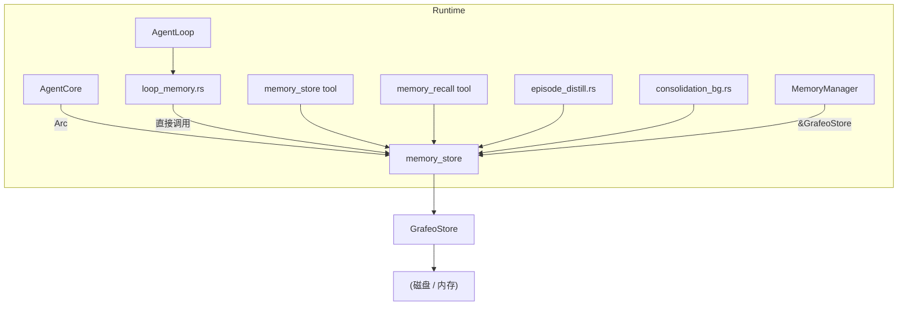
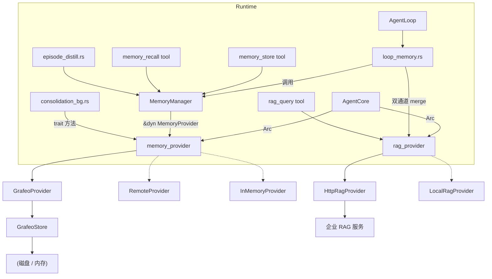

# ADR-051：Runtime Memory Provider 解耦 - Runtime 只关心 Provider，不直接访问 Grafeo

**状态**：已定案  
**日期**：2026-08-04  
**决策者**：大鱼  
**前置**：
- [ADR-014](./ADR-014-loop-module-decomposition.md)（Loop 模块拆分）
- [ADR-020](./ADR-020-data-flow-tiering.md)（数据流分层）
- [ADR-021](./ADR-021-unified-session-data-loading.md)（统一 Session 数据加载）
- [ADR-032](./ADR-032-context-recall.md)（上下文召回）

---

## 1. 决策摘要

当前 `acowork-runtime` 的 agent loop、memory tools、episode distillation、background consolidation 四个入口都**直接依赖 `acowork-grafeo::GrafeoStore`**。这导致：

1. **存储引擎与业务逻辑耦合**：Runtime 中任何一次记忆读写都要知道 Grafeo 的 API、类型、索引行为。
2. **无法替换存储引擎**：如果想把 Grafeo 换成远程 memory service、Sled、LMDB 或新版存储引擎，必须改动 Runtime 的几十处调用点。
3. **测试困难**：Loop 的单测必须构造或 mock `GrafeoStore`，无法用一个轻量的 `MemoryProvider` mock 替代。
4. **类型泄漏**：`acowork-grafeo` 的 `MetricsAggregator`、`ConsolidationScheduler`、`NodeId`、`Value`、各种 node 类型渗透到 `AgentCore` 和 `loop_memory.rs`。

本 ADR 决定将 **Memory 模块提升为标准的 `MemoryProvider`**：

- `acowork-memory` 定义完整的 `MemoryProvider` trait（检索、写入、生命周期、统计、consolidation 入口）。
- `acowork-grafeo` 作为 `MemoryProvider` 的一个实现，继续作为默认生产存储。
- `acowork-runtime` **只依赖 `acowork-memory`** 的 trait 和类型；除了初始化时构造 `GrafeoStore` 之外，loop、tools、distillation、consolidation 全部面向 `dyn MemoryProvider`。
- 未来新增存储引擎只需实现 `MemoryProvider`，无需改动 Runtime。

**分四阶段交付，第一阶段最关键**：

| 阶段 | 目标 | 破坏风险 | 关键动作 |
|------|------|----------|----------|
| **P1：接口解耦** | Runtime 通过 `dyn MemoryProvider` 访问 Grafeo | 低 | 扩展 trait、改 `AgentCore.memory_store` 类型、`MemoryManager` 面向 trait |
| **P2：编排层归位** | `MemoryManager` 下沉到 `acowork-memory` | 中 | 把 `retrieve/inject/record` 逻辑从 runtime 移到 memory crate |
| **P3：Loop 纯化** | `loop_memory.rs` 只调用 `MemoryManager` 高层 API | 中 | 移除 loop 中对 store 的直接调用 |
| **P4：引擎可替换** | 实现第二个 `MemoryProvider` 并验证 Runtime 零改动 | 低 | 提供 in-memory / remote mock，删除 runtime 对 grafeo 的直接依赖 |

---

## 2. 背景与现状

### 2.1 当前架构：Runtime ↔ Grafeo 直接耦合



### 2.2 具体耦合点清单

| # | 文件 | 耦合表现 | 风险 |
|---|------|----------|------|
| 1 | `agent/agent_core.rs:169` | `memory_store: Option<Arc<GrafeoStore>>` | 类型泄漏到核心状态 |
| 2 | `agent/agent_core.rs:187` | `metrics_aggregator: Arc<Mutex<MetricsAggregator>>`（grafeo 类型） | 观测指标与 grafeo 绑定 |
| 3 | `agent/agent_core.rs:189` | `consolidation_scheduler: Option<Arc<ConsolidationScheduler>>`（grafeo 类型） | 后台任务调度与 grafeo 绑定 |
| 4 | `agent/agent_core.rs:588` | `init_memory_store()` 直接 `GrafeoStore::open()` | 存储初始化硬编码 |
| 5 | `agent/loop_memory.rs:53` | `self.core.memory_store()` 返回 `&Arc<GrafeoStore>` | loop 直接拿到存储 |
| 6 | `agent/loop_memory.rs:84` | `manager.retrieve(store, ...)`，`store` 是 `&GrafeoStore` | MemoryManager 不抽象 |
| 7 | `agent/loop_memory.rs:178` | `store.get_procedural()`、`store.update_procedural()` | 直接操作节点 |
| 8 | `agent/loop_memory.rs:195` | `store.should_trigger_confirmation()`、`store.generate_confirmation_hint()` | 直接调用 grafeo 特有方法 |
| 9 | `agent/loop_memory.rs:471` | `store.run_generalization()`、`store.compress_history_nodes()` | consolidation 细节泄漏 |
| 10 | `agent/loop_memory.rs:533` | `store.get_all_procedural_nodes()`、`store.find_autobiographical_by_key()`、`store.store_autobiographical()` | 节点 CRUD 直接调用 |
| 11 | `agent/loop_memory.rs:659` | `store.db()`、`graph.nodes_by_label()` | 直接访问底层图数据库 |
| 12 | `tools/builtin/memory_store.rs:167` | `handle.store()` 返回 `Arc<GrafeoStore>` | tool 直接依赖 Grafeo |
| 13 | `tools/builtin/memory_recall.rs:162` | `handle.store()` 返回 `Arc<GrafeoStore>` | tool 直接依赖 Grafeo |
| 14 | `memory/session_handle.rs:32` | `store: RwLock<Option<Arc<GrafeoStore>>>` | handle 类型写死 |
| 15 | `episode_distill.rs:299` | `write_summary_to_grafeo(..., &Option<Arc<GrafeoStore>>, ...)` | 蒸馏直接写 grafeo |
| 16 | `memory/consolidation_bg.rs:45` | `spawn(..., Arc<GrafeoStore>, ...)` | 后台任务直接持有 GrafeoStore |
| 17 | `memory/manager.rs:204` | `retrieve(&self, store: &GrafeoStore, ...)` | MemoryManager 参数写死 |
| 18 | `memory/manager.rs:635` | `record(&self, store: &GrafeoStore, ...)` | MemoryManager 参数写死 |
| 19 | `Cargo.toml` | `acowork-runtime` 依赖 `acowork-grafeo`、`grafeo-common`、`grafeo-core` | 编译期耦合 |
| 20 | `startup/session_init.rs:342` | `grafeo_store().cloned()` 发布到 `SharedMemoryStore`（类型为 `Arc<RwLock<Option<Arc<GrafeoStore>>>>`） | HTTP admin 端点直接依赖 GrafeoStore |
| 21 | `agent/session/session_task.rs:1261` | `grafeo_store.embedding_dim()` 检查 + `store.rebuild_all_embeddings()` 迁移 | embedding 维度迁移直接调用 GrafeoStore 特有方法 |
| 22 | `agent/agent_core.rs:173` | `grafeo_store: Option<Arc<GrafeoStore>>` compat 字段（P1 C3/C4 保留） | 供 #20、#21 使用，P4 移除 |

### 2.3 为什么现在必须解耦

- **Phase 3/4 可观测性与多引擎需求**：P3 已经在 `loop_memory.rs` 中积累了 `MetricsAggregator`、`JudgeConfig`、`ambiguous confirmation`、`generalization`、`self-evaluation`、`relationship` 等六条直接调用。如果不先抽象，后续每加一个记忆增强特性都会加深耦合。
- **测试成本**：`acowork-runtime` 的 700+ 单元测试中，任何涉及 memory 的测试都要构造 GrafeoStore；解耦后可以用一个 `InMemoryProvider` 替代。
- **部署灵活性**：未来可能出现"远程记忆服务"（多 agent 共享记忆、大容量向量数据库），必须让 Runtime 不感知后端差异。

---

## 3. 目标架构



### 3.1 核心原则

1. **数据先抽象**：先定义 `MemoryProvider` trait，再抽象业务逻辑。
2. **trait 即契约**：Runtime 所有记忆操作必须通过 trait；禁止直接调用 `GrafeoStore` 的特有方法。
3. **编排层下沉**：`MemoryManager` 是"如何用记忆"（retrieve -> inject -> record 的编排），应属于 `acowork-memory`；`GrafeoStore` 是"怎么存"。
4. **安全迁移**：不删除现有 API，先新增抽象层，逐步迁移调用点，最后才考虑移除旧依赖。

---

## 4. 详细设计

### 4.1 Phase 1：接口解耦（最关键，安全无破坏）

Phase 1 的目标是在**不改变任何行为**的前提下，把 Runtime 对 `GrafeoStore` 的直接依赖改为对 `dyn MemoryProvider` 的依赖。所有现有 Grafeo 特有方法都通过扩展 trait 暴露。

#### 4.1.1 类型迁移到 `acowork-memory`

当前以下类型定义在 `acowork-grafeo` 中，但 `MemoryProvider` trait 需要引用它们。按照"Runtime 不直接依赖 grafeo"的目标，**全部迁移到 `acowork-memory`**，`acowork-grafeo` 保留内部转换：

| 类型 | 当前位置 | 迁移目标 |
|------|----------|----------|
| `MemoryStoreInput` | `acowork-grafeo::consolidation::instant` | `acowork_memory::MemoryStoreInput` |
| `ProcessResult`（`MemoryStoreResult`） | `acowork-grafeo::consolidation::instant` | `acowork_memory::MemoryStoreResult` |
| `GeneralizationConfig` | `acowork-grafeo::consolidation::generalization` | `acowork_memory::GeneralizationConfig` |
| `GeneralizationResult` | 同上 | `acowork_memory::GeneralizationResult` |
| `OfflineConsolidationConfig` | `acowork-grafeo::consolidation::offline` | `acowork_memory::OfflineConsolidationConfig` |
| `OfflineConsolidationResult` | 同上 | `acowork_memory::OfflineConsolidationResult` |
| `SchedulerConfig` | `acowork-grafeo::consolidation::scheduler` | `acowork_memory::SchedulerConfig` |
| `TripleExtractorLlm` trait | `acowork-grafeo::consolidation::triple_extraction` | `acowork_memory::TripleExtractorLlm` |
| `LlmMessage` / `LlmResponse` | 同上 | `acowork_memory::LlmMessage` / `LlmResponse` |

`acowork-grafeo` 保留对这些类型的 `pub use` re-export，保证内部代码编译不破；`acowork-grafeo` 中对应的 struct/trait 定义改为 re-export `acowork_memory` 的版本，消除重复定义。

#### 4.1.2 `MemoryProvider` trait 定义

将现有 `MemoryStore` trait（16 个方法）扩展为完整的 `MemoryProvider`，涵盖 Runtime 实际使用的所有操作。采用 **方案 A**：重命名 `MemoryStore` -> `MemoryProvider`，保留 `pub use MemoryProvider as MemoryStore` 别名保证兼容。

异步方法使用 **`#[async_trait]`** 宏（与 `acowork-grafeo` 现有 `TripleExtractorLlm` 一致；`dyn MemoryProvider` 需要 desugared trait object，RPITIT 原生 async fn 不支持 dyn dispatch）。

```rust
// acowork-memory/src/provider.rs（新文件）
use std::sync::Arc;
use std::time::Duration;
use async_trait::async_trait;
use acowork_core::error::Result;

use crate::types::*;
use crate::consolidation::{
    GeneralizationConfig, GeneralizationResult,
    OfflineConsolidationConfig, OfflineConsolidationResult,
    SchedulerConfig, MemoryStoreInput, MemoryStoreResult,
    TripleExtractorLlm,
};

#[async_trait]
pub trait MemoryProvider: Send + Sync {
    // ── 原有 MemoryStore 方法保留 ──
    fn store_episode(&self, episode: &Episode) -> Result<()>;
    fn search_episodes(&self, query: &MemoryQuery) -> Result<Vec<SearchResult>>;
    fn mark_consolidated(&self, ids: &[u64]) -> Result<()>;
    fn cleanup_episodes(&self, older_than: Duration) -> Result<u64>;
    fn get_episodes(&self, session_id: Option<&str>, limit: usize) -> Result<Vec<Episode>>;
    fn store_knowledge(&self, node: &KnowledgeNode) -> Result<()>;
    fn store_procedural(&self, node: &ProceduralNode) -> Result<()>;
    fn store_autobiographical(&self, node: &AutobiographicalNode) -> Result<()>;
    fn hybrid_search(&self, query: &MemoryQuery) -> Result<Vec<SearchResult>>;
    fn graph_expand(&self, seeds: &[SearchResult], hops: u8) -> Result<Vec<SearchResult>>;
    fn run_decay_scan(&self, config: &DecayConfig) -> Result<DecayScanResult>;
    fn reactivate_node(&self, node_id: u64) -> Result<()>;
    fn purge_expired(&self, max_dormant_age: Duration) -> Result<PurgeResult>;
    fn health_check(&self) -> Result<StoreHealth>;
    fn stats(&self) -> Result<StoreStats>;
    fn close(&self) -> Result<()>;

    // ── Phase 1 新增：混合检索 ──

    /// 运行混合检索（向量 + 全文），返回 (node_id, score) 列表。
    fn hybrid_search_full(
        &self,
        label: &str,
        query_text: &str,
        embedding: &[f32],
        k: usize,
        text_weight: f64,
        vector_weight: f64,
        min_score: Option<f32>,
    ) -> Result<Vec<(u64, f64)>>;

    /// 纯文本检索。
    fn text_search_with_filter(
        &self,
        label: &str,
        field: &str,
        query_text: &str,
        k: usize,
        min_score: Option<f32>,
    ) -> Result<Vec<(u64, f64)>>;

    // ── Phase 1 新增：memory_store tool 入口 ──

    /// 内容 -> 冲突检测/去重 -> 节点创建。
    fn process_memory_store(&self, input: &MemoryStoreInput) -> Result<Option<MemoryStoreResult>>;

    // ── Phase 1 新增：模糊冲突确认 ──

    fn should_trigger_confirmation(&self) -> Result<bool>;
    fn generate_confirmation_hint(&self) -> Result<Option<String>>;

    // ── Phase 1 新增：经验泛化（Path C） ──

    async fn run_generalization(
        &self,
        session_id: Option<&str>,
        embedding_fn: &Arc<dyn Fn(&str) -> Vec<f32> + Send + Sync>,
        config: &GeneralizationConfig,
    ) -> Result<GeneralizationResult>;

    fn compress_history_nodes(&self, keep_recent: usize) -> Result<usize>;

    // ── Phase 1 新增：节点 CRUD ──

    fn get_all_procedural_nodes(&self) -> Result<Vec<ProceduralNode>>;
    fn find_procedural_by_trigger(&self, trigger: &str, limit: usize) -> Result<Vec<ProceduralNode>>;
    fn get_procedural(&self, node_id: u64) -> Result<Option<ProceduralNode>>;
    fn update_procedural(&self, node: &ProceduralNode) -> Result<()>;
    fn find_autobiographical_by_key(&self, key: &str) -> Result<Option<AutobiographicalNode>>;
    fn find_autobiographical_by_category(&self, category: AutobioCategory) -> Result<Vec<AutobiographicalNode>>;
    fn update_autobiographical(&self, node: &AutobiographicalNode) -> Result<()>;
    fn create_memory_edge(&self, from: u64, to: u64, edge_type: &str, properties: Vec<(&str, String)>) -> Result<()>;

    // ── Phase 1 新增：consolidation 后台任务 ──
    // ConsolidationScheduler 当前内部直接持有 GrafeoStore，
    // 调度策略属于存储实现细节，不同引擎的合并策略可能完全不同。
    // 因此 consolidation 控制完全下沉到 Provider 内部。

    /// 启动后台 consolidation（由 Provider 内部管理调度）。
    /// config 由 Runtime 传入，但执行细节由 Provider 决定。
    fn start_consolidation(&self, config: &SchedulerConfig) -> Result<()>;

    /// 停止后台 consolidation。
    fn stop_consolidation(&self);

    /// 通知 Provider agent 正在活跃，重置 idle 计时器。
    async fn notify_consolidation_active(&self);

    /// 获取待 consolidation 的节点数（供调度判断）。
    fn get_pending_consolidation_count(&self) -> Result<usize>;

    /// 运行一次离线 consolidation。
    async fn run_offline_consolidation(
        &self,
        offline_config: &OfflineConsolidationConfig,
        llm: Option<&dyn TripleExtractorLlm>,
        embedding_fn: Option<Arc<dyn Fn(&str) -> Vec<f32> + Send + Sync>>,
        gen_config: Option<&GeneralizationConfig>,
    ) -> Result<OfflineConsolidationResult>;
}
```

> **兼容性处理**：`acowork-memory/src/lib.rs` 中保留 `pub use provider::MemoryProvider as MemoryStore;`，`acowork-grafeo` 现有的 `impl MemoryStore for GrafeoStore` 在 C2 中改为 `impl MemoryProvider for GrafeoStore`（由于 alias，两者等价）。

#### 4.1.3 `acowork-grafeo` 实现 `MemoryProvider`

- 在 `acowork-grafeo/src/grafeo.rs` 将现有 `impl MemoryStore for GrafeoStore` 扩展为 `impl MemoryProvider for GrafeoStore`，新增方法直接委托给已有的 `GrafeoStore::pub fn`。
- 类型转换在实现内部完成，不向 Runtime 暴露 `grafeo_common::NodeId`、`Value` 等类型。
- `ConsolidationScheduler` 成为 `GrafeoStore` 的内部字段（或由 `start_consolidation` 在内部创建），不再暴露给 Runtime。
- `acowork-grafeo` 中迁移出去的类型保留 `pub use acowork_memory::{GeneralizationConfig, ...}` re-export，保持 crate 内部编译不破。

#### 4.1.4 Runtime 侧改造

**A. `AgentCore` 持有 `dyn MemoryProvider`，移除 grafeo 类型**

```rust
// agent/agent_core.rs
pub struct AgentCore {
    // ...
    /// Memory provider (Grafeo implementation by default).
    pub(crate) memory_provider: Option<Arc<dyn MemoryProvider>>,
    // ...
    // ── 以下字段在 P1 中移除或替换 ──
    // metrics_aggregator: 移除 grafeo 类型，替换为 Runtime 内部的
    //   RetrievalMetricsAggregator（数据来源是 MemoryProvider 返回的
    //   acowork_memory::RetrievalMetrics，不再依赖 grafeo::OnlineRetrievalMetrics）
    pub(crate) metrics_aggregator: Arc<std::sync::Mutex<RetrievalMetricsAggregator>>,
    // consolidation_scheduler: 移除，consolidation 控制下沉到 Provider
    // consolidation_bg_task: 移除，由 Provider 内部管理
}
```

- `init_memory_store(work_dir)` 改名为 `init_memory_provider(work_dir)`，内部仍然 `GrafeoStore::open()`，但返回 `Arc<dyn MemoryProvider>`。
- 保留 `memory_store()` accessor 作为兼容层，返回 `Option<&Arc<dyn MemoryProvider>>`。
- `start_consolidation_pipeline()` 改为调用 `provider.start_consolidation(&SchedulerConfig::default())`。
- `notify_consolidation_active()` 改为调用 `provider.notify_consolidation_active().await`。

> **P1 保留项（P4 移除）**：`AgentCore` 额外保留 `grafeo_store: Option<Arc<GrafeoStore>>` compat 字段，
> 供以下两个 **P1 未覆盖的耦合点** 使用（见 §2.2 #20、#21）：
> 1. **HTTP admin 端点**：`session_init.rs` 将 `GrafeoStore` 发布到 `SharedMemoryStore`，
>    供 `/memory/nodes`、`/memory/stats`、`/memory/consolidate` 等 HTTP 端点直接访问。
>    这些端点使用 `GrafeoStore` 特有的 `db()`、`graph_store()` 等方法，无法通过 `MemoryProvider` trait 替代。
> 2. **Embedding 维度迁移**：`session_task.rs` 调用 `store.embedding_dim()` 和
>    `store.rebuild_all_embeddings()` 检查并执行 embedding 维度变更，这些是 `GrafeoStore` 特有方法。
>
> 这两项的解耦归入 **P4（§4.4）**，需要分别抽象为 HTTP admin trait 和 `MemoryProvider::embedding_dim()` trait 方法后，
> 才能移除 `grafeo_store` compat 字段和 `acowork-runtime` 对 `acowork-grafeo` 的直接依赖。

**B. `RetrievalMetricsAggregator`（Runtime 内部新类型）**

```rust
// runtime/src/memory/metrics.rs（新文件）
/// Runtime 内部的检索质量指标聚合器。
/// 数据来源是 MemoryProvider 返回的 acowork_memory::RetrievalMetrics。
/// 不再依赖 acowork_grafeo::retrieval_metrics::MetricsAggregator。
pub struct RetrievalMetricsAggregator { /* ... */ }
```

- 保留现有的 NRR / abstention / degradation 告警逻辑。
- 移除 `acowork_memory::HintType` -> `acowork_grafeo::retrieval_metrics::HintType` 的转换代码（`loop_memory.rs:106-119`）。

**C. `MemoryManager` 面向 trait**

```rust
// memory/manager.rs
impl MemoryManager {
    pub async fn retrieve(
        &self,
        provider: &dyn MemoryProvider,
        query: &mut MemoryQuery,
        embedding_provider: Option<&dyn EmbeddingProvider>,
    ) -> Result<RetrievalResult> { ... }

    pub fn record(
        &self,
        provider: &dyn MemoryProvider,
        record: &ConversationRecord,
    ) -> Result<()> { ... }

    pub fn record_procedural_from_failure(
        &self,
        provider: &dyn MemoryProvider,
        tool_name: &str,
        error_message: &str,
    ) -> Result<()> { ... }

    pub async fn record_distilled(
        &self,
        provider: &dyn MemoryProvider,
        episode: &DistilledEpisode,
        embedding_provider: Option<&dyn EmbeddingProvider>,
    ) -> Result<()> { ... }
}
```

**D. `MemorySessionHandle` 类型泛化**

```rust
// memory/session_handle.rs
pub struct MemorySessionHandle {
    provider: RwLock<Option<Arc<dyn MemoryProvider>>>,
    current_session_id: RwLock<Option<String>>,
    embedding_provider: Option<Arc<dyn EmbeddingProvider>>,
}
```

**E. loop_memory.rs 通过 trait 调用**

所有 `store` 变量类型从 `&GrafeoStore` 改为 `&dyn MemoryProvider`，调用方法名不变（因为 trait 方法名与 GrafeoStore 方法名一致）。

**F. episode_distill.rs 改造**

```rust
pub async fn write_summary_to_provider(
    summary_text: &str,
    session_id: &str,
    provider: &Option<Arc<dyn MemoryProvider>>,
    embedding_provider: Option<&dyn EmbeddingProvider>,
)
```

保留 `write_summary_to_grafeo` 作为 deprecated 包装函数，内部调用新函数。

**G. consolidation_bg.rs 简化**

`ConsolidationBgTask` 不再接受 `Arc<GrafeoStore>`，而是接受 `Arc<dyn MemoryProvider>`。所有对 `store.run_offline_consolidation_with_generalization()` 的调用改为 `provider.run_offline_consolidation()`。调度逻辑保留在 Runtime（poll `should_run`），但执行通过 trait 委托。

> 后续 P3 可以进一步将 poll 逻辑也下沉到 Provider。

**H. RAG 独立 trait 化**

`RagClient` 改名为 `HttpRagProvider`，实现 `acowork_core::rag::RagProvider` trait。`AgentCore` 新增 `rag_provider: Option<Arc<dyn RagProvider>>` 字段。

- 移除 `MemoryManager::with_rag` / `rag_client` 字段 / `has_rag()` 方法。
- `loop_memory.rs` 中双通道 merge 逻辑改为：先调 `MemoryManager::retrieve(provider, ...)` 获取本地记忆，再调 `self.core.rag_provider.query(...)` 获取企业知识，按 score 合并。当前 `MemoryManager::retrieve()` 内部的 RAG channel 代码（`manager.rs:411-430`）移出到 `loop_memory.rs`。
- `RagQueryTool` 持有 `Arc<dyn RagProvider>` 而非 `Arc<RagClient>`。
- RAG 协议类型（`RagQueryRequest`、`RagQueryResponse`、`RagResultItem`、`AnnotatedRagResult`）从 `acowork-runtime/src/tools/rag/types.rs` 迁移到 `acowork-core/src/rag.rs`。

### 4.2 Phase 2：编排层归位

把 `MemoryManager`（以及 `ConversationRecord`、`RetrievalResult`、`InjectedMemory`、`RetrievedMemory`）从 `acowork-runtime/src/memory/manager.rs` 移到 `acowork-memory/src/manager.rs`。

- `MemoryManager` 的依赖处理：
  - `EmbeddingProvider`：当前定义在 `acowork-runtime`。Phase 2 将其 trait 定义迁移到 `acowork-core`（或 `acowork-memory`），使 `MemoryManager` 不依赖 runtime。
  - **RAG**：**RAG 不属于 `MemoryProvider` trait，而是独立的 `RagProvider` trait**，与 `MemoryProvider` 平级正交（详见 §5.1）。移除 `MemoryManager::with_rag`。`MemoryManager` 保持纯粹，只编排"本地记忆"的 retrieve -> inject -> record 生命周期。Runtime 在 `loop_memory.rs` 中做双通道 merge：先调 `MemoryManager::retrieve()` 获取本地记忆，再调 `RagProvider::query()` 获取企业知识，按 score 合并。
  - `RuntimeError::Tool`：改为返回 `acowork_core::error::AcoworkError::Memory`。

### 4.3 Phase 3：Loop 纯化

- `loop_memory.rs` 中所有对 provider 的**直接 CRUD**（`get_procedural`、`update_procedural`、`store_autobiographical` 等）收敛到 `MemoryManager` 的高层方法。
- 引入明确的语义方法：
  - `MemoryManager::retrieve_and_inject(...)`
  - `MemoryManager::record_turn(...)`
  - `MemoryManager::record_tool_failures(...)`
  - `MemoryManager::run_post_compaction_tasks(...)`（generalization + self-eval + relationship）
- `loop_memory.rs` 只负责"什么时候调用"和"把结果放进 ContextBuilder"，不知道节点类型。

### 4.4 Phase 4：引擎可替换

- 实现一个 `InMemoryProvider`（基于 HashMap + 简单向量相似度），只用于测试和验证架构。
- 实现一个 `RemoteMemoryProvider`（通过 HTTP/gRPC 访问远程 memory service），证明 Runtime 可以不依赖 Grafeo。
- 当 `InMemoryProvider` 能跑通 Runtime 的 memory 相关集成测试后，可以移除 `acowork-runtime` 对 `acowork-grafeo`、`grafeo-common`、`grafeo-core` 的依赖，将其移到 dev-dependencies 或 feature gate。

#### 4.4.1 P4 前置条件（P1 遗留项）

以下两项在 P1 中保留为 `GrafeoStore` 直接依赖，**必须在 P4 中解耦后才能移除 `grafeo_store` compat 字段和 grafeo crate 依赖**：

| # | 耦合点 | 当前状态 | P4 解耦方案 |
|---|--------|----------|-------------|
| 1 | **HTTP admin 端点**（§2.2 #20） | `SharedMemoryStore` 类型为 `Arc<RwLock<Option<Arc<GrafeoStore>>>>`，`/memory/nodes`、`/memory/stats`、`/memory/consolidate` 等端点直接调用 `GrafeoStore::db()`、`graph_store()` 等方法 | 定义 `MemoryAdminService` trait（或扩展 `MemoryProvider`），包含 `list_nodes()`、`get_node_detail()`、`get_stats_detail()`、`run_consolidation_manual()` 等管理方法。`SharedMemoryStore` 类型改为 `Arc<RwLock<Option<Arc<dyn MemoryAdminService>>>>` |
| 2 | **Embedding 维度迁移**（§2.2 #21） | `session_task.rs` 调用 `store.embedding_dim()` 检查维度、`store.rebuild_all_embeddings()` 执行迁移 | 在 `MemoryProvider` trait 新增 `embedding_dim() -> usize` 和 `rebuild_embeddings(new_dim: usize)` 方法（或独立的 `EmbeddingMigrationService` trait） |
| 3 | **`AgentCore.grafeo_store` 字段**（§2.2 #22） | P1 C3/C4 保留的 compat 字段，仅供 #1、#2 使用 | 当 #1、#2 完成后，移除该字段、`grafeo_store()` accessor、`init_memory_provider()` 中的 `GrafeoStore::open()` 硬编码（改为可配置的 provider 工厂） |

> **P4 完成标志**：`acowork-runtime/Cargo.toml` 中 `acowork-grafeo` 从 `[dependencies]` 移到 `[dev-dependencies]`（仅供测试用 `GrafeoStore` 构造测试数据）。

---

## 5. 架构决策记录

本节记录在 ADR 定案过程中做出的 5 项关键架构选择，每项选择均以"高内聚低耦合 + 记忆模块可替换"为决策原则。

### 5.1 RAG 作为独立 RagProvider trait，与 MemoryProvider 平级正交

**决策**：RAG 不放入 `MemoryProvider` trait，而是定义独立的 `RagProvider` trait。两者平级正交，Runtime 分别持有 `Arc<dyn MemoryProvider>` 和 `Option<Arc<dyn RagProvider>>`，在 `loop_memory.rs` 中做双通道 merge。

**理由**：
- **关注点正交**：`MemoryProvider` 的职责是"存储 + 检索 + 生命周期 + consolidation"（用户偏好 / 对话历史 / 行为模式）；RAG 的职责是"外部知识检索"（企业文档库 / 产品手册 / 内部知识）。两者数据源、生命周期、写入路径完全不同。
- **可替换性对称**：Memory 后端可替换（Grafeo / Sled / 远程服务），RAG 后端同样可替换（HTTP 远程 / 本地向量库 / MemoryProvider 扩展）。两者都需要 trait 抽象才能实现"Runtime 不感知后端"。
- **避免 trait 臃肿**：如果把 RAG 塞进 `MemoryProvider`，实现者被迫实现 `query_rag()` 方法--但很多存储引擎根本没有 RAG 能力，只能返回空结果或 panic。
- **当前 RagClient 已经是准 trait 形态**：`RagClient` 只有 `query()` 和 `query_with_params()` 两个异步方法，输入 `query_text + params`，输出 `Vec<AnnotatedRagResult>`。提取 trait 的成本极低。

**RagProvider trait 定义**（放在 `acowork-core`，与 `Provider` trait 同级）：

```rust
// acowork-core/src/rag.rs（新文件）
use async_trait::async_trait;

/// RAG provider trait - standardized interface for enterprise knowledge retrieval.
///
/// Implementations: HttpRagProvider (current RagClient), LocalRagProvider,
/// or any enterprise RAG service adapter.
#[async_trait]
pub trait RagProvider: Send + Sync {
    /// Query the RAG service with default parameters.
    /// Returns empty vec on timeout/error (graceful degradation).
    async fn query(&self, query_text: &str) -> Vec<AnnotatedRagResult>;

    /// Query with custom parameters (top_k, score_threshold, filters).
    async fn query_with_params(
        &self,
        query_text: &str,
        top_k: Option<u32>,
        score_threshold: Option<f32>,
        filters: Option<serde_json::Value>,
    ) -> Vec<AnnotatedRagResult>;

    /// Provider name (for source annotation, e.g. "RAG:enterprise_knowledge").
    fn name(&self) -> &str;
}
```

RAG 协议类型（`RagQueryRequest`、`RagQueryResponse`、`RagResultItem`、`AnnotatedRagResult`）从 `acowork-runtime/src/tools/rag/types.rs` 迁移到 `acowork-core/src/rag.rs`。

**实施**：
- `acowork-core` 新增 `rag` 模块，定义 `RagProvider` trait + 协议类型。
- 现有 `RagClient` 改名为 `HttpRagProvider`，实现 `RagProvider` trait，留在 `acowork-runtime`。
- `AgentCore` 新增 `rag_provider: Option<Arc<dyn RagProvider>>` 字段。
- 移除 `MemoryManager::with_rag` 和 `rag_client` 字段。
- `RagQueryTool` 持有 `Arc<dyn RagProvider>` 而非 `Arc<RagClient>`。
- `loop_memory.rs` 中双通道 merge 逻辑：先调 `MemoryManager::retrieve()`，再调 `rag_provider.query()`，按 score 合并。
- `MemorySessionHandle` 可选持有 `rag_provider` 引用供 `memory_recall` tool 使用（或由 Runtime 在 tool 构造时注入）。

### 5.2 MetricsAggregator 留在 Runtime，数据源来自 Provider 返回值

**决策**：`MetricsAggregator` 不放入 `MemoryProvider` trait。Runtime 内部新建 `RetrievalMetricsAggregator`，数据来源是 `MemoryProvider::retrieve()` 返回的 `acowork_memory::RetrievalMetrics`。

**理由**：
- 指标聚合是"观测层"关注点，不是"存储层"关注点。不同引擎返回的指标粒度不同，但 Runtime 只需要统一的 `RetrievalMetrics`（result_count / avg_score / max_score / abstention_triggered / retrieval_level 等）。
- 当前的 `acowork_memory::HintType` -> `acowork_grafeo::retrieval_metrics::HintType` 转换（`loop_memory.rs:106-119`）本身就是耦合的 symptom，解耦后直接消除。

**实施**：P1 中在 `runtime/src/memory/metrics.rs` 新建 `RetrievalMetricsAggregator`，保留 NRR / abstention / degradation 告警逻辑。移除 `AgentCore` 对 `acowork_grafeo::retrieval_metrics::MetricsAggregator` 的依赖。

### 5.3 ConsolidationScheduler 完全下沉到 Provider

**决策**：`ConsolidationScheduler` 和 consolidation 执行逻辑完全下沉到 `MemoryProvider` 内部。Runtime 只通过 `start_consolidation()` / `stop_consolidation()` / `notify_consolidation_active()` 控制。

**理由**：
- `ConsolidationScheduler` 当前内部直接持有 `Arc<Mutex<GrafeoStore>>`（`scheduler.rs:112`），调度策略与存储实现强绑定。
- 不同存储引擎的 consolidation 策略可能完全不同：图数据库走 triple extraction + conflict resolution；向量数据库走 re-indexing；远程服务可能根本不需要本地调度。
- 把调度放在 Runtime 意味着 Runtime 必须知道"什么时候该合并"——这是存储引擎的内部知识。

**实施**：
- `MemoryProvider` trait 新增 `start_consolidation(config)` / `stop_consolidation()` / `notify_consolidation_active()` / `get_pending_consolidation_count()` / `run_offline_consolidation()`。
- `AgentCore` 移除 `consolidation_scheduler` 和 `consolidation_bg_task` 字段。
- `GrafeoStore` 的 `impl MemoryProvider` 内部持有 scheduler + bg task，在 `start_consolidation` 中启动。
- P1 保留 `consolidation_bg.rs` 中的 poll loop 作为 fallback（通过 trait 方法委托），P3 再考虑完全内化。

### 5.4 异步 trait 使用 `#[async_trait]`

**决策**：`MemoryProvider` trait 使用 `#[async_trait]` 宏。

**理由**：
- `MemoryProvider` 需要 `run_generalization`、`run_offline_consolidation`、`notify_consolidation_active` 等异步方法。
- Runtime 通过 `dyn MemoryProvider` 使用 trait object，RPITIT 原生 `async fn in trait` 不支持 dyn dispatch。
- `acowork-grafeo` 已在 `TripleExtractorLlm` 中使用 `#[async_trait]`，项目已有依赖和惯例。
- Rust MSRV 1.95 支持 RPITIT，但 dyn-safe async trait 仍需 `async-trait`。

**实施**：在 `acowork-memory` 和 `acowork-core` 的 `Cargo.toml` 中添加 `async-trait` 依赖。`MemoryProvider` 和 `RagProvider` trait 定义均加 `#[async_trait]` 标注。

### 5.5 类型迁移到 `acowork-memory`，grafeo 做 re-export

**决策**：`MemoryProvider` trait 方法涉及的所有输入/输出类型**迁移到 `acowork-memory`**。`acowork-grafeo` 保留 `pub use` re-export 保持内部兼容。

**理由**：
- 如果只在 `acowork-memory` 做包装类型，会导致两套类型并存（grafeo 原始类型 + memory 包装类型），实现层需要来回转换，增加复杂度和 bug 面。
- 直接迁移到 `acowork-memory` 符合"数据先抽象"原则：抽象层拥有类型定义，实现层做转换。
- `acowork-grafeo` 已经依赖 `acowork-memory`（`Cargo.toml:12`），迁移方向正确。

**实施**：P1 C1 中完成迁移（见 §4.1.1 类型迁移表）。`acowork-grafeo` 中的对应定义改为 `pub use acowork_memory::{GeneralizationConfig, ...}`。

---

## 6. 第一阶段交付物与 Commit 切分

为了保证"安全无破坏"，Phase 1 拆成 5 个独立可 review 的 commit：

| Commit | 范围 | 验证方式 |
|--------|------|----------|
| C1 | 在 `acowork-memory` 新增 `MemoryProvider` trait（`#[async_trait]`），迁移所有输入/输出类型（`MemoryStoreInput`、`GeneralizationConfig`、`TripleExtractorLlm` 等）；在 `acowork-core` 新增 `RagProvider` trait + RAG 协议类型（`RagQueryRequest`、`AnnotatedRagResult` 等）；`acowork-grafeo` re-export 迁移后的类型 | `cargo check -p acowork-core -p acowork-memory -p acowork-grafeo` |
| C2 | 在 `acowork-grafeo` 实现 `impl MemoryProvider for GrafeoStore`（扩展原 `MemoryStore` impl），consolidation 控制内化到 GrafeoStore | `cargo test -p acowork-grafeo` |
| C3 | `acowork-runtime`：`AgentCore.memory_store` 改为 `Option<Arc<dyn MemoryProvider>>`，新增 `rag_provider: Option<Arc<dyn RagProvider>>`；移除 `consolidation_scheduler` / `consolidation_bg_task` 字段；新建 `RetrievalMetricsAggregator` 替换 grafeo 版本；`MemorySessionHandle` 泛化；`RagClient` 改名 `HttpRagProvider` 并 impl `RagProvider`；`init_memory_store` 返回 trait 对象 | `cargo check -p acowork-runtime` |
| C4 | `acowork-runtime`：`MemoryManager` 方法签名改为 `&dyn MemoryProvider`，移除 `with_rag` / `rag_client`；`loop_memory.rs` 双通道 merge 改为 `MemoryManager::retrieve()` + `rag_provider.query()`；`episode_distill.rs`、`consolidation_bg.rs`、`memory_store` / `memory_recall` / `rag_query` tool 通过 trait 调用；移除 HintType 转换代码 | `cargo test -p acowork-runtime` |
| C5 | 添加 `InMemoryProvider`（测试用），替换部分 Runtime memory 单测中的 GrafeoStore；添加 `MockRagProvider` 验证 RAG 通道可替换 | 新增/迁移测试通过 |

---

## 7. 影响范围

| 模块 | 影响 | 说明 |
|------|------|------|
| `acowork-memory` | 大 | trait 扩展，类型迁移，新增 `async-trait` 依赖 |
| `acowork-grafeo` | 中 | 新增 trait 实现，类型 re-export，consolidation 内化 |
| `acowork-runtime` | 大 | 大量调用点从具体类型改为 trait 对象，移除 3 个 grafeo 类型字段 |
| `acowork-gateway` | 无 | Gateway 不直接访问 memory |
| Desktop App | 无 | 只通过 HTTP/MQTT 与 Runtime 交互 |
| 现有数据文件 | 无 | Grafeo 仍是唯一实现，磁盘格式不变 |

---

## 8. 测试策略

1. **编译期安全**：每个 commit 后运行 `cargo check` / `cargo clippy --all-targets -- -D warnings`。
2. **Grafeo 单测**：`cargo test -p acowork-grafeo` 必须全部通过，确保 trait 实现行为一致。
3. **Runtime 单测**：`cargo test -p acowork-runtime` 必须全部通过。
4. **集成测试**：`./dev/ci.sh all` 中的 MQTT/session 集成测试必须全部通过。
5. **Mock 验证**：Phase 1 C5 至少把 `memory_recall` 和 `memory_store` tool 的单测各迁移一个到 `InMemoryProvider`，证明 Runtime 可以不通过 GrafeoStore 工作。
6. **回归测试**：
   - 启动已有 agent，验证历史记忆仍可检索。
   - 运行一次完整对话，验证 episode 记录、tool failure 记录、compaction 路径正常。

---

## 9. 迁移路径

### 9.1 不破坏现有行为的保证

- Phase 1 不删除任何 `GrafeoStore` 的 `pub fn`。
- `AgentCore` 保留 `memory_store()` accessor 作为兼容层，返回 `Option<&Arc<dyn MemoryProvider>>`。
- `write_summary_to_grafeo` 保留为包装函数。
- `MemoryStore` trait 保留为 `MemoryProvider` 的 type alias。
- `acowork-grafeo` 中迁移出去的类型保留 `pub use` re-export。

### 9.2 时间线建议

- **Week 1**：C1 + C2（接口 + 类型迁移 + Grafeo 实现）。
- **Week 2**：C3 + C4（Runtime 核心路径迁移）。
- **Week 3**：C5 + 回归测试 + Phase 2 设计评审。
- **Week 4+**：Phase 2/3/4 按独立 ADR 推进。

### 9.3 回滚策略

每个 commit 都是自包含的：
- 如果 C3/C4 引入行为回归，可以回滚到 C2，此时 Runtime 仍使用旧 API，Grafeo 侧已有 trait 实现但不影响旧调用点。
- 如果 trait 设计有缺陷，可以在 C1 后暂停，不进入 C2。

---

## 10. 结论

本 ADR 决定通过四阶段重构将 `acowork-runtime` 中的记忆访问从"直接操作 `GrafeoStore`"改为"面向 `MemoryProvider` trait"。**第一阶段（接口解耦）是安全无破坏的关键**：在不改变行为、不删除 API、不迁移数据的前提下，先把所有调用点收敛到 trait 对象。

五项架构决策确保解耦方向正确：
- RAG 独立 trait（与 MemoryProvider 平级正交，双通道可替换）
- MetricsAggregator 留 Runtime（观测层与存储层分离）
- Consolidation 下沉 Provider（调度是存储内部知识）
- `#[async_trait]` 保 dyn dispatch
- 类型迁移到 `acowork-memory`（抽象层拥有类型）

完成 Phase 1 后，Runtime 将只依赖 `acowork-memory` 的抽象接口，Grafeo 成为可替换的实现之一，为后续多存储引擎、远程记忆服务、更轻量的测试打下架构基础。
