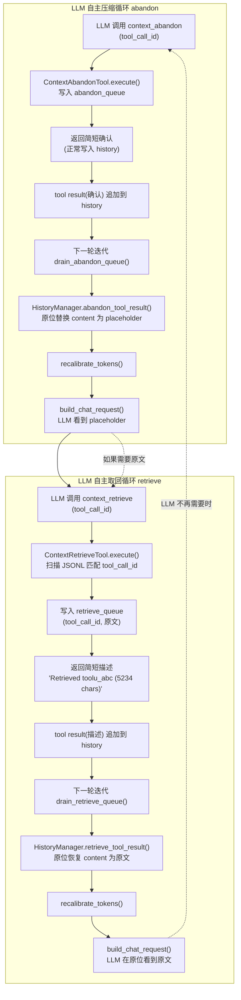

# ADR-052：工具压缩 LLM 自主化 - context_retrieve + context_abandon 双工具替代硬编码触发

**状态**：已定案
**日期**：2026-08-10
**决策者**：大鱼
**前置**：
- [ADR-032](./ADR-032-context-recall.md)（Context ID-Based Compression - 占位符 + 按需召回）
- [ADR-010](./ADR-010-context-compression-simplification.md)（上下文压缩策略简化）
- [ADR-011](./ADR-011-compaction-and-distillation.md)（上下文摘要与蒸馏统一策略）
- [ADR-014](./ADR-014-loop-module-decomposition.md)（Loop 模块分解）

---

## 1. 决策摘要

ADR-032 建立了"占位符 + 按需召回"的工具结果压缩机制，但压缩的**触发权**仍由硬编码逻辑控制：

- **Auto 模式**：最新 Assistant 消息超过 `soft_threshold_chars` 时自动批量压缩
- **Manual 模式**：用户通过前端按钮 / Gateway API 手动触发批量压缩
- 两种模式均依赖 `compress_tool_results()` 批量函数（阈值过滤 + 保留最近 N 条）

本 ADR 将压缩的**决策权从硬编码规则移交给 LLM**：

1. **`context_recall` 重命名为 `context_retrieve`**：语义更清晰（"取回"而非"回忆"），与新增的 `context_abandon` 形成对称命名。
2. **新增 `context_abandon` 内置工具**：LLM 主动将指定 `tool_call_id` 的工具结果替换为占位符。当前 `compress_tool_results()` 的功能即为此操作的硬编码批量版本，现在封装为 LLM 可调用的单个工具。
3. **删除 `CompressionMode`（Auto/Manual）双档模式**，替换为 `tool_compression_enabled: bool` 开关。开 = 注册 `context_retrieve` + `context_abandon` 两个工具；关 = 不注册，LLM 无法压缩或取回。
4. **删除所有硬编码压缩触发逻辑**：`compress_tool_results()`、`compress_tool_results_for_long_assistant()`、Auto 模式事件触发、Manual 模式 compress action channel 中的 `CompressToolResults` 分支。
5. **取消 `context_retrieve` 的 transient 机制，改为原地恢复**：取回的原文通过 `retrieve_queue` 在下一轮迭代中恢复到占位符的原位置（而非追加到 history 末尾），对话流连续。retrieve 工具自己的结果只有简短描述（~60 chars）。ADR-032 的 transient 设计是为防 `recall -> compress -> recall` 死循环，但 ADR-052 已删除自动压缩触发，死循环前提不存在。
6. **默认开**：任何 Agent 自动获得工具压缩能力，LLM 自主决定何时 abandon / retrieve。

**核心范式转变**：

| 维度 | ADR-032（当前） | ADR-052（本 ADR） |
|------|-----------------|-------------------|
| 压缩决策者 | 硬编码规则（阈值 + N 保留） | LLM 自主决策 |
| 压缩粒度 | 批量（所有超阈值 Tool 消息） | 单条（LLM 指定 `tool_call_id`） |
| 触发方式 | 事件触发（Auto）/ 手动按钮（Manual） | LLM 调用 `context_abandon` 工具 |
| 取回方式 | LLM 调用 `context_recall`（transient，仅一轮） | LLM 调用 `context_retrieve`（重命名，原地恢复原文 + 简短描述写入 history） |
| 模式 | `CompressionMode::Auto / Manual` | `tool_compression_enabled: bool` |
| `soft_threshold_chars` | 压缩阈值，控制哪些结果被压缩 | **删除** - LLM 自行判断 |
| `keep_recent_n` | 保留最近 N 条不压缩 | **删除** - LLM 自行判断 |

---

## 2. 背景与动机

### 2.1 ADR-032 的问题

ADR-032 的硬编码触发逻辑经历了多次修订（2026-07-10 原版 → 2026-07-18 修订），核心痛点始终是**规则不够智能**：

1. **Auto 模式的 `soft_threshold_chars` 是一刀切**：2KB 阈值对 `content_search`（动辄 10KB+）合理，但对 `file_read`（可能 500B 也值得压缩）不合理。LLM 比阈值规则更懂哪些结果"已用完"。
2. **`keep_recent_n = 3` 是经验值**：编程场景的工具调用深度可变，N=3 在简单查询时浪费窗口、在复杂多文件分析时又不够。LLM 知道自己还需要哪些结果。
3. **Manual 模式依赖用户主动操作**：大多数用户不会主动点"压缩"按钮，上下文在不知不觉中膨胀。
4. **batch 压缩缺乏语义感知**：`compress_tool_results` 按"超阈值 + 排除最近 N 条"机械执行，可能压缩掉 LLM 仍需要的旧结果，同时保留 LLM 已不需要的新结果。
5. **两档模式增加了配置复杂度**：前端需要 select 控件（auto/manual），用户需要理解两种模式的差异。

### 2.2 为什么现在做

- `context_recall`（transient 通道 + JSONL 索引）已稳定运行，证明"LLM 按需取回"模式可行。
- LLM 的工具调用能力（parallel calls、conditional calls）已足够成熟，可以胜任"判断哪些结果该压缩"的决策。
- 项目正在推进架构简化（ADR-051 Provider 解耦等），减少硬编码规则符合整体方向。

### 2.3 设计约束

- **JSONL 不变**：原始工具结果始终完整存储在 JSONL 中，placeholder 化仅作用于 in-memory `ChatMessage`。此不变式继承自 ADR-032。
- **transient 通道取消 + 原地恢复**：ADR-032 中 `context_retrieve`（原 `context_recall`）的返回值走 `pending_transient_tool_msgs` 通道，仅在一轮 LLM 请求中可见。ADR-052 取消此机制，改为**原地恢复**：工具从 JSONL 读到原文后，通过 `retrieve_queue` 在下一轮迭代中将原文恢复到占位符的原位置。理由：ADR-032 的 transient 是为防 `recall -> compress -> recall` 死循环，但 ADR-052 已删除自动压缩触发，死循环前提不存在。原地恢复使原文回到对话流中的原位置，支持多轮推理且对话流连续。
- **budget fallback 不变**：`trim_history_to_budget`（FIFO）+ `llm_based_compaction`（LLM 摘要）+ `emergency_trim`（95% 兜底）三道防线不受本 ADR 影响。这些是 token-only 兜底，不涉及 placeholder 化。
- **session restore 不变**：restore 不做 placeholder 压缩（ADR-032 修订版已移除），history 从 JSONL 原样加载。

---

## 3. 详细设计

### 3.1 架构总览



### 3.2 `context_retrieve` 工具（重命名 + 原地恢复）

**改动范围**：重命名 + 行为变更（从 transient 返回原文改为原地恢复 + 返回简短描述）。

| 项目 | ADR-032 | ADR-052 |
|------|---------|---------|
| 文件名 | `tools/builtin/context_recall.rs` | `tools/builtin/context_retrieve.rs` |
| 结构体 | `ContextRecallTool` | `ContextRetrieveTool` |
| 工具名 | `"context_recall"` | `"context_retrieve"` |
| 描述 | Retrieve the original full content... | （更新工具名引用 + 描述行为变更） |
| transient | `true`（`execute_single_tool` 中按工具名匹配） | **`false`**（取消 transient） |
| JSONL 扫描 | 按 `metadata.tool_call_id` 匹配 | （不变） |
| 返回值 | 原文内容（transient 注入，不写入 history） | **简短描述**（正常写入 history，如 `"Retrieved toolu_abc (5234 chars), original content restored."`） |
| 原文去向 | transient 通道（仅一轮可见） | **原地恢复**：通过 retrieve_queue 替换 placeholder 为原文 |

**Placeholder 模板更新**：

```
旧: [Tool result compressed. Call context_recall(id="toolu_xxx") to retrieve the full content.]
新: [Tool result compressed. Call context_retrieve(id="toolu_xxx") to retrieve the full content.]
```

`COMPRESSED_TOOL_PLACEHOLDER_PREFIX` 常量值 `"[Tool result compressed."` 不变（前缀仅用于幂等检测，不含工具名）。

#### 3.2.1 执行流程

`context_retrieve` 不直接修改 in-memory history（工具无权访问 `HistoryManager`），而是通过 **retrieve queue** 异步完成原地恢复：

```
ContextRetrieveTool.execute(tool_call_id):
  1. 验证 tool_call_id 非空
  2. 扫描 JSONL 找到原始内容 original_content
  3. retrieve_queue.lock().push_back((tool_call_id, original_content))
  4. 返回 ToolResult { ok: true, content: "Retrieved toolu_abc (5234 chars), original content restored." }
```

**工具返回值是简短描述**（~60 chars），作为正常 tool result 写入 history 末尾。原文通过 queue 在下一轮迭代中原地恢复到占位符位置。

#### 3.2.2 Retrieve Queue 设计

与 `abandon_queue` 完全对称，区别是队列元素携带原始内容：

```rust
/// Shared queue for context_retrieve tool requests.
/// The tool writes (tool_call_id, original_content) pairs here;
/// the agent loop drains them and restores the original content
/// in-place (replacing the placeholder).
pub type RetrieveQueue = std::sync::Arc<
    std::sync::Mutex<std::collections::VecDeque<(String, String)>>
>;
```

**生命周期**：与 `abandon_queue` 相同（创建 -> 注入工具 -> 注入 Loop -> 排空）。

**排空逻辑**：

```rust
fn drain_retrieve_queue(&mut self) -> bool {
    let mut items = self.retrieve_queue.lock().unwrap();
    if items.is_empty() {
        return false;
    }
    let mut did_work = false;
    while let Some((tool_call_id, original_content)) = items.pop_front() {
        let restored = self.session.history.retrieve_tool_result(
            &tool_call_id,
            &original_content,
        );
        if restored > 0 {
            tracing::info!(tool_call_id = %tool_call_id, "context_retrieve: restored original content in-place");
            did_work = true;
        } else {
            tracing::debug!(tool_call_id = %tool_call_id, "context_retrieve: no matching placeholder (already restored or not found)");
        }
    }
    drop(items);
    if did_work {
        self.session.history.recalibrate_tokens();
    }
    did_work
}
```

#### 3.2.3 `HistoryManager::retrieve_tool_result()`

新增方法，与 `abandon_tool_result()` 对称：

```rust
/// Restore a Tool message's content from placeholder back to original.
/// Called by `drain_retrieve_queue` after the LLM invokes `context_retrieve`.
///
/// Idempotent: if the message is already raw (not a placeholder), returns 0.
///
/// Returns 1 if restored, 0 if not found or already raw.
pub fn retrieve_tool_result(&mut self, tool_call_id: &str, original_content: &str) -> usize {
    for msg in &mut self.messages {
        if !matches!(msg.role, MessageRole::Tool) {
            continue;
        }
        if msg.tool_call_id.as_deref() != Some(tool_call_id) {
            continue;
        }
        // Idempotency: skip already-restored messages
        if !msg.content.starts_with(COMPRESSED_TOOL_PLACEHOLDER_PREFIX) {
            return 0;
        }
        msg.content = original_content.to_string();
        return 1;
    }
    0
}
```

**abandon ↔ retrieve 对称性**：

| 操作 | 方法 | 效果 |
|------|------|------|
| `abandon_tool_result(id)` | placeholder 替换原文 | 压缩 |
| `retrieve_tool_result(id, content)` | 原文替换 placeholder | 恢复 |

两者都原地修改 in-memory `ChatMessage.content`，都不改 JSONL，都幂等。

### 3.3 `context_abandon` 工具（新增）

#### 3.3.1 工具规格

```json
{
  "name": "context_abandon",
  "description": "Replace a tool result with a compact placeholder to free up context window space. The original content is preserved in the conversation log and can be retrieved later with context_retrieve. Call this when a tool result is no longer needed for your current reasoning - e.g., after you've extracted the relevant information from a large file_read or content_search output.",
  "input_schema": {
    "type": "object",
    "properties": {
      "tool_call_id": {
        "type": "string",
        "description": "The tool_call_id of the tool result to abandon. This is the same id that appears in tool results and in compressed placeholders."
      }
    },
    "required": ["tool_call_id"]
  }
}
```

#### 3.3.2 执行流程

`context_abandon` 不直接修改 in-memory history（工具无权访问 `HistoryManager`），而是通过 **abandon queue** 异步完成：

```
ContextAbandonTool.execute(tool_call_id):
  1. 验证 tool_call_id 非空
  2. abandon_queue.lock().push_back(tool_call_id)
  3. 返回 ToolResult { ok: true, content: "Tool result '{id}' will be replaced with a placeholder." }
```

#### 3.3.3 Abandon Queue 设计

```rust
/// Shared queue for context_abandon tool requests.
/// The tool writes tool_call_ids here; the agent loop drains
/// them before the next build_chat_request.
pub type AbandonQueue = std::sync::Arc<std::sync::Mutex<std::collections::VecDeque<String>>>;
```

**生命周期**：
1. **创建**：在 `session_task.rs` 中、`create_default_tools()` 调用前创建 `Arc::new(Mutex::new(VecDeque::new()))`。
2. **注入工具**：`ContextAbandonTool::new(abandon_queue.clone())` 持有写入端。
3. **注入 Loop**：`AgentLoop` 结构体新增 `abandon_queue: AbandonQueue` 字段，持有读取端。
4. **排空**：`AgentLoop::drain_abandon_queue()` 在 `execute_single_iteration` 的 ② 阶段（`drain_compress_actions` 之后）调用。

**排空逻辑**：

```rust
fn drain_abandon_queue(&mut self) -> bool {
    let mut ids = self.abandon_queue.lock().unwrap();
    if ids.is_empty() {
        return false;
    }
    let mut did_work = false;
    while let Some(tool_call_id) = ids.pop_front() {
        let compressed = self.session.history.abandon_tool_result(&tool_call_id);
        if compressed > 0 {
            tracing::info!(tool_call_id = %tool_call_id, "context_abandon: replaced with placeholder");
            did_work = true;
        } else {
            tracing::debug!(tool_call_id = %tool_call_id, "context_abandon: no matching tool result (already compressed or not found)");
        }
    }
    drop(ids); // release lock before recalibrate
    if did_work {
        self.session.history.recalibrate_tokens();
    }
    did_work
}
```

#### 3.3.4 `HistoryManager::abandon_tool_result()`

新增方法，替代被删除的 `compress_tool_results()`：

```rust
/// Replace a single Tool message's content with a placeholder.
/// Called by `drain_abandon_queue` after the LLM invokes `context_abandon`.
///
/// Idempotent: if the message is already a placeholder (starts with
/// `COMPRESSED_TOOL_PLACEHOLDER_PREFIX`), returns 0 without modification.
///
/// Returns 1 if replaced, 0 if not found or already compressed.
pub fn abandon_tool_result(&mut self, tool_call_id: &str) -> usize {
    for msg in &mut self.messages {
        if !matches!(msg.role, MessageRole::Tool) {
            continue;
        }
        if msg.tool_call_id.as_deref() != Some(tool_call_id) {
            continue;
        }
        // Idempotency: skip already-compressed messages
        if msg.content.starts_with(COMPRESSED_TOOL_PLACEHOLDER_PREFIX) {
            return 0;
        }
        msg.content = format!(
            "[Tool result compressed. Call context_retrieve(id=\"{}\") to retrieve the full content.]",
            tool_call_id
        );
        return 1;
    }
    0
}
```

**设计要点**：
- **单条精确操作**：按 `tool_call_id` 精确匹配，不做批量、不依赖阈值。
- **幂等**：已压缩的消息不会被二次处理。
- **保留 `name` 和 `tool_call_id` 字段**：与 ADR-032 `compress_tool_results` 一致，保持 tool_use ↔ tool_result 协议配对。
- **不改 JSONL**：in-memory 替换，JSONL 原文不丢失。

#### 3.3.5 Transient 机制取消 + 原地恢复设计

**ADR-032 的 transient 设计**：`context_recall` 返回值走 `pending_transient_tool_msgs` 通道，仅在一次 LLM 请求中可见，下一轮自动消失。这是为了防止死循环：

```
recall 写入 history -> history 体积增大 -> Auto 模式自动触发 compress_tool_results
-> 又变占位符 -> LLM 又 recall -> 无限循环
```

**ADR-052 取消 transient 的理由**：死循环的前提条件已被本 ADR 删除：

| 死循环前提 | ADR-052 状态 |
|-----------|-------------|
| Auto 模式事件触发压缩 | **已删除** |
| `compress_tool_results` 按 threshold 批量压缩 | **已删除** |
| 压缩是自动的、LLM 无法控制 | **已变更为 LLM 自主 abandon** |

LLM 不会"自动"abandon 刚 retrieve 回来的内容。如果 LLM 觉得取回的原文不再需要了，它可以主动调用 `context_abandon` 压缩它--这才是真正的 LLM 自主决策。

**原地恢复的数据流**（替代"原文追加到末尾"）：

```
Iteration N:
  history: [..., tool_result(toolu_abc, "[placeholder]"), ...]
  LLM 调用 context_retrieve(toolu_abc)
  ↓ 工具从 JSONL 读到原文
  ↓ retrieve_queue.push_back(("toolu_abc", "原文内容"))
  ↓ 工具返回简短描述，作为新 tool result 追加到 history 末尾

  history (after tool execution, before drain):
  [..., tool_result(toolu_abc, "[placeholder]"), ..., tool_result(toolu_retrieve, "Retrieved toolu_abc")]

Iteration N+1:
  ② drain_retrieve_queue -> history.retrieve_tool_result("toolu_abc", "原文内容")
  ↓ toolu_abc 的 content 原位从 placeholder 恢复为原文
  ② recalibrate_tokens
  ② build_chat_request -> LLM 看到:
  [..., tool_result(toolu_abc, "原文内容"), ..., tool_result(toolu_retrieve, "Retrieved toolu_abc")]
                        ↑ 原文回到原位，对话流连续

Iteration N+K:
  LLM 不再需要原文 -> 调用 context_abandon(toolu_abc)
  ↓ toolu_abc 又变回 placeholder（回到初始状态，闭环）
```

**为什么原地恢复优于"追加到末尾"**：

| 维度 | 追加到末尾（原设计） | 原地恢复（本设计） |
|------|---------------------|-------------------|
| 原文位置 | history 末尾（新 tool result） | 原占位符位置 |
| 对话流连续性 | 原文与原对话脱节，LLM 需跳跃阅读 | 原文回到原位，对话流自然连续 |
| abandon 闭环 | abandon 新 tool result 产生新 placeholder，占位符堆积 | abandon 原位恢复的内容 = 回到初始 placeholder |
| 上下文语义 | 两个 tool result（占位符 + 原文）并存，语义混乱 | 一个 tool result（原文恢复原位），语义清晰 |
| retrieve 工具结果 | 就是原文本身（可能很大） | 简短描述（~60 chars），不占空间 |

**代码改动**：`execute_single_tool` 中的 transient 判定直接删除，不再有工具名匹配的 transient 路径：

```rust
// ADR-032 (旧): let transient = tool_name == "context_recall";
// ADR-052 (新): 删除此行，所有工具返回值默认 transient=false
let transient = false;
```

**`pending_transient_tool_msgs` 字段处理**：该字段在 `AgentLoop` 中保留（未来可能有其他 transient 工具需求），但当前无任何工具使用它。`build_chat_request` 中的注入逻辑保留，空 vec 时自然跳过。

### 3.4 删除的硬编码逻辑

#### 3.4.1 `CompressionMode` 枚举

**删除**：
- `loop_context.rs`：`CompressionMode` enum、`Display` impl、`DEFAULT_COMPRESSION_MODE` 常量
- `loop_.rs`：`compression_mode()` 方法、`event_compression_enabled()` 方法
- `agent_core.rs`：`compression_mode_override` 字段
- `protocol.rs`：`tool_result_compression_mode` 字段
- `usecases/agent_config.rs`：`ConfigField::ToolResultCompressionMode`
- `usecases/agent_config_impl.rs`：对应的 apply 分支

#### 3.4.2 批量压缩函数

**删除**：
- `history.rs`：`compress_tool_results()` 方法（~70 行）
- `history.rs`：`compress_tool_results_for_long_assistant()` 方法（~35 行）
- `history.rs`：`DEFAULT_KEEP_RECENT_N` 常量
- `loop_context.rs`：`DEFAULT_SOFT_THRESHOLD_CHARS` 常量
- `agent_core.rs`：`soft_threshold_chars_override` 字段、`tool_result_keep_recent_n_override` 字段
- `agent_core.rs`：`tool_result_soft_threshold_chars()` / `tool_result_keep_recent_n()` 访问器

#### 3.4.3 触发路径

**删除 Auto 模式事件触发**：
- `loop_session.rs:465-480`：`if self.event_compression_enabled() { ... compress_tool_results_for_long_assistant ... }` 整个代码块

**删除 Manual 模式 compress action**：
- `loop_.rs`：`CompressionAction::CompressToolResults` 变体
- `loop_.rs`：`drain_compress_actions()` 中 `CompressToolResults` 分支（保留 `CompressSummary` 分支）
- 前端 "Compress Tools" 按钮（`ContextUsageIcon.tsx`）

**删除配置字段**：
- `AgentConfig`：`tool_result_compression_mode`、`tool_result_soft_threshold_chars`、`tool_result_keep_recent_n`
- `RuntimeConfigOverrides`：同上
- `protocol.rs`：同上
- `ConfigField`：`ToolResultCompressionMode`、`ToolResultSoftThresholdChars`

### 3.5 新增配置：`tool_compression_enabled`

| 属性 | 值 |
|------|-----|
| 字段名 | `tool_compression_enabled` |
| 类型 | `Option<bool>` |
| 默认值 | `true`（缺失时视为 true） |
| 配置层级 | `RuntimeConfigOverrides` → `AgentConfig` → 代码默认 `true` |
| 语义 | `true` = 注册 `context_retrieve` + `context_abandon` 工具；`false` = 不注册 |

**生效方式**：**Hot-reload via `RuntimeConfigUpdate`**（2026-08-17 修订：原 "Boot-only" 论断被实施漏洞反证——`apply_runtime_config` 收到 toggle 时只写 `tool_compression_enabled_override` 字段而不调 rebuild 路径，导致前端 Switch 可见但 LLM 工具列表不变）。Gateway 通过 `RuntimeConfigUpdate.tool_compression_enabled` 推送 toggle → `AgentCore::apply_runtime_config` 检测值变化 → `AgentCore::sync_platform_tools_to_registry(enabled)` 增减 `builtin_tools` Vec 成员并调 `rebuild_all_tools`（刷新 dispatch list）→ SessionTask handler 调 `rebuild_context_tool_definitions` 刷新 `ContextBuilder.tool_definitions`（LLM 视角)。下一次 `build_chat_request` 自动使用新工具列表。**与 `UpdateBuiltinTools` 共享相同的"atomic 双侧 rebuild"不变量**。

旧 "Boot-only" 行为（仅 session_init 读取 → 新会话才生效）作为 fallback 保留：若 MQTT push 路径还没触发（例如 Snapshot 没到），新会话仍按 `agent_config.json` 上的 `tool_compression_enabled` 启动。两条路径的本质是"cache 写入时机不同"，最终值一致。

**不变量（与本 hot-reload 修改正交）**：
- `PLATFORM_PROTECTED_TOOLS`(`context_retrieve`, `context_abandon`) 仍不进 `agent_tools.json`。这是磁盘层不变量，由 `merge_tools_config` / `apply_builtin_tools_patch` / `init_tools_config_from_manifest` / `get_merged_tools` 共同执行（见同文档 §6.4）。任何写路径都过 `is_platform_protected` 过滤。
- `BuiltinToolEntry::with_resolved_enabled` 强制启用 platform 工具（不走用户 `--builtin-tools` 切换），hook 与 boot-time 注册、hot-reload 添加时一致。
- `retrieve_queue` / `abandon_queue` 是 `Arc<Mutex<...>>` 共享队列，`sync_platform_tools_to_registry` 推入新 `BuiltinToolEntry` 时 clone 同一个 `Arc`——agent_loop 端 drain 队列与 registry 多次 rebuild 解耦。

**AgentCore 新增字段**：

```rust
/// ADR-052: Whether context_retrieve and context_abandon tools are registered.
/// `None` falls through to `true` (default enabled).
/// Hot-reload: when this changes, `sync_platform_tools_to_registry`
/// mutates `builtin_tools` and triggers the dispatch-list + LLM
/// tool_definitions rebuild via `apply_runtime_config` and the
/// `SessionTask` handler.
pub(crate) tool_compression_enabled_override: Option<bool>,
```

**工具注册逻辑**（`tools/builtin/mod.rs`）：

```rust
// ADR-052: context_retrieve + context_abandon are conditionally registered
// based on tool_compression_enabled config (default: true).
//
// The platform tools are constructed by `build_platform_protected_tools`
// so the same factory is reusable from the hot-reload path
// (`AgentCore::sync_platform_tools_to_registry`) when Gateway pushes
// a `RuntimeConfigUpdate.tool_compression_enabled` toggle.
let compression_enabled = tool_compression_enabled.unwrap_or(true);
if compression_enabled {
    tools.extend(build_platform_protected_tools(
        &agent_home,
        retrieve_queue,
        abandon_queue,
    ));
}
```

**Hot-reload 路径**（`agent_core.rs::sync_platform_tools_to_registry`）：

```rust
// Idempotent: 第二/三次调用 enabled 值相同 → before/after 一致 → 直接返回 false
pub(crate) fn sync_platform_tools_to_registry(&mut self, enabled: bool) -> bool {
    if enabled {
        // 缺哪个 build_platform_protected_tools 哪个
        for tool in build_platform_protected_tools(...) {
            if !existing.contains(&tool.name()) {
                self.builtin_tools.push(BuiltinToolEntry::with_resolved_enabled(false, tool));
            }
        }
    } else {
        self.builtin_tools.retain(|e| !PLATFORM_PROTECTED_TOOLS.contains(&e.tool.name()));
    }
    self.rebuild_all_tools();  // 刷新 dispatch list
    true
}
```

### 3.6 前端改动

#### 3.6.1 AgentSetupTab（设置面板）

**删除**：
- Compression Mode `<select>` 控件（auto/manual 二选一）
- Compression Soft Threshold `<input type="number">` 控件
- 对应的 i18n key（`compressionMode`、`compressionAuto`、`compressionManual`、`compressionModeDesc`、`compressionSoftThreshold`、`compressionSoftThresholdDesc`）

**新增**：
- Tool Compression `<input type="checkbox">` 或 `<toggle>` 控件
- i18n key：`toolCompressionEnabled`（"工具压缩"）、`toolCompressionEnabledDesc`（"启用后 LLM 可自主压缩和取回工具结果"）

**Profile 字段**（`agentStore.ts`）：
- `toolResultCompressionMode?: string` → 删除
- `toolResultSoftThresholdChars?: number` → 删除
- `toolCompressionEnabled?: boolean` → 新增

**Wire 字段**（`AgentSetupTab.tsx` save 逻辑）：
- `body.tool_result_compression_mode` → 删除
- `body.tool_result_soft_threshold_chars` → 删除
- `body.tool_compression_enabled` → 新增

#### 3.6.2 ContextUsageIcon（上下文用量图标）

**删除**：
- "Compress Tools" 按钮（`handleCompressTools`，发送 `CompressType::TOOL_RESULTS`）
- Compression mode 指示器（`compressionMode === "manual" ? "🚧 Manual" : "⚙️ Auto"`）
- `compressionMode` 变量读取

**保留**：
- "Compress Summary" 按钮（LLM 摘要压缩，属于 ADR-011 L2 层，不受本 ADR 影响）
- 上下文用量百分比显示

### 3.7 `episode_distill.rs` 更新

`format_messages` 函数中检测压缩占位符的逻辑不变（仍使用 `COMPRESSED_TOOL_PLACEHOLDER_PREFIX`），但 label 输出中的工具名引用更新：

```rust
// 旧: format_messages 中不直接引用 context_recall 工具名
// 新: 无需改动 - format_messages 检测的是 placeholder prefix，不检测工具名
```

实际检查：`format_messages` 仅检测 `COMPRESSED_TOOL_PLACEHOLDER_PREFIX` 前缀和 `COMPACTION_SUMMARY_NAME`，不引用 `context_recall` 工具名。**无需改动**。

### 3.8 Platform Tools 列表更新

`session_task.rs` 中的 `PLATFORM_TOOLS` 列表（强制启用的工具，忽略用户 override）：

```rust
// 旧:
const PLATFORM_TOOLS: &[&str] = &["context_recall"];

// 新:
const PLATFORM_TOOLS: &[&str] = &["context_retrieve", "context_abandon"];
```

**注意**：当 `tool_compression_enabled = false` 时，这两个工具根本不会被注册，`PLATFORM_TOOLS` 的强制启用逻辑不生效（因为列表中没有对应条目可启用）。`PLATFORM_TOOLS` 的作用是防止用户通过 builtin-tools API 禁用已注册的平台工具，与注册开关正交。

---

## 4. 影响范围

### 4.1 Rust - `acowork-runtime`

| 文件 | 改动类型 | 说明 |
|------|----------|------|
| `tools/builtin/context_recall.rs` | **重命名** → `context_retrieve.rs` | 结构体、工具名、注释全部更新 |
| `tools/builtin/context_abandon.rs` | **新增** | `ContextAbandonTool` + `AbandonQueue` 类型别名 |
| `tools/builtin/mod.rs` | **修改** | 条件注册 `context_retrieve` + `context_abandon`；函数签名新增 `abandon_queue` + `retrieve_queue` 参数 |
| `agent/history.rs` | **删除 + 新增** | 删 `compress_tool_results` / `compress_tool_results_for_long_assistant` / 相关常量；新增 `abandon_tool_result()` + `retrieve_tool_result()`；更新 placeholder 模板 |
| `agent/loop_context.rs` | **删除** | 删 `CompressionMode` enum / `DEFAULT_COMPRESSION_MODE` / `DEFAULT_SOFT_THRESHOLD_CHARS` / `DEFAULT_KEEP_RECENT_N` |
| `agent/loop_.rs` | **删除 + 新增** | 删 `compression_mode()` / `event_compression_enabled()` / `CompressionAction::CompressToolResults`；新增 `abandon_queue` + `retrieve_queue` 字段 / `drain_abandon_queue()` + `drain_retrieve_queue()` |
| `agent/loop_session.rs` | **删除** | 删 Auto 模式事件触发代码块（`handle_text_response` 中的 `compress_tool_results_for_long_assistant` 调用） |
| `agent/loop_tools.rs` | **修改** | 删除 transient 判定（`tool_name == "context_recall"` 匹配行），所有工具返回值默认 `transient=false` |
| `agent/loop_context.rs` | **修改** | `build_chat_request` 中 `pending_transient_tool_msgs` 注入逻辑保留（空 vec 自然跳过） |
| `agent/agent_core.rs` | **删除 + 新增** | 删 `compression_mode_override` / `soft_threshold_chars_override` / `keep_recent_n_override`；新增 `tool_compression_enabled_override` |
| `agent/session/session_task.rs` | **修改** | `PLATFORM_TOOLS` 更新；`create_default_tools` 调用传入 `abandon_queue` + `retrieve_queue` |
| `agent/session/session_manager.rs` | **修改** | restore 注释更新（引用 ADR-052） |
| `usecases/agent_config.rs` | **删除 + 新增** | 删 `ConfigField::ToolResultCompressionMode` / `ToolResultSoftThresholdChars`；新增 `ConfigField::ToolCompressionEnabled` |
| `usecases/agent_config_impl.rs` | **删除 + 新增** | 对应 apply 分支 |
| `episode_distill.rs` | **无改动** | placeholder prefix 检测不变 |

### 4.2 Rust - `acowork-core`

| 文件 | 改动类型 | 说明 |
|------|----------|------|
| `protocol.rs` | **删除 + 新增** | 删 `tool_result_compression_mode` / `tool_result_soft_threshold_chars`；新增 `tool_compression_enabled` |
| `config.rs`（AgentConfig） | **删除 + 新增** | 同上 |

### 4.3 Frontend - `apps/acowork-desktop`

| 文件 | 改动类型 | 说明 |
|------|----------|------|
| `src/stores/agentStore.ts` | **删除 + 新增** | 删 `toolResultCompressionMode` / `toolResultSoftThresholdChars`；新增 `toolCompressionEnabled` |
| `src/components/results/AgentSetupTab.tsx` | **删除 + 新增** | 删 mode `<select>` + threshold `<input>`；新增 toggle 控件 |
| `src/components/chat/ContextUsageIcon.tsx` | **删除** | 删 "Compress Tools" 按钮 + mode 指示器 |
| `src/stores/chatStore.ts` | **无改动** | `sendCompressAction` 保留（Summary 按钮仍用） |

### 4.4 i18n

| Key | 操作 |
|-----|------|
| `agentSetup.compressionMode` | 删除 |
| `agentSetup.compressionAuto` | 删除 |
| `agentSetup.compressionManual` | 删除 |
| `agentSetup.compressionModeDesc` | 删除 |
| `agentSetup.compressionSoftThreshold` | 删除 |
| `agentSetup.compressionSoftThresholdDesc` | 删除 |
| `agentSetup.toolCompressionEnabled` | 新增 |
| `agentSetup.toolCompressionEnabledDesc` | 新增 |

---

## 5. Commit 切分

| Commit | 范围 | 风险 | 可独立验证 |
|--------|------|------|-----------|
| **C1** | `context_recall` -> `context_retrieve` 重命名（文件、结构体、工具名、placeholder 模板、PLATFORM_TOOLS）+ 取消 transient（删除 `execute_single_tool` 中工具名匹配行） | 低（重命名 + 删除一行 transient 判定） | ✅ 全量测试通过 |
| **C2** | 新增 `context_abandon` 工具 + `abandon_tool_result()` + `abandon_queue` + `drain_abandon_queue()`；重构 `context_retrieve` 为原地恢复（`retrieve_tool_result()` + `retrieve_queue` + `drain_retrieve_queue()`） | 中（新增工具 + 新增 history 方法 × 2 + 新增 loop 字段 × 2） | ✅ 单测 + 集成测试 |
| **C3** | 删除硬编码压缩逻辑（`CompressionMode` / `compress_tool_results` / `compress_tool_results_for_long_assistant` / Auto 触发 / Manual compress action / 配置字段） | 高（删除被多路径引用的函数和类型） | ✅ 编译通过 + 全量测试 |
| **C4** | 配置迁移（`tool_compression_enabled` 新增 + 条件注册）+ 前端同步（toggle 控件 + 删除旧控件 + 删除 Compress Tools 按钮） | 中（跨 Rust + TS） | ✅ 手动验证 + E2E |

**建议合并顺序**：C1 → C2 → C3 → C4。C1 和 C2 可以并行开发（无依赖），C3 依赖 C1+C2（删除旧代码前新代码必须就位），C4 依赖 C3（配置字段先于前端使用）。

---

## 6. 测试策略

### 6.1 C1 单测（重命名验证）

- `context_retrieve` 工具名正确注册
- placeholder 模板包含 `context_retrieve`（而非 `context_recall`）
- `execute_single_tool` 中不再有 transient 工具名匹配（`context_recall` / `context_retrieve` 均不匹配）
- `context_retrieve` 返回值正常写入 history（非 transient），在后续轮次 `build_chat_request` 中持续可见
- `pending_transient_tool_msgs` 在 `context_retrieve` 调用后保持为空（不注入 transient 消息）
- 旧 placeholder（含 `context_recall`）仍能被 `COMPRESSED_TOOL_PLACEHOLDER_PREFIX` 检测（前缀不变）
- `ContextRetrieveTool` 的 JSONL 扫描行为与原 `ContextRecallTool` 一致

### 6.2 C2 单测（context_abandon + context_retrieve 原地恢复）

- `abandon_tool_result()` 成功替换指定 `tool_call_id` 的 content
- `abandon_tool_result()` 对不存在的 `tool_call_id` 返回 0
- `abandon_tool_result()` 幂等：已压缩的消息返回 0
- `abandon_tool_result()` 保留 `name` 和 `tool_call_id` 字段
- `abandon_tool_result()` 不影响非 Tool 角色消息
- `drain_abandon_queue()` 排空队列并调用 `recalibrate_tokens`
- `drain_abandon_queue()` 空队列时返回 false，不调 `recalibrate_tokens`
- `ContextAbandonTool` 参数校验（空 / 缺失 `tool_call_id`）
- `ContextAbandonTool` 和 `ContextRetrieveTool` 返回值均非 transient（正常写入 history）

### 6.3 C3 单测（删除验证）

- `CompressionMode` 类型不再存在（编译验证）
- `compress_tool_results` / `compress_tool_results_for_long_assistant` 不再存在（编译验证）
- `loop_session.rs` 中不再有 `event_compression_enabled()` 调用（grep 验证）
- `drain_compress_actions` 中不再有 `CompressToolResults` 分支（编译验证）
- `CompressionAction` 仅剩 `CompressSummary` 变体
- 原有 `compress_tool_results` 测试用例删除或迁移为 `abandon_tool_result` 测试

### 6.4 C4 验证

- `tool_compression_enabled = true`（默认）：`context_retrieve` + `context_abandon` 出现在 builtin tools 列表
- `tool_compression_enabled = false`：两个工具不出现在列表中
- 前端 toggle 控件正确读写 `tool_compression_enabled`
- 前端 "Compress Tools" 按钮已移除
- 前端 "Compress Summary" 按钮保留且功能正常

---

## 7. 迁移路径

### 7.1 配置迁移

| 旧字段 | 新字段 | 迁移策略 |
|--------|--------|----------|
| `tool_result_compression_mode: "auto" \| "manual"` | `tool_compression_enabled: bool` | 旧字段忽略（serde 跳过未知字段）；新字段缺失时默认 `true` |
| `tool_result_soft_threshold_chars: usize` | （删除） | 直接忽略 |
| `tool_result_keep_recent_n: usize` | （删除） | 直接忽略 |

**用户感知**：
- 原Auto / Manual 用户：默认获得 `tool_compression_enabled = true`，LLM 自主压缩。行为变化：不再有硬编码批量压缩，改为 LLM 按需单条 abandon。
- 原本通过 Manual 模式禁用压缩的用户：需要在设置面板中关闭 `tool_compression_enabled` 开关。

### 7.2 向后兼容

- 旧 `agent_config.json` 中的 `tool_result_compression_mode` 字段不会导致解析错误（serde 默认忽略未知字段）。
- 旧 JSONL 中由 `compress_tool_results` 生成的 placeholder（含 `context_recall`）仍可被 `context_retrieve` 正确取回（JSONL 存的是原始 content，不含工具名）。
- 旧 JSONL 中的 placeholder content（含 `context_recall`）在前端历史中可能显示旧工具名，但不影响功能。

---

## 8. Open Questions

### Q1: `context_abandon` 是否需要支持批量 `tool_call_ids`（数组参数）？

**当前决策**：v1 仅支持单个 `tool_call_id`，与 `context_retrieve` 接口对称。LLM 可通过 parallel tool calls 在单轮中多次调用 `context_abandon` 实现批量效果。

**未来扩展**：如果实测发现 LLM 频繁需要批量 abandon（如一次清理 5+ 条），可增加 `tool_call_ids: array` 可选参数。但 v1 先保持简单。

### Q2: 是否需要在 LLM system prompt 中增加 context_abandon / context_retrieve 的使用指导？

**当前决策**：不修改 system prompt。工具描述（description）已足够清晰：
- `context_abandon`：描述了"当工具结果不再需要时调用"
- `context_retrieve`：描述了"当需要压缩前的原始内容时调用"
- placeholder 模板自解释：`Call context_retrieve(id="...") to retrieve the full content.`

LLM 从工具列表和 placeholder 中可获得足够上下文。如实测发现 LLM 不主动使用 `context_abandon`，再考虑在 system prompt 中增加引导。

### Q3: budget fallback 是否应该提示 LLM 使用 `context_abandon`？

**当前决策**：不提示。budget fallback（FIFO + emergency_trim）是纯 token-only 兜底，不涉及 placeholder 化。LLM 在下一轮看到的 history 是 FIFO 裁剪后的结果，自然不再包含被裁剪的工具结果。

如果未来发现 FIFO 裁剪过于粗暴（丢失重要上下文），可考虑在 `trim_history_to_budget` 触发时，先自动调用 `context_abandon` 压缩较旧的 tool results（相当于恢复 ADR-032 的 budget fallback 路径），但这需要额外 ADR。

### Q4: `context_abandon` 是否应该限制只能 abandon 超过一定大小的结果？

**当前决策**：不限制。LLM 自行判断。placeholder（~100 chars）比小结果还大的极端情况由 LLM 的常识避免——工具描述明确说"call this when a tool result is no longer needed for your current reasoning"，LLM 不会主动 abandon 一条 50 字符的简短结果。

---

## 9. 与 ADR-032 的关系

本 ADR 是 ADR-032 的**演进**，不是推翻：

| ADR-032 保留的不变式 | ADR-052 状态 |
|---------------------|-------------|
| JSONL 存原始 content，placeholder 仅 in-memory | ✅ 不变 |
| `context_retrieve`（原 `context_recall`）走 transient 通道 | ❌ **取消** - 取回原文正常写入 history，支持多轮推理 |
| placeholder 含 `tool_call_id`，LLM 可按 id 取回 | ✅ 不变（工具名更新） |
| `COMPRESSED_TOOL_PLACEHOLDER_PREFIX` 幂等检测 | ✅ 不变 |
| budget fallback 不做 placeholder 压缩 | ✅ 不变 |
| session restore 不做 placeholder 压缩 | ✅ 不变 |

| ADR-032 废弃的设计 | ADR-052 替代 |
|-------------------|-------------|
| `CompressionMode`（Auto/Manual） | `tool_compression_enabled: bool` |
| `compress_tool_results()` 批量函数 | `abandon_tool_result()` 单条函数 + `context_abandon` 工具 |
| `compress_tool_results_for_long_assistant()` | 删除（LLM 自主 abandon） |
| `soft_threshold_chars` 阈值 | 删除（LLM 自行判断） |
| `keep_recent_n` 保留窗口 | 删除（LLM 自行判断） |
| Auto 模式事件触发 | 删除（LLM 自主 abandon） |
| Manual 模式 compress action | 删除（LLM 自主 abandon） |
| 前端 "Compress Tools" 按钮 | 删除 |

---

## 10. 决策记录

| 决策 | 理由 |
|------|------|
| 重命名 `context_recall` → `context_retrieve` | 与 `context_abandon` 形成对称命名（retrieve ↔ abandon）；"retrieve" 比 "recall" 更准确地描述"取回原始内容"的语义 |
| `context_abandon` 通过 queue 异步执行 | 工具无权直接修改 in-memory history；queue 模式与现有 `compress_action_rx` channel 模式一致；LLM 在下一轮看到 placeholder 是正确时序 |
| `context_abandon` 和 `context_retrieve` 均非 transient | 两个工具返回值都正常写入 history；`context_retrieve` 取消 transient 是因为 ADR-052 删除了自动压缩触发，死循环前提不存在，保留 transient 反而阻碍多轮推理 |
| `context_abandon` 仅支持单个 `tool_call_id` | 与 `context_retrieve` 接口对称；parallel tool calls 已支持批量；v1 保持简单 |
| `tool_compression_enabled` 默认 `true` | 任何 Agent 自动获得工具压缩能力；用户可通过设置面板关闭 |
| 删除 `soft_threshold_chars` / `keep_recent_n` | LLM 比阈值规则更懂哪些结果该压缩；配置项越少越易维护 |
| 删除前端 "Compress Tools" 按钮 | 压缩决策权移交 LLM；用户不再需要手动触发 |
| 保留 "Compress Summary" 按钮 | LLM 摘要压缩（ADR-011 L2 层）是独立机制，不受本 ADR 影响 |
| 不修改 system prompt | 工具描述 + placeholder 模板已自解释；先观察 LLM 行为再决定是否需要额外引导 |
| budget fallback 不提示 LLM 使用 `context_abandon` | 保持 budget fallback 的纯 token-only 语义；避免引入 placeholder 化的副作用 |
