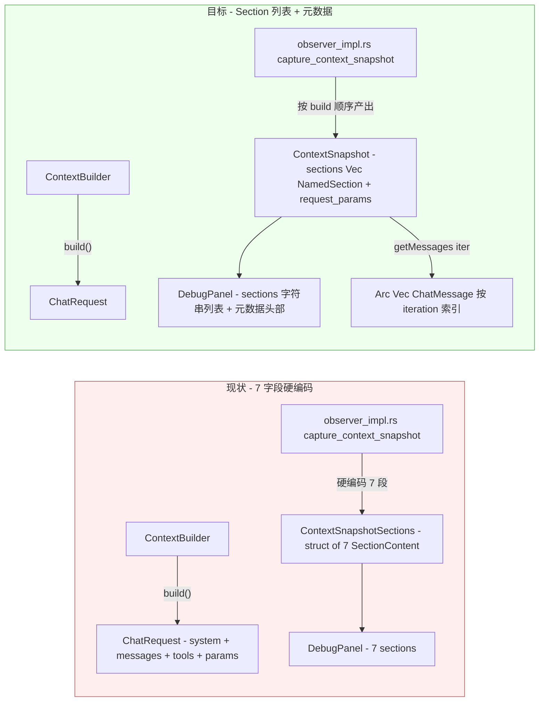

# ADR-054：Debug Context 快照覆盖扩展 — Section 列表化 + messages / todo / request_params 纳入快照

**状态**：已实施（2026-09-12 草案 → 同日 4 步完成；实施记录见 §9）
**日期**：2026-09-12
**决策者**：大鱼
**前置**：
- [ADR-013](./ADR-013-debug-observer-pipeline.md)（Debug 模块边界重构 — Observer Pipeline 模式）
- [ADR-040](./ADR-040-runtime-adapter-use-case-layer.md)（Runtime adapter → UseCase service 模式 — late-bind slot）
- [ADR-048](./ADR-048-debug-protocol-mqtt-http.md)（Debug Protocol 迁至 MQTT events + HTTP RPC）

---

## 1. 决策摘要

当前 Debug Panel 7 个 context 快照 section（`system_prompt` / `workspace_context` / `environment` / `tool_definitions` / `skill_instructions` / `retrieved_memory` / `identity_context`）与后端 `ContextBuilder::build()` 实际发给 LLM 的内容存在三类覆盖缺口：

1. **对话消息（messages）完全不在快照里** —— `ChatRequest` 把 `history.messages()` 拼到 system message 之后一起发出（`context.rs:466-474`），��� `ConversationSnapshot` 只存 `message_count`，没有消息体（`controller.rs:31-49`、`handlers.rs:211` 仍是 TODO）。这是 debug 最大的盲区。
2. **三段 system prompt 段被合并或丢失**：`ambiguous_confirmation_hint`（P3-4 冲突确认提示）和 `todo_context`（active task list）完全没进快照；`workspace_prompt_file`（CLAUDE.md / AGENTS.md）被直接拼到 `system_prompt` 里，无法独立 patch。
3. **ChatRequest 控制参数对调试不可见**：`temperature` / `max_tokens` / `reasoning_effort` / `thinking_mode` / 实际使用的 `model` 都不在快照里，排查"为何 LLM 返回异常"时第一手信息拿不到。

本 ADR 做三件事：

1. **把 7 字段硬编码的 `ContextSnapshotSections` 重构为内容寻址的 `Vec<SectionMeta>` 列表**，懒加载接口（`getSection`）一并泛化。`PatchSet` 同样改为 `HashMap<String, PatchValue>`。
2. **新增四个 section 与一个顶层元数据块**：
   - section：`messages`（对话消息全文）、`todo_context`（任务列表）、`ambiguous_confirmation_hint`（冲突确认提示）、`workspace_prompt_file`（独立呈现，与 `system_prompt` 解耦）
   - 顶层元数据：`request_params = { model, temperature, max_tokens, reasoning_effort, thinking_mode }`
3. **调整后端 `capture_context_snapshot()`**：不再把 `workspace_prompt_file` 拼到 `system_prompt` 里；section 列表按"build() 实际注入顺序"产出，方便 UI 复刻 LLM 实际看到的 system prompt。



---

## 2. 背景与动机

### 2.1 Debug Panel 现状

`apps/acowork-desktop/src/components/debug/DebugPanel.tsx:24-42` 定义了 7 个 section：

```typescript
export const SECTION_LABELS: Record<string, string> = {
  system_prompt: "System Prompt",
  workspace_context: "Workspace Context",
  environment: "Environment",
  tool_definitions: "Tool Definitions",
  skill_instructions: "Skill Instructions",
  retrieved_memory: "Retrieved Memory",
  identity_context: "Identity Context",
};
```

后端 `core/acowork-runtime/src/debug/observer_impl.rs:350-382` 的 `capture_context_snapshot()` 完全镜像这 7 个 section，**前后端 100% 对齐**——这是好的。

但「与前端对齐」≠「覆盖完整」。真正发给 LLM 的 `ChatRequest` 由 `ContextBuilder::build()`（`context.rs:389-647`）构造，包含的不止这 7 段文本。

### 2.2 三类覆盖缺口

#### 缺口 A：对话消息完全缺失

`context.rs:466-474` 把 `history.messages()` 整段追加到 system message 之后：

```rust
// 7. Conversation history
messages.extend(
    history
        .messages()
        .iter()
        .filter(|m| !matches!(m.role, MessageRole::System))
        .cloned(),
);
```

但 `ConversationSnapshot`（`controller.rs:31-49`）只存了 4 个标量：

```rust
pub struct ConversationSnapshot {
    pub id: String,
    pub iteration: u32,
    pub message_count: usize,        // ← 只有数量，没有内容
    pub cumulative_usage: DebugUsage,
    pub timestamp_ms: i64,
}
```

`handlers.rs:211` 那里还有个明显的 TODO：`messages: Vec::new(), // TODO: populate in S2.3 with actual messages`。

**这是 Debug 最大的盲区**——遇到 agent 行为异常时（幻觉、循环、跑偏），运维第一反应是看"LLM 实际看到了哪些 user 消息、tool 结果、assistant 回复"，现在这些信息根本不存在快照里，只能去翻运行时日志。

#### 缺口 B：system prompt 内的三段文本被合并/丢失

读 `context.rs:389-457` 的 `build()`，注入到 system message 的所有段，按顺序：

| 注入顺序 | 来源字段 | `build()` 行号 | 当前快照处理 |
|---|---|---|---|
| 1 | `system_prompt`（基础 prompt） | 400 | ✅ `system_prompt` section |
| 2 | `identity_context` | 402-407 | ✅ `identity_context` section |
| 3 | `workspace_context` | 410-413 | ✅ `workspace_context` section |
| 4 | `retrieved_memory` | 415-418 | ✅ `retrieved_memory` section |
| 5 | `ambiguous_confirmation_hint` | 420-427 | ❌ **完全丢失** |
| 6 | `skill_instructions` | 429-432 | ✅ `skill_instructions` section |
| 7 | `todo_context` | 434-437 | ❌ **完全丢失** |
| 8 | `environment_override` / `detect_environment_text()` | 439-447 | ✅ `environment` section |
| 9 | `workspace_prompt_file` | 449-453 | ⚠️ **被合并到 `system_prompt`**（见 `observer_impl.rs:342-348`） |

三个有问题的字段：

- **`ambiguous_confirmation_hint`**（P3-4 新功能，`context.rs:39,341-343`）——当 ≥3 个 pending ambiguous conflict 时，提示 Agent 自然地让用户消歧。Agent 突然开始问消歧问题时，运维需要看这提示是不是被错误触发 / 内容是否合理。**当前完全看不到**。
- **`todo_context`**（`context.rs:44-47,265-267`）——Agent 内部的 active task list。Agent 在错误 todo 上循环时，运维最需要看的就是这个列表。**当前完全看不到**。
- **`workspace_prompt_file`**（CLAUDE.md / AGENTS.md，`context.rs:22-23,166-176`）——`observer_impl.rs:342-348` 把它的内容拼到 `system_prompt` section 里：

  ```rust
  let base_prompt = req.context_builder.system_prompt();
  let prompt_file_section = req
      .context_builder
      .workspace_prompt_file()
      .map(|content| format!("\n\n## Workspace Prompt File\n{content}"))
      .unwrap_or_default();
  let full_system_content = format!("{base_prompt}{prompt_file_section}");
  ```

  后果：**`system_prompt` 编辑面板里看到的"## Workspace Prompt File"段落其实是 CLAUDE.md 的内容**，用户编辑 `system_prompt` 时会无意中改掉 CLAUDE.md——混淆了"agent 自带 prompt"与"workspace 配置文件"两个本应独立的可调对象。

#### 缺口 C：ChatRequest 控制参数不可见

`ChatRequest` 在 `context.rs:639-647` 构造：

```rust
ChatRequest {
    model,                  // ← 实际使用的 model
    messages,
    temperature,            // ←
    max_tokens,             // ← 经过 capabilities + hard cap + 安全压缩后的最终值
    tools: self.tool_definitions.clone(),
    reasoning_effort,       // ←
    thinking_mode,          // ←
}
```

但快照里完全没有这些字段。运维排查"为何 LLM 这次返回很短 / 被截断 / 没思考"时，第一手要确认的恰恰是 `max_tokens` 和 `reasoning_effort`，现在得翻日志才能拿到。

### 2.3 既有架构已经为扩展做了铺垫

好消息是当前架构已经预留了三个有利条件：

1. **Section 是懒加载的**（`controller.rs:77-100` 的 `SectionContent` + `debug/handlers.rs` 的 `getSection` RPC）——新增 section 只需复用同一模式，不会破坏 lazy loading 语义。
2. **DebugEvent 通过 MQTT pub/sub 推送**（ADR-048）——`onContextBuilt` 事件 payload 用 `ContextSections` 结构，新增字段向前兼容（`serde(skip_serializing_if = "Option::is_none")`）。
3. **PatchSet 已经用 Option 字段表达"该字段未 patch"**（`protocol.rs:158-173`）——泛化到 `HashMap` 时语义不变。

---

## 3. 决策

### 3.1 Section 列表化（核心结构性变更）

#### 后端

把 `core/acowork-runtime/src/debug/controller.rs:67-75` 的硬编码 7 字段结构改成内容寻址列表：

```rust
// 改前
pub struct ContextSnapshotSections {
    pub system_prompt: SectionContent,
    pub workspace_context: SectionContent,
    pub environment: SectionContent,
    pub tool_definitions: SectionContent,
    pub skill_instructions: SectionContent,
    pub retrieved_memory: SectionContent,
    pub identity_context: SectionContent,
}

// 改后
pub struct ContextSnapshotSections {
    /// 按 build() 注入顺序排列的 section 列表
    pub sections: Vec<NamedSection>,
}

pub struct NamedSection {
    /// Section 键名（如 "system_prompt", "messages"）
    pub key: String,
    pub content: SectionContent,
}

impl ContextSnapshotSections {
    /// 按 key 查找 section 元数据（O(n)，n ≤ ~10，无需索引）
    pub fn find(&self, key: &str) -> Option<&NamedSection> { ... }

    /// 按 key 取出内容（用于 lazy fetch）
    pub fn get_content(&self, key: &str) -> Option<&SectionContent> { ... }
}
```

`ContextSnapshot` 自身增加顶层 `request_params` 字段：

```rust
pub struct ContextSnapshot {
    pub iteration: u32,
    pub built_at: chrono::DateTime<chrono::Utc>,
    pub sections: ContextSnapshotSections,
    pub total_token_estimate: usize,
    pub request_params: RequestParams,   // ← 新增
}

#[derive(Debug, Clone, Serialize, Deserialize)]
pub struct RequestParams {
    pub model: String,
    pub temperature: Option<f64>,
    pub max_tokens: Option<u32>,
    pub reasoning_effort: Option<String>,
    pub thinking_mode: Option<String>,
}
```

#### 消息存储

在 `DebugController` 上新增 `messages_by_iteration: HashMap<u32, Arc<Vec<ChatMessage>>>` 字段。**存储策略**：

- 快照时 `Arc::clone(history.messages())` 浅引用持有，避免深拷贝。
- `truncate_snapshots_after` 时按 iteration 清理（`controller.rs:314-318` 已有现成模式）。
- `messages` section 的 `SectionContent` 只存元数据（`size_bytes` / `token_estimate` / `hash`），不存内容；`getSection(iteration, "messages")` 时从 `messages_by_iteration` 取 `Arc` 引用、序列化为 JSON 返回��
- 内存占用：每个 iteration 的消息体都是浅引用整段 history 的快照（`Arc<Vec<ChatMessage>>` 共享底层 buffer）。多个 iteration 共享同一底层数组（增量式），旧 iteration 多一份增量成本。

#### observer_impl.rs 调整

`capture_context_snapshot()`（`observer_impl.rs:335-405`）重构：

> **前置依赖**：步骤 2 需要先在 `ContextBuilder` 上补齐 `temperature()` / `thinking_mode()` 访问器（当前只有 `set_temperature()` / `set_thinking_mode()`，没有 getter，参考 `reasoning_effort()` 在 `context.rs:130-132` 的写法补全）。

```rust
let mut named: Vec<NamedSection> = Vec::with_capacity(11);

// 严格按 build() 注入顺序产出（与 system_content 拼装顺序一致）
named.push(NamedSection::new("system_prompt", req.context_builder.system_prompt(), req.model));

if let Some(identity) = req.context_builder.identity_context() {
    named.push(NamedSection::new("identity_context", identity, req.model));
}
if let Some(ws) = req.context_builder.workspace_context() {
    named.push(NamedSection::new("workspace_context", ws, req.model));
}
if let Some(mem) = req.context_builder.retrieved_memory() {
    named.push(NamedSection::new("retrieved_memory", mem, req.model));
}
if let Some(hint) = req.context_builder.ambiguous_confirmation_hint() {   // ← 新增
    named.push(NamedSection::new("ambiguous_confirmation_hint", hint, req.model));
}
if let Some(skills) = req.context_builder.skill_instructions() {
    named.push(NamedSection::new("skill_instructions", skills, req.model));
}
if let Some(todos) = req.context_builder.todo_context() {                // ← 新增
    named.push(NamedSection::new("todo_context", todos, req.model));
}
let env_text = req.context_builder.environment_override()
    .map(|s| s.to_string())
    .unwrap_or_else(crate::agent::context::detect_environment_text);
named.push(NamedSection::new("environment", env_text, req.model));

if let Some(prompt_file) = req.context_builder.workspace_prompt_file() {  // ← 独立呈现，不再合并
    named.push(NamedSection::new("workspace_prompt_file", prompt_file, req.model));
}

// tool_definitions 单独计算（JSON 序列化）
named.push(NamedSection::new("tool_definitions", tool_defs_str, req.model));

// messages 特殊处理：只存元数据，内容从 messages_by_iteration 懒加载
let messages_json = serde_json::to_string(history.messages())?;
named.push(NamedSection::new("messages", messages_json, req.model));
```

`build()` 函数本身**不变**——`workspace_prompt_file` 仍然以 `## Workspace Prompt File` 段拼到 system_content。改的是**快照侧不再合并**，让 UI 可以分别编辑。

#### 协议层

`protocol.rs:97-105` 的 `ContextSections` 同步改成 `Vec<SectionMeta>`：

```rust
// 改后
#[derive(Debug, Clone, Serialize, Deserialize)]
pub struct ContextSections {
    pub sections: Vec<SectionMeta>,
}
```

`debug/events.rs:54-58` 的 `DebugEvent::ContextBuilt` payload 同步更新（只改字段类型，事件 schema 仍然向前兼容，旧客户端会忽略未识别的 `request_params` 字段）。

#### PatchSet 泛化

`protocol.rs:158-173` 的 `PatchSet` 改为 `HashMap<String, PatchValue>`，通过 `serde(tag = "type")` 区分 string / vec / json：

```rust
#[derive(Debug, Clone, Default, Serialize, Deserialize)]
pub struct PatchSet {
    /// Key = section 名（"system_prompt" / "messages" / "workspace_prompt_file" ...）
    /// Value = 要 patch 成的内容；None 表示不 patch（与现状语义一致）
    #[serde(flatten)]
    pub patches: HashMap<String, PatchValue>,
}

#[derive(Debug, Clone, Serialize, Deserialize)]
#[serde(tag = "type", rename_all = "lowercase")]
pub enum PatchValue {
    Text { value: String },
    Json { value: serde_json::Value },
}
```

> **替代方案（已否决）**：保留 `PatchSet` 为 Option 字段结构，仅新增 4 个字段（`messages`、`todo_context`、`ambiguous_confirmation_hint`、`workspace_prompt_file`）。否决理由：每次新增 section 都要改 struct 定义、`apply_patches()` 实现、`PatchSet::merge()` 实现三处，是 §2 描述的"7 字段硬编码"问题的延续。下次再加 section 还是会撞同一堵墙。

### 3.2 前端适配

`apps/acowork-desktop/src/components/debug/DebugPanel.tsx:24-42`：

```typescript
// 改后：section 列表不再硬编码，由 snapshot.sections 动态驱动
export const SECTION_LABELS: Record<string, string> = {
  system_prompt: "System Prompt",
  workspace_context: "Workspace Context",
  environment: "Environment",
  tool_definitions: "Tool Definitions",
  skill_instructions: "Skill Instructions",
  retrieved_memory: "Retrieved Memory",
  identity_context: "Identity Context",
  workspace_prompt_file: "Workspace Prompt File (CLAUDE.md / AGENTS.md)",
  todo_context: "Active Task List",
  ambiguous_confirmation_hint: "Memory Conflicts Hint",
  messages: "Conversation Messages",
};

export const SECTION_ORDER = [
  // 与后端 build() 注入顺序严格一致，让 UI 复刻 LLM 实际看到的 system prompt
  "system_prompt",
  "identity_context",
  "workspace_context",
  "retrieved_memory",
  "ambiguous_confirmation_hint",
  "skill_instructions",
  "todo_context",
  "environment",
  "workspace_prompt_file",
  "tool_definitions",
  "messages",
];
```

`SECTION_ORDER` 的存在是为了让 UI 按 build() 顺序渲染（运维看到的就是 LLM 实际看到的 system prompt 拼接顺序），但**渲染时仍过滤掉 `snapshot.sections` 里没有的 key**——保证新装包 / 未启用某个 section 的 agent 不会出现空白。

`SnapshotNode` 组件（`DebugPanel.tsx:109-329`）调整：

- 头部新增一行元数据条：`Model: gpt-4o · Temperature: 0.7 · max_tokens: 4096 · reasoning: medium · thinking: adaptive`（从 `snapshot.request_params` 读，缺省项折叠）
- section 列表改为遍历 `snapshot.sections`（不再硬编码 7 项）
- `getSection` 函数签名不变：`(iteration, sectionKey) → Promise<SectionContent>`，新增 `"messages"` 的处理分支（后端按 JSON 数组返回；前端展示成可折叠列表 + 单条 token/hash）
- `editingSection` / `patchContext` 调用不变，但 PatchSet payload 改为 `HashMap` 形式

### 3.3 持久化与回滚

- `truncate_snapshots_after`（`controller.rs:315-321`）扩展为同时清理 `messages_by_iteration` 中 `iteration > target` 的条目。
- `DebugController::reset()`（`controller.rs:323-329`）同步清理。
- `store_context_snapshot` 入库前先 `messages_by_iteration.insert(iteration, Arc::clone(history.messages()))`。

### 3.4 不在本次范围

- **多模态内容（图片）的 base64 摘要**——见 §2.3 的"低 debug 价值 + 中高成本"，留到未来按需扩展；本轮 messages section 用 `serde_json::to_string(history.messages())` 序列化即可，图片 base64 会出现在 JSON 里但**只在用户主动展开 messages 时才传输**（懒加载）。
- **Tool call / Tool result 的可视化染色**——当前 `ChatMessage` 序列化后能区分 role，但 UI 不区分 `tool_call` vs `tool_result`。本次只把 messages 暴露出来，染色（不同颜色 / 可折叠 tool_calls 字段）作为下一轮 UI polish。
- **跨 session 的 message diff**——本次不实现，需要等 messages section 在野运行一段时间、确认稳定后再决定是否值得加。

---

## 4. 实施步骤

按依赖顺序拆 4 个独立可提交的步骤，每步都是自洽的、可以单独 review/test：

### 步骤 1：snapshot section 列表化（不引入新 section）

只改结构，不改内容。**已知触点清单**（改前用 `git grep` 全部找到，列出避免遗漏）：

1. `debug/controller.rs:67-75`：`ContextSnapshotSections` 改为 `Vec<NamedSection>`
2. `debug/protocol.rs:97-105`：`ContextSections` 同步
3. `debug/observer_impl.rs::capture_context_snapshot`（`:335-405`）：产出 `Vec<NamedSection>`，仍只填原来 7 个 section
4. `debug/handlers.rs:277-291`（`getSection` 的 match 块）：改用 `find(key)` 替代硬编码字段；测试 `debug/handlers.rs:758, 808` 同步更新断言
5. `mqtt/debug_events.rs:194-249`（`DebugEvent::ContextBuilt` 编码块）：改为遍历 `Vec<NamedSection>` 构造 `HashMap<String, SectionMeta>`，测试 `mqtt/debug_events.rs:399` 同步更新
6. `PatchSet`（`protocol.rs:158-173`）同步改为 `HashMap<String, PatchValue>`，`apply_patches()` 适配；`debug/handlers.rs::handle_patch_context` 测试同步更新
7. 前端 `DebugPanel.tsx`：遍历 `snapshot.sections` 而非硬编码 7 个 key

测试：`cargo test -p acowork-runtime debug::` + `cargo test -p acowork-runtime mqtt::debug_events::` + 现有 10 个 RPC handler 测试不应回归。

### 步骤 2：新增顶层 `request_params`

1. `protocol.rs` 加 `RequestParams` 结构
2. `ContextSnapshot` 加字段
3. `observer_impl.rs` 从 `req.context_builder` 收集 model / temperature / max_tokens / reasoning_effort / thinking_mode
4. `handlers.rs::get_state` 把 `request_params` 序列化进响应
5. 前端 `SnapshotNode` 头部加元数据条

### 步骤 3：拆 `workspace_prompt_file` + 新增 `todo_context` / `ambiguous_confirmation_hint`

1. `observer_impl.rs::capture_context_snapshot` 不再把 `workspace_prompt_file` 拼到 `system_prompt`
2. 新增 3 个 NamedSection：`workspace_prompt_file` / `todo_context` / `ambiguous_confirmation_hint`
3. 前端 `SECTION_ORDER` / `SECTION_LABELS` 加对应条目
4. `PatchSet` 自动支持（步骤 1 已泛化）

### 步骤 4：messages section（最大块）

1. `DebugController` 加 `messages_by_iteration: HashMap<u32, Arc<Vec<ChatMessage>>>`
2. `capture_context_snapshot` 把 `Arc::clone(history.messages())` 入库 + 元数据 section
3. `handlers.rs` 加 `getMessages(iteration)` 返回 JSON 数组（实际上就是 `getSection(iteration, "messages")` 的特例，无需新 handler，复用 `get_section` 即可）
4. `truncate_snapshots_after` / `reset` 清理
5. 前端 `messages` section 渲染：`SectionContent` 的 content 是 JSON 字符串，UI 反序列化为数组、逐条显示 role + 文本 + token_calls（折叠）

---

## 5. 验证

| 验证项 | 方法 |
|---|---|
| 后端 7 section 数据不丢 | 现有 snapshot 测试（`debug::` 模块）+ adapter handler 测试 |
| 新增 4 section 在 build() 各分支下都正确出现 | 单元测试：mock `ContextBuilder` 各种状态，断言 `capture_context_snapshot` 返回的 `sections` 列表符合预期 |
| `messages` section 元数据正确、懒加载路径可工作 | 单元测试：构造 ≥10 条消息的 `HistoryManager`，断言 snapshot 后 `messages_by_iteration` 持有、调用 `get_section(iter, "messages")` 返回的 JSON 与原消息数组 deep equal |
| `truncate_snapshots_after` 同时清理 messages | 单元测试：插入 5 个 iteration，rewind 到 3，断言 `messages_by_iteration` 只剩 ≤ 3 |
| PatchSet HashMap 序列化 / 反序列化 | serde 测试：构造含 4 种 section 类型的 PatchSet，序列化后用旧版 DebugPanel mock 反序列化能识别 |
| 前端 DebugPanel 渲染 11 section 顺��� | snapshot 测试：手工构造一个完整 snapshot fixture，断言渲染顺序与 `SECTION_ORDER` 一致 |
| `request_params` 元数据条显示 | snapshot 测试：mock 含 / 不含各项的 `RequestParams`，断言渲染元数据条正确折叠 |
| 端到端：手动触发 patchContext 改 `messages` 后下一轮迭代 LLM 看到改后的消息 | 集成测试：构造 history，patch `messages` 替换为简化版本，触发下一轮 `build_chat_request`，断言 LLM 收到的 messages 与 patch 一致 |

---

## 6. 风险与缓解

| 风险 | 影响 | 缓解 |
|---|---|---|
| `messages_by_iteration` 内存增长 | 中——每个 iteration 持有 `Arc<Vec<ChatMessage>>`，深拷贝 history 整体大小 | 用 `Arc` 共享底层 buffer；多 iteration 之间共享同一份连续 buffer（增量追加）。若实测 ≥ 100 iteration 后单 session 占用 > 100MB，引入 LRU 淘汰策略（保留最近 N=20 iteration）。 |
| 序列化 `messages` 为 JSON 字符串可能很大 | 中——长 history 序列化后 token 数很高，懒加载可缓解但首次序列化仍 O(n) | 懒加载只在用户主动展开时序列化；考虑后续改为 binary（bincode）减少体积 |
| `PatchSet` 改为 HashMap 后失去类型安全 | 低——拼写错误的 section 名不会在编译期发现 | `apply_patches()` 接收 `known_sections: &[&str]`，不在列表中的 key 返回 `PatchError::UnknownSection`，提示用户拼写错误 |
| 前端旧客户端收到新 schema 的 `ContextSections`（Vec 而非 struct） | 低——既有 Desktop 客户端是单一部署，新旧不混 | MQTT payload 加 `version: u32` 字段；Runtime 解析失败时降级为忽略 `sections`、保留 `phase` / `iteration` 元数据 |
| 多模态 base64 出现在 messages JSON 里 | 中——UI 展开 messages 时会一次性加载所有图片 | 渲染层做轻量预览（首图缩略图 + "查看原图" 链接）；后续可单独迭代 |
| 4 个步骤串行合并 vs 拆分提交的工程取舍 | — | 步骤 1 是结构性变更，必须单独提交并经过完整测试；步骤 2-4 之间相对独立可并行 PR |

---

## 7. 检查清单（提交时核对）

- [x] 步骤 1：snapshot section 列表化 + PatchSet HashMap 化，所有 debug 模块测试通过
- [x] 步骤 2：顶层 `request_params` 元数据条，前端渲染验证
- [x] 步骤 3：3 个新 section（`workspace_prompt_file` / `todo_context` / `ambiguous_confirmation_hint`）元数据正确
- [x] 步骤 4：`messages_by_iteration` 懒加载路径 + rewind 清理
- [x] DebugPanel 渲染顺序与 `build()` 注入顺序一致
- [ ] Desktop 端到端冒烟：触发一次 debug session，确认 11 个 section 都能展开 / 编辑 / rewind
- [ ] CLI（acowork CLI）若有 debug 命令，同步更新（`git grep "section.*system_prompt"` 确认无遗漏）

---

## 8. 相关文档

- ADR-013（Debug 模块边界重构 — Observer Pipeline 模式）：本次重构在 Observer Pipeline 框架内进行
- ADR-040（Runtime adapter → UseCase service 模式）：lazy slot 模式不变，新增 service 不需要再调结构
- ADR-048（Debug Protocol 迁至 MQTT events + HTTP RPC）：新增 section 通过 MQTT `onContextBuilt` 事件向前兼容推送
- `docs/design/10-debug-protocol.md`：协议 DTO 已同步更新（§3.4 快照结构、§3.5 patch 格式、对比表）

---

## 9. 实施记录（2026-09-12）

### 步骤 1 — Section 列表化（后端 + MQTT + 前端）

- `debug/protocol.rs`：`SectionMeta` 增加 `key`；`ContextSections` 改为 `{ sections: Vec<SectionMeta> }`；`PatchSet` 改为 `HashMap<String, PatchValue>`（`{type: "text"|"json", value}`）；新增 `PatchError` / `KNOWN_SECTION_KEYS`。
- `debug/controller.rs`：`ContextSnapshotSections` 改为 `Vec<NamedSection>`（新增 `find` / `get_content` / `total_token_estimate`）；`From<&ContextSnapshotSections> for ContextSections` 遍历产出。
- `debug/observer_impl.rs`：`capture_context_snapshot` 产出 `Vec<NamedSection>`（步骤 1 仍为原 7 section，步骤 3 扩展）。
- `debug/handlers.rs`：`getSection` 改用 `find(key)`；`patchContext` 按 `KNOWN_SECTION_KEYS` 校验 + HashMap 反射。
- `agent/context.rs`：`apply_patches` 适配 `PatchSet` 新结构（返回 `Result<(), PatchError>`）。
- `mqtt/debug_events.rs`：`ContextBuilt` 编码改为遍历 `Vec<SectionMeta>` 构造 proto map（wire 仍是 `map<string, SectionMeta>`，**向前兼容**）。
- 前端 `debugStore.ts` / `DebugPanel.tsx`：`snapshot.sections` 归一化为 `SectionMeta[]`（MQTT map → 数组），渲染遍历 + `SECTION_ORDER` 排序；`patchContext` 自动把 JS 值包装为 `{type, value}`。

### 步骤 2 — 顶层 request_params

- `agent/context.rs`：补 `temperature()` / `thinking_mode()` getter。
- `debug/protocol.rs`：新增 `RequestParams`（model / temperature / max_tokens / reasoning_effort / thinking_mode）。
- `debug/observer.rs`：`ContextSnapshotRequest` 增加 `max_tokens: Option<u32>`（`build()` 内计算，调用点从最终 `ChatRequest` 传入）。
- `debug/observer_impl.rs`：构造 `RequestParams` 写入 snapshot。
- `debug/handlers.rs`：`GetContextSnapshotResult` 与 `DebugStateSnapshot` 均携带 `request_params`。
- 前端：`SnapshotNode` 展开时显示元数据条（缺省项折叠）。

### 步骤 3 — 拆 workspace_prompt_file + 新增 todo / ambiguous sections

- `agent/context.rs`：补 `ambiguous_confirmation_hint()` / `todo_context()` getter；`apply_patches` 支持 3 个新 section（空串清除语义）。
- `debug/protocol.rs`：`KNOWN_SECTION_KEYS` 加 3 个 key。
- `debug/observer_impl.rs`：`capture_context_snapshot` 按 `build()` 注入顺序产出 10 个 section（`system_prompt` **不再合并** workspace_prompt_file）。
- 前端：`SECTION_LABELS` / `SECTION_ORDER` 增加对应条目。

### 步骤 4 — messages section（懒加载）

- `debug/controller.rs`：`messages_by_iteration: HashMap<u32, Arc<Vec<ChatMessage>>>`；`store_messages` / `get_messages`；`truncate_snapshots_after` / `reset` 同步清理。
- `debug/observer.rs`：`ContextSnapshotRequest` 增加 `history: &HistoryManager`。
- `debug/observer_impl.rs`：快照时 `Arc::new(history.messages().to_vec())` 入库；`messages` section 仅存元数据（`SectionContent::metadata_only`）。
- `debug/handlers.rs`：`getSection(iteration, "messages")` 特判——从 `messages_by_iteration` 序列化返回 JSON（复用 getSection，无新 handler）。
- 前端：`MessagesView` 组件（role 徽章 + content + 可折叠 tool_calls / reasoning_content）；messages 只读（编辑按钮隐藏）。

### 验证结果

- `cargo test -p acowork-runtime -- debug::`：24 passed（含新增 messages 懒加载 / 未知 section 拒绝测试）
- `cargo test -p acowork-runtime -- mqtt::debug_events::`：3 passed
- `cargo test -p acowork-runtime --lib`：918 passed / 0 failed
- `cargo clippy -p acowork-runtime --lib`：0 warning
- `cargo build -p acowork-runtime -p acowork-gateway`：通过
- `tsc --noEmit`：0 错误
- `vitest run`：128 passed（8 文件）

### 与 ADR §5 验证表的偏差

| 验证项 | 状态 | 说明 |
|---|---|---|
| 后端 7 section 数据不丢 | ✅ | 现有测试全部通过 |
| 新增 section 在 build() 各分支下正确出现 | ✅ | 步骤 3 产出 10 section；未启用分支由 `if let Some` 自然省略 |
| messages 元数据 + 懒加载 | ✅ | 新增 2 个 handlers 测试 |
| truncate 同时清理 messages | ✅ | `truncate_snapshots_after` 同步 retain |
| PatchSet HashMap 序列化 | ✅ | serde tag 结构 + 前端归一化 |
| 前端渲染顺序 | ✅ | `SECTION_ORDER` 与 `build()` 一致 |
| request_params 元数据条 | ✅ | `SnapshotNode` 折叠展示 |
| **端到端：patch messages 后 LLM 看到改后消息** | ⏳ 未实现 | ADR 步骤 4 清单未包含 patch messages（仅可见性）；此集成测试需 SessionTask 在 reExecute 时把 pending messages patch 应用到 history，留作后续 |

---

## 10. 实施修订记录（2026-09-12 后续）

代码审查后修复两项架构级问题（ADR-054 §6 风险缓解的真正落地）：

### 10.1 messages 浅引用落地（替代深拷贝）

**问题**：步骤 4 实现用 `Arc::new(req.history.messages().to_vec())` 每轮全量深拷贝 history，与 §3.1/§6 声明的"`Arc::clone` 浅引用共享底层 buffer"不符——`HistoryManager::messages()` 返回 `&[ChatMessage]` 切片，无法浅引用。

**修复**：
- `agent/history.rs`：`messages: Vec<ChatMessage>` → `Arc<Vec<ChatMessage>>`；所有 11 处修改点（append / extend / load_restored / clear / truncate_to / trim_fifo / emergency_trim / fit_to_budget_lossless / abandon_tool_result / retrieve_tool_result / replace_middle_with_summary）改经 `Arc::make_mut`（copy-on-write）；`messages_mut()` 签名不变（内部 make_mut），`messages()` 签名不变（返回 `as_slice()`）。
- 新增 `HistoryManager::messages_arc() -> Arc<Vec<ChatMessage>>`（O(1) 克隆）；`observer_impl.rs` 快照改为持有该浅引用，**不再 to_vec**。
- 语义：多个 iteration 之间 messages 未修改时共享同一底层 buffer（零拷贝）；修改时 COW 复制一次；非 debug 模式 refcount==1 走 `Arc::get_mut` 快速路径零复制。
- 新增测试：`messages_arc_is_shallow_and_copy_on_write`（共享 + COW + ptr_eq 断言）、`messages_arc_survives_rewind_truncate`（rewind 后旧快照仍持有完整历史）。

### 10.2 patch 语义收敛为单一源（消除预览/应用不一致）

**问题**：步骤 1 后 patch 语义在 `handlers.rs::handle_patch_context`（snapshot 预览）与 `context.rs::apply_patches`（实际应用）两处重复实现，存在 3 处边界不一致：tool_definitions 非数组预览成功但应用拒绝；workspace_prompt_file / todo_context 空串预览显示空串但应用置 None；ambiguous_confirmation_hint 空串无清除语义。且类型不匹配仅在下一轮 build 时静默打日志，RPC 无反馈。

**修复**：
- `agent/context.rs`：新增 `ResolvedPatch` 枚举 + `resolve_patch(key, value) -> Result<ResolvedPatch, PatchError>`——类型校验、空串清除、tool_definitions 数组校验收敛为**唯一语义源**；`apply_patches` 与 `handle_patch_context` 共用。
- 三个 ADR-054 step-3 section 空串统一为 Clear（`ambiguous_confirmation_hint` 补齐清除，新增 `clear_ambiguous_confirmation_hint()`）。
- `handlers.rs::handle_patch_context`：**前置** resolve 全部 patch（与 snapshot 是否存在解耦），类型不匹配 / 非数组 / 未知 key 一律返回 `DebugError::InvalidParams`（用户可见）；Clear 时 snapshot 同步移除该 section（build() 将省略）。
- 移除 `protocol.rs::KNOWN_SECTION_KEYS` 常量（校验收敛到 `resolve_patch`，避免误导）。
- 新增测试：handlers 3 个（类型不匹配拒绝、非数组 tool_definitions 拒绝、空串清除 snapshot 移除）+ context 3 个（空串清除 + build 省略、类型不匹配/非数组拒绝、environment 空串 fallback）。

### 修订后验证

- `cargo test -p acowork-runtime --lib`：**926 passed / 0 failed**（较修订前 +8）
- `cargo clippy -p acowork-runtime --lib`：0 warning
- `cargo build -p acowork-runtime -p acowork-gateway`：通过
- `cargo test -p acowork-runtime -- mqtt::debug_events::`：3 passed

---

### 10.3 实测问题修复（2026-09-12 第二轮）

编译后实测发现 3 个问题，逐一修复：

#### 10.3.1 messages 快照缺当轮 assistant 回复

**问题**：每轮 user/assistant 对话结束，`getSection(iteration, "messages")` 只显示 user 消息；下一轮 iteration 的 messages 才包含上一轮 assistant 回复。

**根因**：`messages_by_iteration[N]` 在 `on_context_built`（LLM 调用**前**）捕获——快照语义是"构建时点历史"，天然不含当轮回复。

**修复**：新增迭代完成钩子 `DebugObserver::on_iteration_complete(history)`：
- `controller.rs`：`DebugController::store_messages_with_meta(iteration, messages, model)`——更新 `messages_by_iteration` 并同步重算 snapshot 中 messages section 的 size/token/hash 元数据（保持 getSection 返回值与懒加载内容一致）。
- `observer_impl.rs`：`on_iteration_complete` 用 `ctrl.iteration`（on_iteration_start 已 +1）更新当前迭代快照。
- `loop_.rs`：主循环 `flush_pending_title()` 后、`match iteration_result` 前调用——**所有退出路径**（TextResponse / Stopped / ToolCallsExecuted / Paused）统一覆盖。
- 语义：iteration N 的 messages = iteration N 完成后的完整对话（含当轮 assistant 回复 / 工具结果）；UI 标签同步改为 "as of iteration end"。
- 新增测试：`store_messages_with_meta_updates_messages_and_section_meta`、`store_messages_with_meta_without_snapshot_is_meta_noop`。

#### 10.3.2 ChatRequest 参数（request_params）面板不显示

**问题**：ADR §2 声明的 request_params 元数据条实际不显示。

**根因**（三处断裂）：
1. `DebugEvent::ContextBuilt`（events.rs）及 MQTT proto `DebugContextBuiltEvent` 均**不携带** request_params——事件驱动的 snapshot 永远是空默认值；
2. 前端 `getContextSnapshot` RPC 有实现但**从未被调用**；
3. `DebugPanel` 只渲染 `snapshot.request_params`（事件为空），顶层 getState 的 requestParams 未渲染。

**修复**（事件携带为主，RPC re-sync 兜底）：
- `proto/mqtt_payload.proto`：新增 `message RequestParams`；`DebugContextBuiltEvent` 加 `RequestParams request_params = 5`。
- `events.rs` / `observer_impl.rs` / `mqtt/debug_events.rs`：事件携带 request_params 编码。
- `chat_mqtt.rs`：decode 后 JSON 透传 `request_params`。
- `debugStore.ts`：`onContextBuilt` 事件直接填充；`connect()` 增加 **snapshot re-sync 兜底**——对已存在 snapshot 逐个 `getContextSnapshot`（幂等 replace），覆盖事件丢失/迟到（QoS 0 语义）。
- 测试：`encode_context_built_event` 扩展断言 request_params 编码。

#### 10.3.3 retrieved_memory 无对应工具调用（非 bug，UI 澄清）

**问题**：首轮 iteration 快照显示 retrieved_memory 600+ tokens，但聊天界面没有 memory_recall 工具调用。

**结论**：**设计行为，非 bug**。该 section 来自 ADR-051 P3 `MemoryManager::retrieve_and_inject()`——每轮 user 消息在 build 前**自动检索并注入** system prompt（`loop_memory.rs`），不经过 LLM 工具调用，因此聊天流不显示。格式化内容为 `[Knowledge]` / `[Episodic]` / `[Autobiographical]` 行（`manager.rs::inject`）。

**UI 澄清**：`SECTION_LABELS` 中 retrieved_memory 标注 "(auto-injected)"，避免误认为工具调用。

**后续决策（2026-09-12）**：经实测评估，**暂时关闭每轮自动注入**（`MemoryManagerConfig::auto_inject_enabled` 默认 `false`）：
1. 不同 Agent 召回需求差异大（编程 Agent 重项目上下文、聊天 Agent 重用户偏好），一刀切注入不适用；
2. Grafeo 三元组 / 偏好记忆尚未完善，自动注入难以产生正面效果；
3. 用原始 user 消息检索命中率低（实测 retrieved_memory 内容质量不高），可能误导 LLM。

关闭后 `retrieve_and_inject_memories` 短路返回（保留 `clear_retrieved_memory` + `set_session_id` 副作用），`memory_recall` 工具不受影响。恢复方式：置 `auto_inject_enabled = true`（可 per-agent）。

### 第二轮修订后验证

- `cargo test -p acowork-runtime --lib`：**928 passed / 0 failed**（较第一轮 +2）
- `cargo clippy -p acowork-runtime --lib`：0 warning
- `cargo test -p acowork-runtime -- mqtt::`：12 passed
- `cargo check -p acowork-desktop`（src-tauri）：通过
- `tsc --noEmit`：0 错误；`vitest run`：128 passed