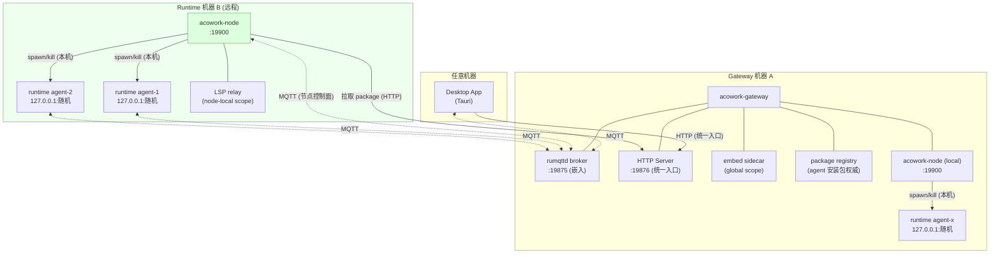

# ADR-055：Runtime 远程化部署 - Node Agent 拓扑

**状态**：已定案（待实施）
**日期**：2026-08-23
**决策者**：大鱼
**前置**：
- [ADR-033](./ADR-033-mqtt-replace-grpc-websocket.md)（MQTT 替换 gRPC + WebSocket）
- [ADR-034](./ADR-034-mqtt-http-boundary.md)（MQTT / HTTP 职责边界 - 「Gateway 不访问 Runtime 本地文件」规则）
- [ADR-018](./ADR-018-gateway-disconnection-self-exit.md)（Gateway 断连自退出 - 进程树模型）
- [ADR-019](./ADR-019-lsp-relay-standalone-process.md)（LSP Relay 独立进程）
- [ADR-030](./ADR-030-sidecar-endpoint-dynamic-push.md)（Sidecar 端点动态推送）
- [ADR-039](./ADR-039-mqtt-client-lifecycle.md)（MQTT Client 生命周期框架）

---

## 1. 决策摘要

**打破「Runtime 必须与 Gateway 同机运行」的部署约束，允许 Agent Runtime 部署在独立机器上。**

经全量代码审计（§3），结论是：**协议层已经完全具备条件**——ADR-033/034/039 建立的 MQTT 架构本来就是 IoT 设备管理模型（Runtime = 设备，Gateway = 云端），数据所有权原则、Bootstrap 合约、Will Message、重连框架全部就位。**所有阻碍都不在协议层，而在三类「同机假设」上**：

1. **进程假设**：Gateway 通过 `tokio::process::Command` 把 Runtime spawn 为本机子进程，用 OS 信号 kill、用本机 PID 探活；
2. **文件系统假设**：Agent package 目录与 workspace 是 Gateway 与 Runtime 的「共享领地」（Gateway 直接读写 install_path 与 workspace 内文件）；
3. **网络假设**：所有跨进程寻址硬编码 `127.0.0.1`（反向代理、Sidecar endpoint、MQTT 连接、Desktop MQTT 连接）。

本 ADR 决定引入 **Node Agent（`acowork-node`）**：每个可运行 Runtime 的机器部署一个轻量常驻服务，接管 Gateway 现有的「Runtime 父进程」职责（进程生命周期管理、package 管理、节点本地 Sidecar）。Gateway 收敛为三个纯网络职责：**MQTT broker 宿主、HTTP 统一入口、全局资源权威**。

三条核心决策：

| # | 决策 | 理由 |
|---|------|------|
| **D1** | **单一拓扑协议：Gateway 本机也是一个 Node（local node），单机部署与分布式部署走同一套协议** | 消除「本地模式 / 远程模式」双代码路径的架构分叉；本地模式 = Gateway spawn 一个 local Node Agent，远程模式 = 用户在目标机器手动启动 Node Agent，Gateway 侧代码零差异 |
| **D2** | **Runtime 进程保持 `127.0.0.1`-only，网络暴露职责上移给 Node Agent** | Runtime 的 HTTP server 继续绑定 loopback，Node Agent 作为节点上的反向代理 + 鉴权边界统一对外。Runtime 代码几乎零改动，安全面收敛到一个组件 |
| **D3** | **引入显式 Endpoint 模型（advertise address），替换所有隐式 `127.0.0.1` 拼接** | 分布式拓扑的根基是「网络寻址必须显式声明」。每个服务提供者（Runtime HTTP、embed、LSP relay）注册时上报**可达 endpoint**（`scheme://host:port`），而不是裸端口号 |



---

## 2. 背景与动机

### 2.1 当前部署拓扑（单机假设）

```
Desktop App (Tauri)              ← 可与 Gateway 不同机器（HTTP base_url 可配置）
  │
acowork-gateway (常驻)           ← MQTT broker 宿主 + HTTP 入口 + Runtime 父进程
  ├── acowork-runtime × N        ← 每个 agent 一个，Gateway 的子进程
  ├── acowork-embed              ← Gateway 的子进程
  └── acowork-lsp-relay          ← Gateway 的子进程
```

ADR-033 的风险表中明确记录过这个约束：「Gateway 成为单点——当前架构 Gateway 已是单点（**Agent 子进程管理、本地文件系统访问**）」。当时 MQTT 不改变这一点；本 ADR 正是来拆掉这两根支柱的。

### 2.2 目标拓扑

1. **Runtime 可独立机器部署**：Agent 的代码执行（工具、shell、文件操作）发生在 Runtime 所在机器，该机器可以是一台 GPU 服务器、一台内网工位机、一台云主机。
2. **Gateway 保持单点入口**：Desktop 只认识 Gateway（HTTP + MQTT broker），不感知 Node/Runtime 的物理位置。
3. **协议不新增传输**：继续 MQTT（控制面/事件面）+ HTTP（数据面/反代），遵守 ADR-034「同一语义只用一条传输」。

### 2.3 为什么现在做

- ADR-033/034/039 之后，**协议层已经是消息级的**：Gateway 与 Runtime 之间没有任何「同进程内存共享」或「同 socket 直连」的耦合，全部交互都是 MQTT topic + HTTP 反代。
- ADR-039 的重连框架（ErrClass 分类、指数退避、Bootstrap 幂等五步）已经为「网络分区后恢复」做好了准备——这是分布式部署的先决条件。
- 唯一残留的是部署拓扑假设（§3 列出的 7 类）。越晚拆，`lifecycle` / `package_manager` 模块与 Gateway 的耦合越深。

---

## 3. 现状事实盘点：本机假设全量清单

> 以下每一条都经过代码验证，标注了文件与行号。这是本 ADR 的「阻碍与困难」完整清单，也是迁移工作量的依据。

### L1. 进程生命周期假设（Gateway 是 Runtime 的父进程）

| # | 代码位置 | 事实 |
|---|---------|------|
| L1-1 | `core/acowork-gateway/src/lifecycle/process.rs:51-69` | Runtime 二进制 = Gateway 可执行文件的**同级目录 sibling**（`current_exe().parent().join("acowork-runtime")`） |
| L1-2 | `core/acowork-gateway/src/lifecycle/process.rs:73-124` | `tokio::process::Command::new` 把 Runtime spawn 为**本机子进程**，CLI 参数（`--agent-id` `--package-path` `--work-dir` `--mqtt-port`）全部是 Gateway 本机路径 |
| L1-3 | `core/acowork-gateway/src/lifecycle/process.rs:188-233` | `kill_agent_process` 用 OS `kill` / `taskkill` 终止本机 PID |
| L1-4 | `core/acowork-gateway/src/lifecycle/process.rs:255+` | `check_health` 用 `/proc/{pid}` / `ps` / `tasklist` 探活——本机进程表 |
| L1-5 | `core/acowork-gateway/src/lifecycle/manager.rs:63-160` | `start_agent`：`workspace = install_path/workspace`（本机路径），spawn 后记录 PID、挂 reaper |
| L1-6 | `core/acowork-gateway/src/intent/router.rs` | 跨 agent Intent 路由的目标 agent 未运行时 **auto-spawn**（Gateway 本机 spawn） |
| L1-7 | `core/acowork-gateway/src/cron/mod.rs:428` | Cron 触发时 agent 未运行同样走 **auto-spawn** |
| L1-8 | `docs/adr/zh/ADR-018` | 进程树模型：Gateway 异常退出 → Runtime 超时自杀（依赖父子进程关系与同机健康探测） |

### L2. 文件系统假设（共享领地）

**当前数据布局**（三类领地）：

| 领地 | 路径 | Gateway 访问 | Runtime 访问 |
|------|------|-------------|-------------|
| Gateway 私有 | `{data_dir}`（providers.json、cron.db、resource cache、avatar cache、mcp_catalog、interaction store…） | 读写 ✅ | 不访问 ✅ |
| **共享：package** | `{data_dir}/packages/{agent_id}`（manifest.toml、skills/、prompts/、avatar assets、workspace/） | **直接读写** ⚠️ | 读（启动加载）|
| **共享：workspace** | `{install_path}/workspace`（agent_config.json、conversation JSONL、sessions、config/agent_workspaces.json、logs/、memory/*.grafeo） | **直接读** ⚠️ | 读写 ✅ |

Gateway 侧直接触碰共享领地的代码点（ADR-034 规则 3「Gateway 不访问 Agent Runtime 本地文件」的**违规存量**）：

| # | 代码位置 | 操作 |
|---|---------|------|
| L2-1 | `http/agents.rs:569-594, 1789-1857` | 读写 `{install_path}/manifest.toml`（avatar 配置、tools section 更新） |
| L2-2 | `http/agents.rs:436-464, 680-684, 951-1038, 1085-1181` | 读写 install_path 下的 avatar / asset 文件（canonicalize 防穿越后直接 `fs::read/write`） |
| L2-3 | `http/agents.rs:1748-1766` | 读 `{install_path}/prompts/` 目录 |
| L2-4 | `http/skills_api.rs:164-189, 412-470, 535-566` | 读写 `{install_path}/skills/`（skills import 解压 ZIP、列表解析 SKILL.md） |
| L2-5 | `package_manager/install.rs, uninstall.rs, clone.rs` | install（解压）、uninstall（删目录）、clone（递归复制目录树） |
| L2-6 | **`http/workspaces.rs:236-278`** | 直接读 `{work_dir}/config/agent_workspaces.json` 解析 workspace_id → 路径 |
| L2-7 | **`http/workspaces.rs:262-330`** | `serve_workspace_file_from_root`：直接 `fs::read` workspace 文件原始字节（HTML preview iframe 的静态资源） |
| L2-8 | `package_manager/clone.rs:126-145` | clone 时直接复制 `{workspace}/memory/private.grafeo` |
| L2-9 | `gateway/mod.rs:198-246, 287-310` | install package / restore installed agents（Gateway 启动时扫描 packages 目录重建 installed_agents） |

> 注：L2-6/L2-7 的存在原因有记录（`workspaces.rs` 模块注释）：Runtime 的 `GET /workspaces/file` 返回 JSON envelope（base64），preview iframe 需要原始字节。**正确解法是 Runtime 增加 raw-bytes 端点，而不是 Gateway 碰文件系统**（见 §6.6）。

### L3. 网络寻址假设（localhost 硬编码）

| # | 代码位置 | 硬编码内容 |
|---|---------|-----------|
| L3-1 | `gateway/http/proxy.rs:1365,1367,1469,1527` | 反向代理目标 `http://127.0.0.1:{http_port}`（4 处）；`RuntimeHttpRegistry` 只存 `u16` 端口号，**没有 host 概念** |
| L3-2 | `gateway/mqtt/sidecar.rs:10` | embed sidecar endpoint `http://127.0.0.1:{port}/v1` |
| L3-3 | `gateway/mqtt/global_resources_publisher.rs:396-445` | `acowork/global/embedding_models` 与 `acowork/global/lsps` retained 消息中的 endpoint 均为 `http://127.0.0.1:{port}` |
| L3-4 | `runtime/http/server.rs:505-508` | Runtime HTTP server 绑定 `127.0.0.1:0`（设计上 localhost-only） |
| L3-5 | `runtime/startup/agent_init.rs:244` | Runtime MQTT 连接 host 硬编码 `"127.0.0.1"`（`MqttConnectConfig.host` 字段已存在，仅调用方硬编码） |
| L3-6 | `desktop/src-tauri/src/mqtt_client.rs:508-517` | Desktop MQTT `connect_default` 硬编码 `127.0.0.1:19875`——**Desktop 已支持 remote gateway HTTP 模式（`set_gateway_config`），但 MQTT 连不上**，是当前既有的隐藏缺陷 |
| L3-7 | `gateway/config.rs:142` | broker 监听 host 默认 `127.0.0.1`（远程 Runtime 连不进来） |
| L3-8 | `gateway/lifecycle/process.rs:106-108` + `find_available_debug_port` | debug port 在 Gateway 本机探测分配（ADR-048 后已是纯 hint，影响小） |

### L4. Sidecar 拓扑假设（两个 sidecar 都在 Gateway 机器）

| Sidecar | 部署位置 | Runtime 访问方式 | 远程 Runtime 的后果 |
|---------|---------|----------------|-------------------|
| **embed**（ONNX embedding 服务） | Gateway 子进程（`lifecycle/embed.rs`，模型下载/加载都在 Gateway 机器） | Runtime 通过 MQTT 收到 endpoint 后**直接 HTTP 调用**（`RemoteEmbeddingProvider`） | endpoint 是 `127.0.0.1` → 调用打到 Runtime 自己机器 → **连接失败**。且模型文件、下载逻辑都在 Gateway 机器 |
| **LSP relay** | Gateway 子进程（`lifecycle/lsp_relay.rs` + supervisor） | Runtime 的 codebase 工具与 Desktop Monaco 通过 endpoint 直连 WebSocket/HTTP | **结构性失效**：LSP server 以 `root_uri = file://{workspace_root}` 启动（`acowork-lsp-relay/src/codebase.rs:236-244`），**必须能读到 workspace 文件系统**。workspace 在 Runtime 机器上，LSP server 在 Gateway 机器上，物理上不可能工作 |

### L5. 安全假设（靠 localhost 绑定隐式保护）

| # | 事实 | 远程化的后果 |
|---|------|-------------|
| L5-1 | rumqttd broker **无鉴权、无 TLS**（`mqtt/acl.rs`：Phase 1 permissive，「all localhost clients are trusted」） | broker 绑定到网卡后，**任何网络内的客户端**都能 publish control topic（伪造用户消息）、订阅全部数据流（含 provider api_key） |
| L5-2 | Runtime HTTP server **无鉴权**（靠 `127.0.0.1` 绑定保护） | 若直接 bind 0.0.0.0，任何人可读 session 全文、memory graph、workspace 文件 |
| L5-3 | `acowork/global/providers` retained 消息明文携带 **api_key**（`global_resources_publisher.rs` debug 日志可证） | 跨网络明文分发密钥 |
| L5-4 | Gateway -> Runtime 反代无鉴权传递 | 内网可接受的过渡态，公网不可接受 |

### L6. 状态模型假设

| # | 代码位置 | 事实 |
|---|---------|------|
| L6-1 | `gateway/state.rs:82-113` | `RunningAgentInfo.pid: u32`——本机 PID 语义；`workspace: String`——本机路径语义 |
| L6-2 | `gateway/state.rs` `installed_agents` | `install_path` 是 Gateway 本机路径；agent 安装状态 = Gateway 本机文件系统状态 |
| L6-3 | `http/agents.rs` `AgentListResponse` | `running/connected/ready` 由「本机 spawn + MQTT 握手」共同驱动 |

### L7. 其他

| # | 代码位置 | 事实 |
|---|---------|------|
| L7-1 | `gateway/http/fs_browse.rs` | `/api/fs/browse` 浏览的是 **Gateway 机器**的文件系统（模块注释明确说「browse the remote server's filesystem」——这里的 remote 指 Gateway）。远程 Runtime 的 workspace 选择需要浏览 **Runtime 机器**的 fs |
| L7-2 | Runtime 二进制分发 | 目前 Runtime 与 Gateway 二进制同目录打包分发；远程机器需要独立的安装/升级机制与版本协商 |

### 3.1 已具备条件的部分（不需要动）

- **MQTT 协议**：topic 树、payload（protobuf DataEnvelope）、QoS/retained/LWT 约定全部与机器无关；
- **Runtime MQTT client**：`MqttConnectConfig` 已有 `host` 字段；ADR-039 重连框架保证网络分区恢复；
- **数据面反代协议**：`proxy.rs` 的 40+ 条反代路由是纯 HTTP 转发，与 Runtime 位置无关（只需修正目标 URL 构造）；
- **Runtime HTTP server 端点**：sessions/messages/memory/config/tools/files/debug 全套已在 Runtime 侧（ADR-040 use-case 层），无需搬迁；
- **idle watcher / auto-sleep**：Runtime 自治超时退出，与父进程无关；
- **Desktop remote gateway HTTP 模式**：`set_gateway_config` 已存在（只差 MQTT 寻址，L3-6）。

---

## 4. 可行性结论

**可行。** 判定依据：

1. **协议层零障碍**：Gateway ↔ Runtime 的全部交互已经是 MQTT 消息 + HTTP 请求，没有任何同机耦合藏在协议里。ADR-033 选型 MQTT 的原始动机之一就是「Agent 的生命周期天然契合 IoT 设备管理模型」——本 ADR 只是把这句话变成现实。
2. **阻碍全部是工程债，且集中**：§3 的 L1-L7 共 30+ 个代码点，集中在 4 个模块（`lifecycle/`、`package_manager/`、`http/proxy.rs`、`http/workspaces.rs`）+ 一组 localhost 字符串。没有需要推翻的架构决策——ADR-034 的数据所有权原则、ADR-039 的生命周期框架反而正是为这一天准备的。
3. **风险最大的是 L4（LSP relay）与 L5（安全）**：前者是唯一「结构性失效」（必须与 workspace 同机），后者是唯一「不做就不能上生产」的（无鉴权暴露）。两者都有明确解法（§6.7、§6.8）。

**工作量定性**：这不是 bug-fix 级改动，而是一次**部署模型升级**——把「单机进程树」升级为「节点拓扑」。核心是把 Gateway 的 `lifecycle` + `package_manager` 模块整体搬迁到新组件 Node Agent，Gateway 侧瘦身。

---

## 5. 方案对比

### 方案 A：Runtime 直连模式（无新组件，Runtime 手动部署）

Runtime 在目标机器手动启动（`acowork-runtime --gateway-host x.x.x.x ...`），Gateway 变成纯注册中心。

- ✅ 改动最小（只修 L3 网络层）
- ❌ **start/stop 无落点**：Desktop 的「启动/停止 agent」按钮失效——Gateway 无法控制一个非子进程的 Runtime 的生死
- ❌ **auto-spawn 体系全灭**：Intent 路由（L1-6）与 Cron（L1-7）依赖 Gateway 拉起目标 agent；无进程管理能力则这两个功能退化
- ❌ **package 引导无解**：安装 agent（从市场下载、解压、clone）目前全是 Gateway 本机文件操作，远程机器谁来装？
- ❌ Gateway 退化为「哑注册中心」，产品能力严重降级
- **结论：否决**。它解决的问题（打破本机约束）小于它制造的问题（丧失生命周期管理）。

### 方案 B：远程执行通道（SSH / WinRM）

Gateway 通过 SSH 连到目标机器执行 spawn/kill/安装。

- ❌ 引入第二个控制通道（SSH），违反 ADR-034「同一语义只用一条传输」——MQTT 明明已经是控制面
- ❌ 密钥管理、Windows OpenSSH 服务端依赖、连接超时、并发会话管理——每一个都是运维灾难
- ❌ 与 MQTT-first 架构哲学直接冲突（ADR-033 的初衷就是消除多协议）
- **结论：否决**。

### 方案 C：Node Agent（节点代理）—— **选定**

每个可运行 Runtime 的机器部署一个轻量常驻服务 `acowork-node`，是 Gateway 在节点上的「手足延伸」。

- ✅ **复用已验证的模式**：`lifecycle/embed_supervisor.rs` 已解决进程发现、健康检查、崩溃恢复、PID-aware reaper、startup grace window 全部难题（ADR-019 明确说「复用成熟模式」）；`lifecycle/manager.rs` + `package_manager/` 的代码几乎可以整体迁移
- ✅ **单一协议拓扑**：Node Agent 与 Gateway 之间继续 MQTT（控制面）+ HTTP（package 拉取），零新传输
- ✅ **IoT 模型完整闭环**：Node = 边缘网关，Runtime = 设备，Gateway = 云。与 ADR-033 的隐喻完全同构
- ✅ 功能零退化：start/stop、auto-spawn、package 管理、skills import 全部保留（只是执行位置变了）
- ✅ 单机模式走同一协议（D1），无分叉
- ❌ 新增一个组件（部署/升级成本）——用「local node 由 Gateway 自动 spawn」抵消单机场景的额外成本
- **结论：选定**。

### 方案 D：Gateway 集群模式（一主多从）—— 已评估并否决

每台可运行 Runtime 的机器部署一个完整 `acowork-gateway`「从节点」，主从之间做集群（broker 复制 + 全局状态复制），Runtime 仍作为从 gateway 的子进程。加一台机器 = 加一个从 gateway，无需新增 `acowork-node` 组件。

- ✅ 不新增二进制：`lifecycle`/`package_manager` 代码不搬迁，改动看似最小
- ✅ 分发一个 gateway 二进制（复用 L1-1 sibling 定位）
- ❌ **全局权威职责被复制到每个执行节点**：Gateway 的核心价值是「全局资源权威 + 单点入口」（`budget`/`cron`/`intent`/`rate`/`vault`/`interaction_store`/`resource_cache`/`handlers` 等 13 个模块、97 条 HTTP 路由）。从 gateway 只有两条路：① 跑全量模块 → 全局权威状态要么复制（引入脑裂/一致性，分布式系统最贵的复杂度）、要么指向主（13 个模块变成死代码 + 攻击面）；② 裁剪到 `lifecycle` + `package_manager` + 反代 → **这个裁剪版就是 `acowork-node`，只是叫法不同——「执行节点职责」这个抽象躲不掉，能省掉的只是「独立二进制」这个包装**
- ❌ **主从一致性/选主难题**：「一主多从」的「主」是单点，主挂了要么自动选主（raft/paxos），要么从节点降级（降级后与 Node Agent 无差别，却已为「主从机制」付了成本）。且 rumqttd 0.20 的集群复制是半成品（`replicator/` 为实验性代码，`examples/node1.rs` 整段被注释，不可作生产依赖）
- ❌ **攻击面扩散**：完整 gateway（含 provider api_key、vault、budget）部署到不可信的远程 GPU 服务器/云主机，攻击面从 1 台可信机器扩散到 N 台执行机器
- ❌ **主从必须同版本**：丧失 §6.9 的版本协商能力（Node 与 Gateway 版本可不同步；主从共享协议与全局状态，做不到）
- ❌ **运维心智混淆**：用户要的是「算力/执行机器」，不是「又一个 gateway」；「主/从」区分 + 全局资源责任被强加给执行节点
- **结论：否决**。其合理诉求「一个二进制分发」可用「同一二进制 + `node` 子命令」满足（k3s server/agent、consul server/client 同模式），不必牺牲职责隔离。

### 5.1 Node Agent vs 把能力做进 Runtime（为什么不合并）

让 Runtime 自己管理自己的生命周期（自己 spawn 自己）是逻辑死结；多个 agent 共享一个「超级 Runtime 宿主进程」则牺牲了进程隔离（一个 agent crash 影响全部）——这正是当前「每 agent 一个进程」设计的核心价值。Node Agent 是唯一同时满足「进程隔离 + 节点级资源管理」的形态。

### 5.2 设计细节反向论证（为什么不选备选实现）

主拓扑选定 Node Agent 之后，以下内部细节有多个备选实现。集中记录「为何选当前方案」，避免实施中反复争论：

| 决策点 | 选定实现 | 备选实现 | 否决备选的理由 |
|--------|---------|---------|---------------|
| Node 鉴权 | 注册令牌 + per-node 长期令牌（§6.8） | mTLS（双向证书） | mTLS 需 PKI 基础设施（CA 签发/吊销/轮换），对第一档「可信网络」是过度工程；token 可 TTL、可吊销、可审计，配合 ACL 足够。Phase 5b（公网）再评估 mTLS |
| Node 对外暴露 | Node 内置反代（`/agents/{id}/*`） | Service mesh（linkerd/istio）或 Runtime 直接 bind 0.0.0.0 | mesh 引入 sidecar 注入 + 独立控制平面，对 <100 节点规模是杀鸡用牛刀；Runtime 直连则 N 个端口 + 无鉴权服务暴露网络（§6.4 已论证）。Node 反代 = 1 端口 + 1 鉴权点 |
| node_id 形式 | slug（`^[a-z0-9]…$`，§6.12） | FQDN / 原始 hostname | FQDN 可能变化（DHCP、云主机）、含大写/下划线/点（MQTT topic 与 ACL 敏感）；slug 稳定、可读、topic/ACL 友好。32 字符上限对齐短标识惯例，足够可读性且限制 topic 长度 |
| Node 状态传播 | MQTT retained（LWT + info） | 独立注册中心（etcd/consul） | 项目已确立「MQTT 是控制面」（ADR-033）；引入新存储违反 ADR-034「同一语义只用一条传输」。retained 天然提供 Gateway 重启后的状态恢复 |
| install 状态机 | 202 + MQTT events 异步回执 | 同步 HTTP 长轮询 | 远程 install 涉及下载/解压/校验，耗时不可预测；同步 API 阻塞 Desktop。异步 + events 复用 Desktop 已有 MQTT 订阅管道（§6.2） |

---

## 6. 详细设计

### 6.1 组件与职责划分

| 组件 | 部署位置 | 职责（变更后） |
|------|---------|---------------|
| **Gateway** | 机器 A（任意） | ① MQTT broker 宿主；② HTTP 统一入口（Desktop 唯一入口 + Node package 分发源）；③ 全局资源权威（providers/MCP/search/user profile/embedding 模型库）；④ Node 注册与路由（agent_id → node 的映射） |
| **Node Agent（新）** | 每台 Runtime 机器（含 Gateway 本机） | ① Runtime 进程生命周期（spawn/kill/reap/探活——代码迁移自 `lifecycle/`）；② package 本地管理（install/uninstall/clone/skills/avatar——迁移自 `package_manager/` + `http/skills_api.rs` + `http/agents.rs` 的 manifest 部分）；③ 节点反向代理（对外一个 HTTP 端口 `:19900`，路由 `/agents/{id}/*` 到本机各 Runtime 的 loopback 端口）；④ 节点本地 Sidecar 宿主（LSP relay）；⑤ 节点文件系统浏览（fs_browse 代理）；⑥ 节点状态上报 |
| **Runtime** | Node 所在机器 | 不变（仍为 loopback-only 进程）。唯一改动：MQTT host 参数化 + HTTP 注册消息升级为 endpoint |
| **Desktop** | 任意 | MQTT 连接地址从 Gateway 连接配置派生（修 L3-6） |

### 6.2 MQTT Topic 扩展（节点控制面）

现有 `acowork/agents/{id}/...` topic 树**完全不变**。新增节点层：

```text
acowork/nodes/{node_id}/status                      QoS1 Retained   节点上线状态（含 LWT 遗嘱：offline）
acowork/nodes/{node_id}/info                        QoS1 Retained   节点元数据（hostname、os、arch、runtime_version、能力集）
acowork/nodes/{node_id}/agents/{id}/control/{cmd}   QoS1            Gateway → Node 的 agent 生命周期指令
                                                                    cmd ∈ {install, uninstall, start, stop,
                                                                            start_debug, skills_import,
                                                                            avatar_update, ...}
acowork/nodes/{node_id}/agents/{id}/events          QoS1            Node → Gateway 的执行结果上报
                                                                    （安装进度、启动结果、退出原因、探活心跳）
acowork/nodes/{node_id}/lsps                        QoS1 Retained   节点本地 LSP relay endpoint（替代全局
                                                                    acowork/global/lsps，见 §6.7）
```

设计要点：

- **指令-结果关联**：control 指令 payload 携带 `request_id`，Node 在 `events` 上回报同 `request_id` 的结果。复用 ADR-033 §5 数据所有权模型——**Gateway 拥有并下发指令（Publisher），Node 拥有并上报执行状态（Publisher）**，不引入 MQTT 5.0 response_topic（rumqttd 仅 3.1.1）。
- **安装是异步流程**：`install` 指令 → Node 从 Gateway HTTP `GET /api/packages/{agent_id}/download` 拉取 `.acw` 包（带节点令牌）→ 本机解压 → `events` 上报 `install_completed`。Desktop 通过订阅 events 或轮询 `GET /api/agents/{id}` 观察进度。同步语义的 HTTP `POST /api/agents/install` 改为 `202 Accepted` + 状态机。
- **LWT**：Node Agent 连接 broker 时注册遗嘱 `acowork/nodes/{node_id}/status = offline`（retained）——Gateway 侧复用现有 `AgentRegistry` 模式（`mqtt/agent_registry.rs`）建 `NodeRegistry`。Runtime 的 LWT（`agents/{id}/status`）已有，不变。
- **Node Agent 自身也是 MQTT 客户端**，client_id 约定 `node:{node_id}`（对齐 ADR-033 §8.5 现有冒号分隔规约：`agent:{id}` / `gateway:publisher` / `user:{uid}:desktop:{pid}`；协议文档 §8.5 的 Client ID 表新增此行）。`node_id` 的定义、生成与唯一性保障见 §6.12。

### 6.3 Endpoint / Advertise 模型（D3）

**规则：任何要被「别的进程」访问的监听者，注册时上报完整可达 endpoint（`http://host:port`），禁止接收方自行拼接 host。**

| 场景 | 现状 | 变更后 |
|------|------|--------|
| Runtime HTTP 注册 | `acowork/agents/{id}/http_port` = `"41235"` | `acowork/agents/{id}/http_endpoint` = `"http://{node_advertise}:19900/agents/{id}"`（**升级为 Node 反代地址**，见 §6.4） |
| Gateway 反代目标 | `format!("http://127.0.0.1:{}", port)` × 4 处 | `RuntimeHttpRegistry: HashMap<String /*id*/, String /*endpoint*/>`，直接用注册值 |
| embed endpoint | `format!("http://127.0.0.1:{}/v1", port)` | `format!("http://{advertise_host}:{port}/v1", ...)`，`advertise_host` 为 Gateway 新配置项 |
| LSP endpoint | `acowork/global/lsps` 全局广播 `127.0.0.1:{port}` | per-node retained topic（§6.7） |
| Runtime MQTT 连接 | host 硬编码 `"127.0.0.1"`（`agent_init.rs:244`） | 新 CLI 参数 `--gateway-host`（默认 127.0.0.1） |
| Desktop MQTT 连接 | `connect_default` 硬编码（L3-6） | 从 Gateway 连接配置派生：`remote` 模式取 `base_url` 的 host + `/api/status` 返回的 `mqtt_port`；`local` 模式保持 127.0.0.1 |
| Gateway broker 监听 | `mqtt.host` 默认 127.0.0.1 | 部署文档指引配置为 `0.0.0.0` 或具体网卡 IP（配置项已存在，无需改码） |

`advertise_host` 语义：**「其他机器访问本机服务时应该用的地址」**。与 `host`（bind 地址）分离是分布式系统的标准做法（同 Docker/K8s 的 advertise-addr）。Gateway 启动时若未配置，取本机首个非 loopback IP 并 WARN 提示。

### 6.4 Runtime HTTP 访问链路（D2：Node 反代）

```text
现状：  Desktop ──HTTP──▶ Gateway proxy ──HTTP──▶ 127.0.0.1:{runtime_port}   （同机）

目标：  Desktop ──HTTP──▶ Gateway proxy ──HTTP──▶ {node_endpoint}/agents/{id} ──loopback──▶ 127.0.0.1:{runtime_port}
                     (a)                        (b)                                 (c)

(a) Gateway → Node：跨网络 HTTP，endpoint 来自 RuntimeHttpRegistry（runtime 注册时上报，值为 Node 反代地址）
(b) Node → Runtime：本机 loopback 反代（Node Agent 内置 axum 路由 /agents/{id}/* → 127.0.0.1:{port}/*）
(c) Runtime：零改动，继续 bind 127.0.0.1:0
```

关键设计：

1. **Runtime 注册的 endpoint 是 Node 反代地址而非 Runtime 直连地址**。这样 Gateway 完全不感知「节点内部有几个 runtime、各用什么端口」——节点内部拓扑是 Node 的私有信息。
2. **Node 反代即鉴权边界**（§6.8）：Runtime 保持无鉴权（loopback 信任），Node Agent 校验请求头 `X-ACowork-Node-Token`。
3. Gateway `proxy.rs` 的 40+ 个 handler **一行不改**——它们都走 `proxy_to_runtime_with_method`，只需该函数换 URL 来源（L3-1 修复点唯一且集中）。
4. **请求链上的 headers 透传语义不变**（RFC 7230 hop-by-hop 剥离，其余 verbatim——两跳代理都遵守）。

> **为什么不让 Runtime 直接 bind 0.0.0.0？** ① Runtime 进程零改动、安全不变量不变（无鉴权服务永不暴露网络）；② N 个 agent = N 个网络端口 vs 节点 1 个公共端口；③ 鉴权/限流/审计集中一处；④ 未来 TLS 终结只在 Node 做。代价是多一跳 loopback（µs 级，可忽略）。

### 6.5 数据所有权终局

| 数据 | 权威所有者 | 物理位置 | Gateway 访问方式 |
|------|-----------|---------|-----------------|
| Agent package（manifest/skills/prompts/avatar） | **Node**（源文件权威仍是 Gateway 的 package registry，分发后节点持有副本） | Runtime 机器 | **不再直接访问**——install/uninstall/clone/skills/avatar 全部经节点控制面指令由 Node 本机执行 |
| Workspace 全部数据（config/conversation/memory/logs） | Runtime（不变） | Runtime 机器 | **不再直接访问**——统一经反代（§6.6 修复最后两处） |
| Providers / MCP catalog / search / user profile / embedding 模型库 / cron / budget | Gateway（不变） | Gateway 机器 | 本机文件系统（不变） |
| Agent 在线/运行状态 | Runtime + Node（MQTT retained） | — | MQTT（不变） |

### 6.6 文件系统访问收敛（L2 修复）

Gateway 侧触碰共享领地的所有代码点的归宿：

| 代码点 | 归宿 |
|--------|------|
| L2-1/2/3（manifest.toml、avatar、prompts 读写） | **迁移至 Node Agent**（节点控制面指令 `avatar_update` / `manifest_update`，本机执行） |
| L2-4（skills import/list） | **迁移至 Node Agent**（`skills_import` 指令；列表查询走 Runtime HTTP 或 Node 本地） |
| L2-5（install/uninstall/clone 目录操作） | **迁移至 Node Agent**；clone 的跨机语义 = 「从源 agent 的 Runtime HTTP 导出 memory（`GET /memory/export`）→ 目标 Node 安装时导入」（替代直接复制 `private.grafeo`，L2-8） |
| L2-6（读 agent_workspaces.json） | Runtime 已有 `GET /workspaces` 端点（ADR-009 v2 已把 workspace config 权威给 Runtime）——Gateway 静态预览改从反代查询 workspace root |
| L2-7（静态预览读原始字节） | **Runtime 新增 `GET /workspaces/raw/{path}`**（返回原始字节流 + MIME，path-traversal 防护复用 `resolve_workspace_root`）；Gateway `workspaces.rs` 的 handler 改为纯反代转发。这同时解决「JSON envelope/base64 不适合 iframe」的原问题 |
| L2-9（启动扫描 packages 重建状态） | **删除**——安装状态改由各 Node 的 retained `events` 上报聚合（Gateway 重启后 broker replay retained 恢复，机制与 RuntimeHttpRegistry 一致） |
| L7-1（fs_browse） | `/api/fs/browse` 增加 `?target={node_id}` 参数；默认 `local`。远程 target 时 Gateway 反代到 `{node_endpoint}/fs/browse`（Node 本机执行，同样只允许目录列举） |

**收敛后的规则执行度**：ADR-034 规则 3「Gateway 不访问 Agent Runtime 本地文件」从「大部分遵守」变为**零例外**——Gateway 进程内不再存在任何指向 package/workspace 的 `std::fs` 调用。

### 6.7 Sidecar Scope 模型（L4 修复）

`SidecarKind` 增加 scope 语义：

| Sidecar | scope | 部署位置 | endpoint 分发 |
|---------|-------|---------|--------------|
| **embed** | `global` | Gateway 机器（不变：模型库、下载、ONNX runtime 都在 Gateway） | `acowork/global/embedding_models` retained（不变），endpoint 用 Gateway `advertise_host` 构造（L3-2/3 修复）。Runtime 跨网络调用 embed——embedding 是低频调用（记忆写入时），延迟可接受 |
| **LSP relay** | `node-local` | **每个 Node 一个**（从 Gateway 迁出） | `acowork/nodes/{node_id}/lsps` retained。Runtime（codebase 工具）与 Desktop（Monaco）从**自己 agent 所在 node 的 topic** 拿 endpoint |

- LSP relay 迁移的技术依据：`codebase.rs:236` 的 `root_uri = file://{workspace_root}` 要求 LSP server 与 workspace 同机。迁移后 local node 的 LSP relay 与现状等价（同机），远程 node 天然正确。
- Node Agent 复用 `lifecycle/lsp_relay_supervisor.rs` 的 supervisor 模式（进程发现、SSE 心跳、崩溃恢复、gateway 健康探测自退出的目标从 Gateway health 改为 Node health）。
- Desktop 获取 LSP endpoint 的路径：`GET /api/agents/{id}/lsp-endpoint`（Gateway 按 agent → node 查询，替代现有 `/api/lsp/endpoint` 的全局假设）。
- **预留演进**：若未来 embed 跨网络延迟不可接受，scope 允许 `node-local` embed（Node 拉模型 + 本机 ONNX），协议不变只换部署——这是 scope 模型的价值。

### 6.8 安全模型（L5 修复）

分两档，均在本 ADR 范围内定义：

**第一档：可信网络（LAN/VPN/Tailscale）——Phase 5a**

1. **Node 注册令牌（enrollment token）**：Gateway 配置生成一次性/长效 token（`acowork-node --enroll {token} --gateway {addr}`）；Node 首连 MQTT 时在 CONNECT 后的第一条消息里出示 token，Gateway 校验后登记 node_id ↔ token 指纹。**未注册节点的 MQTT 连接被 broker ACL 拒绝**。
2. **节点令牌（node token）**：注册成功后 Gateway 签发 per-node 长期令牌，用于 ① Node 拉 package 的 HTTP 鉴权（`X-ACowork-Node-Token`）；② Node 反代入口校验（Gateway → Node 的反代请求携带）。
3. **MQTT ACL 收紧**（`mqtt/acl.rs` 从 permissive 升级）：`node:{node_id}` 可 publish `acowork/nodes/{node_id}/#`、subscribe `acowork/nodes/{node_id}/agents/+/control/#` + `acowork/global/#`；`agent:{agent_id}`（Runtime）限 `acowork/agents/{agent_id}/#`；desktop 限 `acowork/agents/#` + `acowork/nodes/+/lsps`。ACL 规则表按注册清单动态生成（enrollment 通过后按 node_id 生成专属规则，见 §6.12）。

**第二档：不可信网络（公网）——Phase 5b，本 ADR 定义接口不实施**

- broker TLS（rumqttd 支持有限时切换 mosquitto——ADR-033 已把「broker 可替换」列为缓解措施，客户端全是标准 MQTT 3.1.1，切换成本可控）；
- provider api_key 的 payload 加密（节点令牌派生对称密钥）；
- 全链路 HTTPS。

> 第一档完成前，**远程 Runtime 只允许部署在可信网络**——ADR 写明这一部署约束。

### 6.9 状态模型改造（L6 修复）

```rust
// gateway/state.rs — 变更示意
pub struct InstalledAgentInfo {
    pub agent_id: String,
    pub version: String,
    pub node_id: String,          // 新增：安装在哪台节点（local node 的 id 固定为 "local"）
    pub install_path: String,     // 语义变化：节点本机路径（Gateway 仅记录，不再解引用）
    // ... manifest 缓存字段保留（供 /api/agents 列表快速渲染）
}

pub struct RunningAgentInfo {
    pub agent_id: String,
    pub node_id: String,          // 新增
    pub pid: u32,                 // 语义变化：节点机器上的 PID（Node 上报，仅诊断用途）
    pub started_at: DateTime<Utc>,
    pub workspace: String,        // 语义变化：节点本机路径（仅展示用途）
    pub connected: bool,          // 不变：MQTT hello 握手
    pub ready: bool,              // 不变：retained ready 信号
    // ...
}
```

- `stop_agent`：从「Gateway kill PID」改为「publish `nodes/{node_id}/agents/{id}/control/stop` + 等待 events 确认（带超时回退到 status LWT 判定）」。
- `start_agent` / intent auto-spawn / cron auto-spawn（L1-5/6/7）：统一走节点控制面，Gateway 内的 `LifecycleManager` 删除。
- **版本协商**：Node 的 `info` retained 消息携带 `runtime_version` + `protocol_version`；Gateway 在 install/start 指令前校验最低兼容版本，不匹配则拒绝并回报明确错误（`VersionMismatch`）。这同时解决了 L7-2 的版本漂移问题。

### 6.10 与 ADR-018（断连自退出）的关系修正

现状：Runtime 通过「gRPC/MQTT 断连超时自杀」兜底 Gateway 崩溃。拓扑变更后：

- **Runtime 的父进程是 Node Agent**——Node Agent 负责 reap、崩溃清理、以及「Node 自身退出前优雅 kill 全部 Runtime」（复用 ADR-018 Gateway 正常退出的清理逻辑，迁入 Node）。
- Runtime 与 Gateway 的关系退化为**纯网络连接**：断连时按 ADR-039 框架重连（指数退避），**不再因 Gateway 不可达而自杀**——设备隐喻下，设备不应因云端失联而停机（本地 Cron 触发的任务、进行中的工具调用应继续完成）。idle watcher 的自治超时已覆盖资源回收。
- Node Agent 自身保留「Gateway 健康探测超时退出」可选策略（复用 embed supervisor 的 health probe 模式），默认**不退出**（保持节点在线，等 Gateway 回来），策略可配置——远程节点的常驻性是本架构的要点。

### 6.11 单机模式 = local node（D1 落地）

- Gateway 启动时若发现本机无 Node Agent 在线（`acowork/nodes/local/status` 无 retained online），spawn 一个 `acowork-node` 子进程（sibling 二进制，复用 L1-1 的定位逻辑），node_id 固定 `local`。
- **Desktop 与现有 HTTP API 完全无感知**：`/api/agents/install` 不传 node_id 时默认 `local`。
- 这保证「单机用户零额外步骤」且「Gateway 代码只有一条路径」——不存在 `if remote { ... } else { ... }` 的协议分叉，只有 `node_id` 路由参数化。

### 6.12 Node 身份模型（node_id 的定义与生成）

Node 与 Runtime 是**一对多**（一个 Node Agent 管理本机 N 个 Runtime 进程），因此 node_id 是「一台机器」的身份，不是「一个 agent」的身份。身份模型采用**双身份分离**：

| 身份 | 格式 | 生成 | 生命周期 | 用途 |
|------|------|------|----------|------|
| **`machine_uid`** | UUID v4 | Node 首次启动时生成，持久化于 `{node_data_dir}/identity.json` | 永不变（重装除外） | 机器指纹：Gateway 判定「重名不同机」冲突、「改名后仍是同一台」、enrollment 重放防护 |
| **`node_id`** | slug：`^[a-z0-9]([a-z0-9-]{0,30}[a-z0-9])?$`（小写字母/数字/连字符，2-32 字符） | `--name` 显式指定；缺省从 hostname 规整（小写化、非法字符转 `-`、截断 32 字符） | 持久化于同一 identity.json；可通过 `rename` 命令变更 | **一切 topic / client_id / ACL / UI 展示使用的逻辑名**：`node:{node_id}`、`acowork/nodes/{node_id}/#` |

保留名：`local`（Gateway 本机 node 专用，§6.11）；保留前缀：`node-`（避免与 agent_id 空间混淆的显示层约定）。

**为什么 node_id 必须在首次 CONNECT 之前定稿**：MQTT LastWill 是 CONNECT 报文的一部分（`LastWill::new("acowork/nodes/{node_id}/status", "offline", QoS1, retained)`，同 `runtime/mqtt/client.rs:449` 的 Runtime 模式）——遗嘱 topic 在建立连接时就要确定，不存在「连上之后再协商分配名字」的时序空间。因此身份在 enrollment 阶段一次性定稿并落盘，后续启动只读不写。

**Enrollment 流程**（`acowork-node enroll`，幂等）：

```text
acowork-node enroll --gateway 192.168.1.10:19876 --token <enrollment-token> [--name gpu-server]

 1. 读 {data_dir}/identity.json：已存在 → 直接复用（幂等重入，脚本友好）
 2. 生成 machine_uid（uuid v4）；node_id = --name 或 hostname slug 规整
 3. CONNECT  client_id = "node:{node_id}"
            LWT = acowork/nodes/{node_id}/status = "offline" (retained)
 4. PUBLISH  acowork/nodes/{node_id}/enroll (QoS1)
            payload = { machine_uid, os, arch, runtime_version, capabilities }
 5. Gateway 校验：
    a. enrollment token 有效？（Phase 5a 前免检）
    b. node_id 唯一性：
       - 未占用                        → 注册成功
       - 已被同一 machine_uid 占用      → 视为重新注册，成功（enroll 重跑）
       - 已被不同 machine_uid 占用      → 拒绝：明确报错 "node name 'gpu-server'
                                          already taken by another machine"，
                                          用户换 --name 重跑
 6. Gateway 签发 node_token（enrollment 回执，events topic）
 7. node_token 追加持久化到 identity.json；发布 status=online + info retained
```

**重名冲突的处置哲学**：显式报错，不做自动后缀（`gpu-server-2`）。静默改名会让用户困惑「我的 agent 怎么跑到了 -2 机器上」，且破坏已有 `installed_agents.node_id` 引用。Kubernetes 对 Node 重名同样是拒绝而非改写。报错信息必须给出下一步动作提示（换 `--name`）。

**改名（`acowork-node rename <new>`）**：在线状态下执行，顺序严格——① 校验新名可用（新名 enrollment 探测）→ ② 迁移 retained（新 topic 发布 info/status，旧 topic 发布**零字节 retained** 清除）→ ③ Gateway 端 `NodeRegistry` 迁移 + `installed_agents.node_id` 批量更新 + Runtime `http_endpoint` 重注册 → ④ 更新 identity.json。断点安全：任一步失败，旧 node_id 仍是有效身份（retained 未清），rename 可重试。

**节点数据目录布局**（对齐 Gateway 的 home 惯例）：

```text
$HOME/.acowork/acowork-node/
├── identity.json        # { node_id, machine_uid, node_token, gateway_addr }
├── logs/                # node 自身日志（rolling，同 acowork_core::logging 惯例）
├── packages/            # 本机 agent 安装目录（install_path 的落点，从 gateway data_dir 迁移）
│   └── {agent_id}/
│       ├── manifest.toml
│       ├── skills/ prompts/ avatar 资产
│       └── workspace/   # work_dir（不变：仍嵌套在 package 内，lifecycle/manager.rs:88 语义随迁）
└── runtime-logs/        # 各 runtime 进程日志（node 侧 spawn 时 --work-dir/logs 之外的重定向）
```

### 6.13 部署操作模型与 CLI 设计

#### 6.13.1 启动模型：谁 spawn 谁

```text
用户 / systemd / launchd
  └── acowork-node（常驻 daemon，CLI 或服务化启动）
        ├── acowork-runtime × N（Node 内部 spawn 为子进程——迁移自
        │                       gateway lifecycle/process.rs 的代码路径，
        │                       进程组隔离 + reaper 语义原样保留）
        └── acowork-lsp-relay（Phase 4 迁入，supervisor 模式）
```

**远程节点上用户永远不直接执行 `acowork-runtime`**。Runtime 的自有 CLI（`--agent-id/--package-path/...`）继续存在，仅用于 Standalone 开发调试模式（本地直接跑一个 agent 包）；托管拓扑中它是被 spawn 的实现细节。理由：

1. Runtime 没有自举能力（不知道 gateway 地址、不知道 package 从哪装、没有鉴权凭据）——这些恰是 Node 的职责；
2. 用户直启 Runtime = 绕过 Node 的进程表，`agents list` 看不见、LWT 与实际进程状态漂移、stop 指令无落点；
3. 保持「一个节点一个常驻服务」的运维心智模型，与 systemd/Docker daemon 一致。

Node spawn Runtime 时下发 `--gateway-host {gateway_addr}`（Node 自己的连接配置，透传给子进程，修 L3-5），其余参数（`--agent-id --package-path --manifest-path --work-dir --mqtt-port --http-port 0 --log-*`）与现 `lifecycle/process.rs:73-99` 完全一致——迁移时零语义变化。

#### 6.13.2 CLI 命令面（acowork-node）

对齐 Gateway CLI 的结构惯例（clap Parser + daemon flag + Subcommand + env var，见 `gateway/cli.rs:44-86`）：

```text
acowork-node                                     # 无参数 = start（前台 daemon）
acowork-node start [--gateway ADDR] [--token T] [--name N] [--home DIR]
                                                 # 一条命令完成部署：identity.json 不存在则
                                                 # 自动 enroll，然后常驻运行（幂等）
acowork-node enroll --gateway ADDR [--token T] [--name N]
                                                 # 仅注册不常驻（Ansible/脚本批量部署用）
acowork-node status                              # 本节点身份 + gateway 连接状态 + 本机 agents 概览
acowork-node agents list                         # 本机已安装 agents（安装版本/运行状态/PID）
acowork-node agents logs <agent_id> [-f] [--lines N]
                                                 # tail Runtime 日志（troubleshooting 核心工具，
                                                 # 读 {package}/workspace/logs/）
acowork-node agents kill <agent_id>              # 紧急停止（SIGKILL 进程组）。仅限 gateway 失联时
                                                 # 的逃生门；状态经 Runtime LWT 自动收敛，gateway
                                                 # 侧无需修复
acowork-node rename <new_name>                   # §6.12 改名流程
acowork-node leave [--force]                     # 注销：graceful drain（逐个 stop 本机 agents 并等
                                                 # 待退出）后清除 retained + 从 gateway 删除节点记录；
                                                 # --force = 不等 drain 直接下线
acowork-node service install|uninstall           # 生成 systemd unit / launchd plist 并启用（常驻
                                                 # 便捷度；Windows 用 sc/nssm 文档化）
```

环境变量对齐现有惯例：`ACOWORK_NODE_GATEWAY`、`ACOWORK_NODE_TOKEN`、`ACOWORK_HOME`（复用 Gateway 的 home 解析约定）。

#### 6.13.3 CLI 命令面（acowork-gateway 扩展）

现有 `Commands`（Install/Uninstall/Upgrade/Start/Stop/List/Package）全部增加 `--node <node_id>` 可选参数（缺省 `local`）；新增 `Nodes` 命令组：

```text
acowork-gateway install weather.acw --node gpu-server
acowork-gateway start weather-agent --node gpu-server
acowork-gateway list [--nodes]                    # 聚合视图：agent → node 映射
acowork-gateway nodes list                        # 全部节点：node_id / online / OS / 版本 / agent 数
acowork-gateway nodes drain <node_id>             # 停止该节点全部 agents（迁移前置操作）
acowork-gateway nodes remove <node_id>            # 删除节点记录（要求已 offline）
acowork-gateway nodes token create [--ttl 30m]    # 生成 enrollment token（Phase 5a）
```

Desktop UI 对应：Settings 的「节点管理」页（列节点、生成 token、复制安装命令行），install 向导增加节点选择下拉框（单节点时隐藏）。

#### 6.13.4 部署 walkthrough（三机场景，评估便捷度的基准）

```text
── 一次性准备 ──────────────────────────────────────────────
机器 A（Gateway）:  acowork-gateway daemon
                    acowork-gateway nodes token create   # → tok_xxx

机器 B（远程节点）: # 分发两个二进制（acowork-node + acowork-runtime，同目录放置，
                    #  复用 L1-1 sibling 定位逻辑；dev 脚本出 tarball，后续版本
                    #  经 Gateway 的 upgrade 指令分发）
                    acowork-node start --gateway A_IP:19876 --token tok_xxx --name gpu-server

── 之后用户全程不需要登录机器 B ────────────────────────────
Desktop UI：       install agent → 选节点 gpu-server → 进度条 → start → chat
或 CLI：           acowork-gateway install weather.acw --node gpu-server
                    acowork-gateway start weather-agent --node gpu-server

── 仅 troubleshooting 时登录机器 B ─────────────────────────
                    acowork-node agents logs weather-agent -f
                    acowork-node status
```

便捷度结论：远程机器上**一条命令**完成接入（`start` 内含 enroll）；日常操作全部收敛到 Desktop/gateway 侧；节点机器上只在排障时用只读命令。运维常驻需求（重启自动拉起）由 `service install` 一次覆盖。

#### 6.13.5 控制面唯一性原则（CLI 设计的边界）

**节点本地 CLI 是只读 + 运维工具，不是第二控制面**。install/uninstall/start/stop 的权威路径必须经 Gateway（Desktop UI / gateway HTTP / `acowork-gateway` CLI）——若 Node 本地也提供这些命令，就出现双控制路径，状态漂移只是时间问题。本节的命令面刻意只保留：

- **读**：`status`、`agents list`、`agents logs`；
- **紧急写**：`agents kill`（唯一例外。gateway 失联 + runtime 失控时用户必须有能力自救；kill 后 Runtime MQTT 断连 → broker 发 LWT → gateway 状态自动收敛，不产生脏状态）；
- **节点自身生命周期**：`enroll / start / rename / leave / service`（这些是节点自治语义，本就属于节点）。

### 6.14 Quota / Budget 分布语义

远程化后，LLM 调用的 budget 扣减横跨 Gateway（权威）与远程 Runtime（消费方），需明确事务边界：

- **权威在 Gateway 不变**：`budget`/`rate` 模块留在 Gateway，quota 的持久化与审计只在 Gateway 一处。
- **Runtime 上报用量**：每次 LLM 调用完成，Runtime 经 MQTT 上报 token 用量（`agents/{id}/usage` 事件，request_id 关联，同 §6.2 指令-结果模型）；Gateway 扣减后回执。
- **离线估值与校正**：网络分区期间 Runtime 在本地累计用量（内存态），重连后批量上报，Gateway 以「事务完成时间」为准做校正。分区窗口内的超支按「最终一致」处理，不阻塞调用（设备隐喻：不因云端失联停机，§6.10 同哲学）。
- **本地软上限防失控**：Runtime 启动时从 Gateway 拉取当前剩余 quota，在本地维护「软上限」；接近上限时拒绝发起新调用（返回明确错误），避免长时间离线导致无界超支。
- **无并发扣减竞争**：单 agent 单进程，agent 内部串行调用；跨 agent 的全局预算在 Gateway 侧串行处理（budget 模块已是单写者）。分布式 quota 的更强一致性（多写者）明确不在本 ADR 范围。

### 6.15 可观测性（Observability）

四跳链路（Desktop → Gateway → Node → Runtime）要求可观测性在协议层就有落点，而非事后补：

- **链路追踪**：trace_id 放 `DataEnvelope` 统一 metadata 字段（项目已是 protobuf 封装，ADR-033）；HTTP 反代侧映射为 `X-Trace-Id` header 透传（两跳均透传，§6.17）。MQTT 3.1.1 无 user-property（那是 5.0 特性），trace 信息不走 MQTT 报头，统一走 payload。
- **日志**：Node 本地 rolling（复用 `acowork_core::logging` 惯例，落 §6.12 目录布局的 `logs/`）；关键事件（install 进度、Runtime 崩溃、重连、rename 结果）经 `events` topic 上报 Gateway 聚合，Desktop 可查。
- **Node 心跳与资源上报**：`acowork/nodes/{id}/info` retained 定期刷新（CPU/RAM/磁盘/agent_count/runtime_version），Gateway `NodeRegistry` 展示 + 容量调度参考（§6.18）。
- **「online 但 stuck」感知**：LWT 只表达 online/offline 二值；Gateway 对 `info` 心跳做 watchdog（超时未刷新但 LWT 仍 online → 判定 degraded，标记而非误杀）。
- **metrics**：Node 暴露 `/metrics`（Prometheus 文本格式），与 Gateway 现有 metrics 出口对齐；本 ADR 不引入新 metrics 后端。

### 6.16 Intent 路由与 Cron 跨节点协议（L1-6/7 修复落点）

**Intent 跨节点路由**：

- Intent payload 增加可选 `target_node_id` 字段；缺省时 Gateway Intent router 查 `installed_agents` 得到目标 agent 的 `node_id`。
- 目标 agent 未运行时，auto-spawn 走节点控制面：Gateway publish `nodes/{node_id}/agents/{id}/control/start`（§6.2），等待 `events` 回报启动结果后再投递 intent。
- 目标 node 离线 → 返回明确错误 `NodeOffline`（含 node_id），不静默丢弃；调用方（源 agent / Desktop）可感知并决策重试。

**Cron 跨节点触发**：

- Cron 触发时目标 agent 未运行，同样走节点控制面 auto-spawn（与 Intent 共用同一条 spawn 路径，消除 L1-6/7 两处重复逻辑）。
- 目标 node 离线 → **跳过本轮并记录 missed 计数**，下一轮重试（可选「补偿执行」策略，配置项）；文档明确：Cron 触发时间为 Gateway 时钟，spawn 延迟 = 网络 + 启动时间，不保证秒级精度。
- 远程 agent 的本地 Cron（Runtime 自治的定时任务）不受影响——那本就由 Runtime 自己调度，与 Gateway 无关（§6.10 设备隐喻）。

### 6.17 两跳反代的语义保证

Gateway → Node → Runtime 两跳 HTTP 反代，需明确以下语义（均移植自现有 `proxy.rs` 的单跳语义）：

- **错误溯源**：Gateway 返回 5xx 时附 `X-Error-Origin` header（`node` = Node 不可达 / Node 拒绝，`runtime` = Runtime 不可达 / Runtime 业务错误），排障时快速定位故障层。
- **错误码映射**：Node 反代对 Runtime 的响应「原样透传」（status + body）；Node 自身错误（Runtime 未启动、鉴权失败）映射为 502/503，不伪造 Runtime 业务错误。
- **连接复用**：两跳各自维护连接池（reqwest/hyper 默认 keep-alive），不逐请求重建；跨网络一跳的 keep-alive 超时与 broker `connection_timeout_ms` 对齐，避免半开连接。
- **流式透传**：SSE（chat 流）、WebSocket（debug、LSP）逐帧透传，不缓冲完整 body——现有 `proxy.rs` 已是流式，Node 反代移植同一实现。
- **hop-by-hop header 剥离**：两跳各自剥离 `Connection`/`Keep-Alive`/`Transfer-Encoding`/`TE` 等 hop-by-hop header（RFC 7230），其余 verbatim 透传——与 §6.4「headers 透传语义不变」一致。
- **超时分层**：Gateway→Node 一跳超时（覆盖「Node 整机不可达」）与 Node→Runtime 一跳超时（覆盖「Runtime 未响应」）分离设置，前者略长以容忍跨网抖动。

### 6.18 Node 容量规划与调度

- **容量上限**：Node 配置 `max_agents`（默认 16，可按机器规格调整）；`start` 指令时 Node 校验本机 agent 数，超限拒绝并回报明确错误（含当前值/上限值）。
- **资源保护**：Node 定期上报 CPU/RAM（§6.15 info），启动新 Runtime 前做轻量资源检查（可用内存低于阈值则拒绝 start 并回报 `InsufficientResources`）；不做 OS 级 cgroup 隔离——Runtime 内存治理是 ADR-051 的职责，不在此重复。
- **调度策略**（install/start 未显式指定 node 时）：① 用户显式 `--node` 优先；② 单 node 场景自动选该 node；③ 多 node 场景默认选 `local`（保持单机兼容语义），`least-loaded`（按 info 的 agent_count + CPU 加权）列为 Phase 3 后演进项。
- **agent-affinity**：已安装 agent 固定在安装时的 `node_id`（`installed_agents.node_id`），除非显式 `drain` + 迁移（clone 走 HTTP 导出导入，L2-8）。不做「透明跨节点漂移」——那是共享存储 + 调度器级别的问题，明确不在本 ADR 范围。

---

## 7. 分阶段实施计划

> 每 Phase 独立可交付、可验证、可停留。Phase 1/2 完成后系统仍可纯单机运行（协议已就绪但未启用远程）；Phase 3 起解锁远程节点。

### Phase 1：网络寻址层（advertise 模型）——无新组件

| # | 内容 | 修复 |
|---|------|------|
| 1.1 | Gateway 配置新增 `advertise_host`；`build_embed_sidecar_payload` / `build_available_embedding_models` 用它构造 endpoint | L3-2/3 |
| 1.2 | Runtime 新增 `--gateway-host` CLI/env（`MqttConnectConfig.host` 已有字段，接线 `agent_init.rs:244`） | L3-5 |
| 1.3 | Desktop MQTT host 从 Gateway 连接配置派生（`remote` 模式取 base_url host + `/api/status` 增加 `mqtt_port` 字段）；`connect_default` 仅剩 local 模式调用 | L3-6（顺手修复既有缺陷） |
| 1.4 | Runtime HTTP 注册消息升级：`http_port` → `http_endpoint`（向后兼容：两条 topic 并存一个过渡版本，或直接切换——项目无兼容包袱，直接切换）；`RuntimeHttpRegistry` 存 endpoint；`proxy.rs` 4 处 URL 构造改用注册值 | L3-1 |
| 1.5 | Gateway broker / HTTP 的 bind 配置文档化（`mqtt.host` 设为 `0.0.0.0` 或网卡 IP） | L3-7 |

**验证**：Desktop（远程模式）+ Gateway + Runtime 全部同机但走 advertise 地址运行，全量 e2e（chat、文件、memory、debug）。

### Phase 2：Node Agent 诞生 + Gateway 职责下放

| # | 内容 |
|---|------|
| 2.1 | 新 crate `core/acowork-node`：MQTT client（复用 `acowork-mqtt-session`）+ 节点控制面 handler + **从 Gateway 迁入** `lifecycle/{manager,process}.rs`、`package_manager/*`、skills/manifest/avatar 本机操作（L1、L2-1~5、L2-9 的代码整体搬迁，含测试）；**identity.json schema 与 enrollment 状态机**（§6.12）|
| 2.2 | 节点反向代理：Node HTTP server `:19900`，路由 `/agents/{id}/*` → 本机 Runtime loopback（含 hop-by-hop 剥离，移植 `proxy.rs` 的透传语义）；Runtime 注册的 `http_endpoint` 改为指向 Node 反代 |
| 2.3 | Gateway 侧：`NodeRegistry`（LWT 驱动）、install/start/stop HTTP handler 改为发布节点控制面指令 + events 回执关联（request_id）；`installed_agents` 增加 `node_id`；删除 Gateway 内 `lifecycle/`、`package_manager/`（迁走后） |
| 2.4 | **acowork-node CLI 骨架**（§6.13.2：start/enroll/status/agents list/logs/rename/leave/service）+ acowork-gateway 现有 Commands 增加 `--node` 参数 + `nodes {list,drain,remove,token create}` 子命令（§6.13.3）|
| 2.5 | Gateway spawn local node（§6.11）；单机全量回归 |

**验证**：单机模式行为与迁移前完全一致（所有既有测试路径 + e2e），但所有 agent 生命周期操作实际经「Gateway → local Node → Runtime」链路；`acowork-node status` 可见本机所有 agent。

### Phase 3：远程节点

| # | 内容 |
|---|------|
| 3.1 | `acowork-node start --gateway {addr}` 一键部署模式（enrollment 流程 Phase 5a 前先允许免鉴权 + 文档声明仅限可信网络）；identity.json 缺失时自动 enroll |
| 3.2 | package 分发：Gateway `GET /api/packages/{agent_id}/download`（serving `{data_dir}/packages` 源文件）；install 异步状态机（202 + events 进度） |
| 3.3 | `POST /api/agents/install` / clone / skills import 支持 `node_id` 参数；clone 的 memory 导出导入走 Runtime HTTP（L2-8） |
| 3.4 | Runtime `GET /workspaces/raw/{path}` 新端点 + Gateway 静态预览改纯反代（L2-6/7）；`fs_browse` 支持 `target` 参数（L7-1） |
| 3.5 | 版本协商（§6.9）；`rename` / `leave` / `service install` 命令实现与 e2e |
| 3.6 | Desktop 节点管理 UI + install 向导节点选择 |

**验证**：三机拓扑 e2e（Desktop / Gateway / 远程 Node × 2 agents）：chat、工具执行发生在远程机器、文件上传下载、memory、cron auto-spawn、Intent 跨 agent 路由（本地 agent ↔ 远程 agent）；远程机器仅启动期登录一次。

### Phase 4：Sidecar 拓扑

| # | 内容 |
|---|------|
| 4.1 | LSP relay 宿主从 Gateway 迁到 Node（supervisor 模式随迁）；`acowork/global/lsps` 废弃，改 per-node topic；`GET /api/agents/{id}/lsp-endpoint` |
| 4.2 | `SidecarKind` 增加 scope；embed 保持 global + advertise endpoint |

**验证**：远程 agent 的 codebase 工具（symbol search 等）+ Desktop Monaco 补全工作正常。

### Phase 5：安全

| # | 内容 |
|---|------|
| 5a | Node enrollment token + node token + MQTT ACL 动态化（§6.8 第一档） |
| 5b | （接口预留）broker TLS / mosquitto 切换评估、api_key payload 加密、全链路 HTTPS |

---

## 8. 风险与缓解

| 风险 | 严重度 | 缓解 |
|------|--------|------|
| **Node Agent 成为节点单点**（挂了节点上所有 Runtime 失管） | 中 | supervisor 模式自身已被 embed/lsp-relay 验证（自愈重启）；Runtime 进程独立于 Node 存活（Node 崩溃不杀 Runtime，重启后 re-adopt：扫 `agents/{id}/status` retained + 本机进程表对账）。与 Gateway 崩溃 Runtime 存活是同一语义 |
| **异步 install 状态机复杂化**（同步 API 变 202 + 轮询/事件） | 中 | Desktop 已有成熟的 MQTT 事件订阅管道（agentStore 全量状态由 MQTT 驱动），install 进度走同一条管道；HTTP 侧提供 `GET /api/agents/{id}/install-status` 兜底 |
| **MQTT broker 跨网络的连接稳定性**（NAT 超时、断网重连风暴） | 中 | ADR-039 框架已就绪（keepalive 5s 对齐、ErrClass、指数退避）；broker 配置 `connection_timeout_ms` 已有；真实弱网测试列入 Phase 3 验证 |
| **Gateway 单点依旧**（broker + HTTP 入口都在 Gateway 机器） | 低 | 本 ADR 不改变这一点（ADR-033 已声明）；但远程化后 Gateway 重启**不再影响**已加载的 Runtime（进程独立 + retained 状态恢复），单点故障半径显著缩小。broker 可外置（mosquitto）作为后续演进 |
| **rumqttd 生产成熟度**（多节点连接数上升） | 低 | 节点数场景（< 100）远低于 MQTT broker 能力上限；ADR-033 已确立「mosquitto 可随时切换」的逃生通道；客户端全是标准 3.1.1 |
| **api_key 明文分发范围扩大**（跨网络） | 高（仅公网场景） | Phase 5a 前明确「仅限可信网络」部署约束；5b 的加密方案已定义接口 |
| **迁移期 Gateway / Node 双写 package** | 中 | Phase 2 是硬切（无兼容包袱）：lifecycle/package_manager 整体迁入 Node，Gateway 删除同模块，不允许双路径并存 |
| **e2e 测试环境复杂化**（需要多机拓扑模拟） | 低 | 全部组件可用不同 loopback 端口在同机模拟（Node 用 `--gateway-host 127.0.0.1` + 不同 data_dir）；现有 mqtt_e2e_full 的 fresh_broker_port 模式可扩展 |
| **零停机升级**（Node/Runtime 版本滚动升级） | 中 | 升级 Node 时其上 Runtime 进程独立存活，Node 重启后 re-adopt（与「Node 单点」同一机制）；Runtime 升级时进行中的会话按 ADR-038/051 生命周期处理；灰度按 node 分批升级（先升非关键节点）。版本协商（§6.9）保证混合版本期不误触发 |

> **范围声明（Gateway HA / Federation）**：本 ADR 不改变「Gateway 单点」这一 ADR-033 已声明的现状。Gateway 自身 HA（broker 外置 mosquitto + HTTP 无状态化 + DNS/VIP/负载均衡）与多 Gateway federation（跨地域、broker bridge）是明确的**范围外演进议题**，需要时另立 ADR。本 ADR 的贡献是把 Gateway 单点故障半径从「所有 Runtime 失管」缩小到「控制面暂不可用、执行面继续运行」。

---

## 9. 影响范围

### 新增

| 模块 | 说明 |
|------|------|
| `core/acowork-node/`（新 crate） | Node Agent：MQTT 节点控制面 + 进程管理（迁入）+ package 管理（迁入）+ 反向代理 + LSP 宿主（Phase 4 迁入）+ fs_browse 本机执行 |
| `acowork-node` 二进制 + CLI（§6.13.2） | start/enroll/status/agents{list,logs,kill}/rename/leave/service 命令 |
| `acowork-gateway` CLI 扩展（§6.13.3） | 既有 Commands 增加 `--node <node_id>`；新增 `nodes {list,drain,remove,token create}` 子命令组 |
| `{node_data_dir}/identity.json` | §6.12 身份持久化：`{ node_id, machine_uid, node_token, gateway_addr }` |
| `acowork/nodes/#` topic 族 | 节点状态（LWT）/ 指令 / 事件 / per-node LSP |
| Gateway `NodeRegistry` | LWT 驱动的节点在线表 |
| Runtime `GET /workspaces/raw/{path}` | 原始字节静态端点 |
| Gateway `GET /api/packages/{agent_id}/download` | package 分发源 |
| Desktop 节点管理 UI | 节点列表 / token 生成 / 一键复制安装命令行 / install 向导节点选择 |
| `acowork/agents/{id}/usage` 事件（§6.14） | Runtime → Gateway 的 token 用量上报（quota 扣减回执） |
| Node `GET /metrics`（§6.15） | Prometheus 文本格式，对齐 Gateway metrics 出口 |
| Intent payload `target_node_id` 字段（§6.16） | 跨节点 Intent 路由的显式目标节点 |
| 反代 headers（§6.17） | `X-Trace-Id`（链路追踪透传）、`X-Error-Origin`（错误溯源） |
| Node 配置 `max_agents`（§6.18） | 节点容量上限（默认 16） |

### 修改（按 Phase）

- **P1**：`gateway/config.rs`（advertise_host）、`mqtt/sidecar.rs`、`mqtt/global_resources_publisher.rs`、`http/proxy.rs`（URL 构造 + Registry 类型）、`runtime/cli.rs` + `startup/agent_init.rs`（--gateway-host）、`runtime/http/server.rs`（http_endpoint 注册）、`desktop mqtt_client.rs` + `commands/gateway.rs`（MQTT 寻址派生）
- **P2**：`gateway/lifecycle/`（迁出删除）、`gateway/package_manager/`（迁出删除）、`gateway/http/agents.rs`（install/start/stop 改异步指令）、`gateway/state.rs`（node_id 字段）、`gateway/mod.rs`（spawn local node）
- **P3**：`http/workspaces.rs`（静态预览改反代，模块大幅缩小）、`http/fs_browse.rs`（target 参数）、`package_manager/clone.rs` 语义重写（HTTP 导出导入）
- **P4**：`gateway/lifecycle/lsp_relay*.rs`（迁出）、`mqtt/global_resources_publisher.rs`（lsps topic 迁移）、desktop Monaco LSP endpoint 获取路径
- **P5**：`mqtt/acl.rs`（动态 ACL）、`mqtt/broker.rs`（鉴权接入）

### 不变

- `acowork/agents/{id}/...` 全部 topic 与 payload schema
- Runtime 业务逻辑（agent loop、tools、memory、session）与 HTTP 端点集
- Desktop 前端全部交互流程（仅 install 增加可选的节点选择 UI）
- Gateway 全局资源权威（providers/MCP/search/user profile/embedding 模型库）
- `acowork-core` protocol / mqtt_proto（仅新增节点控制面 message）

---

## 10. 附录：与本 ADR 相关的既有论断修正

| 出处 | 原论断 | 修正 |
|------|--------|------|
| ADR-033 风险表 | 「Gateway 成为单点——当前架构 Gateway 已是单点（Agent 子进程管理、本地文件系统访问）；MQTT 不改变这点」 | 本 ADR 移除「Agent 子进程管理、本地文件系统访问」两个单点成因；Gateway 重启不再影响已加载 Runtime |
| ADR-018 | Runtime 通过断连超时自杀兜底 Gateway 崩溃 | Runtime 的进程兜底责任移交 Node Agent；Runtime 对 Gateway 断连改为纯重连（§6.10） |
| ADR-034 规则 3 | 「Gateway 不访问 Agent Runtime 本地文件」 | 本 ADR 将其从「规约」升级为「物理事实」：收敛 L2 全部存量违规点（含该 ADR 当时豁免的静态预览场景） |
| `mqtt.md` §2 架构图 | Desktop/Runtime/Gateway 三方 localhost 星型 | 更新为含 Node 层的拓扑图（随 Phase 2 实施同步更新协议文档） |
