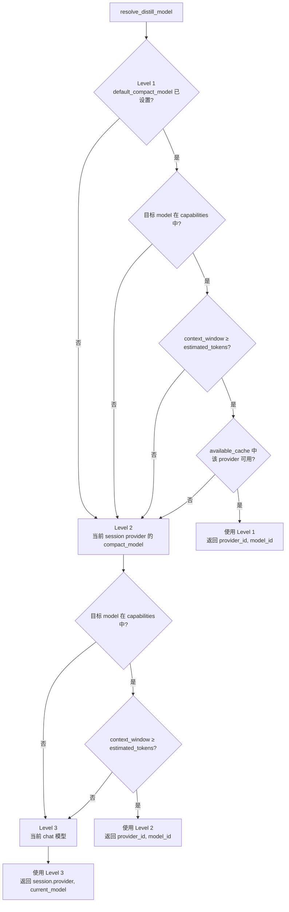
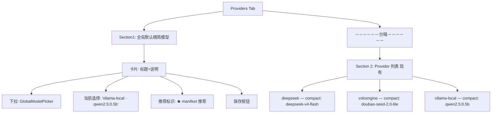

# ADR-056：全局默认精简模型（跨 provider 备选 + 三级 fallback）

**状态**：已定案
**日期**：2026-09-12
**决策者**：大鱼
**前置**：
- [ADR-010](./ADR-010-context-compression-simplification.md)（精简模型概念）
- [ADR-011](./ADR-011-compaction-and-distillation.md)（摘要即蒸馏）
- [ADR-033](./ADR-033-mqtt-replace-grpc-websocket.md)（MQTT 全局资源推送链路）

---

## 1. 决策摘要

引入**全局默认精简模型**概念，允许用户在 Harness 界面从所有已配置 provider 的模型中**任选其一**作为跨 provider 的精简模型默认值。运行时蒸馏任务按三级 fallback 链解析执行目标：

```
全局默认精简模型 → 当前 session provider 的 compact_model → 当前 chat 模型
```

**核心决策**：

1. **存储位置**：`agent_provider.json` 顶层新增 `default_compact_model` 字段，与 `providers[]`、`version` 同级。沿用现有"Gateway 全局资源 + MQTT 推送 + Runtime 缓存"成熟链路，**不**引入独立的 settings 文件。
2. **传输复用**：扩展 `AvailableProviders` proto 消息，新增 `optional CompactModelRef default_compact_model = 7` 字段。**不复用**每个 `ProviderRef` 内部的 `compact_model`（那是 provider 内二选一）。
3. **二级 fallback 保留**：每个 provider 的 `compact_model` 字段保留，作为第一级不可用时的兜底。
4. **三级 fallback 保留**：当前 chat 模型作为最终兜底，保证蒸馏任务永远能跑。
5. **manifest 推荐语义**：`manifest.toml [llm].compact_model` 仅作为 HarnessPage UI 上的"推荐标识"（星标/优先项），**不**作为运行时强制配置，**不**实时同步。包首次安装时不自动写入 `agent_provider.json`。
6. **运行时实例解析**：蒸馏时按解析出的 `(provider_id, model_id)` 去 `available_cache` 取对应的 base_url + api_key，构建独立 provider 实例调用，**不**复用 session 当前 provider 实例。

---

## 2. 背景与动机

### 2.1 现状：精简模型被锁在单个 provider 内

当前 `agent_provider.json` 中每个 provider 都带一个 `compact_model`：

```json
{
  "id": "deepseek",
  "models": [{"id": "deepseek-v4-flash"}, {"id": "deepseek-v4-pro"}],
  "compact_model": "deepseek-v4-flash"
}
```

约束：`compact_model` 必须是该 provider `models[]` 中的一员（HarnessPage `ModelMultiSelect` 的 `compactModel` 选项限定）。

### 2.2 为什么这是问题

| 场景 | 期望 | 现状 |
|---|---|---|
| 想用本地 Ollama `qwen2.5:0.5b` 做蒸馏 | 跨 provider 选 | 不可行，只能选当前 provider 的模型 |
| provider 列表只包含云端商业模型 | 用本地低成本模型替代 | 不支持 |
| 切换 chat provider（如 deepseek→kimi） | 蒸馏策略可独立保持 | 必须重新选一个 kimi 的子模型 |
| 多个 provider 的精简模型都很贵 | 统一用最便宜的 | 受限于当前 chat provider 的子集 |

### 2.3 设计目标

- **解耦蒸馏模型与 chat provider**：蒸馏是独立关注点。
- **支持本地 + 商业模型混搭的策略**：例如"chat 用 deepseek-v4-pro，蒸馏用 ollama 的 qwen2.5:0.5b"。
- **三级 fallback 保证可用性**：默认 → provider 内 → chat 模型，最终总能跑。

---

## 3. 架构与数据流

### 3.1 整体数据流


### 3.2 三级 fallback 决策树



每一级降级时记录 `tracing::warn!` 携带降级原因（context 不足 / provider 不可用 / 模型不存在）。

---

## 4. 数据模型

### 4.1 `agent_provider.json` 顶层扩展

```json
{
  "providers": [...],
  "default_compact_model": {
    "provider_id": "ollama-local",
    "model_id": "qwen2.5:0.5b"
  },
  "version": 84
}
```

- `default_compact_model: Option<CompactModelRef>`：可空，None = 不设置全局默认（仅靠 provider 内的 compact_model + chat 模型 fallback）
- **版本兼容**：旧 `agent_provider.json` 无此字段时反序列化为 None，**不破坏**现有配置
- **校验规则**：保存时校验 `(provider_id, model_id)` 在 `providers[]` 中存在；不存在则拒绝（HTTP 422）

### 4.2 proto 扩展

```proto
// core/acowork-core/proto/mqtt_payload.proto
message AvailableProviders {
  uint64 version = 1;
  repeated ProviderRef providers = 2;
  // 全局默认精简模型（跨 provider 备选项中选一个）。
  // Runtime 蒸馏 fallback 链：①本字段 ②provider.compact_model ③current chat model
  optional CompactModelRef default_compact_model = 7;
}

message CompactModelRef {
  string provider_id = 1;
  string model_id = 2;
}
```

### 4.3 Runtime 内存模型

```rust
// core/acowork-runtime/src/agent/agent_core.rs
pub(crate) default_compact_model: Option<(String, String)>,  // (provider_id, model_id)
```

初始化点：`startup/session_init.rs` 从 `AvailableProviders.default_compact_model` 填充。

---

## 5. 模块改动清单

### 5.1 Gateway

| 文件 | 改动 |
|---|---|
| `core/acowork-core/proto/mqtt_payload.proto` | 加 `CompactModelRef` + `AvailableProviders.default_compact_model` |
| `core/acowork-core/src/protocol.rs` | `AvailableProviders` / `ProviderListFile` / `AgentProviderConfig` Rust struct 同步新增字段 |
| `core/acowork-gateway/src/resource_cache.rs` | `ProviderListFile` 序列化字段加 `default_compact_model`；新增 setter `set_default_compact_model(provider_id, model_id) -> Result<(), String>` 做存在性校验并写盘 |
| `core/acowork-gateway/src/http/settings_api.rs`（新增） | `GET/PUT /api/settings/default-compact-model` 端点 |
| `core/acowork-gateway/src/http/provider_api.rs` | **不改**——`default_compact_model` 是全局设置，由独立 settings 端点提供（见 §3.1 数据流图）；`ProviderEntryResponse` 保持 per-provider 语义，不冗余该全局字段 |
| `core/acowork-gateway/src/mqtt/global_resources_publisher.rs` | `AvailableProviders` 构造时附带 `default_compact_model` |
| `core/acowork-gateway/src/vault/mod.rs` | **不**改（精简模型不是 secret） |

### 5.2 Runtime

| 文件 | 改动 |
|---|---|
| `core/acowork-runtime/src/agent/agent_core.rs` | 新增 `default_compact_model: Option<(String, String)>` 字段 + clone 进 SnapshotContext |
| `core/acowork-runtime/src/startup/session_init.rs` | 从 `AvailableProviders.default_compact_model` 解析填充 `c.default_compact_model` |
| `core/acowork-runtime/src/mqtt/available_cache.rs` | 新增 helper `is_provider_available(pid) -> bool`（检查 api_key 非空 + provider enabled） |
| `core/acowork-runtime/src/agent/loop_context.rs` | 重写 `resolve_distill_model` 实现三级 fallback，返回 `ResolvedDistill { provider_id, model_id, tier }`；调用侧（`compact_session_if_needed`）按 `provider_id` 去 `available_cache` 取 base_url+api_key 建独立 provider 实例 |
| `core/acowork-runtime/src/token/counter.rs` | `count_text` 的 model 参数用解析出的 compact model（**关键修正**：之前用 current_model 估算对跨 provider 场景会失真） |

### 5.3 Desktop UI

| 文件 | 改动 |
|---|---|
| `apps/acowork-desktop/src/components/harness/HarnessPage.tsx` | `ProvidersTab` **顶部**插入 `<GlobalCompactModelCard />`；前端类型新增 `CompactModelRef`（不扩展 `GatewayConfig`——该字段经 settings API 独立读写） |
| 新增 `apps/acowork-desktop/src/components/harness/GlobalCompactModelCard.tsx` | 卡片组件：标题 + 说明 + `GlobalModelPicker` + 保存按钮 |
| 新增 `apps/acowork-desktop/src/components/harness/GlobalModelPicker.tsx` | 聚合 `keys[].provider + keys[].models[]` 为 `{value: "provider_id::model_id", label: "provider · model"}`；支持搜索；右侧带 manifest 推荐标识 |
| `apps/acowork-desktop/src/lib/gateway-api.ts` | 新增 `getDefaultCompactModel()` / `setDefaultCompactModel(provider_id, model_id)` |
| `apps/acowork-desktop/src/i18n/locales/zh-CN.json` 等 | 新增 `harness.globalCompactModel.title` / `description` / `recommendBadge` 等文案 |

---

## 6. UI 设计

### 6.1 位置与布局

`HarnessPage › Providers Tab` 顶部，新增"全局设置"卡片区，**与现有 provider 列表用 `<hr>` 分隔**：



### 6.2 推荐标识逻辑

```ts
// manifest 推荐项 = (provider_id::model_id) 集合
// 来自当前 agent 的 manifest.toml [llm].compact_model
// 当前通过 manifest 加载点注入到 UI props（不从 agent_provider.json 反推）
function isRecommended(providerId: string, modelId: string): boolean {
  return recommendedRef === `${providerId}::${modelId}`;
}
```

- UI 仅展示"★ 推荐"小角标，**不**预选、**不**自动写入
- 用户主动点击保存才生效
- manifest 改变时，下次打开 HarnessPage 重新计算推荐（不持久化）

### 6.3 状态提示

- 选择的 `(provider_id, model_id)` 后来被删除 → UI 显示橙色警告："所选 provider/model 已不存在，将自动 fallback"
- 保存成功后 toast："已更新全局默认精简模型"

---

## 7. 边界条件与降级语义

| 场景 | 行为 | 日志/UI提示 |
|---|---|---|
| 全局默认未设置 | 走 Level 2/3 | 日志 `Using provider compact model` 或 `Using current chat model` |
| 全局默认 provider 已删除 | 走 Level 2 | UI 警告；日志 `Global default compact model provider removed, falling back` |
| 全局默认 provider 不可用（api_key 为空 / disabled） | 走 Level 2 | 日志 `Global default compact model provider unavailable, falling back` |
| 全局默认 model context_window < 估算 token | 走 Level 2 | 日志 `Global default compact model context too small` |
| Level 2 provider compact_model 同上问题 | 走 Level 3 | 日志 `Provider compact model unavailable, using current chat model` |
| Level 3 = chat 模型 context 也不够 | 走现有 emergency_trim 安全网 | 日志 `Emergency trim triggered`（已有逻辑） |

**核心原则**：每一级降级都做最小损失尝试，绝不报错中断蒸馏。

---

## 8. 兼容性

- **配置文件**：旧 `agent_provider.json` 无 `default_compact_model` 字段时，serde 反序列化为 None，行为退化为旧逻辑（仅 Level 2/3）。
- **proto 兼容性**：`optional` 字段 + 新字段号 = 7，向后兼容；老 Runtime 忽略该字段，老 Gateway 不发该字段。
- **HTTP API**：新增端点 `/api/settings/default-compact-model`，**不**修改现有 `/api/providers` 端点行为。
- **manifest**：`[llm].compact_model` 当前是否已存在需要 grep 确认；若已存在则复用其值作为 UI 推荐，否则 manifest 推荐永远为空（不阻塞功能）。

---

## 9. 测试计划

### 9.1 单元测试

| 模块 | 测试用例 |
|---|---|
| `resource_cache.rs` | ①旧配置无 `default_compact_model` 字段 → 正常加载；② 设置时 provider_id 不存在 → 返回错误；③ 设置时 model_id 不属于该 provider → 返回错误；④ 正常设置 → 落盘 + 触发推送 |
| `provider_api.rs` | `ProviderEntryResponse.default_compact_model` 反序列化正确 |
| `global_resources_publisher.rs` | `default_compact_model` 正确序列化进 `AvailableProviders` proto（含 `None` / `Some` 两种情况） |
| `loop_context.rs::resolve_distill_model` | ① 默认未设置 → 走 Level 2；② Level 1 provider 不可用 → 走 Level 2；③ Level 1 context 不够 → 走 Level 2；④ Level 1+2 都失败 → 走 Level 3（chat 模型）；⑤ token 估算使用 compact 模型而非 chat 模型 |
| `available_cache.rs::is_provider_available` | ① api_key 非空 + enabled → true；② api_key 为空 → false；③ provider 不存在 → false |

### 9.2 集成测试

| 场景 | 期望 |
|---|---|
| 完整链路：HarnessPage PUT → resource_cache 落盘 → MQTT 推送 → Runtime 缓存 → resolve_distill 命中 Level 1 | 日志 `Using global default compact model` |
| 完整链路：Level 1 provider 的 api_key 撤销 → 下次 resolve_distill 走 Level 2 | 日志 `Global default compact model provider unavailable, falling back` |
| 跨 provider 蒸馏：chat=deepseek-v4-pro，distill=ollama-local/qwen2.5:0.5b | 蒸馏调用走 ollama provider 实例，不复用 deepseek |
| manifest 推荐标识：manifest `[llm].compact_model = "ollama-local::qwen2.5:0.5b"` | UI GlobalModelPicker 该选项显示 ★ |

### 9.3 回归测试

- 现有 `provider.compact_model` 行为不变（仍作为 Level 2）
- 现有 `compaction_prompt` (ADR-053) 路径不受影响
- 现有 emergency_trim 安全网不变
- 现有 `agent_provider.json` v84 配置文件升级路径无破坏

---

## 10. 实施分期

| Phase | 内容 | 依赖 |
|---|---|---|
| **P1: 数据 + 传输** | proto 扩展 + resource_cache setter + publisher 重发 | 无 |
| **P2: Runtime解析** | `default_compact_model` 字段 + `resolve_distill_model` 三级 fallback + `available_cache::is_provider_available` + token 估算修正 | P1 |
| **P3: Gateway API** | GET/PUT 端点 + 校验 + 触发 publisher | P1 |
| **P4: UI** | `GlobalCompactModelCard` + `GlobalModelPicker` + 推荐标识 + i18n | P3 |
| **P5: 测试 + 文档** | 单测/集成测试 + `docs/zh/protocols/mqtt.md` 字段更新 | P2 + P3 + P4 |

每 Phase 独立可 review、可合并，避免单一大 diff。

---

## 11. 遗留与后续

- manifest `[llm].compact_model` 当前是否已被 manifest 加载器识别并暴露给 UI 层需要 grep 确认。如未实现，UI 推荐标识功能 P4 阶段需要先补一个"读取 manifest [llm].compact_model"的最小链路（独立 IPC / MQTT 通道），单独拆 ADR。
- 后续可以扩展 per-agent 覆盖（`agent_config.json` 里的 `default_compact_model_override`），本次不做。