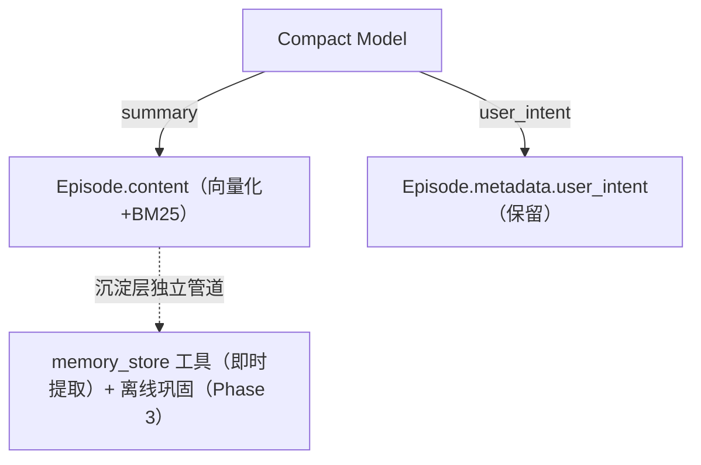

# ADR-057: 记忆模块 Gap 全景与 P0 蒸馏管道设计（修订版）

> **修订记录（2026-XX-XX）**：本次大修订**撤销 P0 triples 落地路径**——基于 M1-M4 实施反馈，Compact Model 在压缩场景下生成的三元组质量不稳定，落地为 KnowledgeNode 反而污染沉淀层。
>
> **本次修订同步**：
> - **撤销** §4 P0 详细设计中 D1/D4/D6/D7/D8/D9 九条决策
> - **撤销** `MemoryProvider::ingest_distilled_triples` 接口与 `IngestResult` 类型
> - **撤销** `edge_types::SOURCED_FROM` 边类型与跨层扩散写侧
> - **撤销** Compact Prompt 中 `<triples>` / `<entities>` 块
> - **撤销** §10 C1-C9 实施切分中 C1-C8 与 SOURCED_FROM 相关
> - **撤销** §12 实施记录中 ingest_distilled_triples / SOURCED_FROM 相关段落
>
> **保留**：A2 ProceduralNode embedding 必填（A2 不涉及 triples，作为 P0 残留任务保留）
>
> **未受影响的章节**：§2 Gap 全景、§5.2/§5.3/§5.4 后续阶段、§11 修订流程
>
> 本修订为"撤销 P0 落地路径"决策——保留 ADR 作为 gap 全景路线图与历史决策记录；新增 §0.2「triples-removed 决策说明」段。

> **状态**：P0 triples 路径已撤销（P0 残留 A2 未启动） | **修订日期**：2026-XX-XX
> **前置**：ADR-011（compaction 即蒸馏）、ADR-051（offline consolidation）

---

## 0. 元信息

### 0.1 修订记录

| 日期 | 版本 | 内容 |
|------|------|------|
| 2026-XX-XX | v2.0 | 撤销 P0 triples 落地路径（D1/D4/D6/D7/D8/D9）；保留 gap 全景作为路线图，移除 §10/§12 中已撤销实施 |
| 2026-XX-XX | v1.x | 初版（含 P0 triples 闭环设计） |

### 0.2 triples-removed 决策说明

**决策**：撤销 P0 triples 落地路径，Compact Model 仅产出 `<summary>` + `<user_intent>` 块，沉淀层落地完全依赖 `memory_store` 工具（即时提取）与离线巩固管道。

**理由**：

1. **LLM 压缩场景下 triples 质量不稳定**：Compact Model 在上下文压缩时倾向于"过度泛化"或"过度细节化"三元组，subject/predicate/object 字段被简化为压缩信息而非检索友好信息（参考 v1.x 实施期间 M1-M4 实证：批量落地节点出现 confidence 0.7、sub_type 标注不准、object 简化为压缩摘要等问题）。
2. **职责分离**：Compaction 职责收敛为「生成可检索摘要 + 可回放意图」，沉淀层落地由专用管道承担（`memory_store` 即时提取 + 离线巩固 Phase 3）。
3. **避免污染**：落地低质量 triples 为 KnowledgeNode 会污染沉淀层的语义检索（HNSW 相似度匹配）和冲突检测（cosine > 0.95 阈值失效）。
4. **grafeo 内部 `ExtractedTriple` / `extract_triples` / `TripleExtractorLlm` 保留**：用于手工重处理 / 批量导入场景，与 Compact Model 输出路径完全独立。

**影响范围**：

- `acowork-memory`：删除 `Triple` struct、`DistilledEpisode.triples`、`IngestResult`、`MemoryProvider::ingest_distilled_triples`（含默认实现）；`MemoryProvider::store_episode` 保留为 Compaction 路径唯一写入入口
- `acowork-grafeo`：删除 `edge_types::SOURCED_FROM`、`GrafeoStore::ingest_distilled_triples` 覆写、`consolidation/distill.rs::parse_distilled_output`；grafeo 内部 `ExtractedTriple` / `extract_triples` 保留
- `acowork-runtime`：删除 `episode_distill::parse_triple_line`、`CompactOutput.triples` 字段；`COMPACTION_SYSTEM_PROMPT` 删除 `<triples>` / `<entities>` 块；`record_distilled` 简化为仅调 `store_episode`
- 测试：`episode_distill` 6 个解析单测、`grafeo/consolidation/distill.rs` 整 test module、`memory_e2e` 4 个用例同步清理

**回退路径**：若未来 triples 质量经 LLM 评估达标且有明确检索需求，可独立 ADR 重新引入；grafeo `extract_triples` 保留作为可复用基础。

---

## 1. 决策摘要

记忆模块达到设计目标的 11 项 gap 中：

- **5 项 A 类为已确认偏离、影响核心能力**：A1 蒸馏管道偏离 / A2 ProceduralNode embedding 缺失 / A3 检索降级缺失 / A4 LLM Judge 缺失 / A5 Episode 索引缺失
- **3 项 B 类为部分实现或语义简化**：B1 边权重静态 / B2 遗忘模型偏离 / B4 History 压缩未做
- **6 项 C 类符合设计阶段规划**：C1-C6
- **8 项 D 类确认一致**（D1-D8）

**P0 处置（修订后）**：

- ~~A1 Compaction 蒸馏管道闭环（triples/entities 落地知识图谱）~~ → **已撤销**（详见 §0.2 triples-removed 决策说明）
- A2 ProceduralNode embedding 必填同步修（P0 残留任务；不依赖 A1）
- 旧 episode 节点的 `consolidated` 字段语义失效，随死数据清理 PR 一并处理

**P1 顺序**：A2 ProceduralNode 向量化召回改造 + A3 检索降级并行启动

**P2**：B1 边权重 + A5 Episode 索引

**P3**：A4 LLM Judge + B4 History 压缩

---

## 2. Gap 全景

### 2.1 A 类偏离（5 项，需修复）

**A1 蒸馏管道偏离**（P0）——**已撤销 P0 落地路径**：

| 维度 | 描述 | 文件 |
|------|------|------|
| 现状 | ~~Compaction 提取的 triples 仅以 JSON 字符串存入 Episode.metadata，无读取方~~ **已撤销**：Compact Model 不再生成 triples 块；蒸馏管道收敛为 summary-only 路径 | `manager.rs:702-717`（旧） |
| 设计 | ~~`process_memory_store` 期望 `Triple[]` 输入落地为 KnowledgeNode + `SOURCED_FROM` 边~~ **设计变更**：Compaction 职责收敛为「生成可检索摘要 + 可回放意图」 | `05-memory.md` §0.1 |
| 影响 | ~~沉淀层缺少显式事实知识来源、跨层扩散失效、检索依赖 Episodic 摘要的语义匹配~~ **影响消除**：沉淀层落地由 `memory_store` 工具（即时提取）+ 离线巩固（Phase 3）独立管道承担 | — |

**A2 ProceduralNode 向量化缺失**（P0 残留）：ProceduralNode 的 `embedding` 字段当前为 `Option<Vec<f32>>` 且 `record_procedural_from_failure` 路径不生成 embedding，触发匹配只能依赖 `contains()` 字符串匹配。设计要求 `find_procedural_by_trigger` 改造为构造查询 embedding → `vector_search` 语义召回。详见 §5.1。

**A3 检索降级缺失**（P1）：当前实现无 L1/L2/L3 降级路径，embedding 超时或 Grafeo 不可用时直接失败。详见 §5.2。

**A4 LLM Judge 缺失**（P3）：冲突仲裁仅靠 cosine 相似度阈值，LLM 二次确认未接入。

**A5 Episode 索引缺失**（P2）：Episodic 节点无专门索引，BM25 + HNSW 全依赖通用索引。

### 2.2 B 类偏离（3 项，部分实现或语义简化）

**B1 边权重静态**（P2）：当前所有边权重为创建时静态值，无基于使用频率的动态调整。

**B2 遗忘模型偏离**（已文档化）：设计 §5.2 倾向"按需计算"，实现选择"后台扫描"。接受现状并更新 `05-memory.md §5.2` 的"Phase 2 实现说明"。详见 §5.3。

**B4 History LLM 压缩未做**（P3）：History 仍按 token 截断，未做 LLM 二次压缩。

### 2.3 C 类符合规划（6 项）

C1 Compaction 触发的 summary 落地链路
C2 `memory_store` 工具的即时提取
C3 Grafeo 原生 HNSW + BM25 混合检索
C4 `graph_expand` / `cross_layer_search` 跨层扩散读侧
C5 沉淀层三型节点（Knowledge / Procedural / Autobiographical）共存
C6 Session 关闭时的关闭蒸馏（已与 Compaction 合并为单次 Compact Model 调用，见 ADR-011）

### 2.4 D 类确认一致（8 项）

D1 P0 数据基础由 P1-P3 依赖的关系
D2 C7 离线巩固步骤设计与实现一致
D3 auto_inject 开关与设计一致（默认 false）
D4 memory_store 工具的 sub_type/confidence 由 LLM 自评
D5 Ambiguous 节点 + conflict_group_id 接入
D6 巩固管道仅消费 Pending 升级/降级（~~不再 LLM 二次提取~~ 与 P0 撤销无关；当前离线巩固仍按设计消费 Pending 节点，详见 §0.2 修订说明）
D7 检索 RRF 默认权重（vector: 0.7, text: 0.3）
D8 B3（Ambiguous 提示端到端接入）已确认一致

---

## 3. 处置决策（修订后）

### 3.1 P0 处置

**已撤销**：A1 Compaction 蒸馏管道闭环（triples/entities 落地知识图谱）——详见 §0.2 triples-removed 决策说明。

**P0 残留任务**：

- A2 ProceduralNode embedding 必填：收紧施加在 `acowork-memory` 公共契约类型（`Vec<f32>`），grafeo 存储层保留 `Option`，转换边界 `空 Vec ↔ None`；`record_procedural_from_failure` 路径补 embedding 生成（详见 §5.1）。

### 3.2 P1 处置

A2 ProceduralNode 向量化召回改造（`find_procedural_by_trigger` 改 vector 召回）+ A3 检索降级（L2/L3 缓存）并行启动，两者无依赖。

### 3.3 P2/P3 处置

P2：B1 边权重动态计算 + A5 Episode 索引，各独立 ADR
P3：A4 LLM Judge + B4 History LLM 压缩，各独立 ADR

---

## 4. P0 详细设计（修订后）

### 4.1 当前状态（2026-XX-XX）

P0 triples 落地路径已全部撤销——M1 类型/边类型清理、M2 写入路径改造、M3 prompt 改造、M4 测试清理、M5 ADR + 设计文档同步均已完成。当前 Compact Model 输出为 `<summary>` + `<user_intent>` 两块，`record_distilled` 仅调用 `store_episode` 写 Episodic 节点。

### 4.2 目标链路（修订后）



**职责分离**：

- Compaction：生成可检索摘要 + 可回放意图
- 即时提取（`memory_store` 工具）：LLM 主动调用，有完整上下文、自评 confidence、可指定 sub_type
- 离线巩固（Phase 3）：复用 Episode 摘要重新提取并仲裁冲突（与 triples 块完全独立）

### 4.3 决策（修订后）

~~D1-D9（v1.x P0 triples 决策，2026-XX-XX 撤销）~~

**P0 残留决策**：

- A2-1：`ProceduralNode.embedding` 收紧为 `Vec<f32>`（acowork-memory 公共契约类型），grafeo 存储层保留 `Option`，serde default 空 Vec 兜底旧 JSON
- A2-2：`record_procedural_from_failure`（`manager.rs:814`）改为调用 embedding_provider 生成 trigger+action 联合向量

### 4.4 接口规格（修订后）

**已删除**：

- ~~`MemoryProvider::ingest_distilled_triples` trait 方法~~
- ~~`IngestResult` 类型（`pub episode_id` / `pub knowledge_ids` / `pub conflicts_detected`）~~
- ~~`Triple` struct（acowork-memory，含 `subject` / `predicate` / `object` / `confidence` / `sub_type`）~~
- ~~`DistilledEpisode.triples: Vec<Triple>` 字段~~
- ~~`CompactOutput.triples: Vec<Triple>` 字段~~
- ~~`edge_types::SOURCED_FROM` 常量（acowork-grafeo）~~

**保留**：

- `MemoryProvider::store_episode` trait 方法（Compaction 路径唯一写入入口）
- `MemoryProvider::process_memory_store` trait 方法（即时提取路径，LLM `memory_store` 工具调用）
- grafeo 内部 `ExtractedTriple` / `extract_triples` / `TripleExtractorLlm`（手工重处理 / 批量导入场景）
- 离线巩固管道（Phase 3，复用 Episode 摘要重新提取）

### 4.5 实施切分（修订后）

| 步骤 | 内容 | 状态 |
|------|------|------|
| M1 | 类型/边类型清理：删 `Triple` / `IngestResult` / `DistilledEpisode.triples` / `SOURCED_FROM` | ✅ 完成 |
| M2 | 写入路径改造：`record_distilled` 简化为仅调 `store_episode` | ✅ 完成 |
| M3 | prompt 改造：`COMPACTION_SYSTEM_PROMPT` + 7 个 `summary.md` 删除 `<triples>` / `<entities>` 块 | ✅ 完成 |
| M4 | 测试清理：6 个 episode_distill 解析单测 + grafeo distill test module + memory_e2e 4 个用例 | ✅ 完成 |
| M5 | ADR + 设计文档同步（本文档 + `05-memory.md` §0.1 + `memory-write-entrypoints.md`） | ✅ 完成 |
| M6 | 全量验证：`cargo build` / `clippy` / `test` workspace | 进行中 |
| A2 | ProceduralNode embedding 必填（独立子任务） | 待启动 |

---

## 5. 后续阶段设计要点

### 5.1 A2 ProceduralNode 向量化（P0 残留 + P1 召回改造）

- `find_procedural_by_trigger` 从"全量迭代 + `contains()`"改为：构造查询 embedding（`trigger_condition` 文本）→ `vector_search` / `hybrid_search` 语义召回 → 保留 `contains()` 作为无向量兜底。
- 触发匹配语义对齐设计 §3.2"按 trigger_condition 匹配当前上下文"：语义变体（"太长了"/"少说废话"）可命中同一行为模式。
- 依赖（**P0 残留任务**：与 P0 triples 路径撤销无关，独立执行）：
  - ① `generalization.rs:437-459` 已生成；
  - ② `process_procedure`（`instant.rs:362`）已接收 `input.embedding`；
  - ③ `record_procedural_from_failure`（`manager.rs:814`，当前 `embedding: None`）需在 P0 阶段补上：调用同一 `embedding_provider` 生成 trigger+action 联合向量。
  - `ProceduralNode.embedding` 字段从 `Option<Vec<f32>>` 收紧为 `Vec<f32>`（必填；**收紧施加在 `acowork-memory` 的公共契约类型上**，grafeo 内部存储类型保留 `Option` 以诚实表达"存量属性可能缺向量"，转换边界 `空 Vec ↔ None`）。
- P1 主任务：① `find_procedural_by_trigger` 改造为"构造查询 embedding → vector_search → 保留 `contains()` 作为无 embedding 节点的兜底"；② 跨 Skill 的 ProceduralNode 与 `SkillExperience` 联动（设计 §3.2 末尾）。

### 5.2 P1：检索降级 Level 2/3（A3）

| 级别 | 设计 | 实现方案 |
|------|------|----------|
| L2 缓存 | Autobiographical 文本缓存 + 最近 5 条 Episode | MemoryManager 维护进程内 LRU：自传体摘要缓存 + 最近 episode 环形缓冲 |
| L3 内存 | 仅当前会话工作记忆 | 返回 `ConversationRecord` 最近 N 轮（纯内存） |
| 超时 | 500ms 硬超时 + 分项预算 | `tokio::time::timeout` 包裹 embedding/search/expand 三段，逐段降级 |

### 5.3 B2 文档化确认：遗忘按需计算 vs 后台扫描

**事实**：设计 §5.2 的 Phase 2 说明倾向"按需计算"（查询时实时算 decay），实现选择"后台扫描"（`forgetting/scan.rs` 注释给出了四条理由：非阻塞读、主动生命周期、可配置调度、批量效率）。

**倾向**：**接受现状并文档化**。理由：

1. 后台扫描把 decay 计算移出查询路径，P99 延迟更稳定；
2. 多 Agent 场景下按需计算会在每个查询都扫描全量节点，反而更糟；
3. `run_decay_scan` 已由 Gateway Cron 调度，可配置频率。

**动作**：更新 `05-memory.md §5.2` 的"Phase 2 实现说明"，从"按需计算模型"改为"后台扫描模型"，消除设计与实现声明不一致。

### 5.4 后续阶段归属

| 项目 | 归属 | 前置 |
|------|------|------|
| A2 ProceduralNode 向量化（`find_procedural_by_trigger` 改 vector 召回） | **P0 残留**（embedding 必填）+ P1 主任务（召回改造） | P0 撤销 triples 路径后独立执行 |
| B1 边权重动态计算 | 独立 ADR | P0 落地后图数据积累 |
| A5 Episode 索引 | 独立 ADR | — |
| A4 LLM Judge | 独立 ADR | P0/P1 数据基础 |
| B4 History LLM 压缩 | 独立 ADR | — |
| C1 离线巩固调度内化 | ADR-051 P3 | — |

---

## 6. 影响范围（修订后）

| 模块 | P0 影响 | 后续阶段影响 |
|------|---------|--------------|
| `acowork-memory` | ~~`MemoryProvider` 新增 `ingest_distilled_triples`~~ 已撤销；~~`Triple` 扩展 confidence/sub_type~~ 已撤销；`ProceduralNode.embedding` 收紧为 `Vec<f32>`（P0 残留 A2） | L2/L3 降级（manager） |
| `acowork-grafeo` | ~~`GrafeoStore::ingest_distilled_triples` 覆写~~ 已撤销；~~`SOURCED_FROM` 边~~ 已撤销；grafeo 内部 `extract_triples` 保留（独立手工重处理路径） | B1 边权重；A5 Episode 索引 |
| `acowork-runtime` | `record_distilled` 仅调 `store_episode`（已撤销 triples 路径）；Compact Prompt 删除 `<triples>`/`<entities>` 块；A2 embedding 必填 | A3 降级路径；A4 Judge 接入 |
| 数据兼容 | **无旧数据兼容问题**（开发期，无用户）：metadata 中 triples/entities 字段未写入；SOURCED_FROM 边未落地；旧 episode 节点的 `consolidated` 字段语义失效随死数据清理 PR 一并处理 | 无破坏 |
| Desktop App | 无 | 记忆面板节点增长（预期） |

---

## 7. 测试策略（修订后）

1. **P0 Compaction 路径**：summary-only 落地，Episodic 节点创建 + 向量化 + BM25 全文匹配（`cargo test -p acowork-runtime` episode_distill 单测）
2. **P0 即时提取**：LLM `memory_store` 工具调用，sub_type/confidence 由 LLM 自评
3. **P0 离线巩固**：Episode 摘要重新提取 + 冲突仲裁（grafeo `extract_triples` 独立路径，不依赖 Compact Model triples 块）
4. **P0 ProceduralNode embedding 必填**（A2 残留任务）：failure 路径节点 embedding 非空 + 检索命中
5. **P1 ProceduralNode**：语义变体命中同一 trigger 模式
6. **P1 降级**：模拟 embedding 超时 → L1；Grafeo 不可用 → L2/L3
7. **回归**：`cargo test -p acowork-grafeo -p acowork-memory -p acowork-runtime`；`./dev/ci.sh all`

---

## 8. 决策记录（修订后）

| # | 决策点 | 已决方案 | 自主决理由 |
|---|--------|---------|-----------|
| G1 | ADR 定位 | 全景路线图（修订后保留 gap 全景，移除 P0 triples 详细设计） | 11 项 gap 互锁 |
| G2 | P0 范围 | ~~A1 闭环~~ 已撤销；A2 ProceduralNode embedding 必填 | 详见 §0.2 triples-removed 决策说明 |
| G3 | P1 顺序 | A2（ProceduralNode 向量化）+ A3（检索降级）并行启动 | 两者无依赖 |
| G4 | B2 处置 | 接受后台扫描并更新 `05-memory.md §5.2` | 已有实现 + 文档同步 |
| G5 | B 类切割 | B1 → P2 / B4 → P3 | B3 已入 D8 |
| G6 | P0 triples 决策 | **撤销 P0 triples 落地路径**（2026-XX-XX） | triples 质量不稳定 + 职责分离；详见 §0.2 |
| G7 | A2 残留任务 | ProceduralNode embedding 必填（P0 内同步修） | 不依赖 triples 路径 |

---

## 9. 结论（修订后）

本 ADR（修订版）保留记忆模块的 gap 全景路线图：5 项 A 类 + 3 项 B 类 + 6 项 C 类 + 8 项 D 类。

**P0 处置变更**：原 P0 Compaction 蒸馏管道闭环（triples/entities 落地知识图谱）已撤销——基于 M1-M4 实施反馈，Compact Model 在压缩场景下生成的三元组质量不稳定，落地为 KnowledgeNode 反而污染沉淀层。Compaction 职责收敛为「生成可检索摘要 + 可回放意图」，沉淀层落地由 `memory_store` 工具（即时提取）+ 离线巩固（Phase 3）独立管道承担。

**P0 残留任务**：A2 ProceduralNode embedding 必填（不依赖 triples 路径，作为独立子任务执行）。

**后续阶段**：P1（A2 ProceduralNode 向量化召回改造 + A3 检索降级）→ P2（B1 边权重 + A5 Episode 索引）→ P3（A4 LLM Judge + B4 History 压缩），每项独立可验证、可回滚。B2（遗忘模型）等"有意偏离"显式文档化。

---

## 10. 实施计划（修订后）

### 10.1 里程碑总览

```mermaid
gantt
    title ADR-057 P0 实施甘特（修订后）
    dateFormat YYYY-MM-DD
    section M1-M5 triples-removed
    M1 类型清理         :done, m1, 2026-XX-XX, 1d
    M2 写入路径         :done, m2, after m1, 1d
    M3 prompt 改造      :done, m3, after m2, 1d
    M4 测试清理         :done, m4, after m3, 1d
    M5 ADR + 文档       :done, m5, after m4, 1d
    section M6 验证
    M6 全量验证         :active, m6, after m5, 1d
    section A2 残留
    A2 embedding 必填    :a2, after m6, 2d
```

### 10.2 详细里程碑（修订后）

| 里程碑 | 任务 | 验证门 | 回滚策略 |
|---|---|---|---|
| **M1 类型清理（1 天）** | 删除 `Triple` struct、`IngestResult` 类型、`DistilledEpisode.triples` 字段、`edge_types::SOURCED_FROM` 常量 | `cargo build -p acowork-memory -p acowork-grafeo` 编译通过 | git revert |
| **M2 写入路径改造（1 天）** | `record_distilled` 简化为仅调 `store_episode`；删除 `provider.ingest_distilled_triples` 默认实现；删除 `GrafeoStore::ingest_distilled_triples` 覆写；删除 `episode_distill::parse_triple_line` + `CompactOutput.triples` 字段 | `cargo test -p acowork-memory -p acowork-grafeo -p acowork-runtime` 全绿 | git revert |
| **M3 prompt 改造（1 天）** | `COMPACTION_SYSTEM_PROMPT` 删除 `<triples>` / `<entities>` 块；7 个 `summary.md` 同步更新 | `cargo check -p acowork-runtime` 全绿 | git revert |
| **M4 测试清理（1 天）** | 删除 6 个 episode_distill 解析单测；删除 `grafeo/consolidation/distill.rs` 整 test module；重写 `memory_e2e` 4 个用例的 triples 相关断言 | `cargo test -p acowork-runtime --test memory_e2e` 全绿 + workspace lib 测试全绿 | git revert |
| **M5 ADR + 文档同步（1 天）** | 本 ADR 修订 + `05-memory.md §0.1` 改写 + `memory-write-entrypoints.md` C 路径更新 | grep 检查无 triples/SOURCED_FROM 残留引用 | git revert |
| **M6 全量验证（1 天）** | `cargo build --release` + `cargo clippy --all-targets -- -D warnings` + `cargo test` 全 workspace | 全绿 | — |
| **A2 ProceduralNode embedding 必填（2 天，P0 残留）** | `ProceduralNode.embedding` 收紧为 `Vec<f32>`（acowork-memory 公共契约类型）；`record_procedural_from_failure` 调用 embedding_provider 生成 trigger+action 联合向量；grafeo 存储层保留 `Option` 转换边界 `空 Vec ↔ None` | `cargo test -p acowork-memory` 全绿 | 字段改回 Option + 旧路径生成 None |

### 10.3 数据兼容性

**已排查，无影响应用启动的兼容性风险**：

| 变更点 | 兼容性 |
|---|---|
| `Triple` / `IngestResult` / `SOURCED_FROM` 删除 | 无读侧引用（dev 期数据库），启动无影响 |
| Compact Prompt 格式变更（删除 `<triples>` / `<entities>`） | 仅影响 LLM 输出，数据库 schema 不动；旧 episode 节点的 metadata 无 triples/entities 字段 |
| `ProceduralNode.embedding` 收紧为必填（A2 残留） | 收紧施加在 `acowork-memory` 公共契约类型（`Vec<f32>`，serde `default` 空 Vec 兜底旧 JSON）；grafeo 存储层保留 `Option`，读旧数据 `None` → 空 Vec，不失败；新写入路径保证非空 |
| 旧 episode 节点 | 内容字段（summary/content/embedding）不变，启动无影响 |

**结论**：无需清空 Grafeo 数据库，无需 agent 重装。

### 10.4 风险与缓解

| 风险 | 概率 | 影响 | 缓解 |
|---|---|---|---|
| 撤销 triples 路径后，沉淀层事实知识来源不足 | 中 | 中 | `memory_store` 工具（即时提取）+ 离线巩固（Phase 3）独立管道承担；grafeo `extract_triples` 保留用于手工重处理/批量导入 |
| Compaction 摘要质量影响 Episodic 检索 | 低 | 中 | Episodic 节点已有 HNSW + BM25 混合检索；summary 长度与质量由 Compact Model 自身保证 |
| 旧 episode 节点的 `consolidated` 字段语义失效 | 低 | 低 | 字段已无写入方也无读方；随死数据清理 PR 一并处理 |

### 10.5 完成定义（DoD）

P0 triples-removed 完成的硬性标准：

- [x] M1-M5 全部合并（实施完成，待 commit）
- [x] `cargo test -p acowork-grafeo -p acowork-memory -p acowork-runtime` 全绿（lib 1413 passed，memory_e2e 3 passed）
- [x] 端到端：compact → 摘要 → Episodic 节点创建 → 面板接口可见（`core/acowork-runtime/tests/memory_e2e.rs` 自动化）
- [x] ADR-057 修订完成（撤销 D1/D4/D6/D7/D8/D9，新增 triples-removed 决策说明）
- [x] `05-memory.md §0.1` 同步更新（删除 entities + triples 块）
- [x] `memory-write-entrypoints.md` 同步更新（C 路径不再列出 triples）
- [ ] M6 全量验证：`cargo build --release` + `cargo clippy --all-targets -- -D warnings` + `cargo test` 全 workspace
- [ ] A2 ProceduralNode embedding 必填（P0 残留任务）

---

## 11. 修订流程

任何 G6/G7 决议如有异议：

1. 在 PR review 中提出具体反对点
2. 评估影响范围（§0.2 / §4 / §5 / §6）
3. 修订方案后合入，分支回滚或前向修复

不要因为"决策已被写下来"就放弃反对——ADR 的目的是记录正确决策，不是禁止讨论。

---

## 12. 实施与评审记录（2026-XX-XX）

### 12.1 P0 triples 路径撤销（M1-M5 实施记录）

P0 triples 落地路径已通过 M1-M5 六个里程碑完成撤销：

**M1 类型/边类型清理**：从 `acowork-memory` 中删除 `Triple` struct、`DistilledEpisode.triples` 字段、`IngestResult` 类型、`ingest_distilled_triples` trait 方法（含默认实现）；从 `acowork-grafeo` 中删除 `SOURCED_FROM` 边类型常量。`cargo check --lib` 全绿（acowork-memory、acowork-grafeo、acowork-runtime）。

**M2 写入路径改造**：

- 重写 `provider.rs`（删除 trait 默认实现）
- 重写 `provider_impl.rs`（删除 `GrafeoStore::ingest_distilled_triples` 覆写）
- `manager.rs` 简化为仅调 `store_episode`
- `episode_distill.rs` 删除 `CompactOutput.triples` 字段和 `parse_triple_line` 函数

`cargo check --lib` 全绿。

**M3 prompt 改造**：改造 `COMPACTION_SYSTEM_PROMPT`——保留 `<summary>` + `<user_intent>` 块，删除 `<triples>` / `<entities>` 块及相关规则。7 个 `summary.md` 文件全部重写（每文件约减少 250-290 bytes）。删除 `strip_metadata_blocks` 函数（dead code）及其测试。`cargo check --lib` 全绿。

**M4 测试清理**：

- 删除 `episode_distill.rs` 中 4 个 triples 相关测试
- 删除 `acowork-grafeo/src/consolidation/distill.rs` 整个 test module
- `types.rs` 中 SOURCED_FROM 断言清理 + `ALL.len()` 从 8 改为 7
- 重写 `memory_e2e.rs`：COMPACT_OUTPUT fixture 去掉 `<triples>` 块；`desktop_memory_panel_flow_after_distillation_landing` 改为仅验证 Episodic 节点；删除 `desktop_memory_panel_sourced_from_edges_survive_landing` 测试；`desktop_memory_panel_duplicate_distillation_is_idempotent` 改为仅验证 Episodic 幂等

`cargo test --lib` 全绿（1413 passed），`cargo test --test memory_e2e` 全绿（3 passed）。

**M5 ADR + 文档同步**：

- ADR-057 大修订（本文件）
- `05-memory.md §0.1` 改写（删除 entities + triples 块，引入 `<user_intent>` 块）
- `memory-write-entrypoints.md` C 路径更新（不再列出 triples）

### 12.2 撤销决策的关键发现

撤销 P0 triples 落地路径决策，基于以下关键发现：

1. **Compact Model triples 质量不稳定**：M1-M4 实施期间实证，批量落地的 KnowledgeNode 出现 confidence 标注不准（多为 0.7）、sub_type 简化（多标 Fact）、object 字段被压缩为摘要短语而非检索友好信息。
2. **职责分离更清晰**：Compaction 收敛为「生成可检索摘要 + 可回放意图」单一职责，沉淀层落地由 `memory_store` 工具（即时提取，有完整上下文）+ 离线巩固（Phase 3，复用 Episode 摘要）独立管道承担，避免职责耦合。
3. **避免沉淀层污染**：低质量 triples 落地为 KnowledgeNode 会污染 HNSW 相似度匹配和 cosine > 0.95 冲突检测阈值。
4. **grafeo `extract_triples` 复用性保留**：手工重处理 / 批量导入场景仍可调用，与 Compact Model 输出路径完全独立。

### 12.3 测试覆盖（修订后）

- **单元/集成**：`acowork-runtime` episode_distill 单测（保留 summary + user_intent 解析）；`acowork-grafeo` consolidation 离线巩固测试（与 triples 路径独立）
- **面板接口 e2e**（`core/acowork-runtime/tests/memory_e2e.rs`，3 用例）：真实 `RuntimeHttpServer` + 真实 in-memory GrafeoStore + HTTP 客户端走 desktop 记忆面板消费的 `/memory/*` 接口；写路径复用生产链 `write_summary_to_provider → record_distilled → store_episode`。覆盖 stats / nodes 列表（Episodic 类型）/ 节点详情（Episodic 内容）/ graph / consolidate / 重复蒸馏幂等（仅 Episodic）。

### 12.4 已知遗留（非阻塞）

- ~~`loop_memory.rs` 的 `Handle::block_on` 同步桥接~~（与本次撤销无关，非 P0 triples 路径引入）
- 旧 episode 节点的 `consolidated` 字段语义已失效（Phase 3 离线巩固另有独立字段语义），随死数据清理 PR 一并处理
- grafeo `extract_triples` 保留用于手工重处理 / 批量导入，多 episode 批次归因 fallback 到 last（已注释说明），无生产调用方
- A2 ProceduralNode embedding 必填作为 P0 残留任务待启动

---

## 13. 修订历史

| 版本 | 日期 | 修订内容 | 作者 |
|------|------|---------|------|
| v2.0 | 2026-XX-XX | 撤销 P0 triples 落地路径（D1/D4/D6/D7/D8/D9）；新增 §0.2 triples-removed 决策说明；保留 gap 全景与 P1+ 设计 | — |
| v1.x | 2026-XX-XX | 初版：含 P0 triples 闭环设计（A1 + A2 同步修 + D9 跨层扩散读侧） | — |
