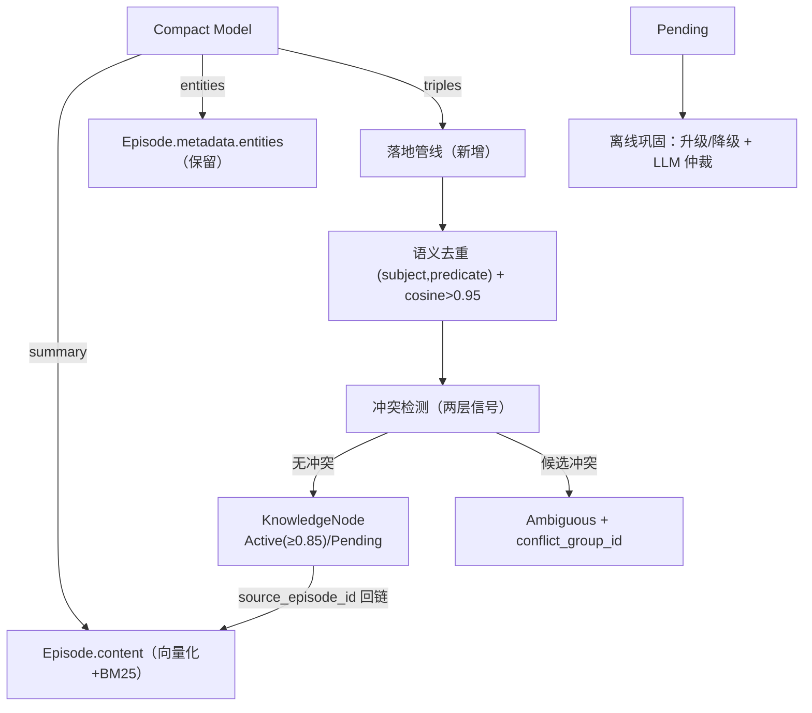

# ADR-057：记忆模块设计达标 —— Gap 全景与分阶段修复计划

**状态**：提案中（待讨论）
**日期**：2026-09-12
**决策者**：大鱼
**前置**：
- [ADR-011](./ADR-011-compaction-and-distillation.md)（摘要即蒸馏）
- [ADR-010](./ADR-010-context-compression-simplification.md)（上下文压缩简化）
- [ADR-051](./ADR-051-runtime-memory-provider-decoupling.md)（MemoryProvider 解耦）
- [docs/design/zh/05-memory.md](../../design/zh/05-memory.md)（Memory 仿生分层架构 v3.11）

---

## 1. 决策摘要

对 `docs/design/zh/05-memory.md`（v3.11）的设计目标与当前实现做**全面 gap 盘点**（代码级证据），并按处置方式分类：

- **A 类（已确认偏离、影响核心能力）**：立即修复，P0/P1 优先级。
- **B 类（已实现但偏离设计语义 / 部分实现）**：按优先级计划修复，或显式文档化确认为有意简化。
- **C 类（设计标注 Phase 3 / 暂缓）**：接受现状，跟踪不阻塞。
- **D 类（设计已更新、实现跟随）**：确认一致，无需动作。

**分阶段实施**，第一阶段（P0）为 **Compaction 蒸馏管道闭环**（triples/entities 落地知识图谱），它是全部 gap 中影响面最大的一项——断掉它，§6 跨层关联扩散、§5.2 知识更新、§4.1 防重复提取三条设计能力全部失去数据基础。

**核心原则**：记忆模块达到设计目标 ≠ 逐项补齐所有功能，而是**每一项设计能力都有真实数据基础与可用链路**。本 ADR 按此原则确定修复优先级。

---

## 2. Gap 全景（代码级事实）

### 2.1 A 类：已确认偏离设计、影响核心能力（需修复）

| # | 设计要求 | 当前实现 | 代码证据 | 影响 | 严重度 |
|---|----------|----------|----------|------|--------|
| A1 | §0.1/§1：Compaction 提取的 entities/triples 供离线巩固与图谱构建；§6.2 跨层扩散依赖 `source_episode` 反向查询 | triples 以 JSON 字符串存入 Episode metadata（无任何读取方）；离线巩固却从 content **重新 LLM 提取**；`extract_triples` 写 `source_episode_id: None` | `manager.rs:702-717`；`offline.rs:66-101`；`triple_extraction.rs:229` | 图稀疏 → 关联扩散退化；知识更新不触发；重复 LLM 成本 | 🔴 高 |
| A2 | §3.2/§10：ProceduralNode 按 trigger_condition 匹配当前上下文（有 embedding 字段） | `find_procedural_by_trigger` 纯字符串 `contains()` 匹配，不走向量 | `semantic/procedural.rs:25-50` | 行为模式召回质量差，语义变体（"太长了"/"少说废话"/"简短点"）无法命中同一模式 | 🔴 高 |
| A3 | §6.1：检索降级 Level 0-3（L2 缓存模式 / L3 内存模式）+ 500ms 超时分段 | 仅 L0（hybrid+expand）/ L1（text only）；无缓存层、无内存兜底、无超时分段 | `provider_impl.rs:259-300`；`manager.rs` 无降级分支 | Grafeo 故障时无优雅降级，检索质量门控缺失 | 🟠 中 |
| A4 | §11.1：LLM Judge 采样 10% + 小模型评估检索质量 | `evaluate_retrieval` 固定返回分数 4（mock） | `judge.rs:9-14` | 在线评估框架不可用，NRR/校准依赖假数据 | 🟠 中 |
| A5 | §2：经历层支持时间范围过滤、按会话检索 | `search_episodes_by_time` / `search_episodes_by_session` 全量迭代过滤（O(N)） | `episodic/search.rs:17-84` | 数据量增长后检索退化，无索引加速 | 🟡 低-中 |

### 2.2 B 类：已实现但偏离设计语义 / 部分实现（计划修复或文档化确认）

| # | 设计要求 | 当前实现 | 代码证据 | 处置倾向 |
|---|----------|----------|----------|----------|
| B1 | §3.1：边权重 = `min(0.8, confidence_avg × recency_factor)`，decay_scan 时更新 | `graph_expand` 从属性读取静态 weight + 固定每跳 ×0.7 衰减；`calculate_edge_weight` 函数存在但未接入 | `spreading.rs:106-113`；`semantic/graph.rs:87-91` | 修复（P2）：接入动态计算或显式文档化简化 |
| B2 | §5.2：遗忘按需计算（查询时实时算 decay 并过滤） | 后台扫描（Gateway Cron 驱动），非查询时计算 | `forgetting/scan.rs:1-18`（注释已说明） | 显式确认有意偏离（多 Agent 资源考量），文档化 |
| B3 | §6.4：Ambiguous 累计 3+ 时通过提示引导 Agent 自然询问用户确认 | `should_trigger_confirmation` / `generate_confirmation_hint` 存在，未接入 System Prompt 注入流程 | `provider_impl.rs:456-465` | 修复（P3）：接入确认提示 |
| B4 | §3.3：History 节点超 10 条时 **LLM 摘要压缩** | 规则版按月合并 + 200 字截断（代码注释自认 rule-based，Phase 3 加 LLM） | `offline.rs:186-251` | 计划修复（P3）：LLM 摘要化 |

### 2.3 C 类：设计标注 Phase 3 / 暂缓（接受现状，跟踪不阻塞）

| # | 设计项 | 现状 | 说明 |
|---|--------|------|------|
| C1 | 离线巩固调度内化（空闲检测 + 批量回放） | `start_consolidation` 等为 no-op，Runtime 外部驱动 `consolidation_bg` | 设计标注 Phase 3；ADR-051 P3 计划内化 |
| C2 | HypothesisNode 主动假设验证 | 未实现 | 设计 §4.2 Phase 3 补充 |
| C3 | Artifact 摘要增强 | 已随 v3.10 移除 `artifact_refs` 而失效 | 设计已变更（ADR-011），无需动作 |
| C4 | Zone 业务分区 | 未实现 | 设计 §8.2 明确"暂缓实现" |
| C5 | 云端同步 | 未实现 | 设计 Phase 3/6 |
| C6 | 分页换出（MemGPT） | 未实现 | 设计 Phase 3 |

### 2.4 D 类：设计已更新、实现跟随（确认一致）

| # | 设计项 | 实现 | 结论 |
|---|--------|------|------|
| D1 | v3.10：RRF 统一默认权重，不做 hint 类型动态调整 | `MemoryManagerConfig` 无动态权重；`hybrid_search_weighted` 权重参数标注 reserved | ✅ 一致 |
| D2 | 2026-09-12：auto_inject 默认关闭 | `auto_inject_enabled: false` | ✅ 一致 |
| D3 | §5.2/§4.1：Fact 语义去重 embedding > 0.95 | `DEDUP_SIMILARITY_THRESHOLD = 0.95` | ✅ 一致 |
| D4 | §5.1：乘法衰减 `importance × activity_signal` | `compute_decay_score` 公式一致 | ✅ 一致 |
| D5 | §6.4 v3.8：两层冲突信号（语义 + 时间） | `detect_conflict` 实现一致 | ✅ 一致 |
| D6 | §3.3：自传体 200 token 注入预算 | `max_autobio_core_tokens` 100 + `max_autobio_history_tokens` 100 | ✅ 一致 |
| D7 | §3.3：自传体不参与遗忘（status 强制 Active） | `DECAY_LABELS` 排除 Autobiographical；`scan.rs` | ✅ 一致 |

---

## 3. 处置决策

| 优先级 | 项目 | 依据 | 归属 |
|--------|------|------|------|
| **P0** | A1 Compaction 蒸馏管道闭环 | 全部 gap 中影响面最大，阻断三条设计能力 | **本 ADR 第 4 节** |
| **P1** | A2 ProceduralNode 激活路径向量化 | 行为模式召回是 §3.2 核心能力，当前纯字符串 | 本 ADR 第 5.1 节 |
| **P1** | A3 检索降级 Level 2/3 | Grafeo 不可用时无兜底，可靠性门控 | 本 ADR 第 5.2 节 |
| **P2** | B1 边权重动态计算接入 | 关联扩散语义质量 | 独立 ADR 或本 ADR 后续 |
| **P2** | A5 Episode 时间/会话索引 | 性能优化，数据量增长后才有痛点 | 独立 ADR |
| **P3** | A4 LLM Judge | 质量评估框架，依赖 P0/P1 数据基础 | 独立 ADR |
| **P3** | B3 冲突确认流程接入 | 用户确认闭环 | 独立 ADR |
| **P3** | B4 History LLM 摘要压缩 | 自传体容量管理增强 | 独立 ADR |
| — | B2 遗忘按需 vs 后台扫描 | 有意偏离，需文档化确认 | 本 ADR §5.3 确认 |
| — | C1-C6 | 接受现状 | 跟踪项 |

---

## 4. P0 详细设计：Compaction 蒸馏管道闭环

> 本节即原 ADR-057 全文，作为第一阶段实施基线。

### 4.1 事实基线

| # | 事实 | 位置 |
|---|------|------|
| F1 | Compaction triples 以 JSON 字符串存入 Episode metadata，无读取方 | `manager.rs:702-717` |
| F2 | 离线巩固从 episode content 重新 LLM 提取 triples | `offline.rs:66-101` |
| F3 | `extract_triples` 写入的 KnowledgeNode `source_episode_id = None` | `triple_extraction.rs:229` |
| F4 | entities 仅以逗号字符串存入 metadata | `manager.rs:702` |

### 4.2 目标链路

### 4.3 决策 D1-D6

| # | 决策点 | 倾向 | 说明 |
|---|--------|------|------|
| D1 | triples 落地时机 | **同步落地**（写入即精炼） | 复用 `process_memory_store` 同款管线；落地失败降级为仅写 episode |
| D2 | 离线巩固 triple 步骤 | **消费 Pending + 保留 LLM 提取兜底** | 兜底仅用于无 Compaction 产物的旧数据/短 session |
| D3 | metadata 死数据 | **移除 triples 载体（或改 audit 副本）** | 消除"数据已存储"假象 |
| D4 | `source_episode_id` 回链 | **Provider 内部建立** | 当前"由调用者管理"是虚假契约 |
| D5 | entities 落地方式 | **本期不建实体节点** | 节点爆炸 + 实体归一化成本高，无检索侧需求 |
| D6 | 接口形态 | **新增 `ingest_distilled_triples`**，复用内部逻辑 | 语义清晰，不破坏现有入口 |

### 4.4 实施切分

| 步骤 | 内容 | 验证 |
|------|------|------|
| C1 | Provider 新增落地管线（去重/冲突/status/source_episode_id） | grafeo 单测 |
| C2 | `record_distilled` 接入落地；metadata 改造 | memory 集成测试 |
| C3 | `extract_triples` 补 `source_episode_id` + embedding 预筛 | grafeo 单测 |
| C4 | 离线巩固 Step 2 改为消费 Pending + 兜底 | runtime 测试 |
| C5 | 跨层扩散回归 + 数据观察 | ci.sh all |

---

## 5. 后续阶段设计要点

### 5.1 P1：ProceduralNode 激活路径向量化（A2）

- `find_procedural_by_trigger` 从"全量迭代 + `contains()`"改为：构造查询 embedding（`trigger_condition` 文本）→ `vector_search` / `hybrid_search` 语义召回 → 保留 `contains()` 作为无向量兜底。
- 触发匹配语义对齐设计 §3.2"按 trigger_condition 匹配当前上下文"：语义变体（"太长了"/"少说废话"）可命中同一行为模式。
- 依赖：ProceduralNode 写入时必须有 embedding（当前 `store_procedural` 接受外部传入，Runtime 侧需保证生成）。

### 5.2 P1：检索降级 Level 2/3（A3）

| 级别 | 设计 | 实现方案 |
|------|------|----------|
| L2 缓存 | Autobiographical 文本缓存 + 最近 5 条 Episode | MemoryManager 维护进程内 LRU：自传体摘要缓存 + 最近 episode 环形缓冲 |
| L3 内存 | 仅当前会话工作记忆 | 返回 `ConversationRecord` 最近 N 轮（纯内存） |
| 超时 | 500ms 硬超时 + 分项预算 | `tokio::time::timeout` 包裹 embedding/search/expand 三段，逐段降级 |

### 5.3 B2 文档化确认：遗忘按需计算 vs 后台扫描

**事实**：设计 §5.2 的 Phase 2 说明倾向"按需计算"（查询时实时算 decay），实现选择"后台扫描"（`forgetting/scan.rs` 注释给出了四条理由：非阻塞读、主动生命周期、可配置调度、批量效率）。

**倾向**：**接受现状并文档化**。理由：
1. 后台扫描把 decay 计算移出查询路径，P99 延迟更稳定；
2. 多 Agent 场景下按需计算会在每个查询都扫描全量节点，反而更糟；
3. `run_decay_scan` 已由 Gateway Cron 调度，可配置频率。
**动作**：更新 05-memory.md §5.2 的"Phase 2 实现说明"，从"按需计算模型"改为"后台扫描模型"，消除设计与实现声明不一致。

### 5.4 后续阶段归属

| 项目 | 归属 | 前置 |
|------|------|------|
| B1 边权重动态计算 | 独立 ADR | P0 落地后图数据积累 |
| A5 Episode 索引 | 独立 ADR | — |
| A4 LLM Judge | 独立 ADR | P0/P1 数据基础 |
| B3 冲突确认流程 | 独立 ADR | P0（conflict_group_id 落地） |
| B4 History LLM 压缩 | 独立 ADR | — |
| C1 离线巩固调度内化 | ADR-051 P3 | — |

---

## 6. 影响范围

| 模块 | P0 影响 | 后续阶段影响 |
|------|---------|--------------|
| `acowork-memory` | `MemoryProvider` 新增落地入口；`DistilledEpisode` 语义注释 | L2/L3 降级（manager） |
| `acowork-grafeo` | 落地管线；`extract_triples` 回链 | ProceduralNode 向量化；边权重；Episode 索引 |
| `acowork-runtime` | `record_distilled` 接入；离线巩固改造 | 降级路径；Judge 接入 |
| 数据兼容 | 存量 metadata 死数据不迁移（不读取即无害） | 无破坏 |
| Desktop App | 无 | 记忆面板节点增长（预期） |

---

## 7. 测试策略

1. **P0 落地管线单测**：status 分派 / 语义去重 / 知识更新（object 变更 → Dormant）/ `source_episode_id` 回链。
2. **P0 record_distilled 集成测试**：蒸馏 + 落地一次完成；失败降级。
3. **P0 离线巩固改造测试**：Pending 升级降级、Ambiguous 仲裁、兜底提取触发条件。
4. **P0 跨层扩散回归**：episode → KnowledgeNode 图扩散可达。
5. **P1 ProceduralNode**：语义变体命中同一 trigger 模式。
6. **P1 降级**：模拟 embedding 超时 → L1；Grafeo 不可用 → L2/L3。
7. **回归**：`cargo test -p acowork-grafeo -p acowork-memory -p acowork-runtime`；`./dev/ci.sh all`。

---

## 8. 待讨论决策点

| # | 决策点 | 倾向 | 需要确认 |
|---|--------|------|----------|
| G1 | ADR 定位 | 全景路线图 + P0 详细设计 | 是否接受"一个 ADR 覆盖全部 gap + 分阶段"？还是拆多个 ADR？ |
| G2 | P0 范围 | Compaction 管道闭环（原 ADR-057 全量） | 是否作为第一阶段唯一内容？ |
| G3 | P1 顺序 | A2 ProceduralNode 向量化 先于 A3 检索降级 | 是否认可该顺序？ |
| G4 | B2 处置 | 接受后台扫描并更新设计文档 | 是否同意修改 05-memory.md 声明？ |
| G5 | B 类其余项 | 独立 ADR 推进 | 是否同意范围切割方式？ |
| G6 | D1-D6（P0 内部） | 见 §4.3 | 逐项确认 |

---

## 9. 结论

本 ADR 将"记忆模块达到设计目标"落地为**可执行的 gap 全景**：11 项 gap 分 A/B/C/D 四类处置，其中 5 项 A 类为已确认偏离、影响核心能力，5 项 B 类为部分实现或语义简化，6 项 C 类符合设计阶段规划，7 项 D 类确认一致。

修复以 P0（Compaction 蒸馏管道闭环）起步——它解除的是全部 gap 中最根本的数据基础问题；随后按 P1（ProceduralNode 向量化、检索降级）、P2（边权重、Episode 索引）、P3（LLM Judge、冲突确认、History 压缩）推进，每项独立可验证、可回滚。同时将 B2（遗忘模型）这类"有意偏离"显式文档化，消除设计与实现声明不一致。
