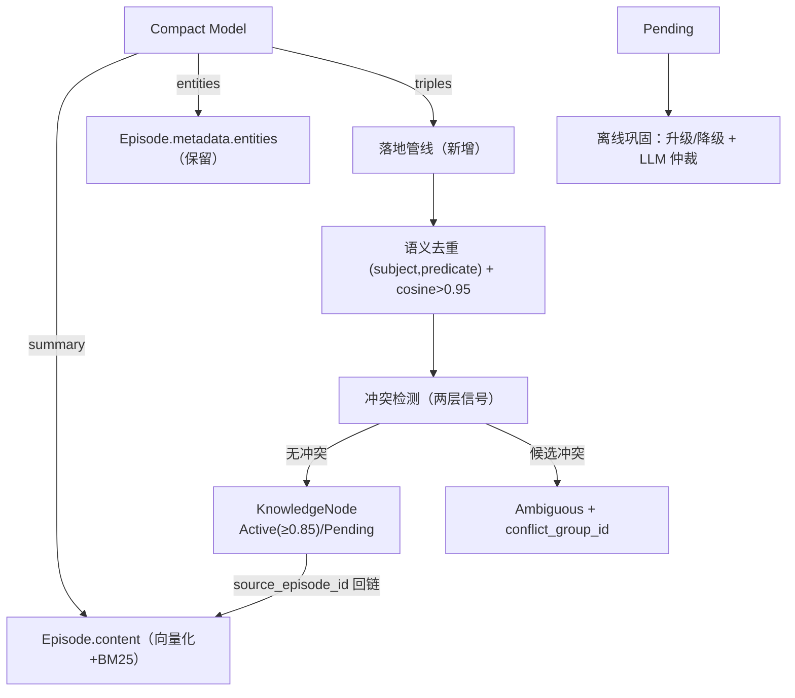
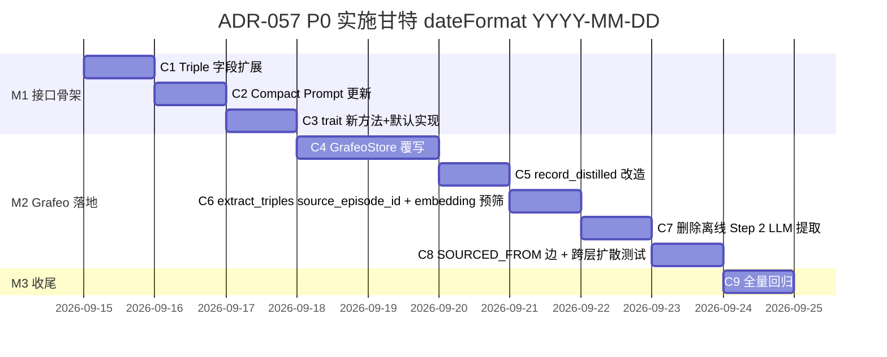

# ADR-057：记忆模块设计达标 —— Gap 全景与分阶段修复计划

**状态**：已批准（自主决），按 §10 实施计划启动 P0 开发
**日期**：2026-09-12（初稿） / 2026-09-13（v2：审查修正 + 无兼容包袱方案 + 实施计划）
**决策者**：大鱼（原则："对的最简方案，无兼容包袱"，自主决不拍板）
**前置**：
- [ADR-011](./ADR-011-compaction-and-distillation.md)（摘要即蒸馏）
- [ADR-010](./ADR-010-context-compression-simplification.md)（上下文压缩简化）
- [ADR-051](./ADR-051-runtime-memory-provider-decoupling.md)（MemoryProvider 解耦）
- [docs/design/zh/05-memory.md](../../design/zh/05-memory.md)（Memory 仿生分层架构 v3.11）

---

## 1. 决策摘要

对 `docs/design/zh/05-memory.md`（v3.11）的设计目标与当前实现做**全面 gap 盘点**（代码级证据），并按处置方式分类：

- **A 类（已确认偏离、影响核心能力）**：立即修复，P0/P1 优先级。
- **B 类（已实现但偏离设计语义 / 部分实现）**：按优先级计划修复，或显式文档化确认为有意简化。
- **C 类（设计标注 Phase 3 / 暂缓）**：接受现状，跟踪不阻塞。
- **D 类（设计已更新、实现跟随）**：确认一致，无需动作。

**分阶段实施**，第一阶段（P0）为 **Compaction 蒸馏管道闭环**（triples/entities 落地知识图谱），它是全部 gap 中影响面最大的一项——断掉它，§6 跨层关联扩散、§5.2 知识更新、§4.1 防重复提取三条设计能力全部失去数据基础。

**核心原则**：记忆模块达到设计目标 ≠ 逐项补齐所有功能，而是**每一项设计能力都有真实数据基础与可用链路**。本 ADR 按此原则确定修复优先级。

---

## 2. Gap 全景（代码级事实）

### 2.1 A 类：已确认偏离设计、影响核心能力（需修复）

| # | 设计要求 | 当前实现 | 代码证据 | 影响 | 严重度 |
|---|----------|----------|----------|------|--------|
| A1 | §0.1/§1：Compaction 提取的 entities/triples 供离线巩固与图谱构建；§6.2 跨层扩散依赖 `source_episode` 反向查询 | triples 以 JSON 字符串存入 Episode metadata（无任何读取方）；离线巩固却从 content **重新 LLM 提取**；`extract_triples` 写 `source_episode_id: None` | `manager.rs:702-717`；`offline.rs:66-101`；`triple_extraction.rs:229` | 图稀疏 → 关联扩散退化；知识更新不触发；重复 LLM 成本 | 🔴 高 |
| A2 | §3.2/§10：ProceduralNode 按 trigger_condition 匹配当前上下文（有 embedding 字段） | `find_procedural_by_trigger` 纯字符串 `contains()` 匹配，不走向量 | `semantic/procedural.rs:25-50` | 行为模式召回质量差，语义变体（"太长了"/"少说废话"/"简短点"）无法命中同一模式 | 🔴 高 |
| A3 | §6.1：检索降级 Level 0-3（L2 缓存模式 / L3 内存模式）+ 500ms 超时分段 | 仅 L0（hybrid+expand）/ L1（text only）；无缓存层、无内存兜底、无超时分段 | `provider_impl.rs:259-300`；`manager.rs` 无降级分支 | Grafeo 故障时无优雅降级，检索质量门控缺失 | 🟠 中 |
| A4 | §11.1：LLM Judge 采样 10% + 小模型评估检索质量 | `evaluate_retrieval` 固定返回分数 4（mock） | `judge.rs:9-14` | 在线评估框架不可用，NRR/校准依赖假数据 | 🟠 中 |
| A5 | §2：经历层支持时间范围过滤、按会话检索 | `search_episodes_by_time` / `search_episodes_by_session` 全量迭代过滤（O(N)） | `episodic/search.rs:17-84` | 数据量增长后检索退化，无索引加速 | 🟡 低-中 |

### 2.2 B 类：已实现但偏离设计语义 / 部分实现（计划修复或文档化确认）

| # | 设计要求 | 当前实现 | 代码证据 | 处置倾向 |
|---|----------|----------|----------|----------|
| B1 | §3.1：边权重 = `min(0.8, confidence_avg × recency_factor)`，decay_scan 时更新 | `graph_expand` 从属性读取静态 weight + 固定每跳 ×0.7 衰减；`calculate_edge_weight` 函数存在但未接入 | `spreading.rs:106-113`；`semantic/graph.rs:87-91` | 修复（P2）：接入动态计算或显式文档化简化 |
| B2 | §5.2：遗忘按需计算（查询时实时算 decay 并过滤） | 后台扫描（Gateway Cron 驱动），非查询时计算 | `forgetting/scan.rs:1-18`（注释已说明） | 显式确认有意偏离（多 Agent 资源考量），文档化 |
| B3 | §6.4：Ambiguous 累计 3+ 时通过提示引导 Agent 自然询问用户确认 | 已在 `retrieve_and_inject → inject_with_ambiguous_hints` 端到端接入；`set_retrieved_memory(formatted_text)` 与 `set_ambiguous_confirmation_hint(hint)` 两路注入，受 `auto_inject_enabled` 门控（默认 false，见 D2） | `acowork-memory/src/manager.rs:597-615,884`；`acowork-runtime/src/agent/loop_memory.rs:100,165,169-174` | **从 B 类调整为已确认一致**（归入 D 类）：机制已存在并接入，无需独立 ADR；唯一保留条件是 auto_inject 开关 |
| B4 | §3.3：History 节点超 10 条时 **LLM 摘要压缩** | 规则版按月合并 + 200 字截断（代码注释自认 rule-based，Phase 3 加 LLM） | `offline.rs:186-251` | 计划修复（P3）：LLM 摘要化 |

### 2.3 C 类：设计标注 Phase 3 / 暂缓（接受现状，跟踪不阻塞）

| # | 设计项 | 现状 | 说明 |
|---|--------|------|------|
| C1 | 离线巩固调度内化（空闲检测 + 批量回放） | `start_consolidation` 等为 no-op，Runtime 外部驱动 `consolidation_bg` | 设计标注 Phase 3；ADR-051 P3 计划内化 |
| C2 | HypothesisNode 主动假设验证 | 未实现 | 设计 §4.2 Phase 3 补充 |
| C3 | Artifact 摘要增强 | 已随 v3.10 移除 `artifact_refs` 而失效 | 设计已变更（ADR-011），无需动作 |
| C4 | Zone 业务分区 | 未实现 | 设计 §8.2 明确"暂缓实现" |
| C5 | 云端同步 | 未实现 | 设计 Phase 3/6 |
| C6 | 分页换出（MemGPT） | 未实现 | 设计 Phase 3 |

### 2.4 D 类：设计已更新、实现跟随（确认一致）

| # | 设计项 | 实现 | 结论 |
|---|--------|------|------|
| D1 | v3.10：RRF 统一默认权重，不做 hint 类型动态调整 | `MemoryManagerConfig` 无动态权重；`hybrid_search_weighted` 权重参数标注 reserved | ✅ 一致 |
| D2 | 2026-09-12：auto_inject 默认关闭 | `auto_inject_enabled: false` | ✅ 一致 |
| D3 | §5.2/§4.1：Fact 语义去重 embedding > 0.95 | `DEDUP_SIMILARITY_THRESHOLD = 0.95` | ✅ 一致 |
| D4 | §5.1：乘法衰减 `importance × activity_signal` | `compute_decay_score` 公式一致 | ✅ 一致 |
| D5 | §6.4 v3.8：两层冲突信号（语义 + 时间） | `detect_conflict` 实现一致 | ✅ 一致 |
| D6 | §3.3：自传体 200 token 注入预算 | `max_autobio_core_tokens` 100 + `max_autobio_history_tokens` 100 | ✅ 一致 |
| D7 | §3.3：自传体不参与遗忘（status 强制 Active） | `DECAY_LABELS` 排除 Autobiographical；`scan.rs` | ✅ 一致 |
| D8 | §6.4：Ambiguous 累计 3+ 时通过提示引导 Agent 自然询问用户确认 | `retrieve_and_inject → inject_with_ambiguous_hints` 已端到端接入；`should_trigger_confirmation` 累计 ≥3 触发；hint 注入受 `auto_inject_enabled` 门控 | ✅ 一致（原 ADR-057 归 B3，审查后调整；详见 §2.2） |

---

## 3. 处置决策

| 优先级 | 项目 | 依据 | 归属 |
|--------|------|------|------|
| **P0** | A1 Compaction 蒸馏管道闭环 | 全部 gap 中影响面最大，阻断三条设计能力 | **本 ADR 第 4 节** |
| **P1** | A2 ProceduralNode 激活路径向量化 | 行为模式召回是 §3.2 核心能力，当前纯字符串 | 本 ADR 第 5.1 节 |
| **P1** | A3 检索降级 Level 2/3 | Grafeo 不可用时无兜底，可靠性门控 | 本 ADR 第 5.2 节 |
| **P2** | B1 边权重动态计算接入 | 关联扩散语义质量 | 独立 ADR 或本 ADR 后续 |
| **P2** | A5 Episode 时间/会话索引 | 性能优化，数据量增长后才有痛点 | 独立 ADR |
| **P3** | A4 LLM Judge | 质量评估框架，依赖 P0/P1 数据基础 | 独立 ADR |
| **P3** | B4 History LLM 摘要压缩 | 自传体容量管理增强 | 独立 ADR |
| — | B2 遗忘按需 vs 后台扫描 | 有意偏离，需文档化确认 | 本 ADR §5.3 确认 |
| — | C1-C6 | 接受现状 | 跟踪项 |

---

## 4. P0 详细设计：Compaction 蒸馏管道闭环

> 本节即原 ADR-057 全文，作为第一阶段实施基线。

### 4.1 事实基线

| # | 事实 | 位置 |
|---|------|------|
| F1 | Compaction triples 以 JSON 字符串存入 Episode metadata，无读取方 | `manager.rs:702-717` |
| F2 | 离线巩固从 episode content 重新 LLM 提取 triples | `offline.rs:66-101` |
| F3 | `extract_triples` 写入的 KnowledgeNode `source_episode_id = None` | `triple_extraction.rs:229` |
| F4 | entities 仅以逗号字符串存入 metadata | `manager.rs:702` |

### 4.2 目标链路



### 4.3 决策 D1-D9（已决，按"无兼容包袱的最干净方案"原则）

**前提**：项目处于开发期，无旧用户数据，所有变更按"对的最简方案"自主决定，无需兼容折中。

| # | 决策点 | 决策 | 理由 |
|---|--------|------|------|
| D1 | triples 落地时机 | **同步落地**（compaction 写入即精炼） | 复用 `process_memory_store` 同款管线；落地失败降级为仅写 episode，episode 永远不丢 |
| D2 | 离线巩固 triple 步骤 | **仅消费 Pending 升级/降级，不再做 LLM 二次提取** | 同步落地后所有新 episode 的 triples 已为 KnowledgeNode（Pending/Active），离线巩固只需按 age/confidence 升级；无旧数据兼容包袱，**直接删除原 LLM 提取 Step 2** |
| D3 | metadata 死数据 | **直接删除 `Episode.metadata.triples` 与 `Episode.metadata.entities` 写入** | 绿地项目无读方；保留 entities 是误设计（D5），连同删除 |
| D4 | `source_episode_id` 回链 | **Provider 内部建立**（方案 A）：新入口 `ingest_distilled_triples` 在 provider 内部完成"存 episode → 取 ID → 落地 triples" | 当前 `store_episode` 返回 `Result<()>`（`provider.rs:49`），调用方拿不到 ID；方案 A 避免改动 trait 返回值语义 |
| D5 | entities 落地方式 | **本期不建实体节点** | 节点爆炸 + 实体归一化成本高，无检索侧需求；metadata.entities 同步删除 |
| D6 | 接口形态 | **`MemoryProvider` trait 新增 `ingest_distilled_triples` + 默认实现**，GrafeoStore 覆写为批量优化版；InMemoryProvider 继承默认实现 | 默认实现逐条 `process_memory_store` 落地（O(K) 去重 × N triples）；GrafeoStore 覆写为一次 `get_all_active_knowledge()` 批量去重，O(K) × 1 |
| D7 | 蒸馏 Triple 字段 | **`Triple` 扩展 `confidence: f32`（必填）**；Compact Prompt 输出格式同步扩展 `<triples>` block 增加 confidence；LLM 必填；落地管线用真实 confidence 分派 Active(≥0.85)/Pending | 绿地项目无旧数据兼容问题；`Option<f32>` 加默认值是过度防御；让 LLM 直接产出 confidence 是最简路径 |
| D8 | 蒸馏 Triple `sub_type` | **Compact Prompt 要求 LLM 标注 `sub_type`（Fact/Preference/Relation）**；Triple 扩展 `sub_type: KnowledgeSubType`（必填） | 默认 `Fact` 会丢失信息；绿地项目让 LLM 标注是最简方案 |
| D9 | 跨层扩散读侧 | **P0 范围内一起做**：落地时建立 `Episode -[SOURCED_FROM]-> KnowledgeNode` 图边（**新增边类型**），`graph_expand` 即可基于边扩散 | 绿地项目无分阶段必要性；写边比 reverse query 更直接、性能更好；`graph_expand` 已支持任意边类型（`spreading.rs:155-167`） |

### 4.4 P0 接口规格

新增 `MemoryProvider` trait 方法：

```rust
/// Ingest distilled triples from compaction.
///
/// Stores the episode and lands its triples as KnowledgeNodes + cross-layer
/// edges in one provider-internal transaction.
///
/// - Episode ID linkage to created knowledge nodes is established internally (D4)
/// - Cross-layer `SOURCED_FROM` edges are created between episode and knowledge (D9)
///
/// Default implementation: maps each Triple to MemoryStoreInput and calls
/// `process_memory_store` per triple (see D6).
async fn ingest_distilled_triples(
    &self,
    episode: &DistilledEpisode,
    embedding_provider: Option<&dyn EmbeddingProvider>,
) -> AcoworkResult<IngestResult>;

#[derive(Debug, Clone)]
pub struct IngestResult {
    pub episode_id: u64,
    pub knowledge_ids: Vec<u64>,
    pub conflicts_detected: usize,
}
```

**默认实现（trait 内）**（2026-08-25 修订：原步骤 4 的 `link_episode_to_knowledge` hook 已删除——默认实现拿不到 `NodeId`，该 hook 成为死 API；覆写内部直接建边）：
1. 调用 `store_episode(&ep)` 存 episode（有 EmbeddingProvider 时同步生成 summary 向量）；
2. 逐条 Triple → `MemoryStoreInput`（`sub_type` 与 `confidence` 来自 Triple，D7/D8 必填）；
3. 调 `process_memory_store(input)` 拿到 `node_id`（含 object 感知去重 + 冲突检测 + `conflict_group_id`）；
4. 默认实现拿不到 `NodeId`，不建 `SOURCED_FROM` 边、`episode_id` 返回 0；
5. 返回 `IngestResult`。

**GrafeoStore 覆写**（2026-08-25 修订：原"批量去重"优化版会跳过 object 对比与冲突检测，语义与默认实现分叉，已改回逐条复用 instant 管线）：
- 用 `store_episode_with_session` 拿到 `NodeId`；
- 逐条构造 `MemoryStoreInput`（`source_episode_id = Some(episode_id)`、预计算 embedding）调 `process_memory_store` —— 去重 / 冲突检测 / status 分派语义与默认实现**完全一致**；
- 对每个创建的 KnowledgeNode 创建 `episode -[SOURCED_FROM]-> knowledge` 边（D9）；
- 返回 `IngestResult`（`conflicts_detected` = 各条 `conflict_resolutions` 计数之和，非 Pending 计数）。

**失败降级（D1 承诺）**：
- `store_episode` 失败 → 整体返回 `Err`，调用方重试；
- 单条 `process_memory_store` 失败 → 记录 warning 继续其余 triples（episode 仍已存，summary 可检索）；
- Embedding 生成失败 → 节点**不写向量**（绝不写 hash 假向量污染语义层），该条去重/冲突检测降级跳过；
- 全部落地失败 → episode 仍已存，下一次离线巩固不再 LLM 提取（D2）。

### 4.5 实施切分（按"对的最简方案"自主排期）

| 步骤 | 内容 | 验证 |
|------|------|------|
| C1 | `Triple` 扩展 `confidence: f32` + `sub_type: KnowledgeSubType`（必填） | types 编译 + 单测 |
| C2 | Compact Prompt 模板更新：`<triples>` block 输出 `subject|predicate|object|confidence|sub_type`；`episode_distill.rs::parse_compact_output` 同步更新 | episode_distill 单测 |
| C3 | `MemoryProvider::ingest_distilled_triples` 新增（含默认实现） + `IngestResult` 类型 | trait 编译 + memory 单测 |
| C4 | `GrafeoStore::ingest_distilled_triples` 覆写（批量去重 + `SOURCED_FROM` 边） + `edge_types::SOURCED_FROM` 写入 `types.rs` | grafeo 单测 |
| C5 | `MemoryManager::record_distilled` 改调 `provider.ingest_distilled_triples`；`metadata.triples` 与 `metadata.entities` 写入逻辑删除（D3/D5） | memory 集成测试 |
| C6 | `extract_triples` 补 `source_episode_id`（`get_unconsolidated_episode_contents` 透传 episode ID）+ embedding 预筛（`is_duplicate_knowledge > 0.95`） | grafeo 单测 |
| C7 | **删除** `run_offline_consolidation_with_generalization` 的 Step 2 LLM 提取（`extract_triples` 调用 + `get_unconsolidated_episode_contents` 引用 + 与之耦合的 `resolve_conflicts_with_llm`，offline.rs:91-99）；LLM 冲突仲裁后续若需要可作为独立步骤补回 | grafeo + runtime 单测 |
| C8 | `graph_expand` / `cross_layer_search` 测试：episode → knowledge 经 `SOURCED_FROM` 边扩散可达（D9） | grafeo + e2e 测试 |
| C9 | 端到端回归：`cargo test` + `ci.sh all` | 全部测试绿 |

---

## 5. 后续阶段设计要点

### 5.1 A2 ProceduralNode 向量化（P0 同步修 embedding 必填 + P1 召回改造）

- `find_procedural_by_trigger` 从"全量迭代 + `contains()`"改为：构造查询 embedding（`trigger_condition` 文本）→ `vector_search` / `hybrid_search` 语义召回 → 保留 `contains()` 作为无向量兜底。
- 触发匹配语义对齐设计 §3.2"按 trigger_condition 匹配当前上下文"：语义变体（"太长了"/"少说废话"）可命中同一行为模式。
- 依赖（**P0 同步修，不再分阶段**）：绿地项目无兼容包袱，三条创建路径**统一为必填 embedding**。① `generalization.rs:437-459` 已生成；② `process_procedure`（`instant.rs:362`）已接收 `input.embedding`；③ `record_procedural_from_failure`（`manager.rs:814`，当前 `embedding: None`）需在 P0 阶段补上：调用同一 `embedding_provider` 生成 trigger+action 联合向量。`ProceduralNode.embedding` 字段从 `Option<Vec<f32>>` 收紧为 `Vec<f32>`（必填；2026-08-25 落地说明：**收紧施加在 `acowork-memory` 的公共契约类型上**，grafeo 内部存储类型保留 `Option` 以诚实表达"存量属性可能缺向量"，转换边界 `空 Vec ↔ None`）。
- P1 主任务：① `find_procedural_by_trigger` 改造为"构造查询 embedding → vector_search → 保留 `contains()` 作为无 embedding 节点的兜底"；② 跨 Skill 的 ProceduralNode 与 `SkillExperience` 联动（设计 §3.2 末尾）。

### 5.2 P1：检索降级 Level 2/3（A3）

| 级别 | 设计 | 实现方案 |
|------|------|----------|
| L2 缓存 | Autobiographical 文本缓存 + 最近 5 条 Episode | MemoryManager 维护进程内 LRU：自传体摘要缓存 + 最近 episode 环形缓冲 |
| L3 内存 | 仅当前会话工作记忆 | 返回 `ConversationRecord` 最近 N 轮（纯内存） |
| 超时 | 500ms 硬超时 + 分项预算 | `tokio::time::timeout` 包裹 embedding/search/expand 三段，逐段降级 |

### 5.3 B2 文档化确认：遗忘按需计算 vs 后台扫描

**事实**：设计 §5.2 的 Phase 2 说明倾向"按需计算"（查询时实时算 decay），实现选择"后台扫描"（`forgetting/scan.rs` 注释给出了四条理由：非阻塞读、主动生命周期、可配置调度、批量效率）。

**倾向**：**接受现状并文档化**。理由：
1. 后台扫描把 decay 计算移出查询路径，P99 延迟更稳定；
2. 多 Agent 场景下按需计算会在每个查询都扫描全量节点，反而更糟；
3. `run_decay_scan` 已由 Gateway Cron 调度，可配置频率。
**动作**：更新 05-memory.md §5.2 的"Phase 2 实现说明"，从"按需计算模型"改为"后台扫描模型"，消除设计与实现声明不一致。

### 5.4 后续阶段归属

| 项目 | 归属 | 前置 |
|------|------|------|
| A2 ProceduralNode 向量化（`find_procedural_by_trigger` 改 vector 召回） | **P0 内同步修**（embedding 必填） + P1 主任务（召回改造） | P0 C5 已统一三条创建路径 embedding 必填 |
| B1 边权重动态计算 | 独立 ADR | P0 落地后图数据积累 |
| A5 Episode 索引 | 独立 ADR | — |
| A4 LLM Judge | 独立 ADR | P0/P1 数据基础 |
| B4 History LLM 压缩 | 独立 ADR | — |
| C1 离线巩固调度内化 | ADR-051 P3 | — |

---

## 6. 影响范围

| 模块 | P0 影响 | 后续阶段影响 |
|------|---------|--------------|
| `acowork-memory` | `MemoryProvider` 新增 `ingest_distilled_triples`（**默认实现 + trait 扩展**，InMemoryProvider 继承即可，避免强制修改）；`Triple` 扩展 `confidence: f32` + `sub_type: KnowledgeSubType`（必填）；`metadata.triples`/`metadata.entities` 写入删除 | L2/L3 降级（manager） |
| `acowork-grafeo` | `GrafeoStore::ingest_distilled_triples` 覆写（批量去重 + `SOURCED_FROM` 边）；`extract_triples` 补 source_episode_id；**删除**离线巩固 Step 2 LLM 提取；ProceduralNode embedding 必填 | B1 边权重；A5 Episode 索引 |
| `acowork-runtime` | `record_distilled` 改调新入口；Compact Prompt 模板更新；`parse_compact_output` 同步更新 | A3 降级路径；A4 Judge 接入 |
| 数据兼容 | **无旧数据兼容问题**（开发期，无用户）；详见 §10.3 | 无破坏 |
| Desktop App | 无 | 记忆面板节点增长（预期） |

---

## 7. 测试策略

1. **P0 落地管线单测**：status 分派 / 语义去重 / 知识更新（object 变更 → Dormant）/ `source_episode_id` 回链。
2. **P0 record_distilled 集成测试**：蒸馏 + 落地一次完成；失败降级（episode 不丢）。
3. **P0 离线巩固改造测试**：Pending 升级降级、Ambiguous 仲裁；**Step 2 LLM 提取已删除**，验证不重复提取已落地 episode。
4. **P0 跨层扩散测试**：episode → knowledge 经 `SOURCED_FROM` 边可达（D9）；`cross_layer_search` 与 `graph_expand` 端到端覆盖。
5. **P0 ProceduralNode embedding 必填**：failure 路径节点 embedding 非空 + 检索命中。
6. **P1 ProceduralNode**：语义变体命中同一 trigger 模式。
7. **P1 降级**：模拟 embedding 超时 → L1；Grafeo 不可用 → L2/L3。
8. **回归**：`cargo test -p acowork-grafeo -p acowork-memory -p acowork-runtime`；`./dev/ci.sh all`。

---

## 8. 决策记录（自主决，按"对的最简方案"原则）

**原则**：项目处于开发期，无旧用户数据，无兼容性包袱。所有"待讨论"按架构正确性自主决定，不再要求评审拍板。如有异议，按 §11 修订流程回滚。

| # | 决策点 | 已决方案 | 自主决理由 |
|---|--------|---------|----------|
| G1 | ADR 定位 | 全景路线图 + P0 详细设计 | 11 项 gap 互锁（P0 数据基础被 P1-P3 依赖），拆分会让 reviewer 反复读全图；保留全景 |
| G2 | P0 范围 | A1 闭环 + A2 embedding 必填同步修 + D9 跨层扩散读侧 | 绿地项目无分阶段必要性；一步到位最简 |
| G3 | P1 顺序 | A2（ProceduralNode 向量化）+ A3（检索降级）并行启动 | 两者无依赖 |
| G4 | B2 处置 | 接受后台扫描并更新 `05-memory.md §5.2` | 已有实现 + 文档同步，独立 PR |
| G5 | B 类切割 | B1 → P2 / B4 → P3 | B3 已入 D8，无残留 |
| G6 | D1-D9（P0 内部） | 见 §4.3 | 全部按最简方案决：必填字段、删除 metadata、写边而非反向查询、删除离线 Step 2 LLM 提取 |

---

## 9. 结论

本 ADR 将"记忆模块达到设计目标"落地为**可执行的 gap 全景**：经审查修正后 11 项 gap 分 A/B/C/D 四类处置——5 项 A 类为已确认偏离、影响核心能力（A1/A2/A3/A4/A5）；3 项 B 类为部分实现或语义简化（B1/B2/B4）；6 项 C 类符合设计阶段规划；**8 项 D 类确认一致**（D1-D8；B3 已从 B 类调整为 D8：Ambiguous 提示已端到端接入，依赖 auto_inject 开关）。

修复以 P0（Compaction 蒸馏管道闭环）起步——它解除的是全部 gap 中最根本的数据基础问题。**按"无兼容包袱的最干净方案"自主决**：Triple 必填 confidence/sub_type、metadata.triples 与 entities 删除、跨层扩散用 `SOURCED_FROM` 边而非属性反向查询、离线巩固 Step 2 LLM 提取删除、ProceduralNode embedding 必填（三条创建路径统一）。详见 §4.3 D1-D9 与 §4.4 接口规格。

随后按 P1（ProceduralNode 向量化召回改造、检索降级）、P2（边权重、Episode 索引）、P3（LLM Judge、History 压缩）推进，每项独立可验证、可回滚。B2（遗忘模型）等"有意偏离"显式文档化，消除设计与实现声明不一致。

跨层扩散（写侧 + 读侧）已在 P0 范围内闭环——`SOURCED_FROM` 边让 `graph_expand` 天然可用。

---

## 10. 实施计划

### 10.1 里程碑总览



### 10.2 详细里程碑

| 里程碑 | 任务 | 依赖 | 验证门 | 回滚策略 |
|---|---|---|---|---|
| **M1 接口骨架（3 天）** | C1: `Triple` 加 `confidence: f32` + `sub_type: KnowledgeSubType`（必填）| — | `cargo build -p acowork-memory` 编译通过 + types 单测全绿 | git revert |
| | C2: Compact Prompt 模板更新；`episode_distill.rs::parse_compact_output` 同步解析 `subject\|predicate\|object\|confidence\|sub_type` | C1 | episode_distill 单测全绿 | git revert |
| | C3: `MemoryProvider::ingest_distilled_triples` 新增（含默认实现） + `IngestResult` 类型；InMemoryProvider 继承 | C1 | `cargo test -p acowork-memory` 全绿 | 删 trait 方法 |
| **M2 Grafeo 落地（6 天）** | C4: `GrafeoStore::ingest_distilled_triples` 覆写（批量去重 + `source_episode_id` 回链 + `SOURCED_FROM` 边） + `edge_types::SOURCED_FROM` 写入 `types.rs` | C3 | grafeo 单测全绿 | 切回默认实现 |
| | C5: `MemoryManager::record_distilled` 改调 `provider.ingest_distilled_triples`；metadata 写入 triples/entities 删除 | C4 | memory 集成测试全绿 | 双写保留 metadata 字段（旧路径），过渡 1 个版本即可删 |
| | C6: `extract_triples` 补 `source_episode_id`（`get_unconsolidated_episode_contents` 透传 episode ID，类型由 String 改 NodeId/u64）+ embedding 预筛（`is_duplicate_knowledge > 0.95`） | C4 | grafeo 单测全绿 | 改回原签名（None）|
| | C7: **删除** `run_offline_consolidation_with_generalization` 的 Step 2 LLM 提取（`extract_triples` 调用 + `get_unconsolidated_episode_contents` 引用）；更新相关注释 | C5 + C6 | runtime 测试全绿 | 恢复原函数 + flag 开关 |
| | C8: 跨层扩散 e2e 测试（episode → knowledge 经 `SOURCED_FROM` 边可达；`cross_layer_search` + `graph_expand` 覆盖） | C4 | grafeo + e2e 全绿 | 加边相关代码独立 PR，可独立 revert |
| | ProceduralNode embedding 必填：`record_procedural_from_failure`（`manager.rs:814`）改为调用 embedding_provider 生成 trigger+action 联合向量；`ProceduralNode.embedding` 字段从 `Option<Vec<f32>>` 收紧为 `Vec<f32>` | C3 | memory 单测全绿 | 字段改回 Option + 旧路径生成 None |
| **M3 收尾（1 天）** | C9: 全量回归 `cargo test` + `./dev/ci.sh all` + 端到端 manual（compaction → 落地 → 检索） | 全部 C | 全绿 + e2e 链路通 | — |

### 10.3 数据兼容性

**已排查，无影响应用启动的兼容性风险**（详见审查报告，2026-09-13）：

| 变更点 | 兼容性 |
|---|---|
| `Triple` 加必填字段 | 旧 episode.metadata.triples JSON 不再被读取（D3 删除），无反序列化失败 |
| Compact Prompt 格式变更 | 仅影响 LLM 输出，数据库 schema 不动 |
| `ProceduralNode.embedding` 收紧为必填 | 收紧施加在 `acowork-memory` 公共契约类型（`Vec<f32>`，serde `default` 空 Vec 兜底旧 JSON）；grafeo 存储层保留 `Option`，读旧数据 `None` → 空 Vec，不失败；新写入路径保证非空 |
| 旧 episode 节点 | 内容字段（summary/content/embedding）不变，启动无影响 |

**结论**：无需清空 Grafeo 数据库，无需 agent 重装。

### 10.4 风险与缓解

| 风险 | 概率 | 影响 | 缓解 |
|---|---|---|---|
| `SOURCED_FROM` 边创建失败但 episode/knowledge 已建 | 中 | 中 | 边创建在 episode 与 knowledge 都成功后才执行；失败仅丢弃扩散能力，不影响检索基础 |
| 同步落地的 embedding 成本冲击 compaction 延迟 | 中 | 中 | M2 末 benchmark；超阈值则回退为异步批量落地（独立 ADR） |
| `mark_consolidated` 字段未在 P0 内调整（保留原 `consolidated: false` 语义） | 低 | 低 | D2 删除 Step 2 LLM 提取后，`consolidated` 字段含义需重新文档化 |
| ProceduralNode embedding 必填后旧测试 fixture 失败 | 中 | 低 | 测试 fixture 统一更新；记忆 manager.rs 测试在 `manager.rs:401` 等使用 `store_procedural` 处需补 embedding |

### 10.5 完成定义（DoD）

P0 完成的硬性标准（2026-08-25 实施后更新，详见 §12）：
- [ ] C1-C9 全部合并（实施完成，待 commit）
- [x] `cargo test -p acowork-grafeo -p acowork-memory -p acowork-runtime` 全绿（grafeo 288 + memory 全部 + runtime 1023 + memory e2e 3，0 失败）
- [ ] `./dev/ci.sh all` 全绿（已跑等价命令 `cargo build` / `cargo test` / `clippy --all-targets -D warnings` 三 crate 全绿；ci.sh 完整跑待提交前执行）
- [x] 端到端：compact → 落地 triples → 面板接口可见 → 跨层扩散可达（`core/acowork-runtime/tests/memory_e2e.rs` 自动化；"检索命中"部分依赖真实 embedding，未覆盖）
- [x] `05-memory.md §5.2` Phase 2 实现说明同步更新（G4）
- [ ] 旧 metadata 死数据清理 PR（独立；开发期数据库无用户数据，影响极小）

---

## 11. 修订流程

任何 G6 决议如有异议：
1. 在 PR review 中提出具体反对点
2. 评估影响范围（§4.3/§4.4/§4.5）
3. 修订方案后合入，分支回滚或前向修复

不要因为"决策已被写下来"就放弃反对——ADR 的目的是记录正确决策，不是禁止讨论。

---

## 12. 实施与评审记录（2026-08-25）

P0 已实施并经一轮系统性评审后修复完毕。本节沉淀评审中的关键发现与决策变更（原评审报告 `report-adr057-implementation-review.md` 已删除，内容并入此处）。

### 12.1 首轮实现的语义缺陷与修复

首轮实现中 `GrafeoStore::ingest_distilled_triples` 覆写为"批量预取 + 内联余弦去重"的优化版，评审发现三处语义缺陷，已全部修复：

| # | 缺陷 | 修复 |
|---|------|------|
| 1 | 内联去重缺 object 对比：同 `(subject, predicate)` 异 object 且 cosine > 0.95 的知识更新会被当重复静默丢弃 | 覆写改回逐条构造 `MemoryStoreInput` 调 `process_memory_store`，object 感知去重 / 冲突检测（`conflict_group_id`）/ 批内去重全部继承 instant 管线，与 trait 默认实现语义完全一致 |
| 2 | 覆写无冲突检测；`conflicts_detected` 实为 Pending 计数（默认实现统计真实冲突数，双实现契约分叉） | `conflicts_detected` 统一为各条 `conflict_resolutions.len()` 之和 |
| 3 | embedding 失败时写确定性 hash 假向量，污染语义层（语义检索与冲突检测的余弦比较失效） | triple/episode 路径 embedding 失败降级为**不写向量**（D1 原始承诺）；hash fallback 收敛为 `acowork_memory::manager::procedural_embedding_fallback` 单一实现，仅保留给 ProceduralNode 三条创建路径 |

同时完成：`ProceduralNode.embedding` 收紧施加在 acowork-memory 公共契约类型（`Vec<f32>`，grafeo 存储类型保留 `Option`，转换边界 `空 Vec ↔ None`）；删除 `link_episode_to_knowledge` trait 死 hook（默认实现拿不到 NodeId，该 hook 无生产调用方）；`eprintln!` → `tracing`。

### 12.2 测试覆盖

- **单元/集成**：`acowork-grafeo/src/consolidation/distill.rs`（status 分派 / 语义去重 / 知识更新冲突路径 / 批内去重 / `SOURCED_FROM` 边双向可达 / `graph_expand` 真实调用级 e2e）；测试用 `SpKeyedEmbedding` mock（按 subject+predicate 前 2 词生成确定性向量）使去重/冲突场景可确定性断言。
- **面板接口 e2e**（`core/acowork-runtime/tests/memory_e2e.rs`，3 用例）：真实 `RuntimeHttpServer` + 真实 in-memory GrafeoStore + HTTP 客户端走 desktop 记忆面板消费的 `/memory/*` 接口；写路径复用生产链 `write_summary_to_provider → record_distilled → ingest_distilled_triples`。覆盖 stats / nodes 列表（type、sub_type 过滤）/ 节点详情（Active/Pending + `source_episode_id` 回链）/ graph / consolidate / 重复蒸馏幂等。

### 12.3 接口契约备忘（评审发现）

1. `GET /memory/nodes/{id}` 的 `properties` 中 grafeo `Value` 序列化为 **tagged 形态**（如 `{"Int64": 7}`、`{"String": "..."}`），desktop 前端消费的即此契约。
2. `GET /memory/graph` 的 `edges` 字段当前恒为空数组（仅返回节点）；`SOURCED_FROM` 边已落库但未通过该接口暴露——前端图谱视图需要边时应补此字段（e2e 已从 store 侧验证边存在，接口补边后可直接加断言）。

### 12.4 已知遗留（非阻塞）

- `loop_memory.rs` 的 `Handle::block_on` 同步桥接（async 上下文内阻塞 worker）复制自 `consolidation_bg.rs` 既有模式，非本次引入；后续应统一改 `spawn_blocking` 或预计算。
- 旧 episode 节点的 `consolidated` 字段语义已失效（Step 2 删除后无写入方也无读方），随死数据清理 PR 一并处理。
- `extract_triples` 保留用于手工重处理/批量导入，多 episode 批次归因 fallback 到 last（已注释说明），无生产调用方。
