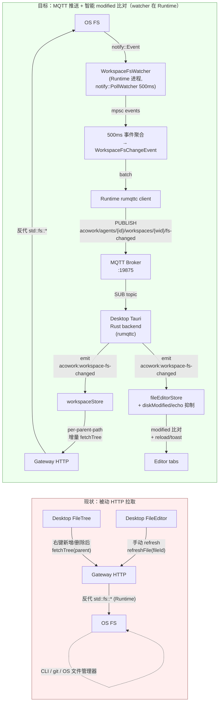

# ADR-058：Workspace 文件系统变化通过 MQTT 推送到 Desktop 自动刷新

**状态**：提案
**日期**：2026-09-12
**决策者**：大鱼
**前置**：
- [ADR-009](../en/ADR-009-gateway-workspace-isolation.md)（Gateway 不读 workspace 文件 — 仅 Runtime / Desktop 端接触 FS；**英文版**，zh 暂未翻译）
- [ADR-033](./ADR-033-mqtt-replace-grpc-websocket.md)（MQTT 替换 gRPC + WebSocket — IPC 主通道）
- [ADR-034](./ADR-034-mqtt-http-boundary.md)（MQTT / HTTP 职责边界 — 主题命名"按数据源"）
- [ADR-048](./ADR-048-debug-protocol-mqtt-http.md)（Debug Protocol 走 MQTT + HTTP 模板 — **Runtime 直发 Desktop** 的同链路先例）
- [ADR-054](./ADR-054-debug-context-snapshot-coverage.md)（同模式的"事件驱动 UI 同步"实践）
- [docs/design/zh/08-security.md](../../design/zh/08-security.md) §11.4（`FsWatcher` 跨平台选型 — `notify::PollWatcher` 500ms）
- [docs/zh/protocols/mqtt.md](../../zh/protocols/mqtt.md)（主题树规约 + Retained / Will 语义 + §3.2 Owner 单一原则）

---

## 决策摘要

**Workspace 文件系统变化（创建 / 修改 / 删除）由 Runtime 端 `WorkspaceFsWatcher` 服务监听，通过 MQTT 推送到 Desktop 触发自动刷新；同时修复编辑器 tab 的"外部修改冲突 UX"。**

把现有的 `FsWatcher`（[core/acowork-runtime/src/security/fs_watcher.rs](../../../core/acowork-runtime/src/security/fs_watcher.rs)）从"agent 工具执行的审计观测"扩为"对外发布的权威事件源"。**watcher 运行在 Runtime 进程**——Runtime 本就是 workspace 的权威所有者（ADR-009 v2 + `proxy.rs`），`agents/{id}/*` 主题归 Runtime 发布（`mqtt.md` §3.2），与 ADR-048 Debug 事件同链路。不复用"Gateway 端独立 watcher"方案（见 §2.1 备选对比）。



| 维度 | 现状 | 目标 |
|------|------|------|
| 外部变更感知 | ❌ 完全靠用户主动操作后 fetchTree | ✅ Runtime 端 500ms 扫描，MQTT 推送 |
| 编辑器 tab 外部修改冲突 | ❌ 不会提示（用户必须手动 refresh） | ✅ modified/size 比对 + VSCode 同款 UX（dirty 弹 toast / clean 静默 reload） |
| Remote 模式支持 | ❌ Desktop 端无法感知远端 FS 变化 | ✅ 与现有 session events 同链路（需 broker 可达，见 §3.5） |
| 主题归属 | 缺失（workspace 完全是被动数据源） | `agents/{id}/workspaces/{wid}/fs-changed`（按数据源命名，**Owner=Runtime**） |
| 复用基础设施 | — | `notify` crate + `rumqttd` + Tauri emit 通道 |
| Desktop 改动 | — | store 加 1 个 listener + FileTreeNode 重渲染条件不变 |

---

## 背景与动机

### 1.1 问题：右侧工作区"被动同步"模型

当前 [WorkspaceExplorer.tsx](../../../apps/acowork-desktop/src/components/workspace/WorkspaceExplorer.tsx)、[workspaceStore.ts](../../../apps/acowork-desktop/src/stores/workspaceStore.ts)、[fileEditorStore.ts](../../../apps/acowork-desktop/src/stores/fileEditorStore.ts) 完全靠**用户在 UI 上主动操作后**触发 `fetchTree()`：

| 触发点 | 调用方 | 代码 |
|--------|--------|------|
| 右键 → 新建文件/文件夹 | WorkspaceExplorer | `L513-549 quickCreateAndRename` |
| 右键 → 删除 | WorkspaceExplorer | `L582-596 handleDelete` |
| 右键 → 黏贴 | WorkspaceExplorer | `L608-676 handlePaste` |
| 右键 → 重命名 | WorkspaceExplorer | `L290-329 handleRename` |
| 拖拽移动 | WorkspaceExplorer | `L127-173 handleMoveItem` |
| 工具栏 refresh 按钮 | WorkspaceExplorer | `L468-472 handleRefresh` |
| 单文件手动 reload | `fileEditorStore.refreshFile` | `L482-533` |

**没有外部变更感知机制**：

- 用户在 macOS Finder 拖入文件 / 用 `touch` / 用 `git checkout` / 在 VSCode 另一窗口编辑 / 在 CLI 跑 `npm install` — FileTree 都不会更新，必须手动点 refresh
- 已打开的编辑器 tab 不会感知磁盘文件被外部修改；用户 A 在 Desktop 改了文件保存后，用户 B 在 CLI 改了同一文件，用户 B 切回 tab 时看到的是陈旧内容（无任何角标）

### 1.2 已有 `FsWatcher` 但用途受限

[core/acowork-runtime/src/security/fs_watcher.rs](../../../core/acowork-runtime/src/security/fs_watcher.rs) 已经实现：

- `notify::PollWatcher` + 500ms 轮询（与 ADR-009 §11.4 选型一致 — 跨平台延迟可预测）
- `FsEvent` 枚举：`FileCreated` / `FileModified` / `FileDeleted` / `MetadataChanged` / `SymlinkCreated`
- `try_recv_events()` + `recv_events(timeout)` 拉取 API
- 单测覆盖 `is_executable_file` / `convert_event` 各分支

**但只用于 `audit_log.rs` 安全审计**（追踪 agent 工具执行期间的文件变更），**没有任何路径把事件推送到 MQTT 或 Desktop**。这是架构上明显的缺口 — watcher 已存在、事件已捕获、却只服务一个 agent 进程的内部审计。

### 1.3 现状的根本问题：架构层面"workspace 是被动数据源"

[docs/zh/protocols/mqtt.md §3.1](../../zh/protocols/mqtt.md) 已固化主题"按数据源 pub/sub"原则 — 每份数据由唯一的发布者权威发布，订阅者按需订阅。Workspace 当前**完全不走 MQTT**，所有 CRUD 都走 HTTP（`GET /api/agents/{id}/workspaces/tree`、`POST /workspaces/file`、`DELETE /workspaces/file` 等），Desktop 只能通过用户主动触发或本地初始化拉取看到变化。

> **澄清**：这些 HTTP 端点由 Gateway **反向代理到 Runtime**（`core/acowork-gateway/src/http/proxy.rs`），真正读写 workspace 的是 Runtime。workspace 的权威所有者是 Runtime（ADR-009 v2），不是 Gateway。

对比其他数据源的成熟模式（[ADR-048 §1 协议映射](./ADR-048-debug-protocol-mqtt-http.md#1-协议映射对外契约)）：

| 数据源 | 现状 |
|--------|------|
| Session messages | ✅ 走 MQTT `agents/{id}/sessions/{sid}/messages/chunk|tool_call|done` |
| Session meta / config | ✅ 走 MQTT Retained |
| Memory nodes | ✅ 走 MQTT `memory/nodes/{nid}/update` + HTTP 全量拉 |
| Debug events | ✅ 走 MQTT `agents/{id}/debug/events/*`（ADR-048，Runtime 直发） |
| **Workspace FS events** | ❌ 缺失 |

**workspace 是唯一没有"事件源"的动态数据。**

### 1.4 Remote 模式放大了问题

Desktop 当前在 Remote 模式（Gateway 跑在 WSL / 远程主机 / SSH 主机）下，**完全无法感知远端 FS 变化**：

- Gateway HTTP API 仅在用户主动调用时返回结果
- Desktop 端不直接接触远端 FS（也不应该 — 越权）
- `git pull` 在远端触发后，本地 Desktop 永远不知道文件被改了

这是 Remote 模式落地最大的 UX 缺陷之一，比本地模式的"被动刷新"严重得多。

---

## 详细设计

### 2.1 架构选择：Runtime 端 `WorkspaceFsWatcher` 服务

#### 为什么 watcher 必须跑在 Runtime 端

| 备选方案 | 缺点 | 结论 |
|---------|------|------|
| **A. Tauri `plugin-fs.watch()` (Desktop 端)** | 仅 local 模式有效；Remote 模式下 Desktop 看不到远端 FS；无跨窗口/跨实例共享 | ❌ 不解决 Remote 问题 |
| **B. Runtime 内复用现有 `FsWatcher`**（本方案） | Runtime idle sleep 期间可能停摆（见下方"idle sleep 语义"） | ✅ **workspace 权威所有者 + 主题 Owner 一致 + ADR-048 先例** |
| **C. Gateway 内独立 watcher 服务** | **违反 ADR-009**（Gateway 是纯反代，不碰 workspace FS）；**违反 mqtt.md §3.2**（`agents/{id}/*` 归 Runtime，Gateway 只拥有 `acowork/global/*`）；引入 Gateway→Runtime crate 反向依赖 | ❌ 双重契约违约 |
| **D. 新建独立 sidecar 进程** | 过度工程；workspace 是 Runtime 已知的资源列表，加 sidecar 增复杂度 | ❌ |

关键依据（来自现有代码，非假设）：

- `core/acowork-gateway/src/http/proxy.rs:107-116`：*"the Runtime is the authoritative workspace API owner; the Gateway is now a thin reverse-proxy for these CPU-heavy filesystem walks."*
- `core/acowork-gateway/src/http/workspaces.rs:1-6`：*"The Runtime is the authoritative owner of workspace config … All write-side workspace operations … are handled by the Agent Runtime HTTP server and proxied verbatim."*
- `docs/zh/protocols/mqtt.md §3.2`：*"Runtime 拥有 `agents/{id}/*` 下所有主题"*；Gateway 只拥有 `acowork/global/*`。
- `mqtt_payload.proto:66-75`：ADR-048 Debug 事件就是 **Runtime → Desktop** 直发（`acowork/agents/{id}/debug/events/*`）。

**这四点共同决定：事件权威在 Runtime，而不是 Gateway。** 方案 C 表面上是"把事件权威放在拥有 FS 的一侧"，但它把"拥有 FS 的一侧"错误地等同成了 Gateway。

#### idle sleep 语义（方案 B 唯一需要回答的开放问题）

方案 B 曾被质疑"agent idle sleep / 关闭后 watcher 停摆"。需先澄清一个事实：

- **若 idle sleep = 进程存活、仅暂停业务处理**：notify watcher 作为独立 tokio task 继续运行，问题不存在。
- **若 idle sleep = 进程退出**：watcher 随进程停止，期间事件丢失；`ready=true` 重发后，Desktop 通过既有 `MQTT_CONNECTED → invalidateTreeCache + fetchTree("")` 全量 sync 兜底（与 §3.4 重连策略一致，**不新增机制**）。

> **实现约定**：watcher 的 task **不**挂在 agent 业务生命周期（session/LLM）上，而是挂在 Runtime 的 workspace 模块上，随 workspace 列表变化启停、随进程退出销毁。具体 idle sleep 的进程语义由 Runtime 现有实现决定，本 ADR 不改变它，只要求"无论哪种语义，重连/重就绪后都必须全量 sync 兜底"。

#### 关键设计点：ADR-009 天然合规

放 Runtime 后不再需要"监听不等于读取"之类的辩解 — Runtime 本来就被 ADR-009 授权接触 workspace FS。Gateway 全程只做两件事：托管 broker、反向代理 HTTP，不新增任何 FS 访问。

### 3.1 协议契约：主题与 payload

#### 主题（遵守 [docs/zh/protocols/mqtt.md](../../zh/protocols/mqtt.md) §3.2/§3.5）

```
acowork/agents/{agent_id}/workspaces/{workspace_id}/fs-changed
```

**Owner**：Runtime（`agents/{id}/*` 子树归 Runtime；workspace 变化是 per-agent + per-workspace 事实）。
**Retained**：`false`（事件是增量流，不需要快照；新订阅者重连后丢失历史事件可接受 — 见 §3.4 重连策略）。
**QoS**：`1`（必须保证至少一次；事件丢失会导致 FileTree 与磁盘长期不一致）。
**ACL**：与现有 `agents/{id}/...` 子树一致（[ADR-033 §10](../../zh/protocols/mqtt.md#10-多用户扩展基于-acl)）。

**为什么不放 `acowork/global/...`**：watcher 状态是 per-agent + per-workspace 的（不同 agent 挂载不同 workspace 目录），不是全局共享资源。`acowork/global/...` 留给"所有 Runtime 共享同一份"的数据（如 available resources）。

#### Payload schema（Protobuf `DataEnvelope`，扩展 oneof）

MQTT 全链路 payload 是 Protobuf `DataEnvelope`（`mqtt.md` §1、`mqtt_payload.proto` 文件头）。新资源按规约**扩展 `DataEnvelope.payload` oneof**，而不是新造 serde JSON 类型：

**字段号选择 38**（紧跟 `SessionState = 37`）：与 session lifecycle 同属 "Runtime → Desktop 业务事件" 语义，符合 [`mqtt_payload.proto:30-78`](../../../core/acowork-core/proto/mqtt_payload.proto#L30-L78) 的 namespace 划分（10s = Global / 20s = Agent / 30s = Session+Workspace / 40s = Control / 50s = Memory / 60s = Sidecar / 70s = Debug）。**不放 80** 是因为跨越多个 namespace 不可读。

```proto
// core/acowork-core/proto/mqtt_payload.proto — 新增于 DataEnvelope.payload oneof
// 字段号 38（ADR-058）：Workspace 文件系统变化，Runtime → Desktop，QoS 1，非 retained。
// 字段号 38 已被本消息占用并保留，永不复用。如需新增 workspace 相关消息，
// 使用 39 起下一空闲位，并在本文件头登记。
WorkspaceFsChangeEvent workspace_fs_change_event = 38;

// ── Workspace FS events (Runtime → Desktop, QoS 1, 非 retained) ──
message WorkspaceFsChangeEvent {
  string agent_id = 1;
  string workspace_id = 2;
  // 同一聚合窗口（500ms）内合并后的所有变更（vscode BulkFileOperations 风格）
  repeated FsChange changes = 3;
  // 聚合窗口 flush 时间（epoch ms）。订阅者仅用于日志/调试与陈旧事件过滤，不用于排序
  //（同一 topic 内 MQTT 天然有序）。
  uint64 window_end_ms = 4;
}

enum FsChangeKind {
  FS_CHANGE_KIND_UNSPECIFIED = 0;
  FS_CHANGE_KIND_CREATED = 1;
  FS_CHANGE_KIND_MODIFIED = 2;
  FS_CHANGE_KIND_DELETED = 3;
}

message FsChange {
  FsChangeKind kind = 1;
  // 归一化为 forward-slash relative path（与 TreeEntry 风格一致）
  string path = 2;
  // 事件观察时间（聚合器 flush 时刻，epoch ms）。Desktop 端据此过滤陈旧事件 + echo 抑制。
  uint64 timestamp_ms = 3;
}
```

**批量化语义**：500ms 窗口内同一文件多次修改合并为 1 条 `Modified`；created + deleted 在窗口内抵消（不推送，避免临时文件抖动噪声）。

**Rename 语义（降级，不合并）**：`notify::PollWatcher` 是目录快照比对，不提供跨事件的 inode 配对信息，`[Delete: old, Create: new]` 的 rename 推导不可靠。因此**明确不做 `Renamed` 合并**——rename 在窗口内退化为 `Deleted(old)` + `Created(new)` 两条事件（跨窗口则分属两个窗口）。UI 收到后刷新两个父目录即可自愈，代价是 rename 后 `treeExpandedPaths` 可能丢失（已在风险表如实记录）。

#### 为什么 500ms 批量化

- `notify::PollWatcher` 本身 500ms 轮询一次，事件到达时已是天然批次
- 再叠一个 500ms 窗口合并 → 最坏端到端延迟约 1s（用户感知阈值内）
- 单次 PUBLISH payload 含多条变更 → 1 次 round-trip 渲染多棵子树
- VSCode 默认用 50ms 窗口合并；我们用 500ms 与 PollWatcher 周期对齐（CPU 与延迟权衡）

> 措辞澄清：500ms 是"轮询周期"与"聚合窗口"各自独立，最坏端到端 ≈ 周期 + 窗口 ≈ 1s，并非"对齐后无叠加"。

### 3.2 Runtime 端 `WorkspaceFsWatcher` 服务

#### 启动时机

| 触发 | 行为 |
|------|------|
| Runtime 启动 + Phase C 完成 | 读取 `agent_workspaces.json`，为该 agent 每个 workspace 启动 watcher |
| Desktop 增/删/改 workspace（`POST/PUT/DELETE /workspaces` 反代到 Runtime） | Runtime 写 config 后，启动/停止对应 watcher |
| Runtime 关闭 / idle sleep（进程退出） | 所有 watchers 随进程 drop |
| Runtime idle（进程存活） | watcher 作为独立 tokio task 继续运行（不挂 session 生命周期） |
| Gateway 重启 | **不影响 watcher**（watcher 在 Runtime 侧）；broker 恢复后 Desktop 重连全量 sync |

#### 单一 watcher 实例原则

**每个 workspace_id 最多 1 个 watcher 实例**（Runtime 进程内 agent_id 是单例）：

- 用 `HashMap<WorkspaceId, JoinHandle>` 索引去重
- Drop 时显式调用 `watcher.stop()` + 从索引中移除
- session 级 workspace 切换（`sessionWorkspaceMap`）**不**重建 watcher——watcher 常驻，切换只是 Desktop 端订阅 focus 变化

#### 事件聚合器（500ms 窗口）

> **模块位置**（与 §3.6 `WorkspaceWatcherSet` 同目录）：`core/acowork-runtime/src/workspace/fs_watcher.rs`。
> 不放 `security/` 是因为本 watcher 是 **workspace 同步**关注点，不是安全审计关注点 —
> 现有 [`security/fs_watcher.rs`](../../../core/acowork-runtime/src/security/fs_watcher.rs) 继续服务 audit_log，两者并行。

```rust
// core/acowork-runtime/src/workspace/fs_watcher.rs
use notify::{Config, PollWatcher, RecursiveMode, Watcher};
use tokio::sync::mpsc;  // 沿用 fs_watcher.rs:14 的约定（不要用 std::sync::mpsc——会阻塞 executor）

pub struct WorkspaceFsWatcher {
    workspace_dir: PathBuf,
    agent_id: String,
    workspace_id: String,
    notify_watcher: Option<PollWatcher>,
    rx: mpsc::UnboundedReceiver<notify::Event>,
    /// Aggregator buffer for the current 500ms window
    pending: HashMap<PathBuf, FsChangeKind>,
    window_started: Instant,
}

const WINDOW_DURATION: Duration = Duration::from_millis(500);

impl WorkspaceFsWatcher {
    pub async fn run(
        mut self,
        publisher: mpsc::Sender<WorkspaceFsChangeEvent>,
    ) {
        loop {
            tokio::select! {
                _ = tokio::time::sleep_until(self.window_deadline()) => {
                    self.flush_window(&publisher).await;
                }
                Some(raw) = self.rx.recv() => {
                    self.ingest(raw);
                    if self.window_started.elapsed() >= WINDOW_DURATION {
                        self.flush_window(&publisher).await;
                    }
                }
                else => break,  // channel closed → shutdown
            }
        }
    }

    fn ingest(&mut self, event: notify::Event) {
        for path in &event.paths {
            // 越界过滤：只保留 workspace 内路径（symlink 越界/兄弟目录事件直接丢弃）
            if !path.starts_with(&self.workspace_dir) { continue; }
            let Some(rel) = self.to_rel_path(path) else { continue; };
            match event.kind {
                EventKind::Create(_) => { self.pending.insert(rel, FsChangeKind::Created); }
                EventKind::Modify(_) => {
                    // Created → Modified in same window → coalesce to Created
                    if matches!(self.pending.get(&rel), Some(FsChangeKind::Created)) { continue; }
                    self.pending.insert(rel, FsChangeKind::Modified);
                }
                EventKind::Remove(_) => {
                    // Created → Deleted in same window → drop (atomic ops that vanished)
                    if matches!(self.pending.get(&rel), Some(FsChangeKind::Created)) {
                        self.pending.remove(&rel);
                        continue;
                    }
                    self.pending.insert(rel, FsChangeKind::Deleted);
                }
                _ => {}
            }
        }
    }

    fn flush_window(&mut self, publisher: &mpsc::Sender<WorkspaceFsChangeEvent>) {
        if self.pending.is_empty() { return; }
        let now_ms = epoch_ms();
        let changes = self.pending.drain()
            .map(|(path, kind)| FsChange {
                kind,
                path: path_to_forward_slash(path),
                timestamp_ms: now_ms,
            })
            .collect();
        let event = WorkspaceFsChangeEvent {
            agent_id: self.agent_id.clone(),
            workspace_id: self.workspace_id.clone(),
            changes,
            window_end_ms: now_ms,
        };
        let _ = publisher.try_send(event);
    }
}
```

#### 路径归一化与越界过滤

`notify::Event.paths` 给出**绝对路径**，聚合前必须转为 forward-slash relPath（与 `TreeEntry` 风格一致），且越界路径丢弃（不得 `unwrap_or(abs)` 泄露绝对路径）：

```rust
fn to_rel_path(&self, abs: &Path) -> Option<PathBuf> {
    // strip_prefix 失败 = 路径不在 workspace 内（越界），返回 None 由调用方丢弃
    abs.strip_prefix(&self.workspace_dir)
       .ok()
       .map(|rel| rel.components().collect::<PathBuf>())
}
```

### 3.3 Desktop 端响应

#### Tauri Rust backend（[apps/acowork-desktop/src-tauri/src/mqtt_client.rs](../../../apps/acowork-desktop/src-tauri/src/mqtt_client.rs)）

新主题加入 `ALL_TOPIC_FILTERS`（`mqtt_client.rs:199-230`），以便每次 ConnAck 自动重订阅；`on_message` 按 `DataEnvelope` 解包分发：

```rust
// ALL_TOPIC_FILTERS 新增（QoS 1，与 messages/# 同理由：不能丢）
("acowork/agents/+/workspaces/+/fs-changed", MqttQoS::AtLeastOnce),

// on_message 分发：按现有 DataEnvelope protobuf 解包路径
// topic == "acowork/agents/{id}/workspaces/{wid}/fs-changed" 时：
//   decode DataEnvelope → payload.workspace_fs_change_event
//   → app.emit("acowork:workspace-fs-changed", event)
```

#### Frontend store 监听

`workspaceStore.ts` 顶层挂 1 个 listener：

```typescript
useEffect(() => {
    const handler = (event: { payload: WorkspaceFsChangeEvent }) => {
        const { agent_id, workspace_id, changes } = event.payload;
        if (agent_id !== selectedAgentId) return;
        if (workspace_id !== currentWorkspaceId) return;

        // 按 parentPath 分组，调用 fetchTree 增量刷新
        const parentsToRefresh = new Set<string>();
        for (const change of changes) {
            const parent = change.path.includes('/')
                ? change.path.substring(0, change.path.lastIndexOf('/'))
                : '';
            parentsToRefresh.add(parent);
        }
        for (const parent of parentsToRefresh) {
            fetchTree(agent_id, workspace_id, parent);
        }
    };
    window.__TAURI__.event.listen('acowork:workspace-fs-changed', handler);
    return () => window.__TAURI__.event.unlisten('acowork:workspace-fs-changed', handler);
}, [selectedAgentId, currentWorkspaceId, fetchTree]);
```

**为什么用 per-parent-path 增量而非全量 invalidate**：

- 保留用户展开状态（`treeExpandedPaths`）
- 减少 HTTP 请求（10 个分散在 10 个目录的修改只触发 10 个 fetchTree，而非 1 个全量 invalidate）
- 性能：FileTree 是虚拟列表，全量重建可见性抖动

#### `fileEditorStore` 监听 + modified 比对 + echo 抑制

**核心**：每个 `OpenFile` 缓存**服务端返回的磁盘时间戳** `diskModified`（来自 Gateway `GET /workspaces/file` 响应已有字段 `modified`，`proxy.rs:722-724`），以及 **save 成功时刻** `lastSavedAtMs`（用于抑制自己写入产生的回波事件）：

```typescript
interface OpenFile {
    // ... 既有字段
    diskModified?: number;   // 来自 server response 的 modified 字段（新增）
    lastSavedAtMs?: number;  // save 成功时刻，用于 echo 抑制（新增）
    diskDeleted?: boolean;   // dirty 文件在磁盘被删除的标记（新增）
    diskConflict?: 'modified' | 'deleted';  // 冲突状态（新增）
}

const ECHO_SUPPRESS_MS = 1500; // 覆盖 save → PollWatcher 捕获(≤500ms) → 聚合 flush(≤500ms) → MQTT → emit 全程并留裕量

// Listener
useEffect(() => {
    const handler = (event: { payload: WorkspaceFsChangeEvent }) => {
        const { agent_id, workspace_id, changes } = event.payload;
        for (const change of changes) {
            const file = openFiles.find(f =>
                f.agentId === agent_id &&
                f.workspaceId === workspace_id &&
                f.relPath === change.path
            );
            if (!file) continue;

            if (change.kind === 'deleted') {
                if (!file.dirty) {
                    // 关闭 tab + 显示 "(deleted on disk)" 占位
                    closeFile(file.id, true);
                    toast.warning(`File deleted: ${file.relPath}`);
                } else {
                    file.diskDeleted = true;
                    file.diskConflict = 'deleted';
                    toast.warning(`File deleted on disk (you have unsaved changes)`);
                }
                continue;
            }

            if (change.kind !== 'modified' || file.mode !== 'edit') continue;

            // Echo 抑制：跳过自己刚保存产生的回波事件（否则每次 save 都会误弹 toast/reload）
            if (file.lastSavedAtMs != null &&
                change.timestamp_ms - file.lastSavedAtMs < ECHO_SUPPRESS_MS) {
                continue;
            }

            if (file.dirty) {
                // dirty 文件：弹 toast 让用户决定
                file.diskConflict = 'modified';
                toast({
                    type: 'warning',
                    message: `File changed on disk: ${file.relPath}`,
                    actions: [
                        { label: 'Reload', onClick: () => refreshFile(file.id) },
                        { label: 'Keep mine', onClick: () => dismissConflict(file.id) },
                    ],
                });
            } else {
                // clean 文件：静默 reload（保留光标位置）
                refreshFile(file.id);
            }
        }
    };
    // 同上 listen/unlisten
}, [openFiles, refreshFile]);
```

**saveFile 成功分支需回填两个字段**（现有 `fileEditorStore.ts:465-471` 目前不解析响应 JSON）：

```typescript
// saveFile 成功：解析响应 JSON 的 modified，并回填 lastSavedAtMs 用于 echo 抑制
const data = (await resp.json()) as { modified?: number };
set((state) => ({
    openFiles: state.openFiles.map((f) =>
        f.id === fileId
            ? { ...f, saving: false, originalContent: f.content, dirty: false,
                diskModified: data.modified, lastSavedAtMs: Date.now(), saveError: undefined }
            : f,
    ),
}));
```

> **字段名统一**：Gateway 已有字段是 `modified`（不是 `mtime`），`fileEditorStore.ts:254/322/509` 目前只解 `{content,size,mimeType}`——需要一并解 `modified` 并在 `openFile`/`openPreview`/`refreshFile` 三处回填 `diskModified`。**无需改 Gateway**（`GET /workspaces/file` 已返回 `modified`）。

**VSCode 同款 UX**：
- **干净文件**：自动 reload（保留 cursor / scroll position）
- **dirty 文件**：弹"File has changed on disk"对话框 → 用户选 `Reload` / `Keep mine`
- **已删除**：关闭 tab + 显示占位
- **dirty 文件被删除**：弹"File deleted on disk (you have unsaved changes)"

### 3.4 重连策略（Desktop → Gateway 断线）

| 场景 | 行为 |
|------|------|
| Desktop 断线（任意时长） | 事件是**非 retained + 非持久缓存**；断线期间事件丢失。重连后靠兜底（见下） |
| Desktop 重连 / `MQTT_CONNECTED` | 触发 `invalidateTreeCache(agentId)` + `fetchTree("")` 全量 sync |
| Runtime 重启 / idle sleep（进程退出） | watcher 随进程停止；`ready=true` 重发后 Desktop 全量 sync 兜底 |
| Gateway 重启 | broker 重启 → Desktop 断连重连（同上）；watcher 在 Runtime 侧不受影响，事件流恢复 |

> **语义修正**：Desktop 是 `clean_session=true`（`mqtt_client.rs:188-190`），断线期间 QoS 1 消息 **broker 不缓存投递**，非 retained 也不持久化。所以不存在"QoS 1 短期 buffer 重发"——正确语义是"丢失可接受 + 重连全量 sync 兜底"。

**断线后 Desktop 主动 sync 的 fallback**：

- `workspaceStore` 已有 `invalidateTreeCache(agentId)`，在重连后 `MQTT_CONNECTED` 事件触发一次全量同步
- 这是兜底逻辑，不阻塞主流程

### 3.5 Remote 模式适配（核心收益）

**Local 模式**：

```
[Desktop] → HTTP :19876 → [Gateway localhost] → [Runtime (watcher)] → [Local FS]
          → MQTT  :19875 → [Runtime PUB fs-changed]
```

**Remote 模式**：

```
[Desktop] → HTTP :19876 (WSL IP / SSH tunnel) → [Gateway remote] → [Runtime (watcher)] → [Remote FS]
          → MQTT  :19875（需 broker 可达，见下）
```

**Desktop 端代码 0 改动**——本地/远程走同一条 MQTT 链路，watcher 永远跑在 Runtime（拥有 FS 的一侧）。这正是 VSCode Remote 抽象的核心价值，也是本方案相对"Desktop 端 Tauri plugin-fs.watch"的最大架构优势。

> **Remote 模式下 broker 可达性（本 ADR 的前提约束，不能含糊）**：
> 本地 Desktop 的 `rumqttc` 当前硬编码连接 `127.0.0.1:19875`（`mqtt_client.rs:517`），而 broker 只绑定 localhost。Remote 模式要获得实时推送，**Desktop 必须能触达远端 broker**——优先复用与 HTTP（`:19876`）相同的 SSH 隧道/端口转发，把远端 `19875` 转发到本地；broker 本身保持 localhost-only 绑定不变（安全上不放开监听）。若不建立该隧道，Remote 模式退化为"手动 refresh + HTTP 拉取"（与现状一致），**不宣称"0 改动自动覆盖 Remote"**。Desktop 端 broker 地址改为可配置（复用现有 Gateway URL 的 host 派生即可）是 W4 的一部分。

### 3.6 生命周期（Runtime 侧，取代 Gateway registry）

放 Runtime 后不再需要跨进程的 `WorkspaceWatcherRegistry`——watcher 与 workspace 列表同生命周期，由 Runtime 的 workspace 模块管理：

```rust
// core/acowork-runtime/src/workspace/watcher_set.rs
pub struct WorkspaceWatcherSet {
    // 单 Runtime 进程 = 单 agent，键仅为 workspace_id
    watchers: HashMap<String, WorkspaceWatcherHandle>,
    publisher: rumqttc::AsyncClient,  // 或复用 Runtime 现有 MQTT publisher 抽象
}

impl WorkspaceWatcherSet {
    pub fn ensure_watcher(&mut self, workspace_id: &str, workspace_root: &Path) -> Result<()> {
        if self.watchers.contains_key(workspace_id) { return Ok(()); }  // dedupe
        let watcher = WorkspaceFsWatcher::new(workspace_root, self.agent_id(), workspace_id)?;
        let handle = tokio::spawn(watcher.run(self.publisher.clone()));
        self.watchers.insert(workspace_id.to_string(), handle);
        Ok(())
    }

    pub fn stop_watcher(&mut self, workspace_id: &str) {
        if let Some(handle) = self.watchers.remove(workspace_id) {
            handle.abort();
            // WorkspaceFsWatcher 内部 drop notify_watcher → watcher.stop()
        }
    }

    pub fn stop_all(&mut self) {
        for id in self.watchers.keys().cloned().collect::<Vec<_>>() {
            self.stop_watcher(&id);
        }
    }
}
```

#### 与 Runtime 生命周期集成

```rust
// 现有：on Phase C 完成 → 子系统就绪
// 新增：Phase C 完成后启动所有 workspace watcher
async fn start_workspace_watchers(&self) {
    let workspaces = self.load_workspaces().await?;  // agent_workspaces.json
    for ws in workspaces {
        self.watchers.ensure_watcher(&ws.id, &PathBuf::from(&ws.path)).await?;
    }
}

// workspace CRUD 处理完成后：
//   add/update → ensure_watcher
//   delete     → stop_watcher

// Runtime 关闭 / idle sleep（进程退出）→ watchers.stop_all()
```

> 注意：上面的 `HashMap<_, JoinHandle>` + `.abort()` 是示意。生产实现中应优先用**优雅关闭**（drop `notify_watcher` 触发 `rx` 关闭，`run()` 的 `else => break` 自然退出），`abort()` 仅作为兜底。

### 3.7 范围声明

**本 ADR 范围内**：

- Runtime 端 `WorkspaceFsWatcher` 服务（新增 `workspace/fs_watcher.rs`，与现有 `security/fs_watcher.rs` 并行）
- `mqtt_payload.proto` 新增 `WorkspaceFsChangeEvent` / `FsChange` / `FsChangeKind` + `DataEnvelope` oneof 字段 38
- Desktop Tauri Rust backend 订阅 + `DataEnvelope` 解包 + emit（新增）
- Desktop `workspaceStore` 增量 `fetchTree`（新增）
- Desktop `fileEditorStore` modified 比对 + echo 抑制 + reload/toast（新增）
- **W4 包含 broker 地址从 Gateway URL host 派生**（Remote 模式下使 Desktop 知道往哪连 broker）— 这是本方案 Remote 适配的**必要技术改动**

**本 ADR 范围外**（明确标记为后续 ADR）：

- **Remote 模式 broker 隧道建立 UX**（SSH 端口转发脚本、CLI 自动隧道、用户文档）— §3.5 已说明 Remote 实时推送需 broker 可达，但**隧道建立是用户/运维责任**，不是协议责任。本 ADR 不规定，由产品/运维在 Remote 模式文档中说明
- **Remote 模式下 broker 不可达的 UI 提示**（连接失败时显式引导用户建立隧道）— UX 决策，单独 ADR
- **文件系统级 undo/redo**（用户希望在 UI 内撤销外部删除）— 太复杂，与 editor undo stack 集成是独立 ADR
- **冲突解决策略细化**（3-way merge 提示）— 后续 ADR 跟进
- **rename 事件合并**（`Renamed` 推断）— PollWatcher 无 inode 配对，本 ADR 降级为 Delete+Create；如需恢复，后续 ADR
- **watcher 性能调优**（10k+ 文件 workspace 的 throttle / 采样）— 性能问题出现时单独 ADR
- **跨 Gateway 实例同步**（多 Gateway 部署场景）— 当前 single-Gateway 假设

---

## 关键决策点（待你确认）

1. **Runtime 端 watcher 服务**（核心选择）— 而不是 Gateway 端独立 watcher 或 Desktop 端 Tauri plugin-fs.watch
2. **500ms 批量化窗口**（与 PollWatcher 周期对齐）— 而不是 50ms 或 1000ms
3. **rename 降级为 Delete+Create**（不做 `Renamed` 合并）— 避免不可靠的 inode 推断
4. **dirty 文件用 toast 而非模态对话框**（VSCode 风格非阻塞）
5. **per-parent-path 增量 fetchTree**（保留展开状态）— 而不是全量 invalidate
6. **echo 抑制窗口 1500ms**（save 后跳过自身回波）— 可调
7. **Remote 模式需建立 broker 隧道**（见 §3.5）— 否则 Remote 实时推送不可用

---

## 风险与缓解

| 风险 | 严重度 | 缓解 |
|------|--------|------|
| **Runtime idle sleep（进程退出）期间事件丢失** | 中 | `ready=true` 后 Desktop 由 `MQTT_CONNECTED`/重连触发 `invalidateTreeCache + fetchTree("")` 全量 sync 兜底；进程存活场景 watcher 独立 task 继续运行 |
| **自己保存产生回波 → 误报冲突/多余 reload** | 中 | save 成功后回填 `lastSavedAtMs`；listener 对 `timestamp_ms - lastSavedAtMs < 1500ms` 的事件跳过（§3.3） |
| **rename 无法可靠配对（PollWatcher 无 inode）** | 低 | 明确不做 `Renamed` 合并；rename 退化为 Delete+Create 两事件，UI 刷新两个父目录自愈；展开状态可能丢失（可接受，已声明） |
| **500ms 聚合窗口 + 500ms 轮询 → 最坏 1s 延迟** | 低 | 用户感知阈值内（< 1s = "即时"）；与 VSCode 50ms 窗口相比延迟多 950ms 但 CPU 占用更低 |
| **大 workspace（10k+ 文件）轮询 500ms CPU 占用** | 低-中 | `fs_watcher.rs:44-45` 注释称 "10k+ 文件 < 1% CPU"（**未经验证**，实现时以实测为准）；若超标，§3.7 标注为后续 ADR 跟进 |
| **Desktop MQTT 断线后事件丢失** | 中 | 事件非 retained；重连后 `MQTT_CONNECTED` 触发 `invalidateTreeCache` 全量同步（§3.4） |
| **symlink 越界事件泄露** | 低 | `ingest()` 先 `path.starts_with(workspace_dir)` 过滤；`to_rel_path` 返回 `Option`，越界丢弃（§3.2） |
| **OpenFile 缓存的 modified 在文件无变化时刷新导致误判** | 低 | `diskModified` 仅在 `GET /workspaces/file` 响应时设置；echo 抑制窗口过滤自身写入；外部变更由事件驱动而非轮询 |
| **`quickCreateAndRename` 中右击新建 → 立刻 fetchTree 触发 Rename input 与 watcher 事件冲突** | 中 | watcher 启动后右击新建会被自己检测到 `Created` 事件并回推一次 `fetchTree`；`quickCreateAndRename` 已主动 `await fetchTree(parent)` 后再 `requestRenameFor`，watcher 推送是"确认"而非"额外动作"；确保 `renameTarget` 状态不丢失 — 测试覆盖此场景 |

---

## 实施计划（6 commits，每个独立 buildable）

| Commit | 范围 | 主要内容 | 估计 |
|--------|------|---------|------|
| **W0** | Runtime: 提取 `WorkspaceFsWatcher` 模块 | 从 `security/fs_watcher.rs` 提取通用 notify 封装到 `workspace/fs_watcher.rs`，加 `FsChange` aggregation（500ms 窗口 + create/delete 抵消）；保留原 `security/fs_watcher.rs` 用于 audit_log 兼容 | +200 行 |
| **W1** | Core: proto + aggregator 完整化 | `mqtt_payload.proto` 新增 `WorkspaceFsChangeEvent` / `FsChange` / `FsChangeKind` + `DataEnvelope.payload` oneof 字段 38；`WorkspaceFsWatcher::run()` 输出聚合事件流；单元测试覆盖 created/modified/deleted 各组合 + 同窗口抵消 | +150 行 |
| **W2** | Runtime: 挂载 + MQTT 发布 | `workspace/watcher_set.rs`（HashMap dedupe + start/stop）+ Phase C 完成钩子 + workspace CRUD 后启停 + 复用 Runtime 现有 rumqttc publisher 发布 `fs-changed` | +200 行 |
| **W3** | Runtime: 集成测试 | 临时 workspace 目录 → 模拟文件操作（create/modify/delete）→ 通过 fake MQTT broker 验证事件 payload；覆盖 happy path + 聚合窗口合并 + 同窗口 create+delete 抵消 + 越界路径丢弃 | +200 行 |
| **W4** | Desktop Tauri: 订阅 + 解包 + emit | `mqtt_client.rs` 的 `ALL_TOPIC_FILTERS` 新增 `acowork/agents/+/workspaces/+/fs-changed`（QoS1）+ `on_message` 按 `DataEnvelope` 解包 + emit `acowork:workspace-fs-changed`；broker 地址改为从 Gateway URL host 派生（Remote 隧道场景） | +80 行 |
| **W5** | Desktop frontend: store listeners | `workspaceStore.ts` 顶层监听 → per-parent-path 增量 fetchTree；`fileEditorStore.ts` 监听 → modified 比对 + echo 抑制 + reload/toast；`OpenFile` schema 加 `diskModified` / `lastSavedAtMs` / `diskConflict`；`openFile`/`openPreview`/`refreshFile`/`saveFile` 解 `modified` 字段；FileTreeNode 重渲染测试 | +250 行 |

**关键节点**：

- W0 完成后：`WorkspaceFsWatcher` 模块独立可测试；不影响现有 audit_log 路径
- W2 完成后：Runtime 端事件流首次可用；Desktop 暂未消费（无副作用）
- W4 完成后：Desktop Tauri 端能收到事件但未消费（无副作用）
- W5 完成后：完整链路通；FileTree + FileEditor 全部自动刷新

每个 commit 独立可合、可回滚。

---

## 附录 A：参考

### A.1 VSCode Remote 模式抽象

```
[Renderer (UI)]
     ↕ vscode-jsonrpc workspace.fileChange notification
[Server side watcher (chokidar)]  ← 永远跑在拥有 FS 的一侧
     ↕ fs.watch (inotify/FSEvents/ReadDirectoryChangesW)
[OS FS]
```

关键借鉴：

- Watcher 在 server side（我们对应 Runtime 端），不在 client side（Desktop 端）
- 事件经过 IPC 序列化推送（我们对应 MQTT），不直接 fs 调用
- 事件批量化（vscode BulkFileOperations 风格）

### A.2 主流文件监听方案对比

| 方案 | 跨平台 | 资源占用 | 延迟 | ACowork 适用 |
|------|--------|---------|------|--------------|
| **notify::PollWatcher** (Rust) | ✅ 全平台 | < 1% CPU（10k+ 文件，待实测） | 等于轮询周期（500ms） | ⭐⭐⭐⭐⭐ 已有，直接复用 |
| **notify::recommended_watcher** (Rust) | ✅ 全平台 | 接近 0 | 1ms 级（inotify）/ 100ms+ (FSEvents) | ⭐⭐⭐⭐ 备选（注释说明为何不用） |
| **chokidar** (Node) | ✅ 全平台 | 类似 | 类似 | ⭐⭐⭐ 仅 Desktop 端 |
| **dnotify / inotify 直接** (Linux only) | ❌ Linux only | 0% | 1ms 级 | ⭐⭐ 平台分裂 |
| **轮询 HTTP GET tree** | ✅ | 100%×N | 等于轮询周期 | ⭐ 不推荐作长期方案 |

**当前选型 `notify::PollWatcher 500ms`** 与 [fs_watcher.rs:38-46](../../../core/acowork-runtime/src/security/fs_watcher.rs#L38-L46) 注释一致：跨平台延迟可预测（避免 FSEvents 缓冲 / 沙箱环境降级为 30s 轮询的陷阱），CPU 占用可接受。

### A.3 与现有 ADR 的一致性

- **ADR-009**：watcher 放 Runtime，Runtime 本就授权接触 workspace FS ✅（Gateway 全程零新增 FS 访问，无需修订 ADR-009）
- **mqtt.md §3.2**：`agents/{id}/*` Owner=Runtime，主题发布者与所有者一致 ✅
- **mqtt.md §1 / mqtt_payload.proto**：payload 走 Protobuf `DataEnvelope`，扩展 oneof 字段 38（紧跟 `SessionState = 37`，与 session lifecycle 同语义层级）✅
- **ADR-033 §10**：主题命名"按数据源" ✅（`agents/{id}/workspaces/{wid}/fs-changed`）
- **ADR-034 §4**：HTTP / MQTT 职责边界 ✅（HTTP = CRUD / bulk；MQTT = 增量事件）
- **ADR-035 §D9.2**：流式数据归属 + 节流 ✅（500ms 聚合 = 同模式）
- **ADR-048**：Debug Protocol 同款 MQTT + HTTP 模板 ✅（同 proto 风格 + 同 ACL + Runtime 直发 Desktop）

### A.4 文件清单

**新增**：

- `core/acowork-runtime/src/workspace/fs_watcher.rs`（W0，单 watcher + 聚合器）
- `core/acowork-runtime/src/workspace/watcher_set.rs`（W2，集合管理）

**修改**：

- `core/acowork-core/proto/mqtt_payload.proto`（W1，+30 行：proto 定义 + oneof 字段 38）
- `core/acowork-runtime/src/workspace/mod.rs`（W0，注册新模块；W2，挂载 watcher_set）
- `core/acowork-runtime/Cargo.toml`（W0，无新依赖 — `notify` 已有）
- `core/acowork-runtime/src/security/mod.rs`（W0，无改动 — `security/fs_watcher.rs` 继续服务 audit_log）
- `apps/acowork-desktop/src-tauri/src/mqtt_client.rs`（W4，+80 行：`ALL_TOPIC_FILTERS` + DataEnvelope 解包 + emit + broker 地址派生）
- `apps/acowork-desktop/src/stores/workspaceStore.ts`（W5，+50 行：listener + per-parent-path fetch）
- `apps/acowork-desktop/src/stores/fileEditorStore.ts`（W5，+100 行：listener + modified 比对 + echo 抑制 + reload/toast）
- `apps/acowork-desktop/src/types/` 或 `lib/types.ts`（W5，+30 行：WorkspaceFsChangeEvent 类型）

**测试新增**：

- `core/acowork-runtime/src/workspace/fs_watcher.rs` 内单元测试（W1）
- `core/acowork-runtime/src/workspace/watcher_set.rs` 内集成测试（W3）
- `apps/acowork-desktop/src/stores/workspaceStore.test.ts`（W5，mock Tauri event）
- `apps/acowork-desktop/src/stores/fileEditorStore.test.ts`（W5，覆盖 dirty/clean/deleted 3 路径 + echo 抑制）

> **无需改 Gateway**：`GET /api/agents/{id}/workspaces/file` 已返回 `modified`/`size` 字段（`proxy.rs:722-724`），`fileEditorStore` 只需在 TS 侧解该字段，Gateway 不新增 notify 依赖、不改 `lifecycle/manager.rs`、不改 `mqtt/publisher.rs`。

---

## 待你确认的关键决策点

1. **Runtime 端 watcher 服务**（核心选择 — 拒绝 Gateway 端 watcher 与 Tauri plugin-fs.watch 方案）
2. **W0-W5 6 commits 推进**（每个独立 buildable，可分批 review）
3. **500ms 批量化窗口**（与 PollWatcher 对齐，可调）
4. **rename 降级为 Delete+Create**（不做 `Renamed` 合并）
5. **dirty 文件用 toast 而非模态对话框**（VSCode 风格，可改）
6. **echo 抑制窗口 1500ms**（可调）
7. **Remote 模式需建立 broker 隧道**（否则 Remote 实时推送退化为手动 refresh）
