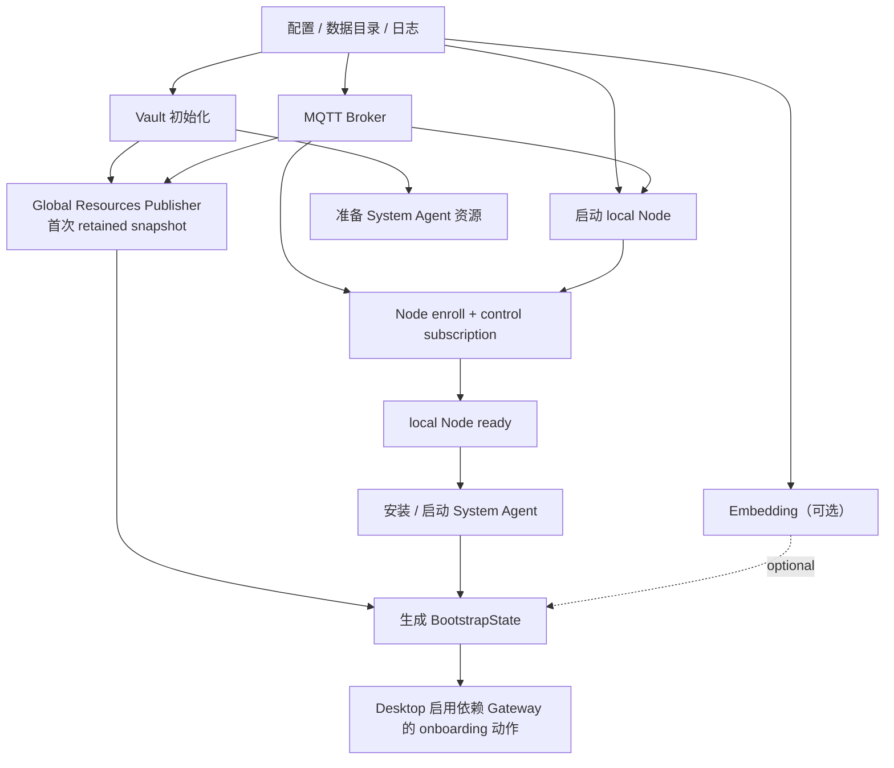
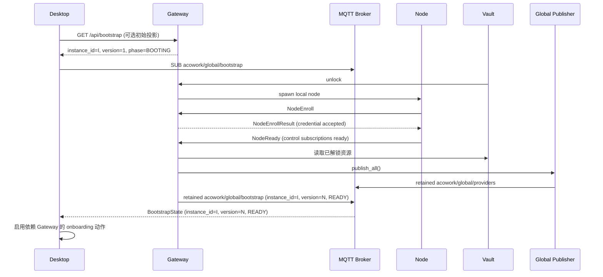
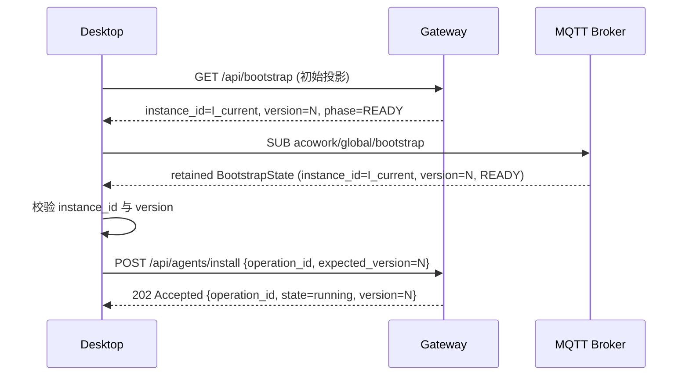
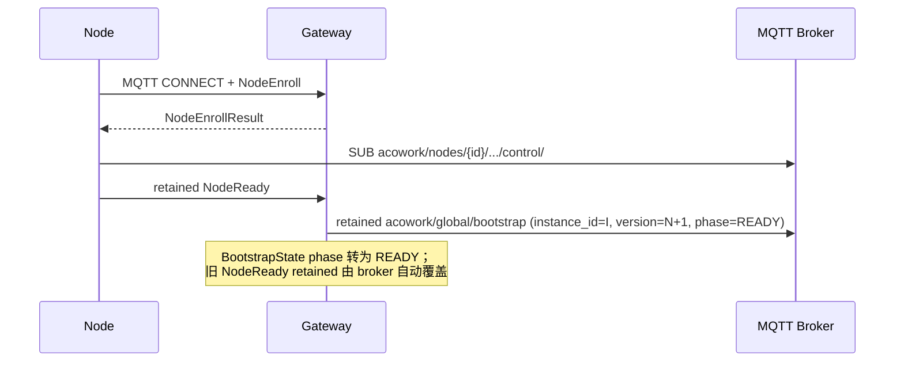

# ADR-059：首次启动引导采用基于能力就绪快照与确认握手的并行化协议

**状态**：提案
**日期**：2026-08-27
**决策者**：ACowork.AI 架构评审
**前置决策**：
- [ADR-033：引入 MQTT 替换 gRPC + WebSocket](./ADR-033-mqtt-replace-grpc-websocket.md)
- [ADR-034：控制面与数据面分层 — MQTT / HTTP 职责边界规约](./ADR-034-mqtt-http-boundary.md)
- [ADR-055：Runtime 远程化部署 - Node Agent 拓扑](./ADR-055-remote-runtime-node-topology.md)
- [ADR-058：Workspace 文件系统变化通过 MQTT 推送到 Desktop 自动刷新](./ADR-058-workspace-fs-watcher-mqtt-event.md)
- [MQTT 协议总览](../../zh/protocols/mqtt.md)
- [HTTP API 协议参考](../../zh/protocols/http.md)

---

## 1. 决策摘要

首次启动引导不能把“端口可达”“HTTP 返回 200”“MQTT 上出现一个标志”当作业务就绪证明。本 ADR 引入一个**能力就绪快照**作为 Gateway 启动阶段的唯一协议事实，并要求所有跨进程操作使用**显式确认握手**完成闭环：

1. Gateway 以一个完整的、版本单调递增的 retained snapshot 发布启动能力状态；Desktop 通过 MQTT retained snapshot 或对应 HTTP 投影获取该状态。`phase` 是客户端唯一路由依据，`instance_id` / `version` 负责跨会话一致性（详见 §5.4）。
2. 首次引导按真实依赖关系构造 DAG；没有依赖的工作可以并行执行，只有存在真实数据依赖的工作才串行等待。Gateway 内部子系统通过事件总线与 `CapabilityRegistry` 协调就绪，外部协议只见 phase（详见 §5.4）。
3. 任何写入、投递或安装操作都必须返回 `operation_id`，并通过关联事件或对应 retained 状态快照确认完成；“请求已接受”不等于“操作已完成”。
4. `/health` 只证明进程仍能响应，不证明 BootstrapState 已发布或 phase=READY。
5. 超时只负责防止无限等待和释放资源，**不得用来推断某个组件已经就绪或某个操作已经完成**。
6. 协议层遵循开闭原则：BootstrapState 仅暴露协议级聚合字段（`instance_id` / `version` / `phase` / `phase_detail` / `issued_at_ms`），不暴露 Gateway 内部 capability 名称、子系统 generation、process id 等内部细节。

这条规则覆盖 Gateway 的整个生命周期，不限于首次启动，避免出现"冷启动 onboarding 用 A 协议、热启动日常操作用 B 协议"的双栈重复造轮子：

- **冷启动 onboarding**：全新 HOME、Vault 首次解锁、首次 publisher、首次 Node enroll。
- **热启动 Gateway 重启**：已有 HOME、Vault 已解锁、retained 资源需要在新 `instance_id` 下重建。
- **Desktop 重连已运行 Gateway**：包括会话级重连、休眠唤醒、桌面应用自动更新后重连。
- **远程 Node 重连 / 故障恢复**：Node LWT、MQTT 断线、能力降级、Gateway 进程内 restart。
- **运行中 mutation**：provider key、MCP、user identity、Agent install、System Agent 启动、Runtime 配置同步。
- **多步骤 onboarding 流程**：Desktop 端的 onboarding wizard 与 Agent 列表初始化。

> 协议事实源一致 = 不重复造轮子。`acowork/global/bootstrap` 同时承担"冷启动一次性入口"和"热启动持续事实源"两个角色，区别只在于各自阻塞的内部子系统集合和所需经历的握手步骤；`operation_id`、结构化错误码、`version` / `instance_id` 校验在所有场景下共用同一套协议。

---

## 2. 背景

### 2.1 当前首次启动链路

当前 Gateway 启动不是一个单一事件，而是多个异步子系统共同收敛：

```text
Gateway process
  ├─ 配置 / 日志 / 端口
  ├─ Vault 初始化与 dev_mode 自动解锁
  ├─ MQTT broker 与 Gateway MQTT client
  ├─ embed 进程
  ├─ local node 进程与 enroll
  ├─ System Agent 安装 / 启动
  └─ Global Resources Publisher
          ↓
     Runtime 订阅 global resources
          ↓
     Desktop HTTP / MQTT 使用 Gateway
```

这些工作部分可以并行，但目前主要通过启动顺序、进程状态和固定等待间接协调。首次启动的关键路径上曾经出现三类竞态：

1. Publisher 在 Vault 尚未解锁时先发布首个 retained provider snapshot，Runtime 收到空 `api_key` 后，后续 republish 也不会自动刷新该 Runtime。
2. Desktop 在 `local` Node 尚未完成 enroll、尚未建立控制订阅时发起安装，Gateway 只能返回 503，Desktop 再依赖 `time.sleep` 和有限次数重试。
3. Desktop 看到 `/health` 可达后继续执行 onboarding，但这只证明 HTTP server 存活，不证明后续安装所需的 Node 和 System Agent 已经就绪。

现有修复已经通过 `watch::Sender<bool>` 等本地 ready barrier 解决 publisher 的首个快照竞态，并通过 Node online 检查和重试缓解安装竞态。它们是重要的过渡性修复，但还不是一套跨 Desktop、Gateway、Node、Runtime 的通用协议契约。

### 2.2 当前测试覆盖的事实

测试覆盖必须区分“已部署环境”和“首次启动环境”：

- `smoke_test.py` 主要是已部署态 smoke test，包含 provider key 同步、Agent inventory、Node 列表等回归检查；它不应被当作纯首次启动测试。
- `onboarding_installs_all_agents.py` 是专门用于冷启动的 onboarding 回归测试：启动全新 HOME、等待 Gateway health、确认 Node `local` online、提交多个 Agent package、确认它们最终出现在 inventory，并检查 provider retained payload 的 API key。
- 当前 `onboarding_installs_all_agents.py` 仍使用 `wait_http_ok`、`wait_node_online`、固定 sleep 和安装重试来模拟 Desktop 行为。它能够发现当前竞态，但测试的等待时间不是协议保证；目标版本应改为对 ready snapshot、operation ack 和 inventory retained entry 的断言。
- 当前 Desktop 的 `OnboardingFlow` 仍通过 `for ... await` 逐个安装推荐 Agent，并在前端捕获 HTTP 503 后提示“等待 Node”。该做法在结果上可用，但把可并行的安装任务串行化，也把协议状态藏在字符串匹配和超时重试中。
- 当前 Gateway 的 `POST /api/agents/install` 对 `package_url` 是异步 dispatch：HTTP 202 只表示命令已尝试发布；Node 通过 retained `acowork/nodes/{node_id}/agents/{agent_id}/installed` 聚合最终结果。当前客户端若只看 202 或轮询 inventory，会把“已接受”误认为“已安装”。

因此，本 ADR 同时记录两件事：

1. 当前测试已经覆盖首次启动这一**业务 case**，但不是基于最终协议的**契约测试**。
2. 后续实现要把这些回归测试迁移为“无需猜测完成时机”的握手测试；同样地，热启动 / 重连 / 远程 Node 重连路径也要追加相应的契约断言（见 §12）。

### 2.3 正常启动与重连路径中的弱握手

非首次启动路径同样存在“被当作 ready”的弱握手问题，只是发生频率被已部署环境的稳定表象掩盖。如果仅把握手协议绑死在 onboarding，会形成“修了 onboarding 又出现新的热启动 bug”的循环：

1. **Gateway 热启动**：Desktop 重新打开时，`/health` 200 之后即认为 Gateway 可用，但 publisher 的 retained snapshot 可能尚未在新 `instance_id` 下重建完成，Runtime 此时重新订阅会拿到旧 `instance_id` 残留的空 provider 列表或与新 `instance_id` 冲突的旧快照。
2. **Desktop 重连**：已运行 Gateway + Node，但 Desktop 因网络抖动或休眠重连时，仅依赖 MQTT 主题订阅和“上一会话假定”推断状态；旧 `instance_id` 的 retained snapshot 可能仍残留在 broker，导致 Desktop 把旧实例状态当作当前状态。
3. **远程 Node 重连**：远程 Node 短暂离线后重连，仅靠 `acowork/nodes/{id}/status=online` 推断“控制通道已恢复”，但实际 control subscriptions 可能尚未稳定；install 命令可能因此被发布到一个尚未重新订阅 control topic 的 Node，造成静默丢失。
4. **Gateway 进程内 restart**：Desktop 不会重新触发 onboarding，但中间会出现 `instance_id` 切换；不携带 `expected_version` 的 mutation 可能在旧 `instance_id` 残留期间被错误接受，或在 `instance_id` 切换后被错误拒绝。
5. **运行中 mutation 的成功错觉**：`POST /api/providers` 返回 201 后客户端认为 API key 已生效，但 Runtime 实际是否已加载新 snapshot 取决于 publisher 与 retained re-delivery 时序；不校验 `version >= expected_version` 就会出现“客户端写完成、Runtime 仍用旧 key”。

冷启动问题是“首次如何正确握手”，热启动问题是“持续如何不丢证据”。两者共用同一协议事实源可以避免：

- 冷启动专用 handshake + 热启动专用 `/health` 推断的两套并行协议；
- Desktop 端 onboarding 流程和“日常操作”分别维护两套 waiting/retry 逻辑；
- 由于冷启动和热启动行为分裂而引入的 corner case（特别是冷启动失败的中间态被热启动掩盖，反之亦然）。

因此本 ADR 把 BootstrapState、operation contract、错误码体系、`version` / `instance_id` 校验一并定义为 Gateway 全生命周期的协议基线，§4.3 给出显式的场景复用矩阵，§5.4 给出 OCP 协议边界与事件总线设计，§7.6 给出热启动与重连的具体握手路径，§11 Phase 5 给出现有热启动代码的收敛计划。

---

## 3. 核心问题

### 3.1 “已经启动”与“可以安全使用”不是同一个状态

必须分离以下概念：

| 状态 | 回答的问题 | 允许的结论 |
| | --- | --- |
| Liveness | Gateway 进程是否仍在响应？ | 进程仍可能服务请求 |
| Component ready | Gateway 内部某个子系统是否满足前置条件？ | Gateway 内部可以处理依赖该子系统的事情（外部不可见） |
| Bootstrap ready | 当前 Gateway instance 的全部必需子系统在同一 generation 中满足？ | 外部可安全提交依赖 Gateway 的动作 |
| Operation accepted | Gateway 是否接受了操作？ | 可以开始跟踪 operation_id |
| Operation completed | 目标端是否确认最终结果？ | 客户端可以把结果呈现为成功 |

“BridgeState 已发布”与“Bootstrap ready”是不同事件；“`/health` 200”与“Bootstrap ready”是不同事件；“Node `status=online`”与“Bootstrap ready”不是同一状态。`phase` 字段与必要的 `instance_id` / `version` 是外部可见的唯一路由依据（详见 §5.4）。

### 3.2 超时不能替代因果关系

当前 `sleep(500ms)`、`sleep(1s)`、有限次 backoff 的价值是把错误暴露出来，而不是保证正确性。它们有三个结构性问题：

- 进程快时，多余等待会延长 onboarding；进程慢时，等待不足又可能再次落入竞态。
- 同一个错误码可能来自不同原因，客户端只能通过“再试一次”猜测何时恢复。
- 重试会隐藏“请求被接受但操作尚未完成”的事实，导致重复提交或错误的成功提示。

目标协议必须让等待对象变成**事件、snapshot 或 operation ack**。只有网络故障、进程退出、事件丢失等不可恢复的不确定状态才使用 timeout，并且 timeout 必须返回明确的 `DependencyNotReady` 或 `OperationUncertain` 状态，而不是伪装成成功。

---

## 4. 设计目标

### 4.1 目标

- 为首次启动和关键 onboarding 操作定义可验证的协议状态。
- 用单一事实源消除“多个组件各自发布 ready，但组合关系不明确”的问题。
- 让 Desktop 能在不猜测时序的前提下启用按钮、提交操作和显示进度。
- 让独立工作真正并行，关键依赖仍然严格串行。
- 让所有异步操作可幂等重试、可关联、可恢复。
- 让 MQTT retained、HTTP snapshot 和 Runtime 现有 retained 状态保持同一版本语义。
- 让测试可以在不修改 sleep 参数的情况下覆盖竞态。

### 4.2 非目标

- 不取消网络超时、连接超时或请求 deadline；这些仍是故障保护。
- 不把所有启动过程强行改为单线程串行。
- 不把 MQTT retained 当作跨多个 topic 的事务；本 ADR 明确使用一个聚合 snapshot topic 来表达聚合状态。
- 不在第一阶段引入持久化分布式事务或通用工作流引擎。
- 不改变 Runtime、Node、Gateway 三者的进程边界和资源所有权。
- 不在本次 ADR 中规定 Workspace 业务的具体实现；它只作为需要遵守握手语义的既有跨进程数据面示例。

### 4.3 启动场景与协议复用矩阵

`acowork/global/bootstrap`、`operation_id`、结构化错误码必须被以下场景共用，避免出现“冷启动 onboarding 用 A 协议，热启动日常操作用 B 协议”的双栈重复造轮子。本矩阵不罗列内部 capability（Vault / Publisher / Node / System Agent / Embedding 等），仅描述外部可见的 phase 序列。内部子系统清单请见 §5.4。

| 场景 | 协议事实源 | 典型 phase 序列 | 触发条件 | operation contract |
| --- | --- | --- | --- | --- |
| 冷启动 onboarding | `acowork/global/bootstrap` + HTTP `/api/bootstrap` | BOOTING → READY | 全新 HOME、Vault 首次解锁、首次 publisher、首次 Node enroll | 同 §7.3、§7.4 |
| 热启动 Gateway 重启 | `acowork/global/bootstrap`（新 instance_id） | BOOTING（短）→ READY | Gateway 进程重启 | 同 §7.3、§7.4 |
| Desktop 重连已运行 Gateway | `acowork/global/bootstrap` | READY（断线期间可能间跳 BOOTING） | 网络抖动 / 休眠唤醒 | 同 §7.3、§7.4 |
| 远程 Node 重连 / 故障恢复 | `acowork/global/bootstrap` + `acowork/nodes/{id}/ready` | READY → BOOTING → READY | Node LWT / MQTT 重连 | 同 §7.4 |
| 运行中 mutation（provider / MCP / identity） | `acowork/global/providers` 等 retained + BootstrapState | READY | 不阻塞 | 同 §7.3 |
| Gateway 进程内 restart | `acowork/global/bootstrap`（instance_id 换发） | READY → BOOTING → READY | Gateway 进程重启 | 同 §7.3、§7.4，强制带 expected_version |

核心原则：

- **同一事实源**：所有场景都通过 `acowork/global/bootstrap` 决定“是否可执行依赖 Gateway 的动作”。不需要为冷启动、热启动、重连分别设计 readiness 主题。
- **同一操作协议**：所有 mutation 都必须携带 `operation_id` 并经过 accepted / committed / running / completed / failed 闭环，不为冷启动 / 热启动区分路径。
- **同一版本语义**：Desktop 在热启动重连时也必须校验 `instance_id` 与 `version`，不能假设“上一会话的 retained 仍属当前 Gateway”。
- **同一错误码体系**：§8.2 五个结构化错误码（`dependency_not_ready` / `operation_uncertain` / `operation_expired` / `resource_version_conflict` / `handshake_timeout`）在所有场景中通用；冷启动与热启动不该有不同的错误码体系。
- **OCP：phase 是唯一路由依据**：客户端只读取 `phase`，不解析内部 capability；内部子系统增减不要求客户端变更。

复用点详表：

| 复用要素 | 冷启动 | 热启动 | 重连 | 远程 Node 重连 |
| --- | --- | --- | --- | --- |
| `acowork/global/bootstrap` retained | 首次发布 | 新 instance_id 下重发 | 仍由 Gateway 拥有，Desktop 重新订阅 | 携带该 Node 的 node.ready 状态变更 |
| `BootstrapState.version` 单调递增 | 初始为 1 | 2、3 … | Desktop 拉取后与本地比较 | 由 Gateway 重算并发布 |
| `BootstrapState.instance_id` | 生成并发布 | 重启后重新生成 | Desktop 必须拉新值 | 跨 Node 跨 instance_id 必须重新校验 |
| `operation_id` | install / provider write / identity write | 同 | 同 | 同 |
| `expected_version` | install / mutation / identity write | 同（必填） | 同（必填） | 同（必填） |
| 结构化错误码（§8.2） | 全部适用 | 全部适用 | 全部适用 | 全部适用 |
| `NodeReady` retained | 首次 enroll 后发布 | Node 重启后重新发布 | N/A | 重连后重新发布 |
| Node control `request_id` | 同 | 同 | 同 | 同 |

不被复用的部分（仅在冷启动需要，热启动已默认满足）：

- 各内部子系统的“首次 ready 信号”（由 Gateway 内部 CapabilityRegistry 处理，外部不可见）。
- Vault 首次解锁、Publisher 首次 retained publish、System Agent 首次 install + ready ack 等首次过渡行为。

这些首次过渡行为在冷启动下必须从 0 走到 ready；在热启动下只需验证它们仍 ready。复用 `BootstrapState` 与 operation contract 可以让冷启动代码同时被热启动代码以相同路径复用，而不是在两处重复实现 readiness 判断。外部协议上，Gateway 内部增加任何子系统（包括未来的 HSM 集成、LLM health check、远程 SDK 热加载等）都不要求 Desktop / Runtime / Node 侧任何代码变动。

---

## 5. 协议设计

### 5.1 能力就绪快照（持续事实源）

`acowork/global/bootstrap` 是 Gateway **整个生命周期**内的持续事实源，不是一次性 onboarding 入口：

- 冷启动：BootstrapState 从 BOOTING 演进到 READY，期间 capability 集合逐步 ready；
- 热启动：新 Gateway 实例产生新 `instance_id`，BootstrapState 短暂 BOOTING 后进入 READY；Desktop 不能跳过对新 snapshot 的校验而假设上一会话的 READY 仍有效；
- 故障恢复：MQTT 断线、Node LWT、Vault 解锁超时等事件让 BootstrapState 重新回到 BOOTING，并发布新的 `version`；客户端把上一会话的 operation 标记为 `operation_uncertain` 而非成功。

下文给出该 snapshot 的定义。语义不以“是否 onboarding”为前提。

新增一个 Gateway 拥有的 retained snapshot：

```text
acowork/global/bootstrap
```

payload 继续遵循 `DataEnvelope`，在 `core/acowork-core/proto/mqtt_payload.proto` 的 `payload` oneof 中新增 `BootstrapState = 16`。该字段号此前未使用，字段号一旦发布不得复用。

BootstrapState **仅包含协议级聚合字段**，不暴露 Gateway 内部子系统清单与并发原语细节。完整 OCP 设计见 §5.4。

snapshot 的最小语义如下：

```text
message BootstrapState {
  uint64 protocol_version = 1;
  string instance_id = 2;
  uint64 version = 3;
  BootstrapPhase phase = 4;
  string phase_detail = 5;
  uint64 issued_at_ms = 6;
}
```

字段语义：

- `instance_id` 是 Gateway 进程身份：重启后换发，并发运行的多个 Gateway 实例具有不同值；Desktop 以它与上一会话保存的实例 ID 比较，不同则丢弃本地缓存与上一会话的 in-flight operation。
- `version` 是 BootstrapState 的协议快照版本号，单调递增；语义是“外部可见的快照版次”，与 Gateway 内部的 generation 计数器解耦。Desktop 以它拒绝旧 retained 与跨 instance_id 事件。
- `phase` 是聚合的 readiness 状态（见下文枚举），是 Desktop 唯一需要路由的字段。
- `phase_detail` 是可选的人类可读诊断字符串，仅在 phase != READY 时携带，**不作为协议路由依据**。Gateway 内部可以随子系统演进调整其文采，无需协议评审。
- `issued_at_ms` 是产生时间，用于诊断与日志追踪，不参与 ready 判定。

本 ADR 明确不包含以下字段，避免协议层与 Gateway 内部子系统清单耦合：

- 不暴露具体 capability 名称（如 `vault` / `publisher` / `node.local` / `system_agent`）：这些是 Gateway 内部子系统清单，不是协议契约。新增/删除子系统时协议字段不应变化。
- 不暴露 capability 子状态（如 `observed_epoch` / 子 generation）：这些是 Gateway 内部的并发原语细节，外部协议不消费 generation 概念。
- 不暴露 per-capability detail：detail 必须是聚合的 `phase_detail`，不应让外部去解析内部子系统状态。

BootstrapState 中的 capability 设计现位于 §5.4 中通过 Gateway 内部 CapabilityRegistry + 事件总线实现。

`phase` 至少包含：

- `BOOTING`：snapshot 已发布，但阻塞能力尚未全部 ready。
- `READY`：当前 generation 的 required capabilities 全部 ready。
- `DEGRADED`：必需能力 ready，optional capability 失败或被跳过。
- `FAILED`：必需能力进入失败状态，Gateway 不应宣称可安全引导。
- `SHUTTING_DOWN`：Gateway 正在关闭；客户端不得开始新的操作。

### 5.2 HTTP 与 MQTT 的职责

#### MQTT

MQTT 是该 snapshot 的权威发布通道：

- `acowork/global/bootstrap` 使用 QoS 1、retained。
- Gateway 只在 snapshot 的 owner 状态变化时发布完整新 snapshot。
- Desktop 订阅 `acowork/global/#` 或精确订阅该 topic；重连时立即获得最新完整值。
- Runtime 可以同时依赖 `acowork/global/providers` 和 `acowork/global/bootstrap`，但不得自行组合多个 producer 的 ready 标志来宣布整体 ready。

#### HTTP

HTTP 提供同一 snapshot 的只读投影，不建立第二份状态：

- `GET /health`：`liveness` 投影，进程存活时返回现有 health 结构；不返回 `bootstrap_ready=true` 的业务保证。
- `GET /api/bootstrap`：返回 `BootstrapState` 的 JSON 投影，适合 Desktop 尚未建立 MQTT subscription 时做初始拉取，或用于测试、CLI 诊断。
- HTTP snapshot 必须包含 `version` 和 `instance_id`；客户端必须以这两个字段做缓存校验。
- 当 Gateway 仍在 booting 时，`GET /api/bootstrap` 可以返回 `200` 且 `phase=BOOTING`，不能返回 `200` 且伪造 `phase=READY`。
- HTTP 响应中的依赖错误必须结构化，例如 `dependency_not_ready`，仅携带协议级字段（详见 §5.4.4）；客户端由该状态选择等待 snapshot，而不是增加随机 sleep。
- 正常启动 / 重连场景下，Desktop 同样必须先调用 `GET /api/bootstrap` 拉取当前 snapshot，再订阅 MQTT retained；HTTP 响应中的 snapshot 与 MQTT 首次 retained re-delivery 必须满足同一 `instance_id` 与 `version`，不得互相偏离。

这保持了 ADR-034 的边界：HTTP 用于查询/触发和配置写回，MQTT 用于状态快照与实时变化，不把 HTTP polling 设计成新的事实源。

### 5.3 单 snapshot 原子性

MQTT retained 只保证单个 topic 的消息原子性，不保证多个 retained topic 跨 topic 事务。因此本 ADR 禁止使用下面的错误模型：

```text
等待 acowork/nodes/local/status
再等待 acowork/global/providers
再轮询 GET /api/agents
最后在客户端推断“ready”
```

正确模型是：

```text
Gateway 构建同一 `instance_id` 的 BootstrapState
  → 原子发布 acowork/global/bootstrap
  → 客户端以该 snapshot 的 `phase` 决策
```

各 component 仍可发布自己的 retained 状态，例如 `acowork/nodes/{id}/status` 或 `acowork/agents/{id}/ready`，但它们是诊断输入，不是 Desktop 的总体 ready 判断。

该原子性原则同时适用于冷启动与热启动：MQTT broker 的 retained re-delivery 顺序在不同 Gateway 实例切换时可能出现旧 instance 的 `READY` 残留；客户端必须以 `version` + `instance_id` 拒绝跨代状态，不得“上一会话 READY = 当前会话 READY”这种隐含假设。

### 5.4 协议边界与内部抽象（开闭原则）

`acowork/global/bootstrap` 是 Gateway 与外部世界（Desktop、Runtime、Node）之间的协议边界。它必须遵循开闭原则：**协议字段对修改关闭、对扩展开放**。Gateway 内部子系统（Vault、MQTT、Publisher、Node、System Agent、安装新能力、HSM 集成等）只通过 Gateway 内部事件总线暴露聚合状态；外部协议字段不与子系统清单耦合。

#### 5.4.1 不暴露的内部细节

BootstrapState 协议 **不得**包含以下内部信息：

- **具体 capability 名称列表**（如 `vault` / `publisher` / `node.local` / `system_agent`）：这些是 Gateway 内部子系统清单，不属于协议契约。新增/删除子系统时协议字段不应变化。
- **capability 子状态**（如 `observed_epoch` / 子 generation）：这些是 Gateway 内部的并发原语细节，外部协议不消费 generation 概念。
- **per-capability 错误码**或子状态机：错误码属于协议，但具体哪个子系统导致的错误属于诊断字段，不参与路由决策。
- **per-capability detail 字段**：detail 必须是聚合的 `phase_detail` 描述，不应让外部去解析内部子系统状态。
- **内部并行 DAG**：Vault / MQTT / embed / Node spawn 的并行拓扑是 Gateway 内部优化，外部不关心谁先谁后。

#### 5.4.2 协议字段约束

BootstrapState 仅允许以下“协议级”字段：

| 字段 | 语义 | 路由决策 |
| --- | --- | --- |
| `protocol_version` | 协议版本号 | 客户端比较本机版本与该字段，不匹配时报警 |
| `instance_id` | Gateway 进程身份（重启后换发） | 客户端拒绝跨身份事件 |
| `version` | BootstrapState 快照版本号（单调递增） | 客户端拒绝旧 retained |
| `phase` | 聚合 readiness 状态 | 客户端唯一路由依据 |
| `phase_detail` | 可选诊断字符串 | 不参与路由 |
| `issued_at_ms` | 产生时间 | 仅诊断与日志 |

任何超出上述集合的字段都需重新走 ADR 评审；该原则与 “字段号一旦发布不得复用” 一样是协议稳定性的硬约束。

#### 5.4.3 内部能力注册与事件总线

Gateway 内部维护一个**子系统事件总线**，用于在不修改协议的前提下扩展就绪条件：

```text
Vault子系统       ─┐
MQTT子系统         ─┤
Publisher子系统   ─┤
Node子系统         ─┼──> 内部 CapabilityRegistry ──> BootstrapState 编排器 ──> acowork/global/bootstrap
System Agent安装器 ─┤
Embedding运行时  ─┤
（新子系统）        ─┘
```

- 每个子系统在启动时调用 `CapabilityRegistry::register(name, ready_signal)`，其中 `ready_signal` 是一个 `tokio::sync::Notify` / `watch::channel` / `oneshot` / `Stream`，由 Gateway 实现选择，不依赖任何协议字段。
- `BootstrapState 编排器` 订阅 `CapabilityRegistry` 的变化事件，维护聚合 phase：
  - 当任意 *必需* 子系统从 not-ready 转为 ready：重新计算 phase；如上一状态为 BOOTING 且所有必需子系统 ready，则转为 READY。
  - 当任意子系统进入 failed 状态：转为 FAILED 或 DEGRADED（视该子系统是否为必需）。
  - 当 Gateway 进程进入 shutdown：转为 SHUTTING_DOWN。
- 子系统并行完成、独立 ready；编排器不依次等待子系统的 ready 信号，不为任何子系统保留独享阶段。
- 新增子系统 = 在 Gateway 内部 `register_subsystem(name, ready_signal, is_required)`，不修改任何协议字段。这保证 Gateway 内部架构演进（拆 Vault / 合并 Node 子系统 / 引入新嵌入运行时）不会波及 Desktop、Runtime、Node。

#### 5.4.4 错误码的协议约束

`dependency_not_ready` 等错误码携带**协议级字段**，不暴露内部子系统：

| 字段 | 语义 |
| --- | --- |
| `current_phase` | 当前 BootstrapState 的 phase |
| `phase_detail` | 人类可读诊断字符串 |
| `retry_hint` | 可选：订阅 snapshot / 等待 / 重试间隔 |

错误码 **不得**携带：

- 具体 capability 名称数组
- per-capability 错误码或子状态
- 子系统内部路径或标识
- 控制通道 generation

Desktop 客户端只需根据 `current_phase` 与 `retry_hint` 决策；它不应该被要求知道 Gateway 内部有哪些子系统。

#### 5.4.5 事件驱动的握手运行机制

跨进程握手遵循“Gateway 内部事件驱动 + 协议侧 snapshot 推送”的双向分离原则：

- **内部（Gateway 进程内）**：各子系统使用 `tokio::sync::Notify` / `watch::channel` / `Stream` 推送 ready / not_ready 事件。BootstrapState 编排器订阅这些事件，不轮询。
- **外部（协议侧）**：Gateway 以 retained snapshot 的形式推送 BootstrapState；Desktop 订阅 MQTT retained，等待快照变化，不轮询。
- **跨边界（异常路径）**：依赖错误、超时仅作为错误状态返回，不在错误路径上“重试轮询”作为默认路径。

该设计避免出现“客户端轮询 Gateway 子系统状态”这种隐含耦合：客户端只看到协议级 phase，内部子系统状态的变化事件完全在 Gateway 进程内流动。

#### 5.4.6 协议稳定性测试

为避免 OCP 遗失，必须对协议字段进行稳定性断言：

- 单元测试：BootstrapState protobuf 字段名 / 字段号在新增、删除、重构 Gateway 内部子系统后保持不变。
- 集成测试：跨子系统重构（例如拆出 Vault HSM 子系统、合并 Node 控制器）后，Desktop 不需要任何代码变更仍能正确判断 phase。
- 回归测试：`acowork-core/proto/mqtt_payload.proto` 中 BootstrapState 字段定义文件变更必须出现在本 ADR 后续修订或新 ADR 中。

该测试使 OCP 原则从口头约定变为机器可验证的契约。

---

## 6. 首次启动依赖 DAG

### 6.1 依赖图

目标启动 DAG 如下：



### 6.2 可并行工作

在 `cfg` 完成后，以下工作可以同时运行：

- Vault 初始化或自动解锁。
- MQTT broker 启动和 Gateway MQTT client 建立。
- embed 进程启动或复用已有 embed。
- local Node 进程 spawn。
- 已安装 System Agent 的运行时恢复。
- 静态 resource cache 的只读加载和校验。

以下工作不能提前：

- Publisher 不得在 Vault 尚未解锁时发布带 key 的 provider snapshot。
- `system_agent` 不得在目标 Node 尚未具备控制通道时开始 install/start。
- Desktop 不得在 `BootstrapState` 显示 required capabilities ready 之前提交依赖它们的动作。
- 多个 Agent package 的安装可以在同一个 Node、同一 generation 和同一资源预算下并行，但它们不能绕过 `node.local` 和 operation ack。
- Provider key 更新、MCP 资源更新、identity profile 更新等互不依赖的写入可以并行；需要同一份资源快照一致性的更新必须进入同一串行资源队列。

### 6.3 不允许的伪串行

禁止因为实现方便而加入以下等待：

```text
Gateway 启动
  → sleep(3s)
  → Desktop 继续
  → 每个 Agent 再 sleep(1s)
  → 检查 /api/agents
```

等待必须只存在于以下三种位置之一：

1. 一个协议能力明确未满足，客户端订阅对应 snapshot 并等待事件。
2. 一个操作已经提交，客户端等待 operation ack 或最终 retained inventory。
3. 网络调用确实需要 deadline 以便发现故障。

如果一个阶段没有真实数据依赖，应并行；如果一个动作没有收到确认，不能把“发出 HTTP 请求”当作阶段完成。

---

## 7. 跨进程握手

### 7.1 Gateway → Desktop 启动握手



Desktop 不需要预先知道 Vault 解锁和 Node enroll 谁先完成。它只依赖同一个 `BootstrapState.instance_id`，并检查 phase 的迁移。

### 7.2 Node enroll 与控制通道确认

现有 `NodeEnroll` / `NodeEnrollResult` 继续负责 token 和身份确认，但仅有“enroll_result=ok”不足以证明安装命令一定可收到。新增 Node-owned retained readiness snapshot：

```text
acowork/nodes/{node_id}/ready
```

语义：

- Node 成功建立 MQTT CONNECT。
- Node 已订阅 `acowork/nodes/{node_id}/.../control/#`。
- Node 已在客户端侧确认订阅请求已提交，且 process identity、machine uid、node token 已持久化。
- Node 才发布 `NodeReady` retained（QoS 1）。
- Gateway 只有在 token registry 和 `NodeReady` 都确认后，才允许为该 Node 投递新的 control 命令（由 Gateway 内部的 CapabilityRegistry 维护，外部不可见）。
- Node 因 LWT 或 status offline 导致控制通道失效时，Gateway 内部将该 Node 标记为 not-ready，并发布新的 `BootstrapState`（phase 可能从 READY 变为 BOOTING）。

NodeReady 事件仅携带**协议级字段**：

```text
message NodeReady {
  string node_id = 1;
  uint32 protocol_version = 2;
  // 不携带 control_gen / generation / 子状态：
  // Gateway 内部维护该映射，外部协议不需消费。
}
```

控制订阅 generation 是 Gateway 内部并发原语的一部分，外部协议只关心 phase 变化。`status=online` 可以继续作为诊断字段；它不再单独承担“安装前置条件已满足”的协议职责。

### 7.3 provider key 写入握手

`POST /api/providers`、`PUT /api/providers/{provider}` 等改变 Vault 或 resource cache 的写接口，必须产生一个可关联的 mutation operation：

```text
Desktop → Gateway: write request + operation_id
Gateway → Vault / provider_list.json: 原子写入
Gateway → Global Resources Publisher: 触发重算
Gateway → MQTT: acowork/global/providers（version=N+1，retained）
Gateway → Desktop: mutation ack（status=committed, version=N+1）
```

Desktop 的完成条件是：

- 收到 HTTP mutation ack，确认写入已经提交；并且
- 观察到 `acowork/global/providers` 的 `version >= expected_version`，确认 Runtime 所需快照已经发布。

不能只使用 `POST /api/providers` 返回 201 就把 API key 标记为“Runtime 已可用”。如果 HTTP 请求已经提交但 publisher 尚未完成，UI 必须显示“写入中/等待快照”，不能显示“已完成”。

所有 mutation operation 都必须具备：

- `operation_id`：客户端生成的幂等关联 ID。
- `expected_version`：写入前读取的 BootstrapState version，防止覆盖更新。
- `resource_version`：写入并发布后的资源版本（`acowork/global/providers` 等 retained 的 version 字段）。
- `status`：`accepted`、`committed`、`published`、`failed`。
- `terminal_error`：仅在 failed 时提供稳定错误码；不能依赖解析人类可读字符串。

mutation ack 不得返回 Gateway 内部的 capability 名称列表、generation、process id、文件路径等内部状态。客户端看到的是聚合的 BootstrapState phase + 当前 resource_version。

### 7.4 Agent install 握手

现有 Node control plane 的 `request_id` 机制继续作为底层幂等键。Gateway 暴露给 Desktop 的 API 必须把“投递”和“完成”分开：

```text
Desktop → Gateway: POST /api/agents/install
Gateway → Node: NodeControlCommand(request_id=operation_id, command=install)
Gateway → Desktop: 202 Accepted { operation_id, state=running, node_id, version }
Node → Gateway: NodeEvent(request_id=operation_id, status=in_progress|completed|failed)
Node → Gateway: retained acowork/nodes/{node_id}/agents/{agent_id}/installed
Gateway → Desktop: operation state = completed/failed
```

兼容期内，旧的 `message` 字段可以保留；严格客户端必须使用 `operation_id` 和 `state`。Gateway 不得在 Node 未满足控制通道条件时丢弃命令：若命令已接受，可以将它放入 per-node pending queue，等待 NodeReady 后再投递；pending entry 必须持久化或拥有明确的 lease，过期时返回 `operation_expired`，而不是静默丢失。

安装完成必须同时满足：

- Node 返回 `request_id` 对应的 `completed` event。
- Node retained `installed` snapshot 已被 Gateway 聚合。
- `GET /api/agents` 反映该结果（HTTP 作为全量查询，不作为唯一完成事件）。

Desktop 可以并发提交多个 install operation，但必须使用有界并发（默认建议 2～4），避免冷启动时同时 spawn 多个 embed、Runtime 或大量文件 I/O。`JoinSet` / `FuturesUnordered` 只负责并发调度，operation ack 仍负责结果确认。

### 7.5 Runtime / System Agent ready

沿用现有 `acowork/agents/{agent_id}/ready` retained 语义，但升级为 Gateway → Desktop 可见的能力确认：

- Runtime 只有在 HTTP server、memory、workspace、MQTT 初始化和必要 provider snapshot 均满足运行时策略后，才发布 `ready=true`。
- Runtime 从 offline 变为 ready 或 ready generation 变化时，必须保留旧的 agent status 诊断字段，但 Desktop 不得用旧的 `running` / `connected` 字段代替 AgentReady。
- System Agent 作为冷启动 required capability 时，Gateway 必须获得 Runtime ready ack 或明确的不可用错误；不能只根据 spawn 返回码宣布成功。
- Runtime 收到 provider retained snapshot 后按 `version` 拒绝陈旧消息；Gateway 必须在同一 resource mutation operation 内提供足够信息，使 Desktop 能判断快照是否对应当前操作。

### 7.6 正常启动与重连握手

热启动、Desktop 重连、远程 Node 重连、运行中 mutation 都复用 §5.1 / §7.3 / §7.4 的能力就绪快照与 operation contract；区别在于初始 capability 集合与握手起点。下面列出热启动下三类典型路径与冷启动路径的差异点。

#### 7.6.1 Desktop 重连已运行 Gateway



与冷启动握手的关键差异：

- `GET /api/bootstrap` 返回 `phase=READY`，Desktop 不需等待；
- HTTP 响应与 MQTT retained re-delivery 的 `instance_id`、`version` 必须一致，Desktop 以 `instance_id` 与本地上次会话保存的实例 ID 比较，不同则丢弃本地缓存与上一会话的 in-flight operation；
- Desktop 不能把“上一会话保存的 instance_id”当作可信状态；Gateway 实例可能已重启，必须以本次 HTTP 响应中的 `instance_id` 为准。

#### 7.6.2 远程 Node 重连



与冷启动的关键差异：

- Node 重启重发 NodeEnroll，Gateway 必须重发 NodeEnrollResult，并强制 Node 重新提供 NodeReady；不允许“NodeEnroll 复用上一次凭据”以掩盖控制订阅未建立。
- Gateway 内部维护“节点控制订阅 generation”映射，用于 pending queue 与 control 投递；该 generation **不通过协议暴露**。BootstrapState 仅体现为 phase 变化：control 通道 ready 后 phase 转为 READY；控制失效后 phase 短暂回退到 BOOTING（详见 §5.4）。
- Gateway 不得在未收到 NodeReady 的前提下为该 Node 投递 control 命令，即使 Node status 是 online；这是与 §7.2 同样的原则，但热启动下保留这一约束尤为关键 —— 仅“`status=online`”不能修复远程 Node 重连的控制订阅竞态。

#### 7.6.3 运行中 mutation

`POST /api/providers`、`POST /api/agents/install`、`POST /api/users/identity` 等接口在热启动 / 运行中场景下与冷启动下使用同一 operation contract：

- 客户端必须携带 `expected_version`，与 Gateway 当前 BootstrapState `version` 不匹配时返回 `resource_version_conflict`；该约束在冷启动 / 热启动 / 重连下完全一致。
- mutation ack 必须包含 mutation 完成时的 `current_version`（=resource_version），便于客户端在重连后判断“我刚才的写入是否对当前 Gateway 实例有效”。
- 操作完成后，Gateway 按 §7.3 / §7.4 重新发布 `acowork/global/providers` 或 `acowork/nodes/{id}/agents/{agent_id}/installed` retained，并把 BootstrapState 的 `version` 单调递增（mutation 可以推进 version）；Gateway 重启时 instance_id 换发，version 重置。
- 同一 `operation_id` 在热启动期间 Gateway 未重启时不会跨越 instance_id；若 Gateway 在 mutation 未完成前重启，该 `operation_id` 必须被标记为 `operation_uncertain`，客户端不得重复执行未幂等动作，也不得以“上次看见 202”等同于成功。

mutations 严格只返回协议级字段：`operation_id`、`status`、`resource_version`、`terminal_error`（可选）；不返回内部 capability / 子系统 generation / process id。

---

## 8. 时序规则

### 8.1 成功必须可证明

以下是允许的成功路径：

- Gateway 发布 `BootstrapState(phase=READY)`，且本实例 `instance_id` 与客户端上一会话保存的一致。
- 写入 API 返回 `committed`，随后 MQTT retained 资源版本达到 expected version。
- install API 返回 `operation_id`，随后收到匹配的 NodeEvent 和 retained installed inventory。
- Agent install 出现在 inventory 是 inventory 聚合结果，不是单独由 poll 推断出的结果。
- Runtime ready 是 agent-specific ack，不是仅凭 PID 存在。

这些成功条件对冷启动、热启动和重连一视同仁。热启动下“successfully wrote”也必须由 retained snapshot 的 `version >= expected_version` 证明，不能仅凭 HTTP 201；同样地，热启动下“Gateway 已就绪”也必须由 BootstrapState `phase=READY` 证明，不能仅凭 `/health` 200 或 Node `status=online`。

成功路径不要求客户端读取任何 Gateway 内部 capability；`phase` 与 `version` 是路由依据，其他字段仅用于诊断（见 §5.4）。

### 8.2 超时是错误状态，不是成功状态

以下错误必须结构化返回（携带协议级字段，不暴露 Gateway 内部 capability 名称、子系统 generation、process id）：

| 错误码 | 含义 | 客户端动作 | 携带字段 |
| | --- | --- | --- |
| `dependency_not_ready` | Bootstrap 尚未满足必需子系统 | 保持当前动作禁用，订阅下一次 BootstrapState | `current_phase`, `phase_detail`, `retry_hint` |
| `operation_uncertain` | 发布或断线发生在终态之前，无法仅凭当前连接判断 | 使用 operation_id 查询或重连补全，不重复执行非幂等动作 | `operation_id`, `last_known_phase` |
| `operation_expired` | pending operation 超过 lease | 提示用户重新提交，保留诊断 operation_id | `operation_id`, `lease_deadline` |
| `resource_version_conflict` | expected version 与当前 version 不一致 | 拉取最新资源后让用户确认，再提交新 operation | `current_version`, `client_expected_version` |
| `handshake_timeout` | 单次网络调用超过 deadline | 标记失败并清理临时资源；不能标记为已安装/已发布 | `endpoint`, `deadline_ms` |

客户端可以为了 UI 容错保留极短的连接 timeout，但 timeout 之后必须进入上述错误状态，而不是使用“再请求一次”作为默认路径。错误码严格只携带协议级字段（§5.4.4）；任何携带 capability 名称、generation、process id 的错误响应都不允许通过 protocol review。

### 8.3 乱序与重复

- 所有 retained snapshot 都带 `instance_id` / `version`；旧值覆盖当前值必须被拒绝。
- Node command / NodeEvent 使用 `request_id` 去重。
- Desktop mutation 和 install 提交使用 `operation_id` 去重。
- 同一 `operation_id` 重复收到 ack 时，返回第一次终态或相同终态，不重复副作用。
- 事件 QoS 1 可能重复，但协议状态转换必须幂等；重复的 completed 不会再次安装。

---

## 9. 并行性能模型

### 9.1 原则

- **独立工作并行**：Vault、MQTT、embed、Node spawn 和静态 cache 加载并行。
- **资源竞争有界**：多个 package install 使用有界 semaphore；不让一次 onboarding 把 CPU、磁盘和网络全部打满。
- **共享状态串行化**：同一 provider list、同一 Node control mailbox、同一 `installed_agents` registry 必须使用明确串行队列。
- **跨资源不等待**：用户身份写入不应因为 provider 写入尚未完成而等待；两者完成后各自向目标资源发布快照。
- **UI 不阻塞协议**：Desktop 可以显示多个 operation 的进度，但不得为了等待一个 Agent 安装而阻塞其他独立按钮。

### 9.2 推荐关键路径

```text
T0
 ├─ Vault unlock
 ├─ MQTT start
 ├─ embed start
 └─ local node spawn

T0..Tparallel
 ├─ publisher 在 Vault ready 后立即发布 global resources
 └─ Node enroll 完成后立即确认 control subscriptions

Tnode
 └─ System Agent / 用户 Agent 安装可以并行，但每个 Node control mailbox 有序

Tcommitted
 └─ BootstrapState READY + 所有已接受 operation 的终态事件

Tcomplete
 └─ Desktop 刷新 inventory 并允许用户进入主界面
```

### 9.3 性能边界

- 多 Agent install 的并发度必须由 Gateway 配置或资源预算控制；默认值不能无限并发。
- 重复上传 package 可以在 Gateway 内按 hash 复用，但最终 Node 仍必须通过 `request_id` 幂等执行。
- 首次 provider list 和 identity 写入可并发，但 Runtime 最终必须按明确 version 加载一致快照。
- 任何“等待已发布 retained 消息”的网络循环都应优先由 `Notify` / event callback 驱动；只有连接故障检测使用 timeout。

---

## 10. 错误处理与安全

### 10.1 密钥安全

- BootstrapState 本身不包含 API key、node token 或 provider payload。
- `acowork/global/providers` 继续遵循既有 localhost-only broker 约束，只承载 Gateway 为 Runtime 解密后的 provider 快照。
- NodeReady 不应重复携带 token；token 留在 `enroll_result` 或安全的持久化凭据路径。
- mutation ack 不回显 API key、token、文件内容或解密数据。

### 10.2 依赖身份

- `instance_id`、Node protocol version、BootstrapState version 和 operation ID 必须出现在日志、snapshot 和测试 fixture 中。
- Gateway 不接受来自旧 `instance_id` 的 NodeReady 或 NodeEvent 来更新当前 BootstrapState。
- 远程 Node 的 `node_id` 必须与 Agent manifest / inventory 中绑定的 node_id 一致。
- HTTP snapshot 必须使用与 MQTT 相同的 `instance_id` 与 `version`，不能由 Desktop 以当前时间或 HTTP 进程启动时间自行生成。
- 不在协议层暴露 Gateway 内部 capability 名称、control generation、子系统路径；这些仅出现在 Gateway 进程内的 CapabilityRegistry 与日志中。

### 10.3 失败不降级为假成功

- 必需能力失败时 `phase=FAILED` 或 `BOOTING+blocking`。
- optional embed 失败可以 `DEGRADED`，但不能把所有 failure 都映射成 `READY`。
- Gateway 重启时新 generation 未 ready 期间，旧实例的 retained `READY` 不得被当前 Desktop 使用。
- pending operation 丢失时必须可查询或明确过期，不能返回成功。

### 10.4 全局资源拉取的 503 语义（Bug B fix v3 补充）

`GET /api/global-resources` 是 Runtime 启动期（phase_a）主动拉取全局资源的
唯一 HTTP 入口（协议见 `docs/zh/protocols/http.md` §4.13）。早期版本端点
**始终返回 200**——未就绪时返回空 `topics`，Runtime 把“还没有”误缓存为
“就是没有”，这正是 Bug B 的另一半根因。v3 明确该端点按 Gateway
`BootstrapPhase` 分级返回：

| Gateway 阶段 | HTTP | `Retry-After` | Runtime 行为 |
|---|---|---|---|
| `Booting` / `Unspecified` | `503` | `2`s | 睡 2s 后重试 |
| `Failed` | `503` | `10`s | 睡 10s 后重试 |
| `ShuttingDown` | `503` | `-1`（哨兵） | 放弃拉取，仅依赖 MQTT retained |
| `Ready` / `Degraded` | `200` | N/A | 应用快照 |

决策要点：

1. **`503` 与 `200 + 空数据` 语义严格分离**：未就绪只允许 `503`；`200`
   一定是权威快照（`topics` 为空是合法的“资源为 0”状态）。
2. **`Retry-After: -1` 哨兵**：`ShuttingDown` 场景下任何重试都无意义，
   Runtime 收到即放弃，避免在 Gateway 退出期间空转 30s。
3. **never-poison**：Runtime 在 `503` 时不写本地 `AvailableResourceCache`，
   已由 MQTT retained 送达的相干快照不会被“未就绪”数据覆盖。
4. **总预算**：`PULL_MAX_DURATION = 30s`，超时放弃且不阻塞 Phase A；
   MQTT retained 始终是兜底通道。
5. **header/body 双通道冗余**：`Retry-After` header 与 body
   `retry_after_seconds` 同值，Runtime 取两者较大值，客户端任取其一。
6. **前端统一消费模式**：Desktop 所有 store 级 fetcher（workspaces / file
tree / memory / chat / tools / latest-session）统一包装共享的
`with503Retry`（`apps/acowork-desktop/src/lib/httpRetry.ts`），不再以
MQTT retained `meta.ready` 作为 UI 渲染门控（retained 是异步推送，作为
gate 会 latch false 导致死等）。

---

## 11. 迁移方案

### Phase 0：保留现状，建立协议边界

- 保留 publisher 的本地 ready barrier、Node online 检查和 503 兼容。
- 把 `/health` 明确标为 liveness，不作为 onboarding readiness。
- 为 `BootstrapState` 增加 proto、topic 常量、HTTP `/api/bootstrap` 投影。
- 在 GatewayState 中引入 capability registry，记录组件状态、generation、依赖和错误码。

### Phase 1：Bootstrap snapshot

- Gateway 启动所有独立 subsystem。
- 每个 subsystem 在启动时调用 Gateway 内部的 `CapabilityRegistry::register(name, ready_signal, is_required)`；ready_signal 是个 `tokio::sync::Notify` / `watch::channel` / `Stream`，不成为协议字段。
- 各 subsystem ready 后通过内部事件总线推送 `ready_signal`，不调用任何同步 API、不需要 `BootstrapState` 知道子系统的存在。
- Gateway 内部引入 `BootstrapState 编排器`，订阅 `CapabilityRegistry` 的变化事件，根据 required 子系统的 ready / not-ready 状态计算聚合 phase 与 version，发布一次完整 `acowork/global/bootstrap` retained snapshot。
- BootstrapState 仅输出协议级字段（`instance_id` / `version` / `phase` / `phase_detail` / `issued_at_ms`），不输出子系统清单。
- Desktop Tauri backend 订阅该 topic，并将当前 `instance_id`、`version`、`phase` 暴露给 store。
- 保持旧 HTTP `/health` 行为不变，迁移 Desktop 到 `/api/bootstrap` 初始拉取 + MQTT retained 后续更新。

### Phase 2：Node control ready

- 扩展 Node side：control subscriptions 完成后发布 NodeReady retained。
- Gateway 收到 NodeReady 后才把 `node.local` 标为 ready。
- `POST /api/agents/install` 在 Node 尚未 ready 时返回结构化 `dependency_not_ready`，或接受后进入 per-node pending queue。
- 删除 Desktop 仅依赖“Node online + 固定 sleep”的前置判断。

### Phase 3：Operation contract

- 为 install、provider write、user identity write、System Agent install 引入 operation ID 和状态存储。
- HTTP 返回 accepted / committed / running / completed / failed 的明确状态。
- NodeEvent 和 retained installed inventory 共同形成 install completion ack。
- Desktop 可并发执行独立 operations，但每项 operation 有界并发并可追踪。

### Phase 4：测试与清理

- 将 `onboarding_installs_all_agents.py` 改造成协议契约测试，断言 snapshot、`instance_id` / `version`、operation ID 和 retained inventory。
- 将 `smoke_test.py` 中必要的启动时序断言保留在已部署态测试中，删除只因竞态而存在的任意 `sleep`。
- 保留 503 兼容一段时间，仅作为旧客户端兼容；新客户端不再依赖错误码文本匹配。
- 旧客户端超时策略完成迁移后，移除前端“解析 503 文本决定 waitingForNode”的协议耦合。

### Phase 5：现有热启动路径收敛到 BootstrapState

冷启动 handshake 落地后，热启动路径必须使用同一协议事实源，不再保留独立弱握手：

- Desktop Tauri backend 把 `wait_for_gateway_health` 收敛为“HTTP `/health` 200 + 立即订阅 `acowork/global/bootstrap`”，不再独立等待 Node online；Node readiness 由 BootstrapState 的 `node.local` capability 字段决定。
- 把 `wait_for_node_online`（`/api/nodes` polling）替换为对 `acowork/global/bootstrap` 的 retained snapshot 监听；保留旧的 Node status 字段作为诊断，但不作为 readiness 来源。
- 现有 `POST /api/agents/install` 的 503 “Node never enrolled” 路径在所有客户端迁移到 BootstrapState 后保留仅作兼容；新客户端必须依据结构化 `dependency_not_ready` 和 `required_capabilities` 决策。
- `smoke_test.py` 中只因冷启动 / 热启动竞态而存在的任意 `sleep` 必须删除，替换为 retained snapshot + operation ack 断言；保留 `time.sleep` 仅用于强制断线、强制进程退出等故障注入。
- 远程 Node 接入脚本、Gateway reload 脚本、Desktop 自动更新后重启路径都必须按 §7.6 校验 `instance_id` 与 `version`，不再信任“上一会话的 retained”。
- Runtime 在 Broker 重连后重新接收 retained snapshot：必须按 `instance_id` + `version` 拒绝旧快照；该逻辑对冷启动、热启动、重连统一，不为热启动单独写一份。
- Vault 在热启动下默认保持解锁状态；如果用户主动锁定 Vault（生产模式下可能），Gateway 必须把 `vault` capability 重新标记为 non-ready 并重发 BootstrapState，触发依赖 provider key 的运行时重新判断；该路径与冷启动下首次解锁后的 `mark_ready(vault)` 复用同一段代码，不重复实现。

---

## 12. 测试计划

### 12.1 单元测试

- `BootstrapState` 单调 version、旧 `instance_id` 丢弃、聚合 phase 判定。
- BootstrapState protobuf 字段名 / 字段号在子系统重构后保持不变（OCP 稳定性断言，见 §5.4.6）。
- 内部 `CapabilityRegistry`：子系统 readiness 事件顺序无关，必需子系统 ready 后 phase 转 READY，optional 子系统 failure 不影响 READY。
- 子系统 readiness signal 是 `tokio::sync::Notify` / `watch::channel` / `Stream`，不为任何子系统保留独享阶段（§5.4.5）。
- mutation ack 携带 `resource_version`，但不携带内部 capability / 子系统 generation。
- pending operation 按 `operation_id` 去重，重复 completed/failed 幂等。
- `NodeReady` 协议字段仅 `node_id` + `protocol_version`，不携带 control_gen（见 §7.2）。
- HTTP `/api/bootstrap` 投影与 MQTT protobuf snapshot 使用相同 `instance_id` / `version` / `phase`。
- 资源 mutation `expected_version` 冲突返回稳定错误码。
- `dependency_not_ready` 错误码不携带 capability 列表，仅携带 `current_phase` / `phase_detail` / `retry_hint`（§5.4.4）。
- Gateway 内部子系统中增加 / 删除 / 重命名一个子系统后，`BootstrapState` protobuf 定义文件、错误码与协议字段未变化；该断言在 CI 中作为“Gateway 子系统重构 smoke test”。

### 12.2 集成测试

1. **冷启动首次 publisher**
   - Vault 延迟解锁。
   - provider key 已存在。
   - assert 在 unlock 前没有任何 provider retained payload。
   - assert unlock 后第一份 provider retained payload 带正确 API key。
   - assert BootstrapState version 递增且 `phase=READY`。

2. **首次 Node enroll**
   - Node 延迟启动并延迟 control subscription。
   - Desktop 尝试 submit install。
   - assert 早期只收到 `dependency_not_ready`，错误中不含 capability 列表、仅含 `current_phase` 与 `phase_detail`。
   - NodeReady 后 phase 转 READY，operation 可完成。

3. **System Agent**
   - System Agent 延迟完成 Runtime ready。
   - assert BootstrapState 保持 BOOTING，直到 System Agent ready 后 phase 转 READY。
   - assert Desktop 不显示主聊天区 ready。

4. **并发安装**
   - 冷启动准备三个 package。
   - Desktop 并发提交 3 个 operation。
   - assert 每个 operation ID 唯一；最终三个 installed inventory 全部出现。
   - assert 重复提交不会产生两个相同 agent 记录。

5. **provider mutation**
   - Desktop 并发写入 provider key 与 user identity。
   - assert 每个资源收到正确 retained version。
   - Runtime 只使用不低于 expected version 的 provider snapshot。

6. **断线与重试**
   - MQTT 在 publisher 与 BootstrapState 之间断开。
   - assert Desktop 收到新 `instance_id` 或新 `version`，不把旧 READY 当作新 generation READY。
   - operation 进入 uncertain/explicit failure，补全后不产生重复副作用。

7. **跨代重启**
   - Gateway 启动 I1，发布 READY。
   - 重启 Gateway 生成 I2，旧 retained snapshot 不应让 Desktop 提前启用依赖动作。
   - I2 未就绪期间 operation 必须被拒绝或排队，不能引用 I1 的成功状态。

8. **正常启动 handshake**
   - Gateway 已运行、Vault 已解锁、Node 已 enroll，所有必需子系统 ready。
   - Desktop 重连，先调 `GET /api/bootstrap` 再订阅 MQTT retained。
   - assert HTTP 投影和 retained snapshot 的 `instance_id`、`version`、`phase` 完全一致。
   - assert 重连后提交的 mutation 在新 `version` 下通过；旧 `version` 写入请求被 `resource_version_conflict` 拒绝。
   - assert 不依赖任何 sleep / polling：Desktop 以单一 snapshot 订阅驱动全部 UI 状态。

9. **远程 Node 重连**
   - 远程 Node 重启重 enroll，旧 NodeReady retained 仍残留在 broker。
   - assert Gateway 收到新 NodeReady 后 phase 重新转为 READY。
   - assert 旧 NodeReady 在被新 NodeReady 覆盖前不应让 Desktop 启用依赖 Node 的动作。
   - assert BootstrapState 协议字段未变化（不出现 control_gen / 子系统标识）。

10. **Gateway 进程内 restart**
    - 不重启 broker，仅 Gateway 重启并换发 `instance_id`。
    - assert BootstrapState 新 `instance_id` 发布前，旧 `instance_id` mutation 请求被拒绝或标记为 `operation_uncertain`。
    - assert BootstrapState 新 `instance_id` 发布后，旧 `instance_id` 的成功 mutation 不会被错认为新 instance_id 下的成功。
    - assert `acowork/global/providers` 等 retained 在 broker 中仅保留最新 version 的 payload；旧 version 不会被新 Runtime 订阅者使用。

11. **OCP：Gateway 内部子系统重构**
    - 添加、删除、重命名一个虚构子系统（例如 mock `vendor_integration` subsystem）。
    - assert BootstrapState protobuf 字段不变；错误码集合不变；HTTP `/api/bootstrap` 响应字段不变。
    - assert phase 转换逻辑仍正确（重构后的必需子系统 ready 后 phase 转 READY）。

### 12.3 E2E 脚本

`dev/e2e_frontend_smoke/onboarding_installs_all_agents.py` 应至少增加以下断言：

- 冷启动的首次 `BootstrapState` 来自当前 `instance_id` 和 version。
- Node readiness 之后，BootstrapState phase 转为 READY。
- provider mutation ack 后，`acowork/global/providers` version 达到 expected version。
- 每个 install 有 operation ID；最终通过 operation 终态和 installed inventory 判断成功。
- 三个安装操作不依赖固定 sleep 完成。
- 脚本重复运行不会因旧 Gateway、旧 Node 或旧 retained snapshot 产生假通过。
- 客户端代码不读取任何 Gateway 内部 capability 名称；只消费 phase / instance_id / version / resource_version。

`smoke_test.py` 继续负责已部署态回归，不应承担首次启动正确性的全部证明。首次启动测试应能在干净 HOME 中独立运行，并明确标注冷启动前提。

`onboarding_installs_all_agents.py` 同样承担热启动 / 重连回归（与冷启动用例复用同一 fixture 与断言框架）：

- 已运行 Gateway + Node + 已安装 agent 的场景下，Desktop 重启并校验 BootstrapState `instance_id` 是否与上一会话一致；不一致时丢弃本地缓存与上一会话的 in-flight operation。
- 远程 Node 短暂离线后重连，断言 BootstrapState 短暂回到 BOOTING 后恢复 READY，并校验旧 NodeReady retained 不被误用。
- Gateway 进程内 restart：断言重启后旧 `operation_id` 进入 `operation_uncertain` 而不是被默认为成功。
- Desktop 在运行中修改 provider key，断言 retained provider version 达到 expected version 且 BootstrapState phase 仍为 READY。

`smoke_test.py` 中的“重启 Gateway 后提交 mutation”用例必须使用 §7.6 的握手路径，不允许仅凭 HTTP 200 提交；该要求同样适用于远程 Node 重连、Vault 重新锁定、Broker 断线重连等热启动场景。

### 12.4 验收标准

- 同一套测试在 Windows、Linux、macOS 上不需要改变 sleep 时间。
- 通过调整 Vault、Node、embed 的启动速度，可以确定性地覆盖各竞态分支，而不是依靠“通常几秒内会好”。
- 竞态发生时，协议返回明确中间状态；不会产生空 API key、重复安装或静默 command drop。
- 首次启动的总耗时等于最大真实依赖链耗时，不等于所有子任务耗时之和。
- required capabilities ready 之后，Desktop 可以完全依赖 snapshot 启用动作；不需要再次猜测 Node 订阅是否稳定。

---

## 13. 备选方案

### 方案 A：继续增加 sleep 和 retry

**优点**：实现成本最低，短期内能稳定部分机器。

**缺点**：没有协议保证；耗时不稳定；错误码文本耦合；无法并行；测试只能在某台机器上“看起来正常”。

**结论**：不采用。只作为迁移期兼容和故障保护。

### 方案 B：只扩展现有 `MqttPublisherHandle::ready_tx`

**优点**：可以复用当前 Vault race 修复，改动小。

**缺点**：这是一个 Gateway 内部 barrier，不能描述 Node、publisher、System Agent、Desktop 的整体因果关系；不同调用方仍会轮询 Node 和 inventory；无法扩展到 operation ack。

**结论**：不作为最终方案。保留为内部实现细节。

### 方案 C：Desktop 只订阅一个自定义控制主题等待所有事件

**优点**：可以集中管理命令和状态。

**缺点**：把状态、命令、完成事件混成一条控制流；增加重复投递和历史恢复复杂度；违反当前“按数据源、Owner 单一、retained snapshot”原则。

**结论**：不采用。使用 Gateway-owned BootstrapState snapshot + operation-specific ack/event。

### 方案 D：由 Gateway 持久化一个全量 workflow state machine

**优点**：可以统一记录所有启动和 onboarding 阶段。

**缺点**：会把 Gateway 变成业务工作流中心，引入持久化 schema、重放、清理和多进程协调；在当前冷启动规模下收益不足。

**结论**：不作为第一阶段方案。Bootstrap snapshot 和 operation state 足够满足协议保证，工作流持久化留给未来确有需求的场景。

### 方案 E：为正常启动保留 `/health` + Node online 的弱握手

**优点**：热启动用例下“看起来”够用，迁移成本低；`/health` 200 与 Node status 已经被现有代码广泛使用。

**缺点**：

- 冷启动和热启动分别维护两套握手路径，Desktop 必须为“是否是首次启动”维护两套代码分支，违反“单一事实源”原则，重复造轮子。
- 热启动路径不携带 `instance_id` / `version`，旧 Gateway 实例的 retained 状态可能被新 Desktop 误用（例如旧 READY 被当作新会话 READY）。
- `dependency_not_ready` 等结构化错误码无法在两套协议之间统一，错误处理路径分叉；后续修改都要在两套协议里同步走一遍。
- 冷启动修复无法直接覆盖热启动 corner case（进程内 restart、远程 Node 重连、断线恢复），形成“修了 onboarding 又出现新的热启动 bug”的循环。
- Vault 主动锁定、Gateway reload、Broker 重启等热启动场景不重新走 capability 校验，运行中 mutation 的可追溯性会退化。

**结论**：不采用。`acowork/global/bootstrap` 必须同时承担冷启动和热启动的事实源；不允许热启动走比冷启动更弱的协议路径。代码复用上 BootstrapState、operation contract、错误码体系、`instance_id` 校验必须由冷启动 / 热启动 / 重连共同使用，不允许产生“onboarding 专用”与“日常操作专用”两个实现分支。

### 方案 F：在 BootstrapState 中暴露所有 capability 名称与子状态

**优点**：诊断信息丰富，UI 可以精确提示“等待 vault 解锁”、“Publisher 未首发 snapshot”等。

**缺点**：

- **违反开闭原则（核心缺陷）**：BootstrapState 字段与 Gateway 内部子系统清单耦合。新增 / 删除 / 拆分 / 合并子系统（例如拆分 Vault 出 HSM 子模块、合并 Node 控制器、引入远程 LLM health check、新增缓存层）都需要修改协议字段、重新走 ADR 评审、发布新版本。
- **跨进程架构泄漏**：Desktop 必须知道 Gateway 内部有哪些子系统才能正确显示 UI。这等于把 Gateway 的内部架构泄到 Desktop、Runtime。
- **测试与重构不稳定**：每次重构 Gateway 内部子系统都会触发协议层重构，破坏向后兼容。
- **错误码路由分裂**：`dependency_not_ready` 携带 `required_capabilities` 时，Desktop 必须为每个 capability 写分支处理，重复造轮子。
- **未来扩展受限**：Gateway 引入新就绪条件（HSM 集成、LLM health check、远程 SDK 热加载）时必须修改 BootstrapState 字段；不得在不改协议的前提下实现。
- **冷启动 / 热启动分裂**：热启动下不需要检查首次 vault 解锁，但 capability 列表中仍出现 `vault`，造成“同一个字段在不同场景下语义不同”的歧义。
- **握手描述重复：本文 §4.3 原本矩阵中列出了 `config / vault / mqtt / node.local / publisher / system_agent / embedding` 等六个 capability；只要 Gateway 内部增加一个能力（例如 cache layer、远程 health probe），矩阵与 §7、§8、§11、§13 都要同步修改——这不是“握手描述”而是“Gateway 内部架构设计描述”，重复造轮子。

**结论**：不采用。BootstrapState 仅暴露协议级聚合状态（`instance_id` + `version` + `phase` + `phase_detail` + `issued_at_ms`）；内部 capability 注册通过 Gateway 内部 `CapabilityRegistry` + 事件总线实现。OCP 是本 ADR 的硬约束，与“字段号一旦发布不得复用”同级。

---

## 14. 最终决策

采用本 ADR 的“能力就绪快照 + operation ack + DAG 并行化 + OCP 协议边界”方案：

- Gateway 是 Bootstrap snapshot 和 overall readiness 的唯一 owner；外部协议只见 `phase` 与必要 `instance_id` / `version`。
- Desktop 只能依据当前 instance 的 `phase=READY` 启用依赖 Gateway 的动作，不读取任何内部 capability 名称。
- Node、Runtime、Publisher 通过 Gateway 内部 `CapabilityRegistry` + 事件总线（§5.4）以 phase 变化体现就绪，不以在线 / PID / 2xx / retained `READY` 推断。
- 异步 write / install 必须携带 `operation_id`，以 NodeEvent 与 retained inventory / resource snapshot 共同确认终态；错误码严格只携带协议级字段（§5.4.4）。
- 固定 sleep 只允许用于测试故障保护和兼容旧客户端；核心正确性不能依赖 timeout。
- 不存在真实依赖的工作必须并行；存在真实依赖的工作必须通过 snapshot 或 ack 串行。
- 冷启动 / 热启动 / 重连测试必须分离；同一协议基线复用，不允许出现 onboarding 专用与日常操作专用的两个分支。
- BootstrapState protobuf 字段定义受 §5.4.6 OCP 稳定性断言保护；Gateway 内部增删子系统 / 调整并发原语 / 拆分合并子系统模块不要求 Desktop、Runtime、Node 侧任何代码变动。
- 各子系统 ready 信号使用 `tokio::sync::Notify` / `watch::channel` / `Stream`推送，不为任何子系统保留独享阶段；process 内部事件驱动、process 之间 snapshot 推送，握手描述中不出现子系统清单。

**决策结果：已确认“握手 + 并行化 + OCP”方向，ADR-059 进入提案状态。协议基线同时覆盖冷启动 onboarding 与 Gateway 整个生命周期的 handshake、reconnect 与运行中 mutation，并以开闭原则约束 BootstrapState 与错误码的边界。**
