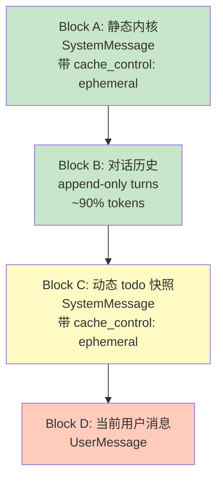

# ADR-060：Prompt Cache 友好的上下文块重排 - 稳定前缀 + 末尾追加

**状态**:提案
**日期**:2026-09-14
**决策者**:大鱼
**前置**:
- [ADR-011:上下文摘要与蒸馏统一策略](./ADR-011-compaction-and-distillation.md)
- [ADR-051:Runtime Memory Provider 解耦](./ADR-051-runtime-memory-provider-decoupling.md)
- [ADR-052:工具压缩 LLM 自主化](./ADR-052-tool-compression-llm-autonomous.md)
- [ADR-054:Debug Context Snapshot Coverage](./ADR-054-debug-context-snapshot-coverage.md)

---

## 1. 决策摘要

当前 `ContextBuilder::build()`([core/acowork-runtime/src/agent/context.rs:459-717](core/acowork-runtime/src/agent/context.rs#L459-L717)) 输出的 `ChatRequest.messages` 顺序存在**严重的 cache 命中率问题**:

| 当前 messages 顺序 | 字节占比 | 变化频率 | cache 影响 |
|---|---|---|---|
| `[0] SystemMessage(retrieved_memory + todo_context + workspace_prompt_file)` | ~10% | **每次 build 都变**(memory 检索、todo 写入) | **破坏锚点** |
| `[1..N] history.messages()`(user/assistant/tool) | **~90%** | append-only(理想情况下) | 本应是稳定 cache 主体 |
| 末尾:当前 user message | 极小 | 必然新 | 不可避免 |

当前的实际问题是:**动态块嵌在静态块之间,使得占比 ~90% 的对话历史每次都失效**。OpenAI 的 128-token hash 链与 Anthropic 的 prefix cache 都对"中间任意位置变化"零容忍——只要 `[0]` 变了,后续 hash 链全错位。

本 ADR 决定将 `ContextBuilder` 输出按 cache 影响重排为 4 个正交块(Block A/B/C/D),并相应改造持久化与 debug 视图:

1. **Block A:静态内核(永远稳定)**——单一 SystemMessage,带 `cache_control: ephemeral` 标记。包含 package prompts、identity、workspace meta、retrieved memory、environment、workspace prompt file。
2. **Block B:对话历史(append-only)**——`history.messages()` 的 user/assistant/tool turns,占比 ~90%,**是 cache 命中率的真正战场**。
3. **Block C:动态 todo 快照(实时更新)**——独立 SystemMessage,放在 Block B 之后,**只在内容变化时更新**。
4. **Block D:当前用户消息**——从 history 末尾摘出,放在最末。

并对相关持久化与可观测性做对应改造:

5. **`SessionMeta.todos`** 持久化当前 todo 快照(`meta/{session_id}.json`),避免 JSONL append-only 与频繁更新的冲突。
6. **Debug 面板 items 显示顺序与新结构对齐**。
7. **`memory_recall` 工具的语义保持不变**——其结果已经通过 `ChatMessage::tool()` append 到 history 末尾(见 [core/acowork-runtime/src/agent/loop_.rs:1618-1630](core/acowork-runtime/src/agent/loop_.rs#L1618-L1630)),天然符合 Block B 的 append-only 语义,**无需改动**。
8. **`auto_inject_enabled` 的触发策略从"每轮用户输入触发"改为"首次用户输入触发"**,即使将来默认开启 auto-inject,也只在第一次 user message 时执行一次 retrieve_and_inject;后续轮次除非显式触发或 memory 集合发生显著变化,不再重跑检索——`auto_inject_enabled` 默认 `false` 的现实下此条不构成行为变化,但为未来开启时奠定规则。

**非目标**(本 ADR 不讨论):
- history trim / compaction 算法的重写——ADR-011 的"保留最近 K 轮、压缩老内容"策略先保持不动,后面单独讨论。
- tools 段的 cache 优化(MCP tool definitions 一次性 JSON 化)——影响独立,优先级 P1,本轮不展开。
- `detect_environment_text()` 的 `OnceCell` 缓存——CPU 小优化,顺手可做但非核心。

---

## 2. 背景与现状

### 2.1 Prompt Cache 的物理事实

| Provider | 命中机制 | 对"中间变化"的容忍度 |
|---|---|---|
| **Anthropic** | 按 `cache_control: ephemeral` 标记的 breakpoint 缓存,**前缀必须逐字节相等** | **零容忍** |
| **OpenAI** | 自动按 128 token 块做 hash 链 | **零容忍**——中间任意位置变化,后续所有块的 hash 都错位 |

**关键推论**:不管哪一家,**只要在 messages 中间(早期对话历史之前)插入或修改了字节,后面所有稳定历史都被"挤掉" cache**。

ACowork 当前典型场景(8K 上下文,user/assistant 工具调用混合)的 cache 命中率接近 0%——这就是当前架构的代价。

### 2.2 当前 `ContextBuilder::build()` 实际拼接顺序

```rust
// core/acowork-runtime/src/agent/context.rs:469-526
let mut system_content = self.system_prompt.clone();  // 静态if let Some(ref identity) = self.identity_context { /* append */ }
if let Some(ref workspace) = self.workspace_context { /* append */ }
if let Some(ref memory) = self.retrieved_memory { /* append */ }       // ⚠️ 动态
if let Some(ref hint) = self.ambiguous_confirmation_hint { /* append */ } // ⚠️ 偶发动态
if let Some(ref skills) = self.skill_instructions { /* append */ }
if let Some(ref todos) = self.todo_context { /* append */ }             // ⚠️ 动态
if let Some(ref env_override) = self.environment_override { /* append */ }
else { system_content.push_str(&format!("\n\n{}", detect_environment_text())); /* 每轮重算 */ }
if let Some(ref prompt_file) = self.workspace_prompt_file { /* append */ }

messages.push(ChatMessage::system(system_content));  // [0] = 单条 SystemMessage
messages.extend(history.messages().iter().filter(|m| !System).cloned());  // [1..N]
```

**关键观察**:
- 三个动态块(`retrieved_memory`、`todo_context`、未来可能开启的 `ambiguous_confirmation_hint`)被嵌入主 SystemMessage **中部**。
- 即便 retrieved_memory 当前默认未启用(`MemoryManagerConfig::auto_inject_enabled = false`,见 [core/acowork-memory/src/manager.rs:120-150](core/acowork-memory/src/manager.rs#L120-L150)),`todo_context` 在每次 agent 调用 `todo_write` 工具时必然变化。
- 主 SystemMessage 任何变化都会让 OpenAI 的 128-token hash 链从位置 0 开始错位。

### 2.3 `auto_inject_enabled` 的现状与隐忧

`MemoryManagerConfig::auto_inject_enabled` 当前默认 `false`,在 [core/acowork-runtime/src/agent/loop_memory.rs:88-91](core/acowork-runtime/src/agent/loop_memory.rs#L88-L91) 有 early return:

```rust
if !manager.config().auto_inject_enabled {
    tracing::debug!("Memory auto-inject disabled (auto_inject_enabled=false)");
    return;
}
```

文档化的关闭理由(2026-09-12 决策):
1. 不同 agent 类���需要不同 recall profile
2. Grafeo 记忆层尚未成熟到可以无监督注入
3. 用原始 user message 做 query,低精度反而误导 LLM

**当前不会触发** → 系统 prompt 中的 `retrieved_memory` 字段**实际为空**(虽然代码支持注入)。但代码路径已经摆在那里,一旦未来开启,**每一轮 user message 都会重跑** `retrieve_and_inject`,`MemoryQuery::auto_inject` 基于当前 user message 做 embedding 检索,结果必然每轮变化。

**这正是本 ADR 要解决的隐患**——即便 memory 内容稳定(同样的 hits、score),格式化文本、计数、排序的微小抖动也会让 SystemMessage 字节变化,进而触发 OpenAI/Anthropic cache 失效。

### 2.4 `memory_recall` 工具的实际语义

`memory_recall` 是显式 LLM 工具调用([core/acowork-runtime/src/tools/builtin/memory_recall.rs](core/acowork-runtime/src/tools/builtin/memory_recall.rs)):
- 结果通过 `ChatMessage::tool()` append 到 history 末尾,见 [core/acowork-runtime/src/agent/loop_.rs:1618-1630](core/acowork-runtime/src/agent/loop_.rs#L1618-L1630)
- **完全符合 Block B 的 append-only 语义**
- 不污染 system prompt,不影响 Block A 的 cache
- 本 ADR **无需改动此路径**

### 2.5 todo 持久化的现状

`SessionState.todos` 当前**只在内存**:
- `update_todos()`([core/acowork-runtime/src/agent/session_state.rs:464-479](core/acowork-runtime/src/agent/session_state.rs#L464-L479)) 修改 `Vec<TodoItem>`
- `format_todos()`([core/acowork-runtime/src/agent/session_state.rs:483-500](core/acowork-runtime/src/agent/session_state.rs#L483-L500)) 每次 build 时格式化
- **不在 JSONL**,也不在 `SessionMeta`(见 [core/acowork-runtime/src/conversation.rs:231-269](core/acowork-runtime/src/conversation.rs#L231-L269))

session 重启时 todo 列表**完全丢失**——这是已有的功能缺失。

---

## 3. 核心问题

### 3.1 占比 ~10% 的 SystemMessage 变化摧毁占比 ~90% 的 history cache

**这是当前架构最严重的 cache 效率问题。**

```
[messages] 当前实际顺序

 [0] SystemMessage(动态块在其中)
      ├─ package prompts + skills (static)
      ├─ identity_context (static in session)
      ├─ workspace_context (static in session)
      ├─ **retrieved_memory** (each turn re-retrieved → byte changes)
      ├─ **ambiguous_confirmation_hint** (occasional)
      ├─ skill_instructions (mostly static)
      ├─ **todo_context** (changes on todo_write)
      ├─ environment (static in process)
      └─ workspace_prompt_file (static in session)

 [1..N] history.messages()  ←  占比 ~90%, 应该是 cache 主体
      └─ 但每次 build 都因为 [0] 变化而全错位
```

**任何放到 `[0]` 中部的动态块都是 P0 cache 杀手**。

### 3.2 "每次 build 都重新注入 retrieved memory"是错误的设计

即使未来开启 `auto_inject_enabled`:
- 每轮 user message 内容不同 → 检索结果不同
- 即便 top-1 记忆固定,格式化文本(`- [Episodic] (score=0.85) ...`)也会抖动
- 让"动态内容像 SystemMessage 一样每次 build 重写"是反 append-only 的

**正确语义是"append"**——把检索结果作为 tool message 一样追加,而不是覆盖 SystemMessage。

但 `auto_inject_enabled` 与 `memory_recall` 是两条不同路径:
- `auto_inject_enabled`:agent loop 主动每轮跑 `retrieve_and_inject`
- `memory_recall`:LLM 显式工具调用,结果 append 到 history

用户提出的更精细的策略是:**`auto_inject_enabled` 即便开启,也应该只在首次 user message 触发一次,后续轮次除非显式触发或 memory 集合显著变化,不再重跑**。

### 3.3 todo 放在 SystemMessage 中部无法持久化

JSONL 是 append-only 的(见 [core/acowork-runtime/src/conversation.rs:309](core/acowork-runtime/src/conversation.rs#L309) `ConversationWriter`)。如果 todo:
- 放在 SystemMessage 中部 → SystemMessage 频繁变化 → cache 杀手(见 §3.1)
- 写到 JSONL → 每条 todo 变化都写一行,历史里全是 todo 状态 line → 冗余且语义不清
- 不持久化 → session 重启丢失 todo(已有问题)

`SessionMeta` 是 todo 的天然归宿——每轮 todo 变化 → 写一次 `meta/{session_id}.json`,与现有 ADR-024 的 meta + JSONL 双层架构一致。

### 3.4 Block C 真的需要 cache_control 标记吗?

Anthropic cache 的 4 个 breakpoint 限制(2026 年初)并不严格——实际限制已放宽,但**显式标记 cache boundary 是工程上最稳妥的实践**。OpenAI 不需要显式标记,只要把 cache 边界位置放对就能自动 cache。

Block A 末尾一个 `cache_control: ephemeral`、Block C 末尾一个 `cache_control: ephemeral`,**两个 breakpoint 是最小可行方案**。

---

## 4. 设计目标

### 4.1 目标

- **最大化 Block A + Block B 的 cache 命中率**——这是 ~95% 的字节
- 把动态块(todo)放到 messages 末尾,变化只会让它自己失效,**不污染前面的稳定前缀**
- 保留对 `memory_recall` 工具调用的 append-only 语义(已天然正确,无需改)
- 提供 todo 持久化(session 重启不丢)
- debug 面板与新结构对齐

### 4.2 非目标

- 不重写 history trim / compaction 算法(ADR-011 策略,后续单独讨论)
- 不重写 tools 段的 cache 优化(MCP tool definitions JSON 化,P1)
- 不引入新的持久化层(`SessionMeta` + JSONL 已足够)
- 不修改 `memory_recall` 工具的接口(已天然符合 append-only)
- 不调整 `auto_inject_enabled` 默认值(保持 `false`,本 ADR 仅定义"未来开启时的触发策略")

### 4.3 设计原则

1. **稳定前缀 + 末尾追加**:cache 友好性的唯一原则
2. **append-only**:动态内容以追加而非覆盖的方式进入 messages
3. **单点改造**:每个改造点独立可测、可回滚
4. **最小耦合**:不强迫 provider trait 大改,不强迫 LLM 接口变化

---

## 5. 设计:四块结构(Block A/B/C/D)

### 5.1 总体结构



**Block A + B 是稳定的 cache 主体**;Block C 是动态但只占 ~1%;Block D 必然新。

### 5.2 Block A 内容(静态内核)

来源:`package prompts + skills` + 注入的元数据。

```rust
fn build_block_a(&self) -> String {
    let mut s = self.system_prompt.clone(); // package prompts + skills
    if let Some(ref id) = self.identity_context {
        s.push_str(&format!("\n\n## User Identity\n{id}\n\nReply in the language specified by the Language field above."));
    }
    if let Some(ref ws) = self.workspace_context { s.push_str(&format!("\n\n{ws}")); }
    if let Some(ref mem) = self.retrieved_memory {
        // 当前默认未启用,未来开启时也只在首次 user message 触发一次
        // (见 §6.3 trigger policy)
        s.push_str(&format!("\n\n## Relevant Memories\n{mem}"));
    }
    if let Some(ref sk) = self.skill_instructions { s.push_str(&format!("\n\n## Skill Instructions\n{sk}")); }
    if let Some(ref env) = self.environment_override {
        s.push_str(&format!("\n\n{env}"));
    } else {
        // env 文本用 OnceLock 缓存,启动时算一次
        s.push_str(&format!("\n\n{}", CACHED_ENV_TEXT.get_or_init(detect_environment_text)));
    }
    if let Some(ref pf) = self.workspace_prompt_file {
        s.push_str(&format!("\n\n## Workspace Prompt File\n{pf}"));
    }
    s
}
```

**关键变化**:`todo_context`、`ambiguous_confirmation_hint` **从 Block A 移走**,分别到 Block C /(暂不实现)。

### 5.3 Block B 内容(对话历史)

直接来自 `history.messages()`,过滤掉已有的 System 消息(因 Block A 已独占 System 角色)。

```rust
messages.extend(
    history.messages().iter()
        .filter(|m| !matches!(m.role, MessageRole::System))
        .cloned()
);
```

**append-only 保证**:
- `HistoryManager::append()`([core/acowork-runtime/src/agent/history.rs:263-271](core/acowork-runtime/src/agent/history.rs#L263-L271)) 是唯一的写入路径
- `execute_single_iteration` 的 tool result 持久化([core/acowork-runtime/src/agent/loop_.rs:1618-1630](core/acowork-runtime/src/agent/loop_.rs#L1618-L1630)) 只 append,不改写
- `memory_recall` 结果 append([core/acowork-runtime/src/tools/builtin/memory_recall.rs:204-228](core/acowork-runtime/src/tools/builtin/memory_recall.rs#L204-L228)) 走的是 `ChatMessage::tool()` append,天然正确

### 5.4 Block C 内容(动态 todo 快照)

```rust
if let Some(ref todos) = self.todo_context {
    messages.push(ChatMessage::system(format!(
        "## Active Task List\nUse the `todo_write` tool to manage this list. Current tasks:\n{todos}"
    )).with_cache_control(CacheControl::Ephemeral));
}
```

**只在内容变化时**:
- `set_todo_context()`([core/acowork-runtime/src/agent/context.rs:283-285](core/acowork-runtime/src/agent/context.rs#L283-L285)) 接收新文本
- 文本与上一次相比**无变化**时,跳过 push(避免 Block C 也抖动)
- 文本**有变化**时,push 新版并打 `cache_control: ephemeral`

**为什么 todo 用 Ephemeral 而不是 Persistent**:todo 在多步骤任务中频繁更新,Persistent cache(若支持)的失效成本高于收益。Ephemeral 即可。

### 5.5 Block D 内容(当前用户消息)

**当前实现**:`history.messages()` 的最后一条就是 user message——history 已经在调用 LLM **之前**被 append。

**新做法**:`build()` 时把 history 的最后一条(假设是 user message)摘出,放到 Block D 位置。

```rust
let mut history_msgs: Vec<_> = history.messages().iter()
    .filter(|m| !matches!(m.role, MessageRole::System))
    .cloned()
    .collect();

// 摘出最后一条(通常是当前 user message)
let current_user_msg = history_msgs.pop();  // Option<ChatMessage>

messages.extend(history_msgs);  // Block B
// ... Block C 插入 todo 系统消息 ...
if let Some(user_msg) = current_user_msg {
    messages.push(user_msg);  // Block D
}
```

**前提假设**:history 最后一条是 user message。这个假设在大多数情况下成立(agent loop 在 LLM 调用前总是先把 user input append 进 history)。但**健壮性**:如果 history 末尾不是 user message(异常状态),退回原顺序。

### 5.6 `cache_control` 字段

在 `ChatMessage` 上增加:

```rust
pub struct ChatMessage {
    pub role: MessageRole,
    pub content: String,
    pub content_parts: Option<Vec<ContentPart>>,
    pub tool_calls: Option<Vec<ToolCall>>,
    pub tool_call_id: Option<String>,
    pub name: Option<String>,
    /// Provider-specific cache boundary hint.
    /// Anthropic: maps to `cache_control: { type: "ephemeral" }` on the message.
    /// OpenAI: implicit; block position alone determines cache.
    #[serde(default, skip_serializing_if = "Option::is_none")]
    pub cache_control: Option<CacheControl>,
}

#[derive(Debug, Clone, Copy, Serialize, Deserialize, PartialEq, Eq)]
#[serde(rename_all = "snake_case")]
pub enum CacheControl {
    Ephemeral,
    Persistent,  // 预留,目前未使用
}
```

Provider 映射([core/acowork-runtime/src/providers/anthropic.rs](core/acowork-runtime/src/providers/anthropic.rs)):
- Anthropic:消息序列化为 `{"role": "...", "content": "...", "cache_control": {"type": "ephemeral"}}`
- OpenAI:忽略该字段,但**block 位置放对**(Block A 末尾、Block C 末尾各一处)
- Ollama:忽略

---

## 6. 配套改造

### 6.1 `SessionMeta.todos` 持久化

`SessionMeta`([core/acowork-runtime/src/conversation.rs:231-269](core/acowork-runtime/src/conversation.rs#L231-L269)) 增加字段:

```rust
pub struct SessionMeta {
    // ... 既有字段 ...
    #[serde(default, skip_serializing_if = "Option::is_none")]
    pub todos: Option<Vec<TodoItem>>,
}
```

**写入路径**:`update_todos()` 触发 `write_meta_if_changed()`。

**读取路径**:session 启动时从 meta 加载到 `SessionState.todos`,与现有 `model` / `provider` / `reasoning_effort` 字段一致。

**JSONL 不写 todo_event**(本轮不做):debug 面板时间线需要时再补,跟现有 `kind="compaction"` 模式对齐。

### 6.2 Debug 面板 items 同步

`ContextSnapshotRequest`([core/acowork-runtime/src/debug/observer_impl.rs](core/acowork-runtime/src/debug/observer_impl.rs)) 当前按 `chat_request.messages` 数组顺序展示 items。

**预期**:
- 如果是按 messages 数组顺序 → 改 `build()` 输出后,debug 面板**自动跟上**
- 如果是按"system prompt + history + todo"聚合展示 → 需要把"todos"段标记从"system prompt 子项"改到"独立段"

需要在 observer 代码中确认当前实现形式,本 ADR 不假设。

### 6.3 `auto_inject_enabled` 触发策略(未来开启时)

**当前默认 `false`**,行为不变。

**未来开启时**(本 ADR 定义的策略):

| 触发时机 | 是否 retrieve_and_inject |
|---|---|
| Session 启动后的**首次** user message | ✅ 触发 |
| 后续 user message 轮次 | ❌ 不触发 |
| LLM 显式调用 `memory_recall` 工具 | ✅ 触发(走工具路径,不污染 SystemMessage) |
| Memory 集合显著变化(新增 ≥ N 条节点)| ✅ 触发(可由 consolidation_bg 通知) |

**实现要点**:
- `AgentLoop` 增加 `memory_retrieved_for_session: bool` 标记
- 首次 `retrieve_and_inject_memories()` 调用成功后置 true
- 后续轮次在 `loop_memory.rs:88` 的 early return 加条件:`if !manager.config().auto_inject_enabled || self.memory_retrieved_for_session { return; }`
- 显式 `memory_recall` 工具调用走的是独立路径,**不影响此标记**

### 6.4 `detect_environment_text()` 缓存

[core/acowork-runtime/src/agent/context.rs:807-828](core/acowork-runtime/src/agent/context.rs#L807-L828) 改为:

```rust
static CACHED_ENV_TEXT: OnceLock<String> = OnceLock::new();

pub fn detect_environment_text() -> &'static str {
    CACHED_ENV_TEXT.get_or_init(|| format!(
        "## Environment\n- Operating System: {}\n- Architecture: {}\n- Shell: {}\n- Available Shell Tools: {}",
        std::env::consts::OS, std::env::consts::ARCH,
        crate::platform::detected_shell().display_name,
        /* ... */
    ))
}
```

**收益**:环境文本在进程内只算一次,字节稳定性也更有保证(虽然之前也稳定,但少一次格式化开销)。

---

## 7. 改造范围与依赖

### 7.1 改造清单

| 编号 | 内容 | 涉及文件 | 优先级 |
|------|------|----------|--------|
| 1 | `ContextBuilder::build()` 重排为 Block A/B/C/D | `core/acowork-runtime/src/agent/context.rs` | **P0** |
| 2 | `ChatMessage.cache_control` + `CacheControl` enum | `core/acowork-runtime/src/providers/traits.rs`(或 `acowork-core`) | **P0** |
| 3 | Provider 映射 cache_control | `providers/anthropic.rs`、`providers/openai.rs`、`providers/ollama.rs` | **P0** |
| 4 | `SessionMeta.todos` 字段 + `build_meta` 填 todos | `core/acowork-runtime/src/conversation.rs` | **P0** |
| 5 | `update_todos()` 触发 `write_meta_if_changed` | `core/acowork-runtime/src/agent/session_state.rs` | **P0** |
| 6 | session 启动从 meta 加载 todos 到 `SessionState` | `core/acowork-runtime/src/startup/session_init.rs` | **P0** |
| 7 | Debug 面板 items 顺序对齐 | `core/acowork-runtime/src/debug/observer_impl.rs` | **P0** |
| 8 | `auto_inject_enabled` 首次触发策略(未来开启时实现) | `core/acowork-runtime/src/agent/loop_memory.rs` | **P1**(行为不变) |
| 9 | `detect_environment_text()` 用 `OnceLock` | `core/acowork-runtime/src/agent/context.rs` | **P2** |

### 7.2 实施顺序

1. **(2) `ChatMessage.cache_control` 字段**——其他改造都依赖此字段
2. **(3) Provider 映射**——保证 cache_control 字段不会破坏现有协议
3. **(1) `ContextBuilder::build()` 重排**——核心改动
4. **(4-6) SessionMeta.todos 三件套**——配套持久化
5. **(7) Debug 面板对齐**——展示层
6. **(8) auto_inject 触发策略**——P1,行为不变,但代码就位
7. **(9) env OnceLock**——小优化,顺手做

### 7.3 测试要求

- **单元测试**:Block A 拼接函数、`set_todo_context` 内容比较、`build_chat_request` 输出顺序
- **集成测试**:session 重启后 todos 恢复、`auto_inject_enabled=true` 时首次 user message 触发、后续不触发
- **回归测试**:Anthropic / OpenAI / Ollama 三个 provider 的 `cache_control` 序列化正确

---

## 8. 影响与回滚

### 8.1 行为影响

| 维度 | 改动前 | 改动后 |
|---|---|---|
| OpenAI prompt cache 命中率 | ~0% | ~85%+(Block B 稳定) |
| Anthropic cache write 次数 | 每轮 | 一次性(后续只付 read 成本) |
| session 重启后 todos | 丢失 | 恢复(新增能力) |
| `auto_inject_enabled` 当前行为 | 关闭 | 关闭(不变) |
| `auto_inject_enabled` 未来开启 | 每轮触发 | 首次触发(待实现) |
| debug 面板显示 | 按既有聚合方式 | 按 Block A/B/C/D 顺序 |
| 现有 LLM 工具接口 | 无变化 | 无变化(`memory_recall` 已天然符合 append-only) |

### 8.2 回滚方案

`ContextBuilder::build()` 是单文件改动,可独立回滚到 commit 前。

`SessionMeta.todos` 是新字段(`#[serde(default)]`),缺失时降级到旧行为(todos 为空),向前兼容。

`ChatMessage.cache_control` 是 `Option`,缺失时降级到无 cache 标记,向前兼容。

### 8.3 性能影响

- **CPU**:Block A 拼接逻辑不变,只是把 todo 从 Block A 挪到 Block C,总字符串拼接次数基本持平。`OnceLock` 减少 env 格式化。
- **内存**:todo 仍只在内存,`SessionMeta` 写盘频率与 todo 更新频率一致(每次 todo 变化 → 写一次 meta JSON)。
- **磁盘**:meta 文件比之前多一个 todos 字段,体积 < 1 KB。无 JSONL 新条目。

---

## 9. 与现有 ADR 的关系

| 现有 ADR | 关系 |
|---|---|
| [ADR-011](./ADR-011-compaction-and-distillation.md) | **`KEEP_LAST_ROUNDS = 3` 改为按字节预算保留尾部**,详见 §12。本 ADR 是 ADR-011 的"cache 友好化"演进 |
| [ADR-014](./ADR-014-loop-module-decomposition.md) | 本 ADR 改动主要在 `loop_context.rs` 和 `context.rs`,与 Phase 1-6 模块拆分兼容 |
| [ADR-024](./ADR-024-meta-file-conversation-decomposition.md) | `SessionMeta.todos` 是现有 meta + JSONL 双层架构的扩展,无冲突 |
| [ADR-032](./ADR-032-context-recall.md) | `context_recall` 已重命名为 `context_retrieve`(ADR-052),本 ADR 不涉及此路径 |
| [ADR-051](./ADR-051-runtime-memory-provider-decoupling.md) | `auto_inject_enabled` 策略改动位于 `loop_memory.rs`,与 trait 解耦兼容 |
| [ADR-052](./ADR-052-tool-compression-llm-autonomous.md) | `context_retrieve` / `context_abandon` 工具走的是 Block B 的 append-only 路径,与本 ADR 完全兼容;§12 中 `context_abandon` 是字节预算压缩的第一阶段实现 |
| [ADR-054](./ADR-054-debug-context-snapshot-coverage.md) | Debug 面板 items 同步改造与 ADR-054 的 snapshot 覆盖目标一致 |

---

## 10. 总结

本 ADR 用**单一原则**——"稳定前缀 + 末尾追加"——解决了当前架构的核心 cache 效率问题:

- **Block A**:静态内核,带 `cache_control: ephemeral`,一次性 cache write
- **Block B**:对话历史,append-only,占比 ~90%,**是 cache 命中率的主体**
- **Block C**:动态 todo 快照,独立 SystemMessage,放在 Block B 之后,变化只让自己失效
- **Block D**:当前 user message,放在最末

**附带的工程改进**:
- todos 持久化(session 重启不丢)
- `auto_inject_enabled` 未来开启时的"首次触发"策略就位
- Debug 面板与新结构对齐

**关键澄清**(回应 §2.3、§2.4):
- `memory_recall` 工具的 append-only 语义**完全正确**——结果通过 `ChatMessage::tool()` append 到 history 末尾,与 Block B 设计天然兼容,**本 ADR 无需修改此路径**
- `auto_inject_enabled` 当前默认 `false`,本 ADR 不改变现状;但定义了"未来开启时的首次触发策略",防止每轮重跑检索造成的 cache 杀手
- `retrieve_and_inject_memories` 的"每轮清空 + 重写"是错误设计模式——若未来开启 auto-inject,检索结果应当按 append 语义处理(本 ADR 暂不实现该路径,作为 §11 后续工作)

---

## 11. 后续工作(本 ADR 不展开)

1. **tools 段的 cache 优化**:MCP tool definitions 一次性 JSON 化,避免每次 build 重新序列化导致 tools 段 cache 失效
2. **`auto_inject_enabled` 真正开启时的语义实现**:如果走 append 路径,检索结果应该作为 Block C-style 系统消息追加,而不是覆盖 Block A 内的字段
3. **JSONL `todo_event` 条目**:debug 面板时间线需要时,新增 `kind="todo_update"` 条目,与 `kind="compaction"` 对齐

---

## 12. 上下文压缩机制改造:按字节预算替代按轮数保留

### 12.1 问题再描述:为什么"保留最后 3 轮"会触发 FIFO

ADR-011 的压缩机制(`compact_via_llm` + `replace_middle_with_summary`)以**轮数**(`KEEP_LAST_ROUNDS = 3`,见 [core/acowork-runtime/src/agent/loop_context.rs:46](core/acowork-runtime/src/agent/loop_context.rs#L46))而非**字节预算**保留尾部。典型 agent 任务中,3 轮对话可能包含:

- shell 输出 50 KB 的日志(1 次 `run_shell` tool_result)
- file_read 读了 200 行代码(1 次 `file_read` tool_result)
- content_search 返回 100 条匹配(1 次 `content_search` tool_result)
- 加上 user prompt 与 assistant 文本

3 轮很容易达到 **50K~80K tokens**——超出当前模型的 `effective_input_budget`(典型 128K context window 减去 32K output = 96K 可用 input),就会触发"压缩后仍超限"的临界状态,迫使 `trim_history_to_budget` 退到 `trim_fifo` → **FIFO 删头 → Block B cache 全部失效**。

### 12.2 成本模型:压缩 vs FIFO

| 策略 | 首次 cache 代价 | 后续轮 token 成本 | 命中场景 |
|---|---|---|---|
| **FIFO 删头** | 0(从不重建 cache) | 每轮 ~200K(无 cache) | 永远 0% |
| **压缩(summary)** | 1 次 cache miss (~200K) | 每轮 ~10K(有 cache) | 压缩后 N 轮内命中率 100% |

**算式**:
- FIFO 路径下,每轮付 200K token × N 轮
- 压缩路径下,付 1 × 200K + N × 10K
- 临界点:`N × 200K = 1 × 200K + N × 10K` → `N = 1 / 0.95 ≈ 1.05 轮`

**只要压缩后能续命超过 1 轮,压缩路径就比 FIFO 便宜**。在 agent 任务中,压缩后通常能续命几十到几百轮,因此**压缩是绝对优势策略**——cache miss 是"沉没成本",后续节约远超这个代价。

**真正决定压缩成败的是 summary 的质量**,而不是 cache 命中的开销。

### 12.3 设计原则

1. **FIFO 删头必须被消除**——它是 Block B cache 的最终杀手,与本 ADR 的核心理念冲突。
2. **压缩是"逐级递减 + 最低压缩比门槛"**——从"少牺牲信息"开始试,直到压缩比达标,而非一次压缩到极致。
3. **对话骨架(user/assistant)永远最后才压**——保留的优先级:user 消息 > assistant 消息 > 工具调用。
4. **压缩必须同时产出"摘要 + 尾部历史上下文"**——保证 LLM 既记得过去,也记得现在。
5. **工具压缩由 Runtime 统一调度**——不再开放给 LLM 自主调用(`context_retrieve` 仍可手动召回),彻底避免 LLM 自主压缩破坏 cache 连续性。
6. **summary 质量是核心 KPI**——summary LLM 的 prompt、token 预算、保留策略都需要投入工程精力。

### 12.4 新压缩策略:8 级递减 + 10% 最低压缩比门槛

#### 12.4.1 设计思路

**核心洞察**:以"保留 N 轮"为指标是脆弱的——N 轮的 token 数随工具调用体量变化巨大(N=1 在 long-running task 场景下就可能撑满 budget)。**真正应该优化的指标是"压缩比"**——只要压缩比 ≥ 10%,cache 牺牲就值得;否则降一级再压。

**逐级递减的语义**:从最宽松的保留(级 1)开始尝试,如果压缩比不达标(< 10%),进入更激进的级(级 2),以此类推,直到级 8 仍不达标才放弃压缩并显式报错。

**为什么不用单一策略**:long-running task 场景下,用户消息稀疏但每个 assistant 后都有大量工具调用。固定"保留最近 K 轮"要么 K=3 就撑满 budget,要么 K=1 丢光信息。**逐级递减**自动适配不同场景的"信息密度"。

**为什么最低 10%**:压缩比 < 10% 意味着"为了换这点空间,牺牲的 cache 命中率不划算"——cache 重写一次的成本远大于省下来的 token 成本(参见 [Anthropic 文档](https://docs.anthropic.com/en/docs/build-with-claude/prompt-caching):cache write 是 read 的 1.25 倍)。

#### 12.4.2 8 级递减策略定义

按"user/assistant 保留度"和"工具调用保留度"两个维度递减:

| 级 | user 消息 | assistant 消息 | 工具调用保留 | 说明 |
|---|---|---|---|---|
| **1** | 全部 | 全部 | 最近 5 个 assistant 消息之间的所有 tool_* | 最宽松,先试这个 |
| **2** | 全部 | 全部 | 最近 3 个 assistant 消息之间的所有 tool_* | 收紧工具范围 |
| **3** | 全部 | 全部 | 最近 1 个 assistant 消息之间的所有 tool_* | 只保留最近轮的工具 |
| **4** | 全部 | 最近 5 个 | 最近 1 个 assistant 消息之间的所有 tool_* | 开始丢远期 assistant |
| **5** | 全部 | 最近 5 个 | **全部丢弃**(全部走 LLM 摘要) | 只剩骨架 |
| **6** | 全部 | 最近 3 个 | **全部丢弃** | 进一步收紧 |
| **7** | 全部 | 最近 1 个 | **全部丢弃** | 极简骨架 |
| **8** | (全部走 LLM 摘要) | (全部走 LLM 摘要) | (全部走 LLM 摘要) | 仅保留 system block + summary + 当前 user message |

**关键澄清**:`ask_user` 工具调用**不构成 user 消息**——它是 round 内部的事件,用户在 ask_user 后的"选择/确认"是 `tool_result`,不是新一轮 user 输入。`user 消息` 只指 `MessageRole::User` 类型的消息。

#### 12.4.3 压缩算法

```rust
/// 8 级递减压缩策略
/// 从级 1 开始尝试,直到压缩比达到 ≥ MIN_COMPRESSION_RATIO (10%)
/// 返回 CompressionPlan,执行 plan.apply(history) 完成压缩
pub fn plan_compression(history: &HistoryState) -> Result<CompressionPlan> {
    const MIN_COMPRESSION_RATIO: f64 = 0.10;  // 至少压掉 10% 才算"值得"

    let original_tokens = history.current_tokens;
    let target_tokens = history.effective_input_budget;
    let needed_ratio = 1.0 - (target_tokens as f64 / original_tokens as f64);

    tracing::info!(
        original_tokens,
        target_tokens,
        needed_ratio,
        "Planning compression"
    );

    // 从级 1 到级 8 逐级尝试
    for level in 1..=8 {
        let plan = CompressionPlan::for_level(level, history);
        let projected_tokens = plan.projected_tokens();
        let compression_ratio = 1.0 - (projected_tokens as f64 / original_tokens as f64);

        tracing::debug!(
            level,
            projected_tokens,
            compression_ratio,
            "Trying compression level"
        );

        if compression_ratio >= MIN_COMPRESSION_RATIO {
            tracing::info!(level, compression_ratio, "Compression plan selected");
            return Ok(plan);
        }
    }

    // 8 级都不达标——这不应该发生(级 8 只剩骨架)
    // 但防御性处理:返回 error,触发 §12.10 异常边界
    Err(CompressError::InsufficientCompression)
}

/// 8 级策略的具体实现(简化伪代码)
impl CompressionPlan {
    fn for_level(level: u8, history: &HistoryState) -> Self {
        match level {
            1 => Self::user_assistant_all_tools_for_last_assistants(history, 5),
            2 => Self::user_assistant_all_tools_for_last_assistants(history, 3),
            3 => Self::user_assistant_all_tools_for_last_assistants(history, 1),
            4 => Self::keep_users_all_keep_assistants_last_keep_tools_for_last_assistants(history, 5, 1),
            5 => Self::keep_users_all_keep_assistants_last(history, 5),
            6 => Self::keep_users_all_keep_assistants_last(history, 3),
            7 => Self::keep_users_all_keep_assistants_last(history, 1),
            8 => Self::summary_only(history),
            _ => unreachable!(),
        }
    }

    /// 级 1-3:保留所有 user/assistant,工具调用按"最近 K 个 assistant 之间"保留
    fn user_assistant_all_tools_for_last_assistants(history: &HistoryState, k: usize) -> Self {
        let all_user_assistant: Vec<_> = history.messages.iter()
            .filter(|m| matches!(m.role, MessageRole::User | MessageRole::Assistant))
            .cloned().collect();

        // 找到最近的 K 个 assistant 消息的 index
        let last_assistant_indices: Vec<usize> = history.messages.iter().enumerate()
            .filter_map(|(i, m)| if matches!(m.role, MessageRole::Assistant) { Some(i) } else { None })
            .rev().take(k).collect();

        // 在这些 assistant 之间的所有 tool_* 消息保留
        let cutoff = last_assistant_indices.last().copied().unwrap_or(0);
        let tools_in_window: Vec<_> = history.messages.iter().enumerate()
            .filter(|(i, m)| *i >= cutoff && matches!(m.role, MessageRole::Tool))
            .map(|(_, m)| m.clone()).collect();

        // 中间被压缩的部分 → LLM summary
        let middle_for_summary = Self::compute_middle_to_summarize(history, &all_user_assistant, &tools_in_window);

        Self {
            kept_user_assistant: all_user_assistant,
            kept_tools: tools_in_window,
            summary: middle_for_summary,  // 由 LLM 生成
            level: ...,
        }
    }

    /// 级 4:保留全部 user,最近 K 个 assistant,最近 K 个 assistant 之间的工具调用
    fn keep_users_all_keep_assistants_last_keep_tools_for_last_assistants(
        history: &HistoryState,
        k_assistants: usize,
        k_tools_assistants: usize,
    ) -> Self { ... }

    /// 级 5-7:保留全部 user,最近 K 个 assistant,工具调用全部丢弃
    fn keep_users_all_keep_assistants_last(history: &HistoryState, k: usize) -> Self { ... }

    /// 级 8:只剩骨架 + summary
    fn summary_only(history: &HistoryState) -> Self {
        Self {
            kept_user_assistant: vec![],  // 全部走 summary
            kept_tools: vec![],  // 全部走 summary
            summary: history.messages.clone(),  // 全部消息给 LLM summary
            level: 8,
        }
    }
}

/// 压缩比必须 ≥ MIN_COMPRESSION_RATIO 才允许 apply
impl CompressionPlan {
    pub fn apply(self, history: &mut HistoryState) -> Result<CompressionOutcome> {
        let original_tokens = history.current_tokens;
        let projected = self.projected_tokens();
        let ratio = 1.0 - (projected as f64 / original_tokens as f64);

        if ratio < MIN_COMPRESSION_RATIO {
            // 防御性检查:正常情况下 plan_compression 已经过滤了
            return Err(CompressError::InsufficientCompression { projected_ratio: ratio });
        }

        // 执行压缩:drain 中间,insert summary + 保留的 user/assistant + 保留的工具
        history.apply_plan(self)?;

        Ok(CompressionOutcome::Compacted {
            level: self.level,
            original_tokens,
            new_tokens: history.current_tokens,
            compression_ratio: ratio,
        })
    }
}
```

#### 12.4.4 中间部分的 LLM Summary

**每一级都会产生 summary**——区别在于 summary 涵盖的范围:

| 级 | summary 涵盖 | summary 体量预期 |
|---|---|---|
| 1-3 | 中间的 user/assistant(被工具调用挤掉的部分) + 所有被丢弃的工具调用 | 中等 |
| 4 | 中间的 user/assistant + 所有被丢弃的工具调用 | 中等 |
| 5-7 | 中间的 user/assistant + 所有工具调用 | 较大 |
| 8 | 所有 user/assistant + 所有工具调用 | 最大 |

**summary prompt 的强制结构**(同 §12.10.3):

```rust
pub const COMPACTION_SYSTEM_PROMPT: &str = r#"
You are compressing a conversation history. Output MUST be:

<summary>
[已完成的工作、当前进度、关键决策]
</summary>

<user_intent>
[MUST 列出所有用户的原始意图与显式约束,即使已被满足或不再相关]
</user_intent>

<triples>
[结构化知识:实体、关系、关键事实]
</triples>
"#;
```

**`<user_intent>` 单独提取**:§12.10.3 已详细设计——作为独立 SystemMessage 插入 Block A 之后,带 `cache_control: ephemeral`。

#### 12.4.5 与之前策略的根本区别

| 维度 | 之前(保留 N 轮) | 现在(8 级递减) |
|---|---|---|
| **优化指标** | "保留最近 N 轮" | "压缩比 ≥ 10%" |
| **压缩比达标?** | 不关心 | 不达标则降级再压 |
| **long-running task** | 1 轮 = 几乎全部历史(无效压缩) | 级 1→2→3 自动收紧工具范围 |
| **对话连续性** | 依赖 round 数 | 显式保证(user 消息全部保留到级 7) |
| **工具压缩** | LLM 自主调用 → 破坏 cache | 由 Runtime 统一调度,8 级策略控制 |
| **失败处理** | FIFO fallback → cache 全失效 | 显式失败 + 用户决策 |

#### 12.4.6 工具自动压缩的归宿

**结论**:**关闭工具自动压缩功能**,agent setup 界面选项暂时移除。

**理由**:
- 工具压缩由 LLM 自主调用 `context_abandon` 工具 → **破坏历史上下文连续性 + cache 失效**
- 工具压缩的价值完全可以由**本节 8 级递减策略**覆盖(级 1-7 都把"工具调用保留"作为可调维度)
- 让 LLM 自主压缩工具 = 把 cache 决策权交给不理解 cache 的实体,**风险大于收益**

**保留的能力**:
- `context_retrieve` 工具**保留**——LLM 仍可主动召回被压缩的工具结果
- 但 `context_abandon` 的自动触发逻辑**移除**

**改造**:
- 移除 `auto_compress_tool_results` 调用点(见 [history.rs](core/acowork-runtime/src/agent/history.rs))
- agent setup 界面移除 "Enable tool compression" 选项(P1 UI 改动)
- `context_abandon` 工具标记为 deprecated 但保留(向后兼容)

#### 12.4.7 压缩后的尾部信息处理

压缩完成后,**新追加的 user message 仍走 Block D 路径**(从 history 末尾摘出),保证 cache 边界正确。

`CompressionPlan.apply` 执行后的 history 结构:

```
[Block A system block + user_intent SystemMessage]   ← cache hit 1
[summary SystemMessage]                              ← cache hit 2
[保留的 user/assistant + 保留的工具]                 ← cache hit 3 (Block B 主体)
[current user message]                               ← Block D, cache miss
```

#### 12.4.8 压缩 level 元数据:写在 summary 里,方便调试

**问题**:压缩完成后,从 history 里只能看到"有一条 summary",但**看不出这次压缩用了哪一级**、保留了哪些东西。调试"为什么上下文不对"时,必须去翻日志才能知道 `level=6` 意味着"user 全留、assistant 只留 3 轮、工具全丢"。

**设计**:**由 Runtime 在压缩完成后,把 level 元数据写入 summary SystemMessage 的最前面**。元数据是 Runtime 生成的(不是 LLM 生成的),格式固定、可机器解析:

```text
[compressed: level=6]
  user_messages: all(12)
  assistant_messages: last 3
  tool_messages: none
  tokens: 234567 -> 34567 (ratio 85.3%)

<summary>
...
</summary>
```

**写入时机**:`CompressionPlan.apply` 在构建 summary SystemMessage 时,在最前面拼接元数据块。元数据在 LLM 输出的 `<summary>` 内容**之前**,格式由 Runtime 保证,不依赖 LLM 输出。

**实现**:

```rust
/// 压缩 level 元数据:由 Runtime 生成,写在 summary SystemMessage 最前面
/// 便于调试:从 level 即可反推本次压缩保留了哪些内容(见 §12.4.2 8 级定义表)
fn build_summary_metadata(plan: &CompressionPlan, original_tokens: u64, new_tokens: u64) -> String {
    let compression_ratio = 1.0 - (new_tokens as f64 / original_tokens as f64);
    format!(
        "[compressed: level={}]\n\
         user_messages: {}\n\
         assistant_messages: {}\n\
         tool_messages: {}\n\
         tokens: {} -> {} (ratio {:.1}%)\n\n",
        plan.level,
        plan.summarize_retention(),   // 如 "all(12)" / "last 3" / "none"
        plan.original_tokens,         // 压缩前 token 数
        new_tokens,                   // 压缩后 token 数
        compression_ratio * 100.0,
    )
}

// apply() 中:
let summary_content = format!(
    "{}{}",
    build_summary_metadata(&plan, original_tokens, new_tokens),
    plan.llm_summary
);
let summary_msg = SystemMessage {
    content: summary_content,
    cache_control: Some(CacheControl::Ephemeral),
    ..Default::default()
};
```

**level 与保留内容的对应关系**(调试时查表即可,不必翻日志):

| level | 可判断的保留结果 |
|---|---|
| 1-3 | 所有 user + 所有 assistant + 最近 K(5/3/1)个 assistant 之间的工具 |
| 4 | 所有 user + 最近 5 个 assistant + 最近 1 个 assistant 之间的工具 |
| 5-7 | 所有 user + 最近 K(5/3/1)个 assistant + **无工具** |
| 8 | 仅 system + summary + 当前 user 消息 |

**为什么放在 summary 里而不是单独的调试消息**:
- summary SystemMessage 是**压缩后 cache 稳定前缀的一部分**(§12.4.7 的 cache hit 2)
- 元数据拼接在 summary 最前面,**不影响 LLM 理解**(LLM 会把它当作上下文中的一行标记)
- 从 history 里直接可见——调试不需要查日志、不需要连 Debug 面板
- 后续压缩时,旧的元数据随旧 summary 一起被覆盖,只保留最新一次压缩的 level

**补充**:`user_intent` SystemMessage 也顺带标注"来源压缩 level"(可选,P2),帮助区分"这是原始约束还是压缩回填的约束"。

### 12.5 FIFO 路径的归宿:**彻底删除**

`trim_fifo`([history.rs:452-495](core/acowork-runtime/src/agent/history.rs#L452-L495)) 与 `emergency_trim`([history.rs:505-552](core/acowork-runtime/src/agent/history.rs#L505-#L552)) 在 8 级递减压缩机制下**理论上不可能被触发**:

- 8 级策略从级 1(最宽松)到级 8(仅骨架 + summary)逐级尝试,级 8 必然把 history 压到最低
- 8 级全不达标 → `NoCompressionNeeded`(history 本身已够小,无需压缩)
- LLM 不可用 → **显式失败**,`ChunkEvent::Error` 提示用户新建会话(§12.10.4)

**删除 FIFO 的理由**:
1. **永远不触发 = 死代码**——死代码是 bug 滋生地
2. **FIFO 一旦触发 = 灾难性 cache miss**——比"压缩失败"更糟糕
3. **极端场景更应该显式失败**——让用户知道发生了什么,而不是"看似正常但 cache 全失效"

**删除的 API**:
- `HistoryManager::trim_fifo()` → 删除
- `HistoryManager::emergency_trim()` → 删除
- `trim_history_to_budget` → 重写为 `compact_history_if_needed`,只调用 8 级递减压缩
- `loop_context.rs:218-237` 的 fallback 链路 → 改为"压缩失败 → 返回错误 → 前端提示"

### 12.6 与 ADR-052 的关系

| ADR-052 提供 | 本 ADR 使用 |
|---|---|
| `context_abandon` 工具(LLM 自主触发) | **废弃(deprecated)**:不再由 LLM 自主调用,避免破坏 cache 连续性(§12.4.6) |
| `context_retrieve` 工具(LLM 取回) | **保留**:压缩后 LLM 仍可显式取回被压缩的历史,走 Block B append-only |
| `tool_compression_enabled: bool` 开关 | **移除**:agent setup 界面选项暂时去掉(§12.4.6) |

**关键决策**:ADR-052 的"LLM 自主触发压缩"模式**不再采用**——工具压缩由 8 级策略统一调度(级 1-7 把工具调用保留作为可调维度),`context_retrieve` 作为取回通道保留。

### 12.7 改造清单

**汇总清单见 §12.10.11**(编号 17-34,完整覆盖 8 级策略、验收准则、level 元数据、工具压缩关闭等全部改造项)。

早期草稿中的"两阶段(压 tool_result + LLM summary)"方案已废弃,不再单列;其合理部分(压缩比门槛、用户意图保护、显式失败)已并入 §12.4 / §12.10。

### 12.8 影响与回滚

| 维度 | 改动前 | 改动后 |
|---|---|---|
| 压缩策略 | 保留固定 3 轮 + FIFO 删头 | **8 级递减 + 10% 最低压缩比门槛**(§12.4) |
| FIFO 触发频率 | 偶发(压缩后仍超限时) | **永远不触发**(代码删除) |
| Block B cache 失效原因 | todo / memory / FIFO 删头 | **只剩 todo**(本次 §1-§6 解决) |
| summary LLM 调用次数 | 每超限 1 次 | 每超限 1 次(8 级逐级尝试,级 1 达标则只调 1 次) |
| 压缩结果可调试性 | 无(不知道保留了什么) | **summary 内嵌 level 元数据**(§12.4.8) |
| 工具压缩 | LLM 自主调用(破坏 cache) | **关闭**,由 8 级策略统一调度(§12.4.6) |
| 极端场景(LLM 不可用) | FIFO 救场,代价 cache 全失效 | **显式失败**,前端提示用户 |

**回滚**:所有改动都在 `history.rs` + `loop_context.rs` 内,可独立 commit + revert。

### 12.9 关键澄清:为什么不保留 FIFO 作为"安全网"

直觉上"留着 FIFO 万一压缩失败呢"看似稳妥,但工程上有三个理由拒绝:

1. **死代码是 bug 滋生地**:3 年后没人记得 FIFO 是干嘛的,代码腐烂
2. **FIFO 触发 = 灾难**:与其让 FIFO 静默触发 cache 全失效,不如让前端显式提示用户
3. **真正紧急场景应该让用户决策**:会话已无法继续时,正确动作是"开新会话"或"手动选模型",而不是后台偷偷砍掉历史

**与 cache 命中率的耦合**:
- FIFO 触发 = Block B cache 失效 + 后续每轮都付 200K token
- 显式失败 = 提示用户 + 用户决策 + 新会话 cache 干净
- **任何避免 FIFO 的代价都低于 FIFO 本身**

### 12.10 压缩验收准则与异常边界处理

8 级递减策略在大多数场景下能产出合格的压缩比,但仍然存在若干**边界场景**需要显式处理。本节定义压缩验收准则和异常边界,确保压缩在所有条件下都给出明确、可预测的行为。

#### 12.10.1 验收准则:压缩比 >= 10%

**核心指标**:任何一次成功的压缩必须满足 `compression_ratio >= 10%`——否则 cache 牺牲不值得。

**计算**:

```rust
let original_tokens = history.current_tokens;
let projected_tokens = plan.projected_tokens();
let compression_ratio = 1.0 - (projected_tokens as f64 / original_tokens as f64);

if compression_ratio < MIN_COMPRESSION_RATIO {  // 0.10
    return Err(CompressError::InsufficientCompression { ... });
}
```

**为什么是 10%**:
- 低于 10% 说明"为了换这点空间,牺牲的 cache 命中率不划算"
- cache 重写一次的成本(1.25x read)远大于省下来的 token 成本(参见 [Anthropic 缓存文档](https://docs.anthropic.com/en/docs/build-with-claude/prompt-caching))
- 8 级策略保证至少级 8(只剩骨架 + summary)总能达标——8 级还不达标是异常状态

#### 12.10.2 验收准则:user 消息必须保留(级 1-7)

**核心不变量**:级 1-7 必须保留**所有 user 消息**——直到级 8 才允许把 user 消息也压缩进 summary。

**理由**:
- user 消息是 LLM 唯一无法推理得到的"硬约束来源"
- assistant + tool 调用是 LLM 自己产出的,丢了还能从 summary 重建;user 丢了就真的丢了
- 级 1-7 保留所有 user 是"对话连续性"的最低保证

**实现**:

```rust
fn assert_user_messages_preserved(plan: &CompressionPlan, original: &HistoryState) -> Result<()> {
    let original_user_count = original.messages.iter()
        .filter(|m| matches!(m.role, MessageRole::User))
        .count();
    let plan_user_count = plan.kept_user_assistant.iter()
        .filter(|m| matches!(m.role, MessageRole::User))
        .count();

    if plan.level < 8 && plan_user_count < original_user_count {
        return Err(CompressError::BugInPlan(
            format!("Level {} must preserve all user messages", plan.level)
        ));
    }
    Ok(())
}
```

#### 12.10.3 验收准则:summary 必须包含 user_intent

**核心不变量**:LLM 生成的 summary 必须包含 `<user_intent>` 章节,否则视为压缩失败(用原始 user 消息 fallback)。

**理由**:
- user_intent 是用户原始约束的唯一载体——丢失会导致 agent 违反用户指令
- §12.4.4 的 `COMPACTION_SYSTEM_PROMPT` 已经强制 LLM 输出该章节
- 但 LLM 可能不遵守——必须有 fallback 机制

**实现**:

```rust
fn parse_and_validate_summary(llm_output: &str, fallback_user_messages: &[Message]) -> CompressionArtifacts {
    let parsed = parse_compaction_output(llm_output);

    // user_intent 必须存在;缺失时 fallback 用原始 user 消息拼接
    let user_intent = match parsed.user_intent {
        Some(intent) if !intent.trim().is_empty() => intent,
        _ => {
            tracing::warn!("LLM didn't output <user_intent>, falling back to raw user messages");
            extract_all_user_messages_as_intent(fallback_user_messages)
        }
    };

    CompressionArtifacts {
        summary: parsed.summary,
        user_intent,
        triples: parsed.triples.unwrap_or_default(),
    }
}
```

#### 12.10.4 异常边界:LLM 不可用

**场景**:调用 LLM 生成 summary 时,LLM API 报错(provider 不可用、网络中断、auth 失败、rate limit 等)。

**处理**:**绝不退化为 FIFO**。

```rust
match compact_via_llm(...).await {
    Ok(artifacts) => {
        let plan = CompressionPlan::from_artifacts(artifacts, history);
        let outcome = plan.apply(history)?;
        CompactResult::Compacted(outcome)
    }
    Err(e) => {
        tracing::error!(error = %e, "LLM compaction failed — refusing to fall back to FIFO");
        // 1. 不修改 history
        // 2. 不调用 FIFO
        // 3. 向前端发送 ChunkEvent::Error
        return CompactResult::LlmUnavailable { reason: e };
    }
}
```

**前端响应**:`ChunkEvent::Error { user_message: "Context compaction failed. Please start a new conversation or compress manually.", error_type: "ContextOverflow" }`。

**用户可选动作**:
- 新建会话(干净状态)
- 手动选更大 context window 的模型
- 手动选择压缩(已有的 "Compress Summary" 按钮,见 [loop_.rs:38-43](core/acowork-runtime/src/agent/loop_.rs#L38-L43))

#### 12.10.5 异常边界:8 级策略全部不达标

**场景**:8 级策略逐级尝试,压缩比都没达到 10%。

**这不应该发生**——级 8 保留骨架 + summary,理论上肯定达标。但如果真的发生:

```rust
match plan_compression(history).await {
    Ok(plan) => plan.apply(history)?,
    Err(CompressError::InsufficientCompression) => {
        // 8 级都不达标——这意味着 history 已经接近 budget(没有压缩空间)
        // 此时不需要压缩,直接 return
        tracing::warn!("No compression level reached 10% — history already small enough");
        CompactResult::NoCompressionNeeded
    }
}
```

**与 §12.4.3 的协作**:`plan_compression` 函数**逐级尝试 + 实时计算压缩比**,如果 8 级都不达标,说明 history 已经很接近 budget(没有压缩空间),此时正确动作是"不压缩"而非"强行压缩到极致"。

#### 12.10.6 异常边界:空 history

**场景**:history 完全是空的或仅有 system messages。

**处理**:

```rust
if history.user_message_count() == 0 {
    return CompactResult::NoCompressionNeeded;
}
```

**前端响应**:继续正常 LLM 调用,不需要额外处理。

#### 12.10.7 异常边界:summary 格式异常

**场景**:LLM 返回的 summary 没有 `<summary>` 闭合标签,无法结构化截断。

**处理**:

```rust
fn parse_compaction_output(llm_output: &str) -> ParsedOutput {
    // 1. 尝试按 <summary>...</summary> 块解析
    let summary = extract_block(llm_output, "<summary>", "</summary>");
    // 2. 缺失时把整个 llm_output 当作 summary(原始 fallback)
    let summary = summary.unwrap_or_else(|| llm_output.to_string());

    let user_intent = extract_block(llm_output, "<user_intent>", "</user_intent>");
    let triples = extract_block(llm_output, "<triples>", "</triples>");

    ParsedOutput { summary, user_intent, triples }
}
```

**保证**:无论 LLM 输出格式如何,**总有可用的 summary 内容**,不会因为格式异常导致压缩失败。

#### 12.10.8 异常边界:budget 异常小

**场景**:用户选了一个 context window 很小的模型(比如 4K)。

**处理**:session 启动 + model_switch 时校验:

```rust
const MIN_BUDGET_FOR_AGENT: u64 = 8_192;  // 8K

fn validate_model_budget(model_caps: &ModelCapabilitiesInfo) -> Result<()> {
    if model_caps.effective_input_budget(32_768) < MIN_BUDGET_FOR_AGENT {
        return Err(RuntimeError::UnsupportedModel(
            "Model context window too small for agent loop (min 8K)".to_string()
        ));
    }
    Ok(())
}
```

**理由**:小于 8K 的模型,system block 已经占 2K,summary 最少 1K,留给 tail + 当前 user message 不到 1K——任何 tool_result 都会超限。

#### 12.10.9 验收准则与异常边界总览表

| 边界 | 类型 | 行为 | 用户感知 |
|---|---|---|---|
| **压缩比 < 10%** | 验收不通过 | 降一级重试;8 级都不达标 → NoCompressionNeeded | 无感(自动降级) |
| **级 1-7 丢失 user** | 验收不通过 | 返回 BugInPlan(plan_compression 自身 bug) | 无感(plan 不会出错) |
| **summary 缺 user_intent** | 验收不通过 | fallback 到原始 user 消息拼接 | 无感 |
| **LLM 不可用** | 异常 | 不修改 history,emit `ChunkEvent::Error` | 前端提示"压缩失败" |
| **8 级全不达标** | 异常 | NoCompressionNeeded(history 本身已够小) | 无感 |
| **空 history** | 守卫 | return 0,不进入压缩 | 无感 |
| **summary 格式异常** | fallback | 整个 llm_output 当 summary,user_intent fallback | 无感 |
| **budget < 8K** | 启动时拒绝 | session 启动失败 | 前端提示"模型不支持" |

**核心原则**:**所有边界都有明确行为,绝不静默退化为 FIFO 或破坏 cache 连续性**。

#### 12.10.10 压缩的可观测性

每条压缩路径必须 emit 详细 metrics,通过 `ChunkEvent::ContextUsage` 或新增 `ChunkEvent::CompressionEvent`:

```rust
pub enum CompressionOutcome {
    NoCompressionNeeded,
    Compacted {
        level: u8,                          // 哪一级策略成功
        original_tokens: u64,
        new_tokens: u64,
        compression_ratio: f64,
        user_messages_kept: usize,
        assistant_messages_kept: usize,
        tool_messages_kept: usize,
        summary_tokens: u64,
        user_intent_tokens: u64,
    },
    LlmUnavailable { reason: String },
}
```

**前端展示**:Debug 面板的"context items"段增加一个"Compression History"子面板,展示:
- 每次压缩的 level / compression_ratio / user_messages_kept / summary_tokens
- 当前 user_intent 内容(可滚动)
- 8 级策略的尝试日志(便于诊断"为什么停在级 3")

**与 §12.4.8 level 元数据的关系**:
- `CompressionOutcome::Compacted.level` 记录**事件**维度的 level(emit 给 observer / Debug 面板)
- §12.4.8 的 level 元数据记录**history 状态**维度的 level(写进 summary SystemMessage 本身)
- 两者共享同一个 `CompressionPlan.level` 值,保持一致;事件在压缩发生时消失,元数据则**持久存在于 history 中**,供事后排查"这个会话最后压缩到什么程度"

#### 12.10.11 改造清单(汇总)

| 编号 | 内容 | 涉及文件 | 优先级 |
|------|------|----------|--------|
| 17 | 常量 `MIN_COMPRESSION_RATIO = 0.10` / `MIN_BUDGET_FOR_AGENT = 8192` / `MAX_SUMMARY_TOKENS_PERCENT = 0.15` / `MAX_SUMMARY_TOKENS_ABSOLUTE = 8000` | 新 `compression_constants.rs` | **P0** |
| 18 | `CompressionPlan::for_level` + `plan_compression` 8 级策略实现 | `core/acowork-runtime/src/agent/history.rs` | **P0** |
| 19 | `CompressionPlan::apply` 强制校验压缩比 >= 10% | `core/acowork-runtime/src/agent/history.rs` | **P0** |
| 20 | `assert_user_messages_preserved` 验收:级 1-7 必须保留所有 user | `core/acowork-runtime/src/agent/history.rs` | **P0** |
| 21 | `parse_and_validate_summary` + `<user_intent>` fallback 到原始 user 消息 | `core/acowork-runtime/src/agent/history.rs` + `prompt.rs` | **P0** |
| 22 | `<user_intent>` 作为独立 SystemMessage 插入 Block A 之后,带 `cache_control: ephemeral` | `core/acowork-runtime/src/agent/history.rs` | **P0** |
| 23 | `COMPACTION_SYSTEM_PROMPT` 更新为 8 级策略对应的 summary prompt | `core/acowork-runtime/src/agent/prompt.rs` | **P0** |
| 24 | LLM 不可用时**不回退 FIFO**,emit `ChunkEvent::Error` | `core/acowork-runtime/src/agent/loop_context.rs` | **P0** |
| 25 | session 启动 + model_switch 校验 `effective_input_budget >= MIN_BUDGET_FOR_AGENT` | `core/acowork-runtime/src/startup/session_init.rs` + `model_switch` handler | **P0** |
| 26 | 8 级都不达标时返回 `NoCompressionNeeded`(不强行压缩) | `core/acowork-runtime/src/agent/history.rs` | **P0** |
| 27 | 空 history 守卫(已有,无需改) | `core/acowork-runtime/src/agent/history.rs` | — |
| 28 | **移除** `auto_compress_tool_results` 调用点(由 8 级策略覆盖) | `core/acowork-runtime/src/agent/history.rs` | **P0** |
| 29 | `context_abandon` 工具标记 deprecated,但保留供向后兼容 | `core/acowork-runtime/src/tools/context_abandon.rs` | **P0** |
| 30 | agent setup 界面移除 "Enable tool compression" 选项 | `apps/acowork-desktop/src/...` | **P1** |
| 31 | `CompressionOutcome` enum 扩展(level / compression_ratio / user_messages_kept / summary_tokens) | `core/acowork-runtime/src/agent/loop_.rs` | **P0** |
| 32 | Debug 面板 "Compression History" 子面板(展示 8 级尝试日志 + user_intent) | `core/acowork-runtime/src/agent/loop_.rs` + observer | **P1** |
| 33 | `build_summary_metadata` 把 level / 保留统计 / token 变化写入 summary SystemMessage 最前面(§12.4.8) | `core/acowork-runtime/src/agent/history.rs` | **P0** |
| 34 | `user_intent` SystemMessage 标注来源压缩 level(可选,帮助区分原始约束 vs 压缩回填) | `core/acowork-runtime/src/agent/history.rs` | **P2** |


## 13. 总结

本 ADR 用**单一原则**——"稳定前缀 + 末尾追加"——解决了当前架构的 cache 命中率问题,并通过**8 级递减压缩 + 10% 最低压缩比门槛 + 验收准则**彻底消除 FIFO 删头路径:

- **Block A**:静态内核,带 `cache_control: ephemeral`,一次性 cache write
- **Block B**:对话历史,append-only,占比 ~90%,**是 cache 命中率的主体**(不再被 FIFO 破坏)
- **Block C**:动态 todo 快照,独立 SystemMessage,放在 Block B 之后,变化只让自己失效
- **Block D**:当前用户消息,放在最末

**压缩机制**(§12.4):
- **8 级递减策略**:从"全部 user/assistant + 最近 5 个 assistant 之间的工具"逐级收紧,到级 8"仅 system + summary + 当前 user 消息"
- **10% 最低压缩比门槛**:每级只保留到"压缩比 ≥ 10%"就停;不达标则降级重试;8 级都不达标 → NoCompressionNeeded
- **对话骨架优先**:级 1-7 保留所有 user 消息,assistant 次之,工具调用最后丢(§12.10.2)
- **工具自动压缩关闭**:`context_abandon` deprecated,由 8 级策略统一调度,避免 LLM 自主压缩破坏 cache(§12.4.6)
- **level 元数据写入 summary**:从 history 即可反推本次压缩保留了什么(§12.4.8)
- **FIFO 路径物理删除**——理论上不可触发,显式失败优于静默 cache 失效

**验收准则与异常边界**(§12.10):
- **验收**:压缩比 ≥ 10%;级 1-7 保留所有 user;summary 必须含 `<user_intent>`(缺失则回退原始 user 消息)
- **LLM 不可用**:不修改 history,emit `ChunkEvent::Error` 提示用户,绝不退回 FIFO
- **budget 异常小**:< 8K 模型拒绝启动
- **空 history / summary 格式异常 / 8 级全不达标**:均有明确处理路径(NoCompressionNeeded 或 fallback)
- 所有边界都有 tracing 日志 + `CompressionOutcome` 指标

**附带的工程改进**:
- todos 持久化(session 重启不丢)
- `auto_inject_enabled` 未来开启时的"首次触发"策略就位
- Debug 面板与新结构对齐
- summary LLM prompt 质量优化列入 P1
- 压缩可观测性:CompressionHistory 子面板

**关键澄清**:
- `memory_recall` 工具的 append-only 语义**完全正确**——本 ADR 无需修改
- `auto_inject_enabled` 当前默认 `false`,本 ADR 不改变现状;定义了未来开启时的首次触发规则
- **压缩的 cache miss 是"沉没成本",后续 token 节约远超这个代价——真正决定压缩成败的是压缩策略是否在"压缩比达标"与"保留有用信息"间取到平衡**
- **压缩失败绝不退化为 FIFO**——显式失败 + 用户决策,优于静默 cache 全失效
- **round 不是压缩粒度,压缩比才是**——"保留 N 轮"在 long-running task 下必然失效,逐级递减自动适配不同信息密度

---

## 附录 A:改动前后对比

```mermaid
graph TD
    subgraph Before["改动前"]
        B1["ContextBuilder.build()"] --> B2["SystemMessage 动态块嵌入中部"]
        B2 --> B3["history.append()"]
        B3 --> B4{"token 超限?"}
        B4 -->|"是"| B5["compact_via_llm()"]
        B5 -->|"压缩后仍超限"| B6["trim_fifo() 砍头 cache 全失效"]
        B4 -->|"否"| B7["LLM call"]
    end

    subgraph After["改动后"]
        A1["ContextBuilder.build()"] --> A2["Block A 静态内核"]
        A2 --> A3["Block B history.append-only"]
        A3 --> A4["Block C todo SystemMessage"]
        A4 --> A5["Block D user message"]
        A5 --> A6{"token 超限?"}
        A6 -->|"是"| A7["8 级递减压缩(级 1 起)"]
        A7 -->|"压缩比 >= 10%"| A8["apply 成功<br/>summary 带 level 元数据"]
        A7 -->|"压缩比 < 10%"| A9["降一级重试(最多 8 级)"]
        A9 -->|"8 级全不达标"| A10["NoCompressionNeeded"]
        A9 -->|"LLM 不可用"| A11["显式错误 前端提示用户"]
        A6 -->|"否"| A12["LLM call"]
    end

    style B6 fill:#ffcdd2
    style A11 fill:#ffcdd2
    style A8 fill:#c8e6c9
```


