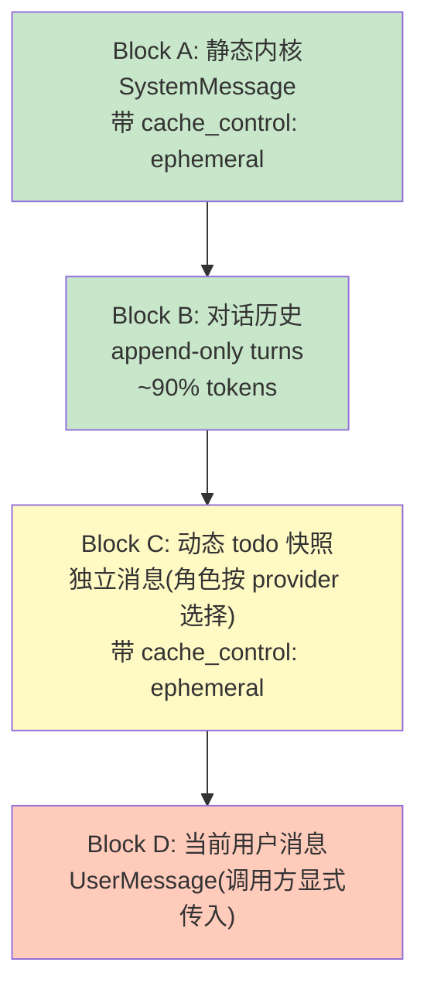

# ADR-060：Prompt Cache 友好的上下文块重排 - 稳定前缀 + 末尾追加

**状态**:提案
**日期**:2026-09-14
**决策者**:大鱼
**前置**:
- [ADR-011:上下文摘要与蒸馏统一策略](./ADR-011-compaction-as-distillation.md)
- [ADR-051:Runtime Memory Provider 解耦](./ADR-051-runtime-memory-provider-decoupling.md)
- [ADR-052:工具压缩 LLM 自主化](./ADR-052-tool-compression-llm-autonomous.md)
- [ADR-054:Debug Context Snapshot Coverage](./ADR-054-debug-context-snapshot-coverage.md)
- [ADR-061:上下文压缩机制改造 - 8 级递减策略](./ADR-061-context-compression-byte-budget.md)（自本 ADR §12 拆分独立的压缩改造）

---

## 1. 决策摘要

当前 `ContextBuilder::build()`([core/acowork-runtime/src/agent/context.rs:459-717](core/acowork-runtime/src/agent/context.rs#L459-L717)) 输出的 `ChatRequest.messages` 顺序存在**严重的 cache 命中率问题**:

| 当前 messages 顺序 | 字节占比 | 变化频率 | cache 影响 |
|---|---|---|---|
| `[0] SystemMessage(retrieved_memory + todo_context + workspace_prompt_file)` | ~10% | **每次 build 都变**(memory 检索、todo 写入) | **破坏锚点** |
| `[1..N] history.messages()`(user/assistant/tool) | **~90%** | append-only(理想情况下) | 本应是稳定 cache 主体 |
| 末尾:当前 user message | 极小 | 必然新 | 不可避免 |

当前的实际问题是:**动态块嵌在静态块之间,使得占比 ~90% 的对话历史每次都失效**。OpenAI 的 128-token hash 链与 Anthropic 的 prefix cache 都对"中间任意位置变化"零容忍——只要 `[0]` 变了,后续 hash 链全错位。

本 ADR 决定将 `ContextBuilder` 输出按 cache 影响重排为 4 个正交块(Block A/B/C/D),并相应改造持久化与 debug 视图:

1. **Block A:静态内核(永远稳定)**——单一 SystemMessage,带 `cache_control: ephemeral` 标记。包含 package prompts、identity、workspace meta、retrieved memory、environment、workspace prompt file。
2. **Block B:对话历史(append-only)**——`history.messages()` 的 user/assistant/tool turns,占比 ~90%,**是 cache 命中率的真正战场**。
3. **Block C:动态 todo 快照(实时更新)**——独立消息,放在 Block B 之后,**只在内容变化时更新**;角色按 provider 协议选择(§5.4)。
4. **Block D:当前用户消息**——由调用方**显式传入**,不再从 history 反推(§5.5)。

并对相关持久化与可观测性做对应改造:

5. **`SessionMeta.todos`** 持久化当前 todo 快照(`meta/{session_id}.json`),避免 JSONL append-only 与频繁更新的冲突;数据流见 §6.1。
6. **Debug 面板 items 显示顺序与新结构对齐**(§6.2)。
7. **`memory_recall` 工具的语义保持不变**——其结果通过 `ChatMessage::tool()` append 到 history 末尾(见 [core/acowork-runtime/src/agent/loop_.rs:1618-1630](core/acowork-runtime/src/agent/loop_.rs#L1618-L1630)),天然符合 Block B 的 append-only 语义,**无需改动**。
8. **`auto_inject_enabled` 的触发策略从"每轮用户输入触发"改为"首次用户输入触发"**,即使将来默认开启 auto-inject,也只在第一次 user message 时执行一次 retrieve_and_inject;后续轮次除非显式触发或 memory 集合发生显著变化,不再重跑检索——`auto_inject_enabled` 默认 `false` 的现实下此条不构成行为变化,但为未来开启时奠定规则(§6.3)。

**非目标**(本 ADR 不讨论):
- **上下文压缩机制(8 级递减 + FIFO 删除)**——已拆分为 [ADR-061](./ADR-061-context-compression-byte-budget.md) 独立评审,本 ADR 不涉及。
- history trim / compaction 算法的重写——ADR-011 的"保留最近 K 轮、压缩老内容"策略保持不动,由 ADR-061 承接。
- tools 段的 cache 优化(MCP tool definitions 一次性 JSON 化)——影响独立,优先级 P1,本轮不展开。
- `detect_environment_text()` 的 `OnceCell` 缓存——CPU 小优化,顺手可做但非核心。

---

## 2. 背景与现状

### 2.1 Prompt Cache 的物理事实

| Provider | 命中机制 | 对"中间变化"的容忍度 |
|---|---|---|
| **Anthropic** | 按 `cache_control: ephemeral` 标记的 breakpoint 缓存,**前缀必须逐字节相等** | **零容忍** |
| **OpenAI** | 自动按 128 token 块做 hash 链 | **零容忍**——中间任意位置变化,后续所有块的 hash 都错位 |

**关键推论**:不管哪一家,**只要在 messages 中间(早期对话历史之前)插入或修改了字节,后面所有稳定历史都被"挤掉" cache**。

ACowork 当前典型场景(8K 上下文,user/assistant 工具调用混合)的 cache 命中率接近 0%——这就是当前架构的代价。

> 注:OpenAI/Anthropic 均有"最小可缓存前缀长度"(典型 1024 tokens)要求,8K 以下小上下文可能不满足 Block A 单独成块的缓存门槛——§8 的命中率预期以"上下文足够大"为前提。

### 2.2 当前 `ContextBuilder::build()` 实际拼接顺序

```rust
// core/acowork-runtime/src/agent/context.rs:469-526
let mut system_content = self.system_prompt.clone();  // 静态if let Some(ref identity) = self.identity_context { /* append */ }
if let Some(ref workspace) = self.workspace_context { /* append */ }
if let Some(ref memory) = self.retrieved_memory { /* append */ }       // ⚠️ 动态
if let Some(ref hint) = self.ambiguous_confirmation_hint { /* append */ } // ⚠️ 偶发动态
if let Some(ref skills) = self.skill_instructions { /* append */ }
if let Some(ref todos) = self.todo_context { /* append */ }             // ⚠️ 动态
if let Some(ref env_override) = self.environment_override { /* append */ }
else { system_content.push_str(&format!("\n\n{}", detect_environment_text())); /* 每轮重算 */ }
if let Some(ref prompt_file) = self.workspace_prompt_file { /* append */ }

messages.push(ChatMessage::system(system_content));  // [0] = 单条 SystemMessage
messages.extend(history.messages().iter().filter(|m| !System).cloned());  // [1..N]
```

**关键观察**:
- 三个动态块(`retrieved_memory`、`todo_context`、未来可能开启的 `ambiguous_confirmation_hint`)被嵌入主 SystemMessage **中部**。
- 即便 retrieved_memory 当前默认未启用(`MemoryManagerConfig::auto_inject_enabled = false`,见 [core/acowork-memory/src/manager.rs:120-150](core/acowork-memory/src/manager.rs#L120-L150)),`todo_context` 在每次 agent 调用 `todo_write` 工具时必然变化。
- 主 SystemMessage 任何变化都会让 OpenAI 的 128-token hash 链从位置 0 开始错位。

### 2.3 `auto_inject_enabled` 的现状与隐忧

`MemoryManagerConfig::auto_inject_enabled` 当前默认 `false`,在 [core/acowork-runtime/src/agent/loop_memory.rs:88-91](core/acowork-runtime/src/agent/loop_memory.rs#L88-L91) 有 early return:

```rust
if !manager.config().auto_inject_enabled {
    tracing::debug!("Memory auto-inject disabled (auto_inject_enabled=false)");
    return;
}
```

文档化的关闭理由(2026-09-12 决策):
1. 不同 agent 类型需要不同 recall profile
2. Grafeo 记忆层尚未成熟到可以无监督注入
3. 用原始 user message 做 query,低精度反而误导 LLM

**当前不会触发** → 系统 prompt 中的 `retrieved_memory` 字段**实际为空**(虽然代码支持注入)。但代码路径已经摆在那里,一旦未来开启,**每一轮 user message 都会重跑** `retrieve_and_inject`,`MemoryQuery::auto_inject` 基于当前 user message 做 embedding 检索,结果必然每轮变化。

**这正是本 ADR 要解决的隐患**——即便 memory 内容稳定(同样的 hits、score),格式化文本、计数、排序的微小抖动也会让 SystemMessage 字节变化,进而触发 OpenAI/Anthropic cache 失效。

### 2.4 `memory_recall` 工具的实际语义

`memory_recall` 是显式 LLM 工具调用([core/acowork-runtime/src/tools/builtin/memory_recall.rs](core/acowork-runtime/src/tools/builtin/memory_recall.rs)):
- 工具返回格式化文本的 `ToolResult`(memory_recall.rs:204-228);**append 动作发生在调用方**——`execute_single_iteration` 将其作为 `ChatMessage::tool()` append 到 history 末尾,见 [core/acowork-runtime/src/agent/loop_.rs:1618-1630](core/acowork-runtime/src/agent/loop_.rs#L1618-L1630)
- **完全符合 Block B 的 append-only 语义**
- 不污染 system prompt,不影响 Block A 的 cache
- 本 ADR **无需改动此路径**

### 2.5 todo 持久化的现状

`SessionState.todos` 当前**只在内存**:
- `update_todos()`([core/acowork-runtime/src/agent/session_state.rs:464-479](core/acowork-runtime/src/agent/session_state.rs#L464-L479)) 修改 `Vec<TodoItem>`
- `format_todos()`([core/acowork-runtime/src/agent/session_state.rs:483-500](core/acowork-runtime/src/agent/session_state.rs#L483-L500)) 每次 build 时格式化
- **不在 JSONL**,也不在 `SessionMeta`(见 [core/acowork-runtime/src/conversation.rs:231-269](core/acowork-runtime/src/conversation.rs#L231-L269))

session 重启时 todo 列表**完全丢失**——这是已有的功能缺失。

---

## 3. 核心问题

### 3.1 占比 ~10% 的 SystemMessage 变化摧毁占比 ~90% 的 history cache

**这是当前架构最严重的 cache 效率问题。**

```
[messages] 当前实际顺序

 [0] SystemMessage(动态块在其中)
      ├─ package prompts + skills (static)
      ├─ identity_context (static in session)
      ├─ workspace_context (static in session)
      ├─ **retrieved_memory** (each turn re-retrieved → byte changes)
      ├─ **ambiguous_confirmation_hint** (occasional)
      ├─ skill_instructions (mostly static)
      ├─ **todo_context** (changes on todo_write)
      ├─ environment (static in process)
      └─ workspace_prompt_file (static in session)

 [1..N] history.messages()  ←  占比 ~90%, 应该是 cache 主体
      └─ 但每次 build 都因为 [0] 变化而全错位
```

**任何放到 `[0]` 中部的动态块都是 P0 cache 杀手**。

### 3.2 "每次 build 都重新注入 retrieved memory"是错误的设计

即使未来开启 `auto_inject_enabled`:
- 每轮 user message 内容不同 → 检索结果不同
- 即便 top-1 记忆固定,格式化文本(`- [Episodic] (score=0.85) ...`)也会抖动
- 让"动态内容像 SystemMessage 一样每次 build 重写"是反 append-only 的

**正确语义是"append"**——把检索结果作为 tool message 一样追加,而不是覆盖 SystemMessage。

但 `auto_inject_enabled` 与 `memory_recall` 是两条不同路径:
- `auto_inject_enabled`:agent loop 主动每轮跑 `retrieve_and_inject`
- `memory_recall`:LLM 显式工具调用,结果 append 到 history

用户提出的更精细的策略是:**`auto_inject_enabled` 即便开启,也应该只在首次 user message 触发一次,后续轮次除非显式触发或 memory 集合显著变化,不再重跑**(§6.3)。

### 3.3 todo 放在 SystemMessage 中部无法持久化

JSONL 是 append-only 的(见 [core/acowork-runtime/src/conversation.rs:309](core/acowork-runtime/src/conversation.rs#L309) `ConversationWriter`)。如果 todo:
- 放在 SystemMessage 中部 → SystemMessage 频繁变化 → cache 杀手(见 §3.1)
- 写到 JSONL → 每条 todo 变化都写一行,历史里全是 todo 状态 line → 冗余且语义不清
- 不持久化 → session 重启丢失 todo(已有问题)

`SessionMeta` 是 todo 的天然归宿——每轮 todo 变化 → 写一次 `meta/{session_id}.json`,与现有 ADR-024 的 meta + JSONL 双层架构一致。

### 3.4 Block C 真的需要 cache_control 标记吗?

Anthropic cache 的 4 个 breakpoint 限制(2026 年初)并不严格——实际限制已放宽,但**显式标记 cache boundary 是工程上最稳妥的实践**。OpenAI 不需要显式标记,只要把 cache 边界位置放对就能自动 cache。

Block A 末尾一个 `cache_control: ephemeral`、Block C 末尾一个 `cache_control: ephemeral`,**两个 breakpoint 是最小可行方案**。

---

## 4. 设计目标

### 4.1 目标

- **最大化 Block A + Block B 的 cache 命中率**——这是 ~95% 的字节
- 把动态块(todo)放到 messages 末尾,变化只会让它自己失效,**不污染前面的稳定前缀**
- 保留对 `memory_recall` 工具调用的 append-only 语义(已天然正确,无需改)
- 提供 todo 持久化(session 重启不丢)
- debug 面板与新结构对齐

### 4.2 非目标

- **不重写 history trim / compaction 算法**——已移交 [ADR-061](./ADR-061-context-compression-byte-budget.md)
- 不重写 tools 段的 cache 优化(MCP tool definitions JSON 化,P1)
- 不引入新的持久化层(`SessionMeta` + JSONL 已足够)
- 不修改 `memory_recall` 工具的接口(已天然符合 append-only)
- 不调整 `auto_inject_enabled` 默认值(保持 `false`,本 ADR 仅定义"未来开启时的触发策略")

### 4.3 设计原则

1. **稳定前缀 + 末尾追加**:cache 友好性的唯一原则
2. **append-only**:动态内容以追加而非覆盖的方式进入 messages
3. **单点改造**:每个改造点独立可测、可回滚
4. **最小耦合**:不强迫 provider trait 大改,不强迫 LLM 接口变化
5. **provider 感知**:新消息的角色与位置必须满足各 provider 协议约束(§5.4),不引入违反既有约束的消息形态

---

## 5. 设计:四块结构(Block A/B/C/D)

### 5.1 总体结构



**Block A + B 是稳定的 cache 主体**;Block C 是动态但只占 ~1%;Block D 必然新。

### 5.2 Block A 内容(静态内核)

来源:`package prompts + skills` + 注入的元数据。

```rust
fn build_block_a(&self) -> String {
    let mut s = self.system_prompt.clone(); // package prompts + skills
    if let Some(ref id) = self.identity_context {
        s.push_str(&format!("\n\n## User Identity\n{id}\n\nReply in the language specified by the Language field above."));
    }
    if let Some(ref ws) = self.workspace_context { s.push_str(&format!("\n\n{ws}")); }
    if let Some(ref mem) = self.retrieved_memory {
        // 当前默认未启用,未来开启时也只在首次 user message 触发一次
        // (见 §6.3 trigger policy)
        s.push_str(&format!("\n\n## Relevant Memories\n{mem}"));
    }
    if let Some(ref sk) = self.skill_instructions { s.push_str(&format!("\n\n## Skill Instructions\n{sk}")); }
    if let Some(ref env) = self.environment_override {
        s.push_str(&format!("\n\n{env}"));
    } else {
        // env 文本用 OnceLock 缓存,启动时算一次 (§6.4)
        s.push_str(&format!("\n\n{}", CACHED_ENV_TEXT.get_or_init(detect_environment_text)));
    }
    if let Some(ref pf) = self.workspace_prompt_file {
        s.push_str(&format!("\n\n## Workspace Prompt File\n{pf}"));
    }
    s
}
```

**关键变化**:`todo_context`、`ambiguous_confirmation_hint` **从 Block A 移走**,分别到 Block C /(暂不实现)。

### 5.3 Block B 内容(对话历史)

直接来自 `history.messages()`,过滤掉已有的 System 消息(因 Block A 已独占 System 角色)。

```rust
messages.extend(
    history.messages().iter()
        .filter(|m| !matches!(m.role, MessageRole::System))
        .cloned()
);
```

**append-only 保证**:
- `HistoryManager::append()`([core/acowork-runtime/src/agent/history.rs:263-271](core/acowork-runtime/src/agent/history.rs#L263-L271)) 是主要的写入路径
- `execute_single_iteration` 的 tool result 持久化([core/acowork-runtime/src/agent/loop_.rs:1618-1630](core/acowork-runtime/src/agent/loop_.rs#L1618-L1630)) 只 append,不改写
- `memory_recall` 结果 append([core/acowork-runtime/src/tools/builtin/memory_recall.rs:204-228](core/acowork-runtime/src/tools/builtin/memory_recall.rs#L204-L228)) 走的是 `ChatMessage::tool()` append,天然正确
- 注意:仍存在少数中间改写路径(`abandon_tool_result` / `retrieve_tool_result` / `replace_middle_with_summary` / debug `truncate_to`),其中工具压缩路径由 ADR-061 关闭,压缩路径由 ADR-061 以"沉没成本"语义处理

### 5.4 Block C 内容(动态 todo 快照)—— 角色按 provider 协议选择

**关键约束(审查结论)**:Block C **不得使用 `MessageRole::System`**。原因:

1. **Anthropic**:`convert_messages` 会把 messages 数组中的每个 System 消息提升到顶层 `system` 字段并**互相覆盖**([anthropic.rs:392-401](core/acowork-runtime/src/providers/anthropic.rs#L392-L401))——中段 SystemMessage 会导致 Block A 被 todo 覆盖、静态内核丢失。
2. **既有约束**:`build()` 当前过滤 history 中所有 System 消息的原因,正是"部分 provider(如 MiniMax)拒绝非首位 system 消息"(context.rs:534-536 注释);OpenAI o1/o3 系还会把 system 映射为 developer(必须首位)。
3. **Anthropic alternation**:Anthropic messages 必须是 user/assistant 交替(工具循环中 block B 末尾可能是 tool_result→user 形态)。

**本 ADR 的表示策略**:

```rust
// Block C: 动态 todo 快照 —— 独立消息,默认 User 角色 + cache_control: ephemeral
// 选择 User 的理由:
//  - 不触发 Anthropic 的 system 提升覆盖(§5.4 约束 1)
//  - 不违反 MiniMax/o1 的"system 必须首位"约束(§5.4 约束 2)
//  - 与 Block B 末尾的 tool_result(user 形态)/assistant 均不破坏 alternation:
//    连续 user 消息会被 Anthropic/OpenAI 自动合并,语义无损
//  - Anthropic 允许在 user 消息上携带 cache_control
if let Some(ref todos) = self.todo_snapshot {
    messages.push(ChatMessage {
        role: MessageRole::User,   // 固定 User;如未来某 provider 支持中段 system
                                   // (如 system content-block 数组),可在此做策略切换
        content: format!(
            "## Active Task List\nUse the `todo_write` tool to manage this list. Current tasks:\n{todos}"
        ),
        cache_control: Some(CacheControl::Ephemeral),
        ..Default::default()
    });
}
```

**字节确定性保证**(替代早期草稿的"跳过 push"表述):每次 build 都是全量重建 messages,不存在增量 push;真正的要求是 **todo 内容未变时字节必须逐字节一致**——`format_todos()` 是确定性格式化(含稳定 item id,无时间戳/排序抖动),在 `build_chat_request` 入口处([loop_context.rs:938](core/acowork-runtime/src/agent/loop_context.rs#L938))每轮设置。实现时以"上一轮文本快照比对"断言字节稳定(测试用),不引入 skip-push 逻辑。

**为什么 todo 用 Ephemeral 而不是 Persistent**:todo 在多步骤任务中频繁更新,Persistent cache(若支持)的失效成本高于收益。Ephemeral 即可。

### 5.5 Block D 内容(当前用户消息)—— 显式传参,不从 history 反推

**早期草稿方案(废弃)**:`build()` 内从 `history.messages()` 末尾 pop——依赖"history 最后一条就是当前 user message"的隐式假设。**该假设不成立**:工具循环迭代中 history 末尾是 `Tool` 消息(常态,非异常),`[System Notification]`(session_task.rs:1432-1434)、ask_user 答复、debug replay 等变体也会破坏 pop 语义;且 pop 使 request 与 debug 快照(`messages_arc()`)内容不一致。

**本 ADR 方案**:由调用方**显式传入**当前 user message。

```rust
pub fn build(
    &self,
    manifest: &AgentManifest,
    history: &HistoryManager,
    current_user_message: Option<&ChatMessage>,  // 新增显式参数:None=工具迭代
    gateway_capabilities: Option<&ModelCapabilitiesInfo>,
    max_output_tokens_limit: u64,
) -> ChatRequest
```

调用方改动([loop_context.rs:984](core/acowork-runtime/src/agent/loop_context.rs#L984) `build_chat_request`):
- `AgentLoop` 新增 `pending_user_message: Option<ChatMessage>` 字段
- `run_inner()` 收到新 user 输入时([loop_.rs:697-700](core/acowork-runtime/src/agent/loop_.rs#L697-L700))暂存该消息;工具循环迭代、debug replay 场景置 `None`
- `build_chat_request` 取出传入;传入 `Some` 时可用 `debug_assert!(history 末尾 == 该消息)` 做一致性校验

```rust
let mut history_msgs: Vec<_> = history.messages().iter()
    .filter(|m| !matches!(m.role, MessageRole::System))
    .cloned()
    .collect();

messages.extend(history_msgs);            // Block B(含当前 user 消息在内,append-only 位置不变)
// ... Block C 插入 todo 快照 ...
if let Some(user_msg) = current_user_message {
    messages.push(user_msg);              // Block D
}
```

注意:Block B 包含当前 user 消息,Block D 是其**副本**(同一 `ChatMessage` 的 clone,字节一致)——这是必要的:历史必须完整持久化与展示,请求中它在最末位置。debug 快照展示 history 全量(含该消息),request 中它在 Block D——两者内容一致,仅展示位置不同。

### 5.6 `cache_control` 字段

在 `ChatMessage` 上增加(位置:**`core/acowork-core/src/providers/traits.rs:422`**——共享 crate,非 runtime 私有;`#[serde(default, skip_serializing_if)]` 保证向后兼容):

```rust
pub struct ChatMessage {
    pub role: MessageRole,
    pub content: String,
    pub content_parts: Option<Vec<ContentPart>>,
    pub tool_calls: Option<Vec<ToolCall>>,
    pub tool_call_id: Option<String>,
    pub name: Option<String>,
    /// Provider-specific cache boundary hint.
    /// Anthropic: maps to `cache_control: { type: "ephemeral" }` on the message.
    /// OpenAI: implicit; block position alone determines cache.
    #[serde(default, skip_serializing_if = "Option::is_none")]
    pub cache_control: Option<CacheControl>,
}

#[derive(Debug, Clone, Copy, Serialize, Deserialize, PartialEq, Eq)]
#[serde(rename_all = "snake_case")]
pub enum CacheControl {
    Ephemeral,
    Persistent,  // 预留,目前未使用
}
```

Provider 映射(§7.1-3),**必须处理 System 提升语义**:
- **Anthropic**:消息级 `cache_control` 仅对 user/assistant 消息生效(`AnthropicMessage` 增加 `cache_control` 字段);System 消息的 cache 标记需要顶层 `system` 字段从 `String` 升级为 content-block 数组(`{"type":"text","cache_control":...}`)——Block A 的 cache breakpoint 依赖此改造,列入实施清单;**Block C 因使用 User 角色,天然可携带消息级 cache_control,不受此改造阻塞**
- **OpenAI**:忽略该字段,但 **block 位置放对**(Block A 末尾、Block C 末尾各一处);注意 Block C 为 User 角色,中段不引入 system/developer
- **Ollama**:忽略

---

## 6. 配套改造

### 6.1 `SessionMeta.todos` 持久化 —— 完整数据流

`SessionMeta`([core/acowork-runtime/src/conversation.rs:231-269](core/acowork-runtime/src/conversation.rs#L231-L269)) 增加字段:

```rust
pub struct SessionMeta {
    // ... 既有字段 ...
    #[serde(default, skip_serializing_if = "Option::is_none")]
    pub todos: Option<Vec<TodoItem>>,
}
```

**数据流设计**(所有权收敛,避免双写者):

```
todo_write 工具 → SessionState::update_todos() (内存,运行时所有权)
                       │
                       ▼ (同步镜像,经 ConversationSession 公开接口)
        ConversationSession::set_todos(&[TodoItem])  ← 新锁字段,唯一持久化所有权
                       │
                       ▼ (内容变化时)
        write_meta() 复用现有写盘路径(含 META_WRITE_COOLDOWN_MS 节流, conversation.rs:581)
                       │
                       ▼ (session 启动)
        session_init 读取 meta.todos → SessionState::todos (与 model/provider/reasoning_effort 同模式)
```

- **`set_todos` 语义**:内容与上一次相同时跳过写盘(避免 todo 未变时刷盘);变化时**立即写盘**(metadata-mutation 语义,与 title/model/provider 一致,不走 append_message 路径的 `META_WRITE_COOLDOWN_MS` 节流)——立即写保证首个 todo_write 在 session 创建后的 cooldown 窗口内也能扛过进程 kill,重启必然恢复(实现修订记录:2026-08-30)。
- **禁止双写**:`SessionState` 不得直接写 meta 文件——写盘只经 `ConversationSession` 的既有路径(它是 meta 的唯一所有者)。
- **JSONL 不写 todo_event**(本轮不做):debug 面板时间线需要时再补,跟现有 `kind="compaction"` 模式对齐。

### 6.2 Debug 面板 items 同步 —— 已确认实现形式

已核实 `capture_context_snapshot`([core/acowork-runtime/src/debug/observer_impl.rs:347-441](core/acowork-runtime/src/debug/observer_impl.rs#L347-L441)):**按 build 注入顺序组织 sections**(system_prompt → identity → workspace → memory → hint → skills → todo_context → environment → prompt_file → tool_definitions → messages),messages 是独立的 lazy 段(metadata + 按需加载),**不是**按 `chat_request.messages` 数组顺序展示。

**结论**:debug 面板不会"自动跟上",需要显式调整:
- `todo_context` 段的语义从"system prompt 子项"改为"独立 Block C 消息"——保留该段内容,更新分组/标签;
- `messages` 段展示 history 全量快照(含当前 user 消息),与 request 中 Block D 的关系见 §5.5,展示不变;
- Block A 拆分后各段顺序与 `build_block_a()` 拼接顺序保持一致(现状已对齐,无需改顺序)。

### 6.3 `auto_inject_enabled` 触发策略(未来开启时)

**当前默认 `false`**,行为不变。

**未来开启时**(本 ADR 定义的策略):

| 触发时机 | 是否 retrieve_and_inject |
|---|---|
| Session 启动后的**首次** user message | ✅ 触发 |
| 后续 user message 轮次 | ❌ 不触发 |
| LLM 显式调用 `memory_recall` 工具 | ✅ 触发(走工具路径,不污染 SystemMessage) |
| Memory 集合显著变化(新增 ≥ N 条节点)| ✅ 触发(可由 consolidation_bg 通知;**通道未实现,标注为后续工作**) |

**实现要点**:
- `AgentLoop` 增加 `memory_retrieved_for_session: bool` 标记
- 首次 `retrieve_and_inject_memories()` 调用成功后置 true
- 后续轮次在 `loop_memory.rs:88` 的 early return 加条件:`if !manager.config().auto_inject_enabled || self.memory_retrieved_for_session { return; }`
- 显式 `memory_recall` 工具调用走的是独立路径,**不影响此标记**

### 6.4 `detect_environment_text()` 缓存

[core/acowork-runtime/src/agent/context.rs:807-828](core/acowork-runtime/src/agent/context.rs#L807-L828) 改为:

```rust
static CACHED_ENV_TEXT: OnceLock<String> = OnceLock::new();

pub fn detect_environment_text() -> &'static str {
    CACHED_ENV_TEXT.get_or_init(|| format!(
        "## Environment\n- Operating System: {}\n- Architecture: {}\n- Shell: {}\n- Available Shell Tools: {}",
        std::env::consts::OS, std::env::consts::ARCH,
        crate::platform::detected_shell().display_name,
        /* ... */
    ))
}
```

**收益**:环境文本在进程内只算一次,字节稳定性也更有保证(虽然之前也稳定,但少一次格式化开销)。

---

## 7. 改造范围与依赖

### 7.1 改造清单

| 编号 | 内容 | 涉及文件 | 优先级 |
|------|------|----------|--------|
| 1 | `ContextBuilder::build()` 重排为 Block A/B/C/D + `current_user_message` 显式参数 | `core/acowork-runtime/src/agent/context.rs` + `loop_context.rs` + `loop_.rs` | **P0** |
| 2 | `ChatMessage.cache_control` + `CacheControl` enum(**acowork-core 共享 crate**) | `core/acowork-core/src/providers/traits.rs` | **P0** |
| 3 | Provider 映射 cache_control + **Anthropic system 字段升级为 content-block 数组**(Block A breakpoint 前置) | `providers/anthropic.rs`、`providers/openai.rs`、`providers/ollama.rs` | **P0** |
| 4 | `SessionMeta.todos` 字段 + `build_meta` 填 todos + `ConversationSession::set_todos`(含节流) | `core/acowork-runtime/src/conversation.rs` | **P0** |
| 5 | `update_todos()` 同步镜像到 `conversation.set_todos()` | `core/acowork-runtime/src/agent/session_state.rs` + `loop_interaction.rs` | **P0** |
| 6 | session 启动从 meta 加载 todos 到 `SessionState` | `core/acowork-runtime/src/startup/session_init.rs` | **P0** |
| 7 | Debug 面板 items 顺序/标签对齐(§6.2) | `core/acowork-runtime/src/debug/observer_impl.rs` + 前端 | **P0** |
| 8 | `auto_inject_enabled` 首次触发策略(未来开启时实现) | `core/acowork-runtime/src/agent/loop_memory.rs` | **P1**(行为不变) |
| 9 | `detect_environment_text()` 用 `OnceLock` | `core/acowork-runtime/src/agent/context.rs` | **P2** |

### 7.2 实施顺序

1. **(2) `ChatMessage.cache_control` 字段**——其他改造都依赖此字段
2. **(3) Provider 映射**——保证 cache_control 字段不会破坏现有协议;**先完成 Anthropic system 字段升级,再切 Block C**(避免中间态 System 覆盖)
3. **(1) `ContextBuilder::build()` 重排 + Block D 显式传参**——核心改动
4. **(4-6) SessionMeta.todos 三件套**——配套持久化
5. **(7) Debug 面板对齐**——展示层
6. **(8) auto_inject 触发策略**——P1,行为不变,但代码就位
7. **(9) env OnceLock**——小优化,顺手做

### 7.3 测试要求

- **单元测试**:Block A 拼接函数字节稳定性、`set_todo_context` 内容比较、`build_chat_request` 输出顺序(Block B 含当前 user 消息 + Block D 副本一致)、Block C 角色断言(非 System)
- **集成测试**:session 重启后 todos 恢复、`auto_inject_enabled=true` 时首次 user message 触发、后续不触发、工具迭代中 Block D=None
- **回归测试**:Anthropic(含 system 覆盖回归:Block A 不得被 Block C 覆盖)/ OpenAI / Ollama 三个 provider 的 `cache_control` 序列化正确

---

## 8. 影响与回滚

### 8.1 行为影响

| 维度 | 改动前 | 改动后 |
|---|---|---|
| OpenAI prompt cache 命中率 | ~0% | ~85%+(Block B 稳定;前提:上下文 ≥ 最小可缓存长度) |
| Anthropic cache write 次数 | 每轮 | 一次性(后续只付 read 成本) |
| session 重启后 todos | 丢失 | 恢复(新增能力) |
| `auto_inject_enabled` 当前行为 | 关闭 | 关闭(不变) |
| `auto_inject_enabled` 未来开启 | 每轮触发 | 首次触发(待实现) |
| debug 面板显示 | 按既有聚合方式 | 按 Block A/B/C/D 顺序 |
| 现有 LLM 工具接口 | 无变化 | 无变化(`memory_recall` 已天然符合 append-only) |
| 上下文压缩 | 不受影响 | 不受影响(ADR-061 独立演进) |

### 8.2 回滚方案

`ContextBuilder::build()` 是单文件改动,可独立回滚到 commit 前。

`SessionMeta.todos` 是新字段(`#[serde(default)]`),缺失时降级到旧行为(todos 为空),向前兼容。

`ChatMessage.cache_control` 是 `Option`,缺失时降级到无 cache 标记,向前兼容。

### 8.3 性能影响

- **CPU**:Block A 拼接逻辑不变,只是把 todo 从 Block A 挪到 Block C,总字符串拼接次数基本持平。`OnceLock` 减少 env 格式化。
- **内存**:todo 仍只在内存,`SessionMeta` 写盘频率与 todo 更新频率一致(每次 todo 变化 → 写一次 meta JSON;内容未变不写,无节流——todo 更新频率远低于 append_message 路径,单次 < 1 KB,写盘成本可忽略)。
- **磁盘**:meta 文件比之前多一个 todos 字段,体积 < 1 KB。无 JSONL 新条目。

---

## 9. 与现有 ADR 的关系

| 现有 ADR | 关系 |
|---|---|
| [ADR-011](./ADR-011-compaction-as-distillation.md) | 压缩机制(含 KEEP_LAST_ROUNDS 演进)由 [ADR-061](./ADR-061-context-compression-byte-budget.md) 承接;本 ADR 仅依赖其 Block B append-only 语义 |
| [ADR-014](./ADR-014-loop-module-decomposition.md) | 本 ADR 改动主要在 `loop_context.rs` 和 `context.rs`,与 Phase 1-6 模块拆分兼容 |
| [ADR-024](./ADR-024-merge-metadata-into-index.md) | `SessionMeta.todos` 是现有 meta + JSONL 双层架构的扩展,无冲突 |
| [ADR-032](./ADR-032-context-recall.md) | `context_recall` 已重命名为 `context_retrieve`(ADR-052),本 ADR 不涉及此路径 |
| [ADR-051](./ADR-051-runtime-memory-provider-decoupling.md) | `auto_inject_enabled` 策略改动位于 `loop_memory.rs`,与 trait 解耦兼容 |
| [ADR-052](./ADR-052-tool-compression-llm-autonomous.md) | `context_retrieve` / `context_abandon` 工具走的是 Block B 的 append-only 路径,与本 ADR 完全兼容;工具的存废由 ADR-061 决策 |
| [ADR-054](./ADR-054-debug-context-snapshot-coverage.md) | Debug 面板 items 同步改造与 ADR-054 的 snapshot 覆盖目标一致(§6.2 已确认实现形式) |
| [ADR-061](./ADR-061-context-compression-byte-budget.md) | 压缩改造独立成册;其压缩产物(保持 User 角色 marker)按 Block A/B/C/D 布局注入,不改变本 ADR 的任何消息角色约定 |

---

## 10. 总结

本 ADR 用**单一原则**——"稳定前缀 + 末尾追加"——解决了当前架构的核心 cache 效率问题:

- **Block A**:静态内核,带 `cache_control: ephemeral`,一次性 cache write
- **Block B**:对话历史,append-only,占比 ~90%,**是 cache 命中率的主体**
- **Block C**:动态 todo 快照,独立消息(**User 角色,避免 provider 协议冲突**),放在 Block B 之后,变化只让自己失效
- **Block D**:当前 user message,**调用方显式传入**,放在最末

**附带的工程改进**:
- todos 持久化(session 重启不丢,数据流收敛于 `ConversationSession`)
- `auto_inject_enabled` 未来开启时的"首次触发"策略就位
- Debug 面板与新结构对齐(已确认 observer 实现形式)
- Anthropic system 字段升级为 content-block 数组(Block A breakpoint 前置)

**关键澄清**:
- `memory_recall` 工具的 append-only 语义**完全正确**——结果通过 `ChatMessage::tool()` append 到 history 末尾,与 Block B 设计天然兼容,**本 ADR 无需修改此路径**
- `auto_inject_enabled` 当前默认 `false`,本 ADR 不改变现状;但定义了"未来开启时的首次触发策略",防止每轮重跑检索造成的 cache 杀手
- `retrieve_and_inject_memories` 的"每轮清空 + 重写"是错误设计模式——若未来开启 auto-inject,检索结果应当按 append 语义处理(§11 后续工作)
- **Block C 必须使用 User 角色**(非 System):避免 Anthropic system 覆盖、MiniMax/o1 中段 system 拒绝等协议冲突(§5.4)——这是本版相对早期草稿的关键修正
- **上下文压缩(8 级递减 + FIFO 删除)已移至 ADR-061**,本 ADR 专注于消息布局与 cache 前缀稳定性

---

## 11. 后续工作(本 ADR 不展开)

1. **tools 段的 cache 优化**:MCP tool definitions 一次性 JSON 化,避免每次 build 重新序列化导致 tools 段 cache 失效
2. **`auto_inject_enabled` 真正开启时的语义实现**:如果走 append 路径,检索结果应该作为 Block C-style 消息追加,而不是覆盖 Block A 内的字段
3. **JSONL `todo_event` 条目**:debug 面板时间线需要时,新增 `kind="todo_update"` 条目,与 `kind="compaction"` 对齐
4. **Memory 集合显著变化的通知通道**(§6.3 表格最后一行):consolidation_bg → AgentLoop 的触发通道未实现,开启 auto-inject 前需补
5. **上下文压缩机制改造**(8 级递减 + 字节预算 + FIFO 删除)——见 [ADR-061](./ADR-061-context-compression-byte-budget.md)

---

## 附录 A:改动前后对比

```mermaid
graph TD
    subgraph Before["改动前"]
        B1["ContextBuilder.build()"] --> B2["SystemMessage 动态块嵌入中部"]
        B2 --> B3["history.append()"]
        B3 --> B4["LLM call"]
    end

    subgraph After["改动后"]
        A1["ContextBuilder.build()"] --> A2["Block A 静态内核<br/>(SystemMessage + cache_control)"]
        A2 --> A3["Block B history append-only<br/>(~90% tokens, cache 主体)"]
        A3 --> A4["Block C todo 快照<br/>(User 角色 + cache_control)"]
        A4 --> A5["Block D 当前 user message<br/>(显式传入)"]
        A5 --> A6["LLM call"]
    end

    style B2 fill:#ffcdd2
    style A2 fill:#c8e6c9
    style A3 fill:#c8e6c9
    style A4 fill:#fff9c4
    style A5 fill:#ffccbc
```


