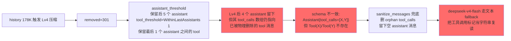
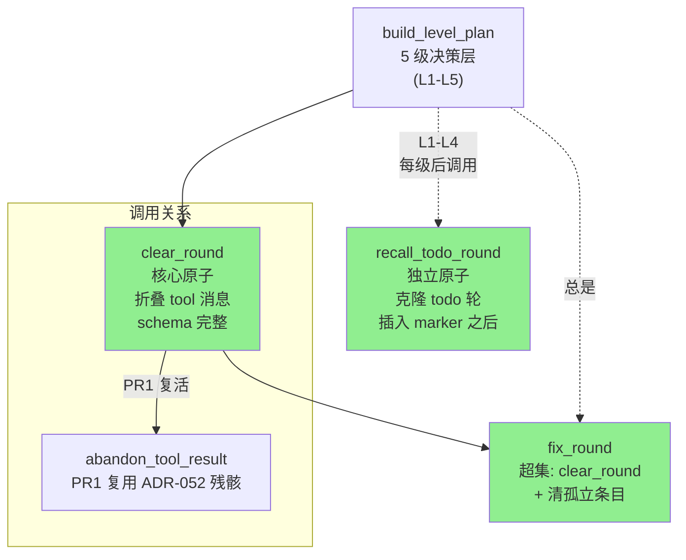

# ADR-061：上下文压缩机制改造 - 5 级递减策略替代按轮数保留

**状态**：v3 修订（2026-09-05；见 §20 三原子重构 + §6 5 级策略 + §10 占位符语义修正；与 §19/正文冲突处以 §20 为准）
**日期**：
- 2026-09-14：自 ADR-060 §12 拆分独立
- 2026-08-30：完成 v2 定稿修订（§19）
- **2026-09-05：v3 修订（5 级策略 + 三原子 + 占位符语义修正，§20）**
**决策者**：大鱼
**前置**：
- [ADR-010](./ADR-010-context-compression-simplification.md)（程序化压缩废止的历史决策）
- [ADR-011](./ADR-011-compaction-as-distillation.md)（上下文摘要与蒸馏统一策略）
- [ADR-052](./ADR-052-tool-compression-llm-autonomous.md)（工具压缩 LLM 自主化）
- [ADR-053](./ADR-053-agent-specific-compaction-prompt.md)（Agent 级压缩提示词）
- [ADR-056](./ADR-056-global-default-compact-model.md)（全局默认压缩模型解析）
- [ADR-060](./ADR-060-prompt-cache-friendly-context-block-reorg.md)（Prompt Cache 友好的上下文块重排 —— 本 ADR 的 Block A/B/C/D 前置）

---

## 1. 决策摘要

ADR-060 的 Block A/B/C/D 重排解决了"动态块污染稳定前缀"的问题，但**上下文压缩路径仍是 cache 的最终杀手**：当前机制以轮数（`KEEP_LAST_ROUNDS = 3`）保留尾部，且压缩后仍超限时会退化为 FIFO 删头——FIFO 一旦触发，Block B 全部失效，后续每轮都付全量 token 成本。

本 ADR 决定：

1. **8 级递减压缩策略**替代"保留最近 N 轮"：从最宽松的保留级别开始逐级收紧，直到压缩比 ≥ 阈值（默认 90% = 节省 ≥ 90%、剩余 ≤ 10%，如 200K → 20K）为止；优化指标从"轮数"改为"压缩比"。常规场景 Lv4-8 是工作级别（Lv5 是默认阈值的稳定命中点），Lv1-3 是"单用户输入 + agent 长工具任务"场景保留实现。阈值是 per-agent 可调参数（`compression_ratio_threshold`，AgentSetup 面板，默认 90%，见 §3.3/§19.3）。
2. **FIFO 路径物理删除**：`trim_fifo` / `emergency_trim` 在 8 级策略下不可达，删除后极端场景改为**显式失败**（`ChunkEvent::Error` 提示用户），绝不静默牺牲 cache。
3. **工具自动压缩关闭**：`context_abandon` 工具不再注册（LLM 自主压缩破坏 cache 连续性），`context_retrieve` 保留作为压缩后的显式取回通道。
4. **summary 保持既有 marker 契约**：压缩产物仍是 `User` 角色 + `name="compaction_summary"` 的消息（ADR-011/restorer 既有约定），level 元数据以纯文本写在 summary 内容最前面，**不改变消息角色**——避免与 ADR-060 Block B 的 System 过滤及 Anthropic system 提升语义冲突。
5. **LLM 不可用时绝不退化为 FIFO**：不修改 history，向前端 emit `ChunkEvent::Error`，由用户决策（新会话 / 换大窗口模型 / 手动压缩）。

**非目标**（本 ADR 不讨论）：
- Block A/B/C/D 重排与 `cache_control` 字段——见 ADR-060。
- summary 提示词的内容质量工程（per-agent `summary.md` 已由 ADR-053 覆盖）——本 ADR 仅定义 prompt 的强制结构。
- 蒸馏入图（triples 落地知识图谱）——见 ADR-057。

---

## 2. 背景与现状盘点（代码级事实）

### 2.1 为什么"保留最后 3 轮"会触发 FIFO

ADR-011 的压缩机制（`compact_via_llm` + `replace_middle_with_summary`）以**轮数**（`KEEP_LAST_ROUNDS = 3`，见 [core/acowork-runtime/src/agent/loop_context.rs:46](core/acowork-runtime/src/agent/loop_context.rs#L46)）而非**字节预算**保留尾部。典型 agent 任务中，3 轮对话可能包含：

- shell 输出 50 KB 的日志（1 次 `run_shell` tool_result）
- file_read 读了 200 行代码（1 次 `file_read` tool_result）
- content_search 返回 100 条匹配（1 次 `content_search` tool_result）
- 加上 user prompt 与 assistant 文本

3 轮很容易达到 **50K~80K tokens**——超出 `effective_input_budget`（典型 128K context window 减 32K output = 96K 可用 input）时，压缩后仍超限，`trim_history_to_budget` 退到 FIFO → **FIFO 删头 → Block B cache 全部失效**。

### 2.2 现状机制盘点

| 机制 | 现状（代码级） |
|---|---|
| 压缩入口 | `AgentLoop::compact_history_if_needed`（[loop_context.rs:565](core/acowork-runtime/src/agent/loop_context.rs#L565)），80% 阈值触发或手动 force；由 ADR-056 的 `resolve_distill_model` 解析压缩模型 |
| 摘要生成 | `HistoryManager::compact_via_llm`（[history.rs:757](core/acowork-runtime/src/agent/history.rs#L757)）+ `episode_distill::compact_with_llm`；prompt 由 ADR-053 的 per-agent `summary.md`（或内置 `COMPACTION_SYSTEM_PROMPT`）提供 |
| 中间替换 | `HistoryManager::replace_middle_with_summary`（[history.rs:798](core/acowork-runtime/src/agent/history.rs#L798)），保留尾部 `keep_last_rounds` 轮 |
| FIFO 兜底 | `trim_history_to_budget`（[loop_context.rs:218-237](core/acowork-runtime/src/agent/loop_context.rs#L218-L237)）：Stage 1 `trim_fifo` + Stage 2 `emergency_trim` |
| 工具压缩 | `context_abandon` / `context_retrieve` 由 `tool_compression_enabled`（默认 `true`，[agent_config.rs:216](core/acowork-runtime/src/agent_config.rs#L216)）门控注册（[builtin/mod.rs:195-201](core/acowork-runtime/src/tools/builtin/mod.rs#L195-L201)）；`context_abandon` → `AbandonQueue` → `drain_abandon_queue`（[loop_.rs:1722](core/acowork-runtime/src/agent/loop_.rs#L1722)）→ `abandon_tool_result`（[history.rs:555](core/acowork-runtime/src/agent/history.rs#L555)）原位替换占位符 |

> **勘误说明**：早期草稿（ADR-060 §12）曾引用 `auto_compress_tool_results` 调用点——**该函数不存在于代码库**。工具压缩的真实机制是上面的"工具注册门控 + 队列 + 原位替换"链路，本 ADR 以实际代码为准。

### 2.3 summary marker 契约（不可破坏）

`replace_middle_with_summary` 产出的 marker 消息有明确的既有契约，**任何压缩改造都必须保持**：

1. **角色是 `User` 而非 `Assistant`**：`restorer` 注释明确——避免重建请求中 `Assistant → Assistant{tool_calls}` 相邻，glm-5.2 on Volcano Ark 会拒绝（400 InvalidParameter），见 [restorer.rs:22-31](core/acowork-runtime/src/agent/session/restorer.rs#L22-L31)。
2. **身份靠 `name == "compaction_summary"` 识别**：`last_compaction_index`、`emergency_trim` 的保护逻辑、`episode_distill` 的会话收尾蒸馏都依赖它（history.rs:500-508）。
3. **JSONL 锚点**：`kind="compaction"` 条目 + `last_compaction_offset` 决定恢复窗口（restorer.rs:93-123），restorer 只尊重**最近一次** compaction。
4. **不能被 ADR-060 Block B 过滤**：`ContextBuilder::build()` 过滤 history 中所有 `MessageRole::System` 消息（context.rs:541）——若把 summary 改成 SystemMessage，它会从请求中**静默消失**。

> **结论**：压缩产物**必须保持 `User` 角色 marker**。任何"summary 作为独立 SystemMessage 插入 Block A 之后"的方案（早期草稿 §12.4.7/12.4.8 的 cache hit 2 设计）与上述 4 条契约全部冲突，**予以废弃**。level 元数据改为写在 summary 文本最前面（见 §9）。

---

## 3. 成本模型

### 3.1 策略对比

| 策略 | 首次 cache 代价 | 后续轮 token 成本 | 命中场景 |
|---|---|---|---|
| **FIFO 删头** | 0（从不重建 cache） | 每轮 ~200K（无 cache） | 永远 0% |
| **压缩（summary）** | 1 次 cache miss（~200K） | 每轮 ~10K（有 cache） | 压缩后 N 轮内命中率 ~100% |

**算式**（以 200K → 10K 的 95% 压缩比为例）：
- FIFO 路径：每轮付 200K token × N 轮
- 压缩路径：付 1 × 200K + N × 10K
- 临界点：`N × 200K = 200K + N × 10K` → **N ≈ 1.05 轮**

只要压缩后能续命超过 1 轮，压缩路径就比 FIFO 便宜。agent 任务中压缩后通常能续命几十到几百轮，因此**压缩是绝对优势策略**——cache miss 是"沉没成本"。

### 3.2 失效范围因 provider 而异

中间位置压缩的 cache 失效范围并不总是"全量"：

- **OpenAI**（128-token hash 链）：中间任意字节变化 → 之后所有块错位，**全量失效**——上面的"1 次全量 miss"模型严格成立。
- **Anthropic**（breakpoint 前缀缓存）：插入点**之前**的稳定前缀（Block A 及压缩点前的早期历史）仍可命中，失效的是插入点之后的 suffix——实际成本低于全量模型。

工程上按"全量失效"预算（保守），实际收益以 Anthropic 场景更好。

### 3.3 压缩比达标线：默认 90%，per-agent 可调

按同一 1.25× 写/读成本模型，压缩比 \(r\) 的盈亏平衡轮数 ≈ \(1.25(1-r)/r\)：\(r=10%\) 时约 **11 轮**，\(r=50%\) 时约 1.25 轮。但低阈值是"够本就行"的成本视角，**未解决长会话反复触发压缩的可用性问题**——例如 200K → 180K（节省 10%）只够"擦过 budget"，下一会话又涨上来又触发，"压了个寂寞"。

**决策**：本 ADR 的达标线默认 **90%**（节省 ≥ 90%、剩余 ≤ 10%，如 200K → 20K）——确保压缩后 history 留出充足缓冲空间，避免短期内反复触发压缩再次付出 cache miss 成本。该阈值是**产品可用性决策**（不是成本模型的盈亏平衡推演），实现简单、行为可预测。

**可调参数**：90% 是**默认值**，不是硬编码——通过 per-agent `compression_ratio_threshold`（agent_config.json / AgentSetup 面板，范围 0.05–0.95）可调：调低（如 50%）让更温和的压缩级别（Lv1-3）在轻量场景下也能生效，调高（如 95%）更激进。`None` = 使用内置默认 0.90（§19.3）。若后续需要，可升级为"门槛 = f(预期剩余轮数 / 工具调用分布)"的动态模型，本 ADR 不展开。

**典型场景下的命中级别**（默认 90% 阈值；user+asst≈20K、tools≈180K）：
- 工具均匀分布：Lv3-4 可能命中（约 80-85%）；Lv5 稳定命中（≈91%）
- 工具集中在尾部：Lv1-4 全部跳过（远期工具占比大，Lv1-3 保留最近 5/3/1 窗口仍省不到 90%），Lv5 命中
- 极端：Lv8 兜底

调低阈值后 Lv1-3 也会在轻量场景命中（见 §6.1 场景定位）。

### 3.4 真正决定成败的是 summary 质量

压缩比的数字只是表象。**summary 是否保留了用户意图、关键决策与未完成任务，才是压缩后对话能否继续的生死线**——这是本 ADR 引入 `<user_intent>` 强制结构（§8）与"级 1-7 必须保留所有 user 消息"（§13.2）的原因。

---

## 4. 与 ADR-010 的关系：程序化裁剪 vs LLM 摘要

ADR-010 的核心结论是"**程序能做的是什么时候叫 LLM 来做摘要，不能代替 LLM 决定压缩什么**"，并因此废止了程序化折叠。本 ADR 的 8 级递减策略表面上回到了"按角色/轮数做程序化裁剪"，需要明确边界：

- **ADR-010 反对的是"程序化决定丢弃内容"**：用 proxy 指标（角色、位置、时间）判断"哪条消息可以扔"。
- **本 ADR 的 8 级只是"保留窗口的优先级顺序"**：丢弃的内容**全部进入 LLM summary**（信息不丢失，只是从原文变成摘要）；程序化部分只决定"哪些进 summary、哪些保留原文"，且逐级回退以保证压缩比。信息重建通道永远是 LLM，不是裁剪。
- 保留优先级（user > assistant > tool）的依据不是"角色 = 语义价值"，而是"**信息重建难度**"：user 消息是 LLM 无法推理得到的硬约束来源，assistant/tool 均可由 summary 重建。

**一句话**：8 级策略是"摘要的粒度调度器"，不是"丢弃决策器"。若此边界在实现中被越过（例如任何一级直接 drop 而不进 summary），即违反 ADR-010 与本文。

---

## 5. 设计原则

1. **FIFO 删头必须被消除**——它是 Block B cache 的最终杀手，与 ADR-060 的核心理念冲突。
2. **压缩是"逐级递减 + 最低压缩比门槛"**——从"少牺牲信息"开始试，直到压缩比达标，而非一次压缩到极致。
3. **对话骨架永远最后才压**——保留优先级：user 消息 > assistant 消息 > 工具调用。
4. **压缩必须同时产出"摘要 + 尾部历史上下文"**——LLM 既记得过去，也记得现在。
5. **工具压缩由 Runtime 统一调度**——不再开放给 LLM 自主调用（`context_retrieve` 仍可手动召回），避免 LLM 自主压缩破坏 cache 连续性。
6. **summary 质量是核心 KPI**——summary LLM 的 prompt、token 预算、保留策略都需要投入工程精力。

---

## 6. 5 级递减策略定义（v3 重构）

> **2026-09-05 修订**：原 8 级表（§6.2 v2）经生产环境实测，Lv1-Lv3 在所有 session 中**从未触发**，示例包与真实 agent 任务的工具分布均不满足 Lv1-Lv3 的宽松保留比例（默认 90% 压缩比）。Lv1-Lv3 作为"长尾工具任务"场景的预留实现被取消，重构为 5 级；**沿用原 Lv4-Lv8 的阈值与保留策略，重新编号为新 L1-L5**（详见 §6.2 新表）。详细修订理由与三原子化的封装策略见 §20。

### 6.1 设计思路

**核心洞察**：以"保留 N 轮"为指标是脆弱的——N 轮的 token 数随工具调用体量变化巨大（N=1 在 long-running task 场景下就可能撑满 budget）。**真正应该优化的指标是"压缩比"**——只要压缩比 ≥ 阈值（默认 90% = 节省 ≥ 90%、剩余 ≤ 10%），cache 牺牲就值得且后续会话有充足缓冲；否则降一级再压。阈值见 §3.3（per-agent 可调）。

**逐级递减的语义**：从最宽松的保留（新级 1 = 原级 4）开始尝试，如果压缩比不达标（< 阈值），进入更激进的级（新级 2 = 原级 5），以此类推，直到新级 5（原级 8）仍不达标则放弃压缩（`NoCompressionNeeded`）。

**为什么从 8 级收敛到 5 级**：原 Lv1-Lv3 的设计意图（"长尾工具任务"）在生产环境中**从未被命中**——工具调用在历史中均匀分布时，Lv1-Lv3 的"保留所有 user/assistant + 尾部工具"无法满足 90% 压缩比阈值，自动跳过至 Lv4+。Lv1-Lv3 仅在低阈值（< 50%）或特殊数据分布下才有意义，属于 YAGNI 范围。删除后策略从 8 级收敛为 5 级：每级对应一个稳定命中的工具保留档位，**实现简单、可观测、可测试**。

**为什么不用单一策略**：long-running task 场景下，用户消息稀疏但每个 assistant 后都有大量工具调用。固定"保留最近 K 轮"要么 K=3 就撑满 budget，要么 K=1 丢光信息。逐级递减自动适配不同场景的"信息密度"。

**v3 重构的核心**：把"assistant 保留"和"tool 保留"两个维度独立决策（v2 设计）改为**以 round（assistant+紧随其后的 tool 集合）为原子单位**封装——具体见 §20 三原子设计。

### 6.2 5 级策略定义（v3）

按"user/assistant 保留度"和"工具调用保留度"两个维度递减：

| 新级 | 原级 | user 消息 | assistant 消息 | 工具调用保留 | 说明 |
|---|---|---|---|---|---|
| **L1** | L4 | 全部 | 最近 5 个 | 最近 1 个 assistant 之间的所有 tool_* | 默认命中点：多轮对话工具均匀分布场景 |
| **L2** | L5 | 全部 | 最近 5 个 | **全部用占位符折叠**（assistant.tool_calls 保留） | 只剩骨架 |
| **L3** | L6 | 全部 | 最近 3 个 | **全部用占位符折叠** | 进一步收紧 |
| **L4** | L7 | 全部 | 最近 1 个 | **全部用占位符折叠** | 极简骨架 |
| **L5** | L8 | (全部走 LLM 摘要) | (全部走 LLM 摘要) | (全部走 LLM 摘要) | 仅保留 system block + summary + 当前 user message |

**关键澄清**：`ask_user` 工具调用**不构成 user 消息**——它是 round 内部的事件，用户在 ask_user 后的"选择/确认"是 `tool_result`，不是新一轮 user 输入。`user 消息` 只指 `MessageRole::User` 类型的消息。

**v3 与 v2 的关键差异**：

| 维度 | v2（已废弃） | v3（现行） |
|---|---|---|
| 级别数 | 8 | 5 |
| Lv1-Lv3 宽松工具保留 | 实现保留，实际永不触发 | **删除**（生产数据证明 YAGNI） |
| 工具"丢弃"语义 | 物理删除 tool 消息（破坏 schema） | **原地 content 替换为占位符**（schema 完整保留） |
| 占位符可召回性 | 提示用 `context_retrieve` 取回 | **无召回通道**：`context_retrieve` 已废弃，提示改为"结果已回收，需要重新调用工具再次获取结果" |
| 决策原子 | assistant / tool 双维度独立 | **round 为单位**（见 §20 三原子） |

---

## 7. 压缩算法

### 7.1 主流程：`plan_compression` + `CompressionPlan`

```rust
/// 8 级递减压缩策略
/// 从级 1 开始尝试，直到压缩比达到 ≥ min_ratio（默认 MIN_COMPRESSION_RATIO = 0.90，
/// 即压缩后剩余 ≤ 10%；per-agent 可调，见 §3.3）
/// 返回 CompressionPlan，执行 plan.apply(history) 完成压缩
pub fn plan_compression(history: &HistoryState, min_ratio: f64) -> Result<CompressionPlan> {
    let original_tokens = history.current_tokens;
    let target_tokens = history.effective_input_budget;
    let needed_ratio = 1.0 - (target_tokens as f64 / original_tokens as f64);

    tracing::info!(original_tokens, target_tokens, needed_ratio, "Planning compression");

    // 从级 1 到级 8 逐级尝试
    for level in 1..=8 {
        let plan = CompressionPlan::for_level(level, history);
        let projected_tokens = plan.projected_tokens();
        let compression_ratio = 1.0 - (projected_tokens as f64 / original_tokens as f64);

        tracing::debug!(level, projected_tokens, compression_ratio, "Trying compression level");

        if compression_ratio >= min_ratio {
            tracing::info!(level, compression_ratio, "Compression plan selected");
            return Ok(plan);
        }
    }

    // 8 级都不达标——历史已接近 budget，无压缩空间（§13.4）
    Ok(CompressionPlan::no_compression())
}
```

`CompressionPlan::for_level` 按 §6.2 表格实现（伪代码）：

```rust
impl CompressionPlan {
    fn for_level(level: u8, history: &HistoryState) -> Self {
        match level {
            1 => Self::user_assistant_all_tools_for_last_assistants(history, 5),
            2 => Self::user_assistant_all_tools_for_last_assistants(history, 3),
            3 => Self::user_assistant_all_tools_for_last_assistants(history, 1),
            4 => Self::keep_users_all_keep_assistants_last_keep_tools_for_last_assistants(history, 5, 1),
            5 => Self::keep_users_all_keep_assistants_last(history, 5),
            6 => Self::keep_users_all_keep_assistants_last(history, 3),
            7 => Self::keep_users_all_keep_assistants_last(history, 1),
            8 => Self::summary_only(history),
            _ => unreachable!(),
        }
    }
}
```

**级 1-3 语义**：保留所有 user/assistant；找到最近 K 个 assistant 消息，其**之间及之后**的 tool_* 消息保留；其余中间部分 → LLM summary。级 4 收紧 assistant 保留范围；级 5-7 丢弃全部工具；级 8 仅骨架 + summary。

### 7.2 `apply` 强制压缩比校验

```rust
impl CompressionPlan {
    pub fn apply(self, history: &mut HistoryState, min_ratio: f64) -> Result<CompressionOutcome> {
        let original_tokens = history.current_tokens;
        let projected = self.projected_tokens();
        let ratio = 1.0 - (projected as f64 / original_tokens as f64);

        if ratio < min_ratio {
            return Err(CompressError::InsufficientCompression { projected_ratio: ratio });
        }

        history.apply_plan(self)?;  // drain 中间 → 插入 summary marker + 保留的 user/assistant/tool

        Ok(CompressionOutcome::Compacted {
            level: self.level,
            original_tokens,
            new_tokens: history.current_tokens,
            compression_ratio: ratio,
        })
    }
}
```

### 7.3 压缩后的消息布局（与 ADR-060 Block 结构对齐）

```
[Block A: system block]                                    ← cache hit 1
[Block B: 保留的 user/assistant + 保留的工具]              ← cache hit 2（前部）
[Block B 内: summary marker（User, name=compaction_summary,
  内容 = level 元数据 + <summary> + <user_intent>）]        ← 插入点，其后 suffix 失效
[Block B: 尾部保留的 user/assistant + 工具]                ← cache hit 3（尾部原文）
[Block C: todo 快照] / [Block D: 当前 user message]        ← 由 ADR-060 负责
```

注意：summary marker 位于 Block B **内部**（中间替换语义不变，`replace_middle_with_summary` 的既有行为），不是独立的 SystemMessage——这是与早期草稿的关键差异（见 §2.3）。

---

## 8. summary 与 user_intent

### 8.1 summary prompt 的强制结构

```rust
pub const COMPACTION_SYSTEM_PROMPT: &str = r#"
You are compressing a conversation history. Output MUST be:

<summary>
[已完成的工作、当前进度、关键决策]
</summary>

<user_intent>
[MUST 列出所有用户的原始意图与显式约束,即使已被满足或不再相关]
</user_intent>
"#;

> **2026-XX-XX 修订**：`<triples>` 章节已在 M3 改造中撤销（详见 ADR-057 §0.2 triples-removed 决策说明）。当前 `COMPACTION_SYSTEM_PROMPT` 仅保留 `<summary>` + `<user_intent>` 双章节。
```

（per-agent 定制由 ADR-053 的 `prompts/summary.md` 覆盖，本结构为最低强制要求。）

### 8.2 `<user_intent>` 处理（修正早期草稿）

- **早期草稿方案**："user_intent 作为独立 SystemMessage 插入 Block A 之后，带 cache_control"——**废弃**。理由与 §2.3 相同：`build()` 过滤 history 中所有 System 消息；Anthropic 会把所有 System 消息提升到顶层 `system` 字段并互相覆盖（ADR-060 P0-1 审查结论）。
- **本 ADR 方案**：`<user_intent>` 作为 **summary marker 文本的一部分**（位于 `<summary>` 之后）随 marker 一起保留；解析时单独提取用于校验与调试，但**在请求中不单独成消息**。
- **缺失时 fallback**：LLM 未输出 `<user_intent>` 时，用原始 user 消息拼接作为 user_intent（§13.3）。

### 8.3 summary 格式异常 fallback

`<summary>` 标签缺失时，把整个 LLM 输出当作 summary；`<user_intent>` 缺失时 fallback 原始 user 消息。**保证无论 LLM 输出格式如何，总有可用内容，压缩不会因格式异常失败。**

---

## 9. 压缩 level 元数据

**问题**：压缩完成后，从 history 里只能看到"有一条 summary"，看不出用了哪一级、保留了什么。调试"为什么上下文不对"时，必须翻日志才能知道 `level=6` 意味着"user 全留、assistant 只留 3 轮、工具全丢"。

**设计**：**Runtime 在压缩完成后，把 level 元数据写在 summary marker 内容的最前面**。元数据是 Runtime 生成的（非 LLM 输出），格式固定、可机器解析：

```text
[compressed: level=6]
  user_messages: all(12)
  assistant_messages: last 3
  tool_messages: none
  tokens: 234567 -> 34567 (ratio 85.3%)

<summary>
...
</summary>
```

**写入时机**：`CompressionPlan.apply` 构建 summary marker 时，在 LLM 输出的 `<summary>` 内容**之前**拼接元数据块。

**实现要点**：

```rust
fn build_summary_metadata(plan: &CompressionPlan, original_tokens: u64, new_tokens: u64) -> String {
    let compression_ratio = 1.0 - (new_tokens as f64 / original_tokens as f64);
    format!(
        "[compressed: level={}]\n\
         user_messages: {}\n\
         assistant_messages: {}\n\
         tool_messages: {}\n\
         tokens: {} -> {} (ratio {:.1}%)\n\n",
        plan.level,
        plan.summarize_retention(),   // 如 "all(12)" / "last 3" / "none"
        plan.original_tokens,
        new_tokens,
        compression_ratio * 100.0,
    )
}
```

**level 与保留内容的对应关系**（调试查表即可）：

| level | 可判断的保留结果 |
|---|---|
| 1-3 | 所有 user + 所有 assistant + 最近 K(5/3/1) 个 assistant 之间的工具 |
| 4 | 所有 user + 最近 5 个 assistant + 最近 1 个 assistant 之间的工具 |
| 5-7 | 所有 user + 最近 K(5/3/1) 个 assistant + **无工具** |
| 8 | 仅 system + summary + 当前 user 消息 |

**为什么写在 summary 文本里而不是单独消息**：不引入新消息角色（§2.3 契约）；从 history 直接可见，调试不需要查日志；后续压缩时旧元数据随旧 summary 一起被覆盖，只保留最新一次 level。

---

## 10. 工具自动压缩的归宿（v3 修正）

### 10.1 决策

**结论**：**关闭 LLM 自主工具压缩**，`context_abandon` 不再注册（v2 决策维持）。**v3 关键修正**：占位符**不可召回**——`context_retrieve` 同样处于废弃状态（ADR-052 §12 已决定 deprecated），提示文本改为"结果已回收，需要重新调用工具再次获取结果"。

**理由**：
1. LLM 自主调用 `context_abandon` → 原位替换占位符 → 中间字节变化 → Block B cache 失效（与 ADR-060 核心理念冲突）。
2. v3 引入的"5 级策略 + 占位符折叠"由 Runtime 统一调度（见 §20 三原子），不把 cache 决策权交给 LLM。
3. **占位符不可召回的语义决定**（v3 新增）：`context_retrieve` 工具已 deprecated（ADR-052 v3 修订：见 ADR-052 §12 关键决策），不可再作为占位符的召回通道被提示。提示 LLM "结果已回收，需要重新调用工具" 是诚实语义——压缩结果**真的**不在历史里了，唯一的召回路径是**重新执行工具**。这种"诚实失败"比"假装可召回"更安全：避免 LLM 基于不可达的 context_retrieve 做出错误假设。

### 10.2 占位符格式（v3 修正）

```rust
/// 5 级策略压缩工具结果时的占位符前缀。
///
/// v3 修正：占位符**不**提供召回通道。提示 LLM 该结果已被压缩、需重新调用工具
/// 再次获取（ADR-052 v3 已废弃 context_retrieve）。完整格式：
///
///     "--- compressed: tool=<name> result reclaimed, re-invoke to re-fetch --- "
///
/// 字段解释：
/// - `<name>`：原工具名（file_edit / bash / content_search 等），便于 LLM 决策是否值得重新调用
/// - "result reclaimed"：明确告知结果已被回收，不是被截断或部分折叠
/// - "re-invoke to re-fetch"：唯一的召回路径是重新执行工具
///
/// 不变量：
/// - content 长度 ≤ 200 字节（远小于典型 tool_result 的几 KB~几十 KB）
/// - 幂等：检测前缀即可判定"已被占位"（重复调用 clear_round 是 no-op）
/// - schema 完整：tool_call_id 不变、role 不变，仅 content 字段被替换
pub const COMPRESSED_TOOL_PLACEHOLDER_PREFIX: &str =
    "--- compressed: tool=";

pub fn make_compressed_placeholder(tool_name: &str) -> String {
    format!(
        "{}{} result reclaimed, re-invoke to re-fetch --- ",
        COMPRESSED_TOOL_PLACEHOLDER_PREFIX, tool_name
    )
}
```

### 10.3 改造（以实际代码为准，v3 修正）

| 项 | 现状 | v3 改造 |
|---|---|---|
| 工具注册门控 | `tool_compression_enabled`（默认 true）同时门控 `context_retrieve` + `context_abandon` | 拆开门控：`context_retrieve` 改为**不再注册**（ADR-052 v3 决定 deprecated）；`context_abandon` **不再注册**（v2 决定维持） |
| 配置字段 | `agent_config.rs:216` `tool_compression_enabled: Option<bool>` + `RuntimeConfigUpdate` 热重载 | 移除字段与热重载路径 |
| 队列机制 | `AbandonQueue` / `RetrieveQueue`（loop_.rs:383-395） | `AbandonQueue` 删除；`RetrieveQueue` 整体删除（无可用工具消费） |
| **占位符替换路径** | 无（物理删除 tool 消息，破坏 schema） | **新增** `clear_round` / `abandon_tool_result`：原地 content 替换为占位符（见 §20 PR1） |
| UI | agent setup "Enable tool compression" 选项 | 移除 |

**v3 不再保留任何形式的工具召回通道**——`context_retrieve` 与 `context_abandon` 均不再注册。LLM 看到占位符时，唯一的选择是重新调用工具（这是诚实语义，也是 v2 决策的本意：cache 不变性优先于 LLM 抽取便利性）。

---

## 11. FIFO 路径的归宿：彻底删除

### 11.1 为什么删除

1. **8 级策略下不可达 = 死代码**：级 8 必然把 history 压到最低；级 8 仍不达标 → `NoCompressionNeeded`（history 已够小）；LLM 不可用 → 显式失败。三条路都不需要 FIFO。
2. **FIFO 一旦触发 = 灾难性 cache miss**：比"压缩失败"更糟糕（静默、每轮全量付费）。
3. **极端场景应该显式失败**：让用户决策（新会话 / 大窗口模型），而不是"看似正常但 cache 全失效"。

### 11.2 完整调用点盘点（生产代码，修正早期草稿）

| 调用点 | 位置 | 用途 |
|---|---|---|
| `trim_history_to_budget` 本体 | [loop_context.rs:218-237](core/acowork-runtime/src/agent/loop_context.rs#L218-L237) | Stage 1 FIFO + Stage 2 emergency |
| 迭代主循环 | [loop_.rs:1444](core/acowork-runtime/src/agent/loop_.rs#L1444) | 每轮 LLM 调用前 |
| 会话恢复/工具结果路径 | [loop_.rs:927](core/acowork-runtime/src/agent/loop_.rs#L927)、[loop_.rs:946](core/acowork-runtime/src/agent/loop_.rs#L946)、[loop_.rs:1194](core/acowork-runtime/src/agent/loop_.rs#L1194) | 恢复/暂停恢复等场景 |
| `pre_trim_for_tool_results` | [loop_context.rs:1278-1300](core/acowork-runtime/src/agent/loop_context.rs#L1278-L1300)（1298 调 `trim_history_to_budget`） | 追加大 tool_result 前 |
| `compact_history_if_needed` 内 | [loop_context.rs:788/802-804/879](core/acowork-runtime/src/agent/loop_context.rs#L788-L879) | 压缩失败/压缩后仍超限的 fallback |
| `check_context_overflow_and_trim` | [loop_context.rs:1072+](core/acowork-runtime/src/agent/loop_context.rs#L1072)（1085 emergency） | 90%/95% 硬阈值紧急路径 |
| `call_llm_streaming_inner` | [loop_llm.rs:436](core/acowork-runtime/src/agent/loop_llm.rs#L436) | 流式调用 400/超限重试路径 |

**删除的 API**：
- `HistoryManager::trim_fifo()` → 删除
- `HistoryManager::emergency_trim()` → 删除（保留 `fit_to_budget_lossless` 作为恢复期的无损裁剪——它与 cache 无关，是模型切换时的防御）
- `trim_history_to_budget` → 重写为只走 8 级压缩，不再有 FIFO/emergency 分支
- 上述全部调用点改道 `compact_history_if_needed`（已存在）或显式错误返回

### 11.3 极端场景行为

LLM 不可用 / 压缩失败时：

```rust
match compact_via_llm(...).await {
    Ok(artifacts) => { /* 8 级 plan + apply */ }
    Err(e) => {
        tracing::error!(error = %e, "LLM compaction failed — refusing to fall back to FIFO");
        // 1. 不修改 history
        // 2. emit ChunkEvent::Error
        return CompactResult::LlmUnavailable { reason: e };
    }
}
```

前端响应：`ChunkEvent::Error { user_message: "Context compaction failed. Please start a new conversation or compress manually.", error_type: "ContextOverflow" }`。

用户可选动作：新建会话 / 手动选更大 context window 的模型 / 手动触发压缩（已有 "Compress Summary" 按钮）。

---

## 12. 与 ADR-052 的关系

| ADR-052 提供 | 本 ADR 使用 |
|---|---|
| `context_abandon` 工具（LLM 自主触发） | **废弃**：不再注册，避免 LLM 自主压缩破坏 cache 连续性（§10） |
| `context_retrieve` 工具（LLM 取回） | **保留**：压缩后 LLM 仍可显式取回被压缩的历史，走 ADR-060 Block B append-only |
| `tool_compression_enabled: bool` 开关 | **移除**：注册门控拆分，abandon 不再注册（§10.2） |

**关键决策**：ADR-052 的"LLM 自主触发压缩"模式**不再采用**——工具压缩由 8 级策略统一调度（级 1-7 把工具调用保留作为可调维度），`context_retrieve` 作为取回通道保留。

---

## 13. 验收准则与异常边界

### 13.1 压缩比 ≥ 阈值（默认 90%）

任何一次成功压缩必须满足 `compression_ratio >= min_ratio`（默认 90% = 节省 ≥ 90%、剩余 ≤ 10%，决策依据见 §3.3；per-agent 可通过 `compression_ratio_threshold` 调整，范围 0.05–0.95）。不达标 → 降级重试；8 级全不达标 → `NoCompressionNeeded`。

**Lv1-3 的场景定位**：Lv1-3 设计为"单用户输入 + agent 长工具任务"场景保留（保留所有 user/assistant + 尾部工具调用）；常规多轮对话场景下 Lv1-3 因工具占比大、均匀分布而无法满足默认 90% 阈值，会跳过至 Lv4+（Lv5 稳定命中）——这是预期行为，不视为退化（实现保留给低阈值调整或特定数据分布场景）。

### 13.2 级 1-7 必须保留所有 user 消息

**核心不变量**：级 1-7 保留**所有** `MessageRole::User` 消息，直到级 8 才允许全部进 summary。

**理由**：user 消息是 LLM 唯一无法推理得到的"硬约束来源"；assistant + tool 是 LLM 自己产出的，丢了还能从 summary 重建；user 丢了就真的丢了。

**实现**：`assert_user_messages_preserved(plan, original)` 校验，违反即 `CompressError::BugInPlan`。

### 13.3 summary 必须包含 user_intent

LLM 输出缺少 `<user_intent>` 时，fallback 用原始 user 消息拼接（§8.2）；`<summary>` 标签缺失时整段输出当 summary（§8.3）。

### 13.4 边界总览表

| 边界 | 类型 | 行为 | 用户感知 |
|---|---|---|---|
| **压缩比 < 阈值（默认 90%）** | 验收不通过 | 降一级重试；8 级都不达标 → NoCompressionNeeded | 无感（自动降级） |
| **级 1-7 丢失 user** | 验收不通过 | 返回 BugInPlan（plan 自身 bug） | 无感（plan 不会出错） |
| **summary 缺 user_intent** | 验收不通过 | fallback 到原始 user 消息拼接 | 无感 |
| **LLM 不可用** | 异常 | 不修改 history，emit `ChunkEvent::Error` | 前端提示"压缩失败" |
| **8 级全不达标** | 异常 | NoCompressionNeeded（history 已够小） | 无感 |
| **空 history** | 守卫 | 不进入压缩（已有守卫，无需改） | 无感 |
| **summary 格式异常** | fallback | 整段当 summary，user_intent fallback | 无感 |
| **budget < 8K** | 启动时拒绝 | session 启动失败 / model_switch 拒绝 | 前端提示"模型不支持" |

**budget 校验**：

```rust
const MIN_BUDGET_FOR_AGENT: u64 = 8_192;  // 8K

fn validate_model_budget(model_caps: &ModelCapabilitiesInfo) -> Result<()> {
    if model_caps.effective_input_budget(32_768) < MIN_BUDGET_FOR_AGENT {
        return Err(RuntimeError::UnsupportedModel(
            "Model context window too small for agent loop (min 8K)".to_string()
        ));
    }
    Ok(())
}
```

校验点：`session_init`（启动）+ `model_switch` handler。理由：小于 8K 时 system block 占 2K、summary 最少 1K，留给 tail + 当前 user 消息不足 1K——任何 tool_result 都会超限。

**核心原则**：所有边界都有明确行为，**绝不静默退化为 FIFO 或破坏 cache 连续性**。

---

## 14. 可观测性

### 14.1 CompressionOutcome

```rust
pub enum CompressionOutcome {
    NoCompressionNeeded,
    Compacted {
        level: u8,                          // 哪一级策略成功
        original_tokens: u64,
        new_tokens: u64,
        compression_ratio: f64,
        user_messages_kept: usize,
        assistant_messages_kept: usize,
        tool_messages_kept: usize,
        summary_tokens: u64,
        user_intent_tokens: u64,
    },
    LlmUnavailable { reason: String },
}
```

### 14.2 Debug 面板 "Compression History" 子面板

展示：每次压缩的 level / compression_ratio / user_messages_kept / summary_tokens；当前 user_intent 内容（可滚动）；8 级策略的尝试日志（诊断"为什么停在级 3"）。

### 14.3 事件维度 vs 状态维度

- `CompressionOutcome::Compacted.level` 记录**事件**维度（emit 给 observer / Debug 面板），压缩发生时消失；
- §9 的 level 元数据记录**状态**维度（持久存在于 history 中），供事后排查"这个会话最后压缩到什么程度"；
- 两者共享同一个 `CompressionPlan.level` 值，保持一致。

---

## 15. 改造清单

| 编号 | 内容 | 涉及文件 | 优先级 |
|------|------|----------|--------|
| 1 | 常量 `MIN_COMPRESSION_RATIO=0.90`（默认值；per-agent 可被 `compression_ratio_threshold` 覆盖，见 §19.3/19-6）/ `MIN_BUDGET_FOR_AGENT=65536` / summary token 上限常量 | 新 `compression_constants.rs` | **P0** |
| 2 | `CompressionPlan::for_level` + `plan_compression` 8 级策略 | `core/acowork-runtime/src/agent/history.rs` | **P0** |
| 3 | `CompressionPlan::apply` 强制压缩比 ≥ 阈值（默认 90%）+ summary marker 构建（保持 User role + `name=compaction_summary`） | `core/acowork-runtime/src/agent/history.rs` | **P0** |
| 4 | `assert_user_messages_preserved` 验收（级 1-7 全保留 user） | `core/acowork-runtime/src/agent/history.rs` | **P0** |
| 5 | `parse_and_validate_summary` + `<user_intent>` fallback 原始 user 消息 | `core/acowork-runtime/src/agent/history.rs` + `prompt.rs` | **P0** |
| 6 | `COMPACTION_SYSTEM_PROMPT` 更新为三章节强制结构 | `core/acowork-runtime/src/agent/prompt.rs` | **P0** |
| 7 | LLM 不可用 → 不回退 FIFO，emit `ChunkEvent::Error` | `core/acowork-runtime/src/agent/loop_context.rs` | **P0** |
| 8 | budget < 8K 校验（session 启动 + model_switch） | `core/acowork-runtime/src/startup/session_init.rs` + `model_switch` handler | **P0** |
| 9 | 8 级全不达标 → `NoCompressionNeeded`（不强行压缩） | `core/acowork-runtime/src/agent/history.rs` | **P0** |
| 10 | `trim_fifo` / `emergency_trim` 删除，`trim_history_to_budget` 重写；§11.2 全部调用点改道 | `core/acowork-runtime/src/agent/{history.rs,loop_context.rs,loop_.rs,loop_llm.rs}` | **P0** |
| 11 | `context_abandon` 停止注册（deprecated 保留代码）；`context_retrieve` 固定注册 | `core/acowork-runtime/src/tools/builtin/mod.rs` + `tools/registry.rs` | **P0** |
| 12 | `tool_compression_enabled` 字段与热重载路径移除（或语义改为仅控 retrieve） | `core/acowork-runtime/src/agent_config.rs` + `AgentCore::sync_platform_tools_to_registry` | **P0** |
| 13 | `AbandonQueue` 删除；`RetrieveQueue` 保留 | `core/acowork-runtime/src/agent/loop_.rs` + `context_compression.rs` | **P0** |
| 14 | `build_summary_metadata` 写入 level / 保留统计 / token 变化到 summary 文本最前 | `core/acowork-runtime/src/agent/history.rs` | **P0** |
| 15 | `CompressionOutcome` 扩展（level / 各角色保留数 / summary_tokens） | `core/acowork-runtime/src/agent/loop_.rs` | **P0** |
| 16 | Debug 面板 "Compression History" 子面板 | `core/acowork-runtime/src/agent/loop_.rs` + observer + 前端 | **P1** |
| 17 | agent setup 界面移除 "Enable tool compression" 选项 | `apps/acowork-desktop/src/...` | **P1** |
| 18 | 压缩回归测试：marker 契约（User role + name）、restorer 恢复、episode_distill 保护 | `core/acowork-runtime/tests/...` | **P0** |

**实施顺序**：2/3 → 5/6（summary 管线）→ 7/9（失败路径）→ 10（FIFO 删除，最大改动，最后）→ 11/12/13（工具压缩关闭）→ 14/15/16（可观测性）→ 8（budget 校验）→ 17（UI）。

---

## 16. 影响与回滚

| 维度 | 改动前 | 改动后 |
|---|---|---|
| 压缩策略 | 保留固定 3 轮 + FIFO 删头 | **8 级递减 + 压缩比门槛（默认 90%，per-agent 可调）**（§6） |
| FIFO 触发频率 | 偶发（压缩后仍超限时） | **永远不触发**（代码删除） |
| Block B cache 失效原因 | todo / memory / FIFO 删头 / LLM 自主压缩 | **只剩 todo**（ADR-060 解决） |
| summary LLM 调用次数 | 每超限 1 次 | 每超限 1 次（级 1 达标则只调 1 次） |
| 压缩结果可调试性 | 无（不知道保留了什么） | **summary 内嵌 level 元数据**（§9） |
| 工具压缩 | LLM 自主调用（破坏 cache） | **关闭**，8 级策略统一调度（§10） |
| 极端场景（LLM 不可用） | FIFO 救场，代价 cache 全失效 | **显式失败**，前端提示用户（§11.3） |

**回滚**：核心改动在 `history.rs` + `loop_context.rs` 内，可独立 commit + revert；`trim_fifo`/`emergency_trim` 删除前先确认无其他引用（§11.2 盘点为唯一清单）。

---

## 17. 与现有 ADR 的关系

| 现有 ADR | 关系 |
|---|---|
| [ADR-010](./ADR-010-context-compression-simplification.md) | 本 ADR 的 8 级策略是"摘要粒度调度器"而非"丢弃决策器"，边界见 §4 |
| [ADR-011](./ADR-011-compaction-as-distillation.md) | `KEEP_LAST_ROUNDS=3` 改为 8 级字节预算；summary marker 契约（User role + name）**保持不变** |
| [ADR-052](./ADR-052-tool-compression-llm-autonomous.md) | LLM 自主压缩模式废弃；`context_retrieve` 保留（§12） |
| [ADR-053](./ADR-053-agent-specific-compaction-prompt.md) | summary prompt 的 per-agent 定制机制保留，本 ADR 仅强制三章节结构（§8.1） |
| [ADR-056](./ADR-056-global-default-compact-model.md) | 压缩模型解析链保留，`compact_history_if_needed` 入口不变 |
| [ADR-057](./ADR-057-compaction-distillation-into-graph.md) | 蒸馏入图（triples）独立推进，本 ADR 不涉及 |
| [ADR-060](./ADR-060-prompt-cache-friendly-context-block-reorg.md) | 本 ADR 的压缩产物按 Block A/B/C/D 布局注入；不改变 ADR-060 的任何消息角色约定 |

---

## 18. 总结

本 ADR 用**单一原则**——"压缩比是优化指标，LLM 是唯一信息重建通道，FIFO 是必须消除的 cache 杀手"——重构上下文压缩机制：

- **8 级递减策略**：从"全部 user/assistant + 最近 5 个 assistant 之间的工具"逐级收紧，到级 8"仅骨架 + summary"；每级只保留到"压缩比 ≥ 阈值（默认 90%）"就停，不达标降级重试（阈值 per-agent 可调，见 §3.3）。Lv1-3 为"单用户输入+长工具任务"场景保留实现，常规场景下会跳过至 Lv4-8（Lv5 是默认阈值的稳定命中点）。
- **对话骨架优先**：级 1-7 保留所有 user 消息，assistant 次之，工具调用最后丢（§13.2）。
- **summary marker 契约不变**：保持 `User` 角色 + `name="compaction_summary"`，level 元数据以纯文本内嵌（§9），与 restorer / episode_distill / ADR-060 Block B 过滤全部兼容。
- **FIFO 物理删除**：§11.2 完整盘点 7 类调用点全部改道；LLM 不可用 → 显式失败 + 用户决策。
- **工具自主压缩关闭**：`context_abandon` 不再注册，`context_retrieve` 保留取回通道。
- **可观测性**：level 元数据（状态维度）+ CompressionOutcome（事件维度）双通道。

**关键澄清**：
- 8 级策略是"摘要粒度调度器"，不是"丢弃决策器"——被压缩的内容全部进入 LLM summary（§4）。
- 压缩的 cache miss 是"沉没成本"，后续 token 节约远超代价；真正决定成败的是 summary 是否保留用户意图与关键决策（§3.4）。
- 压缩失败绝不退化为 FIFO——显式失败 + 用户决策，优于静默 cache 全失效（§11.3）。

---

## 19. 定稿修订（2026-08-30）

> 正文为早期提案表述。本节为基于代码级 Review 与决策讨论的定稿，**与正文冲突处以本节为准**。涉及修订的正文章节：§6.1、§7.1、§7.2、§7.3、§9、§13.1、§13.2、§13.4、§15、§16。

### 19.1 核心流程：先摘要、后 plan（修订 §7）

**决策**：LLM 摘要永远使用**全量历史**作为输入（`compact_via_llm` 语义不变），摘要输出大小 S 在调用后**已知**（受 `SUMMARY_TOKEN_BUDGET` 上限约束，超限先截断）；8 级递减策略在**摘要之后**运行，依据已知的 S 精确计算各级保留窗口——投影从"估算"变为"精确"，不再依赖未知的 summary token。

```
compact_history_if_needed（80% 触发 / force）
  → compact_via_llm(全量历史)         # S 已知，≤ SUMMARY_TOKEN_BUDGET；超限先截断
  → plan_compression(history, S)       # 8 级选择（纯函数，投影精确）
  → plan.apply(history, summary)       # drain 中间 → 插入 marker + level 元数据 + 保留原文
```

伪代码（替代 §7.1）：

```rust
pub fn plan_compression(history: &HistoryState, summary_tokens: u64, min_ratio: f64) -> Result<CompressionPlan> {
    let original_tokens = history.current_tokens;
    let budget = history.effective_input_budget;

    // 级 1-7：第一个满足 "压缩比 ≥ 阈值（默认 0.90）且 压缩后 ≤ budget" 的级（够用即停）
    for level in 1..=7 {
        let plan = CompressionPlan::for_level(level, history);
        let projected = plan.retained_tokens() + summary_tokens;
        let ratio = 1.0 - (projected as f64 / original_tokens as f64);
        if ratio >= min_ratio && projected <= budget {
            return Ok(plan);
        }
    }

    // 级 8 兜底：唯一允许 ratio < 阈值 的级（实际 ratio 通常 ≥ 90%），只校验压缩后 ≤ budget
    let plan8 = CompressionPlan::for_level(8, history);
    if plan8.retained_tokens() + summary_tokens <= budget {
        return Ok(plan8);
    }

    // 级 8 仍超限（summary 截断后依旧）→ 显式失败，不修改 history
    Err(CompressError::UnrecoverableOverflow)
}
```

**注意**：级 8 的"当前 user message"定义为 history 中最后一条 `MessageRole::User` 消息；Block D（ADR-060 的 `pending_user_message`）由调用方显式传入，不参与 history 内判定。

### 19.2 选择规则与阈值语义（修订 §6.1/§13.1）

- **阈值（默认 90%）是目标达标线**：压缩比 < 90%（即剩余 > 10%，如 200K → 180K 只省 10%，"压了个寂寞"）说明压得太少，未留出后续会话的缓冲空间，不选中；级 1-7 从最宽松开始，**第一个满足 "r ≥ 阈值 且 projected ≤ budget" 的级被选中即停**——更激进的级不会被尝试。阈值通过 per-agent `compression_ratio_threshold`（agent_config.json / AgentSetup 面板，范围 0.05–0.95）可调；调低后轻量场景会落在更温和的级。
- **级 8 豁免**：作为唯一兜底，允许压缩比 < 阈值（实际 ratio 通常远超），其验收标准是 `projected ≤ budget` 而非 `r ≥ 阈值`。
- **Lv1-3 场景定位**：Lv1-3 为"单用户输入+长工具任务"场景保留（保留所有 user/assistant + 尾部工具调用）；常规多轮对话场景下 Lv1-3 因工具占比大、均匀分布而无法满足默认 90% 阈值，会跳过至 Lv4-7 甚至 Lv8——这是预期行为，不视为退化（实现保留给低阈值调整或特定数据分布场景）。
- **T > budget 极端场景**：级 1-7 全部"压缩后 > budget"时落级 8 一次到位，**不需要多轮收敛**。

修订 §7.2 `apply` 校验：

```rust
impl CompressionPlan {
    pub fn apply(self, history: &mut HistoryState, summary: &str) -> Result<CompressionOutcome> {
        let original_tokens = history.current_tokens;
        let projected = self.retained_tokens() + count_summary_tokens(summary);
        if self.level < 8 {
            // 级 1-7：双条件校验（达标线 + budget）
            let ratio = 1.0 - (projected as f64 / original_tokens as f64);
            if ratio < min_ratio || projected > history.effective_input_budget {
                return Err(CompressError::InsufficientCompression { projected_ratio: ratio });
            }
        } else {
            // 级 8：仅校验 budget（豁免 ratio 达标线）
            if projected > history.effective_input_budget {
                return Err(CompressError::InsufficientCompression { projected_ratio: 0.0 });
            }
        }
        history.apply_plan(self, summary)?;
        Ok(CompressionOutcome::Compacted { /* level / tokens / ratio / 保留统计 */ })
    }
}
```

### 19.3 常量定稿（修订 §13.4/§15 清单 1）

| 常量 | 值 | 说明 |
|---|---|---|
| `SUMMARY_TOKEN_BUDGET` | `4_096` | 摘要输出上限；替代现状 `compact_via_llm` 硬编码 2048（[history.rs:776](core/acowork-runtime/src/agent/history.rs#L776)）。**代码中不存在 8K 摘要定义**（`8_192` 仅出现在 `max_output_tokens_limit` 默认值与测试中），以本值定稿 |
| `MIN_BUDGET_FOR_AGENT` | `65_536` | 模型拒绝线（替代原 8K）。`effective_input_budget < 64K` 的模型拒绝运行：128K/200K/1M 主流全过（128K − 32K output = 96K ≥ 64K），64K context 以下拒绝。64K 下机制自洽：触发 51.2K → 压缩后 ~46K（≈72%）→ 撑约 10 轮再触发（summary 4K 不主导） |
| `MIN_COMPRESSION_RATIO` | `0.90`（默认值） | 级 1-7 达标线（节省 ≥ 90%、剩余 ≤ 10%；级 8 豁免）。**per-agent 可覆盖**：`AgentConfig::compression_ratio_threshold`（agent_config.json / AgentSetup 面板，范围 0.05–0.95），`None` = 本默认值。运行时链路：`put_agent_config` → `RuntimeConfigOverrides` → `AgentCore.compression_ratio_threshold` → `plan_compression(&marker_text, min_ratio)`（见 19-6） |

### 19.4 marker 语义（修订 §6.2/§9/§13.2）

- **marker 按 user 级信息处理**：`name == "compaction_summary"` 的 marker 与 `MessageRole::User` 消息同权——级 1-7 保留、级 8 才允许舍弃。§13.2 的"级 1-7 保留所有 user 消息"含 marker（二者同为最后才舍弃的对象），不另设排除规则。
- **多 marker 并存**：第二次压缩时，旧 marker 若落入保留窗口则与 user 同权保留，请求中可并存（均为 User 文本，功能无害；restorer 只认最近一次 compaction，见 restorer.rs:22-25）。§9"只保留最新一次 level"修订为：**元数据以最新 marker 为准，旧 marker 随下次压缩自然被覆盖或并存**。
- **user_intent fallback**（§8.2/§13.3）：fallback 拼接"原始 user 消息"时**排除** marker 消息（marker 是压缩产物，不是原始用户输入）。

### 19.5 压缩后不超限的保证（修订 §11/§16）

- S 已知 + `SUMMARY_TOKEN_BUDGET` 输出上限（超限先截断 summary）→ 级 8 最小形态 = system + S + user ≈ 7K ≤ 64K budget，**级 8 兜底必然成立**。
- "压缩后仍超限"只剩一种可能：S 截断后级 8 仍超限——由 19.1 的 `UnrecoverableOverflow` 显式失败处理（§11.3 前端提示路径不变）。

### 19.6 代码事实勘误补充（修订 §2.2/§10.2/§11.2）

| 项 | 正文原引用 | 实际代码 |
|---|---|---|
| 摘要 max_tokens | 未提及 | `compact_via_llm` → `compact_with_llm(..., 2048, ...)`（history.rs:776）——**已按 19-1 替换为 `SUMMARY_TOKEN_BUDGET = 4096`** |
| 队列定义位置 | loop_.rs:383-395 | loop_.rs:383-395 实为 ADR-060 `pending_user_message`（Block D）；`AbandonQueue`/`RetrieveQueue` 定义在 `context_compression.rs`（§15 清单 13 引用正确） |
| `drain_abandon_queue` | loop_.rs:1722 | loop_.rs:1768 |
| `trim_history_to_budget` 调用点 | 927/946/1194/1444 | 967/986/1234/1484（4 处一致，偏移 ~40 行） |
| 配对清理 | 未提及 | `sanitize_messages`（history.rs:630-697）在每次 `build()` 时双向清理：Step 4 移除无对应结果的 tool_calls、Step 5 删空 assistant——8 级策略删除 tool 消息后**无需新增配对机制**；投影与实际请求的 token 偏差（sanitize 再删一层）显式接受 |
| `CompactionEventMeta.keep_last_rounds` | 未提及 | conversation.rs:98，restorer 用于校验回放窗口——**已按 19-2 迁移为 `level: u8`（restorer 不消费该字段，仅锚定事件位置）** |

### 19.7 改造清单增补（修订 §15）

| 编号 | 增补内容 | 涉及文件 | 优先级 |
|---|---|---|---|
| 19-1 | `SUMMARY_TOKEN_BUDGET = 4096` 替换 `compact_via_llm` 硬编码 2048（原清单 1 定义常量但未列替换点） | history.rs | **P0** |
| 19-2 | `CompactionEventMeta.keep_last_rounds` → `level: u8` 字段迁移，restorer 回放窗口校验同步适配 | conversation.rs + restorer.rs | **P0** |
| 19-3 | `plan_compression(history, summary_tokens)` 签名与 19.1 先摘要后 plan 时序改造 | loop_context.rs + history.rs | **P0** |
| 19-4 | 前端 `ContextOverflow` 错误提示文案（§11.3 压缩失败提示；chatStore 已有 error_type 处理基础） | apps/acowork-desktop i18n + chatStore | **P1** |
| 19-5 | 测试补充：级 8 豁免校验、超限落级 8 的 plan 边界、marker 按 user 级保留的 `assert_user_messages_preserved` 适配 | runtime tests | **P0** |
| 19-6 | 达标线参数化：`MIN_COMPRESSION_RATIO` 默认 0.90，per-agent `compression_ratio_threshold`（agent_config.json / AgentSetup 面板，范围 0.05–0.95）全链路：`AgentConfig` → `RuntimeConfigOverrides` → `AgentCore` → `plan_compression/apply_compression(min_ratio)` | agent_config.rs + session_manager.rs + agent_core.rs + loop_context.rs + history.rs + usecases + http/server.rs + 前端 agentStore/AgentSetupTab/i18n | **P0** |

### 19.8 §7.3 布局图修正

原图"cache hit 3（尾部原文）"标注**错误**：summary marker 插入后，其后的全部内容（含尾部原文）必然 cache miss——OpenAI（128-token hash 链）全量失效；Anthropic（breakpoint 前缀缓存）从插入点起切断，其后重新计算。修正后：

```
[Block A: system block]                                    ← cache hit 1
[Block B: 保留的 user/assistant + 保留的工具]              ← cache hit 2（marker 之前）
[Block B 内: summary marker（User, name=compaction_summary）] ← 插入点
[Block B: 尾部保留的 user/assistant + 工具]                ← cache miss（suffix 失效）
[Block C: todo 快照] / [Block D: 当前 user message]        ← 由 ADR-060 负责
```

### 19.9 实施状态（2026-08-31）

P0 清单已全部落地并随 `cargo test -p acowork-runtime --lib`（1111 passed）+ workspace clippy 验证。§15 清单与 §19.7 增补状态如下：

| 编号 | 状态 | 备注 |
|---|---|---|
| §15-1 | ✅ | `compression_constants.rs`：`SUMMARY_TOKEN_BUDGET = 4_096` / `MIN_BUDGET_FOR_AGENT = 65_536` / `MIN_COMPRESSION_RATIO = 0.90`（§19.3 默认值；per-agent 可被 `compression_ratio_threshold` 覆盖，见 19-6；Lv1-3 为"单用户输入+长工具任务"场景保留实现，常规场景 Lv4-8 工作，Lv5 稳定命中） |
| §15-2 | ✅ | `plan_compression(history, summary_tokens)` 8 级策略，级 1-7 达标即停、级 8 豁免 ratio（§19.1） |
| §15-3 | ✅ | `CompressionPlan::apply` 双条件/单条件校验 + marker 构建（User role + `name=compaction_summary`） |
| §15-4 | ✅ | `assert_user_messages_preserved` 验收适配（marker 按 user 级处理） |
| §15-5 | ✅ | `parse_and_validate_summary` + `<user_intent>` fallback（排除 marker） |
| §15-6 | ✅ | `COMPACTION_SYSTEM_PROMPT` 双章节强制结构（`<summary>` → `<user_intent>`） |
| §15-7 | ✅ | LLM 全失败 → `ChunkEvent::Error { error_type: "ContextOverflow", message_id: "compaction-failed" }`，history 不改 |
| §15-8 | ✅ | budget 校验：session_init.rs:313（boot 拒绝）+ session_manager.rs:1958（model_switch 拒绝） |
| §15-9 | ✅ | 8 级全不达标 → `NoCompressionNeeded` |
| §15-10 | ✅ | `trim_fifo`/`emergency_trim` 删除，`trim_history_to_budget` 重写，全部调用点 async 改道 |
| §15-11 | ✅ | `context_abandon` 不再注册（deprecated 工具代码保留）；`context_retrieve` 固定注册；`PLATFORM_PROTECTED_TOOLS` 保留双名字 |
| §15-12 | ✅ | `tool_compression_enabled` 全链路移除：agent_config.rs / RuntimeConfigOverrides / `sync_platform_tools_to_registry` / MQTT 协议字段（protocol.rs `RuntimeConfigSnapshot` + `RuntimeConfigUpdate`）/ gateway DTO（agent_config.rs）/ 前端开关与 i18n |
| §15-13 | ✅ | `AbandonQueue` 删除（`RetrieveQueue` 保留，`ContextAbandonTool` 自建空队列） |
| §15-14 | ✅ | marker 双块结构 `[compressed: level=N]` 元数据 + `<summary>`/`<user_intent>` |
| §15-15 | ✅ | `CompressionOutcome` 扩展（level / 保留统计 / summary_tokens） |
| §15-16 | ✅ | Debug 面板 Compression History 子面板（`CompressionHistoryCard`，纯前端：复用 `GET /sessions/{sid}/messages` 的 `kind="compaction"` 条目，零 runtime 改动） |
| §15-17 | ✅ | agent setup 界面移除开关 + 6 个示例包 manifest.toml 注释同步 |
| §15-18 | ✅ | 回归测试：marker 契约 / restorer / round-trip / compaction offset 持久化 / memory_e2e compaction landing |
| 19-1 | ✅ | `SUMMARY_TOKEN_BUDGET = 4096` 替换硬编码 2048 |
| 19-2 | ✅ | `CompactionEventMeta.keep_last_rounds` → `level: u8` |
| 19-3 | ✅ | 先摘要后 plan 时序（`compact_via_llm` 全量输入 → S 已知 → 8 级） |
| 19-4 | ✅ | 前端 `ContextOverflow` 文案（ChatPanel + 5 语言 i18n） |
| 19-5 | ✅ | 级 8 豁免 / 超限落级 8 / marker 按 user 级保留测试 |
| 19-6 | ✅ | 达标线参数化全链路（见 §19.3 表项）：默认 0.90，AgentSetup 面板设置项（50%–95% slider，i18n ×5），`plan_compression/apply_compression` 接收 `min_ratio` 参数，测试新增 `test_plan_default_ratio_skips_weak_levels` |

---

## 20. v3 重构：三原子化封装 + 5 级策略（2026-09-05）

> 本节为 v3 修订的核心——基于生产环境事故（Lv4 压缩后 deepseek-v4-flash 工具调用 schema 破损）的根因分析，对 v2 的双维度独立决策架构做结构性重构。

### 20.1 问题根因（事故复盘）

**事故现象**：多次 session 在触发 ADR-061 Lv4 压缩后，下一轮 LLM 请求开始**所有 LLM 响应** `has_tool_calls=false tool_call_count=0`，但 assistant.content 包含完整的工具调用标记文本（`<｜｜DSML｜｜tool_calls>...`）。换模型后症状消失——**掩盖了根因**。

**根因链**：



**根因**：v2 的 `build_level_plan` 把 `assistant_keep` 和 `tool_keep` 当作**两个独立维度**决策（§6.2 表的"user/assistant 保留度"和"工具调用保留度"两列），但实际数据模型中 `assistant.tool_calls[*].id` 与 `tool[*].tool_call_id` 是**强耦合**的——删 tool 不删对应 assistant.tool_calls 数组项，会留下"幽灵调用"。`sanitize_messages` 是 defense-in-depth 兜底，但不能恢复 assistant.content 的悬挂引用。

### 20.2 设计反思：v2 错在哪

| 维度 | 评估 |
|------|------|
| 需求分解粒度 | ❌ 太粗——以"维度"为单位，没有识别 assistant 与 tool 的生命周期耦合 |
| 抽象原子 | ❌ 错位——`build_level_plan` 应该决策"保留哪些 round"，而不是"保留多少 assistant + 多少 tool" |
| 副作用范围 | ❌ 物理删除 → schema 破坏 → 兜底代码四处补 |
| 决策表设计 | ❌ 8 级中 3 级从未触发 → YAGNI 违反 |
| 占位符语义 | ❌ 假设 `context_retrieve` 可召回 → 实际 ADR-052 已废弃该工具 |

**v3 设计原则**：**以 round（assistant 消息 + 紧随其后的 tool 消息集合）为原子决策单位**。要么整 round 保留（含 tool_calls 数组 + tool 消息），要么整 round 折叠（占位符替换，但 schema 完整）。

### 20.3 三个原子操作契约

#### 20.3.1 `clear_round(assistant_idx) -> ClearRoundReport`

**用法**：把指定 round 的所有 tool 消息的 `content` 字段原地替换为占位符（§10.2 格式）。**不动** assistant 消息本身（保留 `content` 与 `tool_calls` 字段）。

**前置条件**：
- `assistant_idx` 必须是 `MessageRole::Assistant` 类型
- 该 assistant 必须有 `tool_calls` 字段（否则 round 无 tool 可清，返回 no-op 报告）

**不变量（执行前后均成立）**：
- `messages.len()` 不变（消息数量不变）
- `assistant.tool_calls[i].id` 全部仍能在历史中找到对应 `tool.tool_call_id`（schema 完整）
- `tool.role`、`tool.tool_call_id`、`tool.name` 等元数据字段全部不变，仅 `content` 被替换
- 至少 1 字节占位符 ≤ 原 `content`（除非原 content 已 ≤ 占位符长度，此时幂等返回）

**副作用**：
- 减少 `current_tokens`（按 `recalibrate_tokens` 重新计算）
- 触发 `tracing::info!`（聚合报告，非逐条 warn——避免日志噪声）

**返回值**：`ClearRoundReport { cleared_tool_ids: Vec<String>, bytes_reclaimed: usize }`

**伪代码**：

```rust
fn clear_round(&mut self, assistant_idx: usize) -> ClearRoundReport {
    let assistant = &self.messages[assistant_idx];
    let tool_call_ids: Vec<String> = assistant
        .tool_calls.as_ref()
        .map(|tcs| tcs.iter().map(|tc| tc.id.clone()).collect())
        .unwrap_or_default();
    
    let mut cleared = Vec::new();
    let mut bytes_reclaimed = 0usize;
    
    for msg in &mut self.messages {
        if msg.role != MessageRole::Tool { continue; }
        let Some(ref tcid) = msg.tool_call_id else { continue; };
        if !tool_call_ids.contains(tcid) { continue; }
        
        // 幂等检测
        if msg.content.starts_with(COMPRESSED_TOOL_PLACEHOLDER_PREFIX) {
            continue;
        }
        
        bytes_reclaimed += msg.content.len();
        msg.content = make_compressed_placeholder(
            msg.name.as_deref().unwrap_or("unknown")
        );
        cleared.push(tcid.clone());
    }
    
    self.recalibrate_tokens();
    self.recompute_messages_json_bytes();
    
    ClearRoundReport { cleared_tool_ids: cleared, bytes_reclaimed }
}
```

#### 20.3.2 `recall_todo_round() -> RecallResult`

**用法**：在 5 级压缩完成后，把历史中最后一对 (assistant{含 todo_write 调用}, tool{todo_write 结果}) 整体克隆，插入到 summary marker 之后，**保证压缩后 todo 状态对 LLM 仍可见**。

**前置条件**：
- `last_compaction_index()` 必须返回 `Some`（必须先有 marker）
- 历史中必须存在 `todo_write` round（否则返回 `RecallResult::NoTodoRoundFound`）

**不变量**：
- 召回的 `assistant.tool_calls` 至少包含 1 个 `todo_write` 调用
- 召回的 `tool.tool_call_id` 匹配 `assistant.tool_calls[*].id` 之一（schema 完整）
- 插入位置 = `marker_idx + 1`（紧跟 marker，让 LLM 在 summary 之后立即看到 todo 状态）
- **不重复插入**：通过 `last_injected_todo_call_id` 字段幂等（同 ID 不再插入）

**副作用**：
- `messages.len()` 加 2（assistant + tool 各一条）
- `last_injected_todo_call_id` 更新为本次召回的 todo_write call_id

**返回值**：`RecallResult { injected: bool, skipped_reason: Option<SkipReason> }`

#### 20.3.3 `fix_round(assistant_idx) -> FixReport`

**用法**：对单条 round 执行"清扫"——不仅 `clear_round`，还额外清理该 round 范围内可能存在的孤立 tool_call / tool_result。**这是 `clear_round` 的超集**，用于兜底 LLM 上游（流式中断、畸形响应）造成的 schema 破损。

**前置条件**：
- `assistant_idx` 必须是 `MessageRole::Assistant` 类型

**不变量（执行后）**：
- 该 round 的 `assistant.tool_calls[i].id` 全部能在该 round 范围内找到 `tool.tool_call_id`
- 反之：该 round 范围内所有 `tool.tool_call_id` 都能在该 round 的 `assistant.tool_calls[*].id` 中找到
- `clear_round` 的所有不变量

**副作用**：
- 删孤立 tool 消息（增加 `messages_removed` 计数）
- 从 `assistant.tool_calls` 数组中移除孤立 ID（in-place mutate）
- `clear_round` 的所有副作用
- 触发 `tracing::info!` 聚合报告

**返回值**：`FixReport { cleared_tool_ids: Vec<String>, removed_orphan_tool_messages: usize, removed_orphan_tool_call_ids: Vec<String>, bytes_reclaimed: usize }`

### 20.4 三原子的关系图



### 20.5 测试金字塔

每个原子对应独立测试 + E2E 集成测试：

| 原子 | 单测用例数（目标） | 关键覆盖 |
|------|-------------------|---------|
| `clear_round` | 5 | 幂等性 / schema 不变 / 空 round no-op / 多 tool 选择性 / bytes_reclaimed 准确 |
| `recall_todo_round` | 4 | 无 marker no-op / 无 todo round / 已在 tail 跳过 / 重复 ID 幂等 |
| `fix_round` | 4 | 孤立 tool_call 清扫 / 孤立 tool_result 清扫 / clear_round 不变量 / 聚合报告正确 |
| `build_level_plan` E2E | 3 | 5 级触发各级、schema 始终完整、token 下降达标 |

### 20.6 实施计划（PR1-PR3）

| PR | 范围 | 风险 | 回滚 |
|----|------|------|------|
| **PR1**：复活占位符基础设施 | 删 `history.rs:29-37` RETIRED 注释；复活 `COMPRESSED_TOOL_PLACEHOLDER_PREFIX` 常量；复活 `abandon_tool_result` 方法（PR2 的 `clear_round` 复用）；新增 `make_compressed_placeholder`；新增 5 个单测 | **零行为变化**（仅复活 dead code + 测试） | 1 commit revert |
| **PR2**：实现三原子 | 新增 `clear_round` / `recall_todo_round` / `fix_round` 三个 pub 方法；改写 `find_last_todo_write_round*` 为 `recall_todo_round` 内部辅助；新增 13 个单测 | 低（新增代码，旧路径保留） | 特性开关 `new_round_primitives_enabled` 默认 off |
| **PR3**：5 级策略 + clear_round 接入 | `build_level_plan` 改为按 round 决策（调用 `clear_round`）；新增 5 级选择表（沿用原 L4-L8 阈值，重新编号）；删除原 Lv1-Lv3 实现；新增 3 个 E2E 测试 | 中（核心算法改写） | 灰度开关 + feature flag |

> **PR3 实施状态（2026-09-05）**：✅ 算法已落地于 `history.rs` —— `build_level_plan` 重建为 5 级 round 原子语义（L1-L4 折叠 + L5 summary-only），物理删除 tool 消息与 dangling `tool_calls` sweep 已移除（幽灵 assistant 根因消除）；`plan_compression` / `apply_compression` 改为 5 级语义，level 对外重编号为 1-5。新增 `v3_*` 回归测试（level 表 / 单调投影 / 首达即停 / L5 豁免 / 折叠保留 schema / sanitize 零删除 / marker 契约），`history.rs` 61 项测试通过。待办：生产灰度 1 周观察 `sanitize_messages` 触发频次。

### 20.7 与既有契约的兼容性

| 既有契约 | v3 影响 |
|---------|---------|
| ADR-060 Block B 完整性 | ✅ 保持（占位符替换不增删消息） |
| ADR-011 summary marker 契约 | ✅ 保持（仍是 User 角色 + name="compaction_summary"） |
| ADR-057 triples 删除 | ✅ 不涉及 |
| ADR-052 context_retrieve 废弃 | ✅ 一致（v3 占位符也不可召回） |
| `sanitize_messages` 兜底 | ✅ 保留为 defense-in-depth，但 schema 破损概率从结构上消除 |
| `last_injected_todo_call_id` 幂等字段 | ✅ 保留并由 `recall_todo_round` 使用 |
| `last_compaction_index()` | ✅ 保留为 marker 锚点 |

### 20.8 决策记录（v3 关键 trade-off）

| 决策 | 选择 | 拒绝的备选 | 理由 |
|------|------|----------|------|
| 占位符可召回？ | **不可召回** | "修复 `context_retrieve` 让占位符可取回" | ADR-052 v3 已决定废弃 `context_retrieve`；修复它会引入新工具 + 新 queue + 新增 cache 路径，违反 YAGNI。诚实失败 > 假装可召回 |
| 5 级还是保留 8 级？ | **5 级** | 保留 8 级但加注释说明 Lv1-Lv3 罕触发 | YAGNI：实测从未触发 = 死代码。但保留 8 级的数字编号会污染对外 API（用户可见 level 字段），重构为 5 级更干净 |
| assistant.content 折叠？ | **不折叠** | Lv3-Lv4 把前几轮 assistant.content 也用 LLM 摘要替代 | 引入额外 LLM 调用 + 引入新抽象（assistant 摘要与 tool 占位符的对齐问题），复杂度过高。诚实策略：占位符已足够降 token；assistant.content 留给下次压缩处理 |
| `clear_round` 失败如何？ | **panic with `unreachable!`** | 返回 Result 让上层决策 | assistant_idx 由内部调用，类型已保证；上层不可能传入越界 index。panic 让 bug 立即暴露而不是悄悄 no-op |
| 多 round 并发折叠？ | **不支持** | 设计 `clear_rounds(Vec<usize>)` 批量接口 | 单 round 是最小原子，多 round 是循环调用；批量接口是过早抽象 |

### 20.9 验证标准（v3 完成的定义）

- [x] PR1 落地（占位符常量 + `abandon_tool_result` + 单测，2026-08-31/09-05）
- [x] PR2 落地（`clear_round` / `recall_todo_round` / `fix_round` 三原子 + 13 个单测，2026-09-05）
- [x] PR3 算法落地（5 级 round 原子折叠 + 删除 v2 dangling sweep + `v3_*` E2E 测试，2026-09-05；生产灰度 1 周观察待办）
- [ ] `sanitize_messages` 在生产中触发孤立清扫的次数降为 0（或仅在流式异常路径出现）
- [ ] ADR-052 §12 关键决策中"context_retrieve 保留"的描述同步修订为"context_retrieve 废弃"
- [ ] `examples/` 6 个包的 `manifest.toml` 注释中若引用 `context_retrieve`，同步移除

