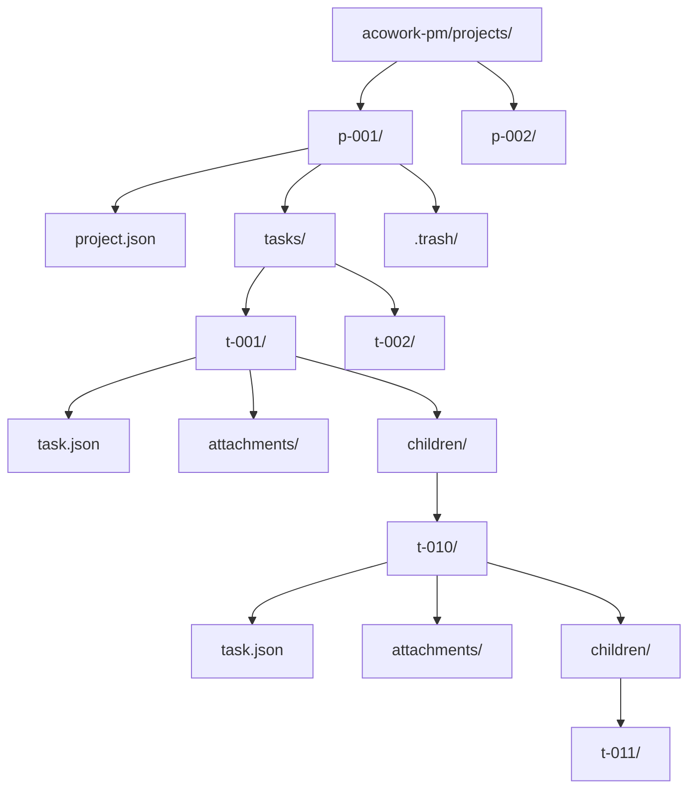
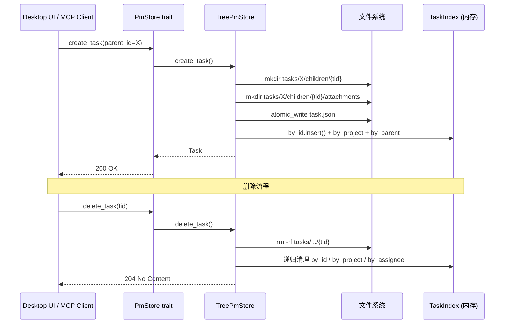

# ADR-061：acowork-pm 存储选型 — 目录树 + 物理嵌套即权威 + 零冗余字段

**状态**：已定案
**日期**：2026-08-31
**决策者**：大鱼
**前置**：
- [设计文档 v0.2：21-pm-project-management](../design/zh/21-pm-project-management.md) §3
- [开发计划 v0.3：pm-dev-plan](../plan/zh/pm-dev-plan.md)
- [UX 设计 v0.1：22-pm-desktop-ui](../design/zh/22-pm-desktop-ui.md)
- [ADR-051：Runtime Memory Provider 解耦](./ADR-051-runtime-memory-provider-decoupling.md)（相似的"存储抽象 + trait 解耦"思路）

---

## 1. 决策摘要

`acowork-pm`（项目管理服务）的持久化采用**目录树 + 物理嵌套即权威 + 零冗余字段**三件套设计：

1. **目录树**：一个项目 = 一棵完整目录树，项目元数据 + 任务目录 + 附件目录均在同一棵树下，**不**走平铺 + 索引方案。
2. **物理嵌套即权威**：父子任务关系**完全**由文件系统嵌套表达——子任务强制放在父任务的 `children/` 子目录下。**不**靠 `task.json` 字段推断。
3. **零冗余字段**：`task.json` 不包含 `parent_id` / `subtask_ids` / `subtask_count` —— 父子关系完全靠物理位置表达，**无任何双写可能**。
4. **任务恒为目录**：所有任务（包括叶子）都是目录，不用"文件 vs 目录"二态，避免未来扩展时的形态转换。
5. **附件独立目录**：二进制文件存于 `{task_dir}/attachments/{att_id}/`，元数据在 `task.json`，**二进制绝不进 JSON**。
6. **依赖关系显式存**：`depends_on` 字段存于 `task.json`——跨树/跨项目的关系无法从物理结构推导，必须显式声明。

这套组合是经过**四次方案迭代**后确定的最终决策（详见 §2.2 演进路径），核心诉求是：

> **字面 = 逻辑**。`ls` 一个项目就能看完整结构，无需解析 JSON；删除/移动是单一原子目录操作；崩溃后 `walkdir` 重建索引幂等。

---

## 2. 背景与现状

### 2.1 三种候选方案

| 方案 | 描述 | 字面清晰度 | 扩展性 | 删/移复杂度 | 索引成本 |
|------|------|-----------|--------|------------|----------|
| **A：一项目一 JSON** | `projects/{pid}.json` 含 tasks 数组 | ❌ JSON 解析才知道结构 | ❌ 单文件 IO 爆炸 | ✅ 单文件写 | ✅ 内存读 |
| **B：平铺 + JSON 索引** | `tasks/{tid}.json` 平铺，parent_id 字段关联 | ❌ 平铺看不出树 | ✅ 单任务 IO | ⚠️ 删父要遍历更新子 parent_id | ⚠️ 反向依赖图必扫盘 |
| **C：目录树 + 物理嵌套（决策）** | `tasks/{tid}/children/{child_tid}/` | ✅ `ls` 即树 | ✅ 单任务 IO + 子树原子 | ✅ `mv` / `rm -rf` 0 文件写 | ✅ walkdir 重建幂等 |

### 2.2 演进路径（四次讨论收敛）

```text
轮次1: 一项目一 JSON 粗暴？
        ↓ 用户异议 → 全部改成平铺 ❌ 平铺看不出树
轮次2: 目录树方案 ✓
        ↓ 子任务直接在父目录下不行吗？ → 试过但名字冲突风险
轮次3: 加 children/ 子目录 ✓ + task.json 带 subtask_ids 双写
        ↓ 用户：算了双写也不要了，零冗余更干净
轮次4: 最终：目录树 + children/ + 零双写 ✓
```

**关键反对意见时间线**：

| 时间 | 异议 | 回应 |
|------|------|------|
| 2026-08-29 | "一项目一 JSON 太粗暴，不利于扩展" | ✅ 切换到目录树 |
| 2026-08-29 | "所有 tasks 平铺，依赖 JSON 解析才知关系" | ✅ 物理嵌套即权威 |
| 2026-08-29 | "attachment 也归入各自项目目录" | ✅ 附件独立目录 |
| 2026-08-30 | "有必要加 children/ 么？" | ✅ 加，避免命名冲突 + 显式边界 |
| 2026-08-30 | "task.json 带 subtask_ids 列表不就搞定了么" | ⚠️ 短暂尝试，引入双写 |
| 2026-08-30 | "算了双写也不要了，children/ 隔离更简洁" | ✅ 零冗余字段最终定案 |

### 2.3 关键反对意见的根因

四个核心诉求（来自用户原始 message）：

> 1. 任务要支持前置依赖
> 2. 任务要支持类型（checkpoint / milestone 等）
> 3. 任务可能是 bug 单，要支持多个图片附件
> 4. 任务要支持树状父子结构

这些诉求里：

- ① 依赖图：跨树逻辑关系，无法从物理结构推导 → 必存字段（`depends_on`）
- ② 任务类型：纯字段值，无存储影响
- ③ 多附件：二进制不能进 JSON → 独立目录 + 元数据
- ④ 父子树：物理嵌套即天然满足 → 强制走 `children/`

**结论**：只有 ①③ 需要"非物理结构"，其余 ②④ 都被目录树天然吸收。

### 2.4 既有约束

| 约束 | 来源 | 对存储方案的影响 |
|------|------|------------------|
| 千任务级别规模 | 开发计划 v0.3 §11 估算 | 内存索引 + walkdir 重建（<1s）足够 |
| 跨平台（Windows / macOS / Linux） | Gateway 客户端分布 | `tokio::fs` + `rename` 同 FS 原子 |
| 单用户单进程 | 当前阶段部署形态 | **不需要**考虑并发写冲突；未来加锁不迟 |
| Agent MCP 调用 | §6 MCP 工具表 | 接口层用 `PmStore` trait，存储层切换对 MCP 透明 |
| Desktop UI 直接读 task.json | UX §3.4 | 字段扁平 + `serde_json` 直接渲染 |

---

## 3. 目标架构

### 3.1 目录树形态

```text
<root>/data/acowork-pm/
└── projects/
    └── {project_id}/                          # ← 一个项目 = 一棵完整目录树
        ├── project.json                       #   项目元数据
        └── tasks/
            ├── {root_task_id}/                #   根任务
            │   ├── task.json
            │   ├── attachments/
            │   │   └── {att_id}/
            │   │       ├── original.{ext}
            │   │       └── thumb.jpg          #   仅图片
            │   └── children/                  #   ← 子任务隔离层（按需创建）
            │       ├── {child_task_id}/
            │       │   ├── task.json
            │       │   ├── attachments/
            │       │   └── children/          #   递归嵌套（深度 ≤ 5）
            │       │       └── {grandchild_task_id}/
            │       │           └── ...
            │       └── {another_child_task_id}/
            │           └── ...
            └── {another_root_task_id}/        #   兄弟根任务
                └── ...
```

可视化：



### 3.2 核心不变量

| 不变量 | 保证机制 | 违反后果 |
|--------|----------|----------|
| 任务恒为目录 | `create_task` 强制 `mkdir` + `task.json` | 不允许，未来扩展时不会遇到"文件转目录"迁移 |
| 子任务在 `children/` | `reparent` / `create_task` 强制路径拼接 | 不允许，会失去 `ls` 清晰度 |
| `task.json` 不含父子字段 | `serde` schema 拒绝 `parent_id` 等字段 | 一旦发现即视为数据损坏 |
| `depends_on` 必须显式 | 创建/更新时校验 + 循环检测 | 跨树关系无法推导，必须存 |
| 删任务 = 删目录树 | `rm -rf` + 子树索引批量清理 | 不允许"软删孤儿节点" |
| Reparent = `mv` 目录 | 单调 `fs::rename`，跨 FS 时 copy+remove | 不允许"修改多个 task.json 的 parent_id" |

### 3.3 数据流



---

## 4. 决策

### 决策 1：采用目录树方案（C 方案）

**决策**：`projects/{pid}/tasks/{tid}/.../` 目录树形态，单项目独立完整子树。

**理由**：
- **字面 = 逻辑**：`ls -R p-xxx/tasks/` 直接看到完整树形，调试零成本
- **项目原子化**：单项目备份/迁移 = `tar` 一棵子树，无需协调多个文件
- **天然契合父子关系**：物理嵌套直接表达父子，无需推导
- **跨平台统一**：`tokio::fs` + `PathBuf` 抽象，Windows / macOS / Linux 行为一致

**被拒方案 A**：一项目一 JSON
- ❌ 单文件 IO 爆炸（千任务项目每次 claim 都全量写）
- ❌ 跨任务关系遍历慢（要解析整个 JSON）
- ❌ 附件无法内嵌（二进制 base64 让 JSON 膨胀）

**被拒方案 B**：平铺 + JSON 索引
- ❌ **直接违背用户最初诉求**："平铺看不出树，完全依赖 JSON 解析"
- ❌ 关系漂移风险（list/parent_id 失同步）
- ❌ 删父任务需遍历全部任务修改 `parent_id`，非原子

### 决策 2：物理嵌套即权威，零冗余字段

**决策**：`task.json` **不**包含 `parent_id` / `subtask_ids` / `subtask_count`。父子关系**完全**靠物理位置表达。

**理由**：
- **零双写 = 零不一致**：物理位置是单一真相源，JSON 字段无冗余 → 无漂移可能
- **崩溃恢复幂等**：`walkdir` 重建索引时不需要"修复"任何字段（无字段可修）
- **简化写路径**：创建子任务只写 1 个文件（子任务 `task.json`），不写父
- **简化 reparent**：`mv` 一个目录，0 文件写

**被拒方案**：task.json 带 `subtask_ids` 列表
- ❌ 用户主动否决："算了双写也不要了"
- ❌ 引入四种操作（创建/删除/reparent/update）的双写一致性维护
- ❌ 列表大小爆炸风险（父任务 1000+ 子任务时 JSON 巨大）

### 决策 3：`children/` 隔离子目录（而非同级直挂）

**决策**：子任务强制放在父任务的 `children/` 子目录下，**不**直接与父任务的元数据文件同级。

**理由**：
- **命名空间隔离**：父任务的 `task.json` / `attachments/` 等保留名永远不会与子任务 ID 冲突
- **物理边界**：`fs::read_dir(parent/children)` 一行拿全部子任务，无需过滤保留名
- **目录深度可读**：5 层嵌套时路径 `tasks/t-001/children/t-010/children/t-011/...` 比 `tasks/t-001/t-010/t-011/...` 更易读
- **删除边界**：`rm -rf parent/children/{tid}` 不影响父任务的 `task.json`

**被拒方案**：同级直挂（`tasks/t-001/t-010/...`）
- ⚠️ 深度 5 时路径仅 9 段（vs 12 段）
- ❌ 命名约定脆弱：保留名 vs 任务 ID 需硬编码校验
- ❌ `fs::read_dir(parent)` 需过滤保留名 + `t-*` 前缀，代码复杂
- ❌ 调试时易混淆"父任务内容" vs "子任务目录"

### 决策 4：任务恒为目录（不用文件形态）

**决策**：所有任务（包括叶子）都用目录表达，目录内一定有 `task.json`。

**理由**：
- **形态统一**：未来加子任务时不需要"文件 → 目录"转换
- **附件目录总是同构存在**：`attachments/` 在创建任务时就 `mkdir`，避免后续 `mkdir` race
- **删除一致**：`rm -rf` 一个目录总是安全的，无需判别文件/目录

**被拒方案**：叶子用 `.json` 文件、父任务用目录
- ❌ 引入分支：读/写/删都要先判别形态
- ❌ 形态转换的迁移路径复杂（何时触发？批量还是 lazy？）

### 决策 5：附件独立目录，task.json 仅存元数据

**决策**：二进制文件存于 `{task_dir}/attachments/{att_id}/original.{ext}`，`task.json` 仅存元数据（id / filename / size / sha256 / paths）。

**理由**：
- **二进制不入 JSON**：避免 base64 内嵌导致 task.json 膨胀
- **附件跟随任务**：删任务 = `rm -rf` 整个任务目录，附件原子级清理
- **SHA-256 去重**：多个任务引用同一附件时，物理文件可复用，元数据多份
- **缩略图独立**：`thumb.jpg` 与 `original.{ext}` 同级，UI 渲染时优先用缩略图

**被拒方案**：附件 base64 内嵌 task.json
- ❌ JSON 体积爆炸（10MB 图片 base64 = 13MB 字符串）
- ❌ 备份/同步成本剧增
- ❌ 编辑 task.json 时每次都要重写整个附件 base64

### 决策 6：`depends_on` 显式存储

**决策**：依赖关系存于 `task.json` 的 `depends_on` 字段，**跨树跨项目皆可声明**。派生字段（`is_blocked` / `blocked_by`）**不**持久化，API 响应层实时计算。

**理由**：
- **依赖是逻辑关系**：跨树/跨项目的依赖无法从物理结构推导
- **派生不持久化**：避免与源数据双写，运行时按 `depends_on` + 状态计算
- **循环检测**：创建/更新时 DFS 检测，深度限制 10 防恶意
- **运行时反向图**：内存索引维护 `blocked_by` map，O(1) 查询

**被拒方案**：物理嵌套表达依赖
- ❌ 依赖是图（任意对任意），不是树
- ❌ 物理嵌套只能表达 1-to-N（父→子），不能 N-to-1（依赖）

---

## 5. 替代方案总览（被拒绝）

| # | 方案 | 拒绝理由（核心） |
|---|------|------------------|
| A | 一项目一 JSON | 单文件 IO 爆炸、跨任务遍历慢、二进制无法内嵌 |
| B | 平铺 + JSON 索引 | 违背"字面=逻辑"诉求、关系漂移风险 |
| C | 任务二态（叶子文件 / 父任务目录）| 引入分支、形态转换迁移复杂 |
| D | `subtask_ids` 双写 | 用户主动否决、双写一致性维护负担 |
| E | 附件 base64 内嵌 | JSON 体积爆炸、备份成本剧增 |
| F | 物理嵌套表达依赖 | 依赖是图不是树 |
| G | 全部走 SQLite | YAGNI：千任务规模无需重型存储；P5+ 再切 |

---

## 6. 后果

### 6.1 正面后果

| 维度 | 收益 |
|------|------|
| **简单性** | `ls -R` = 完整结构；调试无需工具 |
| **可演进** | `PmStore` trait 抽象；P5+ 可无侵入切换 SQLite |
| **可回滚** | 项目级备份/恢复 = `tar` 一棵子树 |
| **跨平台** | `tokio::fs` + `PathBuf` 统一抽象 |
| **崩溃恢复** | walkdir 重建索引幂等；无"修复"逻辑（无字段可漂移）|
| **删除/移动** | `rm -rf` / `mv` 单一原子操作；O(1) 文件写 |
| **备份策略** | `rsync --delete` / `git init` / `borg create` 都自然工作 |

### 6.2 负面后果 / 已知限制

| 限制 | 影响 | 缓解策略 |
|------|------|----------|
| **跨 FS reparent** | `fs::rename` 跨 mount point 失败 | `atomic.rs::rename_or_fallback`：copy + remove |
| **千任务规模** | walkdir 全量重建 ~1s | 启动期可接受；超阈值切 SQLite |
| **并发写** | 单进程假设下无锁；多进程会冲突 | 当前阶段单进程；未来加 `flock` 或走 SQLite WAL |
| **附件缩略图** | 上传时 CPU 成本（256x256 JPEG 生成）| 后台任务 + 缓存；feature flag 可关 |
| **深度限制 5** | UI 折叠层数合理但硬限制 | 配置项 `max_task_depth` 可调（默认 5）|
| **依赖图规模** | O(N²) 关系在千节点内可接受 | 超阈值切图数据库（grafeo） |

### 6.3 取舍平衡

| 决策 | 权衡什么 | 换取什么 |
|------|----------|----------|
| 目录树 vs 平铺 | 写路径略复杂（每次 mkdir） | 字面清晰 + 项目原子化 |
| 零冗余 vs 双写 | 无法用 `subtask_ids` 直接排序展示 | 零漂移风险 + 崩溃恢复幂等 |
| 物理嵌套 vs 物理平铺 | 子任务在 `children/` 而非同级 | 命名空间隔离 + 删除边界 |
| 任务恒为目录 vs 文件 | 多一层 `mkdir` + 目录节点 | 形态统一 + 未来无迁移 |

---

## 7. 实施

### 7.1 阶段分配（开发计划 v0.3 对齐）

| 阶段 | 任务 | 状态 |
|------|------|------|
| **P0** | scaffold `core/acowork-pm/` crate + 目录树骨架 + types + config + trait 默认实现 | ✅ 已完成 |
| **P1** | `rebuild_index` walkdir + Project/Task CRUD + 父子树创建/删除/移动 + 路径校验 | ⏳ 待开工 |
| **P2** | Desktop UI 集成（zustand store + 看板视图 + 父子树面板 + 附件预览）| ⏳ 待开工 |
| **P3** | MCP `pm_*` 工具完整实现 + 依赖图 + lifecycle（claim/submit/review） | ⏳ 待开工 |
| **P4** | E2E 测试 + 设计文档 v1.0 收口 + 部署 runbook | ⏳ 待开工 |
| **P5+** | SQLite 后端（替换 `TreePmStore`）+ 跨进程锁 | 🔮 未来 |

### 7.2 关键代码位置

| 路径 | 角色 |
|------|------|
| [`core/acowork-pm/src/store/tree.rs`](../../core/acowork-pm/src/store/tree.rs) | `TreePmStore` 实现 + `PmStore` trait |
| [`core/acowork-pm/src/store/index.rs`](../../core/acowork-pm/src/store/index.rs) | 二级内存索引（按 project / assignee / 状态 / 反向依赖图）|
| [`core/acowork-pm/src/store/atomic.rs`](../../core/acowork-pm/src/store/atomic.rs) | 原子写 + 路径校验工具 |
| [`core/acowork-pm/src/types.rs`](../../core/acowork-pm/src/types.rs) | 核心领域类型（**不含**父子字段）|

### 7.3 验证清单

- [ ] 编译通过（`cargo check -p acowork-pm`）✅ P0 已完成
- [ ] 烟雾测试通过（11 lib + 5 smoke test）✅ P0 已完成
- [ ] Walkdir 重建索引幂等性测试（崩溃 → 重启 → 索引与磁盘一致）
- [ ] 父子树创建/删除/移动 roundtrip 测试
- [ ] Reparent 循环检测（DFS）测试
- [ ] 附件上传/下载/sha256 一致性测试
- [ ] 跨 FS reparent fallback 测试（用 tmpfs 模拟）
- [ ] 千任务级别索引重建性能测试（<1s）

---

## 8. 开放问题（已收口）

| 问题 | 决策 | 决定于 |
|------|------|--------|
| children/ 还是同级直挂？ | **children/** | 2026-08-30（设计对话） |
| 双写 subtask_ids 是否保留？ | **零冗余字段** | 2026-08-30（设计对话） |
| 任务形态：文件 vs 目录？ | **恒为目录** | 2026-08-29（设计对话） |
| 附件：内嵌 vs 独立？ | **独立目录 + 元数据** | 2026-08-29（设计对话） |
| 依赖如何存储？ | **显式 depends_on + 派生不存** | 2026-08-29（设计对话） |
| 跨项目依赖是否允许？ | **允许** | 2026-08-31（开发计划决策记录） |
| 删父任务语义？ | **默认级联删除 + 提升子任务可选** | 2026-08-31（开发计划决策记录） |

---

## 9. 引用链

- **设计文档**：[`docs/design/zh/21-pm-project-management.md`](../design/zh/21-pm-project-management.md) §3 数据模型
- **UX 设计**：[`docs/design/zh/22-pm-desktop-ui.md`](../design/zh/22-pm-desktop-ui.md) §3 视图布局（"目录即树"心智模型贯穿 UI 设计）
- **开发计划**：[`docs/plan/zh/pm-dev-plan.md`](../plan/zh/pm-dev-plan.md) §3.1 阶段分配 + §8 决策记录
- **crate README**：[`core/acowork-pm/README.md`](../../core/acowork-pm/README.md)（存储形态描述引用本 ADR）
- **相似 ADR**：[`docs/adr/zh/ADR-051`](./ADR-051-runtime-memory-provider-decoupling.md)（同样是存储抽象 + trait 解耦思路，可借鉴）

---

**变更记录**：
- 2026-08-31：初版（v1.0）—— 整合 P0 设计对话全部决策