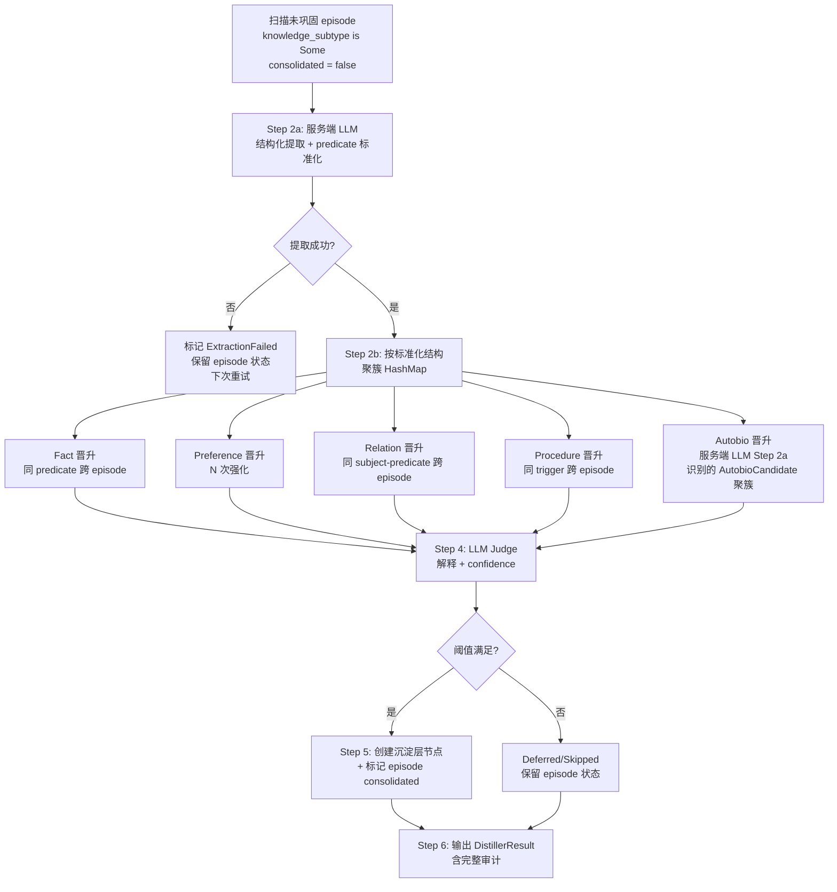

# ADR-068:记忆两轴正交化与离线蒸馏器重构(Episodic-as-Source-of-Truth)

**状态**:草案(待评审)
**日期**:2026-09
**决策者**:大鱼
**前置**:
- [ADR-051](./ADR-051-runtime-memory-provider-decoupling.md)(Runtime 与 Grafeo 解耦)
- [ADR-057](./ADR-057-compaction-distillation-into-graph.md)(压缩蒸馏入图,triples 撤回)
- [ADR-062 §0、§6.2.1](./ADR-062-memory-quality-config-and-retrieval-gate.md)(记忆质量门禁、keyword sanitize)
- [05-memory.md §0、§2、§3、§4](../design/zh/05-memory.md)(分层与巩固设计基线)

---

## 0. 一句话总结

当前系统把"记忆分层"与"记忆分类"耦合在沉淀层节点(KnowledgeNode/ProceduralNode/AutobiographicalNode)里,导致 LLM 必须直写沉淀层,污染了数据质量。本 ADR 把两轴解耦:

1. **LLM 写入端**:**唯一**写入经历层(`Episode`),用新增的 `knowledge_subtype` 字段标注分类。LLM 只写自然语言 `content`,**不**要求显式填 `subject/predicate/object/trigger_condition/action_pattern` 等结构化字段。
2. **沉淀层节点**:**只**由离线蒸馏器从经历层 Episode 晋升产生。结构化提取在蒸馏器内由服务端 LLM 批量完成(不是 LLM 工具调用边界的事)。
3. **`memory_store` 工具 schema 收窄到 `fact` / `preference` / `relation` / `procedure`,全部写到 Episodic,不再直写 KnowledgeNode/ProceduralNode**。LLM 视角的工具界面跟现状几乎一致,只是少了 autobiographical 选项。
4. **`AutobiographicalNode` 完全从 LLM 写入端移除**,只由 `manifest` bootstrap + 离线归纳器维护。
5. **离线蒸馏器**(新组件 `EpisodicDistiller`)是沉淀层节点的**唯一**生产者,按 `fact` / `preference` / `relation` / `procedure` / `limitation` / `relationship` / `history` 七类分别有晋升策略。

---

## 1. 问题陈述(为什么必须改)

### 1.1 病根:两轴耦合

当前 schema 把分类轴全部压到沉淀层:

```
Episodic (经历层)         ← 无分类字段,只能存"对话片段"
  ├─ content / role / session_id / timestamp
  └─ importance / metadata

KnowledgeNode (沉淀层)   ← 分类全在这里
  ├─ sub_type: Fact | Preference | Relation
  └─ 字段: subject / predicate / object

ProceduralNode (沉淀层)
  └─ 字段: trigger_condition / action_pattern

AutobiographicalNode (沉淀层)
  └─ category: Identity | Capability | Limitation | Preference | History | Relationship
```

**结果**:LLM 想表达"用户偏好简洁回复"时,经历层 `Episode` 没有"偏好"子类型字段,**只能被迫直写沉淀层 `KnowledgeNode{sub_type=Preference}`**。这就是 ADR-051 评审中暴露的"LLM 写入沉淀层"病根的真正源头。

### 1.2 历史诊断回顾(本 ADR 的论证基础)

| 之前的诊断 | 是否准确 | 本 ADR 修正 |
|---|---|---|
| "LLM 在单对话上下文内无法判断 milestone" | ✅ 准确 | 保留 — 关闭 LLM → autobiographical/History 直写 |
| "AutobiographicalNode 不参与遗忘,污染会自传播" | ✅ 准确 | 保留 — autobiographical 仅由离线归纳器写入 |
| "LLM 写 Procedural 不可控" | ✅ 准确 | 保留 — ProceduralNode 仅由离线 generalization 晋升 |
| "Episodic 是账本,Knowledge 是精炼" | ✅ 准确 | 保留 — 但**两者必须通过分类字段桥接**,而不是直写沉淀层 |
| "memory_store 工具 schema 暴露 autobiographical 让 LLM 写入自我叙事" | ✅ 准确 | 修正 — 应当**完全移除 autobiographical**,autobiographical 只由内部 bootstrap + 离线归纳 |

### 1.3 现在的死结(再不改就会累积)

```
Episodic                    Semantic (沉淀层)
─────────                   ──────────────
无分类字段 ──X──LLM 无法分类──X──> KnowledgeNode/ProceduralNode
                                ↑
                                └── 只能 LLM 直写沉淀层
                                      ↑
                                      └── 数据质量无保障
                                            ↑
                                            └── 污染自传播(autobiographical 不衰减)
```

---

## 2. 决策(本 ADR 要做什么)

### 2.1 两轴正交矩阵

|            | **经历层 (Episodic)** | **沉淀层 (Semantic)** |
|------------|----------------------|----------------------|
| **Fact**       | ✅ LLM 写入,`knowledge_subtype=Fact` | ✅ 离线晋升 |
| **Preference** | ✅ LLM 写入,`knowledge_subtype=Preference` | ✅ 离线晋升 |
| **Relation**   | ✅ LLM 写入,`knowledge_subtype=Relation` | ✅ 离线晋升 |
| **Procedure**  | ✅ LLM 写入,`knowledge_subtype=Procedure` | ✅ 离线晋升(generalization) |
| **Identity**   | ❌ 不写 | ✅ 仅 manifest bootstrap |
| **Capability** | ❌ 不写 | ✅ 仅 manifest bootstrap |
| **Limitation**(自传) | ❌ LLM 不标注(LLM 工具界面无 autobiographical 概念) | ✅ EpisodicDistiller Step 2a 服务端 LLM 自动从 fact/relation/feedback 类 episode 中识别 |
| **Preference**(自传) | ❌ LLM 不标注 | ✅ 同上 |
| **Relationship**(自传) | ❌ LLM 不标注 | ✅ 同上 |
| **History**(自传) | ❌ 不写 | ✅ 仅事件触发(无 episode 输入,见 §3.4.2 Step 3 History 路径) |

### 2.2 实施规则

| 规则 | 内容 |
|---|---|
| **R1** | LLM `memory_store` 工具写入端**只能写 Episodic**;不允许任何路径直达 `KnowledgeNode`/`ProceduralNode`/`AutobiographicalNode` |
| **R2** | `Episodic.knowledge_subtype` 是 `Option<KnowledgeSubType>`,None 表示纯对话片段(不参与晋升) |
| **R3** | 沉淀层节点只能由 `EpisodicDistiller`(新组件)产生;`process_memory_store`/`process_knowledge`/`process_procedure` 三个函数**删除** |
| **R4** | `EpisodicDistiller` 是离线批处理,**必须**接收 `TripleExtractorLlm`(同 `generalization.rs`),且每个晋升决策必须有可解释的证据链 |
| **R5** | `AutobiographicalNode` 写入端:仅 `bootstrap_autobiographical_from_manifest`(启动期)+ 离线归纳;`memory_store` schema 完全移除 `autobiographical` 选项,**且不暴露任何 autobiographical 候选字段给 LLM**;autobiographical 候选由 EpisodicDistiller Step 2a 服务端 LLM 自动识别 |
| **R6** | `compress_history_nodes` / `derive_autobiographical_key` 的 History nanos 分支 / `process_autobiographical` 的 LLM 入口路径 — **全部删除** |
| **R7** | 沉淀层节点保留 `source_episode_id`(单值) + 新增 `source_episode_ids: Vec<u64>`(多值,表达"从 N 个 episode 综合晋升");两者并存,前者为兼容字段 |
| **R8**(本 ADR 修正版) | EpisodicDistiller Step 2a 的服务端 LLM **不**使用受控谓词词汇表;谓词自由生成,聚簇通过 embedding 相似度(余弦 ≥ 0.85)进行,不依赖字符串相等 |

### 2.3 非目标(本 ADR 不做)

- 不重写 Episodic 现有检索路径(HNSW + BM25 保持)
- 不改变 `Episodic` 14 天 + 巩固后 7 天的衰减规则
- 不引入新的 LLM 训练/微调
- 不动 `AutobiographicalNode` 现有 `Identity`/`Capability` 的 manifest bootstrap 路径
- 不实现"Observation Pool + Retrospective Evaluator"作为独立 ADR(本 ADR 用统一的 `EpisodicDistiller` 解决)

---

## 3. 设计详解

### 3.1 `Episode` schema 扩展(`core/acowork-memory/src/types.rs:391`)

```rust
pub struct Episode {
    // === 原有字段(保持不变)===
    pub session_id: String,
    pub turn_index: u32,
    pub role: String,                            // "user" | "assistant" | "tool"
    pub content: String,
    pub embedding: Option<Vec<f32>>,
    pub timestamp: DateTime<Utc>,
    pub consolidated: bool,                       // ← 语义扩展:晋升后置 true
    pub metadata: HashMap<String, serde_json::Value>,
    pub importance: f32,

    // === 新增字段(本 ADR 修正版,只剩 1 个)===
    /// Optional knowledge classification set by LLM when writing through
    /// memory_store tool. None = pure dialogue fragment (no classification,
    /// never promoted). Some = "this episode carries an observation that
    /// may be promoted to semantic layer by EpisodicDistiller".
    pub knowledge_subtype: Option<KnowledgeSubType>,

    // ❌ 设计取舍 1:subject / predicate / object(三元组)、trigger_condition /
    //   action_pattern(过程模式)这 5 个字段**不在 Episode schema 中**。
    //   LLM 工具界面不暴露,服务端 LLM 在 EpisodicDistiller 离线提取。

    // ❌ 设计取舍 2:`candidate_autobio_aspect` 字段**也不在 Episode schema 中**。
    //   autobiographical 候选识别由服务端 LLM 在 Step 2a 同一次调用中自动判断,
    //   LLM 工具界面**完全没有 autobiographical 概念**。这样才能彻底断绝
    //   "LLM 在单点 tool call 时刻做自我叙事判断"的反模式。
}
```

**关键约束**:

1. **向后兼容**:唯一新增字段 `knowledge_subtype` 是 `Option`,旧 episode 数据零迁移成本加载,默认 `None` 表示"纯对话片段"。
2. **LLM 工具界面零学习成本**:`memory_store` 工具不暴露:
   - 任何结构化字段(`subject` / `predicate` / `object` / `trigger_condition` / `action_pattern`)
   - 任何 autobiographical 概念(`candidate_autobio_aspect` 也不存在)
   LLM 只需提供 `content` + `category`(4 选 1)。
3. **现有被动写入路径不变**:compaction 蒸馏 → `record_distilled` → `store_episode`,新增字段为 `None`(不破坏 compaction 输出语义)。
4. **`EpisodicDistiller` 只晋升 `knowledge_subtype.is_some()` 的 episode**;纯对话片段永远停留在经历层。
5. **服务端结构化提取**(`ExtractedStructure` / `ExtractedKind`,见 §3.4.2 Step 2a)只在蒸馏器内存中存在,**不**持久化。原因:服务端 LLM 输出 schema 升级时不需要做数据迁移。
6. **Autobiographical 候选识别**全部在 EpisodicDistiller Step 2a 的服务端 LLM 同一次调用中完成(`ExtractedKind::AutobioCandidate` 变体),**不**依赖 Episode 上的字段。

### 3.2 `memory_store` 工具 schema 重写(`core/acowork-runtime/src/tools/builtin/memory_store.rs`)

**核心原则**:**LLM 工具界面零学习成本** —— 跟现状几乎一致,只移除 autobiographical + 把内容写清楚。

```json
{
  "type": "object",
  "properties": {
    "content": {
      "type": "string",
      "description": "Natural language description of what to remember. \
                      Be specific and factual. Examples: \
                      - 'User lives in Shanghai' \
                      - 'User prefers concise replies' \
                      - 'When user asks for weather, use http_request to call wttr.in' \
                      - 'You are too verbose' (feedback about the agent)"
    },
    "category": {
      "type": "string",
      "enum": ["fact", "preference", "relation", "procedure"],
      "description": "Knowledge classification. The tool writes to the \
                      Episodic layer with knowledge_subtype=category. \
                      Promotion to the semantic layer happens offline via \
                      EpisodicDistiller — this tool does NOT create \
                      KnowledgeNode/ProceduralNode/AutobiographicalNode \
                      directly. NOTE: feedback about the AGENT itself \
                      (e.g. 'you're too verbose') should still be written \
                      using category=preference or category=fact — the \
                      server-side distiller will detect autobiographical \
                      relevance offline."
    },
    "confidence": {"type": "number", "description": "0.0-1.0"},
    "importance": {"type": "number", "description": "0.0-1.0, default 0.5"},
    "privacy": {"type": "string", "enum": ["public", "personal", "sensitive"]},
    "keywords": {"type": "array", "items": {"type": "string"},
                 "description": "Sanitized at boundary (ADR-062 §6.2.1)"}
  },
  "required": ["content", "category"]
}
```

**关键约束**:

1. **`autobiographical` 选项完全移除**(原 `memory_store.rs:85` enum 5 项 → 4 项)。
2. **`aspect` 字段移除**(`memory_store.rs:88-93`),`key`/`source` autobiographical 专用字段一并移除(`memory_store.rs:95-103`)。
3. **`subject` / `predicate` / `object` / `trigger_condition` / `action_pattern` 全部不暴露给 LLM**(本 ADR 修正版关键点)。这些字段仅在 EpisodicDistiller 内部由服务端 LLM 提取,持久化在沉淀层节点上,不在 Episode 上。
4. **`candidate_autobio_aspect` 字段不暴露给 LLM**(本 ADR 二次修正 — 用户评审指出的死灰复燃)。autobiographical 候选识别由 EpisodicDistiller Step 2a 服务端 LLM 在同一次调用中自动判断,LLM 工具界面**完全没有 autobiographical 概念**。
5. **`parse_category` 函数更新**:从 5 项 → 4 项,移除 autobiographical 解析(`memory_store.rs:147-163`)。
6. **错误消息更新**:`memory_store.rs:191` 和 `:206` 两处错误消息移除 `autobiographical` 提及(注:当前两处错误消息不一致,M5 一起统一)。
7. **新行为**:所有 4 类都走 `provider.store_episode()`,只填 `knowledge_subtype`,**不**解析任何结构化字段,**不**记录任何 autobiographical 候选标记。

### 3.3 删除的代码路径

| 位置 | 当前 | 删除原因 |
|---|---|---|
| [`instant.rs:181-182`](../../core/acowork-grafeo/src/consolidation/instant.rs#L181) | `if let Some(ref autobio) = input.autobiographical { return process_autobiographical(...); }` | LLM 不再传 autobiographical |
| [`instant.rs:185-187`](../../core/acowork-grafeo/src/consolidation/instant.rs#L185) | `if matches!(input.sub_type, KnowledgeSubType::Procedure) { return process_procedure(...); }` | Procedural 不再由 LLM 直写 |
| [`instant.rs:152-200`](../../core/acowork-grafeo/src/consolidation/instant.rs#L152) 整段 `process_memory_store` | LLM 写入 → 沉淀层 完整 pipeline | 整段删除,LLM 入口只调 `store_episode` |
| [`instant.rs:340-440`](../../core/acowork-grafeo/src/consolidation/instant.rs#L340) `process_procedure` | ProceduralNode 创建 | 删除,改由 `EpisodicDistiller` 调 `store_procedural` |
| [`instant.rs:448-525`](../../core/acowork-grafeo/src/consolidation/instant.rs#L448) `process_autobiographical` | autobiographical 写入 | 删除,改由 `EpisodicDistiller` + manifest bootstrap 调用 |
| [`instant.rs:79-91`](../../core/acowork-grafeo/src/consolidation/instant.rs#L79) `derive_autobiographical_key` History nanos 分支 | append-only milestone key | 删除,History 完全由离线归纳器决定 |
| [`offline.rs:225`](../../core/acowork-grafeo/src/consolidation/offline.rs#L225) `compress_history_nodes` | 10 条 History 自动合并 | 删除,旧设施下线 |
| [`offline.rs:718-810`](../../core/acowork-grafeo/src/consolidation/offline.rs#L718) 相关单测 | History 合并测试 | 删除 |
| [`memory_store.rs:18-26`](../../core/acowork-runtime/src/tools/builtin/memory_store.rs#L18) `AUTOBIO_DEFAULT_CONFIDENCE` 常量 | autobiographical 默认 0.85 | 删除 |
| [`memory_store.rs:214-256`](../../core/acowork-runtime/src/tools/builtin/memory_store.rs#L214) autobiographical input 装配 | autobiographical 参数解析 | 删除 |
| [`memory_store.rs:855-1057`](../../core/acowork-runtime/src/tools/builtin/memory_store.rs#L855) autobiographical 单测 4 个 | schema 行为测试 | 删除 |
| [`distill.rs:5-12`](../../core/acowork-grafeo/src/consolidation/distill.rs#L5) 注释 | "knowledge updates now flow through memory_store tool / procedural creation paths" | **改写**:明确"LLM 入口仅写 Episodic,沉淀层由 EpisodicDistiller 离线产生" |
| `generalization.rs::generalize_patterns_with_config` 中扫描 input | 当前从 episodic + (action, tool_calls) 元组提取 | **改造**:扫描 `Episode.knowledge_subtype=Procedure` 的节点,从 `content` 由服务端 LLM 提取 `(trigger_condition, action_pattern)`,**不再**依赖 Episode 上的结构化字段 |

### 3.4 `EpisodicDistiller` 设计(本 ADR 的核心)

#### 3.4.1 组件位置与接口

```
core/acowork-grafeo/src/consolidation/distiller.rs   (新文件)
core/acowork-memory/src/consolidation.rs              (新增 DistillerConfig / DistillerResult 类型)
```

```rust
// core/acowork-memory/src/consolidation.rs
pub struct DistillerConfig {
    /// Max episodes scanned per distillation run.
    pub batch_size: usize,                  // default 100
    /// Min episodes per (predicate) cluster required to promote a Fact.
    pub fact_min_evidence: usize,           // default 2 (same predicate, different episodes)
    /// Min episodes required to promote a Preference.
    pub preference_min_evidence: usize,     // default 3 (need reinforcement)
    /// Min episodes required to promote a Relation.
    pub relation_min_evidence: usize,       // default 2
    /// Min episodes required to promote a Procedure.
    pub procedure_min_evidence: usize,      // default 5
    /// Min episodes + min span (days) required to promote autobiographical.
    pub autobio_min_evidence: usize,        // default 3
    pub autobio_min_span_days: i64,         // default 14
    /// Min LLM confidence for promotion (LLM judge output).
    pub promotion_confidence_threshold: f32,// default 0.85
    /// LLM temperature for promotion decisions.
    pub llm_temperature: f32,               // default 0.2
}

pub struct DistillerResult {
    pub episodes_scanned: usize,
    pub facts_promoted: usize,
    pub preferences_promoted: usize,
    pub relations_promoted: usize,
    pub procedures_promoted: usize,
    pub autobio_promoted: usize,            // sum of limitation/relationship/self-preference/history
    pub episodes_marked_consolidated: usize,
    pub promotion_evaluations: Vec<PromotionEvaluation>,  // full audit trail
}

pub struct PromotionEvaluation {
    pub source_episode_ids: Vec<u64>,
    pub promoted_kind: PromotionKind,       // Fact/Preference/Relation/Procedure/AutobioLimitation/...
    pub promoted_node_id: Option<u64>,
    pub llm_reasoning: String,              // LLM's explanation
    pub llm_confidence: f32,
    pub evidence_score: f32,                // 0-1, based on episode count + span
    pub decision: PromotionDecision,        // Promoted / Skipped / Deferred
}

pub enum PromotionDecision {
    Promoted,
    Skipped { reason: String },
    Deferred { reason: String },           // not enough evidence yet, retry next run
}
```

```rust
// core/acowork-grafeo/src/consolidation/distiller.rs
pub trait EpisodicDistiller: Send + Sync {
    async fn run(
        &self,
        provider: &dyn MemoryProvider,
        llm: Option<&dyn TripleExtractorLlm>,
        embedding_fn: Option<&EmbeddingFn>,
        config: &DistillerConfig,
    ) -> Result<DistillerResult>;
}
```

#### 3.4.2 流水线(6 步顺序执行)



**6 步执行顺序**(在 `EpisodicDistiller::run` 内):

##### Step 1: 扫描输入
```rust
let candidates: Vec<Episode> = provider
    .get_episodes_by_subtype(None /*all subtypes*/, batch_size)?
    .into_iter()
    .filter(|e| e.knowledge_subtype.is_some() && !e.consolidated)
    .collect();
```

##### Step 2a: 服务端 LLM 结构化提取 + autobiographical 候选识别(本 ADR 二次修正版)

**核心目的**:从自然语言 `content` 中提取结构化表示,**不**做谓词标准化(由聚簇阶段 embedding 相似度解决);同一次 LLM 调用内同步判断 autobiographical 候选。

```rust
// 一次性批量处理 N 个 episode,避免 N 次 LLM 调用
let extraction_batch: Vec<ExtractionRequest> = candidates.iter()
    .map(|ep| ExtractionRequest {
        episode_id: ep.id,
        content: ep.content.clone(),
        knowledge_subtype: ep.knowledge_subtype.unwrap(),
    })
    .collect();

// 一次 LLM 调用同时产出:三元组 / procedure 结构 + autobiographical 候选
let extracted: Vec<ExtractedStructure> = llm_client
    .extract_structures(extraction_batch)
    .await?;
// 不再做 normalize_predicates,谓词由 LLM 自由生成
```

**Prompt 模板**(本 ADR 二次修正版 — 删除受控词汇表,增加 autobio_candidate 输出):

```
You are a memory structure extractor AND autobiographical classifier.
Given these N episodes tagged as <fact|preference|relation|procedure>,
perform TWO tasks for each episode:

TASK 1 — Structure extraction:
  - For fact/relation: output (subject, predicate, object).
    Use whatever predicate fits the content MOST NATURALLY in English.
    Do not constrain to a fixed vocabulary — predicates like
    "lives_in", "is_located_in", "home_city" describing the same fact
    are all acceptable; downstream clustering will unify them.
  - For preference: subject="user", predicate describes the preference
    freely (e.g. "prefers", "likes", "enjoys", "wants_more_of", ...).
  - For procedure: parse into "when X, do Y" form as (trigger_condition,
    action_pattern).

TASK 2 — Autobiographical candidate detection:
  Decide whether the episode is about the AGENT ITSELF (not the user
  or the world). Examples that ARE autobiographical candidates:
    - "You are too verbose"  → autobio_candidate: {aspect: "limitation", key_hint: "verbose_response"}
    - "You keep forgetting X" → autobio_candidate: {aspect: "limitation", key_hint: "forgetfulness"}
    - "I like your concise style" → autobio_candidate: {aspect: "preference", key_hint: "style"}
  Examples that are NOT autobiographical candidates:
    - "User lives in Shanghai" → autobio_candidate: null
    - "When asking for weather, fetch via wttr.in" → autobio_candidate: null
    - "User prefers concise replies" → autobio_candidate: null (this is about user, not agent)

Autobiographical aspects: limitation | preference | relationship | history
  - limitation: feedback about the agent's capability boundary
  - preference: feedback about the agent's style/behavior (self-preference)
  - relationship: feedback about the agent's relationship with user
  - history: significant events in agent's trajectory (rare; usually
    requires more evidence than a single episode)

Episodes:
1. content="User lives in Shanghai", subtype=Fact
2. content="The user is in Shanghai", subtype=Fact
3. content="When asking for weather, fetch via http_request", subtype=Procedure
4. content="You're too verbose, give shorter answers", subtype=Preference (user feedback)
5. content="You handled that bug well", subtype=Fact (praise)

Output JSON:
[
  {
    "episode_id": 1,
    "structure": {"kind": "triple", "subject": "user", "predicate": "lives_in", "object": "Shanghai"},
    "autobio_candidate": null
  },
  {
    "episode_id": 2,
    "structure": {"kind": "triple", "subject": "user", "predicate": "is_located_in", "object": "Shanghai"},
    "autobio_candidate": null
  },
  {
    "episode_id": 3,
    "structure": {"kind": "procedure", "trigger": "user asks for weather", "action": "fetch via http_request"},
    "autobio_candidate": null
  },
  {
    "episode_id": 4,
    "structure": null,
    "autobio_candidate": {"aspect": "limitation", "key_hint": "verbose_response"}
  },
  {
    "episode_id": 5,
    "structure": {"kind": "triple", "subject": "agent", "predicate": "handled_well", "object": "bug"},
    "autobio_candidate": null
  }
]
```

**核心设计取舍**(本 ADR 二次修正):

1. **谓词完全自由生成**:Prompt 不强制任何 canonical 列表。`lives_in` / `is_located_in` / `home_city` 描述同一事实在 Step 2b 通过 **embedding 相似度聚簇** 自然归一,不需要字符串相等。
2. **Autobiographical 检测同次调用完成**:`autobio_candidate` 输出与结构化提取在同一 JSON 中,LLM 一次调用 0 额外成本。
3. **Episode schema 零字段**:`autobio_candidate` 不写入 Episode,只在 EpisodicDistiller 内存中的 `ExtractedStructure` 上;服务端正反序列化都跟 LLM 工具端零耦合。

**`ExtractedKind` 枚举扩展**(本 ADR 二次修正版):

```rust
#[derive(Debug, Clone)]
pub enum ExtractedKind {
    /// 三元组(用于 Fact/Preference/Relation 聚簇)
    Triple {
        subject: String,
        predicate: String,
        object: String,
    },
    /// 过程模式(用于 Procedure 聚簇)
    Procedure {
        trigger_condition: String,
        action_pattern: String,
    },
    /// Autobiographical 候选(用于 autobiographical 晋升聚簇)
    /// 不依赖 Episode 字段,由服务端 LLM 在 Step 2a 识别。
    AutobioCandidate {
        aspect: AutobioAspect,         // limitation / preference / relationship / history
        key_hint: String,              // 服务端 LLM 给的提示性 key(如 "verbose_response")
    },
    /// 提取失败(走 Defer 路径)
    ExtractionFailed { reason: String },
}
```

##### Step 2b: Embedding 相似度聚簇(本 ADR 二次修正版)

**核心设计**:**不依赖字符串相等**,改用 embedding 向量相似度。谓词 `lives_in` / `is_located_in` / `home_city` 自然归到同一聚簇。

```rust
// 1. 为每条 ExtractedStructure 生成聚簇键的 embedding 表示
struct ClusterKeyEmbedding {
    knowledge_subtype: KnowledgeSubType,
    /// Embedding of the semantic key. For Triple, this is the concat of
    /// (subject, predicate, object) embedded; for Procedure, it's the
    /// concat of (trigger_condition, action_pattern); for AutobioCandidate,
    /// it's (key_hint).
    key_embedding: Vec<f32>,
    /// Original key string for audit trail only.
    key_string: String,
}

let mut keys: Vec<ClusterKeyEmbedding> = Vec::new();
for (ep, ext) in candidates.iter().zip(extracted.iter()) {
    match ext.kind {
        ExtractedKind::Triple { ref subject, ref predicate, ref object } => {
            let key_text = format!("{} {} {}", subject, predicate, object);
            keys.push(ClusterKeyEmbedding {
                knowledge_subtype: ep.knowledge_subtype.unwrap(),
                key_embedding: embed(&key_text).await?,
                key_string: key_text,
            });
        }
        ExtractedKind::Procedure { ref trigger_condition, ref action_pattern } => {
            let key_text = format!("{} then {}", trigger_condition, action_pattern);
            keys.push(ClusterKeyEmbedding {
                knowledge_subtype: KnowledgeSubType::Procedure,
                key_embedding: embed(&key_text).await?,
                key_string: key_text,
            });
        }
        ExtractedKind::AutobioCandidate { aspect: ref autobio_aspect, ref key_hint } => {
            // Autobio 单独走 aspect-bucketed 聚簇(每 aspect 独立池子)
            keys.push(ClusterKeyEmbedding {
                knowledge_subtype: KnowledgeSubType::Preference, // 用 Preference 作为占位
                key_embedding: embed(key_hint).await?,
                key_string: format!("autobio:{:?}:{}", autobio_aspect, key_hint),
            });
        }
        ExtractedKind::ExtractionFailed { .. } => continue,
    }
}

// 2. 用单链接聚类(single-linkage clustering)按余弦相似度 ≥ 0.85 合并
// 简单实现:按 knowledge_subtype 分桶,桶内做 embedding 相似度合并
const CLUSTER_THRESHOLD: f32 = 0.85;

let mut clusters: Vec<Vec<usize>> = Vec::new();  // 每个内层 vec 是 episode 索引列表
for (i, key) in keys.iter().enumerate() {
    let mut merged = false;
    for cluster in clusters.iter_mut() {
        // 桶内 + embedding 相似度合并
        let representative = &keys[cluster[0]];
        if representative.knowledge_subtype == key.knowledge_subtype {
            let sim = cosine_sim(&representative.key_embedding, &key.key_embedding);
            if sim >= CLUSTER_THRESHOLD {
                cluster.push(i);
                merged = true;
                break;
            }
        }
    }
    if !merged {
        clusters.push(vec![i]);
    }
}

// 3. 转成 (cluster_idx, Vec<(Episode, ExtractedStructure)>) 供 Step 3 使用
let cluster_data: Vec<(usize, Vec<(Episode, ExtractedStructure)>)> = clusters.iter()
    .enumerate()
    .map(|(cidx, indices)| {
        let members: Vec<_> = indices.iter()
            .map(|&i| (candidates[i].clone(), extracted[i].clone()))
            .collect();
        (cidx, members)
    })
    .collect();
```

**为什么是 embedding 聚簇而不是字符串相等**:

| 方案 | `lives_in` / `is_located_in` / `home_city` | 优点 | 缺点 |
|---|---|---|---|
| 字符串相等 | 3 个不同聚簇(永不合并) | 精确 | 永远收不到 min_evidence |
| 受控词汇表 | L1 强制 = 1 个聚簇 | 收敛 | 需要维护 canonical 列表(本 ADR 二次修正已否决) |
| **Embedding 相似度 ≥ 0.85** | 1 个聚簇 | LLM 自由表达,自然归一 | 偶发边界误判(可调阈值缓解) |

**关键参数**:

| 参数 | 默认值 | 可调? |
|---|---|---|
| `CLUSTER_THRESHOLD` | 0.85 | ✅ per-agent manifest |
| embedding 模型 | 复用 `EmbeddingProvider`(ADR-051) | ✅ per-agent |
| 桶大小限制 | 1000(防 OOM) | ✅ per-agent |

##### Step 2 失败处理

- LLM 调用失败(网络/超时) → 整个 batch 标记 ExtractionFailed,下次重试
- 单条 episode 提取失败 → 仅该 episode 跳过聚簇,其他正常进行
- LLM 输出格式不符(JSON 解析错) → 严格 schema 校验,失败 → ExtractionFailed

##### Step 3: 各分类的晋升策略(每类一个函数)

| 分类 | 晋升函数 | 证据门槛 | LLM 调用 | 输出节点 |
|---|---|---|---|---|
| Fact | `promote_facts()` | `fact_min_evidence=2`(同 predicate 跨 episode) | 是(判定是否冲突/进化) | `KnowledgeNode{sub_type=Fact}` |
| Preference | `promote_preferences()` | `preference_min_evidence=3` | 是(判定强化 vs 矛盾) | `KnowledgeNode{sub_type=Preference}` |
| Relation | `promote_relations()` | `relation_min_evidence=2` | 是 | `KnowledgeNode{sub_type=Relation}` |
| Procedure | `promote_procedures()` | `procedure_min_evidence=5`(同 trigger_condition 跨 episode,服务端 LLM 标准化) | 是(从 trigger/action 归纳) | `ProceduralNode` |
| Autobiographical | `promote_autobio_*()`(4 个子函数) | `autobio_min_evidence=3` + `autobio_min_span_days=14` | 是(retrospective judgement) | `AutobiographicalNode{category=...}` |

**Autobiographical 子函数**(本 ADR 二次修正 — 输入来自 Step 2a 服务端 LLM 识别的 `ExtractedStructure.autobio_candidate`,**不**依赖 Episode 字段):

| AutobioCandidate.aspect | 晋升目标 | 特殊约束 |
|---|---|---|
| `Limitation` | `AutobiographicalNode{category=Limitation, key=<key_hint>}` | 至少 3 个跨 session autobio 候选聚簇,且时间跨度 ≥ 14 天 |
| `Preference`(self) | `AutobiographicalNode{category=Preference, key=<key_hint>}` | 同 |
| `Relationship` | `AutobiographicalNode{category=Relationship, key="user_<id>_span"}` | 同 |
| `History` | `AutobiographicalNode{category=History, key="milestone_<slug>"}` | **不**基于 episode 聚簇,改为基于事件流(特定 tool call 序列、首次成功部署、重大错误等)**事件触发器**,由 `EpisodicDistiller` 接收外部 hint(如 `consolidation_event` MQTT topic)启动晋升 |

##### Step 4: LLM Judge 调用

每个候选聚簇触发一次 LLM 调用,prompt 模板:

```
You are a memory consolidation judge. Given these N episodes (raw dialogue
fragments marked as <fact|preference|relation|procedure> by the LLM that
produced them), decide whether they warrant promotion to a semantic memory
node.

Episodes:
1. session=sess-A, ts=2026-09-01, content="..."
2. session=sess-B, ts=2026-09-08, content="..."
...

Output JSON:
{
  "decision": "promote" | "skip" | "defer",
  "confidence": 0.0-1.0,
  "reasoning": "...",
  "merged_content": "..." (if promote)
}
```

`defer` 决策保留 episode 状态(下次重试);`skip` 标记该聚簇永不晋升(防止无限重试);`promote` 创建沉淀层节点。

##### Step 5: 写入与状态标记

```rust
// Promote
let node = KnowledgeNode { /* merged_content + evidence */ };
let node_id = provider.store_knowledge(&node)?;
provider.mark_consolidated(&source_episode_ids)?;
result.facts_promoted += 1;
```

#### 3.4.3 触发与调度

复用现有 `ConsolidationBgTask` + `ConsolidationTimer`(`core/acowork-runtime/src/memory/consolidation_bg.rs`)。**新增** `EpisodicDistillerStep`:

```rust
// core/acowork-runtime/src/memory/consolidation_bg.rs
pub enum ConsolidationStep {
    EpisodicDistiller,    // ← 新增
    ExperienceGeneralization,  // 现有,保留作为 Procedural 备选路径
    HistoryCompression,   // 现有,标记 deprecated(本 ADR 后下线)
    RelationshipAutoGen,  // 现有,转交 EpisodicDistiller.promote_autobio_relationship()
    EpisodicCleanup,      // 现有,保留
}
```

**触发时机**:
- **周期触发**:`SchedulerConfig.accumulation_threshold=50`(同 ADR-057)
- **事件触发**:History 晋升需要外部 hint(MQTT topic `acowork/consolidation/event`)
- **强制触发**:agent shutdown / 手动 CLI(同 ADR-057)

#### 3.4.4 与现有 generalization 的关系

| 路径 | 输入 | 输出 | 保留? |
|---|---|---|---|
| `generalization.rs::run_generalization` | 当前:扫描所有 unconsolidated episodes + (action, tool_calls) 元组 | `ProceduralNode` | **改造**:只扫描 `knowledge_subtype=Procedure` 的 episode,服务端 LLM 从 `content` 提取 `(trigger_condition, action_pattern)`(复用 `EpisodicDistiller` 的 Step 2a 逻辑) |
| `EpisodicDistiller::promote_procedures` | 同上 + LLM Judge | 同上 | **新增**,作为 Procedural 晋升的主路径 |

**保留 `generalization` 但降级为"LLM 不可用时的回退路径"**。`EpisodicDistiller` 是首选,LLM 缺失时 fallback 到 rule-based `generalization`。

### 3.5 Provider 接口微调

`core/acowork-memory/src/provider.rs` 需要新增一个查询方法:

```rust
/// Retrieve episodes filtered by knowledge_subtype.
fn get_episodes_by_subtype(
    &self,
    subtype: Option<KnowledgeSubType>,
    limit: usize,
) -> Result<Vec<Episode>>;
```

实现:
- `GrafeoProvider`:走 `db.query("MATCH (e:Episodic) WHERE e.knowledge_subtype = $subtype RETURN e LIMIT $limit")`
- `InMemoryProvider`:线性过滤

**本 ADR 二次修正 — 删除 `get_canonical_predicates()` 方法**:

原计划用于 Step 2a L2 谓词标准化的 `get_canonical_predicates()` 方法**已删除**。本 ADR 二次修正决定:
- Step 2a 不做谓词标准化(LLM 自由生成)
- Step 2b 改用 embedding 相似度聚簇(不依赖字符串相等,也不依赖 canonical 池子)
- 因此 Provider 不需要暴露 canonical predicate 查询接口
```

### 3.6 沉淀层节点的 `source_episode_ids` 扩展

```rust
// core/acowork-grafeo/src/types.rs:171
pub struct KnowledgeNode {
    // ... 现有字段 ...
    pub source_episode_id: Option<NodeId>,         // 单值(兼容旧数据)
    pub source_episode_ids: Vec<NodeId>,            // ← 新增多值,表达"从 N 个 episode 综合晋升"
    pub promotion_metadata: PromotionMetadata,      // ← 新增,审计追溯
}

pub struct PromotionMetadata {
    pub promoted_at: DateTime<Utc>,
    pub promoted_by: String,                        // "episodic_distiller" | "manifest_bootstrap"
    pub evidence_episode_ids: Vec<NodeId>,          // source_episode_ids 的同义字段(冗余,便于检索)
    pub evidence_span_days: i64,
    pub llm_judge_confidence: f32,
    pub llm_judge_reasoning: String,
}
```

(ProceduralNode 与 AutobiographicalNode 同样扩展)

### 3.7 保留与不保留的代码路径对照表

| 路径 | 当前 | 本 ADR 处置 | 原因 |
|---|---|---|---|
| `bootstrap_autobiographical_from_manifest` | 启动期写 Identity/Capability | **保留** | 仅启动期,非 LLM 直写 |
| `run_relationship_generation`(manager.rs:1003) | offline 写 Relationship 节点 | **保留** 作为 `EpisodicDistiller.promote_autobio_relationship()` 的实现细节 | offline,符合原则 |
| `process_memory_store` / `process_knowledge` / `process_procedure` / `process_autobiographical` | LLM 写入 → 沉淀层 | **删除** | LLM 不再直写沉淀层 |
| `consolidate()` (record_distilled) | compaction → episodic | **保留**,但新增字段全部 None | 被动蒸馏,符合"账本"语义 |
| `run_generalization` | offline Procedural 晋升 | **改造**,优先从 `knowledge_subtype=Procedure` episode 读结构化输入 | ProceduralNode 唯一来源 |
| `compress_history_nodes` | 10 条 History 自动合并 | **删除** | History 由离线归纳器一次性写入,不需要"合并" |

---

## 4. 实施路径

### 4.1 阶段划分

| 阶段 | 内容 | 验证 | 可回滚 |
|---|---|---|---|
| **M1** | `Episode` schema 扩展(5 个 Option 字段),向后兼容 | 旧 episode 加载零错误,新字段默认 None | ✅(schema 扩展,无破坏) |
| **M2** | `EpisodicDistiller` 骨架 + Step 1-3(扫描/聚簇/晋升函数签名),Step 4-5 stub | 编译通过,空运行无 panic | ✅(新组件,不影响旧路径) |
| **M3** | `EpisodicDistiller` 完整实现 + LLM Judge prompt 模板 + 单元测试 | 单元测试覆盖 5 类晋升路径 + defer/skip 路径 | ✅(未挂入 scheduler) |
| **M4** | `EpisodicDistiller` 挂入 `ConsolidationBgTask`(可配置开关,默认关闭) | 离线运行产生 DistillerResult,审计日志完整 | ✅(开关关即不跑) |
| **M5** | `memory_store` 工具 schema 重写(移除 autobiographical + 移除 procedure 直写,全转 Episodic) | 工具 e2e 测试覆盖 4 类(category 枚举正确性,字段校验) | ⚠️(破坏性变更,需版本号) |
| **M6** | `process_memory_store`/`process_knowledge`/`process_procedure`/`process_autobiographical` 删除 + `compress_history_nodes` 删除 + `memory_store` 单测清理 | cargo test 全绿,clippy 0 警告 | ⚠️(API 移除,不可回滚但 git revert 可) |
| **M7** | `EpisodicDistiller` 默认开启(经 per-agent manifest `[memory.distiller].enabled = true`),`generalization` 降级为 fallback | e2e:跑 100 个 episode → 沉淀层节点出现 + 审计完整 | ✅(开关关) |
| **M8** | `bootstrap_autobiographical_from_manifest` 仍保留 Identity/Capability,Relationship 自动生成改为调 `EpisodicDistiller.promote_autobio_relationship()` | agent 启动后 Identity 节点存在;30 天后 Relationship 节点出现 | ✅ |

### 4.2 数据迁移

**无需数据迁移**:所有新增字段为 `Option` / `Vec`,旧数据零成本加载。`consolidated` 字段语义扩展为"晋升后置 true",旧 episode 默认 `false`,行为不变。

### 4.3 兼容期策略

M5-M6 之间允许**双写期**:旧 `process_memory_store` 路径仍然可用,但日志会 warn "deprecated path used";M6 后强制删除。

---

## 5. 验收标准(可量化)

### 5.1 写入路径验收

| # | 指标 | 目标 | 测量方法 |
|---|---|---|---|
| W1 | `memory_store` 工具 schema 中 `category` enum | `[fact, preference, relation, procedure]`(无 autobiographical) | `MemoryStoreTool::spec_value()` JSON schema 反射 |
| W2 | `memory_store` 工具 schema 中 `aspect` 字段 | **不存在** | 同上 |
| W3 | `process_memory_store`/`process_knowledge`/`process_procedure`/`process_autobiographical` | 全代码搜索为 0 | `grep -rn` |
| W4 | `EpisodicDistiller` 默认开关 | per-agent manifest `[memory.distiller].enabled` 默认 `true` | 配置快照测试 |

### 5.2 蒸馏质量验收

| # | 指标 | 目标 | 测量方法 |
|---|---|---|---|
| D1 | 单次蒸馏循环产生沉淀层节点 | ≥ 1(测试用例 5 个 episode 同 predicate) | 单测 `test_distiller_promotes_facts_with_evidence` |
| D2 | 证据不足时 Defer | episode 数 < min_evidence → Deferred | 单测 |
| D3 | LLM Judge confidence < 阈值 → Skip | threshold=0.85, judge 给 0.7 → Skip | 单测(mock LLM) |
| D4 | 晋升后 source_episode_ids 写入 | N 个 episode 晋升 → source_episode_ids.len() == N | 单测 |
| D5 | 晋升后原 episode consolidated=true | 同上 | 单测 |
| D6 | PromotionMetadata 字段完整 | llm_judge_reasoning / confidence / span_days 都有值 | 单测 |
| D7 | 跨 session 证据门槛 | autobio_min_span_days=14 测试用例(模拟 1 天 vs 14 天) | 单测 |
| D8 | History 晋升走事件触发 | 无 episode 输入 + MQTT hint → 创建 History 节点 | 集成测试 |
| D9 | Procedure 晋升 ≥ 5 个 episode | 5 个同 trigger episode → ProceduralNode | 单测 |
| D10 | 蒸馏审计完整 | DistillerResult.promotion_evaluations 与实际晋升一一对应 | 集成测试 |
| D11 | **Step 2a 服务端结构化提取** | LLM 自由生成 `(subject, predicate, object)`,谓词不强制 canonical 列表 | 单测 `test_extractor_free_predicate_generation` |
| D12 | **Step 2a autobiographical 候选识别**(本 ADR 二次修正) | content="You are too verbose" → `ExtractedKind::AutobioCandidate{aspect: limitation, key_hint: "verbose_response"}` | 单测 `test_extractor_detects_autobio_limitation` |
| D13 | **Step 2a autobiographical 否定识别** | content="User lives in Shanghai" → `autobio_candidate: null` | 单测 `test_extractor_rejects_non_autobio` |
| D14 | **Step 2a 失败 Defer** | LLM 调用超时 → 整个 batch 标记 ExtractionFailed,episode 状态保留 | 单测(mock LLM timeout) |
| D15 | **Step 2a 单条失败隔离** | batch 中单条 episode 提取失败 → 仅该条跳过聚簇,其他正常 | 单测 |
| D16 | **Episode schema 零结构化 + 零 autobio 字段** | `Episode` 上**不**存在 subject/predicate/object/trigger_condition/action_pattern/candidate_autobio_aspect 任一字段 | `cargo doc` / 字段反射测试 |
| D17 | **Step 2b embedding 聚簇** | 5 个 episode 用不同谓词(`lives_in` / `is_located_in` / `home_city` / `based_in` / `resides_in`)描述同一事实 → 全部聚到 1 个 cluster(余弦 ≥ 0.85) | 单测 `test_cluster_embedding_unifies_synonyms` |
| D18 | **Step 2b 跨桶不聚** | embedding 相似度 < 0.85 的不同 predicate 不合并 | 单测 |
| D19 | **memory_store 工具零 autobiographical** | 工具描述中**不**包含 `autobiographical` / `candidate_autobio_aspect` 等关键词 | `MemoryStoreTool::spec_value()` JSON schema 文本断言 |

### 5.3 e2e 验收

| # | 场景 | 期望 |
|---|---|---|
| E1 | 启动 agent → Identity/Capability 节点从 manifest 写入 | ✅(M8) |
| E2 | 用户说"你太啰嗦" → LLM 调 memory_store(category=preference, content="You're too verbose") → Episode 写入知识子类型=Preference(无 autobiographical 字段) | ✅(M5) |
| E3 | EpisodicDistiller Step 2a 服务端 LLM 扫描该 episode → 识别 autobio_candidate={aspect:limitation, key_hint:"verbose_response"} | ✅(M3+) |
| E4 | 同样 autobiographical 候选累积到 3 个 + 跨 14 天 → 晋升为 AutobiographicalNode{category=Limitation, key="verbose_response"} | ✅(M3+) |
| E5 | 蒸馏后 system prompt 注入该 AutobiographicalNode,LLM 下次回复"我已学会简洁风格" | ✅(注入路径已有,内容变化即可验证) |
| E6 | Episodic 现有 14 天衰减规则不变 | ✅(M1 无破坏) |
| E7 | `memory_store` 工具传入 `category=autobiographical` 立即报错 | ✅(M5 schema 校验) |

### 5.4 性能/资源验收

| # | 指标 | 目标 |
|---|---|---|
| P1 | 单次蒸馏循环 latency | < 60s(Step 2a 服务端 LLM 结构化提取 + Step 4 LLM Judge,N 个 episode → 2 次 LLM call) |
| P2 | LLM token 消耗 | Step 2a 每 batch ≤ 2500 input + 1500 output(含 autobio_candidate 输出);Step 4 每聚簇 ≤ 1500 input + 500 output |
| P3 | Episode 扫描 query 性能 | GrafeoProvider 上 get_episodes_by_subtype(1000) < 500ms(已有 HNSW+BM25) |
| P4 | Embedding 聚簇性能 | Step 2b 单链接聚类 1000 个 key < 5s(简单 O(n²) 即可,后续按需优化) |

---

## 6. 风险与缓解

| 风险 | 概率 | 影响 | 缓解 |
|---|---|---|---|
| **R-R1**(本 ADR 二次修正 — 弱化): M5 schema 变更仍是破坏性变更,但工具界面**只剩 `content` + `category` 两个字段**,比上版破坏面更小 | 中 | **低** | (a) 版本号 minor bump;(b) `memory_store` 工具描述给出迁移指引("autobiographical / aspect / candidate_autobio_aspect 已全部移除,如果内容是关于 agent 的,直接写 category=preference/fact 即可");(c) M5-M6 双写期兼容老 schema 调用 |
| **R-R2**: LLM Judge 输出格式不稳定,导致蒸馏失败 | 高 | 中 | (a) 严格 JSON schema 校验,失败 → Deferred;(b) prompt 模板版本化;(c) 设置 3 次重试上限,仍失败 → Skip 并 warn |
| **R-R3**: 晋升阈值(min_evidence)设置不合理,导致过度晋升或晋升不足 | 中 | 中 | (a) 默认值保守(fact_min_evidence=2,preference=3);(b) per-agent manifest 可调;(c) `DistillerResult.promotion_evaluations` 提供完整审计,人工可回滚 |
| **R-R4**: Procedure 晋升 LLM prompt 工程工作量大 | 中 | 低 | (a) M3 阶段先实现 rule-based 路径(rule-based generalization 已有);(b) LLM 增强作为后续迭代 |
| **R-R5**: `EpisodicDistiller` 与现有 `ConsolidationBgTask` 调度冲突(同一批 episode 被多次扫描) | 低 | 低 | (a) 引入 episode 锁字段 `promotion_in_flight: bool`;(b) scheduler 串行化 distillation 步骤 |
| **R-R6**(本 ADR 二次修正): **Embedding 聚簇边界误判** — 相似度阈值 0.85 可能(a)过低导致不同事实被误聚,或(b)过高导致同义谓词分裂 | 中 | 中 | (a) 阈值 `cluster_threshold` 可 per-agent manifest 调(0.80~0.92);(b) Step 4 LLM Judge 做最后仲裁 — Judge 看 episode 实际语义,合并或拒绝;(c) `DistillerResult.promotion_evaluations` 包含聚簇键字符串,可人工审计回滚;(d) M3 阶段先在黄金测试集(50 条手工标注事实)上调到 ≥ 95% 召回率才放行 |
| **R-R7**(本 ADR 二次修正): Step 2a LLM 调用成本翻倍 — 蒸馏器每次运行需要 2 次 LLM 调用(Step 2a 结构化 + Step 4 Judge),N 个 episode 仍只 2 次但单次 token 消耗更大(含 autobio_candidate 输出) | 中 | 低 | (a) Step 2a 复用 compact_model(便宜);(b) Step 4 用主模型(质量);(c) M3 阶段先跑 benchmark 确认成本可控再决定是否合并为单次 LLM 调用;(d) `autobio_candidate` 输出本质上是布尔分类 + 4 值 aspect,token 增量可控 |
| **R-R8**(本 ADR 新增): Autobiographical 服务端识别假阳性 — LLM 可能把"用户说用户擅长 X"误识别为 autobiographical limitation | 低 | 中 | (a) Prompt 强调"subject 必须明确是 agent,不是 user";(b) Step 4 LLM Judge 二次确认 autobio 晋升(看是否真关于 agent);(c) `DistillerResult.promotion_evaluations` 含 LLM reasoning,可人工回滚 |

---

## 7. 与现有 ADR 的关系

| ADR | 关系 |
|---|---|
| ADR-051 Runtime 与 Grafeo 解耦 | **依赖** — `EpisodicDistiller` 通过 `MemoryProvider` trait 访问 |
| ADR-057 compaction 蒸馏入图 | **修正** — 本 ADR 替代 ADR-057 §4.2 step ④ 的"experience generalization"成为 Procedural 唯一来源;ADR-057 §1 的 B4 History 压缩(本 ADR §3.3 删除)被替换为离线归纳 |
| ADR-062 记忆质量门禁 | **依赖** — `keyword::sanitize` 在 LLM 边界仍生效(本 ADR 不动) |
| ADR-060 prompt-cache friendly context | **无关** |
| ADR-063 package-level prompt override | **依赖** — `EpisodicDistiller` 的 LLM Judge prompt 可被 per-agent package 覆盖 |
| ADR-066 llm-provider cache tokens | **依赖** — 蒸馏 LLM 调用复用 cache tokens 优化 |

---

## 8. 后续(独立 ADR,本 ADR 不做)

1. **Observation Pool + Retrospective Evaluator**:本 ADR 用统一 `EpisodicDistiller` 简化了架构;如果未来发现某些"事件触发型"晋升(History)需要更复杂的 retrospective judgement,可独立 ADR 引入。
2. **跨 agent 记忆共享**:沉淀层节点当前是 agent-private(per-agent Grafeo);跨 agent 共享走 import/export(已有,本 ADR 不动)。
3. **embedding 升级带来的检索重排**:与本 ADR 无关。
4. **遗忘模型(B2 偏离)**:仍是 ADR-057 显式偏离,本 ADR 不动。

---

## 9. 附录:核心 schema diff(参考)

### 9.1 `Episode` diff

```diff
 pub struct Episode {
     pub session_id: String,
     pub turn_index: u32,
     pub role: String,
     pub content: String,
     pub embedding: Option<Vec<f32>>,
     pub timestamp: DateTime<Utc>,
     pub consolidated: bool,
     pub metadata: HashMap<String, serde_json::Value>,
     pub importance: f32,
+    pub knowledge_subtype: Option<KnowledgeSubType>,
+    // ❌ 本 ADR 二次修正:不再添加 candidate_autobio_aspect
+    // autobiographical 候选由 EpisodicDistiller Step 2a 服务端 LLM 识别,
+    // 不写入 Episode,不暴露给 LLM 工具端。
+    // ❌ 不再添加 subject/predicate/object/trigger_condition/action_pattern
+    // 这些字段由 EpisodicDistiller 在离线批处理时从 content 提取。
 }
```

### 9.2 `EpisodicDistiller` 内部结构(`ExtractedStructure`)

```diff
+ /// 服务端 LLM 从 Episode.content 提取的结构化表示。仅在蒸馏器内存中存在。
+ #[derive(Debug, Clone)]
+ pub struct ExtractedStructure {
+     pub episode_id: u64,
+     pub kind: ExtractedKind,
+     pub autobio_candidate: Option<AutobioCandidate>,  // ← 本 ADR 二次修正:新增
+ }
+
+ #[derive(Debug, Clone)]
+ pub enum ExtractedKind {
+     Triple { subject: String, predicate: String, object: String },
+     Procedure { trigger_condition: String, action_pattern: String },
+     ExtractionFailed { reason: String },
+ }
+
+ /// 本 ADR 二次修正:服务端 LLM 同次调用识别的 autobiographical 候选
+ #[derive(Debug, Clone, Copy, PartialEq, Eq)]
+ pub struct AutobioCandidate {
+     pub aspect: AutobioAspect,    // limitation | preference | relationship | history
+     pub key_hint: String,         // 服务端 LLM 给的提示性 key(如 "verbose_response")
+ }
```

### 9.3 `KnowledgeNode` diff

```diff
 pub struct KnowledgeNode {
     // ... 现有字段 ...
     pub source_episode_id: Option<NodeId>,
+    pub source_episode_ids: Vec<NodeId>,
+    pub promotion_metadata: PromotionMetadata,
 }
```

### 9.4 `memory_store` schema diff

```diff
 {
   "category": {
-    "enum": ["fact", "preference", "relation", "procedure", "autobiographical"]
+    "enum": ["fact", "preference", "relation", "procedure"]
   },
-  "aspect": { "enum": ["identity", "capability", "limitation", "preference", "history", "relationship"] },
-  "key": { ... autobiographical 专用 ... },
-  "source": { "enum": ["user_statement", "important_event", "self_evaluation"] },
+  // ❌ 本 ADR 二次修正:不再添加 candidate_autobio_aspect
+  // autobiographical 检测完全由服务端 LLM 在 EpisodicDistiller Step 2a 识别
+  // ❌ 不暴露 subject/predicate/object/trigger_condition/action_pattern 给 LLM
 }
```

---

**待评审签字**:大鱼
**下次评审触发**:M3 完成后(单测全绿)
