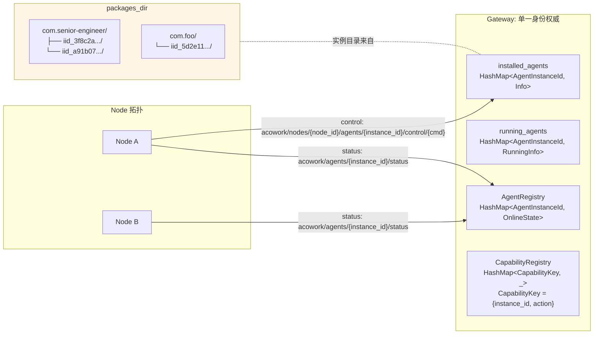
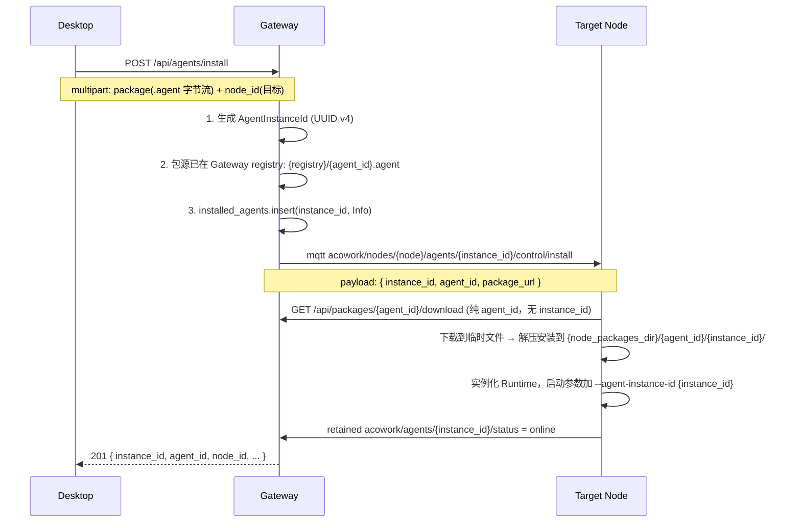
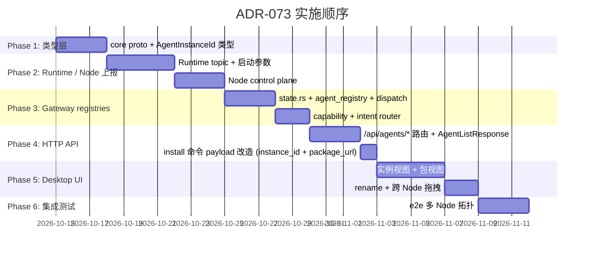

# ADR-073: Agent 身份模型分层 — `agent_id` / `agent_instance_id` / `node_id` 彻底解耦

**状态**：已接受
**日期**：2026-10-10
**决策者**：大鱼
**前置**：
- [ADR-055](./ADR-055-remote-runtime-node-topology.md)（Runtime 远程化部署 - Node Agent 拓扑 — 本 ADR 是其 Phase 5b 之后暴露出的身份模型缺陷的修正）
- [ADR-033](./ADR-033-mqtt-replace-grpc-websocket.md)（MQTT 替换 gRPC + WebSocket — 本 ADR 直接重塑其身份语义）
- [ADR-034](./ADR-034-mqtt-http-boundary.md)（MQTT / HTTP 职责边界）

**影响范围**：

**新增 / 重塑**：
- `core/acowork-core/src/manifest.rs`（`AgentManifest` 强化 `agent_id` 仅表示包身份，文档澄清语义）
- `core/acowork-core/src/protocol.rs`（所有 `DataEnvelope` 携带 instance 元数据：`agent_id`（包来源）+ `agent_instance_id`（实例 UUID）+ `node_id`（当前位置，可变））
- `core/acowork-gateway/src/gateway/instance_id.rs`（**新**：instance_id 生成、查重、校验工具模块）

**修改模块**：
- `core/acowork-gateway/src/gateway/state.rs`（4 个 HashMap key 全部从 `String` 改为 `AgentInstanceId`）
- `core/acowork-gateway/src/mqtt/agent_registry.rs`（key 升复合；topic 解析改用 `{instance_id}`）
- `core/acowork-gateway/src/capability/registry.rs`（`CapabilityKey` 加 instance_id）
- `core/acowork-gateway/src/intent/router.rs`（按 instance 寻址）
- `core/acowork-gateway/src/http/agents.rs`（所有 `{id}` 路由变量语义改 `{instance_id}`；`AgentListResponse` 加 `instance_id`/`agent_id`/`node_id` 三字段）
- `core/acowork-gateway/src/http/proxy.rs`（reverse proxy 寻址用 instance_id）
- `core/acowork-gateway/src/mqtt/dispatch.rs`（解析 `acowork/agents/+/...` topic 时，路径变量视为 instance_id）
- `core/acowork-gateway/src/mqtt/node_control.rs`（control plane topic 用 `nodes/{node}/agents/{instance_id}/...`）
- `core/acowork-gateway/src/bootstrap/orchestrator.rs`（注册表初始化路径同步）
- `core/acowork-gateway/src/gateway/mod.rs`（`auto_install_bundled_agents` 从"copy 目录到 packages_dir"改为"注册 registry 下载源 + 触发 install 命令"）
- `core/acowork-runtime/src/startup/`（启动参数 `--agent-instance-id` 替换 `--agent-id`；Runtime 上报 topic 全部用 `{instance_id}`）
- `core/acowork-runtime/src/mqtt/`（topic 构造与订阅路径）
- `core/acowork-node/src/`（control plane topic；install 命令带 `instance_id`）
- `apps/acowork-desktop/src/stores/agentStore.ts` + `components/agents/`（agent list UI 改实例视图 + 包视图折叠）

---

## 1. 决策摘要

### 1.1 一句话

**把"包的 id"和"实例的 id"彻底拆开**：`agent_id` 只代表 agent 包本身（类似 Class / npm package name），每个安装动作产生独立的 `agent_instance_id`（UUID，类似 Object / container id）；`node_id` 仅作为实例当前所在位置的描述符，**不再出现在任何身份 key 里**。

### 1.2 三层身份模型

| 字段 | 语义 | 类比 | 生成时机 | 是否可变 | 全平台唯一 |
|---|---|---|---|---|---|
| `agent_id` | **包身份** — `.agent` 文件在 manifest 里声明的 reverse-domain 标识 | Java `Class` / npm package name / Docker image name | 包构建时 | 不可变 | ✅ |
| `agent_instance_id` | **实例身份** — 一次 install 动作产生的运行时实体 | Java `Object` / npm 安装后的 `node_modules` 实体 / Docker container id | Gateway 收到 install 请求时生成 UUID v4 | **不可变**（跨 node 迁移保持） | ✅ |
| `node_id` | **位置** — 实例当前在哪台 Node 上 | Pod 当前的 nodeName / 进程当前的 hostname | 由 Node Agent 启动时声明 | 可变（迁移时更新） | ✅（节点身份） |

### 1.3 不变量（必须满足）

1. Gateway 内**所有 agent 维度 Registry 的 HashMap key 都是 `agent_instance_id`**，不是 `agent_id`，不是 `(node_id, agent_id)`。
2. MQTT topic `acowork/agents/{id}/...` 里的 `{id}` 全部解释为 `agent_instance_id`；**namespace 名 `agents/` 保持不变**，不改成 `instances/`。
3. HTTP API `/api/agents/{id}` 的 `{id}` 同样解释为 `agent_instance_id`；**路径前缀 `/api/agents` 保持不变**。
4. 安装目录：`packages_dir/{agent_id}/{uuid}/` 二级结构（详见 §5.6）。
5. `node_id` **不进任何身份 key**，仅作为运行时 metadata 出现在 `Info` 结构、`InstanceInfo` envelope、UI 显示等位置性字段中。

### 1.4 拓扑示意



---

## 2. 背景与动机

### 2.1 现状：用一个 id 同时表达两件事

[core/acowork-core/src/manifest.rs:54](core/acowork-core/src/manifest.rs#L54) 定义：

```rust
pub struct AgentManifest {
    pub agent_id: String,   // e.g. "com.acowork.senior-engineer"
    ...
}
```

这个 `agent_id` 在当前代码中**同时承担两个语义**：

| 语义 | 含义 |
|---|---|
| **包身份** | 这个 `.agent` 文件是谁发布的、哪个版本（manifest 自描述）|
| **实例身份** | 一次 install 后，在 Gateway 里这个运行时实体的唯一标识 |

第二层语义本来应该由 Gateway 在 install 时生成，**但代码复用 manifest 的 `agent_id` 顶上去了**。

### 2.2 后果：所有 Registry 都建立在"全局唯一 agent_id"假设上

| 数据结构 | 当前 key 类型 | 位置 |
|---|---|---|
| `GatewayState.installed_agents` | `HashMap<String, AgentInfo>` | [state.rs:199](core/acowork-gateway/src/gateway/state.rs#L199) |
| `GatewayState.running_agents` | `HashMap<String, RunningAgentInfo>` | [state.rs:201](core/acowork-gateway/src/gateway/state.rs#L201) |
| `AgentRegistry.agents` | `HashMap<String, AgentOnlineState>` | [agent_registry.rs:53](core/acowork-gateway/src/mqtt/agent_registry.rs#L53) |
| `CapabilityRegistry.capabilities` | `HashMap<CapabilityKey, _>`，`CapabilityKey = { agent_id, action }` | [capability/registry.rs:32](core/acowork-gateway/src/capability/registry.rs#L32) |

**所有 key 都是 `agent_id`（或派生）**。一旦两个 Node 装了同一个 `agent_id`，HashMap 直接覆盖，无任何冲突检测。

### 2.3 实测冲突场景（2026-10 上线准备期间触发）

#### 场景 A：双 Node 装同包

```
Node A install com.acowork.senior-engineer  → installed_agents["com.acowork.senior-engineer"] = Info_A
Node B install com.acowork.senior-engineer  → installed_agents["com.acowork.senior-engineer"] = Info_B (覆盖)
```

- Desktop 调用 `GET /api/agents`：返回 1 条记录（不是 2 条），丢失 Node A 信息
- Desktop 调用 `POST /api/agents/com.acowork.senior-engineer/start`：命中哪个 Node 完全不确定
- Node A 的 Runtime 上报 `acowork/agents/com.acowork.senior-engineer/status` retained = online
- Node B 的 Runtime 发 retained = online，Broker 收到的是 Node B 的 payload
- Node A 的 status 被静默吃掉，Desktop 误以为 Node A 已掉线

#### 场景 B：同 Node 装同包两次

`POST /api/agents/install` 第二次 → `installed_agents.insert(same_key, ...)` **直接覆盖**。第一个安装实例的 install_path、workspace、版本信息全丢。

#### 场景 C：Capability 注册

`CapabilityKey = { agent_id, action }`，两个 Node 装同 id 包 → Intent router 解析时拿到一个 capability 名字，只能查到一份注册方，另一台机器上的同 capability 完全不可达。

### 2.4 已尝试 / 已拒绝的方案（避免重蹈覆辙）

| 方案 | 拒绝理由 |
|---|---|
| **A：复合主键 `(node_id, agent_id)`** | node_id 是位置，不应绑进身份；跨 Node 迁移、灾备、多 Node 同包负载分担全部需要拆开 key。短期止血可以，长期是债务 |
| **B：强制全局唯一 agent_id** | 安装时 reject 冲突；用户必须手工起不冲突的 id（如 `com.foo@workstation-b`）。违背多机部署直觉，与 ADR-055 "node 一等公民" 愿景相悖 |
| **C：集群抽象（多 instance 自动聚合为 Service）** | 引入 cluster 管理平面、session stickiness、affinity 决策；session-bound agent 无法套用该模型，复杂度太高 |

---

## 3. 目标

1. **根本解决身份混淆**：包、实例、位置三层身份彻底解耦，每层独立可变。
2. **零冲突语义**：同一 `agent_id` 的多个实例可在同 Node / 跨 Node 共存，全部由 `agent_instance_id` 区分；HashMap 不再发生 last-write-wins。
3. **位置无关性**：`agent_instance_id` 在跨 Node 迁移、灾备、负载迁移场景下保持不变，仅 `node_id` 字段更新。
4. **协议 / API 表面稳定**：MQTT topic 路径、HTTP 路径前缀**保持 `agents/` / `/api/agents`**，只重塑路径变量的语义；尽量减少破坏面。
5. **包内容可复用**：同一 `.agent` 文件可在不同实例间共享物理文件（symbolic link 或 shared blob），降低磁盘占用。

---

## 4. 决策

### 决策 1：三层身份，类型严格区分

```rust
// core/acowork-core/src/manifest.rs
pub struct AgentManifest {
    /// 仅表示包身份（来自 .agent manifest，不可变，全平台唯一）
    pub agent_id: String,
    // ... 其余字段不变
}

// core/acowork-gateway/src/gateway/instance_id.rs（新文件）
/// 实例身份 — UUID v4，全平台唯一，install 时由 Gateway 生成，永不变。
/// 不透明类型防止与 agent_id 字符串误用。
#[derive(Debug, Clone, PartialEq, Eq, Hash, Serialize, Deserialize)]
#[serde(transparent)]
pub struct AgentInstanceId(String);

impl AgentInstanceId {
    pub fn new() -> Self { Self(Uuid::new_v4().simple().to_string()) }
    pub fn from_node_proposed(id: String) -> Result<Self, IdError> { /* 校验格式 */ }
    pub fn as_str(&self) -> &str { &self.0 }
}

/// AgentInfo 的身份字段重塑
pub struct AgentInfo {
    pub agent_id: String,            // 包身份
    pub instance_id: AgentInstanceId, // 实例身份（NEW）
    pub node_id: String,              // 当前位置（已存在）
    pub version: String,
    pub install_path: String,         // = "{packages_dir}/{agent_id}/{instance_id}/"
    pub manifest: AgentManifest,
    // ...
}
```

**判据**：用 opaque 类型 `AgentInstanceId(String)` 而不是 `String`，让类型系统强制所有 HashMap key、HTTP 路径解析、MQTT payload 都走校验过的 instance id，杜绝字符串拼写错误导致的逻辑 bug。

### 决策 2：所有 Registry key 改用 `AgentInstanceId`

| 数据结构 | 新 key 类型 |
|---|---|
| `GatewayState.installed_agents` | `HashMap<AgentInstanceId, AgentInfo>` |
| `GatewayState.running_agents` | `HashMap<AgentInstanceId, RunningAgentInfo>` |
| `AgentRegistry.agents` | `HashMap<AgentInstanceId, AgentOnlineState>` |
| `CapabilityRegistry` 的 `CapabilityKey` | `{ instance_id: AgentInstanceId, action: String }` |
| Session 路由 | `agent_instance_id`（已有 session_id 之上叠加） |

**冲突检测**：所有 `insert` 之前先查 key 存在性；存在则返回 409 + 现有 instance 详情（避免悄无声息覆盖）。

### 决策 3：MQTT topic namespace 保持 `agents/`，路径变量语义改为 instance_id

```text
# Runtime → Gateway（保留 acowork/agents/ 前缀，{id} 语义改为 instance_id）
acowork/agents/{instance_id}/status
acowork/agents/{instance_id}/http_endpoint
acowork/agents/{instance_id}/config
acowork/agents/{instance_id}/debug/events/{event_type}
acowork/agents/{instance_id}/sessions/{session_id}/messages/#
acowork/agents/{instance_id}/sessions/{session_id}/state

# Gateway → Node（lifecycle control plane）
acowork/nodes/{node_id}/agents/{instance_id}/control/{cmd}
acowork/nodes/{node_id}/agents/{instance_id}/events

# Node → Gateway（Node-level reporting，已在 ADR-055）
acowork/nodes/{node_id}/status
acowork/nodes/{node_id}/info
```

**判据**：保留 `agents/` namespace 避免对 broker ACL、文档、外部观察者造成不必要的破坏；只重塑路径变量含义。

**topic 解析**（[agent_registry.rs:74-80](core/acowork-gateway/src/mqtt/agent_registry.rs#L74) 当前逻辑）：

```rust
// 旧：
let agent_id = parts[2].to_string();  // parts[2] = agent_id
self.agents.insert(agent_id, AgentOnlineState { agent_id, ... });

// 新：
let instance_id = AgentInstanceId::from_string(parts[2].to_string())?;
self.agents.insert(instance_id.clone(), AgentOnlineState {
    instance_id: instance_id.clone(),
    agent_id: extract_agent_id_from_envelope(payload),  // 从 envelope 解析
    node_id: extract_node_id_from_envelope(payload),    // 从 envelope 解析
    ...
});
```

> **重要**：instance_id 走 topic 路径（用于路由分片），agent_id / node_id 必须从 envelope payload 读取（DataEnvelope 内的字段）。这是与 ADR-033 MQTT 协议的明确分工。

### 决策 4：HTTP API 路径保持 `/api/agents`，变量语义改 `{instance_id}`

```text
# 单实例操作（路径不变，只把 {id} 的语义改成 instance_id）
GET    /api/agents/{instance_id}
DELETE /api/agents/{instance_id}
POST   /api/agents/{instance_id}/start
POST   /api/agents/{instance_id}/stop
POST   /api/agents/{instance_id}/restart-debug
POST   /api/agents/{instance_id}/clone
POST   /api/agents/{instance_id}/upgrade
GET    /api/agents/{instance_id}/model
GET    /api/agents/{instance_id}/avatar
GET    /api/agents/{instance_id}/manifest/avatar
... (所有 /api/agents/{id}/* 路由同理)

# 列表 / 聚合
GET /api/agents                                    # 全平台所有实例
GET /api/agents?agent_id=com.foo                   # 某包的所有实例（包视图）
GET /api/agents?node_id=node-a                     # 某 Node 上的所有实例
GET /api/agents/{instance_id}/lsp-endpoint         # 已有，instance 维度

# Install（保持现状的 multipart 上传，改动只发生在命令 payload）
POST /api/agents/install                            # multipart: package(字节流) + node_id(目标)
                                                    # 现状已如此（agents.rs:1415），无破坏性变更
                                                    # Gateway 落 registry 后构造下载 URL，
                                                    # install 命令带 { instance_id, agent_id, package_url }

# Package 下载（保持现状，只和包身份相关）
GET /api/packages/{agent_id}/download              # 下载源 = Gateway registry 里的 {agent_id}.agent
                                                   # 纯 agent_id 维度，与 instance 无关
```

**`AgentListResponse` 字段重塑**（[agents.rs:121-185](core/acowork-gateway/src/http/agents.rs#L121)）：

```rust
pub struct AgentListResponse {
    pub instance_id: String,         // NEW: 实例身份
    pub agent_id: String,            // 包身份
    pub node_id: String,             // 当前位置
    pub name: String,
    pub display_name: Option<String>, // 用户可重命名（取代 alias 概念）
    pub role: Option<String>,
    pub avatar: Option<String>,
    pub builtin_avatar: Option<String>,
    pub version: String,
    pub running: bool,
    pub connected: bool,
    pub ready: bool,
    pub dev_mode: bool,
    pub debug_state: DebugState,
    pub debug_port: Option<u16>,
    pub last_interaction_at: Option<String>,
    pub mqtt_online: Option<bool>,
    pub sleeping_at: Option<String>,
}
```

### 决策 5：Install 流程 — Gateway 生成 instance_id，Node 凭 URL + instance_id 下载落地



**关键约束**：
- `agent_instance_id` **完全由 Gateway 生成**（不让 Node / Desktop 自报，杜绝 collision）
- Node 在 control plane 收到 install 命令时，必须用命令里携带的 `instance_id` 启动 Runtime，**不允许自创**
- **download URL 与 instance 完全解耦**：`GET /api/packages/{agent_id}/download` 只回答"给我这个包的字节流"（agent_id 维度）；`instance_id` 只出现在 install 命令 payload 里，决定"落地成哪个实例、装到哪个目录"（instance 维度）。下载与实例化是两个动作、两组参数，不合并。

### 决策 5.1：两种安装方式收敛到同一条流水线

现有两条安装入口（代码事实，[gateway/mod.rs:95](core/acowork-gateway/src/gateway/mod.rs#L95) `auto_install_bundled_agents` + [agents.rs:1415](core/acowork-gateway/src/http/agents.rs#L1415) `install_agent`）最终都到 Gateway 机器上的文件，**只差包源来源不同**：

| 安装方式 | 包源来源 | 现状路径 |
|---|---|---|
| **内置 agents（引导界面安装）** | 随 ACowork 安装包分发的 `.agent` 文件（`examples/` / `ACOWORK_BUNDLED_AGENTS_DIR`）| Gateway 启动时直接 copy 目录到 `packages_dir/{agent_id}/`（绕过 registry 和 install 命令）|
| **Desktop 手动安装** | Desktop 上传的本地 `.agent` 文件 | multipart → registry → install 命令 → node 下载 |

**决策**：两条入口**收敛到同一条流水线**，差异只在第 0 步"包源注入"：

```
① 内置 agents: Gateway 启动时把 bundle 注册为 registry 下载源 {registry}/{agent_id}.agent
   Desktop:    multipart 上传 → 落 registry {registry}/{agent_id}.agent（现状不变）
        ↓
② 之后的流程完全一致（决策 5 的 mermaid）：生成 instance_id → install 命令 → node 下载 → 落地
```

这样：
- 内置 agents 不再绕过 registry 直接写 packages_dir；它同样获得 `instance_id`、走 install 命令、由 node 落地——与手动安装零行为差异
- 内置 agents 的安装目标 node：引导界面显式选（local 或任意已 enroll 的 node），不默认写死
- 现有 `auto_install_bundled_agents` 的"copy 目录到 packages_dir"逻辑废弃，改为"注册 registry 下载源 + 触发 install 命令"

### 决策 6：安装目录结构 — Node 侧 `{packages_dir}/{agent_id}/{uuid}/`

**重要区分**：系统里有两个目录、两种用途，必须分清楚：

| 目录 | 位置 | 用途 | 结构 |
|---|---|---|---|
| **registry**（下载源） | Gateway 机器 | 存 `.agent` 原始包，供 Node 拉取 | `{registry}/{agent_id}.agent`（现状不变）|
| **packages_dir**（安装落地） | 各 Node 机器本地 | 解压后的 agent 文件，供 Runtime 运行 | `{packages_dir}/{agent_id}/{uuid}/`（新增二级）|

Node 侧安装落地目录结构：

```
{node_packages_dir}/
  com.acowork.senior-engineer/        # 一级 = 包身份
    3f8c2a1b-4d5e-6f7a-8b9c-0d1e2f3a4b5c/   # 二级 = instance_id
      manifest.json
      skills/
      prompts/
      workspace/
    a91b07d2-8e3f-4a5b-9c1d-2e3f4a5b6c7d/   # 同包第二个实例
      manifest.json
      ...
  com.acowork.foo/
    5d2e11f8-.../
```

**判据**：
- 一级用 `agent_id`：人类可读、可按包浏览；与 npm `node_modules/<pkg>/...`、Docker volume `<image>/<container>/` 同构
- 二级用 `instance_id`（UUID）：机器生成的、保证全局唯一；同一包多实例互不干扰
- **不允许**目录里再嵌套 instance 标识（即不要 `packages/{agent_id}-{instance_id}/`），避免同包多实例时共享同一目录的冲突
- Gateway 的 registry 下载源**保持 `{agent_id}.agent` 一级结构不变**——下载源是"包内容"，一个包一个文件，天然以 agent_id 为 key；instance 维度只存在于 Node 侧落地目录

**包文件物理共享**（可选优化，未来 Phase）：多个 instance 的 `manifest.json` / `skills/` 内容完全相同时，第二个 instance 目录可用 hardlink / reflink 指向第一个，仅 `workspace/` 独占。当前 Phase 不实现，仅预留扩展点。

### 决策 7：Capability / Intent router 重塑

```rust
// 旧 CapabilityKey
pub struct CapabilityKey {
    pub agent_id: String,
    pub action: String,
}

// 新 CapabilityKey
pub struct CapabilityKey {
    pub instance_id: AgentInstanceId,  // 实例级
    pub action: String,
}
```

**意图路由**（[intent/router.rs](core/acowork-gateway/src/intent/router.rs)）：调用方发"找能处理 X 的 agent" → router 遍历 `CapabilityRegistry` → 拿到所有声明 X 的 instance → 按策略选一个：
- 默认：返回第一个（确定性，可加 hash(instance_id) round-robin）
- 后续 Phase：affinity / preferred-node / 用户选

**多实例的"包级 capability"语义**：调用方写"找任何 com.foo 的实例处理 X" → 由 Gateway 解析为 instance 级查找，不在 Registry 内做类-对象混叠。

### 决策 8：反向 proxy / HTTP endpoint 寻址

[proxy.rs:1619](core/acowork-gateway/src/http/proxy.rs#L1619) 的 `acowork/agents/{id}/http_endpoint` 改为：
- topic 路径语义是 `instance_id`
- payload envelope `HttpEndpoint { instance_id, agent_id, node_id, url }`

Gateway 维护 `HashMap<AgentInstanceId, EndpointUrl>`，`GET /api/agents/{instance_id}/chat` 之类 reverse proxy 直接按 instance_id 查表，不再受 agent_id 冲突影响。

### 决策 9：Runtime 启动参数

```rust
// 旧
acowork-runtime --agent-id com.acowork.senior-engineer --http-port 0 ...

// 新
acowork-runtime --agent-instance-id 3f8c2a1b-... --http-port 0 ...
```

`--agent-id`（包身份）**可选保留**，仅用于 Runtime 内部读 manifest 时交叉校验 / 日志标识。Runtime 不再基于 `agent_id` 构造任何 MQTT topic 或 Registry key。

### 决策 10：Desktop UI

| 视图 | 默认 | 实现 |
|---|---|---|
| **实例视图**（推荐默认） | ✅ | 每行一个 instance；列：`instance_id`（短码）+ `agent_id` + `node_id` + display_name + 状态 |
| **包视图** | 折叠视图 | 按 `agent_id` 折叠：标题 `com.acowork.senior-engineer (3 instances)`，展开显示 3 个实例 |
| **Node 视图** | 筛选切换 | 按 `node_id` 过滤 |
| **重命名** | display_name | 改名 = 改 display_name 字段；不影响 `agent_id` / `instance_id` |

**Alias 概念取消**：原考虑的"instance alias"取消——用户重命名走 manifest 的 `display_name` 字段即可，不需要再增加一层身份字段。

---

## 5. 后果

### 5.1 正面

1. **零冲突**：HashMap key 用 UUID，全平台唯一；同包多实例 / 跨 Node 重名 / 同 Node 重装全部天然支持。
2. **位置无关**：跨 Node 迁移、灾备、负载再均衡只需更新 `node_id` 字段；instance_id / session_id / 配置数据全部跟随。
3. **协议路径稳定**：MQTT namespace `acowork/agents/`、HTTP 前缀 `/api/agents` 完全保留；外部观察者、broker ACL、文档无需大改。
4. **类型安全**：`AgentInstanceId` opaque 类型 + serde 透明序列化，编译期阻止字符串误用。
5. **包文件可共享**：同包多实例磁盘优化（hardlink）成为可能，未来 Phase 落地。
6. **UX 更清晰**：用户操作目标是"实例"，不是"包"，心智模型和 Class/Object 一致。

### 5.2 负面 / 成本

1. **proto 变更**：DataEnvelope 多处加 `instance_id` / `node_id` 字段；需要 `prost` 重新生成。
2. **改动面广**：横跨 acowork-core / acowork-runtime / acowork-node / acowork-gateway / acowork-desktop 5 个 crate，每 crate 都要 audit 一遍 `agent_id` 字符串用法。
3. **Node 侧 packages_dir 结构变更**：`{packages_dir}/{agent_id}/` → `{packages_dir}/{agent_id}/{uuid}/`，Node 的 package 发现/恢复逻辑（`restore_installed_agents` 等）需遍历二级目录。
4. **包视图 UX 工作量**：Desktop 折叠视图、跨 Node 拖拽、display_name 重命名 UI 都要做。
5. **首次安装生成 UUID** 让安装包在文件系统层多一层目录，路径略深（用户不可见，影响小）。

### 5.3 回滚

所有改动都在 type system + topic path variable 语义层：
- HashMap key 类型回退到 `String`：保留所有字段，只改 key 类型即可
- HTTP 路径变量语义回退：路由表不变，只需在 handler 内重新解释变量名
- MQTT topic 不变，payload 字段可保留兼容

不需要数据迁移脚本；测试数据 / 本地调试数据可手动清空。

---

## 6. 改动清单（按 crate / 文件）

### 6.1 core/acowork-core
- `src/manifest.rs`：注释强化 `agent_id` 仅表示包身份
- `src/protocol.rs`：所有 `DataEnvelope` 加 `instance_id: String`、`node_id: String`；新增 `InstalledInstanceInfo` envelope
- `src/agent_instance_id.rs`（新）：`AgentInstanceId` opaque 类型 + UUID 生成 + serde

### 6.2 core/acowork-runtime
- `src/startup/`：CLI 参数 `--agent-instance-id` 替换 `--agent-id`
- `src/mqtt/`：所有 topic 构造 `{instance_id}` 占位符
- 所有 `acowork/agents/{id}/...` 出现处改为 `{instance_id}`

### 6.3 core/acowork-node
- `src/control/`：control plane topic `nodes/{node}/agents/{instance_id}/control/{cmd}`
- install 路径：解析 Gateway install 命令，从中提取 `instance_id` 启动 Runtime

### 6.4 core/acowork-gateway
- `src/gateway/instance_id.rs`（新）：instance_id 校验、查重工具
- `src/gateway/state.rs`：4 个 HashMap key 类型替换
- `src/mqtt/agent_registry.rs`：key + topic 解析逻辑
- `src/mqtt/dispatch.rs`：topic 路由表更新
- `src/mqtt/node_control.rs`：control plane topic
- `src/capability/registry.rs`：`CapabilityKey` 加 instance_id
- `src/intent/router.rs`：按 instance 寻址
- `src/http/agents.rs`：所有路由 `{id}` → `{instance_id}`（语义）；`AgentListResponse` 三字段分离；`install_agent` 生成 instance_id 并写入 install 命令 payload（`{ instance_id, agent_id, package_url }`）
- `src/http/proxy.rs`：endpoint registry + reverse proxy 寻址
- `src/http/packages_api.rs`（或类似）：**保持 `/api/packages/{agent_id}/download` 不变**——下载源仍以 agent_id 为 key，instance 维度不进入下载路径
- `src/bootstrap/orchestrator.rs`：注册表初始化路径

### 6.5 apps/acowork-desktop
- `src/stores/agentStore.ts`：实例视图 + 包视图切换
- `src/components/agents/AgentList.tsx`：默认实例视图
- `src/components/agents/PackageGroupView.tsx`：包折叠视图
- `src/lib/types.ts`：`AgentListItem` 类型增 instance_id / agent_id / node_id 三字段
- rename 流程：编辑 display_name 即可

---

## 7. 测试策略

### 7.1 单元测试（acowork-gateway）

- `installed_agents.insert(instance_id_a, ...)` → `insert(instance_id_b, ...)` 同 `agent_id` 不同 `instance_id` → 两个 entry 并存 ✅
- `insert(已存在 instance_id)` → 返回 409 + 现有 entry
- `CapabilityRegistry.register(instance_id_a, action)` 与 `register(instance_id_b, action)` 同 action 名 → 两个 capability 并存
- `AgentInstanceId::from_string` 校验非法 UUID → 拒绝

### 7.2 集成测试（e2e）

- **冲突消解**：本地起两个 mock Node，分别 install 同包 → `GET /api/agents` 返回 2 条，instance_id 不同 ✅
- **同 Node 多实例**：同一 Node 上 install 同包两次 → 两个 instance，install_path 不同 ✅
- **状态独立性**：Node A 的 instance 上线、Node B 的 instance 离线 → 两边 status 互不影响
- **跨 Node 迁移**：模拟 instance 从 Node A 迁移到 Node B（更新 node_id，runtime 重启）→ instance_id 不变，session 跟随

### 7.3 协议兼容性

- 启动 Gateway + 2 个 Node，模拟真实多机拓扑
- Desktop `GET /api/agents` 验证三字段齐全
- Desktop `POST /api/packages/install` 验证 201 + 返回 instance_id
- Node 收到 install 命令后验证 Runtime 启动参数含 `--agent-instance-id`

### 7.4 Desktop UX

- 实例列表正确显示 instance_id 短码
- 包视图正确折叠
- display_name 重命名后 MQTT retained `config` topic 携带新名称
- 跨 Node 拖拽（mock）验证 node_id 字段更新

---

## 8. 实施顺序



每个 Phase 结束要求：`cargo clippy --all-targets -- -D warnings` + `cargo test` 全绿 + Desktop 端到端手测通过。

---

## 9. 总结

**根本错误**：用 `agent_id`（来自 manifest 的包名）兼任包身份和实例身份，把 Class 当 Object 用。

**正解**：三层身份严格分离——`agent_id`（包）/ `agent_instance_id`（UUID 实例）/ `node_id`（位置）。所有 Registry key 用 instance_id，namespace 路径变量语义随之重塑，但 namespace 名（`agents/` / `/api/agents`）保持不变以保护协议表面。

**关键判据**：路径 namespace 名是协议基础设施（broker ACL、文档、监控面板依赖），应该稳定；路径变量语义是内部实现细节，应该跟随身份模型的修正而演进。本 ADR 严守这一区分——只改后者，不动前者。