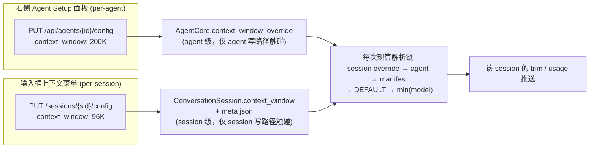
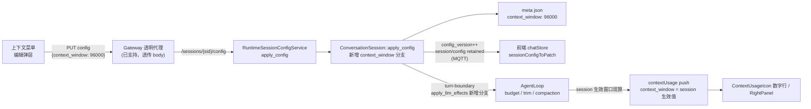

# ADR-074: per-session 上下文窗口覆盖 — `context_window` 从 per-agent 扩展到 per-session

**状态**：已接受（2026-09-15 评审定稿）
**日期**：2026-09-09
**评审修订**：2026-09-15（统一"无效值"编码语义、废止 `0 = 无限制`；见 §1.2 / §1.3 / §6）
**决策者**：大鱼

**前置**：
- [ADR-012](./ADR-012-per-session-model-isolation.md)（per-session model 隔离）
- [ADR-025](./ADR-025-temperature-resolution-chain.md)（temperature 解析链 — 本文档对比对象与反模式来源）
- [ADR-026](./ADR-026-context-window-resolution-chain.md)（per-agent context window cap 解析链 — 本文档在其之上新增 per-session Layer 0，并**废止其 `0 = 无限制`**，见 §6）
- [ADR-043](./ADR-043-session-config-state-split.md)（Session Config / State 双主题拆分）
- [ADR-047](./ADR-047-session-config-decouple-from-inference.md)（Session Config 持久化与 LLM 推理解耦 — per-session 字段管线的权威设计）

---

## 1. 决策摘要

### 1.1 一句话

**新增 per-session `context_window` 参数**（存于 session meta json，**无效值 = 继承 per-agent 链**），接入 ADR-047 的 session-config 管线（`SessionConfigDelta` / `ConversationSession::apply_config` / HTTP `PUT /sessions/{sid}/config` / MQTT retained `session_config`），参与 ADR-026 解析链成为最高优先级 Layer 0，并在输入框上下文用量菜单提供编辑入口——右侧 Agent Setup 面板的 per-agent 设置保持不动，且**永不覆盖**已设置的 per-session 值。同时把 `0` 在**全链统一为无效值**（与 `null` / 缺失同义），废止 ADR-026 的 `0 = 无限制`（§6）。

### 1.2 语义决策

| # | 决策 | 结论 |
|---|---|---|
| D1 | 解析语义 | 每层取**第一个有效值**；`缺失 / null / 0 / 越界` 一律**无效**，落下一层；链末端 `DEFAULT_CONTEXT_WINDOW = 200_000` 兜底（**兜底值同时是事实上限**），最后与模型窗口取 min。**不采用** temperature 的"agent 配置变化时烘焙进每个 session meta"写回语义 |
| D2 | 只改显示 vs 真正生效 | **真正生效**：per-session 覆盖参与该 session 的 trim / compaction 阈值与 context_usage 推送 |
| D3 | per-session 写路径 | 复用现有 HTTP `PUT /api/agents/{id}/sessions/{sid}/config`（Gateway 已透明代理到 Runtime `PUT /sessions/{sid}/config`），走 `SessionConfigDelta`。**不新增** MQTT control command |
| D4 | 清除 / 重置语义 | Delta 中 `context_window: Some(0)`（或 `null`）= **清除覆盖**；`None` = 未修改。清除 = 归一为无效值，落盘时字段**不写入**（`None` + `skip_serializing_if`），meta 中该字段消失 |
| D5 | "已设置"标识 | 不加布尔标志位。**meta 中字段存在 ⟺ 该 session 有覆盖**（由 D4 的落盘归一保证）；三层同源：meta json（持久层权威）↔ `ConversationSession`（后端内存）↔ `SessionChatState.sessionContextWindow`（前端镜像） |
| D6 | 值域 | 有效值域 `FLOOR..=CEILING`：`FLOOR = 8_192`（常量）、`CEILING = 4_194_304`。越界由 `put_session_config` 返回 **400**（不静默 clamp）；per-model 上限不参与校验，运行时与模型窗口取 min 兜底 |

### 1.3 值编码表（四个面的唯一约定）

同一语义在四个面上只有一种表示；**"未设置"与"清除"是同一个状态**：

| 面 | 未设置 / 清除（无效） | 设置 |
|---|---|---|
| HTTP `PUT /sessions/{sid}/config` | 字段缺失、`null`、`0`（三者同义） | `n`（`FLOOR..=CEILING`） |
| `conversations/meta/{sid}.json` | 字段不存在 | `n` |
| proto `SessionConfig` | `optional uint64` 字段缺失 | `n` |
| `SessionConfigSnapshot`（HTTP GET / MQTT retained） | `null` | `n` |
| Desktop `SessionChatState.sessionContextWindow` | `null` | `n` |

补充约定：
- proto 用 **presence**（`optional uint64`）表达"未设置"，**不用 `0` 哨兵**——"未设置"只有一个概念，就该由字段缺失表达（不再复制 `temperature` 的 `NaN` 哨兵债）。
- `SessionConfigDelta.context_window: Option<u64>` 结构不变：`None` = 不动，`Some(0)` = 清除，`Some(n)` = 设置。无需 `Option<Option<u64>>`。

### 1.4 防覆盖保证（Agent Setup 面板 ↔ 上下文菜单）

per-agent 与 per-session 设置**存在两个互不写入的存储**，靠分层而非前端拦截保证不被覆盖：



- **不变量 1**：per-session 值**绝不落进** `AgentCore`。`AgentCore` 只持有 Layer 1/2/3 与 agent 级 `context_window_override`，仅 agent 写路径（`UpdateRuntimeConfig`）触碰它。
- **不变量 2**：`RuntimeConfigOverrides` 的 session 内同步路径（[loop_context.rs:106](core/acowork-runtime/src/agent/loop_context.rs#L106) `apply_runtime_config`）**不得**新增 `context_window` 分支；temperature 在那里的"烘焙进每个 session meta"（[session_manager.rs:1726](core/acowork-runtime/src/agent/session/session_manager.rs#L1726)）是历史例外，不是可复制的模板。
- **理由**：`AgentCore` 是 **per-agent 模板**——SessionManager 侧 `Arc::make_mut` clone-on-write（[session_manager.rs:1646](core/acowork-runtime/src/agent/session/session_manager.rs#L1646)），每个 SessionTask 再 `(*core).clone()` 一份。任何 session 维度的值写进模板都会随 clone 泄漏到其他会话，并让"无 override 的 session 动态跟随 agent 变更"失效。
- agent 窗口变更只更新 agent 层；有 override 的 session 在解析链中天然优先，不受影响；无 override 的 session 动态跟随（继承语义）。
- 前端唯一防覆盖点是修复 [chatStore.ts](apps/acowork-desktop/src/stores/chatStore.ts) 的 blanket sync（见 §5.3）：agent_config MQTT 事件同步 `contextUsage` 时**跳过 `sessionContextWindow != null` 的 session**。

---

### 1.5 解析归属层

- **唯一归属**：per-session 的 `AgentLoop` 调用纯函数 `resolve_effective_context_window(...)`（§3.2）。函数无状态、除入参外无环境依赖，建议与 `resolve_effective_reasoning_effort` 同址放在 `agent::session_config` 模块。
- **单一 choke point**：`AgentLoop::context_trim_budget(model)`（[loop_context.rs:200](core/acowork-runtime/src/agent/loop_context.rs#L200)）已覆盖 trim / compaction / 工具结果裁剪 / 告警阈值，session override 只在这里注入一次；usage 侧另有 4 个注入点，见 §5.2。
- **`AgentCore` 的改造方式**：`AgentCore::context_trim_budget(model)` 重构为 `context_trim_budget_with(resolved_cap: Option<u64>, model)`；**不接受 session override，也不持有 session 状态**（不变量 1）。
- **override 的唯一读取源**：`ConversationSession`（meta 持久值的同一份内存镜像）。**不**在 `SessionState` 里再缓存一份（避免双源漂移，见 §5.2）。

---

## 2. 背景与问题

### 2.1 现状

- `context_window` 是 per-agent 参数，遵循 ADR-026 三层解析链（agent_config.json → manifest → DEFAULT → min(model context_window)），存于 agent_config.json，仅右侧 Agent Setup 面板可改（其值域中的 `0 = 无限制` 由本 ADR 废止，见 §6）。
- 输入框上下文用量菜单（`ContextUsageIcon`）展示 `used / total`，total = `ContextUsageInfo.context_window`，由 Runtime 按 per-agent 链推送，**无法按会话差异化**。
- per-session config 管线（ADR-047）已支持 model / provider / workspace_id / reasoning_effort / temperature / title，字段落在 `conversations/meta/{session_id}.json`，读写经 `SessionConfigService`（HTTP + MQTT retained）。

### 2.2 需求

1. 上下文用量菜单数字行 total 右侧加编辑图标，点击可修改该**会话**的上下文窗口大小。
2. 新参数为 per-session，加在 meta json，与 temperature 同管线。
3. 默认继承 per-agent 值；**用户点击编辑保存后才写独立值**。
4. 新建与存量 session 都要处理好字段的加入与初始化；前端三个展示面（输入框菜单 / 底部状态栏 / 右侧状态面板）统一以 session 生效值为准。
5. Agent Setup 面板的 per-agent 修改**不得覆盖**已编辑的 per-session 值。

### 2.3 为什么不能直接照搬 temperature 的现状

temperature 现状是本文档的**反模式来源**，需要显式记录（详见 §9）：

- per-session temperature（meta json）已有字段与持久化，但**没有消费路径**：`SessionState::set_temperature` 仅 3 个调用点（agent 配置变更同步 / resume 用 agent 链覆盖 / 创建时同步 agent override），没有任何代码把 `ConversationSession.temperature` 读入 `SessionState`；turn-boundary 的 `llm_effects.rs` 对 temperature 处理数为 0（reasoning_effort 有同步，temperature 没有）。
- resume（[session_manager.rs:1084](core/acowork-runtime/src/agent/session/session_manager.rs#L1084)）解析温度时**不读** `conv.temperature()`，meta 值在重启后会被 agent 链覆盖。
- 语义上 meta 温度是"agent 配置变化时烘焙进每个 session"（[session_manager.rs:1726](core/acowork-runtime/src/agent/session/session_manager.rs#L1726)），一旦真的让 meta 值参与解析，老 session 会**钉死在旧烘焙值**、不再跟随 agent 变更——行为回归。
- 当前无感只是因为**没有 UI 能制造 per-session 温度差异**（埋雷未引爆）。

结论：context_window 的 per-session 语义采用 **无效值 = 继承（不烘焙）**，与 temperature 的烘焙语义刻意分叉；解析出的 effective 值**每轮现算、不缓存**，从设计上避开 temperature 的"缓存挡住回退链"类缺陷。

---

## 3. 解析链设计

### 3.1 扩展后的解析链（per-session Layer 0）

```text
Layer 0 (最高)  session meta.json context_window    用户在该会话的上下文菜单设置
    ↓ 无效（缺失 / null / 0 / 越界）
Layer 1         agent_config.json.context_window      用户 Agent 级设置
    ↓ 无效（None / 0 / 越界）
Layer 2         manifest.llm.context_window            包作者默认
    ↓ 无效（None / 0 / 越界）
Layer 3         DEFAULT_CONTEXT_WINDOW = 200_000    系统硬编码（兜底值 = 事实上限）
    ↓
与模型能力取 min：effective = min(resolved_cap, caps.context_window)
```

`0` 与 `null` 是**同一个状态**（§1.3），有效性判定单点定义在下面的 `is_valid_context_window`。

### 3.2 统一解析函数（后端唯一 resolve 点）

把现有散落在 `agent_core.resolved_context_cap()` / `loop_context.effective_context_budget()` / `session_manager` resume 初始 usage 的解析逻辑收敛为**一个无状态纯函数**，放在 `agent::session_config`（与 `resolve_effective_reasoning_effort` 同址）。**不把它做成 `AgentCore` 的方法**（§1.5 不变量 1）：

```rust
/// 值有效性：唯一判定点。0 / 缺失 / 越界都是"无效"，与 None 同义。
pub(crate) fn is_valid_context_window(n: u64) -> bool {
    (FLOOR..=CEILING).contains(&n)
}

/// 输入：session override（Layer 0，来自 ConversationSession）、agent 链来源
/// 输出：该 session 的 effective context cap（参与 trim / compaction / usage 推送）
pub(crate) fn resolve_effective_context_window(
    session_override: Option<u64>,          // Layer 0
    agent_override: Option<u64>,            // Layer 1
    manifest_window: Option<u64>,           // Layer 2
    model_caps: Option<&ModelCapabilitiesInfo>,
) -> u64;
```

**约定**：
- **override 的唯一读取源是 `ConversationSession`**（meta 持久值的同一份内存镜像），由 resume / `apply_llm_effects` 维护。**不**在 `SessionState` 里再缓存一份。
- **不缓存 effective 值**：每轮 build / usage 推送时现算，agent 层变化永远能穿透到未编辑的 session，避免 temperature 式的缓存漂移。
- **有效性判定唯一**：`is_valid_context_window` 是 `0` / 缺失 / 越界的唯一解释点；HTTP 层用它做 400 校验，解析链用它跳层——两处不得各写一套。
- **越界不静默 clamp**：PUT 越界返回 400 让用户立刻知道；解析链对"存量非法值"（老 meta / 手改文件）按无效处理（跳层），不报错、不 clamp。
- **不做反向写回**：解析结果不写回 meta、不写回 `AgentCore`、不写回 session config delta。
- **`AgentCore` 侧改造**：`AgentCore::context_trim_budget(model)` → `context_trim_budget_with(resolved_cap: Option<u64>, model)`，只接收解析结果，不感知 session。

### 3.3 值域

- `CEILING = 4_194_304`（4M tokens）——比任何现有模型上下文都大，纯属防呆上限（防手改 meta 写入 `u64::MAX` 把预算算成天文数字）。
- `FLOOR = 8_192`（常量，纯防呆下限）——上下文窗口最小合法值。**不设 per-model 下限**：设值小于模型最大输出时，运行时 min / trim 自然处理；若 FLOOR 依赖模型能力，`is_valid_context_window` 就得带 model 参数，与 §3.2 纯函数签名矛盾。
- **超上限的 PUT 返回 400**，不静默 clamp：用户明确设定 1M 而系统悄悄改成 200K，比报错更难排查。
- 运行时仍保留 `min(resolved_cap, model caps)`：**用户设的值可以超过模型能力，但实际使用不会超过模型窗口**；UI 菜单需同时显示"已设值"与"当前生效值"。
- 缩窗（改小）会立即重算 usage：`used > new_cap` 时下一次请求 build 触发压缩/裁剪，可能丢弃历史（`compaction` 且历史短于保护阈值时甚至触发 loop 中止，见 [loop_context.rs](core/acowork-runtime/src/agent/loop_context.rs)）——这正是缩窗的目的，**不设二次确认**（agent 级路径同样无此保护，见 [agent_config_impl.rs](core/acowork-runtime/src/usecases/agent_config_impl.rs)）。
- 无论缩窗还是放宽，改完必须**立即推送一次该 session 的 usage**（不能等下一轮 turn-boundary），否则数字行会停在旧 total：`RuntimeSessionConfigService::apply_config` 检测到 `delta.context_window.is_some()` 后，经 late-bind 回调让 SessionManager 重算并广播；**该 session 有运行中的 loop 时跳过**（下一轮 usage 推送自然带新值，避免双推抖动）。

---

## 4. 数据流



---

## 5. 文件改动清单

### 5.1 Rust 后端 — 数据面（把字段接入 meta / session-config 管线）

| 文件 | 改动点 |
|---|---|
| [conversation.rs](core/acowork-runtime/src/conversation.rs) | `SessionMeta` 加 `context_window: Option<u64>`（`serde(default, skip_serializing_if = "Option::is_none")`）；`ConversationSession` 加 `Mutex<Option<u64>>`（仿 temperature 字段）；create 初始 None、resume 从 meta 载入；`build_meta` / `config_snapshot` 带上字段；`update_context_window()`；`apply_config` 加 context_window 分支（写锁 + write_meta + notify；**写路径归一**（HTTP 层已挡住越界，此处只兜手改 meta）：Some(0) → None，越界的 Some(n) 降级为清除 + warn） |
| [delta.rs](core/acowork-runtime/src/agent/session_config/delta.rs) | `SessionConfigDelta` / `SessionConfigSnapshot` 加 `context_window: Option<u64>`（与其它字段同形的 `serde(default, skip_serializing_if = "Option::is_none")`；`FLOOR` 校验放 `put_session_config`，delta 保持纯数据）；"新增参数四步清单"注释同步 |
| [mqtt_payload.proto](core/acowork-core/proto/mqtt_payload.proto) | `SessionConfig` 加 `optional uint64 context_window = 10`（**presence 语义表达"未设置"，不用 `0` 哨兵**，见 §1.3；生成后确认 prost 产出 `Option<u64>`）；**重新生成 prost + 更新 MQTT golden test** |
| [server.rs](core/acowork-runtime/src/http/server.rs) | `get_session_config` 返回 raw override（**不附加 effective 字段**，理由见 §11.3）；`put_session_config` 用 `is_valid_context_window` 校验：**缺失 / `null` / `0` = 清除（合法）**，越界 **400**（§3.3） |
| [session_config_impl.rs](core/acowork-runtime/src/usecases/session_config_impl.rs) | `RuntimeSessionConfigService::apply_config` 在 `conv.apply_config(&delta)` 之后加 context_window 分支：命中时调 late-bind 的 `usage_recompute` 回调（与现有 `core_slot` 同一 late-bind 模式）触发**空闲会话的即时 usage 重推**；同文件 `get_config` 保持返回 raw override（**不**效仿 `reasoning_effort` 输出 effective，理由见 §11.3） |

> Gateway 无需改动：session config 代理为透传 body（[proxy.rs:896](core/acowork-gateway/src/http/proxy.rs#L896)）。

### 5.2 Rust 后端 — 运行时生效

| 文件 | 改动点 |
|---|---|
| [agent_core.rs](core/acowork-runtime/src/agent/agent_core.rs) | 解析链收敛为单一 resolve 函数（§3.2）；`resolved_context_cap()` / `context_trim_budget()` 改为 `context_trim_budget_with(resolved_cap, model)` 纯参数注入；**`AgentCore` 不持有 session 状态**（§1.5 不变量 1） |
| [session_state.rs](core/acowork-runtime/src/agent/session_state.rs) | **不新增 override 缓存字段**（唯一读取源是 `ConversationSession`，§3.2）。若实施中发现某处只拿得到 `SessionState`，先评审该调用点的归属，不要顺手加缓存 |
| [session_manager.rs](core/acowork-runtime/src/agent/session/session_manager.rs) | resume / 创建：从 `ConversationSession` 读 override 传给 resolve（**不改写 SessionState**）；**补齐 4 个 usage 注入点**：L79 retained `session_state` 快照、L628 会话启动首次 usage、L1021 resume `set_max_tokens`（必须排在 override 就位之后，否则首帧按 agent 窗口）、L1084 附近的 resume 分支 |
| [loop_context.rs](core/acowork-runtime/src/agent/loop_context.rs) | `context_trim_budget` / `effective_context_budget` / `compact_threshold` / `trim_history_to_budget` 全部改走 resolve 函数；**补齐 2 个 usage 注入点**：L121-190 `apply_runtime_config`（agent 窗口变更时若直接推 `core` 的窗口会推错值）、L1525 每轮 usage 推送 |
| [session_manager.rs](core/acowork-runtime/src/agent/session/session_manager.rs) | 提供 `usage_recompute(sid)` 回调（Phase B 注入到 `RuntimeSessionConfigService`）：复用已有的"重算 persisted tokens → 写 `snapshot.context_usage` → 广播"路径（现 L1140-1175）；**该 session 有运行中的 loop 时直接返回**，由下一轮 usage 推送接管 |
| [llm_effects.rs](core/acowork-runtime/src/agent/session_config/llm_effects.rs) | turn-boundary diff 检测 context_window 变化 → 触发 usage 重算（缩窗后下次 build 的 `trim_history_to_budget` 自动收敛） |

> 上表行号基于本 ADR 定稿时的 HEAD；实施时以符号名定位，行号仅作导航（本文件的行号已经随一次 rebase 漂移过）。

### 5.3 前端

| 文件 | 改动点 |
|---|---|
| [chatStore.ts](apps/acowork-desktop/src/stores/chatStore.ts) | `SessionChatState` 加 `sessionContextWindow: number \| null` + DEFAULT（**命名刻意与 `agentStore.contextWindow` 区分**）；HTTP fetchSessionConfig 与 MQTT `session_config` 两路径经 mapper 自动带上；新增 `setSessionContextWindow`（PUT + 乐观更新）；**修复 blanket sync（现约 L3608）**：`if (sess.sessionContextWindow != null) continue;`（agent 窗口变更不覆盖已自定义 session） |
| [sessionConfigMapper.ts](apps/acowork-desktop/src/lib/sessionConfigMapper.ts) | `SessionConfigInput` / `SessionConfigPatch` 加 `contextWindow`（`0` 或 `null` = 清除 / 数值 = 覆盖 / 缺失 = 不动，§1.3） |
| [ContextUsageIcon.tsx](apps/acowork-desktop/src/components/chat/ContextUsageIcon.tsx) | 数字行 total 右侧加编辑图标；编辑弹层：常用档位 + 数字输入（K）+ "恢复为 agent 默认（继承）"；保存走 PUT；有覆盖时显示来源徽标。**显示链路不变**：total 仍只来自 `contextUsage.context_window` 推送（输入框菜单 / 底部状态栏 / RightPanel 三处同源），只是推送值从 agent 链值变为 session 生效值。**弹层不引入第二个数据源**：已有覆盖 → 输入框填 `sessionContextWindow`；未覆盖 → 输入框留空，placeholder 用数字行当前显示的 total（**空输入框保存 = 不发该字段，即不写覆盖**，避免把继承值误钉成覆盖值）；数字行还没值时弹层同样留空（沿用现状，**不新增"待确认"态**）；**允许输入超过当前模型窗口的值**（不 clamp、不报错，runtime 侧最终取 min），但超过时弹层必须同排提示"实际生效 = min(设定值, 模型窗口)"，保存后数字行显示 min 值 |
| i18n | 5 语言文件：编辑 / 保存 / 恢复继承 / "仅本会话生效"提示键 |
| [types.ts](apps/acowork-desktop/src/lib/types.ts) | `ContextUsageInfo.context_window` 注释更新：**始终是 session 生效窗口**；不新增"agent 窗口"字段（需要 agent 层值时读 `agentStore.contextWindow`） |

### 5.4 文档

- 本文档（ADR-074）。
- [ADR-026](ADR-026-context-window-resolution-chain.md)：补 per-session Layer 0，并标注 `0 = 无限制` 已废止（§6）。
- [ADR-047](ADR-047-session-config-decouple-from-inference.md)：session config 字段表加 `context_window`（与 model / provider / reasoning_effort / temperature 并列，注 release 版本 / 生效方式）。
- [docs/protocols/zh/mqtt.md](docs/protocols/zh/mqtt.md)：`SessionConfig` / retained `session_config` 字段表补 `context_window`（presence 语义，不用 `0` 哨兵）。
- [docs/design/zh/](docs/design/zh/) 与 [docs/prd/zh/](docs/prd/zh/) 中涉及上下文预算 / 上下文用量菜单的文档：补"per-session 覆盖"一句话与菜单编辑入口。

---

## 6. 既有 `0 = 无限制` 的退场与迁移

ADR-026 把 `0` 定义为"无限制"（配置字段与解析结果都用 `0`）。本 ADR **废止该语义**：`0` 在全链（session override / agent_config.json / manifest）统一为**无效值 = 未设置**（§1.2 D1、§1.3）。

理由：

- "无限制"不是合法配置，而是**异常态**：预算无上限必然导致上下文溢出、请求失败，系统迟早要用一个真值去兜底；
- 一个编码承载两种含义（"未设置"与"无限制"）必然产生第三态（字段非空但语义为空），这也正是 per-session 覆盖原本需要 `isOverridden` 布尔标志位的直接原因（§10）；
- 值域封闭后，解析链与 HTTP 校验共用同一个 `is_valid_context_window`（§3.2），不需要为 `0` 写特例分支。

**行为变化（唯一一处）**：存量 `agent_config.json` / manifest 中写了 `context_window: 0` 的 agent，从"模型满窗口"收敛为 `DEFAULT_CONTEXT_WINDOW = 200_000`（再与模型窗口取 min）。未写该字段的 agent 行为不变；新写入路径不再产出 `0`。

**迁移策略**：

- **不做物理回填**（不改写用户的 `agent_config.json`）：`0` 在解析链里天然无效，等价于字段缺失，语义自洽；
- 若某 agent 确实需要模型满窗口，请显式填该模型的窗口值，不再有隐式"无限制"；
- 排查产出 `0` 的写入方：示例包 / `examples/` / 桌面端 Agent Setup 保存路径 / AI 助手生成的配置模板各扫一次；
- 回滚：纯语义收敛、无数据破坏；回滚 ADR-074 只会撤掉 Layer 0 与解析链实现，`0` 的含义需与 ADR-026 一同回滚。

---

## 7. 分步实施

每步独立可验证、可回滚：

1. **Step 1 — 后端数据面**：meta / session-config / proto / MQTT retained 管线接入字段（§5.1）。验证：字段落盘、旧 session 无字段兼容（serde default）、HTTP GET/PUT 通。此时解析链未生效，行为不变。
2. **Step 2 — 后端运行时生效**：session Layer 0 进解析链 + `apply_llm_effects` 分支（§5.2）。验证：改会话窗口 → trim / compaction 阈值与 usage 推送按 session 生效值。
3. **Step 3 — HTTP 服务层完善**：`get_config` 返回 raw override（不加 effective，§11.3）、PUT 用 `is_valid_context_window` 做 400 校验、**空闲会话改窗口后即时重推 usage**（§5.1 session_config_impl.rs 行、§3.3）。
4. **Step 4 — 前端**：状态 / mapper / 编辑 UI / i18n / blanket-sync 修复（§5.3）。验证：三处显示面同源 + 编辑闭环 + agent 修改不覆盖场景（§1.4 不变量、§8-B）。
5. **Step 5 — 文档 + 收尾**：ADR-026（含 `0 = 无限制` 废止标注）/ ADR-047 / mqtt.md 更新、`§6` 迁移排查（示例包与模板里的 `0`）、E2E smoke。

---

## 8. 测试计划

**A. resolve 链单测矩阵**（`agent::session_config` 的 `#[cfg(test)]`，纯函数，穷举跳层与兜底）

| session (L0) | agent (L1) | manifest (L2) | model caps | 期望 |
|---|---|---|---|---|
| 缺失 | `None` | `None` | `Some(128k)` | `128k`（走 L3 兜底后与模型取 min） |
| 缺失 | `Some(0)` | `Some(64k)` | — | `64k`（L1 无效 → 落 L2） |
| `Some(96k)` | `Some(32k)` | `Some(64k)` | — | `96k`（顶层优先） |
| `Some(0)` | `Some(32k)` | — | — | `32k`（清除 = 无效） |
| `Some(0)` | `None` | `None` | `Some(1M)` | `200k`（兜底值 = 事实上限） |
| `Some(5M)`（越界） | `Some(32k)` | — | — | `32k`（越界视为无效，跳层） |
| 任意 | 任意 | 任意 | `None` | 取解析结果，不 panic（模型能力未知） |
| 任意 | 任意 | 任意 | `Some(8k)` | `min(resolved, 8k)`（模型窗口更小时以模型为准） |

**B. 防覆盖矩阵**（跨会话 / 跨层，防 §1.5 不变量 1 回归）

1. 会话 A 设 96k、会话 B 不设 → 改 agent 窗口为 200k：A 仍 96k，B 跟随 200k。
2. 同一 agent 下两个会话分别设 32k / 96k → 两者 trim 阈值互不影响（验证 `AgentCore` 未被污染）。
3. 会话 A 设值后新建会话 C → C 无 override（meta 无字段、`sessionContextWindow == null`）。
4. 会话 A 清除覆盖后改 agent 窗口 → A 跟随新值。
5. 断言 `AgentCore.context_window_override` 在整条流程中始终等于 agent 级设置。

**C. 清除路径**：`PUT {context_window: 0}` / `{context_window: null}` / `{}`（字段缺失）→ meta 中**字段消失**、`GET /sessions/{sid}/config` 返回 `null`、MQTT retained 快照为 `null`、前端徽标消失、`contextUsage.context_window` 回到 agent 链值。

**D. 兼容 / resume**：老 meta（无该字段）经 serde default 读为 `None`；带字段的 meta 在 Runtime 重启后 resume 生效值不变（不被 agent 链覆盖）；老 proto 消息（字段缺失）反序列化为 `None`。

**E. proto golden**：`SessionConfig.optional uint64` 在缺失 / `0` / 正常值三种输入下 prost round-trip，并与 Desktop TS 侧解析对齐（presence 不被误判成 0）。

**F. HTTP 边界 + 即时重推**：越界（`1`、`5M`）→ 400；`0` / `null` / 缺失 → 200 且清除。**空闲会话**（无运行 loop）PUT 成功后，客户端应**不依赖任何后续消息**即收到一条新的 usage 推送，其 `context_window` 等于新生效值；**有运行 loop** 的会话 PUT 后不额外推（断言不出现重复推送）。

**G. 前端**：三处显示面（输入框菜单 / 底部状态栏 / RightPanel）共用同一 selector 的一致性测试；编辑弹层保存 → 乐观更新 → MQTT 确认后无抖动；**输入超过模型窗口**（模型 128K 时填 200K）→ 弹层显示"实际生效 = min(设定值, 模型窗口)"、保存成功、数字行显示 min 值而非 200K。

---

## 9. temperature 的处理决定（本次不修改，理由存档）

**决定（用户拍板，方案 C）**：本次**不顺手修改** temperature 的半成品缺陷，后续有 per-session 温度 UI 需求时再按本 ADR 的同一模式统一修复。

理由：
1. temperature 缺陷当前**不可见**（无 UI 能制造 per-session 温度差异，埋雷未引爆），修复无用户价值且引入行为变化风险。
2. 修复会触发语义回归（老 session meta 烘焙值钉死，不再跟随 agent 变更），需额外迁移策略，超出本功能范围。
3. 本 ADR 已刻意不与 temperature 同语义（无效值=继承 vs 烘焙），结构上保证 context_window 不被 temperature 的坏模式污染。
4. **本次明确不做**：实施过程中不顺手修 temperature 相关的任何缺陷（llm_effects 同步、resume 读取等）——线修会让本功能的行为验证混入无关变量，也让回滚边界变模糊。
5. **后续立项需独立 ADR**：temperature 修复不在 ADR-074 上做修订，需新开一份 ADR，从 [ADR-078](ADR-078-git-status-bar.md) 之后顺延编号（ADR-079）。

**留给未来的修复方向**（记录在案）：统一 temperature / context_window / reasoning_effort 为同一套"per-session override 优先 + 统一 resolve 函数 + turn-boundary 同步"模式；补 llm_effects 的 temperature 同步；resume 读 `conv.temperature()`；存量烘焙值的迁移单独评审。

---

## 10. 备选方案与拒绝理由

| 备选 | 拒绝理由 |
|---|---|
| meta 烘焙 agent 值（对齐 temperature） | agent 改窗口后旧 session 钉死旧值，且与"编辑后才写独立值"矛盾（D1） |
| 新增 MQTT control command（`context_window`） | HTTP `PUT /sessions/{sid}/config` 已存在且被 Gateway 代理，走它零新增协议面（D3） |
| 加 `isOverridden: bool` 标志位 | "未设置"与"清除"本就是同一个状态（D4/§1.3），布尔只会引入 `true+null` / `false+Some` 非法组合，并多一份会漂移的 truth（D5） |
| 保留 `0 = 无限制`（ADR-026 原语义） | "无限制"必然导致上下文溢出，是异常态而非合法配置；与"`0` = 未设置"共用一个编码会产生"字段非空但未覆盖"的第三态（§6） |
| `Option<Option<u64>>` 区分"清除"与"未设置" | 两者是同一个状态，不需要区分；三态还给 proto / JSON / TS 三层各加一份解析负担（§1.3） |
| 前端缓存"解析后的 effective 窗口" | 与 temperature 的缓存坑同构：agent 变更会挡住；只缓存 override、每次现算（§3.2） |
| 本功能只做 meta + 显示、不做运行时生效（D2） | 显示 96K 而 runtime 按 128K trim，前后矛盾，UI 与真实行为漂移 |

---

## 11. 问题清单与结论

> 1 / 3 / 4 / 5 已定（2026-09-15）；2 已按 §5.3 落定（仅剩样式细节）；6 的 ADR-026 顶部废止标注已写入（2026-09-15），剩余代码注释清理随实现走。

1. **usage 即时推送策略**：**已定（2026-09-15）—— 立即推送（即原方案 B）**。空闲（无运行 loop）会话改窗口后，由 `RuntimeSessionConfigService::apply_config` 主动触发一次 usage 重算广播（§3.3 / §5.1 / §5.2）；该 session 有运行中的 loop 时跳过，交给下一轮推送。理由：数字行停在旧 total 会造成"改了没反应"的假象，而空闲会话根本没有下一轮来兜底；代价只是一个 late-bind 回调（与现有 `core_slot` 同模式，不引入新协议面）。
2. **编辑 UI 交互细节**：**已按 §5.3 定**——常用档位 + 数字输入（K）+ "恢复为 agent 默认（继承）"三态足够；单位用 K（内部换算成绝对值）；仅剩视觉样式细节，不阻塞开发。
3. **`GET /sessions/{sid}/config` 返回形态**：**已定 —— 不加 `effective_context_window`**。会话生效窗口本来就有权威来源（`contextUsage.context_window` 推送，数字行一直在用），编辑弹层直接复用同一个数字即可；在 config 面再塞一个运行时算出的字段会多一份 truth，还要额外定义它与 usage 推送的优先级（PUT 后的 GET 与紧随的推送可能短暂不一致）。注：`get_config` 对 `reasoning_effort` **确实**返回 effective（经 `core_slot` 解析，[session_config_impl.rs:34](core/acowork-runtime/src/usecases/session_config_impl.rs#L34)），那是因为老 session 的 raw `null` 会让 UI 开关永远显示不出来；`context_window` 的 raw `null` 本身就是有效信息（"未覆盖"），生效值另有 usage 通道，故不照搬。
4. **存量迁移**：已定（§6）——**无需任何回填**。旧 meta 无该字段经 serde default 读为 `None`；字段存在 ⟺ 有覆盖，不引入第三态。
5. **UI 上限提示粒度**：**已定（2026-09-15）—— 允许输入超过当前模型窗口的值**（不 clamp、不报错，runtime 侧最终取 min），但输入超过时弹层必须同排提示"实际生效 = min(设定值, 模型窗口)"，保存后数字行显示 min 值；i18n 需补该提示键。
6. **ADR-026 遗留引用清理范围**：ADR-026 顶部废止标注**已写入**（2026-09-15，见 [ADR-026](ADR-026-context-window-resolution-chain.md) 顶部 banner；其正文按 banner 声明保持原样以保留决策历史）。剩余 = 相关代码注释中"`0 = 无限制`"的残留说明随实现同步改（Step 5），否则注释与实现不一致。
