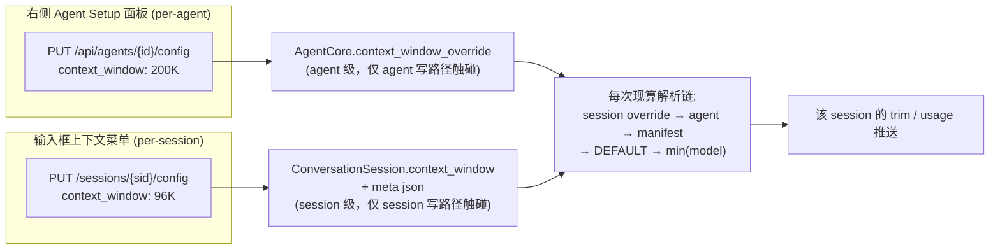
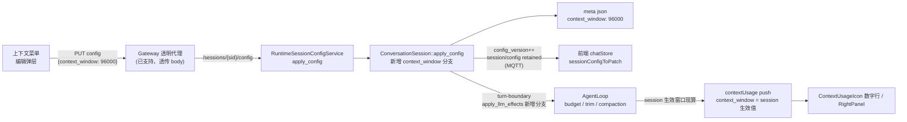

# ADR-074: per-session 上下文窗口覆盖 — `context_window` 从 per-agent 扩展到 per-session

**状态**：草案
**日期**：2026-09-09
**决策者**：大鱼

**前置**：
- [ADR-012](./ADR-012-per-session-model-isolation.md)（per-session model 隔离）
- [ADR-025](./ADR-025-temperature-resolution-chain.md)（temperature 解析链 — 本文档对比对象与反模式来源）
- [ADR-026](./ADR-026-context-window-resolution-chain.md)（per-agent context window cap 解析链 — 本文档在其之上新增 per-session Layer 0）
- [ADR-043](./ADR-043-session-config-state-split.md)（Session Config / State 双主题拆分）
- [ADR-047](./ADR-047-session-config-decouple-from-inference.md)（Session Config 持久化与 LLM 推理解耦 — per-session 字段管线的权威设计）

---

## 1. 决策摘要

### 1.1 一句话

**新增 per-session `context_window` 参数**（存于 session meta json，null = 继承 per-agent 链），接入 ADR-047 的 session-config 管线（`SessionConfigDelta` / `ConversationSession::apply_config` / HTTP `PUT /sessions/{sid}/config` / MQTT retained `session_config`），参与 ADR-026 解析链成为最高优先级 Layer 0，并在输入框上下文用量菜单提供编辑入口——右侧 Agent Setup 面板的 per-agent 设置保持不动，且**永不覆盖**已编辑的 per-session 值。

### 1.2 语义决策（本文档核心，实施前需确认）

| # | 决策 | 结论 |
|---|---|---|
| D1 | meta json 存储语义 | `context_window: Option<u64>`；**null / 缺失 = 继承 agent 链**（agent_config.json → manifest → DEFAULT，再与模型窗口取 min）。**不采用** temperature 的"agent 配置变化时烘焙进每个 session meta"的写回语义 |
| D2 | 只改显示 vs 真正生效 | **真正生效**：per-session 覆盖参与该 session 的 trim / compaction 阈值与 context_usage 推送 |
| D3 | per-session 写路径 | 复用现有 HTTP `PUT /api/agents/{id}/sessions/{sid}/config`（Gateway 已透明代理到 Runtime `PUT /sessions/{sid}/config`），走 `SessionConfigDelta`。**不新增** MQTT control command |
| D4 | 重置 / 哨兵语义 | Delta 中 `context_window: Some(0)` = **清除覆盖、恢复继承**（`None` = 未修改）；正常值域 1..~4M tokens |
| D5 | "已设置"标识 | 不加布尔标志位。override 字段本身的非空性即标识，三层同源：meta json（持久层权威）↔ `ConversationSession`/`SessionState`（后端内存）↔ `SessionChatState.contextWindow`（前端镜像） |

### 1.3 防覆盖保证（Agent Setup 面板 ↔ 上下文菜单）

per-agent 与 per-session 设置**存在两个互不写入的存储**，靠分层而非前端拦截保证不被覆盖：



- per-session 值**绝不落进** `AgentCore.context_window_override`（agent 级字段，`UpdateRuntimeConfig` 会写它）。
- agent 窗口变更只更新 agent 层；有 override 的 session 在解析链中天然优先，不受影响；无 override 的 session 动态跟随（继承语义）。
- 前端唯一防覆盖点是修复 [chatStore.ts](apps/acowork-desktop/src/stores/chatStore.ts) 的 blanket sync（见 §5.3）：agent_config MQTT 事件同步 `contextUsage` 时**跳过 `contextWindow != null` 的 session**。

---

## 2. 背景与问题

### 2.1 现状

- `context_window` 是 per-agent 参数，遵循 ADR-026 三层解析链（agent_config.json → manifest → DEFAULT → min(model context_window)），存于 agent_config.json，仅右侧 Agent Setup 面板可改。
- 输入框上下文用量菜单（`ContextUsageIcon`）展示 `used / total`，total = `ContextUsageInfo.context_window`，由 Runtime 按 per-agent 链推送，**无法按会话差异化**。
- per-session config 管线（ADR-047）已支持 model / provider / workspace_id / reasoning_effort / temperature / title，字段落在 `data/meta/{session_id}.json`，读写经 `SessionConfigService`（HTTP + MQTT retained）。

### 2.2 需求

1. 上下文用量菜单数字行 total 右侧加编辑图标，点击可修改该**会话**的上下文窗口大小。
2. 新参数为 per-session，加在 meta json，与 temperature 同管线。
3. 默认继承 per-agent 值；**用户点击编辑保存后才写独立值**。
4. 新建与存量 session 都要处理好字段的加入与初始化；前端菜单展示源切换为 per-session 生效值。
5. Agent Setup 面板的 per-agent 修改**不得覆盖**已编辑的 per-session 值。

### 2.3 为什么不能直接照搬 temperature 的现状

temperature 现状是本文档的**反模式来源**，需要显式记录（详见 §7）：

- per-session temperature（meta json）已有字段与持久化，但**没有消费路径**：`SessionState::set_temperature` 仅 3 个调用点（agent 配置变更同步 / resume 用 agent 链覆盖 / 创建时同步 agent override），没有任何代码把 `ConversationSession.temperature` 读入 `SessionState`；turn-boundary 的 `llm_effects.rs` 对 temperature 处理数为 0（reasoning_effort 有同步，temperature 没有）。
- resume（[session_manager.rs:1058](core/acowork-runtime/src/agent/session/session_manager.rs#L1058)）解析温度时**不读** `conv.temperature()`，meta 值在重启后会被 agent 链覆盖。
- 语义上 meta 温度是"agent 配置变化时烘焙进每个 session"（[session_manager.rs:1637](core/acowork-runtime/src/agent/session/session_manager.rs#L1637)），一旦真的让 meta 值参与解析，老 session 会**钉死在旧烘焙值**、不再跟随 agent 变更——行为回归。
- 当前无感只是因为**没有 UI 能制造 per-session 温度差异**（埋雷未引爆）。

结论：context_window 的 per-session 语义采用 **null = 继承（不烘焙）**，与 temperature 的烘焙语义刻意分叉；运行时缓存只缓存 **override 本身**，不缓存解析后的 effective 值，从设计上避开 temperature 的"缓存挡住回退链"类缺陷。

---

## 3. 解析链设计

### 3.1 扩展后的解析链（per-session Layer 0）

```text
Layer 0 (最高)  session meta.json context_window（用户在该会话的上下文菜单编辑；0 = 已清除，回到继承）
    ↓ 如果 null / 缺失 / 0
Layer 1         agent_config.json.context_window      用户 Agent 级设置
    ↓ 如果 None 或 0
Layer 2         manifest.llm.context_window            包作者默认
    ↓ 如果 None 或 0
Layer 3         DEFAULT_CONTEXT_WINDOW = 200_000      系统硬编码
    ↓
与模型能力取 min：effective = min(resolved_cap, caps.context_window)
```

### 3.2 统一解析函数（后端唯一 resolve 点）

把现有散落在 `agent_core.resolved_context_cap()` / `loop_context.effective_context_budget()` / `session_manager` resume 初始 usage 的解析逻辑收敛为一个函数（建议放 `agent_core` 或独立 `session_config` 模块，仿 `resolve_effective_reasoning_effort` 模式）：

```rust
/// 输入：session override（ConversationSession / SessionState 缓存）、agent 链来源
/// 输出：该 session 的 effective context cap（参与 trim / compaction / usage 推送）
pub(crate) fn resolve_effective_context_window(
    session_override: Option<u64>,          // Layer 0（Some(n>0)）
    agent_override: Option<u64>,            // Layer 1
    manifest_window: Option<u64>,           // Layer 2
    model_caps: Option<&ModelCapabilitiesInfo>,
) -> u64;
```

**约定**：
- `SessionState` 只缓存 override（与后端持久值同源，由 resume / `apply_llm_effects` 同步），**不缓存算好的 effective 值**——agent 层变化永远能穿透到未编辑的 session。
- 每轮 build / usage 推送时现算 effective，避免 temperature 式的缓存漂移。

---

## 4. 数据流



---

## 5. 文件改动清单

### 5.1 Rust 后端 — 数据面（把字段接入 meta / session-config 管线）

| 文件 | 改动点 |
|---|---|
| [conversation.rs](core/acowork-runtime/src/conversation.rs) | `SessionMeta` 加 `context_window: Option<u64>`（`serde(default, skip_serializing_if = "Option::is_none")`）；`ConversationSession` 加 `Mutex<Option<u64>>`（仿 temperature 字段）；create 初始 None、resume 从 meta 载入；`build_meta` / `config_snapshot` 带上字段；`update_context_window()`；`apply_config` 加 context_window 分支（写锁 + write_meta + notify） |
| [delta.rs](core/acowork-runtime/src/agent/session_config/delta.rs) | `SessionConfigDelta` / `SessionConfigSnapshot` 加 `context_window: Option<u64>`；"新增参数四步清单"注释同步 |
| [mqtt_payload.proto](core/acowork-core/proto/mqtt_payload.proto) | `SessionConfig` 加 `uint64 context_window = 10`（0 = 无覆盖哨兵，仿 temperature NaN 用法）；**重新生成 prost** |
| [server.rs](core/acowork-runtime/src/http/server.rs) | `get_session_config` 返回 raw override（及可选 effective 字段供编辑初值）；`put_session_config` 值域校验（1..~4M 或 0=清除） |

> Gateway 无需改动：session config 代理为透传 body（[proxy.rs:896](core/acowork-gateway/src/http/proxy.rs#L896)）。

### 5.2 Rust 后端 — 运行时生效

| 文件 | 改动点 |
|---|---|
| [agent_core.rs](core/acowork-runtime/src/agent/agent_core.rs) | 解析链收敛为单一 resolve 函数（§3.2）；`resolved_context_cap()` / `context_trim_budget()` 改为可注入 session override |
| [session_state.rs](core/acowork-runtime/src/agent/session_state.rs) | `SessionState` 加 override 缓存字段 + getter/setter（仿 temperature 字段形态，但**语义不同**：只存 override） |
| [session_manager.rs](core/acowork-runtime/src/agent/session/session_manager.rs) | resume / 创建：从 ConversationSession/meta 读 override → 缓存进 SessionState；resume 初始 context_usage（现写死 `self.core.context_window_override`，L1130）改用 session 生效值 |
| [loop_context.rs](core/acowork-runtime/src/agent/loop_context.rs) | `context_trim_budget` / `effective_context_budget` / `compact_threshold` / `trim_history_to_budget` / 每轮 usage 推送全部改走 resolve 函数（含 session override） |
| [llm_effects.rs](core/acowork-runtime/src/agent/session_config/llm_effects.rs) | turn-boundary diff 检测 context_window 变化 → 同步 SessionState override 缓存 + 触发 usage 重算（缩窗后下次 build 的 `trim_history_to_budget` 自动收敛） |

### 5.3 前端

| 文件 | 改动点 |
|---|---|
| [chatStore.ts](apps/acowork-desktop/src/stores/chatStore.ts) | `SessionChatState` 加 `contextWindow: number \| null` + DEFAULT；HTTP fetchSessionConfig 与 MQTT `session_config` 两路径经 mapper 自动带上；新增 `setSessionContextWindow`（PUT + 乐观更新）；**修复 blanket sync（L3192）**：`if (sess.contextWindow != null) continue;`（agent 窗口变更不覆盖已自定义 session） |
| [sessionConfigMapper.ts](apps/acowork-desktop/src/lib/sessionConfigMapper.ts) | `SessionConfigInput` / `SessionConfigPatch` 加 `contextWindow`（0=清除 / 数值=覆盖 / 缺失=不动） |
| [ContextUsageIcon.tsx](apps/acowork-desktop/src/components/chat/ContextUsageIcon.tsx) | 数字行 total 右侧加编辑图标；编辑弹层：常用档位 + 数字输入（K）+ "恢复为 agent 默认（继承）"；保存走 PUT；override 存在时显示来源徽标 |
| i18n | 5 语言文件：编辑 / 保存 / 恢复继承 / "仅本会话生效"提示键 |
| [types.ts](apps/acowork-desktop/src/lib/types.ts) | `ContextUsageInfo.context_window` 注释更新（现为 session 生效窗口） |

### 5.4 文档

- 本文档（ADR-074）；[ADR-026](docs/adr/zh/ADR-026-context-window-resolution-chain.md) 补 per-session Layer 0；[ADR-047](docs/adr/zh/ADR-047-session-config-decouple-from-inference.md) 字段表加 context_window。

---

## 6. 分步实施

每步独立可验证、可回滚：

1. **Step 1 — 后端数据面**：meta / session-config / proto / MQTT retained 管线接入字段（§5.1）。验证：字段落盘、旧 session 无字段兼容（serde default）、HTTP GET/PUT 通。此时解析链未生效，行为不变。
2. **Step 2 — 后端运行时生效**：session Layer 0 进解析链 + `apply_llm_effects` 分支（§5.2）。验证：改会话窗口 → trim / compaction 阈值与 usage 推送按 session 生效值。
3. **Step 3 — HTTP 服务层完善**：`get_config` 返回 override + effective、PUT 值域校验（§5.1 server.rs 行）。
4. **Step 4 — 前端**：状态 / mapper / 编辑 UI / i18n / blanket-sync 修复（§5.3）。验证：菜单展示源切换 + 编辑闭环 + agent 修改不覆盖场景（§1.3 矩阵）。
5. **Step 5 — 文档 + 收尾**：ADR-026 / ADR-047 更新、E2E smoke。

---

## 7. temperature 的处理决定（本次不修改，理由存档）

**决定（用户拍板，方案 C）**：本次**不顺手修改** temperature 的半成品缺陷，后续有 per-session 温度 UI 需求时再按本 ADR 的同一模式统一修复。

理由：
1. temperature 缺陷当前**不可见**（无 UI 能制造 per-session 温度差异，埋雷未引爆），修复无用户价值且引入行为变化风险。
2. 修复会触发语义回归（老 session meta 烘焙值钉死，不再跟随 agent 变更），需额外迁移策略，超出本功能范围。
3. 本 ADR 已刻意不与 temperature 同语义（null=继承 vs 烘焙），结构上保证 context_window 不被 temperature 的坏模式污染。

**留给未来的修复方向**（记录在案）：统一 temperature / context_window / reasoning_effort 为同一套"per-session override 优先 + 统一 resolve 函数 + turn-boundary 同步"模式；补 llm_effects 的 temperature 同步；resume 读 `conv.temperature()`；存量烘焙值的迁移单独评审。

---

## 8. 备选方案与拒绝理由

| 备选 | 拒绝理由 |
|---|---|
| meta 烘焙 agent 值（对齐 temperature） | agent 改窗口后旧 session 钉死旧值，且与"编辑后才写独立值"矛盾（D1） |
| 新增 MQTT control command（`context_window`） | HTTP `PUT /sessions/{sid}/config` 已存在且被 Gateway 代理，走它零新增协议面（D3） |
| 加 `isOverridden: bool` 标志位 | `Option<u64>` 单字段只有合法两态；布尔会引入 `true+null` / `false+Some` 非法组合，且多一份会漂移的 truth（D5） |
| 前端缓存"解析后的 effective 窗口" | 与 temperature 的缓存坑同构：agent 变更会挡住；只缓存 override、每次现算（§3.2） |
| 本功能只做 meta + 显示、不做运行时生效（D2） | 显示 96K 而 runtime 按 128K trim，前后矛盾，UI 与真实行为漂移 |

---

## 9. 开放问题（实施前需确认）

1. **usage 即时推送策略**（Step 2）：空闲（无运行 loop）会话改窗口后，usage 是否立即推送？
   - 方案 A：复用 turn-boundary `apply_llm_effects`（简单，显示延迟到下一轮消息）；
   - 方案 B：`SessionConfigService` 在会话空闲时也触发一次 usage 重算广播（需 service → session_manager 回调，改动大）。
   - 倾向先 A，观察 UX 后再决定是否上 B。
2. **编辑 UI 交互细节**：档位 + 数字输入 + "恢复默认"三态是否足够；输入单位（K vs 绝对值）。
3. **HTTP `get_config` 返回形态**：raw override 单字段即可，还是加 `effective_context_window` 冗余字段（前端编辑初值在没有 contextUsage 推送时可回退 agent 值）。
4. **存量 session 迁移**：按 D1 语义（null=继承）**无需主动迁移**——旧 meta 无该字段经 serde default 读为 None，字段在下次 meta 写盘时自然补上。确认不要求物理回填所有历史文件。
5. **值域与 UI 上限**：Session 编辑允许值是否需要按当前模型 context_window clamp，还是仅提示不强制（runtime 侧最终 min）。
