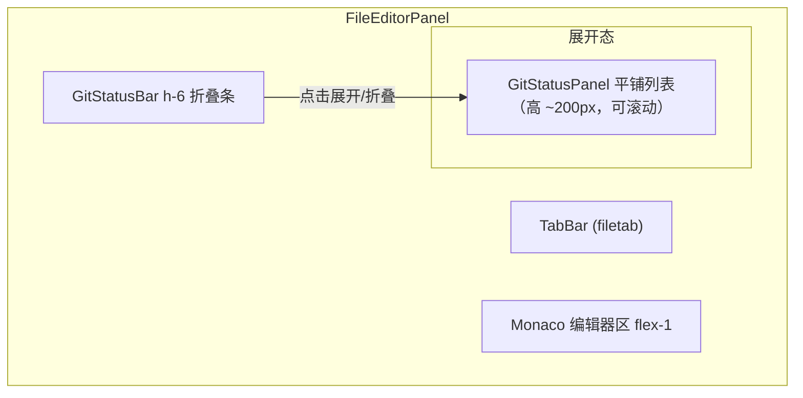
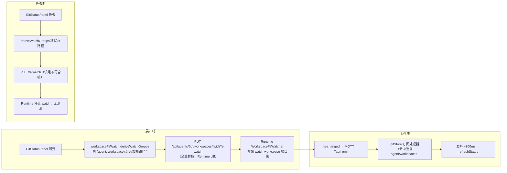

# ADR-078: 工作区 Git 版本控制条（Desktop Git Status Bar）

**状态**：草案（待评审）
**日期**：2026-09-14
**决策者**：大鱼

**前置**：
- [ADR-009](./ADR-009-gateway-workspace-isolation.md)（§5 Gateway 边界 — workspace 文件（含 .git）是 Agent 私有数据，读写**只能走 Runtime HTTP 反代**，禁止 Gateway 侧直接 fs 访问）
- [ADR-033](./ADR-033-mqtt-replace-grpc-websocket.md)（Gateway HTTP 反代 Phase 2 — Desktop ──HTTP──▶ Gateway :19876 ──反代──▶ Runtime localhost HTTP，见 [proxy.rs](core/acowork-gateway/src/http/proxy.rs) 头注）
- [ADR-055](./ADR-055-remote-runtime-node-topology.md)（install_path 是 node-local 路径 — Runtime 持有 workspace 物理路径，git 操作必须由 Runtime 执行才能在多机拓扑成立）
- [ADR-058](./ADR-058-workspace-fs-watcher-mqtt-event.md)（Workspace fs 变更经 MQTT 推送 — demand-driven 订阅机制：Runtime watcher 只 watch 前端可见路径，本 ADR 的刷新策略复用同一链路）
- [ADR-073](./ADR-073-agent-instance-identity-decomposition.md)（AgentList 折叠分组范式 — NodeGroupHeader 视觉规格是本 ADR 折叠条的样式来源）
- [ADR-024](./ADR-024-merge-metadata-into-index.md)（文件内容渲染范式 — Monaco + filetab 打开文件是既有路径，diff/log 复用之）

---

## 1. 决策摘要

### 1.1 一句话

**在右侧工作区（FileEditorPanel）底部加一条"版本控制条"**：显示当前 workspace 的 git 分支与变更计数，点击折叠展开（视觉沿用 AgentList 的 NodeGroupHeader 风格）；展开后以**平铺列表**（不分目录、行样式与工作树文件列表一致）展示 `git status` 的本地未 commit 文件；行右键菜单提供 **Show Diff / Show Log / 在编辑器中打开**。Show Diff 用 **Monaco DiffEditor 双栏**（HEAD ↔ 工作树），Show Log 用只读文本，两者均以**只读虚拟文件**形式进 filetab。git 执行在 **Runtime**（新 `/git/*` HTTP API，Gateway 反代）；状态刷新**复用 ADR-058 fs-watch 的 demand-driven 订阅**（面板展开时订阅、折叠时取消）。v1 **只读**，不做 stage / commit / push。

### 1.2 关键决策表（详细理由见 §4）

| # | 决策 | 结论 |
|---|---|---|
| 1 | git 执行位置 | **Runtime**（新增 `/git/status` `/git/diff` `/git/log` 三个只读 API），Gateway 反代 `/api/agents/{id}/git/*`；**不**放 Gateway 侧 fs（ADR-009 / ADR-055 红线） |
| 2 | git 引擎 | **系统 git CLI**（`git status --porcelain=v1 -z` / `git show HEAD:<path>` / `git log`），不引入 git2 / gix 编译依赖；`std::process::Command` + `spawn_blocking` + 超时 + 输出上限 + **`GIT_OPTIONAL_LOCKS=0`**（真·只读）；git 缺失时显式报错 |
| 3 | repo root 定位与安全边界 | 从 workspace root 向上**最多 6 层**发现最近 `.git`；**展示范围 = workspace root ∩ repo 变更集**（status 只列 workspace 内变化，绝不暴露 workspace 外文件）；diff/log 的 path 复用现有 canonicalize + `starts_with` 防穿越 |
| 4 | Desktop 数据层 | 新 `gitStore.ts`（仿 [stores/fileTree/treeClient.ts](apps/acowork-desktop/src/stores/fileTree/treeClient.ts)：SWR 缓存 + agent/workspace 切换失效 + `with503Retry`），并订阅 fs-changed 事件做自动刷新 |
| 5 | Desktop UI 布局 | `GitStatusBar`（FileEditorPanel 底部，h-6，视觉沿用 NodeGroupHeader）+ 展开后 `GitStatusPanel`（平铺列表，行样式沿用 FileTreeNode） |
| 6 | diff/log 呈现 | **只读虚拟文件进 filetab**（`OpenFile` 增加 `readonly` + `virtual` 字段）：diff 用 **Monaco DiffEditor 双栏**（original=HEAD / modified=工作树，双栏均只读），log 用只读单栏 Monaco；不落盘、不接 LSP、可关闭 |
| 7 | 刷新策略 | **demand-driven 订阅 ADR-058 fs-watch**：面板展开时把 workspace 根路径加入可见集（Runtime watch 根目录），折叠时移除（停止 watch）；fs-changed → 去抖 refresh；手动刷新按钮兜底 |
| 8 | 范围裁剪 | v1 **只读**：不做 stage / unstage / commit / push / branch 切换 / blame / stash |

### 1.3 不变量（必须满足）

1. **git 操作只读**：三个 API 不得改动工作树、.git、index 或 refs（统一设 `GIT_OPTIONAL_LOCKS=0` 禁止 git 的可选加锁子操作——porcelain status 的 index stat-cache 刷新、`git show` 均被覆盖；不启用外部 diff 工具）。
2. **路径永不逃逸 workspace**：所有 diff/log 请求 path 必须 canonicalize 后位于 workspace root 内（复用 `resolve_within_static` 防护）；status 输出在 Runtime 侧按 workspace root 前缀**过滤**后再返回。
3. **不暴露绝对路径**：响应里的 path 一律相对 workspace root（与工作树 API 惯例一致），repo_root 只回 `is_repo: bool`，不返回 node 机器绝对路径。
4. **Gateway 不碰 fs**：新增能力全部落在 Runtime，Gateway 仅反代（ADR-009 红线由 `run_gateway_fs_redline` 守护）。
5. **git 不可用 / 非 repo 不静默**：显式错误态（`not_a_repo` / `git_unavailable`），UI 显示对应空态，不做静默降级。
6. **订阅与可见性一致**：git 面板**展开时才订阅** fs-watch、**折叠时必须取消**（复用 workspaceFsWatch 的 demand-driven 机制，不留 watch 泄漏）。

---

## 2. 背景与动机

### 2.1 现状：工作区是"文件黑洞"，git 状态不可见

Desktop 已有完整的工作树文件浏览（`WorkspaceExplorer` → `GET /workspaces/tree`，Runtime 持有物理路径）、Monaco 编辑器 + filetab（`FileEditorPanel` + `fileEditorStore`）、基于 demand-driven fs-watch 的文件变更推送（ADR-058）。但：

- 用户把 agent 的 workspace 当项目目录用（常见：workspace 本身就是 git repo，或 repo 的子目录），却**无法在 IDE 里看到"哪些文件改了"**。
- 要看 diff / log 只能切到外部终端/IDE 敲 git 命令，工作流断裂。
- 工作树文件列表不会显示 git 状态徽标（M / U / D），用户不知道哪些文件是脏的。

### 2.2 已有可复用的积木

| 积木 | 位置 | 复用点 |
|---|---|---|
| Gateway 反代 | [proxy.rs](core/acowork-gateway/src/http/proxy.rs) `proxy_routes()` | 新增 3 条 `/api/agents/{id}/git/*` 路由，转发到 Runtime `/git/*` |
| Runtime workspace 服务 | [usecases/workspace_query_impl.rs](core/acowork-runtime/src/usecases/workspace_query_impl.rs)、`resolve_workspace_root` | git service 复用 workspace root 解析与路径防护 |
| 折叠分组头视觉 | [AgentList.tsx](apps/acowork-desktop/src/components/agent-list/AgentList.tsx#L838) `NodeGroupHeader`（h-6 / ChevronRight rotate-90 / text-[10px] uppercase / border-y divider / hover 变色） | GitStatusBar 折叠条的样式来源 |
| 工作树文件行样式 | [FileTreeNode.tsx](apps/acowork-desktop/src/components/workspace/FileTree/FileTreeNode.tsx)（行高 `fontSize×16×1.9`、`var(--ui-font-size)`、SetiIcon / getFileIcon） | GitStatusPanel 平铺行的样式来源 |
| demand-driven fs-watch | [workspaceFsWatch.ts](apps/acowork-desktop/src/lib/workspaceFsWatch.ts)（可见集推导 → `PUT /fs-watch`）+ [workspaceFsEvents.ts](apps/acowork-desktop/src/lib/workspaceFsEvents.ts)（MQTT fs-changed 桥接） | GitStatusPanel 展开/折叠的订阅开关与自动刷新 |
| 只读/含内容打开文件 | `fileEditorStore.openFileWithContent` | 虚拟只读文件复用之，但需扩展 `readonly` / `virtual` 字段 |
| 右键菜单 | `ContextMenu`（tab 右键同款） | GitStatusPanel 行右键复用 |

### 2.3 已尝试 / 已拒绝的方案

- **在 Gateway 侧跑 git / 读 .git**：直接违反 ADR-009 红线，单机可用、多机必 5xx——与工作树文件操作迁移到 Runtime 的历史教训相同（proxy.rs 注释 "ADR-009 v2: the Runtime is the authoritative workspace API owner"），**拒绝**。
- **前端直接用 git2 的 WASM / JS 实现**：引入大依赖且无法复用 Runtime 的路径边界，**拒绝**。
- **版本控制做成独立侧栏 / 全屏视图**：用户明确要"底部一条 + 点击展开"，且文件要在 filetab 里打开——独立视图割裂交互，**拒绝**。
- **status 用单栏合并 diff 文本**：作为 DiffEditor 的轻量备选考虑过，但用户要求**双栏**；且双栏需要 original/modified 两个**全文**而非解析后的 diff 文本（从统一 diff 反解全文不可靠），因此 API 直接返回两段内容，**采纳双栏**。

---

## 3. 目标

### 3.1 功能需求

1. 底部版本控制条：显示 branch 名 + 变更计数（modified / untracked / staged / deleted），点击展开/折叠。
2. 展开面板：平铺列出 `git status` 的本地未 commit 文件，**不分目录**，行样式与工作树文件列表一致；每行带状态徽标（M / U / D / A / R）与文件图标。
3. 行点击：在 Monaco + filetab 打开该文件（复用 `openFile`）。
4. 行右键菜单：`Show Diff`、`Show Log`、`在编辑器中打开`、`复制路径`。
5. Show Diff：**DiffEditor 双栏**（HEAD ↔ 工作树，双栏只读）进 filetab；Show Log：该文件提交历史（只读）进 filetab。
6. 折叠展开的视觉/交互沿用左侧 AgentList 的 node 折叠风格。
7. **自动刷新**：面板展开时订阅 fs-watch（根路径），折叠时取消——与工作树原理一致（ADR-058 demand-driven）；刷新信号 = 任意可见路径的 fs-changed + 手动按钮；**嵌套目录的外部修改不保证覆盖**（NonRecursive 限制，见决策 8）。

### 3.2 非功能需求

- **安全**：见 §1.3 不变量（只读、路径防穿越、范围过滤、不暴露绝对路径）。
- **性能**：porcelain status 一次 <100ms；每次展开/刷新一次请求；diff 只对单文件（`git show` 单路径）；订阅在折叠后立即释放，无后台空转。
- **兼容**：纯新增 API 与 UI，可独立回滚；路径语义与工作树 API 一致。
- **可观测**：git 调用失败返回结构化错误（Runtime 侧 log），UI 显示错误态而非空白。

### 3.3 明确不做（v1，YAGNI）

- stage / unstage / commit / push / pull / branch 切换 / stash / blame / clean。
- 工作树文件列表内嵌 git 状态徽标（如 VSCode 的 gutter dot）——可作后续迭代，本 ADR 只做底部版本控制条。
- diff 的逐行导航 / 前后跳转 / 快速修复增强（DiffEditor 基础能力够用）。
- 展开面板高度拖拽调高（v1 固定 ~200px）。

---

## 4. 决策

### 决策 1：git 执行位置 — Runtime，沿用 ADR-033 反代模式

新增三个 Runtime 只读端点，Gateway 反代暴露给 Desktop：

```
Desktop ──HTTP──▶ Gateway :19876
   GET /api/agents/{id}/git/status?workspace_id=…
   GET /api/agents/{id}/git/diff?workspace_id=…&path=…&cached=0|1
   GET /api/agents/{id}/git/log?workspace_id=…&path=…&limit=50
        │  反代（proxy_routes，forward 到 Runtime localhost）
        ▼
Runtime :random
   GET /git/status?workspace_id=…
   GET /git/diff?workspace_id=…&path=…&cached=0|1
   GET /git/log?workspace_id=…&path=…&limit=50
```

**理由**：
- workspace root 只有 Runtime 能解析（`resolve_workspace_root`，含 `__agent_home__` 与 additional_dirs），git 读的是同一份物理文件，同源即同层。
- install_path 是 node-local（ADR-055），Gateway 侧 fs 读单机可用、跨机必 5xx——工作树文件操作因此迁到 Runtime，git 不该重蹈覆辙。
- 与现有 `workspaces/tree`、`workspaces/search` 同一信任边界、同一套反代代码路径，无新机制。

**实现**：Runtime 新增 `usecases/git_query.rs` + `git_query_impl.rs`（仿 workspace_query），`http/server.rs` 注册三路由；Gateway `proxy.rs` 加 3 条反代。`workspace_id` 语义与现有 workspaces API 完全一致（缺省 `__agent_home__`）。

### 决策 2：git 引擎 — 系统 git CLI（porcelain），不引 git2 / gix

**对比**：

| 方案 | 优点 | 缺点 | 结论 |
|---|---|---|---|
| A. 系统 git CLI | 零编译依赖；ignore/attributes/submodule 行为与用户环境 100% 一致；Runtime 本就具备子进程能力 | 依赖运行时装了 git；输出需解析 | **推荐** |
| B. gix（gitoxide） | 纯 Rust、无系统依赖、解析安全 | 新增大依赖（workspace 13 crate 尚无）；对 LFS/部分 hook 语义覆盖不全 | 备选，暂缓 |
| C. git2（libgit2） | 成熟、API 友好 | 需 C 库或 vendored 编译，编译链重；与系统 git 版本行为可能不一致 | 拒绝 |

**执行规范**（关键，防注入/防异常）：
- `std::process::Command` + `spawn_blocking`（与 [shell.rs](core/acowork-runtime/src/tools/builtin/shell.rs#L267) 的跨平台约定一致——Windows 上 `tokio::process::Command` 的 async named-pipe I/O 有兼容问题，本代码库子进程一律 std + spawn_blocking），**不拼 shell 字符串**；repo root / path 均以 `Command::arg` 传递；路径参数用 `--` 分隔符保护以 `-` 开头的名字。
- 三个命令统一设置环境变量 **`GIT_OPTIONAL_LOCKS=0`**——禁止 git 的可选加锁子操作（`git status` 会做 index stat-cache 刷新，racy-git 时写 `.git/index`；该环境变量使其跳过），从而 §1.3 不变量 1（真·只读，不改动 .git/index/refs）字面成立，不依赖"porcelain 恰好不写"的实现巧合。
- 命令固定 `cwd = repo_root`；统一超时（默认 10s）；stdout 上限。
- 具体命令：
  - status：`git status --porcelain=v1 -z --untracked-files=all --branch`
  - diff original（HEAD 版）：`git show HEAD:<path>`（untracked 无，见决策 4）
  - diff modified（staged 时 index 版）：`git show :<path>`
  - log：`git log --no-ext-diff -n {limit} --pretty=format:%h%x1f%an%x1f%aI%x1f%s -- <path>`
  - 类型判定（untracked / binary / no_change）：由 porcelain status 的 XY 状态 + `git diff --numstat`（`-` 判二进制）得出。
- git 缺失（`git --version` 失败）→ `git_unavailable`；非 repo → `is_repo: false`（见决策 3）。
- `-z` 输出用 NUL 分隔字段解析：v1 `-z` 下每条 `XY <path>`，rename 为 `XY <old>\0<new>`；需正确处理 C-style 引号转义与中文/空格路径。

### 决策 3：repo root 定位与安全边界

**Repo discovery**：
- 从 workspace root 开始，向上逐级检查 `.git`（目录，或文件——覆盖 worktree / submodule / `gitdir:` 指针），**最多向上 6 层**（含自身）；找到的第一个 `.git` 的父目录即 repo root。
- 找不到 → `is_repo: false`，UI 显示"非 Git 仓库"空态（版本控制条仍可展开，显示提示，不渲染列表）。

**范围过滤（核心边界决策，已确认）**：
- git 命令天然作用于整个 repo，但 **status 返回给 UI 的变更集必须 ⊆ workspace root**。Runtime 对 porcelain 输出的每个 path 做 `strip_prefix(workspace_root)` 过滤，落在 workspace 外的变更丢弃。
- 这覆盖两类典型拓扑：
  - workspace 本身就是 repo root（最常见）；
  - workspace 是 repo 的子目录（如本仓库被某 agent 当 workspace）——此时**只显示 workspace 内文件的变更**，绝不把 repo 里其他目录的文件暴露给该 agent 的 UI。
- **为什么不把 repo root 限定为 == workspace root**：用户把 agent workspace 放在项目仓库子目录是常见用法，硬性要求 workspace 必须独立成 repo 会破坏这类场景；过滤方案在实现上只多一次前缀判断，收益大于成本。

**路径防护（diff/log）**：
- 复用 `resolve_within_static` 的 canonicalize + `starts_with(canonical_root)` 校验（[workspace_mutation_impl.rs](core/acowork-runtime/src/usecases/workspace_mutation_impl.rs)），`../`、绝对路径、符号链接逃逸一律拒绝。
- 请求 path 相对 workspace root。**传给 git 的 path 是 repo-root-relative**，转换链固定为：
  `workspace-relative → workspace_root.join → canonicalize + starts_with 校验 → strip repo_root 前缀 → repo-root-relative`
- workspace == repo root 时两个基准重合（最常见路径，实现时"碰巧正确"）；workspace ⊂ repo 时 **strip 必须用 repo_root 而非 workspace_root**——否则 `git show HEAD:<path>` / `git log -- <path>` 会报 "does not exist in HEAD" / "no such path"。这是本 ADR 最容易实现错、且只在子目录场景暴露的隐蔽 bug，§7.1 必须有专门用例（见 2026-09-14 评审修订）。

### 决策 4：Runtime HTTP API

**`GET /git/status?workspace_id=…`**
```json
200 {
  "is_repo": true,
  "branch": "develop",
  "error": null,                          // "not_a_repo" | "git_unavailable" | null
  "truncated": false,                     // porcelain 输出超上限被截断时为 true
  "changes": [
    { "path": "src/lib/foo.ts",           // 相对 workspace root，与工作树 relPath 一致
      "oldPath": null,                    // index/worktree == renamed 时为旧路径（相对 workspace root），否则 null
      "index":  "modified",               // added|modified|deleted|renamed|unmodified
      "worktree": "modified",             // modified|deleted|untracked|unmodified
      "staged": true }                    // index != unmodified
  ]
}
```
- `index` / `worktree` 两列映射自 porcelain XY（X=index，Y=worktree），为未来 stage/commit 预留状态模型（决策 9）。
- **`oldPath` 是 renamed 状态在 diff/UI 的出口**：porcelain `-z` 的 rename 条目是 `XY <old>\0<new>` 双路径，解析时必须把 old 存入 `oldPath`（相对 workspace root，过滤规则同 path），否则 Show Diff 无法取 `git show HEAD:<oldPath>`（HEAD 里只有旧路径）。
- 变更排序：staged 优先，再按 M / U / D / A / R 分组排序（v1 固定，不做用户排序）。
- **输出上限**：porcelain 输出设字节/条目上限（建议 1 MiB 或 5000 条，二选一先到先截），超限置 `truncated: true` 并截断 changes（`--untracked-files=all` 对未 ignore 的大目录会爆量，必须有上限）。

**`GET /git/diff?workspace_id=…&path=…&cached=0|1`** — 为 DiffEditor 双栏返回两段**全文**：
```json
200 {
  "kind": "modified" | "untracked" | "deleted" | "binary" | "no_change",
  "original": "…",      // HEAD 版全文；untracked 为 ""；deleted 为 HEAD 全文；staged(cached=1) 时本字段为 HEAD，modified 为 index
  "modified": "…"       // 工作树全文；deleted 为 ""；cached=1 时为 index 全文 git show :<path>
}
```
- cached=0（默认，Show Diff）：original = `git show HEAD:<path>`（**renamed 文件为 `git show HEAD:<oldPath>`**），modified = 工作树文件内容（复用 Runtime 现有 `/workspaces/file` 读取逻辑，保证与工作树一致）。
- cached=1（Staged Diff，预留）：original = HEAD，modified = `git show :<path>`（index）。
- untracked：`original=""`、`modified=文件内容`（DiffEditor 呈现全新增）；**deleted：`original=HEAD 全文`、`modified=""`（DiffEditor 呈现全删除；deleted 文件行点击在 UI 侧重定向到 Show Diff，见决策 6）**；binary：`kind="binary"` 不返回内容（DiffEditor 显示占位）；无差异 → `kind="no_change"`。
- 大文件上限：文件 > 2 MiB（original 或 modified 任一）→ `kind="binary"` 占位（与 search bailout 口径一致，避免 `git show` 大 blob / LFS 卡顿；2026-09-14 评审采纳）。
- 拒绝 `git diff` 文本方案的理由：DiffEditor 需要两个全文，从统一 diff 文本反解全文不可靠（合并冲突/无上下文时更甚），直接返回两段内容最稳。

**`GET /git/log?workspace_id=…&path=…&limit=50`**
```json
200 { "commits": [ { "hash": "…", "short_hash": "…", "author": "…", "date": "…", "subject": "…" } ] }
```
- `limit` 上限 200（默认 50，超 200 截断为 200）；`path` 同 diff 的 repo-root-relative 转换链。

所有响应 path 相对 workspace root（不变量 3）。

### 决策 5：Gateway 反代 + Desktop 数据层（gitStore）

- `proxy.rs` 新增 3 条反代（与 `workspaces/tree` 同款 handler，转发 query 原样透传）。
- Desktop 新增 `stores/gitStore.ts`：仿 [stores/fileTree/treeClient.ts](apps/acowork-desktop/src/stores/fileTree/treeClient.ts)——SWR 缓存 + 去重 + `with503Retry`；`fetchStatus(agentId, workspaceId)`、`fetchDiff(...)`、`fetchLog(...)`；`invalidate(agentId, workspaceId)`（切换 agent/workspace 时清空）；`refresh()` 强制直取。另注册 fs-changed 事件处理器（见决策 7）。

### 决策 6：UI — GitStatusBar + GitStatusPanel

**布局**（FileEditorPanel 根容器底部，编辑器/tab 之下）：



- **GitStatusBar**：视觉规格**沿用 NodeGroupHeader**（[AgentList.tsx](apps/acowork-desktop/src/components/agent-list/AgentList.tsx#L838) `NodeGroupHeader`）：`h-6`、`text-[10px] font-medium uppercase tracking-wide`、`zinc-400/zinc-500`、`border-y border-nav-divider/40`、hover 变色、ChevronRight 展开时 `rotate-90`。左侧 Git 图标 + branch 名 + 变更计数 pill（`M×n U×m D×k`），右侧刷新按钮（RefreshCw）。无 repo / git 缺失显示对应文案。
- **GitStatusPanel**：**平铺列表、不分目录**；行样式沿用 FileTreeNode：行高 `fontSize×16×1.9`（虚拟滚动 `estimateSize` 一致）、`var(--ui-font-size)`、SetiIcon/getFileIcon 文件图标、文件名 + 右侧状态徽标（M 黄 / U 绿 / D 红 / A 青，参照 VSCode 惯例色）。虚拟列表复用 `@tanstack/react-virtual`（工作树同款）。
- 行点击 → `fileEditorStore.openFile(agentId, workspaceId, path)`；**worktree == "deleted" 的文件行点击重定向到 Show Diff**（openFile 读已删除文件必 404，直接给用户看 HEAD↔空 的删除视图）；行右键 → `ContextMenu`（tab 右键同款组件），菜单项：Show Diff / Show Log / 在编辑器中打开 / 复制路径（deleted 文件隐藏"在编辑器中打开"）。
- 折叠状态组件本地 state（`useState`），与 AgentList 的 `collapsedNodes` 同范式；agent/workspace 切换时收起、失效缓存并**取消订阅**。

### 决策 7：diff / log 以只读虚拟文件进 filetab（diff 用 DiffEditor 双栏）

- `fileEditorStore.OpenFile` 增加可选字段：
  - `readonly?: boolean` —— Monaco 设 `readOnly: true`，保存按钮隐藏/禁用；
  - `virtual?: { kind: "diff" | "log"; basePath: string; original?: string; modified?: string }` —— 标记不落盘、不参与工作树、不接 LSP。
- 文件 id 约定 `${agentId}:git:diff:<workspaceId>:<path>` / `${agentId}:git:log:<workspaceId>:<path>`，**必须含 agentId**（与 OpenFile.id 的 `${agentId}:${workspaceId}:${relPath}` 惯例一致——两个 agent 共用 `__agent_home__` workspace 时不含 agentId 会 tab 碰撞），保证 tab 唯一可切换。
- **diff 渲染分支**：`FileEditorPanel` 对 `virtual.kind === "diff"` 渲染 **Monaco `<DiffEditor original={original} modified={modified}>`**（双栏均只读），original 来自 `/git/diff.original`，modified 来自 `/git/diff.modified`；文件图标用 FileDiff。untracked（original 空）与 binary（占位）在此分支内特判。
- **log 渲染分支**：`virtual.kind === "log"` 渲染只读单栏 Monaco（plaintext，标题 `log: <path>`）。
- 打开路径：先 `gitStore.fetchDiff/fetchLog` 取数据，再 `openFileWithContent(agentId, workspaceId, <virtualId>, <content>, <language>)` 并写入 original（diff）。
- 关闭即释放：走现有 `registerFileDisposer` 机制释放 Monaco model/editor（虚拟文件无 LSP，disposer 只释放 model，天然兼容）。
- 不落盘：虚拟文件不进 `saveFile`、不参与 dirty 计数、不触发 fs-watch 上报（virtual 文件不贡献 watch 路径）。

### 决策 8：刷新策略 — demand-driven 订阅 ADR-058 fs-watch（已确认）

**复用工作树同一套订阅机制**，语义与"工作树展开目录才 watch、折叠即取消"完全一致：



- **展开才订阅**：`GitStatusPanel` 展开时，`workspaceFsWatch.deriveWatchGroups()` 增加一条派生规则——若当前 (agent, workspace) 的 git 面板展开，则向该组添加根路径 `""`（工作树自身可见时根路径已含，去重即可）。
  **规则位置**：此派生规则必须放在 workspace 面板可见性守卫（`activePanelTab === "workspace" && !rightPanelCollapsed`）**之外**——GitStatusBar 挂在 FileEditorPanel 底部，与工作树面板可见性正交，"编辑器开着但工作树面板折叠"时也要订阅。
- **折叠即取消**：折叠时该派生规则不再贡献根路径，`PUT /fs-watch` 上报后 Runtime 停 watch——与工作树"折叠目录即取消 watch"同一机制，无泄漏（不变量 6）。
- **自动刷新（真实覆盖范围）**：gitStore 注册 `workspaceFsEvents` 的 fs-changed 处理器，命中当前 (agent, workspace) 的**任意可见路径**事件去抖后 `refreshStatus()`。
  **注意：Runtime fs-watcher 是 NonRecursive 逐级 watch**（[fs_watcher.rs](core/acowork-runtime/src/workspace/fs_watcher.rs)——open tab 按文件、展开目录按一层），根路径 `""` 入可见集只 watch 工作区**顶层**。因此刷新信号的实际来源是"open tab 保存 / 文件树展开目录的变化 / 顶层条目变化"；任一可见事件都会触发**全量** status 刷新（每次 refresh 都是全量 status，一次事件即可拉平全部状态）。
  **不承诺覆盖嵌套目录的外部修改**：`src/lib/foo.ts` 这类嵌套路径，若父目录未在文件树展开且文件未开在 tab，其外部修改**不会**产生事件（NonRecursive 限制）。v1 明确不做递归 watch，此缺口由手动刷新兜底（2026-09-14 评审修正）。
- **手动刷新兜底**：保留 RefreshCw 按钮——覆盖上述未覆盖场景（终端 commit / stage 只改 `.git` 内部文件、嵌套目录外部修改）。附带验证项：workspace == repo root 且根路径被 watch 时，终端 `git add`/`commit` 改写 `.git/index` 会改 `.git` 的 mtime，notify 可能将其报为 `.git` Modified 事件（平台相关）——**实现时验证，可达则作为免费增强，不依赖**。
- 展开态下刷新仅局部更新 changes 数组，不重建列表滚动位置。

### 决策 9：范围裁剪 — v1 只读，但为未来留接口形状

- 明确不做：stage / unstage / commit / push / pull / branch 切换 / stash / blame / clean / revert。
- 预留：porcelain XY 两列状态模型已完整携带 index（staged）信息；`/git/diff?cached=1` 已定义 Staged Diff 语义，未来加 `POST /git/stage`、`POST /git/commit` 时无需改 status/diff 数据结构，只需新增写端点并接受评审（写操作涉及工作树与 .git 变更，须单独过安全评审）。

---

## 5. 后果

### 5.1 正面

- 工作区从"文件黑洞"变成可见的版本控制状态；diff（双栏）/log 可视化闭环（filetab 可切换、可关闭）。
- 全部复用既有积木：反代、workspace root 解析、路径防护、折叠头样式、工作树行样式、ContextMenu、filetab/Monaco、SWR store 范式、**ADR-058 demand-driven 订阅**——无新机制。
- 自动刷新按可见性驱动：展开订阅、折叠释放，无后台空转；安全边界清晰（只读 + 范围过滤 + 路径防穿越 + 不暴露绝对路径），无新信任面。

### 5.2 负面 / 成本

- Runtime 每次 status/diff/log 多一次子进程 git 调用（百 ms 级，可接受）；需维护 porcelain `-z` 解析器（含转义/rename/中文路径）。
- 引入"系统装有 git"的运行时假设；git 缺失时功能不可用（显式错误态，不静默）。
- DiffEditor 双栏需要 original/modified 两段全文（`git show HEAD:<path>` 对超大/LFS 文件可能较慢），且虚拟只读文件是 filetab/OpenFile 模型的新形态，需在 store 与 UI 多处确认 readonly 语义不漏。

### 5.3 边界 / 例外

- workspace 非 repo → 展开显示"非 Git 仓库"空态；git 缺失 → 错误态 + 引导提示。
- untracked 文件 diff：original 为空串，DiffEditor 呈现全新增；**deleted 文件：original 为 HEAD 全文、modified 为空串，呈现全删除，行点击重定向到 Show Diff**（决策 6）。
- workspace 是 repo 子目录时，仅显示 workspace 内变更（§决策 3 范围过滤，已确认）；diff/log 的 path 按 repo-root-relative 转换链传给 git（§决策 3）。
- 终端 commit / stage（只改 `.git`）与**嵌套目录外部修改**不保证触发 fs-watch → 依赖手动刷新兜底（决策 8）；workspace == repo root 时 `.git` mtime 事件作为附带验证项，不依赖。

### 5.4 回滚

- 纯新增、可独立回滚：Runtime 三条只读路由、Gateway 三条反代、Desktop 组件与 store 均可独立移除；移除 `GitStatusBar` 即回滚 UI，API 可暂时保留不影响任何现有路径。
- 对 `workspaceFsWatch.ts` 的改动是"新增一条派生规则"，移除后工作树订阅行为完全还原；无 schema 变更、无迁移、无存量数据影响。

### 5.5 已知技术债

- porcelain `-z` 解析器需覆盖：引号转义、rename 双路径、中文/emoji/空格路径、submodule 条目（160000 模式）。
- DiffEditor 的 untracked / deleted / binary / no_change 四种特判渲染较细，需单独测试；超大文件（LFS）性能未优化（v1 用 >2 MiB → binary 占位兜底）。
- 展开面板高度 v1 固定 ~200px，不做拖拽调高（列为后续）。

---

## 6. 改动清单（按 crate / 文件）

| 层 | 文件 | 改动 |
|---|---|---|
| core/acowork-runtime | `src/http/server.rs` | 注册 `GET /git/status|diff|log` 三路由 |
| core/acowork-runtime | `src/usecases/git_query.rs` / `git_query_impl.rs` | 新增：repo discovery、porcelain `-z` 解析、范围过滤、diff original/modified 组装、log（仿 workspace_query 分层） |
| core/acowork-runtime | `src/usecases/mod.rs` | 导出 git_query |
| core/acowork-gateway | `src/http/proxy.rs` | 新增 3 条 `/api/agents/{id}/git/*` 反代 |
| apps/acowork-desktop | `src/stores/gitStore.ts` | 新增 SWR store（status/diff/log + invalidate/refresh）+ fs-changed 订阅处理器 |
| apps/acowork-desktop | `src/lib/workspaceFsWatch.ts` | `deriveWatchGroups` 增加"git 面板展开 → 组内加根路径 ''"派生规则（**放在 workspace 面板可见性守卫之外**，决策 8） |
| apps/acowork-desktop | `src/lib/workspaceFsEvents.ts` | 暴露可注册的 fs-changed 处理器（gitStore 订阅，去抖 refresh） |
| apps/acowork-desktop | `src/components/editor/git/GitStatusBar.tsx` | 底部折叠条（视觉沿用 NodeGroupHeader） |
| apps/acowork-desktop | `src/components/editor/git/GitStatusPanel.tsx` / `GitFileRow.tsx` | 平铺列表（行样式沿用 FileTreeNode）+ 右键菜单 + 展开/折叠订阅开关 |
| apps/acowork-desktop | `src/components/editor/FileEditorPanel.tsx` | 挂载 GitStatusBar；`virtual.kind === "diff"` 渲染 DiffEditor、`"log"` 渲染只读单栏；虚拟文件打开/关闭接线 |
| apps/acowork-desktop | `src/stores/fileEditorStore.ts` | `OpenFile` 增加 `readonly?` / `virtual?`；save/dirty 逻辑对虚拟文件短路 |
| apps/acowork-desktop | `src/i18n/locales/{zh,en}.json` | `git.*` 词条 |
| dev/ci.sh | — | 无需新红线（不碰 Gateway fs 红线） |

---

## 7. 测试策略

### 7.1 单元测试

- **porcelain 解析器**：空格/中文/引号路径、rename 双路径（old/new 各就位 → oldPath）、`??` untracked、`MM` 双态、submodule 条目、`##` 分支头行跳过。
- **repo discovery**：workspace 即 repo root；workspace 为子目录向上 1~N 层；`.git` 文件（worktree/submodule）；超 6 层返回非 repo。
- **范围过滤**：repo 根在 workspace 外时只返回 workspace 内变更；路径前缀边界（`a/b` vs `a/bc` 不误过滤）；**rename 的 oldPath 同样过过滤**。
- **diff 组装**：modified / untracked（original 空）/ **deleted（modified 空）** / **renamed（original 取 HEAD:<oldPath>）** / binary / no_change 六类；cached=1 的 staged 语义；**> 2 MiB → binary 占位**。
- **路径防护 + 坐标转换**：`../`、绝对路径、符号链接逃逸 → 拒绝；**workspace ⊂ repo 时 diff/log 的 path 转成 repo-root-relative 后传给 git（strip 用 repo_root 而非 workspace_root）**。
- **只读保证**：status/diff/log 均设 `GIT_OPTIONAL_LOCKS=0`；运行 status 前后 `.git/index` 的 mtime 与内容不变（防 racy 写入回归）。

### 7.2 集成测试（e2e）

- 临时目录 `git init` 造 repo（含 tracked 改动、staged、untracked、rename、deleted），起 Runtime 调 `/git/status|diff|log`，断言 JSON/文本；Gateway 反代路径 `GET /api/agents/{id}/git/status` 连通。
- **workspace ⊂ repo 场景**：repo 根在外层目录，workspace 为子目录——status 只回 workspace 内变更，diff/log 用 repo-root-relative path 正常返回。
- 非 repo workspace → `is_repo: false`；`git` 从 PATH 摘除（测试环境 mock）→ `git_unavailable`。
- 订阅链路：展开 → `PUT /fs-watch` 含根路径；折叠 → 上报后根路径消失；模拟 fs-changed（可见路径）→ gitStore 去抖后 status 更新。

### 7.3 Desktop 组件测试

- GitStatusBar 展开/折叠（chevron rotate、面板出现）、计数 pill 渲染；GitStatusPanel 平铺行、状态徽标、行点击打开文件（**deleted 行点击 → Show Diff**）、右键菜单项（deleted 隐藏"在编辑器中打开"）。
- 虚拟文件：diff tab 渲染 DiffEditor 双栏（original/modified 各就位）、untracked/deleted/binary 特判；log tab 只读单栏；readOnly model、关闭释放、不触发保存、不贡献 fs-watch 路径。
- **订阅正交性**：工作树面板折叠但 git 面板展开时，`PUT /fs-watch` 仍含根路径（派生规则在可见性守卫之外）。

### 7.4 安全测试（手动 checklist）

- diff/log 传 `../`、绝对路径、`--` 前缀攻击均被拒；status 不返回 workspace 外文件；响应无绝对路径字段。
- 折叠后无 watch 泄漏（Runtime 侧 fs-watch 集合断言为空/不含根）。

---

## 8. 实施里程碑（建议）

- **M1**：Runtime `git_query` + 三 API（diff 返回 original/modified 双全文）+ 单元测试（porcelain 解析含 rename oldPath、repo discovery、范围过滤、路径防护与 **repo-root-relative 转换**、diff 六类含 deleted/renamed、**`GIT_OPTIONAL_LOCKS=0` 只读断言**）。
- **M2**：Gateway 反代 + `gitStore` + GitStatusBar/GitStatusPanel 基础（折叠展开、平铺列表、行点击打开文件，**deleted 行点击重定向 Show Diff**）+ **订阅 fs-changed（展开订阅/折叠取消；按真实覆盖验收：可见路径事件驱动全量刷新 + 工作树面板折叠时仍订阅）**。
- **M3**：右键菜单 Show Diff / Show Log + `OpenFile.readonly/virtual` 支持 + **DiffEditor 双栏渲染** + log 只读单栏进 filetab。
- **M4**：i18n + 空态/错误态打磨 + e2e 与安全 checklist 收尾。

每步可独立合并、独立回滚；M1 不依赖 M2~M4。

---

## 9. 开放问题（评审请重点看）

1. **diff 的 staged 语义**：v1 菜单只放一个 "Show Diff"（working ↔ HEAD）；staged 文件是否需要再加 "Show Staged Diff"（index ↔ HEAD，`cached=1` 已就绪）？（建议 v1 先单选项）
2. **终端 commit / stage 的自动刷新**：`git status` 关心的部分状态只改 `.git` 内部文件，可能不被 fs-watch（watch 的是 workspace 根路径）覆盖——**已定：v1 不额外把 `.git` 加入 watch**（性能/事件噪声顾虑成立），手动刷新兜底；实现时验证"workspace == repo root 且根路径 NonRecursive watch 下 `.git/index` 改写是否产生 `.git` Modified 事件"（平台相关），可达则免费增强（决策 8）。
3. **DiffEditor 的 untracked / deleted / binary / no_change** 四种特判渲染是否够用？（untracked 全新增、deleted 全删除、binary 占位——2026-09-14 评审已补 deleted）
4. **repo discovery 上限 6 层**是否合理？workspace 很深时向上搜会不会误命中外层 repo（范围过滤已保证不暴露外层文件，但"误判为 repo"的语义是否可接受）？
5. **分支显示**：`git status --porcelain=v1 --branch` 的 `##` 头**已含** ahead/behind（`## main...origin/main [ahead 1, behind 2]`），显示计数**不需要第二条命令**，只是多解析一行（2026-09-14 评审修正前提）；v1 仍推荐只显示分支名，ahead/behind 留待后续。
6. **DiffEditor 超大/LFS 文件**：**已采纳**——original 或 modified 任一 > 2 MiB 返回 `kind="binary"` 占位（决策 4），与 search bailout 口径一致。
