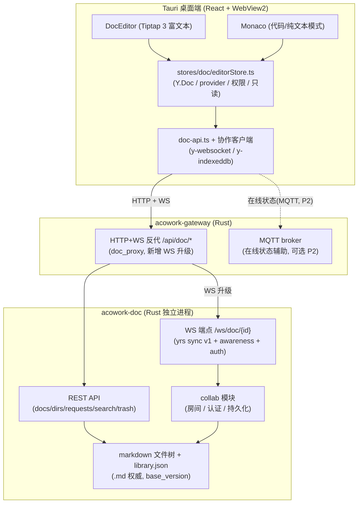
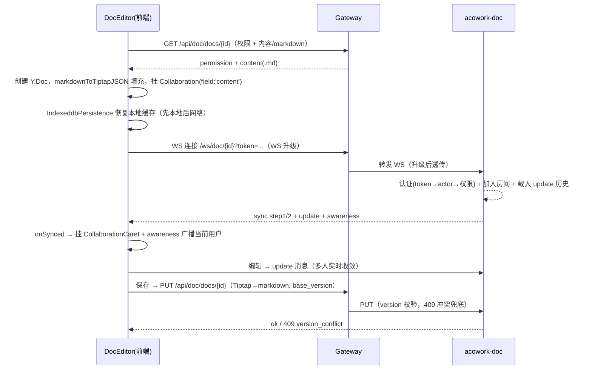

# ADR-079：文档实时协作编辑器（Tiptap + Yjs）技术方案

**状态**：提议（P1 待 ADR-076 落地后启动）
**日期**：2026-10-16
**决策者**：大鱼
**前置 ADR**：ADR-033（MQTT 替代 gRPC/WebSocket）、ADR-034（MQTT-HTTP 边界）、ADR-064（pm 独立进程模式）、**ADR-076（多用户账号系统 — 强依赖：P1 实时协作 gate 在 ADR-076 落地之后）**
**参考外部项目**：DocFlow（`D:\projects\tranxon\DocFlow`，开源，Tiptap 3 + Yjs + Hocuspocus + Next.js）

**影响范围**：

- `core/acowork-doc/Cargo.toml`（新增 `yrs`、axum WebSocket 等依赖）
- `core/acowork-doc/src/server.rs`（新增 Yjs WebSocket 端点 /ws/doc/{doc_id}）
- `core/acowork-doc/src/`（新增 collab 模块：房间管理、认证、awareness、持久化）
- `core/acowork-gateway/src/http/doc_proxy.rs` / `routes.rs`（透明反代增加 WebSocket 升级支持，或新增 WS 路由）
- `core/acowork-gateway/src/mqtt/`（可选：awareness / 在线状态走既有 MQTT 通道）
- `apps/acowork-desktop/package.json`（新增 `@tiptap/*`、`yjs`、`y-websocket`、`y-indexeddb`）
- `apps/acowork-desktop/src/views/doc/DocEditor.tsx`（编辑模式：Monaco ↔ Tiptap 双模式）
- `apps/acowork-desktop/src/stores/doc/editorStore.ts`（Y.Doc / provider / 权限 / 只读生命周期）
- `apps/acowork-desktop/src/lib/doc-api.ts` / `doc-types.ts`（协作相关类型与 WS 客户端）
- `apps/acowork-desktop/src/components/doc/editor/*`（新增：Tiptap 扩展集、菜单、协作 hooks、快照）
- `apps/acowork-desktop/src/i18n/locales/*.json`（i18n key）

---

## 1. 背景与目标

### 1.1 业务诉求

ACowork 现有文档功能（`core/acowork-doc` + `apps/acowork-desktop`）是**单编辑器 + 审阅流**：Monaco 编辑 markdown，HTTP PUT + `base_version` 乐观并发，Agent 通过 PR 式 `UpdateRequest` 提交修改。缺少：

- 多人实时协作编辑（当前是「写后冲突、手动刷新」）
- 实时光标 / 在线状态
- 富文本（所见即所得）编辑体验
- 本地优先 / 离线缓存

用户希望参考 DocFlow 的 Tiptap + Yjs 实现，在本项目的 **Rust 后端 + Tauri 前端** 技术栈上落地实时协作。

### 1.2 目标

1. **前端**：引入 Tiptap 3 富文本编辑器，对齐 DocFlow 的编辑体验与扩展体系。
2. **协作**：Yjs CRDT 多人实时编辑，支持实时光标、在线状态、离线缓存、重连同步。
3. **后端**：保持纯 Rust 全栈（**不引入 Node.js Hocuspocus sidecar**），由 `acowork-doc` 进程承担 Yjs 服务。
4. **兼容**：不破坏现有 `.md` 文件存储、`base_version` 版本号、PR 审阅流、搜索与 MCP 工具。
5. **可回滚**：分阶段演进，任何阶段可退回 Monaco + 现有保存链路。

### 1.3 与 ADR-076（多用户账号系统）的依赖关系

实时协作的「人」与「权限」均来自多用户身份，**P1 起强依赖 ADR-076**：

| 协作能力 | 依赖 ADR-076 的哪一部分 | 说明 |
|---|---|---|
| 在线用户 / 实时光标归属 | `UserAccount` + token payload（`user_id` + `role`） | awareness 里广播的必须是真实 `user_id`，否则多人协作「谁是谁」不成立；当前仅有单一 `human` actor |
| WS 认证 | Phase 2 `/api/auth/*` + token middleware → `AuthContext` | y-websocket 连接携带 access_token，服务端解析为 `user_id` 后查文档权限 |
| 协作权限（可编辑/只读） | 决策 #10：REST 反代 `X-Actor` 由硬编码 `"human"` 改为 `AuthContext.effective_user_id` | acowork-doc 的权限与审计以 actor 为准，协作读写必须落到真实 user |
| 管理员/协作者角色区分 | admin 角色 + `as_user` 视图 | 只读者（VIEW/COMMENT）与编辑者（EDIT）在协作会话内按角色处理 |

**结论**：实施顺序为 **P0 先行（不依赖多用户，可与 ADR-076 并行）→ ADR-076 落地 → P1/P2/P3**。P0 的编辑器替换、markdown 双向转换、保存链路在单 actor（`human`）下即可完成并交付；多人实时协作（P1）**gate 在 ADR-076 的 Phase 1-4（账号 + token + 反代注入）完成之后**，避免在单一身份上重复实现协作身份逻辑。

---

## 2. 现状分析

### 2.1 ACoworkDev（目标系统）现状

| 层 | 现状 | 关键文件 |
|---|---|---|
| 文档存储 | 文件系统目录树 + 每目录 `library.json`；文档 = **.md 文本文件**（UTF-8） | `core/acowork-doc/src/store/`、`service/document_impl.rs`（`write_content` 写 .md） |
| 版本并发 | `DocMeta.version: u64`；更新须带 `base_version`，不匹配 → 409 `version_conflict` | `core/acowork-doc/src/types.rs`、`service/document_impl.rs` |
| 审阅流 | `UpdateRequest`（pending → approved / rejected / expired），approve 合并并 `version+1` | `core/acowork-doc/src/service/request_impl.rs`、`api/requests.rs` |
| 服务形态 | 独立进程（ADR-064 模式），axum，被 Gateway 透明反代 `/api/doc/*` | `core/acowork-doc/src/server.rs`、`core/acowork-gateway/src/http/doc_proxy.rs` |
| 前端编辑器 | Monaco 编辑 markdown + DocMarkdownView 预览 + MarkdownToolbar | `apps/acowork-desktop/src/views/doc/DocEditor.tsx` |
| 前端栈 | React 19 + Vite + Zustand + Tailwind v4 + i18next（**无 Tiptap/Yjs**） | `apps/acowork-desktop/package.json` |
| 消息通道 | Gateway 内置 MQTT broker（ADR-033/034/035/036/039/042）；反代为 HTTP 透明代理（无 WS 升级） | `core/acowork-gateway/src/http/proxy.rs` |
| Agent 写文档 | MCP tools / HTTP 提交 `UpdateRequest` → 审阅；`X-Actor`（human / agent:xxx）由 Gateway 注入 | `core/acowork-doc/src/mcp/` |

关键点：**后端不碰富文本语义**，文档内容对后端是无结构的 markdown 文本；审阅流/搜索/回收站都基于 .md 内容与 version。

### 2.2 DocFlow（参考项目）现状

DocFlow 是 Next.js（NestJS + Prisma 后端）+ Tiptap 3 + Yjs + Hocuspocus 的开源在线文档。

| 模块 | 实现 | 参考文件（DocFlow 仓库） |
|---|---|---|
| 编辑器初始化 | `useEditor` + `ExtensionKit({provider})` + `Collaboration.configure({document: doc, field: 'content'})` + `CollaborationCaret` | `apps/DocFlow/src/app/docs/[room]/page.tsx` |
| 扩展集 | StarterKit、Heading、TaskList/TaskItem、CodeBlock、TableKit、Math、Emoji、Mention、Image(Block/Upload)、SlashCommand、SearchAndReplace、Placeholder、TrailingNode、UniqueID、Details、Link、Highlight、FontSize/FontFamily/Color 等 40+ | `apps/DocFlow/src/extensions/extension-kit.ts` |
| 协作引导 | HTTP 权限接口 → 创建 `Y.Doc` → `IndexeddbPersistence` 先恢复本地 → 再连 `HocuspocusProvider`（WS，token）→ `onSynced` 后挂载协作扩展 | `apps/DocFlow/src/hooks/useDocumentPermission.ts`、`useCollaboration.ts` |
| 权限/只读 | HTTP 权限 fallback（VIEW/COMMENT=只读）+ WS `server:permission` stateless 消息 | `apps/DocFlow/src/hooks/useCollaboration.ts` |
| 在线用户 | `provider.awareness.setLocalStateField('user', ...)` + `on('update')` 聚合 | 同上 |
| 快照/历史 | `Y.snapshot` / `encodeSnapshot` / `decodeSnapshot` + `createDocFromSnapshot`，存浏览器 IndexedDB；自动快照 5min + 卸载时；以 state-vector hash 判断内容变化 | `apps/DocFlow/src/services/snapshot/index.ts`、`hooks/useEditorHistory.ts` |
| AI 编辑 | SSE 流式（intent → anchor → proposal）+ `agentSuggestion` mark（track-changes 式）→ 用户 accept/reject | `apps/DocFlow/src/hooks/useDocumentEdit.ts`、`services/collaboration/index.ts`、`extensions/AgentSuggestion/` |
| Markdown 互转 | micromark + mdast(GFM) → Tiptap JSON；`MarkdownPaste`/`JsonPaste` 扩展；`export-doc/converters`（Tiptap → markdown/docx/pdf） | `apps/DocFlow/src/utils/markdown-to-tiptap.ts`、`utils/export-doc/` |
| 服务端 | Hocuspocus（Node，独立部署，Docker 镜像）：WebSocket 协调 + 拦截器做权限与持久化；NestJS + Prisma 存元数据 | README「后端架构」节（server 代码不在仓库） |

DocFlow 服务端强依赖 **Node.js（NestJS + Hocuspocus）**，这正是本项目要规避的——我们保持 Rust 全栈。

---

## 3. 可选方案与决策

### D1：前端编辑器选型

| 方案 | 优点 | 缺点 |
|---|---|---|
| **A. Tiptap 3（推荐）** | 与 DocFlow 完全一致可借鉴；官方协作扩展（collaboration / caret）；ProseMirror 生态最成熟；块级/代码/表格/数学覆盖全 | 富文本与 markdown 源码需转换；引入较多依赖 |
| B. BlockNote / Novel | 开箱即用的块编辑器 | 基于 Tiptap 的封装，定制与协作扩展受限于上层 |
| C. Milkdown | markdown 优先、插件化 | 协作（Yjs）集成生态弱 |
| D. 保留 Monaco + 自研 CRDT | 不动编辑器 | 工作量巨大、无现成协作生态，违背 YAGNI |

**决策：A（Tiptap 3）**。与 DocFlow 对齐，前端可直接借鉴其 `ExtensionKit`、协作 hooks 与菜单体系；Monaco 保留为「代码/纯文本」模式（如代码块、Git diff 场景）。

### D2：Yjs 同步通道（Rust 侧关键决策）

Yjs 需要一条**可靠、有顺序、双向**的消息通道承载 `y-protocols` 的 sync（step1/2 + update）与 awareness 消息。

| 方案 | 说明 | 优点 | 缺点 |
|---|---|---|---|
| **A. yrs + WebSocket（推荐）** | `yrs` crate（Yjs 官方 Rust 移植）在 `acowork-doc` 进程暴露 `/ws/doc/{doc_id}`，实现 sync v1 + awareness + auth；前端用 `y-websocket` 客户端 | 纯 Rust、架构一致；协议与 JS 端兼容（yrs 实现 y-protocols sync v1）；房间/持久化/权限可完全自控 | 需自研认证、awareness、房间管理、持久化；Gateway 反代需支持 WS 升级 |
| B. Node Hocuspocus sidecar | 复用 DocFlow 同款服务端 | 生态最成熟（权限拦截器、持久化扩展、离线、监控开箱即用） | 引入 Node 运行时，破坏 Rust 全栈，运维/部署/安全边界复杂，违背 KISS |
| C. MQTT 承载 Yjs | 复用 Gateway 内置 broker（ADR-033+）做 update 广播 | 复用现成认证/通道 | Yjs JS 生态的 provider 均基于 WebSocket，无 MQTT provider；需自研前端 provider，浏览器/桌面都要维护，风险高、生态不匹配 |

**决策：A（yrs + WebSocket）**。同时保留 Gateway MQTT 作为**辅助**（在线状态/感知消息可选走 MQTT，见 D7），但 Yjs 主数据通道为 WebSocket。

补充事实依据：

- `yrs` 是 Yjs 的官方 Rust 移植，`YDoc`/`Transact` 与 JS 端二进制兼容，其 `sync` 模块实现 y-protocols sync v1，可与 `y-websocket` 客户端互通。
- 前端因此可用成熟的 `y-websocket` 客户端（轻量、稳定），或 `@hocuspocus/provider`（若需 stateless 权限消息则服务端实现对应握手，成本高，P0 不采用）。
- `acowork-doc` 已是 axum 独立进程，加 WebSocket 端点成本低；Gateway 反代需为 `/api/doc/ws/*` 增加 WS 升级（`tower-http` 或 axum `WebSocketUpgrade` 直连转发）。

### D3：存储模型（Yjs 权威 vs markdown 权威）

| 方案 | 说明 | 优点 | 缺点 |
|---|---|---|---|
| **P0. 会话层（先做）** | Yjs 仅作编辑会话层；保存时把 Tiptap 内容序列化为 markdown，走现有 PUT + `base_version`；冲突仍由 version 防覆盖 | 零破坏、可回滚；审阅流/搜索/回收站完全不变 | 非实时持久化；两人同时编辑提交仍可能冲突（但比现状好：Yjs 已实时收敛，冲突面极小） |
| P1. 双写 / flush | `acowork-doc` 侧持续接收 Yjs update（服务端存 update 归档），周期性导出 .md 作为权威落盘 | 内容不丢；服务端有实时副本 | 需实现 update 落盘 + 导出调度 + 一致性保证 |
| P2. Yjs 权威 | 内容以 Yjs update / `.ybin` 快照为事实源，markdown 仅作导出格式；version 映射到状态向量（SV） | 最彻底、最接近 DocFlow（Hocuspocus 持久化 Yjs） | 改动最大；审阅流/搜索/外部工具需全部适配新内容源 |

**决策：按 P0 → P1 → P2 增量演进**。P0 是第一步交付，P2 为目标态；每一步独立可回滚。

### D4：前端协作生命周期（借鉴 DocFlow）

采纳 DocFlow 的引导顺序，改造为适配本项目：

```
HTTP 权限接口（doc-api） ──► 创建 Y.Doc ──► IndexedDB(y-indexeddb) 恢复本地
        ──► y-websocket 连接 acowork-doc/ws/doc/{id}（token 认证）
        ──► onSynced 后挂载 Collaboration / CollaborationCaret
        ──► awareness 广播当前用户 + 聚合在线用户
```

- 权限：HTTP fallback（现有 `permission`）+ WS 认证（token → actor → 权限校验）+ 可选服务端只读消息（P1）。
- 只读：沿用 DocFlow 的「优先级链」：强制只读 > 服务端确认 > HTTP fallback；通过 `editor.setEditable()` 热切换，不重建实例。

### D5：markdown ↔ Tiptap 双向转换

P0 的关键前提。借鉴 DocFlow 两条链路：

1. **读取**：`.md` → `markdownToTiptapJSON`（micromark + mdast + GFM → Tiptap JSON），或直接让 Tiptap 解析 markdown 加载。
2. **保存**：Tiptap JSON → markdown（借鉴 `utils/export-doc/converters/*`：heading/paragraph/list/table/code-block/task-item 等逐节点转换），再走现有 PUT。

保真度风险集中在：表格、代码块语言、图片（相对/绝对路径）、任务列表、HTML 块。P0 需建立 **round-trip 回归测试**（md → tiptap → md，对比快照）。

### D6：与现有审阅流共存

- 实时编辑（Yjs 草稿）与正式提交（PR `UpdateRequest`）**解耦**：
  - 编辑器内任意实时改动 = 草稿（Yjs 空间，可多人）。
  - 用户/Agent 提交 = 把当前内容导出 markdown，生成 `UpdateRequest`（base_version 语义沿用），approve 后合并进 .md 并 `version+1`。
- `ReviewQueue.applyMergedUpdate` 的语义扩展：approve 后除更新 .md，还应向对应文档的 Yjs 房间广播「版本已变更」事件，前端据此提示/重载（沿用现有「dirty 则标记冲突」交互）。
- 搜索结果、回收站、MCP 工具继续消费 .md 内容，不感知 Yjs。

### D7：实时光标 / 在线状态通道

- **主**：Yjs `awareness`（随 WS，y-protocols awareness v1）——实时光标、选区颜色、在线用户。直接借鉴 DocFlow `useCollaboration` 的 awareness 用法。
- **可选（P2）**：跨文档/全局「谁在编辑哪个文档」的在线状态，复用 Gateway MQTT（ADR-036 status push），避免每个文档 WS 常连开销。

### D8：Agent 协作（AI 建议模式）

借鉴 DocFlow `AgentEditPanel`：流式产出 intent → anchor → proposal，以 `agentSuggestion` mark（track-changes 式）注入编辑区，用户 accept/reject；`UniqueID` 扩展保证协作下锚点稳定。与现有审阅流衔接：Agent 的「建议」走实时 Yjs（可多人查看），Agent 的「正式提交」仍走 `UpdateRequest`。

### D9：Tauri / WebView2 适配注意

- WebView2 支持 IndexedDB，`y-indexeddb` 本地缓存可用；**离线优先**是桌面端天然优势（重连自动同步）。
- **多窗口**：Tauri 多窗口若同 origin，IndexedDB 共享——需在 P0 验证「同文档多窗口」的 Y.Doc 隔离/共享策略，避免状态串扰（可先单窗口 + 文档切换）。
- **打包体积**：Tiptap + Yjs 增加 bundle，采用动态 `import()` 懒加载编辑器，避免拖慢首屏。
- 与现有 Monaco 的共存：文档按扩展名/模式路由到 Tiptap（富文本）或 Monaco（代码/纯文本）。

---

## 4. 目标架构



### 协作数据流（借鉴 DocFlow 引导顺序）



---

## 5. 兼容与迁移

| 兼容项 | 策略 |
|---|---|
| `.md` 存储 | P0 保持 .md 权威；Tiptap 编辑内容保存前转回 markdown |
| `base_version` 版本号 | P0 沿用；Yjs 实时收敛后冲突面大幅缩小，409 语义保留为兜底 |
| PR 审阅流 | 不变；提交入口从「Monaco 内容」改为「Tiptap 当前内容导出」 |
| 搜索 / 回收站 / MCP | 不变，继续消费 .md |
| Agent 提交 | 不变（UpdateRequest）；新增「实时建议」模式与审阅流并存 |
| 老文档 | markdown 载入 Tiptap 即可，无数据迁移；图片相对路径需在转换器中保持 |

回滚路径：任一阶段回退 = 恢复 Monaco 编辑 + 现有 PUT/审阅链路；`.md` 与 version 一直存在，Yjs 仅是编辑层，**不回滚不会丢数据**。

---

## 6. 分期实施计划

> **实施顺序**：P0（不依赖多用户，**可与 ADR-076 并行/先行**）→ ADR-076 落地 → P1 → P2 → P3。

| 阶段 | 对 ADR-076 依赖 | 内容 | 退出标准 | 风险 |
|---|---|---|---|---|
| **P0（编辑器替换，无实时协作）** | 无（单 `human` actor 即可） | 前端 Tiptap 3 + 裁剪版 ExtensionKit；DocEditor 新增 Tiptap 模式（Monaco 保留）；markdown↔Tiptap 双向转换 + round-trip 测试；保存走现有 PUT + base_version；审阅流联调 | 单用户可编辑/保存/审阅，diff 与搜索正常 | 转换保真度；性能 |
| **P1（实时协作）** | **强依赖**（076 Phase 1-4：账号 + token + 反代注入） | `acowork-doc` 加 WS 端点（yrs sync v1 + awareness + auth + 房间 + 内存 update 保持）；Gateway 反代加 WS 升级；前端接 y-websocket + y-indexeddb + Collaboration/Caret；在线用户、只读链 | 双端实时编辑、光标可见、断线重连不丢字 | yrs 生态成熟度；WS 反代；多窗口 IndexedDB |
| **P2（快照/Agent/服务端持久化）** | 依赖（Agent 建议的 accept/reject 归属 user_id） | 服务端 Yjs update 归档 + 周期导出 .md（P1 存储演进）；本地+服务端快照（借鉴 DocFlow snapshot）；Agent 实时建议（agentSuggestion mark + 流式意图）；可选 MQTT 在线状态 | 历史可回溯；Agent 建议可接受/拒绝 | 快照一致性；Agent 并发写入 |
| **P3（Yjs 权威演进）** | 依赖 | 内容事实源迁到 Yjs（.ybin + update log），markdown 仅导出；version ↔ 状态向量映射；搜索/审阅适配新内容源 | 达成 DocFlow 同等级协作能力 | 改动大，需专门评估 |

**P0 建议立即启动**（低风险、独立可交付，且不占用 ADR-076 的排期）；**P1 为协作核心，gate 在 ADR-076 落地之后**，作为本次 ADR 的主要目标态。

---

## 7. 风险与对策

| 风险 | 影响 | 对策 |
|---|---|---|
| yrs 的 awareness/auth/房间需自研，生态不如 Hocuspocus 成熟 | P1 开发量增大 | 用 y-protocols sync v1 标准协议；auth 复用 ADR-076 的 bearer token / `AuthContext.effective_user_id`（反代注入）；awareness 仅转发 JSON |
| Gateway 反代当前无 WS 升级 | 无法透传 WS | 反代加 WS 升级支持（tower-http `upgrade`），或 WS 端点独立端口 + allowlist（同 ADR-033 peer allowlist） |
| markdown↔Tiptap 转换保真度（表格/图片/HTML） | 保存内容漂移 | round-trip 回归测试 + 转换器逐节点覆盖（借鉴 DocFlow export-doc converters） |
| WebView2 多窗口 IndexedDB 共享 | Y.Doc 状态串扰 | P1 验证窗口隔离策略；文档切换时销毁/重建 Y.Doc |
| 大文档性能（Tiptap + Yjs） | 卡顿 | 动态 import、Collaboration `field` 分片、CharacterCount 上限（DocFlow 用 50000） |
| 实时草稿与正式版本双向同步 | 用户困惑「保存/提交」语义 | 编辑器内明确「草稿(实时) vs 提交(PR)」状态条；approve 后广播版本变更事件 |

---

## 8. 开放问题（需确认）

> ✅ **已确认**：实施顺序为「P0 先行（可与 ADR-076 并行）→ ADR-076 落地 → P1」，多人实时协作不先于多用户账号系统。

1. **协作范围**：实时协作是否必须覆盖所有文档，还是先针对特定目录/文档类型？桌面端是否会出现「同一文档多窗口」？
2. **保存语义**：P0 阶段是否保留手动 Ctrl+S 显式保存（现状），还是改为自动保存（debounce）+ 显式「提交审阅」？DocFlow 是 Hocuspocus 服务端持久化、无显式保存，与我们的审阅流不同。
3. **Agent 建议模式**：P2 的 Agent 实时建议（agentSuggestion mark）优先级如何？与现有 UpdateRequest 审阅流的主次关系？（Agent 身份来自 ADR-073 的 instance_id，人类接受/拒绝归属来自 ADR-076 的 user_id）
4. **yrs 版本锁定**：需确认 `yrs` crate 当前版本与前端 `yjs` JS 的**协议/二进制兼容版本**，P1 前做一次最小连通性 spike（yrs server ↔ y-websocket client ↔ Tiptap）。
5. **WS 反代实现方式**：选择「Gateway 透明反代加 WS 升级」还是「acowork-doc 独立端口 + allowlist」？
6. **P0 排期**：P0 是否与 ADR-076 并行开工？若并行，需确认人力资源与评审顺序（建议：076 评审先行，P0 实施并行）。

---

## 9. 结论

- **前端**：采用 Tiptap 3，直接借鉴 DocFlow 的 `ExtensionKit`、协作 hooks（`useDocumentPermission` / `useCollaboration`）、awareness 用法、快照与 AI 建议模式。
- **后端**：`acowork-doc` 用 `yrs` + WebSocket 实现 Yjs 服务（sync v1 + awareness + auth），保持 Rust 全栈，不引入 Node。
- **依赖顺序**：**先 ADR-076（多用户账号系统）后实时协作**。P0（编辑器替换，单 actor 即可）可与 076 并行先行；P1 多人实时协作 gate 在 076 的账号/token/反代身份注入落地之后。
- **演进**：P0 会话层（编辑器替换，零破坏）→ ADR-076 → P1 实时协作（核心目标）→ P2 快照/Agent/持久化 → P3 Yjs 权威存储。
- **兼容**：`.md`、`base_version`、PR 审阅流、搜索/MCP 全程保留，任何阶段可回滚。

---

## 10. 实施记录

### P0（2026-10-16，已交付）：Tiptap 3 编辑器替换（单用户）

| 决策点 | 落地实现 |
|---|---|
| 转换方案 | **手写 micromark + mdast 双向转换**（放弃 `@tiptap/markdown`：基于 marked、需 DOM、round-trip 契约不可控；.md 是权威存储，保真度是硬约束） |
| 转换契约 | `md → json → md` 对常见 GFM 输入**字节稳定**（未改动文档保存零 diff 噪音）；全部用例语义（mdast AST）稳定；真实文档（ADR-074/076/079，共 74KB）AST 回归通过 |
| 已知-lossy | highlight → `<mark>` 行内 HTML；underline → 纯文本；HTML 块 → 段落文本（内容不丢，格式降级，测试锁定） |
| 编辑器 | `DocRichEditor`（`src/components/doc/editor/`）：Tiptap `useEditor` + 裁剪版 ExtensionKit（StarterKit + TableKit + TaskList + Highlight + Image + Placeholder + CharacterCount 50000 上限） |
| 双模式 | `editorStore.engine: "rich" \| "source"`；DocEditor 顶栏引擎切换；rich 默认、懒加载（独立 chunk ~470KB/149KB gzip，不进首屏）；加载失败 → 显式降级 Monaco + amber 提示 |
| 同步链路 | 编辑即序列化回写 store（`.md` 仍是事实源）；保存走现有 PUT + `base_version`；409 冲突 banner、reload、`applyMergedUpdate`（审阅合并）均通过 `canonicalMd` 对比实现外部同步（无死循环、挂载不污染 dirty） |
| 审阅流 | ReviewQueue approve → `applyMergedUpdate` → 编辑器自动重载（已单测覆盖） |
| 测试 | round-trip 语料 40+ 用例（字节稳定 36 + 语义 12 + known-lossy 2 + 幂等）；`DocRichEditor` 组件测试 5 项（载入/回写/外部同步/只读热切换） |

P1 前置条件（未动）：`yrs` + WS 端点、Gateway WS 升级、`y-websocket`/`y-indexeddb`、Collaboration/Caret —— 均待 ADR-076 落地后启动。

---

## 附：DocFlow 可借鉴文件索引（外部参考，位于 `D:\projects\tranxon\DocFlow`）

| 借鉴点 | 文件 |
|---|---|
| 协作引导与 awareness | `apps/DocFlow/src/hooks/useCollaboration.ts`、`useDocumentPermission.ts` |
| 编辑器初始化 / 权限只读链 | `apps/DocFlow/src/app/docs/[room]/page.tsx` |
| 扩展集 | `apps/DocFlow/src/extensions/extension-kit.ts` |
| 快照/历史 | `apps/DocFlow/src/hooks/useEditorHistory.ts`、`services/snapshot/index.ts` |
| markdown 转 Tiptap | `apps/DocFlow/src/utils/markdown-to-tiptap.ts` |
| Tiptap → markdown/docx/pdf | `apps/DocFlow/src/utils/export-doc/`（`converters/` 逐节点转换） |
| AI 编辑（Agent 建议） | `apps/DocFlow/src/hooks/useDocumentEdit.ts`、`services/collaboration/index.ts`、`extensions/AgentSuggestion/`、`app/docs/_components/AgentEditPanel/index.tsx` |
| UniqueID / 协作辅助扩展 | `apps/DocFlow/src/extensions/`（`UniqueID`、`MarkdownPaste`、`JsonPaste` 等） |
