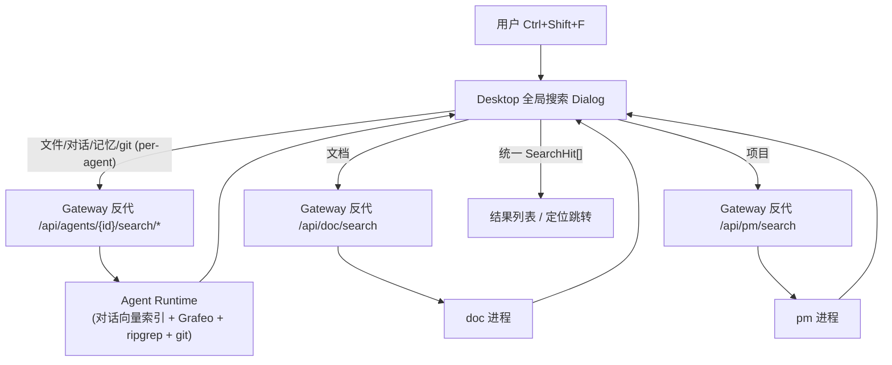

# ADR-081：全局搜索（Ctrl+Shift+F 六源聚合检索）

**状态**：草案（待评审）
**日期**：2026-09-17
**决策者**：大鱼
**前置 ADR**：ADR-009（agent 私有数据只经 Runtime HTTP）、ADR-064/070（doc/pm 独立进程 + Gateway 零业务）、ADR-033/034（MQTT/HTTP 边界）、ADR-057/062/068（记忆图 + 向量检索）、ADR-078（git status bar）
**关联设计**：[docs/design/zh/14-desktop-app.md](../../design/zh/14-desktop-app.md)

---

## 1. 背景与需求

新增**应用级全局搜索**：`Ctrl+Shift+F` 弹出全局搜索 dialog，跨 6 类数据源检索：

1. **文件搜索** — workspace 内文件内容 / 文件名
2. **文档搜索** — doc 库（`.md` 文档库）
3. **项目搜索** — pm 项目与任务
4. **对话搜索** — 各 agent 的会话消息
5. **记忆搜索** — agent 长期记忆（Grafeo）
6. **git 历史搜索** — workspace git 提交记录

UI 形态（任务 t-3e36c812）：

- 第一行：搜索输入框
- 第二行：tab 列表（文件 / 文档 / 项目 / 对话 / 记忆 / git 历史）
- 第三行：结果列表；点击结果弹出独立结果框，**定位到命中位置**（文件定位行号、对话定位消息、记忆定位节点等）
- 不同搜索类型，列表行显示信息略有不同

**硬性约束**：能用向量搜索尽量用向量（用户明确要求）。

---

## 2. 现状盘点（数据归属 + 已有能力）

| 搜索目标 | 数据归属 | 存储位置 | 已有能力 | 缺口 |
|---|---|---|---|---|
| 文件 | agent 私有（workspace） | Runtime `agent_workspaces.json` + 磁盘 | ✅ `GET /workspaces/search`（ripgrep 全文）、`GET /workspaces/find`（文件名 fuzzy）；桌面 `GlobalSearchPanel` | 无（可直接复用） |
| 文档 | 用户级全局 | doc 进程 `~/.acowork/acowork-doc/` | ✅ `GET /search`（线性子串 + 标题加权，**非向量**） | 向量化可选；命中定位 |
| 项目 | 用户级全局 | pm 进程目录树（`task.json`） | ❌ 无搜索端点；有内存二级索引（by_id/by_assignee/by_status） | 新增搜索端点 |
| 对话 | agent 私有 | Runtime 会话 JSONL | ✅ `GET /sessions`、`GET /sessions/{sid}/messages` | **无搜索端点**；需向量索引 |
| 记忆 | agent 私有 | Runtime Grafeo（HNSW 向量库） | ✅ `GET /memory/nodes`（keyword）；**底层已有 vector_search / hybrid / MMR**（[grafeo/retrieval.rs](../../../core/acowork-grafeo/src/retrieval.rs)）；memory_recall 工具已用向量 | HTTP 层未暴露语义检索参数 |
| git 历史 | agent 私有（workspace） | Runtime git 仓库 | ✅ **已有 commit 搜索**：`CommitPicker` client-side 过滤（subject/author/hash，[CommitPicker.tsx:138](../../../apps/acowork-desktop/src/components/editor/CommitPicker.tsx#L138)）+ `GitVirtualNav` 虚拟 log 视图 + `GET /git/log` 分页 | 无（直接复用；全局 git tab 接入同一后端即可） |

关键架构事实：

- **Runtime = 每 agent 一个进程**；对话/记忆/文件/git 均为 **per-agent** 数据（ADR-009 红线：Gateway 不得直读，只能反代 Runtime HTTP）。
- **doc / pm = 用户级独立进程**，Gateway 反代 `/api/doc/*`、`/api/pm/*`。
- **Gateway 零业务铁律**（ADR-064/070）：搜索聚合、排序、索引逻辑不得进入 Gateway。
- **Embedding 能力**：Runtime 已有 `EmbeddingProvider` 链（ONNX 本地 → Ollama → 远程 API）；Grafeo 记忆已向量化。doc/pm 进程**无 embedding 依赖**。
- **快捷键冲突**：`Ctrl+Shift+F` 已被编辑器内 `GlobalSearchPanel`（文件 ripgrep 搜索）占用（[FileEditorPanel.tsx:621](../../../apps/acowork-desktop/src/components/editor/FileEditorPanel.tsx#L621)）。

---

## 3. 决策

### D1 编排层：各数据源自治搜索 + Desktop 聚合编排

搜索能力**下沉到数据所属进程**（谁拥有数据谁检索），Gateway 只做反代，Desktop 做并行编排与结果合并：



理由：

- 符合 ADR-009（agent 私有数据不出 Runtime）、ADR-064/070（Gateway 零业务）。
- 每类数据源的检索语义天然不同（向量/全文/git），自治最简。
- Desktop 已有大量编排先例（`agent-start.ts`、`doc-api.ts`、`pm-api.ts` 均为 Desktop 直调 Gateway 反代端点），编排不引入新进程。

### D2 检索策略：向量优先，精确兜底（按数据类型分级）

"能用向量尽量用向量"，但**不盲目全量向量化**——按语义密度分级：

| 数据源 | 主检索 | 兜底/增强 | 理由 |
|---|---|---|---|
| 记忆 | **向量**（已有 HNSW，直接暴露语义参数） | keyword（已有） | 已向量化，零新增索引 |
| 对话 | **向量**（新增消息向量索引） | 关键词（JSONL 子串） | 长文本语义价值高，用户强需求 |
| 文档 | **向量**（doc 进程新增 embedding 索引，可选 P2） | 现有子串+标题加权（P0 先用） | 语义检索价值高，但 doc 进程需引入 embedding 管道，成本中 |
| 项目 | 关键词（title/description 子串） | 向量（任务数小，可选） | 结构化短文本，子串足够，YAGNI |
| 文件 | **ripgrep 全文** + 文件名 fuzzy | 向量（.md/.txt 等长文本可选） | 代码/配置文件精确匹配优先，语义向量收益低 |
| git 历史 | **复用现有 CommitPicker 搜索**（subject/author/hash 子串，当前页过滤 + 分页翻页） | — | workspace git banner 已实现，全局 tab 直接接入，不另起炉灶 |

### D3 快捷键：全局接管 Ctrl+Shift+F

- 应用级 `Ctrl+Shift+F` 打开全局搜索 dialog（挂 `AppLayout` 或全局 keydown，优先于编辑器内 Monaco action）。
- 编辑器内 `GlobalSearchPanel` **并入**全局搜索的"文件"tab（同一 ripgrep 后端），移除原编辑器内入口，避免两套入口混淆；文件 tab 命中后定位逻辑复用 `openFile(agentId, workspaceId, file, line)`（[GlobalSearchPanel.tsx:263](../../../apps/acowork-desktop/src/components/editor/GlobalSearchPanel.tsx#L263)）。

### D4 统一结果契约：SearchHit

所有源返回统一结构（Desktop 按 `type` 渲染行 + 决定跳转）：

```jsonc
{
  "type": "file | doc | project | conversation | memory | git",
  "id": "源内唯一 id",
  "title": "主标题（文件名/文档名/任务标题/会话标题/记忆摘要/commit message）",
  "snippet": "命中上下文片段（前端高亮）",
  "score": 0.0,
  "meta": {
    // type 特有定位信息
  }
}
```

`meta` 按类型约定（定位跳转的关键）：

| type | meta |
|---|---|
| file | `{ agentId, workspaceId, path, line, column }` |
| doc | `{ docId, dirId, title }`（打开 DocEditor，正文内定位可选） |
| project | `{ projectId, taskId? }`（打开 ProjectBoard / TaskDetailDrawer） |
| conversation | `{ agentId, sessionId, messageIndex }`（打开 SessionPanel 滚动定位消息） |
| memory | `{ agentId, nodeId }`（打开 MemoryPanel 定位节点） |
| git | `{ agentId, workspaceId, commitHash, relPath? }`（复用 CommitPicker / GitVirtualNav 打开 commit 历史或 diff） |

### D5 搜索范围：dialog 内 agent 选择器

对话/记忆/文件/git 是 per-agent 数据。dialog 增加**agent 范围选择**（默认"当前 agent"，可切"全部 agent"）：

- 单 agent：只调该 agent 的 Runtime 端点。
- 全部 agent：Desktop 并行调所有在线 agent 的 Runtime 端点，按 `score` 合并 Top-N。
- 文档/项目为全局源，不随 agent 变化（P0 单 agent 视图下也全局返回，不做过滤）。

### D6 失败模式与降级

| 场景 | 行为 |
|---|---|
| 某 agent Runtime 离线 | 该 agent 的 4 类结果缺省，其余源正常返回；列表尾部提示"部分 agent 未响应" |
| doc/pm 进程未启动 | 对应 tab 返回 503 提示，不阻塞其他 tab |
| embedding 模型未就绪（对话/记忆向量不可用） | 自动降级为关键词/子串检索（记忆已有 keyword 路径；对话降级 JSONL 子串） |
| 索引未构建（对话向量索引冷启动） | 返回 200 + `indexing: true`（与 §4.1 契约一致），前端提示"索引构建中，结果不完整"；后台增量索引，追赶完成后 `indexing` 翻 false。~~设计稿曾拟 202 + indexing:true~~（已实现偏差：§4.1 聚合端点契约自始为 `200 { hits, scopes, indexing }`，故不引入 202 状态码，索引状态统一由 body 内 `indexing` 字段表达） |
| 单源超时 | 每源独立 3s 超时（Desktop `AbortController`），超时源标记失败，聚合结果仍返回 |

---

## 4. 接口契约（新增/扩展）

### 4.1 Runtime 新增 `GET /search`（聚合本 agent 四源）

为减少 Desktop 到单 agent 的并发连接数，Runtime 提供**单 agent 聚合端点**，内部并行查对话/记忆/文件/git：

```
GET /search?q={query}&scopes=conversation,memory,file,git&limit=20&mode=hybrid&workspace_id={id}
→ 200 { "hits": SearchHit[], "scopes": { "conversation": {...}, ... }, "indexing": bool }
```

> 已实现偏差：示例中的 `agent=all`（多 agent 并行，P1-3）暂缓；当前端点只聚合**本 agent 四源**，跨 agent 编排留待 P1-3 在 Desktop 层做。`mode`（memory 检索方式：`vector|hybrid|keyword`）与 `workspace_id`（file/git scope 所需，缺省时该 scope 返回 `skipped`）为落地时补充的参数。

内部实现（Runtime usecase 层，ADR-040 模式）：

- **conversation**：新增消息向量索引（见 4.2）
- **memory**：`MemoryAdminService` 已有向量检索（`MemoryQuery` 带 embedding 字段，memory_recall 同款），HTTP 层新增参数 `mode=vector|hybrid|keyword` 透传
- **file**：复用 `workspace_query::search_files`（ripgrep）+ `find_files`
- **git**：**复用现有 commit 搜索能力，不做服务端 `--grep`**。全局 git tab 的检索语义与 workspace git banner 的 `CommitPicker` 保持一致（subject/author/hash 子串）；为支持"全部 agent / 跨 workspace"检索，`git_query::log` 仅需在**服务端补一个 `--all`（全仓库）或 keyword 预过滤参数作为可选增强**，P0 直接由 Desktop 复用 `/git/log` 分页 + client-side 过滤（与 CommitPicker 同逻辑），不新增后端复杂度

Gateway 反代一行：`/api/agents/{id}/search` → Runtime `/search`（参照现有 `proxy_to_runtime` 模式，[proxy.rs:517](../../../core/acowork-gateway/src/http/proxy.rs#L517)）。

### 4.2 对话消息向量索引（新增，核心增量）

- **归属**：Runtime 进程内（agent 私有，ADR-009）。
- **存储**：**复用 `grafeo-engine`（已在 workspace 依赖，[core/Cargo.toml:79](../../../core/Cargo.toml#L79)，特性 `vector-index + text-index + hybrid-search`）**，开一个独立 store 文件 `{runtime_data_dir}/conversation_index/`。理由：
  - 与记忆检索同一引擎，HNSW / BM25 / 混合检索 / embedding 维度迁移 / 增量重建均为已验证能力（记忆生产在用），**零新增依赖、无 C 扩展打包负担**（对比 sqlite-vec 需跨平台编译 `.dll`）；
  - 对话索引与记忆 store 物理隔离（独立目录、独立 db 文件），生命周期互不影响。
- **写入路径**：会话消息落盘（JSONL append）后**异步** embedding（复用 `EmbeddingProvider` 链）→ upsert 索引（doc 粒度：每条消息一条记录；字段 `session_id, message_index, role, content, embedding`）。
- **冷启动**：Runtime 启动时扫描已有 JSONL 增量构建；`/search` 返回 `indexing: true` 直到追上最新。
- **检索**：query embedding → 向量 Top-K → 关联 session 元数据 → 按会话聚合展示（同一会话多条命中折叠为一行，`message_index` 定位）。

### 4.3 doc 搜索：P0 保持现状 + 定位增强；P2 向量化

- P0：现有 `GET /api/doc/search?keyword=` 直接接入"文档"tab；结果行点击 → 打开 DocEditor 定位到该 doc。
- P2（可选）：doc 进程新增 embedding 管道（调 Gateway embedding API 或本地 embed 进程），正文向量化；**不在本 ADR P0 范围**，单独排期。

### 4.4 pm 搜索：新增 `GET /api/pm/search?q=`

- 遍历 `store` 二级索引 + `task.json` title/description 子串（pm 数据量小，千任务级，线性扫描可接受；参照 doc `LibrarySearchService` 的 `score()` 模式）。
- 命中字段加权：title > description > assignee。
- 返回 `SearchHit{ type:"project", ... }`；点击 → 打开 ProjectBoard / TaskDetailDrawer。

### 4.5 Desktop：GlobalSearchDialog

新增 `src/components/search/GlobalSearchDialog.tsx`（复用 VS Code 风格主题，与 `GlobalSearchPanel` 同视觉语言）：

- 全局 keydown（`CtrlCmd+Shift+F`）打开；Esc / 失焦关闭；输入防抖 300ms + 请求取消（已有 AbortController 模式）。
- tab 切换不重置 query；六源并行请求（`Promise.allSettled`），各自独立 loading/error。
- 结果行：type 图标 + title + snippet + 副信息（文件路径/会话标题/时间）；命中关键词 `<mark>` 高亮。
- 点击：按 `meta` 分发到既有视图（`useFileEditorStore.openFile`、DocEditor、SessionPanel、MemoryPanel、ProjectBoard、CommitPicker）。

---

## 5. 备选方案（否决）

| 方案 | 描述 | 否决理由 |
|---|---|---|
| **独立 acowork-search 服务** | 新建全局搜索进程，统一索引全部六源 | ① 对话/记忆/文件/git 为 per-agent 私有数据，复制到全局服务违反 ADR-009；② 索引同步管道复杂（双写 + 最终一致）；③ 与"数据属主进程自治检索"相比多一层网络与故障面；YAGNI |
| **Gateway 聚合编排** | Gateway 调各源汇总 | 违反 ADR-064/070"Gateway 零业务铁律"（聚合排序即业务逻辑）；ADR-070 明确"检索"属于 doc 领域逻辑不得入 Gateway |
| **每源独立端点（不做 Runtime /search 聚合）** | Desktop 对单 agent 发 4 个请求 | 连接数×4、各源错误处理重复；Runtime 聚合端点实现成本极低（内部并行），收益明显；保留该端点作为兼容层 |

---

## 6. 边界与安全

- **数据不出属主进程**：对话/记忆/文件/git 检索全部在 Runtime 内完成，Gateway 只透传 SearchHit，不接触原始消息/记忆内容（符合 ADR-009 redline，`dev/ci.sh` 的 `run_gateway_fs_redline` 继续覆盖）。
- **git 只读**：沿用 ADR-078 约定 `GIT_OPTIONAL_LOCKS=0`，`--grep` 为只读；不做任何写操作。
- **权限**：doc/pm 沿用现有 `X-Actor` 注入（doc_proxy/pm_proxy 已处理）；Runtime 端点沿用现有 per-agent 路由守卫。
- **索引隐私**：对话向量索引存于 Runtime 私有目录，与其他 agent 隔离（per-runtime 目录天然隔离）。

---

## 7. 增量实施计划（小步可回滚）

| 阶段 | 内容 | 交付物 | 回滚 |
|---|---|---|---|
| **P0-1** | Dialog 骨架 + 快捷键接管 + 文件/git 两 tab（文件复用 ripgrep 端点；git 复用 `/git/log` + CommitPicker 同款 client-side 过滤） | `GlobalSearchDialog.tsx`、Gateway 反代 | 移除 keydown 监听即可回退 |
| **P0-2** | 项目 tab（pm `/search`）+ 文档 tab（现 `/api/doc/search`）+ 定位跳转 | `pm search.rs`、doc 定位 | pm 新端点独立，可下线 |
| **P1-1** | 记忆语义 tab（暴露 `mode=vector` 参数）+ 单 agent `/search` 聚合端点 | `memory_query` 扩展、`runtime /search`、Gateway 反代 | 新端点，不影响既有 |
| **P1-2** | 对话向量索引（写入异步 embedding + 冷启动重建 + 检索聚合） | `conversation_index` 模块、EmbeddingProvider 接入 | 索引目录独立，可删重建；降级关键词 |
| **P1-3** | 全部 agent 并行搜索 + 结果合并排序 + 失败提示 | Desktop 编排 | 前端逻辑，可回退单 agent |
| **P2** | 文档向量化（doc embedding 管道） | doc 进程索引 | 单独评审排期 |

---

## 8. 开放问题

1. ~~对话索引存储选型~~（**已定**：复用 `grafeo-engine` 独立 store，见 §4.2；sqlite-vec 不引入）
2. **"全部 agent" 范围**：是否需要按用户/角色过滤 agent 子集（ADR-076 多用户体系落地后）？
3. **文档正文内定位**：`SearchHit.meta` 只带 docId，正文内命中段落定位是否需要 doc 进程返回 snippet 偏移？P0 仅定位到文档，段内定位待产品确认。
4. **对话命中折叠策略**：同一会话多命中默认折叠为一行（展开显示多条），还是平铺？P0 先折叠。
5. **git 搜索范围**：P0 直接复用 CommitPicker 的"当前文件路径 commit 历史 + client-side 过滤"语义；是否支持全局 tab 跨 workspace 检索（需要 `/git/log` 支持 `--all` 或服务端 keyword），待产品确认。

---

## 9. 结论

- 采用 **"数据属主进程自治检索 + Desktop 编排聚合"** 架构，完全遵守 ADR-009/064/070 边界。
- **向量优先**落地在语义密度高的对话/记忆/文档；文件/git/项目保留精确检索（向量收益低处不硬上）。
- **向量存储不引入新依赖**：对话索引复用 runtime 已依赖的 `grafeo-engine`（HNSW/BM25/混合检索已验证），pm 不引入 DB，doc 向量化 P2 再评估——三进程按需各取，不统一塞 sqlite。
- 新增仅 2 个核心后端增量：Runtime 对话向量索引 + Runtime `/search` 聚合端点；其余为参数扩展与 Desktop UI。
- 全链路可增量交付、可回滚，每阶段独立可测。
