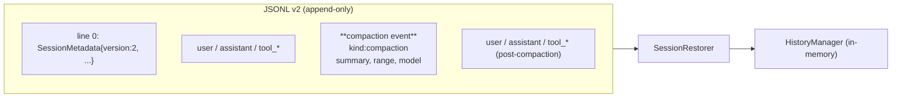
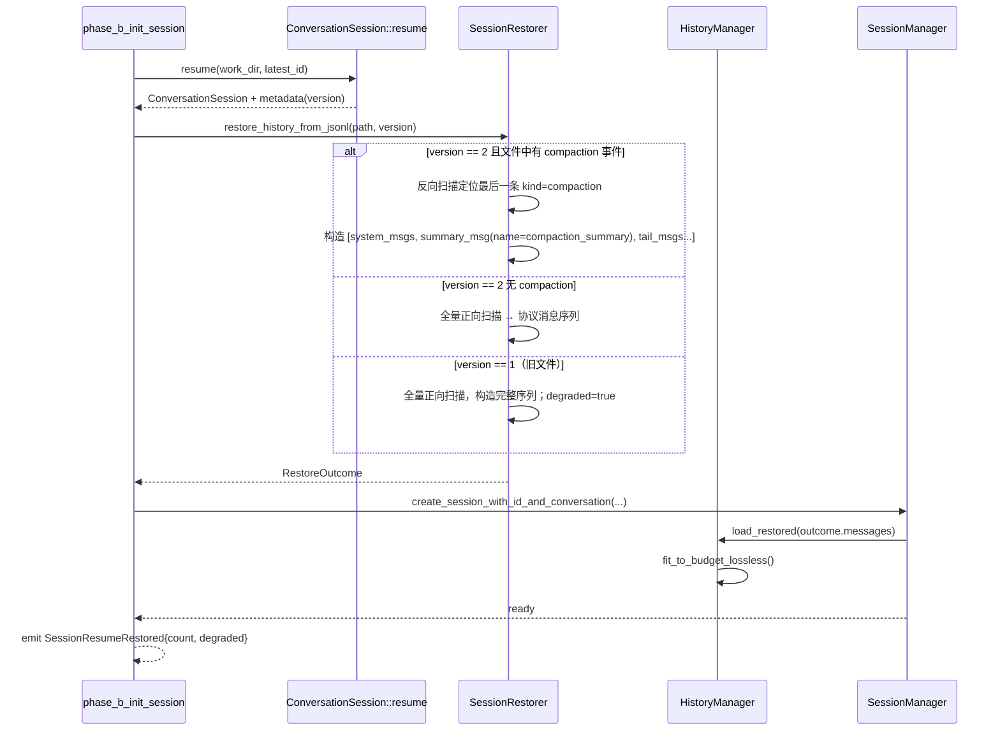

# Architecture Design: Session Resume Context Restoration

> Status: Proposal · Author: Senior Engineer (acowork) · Date: 2025
> Scope: `core/acowork-runtime/src/conversation.rs`,
> `core/acowork-runtime/src/agent/history.rs`,
> `core/acowork-runtime/src/startup/session_init.rs`,
> `core/acowork-runtime/src/agent/session/session_manager.rs`

## 1. Executive Summary

当前历史 session 在冷启动时只恢复了 JSONL 的元数据（model / provider / workspace），
**会话消息没有装入 `HistoryManager`，因此模型完全没有上一次的上下文**。
JSONL 又是 append-only 的全量事件流，从未记录 compaction 边界，
所以无法直接"全部加载"——曾经压缩过的 session 一旦无脑重放会立即超窗。

推荐方案：**JSONL 增加 `compaction` 事件行（小步演进），恢复时严格重放最后一次
compaction 之后的窗口（system + compaction summary + 末尾 N 轮），保持与不重启时
完全一致的内存状态**。同时为存量旧文件提供"懒重建"回退路径，确保向后兼容。

## 2. Context

### 2.1 Facts（已验证）

- **JSONL 事件模型**（`conversation.rs:19-33`）：每行是一条 `ConversationEntry`，
  `role` 包含 `user | assistant | thought | tool_call | tool_result | system`，
  没有任何标记表示"这之前的内容已被压缩"。
- **resume 流程仅恢复元数据**（`startup/session_init.rs:37-57`、
  `conversation.rs:306+`）：`ConversationSession::resume` 只读 metadata、
  打开追加写句柄，**不重建 `HistoryManager`**，前端通过
  `read_messages_paginated` 单独读 JSONL 仅做展示。
- **内存中的 compaction 行为**（`history.rs:597-722`、`loop_context.rs:160-280`）：
  达到 80% 阈值时调用 `compact_via_llm` → `replace_middle_with_summary`，
  在 `HistoryManager` 中插入一条 `Assistant{ name: "compaction_summary" }` 标记，
  并删除中间消息。**这一步只改内存，JSONL 不写任何标记**。
- **`is_compacted` 字段**（`session_state.rs`）只是会话级布尔位，本轮 session
  关闭时用于决定 tail distillation 起点（`loop_session.rs:127-150`），
  不会被持久化。
- **token 预算**（`history.rs:48-54`、`token/counter.rs`）按 model+provider 决定，
  恢复时若选了不同模型，预算可能小于历史窗口大小。

### 2.2 Assumptions

- 用户期望"打开历史 session 后继续聊"而不是"看历史→另起对话"。
- 一次 compaction 后保留的"末尾 N 轮"在 JSONL 里仍然完整存在
  （compaction 只截内存中间段，末尾 N 轮和之后追加的所有消息都仍在 JSONL）。
- 模型可能在 resume 后被切换，但绝大多数情况下沿用 metadata 里持久化的模型。
- 单文件 session 体量有上限（一次会话）；十万级行的极端场景很少见，
  但需要保证扫描复杂度在 O(N)。

### 2.3 Constraints

- JSONL 必须保持向前兼容：旧客户端 / 旧文件不能崩溃。
- 文件格式版本字段已存在（`SessionMetadata.version = 1`），可以平滑升级到 2。
- 恢复必须在 `phase_b_init_session` 同步阶段完成（在 `SessionTask` 启动前），
  以便 LLM 第一次调用就拿到正确上下文。
- 不引入新的二进制依赖；只用 `serde_json` + 现有 `ChatMessage` 类型。
- compaction 是 best-effort；恢复失败必须有明确的退化策略，**不能阻塞会话**。

## 3. Requirements

### 3.1 Functional

- **FR-1**：冷启动恢复某个历史 session 时，第一条用户消息发出前，
  `HistoryManager` 必须包含与该 session 上次活跃时**逻辑等价**的消息序列
  （system + 可选 compaction summary + 末尾 N 轮）。
- **FR-2**：曾经压缩过的 session，恢复后内存窗口必须 ≤ 当前 token 预算的 80%，
  避免触发立即重压缩。
- **FR-3**：未压缩过的 session，恢复后窗口 = JSONL 中所有"协议消息"。
- **FR-4**：所有非协议条目（`thought` / 已写入但未关联到 LLM 协议轮的草稿）
  在重放时被正确过滤——它们只用于前端展示，不进入 LLM 上下文。
- **FR-5**：tool_call / tool_result 必须成对出现；任何孤立的 `tool_result`
  在重放时被丢弃，避免 provider 端 sanitize 失败。
- **FR-6**：恢复失败时，回退到"空 history + 完整 JSONL 仍可见"，
  并向前端发送一个 `SessionResumeDegraded` 提示事件。
- **FR-7**：新建 session 行为不变；compaction 触发时新增一条 `compaction`
  事件行写入 JSONL。

### 3.2 Non-Functional

- **NFR-1**：恢复延迟 P95 ≤ 200ms（中等 session：500 行 JSONL + 1 次 compaction）。
- **NFR-2**：流式扫描 JSONL，不一次性 `read_to_string`；峰值内存 O(window_size)。
- **NFR-3**：JSONL 升级到 v2 后，老格式（v1 + 无 compaction 事件）自动降级
  到"懒重建"路径，不报错。
- **NFR-4**：恢复路径必须有结构化日志（session_id, replayed_count,
  skipped_count, compaction_index, decision）。

### 3.3 Non-Goals

- 不在本次改动里做"跨设备同步" / "增量压缩日志的备份恢复"。
- 不在本次改动里做"用户手工选取从某条消息开始恢复"的功能。
- 不重写 JSONL 文件结构（保持 append-only 语义，只增加新事件类型）。
- 不解决"模型切换导致 token 预算变化"的所有 edge case，
  仅做超额时一次性 trim 兜底。

## 4. Alternatives Considered

| Option | Summary | Pros | Cons | Risk | Reversibility |
|---|---|---|---|---|---|
| **A · 忠实重放 + 新 compaction 事件**（推荐） | JSONL 升级 v2，写入 `compaction` 事件；恢复时定位最后一次 compaction，重放 `[system, summary, 末尾N轮 + 之后追加消息]` | 与不重启时**逐字节一致**；不需要二次 LLM 调用；窗口大小可预测 | 需要新增事件类型 + 升级版本号；老文件需要降级路径 | 中：格式变更，但只追加字段 | 高：保留 v1 reader |
| B · 懒重建（无格式改动） | JSONL 不变；恢复时按 token 预算从尾部回溯装填消息，超阈值则首轮交互前再触发一次 compaction | 零格式改动；实现简单 | 第一轮交互可能多花一次 LLM compaction 调用；恢复后窗口 ≠ 退出前窗口（语义漂移）；如果用户立即问"继续之前的话题"，可能命中没装入的部分 | 中：用户感知到"它好像忘了一些" | 极高 |
| C · 离线索引文件 | 每次 compaction 后旁路写一个 `{session_id}.snapshot.json`，恢复时直接读快照 | 恢复 O(1)；JSONL 完全只读 | 增加双写一致性问题（崩溃可能导致索引滞后）；新增文件清理逻辑；snapshot 与 JSONL 真相不同源 | 高：双写一致性是经典坑 | 中 |

**选 A 的理由**：
- 你明确选择"忠实重放"，B 不满足语义。
- C 的双写一致性需要额外的事务/校验逻辑，复杂度溢出收益。
- A 是 append-only 的自然延伸：compaction 本身就是一个有意义的"事件"，
  把它显式记下来反而让 JSONL 自描述能力更强（也利于将来调试 / 可视化压缩历史）。

## 5. Recommended Architecture

### 5.1 数据模型变更（向后兼容）



**新增条目类型**（在 `ConversationEntry` 上扩展，不破坏老读者）：

```rust
// conversation.rs
#[derive(Debug, Clone, Serialize, Deserialize)]
pub struct ConversationEntry {
    pub id: String,
    pub ts: String,
    pub role: String,           // 老字段保持兼容；新事件用 "compaction"
    pub content: String,        // 对 compaction：summary 文本
    #[serde(skip_serializing_if = "Option::is_none")]
    pub metadata: Option<serde_json::Value>,

    /// v2 新增：事件种类。None / "message" 视为普通消息，向后兼容。
    /// "compaction" 表示压缩事件。
    #[serde(default, skip_serializing_if = "Option::is_none")]
    pub kind: Option<String>,
}

/// metadata for kind="compaction"
#[derive(Debug, Clone, Serialize, Deserialize)]
pub struct CompactionEventMeta {
    /// 被压缩段在 JSONL 中的 [start_id, end_id]（用 entry.id，不依赖行号）
    pub compacted_from_id: String,
    pub compacted_to_id: String,
    /// 内存层面 keep_last_rounds（用于复算保留尾部）
    pub keep_last_rounds: usize,
    /// 当时使用的压缩 model（诊断用）
    pub model: String,
    /// 压缩前后 token 估算（诊断用）
    pub before_tokens: u64,
    pub after_tokens: u64,
}
```

`SessionMetadata.version` 升到 `2`。读取时：
- `version == 1` → 走"懒重建"降级路径（见 §5.4）。
- `version == 2` → 走忠实重放路径。

### 5.2 Module: `SessionRestorer`（新模块）

- **位置**：`core/acowork-runtime/src/agent/session/restorer.rs`
- **责任**：把 JSONL 文件解析成"装入 `HistoryManager` 的 `Vec<ChatMessage>`"。
  仅做格式翻译，不做 token 预算判断（那是 `HistoryManager` 的职责）。
- **依赖**：`conversation::ConversationEntry`、`acowork_core::providers::ChatMessage`。
- **公开接口**：

```rust
pub struct RestoreOutcome {
    pub messages: Vec<ChatMessage>,   // 装入 history.append() 的消息
    pub had_compaction: bool,
    pub replayed_entry_count: usize,  // 用于日志/前端"恢复 X 条上下文"
    pub skipped_entry_count: usize,
    pub degraded: bool,               // 是否走了降级路径
}

pub enum RestoreError {
    Io(std::io::Error),
    Corrupt { line: u64, reason: String },
}

pub fn restore_history_from_jsonl(
    path: &Path,
    metadata_version: u32,
) -> Result<RestoreOutcome, RestoreError>;
```

- **Failure modes**：
  - JSONL 第 N 行损坏 → 跳过该行，累加 `skipped_entry_count`，
    继续解析（与 `read_messages_paginated` 现有容忍策略一致）。
  - 完全无法打开 / 全是损坏 → 返回 `Err`，调用方降级到空 history。
  - tool_call/tool_result 不配对 → 丢弃孤立的 tool_result，
    保留有 result 的 tool_call（与 `replace_middle_with_summary` 的不变量一致）。

### 5.3 Module: `HistoryManager`（小幅扩展）

- **新增方法**：

```rust
impl HistoryManager {
    /// 直接装入一段已经构造好的消息序列（不调用 append 的逐条 token 计算路径，
    /// 而是批量算一次），用于 restore。
    pub fn load_restored(&mut self, msgs: Vec<ChatMessage>);

    /// 装载后若超出 80% 预算，做一次"无损 trim"：
    /// 从尾部回溯保留尽可能多的完整轮次（user→assistant[+tool_pairs]），
    /// 直到 ≤ 80%。返回被丢弃的消息数。
    /// 不调用 LLM。
    pub fn fit_to_budget_lossless(&mut self) -> usize;
}
```

`fit_to_budget_lossless` 是 NFR-2 的兜底：当用户切换到 token 预算更小的模型时，
即使忠实重放也可能超窗，此时按完整轮次回溯丢弃最早部分（保留 system 与
compaction summary），不再触发 LLM 调用。

### 5.4 恢复流程



### 5.5 Compaction 路径变更

`loop_context.rs::compact_history_if_needed` 在 `replace_middle_with_summary`
**成功**之后：

1. 计算被压缩段的首尾 `entry.id`（在调用 compaction 前先记一遍当前
   `ConversationSession` 已写入的最后一条 entry id；compaction 完成时再记一次）。
2. 通过 `ConversationSession::append_compaction_event(meta)` 在 JSONL
   写入一条 `kind="compaction"` 的事件。
3. `is_compacted = true` 不变。

**关键点**：JSONL 仍然 append-only。被压缩的原始消息**不删除**——
它们对前端展示和 tail distillation 的"原始事实"价值仍然存在。
compaction 事件只是"逻辑分隔符"。

## 6. Data Flow

### 6.1 协议消息映射规则（restorer 内部）

| JSONL `role` | 装入 history? | 说明 |
|---|---|---|
| `system` (metadata kind 为标准 system prompt) | 是 | role=System |
| `user` | 是 | role=User |
| `assistant` | 是 | role=Assistant，content 为最终回复（已 strip think） |
| `thought` | **否** | 仅前端展示，不进 LLM 上下文 |
| `tool_call` | 是（合并） | 与紧随其后的 assistant tool_calls 配对，metadata 中含 tool_call_id |
| `tool_result` | 是（仅当配对存在） | role=Tool，必须有匹配的 tool_call |
| `compaction` (v2 新增) | 转换为 1 条 Assistant{name:"compaction_summary"} | 仅取最后一次出现的，前面的丢弃 |

### 6.2 重放窗口算法

```text
let entries = parse_jsonl(path);
let last_compaction_idx = entries.iter().rposition(|e| e.kind == Some("compaction"));

let window = match last_compaction_idx {
    Some(i) => {
        let leading_system = entries[..i].iter().filter(role == system).cloned();
        let summary_msg = build_summary_msg(&entries[i]);  // name=compaction_summary
        let tail = entries[i+1..].iter().filter(is_protocol_msg);
        chain![leading_system, [summary_msg], tail]
    }
    None => entries.iter().filter(is_protocol_msg).cloned().collect()
};

// tool_call/tool_result 配对清洗
let cleaned = sanitize_tool_pairs(window);
```

## 7. Security and Operability

- **信任边界**：JSONL 在 agent 自己的 `work_dir`，由本进程独占写。
  恢复时只读，不存在跨用户污染。
- **权限**：不变；不引入新文件路径。
- **可观测性**：
  - 新增结构化日志：`session_resume_done{session_id, version, replayed,
    skipped, had_compaction, fitted_trim, degraded, elapsed_ms}`。
  - 新增 chunk 事件 `SessionResumeRestored { replayed: u32, degraded: bool }`，
    前端可在状态栏短暂提示"已恢复 X 条上下文"。
  - metric（如已有 metrics 体系）：`session_resume_total{result=ok|degraded|failed}`。
- **运维风险**：
  - 损坏 JSONL：跳行解析 + degraded 标记，最坏退化为空 history，**不阻塞会话**。
  - 模型切换导致预算缩水：`fit_to_budget_lossless` 兜底，
    日志中暴露丢弃数量。
  - 旧版本回滚：v2 文件被 v1 reader 打开时，新增的 `kind` 字段被
    `serde(default, skip_serializing_if = "Option::is_none")` 忽略，
    `compaction` 行 `role` 字段保持 `"system"`（建议同时填 `role`），
    被旧逻辑当成普通 system 行展示——不会崩溃。

## 8. Delivery Plan

| Phase | Goal | Validation | Rollback |
|---|---|---|---|
| **P1** | 新增 `SessionRestorer` + `HistoryManager::load_restored` / `fit_to_budget_lossless`；session_init 调用 restorer 装载历史；不修改 JSONL 写入路径 | 单测：①未压缩 session 全量恢复 ②有 compaction 的 v2 文件忠实重放 ③孤立 tool_result 被丢弃 ④损坏行被跳过；集成测：resume 后第一条新消息 LLM 调用包含历史 | 还原 session_init 的两行 restorer 调用即可 |
| **P2** | compaction 路径写入 v2 事件行；`SessionMetadata.version = 2`（新建文件）；老文件读到 v1 走降级路径 | 单测：compaction 后 JSONL 末尾出现 `kind=compaction` 行；`SessionRestorer` 在同一文件上能正确重放；旧 v1 文件能 degraded 加载 | 关闭"写入 compaction 事件"的 feature flag；版本号回退到 1 |
| **P3** | 前端事件 `SessionResumeRestored` + 状态栏提示；监控埋点 | 端到端：UI 显示"已恢复 X 条上下文"；degraded 模式有提示 | 仅前端 UI 隐藏 |

P1 单独交付即可解决"上下文完全没进入"的主要 bug；P2 让"忠实重放"语义对未来
session 全面生效。P3 仅是体验增强。

## 9. Key Decisions

| Decision | Choice | Rationale | Rejected Alternatives | Trade-offs |
|---|---|---|---|---|
| 是否改 JSONL 格式 | 是（v2 + compaction 事件） | 满足"忠实重放"；append-only 自然延伸 | 旁路 snapshot 文件；不改格式 | 引入版本号迁移；但只增字段，回滚成本低 |
| compaction 事件 ID 锚点 | 用 `entry.id`（UUID） | 行号在并发追加时不稳定；id 永远稳定 | 行号 / 字节偏移 | 解析时需要建立 id→index 映射，O(N) |
| 是否清理被压缩的原始消息 | **不清理**（继续保留在 JSONL） | append-only 语义；前端展示需要；tail distillation 需要 | 物理删除 / 转移到归档文件 | 文件可能略大，但单 session 量级有限 |
| 压缩 summary 在内存中的形式 | 沿用现有 `Assistant{ name: "compaction_summary" }` | 最小变更；与 `last_compaction_index` / `emergency_trim` 不变量一致 | 引入新 role | 新增 role 会扩散到 provider 适配层 |
| 重放后超预算策略 | 无损 trim（按完整轮回溯丢弃最早部分） | 不需要 LLM 调用；行为可预测 | 立即触发 LLM compaction | 极少数情况下"忠实"程度降低，但有日志可追 |
| 旧文件兼容路径 | 全量正向重放（degraded=true） | 用户体验最接近 v2，但因为没有 compaction 标记，第一次 LLM 调用前可能触发一次正常的 80% compaction | 拒绝加载老文件 | 用户首轮可能感知一次延迟，但不会丢上下文 |

## 10. Open Questions

- **OQ-1**：`thought` 在 reasoning model（Anthropic / o1 系列）下是否需要装回
  上下文以维持思维连续性？目前结论：不装入（与现有非 resume 路径一致：
  `loop_inbound.rs:292` 写入的是 strip 后的文本）。
  → 待你确认是否同意。
- **OQ-2**：当 `SessionMetadata.model` 持久化的模型已经被卸载（fallback 触发，
  见 `session_init.rs:90-108`），fallback 后 token 预算可能差异巨大。
  是否在这种切换发生时强制走 `fit_to_budget_lossless`？建议：是。
- **OQ-3**：是否需要一个 `--no-resume` 启动 flag 用于排错？
  建议作为隐藏开关加入（环境变量 `ACOWORK_DISABLE_SESSION_RESUME=1`）。

## 11. Self-Review

- [x] FR-1 ~ FR-7 全部覆盖（§5.4 + §6 + §7）
- [x] NFR-1/2/3/4 都有具体落地点（流式扫描 / 版本字段 / 结构化日志）
- [x] 无 placeholder（所有 fn 名、字段名指向具体文件位置）
- [x] 公开接口显式声明（`SessionRestorer` + `HistoryManager` 两个新方法）
- [x] 测试策略明确（P1 单测 + 集成测；P2 兼容性测）
- [x] 回滚路径具体（P1 删两行调用；P2 关 feature flag + 版本号回退）
- [x] 不存在 cyclic dependency：`restorer` 依赖 `conversation`+`history`，
  反向无引用
- [x] 旧文件 / 损坏文件 / 模型切换三类异常路径都有兜底
