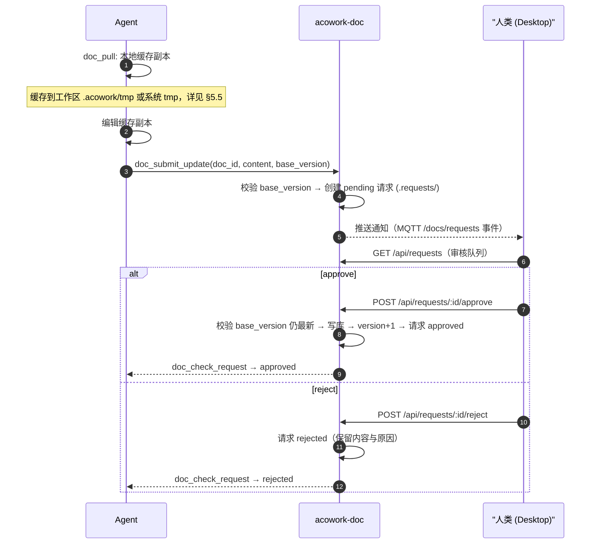
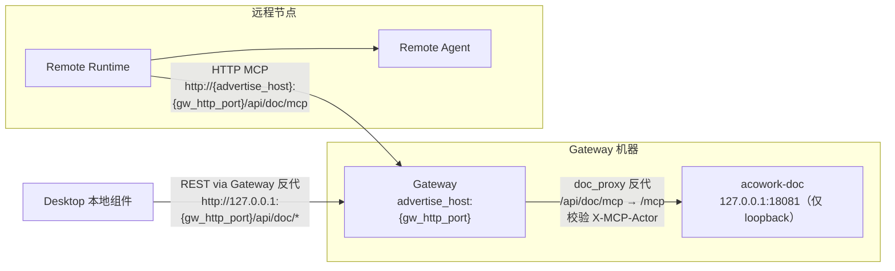

# acowork-doc 在线文档服务设计

> 版本：v1.0（定稿）| 日期：2026-09（D0–D4 实施完成）
>
> 关联 PRD：[`docs/prd/zh/prd-doc-pm.md`](../../prd/zh/prd-doc-pm.md)（§4 在线文档）
> 关联设计：[`04-gateway.md`](./04-gateway.md)、[`14-desktop-app.md`](./14-desktop-app.md)
> 关联 ADR：[`ADR-070-doc-standalone-process-and-tree-storage.md`](../../adr/zh/ADR-070-doc-standalone-process-and-tree-storage.md)（doc 独立进程 + 存储选型，本 v1.0 依其定案）、[`ADR-064-pm-standalone-process.md`](../../adr/zh/ADR-064-pm-standalone-process.md)（独立进程范式先例）、[`ADR-055-remote-runtime-node-topology.md`](../../adr/zh/ADR-055-remote-runtime-node-topology.md)（远程节点访问）
>
> **一句话**：`acowork-doc` 是 Gateway 托管的本地在线文档服务，提供目录树文档库的 REST API 与 doc MCP Server。人类经 Desktop 本地 React 组件使用；Agent 经 HTTP MCP 工具读写，修改走「PR 式审核流」。

---

## 1. 设计目标与已决结论

### 1.1 目标

1. 提供基础版在线文档：Markdown 阅读/编辑/渲染、目录树文档库管理（创建/重命名/移动/删除/检索）。
2. Agent 可直接读写共享文档；**Agent 对已有文档的修改须经人类审核后合并**（PR 式审核流）。
3. 复用 Gateway sidecar 托管范式（同 `acowork-embed`），可监督、可重启、可远程访问。
4. 前端复用 Desktop 既有设计系统与 Markdown 渲染组件，保证风格统一。

### 1.2 已决结论（PRD §10 开放问题固化）

| 结论 | 决策 | 理由 / 落点 |
|------|------|-------------|
| Q1 | **前端 = Desktop 本地 React 组件**（不 WebView 内嵌） | WebView 内嵌独立前端会导致两套技术栈与样式，风格不统一。Desktop 已有成熟的 `MarkdownPreviewView`（react-markdown + remark-gfm + CodeBlock）与设计 token，直接复用。acowork-doc 服务**只提供 REST API**，不内置前端 |
| Q2 | **add to doc = 快照副本** | 避免工作区后续变化导致的链接失效；导入后与原工作区解耦，KISS |
| Q3 | **MCP transport = HTTP** | 服务常驻、连接开销低；现有 `McpTransport` 已支持 HTTP |
| Q4 | **Agent 修改已有文档走 PR 式审核流** | Agent 先在本地生成缓存副本 → 修改 → `doc_submit_update` 提交更新请求（pending）→ 人类在 Desktop 审核（approve/reject）→ approve 后合并入库。**新增文档（add to doc）直接生效，不审核**。临时文件放工作区 `.acowork/tmp/` 或系统 tmp（agent home 工作区除外） |
| Q7 | **暴露给远程节点** | 与 embed 一致：endpoint 用 `advertise_host` 构造，经 MQTT 全局资源/AgentHello 下发，远程 Runtime 可访问 doc MCP（§8） |
| Q8 | **数据目录 = `$HOME/.acowork/acowork-doc/`** | ADR-070 决策 3：修正草案 `{data}/acowork-doc/`（嵌套 Gateway 数据目录）——与 pm 对齐，doc 数据与 Gateway 数据目录**平级独立**（`$HOME/.acowork/` 下与 gateway/node/pm 并列），生命周期互不耦合 |

> 未列出的 Q5/Q6 属于 acowork-pm，见 [21-pm-project-management.md](./21-pm-project-management.md)。

---

## 2. 系统组成与部署

### 2.1 组件形态

- 独立 Rust crate：`core/acowork-doc/`（新增），axum HTTP 服务，与 `acowork-embed` 同构（CLI + logging + shutdown + health）。
- 由 Gateway 生命周期模块拉起与监督：复用 `pm_supervisor` 的 spawn + `/health` 轮询 + 指数退避重启模式，新增 `lifecycle/doc_supervisor.rs`（`core/acowork-gateway/src/lifecycle/doc_supervisor.rs`）。
- 绑定 `127.0.0.1:{doc_port}`，默认端口 **18081**（可配置，端口冲突自动递增，同现有 http.port 策略）。
- 不内置 Web 前端：只暴露 REST API + MCP HTTP 端点。

### 2.2 数据目录布局（Q8 → ADR-070 决策 3）

```
$HOME/.acowork/                       # 各服务数据根（平级，生命周期互不耦合）
├── acowork-gateway/  acowork-node/  acowork-pm/ …   # 现有，平行共存
└── acowork-doc/                      # ← 本文档库根（新增）
    ├── library.json                  # 根目录索引：只管本级文件与子目录
    ├── 产品方案.md
    └── 项目A/
        ├── library.json
        ├── PRD.md
        └── 设计/
            ├── library.json
            └── 架构.md
    ├── .trash/                       # 回收站（30 天后清理）
    ├── .versions/{doc_id}/           # P2：历史版本快照（不进入目录树）
    └── .requests/                    # 更新请求（PR 式审核流，§5）
```

> 用户可通过 `[doc].data_dir` 覆盖默认位置；`[doc].port` 默认 18081，冲突自动递增。

### 2.3 配置项（已实现，Gateway `[doc]` 小节）

```toml
[doc]
enabled = true
port = 18081                          # 冲突自动递增（最多 +20）
data_dir = null                       # 缺省 = $HOME/.acowork/acowork-doc
mcp_http_path = "/api/doc/mcp"        # MCP 公开端点（Gateway 反代路径，doc_mcp_url 用）
auto_inject_mcp = true                # 自动注入 doc MCP 到每个 Agent（catalog）
request_ttl_hours = 72                # 待审核请求过期时间（默认 72 小时）
trash_retention_days = 30             # 回收站保留天数
```

---

## 3. 存储模型（目录树 + 每目录 library.json）

沿用 PRD §4.4 的目录树模型，设计要点如下：

### 3.1 目录树

- 文件系统即目录树真相：目录=文件夹、文档=`.md` 文件、文件名（去后缀）=标题。
- **每个目录（含根）各有一个 `library.json`，只管理本级**的 `files[]`（文档元数据）与 `dirs[]`（子目录轻量引用）。
- 子目录权威元数据在其自己的 `library.json`；不维护全局树索引。

### 3.2 library.json 结构

```jsonc
// $HOME/.acowork/acowork-doc/library.json（根目录示例）
{
  "dir_id": "root",
  "parent": null,
  "files": [
    {
      "doc_id": "doc-1001",
      "name": "产品方案",                 // 与文件名一致（权威为文件名）
      "version": 4,                       // 乐观并发版本号
      "import": {                          // 来源：手工新建为 null
        "agent_id": "com.example.agent",  // add to doc 来源 Agent
        "workspace_path": "notes/方案.md" // 来源工作区相对路径
      },
      "created_at": "2026-08-30T10:00:00Z",
      "updated_at": "2026-08-30T11:00:00Z",
      "deleted": false
    }
  ],
  "dirs": [
    { "dir_id": "dir-2001", "name": "项目A", "updated_at": "...", "deleted": false }
  ]
}
```

### 3.3 一致性规则

- 文件名与 `files[].name` 双写、文件名为权威；启动/读取时校验并修复不一致。
- 重命名/移动 = 改文件系统 + 同步相关本级 `library.json`（移动涉及源/目标两个，目标先写、源后写，失败回滚）。
- 写库：单机单实例，每个 `library.json` 文件锁 + 原子替换（临时文件 + rename）。
- 回收站：删除标记 `deleted=true` + 文件/目录移入 `.trash/`，30 天后清理。

---

## 4. REST API 设计

> 前缀 `/api`；错误统一 JSON `{"error": {...}}`；文档写操作用版本号乐观并发，冲突返回 409。
> **Desktop 访问路径**：经 Gateway 反向代理 `{gw}/api/doc/...`，Gateway 剥掉 `/api/doc` 前缀转发到 doc 服务 `/api/...`（保持单入口 + 鉴权点）。Agent 不调 REST，走 §6 MCP HTTP。

| 方法 | 路径 | 说明 | 鉴权 |
|------|------|------|------|
| GET | `/health` | 健康检查（监督器用） | 内部 |
| GET | `/api/tree?path=` | 目录树浏览：返回该目录下文档/子目录条目 | Desktop |
| POST | `/api/dirs` | 新建目录 `{path, name}` | Desktop |
| PATCH | `/api/dirs/:id` | 目录重命名/移动 | Desktop |
| DELETE | `/api/dirs/:id` | 删除目录（级联入回收站） | Desktop |
| GET | `/api/docs/:id` | 读文档（Markdown 原文 + 版本 + 元数据） | Desktop / Agent |
| POST | `/api/docs` | 新建文档 `{path, title, content?, import?}` | Desktop / Agent（`import` 记录 add to doc 来源） |
| PUT | `/api/docs/:id` | **直接更新**（人类路径，带 `version`） | Desktop（人类） |
| DELETE | `/api/docs/:id` | 删除文档（入回收站） | Desktop |
| POST | `/api/docs/:id/move` | 移动文档 `{to_path}` | Desktop |
| GET | `/api/search?keyword=` | 跨目录关键字检索 | Desktop / Agent |
| GET | `/api/requests?status=` | 更新请求列表（审核队列） | Desktop（人类） |
| POST | `/api/requests/:id/approve` | 审核通过：校验 base_version → 合并入库 | Desktop（人类） |
| POST | `/api/requests/:id/reject` | 审核拒绝（可附 note） | Desktop（人类） |
| GET | `/api/docs/:id/requests` | 某文档的更新请求历史 | Desktop / Agent |
| GET | `/api/trash` / `POST /api/trash/:id/restore` | 回收站查看与恢复（P2） | Desktop |

> `PUT /api/docs/:id` 仅对人类开放；Agent 必须走 §5 的更新请求（`doc_submit_update`）。服务端在请求层校验调用方身份（MCP 调用带 agent_id）。

---

## 5. 文档更新审核流（PR 式，Q4）——核心设计

### 5.1 动机

多个 Agent 共享同一文档库，若 Agent 直接覆写他人内容会破坏协作。参照 git PR：**Agent 的修改先提交请求，人类审核后合并**。新增文档（add to doc）不审核（导入即分享）。

### 5.2 流程



### 5.3 更新请求模型（`.requests/{request_id}.json`）

```jsonc
{
  "request_id": "r-001",
  "doc_id": "doc-1001",
  "path": "项目A/PRD.md",
  "base_version": 4,                 // 基于的版本
  "content": "...",                  // 提交的新内容
  "submitted_by": "agent:com.example.agent",
  "status": "pending",               // pending | approved | rejected | expired
  "created_at": "2026-08-30T12:00:00Z",
  "reviewed_at": null,
  "reviewed_by": null,
  "review_note": null
}
```

### 5.4 合并语义

- **approve**：服务端再次校验 `base_version == 当前版本`；若已被其他更新抢占（版本已变），拒绝合并并提示 Agent 重新基于新版本提交（与 git push 被拒同语义）。
- **expired**：超过 `request_ttl_hours` 未审核自动标记 expired，由 Agent 重新提交。
- 审核通过写库后版本号 +1，所有已读客户端（含其他 Agent 的缓存）应感知版本变化。

### 5.5 Agent 端缓存副本（Q4 细节）

- 缓存位置优先级：
  1. 当前 Agent 工作区根下 `.acowork/tmp/docs/{doc_id}.md`（工作区专用临时目录，类似其他 Agent 应用约定）。
  2. **例外**：Agent 工作区即 agent home（无独立 workspace 目录）时，用系统 tmp `{temp_dir()}/acowork-doc/{agent_id}/{doc_id}.md`。
- `.acowork/` 仅存临时/缓存，不进入文档库、不随共享导出。
- `doc_pull` 语义（D3 实施修正，见 §12 OD-1）：**服务端不落盘**——返回 Markdown 原文 + `base_version` + 建议缓存相对路径（`.acowork/tmp/docs/{doc_id}.md`），由调用方（Runtime/Agent 文件工具）写入其工作区。doc 进程与 Agent 工作区可能不在同一信任边界（远程 Agent），落盘职责归 Agent 侧。

---

## 6. MCP 工具设计（Agent 接口，HTTP transport）

- MCP Server 端点：`http://127.0.0.1:{doc_port}/mcp`（doc 进程内部端点，仅 loopback；Q3 = HTTP）。Gateway 反代公开入口为 `http://{advertise_host}:{gw_http_port}/api/doc/mcp`（§8）。
- Gateway 将 doc MCP 配置注入每个 Agent 的 `catalog` 列表（`auto_inject_mcp=true` 时），Agent 默认获得 `doc_*` 工具。
- 每个工具调用携带 `agent_id`（由 Runtime MCP 层注入或服务端从连接上下文取），服务端据此做身份归属校验（NFR-04）。

| 工具 | 参数 | 返回 | 说明 |
|------|------|------|------|
| `doc_list` | `path?`（目录，缺省根）`query?` `offset?` `limit?` | 该目录下文档/子目录条目 | 目录树逐级浏览 |
| `doc_read` | `doc_id` 或 `path` | Markdown 原文 + `version` + 元数据 | 读取共享文档 |
| `doc_pull` | `doc_id` 或 `path` | 内容 + `base_version` + 建议缓存相对路径 | 拉取缓存副本（§5.5，服务端不落盘），供修改后提交 |
| `doc_add` | `path?`（目标目录，缺省根）`title?` `content` `source_workspace?` `source_path?` | 新 `doc_id` | **add to doc**：新增文档直接生效（快照导入）；同名冲突返回 409 |
| `doc_submit_update` | `doc_id` 或 `path` `content` `base_version` | `request_id` + `status=pending` | **PR 式更新请求**（§5），不直接写库 |
| `doc_check_request` | `request_id` | 审核状态（pending/approved/rejected/expired） | Agent 轮询审核结果 |
| `doc_mkdir` | `path` | 新目录 | 创建子目录 |
| `doc_search` | `keyword` | 命中文档列表（含路径） | 跨目录检索 |

> Agent 与现有内置工具一致地调用 `doc_*`（经 Runtime `McpManager`），无需改动 Agent 本体。

---

## 7. Desktop 集成（本地 React 组件，Q1）

- `docs` 视图 = [views/DocsView.tsx](../../../apps/acowork-desktop/src/views/DocsView.tsx)（已接入 [AppLayout.tsx:924](../../../apps/acowork-desktop/src/components/layout/AppLayout.tsx#L924) 主导航，替换原 TODO 占位）：
  - **左侧**：文档库目录树（[DocTreeSidebar.tsx](../../../apps/acowork-desktop/src/views/doc/DocTreeSidebar.tsx)，可展开/折叠目录，复用文件树交互模式）。
  - **右侧**：编辑器（[DocEditor.tsx](../../../apps/acowork-desktop/src/views/doc/DocEditor.tsx)，编辑/预览双模式，预览复用 [MarkdownPreviewView.tsx](../../../apps/acowork-desktop/src/components/editor/MarkdownPreviewView.tsx) 同栈渲染），保证与桌面端其他 Markdown 渲染风格一致。
- 数据获取：本地 React 组件经 Gateway 反向代理调用 REST API（`http://127.0.0.1:{gw_http_port}/api/doc/*`），不直接连 doc 服务端口（保持单入口 + 鉴权点）；doc_types/doc-api 客户端对齐服务端 wire DTO。
- **审核队列**：[ReviewQueue.tsx](../../../apps/acowork-desktop/src/views/doc/ReviewQueue.tsx) 展示「待审核更新请求」，人类 approve/reject（§5）；回收站 [TrashDialog.tsx](../../../apps/acowork-desktop/src/views/doc/TrashDialog.tsx)。
- 服务离线提示：healthStore 30s 轮询 + 连续失败判离线，显示「文档服务不可用 + 重试」而非白屏（与 pm 离线面板同设计）。
- 无需引入新依赖：zustand stores（`stores/doc/*`）+ ReactMarkdown / remark-gfm / CodeBlock / 目录树组件均已存在。

---

## 8. 远程节点访问（Q7）

与 embed 一致（参考 ADR-055 §6.3/§6.8），**但入口收敛到 Gateway 反代**（D4-1 实施定案）：

- doc 服务作为 **global scope** sidecar 部署在 Gateway 机器，只绑定 `127.0.0.1`（内部端口 18081），**不直接暴露公网**。
- 对外 endpoint 用 Gateway `advertise_host` + HTTP 端口构造（D4-1 在 [gateway/mod.rs:702](../../../core/acowork-gateway/src/gateway/mod.rs#L702) 定案）：`http://{advertise_host}:{gw_http_port}/api/doc/mcp`——远程 Runtime 先到 Gateway 公共 HTTP 入口，由 `doc_proxy` 校验身份后反代到 doc 进程 `/mcp`。
- 下发路径：Gateway 启动时把 `doc_mcp_url` 写入共享状态，经 MQTT 全局资源 `build_available_mcps` 注入（[global_resources_builders.rs:180](../../../core/acowork-gateway/src/mqtt/global_resources_builders.rs#L180)），远程 Runtime 收到 endpoint 后 HTTP 调用 doc MCP；REST 与 MCP 两路均由 doc_proxy 鉴权（`X-Actor: human` 注入 / `X-MCP-Actor` 校验）。
- **安全**：MCP HTTP 端点的身份校验发生在 Gateway `doc_proxy`（单一鉴权点）——`X-MCP-Actor ∈ installed_agents` 才透传（受信 agent），否则剥离为匿名（仅只读工具 list/read/search/pull/check_request）。禁止匿名写操作。明细见 §9。



---

## 9. 安全设计

| 威胁 | 缓解 |
|------|------|
| MCP 端点暴露到 advertise_host 被匿名调用 | MCP HTTP 端点要求鉴权：连接时校验 Runtime 携带的 agent 身份 / node token（Gateway 注入）；无身份调用仅允许只读工具（doc_list/read/search），写操作（add/submit_update/mkdir）必须带可信 agent_id |
| Agent 越权改他人文档 | 更新走 PR 审核流（§5），Agent 不能直接覆写；`doc_submit_update` 记录 `submitted_by` |
| 并发覆盖 | 版本号乐观并发：写库/合并均校验 `base_version`，冲突 409 |
| 路径穿越 | 所有 `path` 参数解析后必须落在文档库根内（`starts_with` 校验），拒绝 `..` 与绝对路径 |
| 内容注入 | Markdown 渲染复用 Desktop 已有 sanitize 链路（rehype-raw 行为与现有一致） |

---

## 10. 一致性、可靠性与运维

- **崩溃恢复**：`.requests/` 为文件存储，重启后 pending 请求保留；写库均为原子替换，无中间态。
- **监督**：doc 进程崩溃/卡死 → Gateway 指数退避重启；启动失败不阻塞 Gateway（NFR-02）。
- **日志**：`{gateway.data_dir}/logs/doc.log`（doc_supervisor 把 doc 进程 stderr 重定向到该文件，同 pm/embed）。
- **备份**：整个 `$HOME/.acowork/acowork-doc/` 为纯文件，直接拷贝即备份；`library.json` 与 `.md` 同时备份即完整还原。

---

## 11. 里程碑（建议）

| 阶段 | 内容 | 交付物 |
|------|------|--------|
| **D0 骨架** | `core/acowork-doc` crate（CLI + axum + /health + 日志 + shutdown）；Gateway `[doc]` 配置 + `lifecycle/doc.rs` 拉起/监督 | 服务可起停、可监督 |
| **D1 存储 + REST** | 目录树存储（library.json + .md）、REST API（tree/docs/search/dirs）、版本号并发 | 服务端完整 |
| **D2 Desktop docs 视图** | 目录树组件 + 复用 MarkdownPreviewView 编辑器 + 服务离线态，接入 AppLayout | 人类可用基础在线文档 |
| **D3 更新审核流** | `.requests/` 模型、`doc_submit_update`/approve/reject、审核队列 UI、MQTT 通知 | PR 式审核全链路 |
| **D4 Agent 接口 + 远程** | doc MCP HTTP Server（§6 全部工具）、Gateway catalog 自动注入、advertise endpoint 下发、身份校验 | Agent 可用；远程可用 |

---

## 12. 实施决策记录（原开放问题表，v1.0 已全部定案）

| 编号 | 问题 | 决策（实施定案） |
|------|------|------|
| OD-1 | `.acowork/tmp` 缓存是否需要在 Agent 重启/会话结束时清理？ | **服务端不落盘**（D3 实施修正）：`doc_pull` 只返回内容 + base_version + 建议缓存相对路径（`.acowork/tmp/docs/{doc_id}.md`），由调用方（Runtime/Agent 文件工具）写入其工作区——doc 进程与 Agent 工作区可能不在同一信任边界（远程 Agent），落盘职责归 Agent 侧。见 [mcp/tools.rs](../../../core/acowork-doc/src/mcp/tools.rs) |
| OD-2 | 更新请求是否支持「驳回后 Agent 重新提交」的迭代，还是每次新请求？ | **每次新请求**（简单、可审计）；reject 保留 `review_note` 供 Agent 参考重新提交 |
| OD-3 | 文档编辑是否需要「草稿」概念？ | **不需要**——仅 Desktop 客户端本地状态（editorStore dirty + 409 conflict 引导刷新）；服务端无草稿 |
| OD-4 | 回收站是否纳入 v1 范围？ | **纳入 v1**：`.trash/` + sidecar（恢复信息）+ `trash_retention_days`（默认 30 天）启动惰性清理；Desktop TrashDialog 支持 restore / purge |

---

## 13. 实施状态（D0–D4 完成）

| 里程碑 | 内容 | 状态 |
|--------|------|------|
| D0 骨架 | `core/acowork-doc` crate（CLI + axum + /health + 日志 + shutdown）；Gateway `[doc]` 配置 + `lifecycle/doc_supervisor.rs` 拉起/监督 + `doc_proxy.rs` 反代 | ✅ 已交付 |
| D1 存储 + REST | 目录树存储（library.json + .md + reconcile）、REST API（tree/docs/dirs/search/trash/requests）、版本号乐观并发、Service 层封装 | ✅ 已交付（97 测试） |
| D2 Desktop docs 视图 | 目录树 + 编辑器（Markdown 同栈预览）+ 审核队列 + 回收站 + 离线降级，接入 AppLayout | ✅ 已交付（vite build 通过） |
| D3 更新审核流 + MCP | PR 式审核全链路（REST + MCP 工具 8 个 + 身份校验 + catalog 自动注入） | ✅ 已交付（MCP e2e 闭环） |
| D4 Agent 接口 + 远程 | doc MCP HTTP（8 工具）、Gateway catalog 注入、advertise endpoint 下发、远程 e2e | ✅ 已交付（remote_e2e 2 场景） |

> 注：实施顺序为 D0 → D1 → D3（MCP 服务端先行，与 D2 并行无冲突）→ D2（Desktop）→ D4（远程验证）。全套测试 114+ 全绿，clippy 0 warning。
