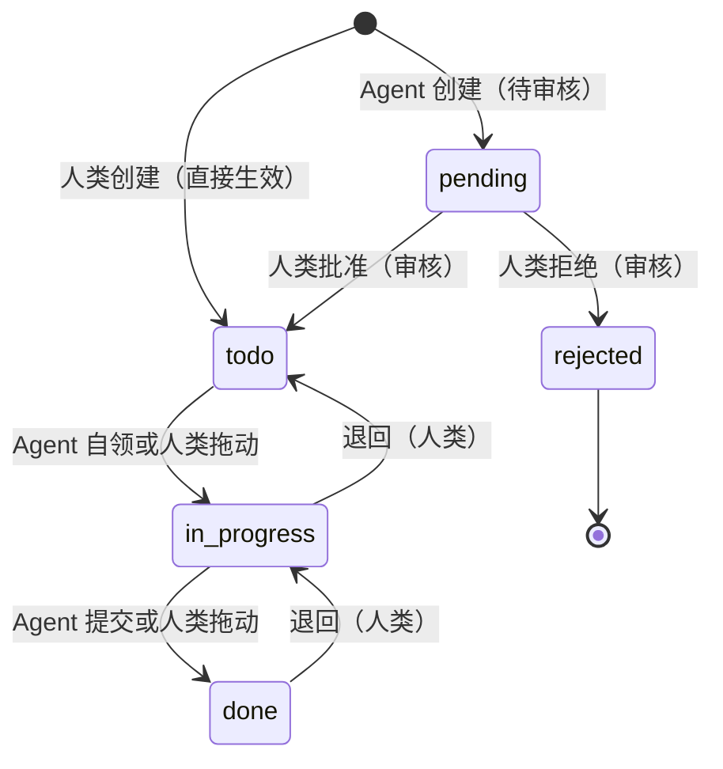

# acowork-pm 项目管理服务设计

> 版本：v0.2（草案）| 日期：2026-09-01
>
> 关联 PRD：[`docs/prd/zh/prd-doc-pm.md`](../../prd/zh/prd-doc-pm.md)（§5 项目管理）
> 关联设计：[`04-gateway.md`](./04-gateway.md)、[`14-desktop-app.md`](./14-desktop-app.md)
> 关联 ADR：[`ADR-055-remote-runtime-node-topology.md`](../../adr/zh/ADR-055-remote-runtime-node-topology.md)（远程节点访问）
>
> **一句话**：`acowork-pm` 是 Gateway 托管的本地项目管理服务，管理对象为 **Agent**——人类经 Desktop 看板管理项目与任务；Agent 经 HTTP MCP 工具自查、自领、提交任务；Agent 创建的任务须经人类审核后生效。

---

## 1. 设计目标与已决结论

### 1.1 目标

1. 提供基础版项目管理：项目/任务的创建、列表、看板式状态流转（ToDo / InProgress / Done）。
2. 任务指派对象为 **Agent**；Agent 通过 MCP 工具自查、自领、更新、提交任务。
3. **Agent 创建的任务须经人类审核后生效**（待审核状态），防止垃圾任务污染看板。
4. 指派 Agent 必须校验存在，不存在不能指派。
5. 复用 Gateway sidecar 托管范式；支持远程节点访问。

### 1.2 已决结论（PRD §10 开放问题固化）

| 结论 | 决策 | 理由 / 落点 |
|------|------|-------------|
| Q1 | **前端 = Desktop 本地 React 组件**（不 WebView 内嵌） | 同 doc（[20-doc-online-document.md](./20-doc-online-document.md) §1.2 Q1）：复用 Desktop 设计系统，风格统一。acowork-pm 只提供 REST API |
| Q3 | **MCP transport = HTTP** | 服务常驻；现有 `McpTransport` 支持 HTTP |
| Q5 | **`pm_create_task` 对 Agent 开放，但创建的任务进入「待审核」状态，人类审核通过后才生效** | 未来有专门 PM Agent 承担任务编排；先放开权限，用人类审核兜底防垃圾任务。人类创建的任务直接生效，不审核 |
| Q6 | **指派 Agent 必须校验存在** | 不存在的 Agent 不允许指派；校验来源为 Gateway Agent 目录（§9） |
| Q7 | **暴露给远程节点** | 与 embed 一致：endpoint 用 `advertise_host` 构造，远程 Runtime 可访问 pm MCP（§8） |
| Q8 | **数据目录 = `{data}/acowork-pm/`** | 与 Gateway 自身数据在 `<root>/data/` 下平行 |

> Q2（快照副本）与 Q4（PR 式审核流）属 doc，见 [20-doc-online-document.md](./20-doc-online-document.md)。

---

## 2. 系统组成与部署

### 2.1 组件形态

- 独立 Rust crate：`core/acowork-pm/`（新增），axum HTTP 服务，与 `acowork-embed` 同构。
- 由 Gateway 生命周期模块拉起与监督：复用 `lifecycle/embed.rs` + `embed_supervisor.rs` 模式，新增 `lifecycle/pm.rs` + `pm_supervisor.rs`。
- 绑定 `127.0.0.1:{pm_port}`，默认端口 **18082**（可配置，冲突自动递增）。
- 只暴露 REST API + MCP HTTP 端点，不内置前端。

### 2.2 数据目录布局（Q8）

**采用目录树结构** —— 一个项目 = 一棵完整目录树，物理嵌套即父子关系，字面 = 逻辑。

```
<root>/data/
├── models/  packages/  logs/ …      # Gateway 自身数据（现有，平行共存）
├── acowork-doc/                      # 在线文档库（见 20 号设计）
└── acowork-pm/                       # ← 本服务数据根（新增）
    └── projects/
        └── {project_id}/              # 一个项目 = 一个完整目录
            ├── project.json           # 仅项目元数据（不再含 tasks 数组）
            └── tasks/
                └── {task_id}/         # 任务恒为目录（叶子任务也是目录）
                    ├── task.json      # 任务元数据
                    ├── attachments/   # 任务级附件目录（按需创建）
                    │   └── {att_id}/
                    │       ├── original.{ext}
                    │       └── thumb.jpg      # 仅图片
                    └── children/      # 子任务隔离层（按需创建：首个 child 时 mkdir）
                        ├── {child_task_id}/
                        │   ├── task.json
                        │   ├── attachments/
                        │   └── children/        # 递归嵌套
                        │       └── {grandchild_task_id}/
                        │           └── ...
                        └── {another_child_task_id}/
                            └── ...
    └── .trash/                       # 跨项目归档（项目级删除）
        └── {project_id}.archived-{ts}/
```

### 2.3 配置项（草案，Gateway `[pm]` 小节）

```toml
[pm]
enabled = true
port = 18082
data_dir = "<root>/data/acowork-pm"   # 默认
advertise_host = null                  # 缺省用 Gateway 的 advertise_host
mcp_http_path = "/mcp"                 # MCP HTTP 端点路径
auto_inject_mcp = true                 # 自动注入 pm MCP 到每个 Agent
agent_sync_interval_secs = 60          # 与 Gateway Agent 目录同步间隔（§9）
```

---

## 3. 数据模型

### 3.1 设计原则

- **物理目录结构即权威**（source of truth）：父子关系完全靠目录嵌套表达，`task.json` 不冗余 `parent_id` / `subtask_ids` 等字段，杜绝双写漂移。
- **任务恒为目录**（即使叶子任务也是目录），附件和子任务目录同构存在，避免"文件 vs 目录"二态分支。
- **二进制不入 JSON**：附件元数据在 `task.json`，文件本体在同级 `attachments/{att_id}/` 下。
- **`children/` 按需创建**：首个 child 任务创建时才 `mkdir`，避免空目录噪音。
- **依赖关系保留字段**：跨树 / 跨项目的逻辑依赖无法从物理结构推出，必须显式存 `depends_on`。

### 3.2 项目

```jsonc
// {data}/acowork-pm/projects/{project_id}/project.json
{
  "id": "p-001",
  "name": "示例项目",
  "description": "...",
  "created_by": "human",              // human | agent:xxx
  "created_at": "2026-08-30T10:00:00Z",
  "updated_at": "2026-08-30T10:00:00Z",
  "archived": false
  // 不再含 tasks 数组 —— 任务都在 tasks/ 子目录下
}
```

### 3.3 任务（含待审核、子任务支持）

```jsonc
// {data}/acowork-pm/projects/{pid}/tasks/{tid}[/children/{...}]/task.json
{
  "id": "t-001",
  "title": "撰写 PRD",
  "description": "...",
  "type": "task",                      // task | bug | feature | chore | checkpoint | milestone
  "status": "in_progress",             // pending | todo | in_progress | done
  "review_status": "approved",         // approved | pending | rejected（Agent 创建后为 pending）
  "priority": "high",                  // low | medium | high
  "assignee": "com.example.agent",     // 必须存在（§9 校验）
  "due_at": "2026-09-05T00:00:00Z",
  "created_by": "human",               // human | agent:xxx
  "created_at": "2026-08-30T10:00:00Z",
  "updated_at": "2026-08-30T10:00:00Z",
  "claimed_at": null,                  // Agent 自领时间
  "submitted_at": null,                // Agent 提交结果时间
  "depends_on": [                      // 跨树 / 跨项目依赖（显式存储）
    { "task_id": "t-002", "kind": "blocks" }   // blocks | relates | duplicates
  ],
  "attachments": [                     // 附件元数据；文件本体在同级 attachments/{att_id}/
    {
      "id": "att-9f3e",
      "filename": "screenshot.png",
      "kind": "image",                 // image | file
      "content_type": "image/png",
      "size": 102400,
      "sha256": "ab12...",             // 完整性校验 + 物理去重
      "storage_path": "attachments/att-9f3e/original.png",
      "thumb_path": "attachments/att-9f3e/thumb.jpg",   // 仅 image 有
      "width": 1920,                   // 仅 image
      "height": 1080,                  // 仅 image
      "uploaded_by": "human",
      "uploaded_at": "2026-08-30T10:00:00Z"
    }
  ],
  "result": null                       // submit 时写入 { "text", "attachment_ids": [...] }

  // 注意：不存 parent_id / subtask_ids / subtask_count
  // 父子关系完全靠物理目录位置表达（父任务目录下 / children / {child_id}/）
}
```

### 3.4 父子任务（树状分级）

- **物理嵌套即权威**：父任务的 `children/` 子目录下直接放置子任务目录。
- **不存 `parent_id` 字段**——父子关系从物理路径可唯一推出，无需冗余。
- **不存 `subtask_ids` 字段**——`children/` 目录即权威子任务列表（展示顺序在 UI 层按字段 `title` 或 `created_at` 排序）。
- **深度限制**：最大 5 层（`MAX_TASK_DEPTH = 5`），超出创建返回 422。
- **子任务排序**：`fs::read_dir` 后按字段排序（默认 `created_at` 升序），结果由 API 层缓存返回。
- **删除语义**：
  - 删父任务 → `rm -rf` 父目录，子任务和附件**原子级一并删除**（默认行为；UI 二次确认可改为「先提升子任务为顶层」）。
  - 删子任务 → 从父 `children/` 中 `rmdir`，父任务的 `task.json` 无需变更。
- **reparent（移动任务到新父下）** = `mv` 一个目录（含整棵子树），**0 文件写**，更新内存索引即可。

### 3.5 依赖图（`depends_on`）

- **存储**：任务 `task.json` 内显式声明 `depends_on: [{ task_id, kind }]`。
- **不存派生字段**：API 响应可附带 `is_blocked` / `blocked_by` 方便前端渲染，**不写回存储**，避免双写。
- **创建/编辑校验**：DFS 检测循环依赖，深度上限 10。
- **未满足依赖时**：任务可正常创建/编辑，但 `pm_claim_task` 返回 409 `DependencyNotSatisfied`；前端根据 `is_blocked` 灰显。
- **跨项目依赖**：允许，需在 API 响应中附带 `blocker_project_id` 字段方便前端跳转。

### 3.6 附件存储

- **二进制不入 JSON**：仅元数据在 `task.json`，文件本体在任务目录下的 `attachments/{att_id}/`。
- **图片自动生成缩略图**（`image/*` MIME 白名单：png/jpeg/gif/webp），服务端上传时同步生成 256x256 缩略图。
- **大小限制**：单文件 ≤ 10MB（可配置），单任务附件总和 ≤ 50MB。
- **物理去重**：同 `sha256` 复用物理文件，元数据可多份指向（避免 N 个 bug 截图占 N 倍空间）。P1 实现可简化：直接每个 att_id 一个目录，去重作为 P5+ 优化（见 §11）。
- **删除随任务**：`rm -rf` 任务目录时附件一并清理；归档到 `.trash/` 时附件也一并归档（不立即删，避免误删后无法恢复）。
- **API**：`POST /api/pm/tasks/:id/attachments`（multipart）+ `GET /api/pm/attachments/:id`（`?download=1` 强制下载）。

---

## 4. 任务状态机



- **pending**：仅 Agent 创建的任务进入；在审核通过前**不可见**于正式看板（或独立「待审核」栏展示），Agent 也不能 claim/submit。
- **approved → todo**：人类批准后进入正式看板，可被指派 Agent claim。
- **done**：`pm_submit_task` 提交结果（`result` + 自动追加 note）或人类拖动。
- **退回**：done → in_progress / in_progress → todo（人类操作）。

---

## 5. REST API 设计

> 公开前缀 `/api/pm`；错误统一 JSON `{"error": {...}}`。
> **Desktop 访问路径**：经 Gateway 反向代理 `{gw}/api/pm/...`，Gateway 剥掉 `/api/pm` 前缀转发到 pm 服务内部路径（**不带** `/api` 前缀，由 `nest_service("/api/pm")` 挂载；保持单入口 + 鉴权点）。Agent 不调 REST，走 §6 MCP HTTP。

| 方法 | 路径 | 说明 | 鉴权 |
|------|------|------|------|
| GET | `/health` | 健康检查 | 内部 |
| GET | `/api/pm/projects` | 项目列表（名称/描述/进度概要） | Desktop |
| POST | `/api/pm/projects` | 新建项目 | Desktop |
| GET | `/api/pm/projects/:id` | 项目详情（含看板任务分组） | Desktop |
| DELETE | `/api/pm/projects/:id` | 删除项目（级联任务，二次确认） | Desktop |
| POST | `/api/pm/projects/:id/tasks` | 新建任务（`created_by=human` → 直接生效） | Desktop |
| GET | `/api/pm/tasks?project_id=&assignee=&status=&review=` | 任务列表/检索 | Desktop / Agent |
| GET | `/api/pm/tasks/:id` | 任务详情 | Desktop / Agent |
| PATCH | `/api/pm/tasks/:id` | 编辑任务（标题/描述/优先级/截止/指派） | Desktop |
| PATCH | `/api/pm/tasks/:id/status` | 状态流转（人类拖动/退回） | Desktop |
| PATCH | `/api/pm/tasks/:id/parent` | **移动任务到新父下**（`parent_id=null` 提升为根任务；DFS 防环） | Desktop |
| POST | `/api/pm/tasks/:id/attachments` | **上传附件**（multipart，单文件 ≤ 10MB） | Desktop / Agent |
| GET | `/api/pm/attachments/:id` | **下载附件**（`?download=1` 强制下载，否则 inline 预览） | Desktop / Agent |
| DELETE | `/api/pm/attachments/:id` | 删除附件 | Desktop |
| POST | `/api/pm/tasks/:id/notes` | 追加备注 | Desktop |
| GET | `/api/pm/agents` | 可指派 Agent 列表（供 UI 下拉 + 校验） | Desktop |
| GET | `/api/pm/reviews?status=pending` | **待审核任务列表（Agent 创建）** | Desktop（人类） |
| POST | `/api/pm/tasks/:id/approve` | 审核通过 → todo | Desktop（人类） |
| POST | `/api/pm/tasks/:id/reject` | 审核拒绝 → rejected | Desktop（人类） |

---

## 6. Agent 接口（pm MCP 工具，HTTP transport）

- MCP Server 端点：`http://{listen_addr}:{pm_port}/mcp`（Q3 = HTTP）。远程 Runtime 用 §8 的 advertise endpoint。
- Gateway 将 pm MCP 配置注入每个 Agent 的 `catalog` 列表（`auto_inject_mcp=true` 时），Agent 默认获得 `pm_*` 工具。
- 每次工具调用携带 `agent_id`；服务端校验（§9），**所有状态变更工具都校验调用者与任务 assignee 一致**。

| 工具 | 参数 | 返回 | 说明 |
|------|------|------|------|
| `pm_list_projects` | — | 项目列表 | |
| `pm_list_tasks` | `project_id?` `assignee?` `status?` | 任务列表 | Agent 自查任务主入口（含本人 pending 状态提醒） |
| `pm_get_task` | `task_id` | 任务详情（含 notes/result/depends_on/attachments） | |
| `pm_claim_task` | `task_id` | 成功/失败 | 自领（todo → in_progress），**仅限 assignee == 调用者**；依赖未满足返回 409 |
| `pm_update_task` | `task_id` `status?` `note?` | 成功/失败 | 更新状态（in_progress ↔ todo）或追加备注 |
| `pm_submit_task` | `task_id` `result` `attachment_ids?` | 成功/失败 | **提交结果**（→ done），自动追加一条 note |
| `pm_create_task` | `project_id` `title` `description?` `assignee?` `priority?` `due?` `parent_task_id?` `type?` `depends_on?` | 新 `task_id` + `review_status=pending` | **Agent 创建 → 待人类审核**（§4）；assignee 必须存在 |
| `pm_check_task` | `task_id` | 任务状态 + 审核状态 | Agent 查询自己创建的任务是否被批准 |
| `pm_reparent_task` | `task_id` `new_parent_task_id?` | 成功/失败 | **移动任务到新父下**（new_parent=null 提升为根任务），DFS 防环 |

---

## 7. Desktop 集成（本地 React 组件，Q1）

- `projects` 视图（替换 [AppLayout.tsx:897-903](../../../apps/acowork-desktop/src/components/layout/AppLayout.tsx#L897) 的 TODO）：
  - **左侧**：项目列表（新建/删除）。
  - **右侧**：项目详情 + **三列看板**（ToDo / InProgress / Done），支持拖动流转、新建/编辑任务、指派 Agent、查看结果与备注。
  - **待审核栏**：Agent 创建的任务进入「待审核」列表，人类 approve/reject。
- 数据获取：本地 React 组件经 Gateway 反向代理调用 REST API（`http://127.0.0.1:19876/api/pm/*`）。
- 指派 Agent 下拉：来自 `GET /api/pm/agents`（§9），不存在的 Agent 不可选。
- 服务离线提示：显示「项目管理服务不可用 + 重试」而非白屏。

---

## 8. 远程节点访问（Q7）

与 doc / embed 一致（参考 ADR-055 §6.3/§6.8）：

- pm 服务作为 **global scope** sidecar 部署在 Gateway 机器。
- 对外 endpoint 用 Gateway `advertise_host` 构造：`http://{advertise_host}:{pm_port}/mcp`。
- 下发路径：复用 MQTT 全局资源与 AgentHello 回执；远程 Runtime 直接 HTTP 调用 pm MCP。
- REST API 面（人类）只经 Desktop → Gateway 反代访问 `127.0.0.1`，不暴露公网。
- 安全：MCP 端点暴露后网络可达，必须做 agent_id 身份校验 + 可选 token（§9）。

---

## 9. 权限与校验（Q6 落地）

### 9.1 指派 Agent 校验（Q6）

- **规则**：`pm_create_task` / 编辑任务时 `assignee` 必须存在于 Agent 目录；不存在返回 400/422，**不允许指派**。
- **校验来源**：pm 服务与 Gateway 的 Agent 目录同步。
  - 启动时拉取全量 Agent 清单缓存；
  - 周期刷新（`agent_sync_interval_secs`）+ 操作时即时校验兜底；
  - 校验走 Gateway HTTP 接口（`GET /api/pm/agents`，经 `http_client` 复用连接池），Gateway 是 Agent 安装/卸载的权威。

### 9.2 工具调用身份校验

| 场景 | 规则 |
|------|------|
| `pm_claim_task` / `pm_submit_task` / `pm_update_task` | 调用者 `agent_id` 必须 == 任务 `assignee`；否则 403 |
| `pm_create_task` | 不要求 assignee 是调用者（Agent 可为他人/项目建任务，但要审核）；assignee 必须存在（§9.1） |
| 人类 REST | 经 Gateway 反代 + 会话鉴权（复用现有 Desktop 鉴权面） |

### 9.3 其它安全

- 路径/输入：`project_id` / `task_id` 白名单校验，防注入。
- MCP 匿名只读：无可信身份的连接仅允许 `pm_list_*` / `pm_get_task` 只读工具。

---

## 10. 一致性、可靠性与运维

### 10.1 存储形态

- **目录树结构**：一个项目 = 一棵完整目录树，物理嵌套即父子关系。
- **写语义**：写操作内存更新 + 原子替换（`tmp` → `rename`）持久化；目录操作（`mkdir` / `rm -rf` / `mv`）天然原子。
- **零双写**：父子关系完全靠物理位置，`task.json` 不存 `parent_id` / `subtask_ids` 等冗余字段，杜绝漂移风险。
- **单机单实例**，无分布式一致性要求。

### 10.2 内存索引

启动时一次加载构建 `TaskIndex`，写操作同步更新二级索引：

| 二级索引 | 用途 |
|---------|------|
| `by_id: HashMap<TaskId, TaskLocation>` | id → (project_id, dir_path, depth) |
| `by_project: HashMap<ProjectId, HashSet<TaskId>>` | 项目任务集合 |
| `by_assignee: HashMap<AgentId, HashSet<TaskId>>` | Agent 自查（`/api/pm/tasks?assignee=X`） |
| `blocked_by: HashMap<TaskId, Vec<TaskId>>` | 反向依赖图（"谁依赖我"） |

### 10.3 启动重建（崩溃恢复）

```rust
async fn rebuild_index(projects_dir: &Path) -> Result<TaskIndex> {
    // 1. 遍历 projects_dir 下所有 project_id/ 目录
    // 2. 对每个 project，walkdir 递归扫 tasks/，过滤保留名 + 非 t- 前缀
    // 3. 解析每个 task.json，填充 by_id / by_project / by_assignee / blocked_by
    // 4. 无需校验修复 —— 物理是权威，没有冗余字段可漂移
}
```

启动期约 1-3s（千任务规模可接受；万任务走 P5+ 切 SQLite，见 §11）。

### 10.4 关键操作映射

| 操作 | 物理动作 | 文件写次数 |
|------|----------|-----------|
| 创建根任务 | `mkdir tasks/{id}/{attachments}` + 写 1 个 `task.json` | 1 |
| 创建子任务 | `mkdir tasks/{pid}/{id}/children/{cid}/{attachments}` + 写 1 个 `task.json` | 1 |
| 更新任务字段 | 改写单个 `task.json` | 1 |
| 删除任务 | `rm -rf` 任务目录（子树 + 附件一并清理） | 0（仅目录操作） |
| Reparent | `mv` 任务目录到新父下 | 0（仅目录操作） |
| 上传附件 | `mkdir attachments/{aid}` + 写 original + 写 thumb + 改 task.json | 3 |

**核心原则**：目录操作 = 0 文件写，最常见的删除/移动是高原子、低开销的纯文件系统操作。

### 10.5 路径安全

`task_id` 严格白名单校验（`t-<uuid8>`，ASCII 字母数字 + `-`，长度 ≤ 64），任何路径操作后 `canonicalize` 检查必须位于 `projects_dir` 下，防 `..` 注入。

### 10.6 监督 / 日志 / 备份

- **监督**：pm 进程崩溃/卡死 → Gateway 指数退避重启；启动失败不阻塞 Gateway。
- **日志**：`{data}/logs/pm.log`。
- **备份**：`{data}/acowork-pm/` 纯文件，直接 `tar` 即备份；单项目归档 = `tar` 一个项目目录。

---

## 11. 里程碑（建议）

| 阶段 | 内容 | 交付物 |
|------|------|--------|
| **P0 骨架** | `core/acowork-pm` crate（CLI + axum + /health + 日志）；Gateway `[pm]` 配置 + 拉起/监督 | 服务可起停、可监督 |
| **P1 存储 + REST** | **目录树存储**（§2.2）、数据模型（project.json / task.json）、项目/任务 CRUD、状态机、**附件上传/下载**、**父子树创建/move**、**依赖图校验**、REST API（§5）、Agent 目录同步（§9.1） | 服务端完整 |
| **P2 Desktop projects 视图** | 项目列表 + 三列看板 + 任务编辑/拖动 + 指派下拉 + 父子树展开 + 附件预览，接入 AppLayout | 人类可用基础项目管理 |
| **P3 Agent 接口 + 审核** | pm MCP HTTP Server（§6）、Agent 创建任务待审核 + 人类 approve/reject、catalog 自动注入；Agent 上传附件（base64+临时目录） | Agent 可自查/领/交；审核全链路 |
| **P4 远程 + 验证** | advertise endpoint 下发、远程 Runtime 访问、端到端测试（人类建→Agent 领/交→看板刷新） | 全链路可用 |
| **P5+（可选）** | 附件物理去重（按 sha256 复用）、全文检索、SQLite 存储层切换（TaskStore trait 替换 impl） | 规模化能力 |

---

## 12. 开放问题（实施前确认）

| 编号 | 问题 | 倾向 |
|------|------|------|
| OP-1 | Agent 创建任务被拒绝后，任务应「关闭（rejected）」还是「退回给 Agent 修改后重提」？ | 关闭并保留记录，Agent 可新建（简单） |
| OP-2 | 待审核任务是否在正式看板单独列展示，还是独立 Tab？ | 独立「待审核」栏（醒目，防误操作） |
| OP-3 | 任务「退回」是否需要限制仅人类可操作（Agent 只允许 claim/submit）？ | 退回仅人类；Agent 可自行 todo ↔ in_progress |
| OP-4 | 是否需要「指派给所有 Agent / 指派给项目」的批量能力？ | 本版不需要（YAGNI），后续 PM Agent 迭代 |
| OP-5 | 删父任务时子任务应「级联删除」还是「提升为顶层」？ | **默认级联删除**（`rm -rf` 任务目录，UI 二次确认）；提升为顶层为可选高级操作 |
| OP-6 | `type=checkpoint` / `type=milestone` 与现有 `status` / `review_status` 的语义关系？ | checkpoint 复用 review_status（submit 后进 pending），milestone 不指派 Agent |
| OP-7 | `depends_on` 是否允许跨项目依赖？ | **允许**，API 响应附带 blocker_project_id 字段方便前端跳转 |
| OP-8 | 子任务排序方式？ | API 层按 `created_at` 升序（默认），支持 `?sort=` 参数切换 `priority` / `title` |

> **本轮已决策（v0.1 → v0.2 固化）**：
> - 存储结构改为目录树（§2.2、§3.1、§10.1）
> - 子任务使用 `children/` 物理嵌套子目录，不存 `parent_id` / `subtask_ids` 冗余字段
> - 附件独立目录存储，二进制不入 JSON
> - 依赖关系显式存 `depends_on`，派生字段（is_blocked / blocked_by）仅 API 响应返回
