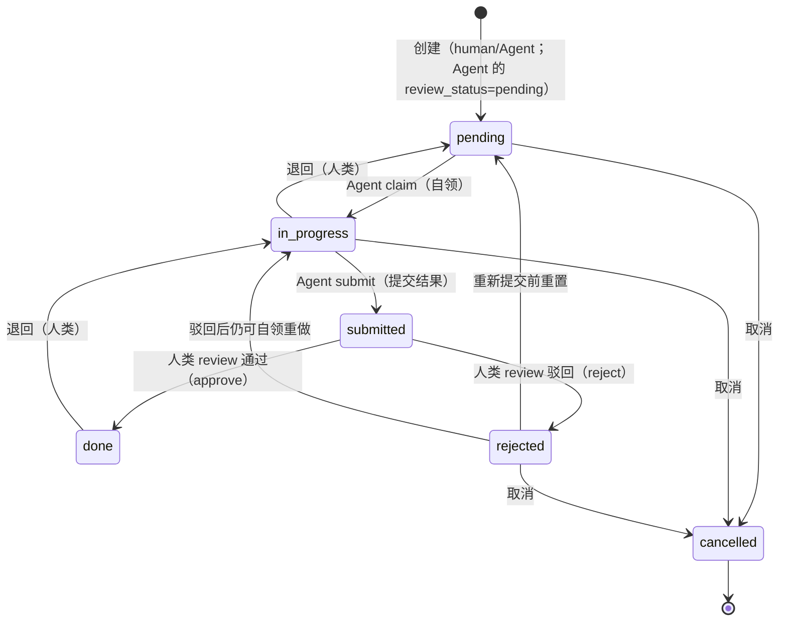

# acowork-pm 项目管理服务设计

> 版本：v1.0（定稿）| 日期：2026-09-02
>
> 关联 PRD：[`docs/prd/zh/prd-doc-pm.md`](../../prd/zh/prd-doc-pm.md)（§5 项目管理）
> 关联设计：[`04-gateway.md`](./04-gateway.md)、[`14-desktop-app.md`](./14-desktop-app.md)、[`22-pm-desktop-ui.md`](./22-pm-desktop-ui.md)
> 关联 ADR：[`ADR-055-remote-runtime-node-topology.md`](../../adr/zh/ADR-055-remote-runtime-node-topology.md)（远程节点访问）、[`ADR-061-pm-storage-tree.md`](../../adr/zh/ADR-061-pm-storage-tree.md)（目录树存储选型）
> 实现仓库：[`core/acowork-pm`](../../../core/acowork-pm/) + [`core/acowork-gateway/src/http/pm_api.rs`](../../../core/acowork-gateway/src/http/pm_api.rs)
>
> **一句话**：`acowork-pm` 是 Gateway 托管的本地项目管理服务，管理对象为 **Agent**——人类经 Desktop 看板管理项目与任务；Agent 经 HTTP MCP 工具自查、自领、提交任务；Agent 创建的任务须经人类审核后生效。

---

## 1. 设计目标与已决结论

### 1.1 目标

1. 提供基础版项目管理：项目/任务的创建、列表、看板式状态流转（pending / in_progress / submitted / done 四列看板，六态状态机）。
2. 任务指派对象为 **Agent**；Agent 通过 MCP 工具自查、自领、更新、提交任务。
3. **Agent 创建的任务须经人类审核后生效**（`review_status=pending`），防止垃圾任务污染看板；人类创建的任务 `review_status=not_required` 直接生效。
4. 指派 Agent 必须校验存在，不存在不能指派。
5. 内嵌于 Gateway 进程托管；支持远程节点访问。

### 1.2 已决结论（PRD §10 开放问题固化）

| 结论 | 决策 | 理由 / 落点 |
|------|------|-------------|
| Q1 | **前端 = Desktop 本地 React 组件**（不 WebView 内嵌） | 同 doc（[20-doc-online-document.md](./20-doc-online-document.md) §1.2 Q1）：复用 Desktop 设计系统，风格统一。acowork-pm 只提供 REST API |
| Q3 | **MCP transport = HTTP** | 服务常驻；现有 `McpTransport` 支持 HTTP |
| Q5 | **`pm_create_task` 对 Agent 开放，但创建的任务进入「待审核」状态（`review_status=pending`），人类 `review` 通过后才生效** | 未来有专门 PM Agent 承担任务编排；先放开权限，用人类审核兜底防垃圾任务。人类创建的任务 `review_status=not_required`，直接生效不审核 |
| Q6 | **指派 Agent 必须校验存在** | 不存在的 Agent 不允许指派；校验来源为 Gateway Agent 目录（§9） |
| Q7 | **暴露给远程节点** | 与 embed 一致：endpoint 用 `advertise_host` 构造，远程 Runtime 可访问 pm MCP（§8） |
| Q8 | **数据目录 = `{data}/acowork-pm/`** | 与 Gateway 自身数据在 `<root>/data/` 下平行 |

> Q2（快照副本）与 Q4（PR 式审核流）属 doc，见 [20-doc-online-document.md](./20-doc-online-document.md)。

---

## 2. 系统组成与部署

### 2.1 组件形态

- 独立 Rust crate：`core/acowork-pm/`，axum HTTP 服务，实现 PM 领域逻辑（存储、状态机、MCP 工具、REST handler）。
- **内嵌于 Gateway 进程**（非独立进程，无独立端口）：`Gateway::run` 启动时 `PmService::with_agent_directory(config.pm, agent_dir).await` 异步构造，router 经 [`core/acowork-gateway/src/http/pm_api.rs`](../../../core/acowork-gateway/src/http/pm_api.rs) 的 `pm_routes()` 以 `nest_service("/api/pm", ...)` 挂载进 Gateway HTTP server（`{gw_http_port}` 同端口，**不带** `/api` 前缀，`nest_service` 自动补）。
- 公开路径统一为 **`/api/pm/*`**（REST）与 **`/api/pm/mcp`**（MCP HTTP），与 Gateway 既有 `/api/*` 路由隔离。
- 启动失败**非致命**：`pm_service` 为 `None` 时 `/api/pm/*` 不挂载，Gateway 照常运行（`pm_api.rs` 模块注释 + [`gateway/mod.rs`](../../../core/acowork-gateway/src/gateway/mod.rs) §PM 启动）。
- 只暴露 REST API + MCP HTTP 端点，不内置前端。

### 2.2 数据目录布局（Q8）

**采用目录树结构** —— 一个项目 = 一棵完整目录树，物理嵌套即父子关系，字面 = 逻辑。

```
<root>/data/
├── models/  packages/  logs/ …      # Gateway 自身数据（现有，平行共存）
├── acowork-doc/                      # 在线文档库（见 20 号设计）
└── acowork-pm/                       # ← 本服务数据根（新增）
    └── projects/
        └── {project_id}/              # 一个项目 = 一个完整目录
            ├── project.json           # 仅项目元数据（不再含 tasks 数组）
            └── tasks/
                └── {task_id}/         # 任务恒为目录（叶子任务也是目录）
                    ├── task.json      # 任务元数据
                    ├── attachments/   # 任务级附件目录（按需创建）
                    │   └── {att_id}/
                    │       ├── original.{ext}
                    │       └── thumb.jpg      # 仅图片
                    └── children/      # 子任务隔离层（按需创建：首个 child 时 mkdir）
                        ├── {child_task_id}/
                        │   ├── task.json
                        │   ├── attachments/
                        │   └── children/        # 递归嵌套
                        │       └── {grandchild_task_id}/
                        │           └── ...
                        └── {another_child_task_id}/
                            └── ...
    └── .trash/                       # 跨项目归档（项目级删除）
        └── {project_id}.archived-{ts}/
```

### 2.3 配置项（定稿，Gateway `[pm]` 小节）

内嵌于 Gateway 后，**无独立端口 / enabled / advertise_host 配置**——复用 Gateway 的 `http.port` 与 `advertise_host`。`PmConfig` 仅保留 PM 领域相关配置：

```toml
[pm]
data_dir = "<root>/data/acowork-pm"     # 默认 {gateway.data_dir}/acowork-pm（prepare_pm_data_dir 覆写）
max_task_depth = 5                       # 最大嵌套深度（根 + 4 层子任务）
max_attachment_size = 10485760           # 单附件 ≤ 10MB
max_attachments_per_task = 20            # 单任务附件数上限
trash_retention_days = 30                # .trash/ 归档保留天数
index_rebuild_on_start = false           # 启动是否强制重建索引（默认增量加载）
generate_thumbnails = true               # 图片附件自动生成缩略图
thumbnail_max_edge = 256                 # 缩略图最长边
auto_inject_mcp = true                   # 自动把 pm MCP 注入每个 Agent 的 catalog
mcp_http_path = "/api/pm/mcp"            # MCP HTTP 端点公开路径（含 /api/pm 前缀）
```

> **advertise endpoint 构造**（P4 定稿）：`http://{advertise_host}:{gw_http_port}{mcp_http_path}`，
> 即 `http://{advertise_host}:{gw_http_port}/api/pm/mcp`。由 `Gateway::run` 在 PM 启动成功后写入
> `GatewayState.pm_mcp_url`（[`gateway/mod.rs`](../../../core/acowork-gateway/src/gateway/mod.rs)），
> 经 `build_available_mcps` 注入 `acowork/global/mcps` 全局资源，远程 Runtime 经
> AgentHello/资源推送拿到后直接 HTTP 调用（见 §8）。

---

## 3. 数据模型

### 3.1 设计原则

- **物理目录结构即权威**（source of truth）：父子关系完全靠目录嵌套表达，`task.json` 不冗余 `parent_id` / `subtask_ids` 等字段，杜绝双写漂移。
- **任务恒为目录**（即使叶子任务也是目录），附件和子任务目录同构存在，避免"文件 vs 目录"二态分支。
- **二进制不入 JSON**：附件元数据在 `task.json`，文件本体在同级 `attachments/{att_id}/` 下。
- **`children/` 按需创建**：首个 child 任务创建时才 `mkdir`，避免空目录噪音。
- **依赖关系保留字段**：跨树 / 跨项目的逻辑依赖无法从物理结构推出，必须显式存 `depends_on`。

### 3.2 项目

```jsonc
// {data}/acowork-pm/projects/{project_id}/project.json
{
  "id": "p-001",
  "title": "示例项目",
  "description": "...",
  "status": "active",                  // active | archived | completed（ProjectStatus）
  "created_by": "human",               // human | agent:xxx
  "created_at": "2026-08-30T10:00:00Z",
  "updated_at": "2026-08-30T10:00:00Z",
  "metadata": {}                       // 额外键值对（颜色/图标/标签等 UI 偏好）
  // 不再含 tasks 数组 —— 任务都在 tasks/ 子目录下
}
```

### 3.3 任务（含待审核、子任务支持）

```jsonc
// {data}/acowork-pm/projects/{pid}/tasks/{tid}[/children/{...}]/task.json
{
  "id": "t-001",
  "title": "撰写 PRD",
  "description": "...",
  "type": "task",                      // task | bug | feature | chore | checkpoint | milestone
  "status": "in_progress",             // pending | in_progress | submitted | done | rejected | cancelled（六态，无 todo）
  "review_status": "approved",         // not_required | pending | approved | rejected（human 创建为 not_required；Agent 创建为 pending）
  "priority": "high",                  // low | normal | high | urgent
  "assignee": "com.example.agent",     // 必须存在（§9 校验）
  "due_at": "2026-09-05T00:00:00Z",
  "created_by": "human",               // human | agent:xxx
  "created_at": "2026-08-30T10:00:00Z",
  "updated_at": "2026-08-30T10:00:00Z",
  "claimed_at": null,                  // Agent 自领时间
  "submitted_at": null,                // Agent 提交结果时间
  "depends_on": [                      // 跨树 / 跨项目依赖（显式存储）
    { "task_id": "t-002", "kind": "blocks" }   // blocks | relates | duplicates
  ],
  "attachments": [                     // 附件元数据；文件本体在同级 attachments/{att_id}/
    {
      "id": "att-9f3e",
      "filename": "screenshot.png",
      "kind": "image",                 // image | file
      "content_type": "image/png",
      "size": 102400,
      "sha256": "ab12...",             // 完整性校验 + 物理去重
      "storage_path": "attachments/att-9f3e/original.png",
      "thumb_path": "attachments/att-9f3e/thumb.jpg",   // 仅 image 有
      "width": 1920,                   // 仅 image
      "height": 1080,                  // 仅 image
      "uploaded_by": "human",
      "uploaded_at": "2026-08-30T10:00:00Z"
    }
  ],
  "result": null                       // submit 时写入 { "text", "attachment_ids": [...] }

  // 注意：不存 parent_id / subtask_ids / subtask_count
  // 父子关系完全靠物理目录位置表达（父任务目录下 / children / {child_id}/）
}
```

### 3.4 父子任务（树状分级）

- **物理嵌套即权威**：父任务的 `children/` 子目录下直接放置子任务目录。
- **不存 `parent_id` 字段**——父子关系从物理路径可唯一推出，无需冗余。
- **不存 `subtask_ids` 字段**——`children/` 目录即权威子任务列表（展示顺序在 UI 层按字段 `title` 或 `created_at` 排序）。
- **深度限制**：最大 5 层（`MAX_TASK_DEPTH = 5`），超出创建返回 422。
- **子任务排序**：`fs::read_dir` 后按字段排序（默认 `created_at` 升序），结果由 API 层缓存返回。
- **删除语义**：
  - 删父任务 → `rm -rf` 父目录，子任务和附件**原子级一并删除**（默认行为；UI 二次确认可改为「先提升子任务为顶层」）。
  - 删子任务 → 从父 `children/` 中 `rmdir`，父任务的 `task.json` 无需变更。
- **reparent（移动任务到新父下）** = `mv` 一个目录（含整棵子树），**0 文件写**，更新内存索引即可。

### 3.5 依赖图（`depends_on`）

- **存储**：任务 `task.json` 内显式声明 `depends_on: [{ task_id, kind }]`。
- **不存派生字段**：API 响应可附带 `is_blocked` / `blocked_by` 方便前端渲染，**不写回存储**，避免双写。
- **创建/编辑校验**：DFS 检测循环依赖，深度上限 10。
- **未满足依赖时**：任务可正常创建/编辑，但 `pm_claim_task` 返回 409 `DependencyNotSatisfied`；前端根据 `is_blocked` 灰显。
- **跨项目依赖**：允许，需在 API 响应中附带 `blocker_project_id` 字段方便前端跳转。

### 3.6 附件存储

- **二进制不入 JSON**：仅元数据在 `task.json`，文件本体在任务目录下的 `attachments/{att_id}/`。
- **图片自动生成缩略图**（`image/*` MIME 白名单：png/jpeg/gif/webp），服务端上传时同步生成 256x256 缩略图。
- **大小限制**：单文件 ≤ 10MB（可配置），单任务附件总和 ≤ 50MB。
- **物理去重**：同 `sha256` 复用物理文件，元数据可多份指向（避免 N 个 bug 截图占 N 倍空间）。P1 实现可简化：直接每个 att_id 一个目录，去重作为 P5+ 优化（见 §11）。
- **删除随任务**：`rm -rf` 任务目录时附件一并清理；归档到 `.trash/` 时附件也一并归档（不立即删，避免误删后无法恢复）。
- **API**：`POST /api/pm/tasks/:id/attachments`（multipart）+ `GET /api/pm/attachments/:id`（`?download=1` 强制下载）。

---

## 4. 任务状态机

> 定稿：**六态** `pending / in_progress / submitted / done / rejected / cancelled`（无 `todo`）。
> 实现见 [`tree.rs::validate_transition`](../../../core/acowork-pm/src/store/tree.rs)。
> 人类与 Agent 创建的**初始 status 均为 `pending`**，区别在 `review_status`：
> human → `not_required`，Agent → `pending`（待人类审核）。



- **pending**：所有任务创建后的初始状态；Agent 创建的 `review_status=pending` 需人类 `review` 通过才进入正式流转（`pm_check_task` 可查审核状态），human 创建的 `review_status=not_required` 直接可被 claim。
- **in_progress**：由 Agent `pm_claim_task` 自领（`pending → in_progress`，仅限 assignee）；依赖未满足返回 `DependencyNotSatisfied`。
- **submitted**：Agent `pm_submit_task` 提交结果后进入（写入 `result`），等待人类 review。
- **done / rejected**：人类 `review(approved)` 决定（`submitted → done` 或 `submitted → rejected`）。
- **退回**：done → in_progress（人类操作）。
- **审核流**：Agent 创建任务 → `review_status=pending` → 人类 `POST /tasks/:tid/review {approved: true/false}` → 任务进入正式流转或 rejected。`pm_submit_task` 对 `checkpoint/bug` 等需审核类型在 submitted 后同样等待 review。

---

## 5. REST API 设计

> 公开前缀 `/api/pm`；错误统一 JSON `{"error": {...}}`。
> **Desktop 访问路径**：经 Gateway 反向代理 `{gw}/api/pm/...`，Gateway 剥掉 `/api/pm` 前缀转发到 pm 服务内部路径（**不带** `/api` 前缀，由 `nest_service("/api/pm")` 挂载；保持单入口 + 鉴权点）。Agent 不调 REST，走 §6 MCP HTTP。

| 方法 | 路径 | 说明 | 鉴权 |
|------|------|------|------|
| GET | `/api/pm/projects` | 项目列表（名称/描述/进度概要） | Desktop |
| POST | `/api/pm/projects` | 新建项目 | Desktop |
| GET | `/api/pm/projects/:id` | 项目详情 | Desktop |
| PATCH | `/api/pm/projects/:id` | 编辑项目（标题/描述） | Desktop |
| DELETE | `/api/pm/projects/:id` | 删除项目（级联任务，二次确认） | Desktop |
| GET | `/api/pm/projects/:id/tasks` | 项目任务列表（`?status=&assignee=` 过滤） | Desktop / Agent |
| POST | `/api/pm/projects/:id/tasks` | 新建任务（human 创建 → `review_status=not_required`） | Desktop |
| GET | `/api/pm/tasks/:id` | 任务详情（含 `is_blocked`/`blocked_by`/`depth`/`parent_id` 派生字段） | Desktop / Agent |
| PATCH | `/api/pm/tasks/:id` | 编辑任务（标题/描述/优先级/截止/指派/状态） | Desktop |
| DELETE | `/api/pm/tasks/:id` | 删除任务（级联子树） | Desktop |
| POST | `/api/pm/tasks/:id/claim` | **Agent 自领**（pending → in_progress） | Agent（x-actor） |
| POST | `/api/pm/tasks/:id/submit` | **Agent 提交结果**（in_progress → submitted，body `{text, attachment_ids?}`） | Agent（x-actor） |
| POST | `/api/pm/tasks/:id/review` | **人类审核**（submitted → done/rejected，body `{approved}`） | Desktop |
| PATCH | `/api/pm/tasks/:id/parent` | **移动任务到新父下**（`parent_id=null` 提升为根任务；DFS 防环） | Desktop |
| GET | `/api/pm/tasks/:id/children` | 直接子任务列表 | Desktop |
| GET | `/api/pm/tasks/:id/attachments` | 附件元数据列表 | Desktop / Agent |
| POST | `/api/pm/tasks/:id/attachments` | **上传附件**（multipart，单文件 ≤ 10MB） | Desktop / Agent |
| GET | `/api/pm/attachments/:id` | **下载附件**（`?download=1` 强制下载，否则 inline 预览） | Desktop / Agent |
| DELETE | `/api/pm/attachments/:id` | 删除附件 | Desktop |

> **实际路由实现**：[`core/acowork-pm/src/api/routes.rs`](../../../core/acowork-pm/src/api/routes.rs)（PM router 内部不带 `/api` 前缀，Gateway `nest_service("/api/pm")` 自动补；MCP 端点在 `/api/pm/mcp`）。Desktop 经 Gateway 反代访问，Agent 走 §6 MCP HTTP 而非 REST。

---

## 6. Agent 接口（pm MCP 工具，HTTP transport）

- MCP Server 端点：`http://{advertise_host}:{gw_http_port}/api/pm/mcp`（Q3 = HTTP，P4 定稿 advertise endpoint）。远程 Runtime 用 §8 的 advertise endpoint 直接 HTTP 调用。
- Gateway 将 pm MCP 配置注入每个 Agent 的 `catalog` 列表（`auto_inject_mcp=true` 时），Agent 默认获得 `pm_*` 工具。
- 身份：调用方经 **`X-MCP-Actor` header** 携带 `agent_id`（Gateway 下发 `{agent_id}` 模板，Runtime 连接时替换为实际 agent_id）；服务端校验（§9），**所有状态变更工具都校验调用者与任务 assignee 一致**。
- 错误码：`-32001` Unauthenticated（无可信身份调变更工具）、`-32002` Forbidden（非 assignee）；业务错误（409 依赖未满足等）映射为对应 `PmError` code。

| 工具 | 参数 | 返回 | 说明 |
|------|------|------|------|
| `pm_list_projects` | — | 项目列表 | 只读 |
| `pm_get_project` | `project_id` | 项目详情（含任务数统计） | 只读 |
| `pm_create_project` | `title` `description?` | 新建项目 | |
| `pm_list_tasks` | `project_id` `assignee?` `status?` | 任务列表 | Agent 自查任务主入口（可过滤 assignee=自己） |
| `pm_get_task` | `task_id` | 任务详情（含 is_blocked/blocked_by/depth） | 只读 |
| `pm_create_task` | `project_id` `title` `description?` `assignee?` `priority?` `type?` `due_at?` `parent_task_id?` `depends_on?` | 新 `task_id` | **Agent 创建 → `review_status=pending` 待人类审核**（§4）；assignee 必须存在（§9.1） |
| `pm_check_task` | `task_id` | 状态 + `review_status` | 仅创建者可查；Agent 查询自己创建的任务是否被批准 |
| `pm_update_task` | `task_id` `title?` `description?` `status?` `priority?` `assignee?` | 更新后的任务 | 状态在 `pending / in_progress / submitted / done / rejected / cancelled` 间按状态机流转 |
| `pm_claim_task` | `task_id` | 自领后的任务 | **pending → in_progress**，**仅限 assignee == 调用者**（-32002）；依赖未满足返回 409 |
| `pm_submit_task` | `task_id` `text` `attachment_ids?` | 提交后的任务 | **in_progress → submitted**，写入 `result {text, attachment_ids, submitted_by}` |
| `pm_list_my_tasks` | `status?` `limit?` | 当前调用者名下任务 | Agent 会话开始自查主入口 |
| `pm_reparent_task` | `task_id` `new_parent_task_id?` | 成功/失败 | **移动任务到新父下**（new_parent=null 提升为根任务），DFS 防环 |

> **实际工具清单**：[`core/acowork-pm/src/mcp/manifest.rs`](../../../core/acowork-pm/src/mcp/manifest.rs)（12 个工具，schema 以代码为准）。

---

## 7. Desktop 集成（本地 React 组件，Q1）

- `projects` 视图（替换 [AppLayout.tsx:897-903](../../../apps/acowork-desktop/src/components/layout/AppLayout.tsx#L897) 的 TODO）：
  - **左侧**：项目列表（新建/删除）。
  - **右侧**：项目详情 + **四列看板**（pending / in_progress / submitted / done），支持新建/编辑任务、指派 Agent、查看结果。
  - **待审核**：Agent 创建的任务 `review_status=pending` 高亮，人类 `review` approve/reject。
- 数据获取：本地 React 组件经 Gateway 反向代理调用 REST API（`http://127.0.0.1:19876/api/pm/*`）。
- 指派 Agent 下拉：数据源为 Gateway Agent 目录（`GET /api/agents` 等既有 Gateway 接口），不存在的 Agent 不可选（§9.1）。
- 服务离线提示：显示「项目管理服务不可用 + 重试」而非白屏（`pm_service=None` 时 `/api/pm/*` 不挂载）。

---

## 8. 远程节点访问（Q7）

与 doc / embed 一致（参考 ADR-055 §6.3/§6.8；P4 已实现并 e2e 验证）：

- pm 作为 **global scope** 服务**内嵌**在 Gateway 进程中，REST 面只经 Desktop → Gateway 反代访问 `127.0.0.1`，不暴露公网。
- **MCP 端点（advertise endpoint）**：`http://{advertise_host}:{gw_http_port}/api/pm/mcp`。用 Gateway `advertise_host` + `gw_http_port`（非 pm 独立端口，因内嵌复用 Gateway HTTP server）+ `mcp_http_path` 构造。
- **下发链路（T4-1）**：`Gateway::run` PM 启动成功后把该 URL 写入 `GatewayState.pm_mcp_url` → `build_available_mcps` 注入全局 `acowork/global/mcps` 资源（`id=pm`，transport=HTTP，`X-MCP-Actor: {agent_id}` 模板 header，timeout=60s）→ 远程 Runtime 经 MQTT 全局资源 / AgentHello 拿到后，将 `{agent_id}` 替换为实际 agent_id，直接 HTTP 调用 pm MCP。
- 安全：MCP 端点网络可达，必须做 agent_id 身份校验（§9.2，`X-MCP-Actor` → `-32001/-32002`）；匿名仅允许只读工具（§9.3）。

---

## 9. 权限与校验（Q6 落地）

### 9.1 指派 Agent 校验（Q6）

- **规则**：`pm_create_task` / 编辑任务时 `assignee` 必须存在于 Agent 目录；不存在返回 `InvalidId`（400/422），**不允许指派**。
- **校验来源**：[`core/acowork-gateway/src/http/pm_api.rs`](../../../core/acowork-gateway/src/http/pm_api.rs) 的 `GatewayAgentDirectory`——基于 Gateway `installed_agents`（Agent 目录权威），经共享 state 注入 pm 服务，操作时即时校验；无需轮询同步。

### 9.2 工具调用身份校验

| 场景 | 规则 |
|------|------|
| `pm_claim_task` / `pm_submit_task` / `pm_update_task`（MCP） | 调用者 `agent_id` 必须 == 任务 `assignee`；否则 JSON-RPC `-32002` Forbidden（实现：[`mcp/mod.rs`](../../../core/acowork-pm/src/mcp/mod.rs) `CODE_FORBIDDEN`） |
| 匿名调变更工具（无 `X-MCP-Actor`） | JSON-RPC `-32001` Unauthenticated |
| `pm_create_task` | 不要求 assignee 是调用者（Agent 可为他人/项目建任务，但要审核）；assignee 必须存在（§9.1） |
| REST claim/submit/review | 经 Gateway 反代 + `X-Actor` header；review 仅人类（Desktop 会话鉴权面） |

### 9.3 其它安全

- 路径/输入：`project_id` / `task_id` 白名单校验（`^[pt]-[a-zA-Z0-9-]{1,62}$`），防注入。
- MCP 匿名只读：无可信身份（无 `X-MCP-Actor`）仅允许 `pm_list_*` / `pm_get_task` / `pm_get_project` 只读工具；调变更工具返回 `-32001`。

---

## 10. 一致性、可靠性与运维

### 10.1 存储形态

- **目录树结构**：一个项目 = 一棵完整目录树，物理嵌套即父子关系。
- **写语义**：写操作内存更新 + 原子替换（`tmp` → `rename`）持久化；目录操作（`mkdir` / `rm -rf` / `mv`）天然原子。
- **零双写**：父子关系完全靠物理位置，`task.json` 不存 `parent_id` / `subtask_ids` 等冗余字段，杜绝漂移风险。
- **单机单实例**，无分布式一致性要求。

### 10.2 内存索引

启动时一次加载构建 `TaskIndex`，写操作同步更新二级索引：

| 二级索引 | 用途 |
|---------|------|
| `by_id: HashMap<TaskId, TaskLocation>` | id → (project_id, dir_path, depth) |
| `by_project: HashMap<ProjectId, HashSet<TaskId>>` | 项目任务集合 |
| `by_assignee: HashMap<AgentId, HashSet<TaskId>>` | Agent 自查（`/api/pm/tasks?assignee=X`） |
| `blocked_by: HashMap<TaskId, Vec<TaskId>>` | 反向依赖图（"谁依赖我"） |

### 10.3 启动重建（崩溃恢复）

```rust
async fn rebuild_index(projects_dir: &Path) -> Result<TaskIndex> {
    // 1. 遍历 projects_dir 下所有 project_id/ 目录
    // 2. 对每个 project，walkdir 递归扫 tasks/，过滤保留名 + 非 t- 前缀
    // 3. 解析每个 task.json，填充 by_id / by_project / by_assignee / blocked_by
    // 4. 无需校验修复 —— 物理是权威，没有冗余字段可漂移
}
```

启动期约 1-3s（千任务规模可接受；万任务走 P5+ 切 SQLite，见 §11）。

### 10.4 关键操作映射

| 操作 | 物理动作 | 文件写次数 |
|------|----------|-----------|
| 创建根任务 | `mkdir tasks/{id}/{attachments}` + 写 1 个 `task.json` | 1 |
| 创建子任务 | `mkdir tasks/{pid}/{id}/children/{cid}/{attachments}` + 写 1 个 `task.json` | 1 |
| 更新任务字段 | 改写单个 `task.json` | 1 |
| 删除任务 | `rm -rf` 任务目录（子树 + 附件一并清理） | 0（仅目录操作） |
| Reparent | `mv` 任务目录到新父下 | 0（仅目录操作） |
| 上传附件 | `mkdir attachments/{aid}` + 写 original + 写 thumb + 改 task.json | 3 |

**核心原则**：目录操作 = 0 文件写，最常见的删除/移动是高原子、低开销的纯文件系统操作。

### 10.5 路径安全

`task_id` 严格白名单校验（`t-<uuid8>`，ASCII 字母数字 + `-`，长度 ≤ 64），任何路径操作后 `canonicalize` 检查必须位于 `projects_dir` 下，防 `..` 注入。

### 10.6 监督 / 日志 / 备份

- **监督**：内嵌于 Gateway 进程（§2.1），随 Gateway 生命周期共进退；启动失败**非致命**（`pm_service=None`，`/api/pm/*` 不挂载，不阻塞 Gateway 启动）。
- **日志**：随 Gateway 日志（`{data}/logs/`），PM 操作打点 `tracing`（`task_id` / `project_id` / 深度等结构化字段）。
- **备份**：`{data}/acowork-pm/` 纯文件，直接 `tar` 即备份；单项目归档 = `tar` 一个项目目录。

---

## 11. 里程碑（P0–P4 已完成）

| 阶段 | 内容 | 状态 |
|------|------|------|
| **P0 骨架** | `core/acowork-pm` crate（axum + /health + 日志）；Gateway `[pm]` 配置 + 内嵌挂载 | ✅ 完成 |
| **P1 存储 + REST** | **目录树存储**（§2.2）、数据模型（project.json / task.json）、项目/任务 CRUD、状态机、**附件上传/下载**、**父子树创建/move**、**依赖图校验**、REST API（§5） | ✅ 完成 |
| **P2 Desktop projects 视图** | 项目列表 + 看板 + 任务编辑/拖动 + 指派下拉 + 父子树展开 + 附件预览，接入 AppLayout | ✅ 完成 |
| **P3 Agent 接口 + 审核** | pm MCP HTTP Server（§6，12 工具）、Agent 创建任务待审核 + 人类 review、`acowork/global/mcps` catalog 自动注入 | ✅ 完成 |
| **P4 远程 + 验证** | advertise endpoint 下发（`http://{advertise_host}:{gw_http_port}/api/pm/mcp`）、远程 Runtime 集成、端到端测试（人类建→Agent 领/交→看板刷新） | ✅ 完成 |
| **P5+（可选）** | 附件物理去重（按 sha256 复用）、全文检索、SQLite 存储层切换（TaskStore trait 替换 impl） | 待定 |

---

## 12. 决策记录（v1.0 收口，开放问题已全部决策）

> T4-4 收口：原「开放问题（实施前确认）」在 P4 全部固化，转为决策记录表。

| 编号 | 决策点 | 定稿结论 | 落点 |
|------|--------|----------|------|
| D-1 | Agent 创建任务被拒绝后的语义 | **关闭为 rejected** 并保留记录；Agent 可重新自领（rejected → in_progress）或新建 | §4 状态机 |
| D-2 | 待审核任务展示方式 | 看板 `pending` 列展示，`review_status=pending` 高亮；人类 `review` 决定 | §4 / §7 |
| D-3 | 任务「退回」权限 | 退回仅人类（done → in_progress）；Agent 只能 claim/submit | §4 / §5 `review` |
| D-4 | 批量指派能力 | **本版不需要（YAGNI）**，后续 PM Agent 迭代 | — |
| D-5 | 删父任务时子任务语义 | **默认级联删除**（`rm -rf` 任务目录，UI 二次确认）；提升为顶层为可选高级操作 | §3.4 / ADR-061 |
| D-6 | `checkpoint`/`milestone` 与 review 语义 | `checkpoint` submit 后仍需 review（与普通任务一致走 submitted）；`milestone` 语义保留为 `type`，状态机统一 | §4 / manifest |
| D-7 | `depends_on` 是否允许跨项目依赖 | **允许**；claim 时计算 `blocked_by`，未满足返回 `DependencyNotSatisfied` | §3.5 / §9.2 |
| D-8 | 子任务排序方式 | API 层按 `created_at` 升序（默认），`fs::read_dir` 后排序 | §3.4 |
| D-9 | MCP 身份传递 | **`X-MCP-Actor` header**（Gateway 下发 `{agent_id}` 模板，Runtime 替换为实际 agent_id） | §6 / §8 / ADR-055 |
| D-10 | 部署形态 | **内嵌于 Gateway 进程**，`nest_service("/api/pm")` 挂载，无独立端口 | §2.1 |

> **v0.1 → v0.2 已固化**：存储结构改为目录树（§2.2、§3.1、§10.1）、子任务用 `children/` 物理嵌套、附件独立目录、依赖显式存 `depends_on`（详见 ADR-061）。
