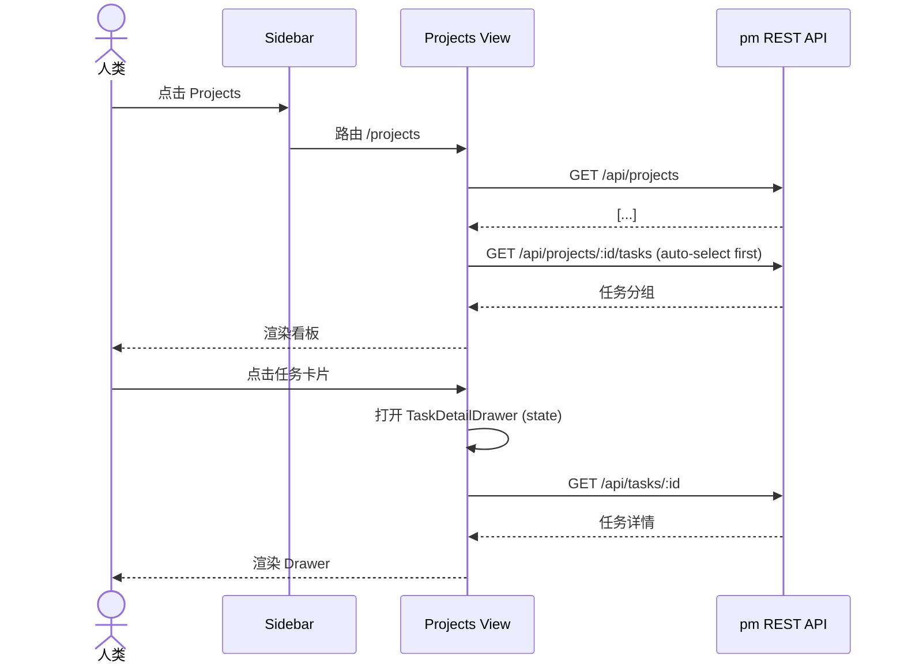
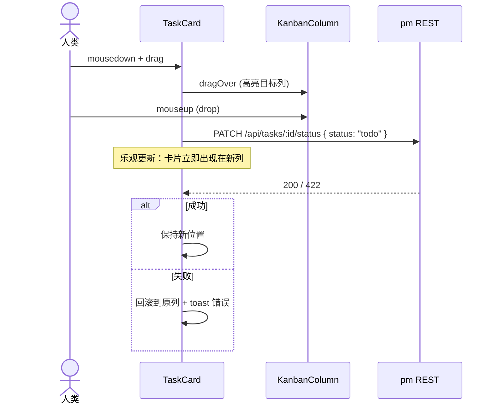
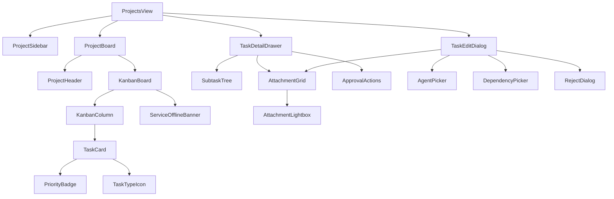

# acowork-pm Desktop UI 设计

> 版本：v0.2（草案）| 日期：2026-09-01
>
> **v0.2 变更**：§6 状态管理由 `@tanstack/react-query` 改为 **zustand**（与 Desktop 现有栈一致——
> Desktop 已内置 `zustand@^5`，未引入 react-query；查询键 / StaleTime 模型改为 store 内的
> 显式 fetch + loading/error 状态，乐观更新走 store action + 回滚）。§7.3 / §9.4 / §11 同步修正。
>
> 关联设计：[`21-pm-project-management.md`](./21-pm-project-management.md)（v0.2 服务端）
> 关联 PRD：[`docs/prd/zh/prd-doc-pm.md`](../../prd/zh/prd-doc-pm.md)（§5 项目管理）
> 关联基础：[`14-desktop-app.md`](./14-desktop-app.md)（Desktop 设计系统、组件库、路由）
> 关联开发计划：[`docs/plan/zh/pm-dev-plan.md`](../../plan/zh/pm-dev-plan.md)（P2 任务来源）
>
> **一句话**：补齐 `21-pm-project-management.md` §7"Desktop 集成"未覆盖的 UX 层——信息架构、视图线框、交互模式、组件层级、状态管理、可访问性与性能。

---

## 1. 设计目标与原则

### 1.1 目标

1. **人类可用**：通过 Desktop 完成项目/任务的完整管理（创建、列表、拖动流转、编辑、附件、父子树、审核）。
2. **风格统一**：复用 Desktop 设计系统（[`14-desktop-app.md`](./14-desktop-app.md)）的颜色、字体、间距、组件库。
3. **离线可降级**：pm 服务不可达时不白屏，清晰提示 + 重试。
4. **可访问性**：键盘可达、屏幕阅读器友好、不依赖纯颜色传达信息。

### 1.2 原则

- **KISS**：优先 Desktop 设计系统现有组件；不引入新 UI 库；不发明新交互模式。
- **YAGNI**：本期不做时间线视图、Gantt、评论 / @提及、批量操作；UI 复杂度留给 P5+。
- **乐观更新**：状态拖动等高频操作乐观更新 + 失败回滚 + toast 提示，避免每次拖动都 await。
- **桌面原生**：假设鼠标 + 键盘为主，触屏 / 触控板走 `@dnd-kit` 默认支持。

---

## 2. 信息架构

### 2.1 视图层级

```
Desktop App (现有)
└── 主导航 Sidebar (现有)
    ├── Agents
    ├── Documents
    ├── Projects  ← 本设计新增入口
    │   └── /projects
    │       └── <auto-select first or empty state>
    │           ├── ProjectSidebar (左侧栏，持久)
    │           │   └── ProjectList (项目列表 + 新建/删除)
    │           └── ProjectBoard (右侧主区)
    │               ├── ProjectHeader (项目名/描述/统计/操作)
    │               └── KanbanBoard (4 列)
    │                   ├── PendingColumn (待审核��Agent 创建)
    │                   ├── TodoColumn
    │                   ├── InProgressColumn
    │                   └── DoneColumn
    │                       └── TaskCard ×N
    │                           └── 点击 → TaskDetailDrawer (右侧滑入)
    └── Settings
```

### 2.2 路由

| 路径 | 视图 | 说明 |
|------|------|------|
| `/projects` | Projects 视图 | 顶级入口；自动选中第一个项目 |
| `/projects/:projectId` | Projects 视图（指定项目） | URL 持久化选中项 |
| `/projects/:projectId/tasks/:taskId` | 同上 + 自动打开 TaskDetailDrawer | 支持深链接 |

> **设计选择**：不引入嵌套路由（如 `/projects/:id/tasks/:tid`），保持单页 + Drawer 叠加，URL 通过 query 参数 `?task=t-001` 标记。

### 2.3 导航流



---

## 3. 主视图布局（线框）

### 3.1 Projects 视图（顶级）

```
┌─────────────────────────────────────────────────────────────────────────┐
│ [Sidebar]│ Projects View                                                │
│  Agents   │ ┌──────────────┬──────────────────────────────────────────┐│
│  Docs     │ │ PROJECT LIST │  Project Alpha  (editable inline)        ││
│  Projects◀│ │              │  Description one-liner...                ││
│  Settings │ │ + 新建项目   │  ─────────────────────────────────       ││
│           │ │              │  📊 12 tasks · 3 in progress · 5 done     ││
│           │ │ ● Alpha   8  │  [+ 新建任务]   [⋯]                       ││
│           │ │ ● Beta    3  │                                          ││
│           │ │ ○ Gamma   0  │ ┌────────┬────────┬────────┬───────────┐ ││
│           │ │              │ │待审核 0│ ToDo  3│InProg 3│ Done    5 │ ││
│           │ │              │ ├────────┼────────┼────────┼───────────┤ ││
│           │ │              │ │        │ [Card] │ [Card] │ [Card]    │ ││
│           │ │              │ │ +      │ [Card] │ [Card] │ [Card]    │ ││
│           │ │              │ │        │ [Card] │        │ [Card]    │ ││
│           │ │              │ └────────┴────────┴────────┴───────────┘ ││
│           │ └──────────────┴──────────────────────────────────────────┘│
└─────────────────────────────────────────────────────────────────────────┘
```

**关键点**：
- 左侧项目列表 240px 固定宽；右侧主区 flex-1。
- 项目列表项显示任务计数徽章（待审核数字色高亮）。
- 看板列宽按需自适应（最小 240px）；列内任务卡片纵向滚动；看板横向滚动。
- 列头 `[+]` 触发"新建任务"对话框（默认 `parent=null`，项目级）。

### 3.2 Project Header

```
┌──────────────────────────────────────────────────────────────────┐
│ Project Alpha (h2 editable on click)              [⋯ 菜单]      │
│ Description one-liner (click to expand, hover to edit)          │
│ 📊 12 tasks · 3 in progress · 5 done   [+ 新建任务]              │
└──────────────────────────────────────────────────────────────────┘
```

- 标题 inline-edit（点击 → input，blur 或 Enter 保存）。
- 描述单行展示，hover 出现"编辑"图标，点击展开为 textarea。
- 统计数字每 30s 自动刷新（或操作后即时刷新）。
- `[⋯]` 菜单：编辑项目、归档、删除（含二次确认）。

### 3.3 Task Card

```
┌────────────────────────────────────────────┐
│ 🐛 [HIGH]                          ⋮       │ ← type + priority + menu
│                                            │
│ Implement user auth flow                  │ ← title（截 2 行，溢出省略号）
│                                            │
│ 👤 alice · 📅 9/15 (逾期红色)              │ ← assignee + due
│                                            │
│ ✓ 3/5 · 📎 2 · 🔗 2  [BLOCKED]            │ ← 计数 + 阻塞标签
└────────────────────────────────────────────┘
```

| 元素 | 说明 |
|------|------|
| 🐛 / ✨ / 🧪 / 📋 / 🚩 / 🏁 | `type` 图标（bug/feature/chore/task/checkpoint/milestone） |
| 优先级徽章 | `[HIGH]` `[MEDIUM]` `[LOW]`，颜色 + 文字双编码 |
| `⋮` | 上下文菜单：编辑 / 删除 / 复制 / 移到其他项目（高级） |
| `👤 alice` | 指派人头像（fallback 文字首字母） |
| `📅 9/15` | 截止日期；逾期红、临近黄、远期灰 |
| `✓ 3/5` | 子任务进度（递归统计） |
| `📎 2` | 附件数量 |
| `🔗 2` | 依赖数量 |
| `[BLOCKED]` | 有未满足依赖时显眼标签 |
| `[PENDING]` | 仅 待审核 列显示，提示是 Agent 创建待审批 |

**卡牌高度**：固定 ~120px，避免高度变化影响拖动目标计算。

**拖动手柄**：整张卡可拖；hover 时轻微高亮（border + shadow）。

### 3.4 Task Detail Drawer

右侧滑入面板，宽 480px，可滚动。

```
┌──────────────────────────────────────────┐
│ Implement user auth flow        [×]     │ ← title（editable on click）
│ 🐛 Bug · High · In Progress              │
├──────────────────────────────────────────┤
│ [概述] [描述] [子任务] [依赖] [附件] [备注]  │ ← tabs
├──────────────────────────────────────────┤
│                                          │
│  ─── 概述 ───                             │
│  Assignee:    👤 alice    [更改]          │
│  Due:         📅 2026-09-15 (逾期)        │
│  Created by:  human                      │
│  Created:     2026-09-01 10:00           │
│  Updated:     2026-09-10 14:32           │
│                                          │
│  ─── 描述 ───                             │
│  Markdown rendered...                     │
│  [编辑描述]                               │
│                                          │
│  ─── 子任务 (3/5) ───                     │
│  ▾ ✓ Write tests                         │
│  ▾ ✓ Implement OAuth                     │
│  ▸ ⏳ Add rate limiting                   │
│  ▸ ○ Update docs                          │
│  ▸ ○ Deploy to staging                    │
│  [+ 添加子任务]                           │
│                                          │
│  ─── 依赖 (2 blockers) ───                │
│  🔗 [Backend API ready] t-002 (ToDo)     │
│  🔗 [Design spec] t-005 (Done ✓)         │
│  [+ 添加依赖]                             │
│                                          │
│  ─── 附件 (2) ───                         │
│  ┌────┐ ┌────┐                            │
│  │ 📷 │ │ 📄 │                            │
│  │ss1 │ │log │                            │
│  └────┘ └────┘                            │
│  [+ 拖拽文件上传]                          │
│                                          │
│  ─── 备注 (3) ───                         │
│  • @bob: 完成 OAuth 集成    (9/8 14:00)  │
│  • @system: 任务开始         (9/5 09:00) │
│                                          │
├──────────────────────────────────────────┤
│ [编辑]  [删除]   [▶ 拖到 ToDo]            │
└──────────────────────────────────────────┘
```

**关键点**：
- 6 个 Tab 默认按需显示（无子任务则不显示"子任务"Tab）；可改为单页滚动 + anchor 链接（**倾向：Tab，因为内容多时滚动太长**）。
- 子任务树支持 5 级嵌套 + 折叠；超过 5 级服务端拒绝（错误提示"层级过深"）。
- 附件图片点击放大（lightbox）；非图片点击下载。
- Tab 切换不重新拉数据（数据已全部加载到 Drawer 状态）。
- Drawer 关闭时焦点回到原 Task Card。

### 3.5 Create / Edit Task Dialog

模态对话框，宽 640px。

```
       ┌──────────────────────────────────────────┐
       │ 新建任务                            [×]  │
       ├──────────────────────────────────────────┤
       │ 标题 *                                    │
       │ ┌──────────────────────────────────────┐ │
       │ │ 输入任务标题...                       │ │
       │ └──────────────────────────────────────┘ │
       │                                          │
       │ 类型                  优先级              │
       │ [Task         ▼]     [Medium     ▼]    │
       │                                          │
       │ 描述（Markdown）                         │
       │ ┌──────────────────────────────────────┐ │
       │ │ 支持 Markdown 编辑                    │ │
       │ │                                       │ │
       │ └──────────────────────────────────────┘ │
       │                                          │
       │ 指派给                  截止日期          │
       │ [👤 alice        ▼]   [📅 2026-09-15]   │
       │                                          │
       │ 父任务                  依赖（可选）     │
       │ [搜索任务...      ▼]   [+ 添加依赖 ▼]   │
       │                                          │
       │ 附件                                    │
       │ ┌──────────────────────────────────────┐ │
       │ │    拖拽文件到这里 / [选择文件]         │ │
       │ └──────────────────────────────────────┘ │
       │                                          │
       ├──────────────────────────────────────────┤
       │                  [取消]      [保存]      │
       └──────────────────────────────────────────┘
```

**关键点**：
- 字段顺序按使用频率：标题 → 类型/优先级 → 描��� → 指派/截止 → 父任务/依赖 → 附件。
- 必填校验仅"标题"非空；其他字段均可后补。
- 父任务下拉：仅同项目内可选；含"无"选项（顶层任务）。
- 依赖下拉：多选 + 搜索；显示 task 标题 + 当前状态。
- 指派下拉：来自 `GET /api/agents`；含"未指派"选项。
- 附件区支持拖拽上传 + 文件选择；上传中显示进度条；超 10MB 立即提示失败。

### 3.6 待审核 (Pending) 状态指示

待审核列与其他列视觉差异：

```
┌─ 待审核 (2) ────────────────────┐
│ ┌──────────────────────────────┐ │
│ │ 🐛 [HIGH] [PENDING]    ⋮    │ │
│ │ [agent @coder] 创建的任务    │ │ ← 卡片底部标注创建者
│ │ Fix login bug                │ │
│ │ 👤 @coder · 📅 9/15          │ │
│ │ ✓ 0/2 · 📎 1                 │ │
│ │                              │ │
│ │ [✓ 批准]  [✗ 拒绝]           │ │ ← inline 操作按钮
│ └──────────────────────────────┘ │
│                                  │
│ ┌──────────────────────────────┐ │
│ │ ...                          │ │
└──────────────────────────────────┘
```

- 待审核卡片底色轻微黄色调（`bg-warning/10`），与其他列视觉区分。
- 卡片底部显示创建者：`[agent @coder]` 或 `[human @alice]`。
- 卡片 inline 操作：`[批准]` → `status=todo`；`[拒绝]` → 弹确认对话框（可选填理由）→ `status=rejected`。

---

## 4. 关键交互

### 4.1 状态拖动流转

**触发**：鼠标按住 Task Card 拖动到目标列。



| 拖动源 | 目标 | 服务端校验 | UI 行为 |
|--------|------|-----------|---------|
| ToDo | InProgress | 允许 | 直接移�� |
| InProgress | Done | 允许 | 直接移动；如有依赖未满足警告 toast（不阻止） |
| Done | InProgress | 允许（退回） | 直接移动 |
| InProgress | ToDo | 允许（退回） | 直接移动 |
| ToDo/InProgress | 待审核 | 拒绝（仅 Agent 创建才进待审核） | 拖动无效 + 提示 |
| 待审核 | ToDo | 人类专属 `approve` 接口 | 走"批准"按钮而非拖动 |
| 待审核 | rejected | 人类专属 `reject` 接口 | 走"拒绝"按钮 |

**键盘版**：focus 卡片 → Space 拾起 → ←/→ 选列 → Space 落下；Escape 取消。

**触屏版**：长按 200ms 拾起（避免和滚动冲突）→ 拖动 → 落下。

### 4.2 Reparent（移动任务到另一父下）

**触发**：拖动 Task Card 到另一个 Task Card 上（"添加到子任务"区域）。

**UI 反馈**：
- 拖动时，hover 在另一卡片 1s 显示该卡片周围蓝色高亮（"drop zone"）+ tooltip `作为子任务添加到 "XXX"`。
- 同一卡片下显示 drop indicator（蓝色横线），表示将插入到该位置。

**API**：调用 `PATCH /api/tasks/:id/parent { parent_task_id: "t-xxx" }`。
- 校验：DFS 防环（不能移到自己 / 自己后代下）；深度 ≤ 5；同项目内。

**乐观更新**：卡片立即从原父的 children 区消失，出现在新父的 children 区。

### 4.3 父子树展开 / 折叠

**触发**：Task Card 上的 `▾/▸` 按钮；或 Task Detail Drawer 中点击子任务条目。

**状态**：local component state（每个 Card 维护 `expanded: boolean`），**不持久化**——每次刷新卡片回到折叠态（避免脏状态）。

**快捷操作**：Cmd/Ctrl + 点击 Task Card 切换展开。

### 4.4 附件预览与上传

| 操作 | UI 反馈 |
|------|---------|
| 点击图片附件 | 弹 lightbox（原图 + 关闭 + 上一张/下一张） |
| 点击非图片附件 | 浏览器下载（`GET /api/attachments/:id?download=1`） |
| 拖文件到 Task Detail | 显示高亮 drop zone；松手后立即上传（multipart），进度条 |
| 拖文件到 Create Dialog | 同上；上传完成后显示缩略图，可删除（× 按钮） |
| 超 10MB | 立即红字提示，不上传 |
| 超 50MB 累计 | 创建/上传时实时校验；超限禁用保存按钮 |

**图片缩略图**：服务端上传时同步生成 256x256 JPG；UI 直接 `` 加载缩略图；原图仅 lightbox 时按需加载。

### 4.5 审核（Approve / Reject）

**入口**：
- 待审核列卡片底部 `[批准]` `[拒绝]` inline 按钮。
- Task Detail Drawer（待审核任务专属）：底部 `[✓ 批准]` `[✗ 拒绝]`。

**批准**：调 `POST /api/tasks/:id/approve`，无确认；卡片移动到 ToDo 列。

**拒绝**：弹确认对话框：
```
       ┌──────────────────────────────────────────┐
       │ 拒绝任务                            [×]  │
       ├──────────────────────────────────────────┤
       │ 任务：Fix login bug                      │
       │ 创建者：agent @coder                     │
       │                                          │
       │ 拒绝原因（可选）                          │
       │ ┌──────────────────────────────────────┐ │
       │ │ ...                                   │ │
       │ └──────────────────────────────────────┘ │
       │                                          │
       │                  [取消]      [拒绝]      │
       └──────────────────────────────────────────┘
```
- 拒绝原因可��（P5+ 可作为 note 写入 `rejected_reason`）。
- 调 `POST /api/tasks/:id/reject { reason? }`，卡片从看板消失（status=rejected）。

---

## 5. 组件清单

### 5.1 复用现有组件（来自 Desktop 设计系统）

| 组件 | 用途 |
|------|------|
| `Button` | 所有按钮 |
| `Input` / `Textarea` | 标题、描述、依赖搜索 |
| `Modal` / `Dialog` | Create/Edit Task、Confirm Dialog |
| `Drawer` (基础) | Task Detail Drawer 容器 |
| `Avatar` | Agent 头像 |
| `Badge` | 优先级徽章、计数徽章 |
| `Toast` / `Notification` | 拖动失败、服务离线提示 |
| `Dropdown` / `Select` | 状态下拉、类型选择 |
| `DatePicker` | 截止日期 |
| `Tabs` | Task Detail Drawer Tab 切换 |
| `Tooltip` | drop zone 提示、字段说明 |
| `Skeleton` | 加载态 |

### 5.2 新增组件

| 组件 | 路径 | 职责 |
|------|------|------|
| `<ProjectsView>` | `views/ProjectsView.tsx` | 顶级页面，组合 Sidebar + Board |
| `<ProjectSidebar>` | `views/pm/ProjectSidebar.tsx` | 左侧项目列表 |
| `<ProjectListItem>` | `views/pm/ProjectListItem.tsx` | 单个项目条目 |
| `<ProjectBoard>` | `views/pm/ProjectBoard.tsx` | 右侧看板容器 |
| `<ProjectHeader>` | `views/pm/ProjectHeader.tsx` | 项目头（标题/描述/统计） |
| `<KanbanBoard>` | `views/pm/KanbanBoard.tsx` | 4 列容器（含 DndProvider） |
| `<KanbanColumn>` | `views/pm/KanbanColumn.tsx` | 单列（drop zone） |
| `<TaskCard>` | `views/pm/TaskCard.tsx` | 拖动卡 |
| `<TaskDetailDrawer>` | `views/pm/TaskDetailDrawer.tsx` | 任务详情抽屉 |
| `<TaskEditDialog>` | `views/pm/TaskEditDialog.tsx` | 新建/编辑对话框 |
| `<SubtaskTree>` | `views/pm/SubtaskTree.tsx` | 递归子任务列表 |
| `<AttachmentGrid>` | `views/pm/AttachmentGrid.tsx` | 附件缩略图网格 + 上传区 |
| `<AttachmentLightbox>` | `views/pm/AttachmentLightbox.tsx` | 图片放大预览 |
| `<AgentPicker>` | `views/pm/AgentPicker.tsx` | 指派下拉（含头像） |
| `<DependencyPicker>` | `views/pm/DependencyPicker.tsx` | 依赖多选（搜索） |
| `<PriorityBadge>` | `views/pm/PriorityBadge.tsx` | 优先级徽章 |
| `<TaskTypeIcon>` | `views/pm/TaskTypeIcon.tsx` | 类型图标 |
| `<ServiceOfflineBanner>` | `views/pm/ServiceOfflineBanner.tsx` | 离线提示条 |
| `<ApprovalActions>` | `views/pm/ApprovalActions.tsx` | 批准/拒绝按钮组 |
| `<RejectDialog>` | `views/pm/RejectDialog.tsx` | 拒绝确认对话框 |

### 5.3 组件层级



---

## 6. 状态管理

### 6.1 数据获取与缓存

**方案**：**zustand**（`zustand@^5`，Desktop 已内置；**不引入 react-query**）。
每个领域建一个 store，`fetch` 显式拉取、`loading`/`error` 挂在 store 上（范式见
[`apps/acowork-desktop/src/stores/skillStore.ts`](../../../apps/acowork-desktop/src/stores/skillStore.ts)）。
API 基地址走 `getGatewayUrl()` + `/api/pm/...`（Gateway 反代，见 [`pm_api.rs`](../../../core/acowork-gateway/src/http/pm_api.rs)）。

**Store 划分**（P2 落盘为 `src/stores/pm/` 下 4 个文件）：

| Store | 数据字段 | 加载触发 | 失效/刷新时机 |
|-------|----------|----------|----------------|
| `usePmProjectStore` | `projects: Project[]`, `selected: Project \| null` | 进入 `/projects` 路由 | 创建/删除/改名后主动 `reload()` |
| `usePmBoardStore` | `tasks: Task[]`（按列分组派生）, `loading`, `error` | 选中项目后 | 创建/删除/拖动/编辑后主动 `reload()` |
| `usePmTaskDetailStore` | `detail: TaskResponse \| null`, `attachments` | 打开 Drawer | 编辑/状态变更后刷新详情 |
| `usePmAgentStore` | `agents: string[]` | 打开指派下拉时 | 5 min 定时或手动刷新 |

**缓存约定**：
- 列表数据在 store 内**常驻**（离开路由不清空，返回即显示，后台 `reload()` 静默刷新）。
- 单条详情按需拉取；关闭 Drawer 不清缓存（再次打开立即显示旧值 + 后台刷新）。
- 不做全局 QueryClient / StaleTime 模型——用 store 的 `updatedAt` 时间戳 + 显式 `reload()` 代替。

### 6.2 乐观更新与回滚

**状态拖动**（zustand action 内先改本地、再请求、失败回滚）：

```ts
// usePmBoardStore 内部 action（范式对齐 Desktop 现有 store）
moveTask: async ({ taskId, status }) => {
  const { tasks, set } = get()
  const prev = tasks // 快照回滚
  set({ tasks: moveInList(tasks, taskId, status) }) // 立即乐观移动
  try {
    const res = await fetch(
      `${getGatewayUrl()}/api/pm/tasks/${taskId}`,
      { method: "PATCH",
        headers: { "Content-Type": "application/json", "X-Actor": actor },
        body: JSON.stringify({ status }) },
    )
    if (!res.ok) throw new Error(`HTTP ${res.status}`)
    const updated: Task = await res.json()
    set({ tasks: upsertTask(get().tasks, updated) }) // 服务端回写为准
  } catch (e) {
    set({ tasks: prev, error: msg(e) }) // 回滚 + 报错
    showToast.error(`状态变更失败: ${msg(e)}`)
  }
}
```

**父子树 Reparent**：同样模式——先乐观改 `parent`（重排树），失败回滚 + toast。
**拖动队列**：连续快速拖动时，乐观更新立即生效；每个 action 各自 `await`，
不合并请求（简单可靠，P5+ 再考虑批量）。

### 6.3 Loading / Empty / Error 三态

| 场景 | Loading | Empty | Error |
|------|---------|-------|-------|
| 项目列表加载 | 骨架（5 个 placeholder 条） | `+ 新建项目` 大按钮 + "创建你的第一个项目" | toast + 顶部 banner + 重试按钮 |
| 项目看板加载 | 4 列各 3 个 placeholder card | "还没有任务" hero | toast + banner |
| 待审核列加载 | skeleton | "无待审核任务" | toast |
| 任务详情 Drawer | 顶部骨架 + tab 占位 | —（详情不存在就是 404） | toast + 关闭 drawer |
| 附件上传 | 进度条 | "拖拽文件上传" | 红字错误 + 重试 |

**统一原则**：列表空状态**鼓励创建**（CTA 按钮）；详情空状态**明确告知**（无操作）。

---

## 7. 离线降级

### 7.1 服务健康检查

```ts
// 启动时 + 每 30s 轮询（zustand store 内定时器；范式对齐 Desktop 现有 health 轮询）
// usePmHealthStore：{ healthy: boolean, check(): Promise<void> }
useEffect(() => {
  usePmHealthStore.getState().check()        // 立即查一次
  const t = setInterval(() => usePmHealthStore.getState().check(), 30_000)
  return () => clearInterval(t)
}, [])
// check() 内部：fetch(`${getGatewayUrl()}/api/pm/health`)，res.ok → healthy=true
// 连续 3 次失败 → healthy=false（触发 §7.2 降级 UI）
```

### 7.2 离线 UI 降级

| 元素 | 离线行为 |
|------|----------|
| 项目列表 | 显示缓存数据（如有）+ 顶部 banner `⚠️ 项目管理服务不可用` + 重试按钮 |
| 看板 | 同上；卡片变灰 + `pointer-events: none`（禁止拖动） |
| Task Detail Drawer | 可查看缓存数据；编辑按钮禁用 + tooltip |
| Create/Edit Dialog | 打开后调 API 失败 → 弹错误 modal，提示稍后重试 |
| MCP 工具 | 不受影响（pm MCP 仍可达） |

**离线状态不白屏**：所有缓存数据可读，不可写。

### 7.3 重试策略

- 自动重试：fetch 封装默认 3 次指数退避（1s / 2s / 4s），复用 `lib/httpRetry.ts` 的 `with503Retry`。
- 手动重试：banner 上的 `[重试]` 按钮触发对应 store 的 `reload()`（或 `check()`）。
- 用户取消重试：banner 显示 `[关闭提示]`，关闭后仅靠后台健康检查恢复。

---

## 8. 可访问性

### 8.1 键盘导航

| 操作 | 快捷键 |
|------|--------|
| 聚焦项目��表项 | `Tab` / `↑/↓` |
| 选中项目 | `Enter` |
| 聚焦任务卡 | `Tab`（每张卡单独 focusable） |
| 打开任务详情 | `Enter` / `Space` |
| 拖动任务（列间） | focus 卡 → `Space` 拾起 → `←/→` 选列 → `Space` 落下 |
| 取消拖动 | `Escape` |
| 创建任务 | `Cmd/Ctrl + N`（在 ProjectBoard focus 时） |
| 关闭 Drawer / Dialog | `Escape` |
| 提交 Dialog | `Cmd/Ctrl + Enter` |

### 8.2 ARIA 标签

| 元素 | ARIA |
|------|------|
| KanbanColumn | `role="list"`，`aria-label="ToDo 列"` |
| TaskCard | `role="listitem"`，`aria-label="任务：XXX，状态 ToDo，优先级 High"` |
| drop zone | `aria-dropeffect="move"`，`aria-label="拖到此列变更状态为 InProgress"` |
| 拖动中 | `aria-live="assertive"` 公告 `任务 XXX 移动到 InProgress` |
| 优先级徽章 | `aria-label="高优先级"`（不依赖纯颜色） |
| BLOCKED 标签 | `aria-label="此任务被阻塞"` |
| 待审核标签 | `aria-label="待人类审核"` |

### 8.3 焦点管理

- **Drawer 打开**：焦点移入 Drawer 第一个可 focus 元素（标题输入框）。
- **Drawer 关闭**：焦点回到原 Task Card。
- **Dialog 打开**：焦点 trap 在 Dialog 内；首个 input 自动 focus。
- **Dialog 关闭**��焦点回到触发元素。
- **拖动结束后**：焦点保持在被拖动的卡（不跳走）。

### 8.4 颜色对比

- 优先级徽章：颜色 + 文字双编码（`bg-red-100 text-red-700` `[HIGH]`）。
- 阻塞标签：图标 + 文字（🔗 + `[BLOCKED]`）。
- 离线 banner：图标 + 文字 + 颜色三冗余。
- 文字 vs 背景：满足 WCAG AA（4.5:1）；主文本 ≥ 7:1。

---

## 9. 性能

### 9.1 列表虚拟化

**触发**：单列任务数 > 50 时启用 `react-window` 虚拟列表。

**配置**：
- Item 高度：固定 ~120px。
- Overscan：5 条（避免快速滚动白屏）。
- 保留展开/折叠状态需在 virtualized 列表中注意——本期**不虚拟化**展开态（复杂度 YAGNI，依赖服务端分页 P5+）。

### 9.2 缩略图懒加载

- Task Card 缩略图：原生 `loading="lazy"`。
- Attachment Grid：`` + Intersection Observer 兜底。
- 完整图片（lightbox）：按需加载，不预取。

### 9.3 拖动性能

- 拖动时仅修改 `transform`，不触发 React 重渲染（react-dnd / dnd-kit 默认行为）。
- 拖动 ghost（半透明预览）由库提供。
- drop zone 高亮用 CSS class 切换，避免 inline style。

### 9.4 缓存策略

| 数据 | 缓存时长 | 失效触发 |
|------|----------|----------|
| 项目列表 | 30s | 创建/删除 |
| 项目任务 | 10s | 拖动/编辑 |
| 任务详情 | 5 min | 编辑/状态变更 |
| Agent 列表 | 5 min | Gateway 同步周期 |

**节流**：连续拖动时，乐观更新立即生效；服务端写入各自 `await` 串行提交
（store action 内不并发），避免重复请求。

---

## 10. 开放问题（UX）

| 编号 | 问题 | 倾向 |
|------|------|------|
| UX-OP-1 | Task Detail Drawer 用 Tab 切换还是单页滚动？ | **Tab**（内容多时滚动体验差；Tab 更清晰） |
| UX-OP-2 | 父子树展开状态是否需要持久化（localStorage）？ | **不持久化**（避免脏状态；简化实现） |
| UX-OP-3 | 拖动时是否显示"插入位置指示器"（drop indicator）？ | **显示**（明确插入位置，避免误操作） |
| UX-OP-4 | 项目列表项是否支持拖动排序？ | **本期不做**（YAGNI） |
| UX-OP-5 | 是否需要快捷键 `Cmd+K` 命令面板（搜索任务）？ | **P3+ 后置**（YAGNI） |
| UX-OP-6 | 多人同时编辑同一任务如何处理？ | **last-write-wins**（简单）+ 乐观锁（可选 P5+） |
| UX-OP-7 | 拖动到另一父任务时是否需要二次确认？ | **不确认**（乐观更新 + 失败回滚即可；二次确认打扰操作） |
| UX-OP-8 | 是否需要任务模板（快速创建）？ | **P5+ 后置**（YAGNI） |

---

## 11. 与设计/计划文档的引用关系

| 本文档章节 | 引用 |
|-----------|------|
| §3 主视图线框 | [`21-pm-project-management.md`](./21-pm-project-management.md) §3 数据模型、§5 REST API |
| §4 关键交互 | [`21-pm-project-management.md`](./21-pm-project-management.md) §4 任务状态机 |
| §5 组件清单 | [`14-desktop-app.md`](./14-desktop-app.md) 组件库 |
| §6 状态管理 | [`14-desktop-app.md`](./14-desktop-app.md) zustand 范式（Desktop store 约定） |
| §10 UX 开放问题 | [`21-pm-project-management.md`](./21-pm-project-management.md) §12 决策记录 |

> **下游消费**：[`pm-dev-plan.md`](../../plan/zh/pm-dev-plan.md) P2 任务清单应引用本文档作为 UX 实现的依据（详见开发计划更新）。

---

> **下一步行动**：
> 1. 团队评审本文档（重点：§4 拖动/父子树交互、§8 可访问性）
> 2. 把 P2 任务清单对齐到本文档（每个 T2-x 引用本文档对应章节）
> 3. 设计 v0.2 §7"Desktop 集成"小��链接到本文档，避免重复
> 4. 待 §10 开放问题（UX-OP-1~UX-OP-8）有结论后，将倾向写入决策记录