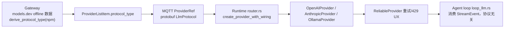

# 23-openai-responses-api — OpenAI Responses API 接入调研报告

> **版本**: v0.1（调研报告 / 草案）
> **状态**: 📝 调研完成，待评审确认后立项
> **创建日期**: 2026-03
> **作者**: 软件架构师（ACowork.AI）
> **一句话结论**: 可行且成本可控。`Provider` trait + `StreamEvent` 已将线协议隔离在 provider 层，
> 接入 Responses API 本质是「新增一个 `Provider` 实现 + 打通 Gateway→Runtime 协议选择链路」，
> 与当初新增 Anthropic provider 同模式。必须按 **provider 粒度 opt-in**，不能全局替换 Chat Completions。

---

## 1. 背景与目标

### 1.1 背景

OpenAI 自 2025 年起将 **Responses API**（`POST /v1/responses`）定位为其推荐的主协议，最新模型能力
（gpt-5.x 系列、structured outputs、reasoning summaries、显式 prompt cache breakpoints、服务端内置工具等）
只在该协议上提供。ACowork Runtime 目前只实现 OpenAI Chat Completions 线协议（`/chat/completions`）。

### 1.2 目标

- 评估 Runtime 支持 Responses API 的可行性
- 给出最小、可回滚的架构修改范围
- 明确「哪些组件零改动、哪些必须改、哪些建议将来做」

### 1.3 非目标（YAGNI）

- ❌ 服务端会话态 `previous_response_id` / `store` / `conversation`（ACowork 自管历史）
- ❌ 服务端内置工具（web_search / file_search / code_interpreter / computer_use）的本地执行编排
- ❌ 音频 / shell / apply_patch / MCP 等非 agent 核心的 Responses 事件子集

---

## 2. 现状：LLM 接入链路

| 环节 | 文件 | 说明 |
|---|---|---|
| 域抽象（协议无关） | `core/acowork-core/src/providers/traits.rs` `Provider` trait | `chat / chat_stream / chat_token_count`，`StreamEvent` 六种事件 |
| 协议枚举 | `core/acowork-core/src/protocol.rs` `ProtocolType` | `Anthropic / Google / Ollama / OpenAI(默认)` |
| Gateway 协议派生 | `core/acowork-gateway/src/http/models_api.rs` `derive_protocol_type` | 从 `models.dev` 的 `npm` 字段推导 |
| MQTT protobuf | `core/acowork-core/proto/mqtt_payload.proto` `LlmProtocol` | 枚举值 1–4 |
| Runtime 建 provider | `core/acowork-runtime/src/providers/router.rs` `create_provider_with_wiring` | `match protocol_type` → 构造具体 provider |
| OpenAI 实现 | `core/acowork-runtime/src/providers/openai.rs` | Chat Completions 线格式 + SSE + CompatCache |
| 自定义 provider | `core/acowork-gateway/src/http/provider_api.rs` | **硬编码**为 OpenAI 兼容协议 |

关键事实：

- OpenAI 实现（`openai.rs`，约 1900 行）走 `POST {base_url}/chat/completions`，解析 `choices[].delta` SSE，
  并内置 **CompatCache 渐进降级链**（400/422 时逐级 strip tools/reasoning）——该降级逻辑**写死在 chat/completions 上**。
- 自定义 provider 一律 `ProtocolType::OpenAI`（`provider_api.rs` 注释「Custom providers always use OpenAI-compatible protocol」）。

---

## 3. Responses API 协议差异（与 Chat Completions 对比）

端点：`POST /v1/responses`；流式走 SSE，约 40 种 `response.*` 事件。

| 域概念（ACowork） | Chat Completions（现状） | Responses API（目标） |
|---|---|---|
| System 提示 | `role=system` 消息 | 顶层 `instructions` 字段 / `developer` 消息 |
| 用户/助手消息 | `messages[]`（role+content） | `input[]` item：`message{role, content:[parts]}` |
| 助手工具调用 | `assistant.tool_calls[]` | output item：`function_call{call_id, name, arguments}` |
| 工具执行结果 | `role=tool` + `tool_call_id` | input item：`function_call_output{call_id, output}` |
| 推理 | 顶层 `reasoning_effort` + `reasoning_content` | `reasoning:{effort}`；`reasoning` / `reasoning_summary` item |
| 流式 | `choices[].delta` | `response.output_text.delta`、`response.function_call_arguments.delta`、`response.reasoning_summary_text.delta` 等 |
| 用量 | `usage.prompt/completion_tokens` + details | `usage.input/output_tokens` + details |
| 结束原因 | `choices[].finish_reason` | `status` + `incomplete_details.reason` |
| 工具定义 | `tools[]`（type=function） | `tools[]` 类型化（function 定义仍为同一套 JSON Schema） |
| 视觉输入 | content parts `image_url` | input message content `image_url`（基本一致） |

对 ACowork 有利的三点：

1. **工具循环仍是客户端驱动**——模型产出 `function_call` item → ACowork 本地执行 → 回传 `function_call_output` → 继续，
   与现有 agent loop 完全同构，`StreamEvent::ToolCallStart / ToolCallChunk` 可直接映射。
2. **无状态多轮**——每次把完整历史作为 `input` 数组发送即可，`previous_response_id` 服务端态可选、不强制。
3. **只实现 agent 需要的子集事件**（文本 / 推理 / 函数调用 / 完成 / 失败，约 8–10 种）即可。

---

## 4. 可行性评估与方案选型

### 方案 A（推荐）：新增 `ProtocolType::Responses` + 独立 `ResponsesProvider`

- 复用现有「协议枚举 → 网关派生 → protobuf → router → Provider impl」管线，与 Anthropic 同模式。
- 独立 provider 文件，**不**把两套线格式塞进 `openai.rs`（避免 CompatCache 的 key/URL 混乱，符合单一职责）。
- 协议无关层（Provider trait / ReliableProvider / agent loop）**零改动**。

### 方案 B：不新增枚举，在 `OpenAIProvider` 上加 Responses 模式开关

- 改动文件更少，但一个 struct 里并存两套差异巨大的序列化 / SSE 解析 / 用量映射，违反单一职责；
  CompatCache 键、重试、缓存归属都变含糊。**不推荐。**

### 方案 C：Gateway 反向代理层做 `/responses ↔ /chat/completions` 转换

- Gateway 已有 `http/proxy.rs`，但这是最重的路子（完整协议翻译，维护成本高）。**否决。**

> **采纳方案 A。**

---

## 5. 架构修改范围（方案 A 完整清单）

### 5.1 Core（2 个文件）

| 文件 | 改动 |
|---|---|
| `core/acowork-core/src/protocol.rs` | `ProtocolType` 新增 `Responses` 变体；`FromStr` 支持 `"responses"`；`llm_protocol_to_protocol_type` 增加映射 |
| `core/acowork-core/proto/mqtt_payload.proto` | `LlmProtocol` 新增 `LLM_PROTOCOL_RESPONSES = 5`，重新生成 prost 代码 |

> 枚举新增是**向后兼容**的：值 5 不改变 1–4 语义；旧 Runtime 遇到未知协议已默认回落 `OpenAI`
> （`llm_protocol_to_protocol_type` 的 `_ => OpenAI`），**跨版本 MQTT 互通安全**。

### 5.2 Gateway（3 个文件）

| 文件 | 改动 |
|---|---|
| `core/acowork-gateway/src/mqtt/global_resources_builders.rs` | `map_protocol_type` 增加 Responses 分支 |
| `core/acowork-gateway/src/http/models_api.rs` | `derive_protocol_type` / `local_protocol_type` 增加 responses 派生规则 |
| `core/acowork-gateway/src/http/provider_api.rs` + `resource_cache.rs` | 自定义 provider 支持可选协议字段（新增「OpenAI Responses API」选项），替换「一律 OpenAI」硬编码 |

**⚠️ 派生规则的关键坑**：不能按「`npm == @ai-sdk/openai` → Responses」无脑判定。已核对
`assets/offline_providers.json`：`@ai-sdk/openai` 共 5 家（`openai`、`azure`、`azure-cognitive-services`、
`vivgrid`、`perplexity-agent`），其中 `vivgrid`、`perplexity-agent` 是 OpenAI 兼容网关，大概率只支持
Chat Completions。正确做法是**白名单**：`openai` / `azure` / `azure-cognitive-services` → Responses，
其余保持 Chat Completions；自定义 provider 由用户显式选择。

### 5.3 Runtime（3 个文件 + 1 新增）

| 文件 | 改动 |
|---|---|
| `providers/responses.rs`（**新增**） | `ResponsesProvider` 实现 `Provider` trait：`ChatMessage → input items` 序列化、`response.*` SSE → `StreamEvent`、`usage → UsageInfo` 映射；复用 `openai.rs` 的 HTTP 客户端 / `from_http_response` 等基础设施 |
| `core/acowork-runtime/src/providers/router.rs` | `match` 增加 Responses 分支 |
| `core/acowork-runtime/src/token/counter.rs` | `estimate_image_tokens` 增加 Responses 分支（公式同 OpenAI） |

**明确不需要动**：`Provider` trait、`ReliableProvider`（重试 / 429 UX 协议无关）、agent loop
（`loop_llm.rs` 消费 StreamEvent）、记忆 / 工具注册 / 预算 / 限流、`session_core.rs` 的组装逻辑。

> 注：**CompatCache（openai.rs 的渐进降级链）不适用于 Responses provider**——它写死在 `/chat/completions`。
> Responses 是 OpenAI 一等协议，退化风险低，**建议不为其做 compat 链**（YAGNI）。

### 5.4 Desktop（1 个文件，小改）

- `apps/acowork-desktop/src/lib/cacheHitRate.ts`：把 Responses 归属到 `"openai"` 缓存族（前端缓存命中核算）；
  若 UI 展示协议标签，补枚举文案映射。

### 5.5 测试与灰度

- 单元：ResponsesProvider 请求序列化 / SSE 解析（fake SSE 流）、协议派生规则、protobuf 双向映射。
- 端到端：provider 层 fake 服务测完整工具循环。
- 灰度：按 provider 粒度 opt-in；官方 openai provider 可先上 feature flag 观察用量 / 缓存归属是否回归。
- **回滚**：把 provider 切回 Chat Completions 即回滚，无需改代码。

---

## 6. 收益（为什么值得做）

1. **能力对齐**：OpenAI 最新模型能力（gpt-5.x 系列、structured outputs `text:{format:json_schema}`、
   reasoning summaries、显式 prompt-cache breakpoints、服务端内置工具 web_search / file_search）只在 Responses API 提供。
2. **直接惠及现有功能**：记忆提取 / episode 蒸馏（JSON 结构化输出）、ADR-060 提示词缓存策略，
   可用 structured outputs 与 `prompt_cache_options` 增强。
3. **为 Azure 官方生态铺路**：Azure OpenAI Responses API 支持成熟，白名单已含。
4. **后续扩展空间**：`previous_response_id` / 服务端会话、内置工具、background / WebSocket 模式——均为将来按需增量。

---

## 7. 风险与开放问题

| 风险 | 说明 | 对策 |
|---|---|---|
| 第三方兼容服务不支持 | 大量 OpenAI 兼容供应商无 `/responses` | 按 provider opt-in：白名单派生 + 自定义显式选择 |
| 行为回归 | 官方 openai 从 chat/completions 切到 responses，用量字段 / 缓存核算不同 | 灰度 + 前端缓存族映射；必要时官方默认保持 Chat Completions |
| SSE 事件面大 | ~40 种事件 | 只实现 agent 所需子集，其余显式失败 |
| **开放问题** | 官方 `openai` provider 默认是否切到 Responses（影响 gpt-5 全系用户）？ | **建议：默认不切，仅白名单 / 显式选择启用**，作为可回滚特性 |

---

## 8. 建议实施切片

1. **S1（协议打通）**：Core 枚举 + protobuf + Gateway 派生（白名单）+ router 分支——空实现先让链路可路由、可测试。
2. **S2（非流式 chat）**：ResponsesProvider 的 `chat()`（请求 / 响应映射 + usage），覆盖文本 + 函数调用 + 推理。
3. **S3（流式 cha
t_stream）**：SSE 事件 → StreamEvent 映射。
4. **S4（自定义 provider 协议选择 + Desktop 缓存族 + 灰度）**。

每步独立可测、可回滚。

---

## 9. 参考

- OpenAI Responses API 官方文档（platform.openai.com，Cloudflare 拦截时用 Azure 文档镜像）：
  `learn.microsoft.com/azure/ai-services/openai/how-to/responses`
- OpenAI SDK 类型定义（响应 / 输入 / 事件 / 参数）：`github.com/openai/openai-python` → `src/openai/types/responses/`
- ACowork 现有链路：`core/acowork-core/src/protocol.rs`、`core/acowork-runtime/src/providers/router.rs`、
  `core/acowork-gateway/src/http/models_api.rs`、`core/acowork-core/proto/mqtt_payload.proto`
