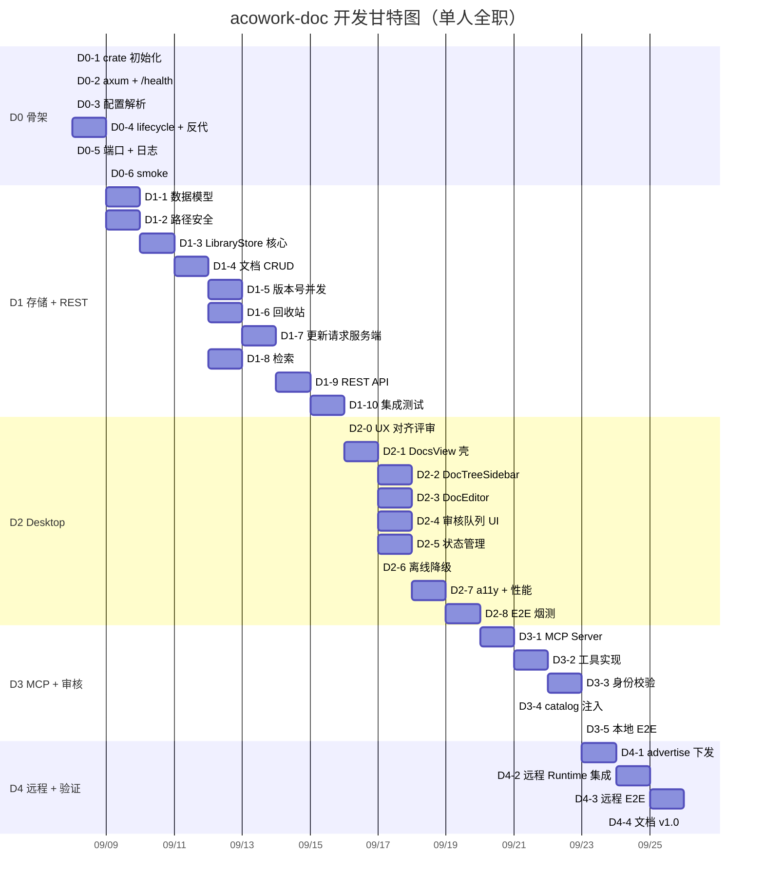

# acowork-doc 开发计划

> 版本：v0.1（草案）| 日期：2026-09-08
>
> 关联设计：[`docs/design/zh/20-doc-online-document.md`](../../design/zh/20-doc-online-document.md)（v0.1 服务端）
> 关联 PRD：[`docs/prd/zh/prd-doc-pm.md`](../../prd/zh/prd-doc-pm.md)（§4 在线文档 + §6 MCP 集成）
> 参照计划：[`docs/plan/zh/pm-dev-plan.md`](./pm-dev-plan.md)（结构对齐；pm 已按此计划完成 ✅）
> 关联 ADR：[`ADR-064`](../../adr/zh/ADR-064-pm-standalone-process.md)（PM 独立进程）、[`ADR-055`](../../adr/zh/ADR-055-remote-runtime-node-topology.md)（远程节点）
>
> **一句话**：把 acowork-doc 在线文档模块落到可排期的子任务，按 D0→D4 五个里程碑交付，预估总工期 **13-19 人日**（单人全职 3-4 周）。

---

## 0. 现状与复用基础（写计划前必读）

### 0.1 已就绪（无需新工作）

- **左侧导航入口已预留**：`NavBar.tsx` `topNavItems` 已定义 `docs` 图标与 i18n 文案；`AppLayout.tsx:921-924` 的 `docs` 视图目前是 `TODO` 占位（**本次要替换的位置**）；`projects` 视图已接入 `ProjectsView`（可对照参考）。
- **acowork-pm 已完整落地**（`core/acowork-pm` + Gateway 集成 + Desktop 视图），其全链路实现即 doc 的**逐行模板**：
  - 独立进程范式：`core/acowork-gateway/src/lifecycle/pm_supervisor.rs`（拉起 + `/health` 轮询 + 指数退避重启 + 失败不阻塞 Gateway）
  - 反代范式：`core/acowork-gateway/src/http/pm_proxy.rs`（`/api/pm/*` → `127.0.0.1:{pm_port}/*`，含 503 + `Retry-After` 契约、`X-Actor`/`X-MCP-Actor` 可信身份注入）
  - 配置范式：`core/acowork-gateway/src/config.rs` `[pm]` 段（`enabled`/`port`/`auto_inject_mcp`/`mcp_http_path`，serde default）
  - MCP 注入范式：`core/acowork-gateway/src/mqtt/global_resources_builders.rs::build_available_mcps`（`pm_mcp_url` → `McpRef{id:"pm", transport:Http, headers:{X-MCP-Actor:{agent_id}}}`）
  - 服务端范式：`core/acowork-pm/src/`（`cli.rs`/`server.rs`/`state.rs`/`config.rs`/`error.rs`/`store/`/`mcp/`/`api/`）
  - Desktop 范式：`apps/acowork-desktop/src/views/pm/`（react-query + 乐观更新 + `ServiceOfflineBanner` + `with503Retry`）
- **编辑器组件可复用**：`apps/acowork-desktop/src/components/editor/MarkdownPreviewView.tsx`（react-markdown + remark-gfm + CodeBlock，编辑/预览双模式）——设计 Q1 已决：Desktop 本地 React 组件直连 REST，不 WebView 内嵌。

### 0.2 未开始（本次范围）

- `core/acowork-doc/` crate 不存在；Gateway 无 `[doc]` 配置、无 `lifecycle/doc.rs`、无 `doc_proxy.rs`；Desktop 无 `DocsView`。

### 0.3 与 pm 的关键差异（决定估时差异）

| 维度 | pm（已完成） | doc（本次） |
|------|-------------|-------------|
| 存储 | 目录树任务（children/ 物理嵌套 + task.json） | 目录树文档库（每目录 library.json + .md 文件） |
| 并发 | 无版本号（审核状态机） | **乐观版本号**（version + 409，DOC-09） |
| 写保护 | 人类/Agent 审核流（pm_create_task → pending） | **PR 式审核流**（Agent 改已有文档须 approve 后合并，设计 §5） |
| 附件/依赖图/父子树 | ✅ 已有 | ❌ 本版不做 |
| Desktop 复杂度 | 看板 + DnD + TaskCard + Drawer（重） | 目录树 + 编辑器（复用 MarkdownPreviewView）（轻） |
| 新增概念 | — | `.requests/` 审核请求模型、`.trash/` 回收站、`doc_pull` 本地缓存副本 |

---

## 1. 排期假设

- **团队规模**：单人全职（兼任代码评审自审），与 pm-dev-plan 口径一致。
- **工时口径**：1d = 8h，含编码 + 单测 + 集成测试 + 文档同步。
- **排期窗口**：3-4 周连续投入；不含代码评审、合并、跨服务联调 buffer。
- **前置依赖**：pm 全链路已验收（ADR-064 生效）；`lifecycle/pm_supervisor.rs`、`http/pm_proxy.rs`、`build_available_mcps` 注入点、`MarkdownPreviewView.tsx` 均为现成模板（**复制适配，不做抽象重构**，rule of three 触发条件另行评估见 §8 D-8）。
- **并行机会**：D1 服务端与 D2 Desktop 可部分并行（不同代码路径）；单人按 D1 → D2 → D3 串行。

---

## 2. 里程碑总览

| 阶段 | 内容 | 估时 | 交付物 |
|------|------|------|--------|
| **D0 骨架** | crate + axum + Gateway `[doc]` 配置 + 拉起/监督/反代 | 1-1.5d | 服务可起停、可监督、`/api/doc/*` 可达 |
| **D1 存储 + REST** | 目录树存储（library.json + .md）+ 版本号并发 + 审核流服务端 + 回收站 + REST API | 5-6d | 服务端完整，人类可用 REST 调试 |
| **D2 Desktop docs 视图** | 目录树 + 编辑器（复用 MarkdownPreviewView）+ 审核队列 UI + 状态管理 + 离线 + a11y | 4-6d | 人类可用基础在线文档（替换 AppLayout TODO） |
| **D3 MCP + 审核闭环** | doc MCP HTTP Server（8 工具）+ 身份校验 + catalog 自动注入 | 2-3d | Agent 可读写文档；PR 式审核全链路 |
| **D4 远程 + 验证** | advertise endpoint 下发 + 远程 Runtime 集成 + 端到端测试 + 文档 v1.0 | 1-2d | 全链路可用，文档收口 |
| **合计** | — | **13-19d** | — |

> **部署形态决策（D-1，详见 §8）**：**acowork-doc 独立进程**，与 pm/embed 平行，复用 ADR-064 范式；**否决「与 acowork-pm 同进程」**。doc 模块代码保持独立，未来如需合并为 office 进程，仅调整部署层，不影响本排期。

> P5+（历史版本回滚、Office 渲染、向量检索、ACL）不在本排期，**YAGNI 后置**，见 §7。

---

## 3. 任务分解

### 3.1 D0 骨架（1-1.5d）

> **模板**：[`pm_supervisor.rs`](../../../core/acowork-gateway/src/lifecycle/pm_supervisor.rs) + `config.rs [pm]` 段 + `pm_proxy.rs`。本阶段全部为「复制 → 改名 → 适配 doc」，不做抽象。

| ID | 任务 | 估时 | 依赖 | 验收 |
|----|------|------|------|------|
| D0-1 | crate 初始化：`core/acowork-doc/Cargo.toml`（依赖同 acowork-pm，**去掉** image/notify/ignore 等附件相关）、模块结构（`cli.rs` / `server.rs` / `state.rs` / `config.rs` / `error.rs`）；加入 workspace members | 0.25d | — | `cargo build` 通过 |
| D0-2 | axum HTTP server 骨架：`/health` 路由 + 优雅停机（SIGTERM）；监听 `127.0.0.1:{doc_port}` | 0.25d | D0-1 | `curl 127.0.0.1:18081/health` 返回 200 |
| D0-3 | Gateway `[doc]` 配置项解析（`enabled` / `port` / `data_dir` / `auto_inject_mcp` / `mcp_http_path` / `request_ttl_hours`），serde default，单测覆盖省略段/部分段 | 0.25d | — | 配置可加载、缺失项给默认值（测试同 ADR-064 风格） |
| D0-4 | `lifecycle/doc.rs` + `doc_supervisor.rs`：复制 pm_supervisor 适配（拉起 + 指数退避 + 启动失败不阻塞 Gateway）；`http/doc_proxy.rs`：复制 pm_proxy（`/api/doc/*` → `127.0.0.1:{doc_port}/*`，503 + X-Actor 注入）并挂载 `http/routes.rs` | 0.5d | D0-2, D0-3 | Gateway 启动后 doc 子进程拉起；kill 后自动重启；`/api/doc/health` 经反代可达 |
| D0-5 | 端口分配 + 冲突自动递增（18081 → 18082 → …）；`{data}/logs/doc.log` + tracing 订阅 | 0.25d | D0-2 | 占用 18081 后自动递增 18082；日志写入文件 |
| D0-6 | smoke 测试：服务起停、端口冲突、日志写入、反代 503 契约（doc 未就绪时 `/api/doc/*` 返回 503 + Retry-After） | 0.25d | D0-4, D0-5 | 测试通过 |

**D0 出口**：Gateway 拉起 doc 子进程、`/api/doc/health` 经反代可达、kill 自动重启、配置项可改、503 契约就绪。

---

### 3.2 D1 存储 + REST（5-6d）

> **设计依据**：[`20-doc-online-document.md`](../../design/zh/20-doc-online-document.md) §3 存储模型 / §4 REST API / §5 审核流。
> 存储核心 = 目录树 + 每目录 `library.json`（文件系统即真相，`.md` 文件名去后缀 = 标题）。

| ID | 任务 | 估时 | 依赖 | 验收 |
|----|------|------|------|------|
| D1-1 | 数据模型 Rust struct：`DocMeta` / `DirMeta` / `LibraryIndex` / `UpdateRequest` / `RequestStatus` + serde JSON；`doc_id` 白名单 `doc-<uuid>`、`dir_id` 白名单 `dir-<uuid>` | 0.5d | — | struct 与设计 §3.2/§5.3 一致；JSON roundtrip 通过 |
| D1-2 | 路径安全工具：`ensure_within_library`（canonicalize 防 `..` 与绝对路径）+ `validate_doc_id` / `validate_dir_id` | 0.5d | — | 单测覆盖正常 + 注入攻击场景（`../`、绝对路径、空串） |
| D1-3 | `LibraryStore` 核心：`library.json` 加载/保存（文件锁 + 原子替换：临时文件 + rename）+ 启动一致性校验修复（文件名 vs `files[].name` 双写，文件名为权威） | 1d | D1-1, D1-2 | 启动修复不一致；并发写不产生半写状态；集成测试通过 |
| D1-4 | 文档 CRUD：新建（`POST /api/docs`，含 `import` 来源标记）/ 读取（`GET /api/docs/:id`）/ 重命名 / 移动（`POST /api/docs/:id/move`，源/目标 library.json 双写，目标先写源后写，失败回滚）/ 删除（入 `.trash/`） | 1d | D1-3 | 移动跨目录原子性；删除进回收站可恢复；`import` 元数据正确 |
| D1-5 | 版本号乐观并发：每文档 `version`，`PUT /api/docs/:id` 携带 `version`，不匹配返回 409 + 当前版本（DOC-09） | 0.5d | D1-4 | 并发写冲突返回 409；匹配则 version+1 |
| D1-6 | 回收站：`.trash/` 管理 + `GET /api/trash` / `POST /api/trash/:id/restore` + 30 天定时清理（OD-4 纳入 v1） | 0.5d | D1-4 | 恢复后版本/元数据完整；过期自动清理 |
| D1-7 | 更新请求服务端（设计 §5）：`.requests/{request_id}.json` 模型 + `POST /api/requests`（Agent 提交，校验 base_version）+ `GET /api/requests?status=` + `POST /api/requests/:id/approve`（再次校验 base_version 仍最新，冲突拒绝合并）+ `reject`（附 note）+ `request_ttl_hours` 过期标记 | 1d | D1-3, D1-5 | approve 后写库 version+1；base_version 被抢占返回 409；expired 自动标记 |
| D1-8 | 关键字检索：`GET /api/search?keyword=`（标题 + 内容，跨目录；本版不做向量索引） | 0.5d | D1-4 | 命中标题/内容；空结果正确 |
| D1-9 | REST API 全量端点实现（设计 §4 表格：tree/dirs/docs/search/requests/trash）+ 统一错误处理 `{"error":{"code","message","details"}}` + 正确状态码（400/403/404/409/413/422/500） | 1d | D1-4~D1-8 | 每个端点 happy path 通过；错误格式一致 |
| D1-10 | 集成测试：`tests/integration/`（目录树 CRUD、移动回滚、409 并发、审核流 approve/reject/expired、回收站、路径注入） | 1d | D1-9 | 测试套件全绿 |

**D1 出口**：服务端完整，人类可用 curl 调试全部 REST；目录树存储肉眼可读；审核流服务端可用。

---

### 3.3 D2 Desktop docs 视图（4-6d）

> **UX 依据**：设计 §7（Desktop 集成）+ 复用现有设计系统与 `MarkdownPreviewView.tsx`。无独立 UX 文档，本阶段以设计 §7 为唯一依据（与 pm 的 `22-pm-desktop-ui.md` 不同，doc 视图复杂度低，不单独立 UX 文档）。

| ID | 任务 | 估时 | 依赖 | 验收 |
|----|------|------|------|------|
| D2-0 | **UX 对齐评审**：通读设计 §7，确认目录树交互、编辑器复用方式、审核队列入口、离线态；标出待确认问题 | 0.25d | — | 设计评审通过；无歧义 |
| D2-1 | **DocsView 壳**：路由 `/docs` + 布局（左侧目录树 + 右侧编辑器）+ 替换 [`AppLayout.tsx:921-924`](../../../apps/acowork-desktop/src/components/layout/AppLayout.tsx#L921) TODO | 0.5d | D1, D2-0 | `/docs` 路由可达；空状态正确 |
| D2-2 | **DocTreeSidebar**：目录树（展开/折叠，复用文件树交互模式）+ 新建目录/文档 + 重命名/删除（上下文菜单）+ 选中高亮 + 文档计数 | 1d | D2-1 | 树渲染；新建/重命名/删除生效；删除进回收站提示 |
| D2-3 | **DocEditor**：复用 `MarkdownPreviewView.tsx`（编辑/预览双模式）+ 保存携带 `version` + 409 冲突提示（「文档已被他人更新，请刷新后重试」）+ 来源标记展示（add to doc 的 agent/workspace 路径） | 1d | D2-1 | 编辑/预览切换；保存成功 version 更新；409 冲突引导刷新 |
| D2-4 | **审核队列 UI**（设计 §5）：docs 视图顶部「待审核更新请求」入口 + 请求列表（doc 名/base_version/提交者/时间）+ inline `[批准]/[拒绝]` + RejectDialog（可选原因） | 0.75d | D2-1, D1-7 | approve 后文档内容刷新；reject 走确认；空队列状态正确 |
| D2-5 | **状态管理**：`@tanstack/react-query` setup + Query Key 规划（tree/docs/requests/trash）+ 乐观更新（保存/重命名/移动）+ Loading skeleton / Empty hero / Error toast 三态 | 0.5d | D2-1 | 三态齐全；缓存失效正确；staleTime 配置 |
| D2-6 | **离线降级**：健康检查 useQuery（30s 轮询）+ `ServiceOfflineBanner`（复用 pm 组件）+ 写操作禁用（`pointer-events: none` + tooltip）+ 重试按钮 | 0.25d | D2-1 | 离线 banner 显示；重试工作；不白屏 |
| D2-7 | **可访问性 + 性能**：键盘导航（目录树 ←→ 展开/折叠、Tab 顺序）+ ARIA 标签 + 大目录树虚拟化（>500 节点懒加载）+ 编辑器防抖保存 | 0.5d | D2-2~D2-4 | WCAG AA 基础项；千文档目录树流畅 |
| D2-8 | **E2E 烟测**：人类新建文档 → 编辑保存 → 预览；Agent 提交更新 → 人类审核 → 内容刷新；离线 → 恢复 | 0.5d | D2-2~D2-7 | 全链路通过 |

**D2 出口**：人类可完整使用基础在线文档（目录树 + 编辑/预览 + 审核队列 + 离线降级）。

---

### 3.4 D3 MCP + 审核闭环（2-3d）

> **设计依据**：设计 §6 MCP 工具 / §9 安全。**模板**：`core/acowork-pm/src/mcp/`（manifest.rs / tools.rs / agent_dir.rs）+ `build_available_mcps` 注入段。

| ID | 任务 | 估时 | 依赖 | 验收 |
|----|------|------|------|------|
| D3-1 | doc MCP HTTP Server：`POST /mcp` 端点 + 复用 `McpTransport` HTTP 模式 + 工具注册（设计 §6 表格全量 8 工具） | 1d | D2, D1 | MCP 客户端可连接并列出工具 |
| D3-2 | MCP 工具实现：`doc_list` / `doc_read` / `doc_pull`（落盘缓存副本 + base_version，设计 §5.5）/ `doc_add`（快照导入，同名 409）/ `doc_submit_update`（→ pending 请求）/ `doc_check_request` / `doc_mkdir` / `doc_search` | 0.75d | D3-1, D1 | 所有工具 happy path 通过；`doc_pull` 落盘路径正确（工作区 `.acowork/tmp/docs/`，agent home 例外走系统 tmp） |
| D3-3 | 身份校验（设计 §9）：MCP 调用携带 `agent_id`（`X-MCP-Actor`，复用 pm 模式）；写操作（add/submit_update/mkdir）必须可信 agent_id；匿名仅允许只读（list/read/search） | 0.5d | D3-2 | 匿名写返回 403；匿名只读通过；`submitted_by` 记录正确 |
| D3-4 | catalog 自动注入：`build_available_mcps` 复制 pm 注入段，`doc_mcp_url`（`auto_inject_mcp=true` 时）→ `McpRef{id:"doc", transport:Http, headers:{X-MCP-Actor:{agent_id}}}`；Gateway `state.rs` 增加 `doc_mcp_url` 字段 | 0.25d | D3-1 | Agent 启动后自动获得 `doc_*` 工具列表（单测：注入/跳过两分支） |
| D3-5 | 端到端测试（本地）：Agent `doc_add` → 人类可见；Agent `doc_pull` → 编辑 → `doc_submit_update` → 人类 approve → 文档 version+1 → Agent `doc_check_request` 收到 approved | 0.25d | D2-4, D3-1~D3-4 | 测试通过 |

**D3 出口**：Agent 可经 MCP 读写文档；PR 式审核全链路打通；catalog 自动注入。

---

### 3.5 D4 远程 + 验证（1-2d）

> **模板**：pm-dev-plan T4-1~T4-4（ADR-055 §6.3/§6.8 已实现，doc 复制适配）。

| ID | 任务 | 估时 | 依赖 | 验收 |
|----|------|------|------|------|
| D4-1 | advertise endpoint 下发：复用 MQTT 全局资源与 AgentHello 回执，构造 `http://{advertise_host}:{gw_http_port}{doc.mcp_http_path}` 推送给远程 Runtime | 0.5d | D3-5 | `build_available_mcps` 注入 doc MCP 单测通过（`doc_mcp_url` 存在注入 / 不存在跳过） |
| D4-2 | 远程 Runtime 集成：远程节点经 advertise endpoint 调用 doc MCP（含身份校验） | 0.5d | D4-1 | 远程匿名只读通过；匿名写失败 |
| D4-3 | 端到端测试（远程）：远程 Agent `doc_add` → 本地人类可见；`doc_submit_update` → 审核 → 合并 | 0.5d | D4-1, D4-2, D2, D3 | `remote_e2e.rs` 全链路通过 |
| D4-4 | 文档收口：[`20-doc-online-document.md`](../../design/zh/20-doc-online-document.md) v0.1 → v1.0（开放问题表 → 决策记录表）+ ADR 起草（doc 目录树存储选型 + 独立进程） | 0.25d | D4-3 | 文档 v1.0 发布；ADR 定案 |

**D4 出口**：远程节点全链路可用；文档 v1.0 发布。

---

## 4. 关键依赖与并行机会

**并行机会**（团队 ≥ 2 人时）：

| 路径 | 任务 |
|------|------|
| 服务端（甲） | D0 + D1 全程 |
| Desktop（乙） | D2（依赖 D1 完成）|
| 跨边界 | D3 + D4（甲乙协作）|

单人情况下严格串行。

---

## 5. 风险与缓解

| 风险 | 严重度 | 触发条件 | 缓解 |
|------|--------|----------|------|
| **library.json 与文件系统不一致** | 中 | 崩溃/手动改文件导致文件名与索引漂移 | 启动时 walkdir 校验修复（文件名为权威，设计 §3.3）；写库原子替换 |
| **Windows `fs::rename` 跨盘失败** | 中 | 文档/目录移动跨盘（C→D） | 检测 `EXDEV` → fallback `copy + remove` + 原子化最佳努力（复用 pm 经验） |
| **审核流 base_version 竞争** | 中 | 多 Agent 同时提交更新同一文档 | approve 时二次校验 base_version（git push 被拒语义）；冲突返回 409 引导重新提交 |
| **MCP 注入与 pm 冲突** | 低 | `id:"doc"` 与现有 catalog 重名 | 注入前查重；`doc_*` 工具前缀天然隔离；单测覆盖 |
| **回收站清理误删** | 低 | 30 天定时任务边界 | 清理仅针对 `.trash/` 内超期项；恢复操作幂等 |
| **`doc_pull` 缓存堆积** | 低 | Agent 频繁 pull 不清理 | 会话结束时清理 `.acowork/tmp/docs/`（OD-1）；agent home 例外走系统 tmp |
| **目录树大文档库性能** | 低 | 千级文档目录树 | 每目录独立 library.json（无全局索引）；D2-7 懒加载/虚拟化 |

---

## 6. 验收标准（每里程碑）

| 阶段 | 验收清单 |
|------|----------|
| **D0** | Gateway 拉起 doc 子进程；`/api/doc/health` 经反代返回 200；kill 自动重启；端口冲突自动递增；503 + Retry-After 契约生效 |
| **D1** | 全部 REST 端点 curl 测试通过；409 并发冲突正确；审核流 approve/reject/expired 全通过；回收站恢复/清理正确；集成测试套件全绿 |
| **D2** | 目录树新建/重命名/删除/移动工作；编辑器编辑/预览 + 409 提示；审核队列 approve/reject；离线 banner + 写禁用；键盘导航 + ARIA；千文档目录树流畅；E2E 烟测通过 |
| **D3** | Agent 经 MCP add/read/pull/submit_update 全链路；人类审核后 version+1；匿名只读通过、匿名写 403；catalog 自动注入 |
| **D4** | 远程 Runtime 可访问 doc MCP；端到端测试通过；文档 v1.0 发布 |

---

## 7. 不在 D0~D4 范围（YAGNI 后置）

| 任务 | 触发条件 | 估时 |
|------|----------|------|
| 历史版本快照 + 回滚（`.versions/`，DOC-10） | 文档被误改/回滚需求出现 | 1d |
| Office 文档只读渲染（.docx/.pdf） | 用户上传 Office 需求 | 2d |
| 文档链接/双向同步（非快照副本，DOC-14 后续） | add to doc 需要联动工作区 | 1d |
| 全文向量检索（embed + Grafeo） | 文档量超 1k 且关键字检索不足 | 2d |
| 文档/项目 ACL（按文档设置可见范围） | 多用户/多 Agent 隔离需求 | 2d |
| 实时协同编辑（CRDT/OT） | 多人同时编辑需求 | 3d+ |
| MQTT 变更事件推送（Agent 订阅文档变更） | Agent 需要感知文档更新 | 1d |

---

## 8. 决策记录（本计划相关）

| 决策 | 选择 | 出处 / 理由 |
|------|------|-------------|
| **D-1 部署形态** | **acowork-doc 独立进程**（`core/acowork-doc/` + `lifecycle/doc.rs` + `doc_proxy.rs`），**否决「与 acowork-pm 同进程」** | 见下方 §8.1 详细权衡 |
| D-2 数据目录 | `$HOME/.acowork/acowork-doc/`（与 pm 平级，**偏离**设计 §2.2 的 `{data}/acowork-doc/`） | 与 ADR-064 pm 先例一致；独立目录备份/迁移清晰；Gateway 数据解耦 |
| D-3 MCP transport | HTTP（`/mcp` 端点） | PRD Q3 已决；服务常驻、复用 `McpTransport` |
| D-4 审核流 | Agent 不能直接 `PUT` 覆写已有文档，必须 `doc_submit_update` → 人类 approve 后合并；**新增文档（add to doc）直接生效不审核** | 设计 §5（PR 式）；Q4 已决 |
| D-5 前端形态 | Desktop 本地 React 组件直连 REST（经 Gateway 反代），复用 `MarkdownPreviewView.tsx`，不 WebView 内嵌 | PRD Q1 已决；设计 §7 |
| D-6 回收站 | 纳入 v1（`.trash/` + 30 天清理） | 设计 OD-4 倾向；成本低 |
| D-7 add to doc | 快照副本（导入后与原工作区解耦） | PRD Q2 已决（DOC-14） |
| D-8 sidecar 抽象 | **本版不抽象**：doc 复制 pm_supervisor/pm_proxy 适配；待 embed/pm/doc 三实例稳定后再评估提取公共 `SidecarSupervisor` | rule of three：第三次重复已出现，但抽象重构风险高，放 D4 后独立任务评估 |

### 8.1 D-1 详细权衡：独立进程 vs 与 acowork-pm 同进程

**背景**：用户提出「可以考虑和 acowork-pm 跑在一个进程里，但 acowork-doc 模块可以独立」。本计划评估两种部署形态：

| 维度 | 方案 A：独立进程（推荐） | 方案 B：与 pm 同进程（office 服务） |
|------|--------------------------|------------------------------------|
| 与 ADR-064 一致性 | ✅ 一致（pm 刚从内嵌改为独立进程，团队已走通） | ❌ 反向（需重构已完成的 pm 或推翻 ADR-064） |
| 复用成本 | ✅ 低：pm_supervisor/pm_proxy/config/注入点全部模板复制 | ❌ 高：pm 已实现，合并需改名/目录重组/共享配置，重构已验收代码 |
| 故障隔离 | ✅ doc 崩溃不影响 pm（反之亦然） | ❌ 一个 panic 全挂；MCP 端点合并，工具前缀需隔离 |
| 资源占用 | 多一个进程（~10-20MB，可忽略） | 少一个进程 |
| 演进自由度 | ✅ doc 后续可独立加 Web 前端/向量检索 | ❌ 受 pm 生命周期牵制 |
| 模块边界 | ✅ 代码模块独立（满足用户「acowork-doc 模块可以独立」） | 模块边界模糊 |

**结论**：**方案 A（独立进程）**。核心理由：
1. **pm 已按 ADR-064 独立进程落地**，doc 复用其全部模板，新增成本仅 ~0.5-1d（D0-4 复制适配），远低于合并方案的重构成本；
2. **模块代码独立是确定的**（用户明确「acowork-doc 模块可以独立」），部署形态（进程边界）是**可后置的决策**——即便未来要合并为 office 统一进程，因模块边界清晰，仅调整部署层即可，代价可控；
3. 与 embed/pm 三服务对称，监督/反代/MCP 注入机制统一，运维心智一致。

> 若后续确有「office 统一进程」诉求，建议以**独立 ADR** 评估（涉及 pm 重构 + 双服务共享运行时），不在本排期。

---

## 9. 排期起点建议

- **最早启动**：2026-09-08（pm 验收收口 + 本计划评审通过后）
- **总工期**：**13-19 个工作日（3-4 周）**
- **关键里程碑交付**：
  - 第 2 周末：D0 + D1 完成（服务端可用，可 curl 调试）
  - 第 3-4 周末：D2 + D3 + D4 完成（全链路可用；UI 满足 a11y/perf）
- **缓冲建议**：在 D2 末尾预留 0.5-1d buffer 应对目录树交互细节 / 审核队列 UI 等隐性工作。

---

> **下一步行动**：
> 1. 团队评审本计划（重点 D1-3 LibraryStore 一致性、D1-7 审核流服务端、D-1 部署形态决策）
> 2. 确认排期起点日期
> 3. 启动 D0（D0-1 crate 初始化）
> 4. 每周末同步甘特图进度，里程碑出口评审设计文档 → 设计 v1.0
