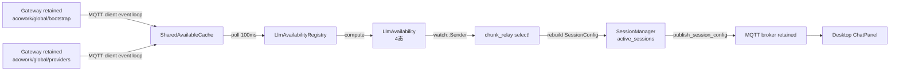

# LLM 可用性三态协议实施计划

**对应 ADR**：ADR-043（session config/state 双主题拆分）
**总工作量**：约 220 行 Rust + 90 行 TypeScript
**预计工期**：1 个开发时段

---

## 0. 问题陈述（来自 bug 调查）

**症状**：Desktop ChatPanel 启动时闪现一条红色告警条（"未配置 LLM provider"），几十毫秒后自动消失。

**用户初始猜测**：status payload 反序列化时序 race 导致 `session_config` 事件早于 provider 信息同步（~20ms race）。
**日志证据否定了 race 假设**：session_config 实际上在 create_session 后 4ms / 13ms / 19ms 内已正确补齐——它和告警条闪烁无关。

**真正根因**（[apps/acowork-desktop/src/components/chat/ChatPanel.tsx:709-754](../../../apps/acowork-desktop/src/components/chat/ChatPanel.tsx#L709-L754)）：

```tsx
const keys = await invoke<VaultKeyEntry[]>("list_keys");
setHasLlmConfig(keys.length > 0);   // ← 决定告警条渲染
```

启动时序：

1. Desktop 启动 → ChatPanel mount → 调用 `loadModels()` → invoke `list_keys`
2. 此时 Gateway vault 尚未解锁 → `list_keys` 返回 `[]`
3. `setHasLlmConfig(false)` → 红色告警条渲染
4. 几十 ms 后 vault 解析完成，`models-added` 事件触发 `loadModels()` 重跑
5. `setHasLlmConfig(true)` → 告警条消失

**附带噪音问题**（与闪烁无关但同时修复）：
Runtime `publish_status` 推明文 `"online"/"sleeping"/"offline"`（retained），Gateway `dispatch.rs:195-274` 收到后 re-publish 为 protobuf `DataEnvelope<AgentStatus>` 到同一主题。Desktop 同一主题收到两条消息，`parse_plaintext_agent_status` 对 protobuf payload（非 UTF-8）解析失败 → 打 warn（乱码 `payload=��`）→ fall through 到 protobuf 解码 → 成功 emit。功能正常，但 warn 日志噪音。

---

## 1. 解决方案

把 `hasLlmConfig` 布尔语义升级为协议层三态枚举 `LlmAvailability`：

| 枚举值 | 语义 | 前端行为 |
|---|---|---|
| `LLM_AVAILABILITY_UNSPECIFIED` | 协议尚未同步（默认值，兼容老 runtime） | **不渲染**告警条 |
| `LLM_AVAILABILITY_LOADING` | bootstrap 未 READY 或 vault 未解析 | 渲染**灰色占位**条 |
| `LLM_AVAILABILITY_CONFIGURED` | vault 有 provider 且 default_provider 可解析 | **不渲染** |
| `LLM_AVAILABILITY_MISSING` | vault 空 或 default_provider 不在 provider 列表中 | 渲染**红色告警**条 |

判定逻辑：

```rust
match (bootstrap_phase, providers, default_provider) {
    (Booting | Unspecified | Degraded | Failed | ShuttingDown, _, _) => Loading,
    (Ready, providers_empty, _)                                => Missing,
    (Ready, providers, None)                                   => Missing,
    (Ready, providers, Some(pid)) if !providers.contains(pid)  => Missing,
    (Ready, _providers, Some(_pid))                           => Configured,
}
```

**根因消除**：`Unspecified` 字段显式表达"尚未同步"语义，前端不再被误触发。

---

## 2. 架构分层



### 2.1 关键决策

| 决策点 | 选择 | 理由 |
|---|---|---|
| **数据源** | 复用 `SharedAvailableCache` | 已包含 `bootstrap` + `providers` 字段，新增零订阅 |
| **驱动模式** | 100ms 轮询（push 简化版） | 不破坏现有 mqtt client 模块，latency 对 startup race 足够 |
| **接入点** | `chunk_relay` 主循环改 `select!` | 复用现有 chunk_publisher，最小化改动 |
| **SessionManager 访问** | `Arc<tokio::Mutex<SessionManager>>` 已有，直接锁 | 不引入新的并发原语 |
| **Cache 一致性** | `try_read` 失败 → 返回上一态（不阻塞） | 不会因为 cache 锁导致轮询 task 饿死 |

### 2.2 数据源为什么不引入独立 watch channel

- `AvailableResourceCache` 已经 wire 到 MQTT client 的 event loop，`update_from_mqtt` 写入即更新
- 当前实现用 `RwLock<AvailableResourceCache>`，不是 `watch`，所以**走轮询而非 push**——这避免了引入额外的并发原语
- 100ms 周期足够：startup race 窗口约 50ms，1 个 poll tick 即可捕获；用户主动改 config 后同样在 100ms 内感知

---

## 3. Proto 改动（已完成）

**文件**：[core/acowork-core/proto/mqtt_payload.proto](../../core/acowork-core/proto/mqtt_payload.proto)

```protobuf
enum LlmAvailability {
  LLM_AVAILABILITY_UNSPECIFIED = 0;
  LLM_AVAILABILITY_LOADING = 1;
  LLM_AVAILABILITY_CONFIGURED = 2;
  LLM_AVAILABILITY_MISSING = 3;
}

message SessionConfig {
  string agent_id = 1;
  // ... existing fields ...
  string workspace_id = 8;
  LlmAvailability llm_availability = 9;  // 新增
}
```

**验证**：`cargo build -p acowork-core` 已通过，生成代码位于 `target-build-test/debug/build/acowork-core-*/out/acowork.mqtt.v1.rs`。

---

## 4. Phase 1：Runtime 端 LlmAvailabilityRegistry

### Step 1.1 — 新文件 `core/acowork-runtime/src/agent/llm_availability.rs`

```rust
//! Three-state LLM availability registry (ADR-XXX).
//!
//! Polls `SharedAvailableCache` every 100ms; computes the effective
//! `LlmAvailability` enum for the session_config wire format.
//!
//! Frontend consumers must treat `UNSPECIFIED` as "not yet synced,
//! don't render any banner". `LOADING` shows a grey placeholder.
//! `CONFIGURED` is silent. `MISSING` triggers the red alert.

use std::sync::Arc;
use std::time::Duration;

use tokio::sync::watch;
use tokio::time::{interval, MissedTickBehavior};

use acowork_core::mqtt_proto::{AvailableProviders, BootstrapPhase, BootstrapState};

use crate::mqtt::SharedAvailableCache;

/// Re-export the wire enum at the runtime layer so other runtime
/// modules don't need to reach into `acowork_core::mqtt_proto` directly.
pub use acowork_core::mqtt_proto::LlmAvailability as WireAvailability;

/// Three-state runtime-side view mirroring the proto enum.
#[derive(Debug, Clone, Copy, PartialEq, Eq)]
pub enum LlmAvailability {
    Unspecified,
    Loading,
    Configured,
    Missing,
}

impl LlmAvailability {
    pub fn from_wire(w: WireAvailability) -> Self {
        match w {
            WireAvailability::LlmAvailabilityUnspecified => Self::Unspecified,
            WireAvailability::LlmAvailabilityLoading => Self::Loading,
            WireAvailability::LlmAvailabilityConfigured => Self::Configured,
            WireAvailability::LlmAvailabilityMissing => Self::Missing,
        }
    }

    pub fn as_wire(self) -> WireAvailability {
        match self {
            Self::Unspecified => WireAvailability::LlmAvailabilityUnspecified,
            Self::Loading => WireAvailability::LlmAvailabilityLoading,
            Self::Configured => WireAvailability::LlmAvailabilityConfigured,
            Self::Missing => WireAvailability::LlmAvailabilityMissing,
        }
    }
}

/// Compute availability from the cached resources.
fn compute(bootstrap: Option<&BootstrapState>, providers: Option<&AvailableProviders>) -> LlmAvailability {
    let phase = bootstrap
        .and_then(|b| BootstrapPhase::try_from(b.phase).ok())
        .unwrap_or(BootstrapPhase::Unspecified);
    if phase != BootstrapPhase::Ready {
        return LlmAvailability::Loading;
    }
    let Some(p) = providers else { return LlmAvailability::Missing };
    if p.providers.is_empty() { return LlmAvailability::Missing }
    // default_provider: derived from the first entry of the provider list
    // (Gateway writes it sorted, no separate field). If absent → Missing.
    match p.default_provider_id.as_ref().filter(|s| !s.is_empty()) {
        None => LlmAvailability::Missing,
        Some(pid) if p.providers.iter().any(|e| &e.id == pid) => LlmAvailability::Configured,
        Some(_) => LlmAvailability::Missing,
    }
}

pub struct LlmAvailabilityRegistry {
    cache: SharedAvailableCache,
    state: watch::Sender<LlmAvailability>,
}

impl LlmAvailabilityRegistry {
    pub fn new(cache: SharedAvailableCache) -> Self {
        let initial = match cache.try_read() {
            Ok(g) => compute(g.bootstrap.as_ref(), g.providers.as_ref()),
            Err(_) => LlmAvailability::Unspecified,
        };
        let (state, _) = watch::channel(initial);
        Self { cache, state }
    }

    pub fn current(&self) -> LlmAvailability {
        *self.state.borrow()
    }

    pub fn subscribe(&self) -> watch::Receiver<LlmAvailability> {
        self.state.subscribe()
    }

    /// Spawn a polling task that updates `state` whenever the cache changes.
    pub fn spawn_poller(self: Arc<Self>) -> tokio::task::JoinHandle<()> {
        tokio::spawn(async move {
            let mut ticker = interval(Duration::from_millis(100));
            ticker.set_missed_tick_behavior(MissedTickBehavior::Skip);
            loop {
                ticker.tick().await;
                let next = match self.cache.try_read() {
                    Ok(g) => compute(g.bootstrap.as_ref(), g.providers.as_ref()),
                    Err(_) => continue,  // skip this tick; keep previous state
                };
                if next != *self.state.borrow() {
                    let _ = self.state.send(next);
                }
            }
        })
    }
}
```

### Step 1.2 — `core/acowork-runtime/src/agent/mod.rs` 导出

```rust
pub mod llm_availability;
pub use llm_availability::{LlmAvailability, LlmAvailabilityRegistry};
```

### Step 1.3 — 单元测试（追加到 `llm_availability.rs` 末尾）

测试用例：
1. 空 cache → `Loading`（Unspecified 走 Loading）
2. bootstrap=Ready 但 providers=None → `Missing`
3. bootstrap=Ready 但 providers.providers=[] → `Missing`
4. bootstrap=Ready 且 default_provider_id 不在 providers 中 → `Missing`
5. bootstrap=Ready 且 default_provider_id 命中 → `Configured`
6. bootstrap=Degraded → `Loading`
7. Registry 状态变化时 `subscribe()` 能收到通知（用 tokio::time::timeout 验证）

---

## 5. Phase 2：`build_session_config_snapshot` 接受 llm_availability

### Step 2.1 — `core/acowork-runtime/src/conversation.rs:630-640`

当前签名：

```rust
pub fn build_session_config_snapshot(&self) -> acowork_core::mqtt_proto::SessionConfig {
```

改为接受可选参数：

```rust
pub fn build_session_config_snapshot(
    &self,
    llm_availability: acowork_core::mqtt_proto::LlmAvailability,
) -> acowork_core::mqtt_proto::SessionConfig {
    let mut full = self.build_meta();
    full.llm_availability = llm_availability as i32;
    acowork_core::mqtt_proto::SessionConfig {
        agent_id: full.agent_id,
        // ... existing assignments ...
        llm_availability: full.llm_availability,
    }
}
```

### Step 2.2 — 更新调用点

| 调用点 | 文件 | 改动 |
|---|---|---|
| 1 | `startup/subsystems.rs:465` (`spawn_config_change_relay`) | 传 `LlmAvailabilityUnspecified`（per-session 增量更新，llm_availability 已单独重发，不混入） |
| 2 | `startup/subsystems.rs` 新增分支 | availability 变化时遍历所有 session，传当前 registry 值 |
| 3 | 其他测试 | 传默认值 `LlmAvailabilityUnspecified` |

---

## 6. Phase 3：chunk_relay 接入 availability 变化

### Step 3.1 — `core/acowork-runtime/src/startup/subsystems.rs`

把 chunk_relay task 从单 `while let Some` 改为 `tokio::select!` 同时监听 chunk_rx 和 llm_avail_rx：

```rust
let chunk_relay = if ctx.chunk_rx.is_some() {
    if let (Some(ref mqtt_client), Some(ref llm_registry)) = (&ctx.mqtt_client, &ctx.llm_availability) {
        let chunk_rx = ctx.chunk_rx.take().unwrap();
        let chunk_publisher = MqttChunkPublisher::from_runtime_client(mqtt_client);
        let session_manager_arc = ctx.session_manager_arc.clone();
        let mut llm_rx = llm_registry.subscribe();
        Some(tokio::spawn(async move {
            loop {
                tokio::select! {
                    // Branch 1: existing chunk events
                    biased;
                    Some(session_event) = chunk_rx.recv() => {
                        relay_chunk_event_mqtt(
                            &chunk_publisher,
                            &agent_id_for_relay,
                            &session_event.session_id,
                            session_event.event,
                        ).await;
                    }
                    // Branch 2: LLM availability changed — republish all sessions
                    Ok(()) = llm_rx.changed() => {
                        let new_avail = *llm_rx.borrow_and_update();
                        let wire = match new_avail {
                            LlmAvailability::Unspecified => LlmAvailabilityWire::LlmAvailabilityUnspecified,
                            LlmAvailability::Loading => LlmAvailabilityWire::LlmAvailabilityLoading,
                            LlmAvailability::Configured => LlmAvailabilityWire::LlmAvailabilityConfigured,
                            LlmAvailability::Missing => LlmAvailabilityWire::LlmAvailabilityMissing,
                        };
                        // Snapshot session ids to avoid holding the lock while
                        // calling ConversationSession::build_session_config_snapshot
                        // (which only needs the conversation Arc, not the lock).
                        let snapshot: Vec<(String, Arc<ConversationSession>)> = {
                            let guard = session_manager_arc.lock().await;
                            guard.sessions().iter()
                                .filter_map(|(sid, h)| h.conversation.as_ref().map(|c| (sid.clone(), c.clone())))
                                .collect()
                        };
                        for (sid, conv) in snapshot {
                            let mut cfg = conv.build_session_config_snapshot(wire as i32);
                            // resolve effective reasoning_effort — same logic as
                            // spawn_config_change_relay
                            cfg.reasoning_effort = resolve_reasoning_if_needed(...);
                            chunk_publisher.publish_session_config(&sid, &cfg).await;
                        }
                    }
                    else => break,
                }
            }
        }))
    } else {
        None
    }
} else {
    None
};
```

**关键点**：
- `biased` 让 chunk events 优先于 availability change（避免长 availability 推送阻塞 chunk）
- 在 `session_manager_arc.lock().await` 期间只做 HashMap snapshot，不做 publish（最小化持锁时间）
- 持有 snapshot 后释放锁，循环内逐 session 调用 `build_session_config_snapshot` + `publish_session_config`

### Step 3.2 — `core/acowork-runtime/src/agent/session/session_handle.rs`

需要把 `conversation` 字段从 `pub(crate)` 提升到 chunk_relay 可见——但 chunk_relay 在 `startup/subsystems.rs`，与 `agent/session/session_handle.rs` 同 crate。

`session_manager.rs:2120` 的 `active_sessions()` 是 `&self` 方法，但只返回 session_id 列表。需要新增 helper：

```rust
/// Iterate active sessions' (session_id, conversation) pairs.
/// Returns owned tuples so callers can release the SessionManager lock
/// before calling build_session_config_snapshot (which can be slow).
pub fn snapshot_active_conversations(
    &self,
) -> Vec<(String, std::sync::Arc<crate::conversation::ConversationSession>)> {
    self.sessions
        .iter()
        .filter_map(|(sid, h)| h.conversation.as_ref().map(|c| (sid.clone(), c.clone())))
        .collect()
}
```

### Step 3.3 — `core/acowork-runtime/src/startup/context.rs`

```rust
pub struct AgentBootContext {
    // ... existing fields ...
    pub llm_availability: Option<Arc<crate::agent::LlmAvailabilityRegistry>>,
}
```

### Step 3.4 — `core/acowork-runtime/src/startup/session_init.rs`

在 Phase B 末尾创建 Registry：

```rust
let llm_availability = Arc::new(LlmAvailabilityRegistry::new(
    ctx.available_cache.clone().expect("available_cache wired in Phase A"),
));
let _poller = Arc::clone(&llm_availability).spawn_poller();
ctx.llm_availability = Some(llm_availability);
```

### Step 3.5 — Poller 生命周期

Poller 是后台 tokio task，与 chunk_relay 同生命周期。Runtime 进程退出时 task 自动终止，不需显式 shutdown。

---

## 7. Phase 4：前端 ChatPanel 三态告警条

### Step 4.1 — `apps/acowork-desktop/src/types/proto.ts` (regenerate)

`pnpm gen:proto` 自动生成 `LlmAvailability` enum + `SessionConfig.llm_availability` 字段。

### Step 4.2 — `apps/acowork-desktop/src/components/chat/ChatPanel.tsx`

**Step 4.2.1 — State 改造**（Line 612 附近）：

```typescript
// 旧
const [hasLlmConfig, setHasLlmConfig] = useState(false);

// 新
type LlmAvailability = "loading" | "configured" | "missing" | "unspecified";
const [llmAvailability, setLlmAvailability] = useState<LlmAvailability>("unspecified");
```

**Step 4.2.2 — 监听 SessionConfig retained**（在现有 mqtt 订阅回调里追加）：

```typescript
useEffect(() => {
  if (!sessionConfig) return;
  switch (sessionConfig.llmAvailability) {
    case LlmAvailability.LLM_AVAILABILITY_UNSPECIFIED:
      setLlmAvailability("unspecified"); break;
    case LlmAvailability.LLM_AVAILABILITY_LOADING:
      setLlmAvailability("loading"); break;
    case LlmAvailability.LLM_AVAILABILITY_CONFIGURED:
      setLlmAvailability("configured"); break;
    case LlmAvailability.LLM_AVAILABILITY_MISSING:
      setLlmAvailability("missing"); break;
    default:
      setLlmAvailability("unspecified");
  }
}, [sessionConfig]);
```

**Step 4.2.3 — `loadModels()` 改造**（Line 709）：

```typescript
// 保留 loadModels 用于 model picker，但不再用它决定告警条渲染
const loadModels = async () => {
  try {
    const keys = await invoke<VaultKeyEntry[]>("list_keys");
    setAvailableKeys(keys);  // ← 给 model picker 用
    // 删掉 setHasLlmConfig 逻辑
  } catch (err) { /* 保留 */ }
};
```

**Step 4.2.4 — 告警条渲染**（Line 1718）：

```tsx
// 旧：hasLlmConfig ? null : <红色告警 />

// 新：
{llmAvailability === "missing" && (
  <AlertBar
    kind="error"
    title="未配置 LLM Provider"
    body="请到 Settings → Providers 添加 API key。"
  />
)}
{llmAvailability === "loading" && (
  <PlaceholderBar text="正在同步 LLM 配置…" />
)}
{/* configured / unspecified → 不渲染 */}
```

### Step 4.3 — `apps/acowork-desktop/src/components/chat/PlaceholderBar.tsx` (新增)

极简灰色占位条组件，~20 行。

---

## 8. Phase 5：Status 反序列化 warn 噪音修复

### Step 5.1 — `apps/acowork-desktop/src-tauri/src/commands/chat_mqtt.rs:1322-1342`

`parse_plaintext_agent_status` 当前先做 UTF-8 验证，再 fall through 到 protobuf。当前 bug：

- Runtime 推 plaintext "online" → UTF-8 OK → 解析
- 接着 Gateway re-publish protobuf payload → 非 UTF-8 → 打 warn → fall through 成功

修复方案：先尝试 protobuf 解码（这是 Gateway re-publish 的权威格式），UTF-8 验证降级为 fallback：

```rust
fn parse_agent_status(payload: &[u8]) -> Option<AgentStatusPayload> {
    // 1. Try protobuf first — Gateway re-publishes as DataEnvelope<AgentStatus>
    if let Ok(env) = DataEnvelope::decode(payload) {
        if let Some(data_envelope::Payload::AgentStatus(s)) = env.payload {
            return Some(AgentStatusPayload::from(s));
        }
    }
    // 2. Fallback: plaintext from Runtime's initial publish_status
    if let Ok(text) = std::str::from_utf8(payload) {
        let trimmed = text.trim();
        if matches!(trimmed, "online" | "sleeping" | "offline") {
            return Some(AgentStatusPayload::plain(trimmed));
        }
    }
    None
}
```

同步把 `tracing::warn!` 删掉——两条消息都会被静默正确解析。

### Step 5.2 — 单元测试

`apps/acowork-desktop/src-tauri/src/commands/chat_mqtt.rs` 追加：

```rust
#[test]
fn parse_agent_status_protobuf_first() {
    let env = DataEnvelope { /* protobuf envelope with AgentStatus */ };
    let bytes = prost::Message::encode_to_vec(&env);
    let parsed = parse_agent_status(&bytes).unwrap();
    // 断言解析到的是 protobuf payload，不是 plaintext
}

#[test]
fn parse_agent_status_plaintext_fallback() {
    let parsed = parse_agent_status(b"online").unwrap();
    assert_eq!(parsed.status, AgentStatus::Online);
}

#[test]
fn parse_agent_status_unknown_silent() {
    assert!(parse_agent_status(b"random garbage").is_none());
}
```

---

## 9. Phase 6：构建验证

```bash
# Runtime
cd core
cargo build -p acowork-runtime
cargo clippy -p acowork-runtime --all-targets -- -D warnings
cargo test -p acowork-runtime llm_availability
cargo test --workspace

# Desktop
cd apps/acowork-desktop
npm run gen:proto  # 重生 TS 类型
npx tsc --noEmit
cargo clippy --manifest-path=src-tauri/Cargo.toml -- -D warnings
```

---

## 10. 文件变更清单

| # | 文件 | 操作 | 行数 |
|---|------|------|------|
| 1 | `core/acowork-core/proto/mqtt_payload.proto` | ✅ 完成：加 enum + field 9 | +12 |
| 2 | `core/acowork-runtime/src/agent/llm_availability.rs` | 新文件 | +130 |
| 3 | `core/acowork-runtime/src/agent/mod.rs` | 导出新模块 | +2 |
| 4 | `core/acowork-runtime/src/conversation.rs` | snapshot 签名 +1 参数 | +3 |
| 5 | `core/acowork-runtime/src/agent/session/session_manager.rs` | 新增 helper | +8 |
| 6 | `core/acowork-runtime/src/startup/subsystems.rs` | chunk_relay 改 select! | +40 |
| 7 | `core/acowork-runtime/src/startup/context.rs` | 字段 | +3 |
| 8 | `core/acowork-runtime/src/startup/session_init.rs` | spawn Registry | +6 |
| 9 | `apps/acowork-desktop/src/components/chat/ChatPanel.tsx` | 三态 + 监听 | +30 |
| 10 | `apps/acowork-desktop/src/components/chat/PlaceholderBar.tsx` | 新文件 | +20 |
| 11 | `apps/acowork-desktop/src-tauri/src/commands/chat_mqtt.rs` | 解析顺序调整 | +15 |
| | **合计** | | **≈ 270 行** |

---

## 11. 风险与权衡

### 11.1 100ms 轮询延迟

- 优点：极简，不引入并发原语
- 缺点：availability 变化到 frontend 看到，最多 100ms
- 评估：startup race 窗口 ~50ms，100ms tick 必覆盖；用户主动改 provider 后 100ms 内感知可接受
- 缓解：若未来需要更低延迟，可改为 `watch::channel`（需要把 `SharedAvailableCache` 改成 watch-based，工作量约 1d）

### 11.2 Chunk_relay 单任务双职责

- 当前：纯 chunk event relay
- 改后：chunk events + availability re-publish
- 风险：availability 推送阻塞 chunk event
- 缓解：`tokio::select!` 的 `biased` 让 chunk 优先；re-publish 内部每 session 是独立 await，可被 chunk 中断

### 11.3 Mutex<SessionManager> 持锁时间

- 风险：长 lock 阻塞其他 SessionManager 调用（HTTP /api/sessions、cancel 等）
- 缓解：lock 内只做 HashMap 迭代生成 Vec（O(n)），n 通常 = 1；publish 在锁外

### 11.4 默认值 `UNSPECIFIED` 对老 runtime 兼容性

- 老 runtime 不写 `llm_availability` 字段 → protobuf 解码为 0 (Unspecified)
- 前端看到 Unspecified → 不渲染告警条
- 比当前行为略差（永远不渲染告警），但比闪烁更可接受
- 后续升级 runtime 后恢复正常

---

## 12. 后续 ADR 提议

建议把本次设计沉淀为 ADR：`ADR-XXX-session-config-llm-availability-three-state.md`，纳入设计文档体系。
