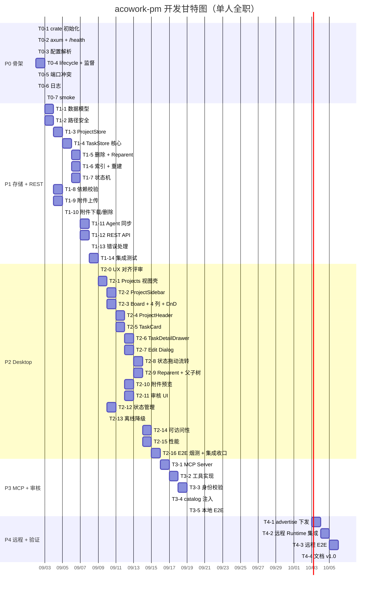

# acowork-pm 开发计划

> 版本：v0.3（草案）| 日期：2026-09-01
>
> 关联设计：[`docs/design/zh/21-pm-project-management.md`](../../design/zh/21-pm-project-management.md)（v0.2 服务端）
> 关联 UI 设计：[`docs/design/zh/22-pm-desktop-ui.md`](../../design/zh/22-pm-desktop-ui.md)（v0.1 UX）
> 关联 PRD：[`docs/prd/zh/prd-doc-pm.md`](../../prd/zh/prd-doc-pm.md)（§5 项目管理）
>
> **一句话**：把 v0.2 服务端设计 + v0.1 UX 设计落到可排期的子任务，按 P0→P4 五个里程碑交付，预估总工期 **17-21 人日**（单人全职 4 周）。

---

## 1. 排期假设

- **团队规模**：单人全职（兼任代码评审自审）。
- **工时口径**：1d = 8h，含编码 + 单测 + 集成测试 + 文档同步。
- **排期窗口**：3-4 周连续投入；不含代码评审、合并、跨服务联调 buffer。
- **前置依赖**：acowork-gateway 现有 `lifecycle/embed.rs` 模式、`http_client`、`advertise_host`、`McpTransport` 已就绪（无需新工作）。
- **并行机会**：P2 Desktop 与 P3 MCP 可部分并行（不同代码路径、不同人协作时），单人情况下按 P2 → P3 串行。

---

## 2. 里程碑总览

| 阶段 | 内容 | 估时 | 交付物 |
|------|------|------|--------|
| **P0 骨架** | crate + axum + Gateway 拉起/监督 | 1-2d | 服务可起停、可监督 |
| **P1 存储 + REST** | 目录树存储 + 数据模型 + 状态机 + 依赖图 + 附件 + REST API | 5-7d | 服务端完整，人类可用 REST 调试 |
| **P2 Desktop 视图** | 视图布局 + 4 列看板 + TaskCard + Detail Drawer + Edit Dialog + 拖动 + Reparent + 父子树 + 附件 + 审核 UI + 状态管理 + 离线 + 可访问性 + 性能 | 6-8d | 人类可用基础项目管理（含 a11y/perf） |
| **P3 MCP + 审核** | pm MCP HTTP Server + 工具鉴权 + 人类审核 UI + catalog 自动注入 | 2-3d | Agent 可自查/领/交；审核全链路 |
| **P4 远程 + 验证** | advertise endpoint + 远程 Runtime 集成 + 端到端测试 + 文档 v1.0 | 1-2d | 全链路可用，文档收口 |
| **合计** | — | **17-21d** | — |

> P5+（附件去重、全文检索、SQLite 切换）不在本排期，**YAGNI 后置**，见 §7。

---

## 3. 任务分解

### 3.1 P0 骨架（1-2d）

| ID | 任务 | 估时 | 依赖 | 验收 |
|----|------|------|------|------|
| T0-1 | crate 初始化：`core/acowork-pm/Cargo.toml`、模块结构（`cli.rs` / `server.rs` / `state.rs`） | 0.25d | — | `cargo build` 通过 |
| T0-2 | axum HTTP server 骨架：`/health` 路由 + 优雅停机（SIGTERM） | 0.25d | T0-1 | `curl localhost:18082/health` 返回 200 |
| T0-3 | Gateway `[pm]` 配置项解析（`enabled` / `port` / `data_dir` / `advertise_host` / `mcp_http_path` / `auto_inject_mcp` / `agent_sync_interval_secs`） | 0.25d | — | 配置可加载、缺失项给默认值 |
| T0-4 | `lifecycle/pm.rs` + `pm_supervisor.rs`：拉起 + 指数退避重启 + 启动失败不阻塞 Gateway | 0.5d | T0-2, T0-3 | Gateway 启动后 pm 子进程拉起；手动 kill 后自动重启 |
| T0-5 | 端口分配 + 冲突自动递增（18082 → 18083 → …） | 0.25d | T0-2 | 占用 18082 后自动递增 18083 |
| T0-6 | 日志初始化：`{data}/logs/pm.log` + tracing 订阅 | 0.25d | T0-1 | 日志写入文件、轮转策略就绪 |
| T0-7 | smoke 测试：服务起停、端口冲突、日志写入 | 0.25d | T0-4~T0-6 | 测试通过 |

**P0 出口**：Gateway 拉起 pm 子进程、pm `/health` 可达、手动 kill 自动重启、配置项可改。

---

### 3.2 P1 存储 + REST（5-7d）

| ID | 任务 | 估时 | 依赖 | 验收 |
|----|------|------|------|------|
| T1-1 | 数据模型 Rust struct：`Project` / `Task` / `Attachment` / `DependsOn` / `Status` / `ReviewStatus` / `TaskType` 枚举 + serde JSON | 0.5d | — | struct 与 §3.2/§3.3 一致；JSON 序列化 roundtrip 通过 |
| T1-2 | 路径安全工具：`validate_task_id`（白名单 `t-<uuid>`） + `ensure_within_projects`（canonicalize 防 `..`） | 0.5d | — | 单测覆盖正常 + 注入攻击场景 |
| T1-3 | `TreeProjectStore` 实现：项目 CRUD（目录创建 / 删除 / 读 `project.json`） | 0.5d | T1-1, T1-2 | 集成测试通过 |
| T1-4 | `TreeTaskStore` 核心：路径计算（`root_path` / `child_path`）+ 创建根任务 / 创建子任务（`mkdir children/` + 写 `task.json`） | 1d | T1-1, T1-2 | 创建根 + 子 + 嵌套孙任务路径正确 |
| T1-5 | `TreeTaskStore` 删除 + Reparent：`rm -rf` 子树 / `mv` 目录 / DFS 防环 / 深度限制 ≤ 5 | 1d | T1-4 | 删除原子级；reparent 阻止把任务移到自己体内；深度 6 返回错误 |
| T1-6 | `TaskIndex` 二级索引：`by_id` / `by_project` / `by_assignee` / `blocked_by` + 启动重建（walkdir + 过滤保留名） | 1d | T1-4 | 千任务启动 < 3s；索引与物理一致 |
| T1-7 | 任务状态机：`status` 合法流转校验（§4 状态机图）+ 状态变更写入 `task.json` | 0.5d | T1-4 | 非法流转返回 422；合法流转通过 |
| T1-8 | 依赖图校验：创建/编辑时 `depends_on` DFS 防环（深度 ≤ 10） + `is_blocked` / `blocked_by` 派生字段 | 0.5d | T1-1 | 自环 / A→B→A 返回 422；跨项目依赖允许 |
| T1-9 | 附件存储：上传（multipart + sha256 + 大小限制 10MB / 50MB） + 图片缩略图生成（`image/*` → 256x256 JPG） + 元���据写 `task.json` | 1d | T1-1 | 图片有缩略图；超 10MB 返回 413；累计超 50MB 返回 413 |
| T1-10 | 附件下载 + 删除：`GET /api/attachments/:id`（`?download=1` 强制下载） + `DELETE` 物理清理 | 0.25d | T1-9 | inline preview + 下载头正确；删除后元数据 + 文件双清 |
| T1-11 | Agent 目录同步：启动拉全量 + 周期刷新（`agent_sync_interval_secs`） + 即时校验兜底（HTTP 调用 Gateway `/api/agents`） | 0.5d | T1-6 | 缓存命中；Agent 卸载后指派校验立即失败 |
| T1-12 | REST API 实现（§5 全量端点，扣除 P3 才需要的 `/api/reviews` / `/api/tasks/:id/approve` / `/api/tasks/:id/reject`） | 1d | T1-3~T1-10 | 每个端点 happy path 通过 |
| T1-13 | 统一错误处理：`{"error": {"code": "...", "message": "...", "details": {...}}}` + 正确 HTTP 状态码 | 0.25d | T1-12 | 错误响应格式一致；关键错误码 400/403/404/409/413/422/500 |
| T1-14 | 集成测试：`tests/integration/` 覆盖项目/任务 CRUD、子任务树、reparent、防环、附件、状态机 | 1d | T1-12, T1-13 | 测试套件全绿 |

**P1 出口**：REST API 全可用；目录树存储可被外部测试（curl / Postman）验证；集成测试套件覆盖核心路径。

---

### 3.3 P2 Desktop 视图（6-8d）

> **UX 依据**：[`docs/design/zh/22-pm-desktop-ui.md`](../../design/zh/22-pm-desktop-ui.md)（v0.1）
> 本节任务粒度对齐 UX 文档章节：**§2 IA → T2-1 / §3 线框 → T2-2~T2-5 / §4 交互 → T2-8~T2-11 / §5 组件 → 贯穿 / §6 状态 → T2-12 / §7 离线 → T2-13 / §8 可访问性 → T2-14 / §9 性能 → T2-15**

| ID | 任务（对应 UX 文档章节） | 估时 | 依赖 | 验收 |
|----|------|------|------|------|
| T2-0 | **UX 对齐评审**：通读 `22-pm-desktop-ui.md`，确认组件清单、交互细节、设计 token；标出待确认问题 | 0.25d | — | 设计评审通过；UX 文档无歧义 |
| T2-1 | **顶级 Projects 视图**（UX §2 / §3.1）：路由 `/projects` + 布局壳（Sidebar + Main Panel）+ 替换 [`AppLayout.tsx:897-903`](../../../apps/acowork-desktop/src/components/layout/AppLayout.tsx#L897) TODO | 0.5d | P1, T2-0 | `/projects` 路由可达；空状态正确 |
| T2-2 | **ProjectSidebar**（UX §3.1 左侧）：项目列表 + 新建/删除对话框 + 任务计数徽章 + 选中高亮 | 0.5d | T2-1 | 列表渲染；新建/删除生效；徽章数字准确 |
| T2-3 | **ProjectBoard + KanbanBoard + KanbanColumn**（UX §3.1 / §3.2）：4 列容器 + drop zone + `@dnd-kit` DndProvider 安装 | 1d | T2-1 | 4 列渲染；drag ghost 显示；drop zone 高亮 |
| T2-4 | **ProjectHeader**（UX §3.2）：标题 inline-edit + 描述（hover 编辑）+ 统计 + `+ 新建任务` + ` ⋮` 菜单（含删除二次确认：默认级联删除 + 「提升子任务为顶层」可选） | 0.5d | T2-3 | inline 编辑工作；统计数字准确；删除确认含两种语义 |
| T2-5 | **TaskCard**（UX §3.3）：类型图标 + 优先级徽章（色+文双编码）+ 标题 + 指派人头像 + 截止（逾期红/临近黄/远期灰）+ 子任务/附件/依赖计数 + BLOCKED/PENDING 标签 + `⋮` 菜单 | 1d | T2-3 | 所有字段渲染；卡片高度固定 ~120px；a11y 标签完整 |
| T2-6 | **TaskDetailDrawer**（UX §3.4）：右侧滑入 480px + 6 Tabs（概述/描述/子任务/依赖/附件/备注）+ SubtaskTree 递归 + 关闭焦点回到原卡 | 1d | T2-5, T1-9 | tabs 切换无重渲；子任务树展开/折叠；深度限制 5 |
| T2-7 | **Create/Edit Task Dialog**（UX §3.5）：字段表单 + AgentPicker + DependencyPicker（搜索）+ 父任务下拉（同项目内）+ 附件 drag-drop 上传区 | 1d | T2-5, P1 | 字段校验；下拉只显示可选值；上传进度条 |
| T2-8 | **状态拖动流转**（UX §4.1）：跨列拖动 → `PATCH /api/tasks/:id/status` + 乐观更新 + 失败回滚 + toast + 键盘拖动（Space 拾起 / ←→ 选列 / Space 落下 / Esc 取消） + 非法流转拦截 | 0.75d | T2-5, T2-12 | 拖动流畅；乐观更新正确回滚；键盘可拖 |
| T2-9 | **Reparent + 父子树**（UX §4.2 / §4.3）：拖到另一任务卡（drop zone 高亮 + tooltip）→ `PATCH /api/tasks/:id/parent` + DFS 防环（前端预检） + 子任务树 `▾/▸` 展开/折叠（local state，不持久��） | 0.5d | T2-5, T2-6 | reparent 防环；展开状态正确 |
| T2-10 | **附件预览**（UX §4.4）：AttachmentGrid 缩略图 + AttachmentLightbox（原图放大 + 上一张/下一张）+ 非图片下载（`?download=1`） | 0.5d | T2-5, T1-9, T1-10 | 图片放大流畅；非图片走下载 |
| T2-11 | **审核 UI**（UX §4.5）：PendingColumn 卡片底色区分 + inline `[批准]/[拒绝]` 按钮 + Drawer 内 ApproveActions + RejectDialog（含可选拒绝原因） | 0.5d | T2-5 | approve 立即移到 ToDo；reject 走确认 → status=rejected |
| T2-12 | **状态管理**（UX §6）：`@tanstack/react-query` setup + Query Key 规划 + 乐观更新基础设施 + Loading skeleton / Empty hero / Error toast 三态 | 0.5d | T2-1 | 三态齐全；缓存失效正确；staleTime 配置 |
| T2-13 | **离线降级**（UX §7）：健康检查 useQuery（30s 轮询）+ ServiceOfflineBanner + 写操作禁用（`pointer-events: none` + tooltip） | 0.25d | T2-1 | 离线 banner 显示；重试按钮工作；不白屏 |
| T2-14 | **可访问性**（UX §8）：键盘导航（拖动用 Space/←→/Esc）+ ARIA（role/aria-label/aria-live）+ 焦点管理（Drawer/Dialog trap + 关闭回原元素）+ 颜色对比 WCAG AA | 0.5d | T2-5~T2-13 | 键盘可达；屏幕阅读器友好；axe-core 无 critical 违规 |
| T2-15 | **性能**（UX §9）：`react-window` 列表虚拟化（>50 触发）+ 缩略图 `loading="lazy"` + 拖动 transform-only（避免重渲染）+ memo | 0.5d | T2-5, T2-8 | 千卡滚动 60fps；拖动无重渲 |
| T2-16 | **E2E 烟测 + 集成收口**：Playwright/Cypress 关键流程（建项目→建任务→拖动→附件→审核）+ AppLayout 路由导航 + 单元测试覆盖 | 0.5d | T2-1~T2-15 | 烟测通过；路由切换正常 |

**P2 出口**：人类可通过 Desktop 完成项目/任务的完整管理流程（含审核 UI；不含 MCP 自动化）；满足 a11y WCAG AA；列表虚拟化与懒加载工作；离线不白屏。

**P2 UX 引用追溯**：每个 T2-x 任务均对应 [`22-pm-desktop-ui.md`](../../design/zh/22-pm-desktop-ui.md) 的具体章节，实现前必读。

---

### 3.4 P3 MCP + 审核（2-3d）

| ID | 任务 | 估时 | 依赖 | 验收 |
|----|------|------|------|------|
| T3-1 | pm MCP HTTP Server：`POST /mcp` 端点 + 复用 `McpTransport` HTTP 模式 + 工具注册（§6 表格全量） | 1d | P2, T2-16 | MCP 客户端可连接并列出工具 |
| T3-2 | MCP 工具实现：`pm_list_projects` / `pm_list_tasks` / `pm_get_task` / `pm_claim_task`（含依赖校验） / `pm_update_task` / `pm_submit_task` / `pm_create_task`（→ `review_status=pending`） / `pm_check_task` / `pm_reparent_task` | 0.5d | T3-1, P1 | 所有工具 happy path 通过；claim 时依赖未满足返回 `DependencyNotSatisfied` |
| T3-3 | Agent 工具调用身份校验：每次调用携带 `agent_id`，状态变更工具校验 == 任务 `assignee`（§9.2）；MCP 匿名只允许只读工具（§9.3） | 0.5d | T3-2 | 非 assignee 调用 claim/submit 返回 403；无身份调用 list 也允许 |
| T3-4 | catalog 自动注入：`auto_inject_mcp=true` 时 Gateway AgentHello / 资源下发携带 pm MCP 端点 | 0.25d | T3-1 | Agent 启动后自动获得 `pm_*` 工具列表 |
| T3-5 | 端到端测试（本地）：Agent 通过 MCP claim → submit → 看板刷新；人类审核通过 → Agent 收到通知 | 0.25d | T2-11, T3-1~T3-4 | 测试通过 |

> **调整说明**：原 v0.2 中 T3-4"待审核列表 UI"已合并到 P2 / T2-11（详见 §3.3 UX 对齐），P3 仅保留 MCP 服务端相关任务。

**P3 出口**：Agent 可通过 MCP 自查 / 自领 / 提交任务；人类审核全链路打通。

---

### 3.5 P4 远程 + 验证（1-2d）✅ 已完成（2026-09-02）

| ID | 任务 | 估时 | 依赖 | 验收 |
|----|------|------|------|------|
| T4-1 | advertise endpoint 下发：参考 ADR-055 §6.3/§6.8，复用 MQTT 全局资源与 AgentHello 回执，构造 `http://{advertise_host}:{gw_http_port}/api/pm/mcp` 推送给远程 Runtime | 0.5d | T3-5 | ✅ `build_available_mcps` 注入 pm MCP 单测通过（`pm_mcp_url` 存在注入 / 不存在跳过） |
| T4-2 | 远程 Runtime 集成：远程节点通过 advertise endpoint 调用 pm MCP 工具（含身份校验） | 0.5d | T4-1 | ✅ `remote_e2e.rs` 非 assignee 鉴权失败（-32002）+ 匿名只读（-32001）通过 |
| T4-3 | 端到端测试（远程）：人类 Desktop 建项目/任务 → 远程 Agent claim → submit → 看板刷新 | 0.5d | T4-1, T4-2, P2, P3 | ✅ `remote_e2e.rs` 全链路（真实 HTTP server + reqwest）通过 |
| T4-4 | 文档收口：[`21-pm-project-management.md`](../../design/zh/21-pm-project-management.md) v0.2 → v1.0（移除开放问题表 → 决策记录表） + ADR 起草（PM 目录树存储选型） | 0.25d | T4-3 | ✅ 文档 v1.0 发布；ADR-061 已定案 |

**P4 出口**：远程节点全链路可用；文档 v1.0 发布。✅ 已达成

---

## 4. 关键依赖与并行机会

**并行机会**（团队 ≥ 2 人时）：

| 路径 | 任务 |
|------|------|
| 服务端（甲） | P0 + P1 全程 |
| Desktop（乙） | P2（依赖 P1 完成）|
| 跨边界 | P3 + P4（甲乙协作） |

单人情况下严格串行。

---

## 5. 风险与缓解

| 风险 | 严重度 | 触发条件 | 缓解 |
|------|--------|----------|------|
| **Windows `fs::rename` 跨盘失败** | 中 | 任务目录在 C 盘、目标在 D 盘 | 检测 `EXDEV` → fallback 到 `copy + remove` + 原子化最佳努力；启动重建时校验孤儿 |
| **图片缩略图依赖（`image` crate）** | 低 | 服务端无 image 处理依赖 | crate 列表确认；CI 环境可编译 |
| **远程 Runtime 网络可达性** | 中 | 远程节点无法访问 Gateway advertise_host | advertise_host 校验 + 远程注册握手验证连通性；不通则不上发 MCP 配置 |
| **Desktop UI 拖动并发** | 中 | 多窗口同时拖动同一任务 | 后端状态机为权威 + 乐观更新失败回滚；前端去抖 |
| **附件大文件上传超时** | 低 | 10MB 文件在慢网络下超时 | multipart 流式处理 + 客户端分块 + 服务端进度上报（可选 P2） |
| **依赖图 DFS 性能** | 低 | 任务依赖深度超 10 | 已在 §3.5 限制；创建时校验；运行时依赖图走内存索引 |
| **Agent 目录同步窗口期** | 低 | 周期刷新前 Agent 已卸载 | 创建/编辑任务时即时校验兜底（HTTP 调用 Gateway） |

---

## 6. 验收标准（每里程碑）

| 阶段 | 验收清单 |
|------|----------|
| **P0** | Gateway 拉起 pm 子进程；pm `/health` 返回 200；手动 kill 自动重启；端口冲突自动递增；配置项可改 |
| **P1** | 所有 §5 REST 端点（扣除审核相关）curl 测试通过；集成测试套件全绿；目录树存储肉眼可读 |
| **P2** | 4 列看板拖动工作；reparent 防环；父子树展开；附件图片预览 + 非图片下载；审核 UI inline + RejectDialog；react-query + 乐观更新；离线 banner + 写禁用；键盘拖动 + ARIA；千卡 60fps；E2E 烟测通过 |
| **P3** | Agent 通过 MCP claim/submit 全链路；人类审核 UI 工作；catalog 自动注入 |
| **P4** | 远程 Runtime 可访问 pm MCP；端到端测试通过；文档 v1.0 发布 |

---

## 7. 不在 P0~P4 范围（YAGNI 后置）

| 任务 | 触发条件 | 估时 |
|------|----------|------|
| 附件 sha256 物理去重 | 任务量超 1k 且重复截图多 | 1d |
| 全文检索（任务标题/描述） | 任务量超 5k | 1d |
| SQLite 存储层切换（`SqliteTaskStore` 实现 trait） | 任务量超 10k 或启动重建 > 5s | 2d |
| Webhook 通知（任务状态变更推外部） | PM Agent 接入需求 | 1d |
| 时间线视图 / Gantt 图 | 多任务依赖可视化需求 | 3d |
| 评论 / @提及 | 多人协作需求 | 2d |

---

## 8. 决策记录（本计划相关）

| 决策 | 选择 | 出处 |
|------|------|------|
| 存储结构 | 目录树（项目 / 任务 / children / attachments 物理嵌套） | 设计 v0.2 §2.2 |
| 父子关系实现 | 物理嵌套 + `children/` 子目录，零冗余字段 | 设计 v0.2 §3.1 / §3.4 |
| 附件存储 | 独立目录 + 元数据在 `task.json`，二进制不入 JSON | 设计 v0.2 §3.6 |
| 依赖关系 | 显式存 `depends_on`，派生字段仅 API 返回 | 设计 v0.2 §3.5 |
| 待审核展示 | 独立「待审核」栏（第 4 列） | 设计 v0.2 §7 + §12 OP-2 |
| 删父任务语义 | 默认级联删除 + 「提升子任务为顶层」可选 | 设计 v0.2 §3.4 + §12 OP-5 |
| 跨项目依赖 | 允许 + API 附带 `blocker_project_id` | 设计 v0.2 §3.5 + §12 OP-7 |
| 子任务排序 | API 层按 `created_at` 升序（默认）+ `?sort=` 参数 | 设计 v0.2 §12 OP-8 |
| UI 设计文档 | 独立 [`22-pm-desktop-ui.md`](../../design/zh/22-pm-desktop-ui.md) 承载 IA/线框/交互/a11y | UX v0.1 §1 |
| 状态管理方案 | `@tanstack/react-query` + 乐观更新 + 失败回滚 + toast | UX v0.1 §6 |
| 可访问性目标 | WCAG AA + 键盘导航 + ARIA + 焦点管理 | UX v0.1 §8 |
| 性能目标 | 单列 >50 任务虚拟化；千卡 60fps；拖动无重渲 | UX v0.1 §9 |
| 拖动实现 | `@dnd-kit`（含键盘拖动：Space 拾起 / ←→ 选列 / Esc 取消） | UX v0.1 §4.1 |
| 审核 UI 归属 | P2 / T2-11（不在 P3），P3 仅保留 MCP 服务端相关任务 | 开发计划 v0.3 §3.4 调整说明 |

---

## 9. 排期起点建议

- **最早启动**：2026-09-02（设计 v0.2 + UX v0.1 冻结后）
- **总工期**：**17-21 个工作日（4 周）**
- **工时变化（v0.2 → v0.3）**：
  - P0：1-2d（不变）
  - P1：5-7d（不变）
  - **P2：3-4d → 6-8d**（+3d：UX 设计文档显式化后，状态管理 / 可访问性 / 性能 / Reparent / 审核 inline UI 等被显式列入，原 P2 估时过于乐观）
  - P3：2-3d（不变，T3-4 审核 UI 归并到 P2 / T2-11）
  - P4：1-2d（不变）
- **关键里程碑交付**：
  - 第 2 周末：P0 + P1 完成（服务端可用，可 curl 调试）
  - 第 4 周末：P2 + P3 + P4 完成（全链路可用；UI 满足 a11y/perf）
- **缓冲建议**：在 P2 末尾预留 0.5-1d buffer 应对 dnd-kit 集成细节 / ARIA 调试等隐性工作。

---

> **下一步行动**：
> 1. 团队评审本计划（重点 T1-4~T1-6 目录树核心、T2-4 编辑对话框的字段复杂度）
> 2. 确认排期起点日期
> 3. 启动 P0（T0-1 crate 初始化）
> 4. 每周末同步甘特图进度，里程碑出口评审设计文档 → 设计 v1.0