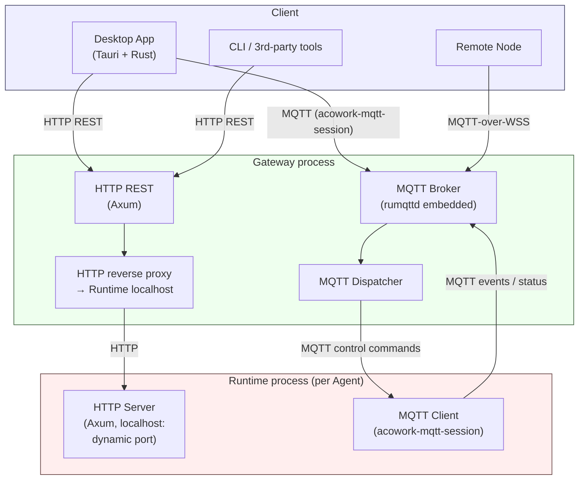

# ACowork Platform Requirements Definition

> Version: v1.6 | Updated: 2026-08-15
>
> This document is reverse‑engineered from design documents (01~19) and design conversations, serving as the authoritative source of platform requirements. Design documents describe "how", this document describes "what" and "why".
>
> **v1.6 Changes**:
> 1. Aligned with current code implementation (tool inventory, Crate count, actual GUI structure, actual communication protocols)
> 2. ADR section moved out to independent [`docs/adr/zh/`](../../adr/zh/) directory
> 3. Added Appendix A "Pending Requirements" – lists requirements recorded in this PRD but not yet implemented in code

---

## 0. Project Positioning

ACowork is an **"Agent as APP"** platform. Its core metaphor draws from Android: Agents are declarative packages like APKs, the Agent Runtime is a unified execution engine like ART, and the Gateway manages lifecycles like AMS.

**Dual positioning – ACowork serves two user groups simultaneously:**

| User Role | Usage Mode | Core Value |
|-----------|------------|------------|
| **End‑user** | Install Agents from a repository, configure API keys, use directly | Out‑of‑the‑box AI capabilities, privacy‑safe sharing, multi‑Agent collaboration |
| **Agent Developer** | Write manifest + prompt + SKILL.md, sign and publish | Zero‑code development, full debug toolchain, distributable ecosystem |

The declarative package format (manifest.toml + prompts + skills + tool declarations, no executables) is the technical foundation for both positions – expressive enough for developers, and secure enough for end‑users (Gateway enforces mandatory signature verification on installation).

The developer toolchain is complete: `acowork-sign` (with `keygen / sign / verify` subcommands) → Desktop App DevMode (single‑step debugging, breakpoints; **recording/replay** pending Phase 6) → publishing wizard → **remote repository distribution pending Phase 6** (PKG‑08/08a/09). **Hot‑loading of SKILL.md is not implemented** (DEV‑06); modifications require restarting the Agent.

**Target users**: individuals, small teams, and enterprises. The key difference for enterprises is the ability to connect their self‑hosted RAG knowledge bases to Agents, enabling enterprise‑grade knowledge augmentation.

**Core value propositions**:

- **Declarative Agent packages** – zero‑code, distributable, signable (developer‑friendly + security baseline)
- **Developer‑friendly** – manifest + prompt + SKILL.md are enough to build an Agent; Desktop App DevMode provides a complete debugging loop
- **Process‑level isolation** – each Agent runs independently without interference
- **Biomimetic memory** – Agents have layered memory systems that remember, forget, and learn
- **Cross‑Agent collaboration** – Intent mechanism enables inter‑Agent communication
- **Privacy‑safe sharing** – Agents can be freely shared; Personal/Sensitive data is automatically stripped, sharing only "Agent capability" not "user memory"
- **Cross‑platform** – the same .agent package runs on Windows/Linux/macOS desktop (mobile PLT‑03/PLT‑05 pending Phase 7)
- **Enterprise‑ready** – standard RAG interface to connect enterprise knowledge bases without platform data hosting

---

## 1. Functional Requirements

### 1.1 Agent Packaging and Distribution

| ID | Requirement | Priority | Notes |
|----|-------------|----------|-------|
| PKG‑01 | Agents are distributed as `.agent` archives containing configuration, prompts, Skills, tool declarations, **no executables** | P0 | Declarative packaging is the core premise |
| PKG‑02 | `.agent` packages must be signed; Gateway enforces signature verification on installation | P0 | Security baseline |
| PKG‑03 | Support two signing identities: Developer (self‑signed) and Platform (platform‑issued) | P0 | Phase 1 minimal signing model |
| PKG‑04 | System Agents must be signed with the Platform Key | P0 | Prevent impersonation of system Agents |
| PKG‑05 | Agent upgrades require the signing certificate fingerprint to match the installed version | P0 | Prevent malicious package overwrites |
| PKG‑06 | Provide a signing toolchain (`acowork-sign` with `keygen / sign / verify` subcommands) | P1 | Developer self‑signing workflow |
| PKG‑07 | Provide Debug signing mode (local development auto‑signing) | P1 | Lower development barrier |
| PKG‑08 | Support remote repositories (multiple HTTP sources, periodic update checks) | P2 | Ecosystem distribution – **not implemented**, planned Phase 6 |
| PKG‑08a | Repository listing security scan: six‑dimensional automated scan (Manifest/Prompt/Skill/WASM/Grafeo/Structure) with Pass/Warn/Reject | P2 | Publishing‑side security gate – **not implemented**, depends on PKG‑08 |
| PKG‑09 | Support dual‑key model (Upload Key + Distribution Key) | P3 | Store distribution – **not implemented**, planned Phase 6+ |
| PKG‑10 | Support key rotation (Proof‑of‑Rotation) | P3 | Long‑term operations – **not implemented**, Phase 6+ |
| PKG‑11 | Support Certificate Revocation Lists (CRL) | P3 | Security incident response – **not implemented**, Phase 6+ |

### 1.2 Agent Package Format

| ID | Requirement | Priority | Notes |
|----|-------------|----------|-------|
| FMT‑01 | `manifest.toml` uses plain TOML format (machine configuration file) | P0 | Rust ecosystem friendly |
| FMT‑02 | `SKILL.md` uses YAML frontmatter + Markdown body; parser implemented (`core/acowork-runtime/src/skills/parser.rs`); full agentskills.io field compatibility (SKL‑02) pending Phase 3 | P0 | Reuse community skill ecosystem |
| FMT‑03 | manifest declares permissions, LLM configuration, tools, capabilities, triggers | P0 | Core of declarative package |
| FMT‑04 | manifest declares platform compatibility (`target_platforms`) with required/optional modes | P1 | Cross‑platform graceful degradation |
| FMT‑05 | manifest declares `identity_deps`, injected by Gateway at startup | P1 | Consistent cross‑Agent identity |
| FMT‑06 | Package size limit 50 MB | P1 | Gateway HTTP multipart has 64 MiB global limit (`routes::GLOBAL_BODY_LIMIT`); **hard 50 MB limit during installation not enforced in code**, depends on manual validation |
| FMT‑07 | `skills/references/` allows only non‑executable data files | P1 | Security constraint |

### 1.3 Agent Runtime (Unified Execution Engine)

| ID | Requirement | Priority | Notes |
|----|-------------|----------|-------|
| RUN‑01 | Agent Runtime is the platform's single binary, loads and executes `.agent` packages | P0 | Unified engine, zero custom code |
| RUN‑02 | Agent Runtime connects directly to LLM APIs, not via Gateway proxy | P0 | Low latency, streaming, autonomy |
| RUN‑03 | Agent Runtime autonomously executes tool calls and validates permissions | P0 | Agent autonomy principle |
| RUN‑04 | Support multiple LLM Providers with routing policies (cost/quality/latency priority) | P1 | Cost and scenario flexibility |
| RUN‑05 | Support budget management (Token limits, cost limits, over‑limit actions) | P1 | Prevent overspending |
| RUN‑06 | Support LLM fallback (auto‑switch on primary Provider failure) | P1 | Reliability |
| RUN‑07 | Support streaming output + concurrent tool_calls handling (interrupt streaming immediately when tool_calls detected) | P0 | UX and correctness |
| RUN‑08 | Loop detection (Exact Repeat / Ping‑Pong / No Progress) with three‑level progressive response | P0 | Prevent infinite loops |
| RUN‑09 | Context overflow recovery (Preemptive Trim + Reactive Recovery) | P0 | Required for long‑context scenarios |
| RUN‑10 | Tool Call per‑round deduplication (prevent duplicate calls to same tool in a single response) | P1 | Common LLM behaviour correction |
| RUN‑11 | Tool Result folding (keep full results for last 4 rounds, older folded into summaries) | P1 | Context space optimisation |
| RUN‑12 | Rate Limit layered handling (retryable limits vs non‑retryable insufficient balance) | P1 | API call robustness |
| RUN‑13a | High‑risk tools Approval Gate (Runtime‑side logic + CLI fallback) | P1 | Phase 1 security baseline – high‑risk tools like shell/file_write must have interception; CLI mode uses `approval_fallback` policy from manifest (default deny) |
| RUN‑13b | Approval Gate Desktop App confirmation flow (Gateway → Desktop App forwarding) | P2 | Requires Desktop App + HTTP API endpoints, delivered in Phase 3 alongside Desktop App |
| RUN‑14 | Support API Key rotation (centralised multi‑key management, Vault distribution) | P2 | Enterprise scenarios |

### 1.4 Memory System

| ID | Requirement | Priority | Notes |
|----|-------------|----------|-------|
| MEM‑01 | Each Agent owns a completely independent private Grafeo; no shared database | P0 | Data isolation baseline |
| MEM‑02 | Three layers, five types biomimetic hierarchy: Transient (working memory) → Episodic (experience) → Consolidated (semantic + procedural + autobiographical) | P0 | Biomimetic memory architecture |
| MEM‑03 | Immediate extraction: LLM autonomously decides via `memory_store` tool whether to store, zero extra API cost | P0 | Core mechanism for memory accumulation |
| MEM‑04 | Forgetting: graded decay model – ① background periodic scan (`run_decay_scan`) computes decay_score = importance × activity_signal, nodes below threshold move Active→Dormant; ② Dormant nodes automatically Purge after expiry; ③ capacity pressure triggers eviction (lowest decay_score first). Background scan non‑blocking, scheduled by Gateway Cron, scanning granularity by label batches | P1 | Prevent memory bloat |
| MEM‑05 | Associative diffusion retrieval: 1‑2 hop graph expansion, cross‑layer (Episodic↔Consolidated) | P1 | Retrieval quality |
| MEM‑06 | Autobiographical memory: six‑dimensional self‑perception, auto‑derived from manifest, injected into System Prompt | P1 | Agent self‑perception |
| MEM‑07 | Procedural memory: common behavioural patterns across Skills | P2 | Self‑learning capability |
| MEM‑08 | Privacy grading: PrivacyLevel (Public/Personal/Sensitive), automatically determined by LLM. Controls whether a node is included when packaging/sharing – Personal/Sensitive nodes are stripped on export, Public nodes retained. In‑context data cannot be technically access‑controlled, only constrained via prompt conventions | P1 | Packaging‑boundary privacy protection |
| MEM‑09 | Offline consolidation: triggers dedicated LLM calls during idle time to distill Episodic layer to Consolidated layer | P3 | Memory quality improvement – `acowork-grafeo/src/consolidation/` (`offline.rs`/`scheduler.rs`/`generalization.rs`/`triple_extraction.rs`) has skeleton and scheduling framework; Runtime `memory/consolidation_bg.rs` provides `ConsolidationBgTask` entry point. Full LLM‑driven offline consolidation still pending Phase 6 activation |
| MEM‑10 | Grafeo full‑Zone cross‑device sync (platform‑hosted cleartext, consistent multi‑device experience). enterprise Zone renamed to work Zone (personal work memory, unrelated to enterprise RAG). Privacy grading and sync strategy are fully decoupled – PrivacyLevel controls packaging boundary (whether Personal/Sensitive data is stripped on sharing), Zone serves only as semantic packaging boundary, not sync scope | P1 | Multi‑device sync – MemoryStore currently local only (Grafeo files under `{agent_home}/data/grafeo/`), **cloud sync not implemented**. Cloud Sync and enterprise MemStore planned Phase 6 together |
| MEM‑11 | Content‑type compression: artifact content (code/files/command output) stores only summary + ArtifactRef reference | P1 | Prevent Grafeo bloat |
| MEM‑12 | Embedding generation: Ollama local (`/api/embed`) → Remote API (`/embeddings`) fallback chain, `MemoryManager.retrieve()` internally times out at 200ms auto‑generate | P1 | Vector retrieval prerequisite |

### 1.5 Tool System

| ID | Requirement | Priority | Notes |
|----|-------------|----------|-------|
| TOL‑01 | Built‑in toolset (**16 core tools + 4 conditional**, actual count varies 16~22) | P0 | Basic capabilities for Agent to perceive and act on the world. Actual list below |
| TOL‑02 | Support WASM custom tools (Wasmtime sandbox execution) | P2 | Extensibility – WASM module code landed but feature‑gated (`wasm-tools` feature), **not registered in any Agent's built‑in tool list**; disabled by default before Phase 6 |
| TOL‑03 | WASM tool resource limits (max_memory_mb, max_execution_time_ms, Fuel metering) | P2 | Security isolation – delivered with WASM tools in Phase 6 |
| TOL‑04 | API Keys invisible to WASM tools (`secrecy::SecretString`) | P2 | Security baseline – delivered with WASM tools in Phase 6 |
| TOL‑05 | Tool permission validation: all tool calls must match manifest‑declared permissions | P0 | Security baseline |
| TOL‑06 | Platform support matrix: shell only on desktop, file operations limited on mobile | P1 | Cross‑platform adaptation |
| TOL‑07 | Skill cascading degradation: Skill auto‑degrades when dependent tools are unavailable | P2 | Graceful degradation |
| TOL‑08 | WASM runtime selection: Wasmtime (desktop), Wasmi (mobile/iOS no JIT) | P2 | Cross‑platform – delivered with WASM tools in Phase 3 |
| TOL‑09 | WASI Preview 2 (directory‑level sandbox + capability safety) | P2 | Security sandbox – delivered with WASM tools in Phase 3 |
| TOL‑10 | Built‑in tools scoped to platform infrastructure only; SaaS integrations provided by independent Agents | P1 | Architectural boundary |

#### 1.5.1 Actual Built‑in Tool Inventory

| # | Tool | Type | Permission | Notes |
|---|------|------|------------|-------|
| 1 | `memory_recall` | core | `memory:read` | Retrieve memory |
| 2 | `memory_store` | core | `memory:write` | Write memory |
| 3 | `http_request` | core | `network:<url>` | HTTP request |
| 4 | `web_fetch` | core | `network:<url>` | URL → text (with timeout) |
| 5 | `web_search` | conditional | `search:web` | Registered only when at least one search Provider is configured |
| 6 | `shell` | core × N | `filesystem:exec` | Platform‑detected shell tools (Windows: bash + PowerShell, Unix: system shell) |
| 7 | `file_read` | core | `filesystem:read:<path>` | Read file |
| 8 | `file_write` | core | `filesystem:write:<path>` | Write file |
| 9 | `file_edit` | core | `filesystem:write:<path>` | Edit file |
| 10 | `doc_reader` | core | `filesystem:read:<path>` | PDF / DOCX / XLSX / PPTX text extraction |
| 11 | `glob_search` | core | `filesystem:read:<path>` | Glob file search |
| 12 | `content_search` | core | `filesystem:read:<path>` | ripgrep text search |
| 13 | `intent_send` | core | `intent:send:<target>` | Cross‑Agent Intent (MQTT channel) |
| 14 | `ask_user_question` | core | (none) | LLM proactively asks user (not subject to permission checks) |
| 15 | `todo_write` | core | (none) | Structured TODO list maintenance |
| 16 | `mcp_install` / `mcp_uninstall` | core | (subject to manifest declarations) | Dynamic MCP Server mounting (ADR‑029) |
| 17 | `rag_query` | conditional | `rag:query + network:<rag_url>` | Enterprise RAG access, registered only when manifest declares `[[tools]] type = "rag"` (ADR‑051 / Phase 4) |
| 18 | `context_retrieve` | conditional | `context:read` | Platform‑protected, registered based on `tool_compression_enabled` config (ADR‑052) |
| 19 | `context_abandon` | conditional | `context:write` | Platform‑protected, same as above |
| 20 | `codebase` | conditional | `filesystem:read:<path>` | LSP index query, registered only when LSP Relay is reachable |

**Key points**:

- Identity management is not exposed as a standalone tool API: identity is served via Gateway's `UserProfile` (`/api/users`), `acowork-system` exposes it through ordinary `memory_recall`/`memory_store`.
- Actual tool count varies by configuration: core 16 + `web_search` + `rag_query` + `context_retrieve`/`context_abandon` + `codebase` = 16 ~ 22.
- WASM tools not in this list: module code exists (`core/acowork-runtime/src/tools/wasm/`) but `wasm-tools` feature is off by default, **no Agent uses WASM tools** – TOL‑02~04/TOL‑08~09 are effectively unavailable before Phase 6.

### 1.6 Skill System

| ID | Requirement | Priority | Notes |
|----|-------------|----------|-------|
| SKL‑01 | Two‑layer model: SKILL.md (static definition) + Grafeo (dynamic experience) – Phase 2 completes SKILL.md parsing, agentskills.io compatibility deferred to Phase 3 | P0 | Skill architecture foundation |
| SKL‑02 | SKILL.md compatible with agentskills.io open standard | P2 | Reuse community skills – deferred to Phase 3 |
| SKL‑03 | Debug workflow: Agent creates draft in Grafeo → Debug mode trial run → user confirmation → commit to SKILL.md | P2 | Skill development loop – depends on Debug Protocol (Phase 5), recommend simple SKILL.md hot‑load by end of Phase 2 |
| SKL‑04 | Self‑learning loop: after publication, accumulated experience reaches threshold prompting user to update SKILL.md | P2 | Continuous improvement |
| SKL‑05 | Model compatibility: SkillExecution records model info, SkillExperience aggregates by model, runtime auto‑injects adaptation instructions | P2 | Cross‑model portability |

### 1.7 Gateway

| ID | Requirement | Priority | Notes |
|----|-------------|----------|-------|
| GTW‑01 | Gateway is pure infrastructure, zero business logic, no business database | P0 | Architecture principle |
| GTW‑02 | Package management: install (with signature verification), uninstall, upgrade, version management | P0 | Agent lifecycle starting point |
| GTW‑03 | Lifecycle management: start/stop/restart Agent processes, health checks | P0 | Agent runtime assurance |
| GTW‑04 | Intent routing: cross‑Agent message forwarding + Capability Registry | P1 | Agent collaboration foundation |
| GTW‑05 | Key Vault: encrypted API Key storage, one‑time distribution, not via environment variables | P0 | Security baseline |
| GTW‑06 | Budget tracking: receive Agent reports, over‑limit signals | P1 | Cost control |
| GTW‑07 | Rate limiting: token allocation, cross‑Agent shared resource coordination | P1 | API call fairness |
| GTW‑08 | HTTP API (Axum, port 19876): for Desktop App / CLI | P0 | Management interface – includes agents / vault / config / skills / users / nodes / publish / memory / embedding / mcp / cron / fs / workspaces / global‑resources / proxy / debug‑mqtt / settings sub‑routes |
| GTW‑10 | Scheduled triggers (cron parsing) | P0 | Scheduled tasks – 5‑field cron + timezone + retry + max_runs + expires_at, HTTP path `/api/agents/{id}/cron` |
| GTW‑11 | Gateway CLI binary: command‑line Agent management | P1 | Headless scenarios |
| GTW‑12 | Cold‑start identity injection: before starting Agent, query system Agent for `identity_deps` and inject | P1 | Identity consistency – implemented in Phase 2 |

### 1.8 System Agent

| ID | Requirement | Priority | Notes |
|----|-------------|----------|-------|
| SYS‑01 | System Agent ships with Gateway, cannot be uninstalled, auto‑starts | P0 | System‑level service |
| SYS‑02 | Identity information is centrally managed by Gateway's `UserProfile` HTTP API (`/api/users`); `acowork-system` is only the entry Agent at startup | P0 | Cross‑Agent identity consistency – `identity:query`/`identity:observe` Intent interfaces not exposed (removed from system‑agent manifest) |
| SYS‑03 | Receive identity reports, use LLM for secondary judgement (replacing user confirmation popups) | P3 | Automated decision – currently identity confirmation directly sync‑persisted by Gateway `createUser`/`updateUser`, **no LLM secondary judgement**, pending Phase 6 |
| SYS‑04 | Default interaction entry – the only interface when no third‑party Agent is available | P1 | First‑use experience |
| SYS‑05 | Observe notification mechanism – notify subscribed Agents on identity change | P2 | **Not implemented** – identity changes via HTTP persist but no active push to subscribers; subscribers must poll UserProfile |
| SYS‑06 | Must be Platform‑signed, has system privileges | P0 | Security baseline |

### 1.9 Communication Protocol

#### 1.9.1 Protocol Stack Overview

The platform uses **HTTP REST + MQTT** as two transport protocols across three link types (Desktop ↔ Gateway ↔ Local Runtime, Gateway ↔ Remote Node).

**Three planes + three link segments**:

| Plane | Transport | Purpose |
|-------|-----------|---------|
| **Control Plane** | MQTT topics (QoS 1) | User‑action‑triggered state changes, real‑time bidirectional control commands |
| **Data Plane** | HTTP REST (with Gateway reverse proxy) | Full loading at startup, bulk reads, file operations, large data transfers |
| **Event Plane** | MQTT topics (QoS 0~1) | Streaming chunks, state change pushes, async notifications |

| Segment | Link | Protocol |
|---------|------|----------|
| **L1** | Desktop / CLI ↔ Gateway | HTTP REST + MQTT |
| **L2** | Gateway ↔ Local Runtime | MQTT (primary) + HTTP reverse‑proxy to Runtime self‑bound localhost port |
| **L3** | Gateway ↔ Remote Node | MQTT‑over‑WSS + HTTP REST reverse‑proxy |

> Transport assignment follows ADR‑034 three rules: same semantics use one transport; user‑action‑triggered state changes always use MQTT; Gateway does not directly access Runtime local files, always via HTTP reverse‑proxy.

#### 1.9.2 Protocol Requirements Matrix

| ID | Requirement | Priority | Implementation |
|----|-------------|----------|----------------|
| COM‑01 | Unified protocol stack of HTTP REST + MQTT; no WebSocket, gRPC, or Socket IPC | P0 | Architectural consistency (background in ADR‑031/ADR‑033) |
| COM‑02 | Control plane via MQTT topic `acowork/agents/{id}/sessions/control/{cmd}` (cmd set: `chat_message`/`stop`/`model_switch`/`open_session`/`enable_notify`/`disable_notify`/`close_session`/`compress_action`/`workspace_switch`/`approval_decision`/`question_answer`/`continue_execution`/`update_session_title`/`intent`) | P0 | Desktop → Runtime via Gateway broker |
| COM‑03 | Event plane via MQTT topic `acowork/agents/{id}/sessions/{sid}/messages/{event_type}` (event_type set: `stream_delta`/`tool_call`/`tool_result`/`stream_end`/`error`/`state`) + Agent‑level `/status`/`/ready`/`/meta`/`/config`/`/http_endpoint` | P0 | Runtime → Desktop via Gateway broker |
| COM‑04 | Data plane via HTTP REST: startup loading, bulk reads, file uploads, large data; Gateway reverse‑proxies `/api/agents/{id}/sessions[/{sid}[/messages|/documents]]` to Runtime self‑bound localhost HTTP server | P0 | Gateway HTTP reverse‑proxy + Runtime HTTP server |
| COM‑05 | Gateway ↔ Remote Node: MQTT‑over‑WSS + HTTP REST reverse‑proxy (`/api/fs/browse?target={node_id}` etc.) | P1 | Remote node topology |
| COM‑06 | Debug Protocol: MQTT subscribe `acowork/agents/{id}/debug/events` for event stream; HTTP RPC `POST /api/agents/{id}/debug-rpc` for commands (body: `{method, params}`, Gateway reverse‑proxies to Runtime `/debug/rpc`); 10 handlers implemented (resume/pause/step/stop/getState/getContextSnapshot/getSection/rewind/patchContext/reExecute) | P2 | DevMode debugging |
| COM‑07 | Global resources: startup `GET /api/bootstrap` + `GET /api/global-resources` for full load; incremental changes via MQTT `acowork/global/resources` retained topic | P1 | Startup + incremental subscription |
| COM‑08 | Protocol ACL and multi‑user isolation: rumqttd CONNECT‑layer authentication + topic‑level ACL (`{user_id}/{active_user_id}` prefix) + TLS (remote node scenarios) | P0 | Security baseline |
| COM‑09 | Protocol version negotiation: MQTT CONNECT packet `properties.protocol_version`; HTTP endpoints reserve `/api/v{N}/` upgrade path (currently `/api/`, Phase 7 enables `/api/v2/`) | P2 | Evolutionary compatibility |
| COM‑10 | Sensitive data (API Keys, Vault Secrets, PII) forbidden on MQTT, only over localhost HTTP (127.0.0.1); MQTT topic payloads carry only business metadata | P0 | Security baseline |

#### 1.9.3 Actual MQTT Topic Inventory

| Topic | Direction | QoS | Notes |
|-------|-----------|-----|-------|
| `acowork/agents/{id}/sessions/control/{cmd}` | Desktop → Runtime | 1 | Control commands (full COM‑02 cmd set) |
| `acowork/agents/{id}/sessions/{sid}/messages/{event_type}` | Runtime → Desktop | 0~1 | Streaming events (COM‑03) |
| `acowork/agents/{id}/status` | Runtime → Gateway | 1 (retained) | Online status (online/offline/busy) |
| `acowork/agents/{id}/ready` | Runtime → Gateway | 1 | Startup ready signal |
| `acowork/agents/{id}/http_endpoint` | Runtime → Gateway | 1 (retained) | Register localhost HTTP port (reverse‑proxy target) |
| `acowork/agents/{id}/config` | Gateway → Runtime | 1 (retained) | Configuration changes (Provider / Vault Key switching) |
| `acowork/agents/{id}/meta` | Runtime → Gateway | 1 (retained) | Agent metadata snapshot |
| `acowork/agents/{id}/workspaces/{wid}/fs-changed` | Runtime → Desktop | 1 | Workspace file changes |
| `acowork/agents/{id}/debug/events` | Runtime → Desktop | 1 | Debug event stream |
| `acowork/global/resources` | Gateway → Desktop | 1 (retained) | Global resource snapshot (Provider / Search / MCP) |
| `acowork/intent/{target}` | Runtime → Runtime | 1 | Cross‑Agent Intent messages |

Full topic matrix see [ADR‑034 §11.2](docs/adr/zh/ADR-034-mqtt-http-boundary.md), [ADR‑048](docs/adr/zh/ADR-048-debug-protocol-mqtt-http.md), [ADR‑055](docs/adr/zh/ADR-055-remote-runtime-node-topology.md).

#### 1.9.4 Actual HTTP Endpoint Categories

| Category | Path Pattern | Notes |
|----------|--------------|-------|
| Health / status | `GET /health`, `GET /api/status`, `GET /api/bootstrap` | Startup |
| Agent management | `GET/POST/DELETE /api/agents[/{id}[/start|/stop|/clone|/upgrade|/install|/manifest]]` | Agent lifecycle |
| Data plane (reverse‑proxy) | `GET /api/agents/{id}/sessions`, `GET /api/agents/{id}/sessions/{sid}/messages`, `POST /api/agents/{id}/sessions/{sid}/documents` | Gateway reverse‑proxy to Runtime localhost |
| Debug | `POST /api/agents/{id}/debug-rpc` | Debug RPC (COM‑06) |
| Config / Vault / Provider / Skills / Cron / Users / Nodes | `/api/config`, `/api/vault/*`, `/api/providers`, `/api/agents/{id}/skills`, `/api/agents/{id}/cron`, `/api/users`, `/api/nodes` | Configuration plane |
| Global resources | `GET /api/global-resources` | Startup full load |
| Remote nodes | `GET /api/fs/browse?target={node_id}&path=...` | Reverse‑proxy to remote node |
| MQTT debug | `POST /api/debug/mqtt/{start,shutdown}` | Operations |

Full endpoint matrix see [ADR‑034 §11.1](docs/adr/zh/ADR-034-mqtt-http-boundary.md).

> **Maintenance convention**: any new protocol addition (whether new MQTT control command or new HTTP endpoint) must update the protocol matrices in ADR‑034 / ADR‑048 / ADR‑055 + `prd.md` §1.9 + `prd-ui-ux.md` §11 to keep all three documents in sync.

### 1.10 Security

| ID | Requirement | Priority | Notes |
|----|-------------|----------|-------|
| SEC‑01 | Process‑level isolation – each Agent in its own process, one crash does not affect others | P0 | Stability baseline |
| SEC‑02 | File system isolation – Agent can only write to its own workspace and authorised directories | P0 | Data security |
| SEC‑03 | Network isolation – network access denied by default, only authorised whitelist per manifest | P1 | Least privilege |
| SEC‑04 | Permission declaration – manifest must declare all permissions; undeclared cannot be used | P0 | Least privilege principle |
| SEC‑05 | WASM tool sandbox – cannot access host memory, file system, or network | P0 | Custom code isolation – Wasmtime + WASI Preview 2 module code implemented (`wasm-tools` feature‑gated), but **not enabled in any Agent's built‑in tool list** (see §1.5.1), TOL‑02~04/08~09 effectively unavailable before Phase 6 |
| SEC‑06 | Sandbox hardening – Linux uses bubblewrap + seccomp-bpf | P2 | Deep isolation – deferred to Phase 7 (ADR‑007) |
| SEC‑07 | API Keys not distributed via environment variables, transmitted once via socket | P0 | Prevent ps/procfs leakage |
| SEC‑08 | Shell command risk grading + file provenance tracking + audit logs | P3 | Runtime‑layer Shell security – deferred to Phase 3 |
| SEC‑09 | Agent repository listing security scan: manifest compliance + Prompt/Skill behaviour analysis + WASM binary scan + Grafeo memory scan + package structure compliance | P2 | Publishing‑side security gate, forming defence in depth with runtime security |

### 1.11 Desktop App

| ID | Requirement | Priority | Notes |
|----|-------------|----------|-------|
| DSK‑01 | Desktop App and Gateway are separate processes, communicate via Gateway HTTP REST + MQTT | P1 | Architectural consistency |
| DSK‑02 | Chat interface: message send/receive, streaming output, tool call display | P1 | Core interaction – see `apps/acowork-desktop/src/components/chat/ChatPanel.tsx` |
| DSK‑03 | Agent management interface: install, uninstall, start/stop, list, clone, create (Create Wizard / Clone Dialog / AgentDetailDialog) | P1 | Agent lifecycle management |
| DSK‑04 | Settings page (5 tabs: profile / general / appearance / gateway / nodes); Provider and Vault managed in Harness view | P1 | Configuration management |
| DSK‑05 | System tray: close window hides to tray (does not exit), shows Gateway connection status (5 states: Connected / Agents Running / Working / Disconnected / Error) | P2 | Desktop experience – `apps/acowork-desktop/src-tauri/src/tray.rs` |
| DSK‑06 | Developer mode: Developer Mode toggle switch; debug panel + breakpoints (`enable_agent_debug`/`disable_agent_debug` Tauri commands); **recording/replay** pending Phase 6 | P2 | Development debugging – Debug panel is in right nav `debug` tab |
| DSK‑07 | Publish Wizard, Clone Dialog, Create Wizard; no standalone Skill/Manifest editor – editing via Workspace file tree + `file_edit` tool + file‑level metadata panel | P3 | Development toolchain |
| DSK‑08 | First‑run onboarding flow | P2 | User onboarding – 5 steps: welcome → Gateway connection → Provider configuration → identity → recommended Agent installation |

### 1.12 Cross‑Platform

| ID | Requirement | Priority | Notes |
|----|-------------|----------|-------|
| PLT‑01 | `.agent` package format and Gateway Service API contract are unified across platforms | P0 | Platform‑agnostic |
| PLT‑02 | Desktop (Windows/Linux/macOS) fully supported | P1 | Phase 1 target |
| PLT‑03 | Mobile (Android/iOS) degraded operation (SingleProcess mode, Local TCP, wasmi) | P3 | Long‑term target |
| PLT‑04 | Transport layer implementation differs per platform (Unix Socket / Named Pipe / Local TCP), but package compatibility is unaffected | P1 | Implementation‑level differences |
| PLT‑05 | Mobile capability degradation: shell unavailable, file operation paths narrowed, Skill cascading degradation | P2 | Graceful degradation |

### 1.13 Enterprise RAG Integration

> Enterprise Agent is not a built‑in capability of the ACowork platform, but a development paradigm – Agent developers connect to enterprise knowledge bases via the standard RAG interface, and end‑users simply perceive an ordinary Agent.

**Design principles**:

- **Pure integration, no hosting**: ACowork does not operate RAG services; knowledge belongs to enterprises. ACowork defines a standard query protocol (request/response JSON Schema); enterprise RAG systems adapt to this protocol; ACowork does not implement adapters for each vendor.
- **Isolation first**: local Grafeo (personal memory) and enterprise RAG (collective knowledge) are two independent retrieval channels, non‑interfering.
- **Configuration‑driven Opt‑In**: RAG is not a default capability; it is enabled only when Agent manifest declares `[[tools]] type = "rag"`; Agents without RAG declaration behave exactly as without RAG, zero intrusion.
- **Hybrid dual‑trigger**: automatic trigger (MemoryManager Retrieve phase) + explicit trigger (LLM tool_call), both driven by manifest configuration.

#### 1.13.1 Dual‑Channel Retrieval Model

| Channel | Storage | Content | Ownership |
|---------|---------|---------|-----------|
| Local memory channel | Grafeo (graph database) | Personal preferences, interaction history, autobiographical, episodic, semantic consolidation | User local |
| Enterprise knowledge channel | Enterprise self‑hosted RAG | Product documentation, business processes, industry knowledge, internal norms | Enterprise owned |

Agents retrieve memory by querying both channels in parallel; results are source‑tagged and concatenated into the LLM context. LLM can reference both personal experience and enterprise knowledge, but privacy boundaries and ownership remain clear: personal stays personal, enterprise stays enterprise.

**RAG dual‑trigger model** (only active when RAG is declared in manifest):

| Trigger Type | Timing | Query Parameters | Purpose |
|--------------|--------|-------------------|---------|
| Automatic | Main loop step ② MemoryManager Retrieve | user message as query, top_k=3, score_threshold=0.7 | Background knowledge injection, LLM need not actively decide to query |
| Explicit | Main loop step ⑤ LLM tool_call | LLM‑customised query/filter/top_k | Targeted deep retrieval |

Automatic results are injected as "background context"; explicit tool results are appended to History as "tool return values". They occupy different positions in context with non‑overlapping semantics.

Agents without RAG declaration: `MemoryManager.retrieve()` only queries Grafeo channel; Tool Dispatcher does not register RAG tools; behaviour is identical to RAG‑less Agents.

#### 1.13.2 RAG Tool Definition

| ID | Requirement | Priority | Notes |
|----|-------------|----------|-------|
| RAG‑01 | manifest declares `[[tools]]` type `rag` with enterprise RAG service endpoint and authentication; RAG is Opt‑In, zero intrusion when undeclared | P2 | Standard enterprise RAG access – enterprise RAG is a development paradigm, not core platform feature (§1.13), Phase 4 delivery |
| RAG‑02 | RAG tool supports standard query interface (ACowork‑defined request/response JSON Schema; enterprise RAG adapts to the protocol) | P2 | Compatible with all RAG systems implementing the standard protocol – delivered with RAG‑01 |
| RAG‑03 | RAG tool supports enterprise authentication (API Key / Bearer Token; OAuth 2.0 deferred to later Phase) | P2 | Enterprise security requirement – delivered with RAG‑01 |
| RAG‑04 | RAG authentication credentials managed via Vault, not exposed plaintext in manifest or process environment | P2 | Security baseline – delivered with RAG‑01 |
| RAG‑05 | RAG query results include source attribution (source_url / chunk_id), both automatic and explicit triggers | P2 | Explainability – delivered with RAG‑01 |
| RAG‑06 | manifest declares query scope for RAG knowledge base (namespace / collection / index), runtime constrains queries accordingly | P3 | Multi‑tenant isolation |
| RAG‑07 | RAG tool offline degradation: skip channel when RAG service unreachable, do not block Agent operation | P2 | Offline robustness – delivered with RAG‑01 |

#### 1.13.3 Architectural Boundary

Enterprise RAG integration is strictly limited to the retrieval channel; it is not unified upward into the Memory system abstraction layer. Reason: Grafeo is a graph database (supports associative diffusion, decay forgetting), while RAG is vector retrieval (batch queries, stateless). Their query paradigms and storage models are completely different. Forcing a unified abstraction introduces unnecessary complexity, and multi‑tenant isolation and data write permissions of enterprise RAG are incompatible with Grafeo's model.

Enterprise RAG integration belongs to the "enterprise Agent development paradigm", does not require all Agents to support RAG, and is not part of ACowork core platform feature commitments. RAG is enabled only when manifest declares it; Runtime behaviour is configuration‑driven.

---

## 2. Non‑Functional Requirements

### 2.1 Performance

| ID | Requirement | Target |
|----|-------------|--------|
| PERF‑01 | Agent Runtime idle memory footprint | Target comparable to ZeroClaw (~5‑10 MB) |
| PERF‑02 | Agent startup time (from spawn to first LLM request sent) | < 2 seconds |
| PERF‑03 | Gateway memory footprint | < 50 MB (excluding Agent processes) |
| PERF‑04 | Memory retrieval latency | < 100 ms (single hybrid_search) |
| PERF‑05 | WASM tool call overhead | < 5 ms (Host‑WASM communication) |

### 2.2 Reliability

| ID | Requirement | Target |
|----|-------------|--------|
| REL‑01 | Agent process crash does not affect other Agents | Process‑level isolation guarantee |
| REL‑02 | Agent state not lost after crash | Private Grafeo persistence |
| REL‑03 | LLM Provider failure auto‑fallback | Multi‑Provider + retry mechanism |
| REL‑04 | Conversation writes not lost | WAL + write queue + timeout degraded retry |

### 2.3 Security

| ID | Requirement | Target |
|----|-------------|--------|
| SECR‑01 | `.agent` package unsigned or invalid signature → reject installation | Mandatory verification on install |
| SECR‑02 | API Keys not leaked to process arguments or environment variables | One‑time socket distribution |
| SECR‑03 | WASM tools cannot escalate privileges | Wasmtime + WASI Preview 2 |
| SECR‑04 | Inter‑Agent data invisible by default | Private Grafeo + process isolation |

### 2.4 Maintainability

| ID | Requirement | Target |
|----|-------------|--------|
| MNT‑01 | Rust workspace modular (**13 crates**) | acowork‑core / acowork‑embed / acowork‑gateway / acowork‑grafeo / acowork‑lsp‑relay / acowork‑mcp / acowork‑memory / acowork‑mqtt‑session / acowork‑node / acowork‑runtime / acowork‑sign / acowork‑tool‑sdk / acowork‑vault |
| MNT‑02 | Configuration‑driven – Agent behaviour defined by manifest + prompt, no code changes needed | Declarative architecture guarantee |
| MNT‑03 | ADRs record all major technical decisions | Each design document includes decision record table |

### 2.5 Extensibility

| ID | Requirement | Target |
|----|-------------|--------|
| EXT‑01 | Runtime depends on traits/interfaces, not concrete implementations | RXT‑01 Dependency Inversion |
| EXT‑02 | Core modules plug into Runtime via standardised lifecycle phases | RXT‑02 Lifecycle Hooks |
| EXT‑03 | All tunable parameters via manifest + system defaults injection | RXT‑03 Configuration Externalisation |
| EXT‑04 | Feature pipeline supports middleware insertion | RXT‑04 Middleware Pipeline |
| EXT‑05 | Storage backend replaceable (MemoryStore trait) | RXT‑05 Replaceable Storage |
| EXT‑06 | Critical operations publish events for external subscription | RXT‑06 Observable Events |

### 2.6 Developer Friendliness

> ACowork is not only an AI tool for end‑users, but also a creation platform for Agent developers. Developers build capabilities with declarative packages without writing executable code; the platform provides a complete toolchain from authoring to publishing.

| ID | Requirement | Priority | Notes |
|----|-------------|----------|-------|
| DEV‑01 | Declarative development – `manifest.toml` + prompt + SKILL.md are enough to build an Agent, no coding required | P0 | Zero‑barrier entry |
| DEV‑02 | SKILL.md compatible with agentskills.io open standard, directly reusable community skills | P0 | Ecosystem reuse |
| DEV‑03 | `acowork-keygen` / `acowork-sign` / `acowork-verify` signing toolchain | P1 | Developer self‑signing workflow |
| DEV‑04 | Debug signing mode (local development auto‑signing) | P1 | Lower development barrier |
| DEV‑05 | Desktop App DevMode – conversational debugging, single‑step execution, breakpoints, recording/replay | P2 | Debugging loop |
| DEV‑06 | Skill hot‑load – modify SKILL.md without restarting Agent | P2 | Efficient iteration |
| DEV‑07 | Provider dynamic switching – seamlessly switch between real LLM / local models during debugging | P2 | Cost control |
| DEV‑08 | Agent cloning – duplicate configuration from existing Agent to quickly create new one | P3 | Efficiency tool |
| DEV‑09 | Publishing wizard – guides developer through signing, verification, publishing to repository | P3 | Publishing loop |
| DEV‑10 | Capability overview injection – at startup, push capability summaries of all Agents in system to LLM for collaborative planning | P1 | Lower cross‑Agent collaboration barrier |

**Developer experience design principles**:

- **Zero‑barrier start**: know how to write prompts → can develop Agents, no Rust/Python programming required
- **Progressive enhancement**: start with SKILL.md for behavioural patterns (Phase 1), later advance to WASM custom tools (Phase 2+)
- **Debugging friendly**: DevMode provides execution context identical to production; recording/replay precisely reproduces issues
- **Develop once, run anywhere**: manifest declares `target_platforms` (desktop/mobile), Skill cascading degradation auto‑adapts

**LLM‑first design principles**:

- **Trust LLM over rules**: semantic understanding tasks (memory extraction, classification, quality evaluation, conflict detection) are done by LLM, not rule engines
- **Rules only for mechanical constraints**: length validation, frequency limits, security filtering – where LLM cannot self‑constrain, Runtime rules execute
- **Do not replace LLM with rules**: when rules do not bring significant improvement over LLM, using rules is a step backward, not forward

---

## 3. Constraints and Assumptions

### 3.1 Constraints

- Agent packages contain no executables – all logic implemented by LLM + Tools; WASM is the only custom code entry point
- Gateway does not proxy business logic – LLM calls, tool execution, memory reads/writes all happen within Agent process
- System Agent uses LLM reasoning to replace user confirmation popups – avoiding complex user arbitration flows
- Phase 1 targets desktop only (Linux first) – mobile adaptation deferred

### 3.2 Assumptions

- Users have access to local LLM APIs (OpenAI / Claude / Ollama etc.), platform does not bundle LLMs
- Users trust the local Agent Runtime binary (trust anchor of the platform)
- Network is not mandatory – all features work offline except LLM calls

---

## 4. Priority Mapping by Phase

| Priority | Meaning | Phase | Notes |
|----------|---------|-------|-------|
| P0 | Core platform – without it, it's not ACowork | Phase 1 | Must deliver for MVP |
| P1 | Essential – significantly impacts usability or security if missing | Phase 1~2 | Phase 1 delivers basics, Phase 2 improves experience |
| P2 | Enhancement – improves experience, security, and extensibility | Phase 3~5 | Does not block MVP, but must be delivered mid‑term |
| P3 | Ecosystem expansion – future‑looking capabilities | Phase 6~7 | Nice‑to‑have, may be deferred as needed |

**Priority adjustment rationale**: P1 is limited to "Phase 1‑2 deliverable and blocks core experience/security". The following are downgraded from P1 to P2:

| Requirement | Original Priority | New Priority | Rationale |
|-------------|-------------------|--------------|-----------|
| TOL‑02~04, TOL‑08~09 | P1 | P2 | WASM tools are Phase 3 extension; Phase 1 built‑in 15 tools cover MVP |
| SKL‑03 | P1 | P2 | Skill debugging depends on Debug Protocol (Phase 5), cannot be delivered earlier |
| RAG‑01~05, RAG‑07 | P1 | P2 | Enterprise RAG is a development paradigm, not core platform feature (§1.13), does not affect Phase 1/2 |
| RUN‑13 | P1 | Split | RUN‑13a (CLI Approval) stays P1; RUN‑13b (Desktop App confirmation) downgraded to P2 |

**P0 requirements summary** (Phase 1 must deliver):

PKG‑01~05, FMT‑01~03, RUN‑01~03, RUN‑07~09, MEM‑01~03, TOL‑01, TOL‑05, SKL‑01, GTW‑01~03, GTW‑05, SYS‑01~02, SYS‑06, COM‑01~02, COM‑05, SEC‑01~02, SEC‑04~05, SEC‑07, PLT‑01

**P1 requirements summary** (Phase 1~2 deliver):

RUN‑04~06, RUN‑10~12, RUN‑13a, MEM‑04~06, MEM‑08, MEM‑10~12, TOL‑06, TOL‑10, GTW‑04, GTW‑06~07, GTW‑11~12, SYS‑04, COM‑03, SEC‑03, DSK‑01~04, PLT‑02, PLT‑04, DEV‑03~04, DEV‑10

---

## 5. Core User Scenarios

> §5 describes representative scenarios supported by platform capabilities (illustrative), not requiring one‑to‑one mapping with Agents in `examples/`. Current `examples/` Agents are enterprise R&D‑oriented: Architect / SSE / QA / PM / Product / Docs / Document Manager etc. Personal Agents like weather/calendar are not packaged, but platform capabilities exist – users or developers can package and install them.

### 5.1 Personal User Daily Scenario

User installs a Weather Agent and a Calendar Agent (or packages themselves). Every morning at 7, Weather Agent via cron auto‑fetches weather, sends Intent to Calendar Agent to create a reminder (e.g., "bring umbrella"). Weather Agent remembers user city in its private Grafeo, no need to ask each time.

### 5.2 Developer Creates Agent Scenario

Developer writes `manifest.toml` + system prompt + SKILL.md, signs with `acowork-sign`, installs locally via Gateway CLI. In Desktop App DevMode, single‑step debugs and trial‑runs Skills; after confirmation, exports `.agent` package via publishing wizard.

### 5.3 Cross‑Agent Collaboration Scenario

User tells Weather Agent "I moved to Shanghai". Weather Agent directly sync‑persists the user city via Gateway `POST /api/users`. Subscribers (e.g., Calendar Agent) poll UserProfile to get the latest city; observe push (SYS‑05) and LLM secondary judgement (SYS‑03) not yet implemented.

### 5.4 Mobile Degraded Scenario

User uses the same `.agent` package on mobile. Shell tool unavailable, file operations restricted, but Agent still works with HTTP and Memory tools; Skills auto‑degrade by skipping steps that depend on unavailable tools.

### 5.5 Enterprise Agent Scenario

An enterprise develops a "Sales Assistant Agent" with manifest declaring `[[tools]] type = "rag"` pointing to their internal Qdrant RAG service (product knowledge base, sales scripts, compliance docs). User installs and converses in Desktop App; Agent queries both local Grafeo (user preferences, history) and enterprise RAG (product specs, competitor comparisons, compliance points), then gives an answer. RAG service is operated by the enterprise; ACowork platform touches no enterprise data; user growth imposes zero load on ACowork cloud.

### 5.6 Agent Packaging and Sharing Scenario

User shares their well‑tuned "Personal Assistant Agent" with a friend. On packaging, PrivacyLevel filtering automatically strips Personal/Sensitive nodes (friend cannot see original user's preferences, history, private conversations). The exported Agent retains: SkillIteration self‑learned by the Agent (capability), ProceduralNode (general behavioural patterns), and AutobiographicalNode about the Agent itself (style, expertise). Friend installs; Agent runs on a fresh Grafeo, memory empty, starts accumulating from scratch.

---

## 6. Glossary

| Term | Definition |
|------|------------|
| Agent | Independent AI application on the ACowork platform, distributed as `.agent` package |
| `.agent` package | Declarative archive containing configuration, prompts, Skills, tool declarations, no executables |
| Agent Runtime | Platform's single binary that loads and executes `.agent` packages |
| Gateway | Always‑on system process managing Agent lifecycle and cross‑Agent coordination |
| Grafeo | Agent‑private graph database storing layered memory |
| Intent | Cross‑Agent message, analogous to Android Intent |
| Skill | Extension of Agent behavioural patterns, with static definition layer (SKILL.md) and dynamic experience layer (Grafeo) |
| System Agent | `com.acowork.system`, built‑in Agent providing system‑level services like identity management |
| Vault | Encrypted API Key storage service inside Gateway |
| ContentProvider | Read‑only data service provided by System Agent, queried by other Agents via Intent |
| identity_deps | Identity dependency fields declared by Agent, injected by Gateway at startup |
| Platform Key | Platform‑issued signing key for System Agents |
| Enterprise RAG | Enterprise self‑hosted RAG knowledge service; Agent connects via standard `rag` tool, no ACowork cloud relay |
| Dual‑channel retrieval | Agent simultaneously queries local Grafeo and enterprise RAG |
| work Zone | Memory partition in Grafeo's Consolidated layer for personal work‑related memory (formerly enterprise Zone), unrelated to ACowork enterprise RAG |
| PrivacyLevel | Node‑level privacy marker (Public/Personal/Sensitive), controls whether node is included when packaging/sharing, decoupled from sync strategy |

---

## 7. Architecture Decision Records (ADR)

All Architecture Decision Records have been extracted from this PRD and placed independently under [`docs/adr/zh/`](../../adr/zh/) by topic. Total **49+ ADRs** covering RAG positioning, PrivacyLevel boundaries, Memory lifecycle, cross‑platform IPC, WASM sandbox, MQTT replacing gRPC/WebSocket, remote Runtime Node topology, Debug Protocol implementation, and other critical design choices.

**How to navigate**:

- Browse by number: `docs/adr/zh/ADR-NNN-slug.md`
- Current status index see [`docs/AGENTS.md`](../../AGENTS.md) "Where to Look" table
- New ADRs must update that index

> PRD describes "what" and "why"; ADRs describe "how" and "why this way".

---

## Appendix A: Pending Requirements

> This appendix lists requirements recorded in the PRD but **not yet delivered** in the current codebase.
> Intended for roadmap alignment, new‑hire onboarding, and quarterly review. **Status is based on code implementation**; PRD priority is for reference only.

### A.1 Packaging & Distribution (§1.1)

| ID | Priority | Current Status | Planned Phase | Notes |
|----|----------|----------------|---------------|-------|
| PKG‑08 | P2 | ❌ Not implemented | Phase 6 | Remote repositories (multiple HTTP sources, periodic updates) not yet implemented. Current Agents only support local `.agent` package installation |
| PKG‑08a | P2 | ❌ Not implemented | Phase 6 | Repository listing security scan (Manifest/Prompt/Skill/WASM/Grafeo/Structure six dimensions) |
| PKG‑09 | P3 | ❌ Not implemented | Phase 6+ | Dual‑key model (Upload Key + Distribution Key) |
| PKG‑10 | P3 | ❌ Not implemented | Phase 6+ | Key rotation (Proof‑of‑Rotation) |
| PKG‑11 | P3 | ❌ Not implemented | Phase 6+ | Certificate Revocation List (CRL) |

### A.2 Tool System (§1.5)

| ID | Priority | Current Status | Planned Phase | Notes |
|----|----------|----------------|---------------|-------|
| TOL‑02 | P2 | ⚠️ Partial | Phase 3 | WASM tool module code implemented (`core/acowork-runtime/src/tools/wasm/`) but `wasm-tools` feature is off by default; **no Agent built‑in tool list registers WASM tools** – effectively unavailable |
| TOL‑03 | P2 | ⚠️ Partial | Phase 3 | Same as above, resource limits (memory/fuel/time) to be implemented with TOL‑02 |
| TOL‑04 | P2 | ⚠️ Partial | Phase 3 | Same, `secrecy::SecretString` isolation to be delivered with TOL‑02 |
| TOL‑08 | P2 | ⚠️ Partial | Phase 3 | Wasmtime/Wasmi runtime selection to be delivered with TOL‑02 |
| TOL‑09 | P2 | ⚠️ Partial | Phase 3 | WASI Preview 2 to be delivered with TOL‑02 |

### A.3 Skill System (§1.6)

| ID | Priority | Current Status | Planned Phase | Notes |
|----|----------|----------------|---------------|-------|
| SKL‑02 | P2 | ⚠️ Partial | Phase 3 | SKILL.md YAML frontmatter + Markdown body parsing implemented (`core/acowork-runtime/src/skills/parser.rs`), but **full agentskills.io standard compatibility** deferred to Phase 3 |
| SKL‑03 | P2 | ❌ Not implemented | Phase 6 | Skill debug workflow (Grafeo draft → Debug mode → SKILL.md commit). Debug Panel delivered but end‑to‑end not connected |
| SKL‑04 | P2 | ❌ Not implemented | Phase 6+ | Self‑learning loop (SkillExperience threshold → prompt to update SKILL.md) |
| SKL‑05 | P2 | ❌ Not implemented | Phase 6+ | SkillExecution model compatibility (experience aggregation by model, auto‑injected adaptation instructions) |

### A.4 Gateway (§1.7)

| ID | Priority | Current Status | Planned Phase | Notes |
|----|----------|----------------|---------------|-------|
| GTW‑08 | P2 | ✅ Implemented | Phase 4 | HTTP API fully delivered, but PRD priority not updated |

### A.5 System Agent (§1.8)

| ID | Priority | Current Status | Planned Phase | Notes |
|----|----------|----------------|---------------|-------|
| SYS‑03 | P3 | ❌ Not implemented | Phase 3+ | Identity report with LLM secondary judgement. Currently identity confirmation directly sync‑persisted |
| SYS‑05 | P2 | ❌ Not implemented | Phase 2 deferred | Observe notification mechanism. Identity changes do not actively push to subscribers; subscribers must poll |

### A.6 Security (§1.10)

| ID | Priority | Current Status | Planned Phase | Notes |
|----|----------|----------------|---------------|-------|
| SEC‑05 | P0 | ⚠️ Partial | Phase 3 activation | WASM sandbox code implemented but **not enabled** – P0 requirement effectively downgraded to pending activation |
| SEC‑06 | P2 | ❌ Not implemented | Phase 7 | Sandbox hardening (Linux bwrap + seccomp-bpf / macOS Seatbelt / Windows AppContainer) |
| SEC‑08 | P3 | ❌ Not implemented | Phase 3 | Shell command risk grading + FileProvenance + audit log enhancement. Current shell execution has no runtime risk rating |
| SEC‑09 | P2 | ❌ Not implemented | Phase 6 | Repository listing security scan (depends on PKG‑08a) |

### A.7 Desktop App (§1.11)

| ID | Priority | Current Status | Planned Phase | Notes |
|----|----------|----------------|---------------|-------|
| DSK‑06 | P2 | ⚠️ Partial | Phase 6 | Debug panel + breakpoints delivered; **recording/replay** engine (S3) pending Phase 6 |
| DSK‑07 | P3 | ⚠️ Partial | Phase 6 | Publish Wizard / Create Wizard / Clone Dialog delivered; standalone Skill/Manifest **editor not provided** (depends on Workspace file tree + file_edit tool) |

### A.8 Cross‑Platform (§1.12)

| ID | Priority | Current Status | Planned Phase | Notes |
|----|----------|----------------|---------------|-------|
| PLT‑03 | P3 | ❌ Not implemented | Phase 7 | Mobile (Android/iOS) SingleProcess mode, Local TCP transport, wasmi engine |
| PLT‑05 | P2 | ❌ Not implemented | Phase 7 | Mobile capability degradation (shell unavailable, file path narrowing, Skill cascading degradation) |

### A.9 Memory System (§1.4)

| ID | Priority | Current Status | Planned Phase | Notes |
|----|----------|----------------|---------------|-------|
| MEM‑09 | P3 | ⚠️ Partial | Phase 3+ | Offline consolidation skeleton in place (`acowork-grafeo/src/consolidation/` + Runtime `consolidation_bg.rs`), **full LLM‑driven offline consolidation** not activated |
| MEM‑10 | P1 | ❌ Not implemented | Phase 6 | Grafeo Cloud Sync. Current MemoryStore is local only (Grafeo files under `{agent_home}/data/grafeo/`), no cloud sync. Phase 6 together with RemoteMemoryStore (enterprise‑grade memory upgrade) |

### A.10 Developer Experience (§2.6)

| ID | Priority | Current Status | Planned Phase | Notes |
|----|----------|----------------|---------------|-------|
| DEV‑06 | P2 | ❌ Not implemented | Phase 6 | Skill hot‑load (modify SKILL.md without restarting Agent). Currently modifications require restarting Agent process |

### A.11 "Not Implemented" Notes in §3 Constraints / §5 Scenarios

| Scenario / Constraint | Current Status | Notes |
|-----------------------|----------------|-------|
| Cross‑platform mobile execution | ❌ Not implemented | §0 / §5.4 describes "same .agent package runs on desktop and mobile" – PLT‑03/05 pending Phase 7 |
| Remote repository ecosystem distribution | ❌ Not implemented | §0 "distributable ecosystem" + §5.2 "publish to repository" – PKG‑08 pending Phase 6 |
| Recording/replay debugging | ❌ Not implemented | §0 / §2.6 mentions – DSK‑06 sub‑item pending Phase 6 |
| SKILL.md hot‑load | ❌ Not implemented | §0 / §2.6 / §3 mentions – DEV‑06 pending Phase 6 |

### A.12 Roadmap Summary

| Phase | Expected Delivery (aligned with PRD §A.1~A.11) |
|-------|------------------------------------------------|
| Phase 5 S5 (in progress) | P2 residual technical debt + integration validation (plan‑overview.md §S5) |
| Phase 6 | PKG‑08/08a/09/10/11, SEC‑09, MEM‑09 activation, MEM‑10 Cloud Sync, SKL‑03/04/05, DSK‑06 recording/replay, DSK‑07 editor, DEV‑06 hot‑load, TOL‑02~09 activation |
| Phase 7 | PLT‑03/05 mobile, SEC‑06 OS sandbox, ADR‑007 full process‑level sandbox across platforms |

> **Maintenance convention**: when a requirement is removed from this appendix (implemented and delivered), update the corresponding status description in the main document and reference the relevant ADR or PR in the commit message.