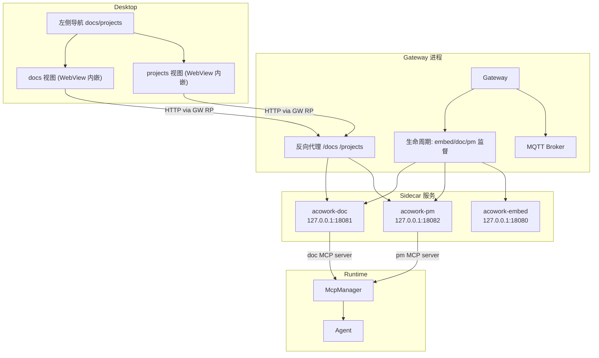

# ACowork 在线文档与项目管理（Agent 协作）需求定义

> 版本：v0.1（草案）| 日期：2026-08-30
>
> 状态：**待评审**
>
> 关联文档：
> - 平台总需求：[`docs/prd/zh/prd.md`](./prd.md)
> - Desktop UI 规格：[`docs/prd/zh/prd-ui-ux.md`](./prd-ui-ux.md)
> - Gateway 设计：[`docs/design/zh/04-gateway.md`](../../design/zh/04-gateway.md)
> - Desktop 设计：[`docs/design/zh/14-desktop-app.md`](../../design/zh/14-desktop-app.md)
>
> **一句话定位**：在 ACowork 平台新增两个左侧导航功能——在线文档（acowork-doc）与项目管理（acowork-pm）。二者参照钉钉/企业微信/飞书等办公软件的文档与项目管理能力，但**核心差异是主要使用对象不完全是人类，而是 Agent**——Agent 既是被管理对象，也是直接读写文档、领取与提交任务的一等公民。

---

## 1. 背景与动机

### 1.1 现状

- 左侧导航栏已预留 `docs`（文档）与 `projects`（项目）两个入口：`NavBar.tsx` 中的 `topNavItems` 已定义图标，`NavView` 类型已含 `"docs" | "projects"`，i18n 文案已就位；但当前 [AppLayout.tsx:897-903](../../../apps/acowork-desktop/src/components/layout/AppLayout.tsx#L897) 渲染的只是 `TODO` 占位。
- 平台已具备成熟的「Gateway 托管 sidecar Web 服务」范式：`acowork-embed` 作为独立二进制由 Gateway 生命周期模块拉起（`core/acowork-gateway/src/lifecycle/embed.rs`），经 SSE 心跳监督（`embed_supervisor.rs`），绑定 `127.0.0.1`，进程日志重定向到 `{data_dir}/logs/`。
- 平台已具备成熟的 Agent 工具注入机制：Runtime 的 `McpManager` 支持连接 MCP 服务器并将工具注入每个 Agent（`core/acowork-runtime/src/tools/mcp_manager.rs`）；每 Agent MCP 配置含 `catalog`（Gateway 托管）+ `local`（Agent 自装）双列表（`core/acowork-runtime/src/agent_config.rs`）。
- Agent 拥有独立工作区（workspace），Runtime 是 workspace 文件的权威所有者，Gateway 提供文件读写代理接口。

### 1.2 动机

1. **补齐桌面端基础办公能力**：完成 `docs` / `projects` 两个导航入口的真实功能，提升平台"Agent 工作台"完整度。
2. **Agent 间知识共享**：目前 Agent 记忆与工作区文件彼此隔离，缺少跨 Agent 共享的文档载体；在线文档提供只读共享（后续可选写协作）的知识库能力。
3. **Agent 任务编排**：目前缺少让人类/系统向 Agent 派发任务、Agent 上报进度的结构化载体；项目管理提供任务的一等公民通道，且 Agent 通过 MCP 工具直接操作，无需人类中转。
4. **能力复用**：两服务复用 embed 的 sidecar 范式与 MCP 注入机制，改动面收敛在 Gateway 生命周期扩展、两个新服务、Desktop 两个视图。

### 1.3 核心差异（与钉钉/飞书对比）

| 维度 | 钉钉/飞书 | ACowork 在线文档/项目管理 |
|------|-----------|--------------------------|
| 主要使用者 | 人类 | **人类 + Agent（Agent 为一等公民）** |
| 文档访问 | 人类浏览器/客户端 | 人类经 Desktop 视图；**Agent 经 MCP 工具** |
| 任务派发 | 人类创建指派给人 | 人类创建指派给 Agent；**Agent 自领/自查/提交** |
| 文档来源 | 手动创建/上传 | **支持从 Agent 工作区 "add to doc" 导入共享** |

---

## 2. 目标与非目标

### 2.1 目标（本版范围）

- 提供**基础版**在线文档：Markdown 的阅读、编辑、渲染（编辑/预览双模式），文档库管理（创建/重命名/删除/列表/搜索）。
- 提供**基础版**项目管理：项目与任务的创建/列表/状态流转（看板式），任务指派对象为 Agent。
- 两个服务均由 Gateway 启动与托管，绑定本地端口，通过 Gateway 反向代理暴露给 Desktop；进程故障可检测、可重启、可观测。
- Agent 具备文档读写与任务操作能力：通过 MCP 工具 `doc_*` / `pm_*` 直接访问两服务，**自动注入到每个 Agent**（经 `catalog` 列表）。
- Desktop 的 `docs` / `projects` 视图接入真实页面（阅读/编辑/看板），替换现有 TODO 占位。

### 2.2 非目标（明确不做）

- ❌ 在线文档 **不支持** Office（.docx/.xlsx/.pptx）的在线编辑与渲染（仅可作为附件/只读占位，后续迭代）。
- ❌ 在线文档 **不做** 实时协同编辑（多人同时光标、CRDT/OT 合并）；并发写采用"最后写入胜出 + 乐观版本号冲突检测"，冲突由读者自行处理。
- ❌ 项目管理 **不做** 甘特图、燃尽图、工时、费用、WBS 等高级排期能力；不做子任务多级树。
- ❌ 两个服务 **不做** 多租户 / 精细权限（可按文档/项目设置 ACL）；本版默认"所有 Agent 共享全部文档/项目"。
- ❌ 不做文档全文搜索的向量化索引（仅标题/内容关键字检索）。
- ❌ 不做与外部系统（钉钉/飞书/GitLab 等）集成。

> 以上非目标均为**本版**边界，将在 §9 作为后续迭代候选列出。

---

## 3. 用户与核心场景

### 3.1 用户角色

| 角色 | 说明 | 典型操作 |
|------|------|----------|
| 人类用户 | Desktop 使用者 | 查看/编辑文档、创建项目与任务、指派 Agent、查看 Agent 提交结果 |
| Agent | 平台一等公民，任务被执行者 + 文档读写者 | 读/写共享文档、领取任务、更新任务进度、提交任务结果 |
| Gateway | 服务托管方 | 拉起/监督 acowork-doc、acowork-pm；注入 doc/pm MCP 配置到每个 Agent |

### 3.2 核心场景

**S1. 人类在文档视图创建并编辑一篇 Markdown 文档**
用户点击左侧 `文档`，进入文档库列表 → 新建文档 → 编辑 Markdown → 预览渲染效果 → 保存。其他人类/Agent 可阅读。

**S2. Agent 将工作区文档共享到在线文档（add to doc）**
Agent 完成分析后调用 `doc_add` 工具，把工作区中某篇 Markdown 文档导入在线文档库，并附来源（agent_id + workspace 路径）。该文档即刻对所有 Agent 与人类可见。人类也可在文档视图手动"添加工作区文档"。

**S3. Agent 阅读共享文档辅助任务**
Agent 接到任务后，调用 `doc_search` / `doc_read` 检索相关共享文档作为上下文，再执行任务。

**S4. 人类创建项目并指派任务给 Agent**
用户进入 `项目` 视图 → 新建项目 → 新建任务（标题、描述、指派 Agent、优先级、截止时间）→ 任务进入看板 ToDo 列。

**S5. Agent 自查任务并提交结果**
Agent 通过 `pm_list_tasks` 查看分配给自己的任务 → 自领任务（状态 InProgress）→ 完成后 `pm_submit_task` 提交结果（结果文本/附件引用）→ 任务进入 Done；人类可在看板查看。

**S6. 服务故障自愈**
acowork-doc / acowork-pm 进程异常退出，Gateway 按指数退避自动重启并上报状态；期间 Desktop 视图显示服务不可用提示而非白屏。

---

## 4. 在线文档（acowork-doc）

### 4.1 定位与组件形态

- 独立 Rust 二进制 `acowork-doc`，axum HTTP 服务，绑定 `127.0.0.1:{doc_port}`（默认 **18081**，可配置）。
- 由 Gateway 生命周期模块拉起与监督，复用 `acowork-embed` 的进程管理范式（子进程 + SSE 心跳 + 指数退避重启）。
- 文档库存储于 Gateway 数据目录 `{data_dir}/docs/`：每篇文档一个 `.md` 文件 + 索引元数据（`library.json`）。文件即存储，KISS、易备份、易迁移。
- 提供两类访问面：
  - **人类面**：静态 Web 前端（随服务内置）+ REST API，由 Gateway 反向代理暴露给 Desktop `docs` 视图（WebView 内嵌）。
  - **Agent 面**：doc MCP Server（stdio 或 HTTP），提供 `doc_*` 工具；Gateway 将 doc MCP 配置注入每个 Agent 的 `catalog` 列表。

### 4.2 功能需求

| 编号 | 需求 | 优先级 | 说明 |
|------|------|--------|------|
| DOC-01 | 文档库列表：分页展示全部文档（标题、作者/来源、更新时间） | P0 | |
| DOC-02 | 新建文档：输入标题创建空 Markdown 文档 | P0 | |
| DOC-03 | 文档读取：返回 Markdown 原文与元数据 | P0 | |
| DOC-04 | 文档编辑：编辑 Markdown 原文并保存 | P0 | 保存采用版本号乐观并发，见 DOC-09 |
| DOC-05 | 文档渲染：Markdown 实时渲染（标题/列表/代码块/表格/图片/链接） | P0 | 编辑/预览双模式，或分屏 |
| DOC-06 | 文档重命名 / 删除（可恢复至回收站） | P1 | 删除先入回收站，30 天后清理 |
| DOC-07 | 文档检索：按标题与内容关键字检索 | P1 | 本版不做向量索引 |
| DOC-08 | 文档浏览历史 / 最近打开 | P2 | |
| DOC-09 | 并发写保护：每文档带版本号（etag），保存携带版本号，冲突返回 409 由调用方决定 | P0 | 多 Agent 并发写场景必需；不做实时合并 |
| DOC-10 | 版本快照：保存时记录历史版本，可回滚 | P2 | |
| DOC-11 | **add to doc**：将 Agent 工作区文档导入文档库 | P0 | 支持 Agent 经 `doc_add` 与人类经 UI 两种入口，见 DOC-12 |
| DOC-12 | add to doc 来源标记：记录来源 agent_id、workspace 相对路径、导入时间 | P0 | 便于溯源与后续同步 |
| DOC-13 | 文档共享可见性：文档库内文档默认对所有 Agent/人类可见 | P0 | 本版全局共享，无 ACL |
| DOC-14 | 文档导入策略：默认**导入快照副本**（导入后与原工作区解耦） | P0 | 后续迭代可选"链接/双向同步"，见 §9 |

### 4.3 Agent 接口（doc MCP 工具）

| 工具 | 参数 | 返回 | 说明 |
|------|------|------|------|
| `doc_list` | `query?` `offset?` `limit?` | 文档摘要列表 | 检索文档库 |
| `doc_read` | `doc_id` 或 `title` | Markdown 原文 + 版本号 + 元数据 | Agent 读取共享文档 |
| `doc_add` | `title?` `content` `source_workspace?` `source_path?` | 新建文档 ID | **add to doc 主入口**；`source_*` 记录来源 |
| `doc_update` | `doc_id` `content` `version` | 新版本号 / 409 | 冲突返回 409 与当前版本 |
| `doc_search` | `keyword` | 命中文档列表 | 关键字检索（doc_read 的检索前置） |

> MCP 工具命名 `doc_*`；Agent 调用与内置工具一致，经 Runtime 现有 McpManager 注入，无需改动 Agent 本体。

### 4.4 文档库存储模型（草案）

```
{data_dir}/docs/
├── library.json          # 索引：{doc_id → 元数据}（标题/版本/来源/时间/回收站标记）
└── content/
    ├── {doc_id}.md       # 文档原文（KISS：一文档一文件）
    └── .versions/        # P2：历史版本快照
```

- `doc_id` 为 UUID 或递增 ID；`library.json` 为权威索引，内容文件为事实来源，二者以索引为主、启动时校验一致。
- 并发：单机单实例，`library.json` 写操作用文件锁 + 原子替换（先写临时文件再 rename）。

---

## 5. 项目管理（acowork-pm）

### 5.1 定位与组件形态

- 独立 Rust 二进制 `acowork-pm`，axum HTTP 服务，绑定 `127.0.0.1:{pm_port}`（默认 **18082**，可配置）。
- 由 Gateway 生命周期模块托管，同 embed / doc 范式。
- 数据存储于 `{data_dir}/pm/`：项目与任务以文件（JSON）+ 内存索引方式管理（KISS，单机单实例）。
- 管理对象为 **Agent**：任务必须指定 assignee（agent_id），状态流转由 Agent 或人类驱动。
- 访问面同 doc：人类经 Desktop `projects` 视图（WebView 内嵌）；Agent 经 **pm MCP Server**。

### 5.2 功能需求

| 编号 | 需求 | 优先级 | 说明 |
|------|------|--------|------|
| PM-01 | 项目列表：展示全部项目（名称、描述、进度概要） | P0 | |
| PM-02 | 新建项目：创建项目并初始化空任务看板 | P0 | |
| PM-03 | 项目详情：项目下任务看板（ToDo / InProgress / Done 三列） | P0 | 看板式展示 |
| PM-04 | 新建任务：标题、描述、**指派 Agent（agent_id）**、优先级、截止时间 | P0 | 指派对象为 Agent |
| PM-05 | 任务状态流转：ToDo → InProgress → Done（含退回） | P0 | 状态机简单线性 + 退回 |
| PM-06 | 任务编辑：修改标题/描述/优先级/截止时间/指派对象 | P1 | |
| PM-07 | 任务列表/检索：按项目、状态、指派 Agent、关键字过滤 | P1 | |
| PM-08 | 任务评论/备注：人类与 Agent 均可追加备注（如进度说明） | P1 | Agent 提交时自动追加一条 |
| PM-09 | 任务删除/归档 | P2 | |
| PM-10 | 项目删除（级联任务） | P1 | 二次确认 |
| PM-11 | 进度统计：项目内各状态任务数、指派给某 Agent 的待办数 | P1 | 供看板头与 Agent 自查 |

### 5.3 Agent 接口（pm MCP 工具）

| 工具 | 参数 | 返回 | 说明 |
|------|------|------|------|
| `pm_list_projects` | — | 项目列表 | |
| `pm_list_tasks` | `project_id?` `assignee?` `status?` | 任务列表 | Agent 自查任务主入口 |
| `pm_claim_task` | `task_id` | 成功/失败 | 自领任务（ToDo → InProgress），仅限指派给该 Agent |
| `pm_update_task` | `task_id` `status?` `note?` | 成功/失败 | 更新状态或追加备注 |
| `pm_submit_task` | `task_id` `result` `attachments?` | 成功/失败 | **提交任务结果**（Done），可附结果文本/附件引用 |
| `pm_create_task` | `project_id` `title` `description?` `assignee?` `priority?` `due?` | 新任务 ID | 允许 Agent 创建任务（可选能力） |

> 安全约束：`pm_claim_task` / `pm_submit_task` 需校验调用者 agent_id 与任务 assignee 一致；`pm_create_task` 是否对 Agent 开放可作为配置项（默认开放，见 §10 开放问题 Q5）。

### 5.4 数据模型（草案）

```jsonc
// {data_dir}/pm/projects/{project_id}.json
{
  "id": "p-001",
  "name": "示例项目",
  "description": "...",
  "created_by": "agent:xxx | human:xxx",
  "created_at": "2026-08-30T10:00:00Z",
  "tasks": [
    {
      "id": "t-001",
      "title": "撰写 PRD",
      "description": "...",
      "assignee": "com.example.agent",
      "status": "in_progress",       // todo | in_progress | done
      "priority": "high",             // low | medium | high
      "due_at": "2026-09-05T00:00:00Z",
      "created_by": "human",
      "created_at": "...",
      "updated_at": "...",
      "notes": [ {"author": "agent:...", "content": "...", "at": "..."} ],
      "result": { "text": "...", "attachments": [...] }  // submit 时写入
    }
  ]
}
```

---

## 6. MCP 集成（两服务共用机制）

### 6.1 集成方案

- 两个服务各自内嵌 MCP Server 端点（stdio 或 HTTP，二者皆可被现有 `McpTransport` 支持）。
- **注入路径**：Gateway 在 Agent 启动/配置推送时，将 `acowork-doc` 与 `acowork-pm` 的 MCP Server 配置追加到该 Agent 的 **`catalog` MCP 列表**（经 `RuntimeConfigUpdate` 下发）。所有 Agent **默认自动获得** `doc_*` 与 `pm_*` 工具，无需逐个 Agent 手工安装——这是与"local 手工安装"的本质区别。
- Runtime `McpManager.connect()` 对配置的 MCP 服务器建立连接并注入工具；连接失败不影响 Agent 启动（跳过并记录日志），见 MCP-04。

### 6.2 需求

| 编号 | 需求 | 优先级 | 说明 |
|------|------|--------|------|
| MCP-01 | Gateway 将 doc/pm 的 MCP Server 配置自动注入每个 Agent 的 catalog 列表 | P0 | 默认启用；允许按 Agent 关闭（复用现有 active_names 机制） |
| MCP-02 | 两服务提供 stdio 与 HTTP 两种 MCP transport 至少其一；推荐同时支持 | P1 | 现有 `McpTransport` 已支持 Stdio/Http/Sse |
| MCP-03 | MCP 工具调用鉴权：doc/pm 服务校验调用方身份 | P1 | 见 §8 安全 |
| MCP-04 | MCP 连接失败降级：Agent 启动不因 doc/pm 不可用而失败 | P0 | 现有 McpManager 行为已满足 |
| MCP-05 | 工具超时与失败语义：doc/pm 调用超时、错误信息透传给 LLM | P1 | 复用现有 `tool_timeout_secs` |

---

## 7. 系统集成与架构概要

### 7.1 组件图



### 7.2 端口与配置

| 服务 | 默认端口 | 配置项（草案） | 说明 |
|------|----------|----------------|------|
| Gateway HTTP | 19876 | `http.port` | 现有 |
| MQTT | 19875 | `mqtt.port` | 现有 |
| LSP Relay | 19878 | `node_lsp_relay_port` | 现有 |
| acowork-embed | 18080 | `embed.port` | 现有 |
| **acowork-doc** | **18081** | `doc.port`（草案） | 新增 |
| **acowork-pm** | **18082** | `pm.port`（草案） | 新增 |

- 两服务默认绑定 `127.0.0.1`，仅经 Gateway 反向代理对外；禁止直接暴露公网。
- Gateway 配置新增 `[doc]` / `[pm]` 小节（草案）：`enabled`、`port`、`mcp_transport`、`auto_inject_mcp` 等。
- 进程日志：`{data_dir}/logs/doc.log` / `pm.log`（复用 embed 的 `init_subprocess_logging`）。

### 7.3 Desktop 集成

- `docs` 视图：文档库列表（左侧）+ 编辑器（WebView 内嵌 acowork-doc 前端，经 Gateway RP 访问 `http://127.0.0.1:19876/docs/*`）。
- `projects` 视图：项目列表 + 看板（WebView 内嵌 acowork-pm 前端）。
- 替换 [AppLayout.tsx:897-903](../../../apps/acowork-desktop/src/components/layout/AppLayout.tsx#L897) 的 TODO 占位为两个真实视图组件。
- 视图内提供服务状态指示（服务离线 → 显示重试/提示，不白屏）。

---

## 8. 非功能需求

| 编号 | 类别 | 需求 | 优先级 |
|------|------|------|--------|
| NFR-01 | 可靠性 | 服务崩溃/卡死可被 Gateway 检测并指数退避重启（复用 embed 监督机制） | P0 |
| NFR-02 | 可靠性 | 服务启动失败不阻塞 Gateway 启动与其它功能 | P0 |
| NFR-03 | 安全性 | 两服务仅绑定 127.0.0.1；外部访问必须经 Gateway 反向代理 | P0 |
| NFR-04 | 安全性 | MCP 工具调用按调用方 agent_id 校验归属（pm 任务、doc 来源） | P1 |
| NFR-05 | 安全性 | 文档内容不落 LLM 上下文限制——与平台既有约定一致（无法技术性阻止，靠约定） | P1 |
| NFR-06 | 数据一致性 | 单机单实例，文件 + 原子替换写；无分布式一致性要求 | P0 |
| NFR-07 | 可观测性 | 服务暴露 `/health`；结构化日志（tracing）；Gateway 状态接口上报 doc/pm 状态 | P1 |
| NFR-08 | 可运维性 | 存储为纯文件，可直接备份/迁移；删除可回滚（回收站/归档） | P1 |
| NFR-09 | 性能 | 单实例支撑 <50 并发文档/任务读写即可（Agent 数量 <10 场景） | P1 |
| NFR-10 | 兼容性 | 新增服务与配置均为增量，不影响现有 Agent 包、协议、升级路径 | P0 |

---

## 9. 边界与后续迭代候选

### 9.1 本版明确不做（见 §2.2）

Office 在线编辑、实时协同编辑、精细 ACL、多租户、排期/甘特图、向量检索、外部系统集成。

### 9.2 后续迭代候选（按优先级）

| 候选 | 说明 | 建议版本 |
|------|------|----------|
| Office 文档（只读渲染 → 在线编辑） | 先只读预览（.docx/.pdf），再迭代编辑 | v1.1+ |
| 文档链接/双向同步（而非快照副本） | add to doc 时可选"链接工作区文件"，双向同步 | v1.1+ |
| 实时协同编辑 | CRDT / OT 或轻量轮询 + 冲突合并 | v2 |
| 文档/项目 ACL | 按文档/项目设置可见范围 | v1.2+ |
| 全文向量检索 | 接入 embed + Grafeo 语义检索 | v1.2+ |
| 任务子任务/依赖 | 多级任务、前置依赖 | v2 |
| Agent 向文档/项目写入的通知 | 经 MQTT 推送变更事件给订阅方 | v1.1+ |

---

## 10. 开放问题（评审需确认）

> 以下问题在评审时需给出结论，结论将固化到正式版本并作为实施依据。

| 编号 | 问题 | 当前倾向 | 影响 |
|------|------|----------|------|
| Q1 | doc/pm 服务的 Web 前端形态：独立静态前端由服务托管（WebView 内嵌） vs Desktop 本地 React 组件直连 REST API？ | 倾向服务托管 + WebView 内嵌（复用 embed 思路、前后端同仓同版本） | 前端技术栈与发布方式 |
| Q2 | add to doc 默认是"快照副本"还是"链接同步"？快照更简单；链接能让 Agent 工作区改动自动反映到共享文档 | 本版快照，链接留 v1.1 | DOC-14 |
| Q3 | doc/pm 的 MCP transport 首选哪种？stdio 需本地拉起子进程，HTTP 更轻量且服务已存在 | 倾向 HTTP（服务常驻） | MCP-02 |
| Q4 | doc MCP 的 `doc_update` 是否允许任意 Agent 改写他人导入的文档？本版全局共享 + 乐观并发已隐含"允许"，是否需要"仅作者可改"的轻量 ACL？ | 本版允许，ACL 留后续 | DOC-13 |
| Q5 | 是否允许 Agent 自行创建任务（`pm_create_task` 默认开放）？开放便于 Agent 自发拆解任务，但可能产生垃圾任务 | 默认开放，可配置 | PM 安全约束 |
| Q6 | 任务指派 Agent 不存在的场景：任务创建时 assignee 校验？还是允许指向任意字符串（agent 未安装时任务悬空）？ | 倾向允许但不强校验，看板提示"未找到该 Agent" | PM-04 |
| Q7 | doc/pm 服务是否需要暴露给"远程节点/Remote Runtime"场景（ADR-055）？远程 Agent 如何访问本地 doc/pm 服务 | 本版仅本机 Agent，远程节点访问留后续 | 集成边界 |
| Q8 | 文档/项目数据目录归属：放在 Gateway `data_dir`（现状倾向）还是独立数据卷？ | 倾向 Gateway `data_dir`，与 embed 一致 | 迁移/备份 |

---

## 11. 建议里程碑

> 以可独立测试的切片推进，每阶段可编译、可回滚。

| 阶段 | 内容 | 交付物 |
|------|------|--------|
| **M0 基础设施** | 新建 `acowork-doc`、`acowork-pm` crate 骨架（axum + /health + CLI + 日志），Gateway 生命周期接入拉起/监督/重启，配置项 `[doc]` `[pm]`，端口常量与冲突检测 | 两服务可起停，Gateway 可监督 |
| **M1 文档库核心** | 文档库存储（library.json + .md）、REST API（列表/新建/读/写/版本号并发）、Markdown 渲染前端（编辑/预览）、Desktop docs 视图接入（替换 TODO） | 人类可完整使用基础在线文档 |
| **M2 项目管理核心** | pm 数据模型与 REST API（项目/任务/状态机/备注/结果）、看板前端、Desktop projects 视图接入 | 人类可完整使用基础项目管理 |
| **M3 Agent 接口（MCP）** | doc MCP Server（doc_list/read/add/update/search）、pm MCP Server（pm_* 工具）、Gateway 自动注入 catalog 列表、身份校验（agent_id） | Agent 可读写文档、自查与提交任务 |
| **M4 打磨与验证** | 端到端测试（人类建任务 → Agent 领/交 → 看板刷新；Agent add to doc → 人类可见）、并发写 409 验证、故障重启验证、文档与 ADR 落档 | 全链路可用 |

---

## 附录 A：需求编号索引

- `DOC-01 ~ DOC-14`：在线文档功能（§4.2，含 add to doc 需求 DOC-11/12/14）；doc MCP 工具见 §4.3
- `PM-01 ~ PM-11`：项目管理功能（§5.2）；pm MCP 工具见 §5.3
- `MCP-01 ~ MCP-05`：MCP 集成（§6.2）
- `NFR-01 ~ NFR-10`：非功能需求（§8）
- 需求进入实施阶段后，需在平台总需求 `prd.md` 中登记并分配正式编号段，避免与现有 `PKG-* / RUN-* / TOL-*` 冲突。
