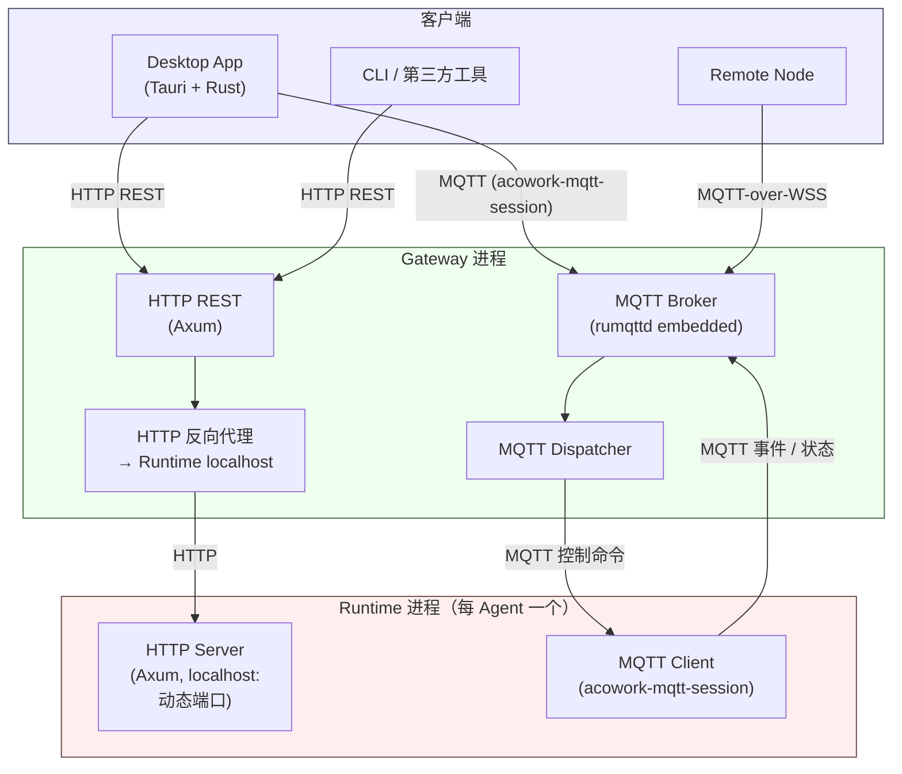

# ACowork 平台需求定义

> 版本：v1.6 | 更新日期：2026-08-15
>
> 本文档从设计文档（01~19）和设计对话中反向提取需求，作为平台功能的权威需求来源。设计文档描述"怎么做"，本文档描述"做什么"和"为什么"。
>
> **v1.6 变更说明**：
> 1. 与当前代码实现对齐（工具清单、Crate 数量、GUI 实际结构、通信协议实际形式）
> 2. 第 7 章 ADR 段迁出至独立 [`docs/adr/zh/`](../../adr/zh/) 目录
> 3. 新增附录 A「待实现需求」——本章列出本 PRD 中已记录但当前代码尚未实现的需求

---

## 0. 项目定位

ACowork 是一个"**Agent as APP**"平台。核心隐喻借鉴 Android：Agent 如 APK 是声明式包，Agent Runtime 如 ART 是统一执行引擎，Gateway 如 AMS 管理生命周期。

**平台双定位——ACowork 同时服务于两类用户：**

| 用户角色 | 使用方式 | 核心价值 |
|---------|---------|---------|
| **终端用户** | 从仓库安装 Agent，配置 API Key，直接使用 | 开箱即用的 AI 能力、隐私安全的分享机制、多 Agent 协作 |
| **Agent 开发者** | 编写 manifest + prompt + SKILL.md，签名发布 | 零门槛开发（无需写代码）、完整调试工具链、可分发生态 |

声明式包格式（manifest.toml + prompts + skills + 工具声明，不含可执行文件）是双定位的技术基础——对开发者，它足够表达复杂能力；对终端用户，它足够安全（Gateway 安装时强制签名验证）。

开发者工具链完整覆盖：`acowork-sign`（含 `keygen / sign / verify` 子命令）签名工具链 → Desktop App DevMode（单步调试、断点；**录制回放**待 Phase 6）→ 发布向导 → **远程仓库分发待 Phase 6**（PKG-08/08a/09）。SKILL.md **热加载未实现**（DEV-06），修改 SKILL.md 需重启 Agent。

**目标用户**：个人用户和小团队，以及企业用户。核心差异在于企业用户可以在 Agent 中接入自己部署的 RAG 知识库，实现企业级知识增强。

**核心价值主张**：

- **声明式 Agent 包**——零代码、可分发、可签名验证（开发者友好 + 安全底线）
- **开发者友好**——manifest + prompt + SKILL.md 即可构建 Agent，Desktop App DevMode 提供完整调试闭环
- **进程级隔离**——每个 Agent 独立运行、互不干扰
- **仿生记忆**——Agent 拥有分层记忆系统，能记住、能遗忘、能学习
- **跨 Agent 协作**——通过 Intent 机制实现 Agent 间通信
- **隐私安全分享**——Agent 可自由分享给他人，Personal/Sensitive 数据自动剥离，只带走"Agent 能力"而非"用户记忆"
- **跨平台**——同一 .agent 包在 Windows / Linux / macOS 三端桌面运行（移动端 PLT-03 / PLT-05 待 Phase 7）
- **企业级扩展**——通过标准 RAG 接口接入企业知识库，无需平台托管数据

---

## 1. 功能需求

### 1.1 Agent 打包与分发

| 编号 | 需求 | 优先级 | 说明 |
|------|------|--------|------|
| PKG-01 | Agent 以 `.agent` 压缩包分发，内含配置、Prompt、Skill、工具声明，**不含可执行文件** | P0 | 声明式打包是平台核心前提 |
| PKG-02 | .agent 包必须签名，Gateway 安装时强制验证完整性和来源 | P0 | 安全底线 |
| PKG-03 | 支持两类签名身份：Developer（自签名）和 Platform（平台签发） | P0 | Phase 1 最小签名模型 |
| PKG-04 | 系统 Agent 必须由 Platform Key 签名 | P0 | 防止伪装系统 Agent |
| PKG-05 | Agent 升级时签名证书指纹必须与已安装版本一致 | P0 | 防止恶意包覆盖 |
| PKG-06 | 提供签名工具链（`acowork-sign` 含 `keygen / sign / verify` 子命令） | P1 | 开发者自签流程 |
| PKG-07 | 提供 Debug 签名模式（本地开发自动签名） | P1 | 降低开发门槛 |
| PKG-08 | 支持远程仓库（多 HTTP 源、定期检查更新） | P2 | 生态分发——**未实现**，Phase 6 计划 |
| PKG-08a | 仓库上架安全扫描：六维度自动化扫描（Manifest/Prompt/Skill/WASM/Grafeo/结构），判定 Pass/Warn/Reject | P2 | 发布侧安全关卡——**未实现**，依赖 PKG-08 |
| PKG-09 | 支持双密钥模型（Upload Key + Distribution Key） | P3 | 商店分发阶段——**未实现**，Phase 6+ |
| PKG-10 | 支持密钥轮换（Proof-of-Rotation） | P3 | 长期运维——**未实现**，Phase 6+ |
| PKG-11 | 支持证书吊销列表（CRL） | P3 | 安全事件响应——**未实现**，Phase 6+ |

### 1.2 Agent 包格式

| 编号 | 需求 | 优先级 | 说明 |
|------|------|--------|------|
| FMT-01 | manifest.toml 用纯 TOML 格式（机器配置文件） | P0 | Rust 生态友好 |
| FMT-02 | SKILL.md 用 YAML frontmatter + Markdown body；解析器已实现（`core/acowork-runtime/src/skills/parser.rs`）；完整 agentskills.io 字段兼容（SKL-02）待 Phase 3 | P0 | 复用社区技能生态 |
| FMT-03 | manifest 中声明权限、LLM 配置、工具、能力、触发器 | P0 | 声明式包的核心 |
| FMT-04 | manifest 中声明平台兼容性（target_platforms），支持 required/optional 模式 | P1 | 跨平台降级 |
| FMT-05 | manifest 中声明 identity_deps，启动时由 Gateway 注入身份信息 | P1 | 跨 Agent 身份一致 |
| FMT-06 | 包大小上限 50 MB | P1 | Gateway HTTP 多部分请求有 64 MiB 全局上限（`routes::GLOBAL_BODY_LIMIT`）；**安装时的 .agent 包 50 MB 硬性上限当前未在代码中强制**，依赖人工校验 |
| FMT-07 | skills/references/ 仅允许不可执行的数据文件 | P1 | 安全约束 |

### 1.3 Agent Runtime（统一执行引擎）

| 编号 | 需求 | 优先级 | 说明 |
|------|------|--------|------|
| RUN-01 | Agent Runtime 是平台唯一二进制，加载 .agent 包并执行 | P0 | 统一引擎，零自定义代码 |
| RUN-02 | Agent Runtime 直连 LLM API，不经 Gateway 代理 | P0 | 低延迟、流式、自治 |
| RUN-03 | Agent Runtime 自主执行工具调用，自主校验权限 | P0 | Agent 自治原则 |
| RUN-04 | 支持多 LLM Provider 配置和路由策略（cost/quality/latency priority） | P1 | 成本和场景灵活性 |
| RUN-05 | 支持预算管理（Token 限额、费用限额、超限动作） | P1 | 防超支 |
| RUN-06 | 支持 LLM fallback（主 Provider 失败时自动切换备用） | P1 | 可靠性 |
| RUN-07 | 支持流式输出 + tool_calls 并发处理（检测到 tool_calls 立即中断 streaming） | P0 | 用户体验和正确性 |
| RUN-08 | 循环检测（Exact Repeat / Ping-Pong / No Progress）+ 三级渐进响应 | P0 | 防死循环 |
| RUN-09 | 上下文溢出恢复（Preemptive Trim + Reactive Recovery） | P0 | 大上下文场景必需 |
| RUN-10 | Tool Call 单轮去重（防止单次响应内重复调用同一工具） | P1 | 常见 LLM 行为修正 |
| RUN-11 | Tool Result 折叠（保留最近 4 轮完整结果，更早的折叠为摘要） | P1 | 上下文空间优化 |
| RUN-12 | Rate Limit 分层处理（可重试限流 vs 不可重试余额不足） | P1 | API 调用健壮性 |
| RUN-13a | 高风险工具 Approval Gate（Runtime 侧逻辑 + CLI fallback） | P1 | Phase 1 安全底线——shell/file_write 等高风险工具必须有拦截机制；CLI 模式按 manifest 配置的 approval_fallback 策略处理（默认 deny） |
| RUN-13b | Approval Gate Desktop App 确认流程（Gateway → Desktop App 转发） | P2 | 需要 Desktop App + HTTP API 端点，Phase 3 随 Desktop App 一起交付 |
| RUN-14 | 支持 API Key 轮换（多 Key 集中管理，Vault 分发） | P2 | 企业场景 |

### 1.4 Memory 系统

| 编号 | 需求 | 优先级 | 说明 |
|------|------|--------|------|
| MEM-01 | 每个 Agent 拥有完全独立的私有 Grafeo，不存在公共数据库 | P0 | 数据隔离底线 |
| MEM-02 | 三层五类仿生分层：瞬态层（工作记忆）→ 经历层（情景记忆）→ 沉淀层（语义+程序+自传体） | P0 | 仿生记忆架构 |
| MEM-03 | 即时提取：LLM 通过 memory_store 工具自主判断是否存储，零额外 API 成本 | P0 | 记忆积累的核心机制 |
| MEM-04 | 遗忘机制：分级衰减模型 — ①后台定期扫描（`run_decay_scan`）计算 decay_score = importance × activity_signal，低于阈值的节点 Active→Dormant；②Dormant 节点超期后自动 Purge；③容量压力触发 eviction（按 decay_score 最低优先）。后台扫描非阻塞，由 Gateway Cron 调度，扫描粒度按 label 分批 | P1 | 防止记忆膨胀 |
| MEM-05 | 关联扩散检索：1-2 跳图扩展，支持跨层（经历层↔沉淀层） | P1 | 检索质量 |
| MEM-06 | 自传体记忆：六维度自我认知，从 manifest 自动派生，注入 System Prompt | P1 | Agent 自我认知 |
| MEM-07 | 程序记忆：跨 Skill 的通用行为模式 | P2 | 自学习能力 |
| MEM-08 | 隐私分级：PrivacyLevel（Public/Personal/Sensitive），LLM 自动判断。控制的是"数据打包分享时是否包含该节点"——Personal/Sensitive 节点在 Agent 分享导出时剥离，Public 节点保留。LLM 上下文中的数据无法从技术上访问控制，只能通过 prompt 约定约束 | P1 | 打包边界隐私保护 |
| MEM-09 | 离线巩固：空闲时触发专用 LLM 调用，将经历层提炼到沉淀层 | P3 | 记忆质量提升——`acowork-grafeo/src/consolidation/`（`offline.rs` / `scheduler.rs` / `generalization.rs` / `triple_extraction.rs`）已有骨架与调度框架；Runtime 侧 `memory/consolidation_bg.rs` 提供 `ConsolidationBgTask` 接入点。完整 LLM 驱动的离线巩固仍待 Phase 6 激活 |
| MEM-10 | Grafeo 全 Zone 跨设备完整同步（平台明文托管，多设备体验一致）。enterprise Zone 改名为 work Zone（个人工作记忆，与企业 RAG 无关）。隐私分级与同步策略完全解耦——PrivacyLevel 控制打包边界（分享时 Personal/Sensitive 数据是否剥离），Zone 仅作为打包边界的语义标记，不影响同步范围 | P1 | 多设备同步——MemoryStore 当前仅本地（Grafeo 文件位于 `{agent_home}/data/grafeo/`），**云端同步尚未实现**。Cloud Sync 与企业级 MemStore 计划 Phase 6 一并实现 |
| MEM-11 | 内容分类压缩：工件性内容（代码/文件/命令输出）仅存摘要 + ArtifactRef 引用 | P1 | 防 Grafeo 膨胀 |
| MEM-12 | Embedding 生成：Ollama local（`/api/embed`）→ Remote API（`/embeddings`）降级链，`MemoryManager.retrieve()` 内部 200ms 超时自动生成 | P1 | 向量检索前提 |

### 1.5 工具系统

| 编号 | 需求 | 优先级 | 说明 |
|------|------|--------|------|
| TOL-01 | 内置工具集（**16 个核心工具 + 4 个条件工具**，实际数随配置变化 16~22） | P0 | Agent 感知和操作世界的基本能力。实际清单见下表 |
| TOL-02 | 支持 WASM 自定义工具（Wasmtime 沙箱执行） | P2 | 可扩展性——WASM 模块代码已落地但仅 feature-gated（`wasm-tools` feature），**未注册到任何 Agent 内置工具列表**；Phase 6 之前默认不启用 |
| TOL-03 | WASM 工具资源限制（max_memory_mb, max_execution_time_ms, Fuel metering） | P2 | 安全隔离——随 WASM 工具一起在 Phase 6 交付 |
| TOL-04 | API Key 对 WASM 工具不可见（secrecy::SecretString） | P2 | 安全底线——随 WASM 工具一起在 Phase 6 交付 |
| TOL-05 | 工具权限校验：所有工具调用需匹配 manifest 声明的权限 | P0 | 安全底线 |
| TOL-06 | 平台支持矩阵：shell 仅桌面端，文件操作移动端受限 | P1 | 跨平台适配 |
| TOL-07 | Skill 级联降级：依赖的 tool 不可用时 skill 自动降级 | P2 | 优雅降级 |
| TOL-08 | WASM 运行时选型：Wasmtime（桌面端），Wasmi（移动端/iOS 禁 JIT） | P2 | 跨平台——随 WASM 工具一起在 Phase 3 交付 |
| TOL-09 | WASI Preview 2（目录级沙箱 + 能力安全） | P2 | 安全沙箱——随 WASM 工具一起在 Phase 3 交付 |
| TOL-10 | 内置工具范围仅限平台基础设施级，SaaS 集成由独立 Agent 提供 | P1 | 架构边界 |

#### 1.5.1 实际内置工具清单

| # | 工具 | 类型 | 权限 | 说明 |
|---|------|------|------|------|
| 1 | `memory_recall` | core | `memory:read` | 检索记忆 |
| 2 | `memory_store` | core | `memory:write` | 写入记忆 |
| 3 | `http_request` | core | `network:<url>` | HTTP 请求 |
| 4 | `web_fetch` | core | `network:<url>` | URL → 文本（带超时） |
| 5 | `web_search` | conditional | `search:web` | 仅当至少配置一个搜索 Provider 时注册 |
| 6 | `shell` | core × N | `filesystem:exec` | 按平台检测的 shell 工具集（Windows: bash + PowerShell，Unix: system shell） |
| 7 | `file_read` | core | `filesystem:read:<path>` | 读文件 |
| 8 | `file_write` | core | `filesystem:write:<path>` | 写文件 |
| 9 | `file_edit` | core | `filesystem:write:<path>` | 编辑文件 |
| 10 | `doc_reader` | core | `filesystem:read:<path>` | PDF / DOCX / XLSX / PPTX 文本提取 |
| 11 | `glob_search` | core | `filesystem:read:<path>` | glob 文件查找 |
| 12 | `content_search` | core | `filesystem:read:<path>` | ripgrep 文本搜索 |
| 13 | `intent_send` | core | `intent:send:<target>` | 跨 Agent Intent（MQTT 通道） |
| 14 | `ask_user_question` | core | （无） | LLM 主动询问用户（不受权限校验） |
| 15 | `todo_write` | core | （无） | 结构化 TODO 列表维护 |
| 16 | `mcp_install` / `mcp_uninstall` | core | （受 manifest 声明） | MCP Server 动态挂载（ADR-029） |
| 17 | `rag_query` | conditional | `rag:query + network:<rag_url>` | 企业 RAG 接入，仅当 manifest 声明 `[[tools]] type = "rag"` 时注册（ADR-051 / Phase 4） |
| 18 | `context_retrieve` | conditional | `context:read` | 平台受保护，按 `tool_compression_enabled` 配置注册（ADR-052） |
| 19 | `context_abandon` | conditional | `context:write` | 平台受保护，同上 |
| 20 | `codebase` | conditional | `filesystem:read:<path>` | LSP 索引查询，仅当 LSP Relay 可达时注册 |

**要点**：

- 身份管理不暴露为独立工具 API：身份查询由 Gateway 的 `UserProfile`（`/api/users`）承载，`acowork-system` 通过普通 `memory_recall` / `memory_store` 暴露。
- 实际工具数随配置变化：核心 16 + `web_search` + `rag_query` + `context_retrieve`/`context_abandon` + `codebase` = 16 ~ 22。
- WASM 工具不在此清单：模块代码已实现（`core/acowork-runtime/src/tools/wasm/`），但 `wasm-tools` feature 默认未开启，**没有任何 Agent 使用 WASM 工具**——TOL-02~04 / TOL-08~09 在 Phase 6 之前实际不可用。

### 1.6 Skill 系统

| 编号 | 需求 | 优先级 | 说明 |
|------|------|--------|------|
| SKL-01 | 双层模型：SKILL.md（静态定义层）+ Grafeo（动态经验层）——Phase 2 完成 SKILL.md 解析，agentskills.io 兼容延期至 Phase 3 | P0 | Skill 架构基础 |
| SKL-02 | SKILL.md 兼容 agentskills.io 开放标准 | P2 | 复用社区技能——延期至 Phase 3 |
| SKL-03 | 调试流程：Agent 在 Grafeo 中创建草稿 → Debug 模式试运行 → 用户确认 → 提交到 SKILL.md | P2 | Skill 开发闭环——依赖 Debug Protocol（Phase 5），建议 Phase 2 末提供简易 SKILL.md 热加载 |
| SKL-04 | 自学习闭环：发布后积累经验，经验达到阈值时提示用户更新 SKILL.md | P2 | 持续改进 |
| SKL-05 | 模型兼容性：SkillExecution 记录模型信息，SkillExperience 按模型聚合，运行时自动注入适配指令 | P2 | 跨模型可移植 |

### 1.7 Gateway

| 编号 | 需求 | 优先级 | 说明 |
|------|------|--------|------|
| GTW-01 | Gateway 纯基础设施定位，零业务逻辑，不维护任何业务数据库 | P0 | 架构原则 |
| GTW-02 | 包管理：安装（含签名验证）、卸载、升级、版本管理 | P0 | Agent 生命周期起点 |
| GTW-03 | 生命周期管理：启动/停止/重启 Agent 进程，健康检查 | P0 | Agent 运行保障 |
| GTW-04 | Intent 路由：跨 Agent 消息转发 + Capability Registry | P1 | Agent 协作基础 |
| GTW-05 | Key Vault：加密存储 API Key，一次性分发，不通过环境变量 | P0 | 安全底线 |
| GTW-06 | 预算追踪：接收 Agent 上报，超限信号 | P1 | 成本控制 |
| GTW-07 | 速率限制：令牌分配，跨 Agent 共享资源协调 | P1 | API 调用公平性 |
| GTW-08 | HTTP API（Axum，端口 19876）：供 Desktop App / CLI 使用 | P0 | 管理面接口——含 agents / vault / config / skills / users / nodes / publish / memory / embedding / mcp / cron / fs / workspaces / global-resources / proxy / debug-mqtt / settings 等子路由 |
| GTW-10 | 定时触发器（cron 解析） | P0 | 定时任务——5 字段 cron + 时区 + 重试 + max_runs + expires_at，HTTP 路径 `/api/agents/{id}/cron` |
| GTW-11 | Gateway CLI 二进制：命令行管理 Agent | P1 | 无 GUI 场景 |
| GTW-12 | 冷启动身份注入：启动 Agent 前向系统 Agent 查询 identity_deps 并注入 | P1 | 身份一致性——Phase 2 已实现 |

### 1.8 系统 Agent

| 编号 | 需求 | 优先级 | 说明 |
|------|------|--------|------|
| SYS-01 | 系统 Agent 随 Gateway 分发，不可卸载，自动启动 | P0 | 系统级服务 |
| SYS-02 | 身份信息由 Gateway 的 `UserProfile` HTTP API（`/api/users`）统一管理；`acowork-system` 仅作为启动时的入口 Agent | P0 | 跨 Agent 身份一致——不暴露 `identity:query` / `identity:observe` Intent 接口（已从 system-agent manifest 删除） |
| SYS-03 | 接收身份提报，用 LLM 做二次判断（替代用户确认弹窗） | P3 | 自动化决策——当前身份确认直接由 Gateway `createUser` / `updateUser` 同步落库，**无 LLM 二次判断**，待 Phase 6 |
| SYS-04 | 默认交互入口——无第三方 Agent 时的唯一界面 | P1 | 首次使用体验 |
| SYS-05 | observe 通知机制——身份变更时通知订阅 Agent | P2 | **未实现**——身份变更通过 HTTP 落库后未主动推送订阅方，需要订阅方轮询 UserProfile |
| SYS-06 | 必须 Platform 签名，享有系统特权 | P0 | 安全底线 |

### 1.9 通信协议

#### 1.9.1 协议栈总览

平台使用 **HTTP REST + MQTT** 两套传输协议，跨三类链路（Desktop ↔ Gateway ↔ Local Runtime，Gateway ↔ Remote Node）。

**三平面 + 三段链路**：

| 平面 | 传输 | 用途 |
|------|------|------|
| **控制面 / Control** | MQTT 主题（QoS 1） | 用户操作触发的状态变更、实时双向控制命令 |
| **数据面 / Data** | HTTP REST（含 Gateway 反向代理） | 启动期全量加载、批量读、文件操作、大体积数据 |
| **事件面 / Event** | MQTT 主题（QoS 0~1） | 流式 chunk、状态变更推送、异步通知 |

| 段 | 链路 | 协议 |
|----|------|------|
| **L1** | Desktop / CLI ↔ Gateway | HTTP REST + MQTT |
| **L2** | Gateway ↔ Local Runtime | MQTT（主）+ HTTP 反代到 Runtime 自绑 localhost 端口 |
| **L3** | Gateway ↔ Remote Node | MQTT-over-WSS + HTTP REST 反代 |

> 传输归属判定遵循 ADR-034 三条规则：同一语义只用一条传输；用户操作触发的状态变更一律走 MQTT；Gateway 不直接访问 Runtime 本地文件，统一通过 HTTP 反代。

#### 1.9.2 协议需求矩阵

| 编号 | 需求 | 优先级 | 落地 |
|------|------|--------|------|
| COM-01 | 协议栈统一为 HTTP REST + MQTT；不使用 WebSocket、gRPC、Socket IPC | P0 | 架构一致性（历史背景见 ADR-031 / ADR-033） |
| COM-02 | 控制面走 MQTT 主题 `acowork/agents/{id}/sessions/control/{cmd}`（cmd 集合：`chat_message` / `stop` / `model_switch` / `open_session` / `enable_notify` / `disable_notify` / `close_session` / `compress_action` / `workspace_switch` / `approval_decision` / `question_answer` / `continue_execution` / `update_session_title` / `intent`） | P0 | Desktop → Runtime 经 Gateway broker |
| COM-03 | 事件面走 MQTT 主题 `acowork/agents/{id}/sessions/{sid}/messages/{event_type}`（event_type 集合：`stream_delta` / `tool_call` / `tool_result` / `stream_end` / `error` / `state`）+ Agent 级 `/status` / `/ready` / `/meta` / `/config` / `/http_endpoint` | P0 | Runtime → Desktop 经 Gateway broker |
| COM-04 | 数据面走 HTTP REST：启动期加载、批量读、文件上传、大体积数据；Gateway 通过 HTTP 反向代理把 `/api/agents/{id}/sessions[/{sid}[/messages|/documents]]` 等路径透传到 Runtime 自绑的 localhost HTTP server | P0 | Gateway HTTP 反代 + Runtime HTTP server |
| COM-05 | Gateway ↔ Remote Node：MQTT-over-WSS + HTTP REST 反代（`/api/fs/browse?target={node_id}` 等） | P1 | 远程节点拓扑 |
| COM-06 | Debug Protocol：MQTT 订阅 `acowork/agents/{id}/debug/events` 拿事件流；HTTP RPC `POST /api/agents/{id}/debug-rpc` 调命令（body: `{method, params}`，Gateway 反代到 Runtime `/debug/rpc`）；已实现 10 个 handler（resume / pause / step / stop / getState / getContextSnapshot / getSection / rewind / patchContext / reExecute） | P2 | DevMode 调试 |
| COM-07 | 全局资源：启动期 `GET /api/bootstrap` + `GET /api/global-resources` 全量加载；增量变更走 MQTT `acowork/global/resources` retained 主题 | P1 | 启动期 + 增量订阅 |
| COM-08 | 协议 ACL 与多用户隔离：rumqttd CONNECT 层认证 + 主题级 ACL（`{user_id}/{active_user_id}` 前缀）+ TLS（远程节点场景） | P0 | 安全底线 |
| COM-09 | 协议版本协商：MQTT CONNECT packet `properties.protocol_version`；HTTP 端点保留 `/api/v{N}/` 升级路径（当前 `/api/`，Phase 7 启用 `/api/v2/`） | P2 | 演进兼容 |
| COM-10 | 敏感数据（API Key、Vault Secret、PII）禁止走 MQTT，仅在 localhost HTTP（127.0.0.1）传递；MQTT 主题 payload 仅含业务元数据 | P0 | 安全底线 |

#### 1.9.3 实际部署的 MQTT 主题清单

| 主题 | 方向 | QoS | 说明 |
|------|------|-----|------|
| `acowork/agents/{id}/sessions/control/{cmd}` | Desktop → Runtime | 1 | 控制命令（COM-02 完整 cmd 集合） |
| `acowork/agents/{id}/sessions/{sid}/messages/{event_type}` | Runtime → Desktop | 0~1 | 流式事件（COM-03） |
| `acowork/agents/{id}/status` | Runtime → Gateway | 1 (retained) | 在线状态（online/offline/busy） |
| `acowork/agents/{id}/ready` | Runtime → Gateway | 1 | 启动就绪信号 |
| `acowork/agents/{id}/http_endpoint` | Runtime → Gateway | 1 (retained) | 注册 localhost HTTP 端口（反代目标） |
| `acowork/agents/{id}/config` | Gateway → Runtime | 1 (retained) | 配置变更（Provider / Vault Key 切换） |
| `acowork/agents/{id}/meta` | Runtime → Gateway | 1 (retained) | Agent 元数据快照 |
| `acowork/agents/{id}/workspaces/{wid}/fs-changed` | Runtime → Desktop | 1 | 工作区文件变更 |
| `acowork/agents/{id}/debug/events` | Runtime → Desktop | 1 | Debug 事件流 |
| `acowork/global/resources` | Gateway → Desktop | 1 (retained) | 全局资源快照（Provider / Search / MCP） |
| `acowork/intent/{target}` | Runtime → Runtime | 1 | 跨 Agent Intent 消息 |

完整主题矩阵参见 [ADR-034 §11.2](docs/adr/zh/ADR-034-mqtt-http-boundary.md)、[ADR-048](docs/adr/zh/ADR-048-debug-protocol-mqtt-http.md)、[ADR-055](docs/adr/zh/ADR-055-remote-runtime-node-topology.md)。

#### 1.9.4 实际部署的 HTTP 端点类别

| 类别 | 路径模式 | 说明 |
|------|---------|------|
| 健康 / 状态 | `GET /health`, `GET /api/status`, `GET /api/bootstrap` | 启动期 |
| Agent 管理 | `GET/POST/DELETE /api/agents[/{id}[/start\|/stop\|/clone\|/upgrade\|/install\|/manifest]]` | Agent 生命周期 |
| 数据面（反代） | `GET /api/agents/{id}/sessions`, `GET /api/agents/{id}/sessions/{sid}/messages`, `POST /api/agents/{id}/sessions/{sid}/documents` | Gateway 反代到 Runtime localhost |
| 调试 | `POST /api/agents/{id}/debug-rpc` | Debug RPC（COM-06） |
| 配置 / Vault / Provider / Skills / Cron / Users / Nodes | `/api/config`, `/api/vault/*`, `/api/providers`, `/api/agents/{id}/skills`, `/api/agents/{id}/cron`, `/api/users`, `/api/nodes` | 配置面 |
| 全局资源 | `GET /api/global-resources` | 启动期全量 |
| 远程节点 | `GET /api/fs/browse?target={node_id}&path=...` | 反代到远程节点 |
| MQTT 调试 | `POST /api/debug/mqtt/{start,shutdown}` | 运维 |

完整端点矩阵参见 [ADR-034 §11.1](docs/adr/zh/ADR-034-mqtt-http-boundary.md)。

> **维护约定**：协议新增（无论是 MQTT 新控制命令还是 HTTP 新端点）须同步更新 ADR-034 / ADR-048 / ADR-055 协议矩阵 + `prd.md` §1.9 + `prd-ui-ux.md` §11，避免三处文档脱节。

### 1.10 安全

| 编号 | 需求 | 优先级 | 说明 |
|------|------|--------|------|
| SEC-01 | 进程级隔离——每个 Agent 独立进程，一个崩溃不影响其他 | P0 | 稳定性底线 |
| SEC-02 | 文件系统隔离——Agent 只能写入自己的工作区和授权目录 | P0 | 数据安全 |
| SEC-03 | 网络隔离——默认禁止网络，仅按 manifest 授权白名单 | P1 | 最小权限 |
| SEC-04 | 权限声明——manifest 必须声明所有权限，未声明不可用 | P0 | 最小权限原则 |
| SEC-05 | WASM 工具沙箱——无法访问宿主内存、文件系统、网络 | P0 | 自定义代码隔离——Wasmtime + WASI Preview 2 模块代码已实现（`wasm-tools` feature-gated），但**未启用到任何 Agent 内置工具列表**（参见 §1.5.1），TOL-02~04/08~09 在 Phase 6 之前实际不可用 |
| SEC-06 | 沙箱强化——Linux 使用 bubblewrap + seccomp-bpf | P2 | 深度隔离——延后至 Phase 7（ADR-007） |
| SEC-07 | API Key 不通过环境变量分发，通过 Socket 一次性传输 | P0 | 防 ps/procfs 泄露 |
| SEC-08 | Shell 命令风险分级 + 文件来源追踪（FileProvenance）+ 审计日志 | P3 | Runtime 层 Shell 安全防线——延期至 Phase 3 |
| SEC-09 | Agent 仓库上架安全扫描：Manifest 合规性 + Prompt/Skill 行为分析 + WASM 二进制扫描 + Grafeo 记忆扫描 + 包结构合规 | P2 | 发布侧安全关卡，与运行时防御形成纵深 |

### 1.11 Desktop App

| 编号 | 需求 | 优先级 | 说明 |
|------|------|--------|------|
| DSK-01 | Desktop App 与 Gateway 独立进程，通过 Gateway HTTP REST + MQTT 通信 | P1 | 架构一致性 |
| DSK-02 | 对话界面：消息收发、流式输出、工具调用展示 | P1 | 核心交互——详见 `apps/acowork-desktop/src/components/chat/ChatPanel.tsx` |
| DSK-03 | Agent 管理界面：安装、卸载、启停、列表、克隆、创建（含 Create Wizard / Clone Dialog / AgentDetailDialog） | P1 | Agent 生命周期管理 |
| DSK-04 | 设置页面（5 Tab：profile / general / appearance / gateway / nodes）；Provider 与 Vault 在 Harness 视图管理 | P1 | 配置管理 |
| DSK-05 | 系统托盘：关闭窗口隐藏到托盘不退出，显示 Gateway 连接状态（5 种状态：Connected / Agents Running / Working / Disconnected / Error） | P2 | 桌面体验——`apps/acowork-desktop/src-tauri/src/tray.rs` |
| DSK-06 | 开发者模式：Developer Mode toggle 切换；调试面板 + 断点（`enable_agent_debug` / `disable_agent_debug` Tauri 命令）；**录制回放**待 Phase 6 | P2 | 开发调试——Debug 面板位于右侧 nav `debug` Tab |
| DSK-07 | 发布向导（PublishWizard）、克隆（CloneDialog）、创建向导（CreateWizard）；Skill / Manifest 无独立编辑器，需通过 Workspace 文件树 + `file_edit` 工具 + 文件级元数据面板编辑 | P3 | 开发工具链 |
| DSK-08 | 首次启动引导流程 | P2 | 用户引导——5 步：欢迎 → Gateway 连接 → Provider 配置 → 身份信息 → 推荐 Agent 安装 |

### 1.12 跨平台

| 编号 | 需求 | 优先级 | 说明 |
|------|------|--------|------|
| PLT-01 | .agent 包格式和 Gateway Service API 合同跨平台统一 | P0 | 平台无关性 |
| PLT-02 | 桌面端（Windows/Linux/macOS）完整支持 | P1 | Phase 1 目标 |
| PLT-03 | 移动端（Android/iOS）降级运行（SingleProcess 模式、Local TCP、wasmi） | P3 | 远期目标 |
| PLT-04 | 各平台传输层实现不同（Unix Socket / Named Pipe / Local TCP），但不影响包兼容性 | P1 | 实现层差异 |
| PLT-05 | 移动端能力降级：shell 不可用、文件操作路径收窄、Skill 级联降级 | P2 | 优雅降级 |
### 1.13 企业 RAG 集成

> 企业级 Agent 不是 ACowork 平台内置的能力，而是 Agent 开发的一种范式——Agent 开发者通过标准 RAG 接口对接企业知识库，用户感知到的只是一个普通的 Agent。

**设计原则**：

- **纯对接，不托管**：ACowork 不运营 RAG 服务，知识属于企业自己；ACowork 定义标准查询协议（请求/响应 JSON Schema），企业 RAG 自行适配此协议，ACowork 不为各家 RAG 系统实现 adapter
- **隔离优先**：本地 Grafeo（个人记忆）和企业 RAG（集体知识）是两条独立的检索通道，互不干扰
- **配置驱动 Opt-In**：RAG 不是默认能力，仅当 Agent manifest 声明 `[[tools]] type = "rag"` 时使能；无 RAG 声明的 Agent 行为与无 RAG 完全一致，零侵入
- **混合双触发**：自动触发（MemoryManager Retrieve 阶段）+ 显式触发（LLM tool_call），均由 manifest 配置驱动

#### 1.13.1 双通道检索模型

| 通道 | 存储 | 内容 | 所有权 |
|------|------|------|--------|
| 本地记忆通道 | Grafeo（图数据库） | 个人偏好、交互历史、自传体、经历、语义沉淀 | 用户本地 |
| 企业知识通道 | 企业自建 RAG | 产品文档、业务流程、行业知识、内部规范 | 企业所有 |

Agent 检索记忆时并行执行两条通道，检索结果按来源标记后拼接送入 LLM 上下文。LLM 能够同时引用个人经验和企业知识，但两者的隐私边界和所有权清晰：个人的不上去，企业的不下来。

**RAG 双触发模型**（仅 manifest 声明 RAG 时生效）：

| 触发方式 | 时机 | 查询参数 | 用途 |
|---------|------|---------|------|
| 自动触发 | 主循环步骤② MemoryManager Retrieve | 用户消息作 query，top_k=3，score_threshold=0.7 | 背景知识注入，LLM 无需主动判断是否查询 |
| 显式触发 | 主循环步骤⑤ LLM tool_call | LLM 自定义 query/filter/top_k | 针对性深入查询 |

自动触发结果作为"背景上下文"注入，显式工具结果作为"工具返回值"追加到 History，两者在上下文中位置不同，语义不重叠。

无 RAG 声明的 Agent，MemoryManager.retrieve() 仅查 Grafeo 通道，Tool Dispatcher 不注册 RAG 工具，行为与无 RAG 完全一致。

#### 1.13.2 RAG 工具定义

| 编号 | 需求 | 优先级 | 说明 |
|------|------|--------|------|
| RAG-01 | manifest 中声明 `[[tools]]` 类型为 `rag`，提供企业 RAG 服务地址（endpoint）和认证信息；RAG 为 Opt-In 能力，未声明时 Agent 行为零侵入 | P2 | 企业 RAG 接入标准方式——企业 RAG 是开发范式而非平台核心功能（§1.13），Phase 4 交付 |
| RAG-02 | RAG 工具支持标准查询接口（ACowork 定义请求/响应 JSON Schema，企业 RAG 自行适配协议） | P2 | 兼容所有符合标准协议的 RAG 系统——随 RAG-01 一起交付 |
| RAG-03 | RAG 工具支持企业认证（API Key / Bearer Token；OAuth 2.0 留后续 Phase） | P2 | 企业安全要求——随 RAG-01 一起交付 |
| RAG-04 | RAG 认证信息走 Vault 管理，不明文暴露在 manifest 或进程环境 | P2 | 安全底线——随 RAG-01 一起交付 |
| RAG-05 | RAG 查询结果标注来源（source_url / chunk_id），自动触发和显式触发均标注 | P2 | 可解释性——随 RAG-01 一起交付 |
| RAG-06 | manifest 中声明 RAG 知识库的查询范围（namespace / collection / index），运行时按此约束查询 | P3 | 多租户隔离 |
| RAG-07 | RAG 工具离线降级：RAG 服务不可达时跳过该通道，不阻塞 Agent 运行 | P2 | 离线鲁棒性——随 RAG-01 一起交付 |

#### 1.13.3 架构边界

企业 RAG 集成严格限定为检索通道，不向上整合进 Memory 系统抽象层。原因：Grafeo 是图数据库（支持关联扩散、遗忘衰减），RAG 是向量检索（批量查询、无状态），两者查询范式和存储模型完全不同。强行统一抽象会引入不必要的复杂度，且企业 RAG 的多租户隔离、数据写入权限与 Grafeo 的模型不兼容。

企业 RAG 集成属于"企业级 Agent 开发范式"，不要求所有 Agent 都支持 RAG，也不出现在 ACowork 核心平台的功能承诺中。RAG 仅当 manifest 声明时使能，Runtime 行为由配置驱动。

---

## 2. 非功能需求

### 2.1 性能

| 编号 | 需求 | 目标 |
|------|------|------|
| PERF-01 | Agent Runtime 空闲内存占用 | 目标与 ZeroClaw 相当（~5-10 MB） |
| PERF-02 | Agent 启动时间（从 spawn 到 LLM 首次请求发出） | < 2 秒 |
| PERF-03 | Gateway 内存占用 | < 50 MB（不含 Agent 进程） |
| PERF-04 | Memory 检索延迟 | < 100 ms（单次 hybrid_search） |
| PERF-05 | WASM 工具调用开销 | < 5 ms（Host-WASM 通信） |

### 2.2 可靠性

| 编号 | 需求 | 目标 |
|------|------|------|
| REL-01 | Agent 进程崩溃不影响其他 Agent | 进程级隔离保障 |
| REL-02 | Agent 崩溃后状态不丢失 | 私有 Grafeo 持久化 |
| REL-03 | LLM Provider 失败自动 fallback | 多 Provider + 重试机制 |
| REL-04 | 对话写入不丢失 | WAL + 写队列 + 超时降级重试 |

### 2.3 安全

| 编号 | 需求 | 目标 |
|------|------|------|
| SECR-01 | .agent 包未签名或签名无效，拒绝安装 | 安装时强制校验 |
| SECR-02 | API Key 不泄露到进程参数或环境变量 | Socket 一次性分发 |
| SECR-03 | WASM 工具无法越权访问 | Wasmtime + WASI Preview 2 |
| SECR-04 | Agent 间数据默认不可见 | 私有 Grafeo + 进程隔离 |

### 2.4 可维护性

| 编号 | 需求 | 目标 |
|------|------|------|
| MNT-01 | Rust workspace 模块化（**13 crate**） | acowork-core / acowork-embed / acowork-gateway / acowork-grafeo / acowork-lsp-relay / acowork-mcp / acowork-memory / acowork-mqtt-session / acowork-node / acowork-runtime / acowork-sign / acowork-tool-sdk / acowork-vault |
| MNT-02 | 配置驱动——Agent 行为由 manifest + prompt 定义，无需改代码 | 声明式架构保障 |
| MNT-03 | ADR 记录所有重大技术决策 | 每个设计文档内含决策记录表 |

### 2.5 可扩展性

| 编号 | 需求 | 目标 |
|------|------|------|
| EXT-01 | Runtime 依赖 trait/接口，不依赖具体实现 | RXT-01 依赖倒置准则 |
| EXT-02 | 核心模块通过标准化生命周期阶段接入 Runtime | RXT-02 生命周期钩子准则 |
| EXT-03 | 所有可调参数通过 manifest + 系统默认注入 | RXT-03 配置外置准则 |
| EXT-04 | 功能管线支持中间件插入 | RXT-04 中间件管线准则 |
| EXT-05 | 存储后端可替换（MemoryStore trait） | RXT-05 存储可替换准则 |
| EXT-06 | 关键操作发布事件供外部订阅 | RXT-06 事件可观测准则 |

### 2.6 开发者友好

> ACowork 不只是终端用户的 AI 工具，也是 Agent 开发者的创作平台。开发者用声明式包构建能力，无需编写可执行代码；平台提供从编写到发布的完整工具链。

| 编号 | 需求 | 优先级 | 说明 |
|------|------|--------|------|
| DEV-01 | 声明式开发——manifest.toml + prompt + SKILL.md 即可构建 Agent，无需写代码 | P0 | 零门槛开发 |
| DEV-02 | SKILL.md 兼容 agentskills.io 开放标准，可直接复用社区技能 | P0 | 生态复用 |
| DEV-03 | acowork-keygen / acowork-sign / acowork-verify 签名工具链 | P1 | 开发者自签流程 |
| DEV-04 | Debug 签名模式（本地开发自动签名） | P1 | 降低开发门槛 |
| DEV-05 | Desktop App DevMode——对话调试、单步执行、断点、录制回放 | P2 | 调试闭环 |
| DEV-06 | Skill 热加载——修改 SKILL.md 无需重启 Agent | P2 | 高效迭代 |
| DEV-07 | Provider 动态切换——调试时无缝切换真实 LLM / 本地模型 | P2 | 成本控制 |
| DEV-08 | Agent 克隆——从现有 Agent 复制配置快速创建新 Agent | P3 | 效率工具 |
| DEV-09 | 发布向导——引导开发者完成签名、验证、发布到仓库 | P3 | 发布闭环 |
| DEV-10 | 能力概览注入——Agent 启动时推送系统内所有 Agent 的能力摘要，供 LLM 做协作规划 | P1 | 降低 Agent 间协作门槛 |

**开发体验设计原则：**

- **零门槛起步**：会写 prompt 就能开发 Agent，不需要 Rust/Python 编程能力
- **渐进增强**：先用 SKILL.md 表达行为模式（Phase 1），后续再进阶到 WASM 自定义工具（Phase 2+）
- **调试友好**：DevMode 提供与生产环境一致的执行上下文，录制回放可精准复现问题
- **一次开发，多端运行**：manifest 声明 target_platforms（desktop/mobile），Skill 级联降级自动适配

**LLM 优先设计原则：**

- **信任 LLM 超过信任规则**：涉及语义理解的判断（记忆提取、分类、质量评估、冲突检测）由 LLM 完成，不用规则引擎模拟
- **规则仅限机械约束**：长度校验、频率限制、安全过滤等 LLM 无法自我约束的限制，由 Runtime 规则执行
- **不用规则替代 LLM**：当规则相比 LLM 不能带来显著提升时，使用规则是能力倒退而非进步

---

## 3. 约束与假设

### 3.1 约束

- Agent 包不含可执行文件——所有逻辑由 LLM + Tool 实现，WASM 是唯一自定义代码入口
- Gateway 不代理业务逻辑——LLM 调用、工具执行、记忆读写均在 Agent 进程内
- 系统 Agent 用 LLM 推理替代用户确认弹窗——避免复杂的用户仲裁流程
- Phase 1 仅桌面端（Linux 优先）——移动端适配延后

### 3.2 假设

- 用户本地有可用的 LLM API（OpenAI / Claude / Ollama 等），平台不内置 LLM
- 用户信任本地 Agent Runtime 二进制（平台信任链起点）
- 网络非必需——除 LLM 调用外，所有功能离线可用

---

## 4. 需求优先级与阶段映射

| 优先级 | 含义 | 阶段 | 说明 |
|--------|------|------|------|
| P0 | 平台核心——没有就不叫 ACowork | Phase 1 | MVP 必须交付 |
| P1 | 平台必需——缺少会显著影响可用性或安全 | Phase 1~2 | Phase 1 交付基础能力，Phase 2 完善体验 |
| P2 | 平台增强——提升体验、安全和扩展性 | Phase 3~5 | 不阻塞 MVP，但中期必须交付 |
| P3 | 生态扩展——面向未来的能力 | Phase 6~7 | 锦上添花，可按需推迟 |

**优先级调整原则**：P1 限定为"Phase 1-2 可交付且阻塞核心体验/安全"的需求。以下需求从 P1 调整为 P2，理由如下：

| 需求 | 原优先级 | 新优先级 | 调整理由 |
|------|---------|---------|---------|
| TOL-02~04, TOL-08~09 | P1 | P2 | WASM 工具是 Phase 3 扩展机制，Phase 1 内置 15 工具覆盖 MVP |
| SKL-03 | P1 | P2 | Skill 调试依赖 Debug Protocol（Phase 5），无法提前交付 |
| RAG-01~05, RAG-07 | P1 | P2 | 企业 RAG 是开发范式而非平台核心功能（§1.13），不影响 Phase 1/2 |
| RUN-13 | P1 | 拆分 | RUN-13a（CLI Approval）保持 P1；RUN-13b（Desktop App 确认）降为 P2 |

**P0 需求汇总**（Phase 1 必须交付）：

PKG-01~05, FMT-01~03, RUN-01~03, RUN-07~09, MEM-01~03, TOL-01, TOL-05, SKL-01, GTW-01~03, GTW-05, SYS-01~02, SYS-06, COM-01~02, COM-05, SEC-01~02, SEC-04~05, SEC-07, PLT-01

**P1 需求汇总**（Phase 1~2 交付）：

RUN-04~06, RUN-10~12, RUN-13a, MEM-04~06, MEM-08, MEM-10~12, TOL-06, TOL-10, GTW-04, GTW-06~07, GTW-11~12, SYS-04, COM-03, SEC-03, DSK-01~04, PLT-02, PLT-04, DEV-03~04, DEV-10

---

## 5. 核心用户场景

> §5 描述的是平台能力所支撑的典型场景（示意），不要求与 `examples/` 中实际打包的 Agent 一一对应。当前 `examples/` 下的示例 Agent 偏企业研发协作：Architect / SSE / QA / PM / Product / Docs / Document Manager 等。天气 / 日历类个人 Agent 未打包，但平台能力已具备——用户或开发者可自行打包并安装。

### 5.1 个人用户日常场景

用户安装天气 Agent 和日历 Agent（或自行打包）。每天早上 7 点，天气 Agent 通过 cron 自动获取天气，发送 Intent 给日历 Agent 创建提醒（如"带伞"）。天气 Agent 从私有 Grafeo 记住用户城市，无需每次询问。

### 5.2 开发者创建 Agent 场景

开发者编写 manifest.toml + system prompt + SKILL.md，使用 `acowork-sign` 签名，通过 Gateway CLI 安装到本地。在 Desktop App DevMode 下单步调试、试运行 Skill，确认无误后通过发布向导导出 .agent 包。

### 5.3 跨 Agent 协作场景

用户对天气 Agent 说"我搬到上海了"。天气 Agent 直接通过 Gateway `POST /api/users` 同步落库用户城市字段。订阅方（如日历 Agent）通过轮询 UserProfile 拿到最新城市值；observe 推送（SYS-05）与 LLM 二次判断（SYS-03）尚未实现。

### 5.4 移动端降级场景

用户在手机上使用同一套 .agent 包。shell 工具不可用、文件操作受限，但 Agent 仍可通过 HTTP 工具和 Memory 工具正常工作，Skill 自动降级跳过不可用工具依赖的步骤。

### 5.5 企业 Agent 场景

某企业开发"销售助手 Agent"，manifest 声明 `[[tools]] type = "rag"`，指向企业内部的 Qdrant RAG 服务（含产品知识库、销售话术库、合规文档）。用户安装后在 Desktop App 与 Agent 对话，Agent 同时查询本地 Grafeo（记住该用户的偏好、历史提问）和企业 RAG（检索产品参数、竞品对比、合规要点），拼接后给出回答。RAG 服务由企业自己运维，ACowork 平台不接触任何企业数据，用户量增长对 ACowork 云端压力为零。

### 5.6 Agent 打包分享场景

用户将自己调教好的"私人助手 Agent"分享给朋友。打包时，PrivacyLevel 过滤自动剥离 Personal/Sensitive 节点（朋友无法看到原用户的偏好、历史对话、私密信息）。打包后的 Agent 保留了：Agent 自学的 SkillIteration 和调教经验（Agent 能力）、ProceduralNode（通用行为模式）、行事风格和擅长领域（AutobiographicalNode 中关于 Agent 自身的部分）。朋友安装后，Agent 在新的 Grafeo 上运行，记忆为空，从头开始积累。

---

## 6. 术语表

| 术语 | 定义 |
|------|------|
| Agent | ACowork 平台上的独立 AI 应用，以 .agent 包分发 |
| .agent 包 | 声明式压缩包，含配置、Prompt、Skill、工具声明，不含可执行文件 |
| Agent Runtime | 平台唯一二进制，加载并执行 .agent 包 |
| Gateway | 常驻系统进程，管理 Agent 生命周期和跨 Agent 协调 |
| Grafeo | Agent 私有的图数据库，存储分层记忆 |
| Intent | 跨 Agent 消息，类似 Android Intent |
| Skill | Agent 行为模式的扩展，分静态定义层（SKILL.md）和动态经验层（Grafeo） |
| 系统 Agent | com.acowork.system，平台内置 Agent，提供身份管理等系统级服务 |
| Vault | Gateway 内的加密 API Key 存储服务 |
| ContentProvider | 系统 Agent 提供的只读数据服务，其他 Agent 通过 Intent 查询 |
| identity_deps | Agent 声明的身份依赖字段，启动时由 Gateway 注入 |
| Platform Key | 平台签发密钥，用于系统 Agent 签名 |
| 企业 RAG | 企业自建的 RAG 知识库服务，Agent 通过标准 rag 工具接入，不经 ACowork 云端中转 |
| 双通道检索 | Agent 同时查询本地 Grafeo 和企业 RAG 两条通道的检索模式 |
| work Zone | Grafeo 沉淀层中与个人工作相关的记忆分区（原 enterprise Zone），与 ACowork 企业 RAG 无关 |
| PrivacyLevel | 节点级隐私标记（Public/Personal/Sensitive），控制 Agent 打包分享时是否包含该节点，与云端同步策略解耦 |

---

## 7. 架构决策记录（ADR）

平台所有架构决策记录（ADR）已从本 PRD 抽出，按专题独立存放在 [`docs/adr/zh/`](../../adr/zh/) 目录下。共 **49+ 篇 ADR**，覆盖 RAG 定位、PrivacyLevel 边界、Memory 生命周期、跨平台 IPC、WASM 沙箱、MQTT 替换 gRPC/WebSocket、远程 Runtime Node 拓扑、Debug Protocol 实现形式等关键设计选择。

**查阅指引**：

- 按编号浏览：`docs/adr/zh/ADR-NNN-slug.md`
- 当前状态索引见 [`docs/AGENTS.md`](../../AGENTS.md) 的 "Where to Look" 表
- 新增 ADR 时须同步更新该索引

> PRD 描述"做什么"和"为什么"，ADR 描述"怎么做"和"为何这么做"。

---

## 附录 A：待实现需求

> 本附录列出 PRD 中已记录、但当前代码实现**尚未交付**的需求条目。
> 用于研发路线图对齐、新人 on boarding、季度评审盘点。**状态以代码实现为准**，PRD 优先级仅供参考。

### A.1 打包与分发（§1.1）

| 编号 | 优先级 | 当前状态 | 计划阶段 | 说明 |
|------|--------|---------|---------|------|
| PKG-08 | P2 | ❌ 未实现 | Phase 6 | 远程仓库（多 HTTP 源、定期更新）尚未实现。当前 Agent 仅支持本地 .agent 包安装 |
| PKG-08a | P2 | ❌ 未实现 | Phase 6 | 仓库上架安全扫描（Manifest/Prompt/Skill/WASM/Grafeo/结构六维度） |
| PKG-09 | P3 | ❌ 未实现 | Phase 6+ | 双密钥模型（Upload Key + Distribution Key） |
| PKG-10 | P3 | ❌ 未实现 | Phase 6+ | 密钥轮换（Proof-of-Rotation） |
| PKG-11 | P3 | ❌ 未实现 | Phase 6+ | 证书吊销列表（CRL） |

### A.2 工具系统（§1.5）

| 编号 | 优先级 | 当前状态 | 计划阶段 | 说明 |
|------|--------|---------|---------|------|
| TOL-02 | P2 | ⚠️ 部分 | Phase 3 | WASM 工具模块代码已实现（`core/acowork-runtime/src/tools/wasm/`），但 `wasm-tools` feature 默认未开启，**没有任何 Agent 内置工具列表注册 WASM 工具**——实质不可用 |
| TOL-03 | P2 | ⚠️ 部分 | Phase 3 | 同上，资源限制（memory / fuel / time）随 TOL-02 一并实现 |
| TOL-04 | P2 | ⚠️ 部分 | Phase 3 | 同上，`secrecy::SecretString` 隔离随 TOL-02 一并实现 |
| TOL-08 | P2 | ⚠️ 部分 | Phase 3 | Wasmtime / Wasmi 运行时选型随 TOL-02 一并实现 |
| TOL-09 | P2 | ⚠️ 部分 | Phase 3 | WASI Preview 2 随 TOL-02 一并实现 |

### A.3 Skill 系统（§1.6）

| 编号 | 优先级 | 当前状态 | 计划阶段 | 说明 |
|------|--------|---------|---------|------|
| SKL-02 | P2 | ⚠️ 部分 | Phase 3 | SKILL.md YAML frontmatter + Markdown body 已解析（`core/acowork-runtime/src/skills/parser.rs`），但**完整 agentskills.io 标准兼容**延期至 Phase 3 |
| SKL-03 | P2 | ❌ 未实现 | Phase 6 | Skill 调试流程（Grafeo 草稿 → Debug 模式 → SKILL.md 提交）。Debug Panel 已交付，但闭环未接通 |
| SKL-04 | P2 | ❌ 未实现 | Phase 6+ | 自学习闭环（SkillExperience 阈值 → 提示更新 SKILL.md） |
| SKL-05 | P2 | ❌ 未实现 | Phase 6+ | SkillExecution 模型兼容性（按模型聚合经验、自动注入适配指令） |

### A.4 Gateway（§1.7）

| 编号 | 优先级 | 当前状态 | 计划阶段 | 说明 |
|------|--------|---------|---------|------|
| GTW-08 | P2 | ✅ 已实现 | Phase 4 | HTTP API 完整交付，但 PRD 优先级未及时更新 |

### A.5 系统 Agent（§1.8）

| 编号 | 优先级 | 当前状态 | 计划阶段 | 说明 |
|------|--------|---------|---------|------|
| SYS-03 | P3 | ❌ 未实现 | Phase 3+ | 身份提报用 LLM 二次判断。当前身份确认直接同步落库 |
| SYS-05 | P2 | ❌ 未实现 | Phase 2 延期 | observe 通知机制。身份变更未主动推送订阅方，需要订阅方轮询 |

### A.6 安全（§1.10）

| 编号 | 优先级 | 当前状态 | 计划阶段 | 说明 |
|------|--------|---------|---------|------|
| SEC-05 | P0 | ⚠️ 部分 | Phase 3 激活 | WASM 沙箱代码已实现，但**未启用**——P0 需求实质降级为待激活状态 |
| SEC-06 | P2 | ❌ 未实现 | Phase 7 | 沙箱强化（Linux bwrap + seccomp-bpf / macOS Seatbelt / Windows AppContainer） |
| SEC-08 | P3 | ❌ 未实现 | Phase 3 | Shell 命令风险分级 + FileProvenance + 审计日志增强。当前 shell 工具执行无运行时风险评级 |
| SEC-09 | P2 | ❌ 未实现 | Phase 6 | 仓库上架安全扫描（依赖 PKG-08a） |

### A.7 Desktop App（§1.11）

| 编号 | 优先级 | 当前状态 | 计划阶段 | 说明 |
|------|--------|---------|---------|------|
| DSK-06 | P2 | ⚠️ 部分 | Phase 6 | 调试面板 + 断点已交付，**录制回放**引擎（S3）待 Phase 6 |
| DSK-07 | P3 | ⚠️ 部分 | Phase 6 | Publish Wizard / Create Wizard / Clone Dialog 已交付；独立 Skill / Manifest **编辑器未提供**（依赖 Workspace 文件树 + file_edit 工具） |

### A.8 跨平台（§1.12）

| 编号 | 优先级 | 当前状态 | 计划阶段 | 说明 |
|------|--------|---------|---------|------|
| PLT-03 | P3 | ❌ 未实现 | Phase 7 | 移动端（Android/iOS）SingleProcess 模式、Local TCP 传输、wasmi 引擎 |
| PLT-05 | P2 | ❌ 未实现 | Phase 7 | 移动端能力降级（shell 不可用、文件路径收窄、Skill 级联降级） |

### A.9 记忆系统（§1.4）

| 编号 | 优先级 | 当前状态 | 计划阶段 | 说明 |
|------|--------|---------|---------|------|
| MEM-09 | P3 | ⚠️ 部分 | Phase 3+ | 离线巩固骨架已就绪（`acowork-grafeo/src/consolidation/` + Runtime `consolidation_bg.rs`），**完整 LLM 驱动的离线巩固**未激活 |
| MEM-10 | P1 | ❌ 未实现 | Phase 6 | Grafeo Cloud Sync。当前 MemoryStore 仅本地（Grafeo 文件位于 `{agent_home}/data/grafeo/`），无云端同步。Phase 6 与 RemoteMemoryStore（企业级记忆升级）一起实现 |

### A.10 开发者体验（§2.6）

| 编号 | 优先级 | 当前状态 | 计划阶段 | 说明 |
|------|--------|---------|---------|------|
| DEV-06 | P2 | ❌ 未实现 | Phase 6 | Skill 热加载（修改 SKILL.md 无需重启 Agent）。当前修改 SKILL.md 必须重启 Agent 进程才生效 |

### A.11 §3 约束 / §5 场景层面的"未实现"提示

| 场景 / 约束 | 当前状态 | 说明 |
|------------|---------|------|
| 跨平台移动端运行 | ❌ 未实现 | §0 / §5.4 描述"同一 .agent 包在桌面和移动端运行"——PLT-03/05 待 Phase 7 |
| 远程仓库生态分发 | ❌ 未实现 | §0 "可分发生态" + §5.2 "发布到仓库"——PKG-08 待 Phase 6 |
| 录制回放调试 | ❌ 未实现 | §0 / §2.6 提到——DSK-06 子项待 Phase 6 |
| SKILL.md 热加载 | ❌ 未实现 | §0 / §2.6 / §3 提到——DEV-06 待 Phase 6 |

### A.12 路线图摘要

| 阶段 | 预计交付（与 PRD §A.1~A.11 对齐） |
|------|----------------------------------|
| Phase 5 S5（进行中） | P2 残留技术债 + 集成验证（plan-overview.md §S5） |
| Phase 6 | PKG-08/08a/09/10/11、SEC-09、MEM-09 激活、MEM-10 Cloud Sync、SKL-03/04/05、DSK-06 录制回放、DSK-07 编辑器、DEV-06 热加载、TOL-02~09 激活 |
| Phase 7 | PLT-03/05 移动端、SEC-06 OS 沙箱、ADR-007 全平台进程级沙箱 |

> **维护约定**：当某需求从本附录中删除（已实现并交付）时，须同步更新主文档中对应条目的当前状态描述，并在 commit message 中引用对应 ADR 或 PR。
