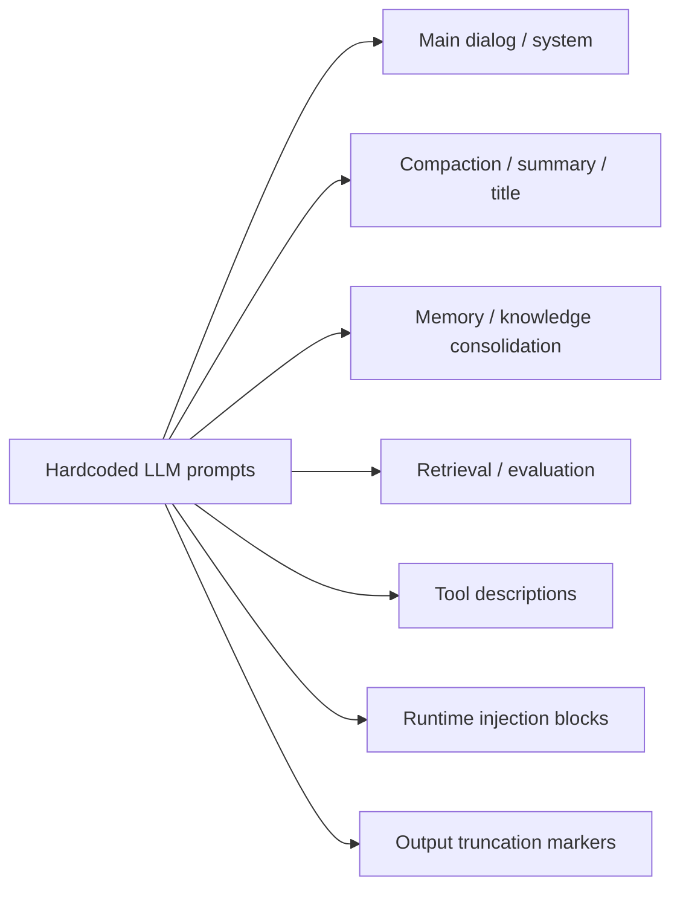

# Hardcoded LLM Prompts in the Runtime — Inventory

> **Scope**: Every LLM prompt and instructional string that is hardcoded (i.e. not loaded from a `.agent` package's `prompts/*.md`) inside `core/acowork-runtime/` and its direct dependencies `core/acowork-memory/` and `core/acowork-grafeo/`.
> **Purpose**: Help answer "why is the model seeing this text?", "what do I touch when I need to localize or version a prompt?", and "where are the leftover PII / safety risks?".
> **Out of scope**: `.agent` package `prompts/*.md` templates (loaded at runtime by `package/prompt_builder.rs`); test fixtures (e.g. the `"You are a helpful..."` string used inside `mock_provider`); log/error strings the LLM never sees.

## Overview

## 1. Centralized definitions: `core/acowork-runtime/src/prompt.rs`

The only entry point explicitly tagged as "every production prompt should live here" (see the top-of-file `//!` doc comment).

| Constant | Purpose | Caller |
| --- | --- | --- |
| `PROMPT_BUILDER_FALLBACK` | Fallback system prompt when the package has no `prompts/*.md` | `package/prompt_builder.rs` |
| `COMPACTION_SYSTEM_PROMPT` | System prompt for context compaction / episode distillation. Forces `
` + `<user_intent>` two-block output (ADR-061 §8.1) | `episode_distill.rs` |
| `SEARCH_SYSTEM_PROMPT` | System prompt for the Perplexity Sonar search backend | `tools/builtin/search_backends/perplexity.rs` |
| `COMPACT_PROMPT` | User prompt template that wraps the conversation text inside `<conversation>...</conversation>` (`{messages_text}` placeholder) | `episode_distill.rs` |
| `TITLE_PROMPT` | Prompt that produces a ≤60-character session title (`{language}` / `{user_message}` placeholders) | `episode_distill.rs::compact_session_title_with_llm` |
| `build_compaction_system_prompt()` | Helper that appends the identity context (and a "Language field" directive) to a base compaction system prompt | `episode_distill.rs` |

## 2. Context compaction & title generation (runtime call sites)

| File | Form | Notes |
| --- | --- | --- |
| `episode_distill.rs` | Indirect references to `COMPACTION_SYSTEM_PROMPT` / `COMPACT_PROMPT` / `TITLE_PROMPT` | Distillation + title LLM calls: `compact_full_context`, `compact_messages`, `distill_on_session_end`, `compact_session_title_with_llm` |
| `episode_distill.rs::format_messages` | Runtime `format!()` assembly | Emits `[System]: ... / [User]: ... / [Tool(name=…): ... / [CompactionSummary]: ...` row template — a half-hardcoded "dialog serialization" format |

## 3. Memory / knowledge consolidation (`acowork-grafeo` + `acowork-memory`)

| File | Identifier | Summary |
| --- | --- | --- |
| `core/acowork-grafeo/src/consolidation/triple_extraction.rs` | `EXTRACTION_SYSTEM_PROMPT` | "You are a knowledge extraction assistant..." — triple extraction (subject / predicate / object + confidence + sub_type), JSON output |
| `core/acowork-grafeo/src/consolidation/conflict_llm.rs` | `CONFLICT_CLASSIFICATION_PROMPT` | "You are a knowledge conflict resolver..." — conflict classification (Evolution / Correction / Ambiguous), JSON output |
| `core/acowork-grafeo/src/consolidation/generalization.rs` | `GENERALIZATION_PROMPT` | "You are a behavior pattern discovery assistant..." — behavior pattern extraction, JSON output |
| `core/acowork-grafeo/src/abstention.rs` | `AbstentionConfig::default().abstention_prompt` | `"When you are not confident about the information from memory, respond with 'I'm not sure about this'..."` |
| `core/acowork-memory/src/manager.rs` | `DEFAULT_ABSTENTION_PROMPT` | Mirror copy of the grafeo value above; serves as a single-source-of-truth fallback (its doc comment explicitly points back to grafeo) |
| `core/acowork-grafeo/src/consolidation/ambiguous.rs` | `generate_confirmation_hint()` — runtime `format!()` | `"There are N ambiguous memory conflicts that need your confirmation:\n- \"x\" vs \"y\""` |
| `core/acowork-memory/src/judge.rs` | `JudgeConfig::default()` (binds the judge prompt) | Default judge model `"qwen3:1.7b"`, `sample_rate=0.1`, `top_k=3` |
| `core/acowork-runtime/src/memory/judge_llm.rs` | Inline `format!()` | "You are a retrieval quality judge. Rate how relevant the following search results..." — 1–5 scoring |

> The `"You are a knowledge extractor."` string inside `ProviderLlmAdapter` (`memory/llm_adapter.rs`) is a **test fixture**, not on the production path.

## 4. Tool `ToolSpec.description` (model-visible "system-level" instructions)

Every LLM call carries tool schemas, whose `description` field is read by the model just like system prompt text. Path prefix `core/acowork-runtime/src/tools/builtin/` is omitted in the file column.

| Tool | File | description gist |
| --- | --- | --- |
| `shell` | `shell.rs` | "Execute a shell command..." |
| `file_read` | `file_read.rs` | Insists on pre-locating line ranges via `content_search`, ≤400 lines/call |
| `file_write` | `file_write.rs` | `overwrite` / `append` mode notes |
| `file_edit` | `file_edit.rs` | "exact match / CRLF / byte-by-byte" |
| `content_search` | `content_search.rs` | "use `include` glob + focused regex", capped at 1000 hits |
| `glob_search` | `glob_search.rs` | Single-line glob pattern notes |
| `http_request` | `http_request.rs` | GET / POST / PUT / DELETE + auto JSON parsing + network permission required |
| `web_search` | `web_search.rs` | Tavily / Brave / Firecrawl / SearXNG with auto fallback |
| `web_fetch` | `web_fetch.rs` | URL fetch + HTML stripping |
| `doc_reader` | `doc_reader/mod.rs` | PDF / DOCX / PPTX / XLSX + plain text |
| `rag_query` | `rag_query.rs` | Enterprise knowledge-base RAG deep query |
| `memory_recall` | `memory_recall.rs` | Long-term memory search (keyword / time-only / both) |
| `memory_store` | `memory_store.rs` | 5 `category` values + 6 autobiographical `aspect` values, usage guide |
| `context_retrieve` / `context_abandon` | `context_*.rs` | Proactive context retrieval / abandonment |
| `todo_write` | `todo_write.rs` | "Only one todo list per session — replace or merge" |
| `mcp_install` / `mcp_uninstall` | `mcp_*.rs` | Install flow / local-only uninstall |
| `intent_send` | `intent_send.rs` | Cross-Agent Intent routing + permission requirement |
| `ask_user_question` | `ask_user_question.rs` | "Do NOT use for simple yes/no" |
| `codebase` | `codebase.rs` | LSP 5-action overview |

> The 8 search backends in `tools/builtin/search_backends/mod.rs` (Tavily / Brave / Serper / Perplexity / Exa / Google CSE / Firecrawl / SearXNG) each also carry a one-line `description`. They read more like configuration metadata than instructions, so they are not enumerated individually.

## 5. Runtime-assembled system-prompt blocks

`core/acowork-runtime/src/agent/context.rs`, in `ContextBuilder::build()`. Per ADR-060 the prompt is split into cache-friendly sections (Block A / B / C / D); only the **Block A** sections are listed here (Block B is conversation history, Block C is the todo snapshot, Block D is the current user message). All section header strings are hardcoded:

| Injection point | Template fragment |
| --- | --- |
| Identity section | `\n\n## User Identity\n{identity}\n\nReply in the language specified by the Language field above.` |
| Memory section | `\n\n## Relevant Memories\n{memory}` |
| Abstention section | `\n\n## Memory Abstention Guidance\n{prompt}` |
| Skill section | `\n\n## Skill Instructions\n{skills}` |
| Workspace prompt file section | `\n\n## Workspace Prompt File\n{prompt_file}` |
| Environment section (default) | `## Environment\n- Operating System: {os}\n- Architecture: {arch}\n- Shell: {shell}\n- Available Shell Tools: {tools}` (`detect_environment_text()`, memoized in `OnceLock`) |
| Block C — Todo snapshot (User role) | `## Todo Task List\nThis is your todo task list. If any task status needs updating, use the \`todo_write\` tool to update it. If nothing needs updating, do nothing.\n\n{todos}` |

## 6. Output truncation markers

`core/acowork-runtime/src/tools/output.rs`. These are "text the LLM will read" but they live at the tool-output layer, so they are listed separately:

| Constant | Purpose |
| --- | --- |
| `TRUNCATED_LINE_MARKER` | `"...[truncated]"` appended when a single line exceeds 10 KB |
| `TRUNCATED_OUTPUT_MARKER` | Appended when an entire output exceeds 128 KB, with a "re-run with more targeted parameters" hint |

## Summary

- **Real system / user prompt constants**: 5 in `prompt.rs` + 4 in downstream grafeo / memory (`const PROMPT: &str`).
- **Runtime-assembled instructional fragments**: 7 `## Section` injection block templates in `context.rs` + `[Role]: ...` row template in `episode_distill.rs`.
- **Model-visible "instructional text"**: 22 built-in tools' `ToolSpec.description`.
- **Not strictly prompts, but the model sees them**: the 2 truncation markers in `output.rs`.

## Maintenance notes

- Any newly added hardcoded prompt **must** first be declared as a `const` in `prompt.rs` (or an equivalent centralized location in its crate), then referenced from the call site.
- Tool description changes count as prompt changes — they alter model behavior and must follow the same review process as system prompts.
- Changes to template placeholders (`{messages_text}` / `{language}` / `{user_message}` / `{identity}` / `{memory}` / ...) must be cross-checked against every call site. New placeholders should be registered in the doc comments of `prompt.rs`.